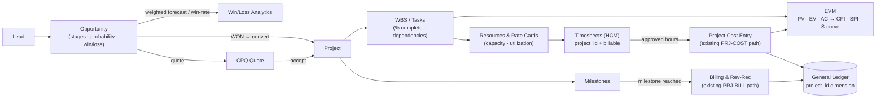

# 19 — Project Management (PPM) — In-Depth Design & Roadmap

> **Date:** 2026-06-29 · **Status:** v1.0 — **P0–P4 DELIVERED** (backend + docs; see §11 status) · **Owner:** ERP / Product
> **Scope:** Take the ERP's project capability from *project accounting* to a full **operational
> Project & Portfolio Management (PPM)** experience — work breakdown, milestones, resourcing,
> timesheet-driven labor, schedule/Gantt/EVM — and a **Salesforce-style opportunity pipeline with
> win/loss rates** whose won deals convert into projects. Built as an **operational layer on top of
> the existing, proven accounting + CRM spine** — extend, do not duplicate.
> **Decision recorded:** Deliver as **independently-shippable, doc-synced phases** (P0→P4); each
> phase carries its own migration, module change, permissions/SoD, RCM control, narrative,
> user-manual, UAT, and cutover-harness coverage per the CLAUDE.md documentation-sync policy.

---

## 0. Read this first — the problem in one paragraph

We already have a working **project-accounting** module (costing → WIP → billing → revenue
recognition, with GL postings and SOX controls) and a working **CRM pipeline** (leads →
opportunities → win/lost with win-rate forecasting). What we *don't* have is the operational
middle: no tasks/WBS, no milestones, no resource plan, no link from employee timesheets to project
labor, no schedule/Gantt/earned-value, and — critically — **no connective tissue**: projects point
at a free-text customer name with no link to the won opportunity or the customer master, and the
two opportunity tables in the codebase are decoupled. "In depth" = build the operational layer and
wire the spine together, not a greenfield rewrite.

---

## 1. Current state (baseline — what already exists)

| Capability | Where | Status |
|---|---|---|
| Project create (TM/Fixed), cost→WIP, billing, rev-rec, WIP relief | `apps/api/src/modules/projects/` · `database/schema/projects.ts` (`projects`, `project_entries`) | ✅ Working |
| GL postings `PRJ-COST` / `PRJ-BILL`, WIP 1260 / applied 2390 / COGS 5800 / AR 1100 / rev 4200 | `projects.service.ts` → `ledger.service.ts` | ✅ Working |
| Budget cap, variance, over-budget flag, margin/WIP roll-up | `projects.service.ts` (computed) | ✅ Working |
| `project_id` GL dimension (indexed) | `database/schema/ledger.ts` `journalLines.project_id` | ✅ Working |
| Controls PROJ-01/02/03, SoD R07; narrative; harness | RCM `compliance/build_rcm.py` · `docs/process-narratives/16-project-accounting.md` · `tools/cutover/src/projects.ts` | ✅ Working |
| CRM pipeline: leads → opportunities (6-stage prospecting→qualification→proposal→negotiation→won/lost), `lostReason`, `closedAt`, weighted forecast + **win_rate** | `apps/api/src/modules/crm-pipeline/` · `GET /api/crm/pipeline/summary` | ✅ Working |
| Win-rate trend reporting | `apps/api/src/modules/bi/bi.service.ts` `pipeline_trend` (`win_rate_pct`) | ✅ Working |
| Customer master | `database/schema/customer-master.ts` (`customer_no`) | ✅ Working |
| CPQ quotes → accept posts AR/revenue | `apps/api/src/modules/cpq/` | ⚠️ Binds the **dormant** `pipeline.ts` `opportunities` table, not `crmOpportunities` |

### The five gaps this roadmap closes
1. **No WBS / tasks / milestones / schedule** — projects are flat cost buckets.
2. **No resource plan / rate cards / capacity** — cost entries are manual `qty × rate`.
3. **Timesheets are disconnected** — HCM `timesheets` (`database/schema/hcm.ts`) have **no
   `project_id`**; project labor must be re-keyed via `POST /api/projects/:code/cost`.
4. **Projects ↔ customers/opportunities not linked** — `projects.customer_name` is free text; no FK
   to `customer_master`, no link to the won opportunity; win/loss never drives project creation.
5. **Two opportunity sources of truth** — `crmOpportunities` (live, has win/loss) vs `pipeline.ts`
   `opportunities` (dormant, but what CPQ binds to).

---

## 2. Target architecture

Existing modules (`projects`, `crm-pipeline`, `customer-master`, `cpq`, `ledger`, `bi`, HCM) are the
spine; new tables/endpoints attach to them. All financial flows continue to route through the
**existing `PRJ-COST` / `PRJ-BILL` ledger paths** — the operational layer adds non-financial
structure and feeds those paths; it introduces no new GL accounts.

---

## 3. Decisions to ratify (recommended option in **bold**)

1. **Opportunity source of truth** → **Consolidate on `crmOpportunities`.** Retarget
   `cpq.quotes.opportunity_id` to it (migration + backfill) and retire the dormant `pipeline.ts`
   `opportunities` table. *Alt:* keep both and sync — rejected (drift, double win/loss math).
2. **Project ↔ customer link** → **Add `customer_no` FK (+ nullable `crm_opp_no`) to `projects`**,
   keep `customer_name` as a denormalized display field for backward compatibility (existing rows
   and the current UI keep working).
3. **Timesheet → labor** → **Add nullable `project_id` / `task_id` + `billable` to HCM
   `timesheets`**; on timesheet *approval*, post a project cost entry through the existing cost path
   using the rate card. *Alt:* a parallel project-only timesheet table — rejected (duplicates HCM).
4. **Conversion trigger** → **Explicit `POST /api/projects/from-opportunity/:oppNo`** (seeds
   customer + contract from the won opp), with optional auto-draft on CPQ quote-accept. Keeps
   project creation an authorized, audited act rather than a silent side effect.

---

## 4. Data-model additions (sketch — finalized per phase)

All new tables are tenant-scoped (`tenant_id bigint REFERENCES tenants(id)`), get RLS applied by the
standard policy loop, carry tenant-scoped business-key uniqueness, `numeric(16,2)`/`numeric(18,4)`
money, and `timestamptz` audit columns — per CLAUDE.md conventions.

| Table | Purpose | Key columns (sketch) |
|---|---|---|
| `project_tasks` | WBS / task hierarchy | `project_id` FK, `parent_id`, `wbs_code`, `name`, `status`, `planned_start/end`, `actual_start/end`, `pct_complete`, `planned_hours`, `planned_cost`, `depends_on` (list), `assignee` |
| `project_milestones` | Milestones & gates | `project_id` FK, `name`, `due_date`, `owner`, `status`, `billing_trigger` (nullable → drives `PRJ-BILL`) |
| `project_resources` | Assignment plan | `project_id` FK, `task_id` (nullable), `employee_id`/`role`, `alloc_pct`, `period_start/end` |
| `resource_rates` | Rate card | `role`/`employee_id`, `cost_rate`, `bill_rate`, `effective_from/to` |
| (EVM) | Earned value | Derived from `project_tasks` (PV, EV via `pct_complete`) + `project_entries` (AC); store periodic snapshots or compute on read → CPI/SPI/S-curve |

`projects` gains: `customer_no` (FK), `crm_opp_no` (nullable). `timesheets` gains: `project_id`,
`task_id`, `billable` (all nullable — non-project time unaffected).

---

## 5. Permissions, roles & SoD

Introduce a real PPM permission group in `packages/shared/src/permissions.ts` (today the projects
controller only piggybacks on `exec`/`planner`/`ar`):

- **Coarse:** `projects` (module toggle).
- **Sub-permissions:** `proj_setup`, `proj_task`, `proj_resource`, `proj_time`, `proj_bill` — wired
  via `PERMISSION_IMPLICATIONS`, `PERM_GROUPS`, `PERM_TO_ROUTE`, and `DEFAULT_ROLE_PERMISSIONS`.
- **New SoD pairs (`SOD_RULES`):** assign-resource / approve-cost; log-time / approve-time;
  set-budget / authorize-billing (extends existing R07 initiate-vs-approve).

---

## 6. GL / controls impact

Operational data (tasks, milestones, resources) is **non-financial → no new accounts**. Timesheet
and EVM costs flow through the existing `PRJ-COST` path; milestone billing through `PRJ-BILL`. New
RCM controls to add via `compliance/build_rcm.py` (then regenerate the xlsx — currently 77/136
controls per the build script; never hand-edit the binary):

| Control | Type | What it asserts |
|---|---|---|
| **PROJ-04** | Preventive | Time entry → project cost is **maker-checker** (approver ≠ submitter) before it posts. |
| **PROJ-05** | Preventive | Resource assignment & budget changes are **authorized** (DoA); over-allocation/over-budget blocked or flagged. |
| **PROJ-06** | Detective | **EVM / WIP reconciliation** — EV vs AC vs billed tie-out; 1260/2390 clearing reviewed at close. |
| **CRM-WL** | Preventive/Detective | Win/loss integrity (stage transitions, `lostReason` required on loss) and **opportunity→project conversion authorization**. |

---

## 7. Navigation & UI

Restructure the Planning nav group in `apps/web/src/lib/nav.ts` into a **Project Management** group
with collapsible subgroups (following the §15 IA pattern, URL-stable where possible):
**Pipeline** (opportunities, win/loss dashboard) · **Projects** (register/detail) · **Tasks &
Schedule** (board + Gantt/timeline) · **Resources** (plan, capacity/utilization) · **Billing**
(milestone billing) · **Analytics** (EVM, margin, win/loss). Pages live under
`apps/web/src/app/(internal)/projects/...` (+ a pipeline/win-loss view), reusing the existing
DataTable/dialog patterns from the current `projects/page.tsx`.

---

## 8. Phased delivery roadmap

Each phase is shippable on its own and lands **code + docs together** (narrative + RCM +
user-manual + UAT + cutover harness). Each migration uses the **next free 4-digit number** with a
journal entry, and appends the RLS loop for new tenant tables.

### P0 — Connective tissue *(highest value / lowest risk — do first)*
- `projects.customer_no` (FK) + `crm_opp_no`; keep `customer_name` denormalized.
- `POST /api/projects/from-opportunity/:oppNo` — convert a **won** opportunity to a project
  (seeds customer + contract); authorized + audited (CRM-WL).
- Retarget `cpq.quotes.opportunity_id` → `crmOpportunities`; backfill; retire dormant table.
- **Win/loss dashboard** surfacing the *existing* `crm-pipeline/summary` + BI `pipeline_trend`
  (win rate, weighted forecast, loss reasons) — no new analytics math needed.
- Docs: extend PN-16 (or new PN for pipeline→project), RCM CRM-WL, user-manual + UAT, harness case
  for conversion + idempotency + RLS.

### P1 — WBS & milestones
- `project_tasks` + `project_milestones`; CRUD + `% complete` roll-up to project; milestone →
  optional `PRJ-BILL` trigger. UI: task board + milestone list.

### P2 — Resourcing & rate cards
- `project_resources` + `resource_rates`; capacity/utilization view; rate-driven cost estimate.
- Control PROJ-05 (assignment/budget authorization, SoD).

### P3 — Timesheet → project labor
- `project_id`/`task_id`/`billable` on HCM `timesheets`; approval posts project cost via existing
  `PRJ-COST` path at rate-card cost/bill rates. Control **PROJ-04** maker-checker.

### P4 — Schedule, Gantt & EVM
- Task dependencies / critical path; PV/EV/AC → CPI/SPI; S-curve; Gantt UI; BI report types
  (`project_evm`, `crm_win_loss`) + idempotent scheduler job. Control **PROJ-06** EVM/WIP recon.

### Delivery status (as built)
| Phase | Status | PR | Migration | Control(s) | Harness ToE |
|---|---|---|---|---|---|
| **P0** Connective tissue | ✅ Delivered | #227 | 0183 | CRM-WL | `projects` (conversion: won-only, idempotent) |
| **P1** WBS & milestones | ✅ Delivered | #228 | 0184 | PROJ-02 (milestone billing) | `projects` (% roll-up, milestone bill) |
| **P2** Resourcing & rate cards | ✅ Delivered | #229 | 0185 | PROJ-05 | `projects` (rate snapshot, utilization) |
| **P3** Timesheet → project labor | ✅ Delivered | #230 | 0186 | PROJ-04 | `projects` (maker-checker → WIP) |
| **P4** Dependencies & EVM | ✅ Delivered | this PR | 0187 | PROJ-06 | `projects` (CPI/SPI/EAC, dep guard) |

**Backend + docs delivered for all five phases** (each its own PR, CI-green, doc-synced — RCM now **140
controls**).

**Front-end + analytics follow-up — ✅ delivered:**
- **Analytics backend** (PR #232): `GET /api/projects/:code/schedule` (CPM **critical path** from
  `depends_on`), `GET /api/projects/:code/evm/series` (**S-curve** baseline), `GET /api/crm/pipeline/win-loss`
  (loss reasons, by-owner win rate, monthly trend).
- **Sleek PPM web UI** (this PR): a `/projects` portfolio with clickable rows + KPI band; a `/projects/[code]`
  workspace with tabs — **Overview** (EVM cards + CPI/SPI health + S-curve), **Schedule & Gantt** (custom
  dependency-aware Gantt with critical-path highlight + WBS table + add-task/mark-done), **Milestones**
  (add/reach), **Resources** (assign), **Costs & bill**; and a `/projects/pipeline` **win/loss dashboard**
  (stage funnel, loss reasons, monthly win-rate, by-owner). Built on the existing design system
  (shadcn/Tailwind + recharts) — no new dependency. Nav item added under Planning.

**Schedulable BI report types — ✅ delivered** (PR #234): `project_evm` (portfolio earned value — every
project's CPI/SPI + totals + at-risk list) and `crm_win_loss` are registered in `modules/bi` `REPORT_TYPES`,
so finance can subscribe to them as periodic emailed reports. Read-only, idempotent.

**Roadmap complete** — every P0–P4 phase plus the analytics backend, the sleek web UI, and the BI report
types are delivered, each as its own CI-green, doc-synced PR.

---

## 9. Compliance & test strategy

- Extend `tools/cutover/src/projects.ts` per phase (and/or add a `ppm`/`pipeline` harness) — keep
  the CI gate green (`NODE_OPTIONS=--experimental-sqlite pnpm --filter @ierp/cutover ...`).
- Add a Project-Management UAT suite under `docs/uat/` (positive + negative/control cases) with a
  traceability matrix to PROJ-04/05/06 and CRM-WL.
- Every phase reconciles docs per the CLAUDE.md documentation-sync policy before it's "done".

---

## 10. Risks · assumptions · out of scope · open questions

- **Out of scope (unless requested):** multi-currency projects, document/deliverable management,
  external PM-tool (MS Project/Jira) sync, AI scheduling.
- **Assumption:** `crmOpportunities` is the canonical opportunity store (Decision §3.1).
- **Risk:** CPQ retarget + backfill touches live quote→cash; gate behind P0 harness coverage and a
  reversible migration.
- **Open questions for sign-off:** (a) auto-create draft project on CPQ accept, or explicit convert
  only? (b) Should milestone completion *auto-post* billing or only *propose* it? (c) Is HCM
  timesheet approval the single source for project labor, or do direct cost entries remain allowed?

---

## Revision history

| Version | Date | Author | Notes |
|---|---|---|---|
| 0.1 DRAFT | 2026-06-29 | ERP / Product | Initial planning-phase design & roadmap. No code yet. |
