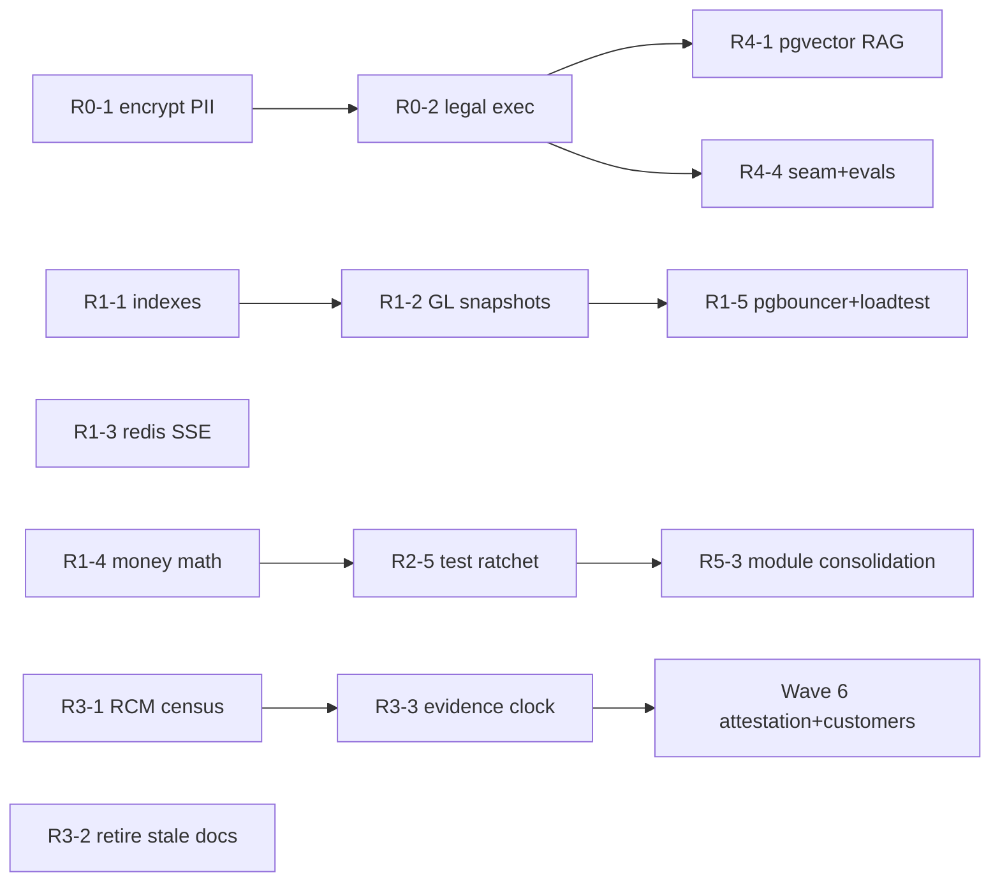

# 24 — Angel-Investor / Technical-Audit Remediation Plan

> **Date:** 2026-07-02 · **Status:** v1.0 — **PLANNING** · **Owner:** ERP / Product + Compliance + Legal
> **Scope:** Close **every** finding raised by the 2026-07 five-persona investment audit panel
> (IT architecture, PwC-style capital-markets/ICFR, legal & compliance, AI/LLM, and the chairman's
> value-investing synthesis). The audit fanned out over the live tree and produced findings with
> `file:line` evidence; this plan converts each finding into an independently-shippable, doc-synced
> PR (same delivery discipline as `docs/19`/`20`/`23`: migration *if any* + module + permissions/SoD +
> RCM control + narrative + user-manual + UAT + cutover-harness, merged only on a fully green CI matrix).
> **Decision recorded:** remediation ships in **six waves ordered by risk**, Wave 0 (legal/PDPA) and
> Wave 1 (read-path scale) before any external-tenant onboarding; organizational items (auditors,
> customers, PMO) are tracked here but are people-work, not PRs.

---

## 0. Findings register — what the panel actually found

Every remediation item below traces to one of these findings. IDs are stable; use them in PR titles
(`fix(pdpa): encrypt payroll PII [AUD-LGL-01]`).

### Severity: CRITICAL (blocks selling to any external tenant)

| ID | Finding | Evidence |
|---|---|---|
| AUD-LGL-01 | Employee Thai national IDs, bank accounts, salaries stored **plaintext** while customer tax IDs are encrypted — inconsistent PDPA posture | `apps/api/src/database/schema/payroll.ts:12,21,63` vs `customer-master.ts:16` (`encryptedText`); same gap for vendor `tax_id`/`bank_account` in `procurement.ts:23,28` |
| AUD-LGL-02 | All customer-facing legal docs are unexecuted drafts with `<<placeholders>>`; **no standalone privacy policy**; Anthropic data addendum unsigned (AI legally OFF in prod via `aiDpaBlocked()`) | `docs/legal/terms-of-service.md` (DRAFT v0.1), `data-processing-agreement.md` (DRAFT v0.2), SOC2 CC2.3 gap |
| AUD-CMP-01 | Control population does not reconcile: `build_rcm.py` = **169** controls, `CONTROL_STATUS_HONEST.md` = 154, COSO plan cites **both 66 and 153**, pre-prod audit says 57 then 68 — fails an auditor's first PBC step | `compliance/build_rcm.py` vs every narrative compliance doc |
| AUD-BIZ-01 | No proven business: one anchor tenant (Oshinei), zero external-revenue evidence, NASDAQ framing unsupported | repo-wide; `compliance/PRE_PRODUCTION_AUDIT_2026Q2.md:1` |

### Severity: HIGH (falls over under enterprise load / first prod fire)

| ID | Finding | Evidence |
|---|---|---|
| AUD-ARC-01 | ~40 schema files define tables with **zero indexes** (~100+ tables); RLS puts a `tenant_id` predicate on every query → seq-scans that degrade non-linearly | e.g. `schema/marketing.ts` (15 tables/0 idx), `bom.ts` (9/0), `pos-scale.ts` (7/0), `governance.ts`, `payments-depth.ts`, `peripherals.ts`, `crm.ts`, `bi.ts`; 210 index defs across 373 `pgTable`s |
| AUD-ARC-02 | GL has **no balance snapshots** — TB/P&L/BS/cash-flow aggregate the full `journal_lines` table on every request | `ledger.service.ts:549` (trialBalance), `:583`, `:643`, `:672`, `:735` |
| AUD-ARC-03 | SSE realtime buses are in-memory/single-node — on 2+ replicas, live KDS/BI events silently drop for clients on the other node | `modules/pos-scale/realtime.service.ts:10-12`, `modules/bi/bi-live.service.ts` (rxjs `Subject` + ring buffer) |
| AUD-ARC-04 | **Float equality on money**: `balanced: totalDebit === totalCredit` after `round4()` on postgres-numeric strings — latent silent-corruption bug in the ledger | `ledger.service.ts:578` and sibling `round4/n()` sites |
| AUD-ARC-05 | No unit tests (`0 *.spec.ts`; 8 `*.test.ts`), API tsconfig disables `noUncheckedIndexedAccess`, pervasive `as any` (e.g. `const db = this.db as any` throughout `ledger.service.ts`) | `apps/api/tsconfig.json`; `apps/api/test/` |

### Severity: MEDIUM (security residuals + ops)

| ID | Finding | Evidence |
|---|---|---|
| AUD-SEC-01 | Login lockout **fails open** on store failure — per-account brute-force protection (ITGC-AC-07) silently disables during a DB blip; only the per-IP edge limiter remains | `modules/auth/login-attempt.store.ts:24,52` |
| AUD-SEC-02 | Fine-grained `permissions` trusted from the JWT claim, not re-resolved — per-user override revocation lags up to access-token TTL (1h) | `common/guards.ts:135`, `auth.module.ts:41` |
| AUD-SEC-03 | Seeded `admin/admin123` well-known credential (mitigated by `mustChangePassword`) — must be provably unable to reach prod | `apps/api/src/database/seed.ts:52-55` |
| AUD-SEC-04 | `allow_sod_override` lets a `users`-permission holder bypass the SoD conflict check without a persisted reason or UAR surfacing | `admin-users.controller.ts:14-15` |
| AUD-SEC-05 | Cookie/token lifetime inconsistency (JWT 1h vs cookie 12h vs "8h" comment) — cosmetic but confusing | `auth.module.ts:41`, `common/cookies.ts:11` |
| AUD-ARC-06 | DB pool 20/process, no external pooler; load test pinned ~400 rps at pool saturation; pgbouncer noted as "ops follow-up" | `database.module.ts:51,63` |
| AUD-ARC-07 | BI scheduler has no internal trigger — `runDue` fires only from the request path / external cron; undocumented single point of "who calls this" | `bi.service.ts:137` |
| AUD-ARC-08 | Grandfathered duplicate/unjournaled migrations (`0085/0088/0104/0105`) mean a fresh-DB rebuild can diverge from prod | `apps/api/drizzle/`, CI `migrations-journaled` `GRANDFATHERED_DUP` |

### Severity: MEDIUM (compliance / documentation integrity)

| ID | Finding | Evidence |
|---|---|---|
| AUD-CMP-02 | Stale internal docs assert as-current defects that are now false ("RLS not implemented", "no MFA", "no billing") — a diligence reviewer reading `docs/09` reaches the opposite conclusion from `compliance/` | `docs/09-worldclass-roadmap.md:207-208,231,320-353` |
| AUD-CMP-03 | Zero external attestation and no operating-evidence window: SOC 2 / ISO 27001 / PCI all v0.1 drafts, no auditor engaged, no control has ≥1 quarter of retained evidence | `compliance/soc2-readiness.md`, `iso27001-gap-analysis.md`, `pci-dss-scope-design.md` |
| AUD-CMP-04 | Remaining "Partial" controls are entity-level governance nobody has operated (ELC-01 ethics campaign, ELC-02 audit committee, ELC-04 whistleblower); no SOX PMO / CISO / CFO sign-off evidenced | `compliance/CONTROL_STATUS_HONEST.md:74-83` |
| AUD-LGL-03 | DSAR/erasure machinery is member/loyalty-centric — does **not** cover employees, whose data is the worst-protected (see AUD-LGL-01) | `modules/pdpa/` (`memberConsents`, `pdpaErasures`) |

### Severity: LOW / opportunity (AI differentiation)

| ID | Finding | Evidence |
|---|---|---|
| AUD-AI-01 | RAG "embeddings" are hashed bag-of-words (lexical, not semantic); pgvector named as the drop-in upgrade but not built | `modules/ai/embedder.ts`, `knowledge.service.ts` |
| AUD-AI-02 | Anomaly detector is a z-score with a **known dimensional bug deliberately preserved for parity** (recent-*sum* vs per-*day* baseline) | `modules/analytics/anomalies.service.ts` |
| AUD-AI-03 | Forecasting has no seasonality/holiday/promo awareness (parity-locked flat 30-day mean; demand-ml capped at weekly seasonal-naive) — Thai calendar (Songkran, etc.) will defeat it | `forecasting.service.ts` (locked), `demand-ml/forecast-algorithms.ts` |
| AUD-AI-04 | Single-provider hard dependency (Anthropic only), no abstraction seam; evals are guardrail-level, not a scored task benchmark | `common/ai-models.ts`, `tools/cutover/src/ai-eval.ts` |
| AUD-ARC-09 | Web app is ~89% `'use client'` (229/258 files); RSC benefits forfeited, fetch concentrated in a 667-line `app-shell.tsx` | `apps/web/src/components/app-shell.tsx` |
| AUD-ARC-10 | Module sprawl duplication surface: 7 POS modules, 8 loyalty modules, `crm`+`crm-pipeline`+`pipeline`, `tax`+`tax-docs`+`tax-reports`, `payments`+`payments-depth` | `apps/api/src/modules/` (122 modules) |

**Panel positives to preserve (do NOT regress while remediating):** DB-enforced RLS that fails closed
(`tenant-tx.interceptor.ts:71-99`), `numeric(18,4)` money typing (576 columns, zero floats),
DB-trigger GL immutability (`0165_gl_immutability.sql`) + hash-chained audit log, SKIP-LOCKED job
queue, the governed AI agent (SoD-gated writes, PII redaction, token budgets, CI-gated evals), and the
~90-harness CI matrix.

---

## Wave 0 — Legal / PDPA emergencies 🔴 (target: ≤ 60 days; blocks ANY external tenant)

### R0-1 · Encrypt employee & vendor PII at rest — closes AUD-LGL-01 ⭐ do first — **DELIVERED 2026-07-02**
> Shipped smaller than planned (better): the `encryptedText` legacy-plaintext passthrough means **no DDL
> migration** and no blind index were needed (no value-based lookups exist on these columns — the two SQL
> aggregations that keyed on them, PND1A and ghost-vendor, were rewritten to group decrypted values in app
> code). Delivered: `schema/payroll.ts` + `schema/procurement.ts` encrypted columns, `payroll.service.ts
> pnd1a` + `controls.service.ts scan` rewrites, idempotent `db:backfill:pii` script (also clears the
> customer_master backfill debt), at-rest ToE in `hcm`/`ext` harnesses, RCM ITGC-AC-19 updated (xlsx
> regenerated, still 169), narratives 05/02 + manuals 08/03 + UAT-PAY-037/UAT-P2P-066 + traceability +
> `docs/ops/pii-encryption-rollout.md` v0.2. The PDPA DSAR employee-subject extension moves to a follow-up
> piece (tracked as part of AUD-LGL-03).
*The one-sprint fix with the largest legal-exposure reduction. The `encryptedText` column type
(AES-256-GCM via `common/crypto.ts` `APP_ENC_KEY`) already exists and is proven on
`customer-master.ts:16` — this is adoption, not invention.*

- **Schema:** switch to `encryptedText(...)` for `payroll.employees.national_id`, `bank_account`
  (and re-review `monthly_salary` — keep numeric but confirm RLS + permission gating; salary is
  personal data but must stay aggregatable for payroll runs), and `procurement` vendor
  `tax_id` / `bank_account`.
- **Migration `0211_encrypt_pii_payroll_vendor.sql`** (use the **next free** number at merge time —
  re-check; sequence is at `0210` as of this writing): widen columns if needed, then an idempotent
  data-migration DO-block that encrypts existing plaintext rows in place (skip rows already carrying
  the ciphertext prefix — mirror how the customer `tax_id` backfill worked). Hand-append the RLS loop
  is **not** needed (existing tables), but journal the migration (`meta/_journal.json`, sequential
  `idx`, ascending `when`).
- **Read/report paths:** payroll slips, bank-file export (must decrypt at the export boundary only),
  vendor payment files, WHT certificates (`tax-docs`) — grep every consumer of the four columns and
  route through the decrypting column type; masked (`x-xxxx-xxxxx-xx-x`) everywhere except the
  payment-file/state-filing exports.
- **Search impact:** any lookup **by** national-id/bank-account switches to a deterministic
  blind-index column (HMAC-SHA256 keyed by `APP_ENC_KEY`), same pattern as any existing encrypted
  lookup; add the index in the same migration.
- **PDPA scope extension (closes AUD-LGL-03):** extend `modules/pdpa` DSAR types to the **employee**
  data subject (access/rectification/erasure/portability over `payroll` rows), reusing the
  redact-then-read-mask design that already reconciles erasure with the immutable audit chain.
- **Controls & docs (RCM impact):** new ITGC control **ITGC-DP-xx** "field-level encryption of
  sensitive personal data (citizen ID, bank account) with key management via `APP_ENC_KEY`" in
  `build_rcm.py` → regenerate the xlsx (`python3 compliance/build_rcm.py`); ToE check in
  `tools/cutover/src/compliance.ts` (insert employee → assert ciphertext at rest via raw SQL, masked
  via API, decrypted only in bank-file export). Doc-sync: PN (payroll + procurement narratives),
  user-manual payroll/vendor pages (masked display), UAT positive/negative cases, revision histories.
- **Acceptance:** raw `SELECT national_id FROM employees` returns ciphertext on a seeded DB; payroll
  bank export still round-trips; `pdpa` + `compliance` + `basics` harnesses green; a DSAR erasure for
  an employee completes within the 30-day SLA machinery.

### R0-2 · Execute the legal framework — closes AUD-LGL-02 (legal + doc PR, code toggle at the end)
- Fill every `<<placeholder>>` in `docs/legal/terms-of-service.md` (entity = Invisible Consulting
  Co., Ltd., governing law/jurisdiction = Thailand, liability cap = 12-month fees as already
  drafted, trial length) and `data-processing-agreement.md`; author the missing **standalone privacy
  policy** (`docs/legal/privacy-policy.md`, TH + EN) covering PDPA lawful bases, retention, DSAR
  channel, sub-processors (Alibaba Cloud, Stripe, **Anthropic**, Sentry).
- **Counsel review + execution is a tracked organizational task** — the repo deliverable is the
  final texts, version-stamped `v1.0 EXECUTED <date>` in each doc's revision table, and the SOC2
  CC2.3 gap flipped in `compliance/soc2-readiness.md`.
- **Anthropic data addendum (no-training) — precondition to prod AI.** Once countersigned, set
  `AI_DPA_ACKNOWLEDGED` in prod config and record the addendum reference in
  `data-processing-agreement.md` §sub-processors. **Do not weaken `aiDpaBlocked()`** — the
  fail-closed gate is the control (and it's cited in the ToE harness).
- **Acceptance:** zero `<<` placeholders under `docs/legal/`; privacy policy linked from the web
  footer + signup flow (`apps/web` — small PR); SOC2 CC2.3 marked Implemented with evidence pointer.

### R0-3 · Seed-credential hardening — closes AUD-SEC-03
- `seed.ts`: generate a **random** initial admin password printed once to stdout (dev) or read from
  `SEED_ADMIN_PASSWORD` env; keep `mustChangePassword: true`.
- Add a guard: seeding refuses to run when `NODE_ENV=production` unless `ALLOW_PROD_SEED=1`
  **and** the target DB is empty.
- Verify (and ToE-test) that `mustChangePassword` blocks **all** API surface except the
  change-password endpoint — if it doesn't today, enforce in the auth guard.
- **Acceptance:** `pg-smoke` gate proves a `mustChangePassword` user gets 403 on `/api/ledger/*`;
  no literal `admin123` remains in the tree.

---

## Wave 1 — Engineering fires 🔥 (before onboarding tenant #2; sequential PRs, each green)

### R1-1 · Index the un-indexed 40 — closes AUD-ARC-01 ⭐ cheapest/highest-leverage — **DELIVERED 2026-07-02**
> Live introspection found the real number was **132 tables** (worse than the audit's ~40-file estimate).
> Delivered: migration `0211_tenant_indexes_backfill.sql` (uniform `(tenant_id)` btree per uncovered table,
> generated from PGlite introspection with collision-checked names, journaled idx 211) + the **`tenant-idx`
> cutover harness** in the CI matrix (re-introspects the applied migration set; fails on ANY uncovered
> table, zero grandfathers) + `docs/ops/capacity-and-pooling.md` §5b policy. Decision recorded: uniform
> plain `(tenant_id)` rather than per-table composites — composites remain per-module upgrades when a
> profiled query needs them; the guard enforces only the leading-column minimum. Schema-TS `index()` defs
> were NOT added for the backfill (drizzle-kit diffs TS-vs-snapshot, so SQL-only indexes are invisible to
> `db:generate` — no phantom DROPs); new tables should declare theirs in TS as usual.
- Sweep all 110 schema files: every tenant-scoped table gets, minimum, an index on `(tenant_id)` —
  and where an obvious hot query exists, the composite the query wants
  (`(tenant_id, created_at)`, `(tenant_id, status)`, `(tenant_id, <fk>)`). Priority order:
  `pos-scale.ts`, `marketing.ts`, `bom.ts`, `crm.ts`, `bi.ts`, `governance.ts`,
  `payments-depth.ts`, `peripherals.ts`, then the rest of the zero-index list.
- One migration (`0212_tenant_indexes_backfill.sql`, next-free discipline) using
  `CREATE INDEX IF NOT EXISTS` (plain, **not** CONCURRENTLY — prod window is small at current scale;
  revisit if a large tenant lands first) + matching `index()` defs in the Drizzle schema files so
  `db:generate` stays in sync with the baseline.
- Add a **CI guard** (extend the migrations-journaled job or a new `tools/ci/check-indexes.mjs`):
  fail when a `pgTable` with a `tenant_id` column defines no index containing `tenant_id`.
  Grandfather nothing — the migration fixes the backlog in the same PR.
- **Acceptance:** guard green with zero grandfathers; `EXPLAIN` on a seeded PGlite/pg shows index
  scans for the top-5 previously-seq-scanning queries; full harness matrix green.
- Doc-sync: `docs/ops/` note + this plan's checklist; no narrative/UAT impact (no behavior change) —
  state that explicitly in the PR.

### R1-2 · GL period-balance snapshots — closes AUD-ARC-02 (the big one; own PR, heavy harness)
*TB/P&L/BS/SCF must stop scanning all `journal_lines` per request.*

- **New table `gl_period_balances`** (`tenant_id, ledger_id, fiscal_period_id, account_code,
  currency, debit numeric(18,4), credit numeric(18,4)`, PK on the natural key, RLS loop appended) —
  migration `0213_gl_period_balances.sql`.
- **Maintenance strategy — incremental, transactional:** update the snapshot row **in the same
  transaction** as `approveEntry` (posting is the only balance-changing event — Draft JEs are
  excluded from balances today, GL-05, and Posted JEs are DB-immutably frozen, `0165`, so the
  snapshot cannot drift from a mutation we don't see). `UPSERT … ON CONFLICT DO UPDATE SET
  debit = debit + excluded.debit …`. Backfill the table in the migration from existing
  `journal_lines`.
- **Read-path rewrite:** `trialBalance`/`incomeStatement`/`balanceSheet`/`cashFlowStatement`/
  `cashFlowDirect` read closed periods from the snapshot and **only the open period** from
  `journal_lines` (bounded scan), summing the two. `closeYear`/`close.service.ts` verifies snapshot
  vs raw-ledger equality as a **new detective control GL-2x "snapshot reconciliation at close"**
  before locking (belt-and-braces against any missed path), raising `GL_SNAPSHOT_DRIFT` on mismatch.
- **Parity discipline:** the `basics`/`worldclass` harness GL assertions (TB `debit`/`credit`/
  `balance` semantics per CLAUDE.md) must pass **unchanged** — the snapshot is an optimization, not
  a semantic change. Add harness checks: post → snapshot delta correct; close → reconciliation
  control fires on an induced drift.
- **RCM/doc-sync:** new control in `build_rcm.py` (+ regenerate xlsx), GL narrative + Mermaid,
  ToE in `compliance.ts`, UAT case, `docs/18-finance-gl-blueprint.md` addendum.
- **Acceptance:** TB on a seeded ledger with the open period returns byte-identical JSON to the
  pre-change implementation (golden-file compare in the harness); `EXPLAIN` shows no full
  `journal_lines` scan for a closed-period TB.

### R1-3 · Redis-backed realtime fan-out — closes AUD-ARC-03
- Introduce `REALTIME_REDIS_URL` (unset ⇒ current in-memory `Subject`, keeps CI/PGlite and
  single-node deploys zero-dependency). When set, `bi-live.service.ts` and
  `pos-scale/realtime.service.ts` publish/subscribe via Redis pub/sub (`ioredis`), tenant-prefixed
  channels, the local ring buffer fed from the subscription so `recent()` semantics survive.
- Extract the shared bus into `common/realtime-bus.ts` so both services (and the `docs/23` action
  center) ride one implementation instead of two copies (also chips at AUD-ARC-10).
- Ops: Railway Redis add-on; document the two-replica test in `docs/deployment/`.
- **Acceptance:** a 2-process integration test (harness spawns two Nest apps against one Redis)
  proves an event published on node A reaches an SSE client on node B; no-Redis mode still passes
  the existing `pos-scale`/BI harness checks.

### R1-4 · Money math: kill float equality — closes AUD-ARC-04
- `ledger.service.ts:578` and every `round4/n()` comparison site: compare/sum in **integer
  minor-units** (scale-4 → `BigInt` of `numeric * 10^4`, parsed from the pg string **without** a
  float hop) or push the sum into SQL (`SUM(debit)::numeric`) and compare the returned strings.
  Provide `common/money.ts` (`toMinor4(s: string): bigint`, `eqMoney`, `addMoney`) and sweep the
  ledger + finance + projects services for float arithmetic on numeric-string columns.
- While in the file: replace the `const db = this.db as any` hatch with the typed Drizzle instance
  (chips at AUD-ARC-05 where touched; full `as any` sweep is R2-5).
- **Acceptance:** a unit test (see R2-5) proving the classic failure (`0.1 + 0.2` style imbalance at
  scale 4) is rejected pre-fix and balanced post-fix; `basics` GL harness green unchanged.

### R1-5 · Connection pooling + scheduler trigger (ops) — closes AUD-ARC-06, AUD-ARC-07
- Deploy **pgbouncer** (transaction mode) in front of Postgres on Railway; document pool math
  (replicas × `DB_POOL` ≤ pgbouncer pool) in `docs/deployment/`; re-run
  `tools/cutover/src/loadtest.ts` and update `docs/security/…-load-test-report.md` with the new
  ceiling. Wire the load test as a **manual-dispatch CI job** (not a gate) so the number stays fresh.
- BI scheduler: document + provision the external cron (Railway cron hitting the `runDue` endpoint
  with a service token) in `docs/deployment/`; add a `jobs` heartbeat check so a silent cron death
  is alertable (ties into R2-1 alerting).

---

## Wave 2 — Security residuals 🛡 (one PR each, small)

### R2-1 · Lockout fail-open observability — closes AUD-SEC-01
Keep the deliberate fail-open (availability of login > lockout) but make it **loud**: increment an
OTel counter + `pino` error with a dedicated event code on every swallowed store failure in
`login-attempt.store.ts`; alert rule documented in `docs/ops/`. Confirm prod env uses production
edge-limiter values (`AUTH_MAX=30/min` — the load-test override must not leak). ToE: harness kills
the table, asserts the metric increments and login still works. Document the residual in
`compliance/CONTROL_STATUS_HONEST.md` (ITGC-AC-07 note).

### R2-2 · Live permission re-resolution — closes AUD-SEC-02
In `guards.ts`, the role is already re-derived live (`dbRole`); extend the same lookup to per-user
permission **overrides** (they live on the same user row — zero extra queries) so a narrowed
override takes effect immediately, not at token expiry. Fallback: if the lookup fails, keep the JWT
claim (fail-functional, matches current role behavior). Document `revokeAllSessions` as the
immediate-revocation runbook step in `docs/user-manual/` admin guide + ITGC narrative.

### R2-3 · SoD-override governance — closes AUD-SEC-04
`allow_sod_override` requires a non-empty `sod_reason` (400 `SOD_REASON_REQUIRED` otherwise),
persists it to the audit log, and is itself permission-gated (new fine-grained `sod_override`
permission in `packages/shared/src/permissions.ts`, granted to Admin only by default). Surface all
overrides in the quarterly UAR export (`compliance` harness asserts the row appears). RCM: strengthen
the ITGC-AC user-admin control text; regenerate xlsx.

### R2-4 · Cookie/TTL coherence — closes AUD-SEC-05
Single source of truth: cookie `Max-Age` derives from the JWT TTL constant; fix the stale "8h"
comment. No behavior change beyond alignment.

### R2-5 · Test depth + TS strictness ratchet — closes AUD-ARC-05 (rolling, not one PR)
- Re-enable `noUncheckedIndexedAccess` in `apps/api/tsconfig.json`; fix fallout module-by-module
  (start with `ledger`, `finance`, `projects` — the money paths), using per-file `// @ts-expect-error`
  only as a tracked, lint-counted escape hatch.
- Stand up a **unit-test lane** next to the harnesses: `common/money.ts` (R1-4), `pii-redact`
  (exists), `crypto`, `tax`, `doc-number`, snapshot math (R1-2), guards permission-merge logic
  (R2-2). Raise the vitest coverage gate's curated-file list as each lands — ratchet, never lower.
- `as any` budget: add an ESLint rule counting `as any` per module with a committed baseline file;
  CI fails on increase (same ratchet philosophy as coverage).

---

## Wave 3 — Compliance & documentation integrity 📋 (parallel with Wave 1; mostly docs)

### R3-1 · Reconcile the control population to ONE number — closes AUD-CMP-01 ⭐ do this month
- `compliance/build_rcm.py` is the **only** source of truth. Emit a machine-readable census
  (`build_rcm.py --counts` → JSON: total + per-cycle + per-status) alongside the xlsx.
- Sweep and correct every stale count: `CONTROL_STATUS_HONEST.md` (154→actual),
  `COSO_ICFR_Audit_Readiness_Plan.md` (**both** the 66 and 153 citations), `soc2-readiness.md`,
  `iso27001-gap-analysis.md`, `pci-dss-scope-design.md`, `PRE_PRODUCTION_AUDIT_2026Q2.md` (annotate
  historical counts as "as-of <date> snapshot" rather than silently rewriting an audit record).
- **CI guard:** `tools/ci/check-rcm-census.mjs` greps the compliance docs for control-count claims
  (a tagged pattern, e.g. `<!-- rcm-count -->169<!-- /rcm-count -->`) and fails on mismatch with
  `--counts`. Counts can never drift again.
- Bump every touched doc's revision history. Regenerate the xlsx once at the end.

### R3-2 · Retire stale/contradictory docs — closes AUD-CMP-02
Prepend a dated banner to `docs/09-worldclass-roadmap.md` (and audit `docs/10`–`12` for the same
disease): `> **SUPERSEDED (2026-07-02):** §§X–Y describe the pre-remediation state; RLS
(0002_rls.sql), MFA/TOTP, SSO, billing, RAG, evals, PII redaction have since shipped — see
docs/24 §0 and compliance/CONTROL_STATUS_HONEST.md for current state.` Do **not** delete —
the honest history is a diligence asset; the lie-by-staleness is the liability.

### R3-3 · Start the evidence clock + engage attestation — closes AUD-CMP-03 (org + light code)
- **SOC 2 Type I first** (design-only): engage the auditor; repo work = evidence-pointer columns in
  `soc2-readiness.md` mapping each CC to its ToE harness check ID + retained-artifact location.
- **Evidence retention:** make the CI harness runs *retained evidence* — persist each `compliance`
  harness run's structured output (control ID → pass/fail → timestamp) as a build artifact with a
  ≥15-month retention policy, and export a quarterly roll-up job (rides the BI scheduler rail).
  The "≥1 quarter of operating evidence" window **starts when this merges** — every month of delay
  moves the Q1-2027 ICFR assertion right.
- ISO 27001 / PCI stay v0.x roadmaps — resequenced **after** SOC 2 Type I; note that in each doc.

### R3-4 · Entity-level controls — closes AUD-CMP-04 (people-work; repo tracks evidence only)
Stand up the whistleblower channel (ELC-04 — the system already captures evidence; operate it),
run the ethics-acknowledgement campaign (ELC-01), constitute the audit committee (ELC-02), and name
the SOX PMO owner + security officer. Repo deliverable: `compliance/policies/` gains the charter +
campaign evidence pointers; `CONTROL_STATUS_HONEST.md` flips each Partial with dated evidence.

---

## Wave 4 — AI differentiation upgrades 🤖 (after Wave 0's addendum unblocks prod AI)

### R4-1 · Semantic RAG: pgvector + real embeddings — closes AUD-AI-01 ⭐ highest-leverage AI item
- Migration `02xx_kb_pgvector.sql`: `CREATE EXTENSION IF NOT EXISTS vector`, `embedding vector(1024)`
  column + HNSW index on the KB chunks table (RLS already applies).
- `EMBED_PROVIDER=voyage|hash`: wire a real embedding API behind the existing pluggable seam
  (`embedder.ts` was designed for this); hash mode stays the CI/no-key fallback. Re-embed on
  document upsert; batch backfill job on the jobs queue.
- Keep **cite-or-refuse** and re-tune `KB_MIN_SCORE` for cosine-on-real-vectors; extend the `rag`
  harness with a semantic-recall case (synonym query that lexical hashing fails today — assert it
  fails in hash mode, passes in vector mode against a recorded fixture).
- PDPA note: KB content is tenant business docs — redaction rules already applied at agent boundary;
  embedding API falls under the Anthropic-addendum-style sub-processor review (add the embedding
  vendor to the DPA sub-processor register — ties to R0-2).

### R4-2 · Fix the anomaly detector's dimensional bug behind a flag — closes AUD-AI-02
Add the corrected per-day-baseline math as the default; keep the buggy path only behind
`ANOMALY_PARITY_MODE=legacy` for the parity harness (never silently "fix" parity-locked behavior —
CLAUDE.md debug mantra #4). Update the `analytics` parity harness to pin the legacy flag; new
`basics` check asserts the corrected math on a crafted series. Docs: analytics narrative + UAT.

### R4-3 · Thai-calendar seasonality for demand — closes AUD-AI-03
Extend `demand-ml/forecast-algorithms.ts` (NOT the parity-locked `forecasting.service.ts`) with:
(a) Croston-SBA variant, (b) a day-of-week × holiday regressor using a Thai holiday table
(`0xxx_th_holidays.sql`, seeded — Songkran, New Year, royal holidays), applied as multiplicative
factors learned in the same walk-forward backtest. Auto-select stays WAPE-based, so the new models
must **win on backtest** to be chosen — measured, not asserted. Harness: `demand-ml` gains a
holiday-spike fixture the flat models lose on.

### R4-4 · Provider seam + scored evals — closes AUD-AI-04
- Thin `LlmClient` interface over the Anthropic SDK call-sites (`agent`, `doc-ai`, `nl-analytics`,
  `ai-config`, `copilot`, `insights` all route through it) — not a second provider *yet*, just the
  seam + a fake for tests.
- Evolve `ai-eval.ts` from guardrails-only to a **scored task benchmark**: N seeded-DB tasks with
  expected structured outcomes, score = exact-match/tolerance, tracked release-over-release in the
  retained-evidence artifact (R3-3). Budget-gate stays.

### R4-5 · Honest labeling sweep — closes the "stop calling statistics ML" note
One docs PR: `docs/06-ai-integration.md` + user-manual + any pitch-adjacent doc consistently say
"classical statistical forecasting with walk-forward backtesting (SMA/SES/Holt/seasonal-naive/
Croston)" and "governed AI copilot," never "machine learning" for the stats layer. Cheap; protects
credibility in the next diligence pass.

---

## Wave 5 — Architecture hygiene 🧹 (rolling; behind everything above)

- **R5-1 (AUD-ARC-08):** un-grandfather the migration debt — fold `0085/0088` manual patches into a
  verified idempotent migration, prove fresh-DB == prod schema with a CI job that builds both and
  diffs `pg_dump --schema-only` (extends `docs/ops/drizzle-migration-debt.md` plan). Then delete the
  `GRANDFATHERED_DUP` list.
- **R5-2 (AUD-ARC-09):** web perf pass — convert the top-5 heaviest pages' data loading to server
  components/route handlers (start `accounting/page.tsx`, `eam/page.tsx`, split `app-shell.tsx`);
  measure with the existing Playwright e2e + a Lighthouse budget in CI (report-only first).
- **R5-3 (AUD-ARC-10):** module-boundary consolidation RFC — one owning module per domain
  (POS×7→facade, loyalty×8→core+plugins, crm/pipeline merge, tax trio, payments pair). RFC first,
  then mechanical moves; **no behavior change**, harness matrix is the safety net (which is why
  R2-5's test depth lands first).

---

## Wave 6 — Business & organization 🏢 (not PRs; tracked so the plan is complete — closes AUD-BIZ-01)

1. **Three paying non-affiliated tenants** on the shipped billing stack (Stripe webhooks +
   `plan.guard.ts` + self-serve signup are built — the blocker is sales, not code). Instrument
   `saas-metrics.service.ts` MRR/ARR as the board metric.
2. **Price the AI unit economics:** measure real tenant token burn (the `ai_token_usage` table
   already meters it) against plan tiers before scaling AI marketing.
3. **Drop NASDAQ language** from active docs until revenue exists (R3-1 annotates
   `PRE_PRODUCTION_AUDIT_2026Q2.md` as a historical snapshot); reframe as "Thai hospitality SME ERP,
   attestation-track" — the defensible story the panel endorsed.
4. **Hire/name:** SOX PMO owner, security officer, CFO sign-off cadence (feeds R3-4).

---

## Sequencing & dependency graph

**First four PRs, in order:** R0-1 (PII) → R1-1 (indexes) → R3-1+R3-2 (one docs PR: census + stale-doc
banners) → R1-4 (money math). Everything else follows the graph. Waves 0/1 gate external-tenant
onboarding; Wave 3's evidence clock (R3-3) should merge ASAP because the Q1-2027 ICFR date slips
day-for-day until it does.

## Definition of done (every PR in this plan)

Per the repository working agreement: code + migration (journaled, next-free number) + RCM update in
`build_rcm.py` with regenerated xlsx (when a control changes) + ToE in
`tools/cutover/src/compliance.ts` + narrative/Mermaid + user-manual + UAT + revision-history bumps —
merged only on a fully green CI matrix, and if a change has no doc impact, the PR says so explicitly.

## Revision history

| Version | Date | Author | Changes |
|---|---|---|---|
| 1.0 | 2026-07-02 | ERP/Product | Initial remediation plan from the 2026-07 five-persona investment-audit findings (26 findings registered; 6 waves; R0-1/R1-1/R3-1/R1-4 sequenced first) |
| 1.1 | 2026-07-02 | ERP/Product | R0-1 delivered (employee/vendor PII encrypted at rest; decision recorded: passthrough → no migration/blind index; DSAR-for-employees deferred to the AUD-LGL-03 piece) |
| 1.2 | 2026-07-02 | ERP/Product | R1-1 delivered (0211 backfills 132 tenant indexes; `tenant-idx` CI guard added; real count 132 vs audit's ~40-file estimate) |
