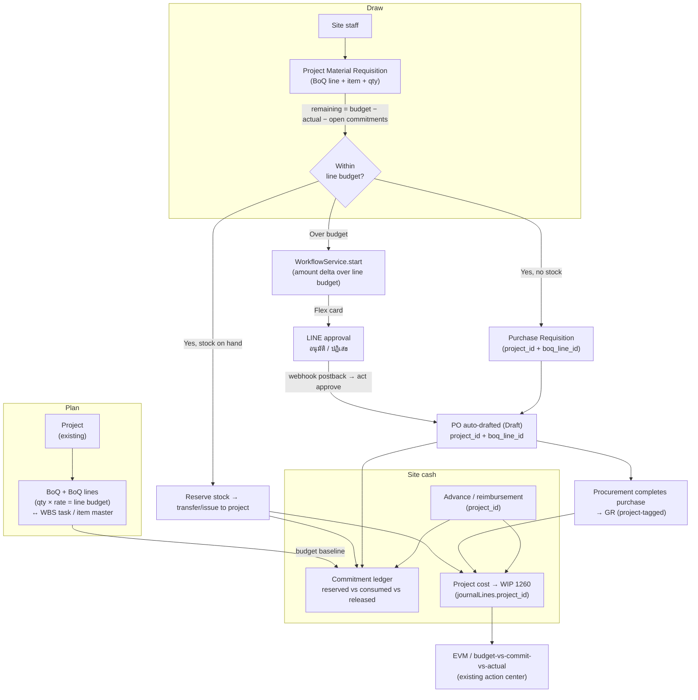

# 32 — Project Material Control: BoQ, Commitment Budget & Requisition-to-Purchase — Design & Roadmap

> **Date:** 2026-07-03 · **Status:** v0.5 — **M0–M3 DELIVERED**; M4 planned · **Owner:** ERP / Product
> **Scope:** Give the PPM suite a **construction/contractor-grade material control loop** on top of the
> existing project spine: a **Bill of Quantities (BoQ)** as the project's requirement & budget baseline;
> a **material budget** enforced by **commitment/encumbrance** accounting (staff cannot draw more than the
> BoQ line allows); **inventory linked to the project** via a request→reserve→transfer-to-project flow that
> costs stock into project WIP; an **over-budget escalation** that pushes a one-tap **LINE** approval to the
> authorised person and, on approval, **auto-drafts a PO** for procurement to buy; and **advances &
> reimbursements managed against the project**. Built as an **operational layer on the proven inventory +
> procurement + approval + LINE + PPM spine — extend, do not duplicate.**
> **Decision recorded:** Deliver as **independently-shippable, doc-synced phases** (M0→M4); each phase
> carries its own migration, module change, permissions/SoD, RCM control, narrative, user-manual, UAT, and
> cutover-harness coverage per the CLAUDE.md documentation-sync policy, and merges only on a green CI matrix.

---

## 0. Read this first — the problem in one paragraph

We already own every heavy subsystem this needs: a rich **PPM module** (`modules/projects` — WBS, budget
cap, change orders, EVM, cost→WIP GL), a full **P2P** chain (`modules/procurement` — PR → approve → PO →
GR → 3-way match → AP, plus RFQ/sourcing), a **valued inventory** sub-ledger (`modules/inventory` +
`stock-ops` — moving-average/FIFO, GL-integrated, location transfer), a **generic approval engine**
(`modules/workflow` — amount thresholds, SoD, escalation), and a **production LINE integration**
(`modules/messaging` — Messaging API push/Flex, signature-verified inbound webhook, one-tap
`อนุมัติ/ปฏิเสธ` approval cards that post back into the approval engine). What we *don't* have is the
**connective tissue for project material control**: there is **no BoQ** concept anywhere; **procurement and
inventory carry no `project_id`** so nothing can be committed/received against a project; the project budget
is a **single scalar** with **no commitment accounting**, so a limit can only be *observed*, never
*enforced*; there is **no reservation** and **no material-requisition-to-project** workflow (stock issue and
transfer are direct-execution only); and **advances/reimbursements** exist but none is project-tagged. "In
depth" = wire the spine together and add the four missing tables (BoQ, commitment ledger, material
requisition, reservation) — not a greenfield rewrite.

---

## 1. Current state (baseline — what already exists)

| Capability | Where | Status |
|---|---|---|
| Project create (TM/Fixed/POC), WBS tasks, milestones, `budget_amount` cap, change orders, EVM, cost→WIP (GL 1260) | `apps/api/src/modules/projects/` · `database/schema/projects.ts` | ✅ Working |
| `project_id` GL dimension (indexed) on journal lines | `database/schema/ledger.ts` `journalLines.project_id`; `postEntry` `JournalLineDto` accepts `project_id`/`cost_center` | ✅ Working — **key hook** |
| Full P2P: PR → approve → PO → GR → 3-way match → AP; RFQ/sourcing; supplier price lists | `modules/procurement/` (`createPr`, `createPo` `:458`, `createGr`), `modules/sourcing/`, `modules/match/` | ✅ Working |
| PO `Draft` state exists in enum, excluded from spend/commitment aggregates | `database/schema/procurement.ts` `poStatusEnum` (`createPo` currently opens as `Pending`) | ✅ Available — **reuse for auto-draft** |
| Valued inventory sub-ledger (moving-avg + FIFO/FEFO), GL-integrated | `modules/inventory/inventory-ledger.service.ts` (`receive`/`issue`/`transferIfTracked` `:400`) | ✅ Working |
| Location→location transfer & goods-issue (direct execution) | `modules/stock-ops/stock-ops.service.ts` (`transfer` `:144`, `goodsIssue` `:122`) | ✅ Working |
| Generic approval engine: multi-step, **amount threshold**, SoD/maker-checker, SLA/escalation, delegation | `modules/workflow/workflow.service.ts` (`start`/`act`), `sod.service.ts` | ✅ Working — **key hook** |
| LINE Messaging API: push/broadcast/Flex, per-tenant tokens, signature-verified webhook, one-tap approve/reject Flex cards → approval engine | `modules/messaging/` (`line-notify.service.ts` `buildApproveCard`, `line-webhook.controller.ts`, `gateways.ts`) | ✅ Working — **key hook** |
| GL/cost-center/month budgeting + budget-vs-actual | `modules/budget/budget.service.ts` (`budgetVsActual` `:91`), `database/schema/budgets.ts` | ✅ Working (not project-dimensioned) |
| Advances (EXP-07), petty cash (EXP-08), ESS reimbursement claims | `modules/finance/` (`issueAdvance`/`settleAdvance`), `modules/petty-cash/`, `modules/ess/` | ✅ Working (none project-tagged) |
| Controls PROJ-01..11, EXP-01..10, INV-01..12; PN-16; harness `tools/cutover/src/projects.ts` (114 checks) | `compliance/build_rcm.py` (≈169 controls) · `docs/process-narratives/16-project-accounting.md` | ✅ Working |

### The five gaps this roadmap closes
1. **No Bill of Quantities** — no measured-works / rate-schedule / requirement line item; a project can hold
   a scalar `budget_amount` but not an itemised material requirement to track against.
2. **No project dimension on procurement or inventory** — `purchase_requests`/`pr_items`,
   `purchase_orders`/`po_items`, `goods_receipts`, and stock moves carry **no `project_id`/`boq_line_id`**,
   so material can neither be committed nor received against a project/BoQ line.
3. **No commitment / encumbrance accounting** — budget control is a computed variance on *actual* cost only;
   two staff can each pass the check and jointly blow the budget. "Cannot exceed the limit" is not
   *enforceable* without reserving open commitments against the BoQ line.
4. **No material-requisition-to-project workflow & no reservation** — `goodsIssue`/`transfer` are
   direct-execution; there is no request→approve→reserve→issue-to-project document, and no stock
   reservation/ATP table to allocate on-hand stock to a project.
5. **Advances/reimbursements not project-linked** — all three expense entities lack a `project_id` column,
   so project spend outside material (site cash, staff reimbursements) never lands on the project.

---

## 2. Target architecture

Existing modules (`projects`, `procurement`, `inventory`/`stock-ops`, `workflow`, `messaging`,
`petty-cash`/`finance`/`ess`, `ledger`, `bi`) are the spine; the plan adds **four new tables** (BoQ,
commitment ledger, material requisition, reservation) and **project-dimension columns** on existing
procurement/inventory/expense entities. All financial flows continue to route through the **existing GL
paths** using the `journalLines.project_id` dimension — the layer adds structure and enforcement, and
introduces **no new GL accounts** (WIP 1260 / applied 2390 / inventory 1200 / COGS 5000/5800 as today).

---

## 3. Decisions to ratify (recommended option in **bold**)

1. **BoQ modelling** → **Dedicated `project_boq` + `project_boq_lines` tables, linked to the project and
   (nullably) to a WBS `task_id` and item-master `item_no`.** BoQ is measured-works with rate build-up and
   re-measurement — genuinely different from a task/WBS row. Link each material line to a WBS task so
   schedule and cost reconcile, and to `items` where the line is a stock item. *Alt:* overload
   `project_tasks` with qty/rate — rejected (conflates schedule structure with cost/quantity baseline,
   blocks re-measurement).
2. **Budget enforcement mechanism** → **Commitment/encumbrance ledger (`project_commitments`), checked at
   request time as `remaining = line_budget − actual_cost − open_commitments`.** This is the make-or-break
   decision: without reserving open commitments, the limit is advisory, not enforced. *Alt:* check actual
   cost only — rejected (concurrent requests each pass, budget blown; no encumbrance visibility).
3. **Budget granularity** → **Enforce at the BoQ line** (item/work package), roll up to the project. Keep
   the existing `projects.budget_amount` as the project-level cap (sum-of-lines reconciliation), so current
   EVM/action-center logic keeps working unchanged. *Alt:* project-scalar only — rejected (req #2 is
   per-material).
4. **Requisition → fulfilment routing** → **One `project_material_requisitions` document with a decision
   tree**: within-budget + stock on hand → **reserve & issue/transfer to project**; within-budget + no
   stock → **raise a project-tagged PR**; over-budget → **`WorkflowService.start`** (amount = the overage) →
   **LINE Flex approval** → on approve **auto-draft a project-tagged PO** (`createPo` opened as `Draft`).
   *Alt:* separate docs per path — rejected (fragments the audit trail and the budget check).
5. **Over-budget approval transport** → **Reuse `WorkflowService` + `LineNotifyService.buildApproveCard`;
   configure a `workflow_definitions` row for doc-type `PMR` with an over-budget/amount condition.** No new
   integration — the postback→`act()` path already exists. *Alt:* a bespoke notifier — rejected (duplicates
   a delivered, audited engine).
6. **Advance/reimbursement linkage** → **Add nullable `project_id` (+ optional `boq_line_id`) to
   `employee_advances`, `expense_claims`, `expense_requests`, and pass it through the existing `postEntry`
   line dimensions.** Optionally register the amount as a project commitment so site cash respects the same
   budget. Lowest-risk, high-value. *Alt:* a project-only expense table — rejected (duplicates three
   working flows).

---

## 4. Data-model additions (sketch — finalized per phase)

All new tables are tenant-scoped (`tenant_id bigint REFERENCES tenants(id)`), get RLS applied by the
standard policy loop (**copy `0232`'s org-clause body**, not the plain form — see CLAUDE.md tenancy note),
carry tenant-scoped business-key uniqueness, `numeric(16,2)`/`numeric(18,4)` money/qty, and `timestamptz`
audit columns — per CLAUDE.md conventions.

| Table | Purpose | Key columns (sketch) |
|---|---|---|
| `project_boq` | BoQ header per project (version, status draft/approved/locked) | `project_id` FK, `boq_no`, `version`, `status`, `approved_by`, `approved_at` |
| `project_boq_lines` | Measured-works / requirement lines | `boq_id` FK, `line_no`, `wbs_code`/`task_id` (nullable), `item_no` (nullable FK → `items`), `description`, `uom`, `budget_qty` `numeric(18,4)`, `rate` `numeric(16,2)`, `budget_amount` (= qty×rate), `category` (material/labor/subcon/other), `remeasured_qty` (nullable) |
| `project_commitments` | Encumbrance ledger (the enforcement engine) | `project_id` FK, `boq_line_id` FK, `source_doc_type` (PMR/PR/PO/ADV/REIMB), `source_doc_no`, `qty`, `amount`, `status` (open/consumed/released), `posted_at` |
| `project_material_requisitions` + `pmr_lines` | Request-to-draw material against the BoQ | header: `project_id`, `pmr_no`, `requested_by`, `status` (draft/pending/approved/rejected/fulfilled), `route` (issue/pr/po); lines: `boq_line_id`, `item_no`, `qty`, `est_cost`, `over_budget` (bool) |
| `stock_reservations` | Soft allocation of on-hand stock to a project | `item_no`, `location_id`, `project_id`, `boq_line_id`, `source_doc` (PMR), `qty_reserved`, `status` (held/released/consumed) |

Existing tables gain **nullable** dimension columns (non-project flows unaffected):
- `purchase_requests` / `pr_items`, `purchase_orders` / `po_items`, `goods_receipts` / `gr_items`:
  `project_id`, `boq_line_id` (+ `wbs_code`).
- `employee_advances`, `expense_claims`, `expense_requests`: `project_id` (+ optional `boq_line_id`).

Available-to-commit for a BoQ line = `budget_amount − Σ(open+consumed commitments)`; available-to-issue for
an item/location = on-hand − `Σ held reservations`. Both are computed from the new ledgers on read (mirror
the existing `budgetVsActual` / `inv_balances` patterns).

---

## 5. Permissions, roles & SoD

Extend the PPM permission group in `packages/shared/src/permissions.ts` (wire via
`PERMISSION_IMPLICATIONS`, `PERM_GROUPS`, `PERM_TO_ROUTE`, `DEFAULT_ROLE_PERMISSIONS`):

- **New sub-permissions:** `proj_boq` (author/approve BoQ), `proj_matreq` (raise material requisition),
  `proj_matapprove` (authorise over-budget draw / release reservation).
- **New SoD pairs (`SOD_RULES`):** author-BoQ / approve-BoQ; raise-requisition / approve-over-budget;
  request-reservation / release-reservation. The over-budget LINE approver is enforced ≠ requester by the
  existing `WorkflowService` maker-checker (holds even through delegation).
- Procurement/inventory keep their existing keys (`pr_raise`, `procurement`, `wh_receive`); the new columns
  don't change who can act, only what dimension the act carries.

---

## 6. GL / controls impact

Material draws, receipts, advances and reimbursements flow through the **existing** GL paths carrying the
`journalLines.project_id` dimension — **no new accounts**: stock issue/transfer-to-project relieves
inventory 1200 → project WIP 1260; project-tagged GR posts inventory/AP as today with the project stamped;
POC/billing relief runs the existing `PRJ-BILL`. New RCM controls to add via `compliance/build_rcm.py` (then
regenerate the xlsx — currently ≈169 controls; never hand-edit the binary):

| Control | Type | What it asserts |
|---|---|---|
| **PROJ-12** | Preventive | **Material-budget commitment control** — a material draw/PR/PO cannot exceed the BoQ line's `budget − actual − open commitments`; the check is atomic (concurrent requests can't jointly overrun). |
| **PROJ-13** | Preventive | **Over-budget material authorisation** — an over-line-budget requisition is blocked until an authorised approver (≠ requester, SoD) approves via the workflow engine (LINE Flex or in-app); only then is the PO drafted. |
| **PROJ-14** | Preventive/Detective | **Project-costed cash** — advances/reimbursements tagged to a project post to project WIP with the `project_id` dimension and are reflected in commitment/EVM; settlement clears the advance. |
| **INV-13** | Preventive | **Reservation integrity** — stock reserved to a project is not double-allocated or issuable elsewhere; reservation releases on cancel and consumes on issue (on-hand − held reconciles). |

Narratives affected: **PN-16** (project-accounting — primary), **PN-02** (procure-to-pay — project-tagged
PR/PO), **PN-03** (inventory-COGS — reservation & issue-to-project). Update the control matrix / RCM +
`tools/cutover/src/compliance.ts` harness for each new control.

---

## 7. Navigation & UI

Extend the **Project Management** nav group (`apps/web/src/lib/nav.ts`, group `จัดการโครงการ`) and the
`/projects/[code]` workspace with material tabs (reuse the existing DataTable/dialog + recharts design
system — no new dependency):

- **BoQ** tab — line grid (qty × rate = budget, category, WBS/item link), approve/lock, re-measurement.
- **Budget & commitments** tab — per-line **budget / committed / actual / remaining** bars (extend the
  existing over-budget visualisation), open-commitment list.
- **Material requisitions** — raise a PMR against a BoQ line, live remaining-budget check, route badge
  (issue / PR / PO), and the over-budget → LINE-approval status.
- **Reservations** — held stock per item/location for the project.
- Site cash: surface project-tagged advances/reimbursements on the **Costs** tab.

The over-budget approver's experience is the **existing LINE Flex card** (`อนุมัติ/ปฏิเสธ`); no new web
surface is required for the approval itself, though it also appears in the workflow `myApprovals` inbox and
the `/projects/action-center` worklist (new `pmr_over_budget` exception kind).

---

## 8. Phased delivery roadmap

Each phase is shippable on its own and lands **code + docs together** (narrative + RCM + user-manual + UAT +
cutover harness). They share `projects.service.ts` / the migration journal, so they run **sequentially**,
one merged PR before the next starts. Each migration uses the **next free 4-digit number** (0236+ as of this
draft) with a journal entry (ascending `when`), and appends the **`0232`-form** RLS loop for new tenant
tables.

### M0 — BoQ + project-dimensioned procurement & inventory *(foundation — do first)* — ✅ DELIVERED
> Shipped: `project_boq` / `project_boq_lines` (migration 0236, tenant-scoped RLS via the canonical 0232
> org-clause loop); `POST|GET /api/projects/:code/boq`, `POST /api/projects/boq/:boqId/lines|approve|lock`,
> `POST /api/projects/boq/lines/:lineId/remeasure` (maker-checker approve syncs `projects.budget_amount` to
> the BoQ total; draft-only line guard `BOQ_NOT_DRAFT`; `BOQ_LOCKED`). Procurement PR/PO/GR gained nullable
> `project_id` (header) + `boq_line_id` (line), resolved from `project_code` (`PROJECT_NOT_FOUND`); GR inherits
> the PO's project. Docs: PN-16 steps 23–24 / rev 0.27, user-manual 14 rev 2.4 + 03, UAT-O2C-229 + traceability.
> Harness: `projects` 126 checks (was 114). **No new control** (structure only; M1 adds PROJ-12).
- `project_boq` + `project_boq_lines`; CRUD, approve/lock, re-measurement; sum-of-lines reconciliation to
  `projects.budget_amount` on approve.
- Nullable `project_id` (header) / `boq_line_id` (line) on `purchase_requests`/`pr_items`,
  `purchase_orders`/`po_items`, `goods_receipts`; threaded through `createPr`/`createPo`/`createGr`. The
  dimension is **recorded** in M0 (traceability); budget **enforcement** (commitment ledger) is M1 and
  costing material to project **WIP on issue** is M3 — M0 introduces no GL change.

### M1 — Commitment ledger + budget enforcement — ✅ DELIVERED
> Shipped: `project_commitments` encumbrance ledger (migration 0237, canonical org-clause RLS; migration 0238
> backfills the AUD-ARC-01 tenant-leading indexes on `project_boq`/`project_boq_lines`/`project_commitments`); standalone
> `CommitmentsService` (`modules/commitments`, DRIZZLE-only → no module cycle) with `reserve` (FOR UPDATE lock
> on the BoQ line + `committed ≤ budget` → `BUDGET_EXCEEDED`), `release`, `consume`, per-line `committedByLine`,
> `listForProject`. Wired into procurement `createPo` (reserve inside the PO tx → over-budget rolls the PO back),
> `cancelPo` (release), `createGr` (consume on full receipt). `getBoq` now returns per-line + total
> budget/committed/remaining; `GET /api/projects/:code/commitments` is the ledger. **Control PROJ-12** in
> `build_rcm.py` → RCM **177** (xlsx regenerated, census reconciled). Docs: PN-16 step 25 / rev 0.28,
> user-manual 14 rev 2.5, UAT-O2C-230. Harness: `projects` 135 checks (was 126).
- `project_commitments`; atomic remaining-budget check (`budget − Σ(open+consumed)`) at PO-draw time under a
  BoQ-line row-lock; reserve on PO create, release on cancel, consume on full receipt. Per-line
  budget/committed/remaining read model on `getBoq`.
- Control **PROJ-12** (commitment/budget preventive). *(Enforcement is at the project PO in M1 — the firm
  encumbrance; M2's PMR adds the request-time pre-check + the over-budget → LINE approval → PO-draft path.)*

### M2 — Project Material Requisition + over-budget LINE approval  ⭐ core of req #3 & #4 — ✅ DELIVERED
> Shipped: `project_material_requisitions` + `pmr_lines` (migration 0239, tenant-scoped RLS + tenant-leading
> indexes); new `PmrModule`/`PmrService` (`modules/pmr`, depends on Commitments/Procurement/Workflow/Messaging
> — no cycle) + `PmrController` at `/api/pmr`. `submit` checks each line vs its BoQ-line remaining budget →
> **within budget** routes to a project-tagged PR; **over budget** parks `pending` + fires `WorkflowService.start`
> and pushes a `LineNotifyService.buildApproveCard` one-tap Flex card to `procurement`/`exec`. `approve`
> (maker-checker, approver ≠ requester → `SOD_SELF_APPROVAL`; also reachable via the LINE card's postback →
> `line-webhook` `chatDecidePmr`) auto-drafts a project-tagged **Draft PO** (`createPo` `draft`+`authorized_over_budget`;
> `CommitmentsService.reserve` gains `allowOver`). New `pmr_over_budget` action-center exception (high). **Control
> PROJ-13** → RCM **178**. Docs: PN-16 step 26 / rev 0.29, user-manual 14 rev 2.6, UAT-O2C-231. Harness: `projects`
> 143 checks (was 135). **Decision (open-question a): over-budget ALWAYS routes to LINE approval** (block-with-override,
> no tolerance band) — revisit if a configurable threshold is wanted.
- `project_material_requisitions` + `pmr_lines`; decision tree (within-budget PR vs over-budget → LINE approval).
- `LineNotifyService` Flex card + webhook postback → `approve` → **auto-draft project-tagged PO** (`createPo`
  as `Draft`, authorised over budget). Control **PROJ-13**. New `pmr_over_budget` action-center exception.

### M3 — Stock reservation & issue/transfer-to-project — ✅ DELIVERED
> Shipped: `stock_reservations` (migration 0240, tenant-scoped RLS + tenant-leading index); new
> `ReservationsModule`/`ReservationsService` + `/api/reservations`. `available = on_hand(inv_balances) −
> Σ(held)`; `reserve` is atomic under a `FOR UPDATE` lock on the item+location holds (`INSUFFICIENT_STOCK` on
> over-allocation — no double-allocation); `release` frees, `issueToProject` consumes. New
> `InventoryLedgerService.issueToProject` relieves inventory at moving-avg/consumed-layer cost and posts **Dr
> 1260 project WIP (`project_id`) / Cr 1200 Inventory** (capitalised into WIP, not COGS) + books a consumed
> BoQ-line commitment. **Control INV-13** → RCM **179**. Docs: PN-16 step 27 / rev 0.30, PN-03 rev 0.4,
> user-manual 14 rev 2.7, UAT-O2C-232. Harness: `projects` 152 (was 143). *(Direct reserve→issue path; wiring
> the PMR within-budget route to prefer stock-on-hand is a fast-follow.)*
- `stock_reservations`; `available = on_hand − held`; request→issue-to-project path relieving 1200 → project
  WIP 1260 with `project_id`. Control **INV-13**.

### M4 — Project-linked advances & reimbursements *(smallest, high value)*
- `project_id` (+ optional `boq_line_id`) on `employee_advances`, `expense_claims`, `expense_requests`;
  pass through `postEntry` dimensions; optionally register as project commitments. Control **PROJ-14**.

### Delivery status (planned)
| Phase | Status | Migration | Control(s) | Harness ToE |
|---|---|---|---|---|
| **M0** BoQ + project-dim P2P/inventory | ✅ Delivered | 0236 | (structure; maker-checker BoQ approve) | `projects` 126 (BoQ draft→approve→lock→remeasure, budget sync, SoD; project-tagged PR persists `project_id`+`boq_line_id`) |
| **M1** Commitment ledger + enforcement | ✅ Delivered | 0237 | PROJ-12 | `projects` 135 (PO encumbers line; over-budget → BUDGET_EXCEEDED + PO rolled back; cancel releases; remaining calc) |
| **M2** Material requisition + LINE approval | ✅ Delivered | 0239 | PROJ-13 | `projects` 143 (within→PR; over→pending+action-center; self-approve→SoD; authorise→Draft PO + line remaining −2500) |
| **M3** Reservation + issue-to-project | ✅ Delivered | 0240 | INV-13 | `projects` 152 (available=on_hand−held; over→INSUFFICIENT_STOCK; issue→1260 WIP +1500/1200 −1500; release restores) |
| **M4** Project-linked advances/reimbursement | ⬜ Planned | next free | PROJ-14 | `basics` (project-tagged advance/reimbursement → WIP) |

---

## 9. Compliance & test strategy

- Extend `tools/cutover/src/projects.ts` (currently 114 checks) and the `basics` finance/GL harness per
  phase — `basics` is the primary gate for AR/AP/GL/inventory work, so BoQ-tagged PR/PO/GR → WIP and
  advance/reimbursement postings belong there. Keep both CI gates green
  (`NODE_OPTIONS=--experimental-sqlite pnpm --filter @ierp/cutover projects|basics|compliance`).
- Add UAT cases under `docs/uat/` (next id **UAT-O2C-228+**) with positive + negative/control cases —
  especially the **atomic overrun block** (two concurrent within-budget requests must not jointly overrun),
  the **over-budget → LINE approval → PO draft** path, and **reservation double-allocation** — and keep the
  traceability matrix in sync (map to PROJ-12/13/14, INV-13).
- Reflect each new control in `tools/cutover/src/compliance.ts` and regenerate the RCM xlsx
  (`python3 compliance/build_rcm.py` from repo root; take *ours* on the binary, then regenerate).
- Every phase reconciles docs per the CLAUDE.md documentation-sync policy before it's "done".

---

## 10. Risks · assumptions · out of scope · open questions

- **Risk — commitment atomicity.** The enforcement guarantee (req #2) depends on the remaining-budget check
  and commitment insert being **atomic under concurrency** (row-lock the BoQ line or a conditional insert;
  mirror the gapless-doc-number allocation pattern). Prove it in the harness with a concurrent-overrun case,
  or the limit silently leaks.
- **Risk — PO open state.** `createPo` currently opens `Pending` (straight into approval); the auto-draft
  path must open **`Draft`** (already excluded from spend/commitment aggregates) so procurement reviews
  before committing — confirm the draft→pending transition and that commitments count drafts correctly.
- **Risk — LINE deliverability.** The over-budget approval assumes the approver's `users.line_user_id` is
  linked; fall back to the in-app `myApprovals` inbox + action-center so an unlinked approver still clears
  the queue (the Flex card is a convenience channel, not the sole gate).
- **Out of scope (unless requested):** external BoQ/estimating-tool import (Excel takeoff import could be a
  fast-follow), subcontractor progress-claim certification, retention accounting, multi-currency BoQ,
  measurement-book photo evidence.
- **Assumptions:** BoQ line is the budget unit of control; WIP 1260 remains the project cost sink; the
  existing `workflow`/`messaging` engines are the approval + LINE transport (no new infra).
- **Open questions for sign-off:** (a) Should the BoQ line budget be a **hard block** or a **block-with-
  override** (over-budget always routes to LINE approval — recommended) for *every* over-line draw, or only
  above a configurable tolerance? (b) Do advances/reimbursements **consume BoQ line budget** (count as
  commitments) or only tag the project for reporting? (c) On PMR approval, **auto-draft the PO** immediately,
  or propose it for procurement to confirm? (d) Is re-measurement (actual vs BoQ qty) in scope for M0 or a
  fast-follow?

---

## Revision history

| Version | Date | Author | Notes |
|---|---|---|---|
| 0.5 | 2026-07-03 | ERP / Product | **M3 delivered** — stock reservation → issue-to-project (`stock_reservations`, migration 0240) + `ReservationsModule`/`/api/reservations`: `available = on_hand − Σ(held)` with an atomic `FOR UPDATE` reserve (`INSUFFICIENT_STOCK`, no double-allocation), `release`/`issueToProject`; new `InventoryLedgerService.issueToProject` posts **Dr 1260 project WIP (`project_id`) / Cr 1200** + a consumed BoQ-line commitment. Control **INV-13** (RCM 179, xlsx regenerated + census reconciled). Docs-synced (PN-16 rev 0.30, PN-03 rev 0.4, user-manual 14 rev 2.7, UAT-O2C-232). `projects` harness 152; basics/compliance/tenant-idx/migration-parity/stock-ops/wms/ts-debt/typecheck green. |
| 0.4 | 2026-07-03 | ERP / Product | **M2 delivered** — Project Material Requisition (`project_material_requisitions`/`pmr_lines`, migration 0239) + `PmrModule`/`PmrService`/`/api/pmr`: within-budget → project-tagged PR; over-budget → maker-checker + one-tap **LINE** approval (`buildApproveCard`; `chatDecidePmr` webhook route) → auto-drafted authorised over-budget project **Draft PO** (`createPo` `draft`+`authorized_over_budget`; `reserve` `allowOver`). `pmr_over_budget` action-center exception. Control **PROJ-13** (RCM 178, xlsx regenerated + census reconciled). Docs-synced (PN-16 rev 0.29, user-manual 14 rev 2.6, UAT-O2C-231). `projects` harness 143; basics/compliance/tenant-idx/migration-parity/ts-debt/typecheck green. **Decision:** over-budget always routes to approval (no tolerance band). |
| 0.3 | 2026-07-03 | ERP / Product | **M1 delivered** — `project_commitments` encumbrance ledger (migration 0237) + `CommitmentsService` (reserve under a BoQ-line FOR UPDATE lock → `BUDGET_EXCEEDED`; release on PO cancel; consume on full receipt) wired into procurement; per-line budget/committed/remaining on `getBoq`; `GET :code/commitments`. Control **PROJ-12** (RCM 177, xlsx regenerated + census reconciled). Docs-synced (PN-16 rev 0.28, user-manual 14 rev 2.5, UAT-O2C-230). `projects` harness 135; basics/compliance/migration-parity/ts-debt/typecheck green. |
| 0.2 | 2026-07-03 | ERP / Product | **M0 delivered** — BoQ (`project_boq`/`project_boq_lines`, migration 0236) with maker-checker approve→budget-sync, lock, re-measurement; nullable project dimension (`project_id`/`boq_line_id`) on PR/PO/GR. Docs-synced (PN-16 rev 0.27, user-manual 14 rev 2.4 + 03, UAT-O2C-229). `projects` harness 126 checks; `basics`/`compliance` regression-clean; typecheck + API/web build green. No new control (structure only). |
| 0.1 DRAFT | 2026-07-03 | ERP / Product | Initial planning-phase design & roadmap for project material control — BoQ, commitment-budget enforcement, requisition-to-purchase with LINE over-budget approval, reservation/issue-to-project, and project-linked advances/reimbursements. Built on the existing inventory/procurement/workflow/messaging/PPM spine. No code yet. |
