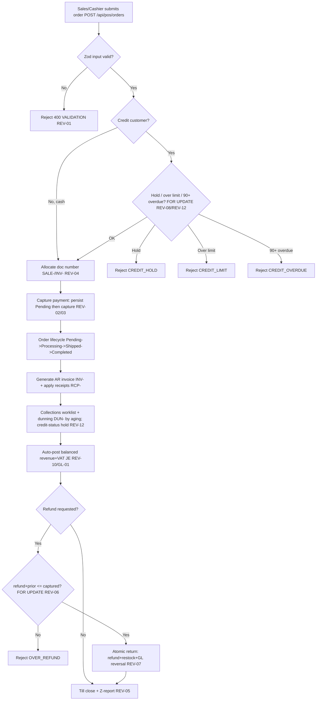

# Order-to-Cash (Revenue / Accounts Receivable) — Process Narrative

## 1. Document control

| Field | Value |
|---|---|
| Process ID | PN-01-O2C |
| Process owner | `<<Revenue / Controller>>` |
| Approver | `<<CFO>>` |
| Version | **0.1 DRAFT** |
| Effective date | `<<effective-date>>` |
| Review cadence | Annual + on significant change |
| Related RCM controls | REV-01, REV-02, REV-03, REV-04, REV-05, REV-06, REV-07, REV-08, REV-09, REV-10, REV-11, REV-12, REV-14, REV-15, REV-17, REV-18, REV-21, REV-23, GL-01, GL-05; SoD R07, R08, R09, R10, R12 |
| Related policy | `compliance/policies/03-delegation-of-authority.md`, `compliance/policies/11-financial-close-policy.md` |

## 2. Purpose

To define and control the end-to-end revenue cycle — from order/sale capture through invoicing, cash/credit settlement, refunds, and posting to the general ledger — so that revenue and accounts receivable are **valid, complete, accurate, properly cut off, and authorized**, and so that all cash collected is recorded.

## 3. Scope

**In scope:** POS sales (`POST /api/pos/orders`), customer-portal self-service POS (`POST /api/portal/pos/sales`), order lifecycle (Pending → Processing → Shipped → Completed), AR invoice generation (INV-), AR receipts (RCP-), payment capture (`/api/payments`, PAY-), refunds (REF-), credit-limit / credit-hold control, **AR collections & dunning (DUN-)**, and the automatic sales-to-GL posting.

**Out of scope:** Till cash reconciliation and PSP settlement mechanics (see `07-cash-treasury.md`), inventory decrement and COGS (see `03-inventory-cogs.md`), VAT/e-Tax mechanics (see `06-tax-compliance.md`).

## 4. References

- ISO 9001:2015 cl. 4.4 (process approach), cl. 8.2 (requirements for products/services), cl. 8.6 (release), cl. 8.7 (nonconforming outputs).
- `compliance/Oshinei_ERP_SOX_RCM_v1.xlsx` — REV-01..11, GL-01.
- `compliance/policies/03-delegation-of-authority.md` (credit and refund authority), `11-financial-close-policy.md` (revenue cutoff).
- Code: `apps/api/src/modules/pos/pos.service.ts`, `apps/api/src/modules/payments/payments.service.ts`, `apps/api/src/modules/returns/returns.service.ts`, `apps/api/src/modules/ledger/ledger.service.ts`, `apps/api/src/common/doc-number.service.ts`.

## 5. Definitions & abbreviations

| Term | Meaning |
|---|---|
| AR | Accounts Receivable |
| Credit hold | Tenant/customer flag (`creditHold`) that blocks new credit orders |
| Credit limit | Maximum outstanding AR permitted for a customer (`creditLimit`) |
| INV- / RCP- / PAY- / REF- / SALE- / SO- / DUN- | Atomic document-number prefixes (invoice / receipt / payment / refund / sale / sales order / dunning action) |
| Dunning | Escalating reminder ladder on overdue AR: reminder → first_notice → second_notice → final_notice → legal |
| Collections worklist | Open AR with aging, current dunning stage and the next recommended rung (`GET /api/finance/ar/collections`) |
| PSP | Payment Service Provider (card/e-wallet gateway) |
| Z-report | End-of-shift till reconciliation report |

## 6. Roles & responsibilities (RACI)

Single-duty roles enforce SoD: the role that **records** a sale (Cashier / Sales) is never the role that **approves a refund or reconciles the till** (PosSupervisor) per rule **R08**, and is never the role that maintains **credit master** (CreditManager, R09) or **prices** (PricingManager, R10).

| Activity | Cashier / Sales | CreditManager | PricingManager | ArClerk | PosSupervisor | ReturnsClerk | FinancialController |
|---|---|---|---|---|---|---|---|
| Maintain customer credit limit / hold | I | **A/R** | I | C | I | I | C |
| Maintain price lists / promotions | I | I | **A/R** | I | I | I | C |
| Capture sale / order | **A/R** | I | I | I | C | I | I |
| Credit-limit / credit-hold check | (system) | C | I | I | I | I | I |
| Capture payment / tender | **A/R** | I | I | I | I | I | I |
| Generate AR invoice (INV-) | R | I | I | **A/R** | I | I | I |
| Apply AR receipt (RCP-) | I | I | I | **A/R** | I | I | C |
| Approve / process refund (REF-) | I | I | I | I | **A/R** | C | I |
| Process return + restock | I | I | I | I | C | **A/R** | I |
| Work collections / dunning (DUN-) | I | C | I | **A/R** | I | I | C |
| Review sales-to-GL posting | I | I | I | C | I | I | **A/R** |

## 7. Process narrative

1. **Master-data prerequisites.** CreditManager maintains the customer credit limit / credit-hold flag; PricingManager maintains price lists and promotions. SoD separates these from order entry (**R09**, **R10**). Changes are captured in `audit_log` (**ITGC-AC-10**).
2. **Order / sale capture.** Sales or Cashier submits `POST /api/pos/orders`. Inputs are validated by Zod schema (qty > 0, price ≥ 0, amount > 0) with a standardized error envelope — invalid payloads are rejected with `400` (**REV-01**).
2a. **Age-restricted sale gate (decision point — docs/52 Phase 3c).** An item may carry a statutory **minimum buyer age** (`items.min_age`, 0 = unrestricted; Thailand alcohol/tobacco = 20). When a retail sale (`createSale` — `POST /api/pos/sales` + `/api/portal/pos/sales`) contains an age-restricted item, the sale is **refused until the buyer's age is verified — before anything is persisted**: the request must carry either a **`customer_birthdate`** proving the buyer meets the highest `min_age` in the cart (under → `400 AGE_BELOW_MINIMUM`) or the cashier's **`age_ack`** attestation that they checked ID; absent both → `400 AGE_VERIFICATION_REQUIRED`. The sale stamps **`cust_pos_sales.age_verified`** as the audit trail that a restricted sale passed the check. The register **confirms + retries** on `AGE_VERIFICATION_REQUIRED` (a native ID-check prompt, then re-posts with `age_ack`). A cart with no restricted item is unaffected (`age_verified` stays false, no gate) — byte-identical. A statutory sale gate keyed on the item master; **no GL change, no new numbered control**. Migration `0446`; harness `pos-age`.
3. **Credit control (decision point).** For credit customers the service takes a tenant-row lock (`SELECT ... FOR UPDATE`) before reading outstanding AR, so concurrent orders for the same customer serialize. If `creditHold` is set → reject `CREDIT_HOLD`; if `outstanding AR + order > creditLimit` → reject `CREDIT_LIMIT` (**REV-08**); and — unified with the collections hold (step 9) — if the customer has any invoice **90+ days past due** they are in default and rejected `CREDIT_OVERDUE` even within their limit (**REV-12**; the 90-day threshold is single-sourced in `collections.service.ts` so the order gate and the collections `on_hold` decision never drift). This gate runs identically for **internal POS** and **portal/self-service** order entry (both `POST /api/pos/orders`, Customer role pinned to its own tenant). Cash sales bypass credit control.
4. **Document numbering.** A gapless, per-type document number (SALE-/SO-/INV-) is allocated atomically via upsert-returning on `doc_counters` — no `COUNT(*)+1` race, no duplicate or skipped numbers (**REV-04**).
5. **Payment capture.** Tender is recorded via `/api/payments`. The payment row is persisted **Pending before** the gateway capture and flipped to **Failed** on error, so captured funds can never be unrecorded (**REV-03**). A repeated `idempotency_key` returns the original tender, backed by a unique index, preventing double charges (**REV-02**). For card/e-wallet, PSP webhooks are HMAC-SHA256 verified over the raw body, fail-closed in production, with out-of-band status re-verification (**REV-09**) — see `07-cash-treasury.md`. The gateway is selectable per tender (`gateway`): `mock` (default), `promptpay` (a real scannable EMVCo QR), `stripe`, and **`opn`** (Opn / Omise — Thailand's PSP aggregator, so a single integration covers cards plus Thai e-wallets (TrueMoney / Rabbit LINE Pay / ShopeePay) and cross-border tourist wallets (Alipay+ / WeChat Pay)); `stripe`/`opn` activate when their secret-key env (`STRIPE_SECRET_KEY` / `OPN_SECRET_KEY`) is set and otherwise fall back to `mock`. Card tenders capture synchronously; wallet/QR tenders return **Pending** and settle via webhook (`PATCH /api/payments/:no/settle`), so funds are never booked before they move.
6. **Order lifecycle.** Order status transitions Pending → Processing → Shipped → Completed; each transition is recorded in `doc_status_log`. Fulfilment decrements stock under lock (see `03-inventory-cogs.md`, **INV-01**).
7. **AR invoice sync.** On acceptance/fulfilment an AR invoice (INV-) is generated and synced to the AR subledger by ArClerk; sequence integrity per **REV-04**.
8. **AR receipt application.** Cash receipts (RCP-) are applied against open invoices by ArClerk, reducing outstanding AR (**Dr 1000 Cash / Cr 1100 AR**). A receipt accepts an optional `idempotency_key`; a retried request (a second HTTP call after a timeout) with the same key returns the original receipt and collects the cash **once** — no double receipt and no double-counted `paid_amount` (migration 0068). Subledger-to-GL agreement is monitored monthly (**REC-01**, see `04-general-ledger-close.md`). A per-customer **statement of account** (`GET /api/finance/ar/statement?tenant_id=&from=&to=`) lists an **opening balance** struck before the window, every invoice (charge) and receipt (payment) in date order with a **running balance**, and a **closing balance** — the document sent to a customer to confirm what they owe. The statement is **multi-currency**: each invoice/receipt keeps its own currency + booked fx rate; by default it reports in **base THB** (each converted at its rate), and `?currency=USD` restricts it to that currency's documents in their own units (**REV-12**).
8e. **AR cash application — multi-invoice / on-account / credit-note lines (decision point — REV-21).** One customer payment rarely equals one invoice, so ArClerk works a **cash-application worksheet** (`/finance` → รายรับ (AR) → ตัดรับชำระหลายใบแจ้งหนี้; `POST /api/finance/ar/cash-application`): pick the customer, load their **open items** (`GET /api/finance/ar/open-items?customer_no=` — open invoices with balances *including pending-committed amounts*, unapplied receipts, applicable credit notes), optionally **auto-suggest** the allocation (`GET /api/finance/ar/cash-application/suggest` — deterministic: an **exact single-invoice match** on the amount wins, else **oldest-due-first** with a partial last line), then post **one receipt across many invoices** (partial allowed). Guards are fail-closed: Σ applications ≤ the receipt (`APPLY_EXCEEDS_RECEIPT`), an invoice's open balance can never be overshot **including pending applications** (`OVER_APPLIED`), another customer's invoice is rejected (`CUSTOMER_MISMATCH`). The **unapplied remainder parks on-account** — tracked per receipt (`ar_receipts.unapplied_amount`) and on GL **2220 Unapplied Customer Receipts** — and is applied later via `POST /api/finance/ar/apply-on-account` (guard `INSUFFICIENT_UNAPPLIED`, counting pending draws). **GL:** the receipt keeps the existing semantics with the on-account leg on 2220 — **Dr 1000 Cash (full) / Cr 1100 AR (applied) / Cr 2220 (remainder)**; a later (or approved-parked) application posts **Dr 2220 / Cr 1100** (source `AR-APPLY`). **Threshold maker-checker (mirrors REV-16):** a cash-application batch **≥ THB 100,000** parks `PendingApproval` — the cash banks fully on-account and **no invoice moves** — until a **different** user approves (`POST …/cash-application/:batchNo/approve`; self-approval → `SOD_VIOLATION`; reject leaves the cash on-account); pending batches surface in the GOV-01 monitor. A **reversal** (`POST …/cash-application/:applicationNo/reverse`) **requires a reason** (`REASON_REQUIRED`) and is audited in place (reversed flag + who/when/why; `ALREADY_REVERSED` on a repeat) — the invoice reopens and the cash returns on-account (**Dr 1100 / Cr 2220**). **Credit notes as credit lines:** an **Issued, AR-linked ใบลดหนี้** (TAX-07) is applicable in the same worksheet — its application moves **only the AR sub-ledger** (`paid_amount`), re-aligning it to the 1100 relief the note already posted at approval; guards `CN_NOT_ISSUED` / `CN_NOT_AR_LINKED` (a POS-sale note carries no AR linkage — that is the boundary of the CN↔AR integration: issuance stays in the tax module, application happens here) / `CN_OVER_APPLIED` (cumulative applications ≤ the note). Applications + on-account cash flow through the downstream surfaces: the **statement** shows each applied credit note as a credit line (type `credit_note`) and each receipt once in full; **aging** reports `on_account` + `net_total`; the **collections worklist** shows each customer's on-account cash (apply before dunning) + `on_account_total` (**REV-21**; table `ar_receipt_applications` + `ar_receipts.unapplied_amount`, migration `0295`; COA/CF_CLASSIFY 2220).

8f. **AR/AP netting & contra settlement — offsetting a counterparty that is both customer and vendor (decision point — REV-23).** A trading partner is often **both** a customer (open AR) and a vendor (open AP); settling both ways in full ties up cash and inflates gross AR/AP. Netting offsets the two with a **single contra JE** (`/finance` → netting; `POST /api/finance/netting/settlements`). First a **netting agreement** authorises it: `POST /api/finance/netting/agreements` maps the customer (`customer_no`) to the vendor (`vendor`) for our company, with `netting_enabled` and an optional per-counterparty **threshold** (the counterparty↔vendor mapping — table `netting_agreements`). `GET /api/finance/netting/preview?customer_no=&vendor=` shows the open AR, open AP and proposed net. A settlement is **maker-checked**: the proposer parks it `PendingApproval` (**no GL, no sub-ledger movement**) with a **mandatory reason**; fail-closed guards — no agreement (`NETTING_NOT_AGREED`), disabled (`NETTING_DISABLED`), no reason (`REASON_REQUIRED`), net above the threshold (`NETTING_EXCEEDS_THRESHOLD`), nothing to net when either side is empty (`NOTHING_TO_NET`). A **different** user approves (`POST …/netting/settlements/:no/approve`; proposer self-approval → `SOD_VIOLATION`, binds even Admin; pending settlements surface in the GOV-01 monitor) — only then does the contra JE post: `net = min(open AR, open AP)` [capped by the threshold / requested amount], recomputed from **current** balances and allocated **oldest-due-first** across the customer's invoices and our bills (both absorb exactly the net), **Dr 2000 AP / Cr 1100 AR** (`viaSubledger`, source `NET`), clearing **both** sub-ledgers up to the net and leaving the residual open. The **netting statement** (`GET …/netting/settlements/:no`) records exactly what was offset (AR + AP lines). Reject leaves everything untouched (**REV-23**, docs/41 FIN-8; tables `netting_agreements` / `netting_settlements` / `netting_settlement_lines`, migration `0309`; reuses AR control 1100 + AP control 2000).

8a. **AR bad-debt write-off (decision point — maker-checker).** When a receivable is judged uncollectible, ArClerk requests a write-off via `POST /api/finance/ar/write-off` (amount + reason, optional customer). It posts as a **Draft** journal entry **Dr 5720 Bad Debt Expense (default — a GL-24-approved `BADDEBT.WRITEOFF` posting-rule override may re-route this leg; the AR leg is pinned) / Cr 1100 AR** via the ledger maker-checker — **excluded from the trial balance until a *different* user approves** it (`POST /api/ledger/journal/:entryNo/approve`); a self-approval is rejected `SOD_VIOLATION` (binds even Admin), so one person can never both declare a receivable uncollectible **and** post the write-off (concealing a misappropriated collection / lapping). The pending write-off surfaces automatically in the pending-approvals monitor (it is a Draft JE). A non-positive amount → `BAD_AMOUNT`; a missing reason is rejected. The **write-off register** (`GET /api/finance/ar/write-offs`, on `/finance` → ลูกหนี้) lists every write-off Draft (pending) / Posted (approved) / Voided (rejected) with its amount for controller review (**REV-14**, reuses **GL-05**).

8d. **AR allowance for doubtful accounts (decision point — maker-checker, ECL).** Period-end, AR / Controller computes an **allowance for expected credit losses** via `POST /api/finance/ar-allowance/compute` — an **aging-driven** provision where each open-AR bucket (current / 1–30 / 31–60 / 61–90 / 91–120 / 120+) carries a loss rate (defaults 0% / 1% / 5% / 20% / 50% / 100%, overridable; a flat-`percentage` method is also supported) and `allowance = Σ(outstanding × rate)`. The computation upserts an **unposted** row per (tenant, `as_of_date`). A **different** user then posts it (`POST /api/finance/ar-allowance/:id/post`) — the poster must differ from the computer (`SOD_SELF_POST`, binds even Admin) — which journals only the **delta vs the prior posted allowance**: an increase posts **Dr 5720 Bad Debt Expense / Cr 1190 Allowance for Doubtful Accounts** (a decrease reverses), so 1190 (a contra-asset) carries the cumulative provision while **1100 gross AR is untouched**. The post routes through the ledger, so it respects the period lock (`PERIOD_LOCKED`); a posted allowance can't be re-posted (`ALREADY_POSTED`). The **allowance register** (`GET /api/finance/ar-allowance`) lists each computation with its buckets, allowance and posted delta for controller review (**REV-18**; new COA account **1190**, migration `0166`).

9. **AR collections & dunning (decision point).** ArClerk / Collections works the **collections worklist** on the **Finance screen** (`/finance` → ติดตามหนี้ค้างชำระ; `GET /api/finance/ar/collections`) — open AR aged by business day, showing each invoice's **current dunning stage** (latest action) and the **recommended next rung** from its age (≤15d reminder, ≤30 first_notice, ≤60 second_notice, ≤90 final_notice, >90 legal). Each contact is recorded via `POST /api/finance/ar/collections/:invoiceNo/dunning` (stage, channel, optional promise-to-pay, notes) → a `DUN-` row; the immutable history is the collections audit trail. **The notice is also dispatched to the customer** — a per-stage TH/EN message (invoice, outstanding, days-overdue, escalating tone; `legal` = final demand) is sent via the messaging gateway to the customer-master contact (`email`/`phone`), and the delivery outcome (`sent`/`failed`/`manual`) + recipient are recorded on the `DUN-` row and in `message_log`. Dispatchable channels are `email`/`sms`/`line`; `phone`/`letter` are logged as a manual contact for the agent. Dunning a fully paid invoice → `ALREADY_PAID`. An **automated sweep** (`POST /api/finance/ar/collections/sweep`, cron-callable / **ทวงถามอัตโนมัติ** button) auto-records the recommended rung on every overdue invoice that has fallen behind its stage — system-actioned (channel `auto` → best available contact: email, else SMS), idempotent across runs (no re-escalation until aging advances the stage), and it **dispatches each notice** so the sweep both records and *sends* the reminders (`notices_sent` in the result). To run it **unattended on a daily cadence**, register a `frequency:'daily'` subscription of the schedulable job type **`ar_collections_dunning`** — it rides the existing report scheduler (`POST /api/bi/subscriptions/run` `runDue` tick), which fires the sweep when due, records a run, advances `next_run_at`, and notifies the tenant. Because the sweep is idempotent, an extra tick is harmless. The customer **credit position** (`GET /api/finance/ar/credit-status`) and the reusable **credit decision** for order entry (`POST /api/finance/ar/credit-check`) compute exposure vs `creditLimit`, overdue, and an `on_hold` flag (over-limit **or** 90+ days past due) — the same hold the credit control at step 3 consults (**REV-12**, supports **R09**). A **credit manager** can also place a **manual hold** (`POST /api/finance/ar/credit-hold`, reason logged) which sets the customer's master `creditHold` flag and immediately blocks new credit orders (`CREDIT_HOLD` at step 3) and credit-checks; **releasing** a hold (`POST /api/finance/ar/credit-release`) requires the **`approvals`** permission and a **different person** than the one who placed it (`SOD_SELF_RELEASE`, maker-checker). A **credit-limit change is now two-person maker-checker** too (mirroring the hold place/release SoD): `POST /api/finance/ar/credit-limit` (gated `crm`/`exec`) **stages** the change as a **`PendingApproval`** `credit_events` row (returning `{ req_no, status:'PendingApproval', pending:true, old_limit, new_limit, requested_by }`) and does **not** move the customer's ceiling; a **different** user then approves it via `POST /api/finance/ar/credit-limit/:reqNo/approve` (gated `approvals`/`exec`) — a self-approval (approver === requester) is rejected `SOD_VIOLATION`. Only on approval does `tenants.creditLimit` actually change and the `credit_events` row flip to **Approved** (recording `approvedBy`/`approvedAt`); there is also `POST …/credit-limit/:reqNo/reject` and the pending queue `GET …/credit-limit/pending`. So one person can no longer raise a limit and then sell against it (**SoD R09**; migration `0261` adds `status`/`req_no`/`approved_by`/`approved_at` to `credit_events`). Every hold/release **and** limit change is written to the **credit-change audit** (`credit_events`, `GET /api/finance/ar/credit-events`) recording old→new, reason, who, and the now-visible pending/approved status — the SoD-R09 evidence that credit master is governed (**REV-08**).
10. **Automatic GL posting.** Each accepted sale posts a **balanced** revenue + VAT journal entry to the GL automatically; Σdebit = Σcredit is enforced by construction (**REV-10**, **GL-01**). FinancialController reviews the sales-to-GL tie-out.
11. **Refunds (decision point).** A refund (REF-) is permitted only when refund + all prior refunds ≤ captured amount, evaluated under a payment-row lock (`FOR UPDATE`), so concurrent refunds cannot jointly exceed the capture → over-refund attempt rejected `OVER_REFUND` (**REV-06**). A refund against a non-captured payment → `NOT_REFUNDABLE`.
12. **Returns.** A return is processed atomically — refund + restock + return record + GL reversal in a single transaction; a mid-flow failure rolls the whole thing back, never a partial state (**REV-07**). ReturnsClerk processes the return; PosSupervisor authorizes the refund (**R12**). A tenant-wide **returns register** (`GET /api/pos/returns` with no `sale_no`; screen `/returns`) lists every return with refund method, amount, restock status and GL/credit-note links — the detective surface for reviewing refund volume/leakage (**REV-06**) and confirming each refund reversed stock + GL (**REV-07**); it is tenant-scoped (an HQ/Admin request never sees another store's returns).
13. **Till close.** At shift end PosSupervisor closes the till; expected vs counted cash variance is reported on the Z-report (**REV-05**, detailed in `07-cash-treasury.md`).

8b. **Customer-of-record & 360° view (REV-15).** The customer master (`customer_master`) is the single customer-of-record. Historically a customer existed as **two disjoint silos** — a **B2C loyalty member** (`pos_members`) and a **B2B account** (a customer *tenant* carrying orders + AR) — so revenue-by-customer and AR-by-customer could not resolve to one identity. A master record (`POST /api/customer-master`, doc prefix **CUS-**) carries the customer's identity (name/kind/contact/tax-id) and **links** both silos: `member_id → pos_members` and `account_code →` the B2B customer tenant. The **360° view** (`GET /api/customer-master/:customerNo/360`) joins them — loyalty **tier + points** (from `pos_members`) alongside the B2B **orders / lifetime sales / AR balance** (reusing the per-account detail) — and the 360's **AR-outstanding ties to the AR sub-ledger** for that account, so revenue and receivables attribute to one record. Records are searchable (`GET /api/customer-master?search=`) and tenant-scoped (RLS); create/link/read are gated by `crm`/`exec`/`ar`. Additive — the existing loyalty and AR flows are untouched (**REV-15**). **Party-model depth (master-data audit Phase 4):** a customer can carry more than one address (`customer_addresses` — billing/shipping/registered/other, one flagged `is_primary`) and more than one contact (`customer_contacts`), plus an optional **parent-company** pointer (`parent_customer_no`, self-referencing) for consolidated group credit/reporting — the 360° view surfaces all three (`addresses`/`contacts`/`parent`). Direct-edit, no maker-checker (no payment-redirection risk), gated the same as the rest of the customer master. **Match-merge / DQM (master-data audit Phase 5):** a steward can find and merge duplicate customers — `GET /api/customer-master/duplicates` scores probable duplicates (exact tax-id/email/phone signals + app-side fuzzy name similarity, since `pg_trgm` isn't enabled here) into a review queue, and `POST /api/customer-master/:survivorNo/merge` merges a duplicate **into** a survivor: the duplicate's child rows (addresses/contacts/…) are repointed to the survivor via a generic catalogue-driven repoint, any blank survivor field is back-filled from the duplicate (survivorship), and the duplicate is **soft-retired** (`status='merged'` + `merged_into`/`merged_by`/`merged_at`) — never physically deleted, so the historical record survives. Atomic: a unique-key collision rolls the whole merge back with `409 MERGE_CONFLICT` for manual resolution. Merge is gated to steward duties (`crm`/`exec`/`masterdata`). **Change history / universal audit (master-data audit Phase 6):** the DB-trigger field-level change log (`data_change_log`, **ITGC-AC-14**) — previously attached only to financially-significant tables — now also covers `customer_master` and its address/contact children (migration `0274`, reusing the existing `log_data_change` trigger). Every create (the onboarding trail: who added the record, when), update (old→new per field), and delete is captured append-only **at the database layer** (app code cannot bypass it). `GET /api/customer-master/:customerNo/history` surfaces that per-record timeline to the steward, tenant-scoped, with sensitive/encrypted columns (tax_id, address, notes) **masked** — the audit shows *that* they changed, not the value. The `/customers` 360° panel renders it as a collapsible **ประวัติการแก้ไข** section. **Address standardization (master-data audit Phase 7):** a customer address's **province** is canonicalised against the authoritative 77-province reference on save (`common/thai-address.ts` — "กรุงเทพ"/"กรุงเทพฯ"/"กทม"/"Bangkok" → **กรุงเทพมหานคร**), and the **postal code** must be 5 digits (`400 POSTAL_INVALID`); an unrecognised province is kept as entered (data-migration-safe, not rejected). The reference is served at `GET /api/geo/provinces` and the address form's province field is a canonical-province autocomplete. **Typed party relationships (master-data audit Phase 8):** beyond the single parent pointer, a customer can carry arbitrary **typed, directional relationships** to other customers (`customer_relationships`, migration `0275`) — `bill_to`/`ship_to`/`sold_to` (a different legal entity is billed/shipped), `guarantor` (a party guarantees the customer's credit), `related_party` (SOX related-party disclosure), `subsidiary`/`franchisee`. `POST/GET/DELETE /api/customer-master/:customerNo/relationships` manage them; the list shows both **outgoing** and **incoming** links, so the counter-party sees the same relationship from its side. Guards: `SELF_RELATION`, `409 RELATION_EXISTS` (dup from/to/type). Change-audited (0274 trigger) + RLS-isolated. The `/customers` 360° panel renders a **ความสัมพันธ์** section. **Flexfields (master-data audit Phase 9):** a tenant's user-defined custom fields (the existing custom-fields engine — the Oracle DFF equivalent) now render inline on the customer master and save their values (`GET/PUT /api/custom-fields/values?entity=customer` — read/write widened to the master stewards `crm`/`ar`); the `/customers` 360° panel shows a **ฟิลด์กำหนดเอง** section when the tenant has defined fields.

8c. **Sales pipeline — lead → opportunity → close (REV-17).** A B2B sales motion runs on the customer-of-record. A **lead** (`POST /api/crm/pipeline/leads`, doc prefix **LEAD-**) is **qualified** then **converted** (`…/leads/:no/convert`) — conversion creates/attaches a **`customer_master`** (CUS-) and opens an **opportunity** (OPP-); a lead already converted or lost can't be re-converted (`LEAD_CONVERTED`/`LEAD_LOST`). An **opportunity** runs a **controlled stage machine** (`PATCH …/opportunities/:no/stage`): prospecting → qualification → proposal → negotiation → **won** | **lost**, where **won/lost are terminal** (a closed opportunity can't be re-staged → `OPP_CLOSED`) and **lost requires a reason** (`LOST_REASON_REQUIRED`); the default probability tracks the stage. The **weighted pipeline forecast** (`GET …/pipeline/summary`) = Σ open-opportunity amount × probability, with won/lost totals and win-rate — the revenue forecast finance relies on. **Activities** (call/email/meeting/note/task) are logged per lead/opportunity. Tenant-scoped (RLS), gated `crm`/`exec`/`ar` (**REV-17**).

## 8. Process flow

**Swimlane description by role:** **Sales/Cashier** captures the order and tender. The **system** performs the credit check, idempotency/over-refund locks, document numbering, and the automatic balanced GL posting. **CreditManager** and **PricingManager** maintain the master data upstream (segregated from selling). **ArClerk** owns invoices and receipt application. **PosSupervisor** approves refunds and closes the till; **ReturnsClerk** processes returns. **FinancialController** reviews the sales-to-GL tie-out.

## 9. Control matrix

| Step | Risk | Control | Type | RCM ID | Evidence / Record |
|---|---|---|---|---|---|
| 2 | Garbage/invalid sales data posted | Zod schema validation, standard error envelope | Prev / Auto | REV-01 | Validation test logs, 400 responses |
| 3 | Sale beyond customer credit limit / on hold | Credit-limit + credit-hold check under tenant-row lock | Prev / Auto | REV-08 | `CREDIT_LIMIT`/`CREDIT_HOLD` rejections, harness ToE |
| 1,9 | One person raises a credit limit (or lifts a hold) then sells against it | **Two-person maker-checker on credit master**: a credit-limit change stages `PendingApproval` (ceiling unchanged) until a *different* user approves (self-approve → `SOD_VIOLATION`); a hold release also needs a second approver (`SOD_SELF_RELEASE`); every change logged to the `credit_events` audit (old→new, who, status) | **Prev / Auto** | **REV-08** (SoD R09) | Pending-approval queue; credit-events audit; SoD test; `basics` harness ToE (migration 0261) |
| 3,9 | Sale to a customer in default (90+ days overdue) | Serious-overdue hold at order entry, unified with collections `on_hold` (single-sourced threshold) | Prev / Auto | REV-12 | `CREDIT_OVERDUE` rejection; `basics` harness ToE |
| 4,7 | Missing/duplicate sales numbers | Atomic gapless document numbering | Prev / Auto | REV-04 | Doc-number sequence export |
| 5 | Double-charged customer on retry | Payment idempotency key + unique index | Prev / Auto | REV-02 | Idempotency test; payments table |
| 5 | Captured funds unrecorded (orphan charge) | Persist Pending before capture; flip Failed on error | Prev / Auto | REV-03 | Negative-path test |
| 5 | Forged PSP callback flips to captured | HMAC-SHA256 webhook verify, fail-closed | Prev / Auto | REV-09 | Webhook signature tests |
| 9 | Overdue AR not pursued; collection lapses | Collections worklist + dunning ladder (DUN-) by aging; credit-status/credit-check hold | Det / Hybrid | REV-12 | `basics` harness; DUN- history; aging report |
| 8a | Uncollectible AR written off without review (concealed lapping / collectible balance removed) | **Maker-checker write-off**: Dr 5720 / Cr 1100 posts as a Draft (excluded from balances) until a *different* user approves; self-approve → `SOD_VIOLATION` (binds even Admin); write-off register for review | **Prev / Auto** | **REV-14**, GL-05 | Write-off register; SoD test; `basics` harness ToE |
| 8d | AR carried at gross with no provision for expected credit losses (assets overstated); one person both sets & posts the provision (earnings management) | **AR allowance (ECL)**: aging-bucket provision computed unposted, then a *different* user posts the delta Dr 5720 / Cr 1190 (compute self-post → `SOD_SELF_POST`); 1190 contra-asset holds the provision, 1100 gross AR untouched; respects `PERIOD_LOCKED`, no re-post (`ALREADY_POSTED`) | **Det / Prev — Auto+Manual** | **REV-18** | Allowance register; provision JE; SoD test; `basics` harness ToE |
| 8e | Customer cash mis-applied / unallocated cash untracked (lapping via shuffled applications; invoices over-applied; applications silently undone) | **Cash application**: Σ applications ≤ receipt (`APPLY_EXCEEDS_RECEIPT`), invoice open balance never overshot incl. pending (`OVER_APPLIED`), cross-customer rejected (`CUSTOMER_MISMATCH`); remainder tracked on-account (receipt `unapplied_amount` ↔ GL 2220); a ≥ THB 100k batch parks for a *different* approver (`SOD_VIOLATION` on self-approve); reversal reason-required + audited; Issued AR-linked credit notes applicable (`CN_*` guards) | **Prev / Auto** | **REV-21** | Application register; 2220 tie-out; SoD + reversal audit; `basics` harness ToE |
| 8f | A counterparty that is both customer and vendor is settled in full both ways (cash out while the receivable is chased — inflated gross AR/AP, cash tied up); or an offset is booked with no independent review | **AR/AP netting**: a per-counterparty **netting agreement** must exist + be enabled (`NETTING_NOT_AGREED`/`NETTING_DISABLED`), a per-counterparty **threshold** caps the net (`NETTING_EXCEEDS_THRESHOLD`), a reason is mandatory (`REASON_REQUIRED`), nothing-to-net rejected (`NOTHING_TO_NET`); **maker-checker** — proposed no-GL `PendingApproval`, a *different* user approves (`SOD_VIOLATION` on self-approve), then a single contra JE **Dr 2000 / Cr 1100** clears both sub-ledgers to the net, residual open | **Prev / Auto** | **REV-23** | Netting-settlement register + netting statement; contra-JE (2000/1100) tie-out; SoD + agreement/threshold guards; `basics` harness ToE |
| 8b | No single customer-of-record — B2C loyalty & B2B accounts in disjoint silos, so revenue/AR-by-customer can't be reconciled to one identity | **Unified customer master** links `member_id`→pos_members + `account_code`→the B2B account; the 360 view joins loyalty + orders + AR and its AR-outstanding ties to the AR sub-ledger | **Det / Auto+Manual** | **REV-15** | Customer master register; 360 AR tie-out; `basics` harness ToE |
| 8c | Ungoverned sales pipeline → unreliable revenue forecast (stages skipped, closed deals re-opened, lost deals unexplained) | **Stage machine**: won/lost terminal (`OPP_CLOSED`), lost needs a reason (`LOST_REASON_REQUIRED`); leads convert onto the customer-of-record (no re-convert); weighted forecast = Σ amount×probability | **Det / Auto+Manual** | **REV-17** | Pipeline stage-machine; weighted forecast; `basics` harness ToE |
| 10 | Sales unposted / unbalanced to GL | Automatic balanced revenue+VAT JE | Auto | REV-10, GL-01 | Sale→GL tie-out sample |
| 10 | Refund exceeds original capture | Over-refund guard under payment-row lock | Prev / Auto | REV-06 | `OVER_REFUND` test |
| 11 | Refund posts but stock/GL not reversed | Atomic return (refund+restock+reversal) | Prev / Auto | REV-07 | Atomicity injection test |
| 12 | Cash skimming/shortage undetected | Till reconciliation, Z-report variance | Det / Hybrid | REV-05 | Signed Z-reports |
| 1 | Sell on self-raised credit/price | SoD: credit/price master vs order entry segregated; credit-limit changes & hold releases are two-person maker-checker (see REV-08) | Prev / Manual+Auto | R09, R10 | SoD conflict report; credit-events audit |
| 11 | Process return and self-issue refund | SoD: returns vs refund authority | Prev / Manual | R12 | SoD conflict report |

## 10. Inputs & outputs

**Inputs:** customer master + credit limit, price lists/promotions, order/sale request, tender details, PSP callbacks.
**Outputs:** sales order (SALE-/SO-), AR invoice (INV-), payment (PAY-), receipt (RCP-), refund (REF-), **dunning action (DUN-) + collections worklist**, automatic revenue+VAT journal entry, Z-report.

## 11. Records & retention

| Record | Store | Retention |
|---|---|---|
| Orders / sales, invoices, receipts | Application DB (RLS-scoped) | `<<7 years / per Thai law>>` |
| Payments / refunds | Application DB | `<<7 years>>` |
| Audit trail of mutations | `audit_log` (append-only, immutable trigger) | `<<7 years>>` |
| Document status transitions | `doc_status_log` | `<<7 years>>` |
| Z-reports / till sessions | Application DB | `<<7 years>>` |

## 12. KPIs / metrics

- Credit-limit breach attempts blocked (count of `CREDIT_LIMIT`/`CREDIT_HOLD`).
- Document-number gaps/duplicates detected (target: 0).
- Over-refund attempts blocked (count of `OVER_REFUND`).
- Sales-to-GL posting exceptions (target: 0 unposted/unbalanced).
- AR days sales outstanding (DSO); AR aging > `<<n>>` days.
- Collections coverage: % of overdue AR with a dunning action at/above the recommended stage; promise-to-pay kept rate; count of customers `on_hold`.

> **Monitoring access:** Store-level shift KPIs are surfaced on the **POS home dashboard** (`/pos-home`,
> in the POS workspace) via the read-only endpoints `GET /api/pos/summary`, `/sessions`, `/orders`. These
> reads are available to POS operators (`pos_sell`/`pos_till`) as well as `pos`/`dashboard` holders;
> transacting still requires the respective write permissions (least-privilege).

## 13. Exception & error handling

| Error code | Trigger | Handling |
|---|---|---|
| `VALIDATION` (400) | Invalid order/tender payload | Corrected and resubmitted by originator |
| `CREDIT_HOLD` | Customer on credit hold | CreditManager review; release hold per DoA |
| `CREDIT_LIMIT` | Order would exceed credit limit | CreditManager assesses limit increase per DoA; else cash sale |
| `ALREADY_PAID` | Dunning action on a fully paid invoice | None needed; invoice already settled |
| `SOD_SELF_POST` | Same user computed and tried to post the AR allowance | Independent reviewer posts the provision |
| `ALREADY_POSTED` | Re-posting an already-posted AR allowance | None; compute a new allowance for a later date |
| `PERIOD_LOCKED` | AR-allowance post into a hard-closed period | Post into an open period / reopen per GL close policy |
| `OVER_REFUND` | Refund + priors > captured | Refund denied; PosSupervisor reviews |
| `NOT_REFUNDABLE` | Refund vs non-captured payment | Verify payment status |
| `SOD_VIOLATION` / SoD conflict | Conflicting duties assigned to one user | AccessAdmin remediates (see `08-itgc.md`) |

## 14. Revision history

| Version | Date | Author | Summary |
|---|---|---|---|
| 0.33 | 2026-07-19 | Platform | **Age-restricted sale gate — universal POS docs/52 Phase 3c (migration `0446`; no new numbered control).** §7 step 2a. An item may carry a statutory **minimum buyer age** (`items.min_age`, 0 = unrestricted; alcohol/tobacco 20). A retail sale (`createSale`) whose cart contains an age-restricted item is **refused before persisting** unless age-verified: a `customer_birthdate` proving the buyer meets the highest `min_age` (under → `AGE_BELOW_MINIMUM`) or the cashier's `age_ack` attestation — else `AGE_VERIFICATION_REQUIRED`; the sale stamps `cust_pos_sales.age_verified`. The register **confirms + retries** on `AGE_VERIFICATION_REQUIRED`. A cart with no restricted item ⇒ byte-identical (golden 588 / writeflow 36 / basics / restaurant / pos-lot / pos-serial / pos-split unchanged). **No GL change.** `age_ack`/`customer_birthdate` accepted on `/api/pos/sales` + `/api/portal/pos/sales`; **Min buyer age** field on `/setup/items`. ToE: `pos-age` harness (8). Manual `01-sales-and-pos.md` + UAT `02-order-to-cash-uat.md` (UAT-O2C-571) + traceability matrix updated. |
| 0.32 | 2026-07-11 | Platform | **docs/43 PR-6 — POS hot-path posting-override wiring (GL-24 consumers; no control/flow change, no migration).** The sale builders now resolve the tenant posting-rules with ONE batched, per-tenant-cached read (`postingOverridesMany` — the 5s TtlCache keeps the hot path at zero extra queries in steady state): dine-in checkout + portal retail sale wire `SALE.FOOD.revenue` (4000), `SVC.CHARGE.service_charge_income` (4400) and `POS.ROUNDING.rounding` (4900, both directions); the channel delivery fee wires `SALE.DELIVERY.delivery_income` (4100); the CPQ quote-win AR posting and the house-account charge share `SALE.FOOD.revenue`. Cash/gift-card/tips/AR controls stay pinned; the output-VAT leg (2100) stays literal until the PR-7 tie-out widening. Offline/hub replays post through these same builders, so overrides apply identically. ToE `restaurant` 186 (3 PR-6 checks: pending → distinct approver → a NEW checkout's revenue posts to the override account with cash/VAT pinned); sweep pos-p0/p1/p2, splitbill, channel, e2e, hub-snapshot, cpq, basics, compliance + golden 518 unchanged. UAT-GL-171; PN-20 rev; docs/43 rev 0.8. |
| 0.31 | 2026-07-10 | Platform | **AR/AP netting & contra settlement (docs/41 FIN-8; new control REV-23, migration `0309`).** §7 step 8f: for a counterparty that is both a customer and a vendor, a **netting agreement** (`POST /api/finance/netting/agreements` — the customer↔vendor mapping + `netting_enabled` + optional per-counterparty threshold; table `netting_agreements`) authorises offsetting its open AR against its open AP. `GET /api/finance/netting/preview` shows open AR/AP + proposed net. A **maker-checker** contra settlement (`POST /api/finance/netting/settlements`) parks `PendingApproval` (**no GL / sub-ledger movement**) with a mandatory reason — guards `NETTING_NOT_AGREED` / `NETTING_DISABLED` / `REASON_REQUIRED` / `NETTING_EXCEEDS_THRESHOLD` / `NOTHING_TO_NET`; a **different** user approves (`…/settlements/:no/approve`; self-approval → `SOD_VIOLATION`; GOV-01 surfaces it), posting a single contra JE **Dr 2000 AP / Cr 1100 AR** (`net = min(open AR, open AP)`, oldest-due-first, `viaSubledger`) that clears **both** sub-ledgers to the net and leaves the residual open. The **netting statement** (`GET …/settlements/:no`) records the offset. New tables `netting_agreements` / `netting_settlements` / `netting_settlement_lines` (canonical 0232 RLS, tenant-leading indexes); `pendingApprovals` gains the `ar_ap_netting` source. ToE: `basics` 382 ✓ (13 REV-23 checks). Manual `05-finance-ar-ap.md` v0.9; UAT `02-order-to-cash-uat.md` UAT-O2C-333..339. |
| 0.30 | 2026-07-10 | Platform | **AR cash application — multi-invoice / on-account / credit-note lines (docs/41 FIN-1; new control REV-21, migration `0295`).** §7 step 8e: a cash-application worksheet (`POST /api/finance/ar/cash-application`) applies ONE receipt across MANY invoices (partial allowed) with fail-closed guards (`APPLY_EXCEEDS_RECEIPT` / `OVER_APPLIED` incl. pending / `CUSTOMER_MISMATCH`); the remainder parks **on-account** (`ar_receipts.unapplied_amount` ↔ new GL **2220 Unapplied Customer Receipts**, in COA + CF_CLASSIFY) and applies later via `POST /api/finance/ar/apply-on-account` (`INSUFFICIENT_UNAPPLIED`); a batch ≥ THB 100k parks `PendingApproval` for a **different** approver (mirrors REV-16; GOV-01 surfaces it); reversal is reason-required + audited (`REASON_REQUIRED`/`ALREADY_REVERSED`); an Issued **AR-linked credit note** applies as a credit line (`CN_NOT_ISSUED`/`CN_NOT_AR_LINKED`/`CN_OVER_APPLIED`), re-aligning the AR sub-ledger to the note's 1100 relief. Worksheet feed `GET /api/finance/ar/open-items`; deterministic suggest `GET …/cash-application/suggest`. Statement gains credit-note lines; aging gains `on_account`/`net_total`; collections worklist gains per-customer `on_account`. Web worksheet on `/finance` → รายรับ (AR). ToE: `basics` 318 ✓ (23 REV-21 checks). Manual `05-finance-ar-ap.md` v0.8; UAT `02-order-to-cash-uat.md` UAT-O2C-298..293. |
| 0.29 | 2026-07-09 | Platform | **Doc-reference dropdowns on the POS screens + till-session pending list (read-only addition, no control change).** New `GET /api/payments/till/sessions[?status=Open|Closed]` (`pos_till`/`pos_close`/`ar` — session_no, status, opened_by, variance_status; status whitelisted, typed builders) feeds the `/pos/close-of-day` Z-report signer so the closed TILL-… session is picked, not typed (POS-07 signing rules unchanged). The `/returns` create-return, `/pos-control` override, `/pos-ops` house-account, `/payments/terminals` charge and `/print` reprint/send bill fields all pick from `GET /api/pos/orders` (existing read) via the shared `doc-select.tsx` island, manual escape kept. ToE: `cashreport` harness (32). Manual `01-sales-and-pos.md` v0.11; UAT `02-order-to-cash-uat.md` UAT-O2C-283. |
| 0.28 | 2026-07-09 | Platform | **Delivery order picks its SO from a pending list (read-only addition, no control change).** New `GET /api/delivery/open-orders` (perm `delivery`, tenant-scoped via RLS) lists sales orders still open for fulfilment (status Pending/Processing, newest first, limit 100); the `/delivery` create form's order-no field is now a dropdown over it instead of a typed `SO-…`. Line derivation and the DO lifecycle are unchanged. ToE: `gaps` harness (Pending SO listed, Shipped SO excluded). Manual `01-sales-and-pos.md`; UAT `02-order-to-cash-uat.md` UAT-O2C-279. |
| 0.1 DRAFT | 2026-06-22 | `<<author>>` | Initial draft. |
| 0.1.1 DRAFT | 2026-06-22 | `<<author>>` | Note POS home dashboard + read-only shift-KPI access for POS operators (`pos_sell`/`pos_till`). |
| 0.2 | 2026-06-23 | Platform | Security review W3 (REC-01 / GL-01): AR receipts accept an `idempotency_key` (migration 0068) so a retried request collects cash once — no double receipt / double-counted paid amount. Verified by the `match` harness idempotency case. |
| 0.3 | 2026-06-24 | Platform | §7 step 5 — documented the selectable payment `gateway` set and added **`opn`** (Opn / Omise — Thai PSP aggregator covering cards + Thai e-wallets + Alipay+/WeChat), env-gated (`OPN_SECRET_KEY`) with mock fallback; noted synchronous card vs async wallet/QR settlement. Scaffold only — no control change. |
| 0.4 | 2026-06-24 | Platform | Added **AR collections & dunning** (§7 step 9): collections worklist, dunning ladder (`DUN-`, migration 0110), credit-status / credit-check hold decision, control **REV-12**, `ALREADY_PAID` handling. Verified by the `basics` harness. |
| 0.5 | 2026-06-24 | Platform | §7 step 3 — wired the **serious-overdue hold** (90+ days past due ⇒ `CREDIT_OVERDUE`) into POS/portal order entry, unified with the collections `on_hold` decision (threshold single-sourced in `collections.service.ts`). Parity-locked `CREDIT_HOLD`/`CREDIT_LIMIT` checks unchanged. Verified by the `basics` harness. |
| 0.6 | 2026-06-24 | Platform | §7 step 9 — added the **collections worklist UI** on `/finance` (record dunning, run sweep) and the **automated dunning sweep** (`POST .../collections/sweep`, cron-callable, idempotent). Verified by the `basics` harness. |
| 0.7 | 2026-06-24 | Platform | §7 step 9 — wired the dunning sweep to a **daily schedule** via the report scheduler (new schedulable job type `ar_collections_dunning`; fires on the `runDue` tick, records a run, notifies). Verified by the `basics` harness. |
| 0.8 | 2026-06-25 | Platform | §7 step 9 — dunning actions now **dispatch the notice** to the customer (per-stage TH/EN message via the messaging gateway to the `email`/`phone` on the customer master; delivery outcome + recipient recorded on the `DUN-` row & `message_log`, migration 0113). The sweep auto-picks email→SMS and reports `notices_sent`. Verified by the `basics` harness. |
| 0.9 | 2026-06-25 | Platform | §7 step 9 — added the **credit-manager workflow**: manual hold / release (release gated by `approvals` with maker-checker `SOD_SELF_RELEASE`) and credit-limit change, all written to a **credit-change audit** (`credit_events`, migration 0114). Manual hold flows to the order-entry `CREDIT_HOLD` gate; control **REV-08**. Verified by the `basics` harness. |
| 0.10 | 2026-06-25 | Platform | §7 step 12 — added the tenant-wide **returns register** (`GET /api/pos/returns` with no `sale_no` → `ReturnsService.listAll`, tenant-scoped + filterable by date/status/method/search; totals) and the **`/returns` screen** (register + per-return drill-down). Detective surface over REV-06/REV-07 (refund volume/leakage + restock/GL confirmation). No new control / no migration. Verified by the `returns` harness (register + RLS + search). |
| 0.10 | 2026-06-25 | Platform | **POS UI:** added the touch **register** `/pos/register` (menu-grid tap-to-add, search/barcode, modifier picker, quick-tender keypad + change, hold/recall, optional table-attach with KDS fire) and wired the **WebUSB peripheral bridge** into it (receipt print via driver/USB, cash-drawer kick, customer-display push). This is **UI over existing endpoints** (`/api/restaurant/orders`+`/checkout`, `/api/menu`, `/api/pos/hold`, `/api/peripherals/*`, `/api/pos/sales/:no/receipt`) — **no new control, no RCM/SoD change, no migration.** One additive backend field: `GET /api/payments/promptpay-qr` now also returns a scannable `qr_image` (reuses `QrService`). Verified by `pnpm --filter @ierp/web build` + `pnpm -r typecheck`. |
| 0.9 | 2026-06-26 | Platform | §7 step 8a — added the **AR bad-debt write-off maker-checker** (`POST /api/finance/ar/write-off`): an uncollectible receivable posts **Dr 5720 Bad Debt Expense / Cr 1100 AR** as a **Draft** (excluded from balances) until a *different* user approves it via the ledger maker-checker; self-approve → `SOD_VIOLATION` (binds even Admin), and it appears in the pending-approvals monitor automatically. New COA account **5720**; new RCM control **REV-14**. The `/finance` → ลูกหนี้ tab gains a **ตัดหนี้สูญ** request + register (approve inline). No migration. ToE: `basics` harness (Draft excluded → self-approve 403 → different-user approve → 5720 effective; register lists it). |
| 0.10 | 2026-06-26 | Platform | §7 step 8b — **unified customer master / customer-of-record** (new control **REV-15**). New `customer_master` table (migration `0149`, doc prefix **CUS-**) is the single customer-of-record, linking the two pre-existing silos — `member_id`→`pos_members` (B2C loyalty) and `account_code`→ the B2B customer tenant (orders + AR). New endpoints `POST/GET /api/customer-master`, `/:no/360` (joins loyalty tier/points + B2B orders/stats/AR; 360 AR-outstanding ties to the AR sub-ledger), `/:no/link`, `?search=`. Additive — existing loyalty/AR untouched; reuses `CustomersService.detail` for the B2B side. Tenant-scoped (RLS), gated crm/exec/ar. ToE: `basics` harness (create CUS- linking account+member; 360 ties AR=3000 + surfaces Gold tier/points; search finds it). API-first — a web 360 screen is a fast-follow. UAT `02-order-to-cash-uat.md` + traceability updated. |
| 0.11 | 2026-06-26 | Platform | §7 step 8c — **CRM sales pipeline** (new control **REV-17**). New tables `crm_leads` / `crm_opportunities` / `crm_activities` (migration `0152`, prefixes **LEAD-**/**OPP-**) add a B2B sales motion on the customer-of-record: lead → qualify → **convert** (creates/attaches a `customer_master` + an opportunity; no re-convert) → opportunity **stage machine** (prospecting→qualification→proposal→negotiation→won|lost; won/lost terminal `OPP_CLOSED`; lost needs a reason `LOST_REASON_REQUIRED`) → **weighted forecast** (Σ amount×probability) + win-rate; activities per lead/opportunity. New module `crm-pipeline` (`/api/crm/pipeline/*`), tenant-scoped (RLS), gated crm/exec/ar. ToE: `basics` harness (+8: lead→convert→CUS-/OPP-, re-convert blocked, advance→won terminal, lost-reason required, weighted forecast/won total, activity log/list). API-first — a web kanban board is a fast-follow. UAT `02-order-to-cash-uat.md` + traceability updated. |
| 0.13 | 2026-06-26 | Platform | §7 step 8d — **AR allowance for doubtful accounts (ECL)** (new control **REV-18**, WS2.3). New `ar_allowance` table (migration `0166`) + COA account **1190** (Allowance for Doubtful Accounts, contra-asset). `POST /api/finance/ar-allowance/compute` builds an aging-bucket provision (rates 0/1/5/20/50/100%, overridable; flat-`percentage` alt) **unposted**; `POST .../:id/post` is maker-checked (poster ≠ computer → `SOD_SELF_POST`) and journals the **delta** vs the prior posted allowance **Dr 5720 / Cr 1190** (reverses on a decrease), respecting `PERIOD_LOCKED`, no re-post (`ALREADY_POSTED`); 1100 gross AR untouched. `GET .../ar-allowance` register. Gated creditors/ar/gl_post/exec. ToE: `basics` harness (+6: compute buckets→allowance 1100/total 8000, self-post 403, different-user posts delta→5720/1190 move, re-post blocked, register). UAT `02-order-to-cash-uat.md` + traceability updated. |
| 0.12 | 2026-06-26 | Platform | §7 cash close — **signed, tamper-evident Z-report archive** (new control **POS-07**, operating-spine PR2). The live X/Z endpoints compute shift totals on demand; on close a **manager signs** the Z (`POST /api/payments/till/:sessionNo/z-report/sign`, gated **`pos_close`** — a new sub-permission distinct from the cashier's `pos_till`) which **snapshots** the totals + denomination count into an immutable record (`xz_reports` / `xz_report_denominations`, migration `0157`) carrying a **`content_hash`** (sha256 over the canonical totals). Signing requires the till be **Closed** (`TILL_NOT_CLOSED`) and is **idempotent** per till; on read the hash is **re-computed** from the persisted row and a mismatch surfaces as **`hash_valid=false`** (tamper detection). New `/pos/close-of-day` screen lists the signed archive + signs a closed session. Builds on REV-13 (the over/short GL posting + maker-checker is unchanged). ToE: `cashreport` harness (+8: sign→SIGNED+hash, idempotent re-sign, list, hash_valid, tamper→false, open-till guard, Cashier 403). UAT `02-order-to-cash-uat.md` + traceability updated. |
| 0.15 | 2026-07-05 | Platform | §7 step 9 — **credit-limit changes are now two-person maker-checker** (maker-checker audit gap **G7**, strengthening **REV-08** / SoD **R09**; no new numbered control). `POST /api/finance/ar/credit-limit` now **stages** a `PendingApproval` `credit_events` row (returns `req_no`, does **not** move the customer ceiling); a **different** user applies it via `POST …/credit-limit/:reqNo/approve` (`approvals`/`exec`) — self-approval → `SOD_VIOLATION` — with `…/reject` and a `…/credit-limit/pending` queue; on approval `tenants.creditLimit` changes and the row flips to Approved (`approvedBy`/`approvedAt`). Migration **0261** adds `status`/`req_no`/`approved_by`/`approved_at` to `credit_events`; the credit-change audit now also shows pending/approved status. The `/finance/credit-hold` screen gains a **Pending credit-limit approvals** queue (Approve/Reject). Extends the REV-08 control-matrix row + the R09 SoD row. ToE: `basics` harness (staged not applied → requester self-approve 403 `SOD_VIOLATION` → distinct approver (`mgr`) applies → 50000; credit-events logs `limit_change` old→new). UAT `02-order-to-cash-uat.md` + traceability updated. |
| 0.14 | 2026-06-26 | Platform | **Credit-hold management dashboard** (UI-only; no new control / no migration). New screen `/finance/credit-hold` (ERP nav → การเงิน ▸ รายรับ–รายจ่าย, perm `ar`/`crm`/`exec`) surfaces the already-documented REV-08/REV-12 credit workflow in a dedicated management console: aggregate credit-position table for every customer with open AR (exposure, overdue, max-overdue-days, over-limit flag, hold status) driven by new `GET /api/finance/ar/credit-positions`; one-click place-hold / release-hold (maker-checker SoD enforced server-side: `SOD_SELF_RELEASE`); credit-limit change dialog (audited); per-customer credit-events audit trail dialog. Previously, the credit-hold/release/limit-change endpoints existed (`/api/finance/ar/credit-hold`, `/credit-release`, `/credit-limit`, `/credit-events`) but had no management UI — operators had to call them directly. UI-only addition; no API-behaviour / no control change. |
| 0.16 | 2026-06-26 | Platform | **B4 wiring — pricing engine at retail checkout** (`portal.pos.service`). `POST /api/portal/pos/sales` extended with `service_charge_pct`, `service_min_party`, and `rounding` fields. When `apply_pricing: true`: (1) rule-engine discounts (happy-hour/BOGO/qty-break/order) fold into `pricing_discount` as before; (2) **auto service charge** fires when `party_size ≥ service_min_party` and `service_charge_pct > 0` — added to the VAT base (VATable service income → **acct 4400**); (3) **satang rounding** (`rounding > 0`) adjusts the final total to the nearest step (gain/loss → **acct 4900**). GL now posts balanced: Dr 1000 = Cr 4000 (goods) + Cr 4400 (SC) + Cr 2100 (VAT) ± Dr/Cr 4900 (rounding). Response gains `service_charge` and `rounding_adjustment` fields. Backward-compatible: all new fields optional; without `apply_pricing` the path is byte-identical to the prior behaviour. `pos-wiring` harness extended (+4 checks). No new control (existing REV controls cover the retail sale; B4 service charge + rounding are book-keeping adjuncts, not SoD control points). |
| 0.15 | 2026-06-26 | Platform | **B2 UX finish — POS Favourites grid + Returns create flow** (UI-only; no new control / no migration). (1) **POS Favourites grid** — `user-prefs` backend extended with `pos_fav: number[]` (added to `UserPrefs` interface, `normalize()`, `PUT /api/user-prefs` Zod schema; max 200 items, deduped). The touch register (`/pos/register`) fetches prefs on load and passes `favIds`+`onToggleFav` to the `MenuGrid` component, which now shows a ★ star-toggle overlay on every item card (visible on hover; filled for favourites) and a **"★ รายการโปรด" chip tab** that filters the grid to starred items. Tapping the star calls `PUT /api/user-prefs {pos_fav: [...]}` to persist; optimistic update keeps the UI instant. (2) **Returns create flow** — the `/returns` register gains a **"บันทึกคืนสินค้า" action button** (perm `returns`/`pos`) that opens a multi-step dialog: enter sale_no → search `GET /api/pos/orders/:saleNo` → item-line qty pickers (capped to sold qty, over-return guard still enforced server-side) → refund-method selector → submit `POST /api/pos/returns`. On success shows the `RTN-` number and refund total; invalidates the register list. No new API endpoints — wires the existing fully-implemented `ReturnsService.createReturn` to a UI flow. No new control (SoD and atomicity guards unchanged). |
| 0.17 | 2026-06-28 | Platform | **SoD R12 complement — `/returns` nav perm expansion (AR + refund supervisor).** `/returns` nav perm expanded from `['returns', 'pos', 'order_mgt']` → `['returns', 'pos', 'order_mgt', 'ar', 'pos_refund']`. AR Clerk (`ar`) and POS Supervisor (`pos_refund`) previously couldn't reach `/returns` through the nav even though the page-level "บันทึกคืนสินค้า" button already correctly gates on `canRefund = hasPerm(…, 'pos_refund', 'pos', 'ar')`. This closes the gap: the nav visibility now matches the page-level perm. No API change (payments controller already accepts `ar`/`pos_refund` on refund endpoints). |
| 0.27 | 2026-07-07 | Platform | **Flexfields wired onto the customer master (master-data audit Phase 9, no new control, no migration).** §7 step 8b addendum: the existing custom-fields engine (Oracle DFF equivalent — tenant-defined typed UDFs) is now surfaced on the customer master. `GET /api/custom-fields/values` / `PUT …/values` read/write perms widened to the master stewards (`crm`/`ar`) so a customer steward can fill a tenant's custom fields (definitions stay admin/`masterdata`-only). Web: the `/customers` 360° panel renders a **ฟิลด์กำหนดเอง** section (`components/custom-fields-section.tsx`) that appears when the tenant has defined fields. (Full date-effective/future-dated master attributes — the third Phase-9 theme — is deferred as a standalone effort; Phase 6's append-only change history already answers the "value as-of-date" audit need.) ToE: `customers` harness (+3: define a customer custom field, set a value, read it back projected on the def) + bank-master checks (see below). Manual `05-finance-ar-ap.md` + UAT `02-order-to-cash-uat.md` (UAT-O2C-273) updated. |
| 0.26 | 2026-07-07 | Platform | **Customer typed party relationships (master-data audit Phase 8, no new control).** §7 step 8b addendum: `customer_relationships` (migration `0275`) adds arbitrary **typed, directional** relationships between customers — `bill_to`/`ship_to`/`sold_to`/`guarantor`/`related_party`/`subsidiary`/`franchisee`/`other` — generalising Phase 4's single parent pointer (which stays for the consolidated-credit rollup). New `POST/GET/DELETE /api/customer-master/:customerNo/relationships` (`crm`/`exec`/`ar`); the list surfaces **outgoing + incoming** so the counter-party sees the same link. `SELF_RELATION` guard; `409 RELATION_EXISTS` on a duplicate (from/to/type). RLS-isolated (canonical org-clause) + change-audited (0274 trigger). Web: a **ความสัมพันธ์** section on the `/customers` 360° panel (shared island `components/party-relationships.tsx`). Supports SOX related-party disclosure. ToE: `customers` harness (+7: self-relation block, add guarantor, dup → `RELATION_EXISTS`, outgoing/incoming visibility both sides, delete-missing → `RELATION_NOT_FOUND`, delete clears both sides). Manual `05-finance-ar-ap.md` + UAT `02-order-to-cash-uat.md` (UAT-O2C-271..272) updated. |
| 0.25 | 2026-07-07 | Platform | **Customer address standardization — canonical Thai province + postal validation (master-data audit Phase 7, no new control, no migration).** §7 step 8b addendum: on a customer address create, the **province** is normalised to its official name against an authoritative 77-province reference (`common/thai-address.ts`; matches Thai/English names + aliases + fuzzy fallback — "กรุงเทพ"/"phuket" → "กรุงเทพมหานคร"/"ภูเก็ต"), and the **postal code** must be exactly 5 digits (`400 POSTAL_INVALID`); an unrecognised province is kept as entered (migration-safe). New read-only reference `GET /api/geo/provinces` (+ `…/normalize-province`, `GeoRefModule`). Web: the address dialogs' province field becomes a canonical-province autocomplete (`components/province-input.tsx`) and the postal field is 5-digit/numeric. This kills the free-text province variance that wrecks dedup/reporting/shipping. ToE: `customers` harness (+5: province ref = 77, "กรุงเทพ"→canonical, English name→canonical, bad postal → `POSTAL_INVALID`, unknown province kept). Manual `05-finance-ar-ap.md` + UAT `02-order-to-cash-uat.md` (UAT-O2C-269..270) updated. |
| 0.24 | 2026-07-07 | Platform | **Customer master universal change history (master-data audit Phase 6 — strengthens ITGC-AC-14, no new control).** §7 step 8b addendum: the DB-trigger field-level change log (`data_change_log`, ITGC-AC-14) now covers `customer_master` + its address/contact children (migration `0274` attaches the existing generic `log_data_change` trigger — no new table). Every create (onboarding trail), update (old→new per field), delete is captured **append-only at the DB layer**, uncircumventable by app code. New read `GET /api/customer-master/:customerNo/history` (`crm`/`exec`/`ar`) returns the per-record timeline, tenant-scoped, with sensitive/encrypted columns (tax_id/address/notes) **masked** (shows *that* they changed, not the PII). Web: the `/customers` 360° panel renders a collapsible **ประวัติการแก้ไข** section (shared island `components/change-history-section.tsx`). ToE: `customers` harness (+4: create/onboarding event with actor, field-level update old→new, sensitive-column masking, child-address INSERT captured). Manual `05-finance-ar-ap.md` + UAT `02-order-to-cash-uat.md` (UAT-O2C-267..268) updated. |
| 0.23 | 2026-07-07 | Platform | **Customer match-merge / duplicate resolution — DQM (master-data audit Phase 5, no new control).** §7 step 8b addendum: `GET /api/customer-master/duplicates` (`crm`/`exec`/`ar`) surfaces a steward review queue of probable duplicate customers — exact tax-id/email/phone signals + app-side fuzzy **name similarity** (trigram Dice coefficient; `pg_trgm` is not enabled in this deployment / the PGlite harness, so matching is in application code — see `common/text-similarity.ts`). `POST /api/customer-master/:survivorNo/merge` (`crm`/`exec`/`masterdata`) merges a duplicate **into** a survivor: a generic catalogue-driven repoint (`md_merge_repoint`, migration `0273`) moves every child row (addresses/contacts/…) from the duplicate to the survivor, blank survivor fields are back-filled from the duplicate (survivorship), and the duplicate is **soft-retired** (`status='merged'` + `merged_into`/`merged_by`/`merged_at`) — never deleted. Atomic — a unique-key collision rolls back with `409 MERGE_CONFLICT`; `SELF_MERGE`/`ALREADY_MERGED` guards. New `/customers` toolbar action **ตรวจข้อมูลซ้ำ** opens the review queue with per-row Merge (confirm-gated). ToE: `customers` harness (+8: detect near-duplicate pair, self-merge block, merge repoints children + survivorship email, duplicate soft-retired, re-merge blocked, merged row drops out of the scan). Manual `05-finance-ar-ap.md` + UAT `02-order-to-cash-uat.md` (UAT-O2C-264..266) updated. |
| 0.22 | 2026-07-07 | Platform | **Customer master gains full relational Party-model depth — multi-address, multi-contact, parent company (master-data audit Phase 4, no new control).** §7 step 8b addendum: `customer_master` gains a self-referencing `parent_customer_no` (migration `0272`), plus two new child tables `customer_addresses` (billing/shipping/registered/other, `is_primary` flag) and `customer_contacts` (name/title/phone/email/notes, `is_primary` flag) — mirroring this codebase's convention of one table per real entity rather than a generic polymorphic "party" table (`address_line1` is `encryptedText`, the rest plain, matching the sensitivity tier of other address columns). New endpoints under `/api/customer-master/:customerNo`: `POST/GET/DELETE …/addresses[/:addressId]`, `POST/GET/DELETE …/contacts[/:contactId]`, `PATCH …/parent` (`SELF_PARENT` guard, validates the target exists in-tenant). The 360° view (`GET …/360`) now also returns `addresses`/`contacts`/`parent`. Direct-edit, no maker-checker (same reasoning as Phase 3 — none of these fields carry payment-redirection risk). Web: the `/customers` 360° panel gains address/contact list + add/delete actions and a parent-company display; the edit dialog gains a parent-customer-no field wired to the new `…/parent` endpoint. ToE: `customers` harness (+13: add/list/delete address with primary-flag reassignment, add/list/delete contact, self-parent block, parent link, 360 surfaces all three together). Manual `05-finance-ar-ap.md` + UAT `02-order-to-cash-uat.md` (UAT-O2C-261..263) updated. |
| 0.21 | 2026-07-07 | Platform | **Customer master gains Oracle/NetSuite-grade fields + its first web CRUD screen — the "fast-follow" flagged in rev 0.10 (master-data audit Phase 3, no new control).** §7 step 8b addendum: `customer_master` gains **`credit_terms`/`sales_rep`/`category`/`language`/`external_ref`** (migration `0271`). A new `PATCH /api/customer-master/:customerNo` (`crm`/`exec`/`ar`) direct-edits any customer field (name/kind/contact/tax-id/address/branch/status/notes + the new fields) — before this, the only mutation paths were `create`, `link` (member_id/account_code only), and the best-effort auto-upsert on tax-invoice issuance; there was no way to correct or enrich a record through any endpoint. Like the vendor-profile direct-edit (Phase 2), no maker-checker — none of these fields carry a payment-redirection risk. New web screen **`/customers`** (nav → CRM, ข้อมูลหลักลูกค้า): search + list, create/edit dialogs, and a row-click **360° panel** (reusing the existing `…/360` endpoint) — the API-first REV-15 feature finally has a screen. Multi-address/multi-contact/parent-hierarchy depth is deliberately deferred to a future relational Party-model phase, not scalar columns. `use-client` baseline bumped 250→251 (justified: `/customers` is inherently client-first, same shape as `/shop`/`/inventory/suppliers`). ToE: `customers` harness (create/GET/PATCH with the new fields; empty-PATCH → `400 NO_FIELDS`; search finds updated records) + `taxdocs` regression (100 ✓, confirms the auto-upsert path is unaffected). |
| 0.20 | 2026-07-05 | Platform | **AR document email defaults the recipient to the customer's email on file; recent-receipts list surface. No new control, no migration.** The AR document email endpoints (ใบแจ้งหนี้ `…/invoices/:no/send-email`, statement `…/statement/send-email`, receipt `…/receipts/:no/send-email`, dunning `…/collections/:no/dunning-letter/send-email`) now take **`to_email` optional** — when omitted the recipient **defaults to the counterparty's email on file** (master data: the customer tenant); `DocEmailService` still raises `NO_RECIPIENT` if none is on file. A new read-only **recent-receipts list** (`GET /api/finance/ar/receipts`, `ar`/`exec`) gives the ใบสำคัญรับเงิน a web surface — the finance `/` **รายรับ (AR)** tab now shows recent receipts with per-row **พิมพ์/ส่งอีเมล**, and a **ส่งอีเมล** action was added to the dunning worklist. The web email prompts accept a blank entry (→ use the address on file). ToE: `basics` 250 ✓ (statement default-recipient → 503 not `NO_RECIPIENT`; AR-receipts list returns RCP-S1). Manual `05-finance-ar-ap.md` + UAT `02-order-to-cash-uat.md` (UAT-O2C-241..242) updated. |
| 0.20 | 2026-07-11 | Platform | **docs/43 PR-2 (GL-24 consumers — no control/flow change):** the §7 step-8a write-off expense leg, the customer-return revenue/COGS-reversal legs and the CN/DN revenue/VAT legs now resolve a GL-24-approved tenant posting-rule (`BADDEBT.WRITEOFF`, `RETURN.AR`/`RETURN.STOCK`, `SALE.FOOD`/`SALE.VAT`) before the standard account; AR/inventory control legs stay pinned. The write-off register keys on the debit leg (not a hard-coded 5720). Maker-checker/SoD unchanged. ToE `basics` 400 (8 PR-2 checks), `returns` 19, `taxdocs` 131. See PN-04 rev 2.22. |
| 0.19 | 2026-07-05 | Platform | **Printable + emailable AR documents — statement of account, receipt voucher & dunning letter; no new control, no migration.** Three more AR documents that existed only as data/text now render HTML→PDF (shared `PdfRenderer`, HTML fallback) and email a PDF attachment via `DocEmailService`: **ใบแจ้งยอดบัญชี / Statement of account** (`GET /api/finance/ar/statement/pdf` + `…/send-email`; vendor/AP equivalent `GET /api/finance/ap/statement/pdf`; over the existing running-balance statement, `FinanceDocsPdfService`), **ใบสำคัญรับเงิน / AR receipt voucher** (`GET /api/finance/ar/receipts/:receiptNo/pdf` + `…/send-email`, over `ar_receipts`), and the **หนังสือทวงถามหนี้ / dunning letter** (`GET /api/finance/ar/collections/:invoiceNo/dunning-letter/pdf` + `…/send-email`, rendered from the latest `ar_dunning_log` action — recording a dunning action stays `recordDunning`, unchanged). All read-only, viewing keeps `ar`/`exec` (`creditors`/`exec` for the AP statement). Web: **PDF/ส่งอีเมล** on the customer/vendor statement (`/finance/customers`, `/finance/vendors`) and a **พิมพ์หนังสือทวงถาม** action on the collections worklist. ToE: `basics` 245 ✓ (statement/receipt/dunning PDF + email-path wired). Manual `05-finance-ar-ap.md` + UAT `02-order-to-cash-uat.md` (UAT-O2C-238..240) updated. |
| 0.18 | 2026-07-05 | Platform | **Printable + emailable outbound documents — delivery note & AR billing invoice (+ shared email path); no new control, no migration.** Three external-facing documents that existed only as data can now be printed (HTML→PDF via the shared `PdfRenderer`, HTML fallback when Chromium absent) and emailed to the customer as a PDF attachment: **ใบส่งของ / Delivery Note** (`GET /api/delivery/:doNo/pdf`, `POST …/send-email`; `DeliveryPdfService`) and **ใบแจ้งหนี้/ใบวางบิล / AR billing invoice** (`GET /api/finance/ar/invoices/:invoiceNo/pdf`, `POST …/send-email`; `ArInvoicePdfService` — distinct from the statutory ใบกำกับภาษี under `/api/tax-invoices`, which is unchanged). Both render read-only over existing `delivery_orders`/`do_items` and `ar_invoices`/`orders` data (seller = caller's tenant, customer resolved from the document); viewing keeps each cycle's existing permission (`delivery`; `ar`/`exec`). A new **generic outbound-document email path** (`DocEmailService` in the @Global `MailModule`) renders any document HTML to a PDF and sends it via the pluggable SMTP `MAILER` (HTML attachment fallback; `EMAIL_NOT_CONFIGURED` until `SMTP_*`/`MAIL_FROM` set) — previously only the e-Tax invoice could be emailed. Web: **พิมพ์/ส่งอีเมล** actions on `/delivery` and the finance `/` AR list. The sales quotation gains the same treatment in the CPQ cycle (`18-crm-pipeline-cpq.md` §revision). ToE: `basics` 240 ✓ (delivery + AR-invoice PDF/HTML + email-path wired), `cpq` 14 ✓ (quotation), regressions `etax-email` 4 ✓ / `match` 45 ✓ / `ext` 277 ✓. Manual `05-finance-ar-ap.md` + `01-sales-and-pos.md` + UAT `02-order-to-cash-uat.md` (UAT-O2C-235..237) updated. |
