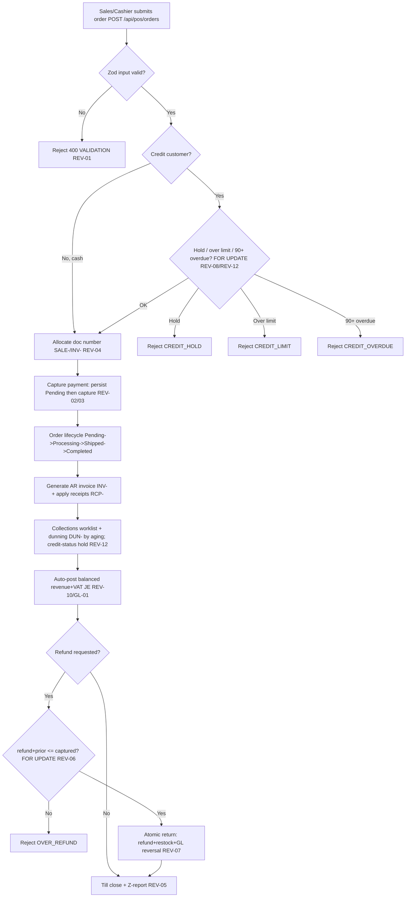

# Order-to-Cash (Revenue / Accounts Receivable) — Process Narrative

## 1. Document control

| Field | Value |
|---|---|
| Process ID | PN-01-O2C |
| Process owner | `<<Revenue / Controller>>` |
| Approver | `<<CFO>>` |
| Version | **0.1 DRAFT** |
| Effective date | `<<effective-date>>` |
| Review cadence | Annual + on significant change |
| Related RCM controls | REV-01, REV-02, REV-03, REV-04, REV-05, REV-06, REV-07, REV-08, REV-09, REV-10, REV-11, REV-12, GL-01; SoD R07, R08, R09, R10, R12 |
| Related policy | `compliance/policies/03-delegation-of-authority.md`, `compliance/policies/11-financial-close-policy.md` |

## 2. Purpose

To define and control the end-to-end revenue cycle — from order/sale capture through invoicing, cash/credit settlement, refunds, and posting to the general ledger — so that revenue and accounts receivable are **valid, complete, accurate, properly cut off, and authorized**, and so that all cash collected is recorded.

## 3. Scope

**In scope:** POS sales (`POST /api/pos/orders`), customer-portal self-service POS (`POST /api/portal/pos/sales`), order lifecycle (Pending → Processing → Shipped → Completed), AR invoice generation (INV-), AR receipts (RCP-), payment capture (`/api/payments`, PAY-), refunds (REF-), credit-limit / credit-hold control, **AR collections & dunning (DUN-)**, and the automatic sales-to-GL posting.

**Out of scope:** Till cash reconciliation and PSP settlement mechanics (see `07-cash-treasury.md`), inventory decrement and COGS (see `03-inventory-cogs.md`), VAT/e-Tax mechanics (see `06-tax-compliance.md`).

## 4. References

- ISO 9001:2015 cl. 4.4 (process approach), cl. 8.2 (requirements for products/services), cl. 8.6 (release), cl. 8.7 (nonconforming outputs).
- `compliance/Oshinei_ERP_SOX_RCM_v1.xlsx` — REV-01..11, GL-01.
- `compliance/policies/03-delegation-of-authority.md` (credit and refund authority), `11-financial-close-policy.md` (revenue cutoff).
- Code: `apps/api/src/modules/pos/pos.service.ts`, `apps/api/src/modules/payments/payments.service.ts`, `apps/api/src/modules/returns/returns.service.ts`, `apps/api/src/modules/ledger/ledger.service.ts`, `apps/api/src/common/doc-number.service.ts`.

## 5. Definitions & abbreviations

| Term | Meaning |
|---|---|
| AR | Accounts Receivable |
| Credit hold | Tenant/customer flag (`creditHold`) that blocks new credit orders |
| Credit limit | Maximum outstanding AR permitted for a customer (`creditLimit`) |
| INV- / RCP- / PAY- / REF- / SALE- / SO- / DUN- | Atomic document-number prefixes (invoice / receipt / payment / refund / sale / sales order / dunning action) |
| Dunning | Escalating reminder ladder on overdue AR: reminder → first_notice → second_notice → final_notice → legal |
| Collections worklist | Open AR with aging, current dunning stage and the next recommended rung (`GET /api/finance/ar/collections`) |
| PSP | Payment Service Provider (card/e-wallet gateway) |
| Z-report | End-of-shift till reconciliation report |

## 6. Roles & responsibilities (RACI)

Single-duty roles enforce SoD: the role that **records** a sale (Cashier / Sales) is never the role that **approves a refund or reconciles the till** (PosSupervisor) per rule **R08**, and is never the role that maintains **credit master** (CreditManager, R09) or **prices** (PricingManager, R10).

| Activity | Cashier / Sales | CreditManager | PricingManager | ArClerk | PosSupervisor | ReturnsClerk | FinancialController |
|---|---|---|---|---|---|---|---|
| Maintain customer credit limit / hold | I | **A/R** | I | C | I | I | C |
| Maintain price lists / promotions | I | I | **A/R** | I | I | I | C |
| Capture sale / order | **A/R** | I | I | I | C | I | I |
| Credit-limit / credit-hold check | (system) | C | I | I | I | I | I |
| Capture payment / tender | **A/R** | I | I | I | I | I | I |
| Generate AR invoice (INV-) | R | I | I | **A/R** | I | I | I |
| Apply AR receipt (RCP-) | I | I | I | **A/R** | I | I | C |
| Approve / process refund (REF-) | I | I | I | I | **A/R** | C | I |
| Process return + restock | I | I | I | I | C | **A/R** | I |
| Work collections / dunning (DUN-) | I | C | I | **A/R** | I | I | C |
| Review sales-to-GL posting | I | I | I | C | I | I | **A/R** |

## 7. Process narrative

1. **Master-data prerequisites.** CreditManager maintains the customer credit limit / credit-hold flag; PricingManager maintains price lists and promotions. SoD separates these from order entry (**R09**, **R10**). Changes are captured in `audit_log` (**ITGC-AC-10**).
2. **Order / sale capture.** Sales or Cashier submits `POST /api/pos/orders`. Inputs are validated by Zod schema (qty > 0, price ≥ 0, amount > 0) with a standardized error envelope — invalid payloads are rejected with `400` (**REV-01**).
3. **Credit control (decision point).** For credit customers the service takes a tenant-row lock (`SELECT ... FOR UPDATE`) before reading outstanding AR, so concurrent orders for the same customer serialize. If `creditHold` is set → reject `CREDIT_HOLD`; if `outstanding AR + order > creditLimit` → reject `CREDIT_LIMIT` (**REV-08**); and — unified with the collections hold (step 9) — if the customer has any invoice **90+ days past due** they are in default and rejected `CREDIT_OVERDUE` even within their limit (**REV-12**; the 90-day threshold is single-sourced in `collections.service.ts` so the order gate and the collections `on_hold` decision never drift). This gate runs identically for **internal POS** and **portal/self-service** order entry (both `POST /api/pos/orders`, Customer role pinned to its own tenant). Cash sales bypass credit control.
4. **Document numbering.** A gapless, per-type document number (SALE-/SO-/INV-) is allocated atomically via upsert-returning on `doc_counters` — no `COUNT(*)+1` race, no duplicate or skipped numbers (**REV-04**).
5. **Payment capture.** Tender is recorded via `/api/payments`. The payment row is persisted **Pending before** the gateway capture and flipped to **Failed** on error, so captured funds can never be unrecorded (**REV-03**). A repeated `idempotency_key` returns the original tender, backed by a unique index, preventing double charges (**REV-02**). For card/e-wallet, PSP webhooks are HMAC-SHA256 verified over the raw body, fail-closed in production, with out-of-band status re-verification (**REV-09**) — see `07-cash-treasury.md`. The gateway is selectable per tender (`gateway`): `mock` (default), `promptpay` (a real scannable EMVCo QR), `stripe`, and **`opn`** (Opn / Omise — Thailand's PSP aggregator, so a single integration covers cards plus Thai e-wallets (TrueMoney / Rabbit LINE Pay / ShopeePay) and cross-border tourist wallets (Alipay+ / WeChat Pay)); `stripe`/`opn` activate when their secret-key env (`STRIPE_SECRET_KEY` / `OPN_SECRET_KEY`) is set and otherwise fall back to `mock`. Card tenders capture synchronously; wallet/QR tenders return **Pending** and settle via webhook (`PATCH /api/payments/:no/settle`), so funds are never booked before they move.
6. **Order lifecycle.** Order status transitions Pending → Processing → Shipped → Completed; each transition is recorded in `doc_status_log`. Fulfilment decrements stock under lock (see `03-inventory-cogs.md`, **INV-01**).
7. **AR invoice sync.** On acceptance/fulfilment an AR invoice (INV-) is generated and synced to the AR subledger by ArClerk; sequence integrity per **REV-04**.
8. **AR receipt application.** Cash receipts (RCP-) are applied against open invoices by ArClerk, reducing outstanding AR (**Dr 1000 Cash / Cr 1100 AR**). A receipt accepts an optional `idempotency_key`; a retried request (a second HTTP call after a timeout) with the same key returns the original receipt and collects the cash **once** — no double receipt and no double-counted `paid_amount` (migration 0068). Subledger-to-GL agreement is monitored monthly (**REC-01**, see `04-general-ledger-close.md`).
9. **AR collections & dunning (decision point).** ArClerk / Collections works the **collections worklist** on the **Finance screen** (`/finance` → ติดตามหนี้ค้างชำระ; `GET /api/finance/ar/collections`) — open AR aged by business day, showing each invoice's **current dunning stage** (latest action) and the **recommended next rung** from its age (≤15d reminder, ≤30 first_notice, ≤60 second_notice, ≤90 final_notice, >90 legal). Each contact is recorded via `POST /api/finance/ar/collections/:invoiceNo/dunning` (stage, channel, optional promise-to-pay, notes) → a `DUN-` row; the immutable history is the collections audit trail. **The notice is also dispatched to the customer** — a per-stage TH/EN message (invoice, outstanding, days-overdue, escalating tone; `legal` = final demand) is sent via the messaging gateway to the customer-master contact (`email`/`phone`), and the delivery outcome (`sent`/`failed`/`manual`) + recipient are recorded on the `DUN-` row and in `message_log`. Dispatchable channels are `email`/`sms`/`line`; `phone`/`letter` are logged as a manual contact for the agent. Dunning a fully paid invoice → `ALREADY_PAID`. An **automated sweep** (`POST /api/finance/ar/collections/sweep`, cron-callable / **ทวงถามอัตโนมัติ** button) auto-records the recommended rung on every overdue invoice that has fallen behind its stage — system-actioned (channel `auto` → best available contact: email, else SMS), idempotent across runs (no re-escalation until aging advances the stage), and it **dispatches each notice** so the sweep both records and *sends* the reminders (`notices_sent` in the result). To run it **unattended on a daily cadence**, register a `frequency:'daily'` subscription of the schedulable job type **`ar_collections_dunning`** — it rides the existing report scheduler (`POST /api/bi/subscriptions/run` `runDue` tick), which fires the sweep when due, records a run, advances `next_run_at`, and notifies the tenant. Because the sweep is idempotent, an extra tick is harmless. The customer **credit position** (`GET /api/finance/ar/credit-status`) and the reusable **credit decision** for order entry (`POST /api/finance/ar/credit-check`) compute exposure vs `creditLimit`, overdue, and an `on_hold` flag (over-limit **or** 90+ days past due) — the same hold the credit control at step 3 consults (**REV-12**, supports **R09**). A **credit manager** can also place a **manual hold** (`POST /api/finance/ar/credit-hold`, reason logged) which sets the customer's master `creditHold` flag and immediately blocks new credit orders (`CREDIT_HOLD` at step 3) and credit-checks; **releasing** a hold (`POST /api/finance/ar/credit-release`) requires the **`approvals`** permission and a **different person** than the one who placed it (`SOD_SELF_RELEASE`, maker-checker). Credit-**limit changes** (`POST /api/finance/ar/credit-limit`) and every hold/release are written to a **credit-change audit** (`credit_events`, `GET /api/finance/ar/credit-events`) recording old→new, reason and who — the SoD-R09 evidence that credit master is governed (**REV-08**).
10. **Automatic GL posting.** Each accepted sale posts a **balanced** revenue + VAT journal entry to the GL automatically; Σdebit = Σcredit is enforced by construction (**REV-10**, **GL-01**). FinancialController reviews the sales-to-GL tie-out.
11. **Refunds (decision point).** A refund (REF-) is permitted only when refund + all prior refunds ≤ captured amount, evaluated under a payment-row lock (`FOR UPDATE`), so concurrent refunds cannot jointly exceed the capture → over-refund attempt rejected `OVER_REFUND` (**REV-06**). A refund against a non-captured payment → `NOT_REFUNDABLE`.
12. **Returns.** A return is processed atomically — refund + restock + return record + GL reversal in a single transaction; a mid-flow failure rolls the whole thing back, never a partial state (**REV-07**). ReturnsClerk processes the return; PosSupervisor authorizes the refund (**R12**).
13. **Till close.** At shift end PosSupervisor closes the till; expected vs counted cash variance is reported on the Z-report (**REV-05**, detailed in `07-cash-treasury.md`).

## 8. Process flow

**Swimlane description by role:** **Sales/Cashier** captures the order and tender. The **system** performs the credit check, idempotency/over-refund locks, document numbering, and the automatic balanced GL posting. **CreditManager** and **PricingManager** maintain the master data upstream (segregated from selling). **ArClerk** owns invoices and receipt application. **PosSupervisor** approves refunds and closes the till; **ReturnsClerk** processes returns. **FinancialController** reviews the sales-to-GL tie-out.

## 9. Control matrix

| Step | Risk | Control | Type | RCM ID | Evidence / Record |
|---|---|---|---|---|---|
| 2 | Garbage/invalid sales data posted | Zod schema validation, standard error envelope | Prev / Auto | REV-01 | Validation test logs, 400 responses |
| 3 | Sale beyond customer credit limit / on hold | Credit-limit + credit-hold check under tenant-row lock | Prev / Auto | REV-08 | `CREDIT_LIMIT`/`CREDIT_HOLD` rejections, harness ToE |
| 3,9 | Sale to a customer in default (90+ days overdue) | Serious-overdue hold at order entry, unified with collections `on_hold` (single-sourced threshold) | Prev / Auto | REV-12 | `CREDIT_OVERDUE` rejection; `basics` harness ToE |
| 4,7 | Missing/duplicate sales numbers | Atomic gapless document numbering | Prev / Auto | REV-04 | Doc-number sequence export |
| 5 | Double-charged customer on retry | Payment idempotency key + unique index | Prev / Auto | REV-02 | Idempotency test; payments table |
| 5 | Captured funds unrecorded (orphan charge) | Persist Pending before capture; flip Failed on error | Prev / Auto | REV-03 | Negative-path test |
| 5 | Forged PSP callback flips to captured | HMAC-SHA256 webhook verify, fail-closed | Prev / Auto | REV-09 | Webhook signature tests |
| 9 | Overdue AR not pursued; collection lapses | Collections worklist + dunning ladder (DUN-) by aging; credit-status/credit-check hold | Det / Hybrid | REV-12 | `basics` harness; DUN- history; aging report |
| 10 | Sales unposted / unbalanced to GL | Automatic balanced revenue+VAT JE | Auto | REV-10, GL-01 | Sale→GL tie-out sample |
| 10 | Refund exceeds original capture | Over-refund guard under payment-row lock | Prev / Auto | REV-06 | `OVER_REFUND` test |
| 11 | Refund posts but stock/GL not reversed | Atomic return (refund+restock+reversal) | Prev / Auto | REV-07 | Atomicity injection test |
| 12 | Cash skimming/shortage undetected | Till reconciliation, Z-report variance | Det / Hybrid | REV-05 | Signed Z-reports |
| 1 | Sell on self-raised credit/price | SoD: credit/price master vs order entry segregated | Prev / Manual | R09, R10 | SoD conflict report |
| 11 | Process return and self-issue refund | SoD: returns vs refund authority | Prev / Manual | R12 | SoD conflict report |

## 10. Inputs & outputs

**Inputs:** customer master + credit limit, price lists/promotions, order/sale request, tender details, PSP callbacks.
**Outputs:** sales order (SALE-/SO-), AR invoice (INV-), payment (PAY-), receipt (RCP-), refund (REF-), **dunning action (DUN-) + collections worklist**, automatic revenue+VAT journal entry, Z-report.

## 11. Records & retention

| Record | Store | Retention |
|---|---|---|
| Orders / sales, invoices, receipts | Application DB (RLS-scoped) | `<<7 years / per Thai law>>` |
| Payments / refunds | Application DB | `<<7 years>>` |
| Audit trail of mutations | `audit_log` (append-only, immutable trigger) | `<<7 years>>` |
| Document status transitions | `doc_status_log` | `<<7 years>>` |
| Z-reports / till sessions | Application DB | `<<7 years>>` |

## 12. KPIs / metrics

- Credit-limit breach attempts blocked (count of `CREDIT_LIMIT`/`CREDIT_HOLD`).
- Document-number gaps/duplicates detected (target: 0).
- Over-refund attempts blocked (count of `OVER_REFUND`).
- Sales-to-GL posting exceptions (target: 0 unposted/unbalanced).
- AR days sales outstanding (DSO); AR aging > `<<n>>` days.
- Collections coverage: % of overdue AR with a dunning action at/above the recommended stage; promise-to-pay kept rate; count of customers `on_hold`.

> **Monitoring access:** Store-level shift KPIs are surfaced on the **POS home dashboard** (`/pos-home`,
> in the POS workspace) via the read-only endpoints `GET /api/pos/summary`, `/sessions`, `/orders`. These
> reads are available to POS operators (`pos_sell`/`pos_till`) as well as `pos`/`dashboard` holders;
> transacting still requires the respective write permissions (least-privilege).

## 13. Exception & error handling

| Error code | Trigger | Handling |
|---|---|---|
| `VALIDATION` (400) | Invalid order/tender payload | Corrected and resubmitted by originator |
| `CREDIT_HOLD` | Customer on credit hold | CreditManager review; release hold per DoA |
| `CREDIT_LIMIT` | Order would exceed credit limit | CreditManager assesses limit increase per DoA; else cash sale |
| `ALREADY_PAID` | Dunning action on a fully paid invoice | None needed; invoice already settled |
| `OVER_REFUND` | Refund + priors > captured | Refund denied; PosSupervisor reviews |
| `NOT_REFUNDABLE` | Refund vs non-captured payment | Verify payment status |
| `SOD_VIOLATION` / SoD conflict | Conflicting duties assigned to one user | AccessAdmin remediates (see `08-itgc.md`) |

## 14. Revision history

| Version | Date | Author | Summary |
|---|---|---|---|
| 0.1 DRAFT | 2026-06-22 | `<<author>>` | Initial draft. |
| 0.1.1 DRAFT | 2026-06-22 | `<<author>>` | Note POS home dashboard + read-only shift-KPI access for POS operators (`pos_sell`/`pos_till`). |
| 0.2 | 2026-06-23 | Platform | Security review W3 (REC-01 / GL-01): AR receipts accept an `idempotency_key` (migration 0068) so a retried request collects cash once — no double receipt / double-counted paid amount. Verified by the `match` harness idempotency case. |
| 0.3 | 2026-06-24 | Platform | §7 step 5 — documented the selectable payment `gateway` set and added **`opn`** (Opn / Omise — Thai PSP aggregator covering cards + Thai e-wallets + Alipay+/WeChat), env-gated (`OPN_SECRET_KEY`) with mock fallback; noted synchronous card vs async wallet/QR settlement. Scaffold only — no control change. |
| 0.4 | 2026-06-24 | Platform | Added **AR collections & dunning** (§7 step 9): collections worklist, dunning ladder (`DUN-`, migration 0110), credit-status / credit-check hold decision, control **REV-12**, `ALREADY_PAID` handling. Verified by the `basics` harness. |
| 0.5 | 2026-06-24 | Platform | §7 step 3 — wired the **serious-overdue hold** (90+ days past due ⇒ `CREDIT_OVERDUE`) into POS/portal order entry, unified with the collections `on_hold` decision (threshold single-sourced in `collections.service.ts`). Parity-locked `CREDIT_HOLD`/`CREDIT_LIMIT` checks unchanged. Verified by the `basics` harness. |
| 0.6 | 2026-06-24 | Platform | §7 step 9 — added the **collections worklist UI** on `/finance` (record dunning, run sweep) and the **automated dunning sweep** (`POST .../collections/sweep`, cron-callable, idempotent). Verified by the `basics` harness. |
| 0.7 | 2026-06-24 | Platform | §7 step 9 — wired the dunning sweep to a **daily schedule** via the report scheduler (new schedulable job type `ar_collections_dunning`; fires on the `runDue` tick, records a run, notifies). Verified by the `basics` harness. |
| 0.8 | 2026-06-25 | Platform | §7 step 9 — dunning actions now **dispatch the notice** to the customer (per-stage TH/EN message via the messaging gateway to the `email`/`phone` on the customer master; delivery outcome + recipient recorded on the `DUN-` row & `message_log`, migration 0113). The sweep auto-picks email→SMS and reports `notices_sent`. Verified by the `basics` harness. |
| 0.9 | 2026-06-25 | Platform | §7 step 9 — added the **credit-manager workflow**: manual hold / release (release gated by `approvals` with maker-checker `SOD_SELF_RELEASE`) and credit-limit change, all written to a **credit-change audit** (`credit_events`, migration 0114). Manual hold flows to the order-entry `CREDIT_HOLD` gate; control **REV-08**. Verified by the `basics` harness. |
