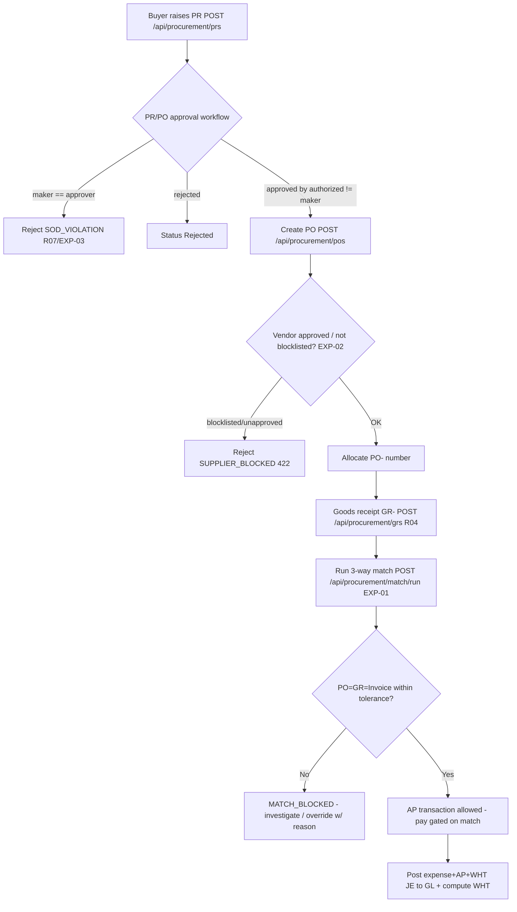

# Procure-to-Pay (Expenditure / Accounts Payable) — Process Narrative

## 1. Document control

| Field | Value |
|---|---|
| Process ID | PN-02-P2P |
| Process owner | `<<Procurement Manager / Controller>>` |
| Approver | `<<CFO>>` |
| Version | **0.1 DRAFT** |
| Effective date | `<<effective-date>>` |
| Review cadence | Annual + on significant change |
| Related RCM controls | EXP-01, EXP-02, EXP-03, EXP-04; SoD R02, R03, R04, R07, R13 |
| Related policy | `compliance/policies/03-delegation-of-authority.md`, `compliance/policies/12-third-party-vendor-management-policy.md` |

## 2. Purpose

To control the expenditure cycle — purchase requisition, purchase order, goods receipt, three-way match, and accounts-payable disbursement — so that the entity pays only for **goods/services properly ordered, received, at the agreed price, to approved vendors, and properly authorized**.

## 3. Scope

**In scope:** PR creation/approval (`/api/procurement/prs`), PO creation/approval with vendor-blocklist gate (`/api/procurement/pos`), goods receipt (`/api/procurement/grs`), three-way match (`/api/procurement/match/run`, tolerance + override), and AP transactions gated on match (`/api/finance/ap/transactions`).

**Out of scope:** Inventory perpetual ledger / costing (see `03-inventory-cogs.md`), vendor-payment cash mechanics and bank rec (see `07-cash-treasury.md`), WHT on supplier payments (see `06-tax-compliance.md`).

## 4. References

- ISO 9001:2015 cl. 4.4, cl. 8.4 (control of externally provided processes, products and services).
- `compliance/Oshinei_ERP_SOX_RCM_v1.xlsx` — EXP-01..04.
- `compliance/policies/12-third-party-vendor-management-policy.md` (vendor approval/blocklist), `03-delegation-of-authority.md` (approval thresholds).
- Code: `apps/api/src/modules/procurement/procurement.service.ts`, `apps/api/src/modules/match/`, `apps/api/src/modules/workflow/workflow.service.ts`.

## 5. Definitions & abbreviations

| Term | Meaning |
|---|---|
| PR / PO / GR | Purchase Requisition / Purchase Order / Goods Receipt |
| 3-way match | Match of PO ↔ GR ↔ Invoice within tolerance |
| Tolerance | Allowable variance band for match (qty/price) |
| AP | Accounts Payable |
| Maker-checker | Creator of a document may never approve it (SoD always-on) |
| PO- / GR- / AP- | Atomic document-number prefixes |

## 6. Roles & responsibilities (RACI)

SoD: the **Buyer** who raises PR/PO never maintains the **vendor master** (MasterDataAdmin, **R02**), never **receives goods** (WarehouseOperator, **R04**), and never **pays** (ApClerk, **R03**). The **approver** of any PR/PO is never its creator (**R07**, maker-checker always on).

| Activity | MasterDataAdmin | Buyer | Procurement (approver) | WarehouseOperator | ApClerk | Controller / FinancialController |
|---|---|---|---|---|---|---|
| Maintain vendor master / approval status | **A/R** | I | I | I | C | C |
| Raise PR | I | **A/R** | I | I | I | I |
| Approve PR / PO (maker-checker) | I | I | **A/R** | I | I | C |
| Vendor-blocklist gate on PO | I | C | C | I | I | I |
| Goods receipt (GR) | I | I | I | **A/R** | I | I |
| Run 3-way match | I | I | C | I | **A/R** | C |
| Change match tolerance | I | I | I | I | I | **A/R** |
| AP transaction / pay (gated on match) | I | I | I | I | **A/R** | A |

## 7. Process narrative

1. **Vendor master.** MasterDataAdmin maintains vendors with an approval status / blocklist flag; this is segregated from buying and paying (**R02**, **R13**).
2. **Purchase requisition.** Buyer submits `POST /api/procurement/prs`; PR is created in status **Pending** and the transition is logged to `doc_status_log`.
3. **PR/PO approval (decision point, maker-checker).** Approval routes through the workflow engine (`/api/workflow`): amount-threshold routing selects the step; an approver who is the document creator is rejected with `SOD_VIOLATION` — the maker can never approve their own document, and neither can a delegate who is the creator (**R07**, **EXP-03**). Multi-level chains require all configured steps before status becomes **Approved**; otherwise it remains **Pending** for the next step. Rejection sets **Rejected**.
4. **Vendor-blocklist gate on PO (decision point).** On `POST /api/procurement/pos`, vendors are checked: a blocklisted or non-`approved` vendor master row → reject `SUPPLIER_BLOCKED` (422); an unknown/freeform vendor with no master row is allowed but flagged for review (**EXP-02**). A gapless PO- number is allocated atomically.
5. **Goods receipt.** WarehouseOperator records the GR (`POST /api/procurement/grs`, GR-) against the PO; quantities feed the perpetual stock ledger (see `03-inventory-cogs.md`). Segregated from ordering (**R04**).
6. **Three-way match (decision point).** ApClerk runs `POST /api/procurement/match/run`: PO ↔ GR ↔ Invoice are matched within configured tolerance. Variances beyond tolerance → `MATCH_BLOCKED` (matched = false) (**EXP-01**).
7. **Tolerance / override control.** Changing the match tolerance requires the `creditors` permission (`PUT` tolerance) — an unauthorized change → `403`; changes are logged (**EXP-04**). Any documented override of a failed match requires a justification and is recorded.
8. **AP payment gate.** AP disbursement (`/api/finance/ap/transactions`) is permitted only on a successful 3-way match; an unmatched invoice cannot be paid (**EXP-01**, target hard-gate per readiness plan). WHT is computed on payment (see `06-tax-compliance.md`); the expense + AP + tax journal is posted to the GL (GL-01). **Retry-safety:** a bill and a payment each accept an optional `idempotency_key`; a retried request (a second HTTP call after a timeout) with the same key returns the original bill / leaves the paid amount applied once — no duplicate payable and no double cash-out (the payment guard is evaluated **before** the paid-amount update, keyed on the client key) (**EXP-03**, **GL-01**).

## 8. Process flow

**Swimlane description by role:** **MasterDataAdmin** owns the vendor master (segregated). **Buyer** raises PR/PO. **Procurement approver** approves within DoA thresholds — never the creator. The **system** enforces the vendor-blocklist gate, document numbering, and the match tolerance permission. **WarehouseOperator** receives goods. **ApClerk** runs the match and disburses only on a passed match. **Controller/FinancialController** owns tolerance configuration and reviews overrides.

## 9. Control matrix

| Step | Risk | Control | Type | RCM ID | Evidence / Record |
|---|---|---|---|---|---|
| 3 | Unauthorized / self-approved PR/PO | Workflow maker-checker, threshold routing | Prev / Hybrid | EXP-03, R07 | Approval trail, `SOD_VIOLATION` |
| 4 | Payment to blocklisted/unapproved vendor | Vendor-status gate on PO | Prev / Auto | EXP-02 | `SUPPLIER_BLOCKED` (422) tests |
| 5 | Buyer also confirms receipt (defeats match) | SoD: procurement vs goods receipt | Prev / Manual | R04 | SoD conflict report |
| 6 | Pay for goods not ordered/received / wrong price | 3-way match within tolerance | Prev / Auto | EXP-01 | Match results; `MATCH_BLOCKED` |
| 7 | Tolerance loosened to force payment | Tolerance change restricted to `creditors` perm; logged | Prev / Auto | EXP-04 | Config-change log; 403 test |
| 8 | Disburse on unmatched invoice | AP payment gated on successful match | Prev / Auto | EXP-01 | AP→match linkage |
| 1,8 | Create vendor and pay it | SoD: vendor master vs AP disbursement | Prev / Manual | R02 | SoD conflict report |
| 1 | Raise purchase and pay it | SoD: procurement vs AP | Prev / Manual | R03 | SoD conflict report |

## 10. Inputs & outputs

**Inputs:** vendor master + approval status, PR request, PO, supplier invoice, goods-receipt note.
**Outputs:** PR, PO (PO-), GR (GR-), match result, AP transaction (AP-), expense+AP+WHT journal entry.

## 11. Records & retention

| Record | Store | Retention |
|---|---|---|
| PR / PO / GR documents | Application DB (RLS-scoped) | `<<7 years>>` |
| 3-way match results + overrides | Application DB | `<<7 years>>` |
| Approval / workflow actions | `workflow` tables (append-only audit) | `<<7 years>>` |
| Tolerance-change log | `audit_log` | `<<7 years>>` |
| AP transactions | Application DB | `<<7 years>>` |

## 12. KPIs / metrics

- % invoices auto-matched first pass; count of `MATCH_BLOCKED`.
- Count of `SUPPLIER_BLOCKED` attempts.
- Match-tolerance changes per period (with approver).
- PR/PO maker-checker exceptions (`SOD_VIOLATION`).
- AP aging; payments made without a passed match (target: 0).

## 13. Exception & error handling

| Error code | Trigger | Handling |
|---|---|---|
| `SOD_VIOLATION` | Maker approves own PR/PO | Route to an independent approver |
| `SUPPLIER_BLOCKED` (422) | PO to blocklisted/unapproved vendor | MasterDataAdmin reviews vendor status per vendor policy |
| `MATCH_BLOCKED` | Variance exceeds tolerance | ApClerk investigates; documented override w/ reason or correct GR/invoice |
| `403` on tolerance change | Lacks `creditors` permission | Controller performs change |
| (idempotent replay) | Bill/payment retried with the same `idempotency_key` | Returns the original result (`idempotent: true`); no duplicate payable / double payment (EXP-03) |

## 14. Revision history

| Version | Date | Author | Summary |
|---|---|---|---|
| 0.1 DRAFT | 2026-06-22 | `<<author>>` | Initial draft. |
| 0.2 | 2026-06-23 | Platform | D3: Supplier (vendor-facing) portal (`/api/supplier/*`, perm `vendor_portal`) — a vendor, resolved from the JWT username via `vendors.user_name` (migration 0065), sees ONLY their own POs, acknowledges them (`purchase_orders.vendor_ack_at`), and submits invoices → a PENDING AP transaction (Unpaid) the buyer's AP clerk then 3-way-matches/pays (EXP-01..04). A vendor cannot view or invoice another vendor's PO. Verified by the `supplier` harness. |
| 0.3 | 2026-06-23 | Platform | Security review W3 (EXP-03 / GL-01): AP bill + AP payment accept an `idempotency_key` (migration 0068) so a retried request cannot duplicate a payable or double-pay; the payment guard is evaluated before the paid-amount update. Verified by the `match` harness idempotency cases. |
