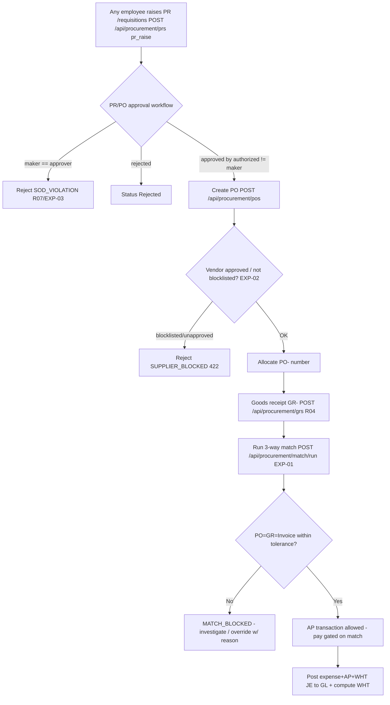

# Procure-to-Pay (Expenditure / Accounts Payable) — Process Narrative

## 1. Document control

| Field | Value |
|---|---|
| Process ID | PN-02-P2P |
| Process owner | `<<Procurement Manager / Controller>>` |
| Approver | `<<CFO>>` |
| Version | **0.1 DRAFT** |
| Effective date | `<<effective-date>>` |
| Review cadence | Annual + on significant change |
| Related RCM controls | EXP-01, EXP-02, EXP-03, EXP-04, EXP-05, EXP-06, EXP-09; SoD R02, R03, R04, R07, R13 |
| Related policy | `compliance/policies/03-delegation-of-authority.md`, `compliance/policies/12-third-party-vendor-management-policy.md` |

## 2. Purpose

To control the expenditure cycle — purchase requisition, purchase order, goods receipt, three-way match, and accounts-payable disbursement — so that the entity pays only for **goods/services properly ordered, received, at the agreed price, to approved vendors, and properly authorized**.

## 3. Scope

**In scope:** PR creation/approval (`/api/procurement/prs`), PO creation/approval with vendor-blocklist gate (`/api/procurement/pos`), goods receipt (`/api/procurement/grs`), three-way match (`/api/procurement/match/run`, tolerance + override), and AP transactions gated on match (`/api/finance/ap/transactions`).

**Access design (each step belongs to a distinct user group — UI + permission enforce SoD R03/R04/R07).** The three procurement steps live on **separate screens**, each gated by the permission of the group that performs it, so no single screen lets one person both order and receive (or request and pay):

| Step | Screen | Permission | User group |
|---|---|---|---|
| Raise PR | `/requisitions` | `pr_raise` (company-wide; implied by `procurement`/`planner`) | **Anyone in the company** |
| Raise PR via LINE chat | Shop LINE OA chat (webhook `/api/line/webhook/<shop>`) | Linked staff identity (one-time code from `/requisitions`) + `pr_raise` | **Anyone in the company** (after linking) |
| Approve/reject PR via LINE chat | Same OA chat (`approve/reject <PR no>`) | Linked staff identity + `procurement` — decision routes through the **workflow engine** (maker-checker/SoD bind) | **Procurement** |
| Buy (PO create/approve), RFQ, 3-way match | `/procurement`, `/procurement/rfqs`, `/procurement/match` | `procurement` | **Procurement** |
| Goods receipt (GR) | `/receiving` | `wh_receive` (implied by coarse `warehouse`) | **Warehouse** |
| Book AP bill + request payment (maker) | `/finance` (รายจ่าย/AP) | `creditors` | **Accounting** |
| Approve & release payment (checker) | `/disbursements` | `approvals` / `gl_close` | **Finance / Treasury** |

**Out of scope:** Inventory perpetual ledger / costing (see `03-inventory-cogs.md`), vendor-payment cash mechanics and bank rec (see `07-cash-treasury.md`), WHT on supplier payments (see `06-tax-compliance.md`).

## 4. References

- ISO 9001:2015 cl. 4.4, cl. 8.4 (control of externally provided processes, products and services).
- `compliance/Oshinei_ERP_SOX_RCM_v1.xlsx` — EXP-01..05.
- `compliance/policies/12-third-party-vendor-management-policy.md` (vendor approval/blocklist), `03-delegation-of-authority.md` (approval thresholds).
- Code: `apps/api/src/modules/procurement/procurement.service.ts`, `apps/api/src/modules/match/`, `apps/api/src/modules/workflow/workflow.service.ts`.

## 5. Definitions & abbreviations

| Term | Meaning |
|---|---|
| PR / PO / GR | Purchase Requisition / Purchase Order / Goods Receipt |
| 3-way match | Match of PO ↔ GR ↔ Invoice within tolerance |
| Tolerance | Allowable variance band for match (qty/price) |
| AP | Accounts Payable |
| Maker-checker | Creator of a document may never approve it (SoD always-on) |
| PO- / GR- / AP- | Atomic document-number prefixes |

## 6. Roles & responsibilities (RACI)

SoD: a **PR may be raised by anyone in the company** (`pr_raise`) — it is only a request and commits nothing. **Buying** (PO create/approve) is Procurement-only; the **Buyer** never maintains the **vendor master** (MasterDataAdmin, **R02**), never **receives goods** (WarehouseOperator, `wh_receive`, **R04**), and never **pays** (ApClerk `creditors`, **R03**). **AP disbursement** is itself split: **Accounting** books the bill and requests payment (`creditors`); **Finance** approves and releases the cash (`approvals`/`gl_close`). The **approver** of any PR/PO/payment is never its creator (**R07**, maker-checker always on). These boundaries are enforced both at the API (per-endpoint `@Permissions`) and in the UI (each step on its own permission-gated screen).

| Activity | MasterDataAdmin | Buyer | Procurement (approver) | WarehouseOperator | ApClerk | Controller / FinancialController |
|---|---|---|---|---|---|---|
| Maintain vendor master / approval status | **A/R** | I | I | I | C | C |
| Raise PR (any employee, `pr_raise`) | R | **A/R** | I | R | R | R |
| Approve PR / PO (maker-checker) | I | I | **A/R** | I | I | C |
| Vendor-blocklist gate on PO | I | C | C | I | I | I |
| Goods receipt (GR) | I | I | I | **A/R** | I | I |
| Run 3-way match | I | I | C | I | **A/R** | C |
| Change match tolerance | I | I | I | I | I | **A/R** |
| Record AP bill / request payment (maker, gated on match) | I | I | I | I | **A/R** | A |
| Approve / reject AP payment (checker, ≠ requester) | I | I | C | I | I | **A/R** |

## 7. Process narrative

1. **Vendor master.** MasterDataAdmin maintains vendors with an approval status / blocklist flag; this is segregated from buying and paying (**R02**, **R13**).
2. **Purchase requisition.** **Any employee** raises a PR from the dedicated `/requisitions` screen (`POST /api/procurement/prs`, permission `pr_raise` — held by every internal staff role, and implied by `procurement`/`planner`). A PR is a **request only**: it commits nothing and posts nothing, so it carries the lowest-risk permission and is intentionally not restricted to Procurement. PR is created in status **Pending** and the transition is logged to `doc_status_log`. Approval and conversion to a PO remain Procurement-only (next step).
   **LINE chat channel (same control path).** A staff member may also raise a PR from the shop's **LINE OA chat** (`pr <item> <qty> [reason]` / `ขอซื้อ …`; `status <PR no>` checks progress). The channel is authenticated end-to-end: (a) the webhook (`POST /api/line/webhook/<shop>`) is verified against the tenant's LINE **channel-secret signature**; (b) the chat identity must first be **bound to an ERP user** via a one-time, 10-minute link code issued to the authenticated user on `/requisitions` (`POST /api/line/link-code`, gated `pr_raise`) and typed into the chat as `link <code>` — a LINE account binds to at most one user (DB-unique) and is unlinkable from the same screen; (c) each chat PR re-resolves the linked user's **effective permissions** (same precedence as login) and requires `pr_raise`. A chat-raised PR then goes through the **identical** `createPr` path as the web — same PR- numbering, `doc_status_log`, and workflow routing — so the maker-checker approval (**EXP-03**, step 3) is unchanged. Non-command chat messages are ignored (the OA remains a customer channel), and webhook redeliveries are deduplicated by LINE message id so a retry cannot raise (or approve) the same document twice.
   **Self-service chat commands (0228).** A linked staff member can also run `status <PR no>` / `my prs` (own recent requisitions), `find <keyword>` (item-master lookup), `cancel <PR no>` (withdraw **their own** still-Pending PR — the service enforces own-doc + Pending, and the pending workflow instance is closed alongside; also `PATCH /api/procurement/prs/:prNo/cancel`), and `stock <item>` (read-only on-hand from `inv_balances`, tenant-scoped).
   **Workflow LINE notifications (0228).** The approval engine pushes LINE messages to *linked* staff at its decision points — queue entry (the step's approver user, or a capped fan-out to the approver role) and the final approve/reject (the requester). Notifications are transactional (not marketing — no consent/quiet-hours gating), audit-logged in `message_log` (campaign `wf_notify`), and strictly best-effort: a failed push never blocks the approval.
3. **PR/PO approval (decision point, maker-checker).** A **PR decision may also be issued from the LINE OA chat** (`approve <PR no>` / `reject <PR no> <reason>`, 0228): the linked identity must hold `procurement` (re-resolved per command) and the decision is routed through `approvePr` → the **same workflow engine below**, so nothing in this step's control weakens — the maker-checker/SoD checks reject a self-approval over chat exactly as on the web. Both PR **and PO** approval route through the workflow engine (`/api/workflow`). Step routing is by **amount threshold** and, optionally, a **dimension condition** (`match_key=match_value` against the document's context — e.g. PO `vendor`/`cost_center`) so different dimensions route to different approvers. An approver who is the document creator is rejected with `SOD_VIOLATION` — the maker can never approve their own document, and neither can a delegate who is the creator (**R07**, **EXP-03**). Multi-level chains require all configured steps before status becomes **Approved**; otherwise it remains **Pending** for the next step. Rejection sets **Rejected**. A step (or definition) may carry an **SLA**; the cron-callable escalation sweep (`POST /api/workflow/run-escalations`) flags overdue instances, notifies the step's **escalation approver**, and authorises that fallback approver to act — so approvals never stall. Workflows are built no-code via `POST/PUT /api/workflow/definitions` (the `/workflow` screen). The engine posts **nothing to the GL**.
4. **Vendor-blocklist gate on PO (decision point).** On `POST /api/procurement/pos`, vendors are checked: a blocklisted or non-`approved` vendor master row → reject `SUPPLIER_BLOCKED` (422); an unknown/freeform vendor with no master row is allowed but flagged for review (**EXP-02**). A gapless PO- number is allocated atomically.
5. **Goods receipt.** WarehouseOperator records the GR from the dedicated `/receiving` screen (`POST /api/procurement/grs`, GR-) against the PO; quantities feed the perpetual stock ledger (see `03-inventory-cogs.md`). **Segregated from ordering (R04) at the permission layer:** the endpoint now requires **`wh_receive`** (a warehouse/receiving duty, implied by coarse `warehouse`) — the `procurement` permission alone **no longer** authorizes a receipt, so the Buyer who raised the PO cannot also confirm its receipt and defeat the 3-way match. **Capital lines** — an item flagged `is_fixed_asset` or a PO line flagged `is_capital` — are **not** capitalized into inventory (1200); they are marked `is_capital` on the GR line and routed to the fixed-asset register via the capitalization maker-checker (**FA-10**, see `09-fixed-assets-depreciation.md` §7 step 11).
6. **Three-way match (decision point).** ApClerk runs `POST /api/procurement/match/run`: PO ↔ GR ↔ Invoice are matched within configured tolerance. Variances beyond tolerance → `MATCH_BLOCKED` (matched = false) (**EXP-01**). A blocked invoice can be **overridden** to make it payable, but the override is **maker-checked**: the person who ran the match cannot override its variance — a **different** user must (`POST /api/procurement/match/:txn/override`, overrider ≠ matcher → `403 SOD_VIOLATION`, binds even Admin) — so a clerk cannot force their own off-tolerance invoice through. Any re-match **resets** a prior override so a stale override can't keep a now-failing invoice payable (**EXP-01**).
7. **Tolerance / override control.** Changing the match tolerance requires the `creditors` permission (`PUT` tolerance) — an unauthorized change → `403`; changes are logged (**EXP-04**). Any documented override of a failed match requires a justification and is recorded.
8. **AP payment gate + disbursement maker-checker (EXP-06, EXP-09).** AP disbursement is **gated on the 3-way match**: the payment request (`requestApPayment`) calls `ThreeWayMatchService.assertPayable(txnNo)` **before** recording anything — a PO-based invoice that was matched and **did not pass** (variance beyond tolerance / over-invoiced / unmatched line) and was **not** independently overridden is **blocked `MATCH_BLOCKED`**, so no cash can even be requested against it (**EXP-09**, the payment-gate wiring of the **EXP-01** verdict into the cash path). The gate **fails open** for a **non-PO bill** (utilities / services / reimbursements never have a match row) so legitimate non-PO payables remain payable. Disbursement is then a **two-step, segregated** flow so no single person both books and pays a bill:
   - **Request (maker, `creditors`).** `PATCH /api/finance/ap/transactions/{no}/pay` records a payment **request** (`ap_payments`, status `PendingApproval`). The bill's `paid_amount` is **not** touched and **no GL posts** — an over-request beyond outstanding-minus-pending is rejected (`AP_OVERPAY`). Booking a bill **pre-paid** in one call (`paid_amount>0` on create) is blocked (`AP_PREPAID_BLOCKED`).
   - **Approve (checker, `approvals`/`gl_close`).** `POST /api/finance/ap/payments/{no}/approve` by a **different** user — a requester approving their own request is rejected with `SOD_VIOLATION` (binds even Admin). Only on approval does the bill's `paid_amount` move (under `FOR UPDATE`) and the cash-disbursement journal post (Dr 2000 / Cr 1000). `reject` records the decision with no cash/GL effect. The pending queue is `GET /api/finance/ap/payments/pending`. **In the UI this checker step is a finance-owned screen, `/disbursements`** (gated `approvals`/`gl_close`), kept separate from the accounting AP screen (`/finance`, gated `creditors`) where bills are booked and payment is requested — so **accounting** never appears on the same screen that **finance** uses to release cash.
   WHT is computed on payment (see `06-tax-compliance.md`); the expense + AP + tax journal is posted to the GL (GL-01). **Retry-safety:** the bill and the payment request each accept an optional `idempotency_key`; a retried request returns the original (no duplicate payable / request), and the GL post is keyed on a stable per-request reference so an approval posts cash exactly once (**EXP-06**, **GL-01**, **GL-04**).
9. **Vendor statement of account.** A per-vendor **statement** (`GET /api/finance/ap/statement?vendor=&from=&to=`) lists an **opening balance** struck before the window, every bill (charge) and approved disbursement (payment) in date order with a **running balance**, and a **closing balance** — used to reconcile to the supplier's own statement before paying. It is **multi-currency**: each bill/payment keeps its currency + booked fx rate; the statement reports in **base THB** by default (converting at each document's rate) or, with `?currency=USD`, in that currency's own units (**EXP-06**).

## 8. Process flow

**Swimlane description by role:** **Any employee** raises a PR (`/requisitions`, `pr_raise`). **MasterDataAdmin** owns the vendor master (segregated). **Buyer (Procurement)** creates POs. **Procurement approver** approves within DoA thresholds — never the creator. The **system** enforces the vendor-blocklist gate, document numbering, and the match tolerance permission. **WarehouseOperator** receives goods (`/receiving`, `wh_receive`). **ApClerk (Accounting)** runs the match, books the bill and requests payment. **Finance (FinancialController/approver)** approves & releases the disbursement (`/disbursements`). **Controller/FinancialController** owns tolerance configuration and reviews overrides.

## 9. Control matrix

| Step | Risk | Control | Type | RCM ID | Evidence / Record |
|---|---|---|---|---|---|
| 2 | PR raised over LINE chat under a spoofed / unauthenticated identity | Channel authentication chain: tenant channel-secret webhook signature → one-time link code binds LINE id to ERP user (DB-unique) → per-command `pr_raise` re-check → same `createPr`/workflow path; message-id dedup blocks redelivery duplicates | Prev / Auto | EXP-03 (entry integrity; no new control) | `line-crm` harness ToE (link/permission/dedup negatives) |
| 3 | PR approved over LINE chat without authority / by its maker | Chat decision requires the linked identity to hold `procurement` (re-resolved per command) and routes through the **same workflow engine** — `NOT_AN_APPROVER` / `SOD_VIOLATION` bind identically over chat; message-id dedup blocks double-acting | Prev / Auto | EXP-03, R07 (channel extension; no new control) | `line-crm` harness ToE (chat self-approve → SOD_VIOLATION; no-permission negative) |
| 3 | Unauthorized / self-approved PR/PO | Workflow maker-checker, threshold routing | Prev / Hybrid | EXP-03, R07 | Approval trail, `SOD_VIOLATION` |
| 4 | Payment to blocklisted/unapproved vendor | Vendor-status gate on PO | Prev / Auto | EXP-02 | `SUPPLIER_BLOCKED` (422) tests |
| 5 | Buyer also confirms receipt (defeats match) | SoD: procurement vs goods receipt — **enforced at the permission layer** (GR endpoint requires `wh_receive`, not `procurement`); separate `/receiving` screen | Prev / **Auto** | R04 | `403` for procurement-only user; SoD conflict report |
| 6 | Pay for goods not ordered/received / wrong price | 3-way match within tolerance | Prev / Auto | EXP-01 | Match results; `MATCH_BLOCKED` |
| 6 | Matcher force-overrides their own variance to push an invoice through | Override maker-checker — overrider ≠ matcher (binds Admin); re-match resets a stale override | Prev / Auto | EXP-01 | `SOD_VIOLATION`; `match` harness |
| 7 | Tolerance loosened to force payment | Tolerance change restricted to `creditors` perm; logged | Prev / Auto | EXP-04 | Config-change log; 403 test |
| 8 | Disburse on a failed/unmatched PO invoice | **AP-pay gate**: `requestApPayment` calls `assertPayable` before recording — a not-payable, not-overridden PO invoice → `MATCH_BLOCKED`; fails open for non-PO bills | Prev / Auto | **EXP-09**, EXP-01 | AP→match linkage; `match` harness payment-gate ToE |
| 8 | Disburse without independent approval (one person books & pays) | AP disbursement maker-checker — request (`creditors`) ≠ approve (`approvals`/`gl_close`); pre-paid creation blocked | Prev / Hybrid | EXP-06, R03, R07 | `SOD_VIOLATION`, `AP_PREPAID_BLOCKED`; ToE in `compliance.ts` |
| 1,8 | Create vendor and pay it | SoD: vendor master vs AP disbursement | Prev / Manual | R02 | SoD conflict report |
| 1 | Raise purchase and pay it | SoD: procurement vs AP — the default **Procurement role is now SoD-clean** (`procurement`+`pr_raise`+`delivery`; no `creditors`), so buying and paying are not bundled by default | Prev / Manual | R03 | SoD conflict report (Procurement now 0 conflicts) |
| 1 | Vendor PII (tax ID, bank account) leaks via a DB snapshot / RLS bypass | **Field-level encryption at rest** (AES-256-GCM `encryptedText`) on `vendors.tax_id`/`bank_account`; the ghost-vendor duplicate-tax-ID detector groups **decrypted** values in app code (ciphertext is not groupable); legacy rows re-encrypted by `db:backfill:pii` | Prev / Auto | **ITGC-AC-19** | `ext` harness at-rest ToE + ghost-vendor detection |

## 10. Inputs & outputs

**Inputs:** vendor master + approval status, PR request, PO, supplier invoice, goods-receipt note.
**Outputs:** PR, PO (PO-), GR (GR-), match result, AP transaction (AP-), expense+AP+WHT journal entry.

## 11. Records & retention

| Record | Store | Retention |
|---|---|---|
| PR / PO / GR documents | Application DB (RLS-scoped) | `<<7 years>>` |
| 3-way match results + overrides | Application DB | `<<7 years>>` |
| Approval / workflow actions | `workflow` tables (append-only audit) | `<<7 years>>` |
| Tolerance-change log | `audit_log` | `<<7 years>>` |
| AP transactions | Application DB | `<<7 years>>` |

## 12. KPIs / metrics

- % invoices auto-matched first pass; count of `MATCH_BLOCKED`.
- Count of `SUPPLIER_BLOCKED` attempts.
- Match-tolerance changes per period (with approver).
- PR/PO maker-checker exceptions (`SOD_VIOLATION`).
- AP aging; payments made without a passed match (target: 0).

## 13. Exception & error handling

| Error code | Trigger | Handling |
|---|---|---|
| `SOD_VIOLATION` | Maker approves own PR/PO | Route to an independent approver |
| `SUPPLIER_BLOCKED` (422) | PO to blocklisted/unapproved vendor | MasterDataAdmin reviews vendor status per vendor policy |
| `MATCH_BLOCKED` | Variance exceeds tolerance | ApClerk investigates; documented override w/ reason or correct GR/invoice |
| `403` on tolerance change | Lacks `creditors` permission | Controller performs change |
| (idempotent replay) | Bill/payment retried with the same `idempotency_key` | Returns the original result (`idempotent: true`); no duplicate payable / double payment (EXP-03) |

## 14. Revision history

| Version | Date | Author | Summary |
|---|---|---|---|
| 0.1 DRAFT | 2026-06-22 | `<<author>>` | Initial draft. |
| 0.2 | 2026-06-23 | Platform | D3: Supplier (vendor-facing) portal (`/api/supplier/*`, perm `vendor_portal`) — a vendor, resolved from the JWT username via `vendors.user_name` (migration 0065), sees ONLY their own POs, acknowledges them (`purchase_orders.vendor_ack_at`), and submits invoices → a PENDING AP transaction (Unpaid) the buyer's AP clerk then 3-way-matches/pays (EXP-01..04). A vendor cannot view or invoice another vendor's PO. Verified by the `supplier` harness. |
| 0.3 | 2026-06-24 | Pre-production audit | **EXP-06 — AP disbursement maker-checker.** AP payment split into request (`creditors`) → approve (`approvals`/`gl_close`) with requester ≠ approver enforced (even Admin); paid_amount & cash GL move only on approval; pre-paid bill creation blocked (`AP_PREPAID_BLOCKED`). New `ap_payments` table (migration 0115) + pending queue. ToE re-performed by `cutover/compliance.ts`. |
| 0.3 | 2026-06-23 | Platform | Security review W3 (EXP-03 / GL-01): AP bill + AP payment accept an `idempotency_key` (migration 0068) so a retried request cannot duplicate a payable or double-pay; the payment guard is evaluated before the paid-amount update. Verified by the `match` harness idempotency cases. |
| 0.4 | 2026-06-24 | Platform | **Approval-workflow enhancements (Platform Phase 2):** §7 step 3 — **PO** now routes through the engine (mirroring PR); added **dimension-based step routing** (`match_key`/`match_value` vs instance context), **SLA + escalation** (definition/step `sla_hours`, `POST /api/workflow/run-escalations` flags overdue + reminds the escalation approver, who may then act), and a **no-code builder** (`PUT /api/workflow/definitions/:id`). Migration `0079_workflow_escalation_routing`. Verified by the `workflow` harness. |
| 0.5 | 2026-06-25 | Platform | **Supplier (vendor) portal UI surfaced** — new screen `/supplier` (ERP nav → จัดซื้อ, perm `vendor_portal`) lets a vendor view their own POs, acknowledge them, and submit invoices (→ a PENDING AP txn the buyer's AP clerk 3-way-matches/pays, EXP-01..04). UI-only addition over the already-documented `/api/supplier/*` endpoints; vendor self-scoping and the downstream AP controls are unchanged. See user manual `03-procurement.md` §Supplier portal and UAT `03-procure-to-pay-uat.md`. |
| 0.6 | 2026-06-25 | Platform | **3-way-match worklist / blocked-invoice register** — `ThreeWayMatchService.listResults` on `GET /api/procurement/match` (no `txn_no`): all match results for the tenant, filterable (status / `?blocked=true` / search) with counts (total · blocked = not-payable-and-not-overridden · overridden); tenant-scoped, typed builders. New **worklist tab** on `/procurement/match`. Detective surface over **EXP-01** — finance can see/triage every AP invoice held by a match variance before payment. No new control / no migration. ToE: `match` harness (worklist + `?blocked` + RLS). |
| 0.8 | 2026-06-26 | Platform | §7 step 8 — formalized the **AP 3-way-match payment gate** as its own control (**EXP-09**, WS2.3). `FinanceService.requestApPayment` calls `ThreeWayMatchService.assertPayable(txnNo)` before recording a payment request: a PO-based invoice that failed the match and was not independently overridden → `MATCH_BLOCKED`; the gate **fails open** for non-PO bills (no match row) so they stay payable. This documents the cash-path wiring of the existing EXP-01 match verdict (the gate code already shipped in Phase 16) — no code change beyond the RCM. ToE: `match` harness (failed PO invoice blocked at pay; matched/overridden pays; non-PO pays). |
| 0.7 | 2026-06-25 | Platform | **Supplier-performance register** — `ProcurementService.listScorecards` on `GET /api/procurement/scorecards`: all `supplier_scorecards` for the tenant **ranked by score** (with `?period`; default = latest per vendor), joined to the vendor name, with `avg_score` + `underperformers` (< 70). New screen `/supplier-scorecards` (nav → จัดซื้อ). Surfaces vendor performance that was computed/stored (`recomputeScorecard`) but had no list/UI — supports vendor management (**EXP-02**). Tenant-scoped, typed builders; no migration / no control change. ToE: `match` harness (register ranks the seeded vendor + avg/underperformers). |
| 0.8 | 2026-06-26 | Platform | **Procure-to-Capitalize (FA-10) cross-reference.** §7 step 5 (goods receipt): a **capital** GR line — item-master `is_fixed_asset` or PO-line `is_capital` — is now **excluded from inventory capitalization (1200)** and routed to the fixed-asset register via the capitalization maker-checker (FAR- request → independent approve → Dr 1500 / Cr 2000), giving end-to-end **PR→PO→GR→FA** traceability. Full control + flow owned by `09-fixed-assets-depreciation.md` (§7 step 11, control **FA-10**, migration `0137`). PO line gains an `is_capital` flag (`POST /api/procurement/pos`). No new P2P control. ToE: `basics` (PR→PO→GR→capitalize). Manual `03-procurement.md` + UAT `03-procure-to-pay-uat.md` updated. |
| 0.9 | 2026-06-26 | Platform | **EXP-01 override maker-checker (SoD).** Step 6: a 3-way-match variance override is now segregated — the person who RAN the match cannot override it (`override()` rejects overrider = `matchedBy` with `403 SOD_VIOLATION`, binds even Admin); the override endpoint accepts approval-authority roles (`creditors`/`approvals`/`gl_close`). Closes the gap where a clerk could match AND override their own off-tolerance invoice to force payment. **EXP-01** strengthened (no new control / no migration); control matrix gains a step-6 row. ToE: `match` harness (matcher self-override → SOD_VIOLATION; independent override unblocks; re-match resets). |
| 1.3 | 2026-06-26 | Platform | **T2-D: Supplier price-list versioning + scorecard price-variance wiring.** New table `supplier_price_lists` (migration `0174`, RLS): per-vendor, per-item versioned purchase prices (unit_price, uom, currency, effective_from/to, status 'active'/'superseded'). `upsertSupplierPrice` creates a new active row and auto-supersedes the prior active version for the same vendor+item+uom, preserving a full audit trail. Three new endpoints: `POST /api/procurement/supplier-prices` (`md_vendor`/`procurement`), `GET /api/procurement/supplier-prices` (`procurement`/`planner`/`exec`), `GET /api/procurement/supplier-prices/history?vendor_id&item_id` (`procurement`/`planner`). **Scorecard price_var_pct now computed from real data:** `recomputeScorecard` joins GR `unit_cost` vs the active list price for each item received from the vendor and averages the absolute % deviation. New screen `/supplier-prices` (nav → จัดซื้อ): active price table with vendor-filter, item-filter, create/version dialog, and version-history panel (Sheet). **SoD:** price maintenance (`md_vendor`) is segregated from buying (`procurement`) and paying (`creditors`) — no single role can set a price AND issue a PO AND pay it. No GL impact; advisory data feeds scorecard computation only. |
| 1.2 | 2026-06-26 | Platform | **Planner role remediated to SoD-clean (R04/R05/R06/R07/R11/R13 default-design fix).** The `Planner` role default changed from `[dashboard, exec, warehouse, procurement, planner, masterdata, approvals]` (6 conflicts) to `[planner, dashboard, procurement, pr_raise, fin_report, wh_count, wh_custody, lots, locations]` (**0 conflicts**) — `exec` (gl_post+gl_close → R05), `approvals` (R06/R07), `wh_receive`+`wh_adjust` (R04/R11), and `masterdata` (R13) removed. A Planner can plan, view stock and raise/track POs but cannot approve, post/close GL, receive goods, adjust stock, or maintain vendor master. Non-admin total drops 14→8. Eight harness fixtures (`budget`/`costing`/`epm-planning`/`ext`/`recon-profitability`/`wms`/`workflow`) keep the old bundled perms via explicit per-user overrides so control-harness ToE is unchanged. xlsx regenerated; unit SoD-count updated (Planner 0, total 8). Gates: unit 38 ✓, compliance 106 ✓, workflow 25 ✓, wms 25 ✓, budget 21 ✓, epm-planning 16 ✓, costing 19 ✓, recon-profitability 14 ✓, ext 250 ✓. |
| 1.1 | 2026-06-26 | Platform | **Procurement role remediated to SoD-clean (R03 default-design fix).** The legacy broad `Procurement` role default in `permissions.ts` was changed from `[procurement, creditors, ar, delivery, masterdata, approvals]` (4 SoD conflicts: R02/R03/R07/R13) to `[procurement, pr_raise, delivery]` (**0 conflicts**) — buying is no longer bundled with paying (`creditors`→ApClerk), approving (`approvals`), or vendor-master (`masterdata`→MasterDataAdmin). Non-admin role-level total drops 18→14; `compliance/Oshinei_ERP_SoD_Matrix_v1.xlsx` regenerated via `build_sod.py`; unit `SoD` counts updated (Procurement 0). The handful of control-harness fixtures that deliberately exercise the *bundled* residual-risk case (`compliance.ts` `apdual`/`finT2`, `ai-actions.ts` `approverProc`, `workflow.ts` `proc1`/`mgr1`, `match.ts` `procT*`, `taxdocs.ts` `proc2`) now carry explicit per-user permission overrides, so the maker-checker ToE coverage is unchanged. Gates: unit 38 ✓, compliance 106 ✓, match 26 ✓, ai-actions 14 ✓, workflow 25 ✓. |
| 1.0 | 2026-06-26 | Platform | **Access redesign — PR/PO/GR and AP/Payment split by user group (strengthens R03/R04/R07; no new RCM control).** Each expenditure step now lives on its own permission-gated screen so distinct user groups never share a surface: (a) **PR** moved to `/requisitions` and opened to a new company-wide permission **`pr_raise`** (seeded into every internal staff role; implied by `procurement`/`planner`) — raising a requisition is no longer Procurement-only, since a PR commits nothing; (b) **PO** stays on `/procurement` (`procurement`); (c) **GR** moved to a dedicated `/receiving` screen and its endpoint **tightened from `procurement`/`warehouse` to `wh_receive`** so the Buyer's `procurement` permission alone can no longer confirm receipt (**R04 now Prev/Auto at the permission layer**, was Prev/Manual); (d) **AP disbursement** UI split — accounting books the bill + requests payment on `/finance` (`creditors`), while the checker approve/release moved to a new finance-owned `/disbursements` screen (`approvals`/`gl_close`), so accounting and finance never share the disbursement screen (**R07**/**EXP-06**). §3 gains an access-design table; §6 RACI + §7 steps 2/5/8 + §9 step-5 control row updated. No migration; RCM control statements unchanged (enforcement strengthened only). ToE: `compliance` (106 ✓), `basics` (153 ✓), `match` (26 ✓), parity `writeflow` (36 ✓), api unit SoD-count tests (38 ✓). Manual `03-procurement.md` + `05-finance-ar-ap.md` and UAT `03-procure-to-pay-uat.md` + `08-admin-sod-uat.md` updated. |
| 1.4 | 2026-06-26 | Platform | **C1 — Multi-currency depth on PO/GR.** `purchase_orders` and `goods_receipts` gain `currency` (ISO-4217) and `fx_rate` (numeric 14,6) columns (migration `0175`). `CreatePoDto` accepts optional `currency` + `fx_rate`; GR inherits the PO's `currency`/`fxRate` at receipt time. Control EXP-03 (price/quantity match) now applies to multi-currency POs — the match is done in document currency and the fx rate is preserved in `gr_items`. |
| 1.7 | 2026-07-02 | Platform | **LINE chat → PR phase 2 (0228, no migration).** (a) **Workflow LINE notifications** — the approval engine (`WorkflowService`, via the new `LineNotifyService`) pushes to *linked* staff on queue entry (step approver user / capped role fan-out, with an approve-by-chat hint for PRs) and on the final decision (requester gets ✅/❌); transactional, `message_log` campaign `wf_notify`, strictly best-effort. (b) **Approve/reject via chat** — `approve/reject <PR no>` requires the linked identity to hold `procurement` and routes through `approvePr` → the same engine (maker-checker `SOD_VIOLATION` + `NOT_AN_APPROVER` bind identically over chat; §3 table + §9 step-3 row added — channel extension of EXP-03/R07, **no new RCM control**). (c) **Self-service commands** — `my prs`, `find <keyword>`, `stock <item>` (read-only), and `cancel <PR no>` (own still-Pending PR; new `ProcurementService.cancelPr` + `PATCH /api/procurement/prs/:prNo/cancel` gated `pr_raise`; closes the pending workflow instance via new `WorkflowService.cancel`). ToE: `line-crm` 51 ✓ (queue-entry + decision pushes, chat approve/reject happy + SoD + permission negatives, my prs/find/cancel/stock); regression `workflow` 25 ✓, `compliance` 121 ✓. Manual `03-procurement.md` + UAT `03-procure-to-pay-uat.md` (UAT-P2P-076..080) updated. |
| 1.6 | 2026-07-02 | Platform | **LINE chat → PR (migration `0227`).** §7 step 2: staff can raise a PR from the shop's LINE OA chat (`pr <item> <qty> [reason]`, `status <PR no>`) after binding their LINE account with a one-time 10-minute link code issued on `/requisitions` (`POST /api/line/link-code` / `GET`+`DELETE /api/line/link`, gated `pr_raise`; LINE id ↔ user is DB-unique on `users.line_user_id`). The webhook is channel-secret signature-verified per tenant; every chat command re-resolves effective permissions and requires `pr_raise`; the PR rides the **same** `createPr` + workflow-approval path as the web (EXP-03 unchanged — chat can raise, never approve); LINE message-id dedup prevents redelivery duplicates; non-command chat is ignored (customer channel preserved). §3 access table + §9 control matrix gain the chat-channel row; **no new RCM control** (entry-integrity strengthening of EXP-03). ToE: `line-crm` harness (41 ✓ — link/permission/dedup/unlink negatives + end-to-end chat PR). Manual `03-procurement.md` + UAT `03-procure-to-pay-uat.md` updated. |
| 1.5 | 2026-07-02 | Platform | **ITGC-AC-19 — vendor PII encrypted at rest (docs/27 R0-1).** `vendors.tax_id` + `vendors.bank_account` switch to the AES-256-GCM `encryptedText` column type (legacy-plaintext passthrough; idempotent `db:backfill:pii` re-encrypts existing rows). The continuous-monitoring **ghost-vendor** detector (shared tax ID) rewritten to group decrypted values in app code — random-IV ciphertext never collides in SQL, so the old GROUP BY would have gone silently blind. Same finding shape/fingerprint; no API or GL change; control matrix gains a step-1 PII row. ToE: `ext` harness (vendor tax-id ciphertext at rest AND ghost-vendor still fires on the shared ID). Manual `03-procurement.md` + UAT `03-procure-to-pay-uat.md` updated. |
