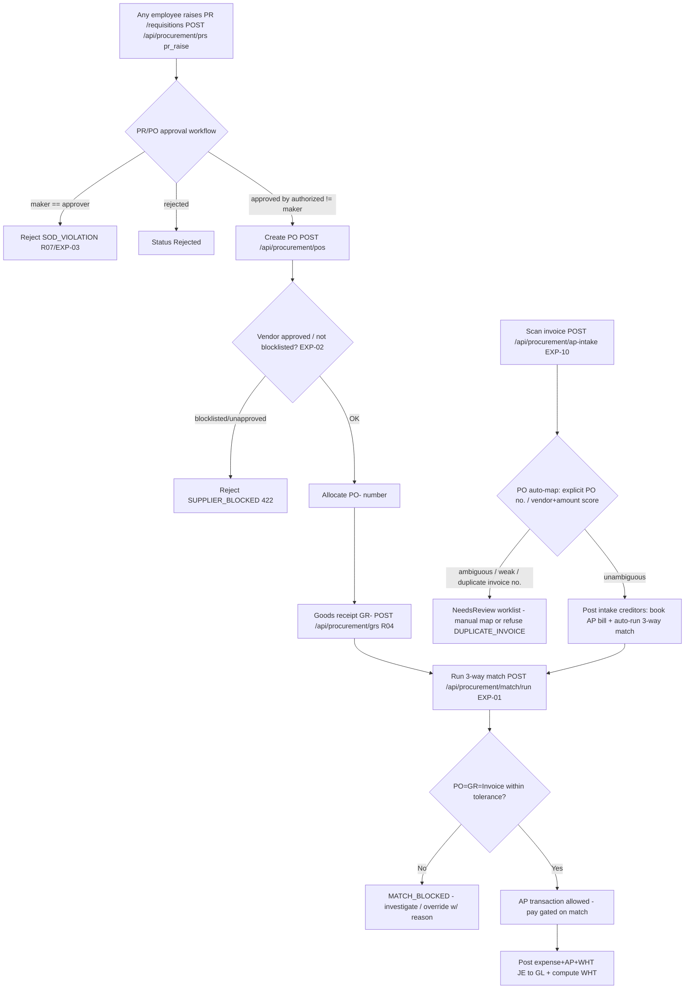

# Procure-to-Pay (Expenditure / Accounts Payable) — Process Narrative

## 1. Document control

| Field | Value |
|---|---|
| Process ID | PN-02-P2P |
| Process owner | `<<Procurement Manager / Controller>>` |
| Approver | `<<CFO>>` |
| Version | **0.1 DRAFT** |
| Effective date | `<<effective-date>>` |
| Review cadence | Annual + on significant change |
| Version note | Rev **3.32** (2026-07-10) — supplier scorecard on-time/quality computed from data (no control change). |
| Related RCM controls | EXP-01, EXP-02, EXP-03, EXP-04, EXP-05, EXP-06, EXP-09, EXP-10, EXP-11, EXP-12, EXP-13; SoD R02, R03, R04, R07, R13 |
| Related policy | `compliance/policies/03-delegation-of-authority.md`, `compliance/policies/12-third-party-vendor-management-policy.md` |

## 2. Purpose

To control the expenditure cycle — purchase requisition, purchase order, goods receipt, three-way match, and accounts-payable disbursement — so that the entity pays only for **goods/services properly ordered, received, at the agreed price, to approved vendors, and properly authorized**.

## 3. Scope

**In scope:** PR creation/approval (`/api/procurement/prs`), PO creation/approval with vendor-blocklist gate (`/api/procurement/pos`), goods receipt (`/api/procurement/grs`), three-way match (`/api/procurement/match/run`, tolerance + override), AP invoice intake — scanned invoice → PO auto-map → matched-at-posting (`/api/procurement/ap-intake`, **EXP-10**), and AP transactions gated on match (`/api/finance/ap/transactions`).

**Access design (each step belongs to a distinct user group — UI + permission enforce SoD R03/R04/R07).** The three procurement steps live on **separate screens**, each gated by the permission of the group that performs it, so no single screen lets one person both order and receive (or request and pay):

| Step | Screen | Permission | User group |
|---|---|---|---|
| Raise PR | `/requisitions` | `pr_raise` (company-wide; implied by `procurement`/`planner`) | **Anyone in the company** |
| Raise PR via **shop/basket** (catalog browse by category → basket → checkout; ⚡ urgent flag + free-text off-catalog request) | `/shop` (read-only browse `GET /api/procurement/catalog`; checkout = `POST /api/procurement/prs`) | `pr_raise` (company-wide; implied by `procurement`/`planner`) | **Anyone in the company** |
| Raise PR via LINE chat | Shop LINE OA chat (webhook `/api/line/webhook/<shop>`) | Linked staff identity (one-time code from `/requisitions`) + `pr_raise` | **Anyone in the company** (after linking) |
| Approve/reject PR via LINE chat | Same OA chat (`approve/reject <PR no>`) | Linked staff identity + `procurement` — decision routes through the **workflow engine** (maker-checker/SoD bind) | **Procurement** |
| Buy (PO create/approve), RFQ, 3-way match | `/procurement`, `/procurement/rfqs`, `/procurement/match` | `procurement` | **Procurement** |
| **Quick Capture** a bill (snap/upload → draft only) | `/capture` **or** LINE `บิล` + photo **or** email-forward to the tenant inbox | `pr_raise` (company-wide; implied by `procurement`/`creditors`) | **Anyone in the company** |
| Scan invoice → PO auto-map (intake, text **or image/PDF upload**); **book** the intake bill | `/procurement/ap-intake` | scan/upload/map: `procurement` or `creditors`; post/auto: `creditors` only | **Procurement / Accounting** (booking = Accounting) |
| Goods receipt (GR) — form **or** one-tap รับครบ / LINE `receive <PO no>` | `/receiving`, Shop LINE OA chat | `wh_receive` (implied by coarse `warehouse`; `procurement` also accepted for the one-tap receive-all) | **Warehouse** |
| Book AP bill + request payment (maker) | `/finance` (รายจ่าย/AP) | `creditors` | **Accounting** |
| Approve & release payment (checker) | `/disbursements` | `approvals` / `gl_close` | **Finance / Treasury** |

**Out of scope:** Inventory perpetual ledger / costing (see `03-inventory-cogs.md`), vendor-payment cash mechanics and bank rec (see `07-cash-treasury.md`), WHT on supplier payments (see `06-tax-compliance.md`).

## 4. References

- ISO 9001:2015 cl. 4.4, cl. 8.4 (control of externally provided processes, products and services).
- `compliance/Oshinei_ERP_SOX_RCM_v1.xlsx` — EXP-01..05.
- `compliance/policies/12-third-party-vendor-management-policy.md` (vendor approval/blocklist), `03-delegation-of-authority.md` (approval thresholds).
- Code: `apps/api/src/modules/procurement/procurement.service.ts`, `apps/api/src/modules/match/`, `apps/api/src/modules/workflow/workflow.service.ts`.

## 5. Definitions & abbreviations

| Term | Meaning |
|---|---|
| PR / PO / GR | Purchase Requisition / Purchase Order / Goods Receipt |
| 3-way match | Match of PO ↔ GR ↔ Invoice within tolerance |
| Tolerance | Allowable variance band for match (qty/price) |
| AP | Accounts Payable |
| Maker-checker | Creator of a document may never approve it (SoD always-on) |
| PO- / GR- / AP- | Atomic document-number prefixes |

## 6. Roles & responsibilities (RACI)

SoD: a **PR may be raised by anyone in the company** (`pr_raise`) — it is only a request and commits nothing. **Buying** (PO create/approve) is Procurement-only; the **Buyer** never maintains the **vendor master** (MasterDataAdmin, **R02**), never **receives goods** (WarehouseOperator, `wh_receive`, **R04**), and never **pays** (ApClerk `creditors`, **R03**). **AP disbursement** is itself split: **Accounting** books the bill and requests payment (`creditors`); **Finance** approves and releases the cash (`approvals`/`gl_close`). The **approver** of any PR/PO/payment is never its creator (**R07**, maker-checker always on). These boundaries are enforced both at the API (per-endpoint `@Permissions`) and in the UI (each step on its own permission-gated screen).

| Activity | MasterDataAdmin | Buyer | Procurement (approver) | WarehouseOperator | ApClerk | Controller / FinancialController |
|---|---|---|---|---|---|---|
| Maintain vendor master / approval status | **A/R** | I | I | I | C | C |
| Raise PR (any employee, `pr_raise`) | R | **A/R** | I | R | R | R |
| Approve PR / PO (maker-checker) | I | I | **A/R** | I | I | C |
| Vendor-blocklist gate on PO | I | C | C | I | I | I |
| Goods receipt (GR) | I | I | I | **A/R** | I | I |
| Run 3-way match | I | I | C | I | **A/R** | C |
| Change match tolerance | I | I | I | I | I | **A/R** |
| Record AP bill / request payment (maker, gated on match) | I | I | I | I | **A/R** | A |
| Approve / reject AP payment (checker, ≠ requester) | I | I | C | I | I | **A/R** |

## 7. Process narrative

1. **Vendor master.** MasterDataAdmin maintains vendors with an approval status / blocklist flag; this is segregated from buying and paying (**R02**, **R13**).
   **Governed bank master (master-data audit Phase 9).** When a bank-detail change is staged, a recognised bank name is **canonicalised to its official Thai name** against a 19-bank reference (`common/thai-banks.ts`; "kbank"/"กสิกร"/"Kasikorn" → **ธนาคารกสิกรไทย**); an unrecognised name is kept as entered. The reference is served at `GET /api/geo/banks` and the vendor bank dialog binds to it as an autocomplete. **Flexfields (Phase 9):** the tenant's user-defined custom fields (Oracle DFF equivalent) render inline on the vendor master (`/api/custom-fields/values?entity=vendor`, read/write widened to `md_vendor`/`procurement`); the `/inventory/suppliers` panel shows a **ฟิลด์กำหนดเอง** section.
   **Bank-detail change maker-checker (EXP-11, migration `0270`).** A vendor's payee **bank_name/bank_account** cannot be edited directly — the classic Business-Email-Compromise vector (an attacker who compromises or colludes with one `md_vendor` holder silently redirects the next disbursement). `PATCH /api/procurement/vendors/:id/bank` (`md_vendor`) **stages** the change (`PendingApproval`, carrying the previous values); it is applied to `vendors` only when a **different** `exec`/`approvals` user releases it via `POST /api/procurement/vendor-bank-changes/:reqNo/approve` — a self-approval is rejected `403 SOD_VIOLATION` (binds even Admin). Re-staging a change **supersedes** any still-open request so the pending queue always reflects only the latest ask; `reject` leaves the vendor's bank details untouched. The pending queue (`GET /api/procurement/vendor-bank-changes`) is surfaced on `/inventory/suppliers`.
   **Party-model depth (master-data audit Phase 4, migration `0272`).** A vendor previously carried exactly one scalar address and no contact rows. `vendors` gains a self-referencing `parent_vendor_id` (a numeric vendor id, no inline FK — mirrors the `projects.ts` WBS self-reference pattern) for consolidated group spend/reporting, plus two new child tables: `vendor_addresses` (billing/shipping/registered/other, `is_primary` flag, `address_line1` encrypted-at-rest) and `vendor_contacts` (name/title/phone/email/notes, `is_primary` flag). New endpoints under `/api/procurement/vendors/:id`: `POST/GET/DELETE …/addresses[/:addressId]`, `POST/GET/DELETE …/contacts[/:contactId]`, `PATCH …/parent` (`SELF_PARENT` guard). Direct-edit, gated `md_vendor` — no maker-checker (unlike bank details, none of these fields carry payment-redirection risk). `/inventory/suppliers` gains an "ที่อยู่/ผู้ติดต่อ" action opening an address/contact management panel, and the profile-edit dialog gains a parent-vendor-id field.
   **Match-merge / DQM (master-data audit Phase 5, migration `0273`).** A steward can find and merge duplicate vendors — `GET /api/procurement/vendors/duplicates` (`md_vendor`/`procurement`/`exec`) scores probable duplicates (exact tax-id/email/phone + app-side fuzzy name similarity; `pg_trgm` not enabled), and `POST /api/procurement/vendors/:id/merge` (`md_vendor`/`masterdata`/`exec`) merges a duplicate **into** a survivor: the generic catalogue-driven repoint (`md_merge_repoint`) moves every child row (POs, AP transactions, price-lists, addresses, contacts, …) to the survivor, blank survivor fields are back-filled from the duplicate (survivorship), and the duplicate is **soft-retired** (`active=false` + `merged_into`/`merged_by`/`merged_at`) — never deleted. Atomic — a unique-key collision rolls back with `409 MERGE_CONFLICT`; `SELF_MERGE`/`ALREADY_MERGED` guards. `/inventory/suppliers` gains a **ตรวจข้อมูลซ้ำ** toolbar action opening the review queue with per-row Merge.
   **Change history / universal audit (master-data audit Phase 6, migration `0274`).** The DB-trigger field-level change log (`data_change_log`, **ITGC-AC-14**) now covers `vendors` + its address/contact children (the existing generic `log_data_change` trigger, attached — no new table). Every create (onboarding trail), update (old→new per field), delete is captured append-only **at the database layer**. `GET /api/procurement/vendors/:id/history` (`md_vendor`/`procurement`/`exec`) surfaces the per-record timeline, tenant-scoped, with sensitive/encrypted columns (tax_id, bank_account) **masked**. The `/inventory/suppliers` address/contact panel renders a collapsible **ประวัติการแก้ไข** section. **Address standardization (master-data audit Phase 7):** a vendor address's **province** is canonicalised to its official name against the 77-province reference on save, and the **postal code** must be 5 digits (`400 POSTAL_INVALID`); reference at `GET /api/geo/provinces`, address form uses a canonical-province autocomplete.
   **Typed party relationships (master-data audit Phase 8, migration `0275`).** Beyond the parent pointer, a vendor can carry arbitrary **typed, directional** relationships to other vendors (`vendor_relationships`) — `related_party`/`subsidiary`/`franchisee`/`subcontractor`/`parent`/`other`. `POST/GET/DELETE /api/procurement/vendors/:id/relationships` (`md_vendor`) manage them; the list shows **outgoing + incoming**. `SELF_RELATION` guard; `409 RELATION_EXISTS` on a duplicate. RLS-isolated + change-audited. The `/inventory/suppliers` address/contact panel renders a **ความสัมพันธ์** section.
2. **Purchase requisition.** **Any employee** raises a PR from the dedicated `/requisitions` screen (`POST /api/procurement/prs`, permission `pr_raise` — held by every internal staff role, and implied by `procurement`/`planner`). A PR is a **request only**: it commits nothing and posts nothing, so it carries the lowest-risk permission and is intentionally not restricted to Procurement. PR is created in status **Pending** and the transition is logged to `doc_status_log`. Approval and conversion to a PO remain Procurement-only (next step).
   **LINE chat channel (same control path).** A staff member may also raise a PR from the shop's **LINE OA chat** (`pr <item> <qty> [reason]` / `ขอซื้อ …`; `status <PR no>` checks progress). The channel is authenticated end-to-end: (a) the webhook (`POST /api/line/webhook/<shop>`) is verified against the tenant's LINE **channel-secret signature**; (b) the chat identity must first be **bound to an ERP user** via a one-time, 10-minute link code issued to the authenticated user on `/requisitions` (`POST /api/line/link-code`, gated `pr_raise`) and typed into the chat as `link <code>` — a LINE account binds to at most one user (DB-unique) and is unlinkable from the same screen; (c) each chat PR re-resolves the linked user's **effective permissions** (same precedence as login) and requires `pr_raise`. A chat-raised PR then goes through the **identical** `createPr` path as the web — same PR- numbering, `doc_status_log`, and workflow routing — so the maker-checker approval (**EXP-03**, step 3) is unchanged. Non-command chat messages are ignored (the OA remains a customer channel), and webhook redeliveries are deduplicated by LINE message id so a retry cannot raise (or approve) the same document twice.
   **Self-service chat commands (0228).** A linked staff member can also run `status <PR no>` / `my prs` (own recent requisitions), `find <keyword>` (item-master lookup), `cancel <PR no>` (withdraw **their own** still-Pending PR — the service enforces own-doc + Pending, and the pending workflow instance is closed alongside; also `PATCH /api/procurement/prs/:prNo/cancel`), `stock <item>` (read-only on-hand from `inv_balances`, tenant-scoped), and `receive <PO no>` (`รับของ`/`รับ`) — a warehouse/receiving act that receives **all** outstanding quantity on an approved PO in one message (`POST …/pos/:poNo/receive-all`; requires `wh_receive`/`warehouse`/`procurement` and the EXP-03 approval gate, so an un-approved PO is refused — see step 5). **Reorder low stock (feature C).** `low` (`ใกล้หมด`/`สต็อกต่ำ`) lists every item whose tenant on-hand (`inv_balances`) has fallen to/below its reorder point (`items.min_stock`) with a suggested top-up qty; `reorder` (`เติมของ`/`เติมสต็อก`) then raises **one** PR covering all of them at that qty (`POST /api/procurement/low-stock` + `POST /api/procurement/reorder-pr`, both `pr_raise`). The reorder PR runs the **identical** `createPr` path (same numbering / status-log / workflow), so it is only a faster entry to step 2 — approval (**EXP-03**) is unchanged. The same list + one-tap "เปิด PR เติมของ" button lives on `/requisitions`. **Proactive morning alert (D1).** `subscribe lowstock` (`รับแจ้งของใกล้หมด`, `pr_raise`) registers the staff member as a `{line_user}` recipient of a new **`low_stock_reorder_alert`** scheduled report (BI report scheduler, daily): each run recomputes the same low-stock list and — only when something is actually at/below its reorder point — pushes it to the linked LINE with a one-tap **[สั่งเติมทั้งหมด]** postback (`{a:'reorder'}`) that raises the top-up PR through the same `reorder` → `createPr` path. Read-only aggregate + a push; no control change (**EXP-03** approval still applies to the raised PR). `unsubscribe lowstock` removes the recipient; a force-unlink silences it automatically. **Purchase spend insights (D3).** `spend [YYYY-MM]` (`ยอดซื้อ`/`สรุปซื้อ`) returns a business-month buying summary — total committed spend, the top vendors by spend, and the most-bought items — from `purchase_orders`/`po_items` (excluding Draft/Cancelled). Read-only, gated on a buyer/analytics permission (`procurement`/`planner`/`exec`/`dashboard`); also `GET /api/procurement/spend-summary?period=` and a schedulable **`purchase_spend`** BI report on `/bi`. **Partial receive + claim (D4).** `receive <PO> <item id> <qty>` receives a **partial** quantity of one PO line (qty capped at the outstanding amount so a fat-finger can't over-receive; `POST /api/procurement/pos/:poNo/receive-item`) — the plain `receive <PO>` still takes everything; and `claim <PO/GR no> <qty> [เหตุผล]` opens a short/damaged **goods-receipt claim** (`ClaimsService.createGrClaim` → `GRC-`, perm `procurement`/`wh_receive`) that procurement follows up with the supplier on `/claims`. Both run the existing GR/claim paths — same **EXP-03** approval gate on the receipt; no control change.
   **AI-drafted PRs (LC-5, docs/30).** The chat copilot (`บอท <ข้อความ>`) may DRAFT a requisition from free Thai text, but the draft **executes nothing** until the user taps the LC-1 [ยืนยัน] postback — and the confirmed draft replays this exact step (same `pr_raise` re-check, same numbering/status-log/workflow). AI-origin actions are campaign-tagged in `message_log` (`chat_ai`/`chat_ai_confirm`).
   **Workflow LINE notifications (0228).** The approval engine pushes LINE messages to *linked* staff at its decision points — queue entry (the step's approver user, or a capped fan-out to the approver role) and the final approve/reject (the requester). Notifications are transactional (not marketing — no consent/quiet-hours gating), audit-logged in `message_log` (campaign `wf_notify`), and strictly best-effort: a failed push never blocks the approval. **Close-the-loop follow-through (D2).** Beyond the approval decision, the PR **requester** is also pushed at the downstream milestones of their requisition: when it is **converted to a PO** (`convertPrToPo` → "ออกใบสั่งซื้อแล้ว → PO-…"), when that **PO is approved/rejected** (`approvePo` → the PO-linked PR requesters), and when the **goods are received** (`createGr` → "รับเข้าคลังแล้ว"). Requesters are resolved from `pr_items.po_no` (all PRs feeding the PO, de-duplicated), pushed via `LineNotifyService.notifyUser` — best-effort, no-op for unlinked staff, and it never blocks buying/receiving. Read-only follow-through; **no control change**.
   **2½. PR → PO conversion — supplier auto-group (1 PR → many POs).** An **Approved** PR is turned into purchase orders from `/requisitions` (**➡️ สร้าง PO**, `POST /api/procurement/prs/:prNo/to-po`, permission **`procurement`**). Because **one PO is raised to exactly one supplier**, the conversion panel **suggests a supplier for each line** — `GET /api/procurement/items/suppliers` resolves it in priority order **(1) the item's preferred supplier ("ผู้ขายประจำ") → (2) the cheapest active supplier price → (3) the most-recent PO's vendor** — **auto-groups the lines by vendor**, and raises **one PO per group** in a single submit; so a requisition spanning several suppliers fans out into several POs (`to-po` now also accepts `pos:[{vendor,lines}]`; the legacy single-vendor `{vendor,lines}` shape is preserved). The buyer can re-assign any group's or line's vendor, mark **★ ผู้ขายประจำ** to learn the default for next time, and a still-un-coded line is reconciled/opened exactly as before (`items/search`, `create_item`). The preferred supplier is stored as a `preferred` flag on the tenant-scoped supplier price list (`PUT /api/procurement/items/:itemId/preferred-vendor`, price-maintenance duty **`md_vendor`** or `procurement`/`planner`; migration **0267** — setting it seeds/updates the price row so the price auto-fills too). Every source-PR line is stamped `pr_items.po_no` to **its own** PO; the PR is marked **Converted** only when **all** lines are ordered, otherwise **PartiallyConverted** so the remaining lines can be placed in a later pass. Each PO routes through the unchanged `createPo` — the **vendor-blocklist gate (EXP-02)**, the **workflow maker-checker (EXP-03)**, and **SoD (R02/R07)** are all unchanged, and the engine posts nothing to the GL. **No new control.**
3. **PR/PO approval (decision point, maker-checker).** A **PR decision may also be issued from the LINE OA chat** (`approve <PR no>` / `reject <PR no> <reason>`, 0228): the linked identity must hold `procurement` (re-resolved per command) and the decision is routed through `approvePr` → the **same workflow engine below**, so nothing in this step's control weakens — the maker-checker/SoD checks reject a self-approval over chat exactly as on the web. **One-tap buttons (LC-1, docs/30):** the queue-entry LINE card carries [อนุมัติ]/[ปฏิเสธ] *postback* buttons; the first tap only parks a 5-minute nonce'd confirm state and the [ยืนยัน] tap consumes it **before** acting (webhook replays cannot double-act), then runs the identical chat-decision path — buttons change UX, not this control. Both PR **and PO** approval route through the workflow engine (`/api/workflow`). Step routing is by **amount threshold** and, optionally, a **dimension condition** (`match_key=match_value` against the document's context — e.g. PO `vendor`/`cost_center`) so different dimensions route to different approvers. An approver who is the document creator is rejected with `SOD_VIOLATION` — the maker can never approve their own document, and neither can a delegate who is the creator (**R07**, **EXP-03**). Multi-level chains require all configured steps before status becomes **Approved**; otherwise it remains **Pending** for the next step. Rejection sets **Rejected**. A step (or definition) may carry an **SLA**; the cron-callable escalation sweep (`POST /api/workflow/run-escalations`) flags overdue instances, notifies the step's **escalation approver**, and authorises that fallback approver to act — so approvals never stall. Workflows are built no-code via `POST/PUT /api/workflow/definitions` (the `/workflow` screen). The engine posts **nothing to the GL**.
   **Budgetary control / encumbrance gate (BUD-02, FIN-3).** When the tenant's budget-control policy is on (`budget_control_settings.policy`, default **off** — see PN-13 §7 step 2bis for the full model), the same PR/PO **approval** decision points also check **budget availability** = approved budget (fiscal-YTD) − GL actuals − open commitments, per resolved budget account (item → category → default account; project/BoQ lines are excluded — PROJ-12/13 govern them — as are capital lines). The request itself is never gated (a requester can always ask). Outcomes per policy on an over-budget document: `advise` annotates the approve response; `warn` → **`422 BUDGET_CONFIRM_REQUIRED`** until the approver resubmits with `confirm_over_budget:true`; `block` → **`422 BUDGET_EXCEEDED`** unless an **exec** overrides with a mandatory reason (**`403 BUDGET_OVERRIDE_DENIED`** for a non-exec, **`400 BUDGET_OVERRIDE_REASON_REQUIRED`** without a reason) — the override is audited on the `budget_commitments` row + the doc status log. The final approval **encumbers** the budget (`budget_commitments`: PR = item-master estimate, released at PR→PO conversion; PO = ordered amount, **consumed** on full receipt, **released** on cancel / close-short). Approval surfaces (`/requisitions`, `/procurement`) show a live **availability chip** (`GET /api/budget/availability?doc_type=&doc_no=`). Control: **BUD-02**; migration **0298**.
   **Workflow-definition readiness (cross-cutting detective/config control).** The generic approval engine **auto-approves a docType that has no active workflow *definition*** (`workflow.service.ts` `start()` returns `autoApproved:true`) — a deliberate zero-config behaviour so a fresh deploy is usable, but it means a deployment that ships **without** seeded definitions silently has **no** second-person approval on PR/PO (and BUDGET / PMR / BQR). This configuration-integrity gap is now **detectable**: `GET /api/workflow/readiness` (`masterdata`/`approvals`/`exec`) reports, per the caller's tenant, each engine-wired docType (`PR, PO, BUDGET, PMR, BQR`) with `has_active_definition` / `auto_approves`, plus an overall `ready` (all docTypes have a definition) and `missing` (the docTypes that currently auto-approve). An admin — or a deploy readiness probe — can therefore confirm that PR/PO (and the rest) actually enforce maker-checker before go-live. Auto-approve-when-unconfigured is intentionally **retained**; the reporter only **detects** the gap, it does not change engine behaviour.
4. **Vendor-blocklist gate on PO (decision point).** On `POST /api/procurement/pos`, vendors are checked: a blocklisted or non-`approved` vendor master row → reject `SUPPLIER_BLOCKED` (422); an unknown/freeform vendor with no master row is allowed but flagged for review (**EXP-02**). A gapless PO- number is allocated atomically. **Printable PO (presentation).** Once created, a PO can be printed or sent to the supplier as an A4 document — `GET /api/procurement/pos/:poNo/pdf` renders it HTML→PDF through the shared `PdfRenderer` (HTML fallback when Chromium is absent, as with the tax documents), carrying the buyer (our-company) block, the supplier block, the ordered lines, an estimated VAT line (only when the buyer tenant is VAT-registered — the PO is a commitment, not a tax document), and the baht-text total. It is read-only over the stored PO/vendor/tenant data (viewing gated `procurement`/`planner`/`exec`/`wh_receive`/`warehouse`); there is no write path and no GL effect, so it introduces **no new control**. The `/procurement` PO list carries a **พิมพ์** action.
5. **Goods receipt.** WarehouseOperator records the GR from the dedicated `/receiving` screen (`POST /api/procurement/grs`, GR-) against the PO; quantities feed the perpetual stock ledger (see `03-inventory-cogs.md`). **Segregated from ordering (R04) at the permission layer:** the endpoint now requires **`wh_receive`** (a warehouse/receiving duty, implied by coarse `warehouse`) — the `procurement` permission alone **no longer** authorizes a receipt, so the Buyer who raised the PO cannot also confirm its receipt and defeat the 3-way match. **Capital lines** — an item flagged `is_fixed_asset` or a PO line flagged `is_capital` — are **not** capitalized into inventory (1200); they are marked `is_capital` on the GR line and routed to the fixed-asset register via the capitalization maker-checker (**FA-10**, see `09-fixed-assets-depreciation.md` §7 step 11). **One-tap receive-all** — for a full delivery the receiver can skip the line-by-line form: the `/receiving` PO list carries a **รับครบ** button (shown only for Approved / part-received POs) and the LINE OA chat accepts `receive <PO no>` (`รับของ`/`รับ`); both call `POST /api/procurement/pos/:poNo/receive-all`, which builds the GR lines from each PO line's outstanding quantity (order − received) and runs the **identical** `createGr` path — same `wh_receive`/`warehouse`/`procurement` authorisation, the same **EXP-03** approval gate (an un-approved PO is refused), stock ledger, and auto-close. No control changes; it is a faster entry to the same receipt.
   **Blind-count receiving + over-receipt tolerance + claim window + shortage decision (EXP-12, migration 0290).** Selecting the PO on `/receiving` loads its lines — **ordered / already received / outstanding** per line (`GET /api/procurement/pos/:poNo/receive-lines`, same `wh_receive`/`warehouse`/`procurement` gate) — so the receiver checks the physical delivery against the order, but the counted quantity is **never pre-filled**: a receipt requires an actual count (deters "confirm without counting"). `createGr` then **blocks any line that would exceed the ordered quantity** (`422 OVER_RECEIPT`, checked on the aggregate requested per item so split lots can't sneak past); only a **weight-basis UoM** (kg/g/ton — weighed deliveries legitimately vary) may run over, and only within the configurable tolerance (`receiving_settings.over_receipt_weight_pct`, default **5%**). The tolerance (and the claim window) is read by the receiver but **changeable only by `procurement`/`exec`** (`GET/PUT /api/procurement/receiving-settings` — the receiver can't loosen their own gate, mirroring EXP-04). After posting, the GR response carries an **ordered-vs-received summary** so a shortage/overage is surfaced at the dock; from the same summary the receiver can (a) open a **supplier claim** with a photo taken on the spot (`POST /api/claims/gr` now also `wh_receive`/`warehouse`; the photo is stored as a `GRC` doc-attachment) — but only **within the claim window** (`receiving_settings.claim_window_hours`, default **24h**, anchored on `goods_receipts.created_at`); after that the window auto-closes and the claim is refused (`422 CLAIM_WINDOW_CLOSED`); and (b) decide a shortage's fate: **keep the PO open** for a later delivery, or **close it short** (`POST /api/procurement/pos/:poNo/close-short`) — the close releases any open project commitments (PROJ-12), is status-logged, and **binds at line level** (`po_items.status = Closed`), so any further receipt against the closed lines is refused (`422 PO_LINE_CLOSED`) and the one-tap/receive-item paths skip them.
   **Attachment evidence (0228).** The paper behind the match can be pinned to the document: invoice /
   receipt **photos are attached to a PO** from the web (`/procurement` → ไฟล์แนบ; `POST/GET/DELETE
   /api/procurement/attachments`, upload gated `procurement`/`creditors`/`wh_receive`) or from the LINE OA
   chat (`attach <PO no> [receipt]`, then send the photo — fetched from the LINE content API under the
   linked staff identity with the same permission check). Attachments are tenant-scoped (RLS), stored
   in-DB (~2MB cap), metadata-only in lists, and **deletable only by the uploader or Admin** (evidence
   integrity). Documentation support for **EXP-01** — no control change.
6. **Three-way match (decision point).** ApClerk runs `POST /api/procurement/match/run`: PO ↔ GR ↔ Invoice are matched within configured tolerance. Variances beyond tolerance → `MATCH_BLOCKED` (matched = false) (**EXP-01**). A blocked invoice can be **overridden** to make it payable, but the override is **maker-checked**: the person who ran the match cannot override its variance — a **different** user must (`POST /api/procurement/match/:txn/override`, overrider ≠ matcher → `403 SOD_VIOLATION`, binds even Admin) — so a clerk cannot force their own off-tolerance invoice through. Any re-match **resets** a prior override so a stale override can't keep a now-failing invoice payable (**EXP-01**).
7. **Tolerance / override control.** Changing the match tolerance requires the `creditors` permission (`PUT` tolerance) — an unauthorized change → `403`; changes are logged (**EXP-04**). Any documented override of a failed match requires a justification and is recorded.
8. **AP payment gate + disbursement maker-checker (EXP-06, EXP-09).** AP disbursement is **gated on the 3-way match**: the payment request (`requestApPayment`) calls `ThreeWayMatchService.assertPayable(txnNo)` **before** recording anything — a PO-based invoice that was matched and **did not pass** (variance beyond tolerance / over-invoiced / unmatched line) and was **not** independently overridden is **blocked `MATCH_BLOCKED`**, so no cash can even be requested against it (**EXP-09**, the payment-gate wiring of the **EXP-01** verdict into the cash path). The gate **fails open** for a **non-PO bill** (utilities / services / reimbursements never have a match row) so legitimate non-PO payables remain payable. Disbursement is then a **two-step, segregated** flow so no single person both books and pays a bill:
   - **Request (maker, `creditors`).** `PATCH /api/finance/ap/transactions/{no}/pay` records a payment **request** (`ap_payments`, status `PendingApproval`). The bill's `paid_amount` is **not** touched and **no GL posts** — an over-request beyond outstanding-minus-pending is rejected (`AP_OVERPAY`). Booking a bill **pre-paid** in one call (`paid_amount>0` on create) is blocked (`AP_PREPAID_BLOCKED`).
   - **Approve (checker, `approvals`/`gl_close`).** `POST /api/finance/ap/payments/{no}/approve` by a **different** user — a requester approving their own request is rejected with `SOD_VIOLATION` (binds even Admin). Only on approval does the bill's `paid_amount` move (under `FOR UPDATE`) and the cash-disbursement journal post (Dr 2000 / Cr 1000). `reject` records the decision with no cash/GL effect. The pending queue is `GET /api/finance/ap/payments/pending`. **In the UI this checker step is a finance-owned screen, `/disbursements`** (gated `approvals`/`gl_close`), kept separate from the accounting AP screen (`/finance`, gated `creditors`) where bills are booked and payment is requested — so **accounting** never appears on the same screen that **finance** uses to release cash.
   WHT is computed on payment (see `06-tax-compliance.md`); the expense + AP + tax journal is posted to the GL (GL-01). **Retry-safety:** the bill and the payment request each accept an optional `idempotency_key`; a retried request returns the original (no duplicate payable / request), and the GL post is keyed on a stable per-request reference so an approval posts cash exactly once (**EXP-06**, **GL-01**, **GL-04**).
   **8b. AP payment RUN + Thai bank payment file (EXP-13).** For period disbursement the one-by-one flow scales into a **batch payment run** (`ap_payment_runs`/`ap_payment_run_lines`, migration `0297`), a thin lifecycle over the SAME per-payment controls: (1) **Propose (maker, `creditors`)** — `POST /api/finance/ap/payment-runs/propose` selects **open approved AP by due-date cutoff** (`due_cutoff`; optional vendor filter `vendor_ids`/`vendor_name`, and an optional **discount-window** widening `early_pay_window_days` that also pulls bills due within N days after the cutoff as early-payment candidates — there is no early-pay-discount master yet, so the flag widens selection only). Every candidate line must pass the **3-way-match payment gate** (`assertPayable`; a blocked PO invoice is skipped at proposal with reason `MATCH_BLOCKED` and **re-checked at approval**), must have outstanding balance beyond payments already awaiting approval, and must not sit in another open run (`IN_OPEN_RUN`). Per-line **WHT** resolves through the SAME tax-code logic as a manual payment (TAX-03; optional `wht_tax_code` default, editable per line) with the identical pre-VAT-base formula — the authoritative amount is recomputed at execution. Lines are editable **only while Draft** (`PATCH …/:runNo/lines`; after submit → `NOT_DRAFT`). (2) **Approve (checker)** — `POST …/:runNo/submit` then `…/approve`/`…/reject` by a **different** user with the same authority as a manual AP payment approval (`approvals`/`gl_close`); proposer self-approval → **`SOD_VIOLATION`** (binds even Admin). (3) **Execute** (`…/execute`, `approvals`/`gl_close`; the **proposer cannot execute** either — `SOD_VIOLATION`) posts each line **through the existing per-payment path** (`requestApPayment` attributed to the proposer → `approveApPayment` by the executor): identical row-locked `paid_amount` movement and identical GL/WHT posting (Dr 2000 / Cr 2361 WHT / Cr 1000 net). Execution is **idempotent per line** (run-scoped idempotency key + Paid-line skip); a partial failure records per-line status/`fail_reason`, leaves the run `Approved`, and a re-execute retries only failed lines — a double-execute pays nothing twice. 50-ทวิ **WHT certificates** issue via the existing idempotent batch job (`tax_wht_cert_batch`). (4) **Bank file** — `GET …/:runNo/bank-file?format=generic|scb|kbank|bbl|iso20022` renders the Thai bulk-transfer CSV (one `H` header, `D` details, `T` trailer; the named presets reorder detail columns to each bank's common bulk-upload shape and are **configurable templates to be aligned with the bank's current spec at go-live**) or a minimal **ISO 20022 pain.001** XML. Available only for an **approved/executed** run; beneficiary accounts come from the maker-checked **vendor master** (EXP-11, encrypted at rest) and the file **fails closed** on a missing account (`VENDOR_BANK_MISSING`). The file's **SHA-256 is pinned on the run** (`file_hash`) and **status-logged** per generation, so the file handed to the bank is provably the approved run's file. (5) **Clearing** — bank-statement **auto-match** (PN-07) flips run lines `cleared` when a statement line matches a line's `PAY-AP` journal or a **bulk debit equals the executed run's net total**; `GET …/:runNo` reports cleared progress. UI: the payment-run panel lives on the finance-owned `/disbursements` screen (propose → line review → submit → approve → execute → download). `GET /api/bank/accounts` read is widened to `creditors`/`approvals`/`gl_close` so the proposer can pick the source house-bank.
9. **AP invoice intake — scan → PO auto-map → matched-at-posting (EXP-10).** As an alternative entry to steps 6–8, a scanned/pasted vendor invoice can be **received as a document** on `/procurement/ap-intake` — either as **text** (`POST /api/procurement/ap-intake`) or as a **direct image/PDF upload** (`POST …/upload`, one-shot `…/upload/auto`; PNG/JPEG/WebP/PDF as a base64 `data:` URL per the object-storage convention, type/size-gated `UNSUPPORTED_FILE_TYPE`/`FILE_TOO_LARGE`, the source file stored on the intake — object store when configured, inline otherwise — and retrievable via `GET …/:no/file` for audit). A **digital PDF** extracts **deterministically from its text layer** (`common/pdf-text.ts`, no AI dependency); a **photo/scan** extracts via Claude vision when an API key is configured, and with **no key** it queues honestly as **NeedsReview** with the file attached for a human — never a guess. From there the flow is identical: the doc-ai extractor pulls the vendor / tax ID / invoice number / date / amount / **referenced PO number**, and the **auto-mapper** resolves the PO — an explicit PO number in the document wins outright; otherwise candidate POs are **scored by vendor (tax-ID lookup or name) + amount proximity**, and only an **unambiguous winner** is auto-mapped. Weak scores or tied candidates queue the intake as **NeedsReview** (`PUT …/:no/map` re-maps manually; Draft/Pending/Cancelled POs are unmappable, `PO_NOT_APPROVED`). **Posting** the intake (`POST …/:no/post`, or the one-shot `POST /api/procurement/ap-intake/auto` — both **`creditors`-only**, since booking a payable is an Accounting act) books the AP bill (step 8's normal `createApTxn`, idempotent per intake) **and runs the 3-way match in the same flow**, so an intake bill can never exist unmatched: with no line detail the match runs **header-level** — invoice amount vs the PO's **received value** within the amount tolerance, with a **cumulative guard** (every other invoice matched to the PO consumes its received value, so one PO cannot be double-billed under two invoice numbers). A **duplicate vendor invoice number** (vs earlier intakes and booked AP bills) is never auto-posted and an explicit post is refused (`409 DUPLICATE_INVOICE`; `allow_duplicate` requires a deliberate flag). An intake invoice that arrives **ahead of the goods** posts blocked (`over_invoiced`) and is **released automatically** by the scheduled **auto re-match sweep** (`ap_automatch_rerun` on the BI report scheduler → `ThreeWayMatchService.rematchBlocked`, which re-verdicts every blocked, non-overridden invoice from current PO/GR state — overrides untouched) once the GR catches up — or by the EXP-01 maker-checked override. An intake with **no PO** (utilities/services) posts as a normal non-PO bill (fail-open per EXP-09). **Payment is never automated**: the intake pipeline ends at *payment-ready*; cash still requires the step-8 maker-checker (EXP-06) behind the EXP-09 gate.

   **9½. Quick Capture lane — any staffer files a bill as a draft (entry extension of EXP-10, no new control).** So a bill in someone's hand reaches Accounting without a workspace tour, **any internal staffer** (the low-risk, company-wide **`pr_raise`** duty) can snap or upload it on `/capture` (`POST /api/procurement/ap-intake/capture`, same PNG/JPEG/WebP/PDF `data:` URL channel + type/size gates as the upload endpoint). Capture is **draft-only**: it runs the identical doc-ai extraction and files the document as a **NeedsReview/Mapped intake with the source file stored** — it **never books a bill and never touches the GL**. The capturer sees only **their own** submissions (`GET …/ap-intake/mine`, scoped to `created_by` + tenant); the full AP worklist, mapping, and **posting stay `procurement`/`creditors`** (a `pr_raise`-only capturer is refused both `GET …/ap-intake` and `POST …/:no/post`, **403**). The **segregation of duties is therefore preserved** — the capturer (maker) can never be the poster (checker), consistent with EXP-06. The same extractor is exposed extract-only for a read-my-bill preview at `POST /api/doc-ai/extract-document` (`pr_raise`+, no persistence, no GL). **Over LINE**, a linked staffer types **`บิล`** (or `capture`) then sends the bill photo: the OA webhook parks a short-lived pending state (`line_chat_states`, 10-min TTL, one per user, redelivery-deduped) and the next image is fetched from the LINE content API and routed to the same `capture` draft — the permission (`pr_raise`), the draft-only effect, and the SoD are identical to the web lane. **Over email**, each tenant has a capture inbox (`capture-<shop>@<domain>`); a staffer first **verifies the address they forward FROM** (a 6-digit code is mailed to it — `POST /api/capture-email/register` → `/verify`, storing `users.capture_email`, migration `0245`), then forwards any bill there. The provider's inbound-parse posts the parsed mail to `POST /api/email/inbound/<shop>` (per-tenant shared secret, redelivery-deduped on the message id); the webhook **resolves the verified sender**, checks `pr_raise`, and files each image/PDF attachment as a `capture` draft **attributed to that staffer**. An unknown/unverified sender or one lacking `pr_raise` files **nothing** (attribution + SoD preserved). Same draft-only effect — never books/GL.
10. **Vendor statement of account.** A per-vendor **statement** (`GET /api/finance/ap/statement?vendor=&from=&to=`) lists an **opening balance** struck before the window, every bill (charge) and approved disbursement (payment) in date order with a **running balance**, and a **closing balance** — used to reconcile to the supplier's own statement before paying. It is **multi-currency**: each bill/payment keeps its currency + booked fx rate; the statement reports in **base THB** by default (converting at each document's rate) or, with `?currency=USD`, in that currency's own units (**EXP-06**).

## 8. Process flow

**Swimlane description by role:** **Any employee** raises a PR (`/requisitions`, `pr_raise`). **MasterDataAdmin** owns the vendor master (segregated). **Buyer (Procurement)** creates POs. **Procurement approver** approves within DoA thresholds — never the creator. The **system** enforces the vendor-blocklist gate, document numbering, and the match tolerance permission. **WarehouseOperator** receives goods (`/receiving`, `wh_receive`). **ApClerk (Accounting)** runs the match, books the bill and requests payment. **Finance (FinancialController/approver)** approves & releases the disbursement (`/disbursements`). **Controller/FinancialController** owns tolerance configuration and reviews overrides.

## 9. Control matrix

| Step | Risk | Control | Type | RCM ID | Evidence / Record |
|---|---|---|---|---|---|
| 2 | PR raised over LINE chat under a spoofed / unauthenticated identity | Channel authentication chain: tenant channel-secret webhook signature → one-time link code binds LINE id to ERP user (DB-unique) → per-command `pr_raise` re-check → same `createPr`/workflow path; message-id dedup blocks redelivery duplicates | Prev / Auto | EXP-03 (entry integrity; no new control) | `line-crm` harness ToE (link/permission/dedup negatives) |
| 3 | PR approved over LINE chat without authority / by its maker | Chat decision requires the linked identity to hold `procurement` (re-resolved per command) and routes through the **same workflow engine** — `NOT_AN_APPROVER` / `SOD_VIOLATION` bind identically over chat; message-id dedup blocks double-acting | Prev / Auto | EXP-03, R07 (channel extension; no new control) | `line-crm` harness ToE (chat self-approve → SOD_VIOLATION; no-permission negative) |
| 3 | Unauthorized / self-approved PR/PO | Workflow maker-checker, threshold routing | Prev / Hybrid | EXP-03, R07 | Approval trail, `SOD_VIOLATION` |
| 3 | Deploy ships with no workflow *definition* → engine auto-approves PR/PO (no maker-checker) silently | **Workflow-definition readiness reporter** — `GET /api/workflow/readiness` reports per engine-wired docType (PR/PO/BUDGET/PMR/BQR) `has_active_definition`/`auto_approves` + overall `ready`/`missing`, so a missing-definition config gap is detectable pre-go-live (auto-approve-when-unconfigured retained by design) | Det / Config | EXP-03, R07 (config integrity) | `GET /api/workflow/readiness` output; `workflow` harness |
| 3 | Over-budget PR/PO approved with commitments invisible to authorization (budget report-only) | **Budgetary control / encumbrance gate** — at approval, availability = approved budget − GL actuals − open commitments per budget account; policy `off`(default)/`advise`/`warn`/`block`; `block` needs an **exec** override with a mandatory audited reason; approval reserves the commitment, receipt consumes, cancel/convert/close-short releases | Prev / Auto | **BUD-02** | `BUDGET_EXCEEDED`/`BUDGET_CONFIRM_REQUIRED` (422) negatives; `budget_commitments` override audit rows; `budget` harness |
| 4 | Payment to blocklisted/unapproved vendor | Vendor-status gate on PO | Prev / Auto | EXP-02 | `SUPPLIER_BLOCKED` (422) tests |
| 5 | Buyer also confirms receipt (defeats match) | SoD: procurement vs goods receipt — **enforced at the permission layer** (GR endpoint requires `wh_receive`, not `procurement`); separate `/receiving` screen | Prev / **Auto** | R04 | `403` for procurement-only user; SoD conflict report |
| 5 | Goods "received" without a count / more booked than ordered (inflated inventory + AP exposure) | **Blind-count receiving + over-receipt gate**: PO lines load for checking but the counted qty is never pre-filled; `createGr` refuses any line beyond the ordered qty (aggregate per item) — only a weight UoM may run over, within the configurable % (default 5%); tolerance change restricted to `procurement`/`exec` | Prev / Auto | **EXP-12** | `OVER_RECEIPT` (422) negatives; `compliance` harness ToE |
| 5 | Short/damaged delivery discovered too late to claim; supplier claim raised long after evidence is gone | **Time-boxed claim window**: a GR claim (photo evidence, `GRC` attachment) must be opened within `claim_window_hours` (default 24h) of `goods_receipts.created_at`; after that the window auto-closes | Prev / Auto | **EXP-12** | `CLAIM_WINDOW_CLOSED` (422); claim photo attachment |
| 5 | Short-shipped PO left open indefinitely (stale open commitment) or quietly "re-received" after the shortage was written off | **Shortage decision at the dock**: keep-open vs **close-short** (`close-short` releases open commitments, status-logged, binds at line level — further receipt refused) | Prev / Auto | **EXP-12** | `PO_LINE_CLOSED` (422); PO status log |
| 6 | Pay for goods not ordered/received / wrong price | 3-way match within tolerance | Prev / Auto | EXP-01 | Match results; `MATCH_BLOCKED` |
| 6 | Matcher force-overrides their own variance to push an invoice through | Override maker-checker — overrider ≠ matcher (binds Admin); re-match resets a stale override | Prev / Auto | EXP-01 | `SOD_VIOLATION`; `match` harness |
| 7 | Tolerance loosened to force payment | Tolerance change restricted to `creditors` perm; logged | Prev / Auto | EXP-04 | Config-change log; 403 test |
| 8 | Disburse on a failed/unmatched PO invoice | **AP-pay gate**: `requestApPayment` calls `assertPayable` before recording — a not-payable, not-overridden PO invoice → `MATCH_BLOCKED`; fails open for non-PO bills | Prev / Auto | **EXP-09**, EXP-01 | AP→match linkage; `match` harness payment-gate ToE |
| 8 | Disburse without independent approval (one person books & pays) | AP disbursement maker-checker — request (`creditors`) ≠ approve (`approvals`/`gl_close`); pre-paid creation blocked | Prev / Hybrid | EXP-06, R03, R07 | `SOD_VIOLATION`, `AP_PREPAID_BLOCKED`; ToE in `compliance.ts` |
| 8b | Batch payment run selected, approved and released by one person; a blocked invoice rides into the batch; the bank file differs from the approved run; a re-run double-pays | **Payment-run maker-checker (EXP-13)**: proposer (`creditors`) ≠ approver/executor (`approvals`/`gl_close`, `SOD_VIOLATION` binds Admin); every line gated by `assertPayable` at proposal AND approval; execute rides the existing per-payment path, idempotent per line; bank file only from an approved run, fail-closed on missing vendor bank details, SHA-256 pinned + status-logged; statement auto-match clears lines | Prev / Auto | **EXP-13** | `SOD_VIOLATION`/`MATCH_BLOCKED`/`VENDOR_BANK_MISSING` negatives; run + file-hash status log; `compliance` harness ToE |
| 9 | Scanned invoice booked against the wrong PO, twice, or unmatched | **AP intake pipeline**: auto-map only an unambiguous PO (else NeedsReview); posting always runs the 3-way match; duplicate invoice no. refused (`DUPLICATE_INVOICE`); cumulative guard stops double-billing one PO; booking gated `creditors` | Prev / Auto | **EXP-10**, EXP-01 | Intake worklist; `match` + `compliance` harness ToE |
| 9 | Invoice ahead of goods stays blocked forever / released without control | Scheduled **auto re-match** (`ap_automatch_rerun`) re-verdicts blocked invoices from current PO/GR state only; overrides untouched; release still passes EXP-09's gate | Det / Auto | EXP-10, EXP-09 | Sweep run log (`released n of m`); `match` harness |
| 1,8 | Create vendor and pay it | SoD: vendor master vs AP disbursement | Prev / Manual | R02 | SoD conflict report |
| 1 | Raise purchase and pay it | SoD: procurement vs AP — the default **Procurement role is now SoD-clean** (`procurement`+`pr_raise`+`delivery`; no `creditors`), so buying and paying are not bundled by default | Prev / Manual | R03 | SoD conflict report (Procurement now 0 conflicts) |
| 1 | Vendor PII (tax ID, bank account) leaks via a DB snapshot / RLS bypass | **Field-level encryption at rest** (AES-256-GCM `encryptedText`) on `vendors.tax_id`/`bank_account`; the ghost-vendor duplicate-tax-ID detector groups **decrypted** values in app code (ciphertext is not groupable); legacy rows re-encrypted by `db:backfill:pii` | Prev / Auto | **ITGC-AC-19** | `ext` harness at-rest ToE + ghost-vendor detection |
| 1 | Vendor payee bank details changed unilaterally (BEC / vendor-payment-fraud) | **Bank-detail change maker-checker** — `md_vendor` stages the change (`PendingApproval`, previous values retained); a **different** `exec`/`approvals` user must release it (`SOD_VIOLATION` on self-approval, binds Admin); re-staging supersedes any still-open request; reject leaves the vendor unchanged | Prev / Hybrid | **EXP-11** | `SOD_VIOLATION`; `match` harness ToE |

## 10. Inputs & outputs

**Inputs:** vendor master + approval status, PR request, PO, supplier invoice, goods-receipt note.
**Outputs:** PR, PO (PO-), GR (GR-), match result, AP transaction (AP-), expense+AP+WHT journal entry.

## 11. Records & retention

| Record | Store | Retention |
|---|---|---|
| PR / PO / GR documents | Application DB (RLS-scoped) | `<<7 years>>` |
| PO attachment evidence (invoice/receipt photos, `doc_attachments`) | Application DB (RLS-scoped; delete = uploader/Admin only) | `<<7 years>>` |
| 3-way match results + overrides | Application DB | `<<7 years>>` |
| Approval / workflow actions | `workflow` tables (append-only audit) | `<<7 years>>` |
| Tolerance-change log | `audit_log` | `<<7 years>>` |
| AP transactions | Application DB | `<<7 years>>` |

## 12. KPIs / metrics

- % invoices auto-matched first pass; count of `MATCH_BLOCKED`.
- % scanned intakes auto-mapped (vs NeedsReview); duplicate-invoice refusals; blocked invoices released per auto re-match sweep.
- Count of `SUPPLIER_BLOCKED` attempts.
- Match-tolerance changes per period (with approver).
- PR/PO maker-checker exceptions (`SOD_VIOLATION`).
- AP aging; payments made without a passed match (target: 0).

## 13. Exception & error handling

| Error code | Trigger | Handling |
|---|---|---|
| `SOD_VIOLATION` | Maker approves own PR/PO | Route to an independent approver |
| `SUPPLIER_BLOCKED` (422) | PO to blocklisted/unapproved vendor | MasterDataAdmin reviews vendor status per vendor policy |
| `MATCH_BLOCKED` | Variance exceeds tolerance | ApClerk investigates; documented override w/ reason or correct GR/invoice |
| `403` on tolerance change | Lacks `creditors` permission | Controller performs change |
| `DUPLICATE_INVOICE` (409) | Intake posts a vendor invoice number already booked (intake or AP bill) | AP clerk verifies against the earlier document; a genuine re-bill posts with an explicit `allow_duplicate` |
| `PO_NOT_APPROVED` on intake map | Intake mapped to a Draft/Pending/Cancelled PO | Map to an approved PO (EXP-03 upstream) |
| `OVER_RECEIPT` (422) | GR line beyond the ordered qty (or a weight line beyond the % tolerance) | Recount; a genuine over-delivery is refused at the dock or the PO is amended by Procurement first |
| `CLAIM_WINDOW_CLOSED` (422) | GR claim opened after `claim_window_hours` (default 24h) of the receipt | Window auto-closed — pursue commercially outside the system; review why the dock check missed it |
| `PO_LINE_CLOSED` (422) | Receipt against a line closed short | The close is binding; a new delivery needs a new PO |
| `BUDGET_CONFIRM_REQUIRED` (422) | PR/PO approval exceeds available budget under the `warn` policy (BUD-02) | Approver reviews the availability detail and resubmits with `confirm_over_budget:true` (or rejects) |
| `BUDGET_EXCEEDED` (422) | PR/PO approval exceeds available budget under the `block` policy (BUD-02) | Only an **exec** may approve over budget (`override_budget:true` + mandatory `override_reason`, audited); otherwise reduce/postpone the purchase or raise the budget (BUD-01 maker-checker) |
| `BUDGET_OVERRIDE_DENIED` (403) | Over-budget override attempted by a non-exec approver (BUD-02) | Escalate to an exec — the override duty is deliberately distinct from the ordinary approver |
| `BUDGET_OVERRIDE_REASON_REQUIRED` (400) | Exec override without a reason (BUD-02) | Provide the business justification — recorded on the `budget_commitments` audit row |
| `INTAKE_AMOUNT_REQUIRED` | Scan yielded no amount | Correct the document / re-scan before posting |
| `NO_ELIGIBLE_AP` (400) | Payment-run proposal finds no open approved bill in the window (paid / blocked / already in an open run) | Review the `skipped` reasons in the response; widen the cutoff or resolve the blocks |
| `NOT_DRAFT` (400) | Payment-run line edit after submission | Lines lock at submit; reject/cancel the run and re-propose to change the selection |
| `SOD_VIOLATION` (payment run) | Proposer approves or executes their own run | A **different** `approvals`/`gl_close` user must approve and execute (EXP-13) |
| `RUN_NOT_APPROVED` (400) | Bank file requested on a Draft/Pending/Rejected run | Approve the run first — the file only ever reflects an approved run |
| `VENDOR_BANK_MISSING` (400) | Bank file generation with a vendor missing its beneficiary account | Record the vendor's bank details (maker-checked, EXP-11) and regenerate |
| `UNSUPPORTED_FILE_FORMAT` (400) | Unknown `?format=` on the bank file | Use generic, scb, kbank, bbl or iso20022 |
| (idempotent replay) | Bill/payment retried with the same `idempotency_key` | Returns the original result (`idempotent: true`); no duplicate payable / double payment (EXP-03) |

## 14. Revision history

| Version | Date | Author | Summary |
|---|---|---|---|
| 3.32 | 2026-07-10 | Platform | **Supplier scorecard on-time % + quality % now computed from data (data-quality fix; no control change, no migration, no RCM change).** `recomputeScorecard` previously hard-coded `on_time_pct = 100` and `quality_pct = 100` (placeholder), so every vendor scored a perfect delivery/quality regardless of performance. Both are now derived from the vendor's own history: **on-time %** = share of the vendor's goods receipts (whose PO carried an `expected_date`) received on/before it (ISO-date compare; a vendor with no dated POs stays 100 — nothing to measure); **quality %** = `100 − defect rate`, defect rate = Σ goods-receipt-claim qty ÷ Σ received qty (no claims ⇒ 100); `claim_count` now reflects the real claim total (was 0). Price-variance and the overall score (mean of the three) are unchanged in formula. Advisory analytic only — no GL, no posting authority, no SoD change (supplier-master maintenance stays segregated from paying, R02). ToE: `match` harness +2 (a receipt 22 days late vs its PO expected_date ⇒ `on_time_pct = 0`; a 20-of-100 GR claim ⇒ `quality_pct = 80`, `claim_count = 1`) — 85 ✓. Manual `03-procurement.md` (Supplier scorecards register — how the three metrics are computed). |
| 3.31 | 2026-07-10 | Platform | **AP payment run + Thai bank payment file (FIN-2, new control EXP-13, migration `0297`).** New §7 step 8b: batch disbursement over the existing AP-PAY spine — `POST /api/finance/ap/payment-runs/propose` (`creditors`; open approved AP by `due_cutoff`, optional vendor filter + `early_pay_window_days` discount-window widening; every line gated by `assertPayable`, skipped `MATCH_BLOCKED`; WHT per line via the manual payment's tax-code resolution), Draft-only line edits (`PATCH …/lines`), `submit` → `approve`/`reject` by a **different** `approvals`/`gl_close` user (`SOD_VIOLATION` binds Admin; per-line match gate re-checked at approval), `execute` (proposer blocked, `SOD_VIOLATION`) posting each line through the EXISTING `requestApPayment`→`approveApPayment` path (identical GL Dr 2000 / Cr 2361 / Cr 1000 + WHT; **idempotent per line**, partial failure re-executable) and issuing 50-ทวิ via the existing `tax_wht_cert_batch`; `GET …/bank-file?format=generic|scb|kbank|bbl|iso20022` (Thai bulk-transfer CSV H/D/T + presets — configurable templates — or minimal pain.001 XML) **fail-closed** on missing vendor bank details (`VENDOR_BANK_MISSING`) with the file's **SHA-256 pinned on the run + status-logged**; bank-statement auto-match **clears** run lines (per-payment or bulk-total; PN-07). New tables `ap_payment_runs`/`ap_payment_run_lines` (RLS canonical 0232 clause, tenant-leading indexes). `GET /api/bank/accounts` read widened to `creditors`/`approvals`/`gl_close`. Web: payment-run panel on `/disbursements` (propose → review → approve → execute → file download; `use-client` unchanged). RCM +EXP-13 (<!-- rcm-total -->236<!-- /rcm-total --> controls, xlsx regenerated). ToE: `compliance` harness (12 EXP-13 checks: propose/skip-blocked, WHT-on-line 15/520, NOT_DRAFT lock, self-approve + proposer-execute `SOD_VIOLATION`, execute GL/TB/2361 assertions, idempotent re-execute, hash-pinned kbank file + pain.001, line + bulk-total clearing, `VENDOR_BANK_MISSING`, `NO_ELIGIBLE_AP`). Manual `05-finance-ar-ap.md` §B2b + FAQ; UAT `03-procure-to-pay-uat.md` UAT-P2P-126..130 + traceability updated. |
| 3.30 | 2026-07-09 | Platform | **Doc-reference dropdowns (UI-only, no control change).** Every P2P screen that made the user TYPE a referenced document number now offers a pending-list dropdown (shared web island `components/doc-select.tsx`, with a **พิมพ์เลขเอกสารเอง…** manual escape): `/procurement/match` (outstanding AP bills + open POs + already-run matches), `/procurement/ap-intake` manual map (full open-PO list beside the scored candidates), `/procurement` PO attachments (PO list), `/supplier` invoice submit (the vendor's own POs), `/claims` GR tab (recent GRs). All fed by existing read-only GETs; SoD/EXP controls and endpoints unchanged. Manual `03-procurement.md`; UAT `03-procure-to-pay-uat.md` UAT-P2P-120. |
| 3.29 | 2026-07-08 | Platform | **Blind-count goods receiving — PO lines on the receiving screen, over-receipt tolerance gate, time-boxed supplier-claim window, shortage keep-open/close-short decision (new control EXP-12, migration `0290`).** §7 step 5 addendum: `/receiving` now loads the selected PO's lines (`GET /api/procurement/pos/:poNo/receive-lines` — ordered / received / outstanding, weight flag, tolerance) with the counted qty **never pre-filled**; `createGr` gains the **`OVER_RECEIPT`** gate (beyond ordered qty blocked; weight UoMs kg/g/ton may run over within `receiving_settings.over_receipt_weight_pct`, default 5%, aggregate per item); the GR response carries an **ordered-vs-received summary** + claim deadline; `POST /api/claims/gr` (now also `wh_receive`/`warehouse`) accepts a dock **photo** (`image_data_url` → `GRC` doc-attachment; `assertDocExists` extended GR/GRC) and refuses a claim past `claim_window_hours` (default 24h, anchored on new `goods_receipts.created_at`) → **`CLAIM_WINDOW_CLOSED`**; new `POST /api/procurement/pos/:poNo/close-short` closes a short-shipped PO (releases open commitments, status-logged, **binds at line level** — further receipt → **`PO_LINE_CLOSED`**; receive-all/receive-item skip closed lines); new `GET/PUT /api/procurement/receiving-settings` (read: receiver; change: `procurement`/`exec` only — mirrors EXP-04). §9 control matrix +3 step-5 rows; §13 +3 error codes. New RCM control **EXP-12** (RCM now <!-- rcm-total -->236<!-- /rcm-total -->). ToE: `compliance` harness (receive-lines shape, EA over-receipt block, kg +4% ok / beyond-cap block, summary shortage, claim-with-photo inside window, `CLAIM_WINDOW_CLOSED` after 25h, close-short + `PO_LINE_CLOSED`, tolerance-change 403 for `wh_receive`). Manual `04-warehouse-inventory.md` + UAT `03-procure-to-pay-uat.md` (UAT-P2P-120..124) + traceability matrix updated. |
| 3.28 | 2026-07-07 | Platform | **Governed bank master + flexfields on the vendor master (master-data audit Phase 9, no new control, no migration).** §7 step 1 addendum: (1) **Governed bank master** — staging a vendor bank-detail change now canonicalises a recognised bank name to its official Thai name against a 19-bank reference (`common/thai-banks.ts`; "kbank" → ธนาคารกสิกรไทย), served read-only at `GET /api/geo/banks`; the vendor bank dialog binds to it as an autocomplete (the EXP-11 maker-checker flow is otherwise unchanged). (2) **Flexfields** — the existing custom-fields engine (Oracle DFF equivalent) is surfaced on the vendor master; `/api/custom-fields/values` read/write perms widened to `md_vendor`/`procurement`; the `/inventory/suppliers` address/contact panel renders a **ฟิลด์กำหนดเอง** section (`components/custom-fields-section.tsx`). ToE: `match` harness (+1: staging "kbank" canonicalises to ธนาคารกสิกรไทย) + `customers`/`ext` for the flexfield round-trip. Manual `03-procurement.md` + UAT `03-procure-to-pay-uat.md` (UAT-P2P-119) updated. |
| 3.27 | 2026-07-07 | Platform | **Vendor typed party relationships (master-data audit Phase 8, no new control).** §7 step 1 addendum: `vendor_relationships` (migration `0275`) adds arbitrary **typed, directional** relationships between vendors — `related_party`/`subsidiary`/`franchisee`/`subcontractor`/`parent`/`other` — generalising Phase 4's parent pointer. New `POST/GET/DELETE /api/procurement/vendors/:id/relationships` (`md_vendor`); the list surfaces **outgoing + incoming**. `SELF_RELATION` guard; `409 RELATION_EXISTS` on a duplicate. RLS-isolated (canonical org-clause) + change-audited (0274 trigger). Web: a **ความสัมพันธ์** section on the `/inventory/suppliers` address/contact panel (shared island `components/party-relationships.tsx`). ToE: `match` harness (+5: self-relation block, add subcontractor, dup → `RELATION_EXISTS`, incoming visibility on the target, delete). Manual `03-procurement.md` + UAT `03-procure-to-pay-uat.md` (UAT-P2P-118) updated. |
| 3.26 | 2026-07-07 | Platform | **Vendor address standardization — canonical Thai province + postal validation (master-data audit Phase 7, no new control, no migration).** §7 step 1 addendum: on a vendor address create, the **province** is normalised to its official name against the authoritative 77-province reference (`common/thai-address.ts`), and the **postal code** must be exactly 5 digits (`400 POSTAL_INVALID`); an unrecognised province is kept as entered (migration-safe). New read-only `GET /api/geo/provinces` (`GeoRefModule`, shared with the customer side). Web: the vendor address dialog's province field is a canonical-province autocomplete; postal field 5-digit/numeric. ToE: `match` harness (+2: province "เชียงใหม่ " (trailing space) → canonical, bad postal → `POSTAL_INVALID`). Manual `03-procurement.md` + UAT `03-procure-to-pay-uat.md` (UAT-P2P-117) updated. |
| 3.25 | 2026-07-07 | Platform | **Vendor master universal change history (master-data audit Phase 6 — strengthens ITGC-AC-14, no new control).** §7 step 1 addendum: the DB-trigger field-level change log (`data_change_log`, ITGC-AC-14) now covers `vendors` + its address/contact children (migration `0274` attaches the existing generic `log_data_change` trigger — no new table). Every create (onboarding trail), update (old→new per field), delete is captured **append-only at the DB layer**. New read `GET /api/procurement/vendors/:id/history` (`md_vendor`/`procurement`/`exec`) returns the per-record timeline, tenant-scoped, with sensitive/encrypted columns (tax_id/bank_account) **masked**. Web: the `/inventory/suppliers` address/contact panel renders a collapsible **ประวัติการแก้ไข** section (shared island `components/change-history-section.tsx`). ToE: `match` harness (+1: field-level profile update old→new with actor). Manual `03-procurement.md` + UAT `03-procure-to-pay-uat.md` (UAT-P2P-116) updated. |
| 3.24 | 2026-07-07 | Platform | **Vendor match-merge / duplicate resolution — DQM (master-data audit Phase 5, no new control).** §7 step 1 addendum: `GET /api/procurement/vendors/duplicates` (`md_vendor`/`procurement`/`exec`) surfaces a steward review queue of probable duplicate vendors (exact tax-id/email/phone + app-side fuzzy **name similarity** — trigram Dice, `pg_trgm` not enabled here, see `common/text-similarity.ts`). `POST /api/procurement/vendors/:id/merge` (`md_vendor`/`masterdata`/`exec`) merges a duplicate **into** a survivor: the generic catalogue-driven repoint (`md_merge_repoint`, migration `0273`) moves every child row (POs / AP transactions / price-lists / addresses / contacts / …) to the survivor, blank survivor fields are back-filled (survivorship), and the duplicate is **soft-retired** (`active=false` + `merged_into`/`merged_by`/`merged_at`) — never deleted. Atomic — unique-key collision → `409 MERGE_CONFLICT`; `SELF_MERGE`/`ALREADY_MERGED` guards. `/inventory/suppliers` gains a **ตรวจข้อมูลซ้ำ** toolbar action (`md_vendor`) opening the review queue with per-row Merge. ToE: `match` harness (+7: detect near-duplicate pair, self-merge block, merge repoints child address + survivorship email, duplicate soft-retired, re-merge blocked). Manual `03-procurement.md` + UAT `03-procure-to-pay-uat.md` (UAT-P2P-115) updated. |
| 3.23 | 2026-07-07 | Platform | **Vendor master gains full relational Party-model depth — multi-address, multi-contact, parent company (master-data audit Phase 4, no new control).** §7 step 1 addendum: `vendors` gains a self-referencing `parent_vendor_id` (migration `0272`, plain `bigint`, no inline FK — mirrors the `projects.ts` WBS self-reference precedent), plus two new child tables `vendor_addresses` (billing/shipping/registered/other, `is_primary` flag, `address_line1` encrypted-at-rest) and `vendor_contacts` (name/title/phone/email/notes, `is_primary` flag) — mirroring the customer-side Phase 4 work and this codebase's convention of one table per real entity, not a generic polymorphic "party" table. New endpoints under `/api/procurement/vendors/:id`: `POST/GET/DELETE …/addresses[/:addressId]`, `POST/GET/DELETE …/contacts[/:contactId]`, `PATCH …/parent` (`SELF_PARENT` guard, validates the target vendor exists). `GET /api/inventory/suppliers` now also projects `parent_vendor_id`. Direct-edit, gated `md_vendor` — no maker-checker (same reasoning as Phase 2 — none of these fields carry payment-redirection risk). Web: `/inventory/suppliers` gains a "ที่อยู่/ผู้ติดต่อ" action per row opening an address/contact management panel (add/list/delete), and the profile-edit dialog gains a parent-vendor-id field. ToE: `match` harness (+13: add/list/delete address with primary-flag reassignment, add/list/delete contact, self-parent block, parent link persisted on `vendors.parent_vendor_id`). Manual `03-procurement.md` + UAT `03-procure-to-pay-uat.md` (UAT-P2P-114) updated. |
| 3.22 | 2026-07-07 | Platform | **Vendor master direct-edit + supplier-list enrichment (master-data audit Phase 2 — no new control, no migration).** §7 step 1 addendum: `PATCH /api/procurement/vendors/:id/profile` (`md_vendor`) lets a vendor-master holder edit `contact`/`phone`/`email`/`address`/`payment_terms`/`lead_time_days`/`rating`/`category`/`currency`/`notes` **directly** (no maker-checker — unlike bank details, none of these carry a payment-redirection risk). Deliberately **excluded**: `tax_id`/`credit_limit` (encrypted PII / flagged `sensitive` in the bulk-import registry — warrant their own dual-control design, not a quick direct-edit path) and `bank_name`/`bank_account` (Phase 1's EXP-11 maker-checker) and identity fields (`vendor_code`/`name`/`is_supplier`/`is_creditor`, still bulk-import only). `GET /api/inventory/suppliers` (`InventoryRepository.suppliers()`) now also projects `email`/`address`/`rating`/`category`/`currency`/`lead_time_days`/`notes`/`approval_status`/`blocklisted` — previously only `email` was silently missing from the UI and `approval_status`/`blocklisted` (the Phase 16 `suppliers/:id/status` endpoint) had **zero web caller** despite the API existing. `/inventory/suppliers` gains an **Email** column, a **status** badge, and an **Edit** action opening a details dialog (direct-edit fields + a status dropdown wired to the existing endpoint). ToE: `match` **57** (direct-edit persists; empty PATCH → `400 NO_FIELDS`; suppliers list projects the new fields). Manual `03-procurement.md` + UAT `03-procure-to-pay-uat.md` updated. |
| 3.21 | 2026-07-07 | Platform | **Vendor bank-detail change maker-checker (new control EXP-11, migration `0270`).** §7 step 1 addendum: `PATCH /api/procurement/vendors/:id/bank` (`md_vendor`) no longer writes `vendors.bank_name`/`bank_account` directly — it **stages** the change as `PendingApproval` on new table `vendor_bank_change_requests` (carrying the previous values); a **different** `exec`/`approvals` user must release it via `POST /api/procurement/vendor-bank-changes/:reqNo/approve` (self-approval → `403 SOD_VIOLATION`, binds even Admin) before the vendor master actually changes. Re-staging supersedes any still-open request; `reject` leaves the vendor untouched. Closes a Business-Email-Compromise / vendor-payment-fraud gap identified in a master-data audit (a single `md_vendor` holder could previously redirect a supplier's payee bank details with no second check). New **`/inventory/suppliers`** UI: a bank-account column with an edit action per row (`md_vendor` only) and a pending-approvals card (`exec`/`approvals`) mirroring the existing tenant-profile `ProfileApprovals` pattern. §9 control matrix gains a step-1 row. New RCM control **EXP-11** (RCM now <!-- rcm-total -->236<!-- /rcm-total -->). ToE: `match` harness (stage → self-approve blocked → distinct approver releases it → vendors updated; re-stage supersedes; reject leaves vendor unchanged). Manual `03-procurement.md` + UAT `03-procure-to-pay-uat.md` (UAT-P2P-112) + traceability matrix updated. |
| 3.20 | 2026-07-06 | Platform | **PR→PO conversion auto-groups by supplier (1 PR → many POs) + item "ผู้ขายประจำ" (preferred supplier); item names surface on the requisition (migration `0267`, no new control).** §7 new step **2½**. Because **1 PO = 1 supplier**, the `/requisitions` conversion panel now **suggests a supplier per line** (`GET /api/procurement/items/suppliers` — preferred → cheapest active supplier price → last-PO vendor), **auto-groups the lines by vendor**, and raises **one PO per group** in a single submit (`POST …/to-po` now also accepts `pos:[{vendor,lines}]`; the legacy single-vendor `{vendor,lines}` shape is unchanged). Each source line is stamped `pr_items.po_no` to its own PO; the PR becomes **Converted** only when every line is ordered, else **PartiallyConverted** (the rest can be placed later). An item's **preferred supplier** is set from the panel (★) or `PUT /api/procurement/items/:itemId/preferred-vendor` (**`md_vendor`**/`procurement`/`planner`), stored as a `preferred` flag on the tenant-scoped supplier price list (migration **0267**; setting it seeds/updates the price row so the price also auto-fills). `listPrs` now returns each line's **`item_description`** (backfilled from the item master) + `id`/`po_no`, so the register and the panel show the **item name**, not just the code (the reported ask). Each PO still routes through the unchanged `createPo` — **EXP-02 vendor gate, EXP-03 maker-checker, SoD R02/R07** all unchanged; no GL effect. ToE: `line-crm` (preferred set + suggestion, 1 PR → 2 POs, partial-then-complete) + web E2E `requisitions-pr-to-po.spec.ts` (auto-group → per-vendor `pos[]`). **RCM/control census unchanged.** Manual `03-procurement.md` + UAT `03-procure-to-pay-uat.md` (UAT-P2P-111) updated. |
| 3.19 | 2026-07-06 | Platform | **Cross-cutting — workflow-definition readiness reporter (maker-checker gap remediation, Phase P3; detective/config control — no new RCM control).** §7 step 3 note + §9 control matrix (detective/config row). The generic approval engine **auto-approves a docType with no active workflow *definition*** (`workflow.service.ts` `start()`), so a deploy without seeded definitions silently has **no** second-person approval on PR/PO (also BUDGET/PMR/BQR). New **detective** reporter `GET /api/workflow/readiness` (`masterdata`/`approvals`/`exec`) returns, per the caller's tenant, each engine-wired docType (`ENGINE_WIRED_DOCTYPES = PR, PO, BUDGET, PMR, BQR`) with `has_active_definition`/`auto_approves`, plus overall `ready` and `missing` — making the config gap detectable by an admin or a deploy readiness probe. Auto-approve-when-unconfigured is intentionally **retained** (zero-config deploys); the reporter only surfaces the gap, it does not change behaviour. Read-only; no migration. No new numbered control (RCM census unaffected). ToE: `workflow.ts` (no definitions → `ready=false`, PR/PO/BUDGET in `missing`; after seeding a PR definition → PR no longer auto-approves). Manual `10-approvals.md` (readiness-check callout) + UAT `03-procure-to-pay-uat.md` (UAT-P2P-110) + traceability matrix updated. |
| 3.18 | 2026-07-05 | Platform | **`/shop` favourites + basket templates sync across devices (reuses `user-prefs`; no new endpoint/control/migration).** The `/shop` **favourites** (⭐) and **basket templates** (รายการประจำ) — previously per-device `localStorage` — now persist to the existing per-user `GET/PUT /api/user-prefs` blob (new `shop_favs`/`shop_templates` keys, owner-scoped + RLS, capped/normalised server-side; PUT merges by key so patching one leaves the other), exactly like the sidebar ★ pins. `localStorage` stays as an **instant/offline cache**: on load the page UNIONs the server copy with this device's local copy (nothing lost migrating) and pushes the union up; edits debounce-write both. Permissions (`pr_raise`) and SoD unchanged. **No new control**, no migration; `use-client` 244 unchanged. Manual `03-procurement.md` (§1 "Shop for items") + `docs/15` updated. ToE: `basics` harness (PUT dedupes favs + stores a template; GET round-trips; patching `shop_favs` leaves `shop_templates`). |
| 3.17 | 2026-07-05 | Platform | **Real barcode on the item master — `/shop` scan-to-add resolves an EXACT scan (schema + read; no new control).** Adds a nullable **`barcode`** column to `items` (GTIN/EAN/UPC; migration **0250**, indexed; `items` has no `tenant_id` so no RLS loop) and a `Barcode` column on the item-master registry (editable/importable via the master-data editor). The catalog read gains an exact-match `barcode` param (`GET /api/procurement/catalog?barcode=<code>`, composes with `q`/`category`); the `/shop` **สแกนบาร์โค้ด** box now tries an **exact barcode match first** and only falls back to the fuzzy code/name lookup when there's no barcode hit — so a scanned EAN-13 resolves the right item even when it isn't the item's code. Web-only + additive schema; permissions (`pr_raise`) and SoD unchanged. **No new control**, `use-client` 244 unchanged. Manual `03-procurement.md` (§1 "Shop for items") updated. |
| 3.16 | 2026-07-05 | Platform | **`/shop` can shop *into a project* — budget-restricted, raises a PMR not a raw PR (web + two `pr_raise`-safe reads; no new control/migration).** A project picker on `/shop` (and a *ซื้อเข้าโครงการ* button on the project workspace) opens `/shop/project/[code]`, where the requester browses **only** the project's **approved BoQ** material lines (with remaining budget) and checks out into a **Project Material Requisition** (`POST /api/pmr`) — so the existing **PROJ-12/PROJ-13** gate enforces it: within budget → routed (issue-from-stock or a project-tagged PR), over budget → a maker-checker authoriser. An item **not on the approved budget cannot be carted**; it must be added to the project's budget by an authorised person first. Backed by two thin `pr_raise`-gated reads on the PMR module (`GET /api/pmr/projects`, `GET /api/pmr/project/:code/boq`) that expose only the shoppable slice (the projects/BoQ endpoints proper stay `exec`/`planner`/`ar`). This is the project-costed sibling of the ordinary `/shop` PR flow — full narrative is **PN-16 §26 / rev 0.34**. `use-client` 243→**244**; no new control (RCM stays **180**). Manual `03-procurement.md` (§1 "Shop for items") + PN-16 updated. |
| 3.15 | 2026-07-05 | Platform | **`/shop` barcode scan-to-add (web-only, reuses the existing catalog read; no new endpoint/control/migration).** A **scan** input beside the catalog search lets a hardware barcode scanner (which types the code then sends Enter) submit a lookup against the existing `GET /api/procurement/catalog?q=<code>&limit=1` (`pr_raise`). An **exact single match** drops that item straight into the basket (qty 1) with a success toast; **no match** raises a Thai "ไม่พบสินค้า" error; **several matches** push the code into the search box so the grid narrows. Purely client-side over the existing endpoint (no camera/scanner library). Permissions (`pr_raise`) and SoD unchanged. No ToE change (endpoint already covered); `use-client` 243 unchanged. Manual `03-procurement.md` (§1 "Shop for items") updated. |
| 3.14 | 2026-07-05 | Platform | **`/shop` basket templates (รายการประจำ) — save & reload a recurring basket (web-only, no new endpoint/control/migration).** A **รายการประจำ** card lets a requester name the current basket and save it (per-device `localStorage` `shop.templates` = `{name, lines:[{item_id,description,uom,qty}]}`), then **โหลด** it later to merge those lines back into the basket (via the existing client add-to-basket) or delete it. Purely client-side (no server templates table); checkout still raises the ordinary PR. Permissions (`pr_raise`) and SoD unchanged. No ToE change; `use-client` 243 unchanged. Manual `03-procurement.md` (§1 "Shop for items") updated. |
| 3.13 | 2026-07-05 | Platform | **`/shop` low-stock quick-add (web-only, reuses the existing low-stock read; no new endpoint/control/migration).** A **สินค้าใกล้หมด** banner at the top of the catalog surfaces items at/below their reorder point (from the existing `GET /api/procurement/low-stock`, `pr_raise`; on-hand summed per the caller's tenant vs `items.min_stock`, with a suggested top-up qty). **เติม** adds one item to the basket at its suggested qty; **เติมทั้งหมด** adds them all. It only *pre-fills the basket* — the buyer still checks out the ordinary PR (same intent as the LINE `low`/`reorder` shortcut, but staged in the basket for review). Permissions (`pr_raise`) and SoD unchanged. No ToE change (endpoint already covered); `use-client` 243 unchanged. Manual `03-procurement.md` (§1 "Shop for items") updated. |
| 3.12 | 2026-07-05 | Platform | **`/shop` favourites + one-tap re-order (web-only, no new endpoint/control/migration).** A ⭐ **star** on each catalog card saves the item to a per-device **favourites** set (`localStorage` `shop.favs`); a **รายการโปรด** chip filters the grid/list to just favourites. A **↻ สั่งซ้ำ** button on each row of the "my recent PRs" card drops that requisition's lines (item + qty, merged into any existing basket line) straight back into the basket. Purely client-side over data already on the page (catalog items + the `prs?mine=true` list); checkout, permissions (`pr_raise`), and SoD unchanged. No ToE change; `use-client` 243 unchanged. Manual `03-procurement.md` (§1 "Shop for items") updated. |
| 3.11 | 2026-07-05 | Platform | **`/shop` checkout can tag a project + a needed-by date (web-only, reuses existing PR fields; no new endpoint/control/migration).** The basket gains two optional inputs: a **project code** (free text — `pr_raise` staff can't list projects, which is `exec`/`planner`/`ar`-gated, so it stays free-text; `POST /api/procurement/prs` resolves it and returns **404 `PROJECT_NOT_FOUND`** on a bad code, surfaced via the Thai error toast) and a **ต้องการภายในวันที่ / needed-by** date applied to each checked-out line. Both ride the *existing* `createPr` contract (`project_code` header + `items[].required_date`, already in `PrBody`) — no schema/service change. Approval/SoD unchanged. No ToE change (contract unchanged); `use-client` 243 unchanged. Manual `03-procurement.md` (§1 "Shop for items") updated. |
| 3.10 | 2026-07-05 | Platform | **`/shop` surfaces the requester's own recent PRs + live status (web-only, no new endpoint/control/migration).** A **คำขอซื้อล่าสุดของฉัน** card (below the basket) shows the caller's last 5 requisitions with their approval **status** (reusing the existing `GET /api/procurement/prs?mine=true&limit=5` — a `pr_raise` holder sees only their own; header+status+line-count), auto-refreshed and invalidated on checkout, with a link to `/requisitions`. Read-only reuse of the requisitions list on the shop surface; permissions (`pr_raise`) and SoD unchanged. No ToE change (no new endpoint/behaviour); `use-client` 243 unchanged. Manual `03-procurement.md` (§1 "Shop for items") updated. |
| 3.9 | 2026-07-05 | Platform | **Shop catalog cards show on-hand stock + last purchase price (read-only enrichment, no new control, no migration).** `ProcurementService.catalog` now returns, per item on the current page (bounded to the page size), **`on_hand`** — total on-hand across the caller's tenant locations (summed from `inv_balances`, RLS-tenant-scoped, same basis as the low-stock list) — and **`last_price`** — the most recent PO line's unit price (`po_items`, same basis as the PR→PO reconcile search). The `/shop` grid/list cards render both (a red **สินค้าหมด** when on-hand is 0), so a requester can judge what to order at a glance. Read-only aggregates over `inv_balances`/`po_items`; checkout, permissions (`pr_raise`), and SoD unchanged. ToE: `basics` 248 ✓ (catalog items carry `on_hand`/`last_price`). RCM/control census unchanged. Manual `03-procurement.md` (§1 "Shop for items") + UAT `03-procure-to-pay-uat.md` (UAT-P2P-108) updated. |
| 3.8 | 2026-07-05 | Platform | **Shop catalog goes Grab/Shopee-style — grid/list toggle, product images, infinite scroll (presentation + read-only endpoints, no new control, no migration).** The `/shop` catalog (v3.7) is reworked into a shopping-app browse: a **grid of picture cards** or a **list** (user-toggle, remembered in `localStorage`), a horizontally-scrolling **category chip row**, and **infinite scroll** (no pager). `ProcurementService.catalog` (`GET /api/procurement/catalog`) is now **paginated** (`offset`/`limit`, default 24; returns `total`/`has_more`) and returns the **full category summary** each page so the chips stay stable; the category filter resolves the derived key (real `item_categories.code`, else free-text `items.category`, else the *uncategorized* bucket) DB-side. Product photos load from a new **`GET /api/procurement/catalog/items/:itemId/image`** (gated `pr_raise`/`procurement`/`planner`/`exec`) returning the in-DB `item_images` data-URL for an inline `` (the item-master `images` admin endpoint stays `masterdata`-gated); items with no image render a coloured initial tile. All read-only over `items`/`item_categories`/`item_images`; checkout is unchanged (`POST /api/procurement/prs`), SoD unchanged. ToE: `basics` 248 ✓ (paginated envelope carries `total`/`has_more`; thumbnail endpoint 404s `NO_IMAGE` for an image-less item). RCM/control census unchanged. Manual `03-procurement.md` (§1 "Shop for items") + UAT `03-procure-to-pay-uat.md` (UAT-P2P-108) updated. |
| 3.7 | 2026-07-05 | Platform | **Shop/basket requisition screen (`/shop`) — friendlier PR entry, no new control, no migration.** §2 access-map gains a **shop/basket** row: a customer-friendly front-end for the *same* requisition (`pr_raise`). New read-only aggregator `ProcurementService.catalog` (`GET /api/procurement/catalog`, gated `pr_raise`/`procurement`/`planner`/`exec`) browses the item master **grouped by product category** (join `items.category_id`→`item_categories`, RLS-scoped; falls back to free-text `items.category`), with optional `q`/`category` filters. The web page `/shop` lets staff add items to a **basket** (qty steppers), flag any line **⚡ urgent** (→ header `priority:'Urgent'`), and type a **free-text off-catalog request** (carried as the line `item_id`/description, reconciled at PR→PO — same as the LINE `pr <text>` flow); **checkout posts the existing `POST /api/procurement/prs`** — one PR, routed to Procurement exactly like any other. Buying/approval/receipt duties and **SoD R02/R03/R04/R07** unchanged; PR remains a request that commits nothing. ToE: `basics` 242 ✓ (catalog envelope returns items + category summary; urgent free-text basket line raises a PR with `priority=Urgent`). RCM/control census unchanged. Manual `03-procurement.md` (§1 "Shop for items") + UAT `03-procure-to-pay-uat.md` (UAT-P2P-108) updated. |
| 3.6 | 2026-07-05 | Platform | **Printable + emailable ใบรับสินค้า (GR note) & ใบขอเสนอราคา (RFQ) — presentation only, no new control, no migration.** Two more procurement documents can now be printed (HTML→PDF via the shared `PdfRenderer`, HTML fallback) and emailed as a PDF attachment via `DocEmailService`: **ใบรับสินค้า / Goods Receipt Note** (`GET /api/procurement/grs/:grNo/pdf` + `…/send-email`; `GrPdfService`, over `goods_receipts`/`gr_items` — received qty + lot + receiver signature; viewing `wh_receive`/`warehouse`/`procurement`/`creditors`/`exec`) and **ใบขอเสนอราคา / Request for Quotation** (`GET /api/procurement/rfqs/:rfqNo/pdf` + `…/send-email` to a supplier; `RfqPdfService`, over `rfqs`/`rfq_items`; `procurement`). The **vendor statement** (`ใบแจ้งยอด`, AP side) also gains print/email (`GET /api/finance/ap/statement/pdf`, owned by `01-order-to-cash.md` §0.19). All read-only; a **พิมพ์/ส่งอีเมล** action was added to `/procurement/rfqs`. ToE: `match` 47 ✓ (RFQ PDF + email wired), `basics` 245 ✓ (GR note PDF). RCM/control census unchanged. Manual `03-procurement.md` + UAT `03-procure-to-pay-uat.md` (UAT-P2P-106..107) updated. |
| 3.5 | 2026-07-05 | Platform | **PR→PO conversion panel opens as a modal dialog (web UX fix, no control/API/migration change).** §7 step 2→3. On `/requisitions`, pressing **➡️ สร้าง PO** on an Approved PR previously rendered the conversion panel **inline below the register table**, so on a phone it opened off-screen and the button read as unresponsive (reported bug). The panel now renders in the shared `Dialog` (portal + fixed centred overlay, `max-h-[90vh]` internal scroll), dismissible via ✕ / ⎋ / outside-tap. Presentation only — the `POST /api/procurement/prs/:prNo/to-po` path, vendor/item reconcile, `procurement` permission, and **EXP-03/SoD** controls are all unchanged. ToE: Playwright web E2E `requisitions-pr-to-po.spec.ts` ✓ (open panel, vendor pick, last-price prefill, new-code, submit). RCM/control census unchanged. Manual `03-procurement.md` updated. |
| 3.4 | 2026-07-05 | Platform | **Printable ใบสั่งซื้อ (Purchase Order PDF) — presentation only, no new control, no migration.** §7 step 4 addendum: a PO can now be printed/sent as an A4 document via `GET /api/procurement/pos/:poNo/pdf` (`PoPdfService.purchaseOrderHtml` → shared `PdfRenderer`; Chromium offload/pool with the same **HTML fallback** as the tax documents when Chromium is absent). The document shows the **buyer** block (the caller's tenant — legal name, address, 13-digit Tax ID, branch), the **supplier** block (name, address, Tax ID, contact, payment terms), the ordered lines, and an **estimated** VAT line (buyer tenant's `vat_rate`, only when VAT-registered — a PO is a commitment; the ใบกำกับภาษี is the supplier's on delivery) + baht-text total. Read-only over existing `purchase_orders`/`po_items`/`vendors`/`tenants` data; **viewing** is gated to `procurement`/`planner`/`exec`/`wh_receive`/`warehouse` (no write path, no GL effect). A **พิมพ์ (Printer)** action was added to the `/procurement` PO list. ToE: `basics` 236 ✓ (PO PDF/HTML carries the title + supplier + line value). RCM/control census unchanged. Manual `03-procurement.md` + UAT `03-procure-to-pay-uat.md` (UAT-P2P-105) updated. |
| 3.3 | 2026-07-04 | Platform | **Email-to-Capture (docs/34 Phase 4; extension of the EXP-10 entry lane, no new control).** A per-tenant capture inbox turns a forwarded bill into `capture` draft(s). New module `email-capture`: staff verify a send-from address via a mailed 6-digit code (`POST /api/capture-email/register` → `/verify` → `GET /status`; new `users.capture_email`/`capture_email_code`/`capture_email_expires_at`, migration **`0245`** — ALTER only, no RLS loop); the inbound webhook `POST /api/email/inbound/<shop>` (`@Public`/`@NoTx`, per-tenant shared secret via `TenantMessagingService`, redelivery-deduped on message id) resolves the **verified sender**, gates on **`pr_raise`**, and routes each image/PDF attachment to `ApIntakeService.capture` — **draft-only**, attributed to that staffer; unknown/unverified sender or no `pr_raise` ⇒ **no draft** (SoD/attribution preserved, booking stays `creditors`/EXP-06). `/capture` web adds a verify + inbox-address card. Env: `CAPTURE_EMAIL_DOMAIN`, `CAPTURE_EMAIL_FROM`. ToE: `line-crm` 136 ✓ (register→verify→inbound draft attributed to sender; redelivery/unknown-sender/no-permission negatives). RCM/control census unchanged (176). Manual `03-procurement.md` + UAT (UAT-P2P-104) updated. |
| 3.2 | 2026-07-04 | Platform | **Quick Capture over LINE (docs/34 Phase 1; extension of the EXP-10 entry lane, no new control).** A linked staffer types **`บิล`** (`capture`) then sends a bill photo in the shop LINE OA chat → `LineWebhookService` parks a `line_chat_states` pending state (10-min TTL, one per user, webhook-redelivery-deduped) and `onChatImage` routes the fetched photo to `ApIntakeService.capture` — the **same draft-only** result as `/capture` (NeedsReview, file stored, never books/GL). Gated on the same `pr_raise` duty; booking stays `creditors` (SoD/EXP-06). `kind` is a plain text column (no migration). ToE: `line-crm` 132 ✓ (`บิล` + photo → NeedsReview draft from the content API; no-`pr_raise` refusal). Manual `03-procurement.md` + UAT (UAT-P2P-103) updated. |
| 3.1 | 2026-07-04 | Platform | **Quick Capture lane — company-wide bill capture, draft-only (docs/34; entry extension of EXP-10, no new control).** New §7 step 9½ + access-map row + `/capture` screen: `POST /api/procurement/ap-intake/capture` (gated **`pr_raise`**) lets **any** internal staffer snap/upload a bill through the existing image/PDF channel; it files a **NeedsReview/Mapped draft with the source file stored** and **never books or posts to the GL**. The capturer sees only their own submissions (`GET …/ap-intake/mine`, `created_by`+tenant scoped); mapping/posting/worklist stay `procurement`/`creditors` — a `pr_raise`-only capturer is **403** on both `GET …/ap-intake` and `POST …/:no/post`, so **SoD (capturer ≠ poster) holds** (EXP-06). The shared extractor is also exposed extract-only at `POST /api/doc-ai/extract-document` (`pr_raise`+, no persistence). Upload type/size gates + all mapping/posting/match/duplicate controls unchanged. ToE: `match` harness 45 ✓ (capture draft + `/mine` visibility + capturer post/worklist 403); `ext` 268 ✓ (extract-document image → honest-empty draft, unsupported-type 400). RCM/control census unchanged (176). Manual `03-procurement.md` + UAT `03-procure-to-pay-uat.md` (UAT-P2P-101/102) updated. |
| 3.0 | 2026-07-03 | Platform | **Project material control — PO project dimension + BoQ-budget encumbrance (docs/32 M0–M1).** §7 (PO): `POST /api/procurement/pos` (and `/prs`) accept an optional `project_code` (header) + per-line `boq_line_id`, resolving to `purchase_orders.project_id` / `po_items.boq_line_id` (`PROJECT_NOT_FOUND` on a bad code); a GR inherits the PO's project. A **project PO tagged to a BoQ line now ENCUMBERS that line's budget** (M1, **PROJ-12**, owned by `16-project-accounting.md` §7 step 25): `CommitmentsService.reserve` runs inside the PO tx under a `FOR UPDATE` lock on the BoQ line and rejects a draw that would exceed `budget − Σ(open+consumed)` with **`BUDGET_EXCEEDED`** — the PO rolls back — so material can't be committed beyond the authorized BoQ; **cancel releases**, **full receipt consumes**. No new P2P control (the control lives in the project cycle). ToE: `projects` harness (PO within/at/over the line budget; cancel restores remaining). |
| 2.9 | 2026-07-03 | Platform | **Partial receipt + short/damaged claim from chat (D4, no migration, no new control).** §7 step 5. `receive <PO> <item id> <qty>` receives a partial quantity of one PO line via new `ProcurementService.receiveItem` (`POST /api/procurement/pos/:poNo/receive-item`, perm `wh_receive`/`warehouse`/`procurement`) — the item must be on the PO and qty is capped at the outstanding amount (no over-receipt); it runs the ordinary `createGr` path so the **EXP-03** gate + stock/lot + auto-close all bind. `claim <PO/GR no> <qty> [เหตุผล]` opens a goods-receipt claim through the existing `ClaimsService.createGrClaim` (`GRC-`, perm `procurement`/`wh_receive`), which procurement resolves with the supplier on `/claims`. Both are chat parity for surfaces the web already has (partial via the `/receiving` GR form; GR-claims tab on `/claims`) — no new control, no web-code change. ToE: `line-crm` 130 ✓ (partial GR receives only the named line and leaves the PO Received; `claim` opens a `GRC-` Open with the qty/reason; a user without `procurement`/`wh_receive` is refused). Manual `03-procurement.md` updated. |
| 2.8 | 2026-07-03 | Platform | **Purchase spend insights (D3, no migration, no new control).** New read-only aggregate `ProcurementService.purchaseSpend` — a business-month (Asia/Bangkok) buying summary: total committed spend, top-5 vendors by spend, and top-5 most-bought items, from `purchase_orders`/`po_items` over a `[firstDay, nextMonthFirst)` `po_date` window (typed date-string bounds + `notInArray(status, ['Draft','Cancelled'])` — no raw enum/cast SQL). Surfaced as `GET /api/procurement/spend-summary?period=YYYY-MM` (perm `procurement`/`planner`/`exec`/`dashboard`), the LINE chat `spend [YYYY-MM]` command (`ยอดซื้อ`/`สรุปซื้อ`, same gate), and a schedulable **`purchase_spend`** BI report type (data-driven on `/bi`, no web-code change). No GL/control impact — a reporting view over existing PO data. ToE: `line-crm` 127 ✓ (`/spend-summary` totals + top vendor/item; chat `spend` Thai summary; no-permission refusal). Manual `03-procurement.md` updated. |
| 2.7 | 2026-07-03 | Platform | **Close-the-loop LINE notifications to the PR requester (D2, no migration, no new control).** §7 steps 2/3/5. The requester of a PR now gets a best-effort LINE push at the downstream milestones: PR→PO conversion (`convertPrToPo`), PO approval/rejection (`emitPo` in `approvePo`, fanned to all PO-linked PR requesters resolved via `pr_items.po_no`), and goods receipt (`createGr`). Delivery is `LineNotifyService.notifyUser` (wired via `MessagingModule` into `ProcurementService`, `@Optional` — a one-way import; MessagingModule resolves ProcurementService lazily so there is no DI cycle), no-op for unlinked staff, and wrapped so a push failure never blocks buying/receiving. Read-only follow-through; **EXP-03/EXP-06 controls unchanged**. ToE: `line-crm` 124 ✓ (a PR raised in chat → approved → converted → approved → received: the requester is pushed at conversion, PO approval, and GR). No web-code change. Manual `03-procurement.md` updated. |
| 2.6 | 2026-07-03 | Platform | **Proactive morning low-stock alert (D1, no migration, no new control).** §7 step 2 addendum. New scheduled report type **`low_stock_reorder_alert`** on the BI report scheduler (daily): each run recomputes the feature-C low-stock list (`items.min_stock` vs summed `inv_balances`) and, **only when something is at/below its reorder point**, pushes it to each subscribed `{line_user}` recipient's linked LINE with a one-tap **[สั่งเติมทั้งหมด]** postback (`{a:'reorder'}`) that raises the top-up PR via the unchanged `reorder` → `createPr` path. Subscribe/unsubscribe from chat: `subscribe lowstock` / `unsubscribe lowstock` (`pr_raise`-gated); force-unlink silences delivery. Read-only aggregate + a best-effort push; **EXP-03** still governs the raised PR — no control statement changes. ToE: `line-crm` 121 ✓ (subscribe without `pr_raise` refused; subscription created; scheduler run pushes the NAPKIN-L list as a flex with the button; the `{a:'reorder'}` postback raises one PR, requester = linked staff). No web-code change — the report type is data-driven in the `/bi` subscription UI. Manual `03-procurement.md` updated. |
| 2.5 | 2026-07-03 | Platform | **Reorder low stock → one-tap PR (feature C, no migration, no new control).** §7 step 2 addendum. A shortcut to raise a requisition for what's running out: `GET /api/procurement/low-stock` (perm `pr_raise`/`procurement`/`planner`/`exec`) lists items whose tenant on-hand (`inv_balances`) is at/below their reorder point (`items.min_stock`), each with a suggested top-up qty (to the item's `max_stock` order-up-to level when configured, else 2× the reorder point). `POST /api/procurement/reorder-pr` (perm `pr_raise`) then raises a **single** PR covering all low-stock items at that qty through the **unchanged** `createPr` path — same numbering, `doc_status_log`, and approval workflow (**EXP-03** intact; a plain requester still cannot approve). Surfaced as the "สินค้าใกล้หมด" card + "เปิด PR เติมของ" button on `/requisitions` (tick/edit before raising) and the LINE chat `low` (list) / `reorder` (one-tap) commands. No control statement changes. ToE: `line-crm` 117 ✓ (low lists the depleted item, `/low-stock` returns the suggested qty, `reorder` raises one PR at that qty with requester = linked staff, a no-`pr_raise` user is refused) + Playwright web E2E `requisitions-reorder.spec.ts` (card renders, edit qty + deselect, one-tap raises the PR for the selection). Manual `03-procurement.md` updated. |
| 2.4 | 2026-07-03 | Platform | **One-tap goods receipt — web รับครบ + LINE `receive <PO no>` (no migration, no new control).** §7 step 5 + §3 access table. A full-delivery shortcut over the existing GR: `POST /api/procurement/pos/:poNo/receive-all` (perm `wh_receive`/`warehouse`/`procurement`) builds the GR lines from each PO line's outstanding qty (order − received) and runs the **unchanged** `createGr` path — so the **EXP-03** approval gate, SoD (R04 — buyer-cannot-receive still binds via the permission set), stock/lot ledger, and PO auto-close are all identical; an un-approved PO is refused, and a fully-received PO returns `NOTHING_TO_RECEIVE`. Surfaced as a **รับครบ** button on the `/receiving` PO list (shown only for Approved / part-received POs) and the chat command `receive <PO no>` (`รับของ`/`รับ`). No control statement changes — a faster entry to the same receipt. ToE: `line-crm` 113 ✓ (chat receive: un-approved refused, approved → GR created + PO Closed + lines fully received, already-closed → nothing-to-receive) + Playwright web E2E `receiving-receive-all.spec.ts` (PO list renders, รับครบ shows for the approved PO only, click POSTs receive-all). Manual `03-procurement.md` updated. |
| 2.3 | 2026-07-03 | Platform | **PR → PO conversion with item reconcile (no migration, no new control).** §7 step 2→3 link. An **Approved** PR can be turned into a PO from `/requisitions`: `POST /api/procurement/prs/:prNo/to-po` (perm **`procurement`**). Because a PR line may be a free-text name (raised in LINE chat, possibly misspelt/un-coded), each line is reconciled first — `GET /api/procurement/items/search?q=` (ILIKE code+description) to pick an existing item, or `create_item:true` to **open a new item-master code** in the same call. The PO is raised through the unchanged `createPo` path (vendor screening + approval engine), then every source-PR line is stamped `pr_items.po_no` and the PR is marked **Converted** (`PR_NOT_APPROVED` 422 if not yet approved). Buying/approval/SoD are unchanged — this only wires the previously-unused `pr_items.po_no` link. ToE: `line-crm` 108 ✓ (item search matches master, convert with existing + newly-opened code → PO created, PR linked+Converted, non-approved refused). Manual `03-procurement.md` updated. |
| 2.2 | 2026-07-03 | Platform | **LP-2 note (docs/31):** the LINE copilot's AI drafts now also cover petty-cash expense/advance and ESS leave (see PN-07/PN-25/PN-26 rev 1.8) — the PR draft path documented at rev 2.0/LC-5 is unchanged; every confirmed draft still replays the ordinary command path (EXP-03 entry integrity holds). |
| 2.1 | 2026-07-03 | Platform | **EXP-10 upload channel — direct image/PDF intake (no new control; entry extension of EXP-10).** `POST /api/procurement/ap-intake/upload` (+ one-shot `…/upload/auto`, `creditors`) accepts PNG/JPEG/WebP/PDF as a base64 `data:` URL (object-storage convention; app `bodyLimit` raised to 16 MB with per-type caps `FILE_TOO_LARGE` + mime gate `UNSUPPORTED_FILE_TYPE`). Digital PDFs extract **deterministically** from the text layer (new dependency-free `common/pdf-text.ts` — FlateDecode-aware Tj/TJ scraper); photos/scans use Claude vision (`doc-ai.extractInvoiceDocument`, doc_extract tier) when keyed, else the intake queues **NeedsReview** with empty fields (`source: none`) — a blank bill can never book (`INTAKE_AMOUNT_REQUIRED`). The source document is stored on the intake (`file_name`/`file_mime`/`file_ref` on `ap_invoice_intakes`, 0229; object store or inline fallback) and served via `GET …/:no/file`. Mapping/posting/match/duplicate/cumulative controls unchanged. ToE: `match` harness 43 ✓ (PDF-upload auto-post end-to-end, FlateDecode extractor, keyless-image → NeedsReview + post refusal, mime/size gates, stored-file retrieval). Manual + UAT (UAT-P2P-091) + FAQ updated; RCM EXP-10 description extended (census unchanged at 176). |
| 2.0 | 2026-07-02 | Platform | **EXP-10 — AP invoice intake: scan → PO auto-map → matched-at-posting (migration `0229` — renumbered from 0228 after #337 took it).** New §7 step 9 + `/procurement/ap-intake` screen + module `ap-intake` (`POST /api/procurement/ap-intake` extract+map, `/auto` one-shot, `GET` worklist/detail, `PUT :no/map`, `POST :no/post` — post/auto gated **`creditors`**). Doc-ai extraction gains the referenced **`po_no`**; the mapper auto-maps only an **unambiguous** PO (explicit number, else vendor tax-ID/name + amount score ≥85 with a clear runner-up gap), everything else → **NeedsReview**. Posting books the bill and **always runs the 3-way match**: the previously-unused header `amount_pct`/`amount_abs` tolerance now backs a **header-level amount match** (invoice vs the PO's received value) with a **cumulative guard** (all invoices matched to a PO consume its received value). **Duplicate vendor invoice numbers** are never auto-posted and refused at post (`409 DUPLICATE_INVOICE`). New scheduled action **`ap_automatch_rerun`** (BI report scheduler → `ThreeWayMatchService.rematchBlocked`) re-verdicts blocked, non-overridden invoices from current PO/GR state, so an invoice that arrived ahead of its GR is released automatically once goods land. Payment untouched: intake ends at *payment-ready* behind EXP-09's gate + EXP-06's maker-checker. New table `ap_invoice_intakes` (RLS, migration `0229`). RCM +EXP-10 (176 controls, xlsx regenerated). ToE: `match` harness 38 ✓ (auto-map by PO no. / vendor+amount, ambiguity → NeedsReview, duplicate refusal, cumulative guard, blocked-then-released sweep, non-PO fail-open, RLS + idempotent re-post); `compliance` 123 ✓ (EXP-10 ToE). Manual `03-procurement.md` + UAT `03-procure-to-pay-uat.md` updated. |
| 0.1 DRAFT | 2026-06-22 | `<<author>>` | Initial draft. |
| 0.2 | 2026-06-23 | Platform | D3: Supplier (vendor-facing) portal (`/api/supplier/*`, perm `vendor_portal`) — a vendor, resolved from the JWT username via `vendors.user_name` (migration 0065), sees ONLY their own POs, acknowledges them (`purchase_orders.vendor_ack_at`), and submits invoices → a PENDING AP transaction (Unpaid) the buyer's AP clerk then 3-way-matches/pays (EXP-01..04). A vendor cannot view or invoice another vendor's PO. Verified by the `supplier` harness. |
| 0.3 | 2026-06-24 | Pre-production audit | **EXP-06 — AP disbursement maker-checker.** AP payment split into request (`creditors`) → approve (`approvals`/`gl_close`) with requester ≠ approver enforced (even Admin); paid_amount & cash GL move only on approval; pre-paid bill creation blocked (`AP_PREPAID_BLOCKED`). New `ap_payments` table (migration 0115) + pending queue. ToE re-performed by `cutover/compliance.ts`. |
| 0.3 | 2026-06-23 | Platform | Security review W3 (EXP-03 / GL-01): AP bill + AP payment accept an `idempotency_key` (migration 0068) so a retried request cannot duplicate a payable or double-pay; the payment guard is evaluated before the paid-amount update. Verified by the `match` harness idempotency cases. |
| 0.4 | 2026-06-24 | Platform | **Approval-workflow enhancements (Platform Phase 2):** §7 step 3 — **PO** now routes through the engine (mirroring PR); added **dimension-based step routing** (`match_key`/`match_value` vs instance context), **SLA + escalation** (definition/step `sla_hours`, `POST /api/workflow/run-escalations` flags overdue + reminds the escalation approver, who may then act), and a **no-code builder** (`PUT /api/workflow/definitions/:id`). Migration `0079_workflow_escalation_routing`. Verified by the `workflow` harness. |
| 0.5 | 2026-06-25 | Platform | **Supplier (vendor) portal UI surfaced** — new screen `/supplier` (ERP nav → จัดซื้อ, perm `vendor_portal`) lets a vendor view their own POs, acknowledge them, and submit invoices (→ a PENDING AP txn the buyer's AP clerk 3-way-matches/pays, EXP-01..04). UI-only addition over the already-documented `/api/supplier/*` endpoints; vendor self-scoping and the downstream AP controls are unchanged. See user manual `03-procurement.md` §Supplier portal and UAT `03-procure-to-pay-uat.md`. |
| 0.6 | 2026-06-25 | Platform | **3-way-match worklist / blocked-invoice register** — `ThreeWayMatchService.listResults` on `GET /api/procurement/match` (no `txn_no`): all match results for the tenant, filterable (status / `?blocked=true` / search) with counts (total · blocked = not-payable-and-not-overridden · overridden); tenant-scoped, typed builders. New **worklist tab** on `/procurement/match`. Detective surface over **EXP-01** — finance can see/triage every AP invoice held by a match variance before payment. No new control / no migration. ToE: `match` harness (worklist + `?blocked` + RLS). |
| 0.8 | 2026-06-26 | Platform | §7 step 8 — formalized the **AP 3-way-match payment gate** as its own control (**EXP-09**, WS2.3). `FinanceService.requestApPayment` calls `ThreeWayMatchService.assertPayable(txnNo)` before recording a payment request: a PO-based invoice that failed the match and was not independently overridden → `MATCH_BLOCKED`; the gate **fails open** for non-PO bills (no match row) so they stay payable. This documents the cash-path wiring of the existing EXP-01 match verdict (the gate code already shipped in Phase 16) — no code change beyond the RCM. ToE: `match` harness (failed PO invoice blocked at pay; matched/overridden pays; non-PO pays). |
| 0.7 | 2026-06-25 | Platform | **Supplier-performance register** — `ProcurementService.listScorecards` on `GET /api/procurement/scorecards`: all `supplier_scorecards` for the tenant **ranked by score** (with `?period`; default = latest per vendor), joined to the vendor name, with `avg_score` + `underperformers` (< 70). New screen `/supplier-scorecards` (nav → จัดซื้อ). Surfaces vendor performance that was computed/stored (`recomputeScorecard`) but had no list/UI — supports vendor management (**EXP-02**). Tenant-scoped, typed builders; no migration / no control change. ToE: `match` harness (register ranks the seeded vendor + avg/underperformers). |
| 0.8 | 2026-06-26 | Platform | **Procure-to-Capitalize (FA-10) cross-reference.** §7 step 5 (goods receipt): a **capital** GR line — item-master `is_fixed_asset` or PO-line `is_capital` — is now **excluded from inventory capitalization (1200)** and routed to the fixed-asset register via the capitalization maker-checker (FAR- request → independent approve → Dr 1500 / Cr 2000), giving end-to-end **PR→PO→GR→FA** traceability. Full control + flow owned by `09-fixed-assets-depreciation.md` (§7 step 11, control **FA-10**, migration `0137`). PO line gains an `is_capital` flag (`POST /api/procurement/pos`). No new P2P control. ToE: `basics` (PR→PO→GR→capitalize). Manual `03-procurement.md` + UAT `03-procure-to-pay-uat.md` updated. |
| 0.9 | 2026-06-26 | Platform | **EXP-01 override maker-checker (SoD).** Step 6: a 3-way-match variance override is now segregated — the person who RAN the match cannot override it (`override()` rejects overrider = `matchedBy` with `403 SOD_VIOLATION`, binds even Admin); the override endpoint accepts approval-authority roles (`creditors`/`approvals`/`gl_close`). Closes the gap where a clerk could match AND override their own off-tolerance invoice to force payment. **EXP-01** strengthened (no new control / no migration); control matrix gains a step-6 row. ToE: `match` harness (matcher self-override → SOD_VIOLATION; independent override unblocks; re-match resets). |
| 1.3 | 2026-06-26 | Platform | **T2-D: Supplier price-list versioning + scorecard price-variance wiring.** New table `supplier_price_lists` (migration `0174`, RLS): per-vendor, per-item versioned purchase prices (unit_price, uom, currency, effective_from/to, status 'active'/'superseded'). `upsertSupplierPrice` creates a new active row and auto-supersedes the prior active version for the same vendor+item+uom, preserving a full audit trail. Three new endpoints: `POST /api/procurement/supplier-prices` (`md_vendor`/`procurement`), `GET /api/procurement/supplier-prices` (`procurement`/`planner`/`exec`), `GET /api/procurement/supplier-prices/history?vendor_id&item_id` (`procurement`/`planner`). **Scorecard price_var_pct now computed from real data:** `recomputeScorecard` joins GR `unit_cost` vs the active list price for each item received from the vendor and averages the absolute % deviation. New screen `/supplier-prices` (nav → จัดซื้อ): active price table with vendor-filter, item-filter, create/version dialog, and version-history panel (Sheet). **SoD:** price maintenance (`md_vendor`) is segregated from buying (`procurement`) and paying (`creditors`) — no single role can set a price AND issue a PO AND pay it. No GL impact; advisory data feeds scorecard computation only. |
| 1.2 | 2026-06-26 | Platform | **Planner role remediated to SoD-clean (R04/R05/R06/R07/R11/R13 default-design fix).** The `Planner` role default changed from `[dashboard, exec, warehouse, procurement, planner, masterdata, approvals]` (6 conflicts) to `[planner, dashboard, procurement, pr_raise, fin_report, wh_count, wh_custody, lots, locations]` (**0 conflicts**) — `exec` (gl_post+gl_close → R05), `approvals` (R06/R07), `wh_receive`+`wh_adjust` (R04/R11), and `masterdata` (R13) removed. A Planner can plan, view stock and raise/track POs but cannot approve, post/close GL, receive goods, adjust stock, or maintain vendor master. Non-admin total drops 14→8. Eight harness fixtures (`budget`/`costing`/`epm-planning`/`ext`/`recon-profitability`/`wms`/`workflow`) keep the old bundled perms via explicit per-user overrides so control-harness ToE is unchanged. xlsx regenerated; unit SoD-count updated (Planner 0, total 8). Gates: unit 38 ✓, compliance 106 ✓, workflow 25 ✓, wms 25 ✓, budget 21 ✓, epm-planning 16 ✓, costing 19 ✓, recon-profitability 14 ✓, ext 250 ✓. |
| 1.1 | 2026-06-26 | Platform | **Procurement role remediated to SoD-clean (R03 default-design fix).** The legacy broad `Procurement` role default in `permissions.ts` was changed from `[procurement, creditors, ar, delivery, masterdata, approvals]` (4 SoD conflicts: R02/R03/R07/R13) to `[procurement, pr_raise, delivery]` (**0 conflicts**) — buying is no longer bundled with paying (`creditors`→ApClerk), approving (`approvals`), or vendor-master (`masterdata`→MasterDataAdmin). Non-admin role-level total drops 18→14; `compliance/Oshinei_ERP_SoD_Matrix_v1.xlsx` regenerated via `build_sod.py`; unit `SoD` counts updated (Procurement 0). The handful of control-harness fixtures that deliberately exercise the *bundled* residual-risk case (`compliance.ts` `apdual`/`finT2`, `ai-actions.ts` `approverProc`, `workflow.ts` `proc1`/`mgr1`, `match.ts` `procT*`, `taxdocs.ts` `proc2`) now carry explicit per-user permission overrides, so the maker-checker ToE coverage is unchanged. Gates: unit 38 ✓, compliance 106 ✓, match 26 ✓, ai-actions 14 ✓, workflow 25 ✓. |
| 1.0 | 2026-06-26 | Platform | **Access redesign — PR/PO/GR and AP/Payment split by user group (strengthens R03/R04/R07; no new RCM control).** Each expenditure step now lives on its own permission-gated screen so distinct user groups never share a surface: (a) **PR** moved to `/requisitions` and opened to a new company-wide permission **`pr_raise`** (seeded into every internal staff role; implied by `procurement`/`planner`) — raising a requisition is no longer Procurement-only, since a PR commits nothing; (b) **PO** stays on `/procurement` (`procurement`); (c) **GR** moved to a dedicated `/receiving` screen and its endpoint **tightened from `procurement`/`warehouse` to `wh_receive`** so the Buyer's `procurement` permission alone can no longer confirm receipt (**R04 now Prev/Auto at the permission layer**, was Prev/Manual); (d) **AP disbursement** UI split — accounting books the bill + requests payment on `/finance` (`creditors`), while the checker approve/release moved to a new finance-owned `/disbursements` screen (`approvals`/`gl_close`), so accounting and finance never share the disbursement screen (**R07**/**EXP-06**). §3 gains an access-design table; §6 RACI + §7 steps 2/5/8 + §9 step-5 control row updated. No migration; RCM control statements unchanged (enforcement strengthened only). ToE: `compliance` (106 ✓), `basics` (153 ✓), `match` (26 ✓), parity `writeflow` (36 ✓), api unit SoD-count tests (38 ✓). Manual `03-procurement.md` + `05-finance-ar-ap.md` and UAT `03-procure-to-pay-uat.md` + `08-admin-sod-uat.md` updated. |
| 1.4 | 2026-06-26 | Platform | **C1 — Multi-currency depth on PO/GR.** `purchase_orders` and `goods_receipts` gain `currency` (ISO-4217) and `fx_rate` (numeric 14,6) columns (migration `0175`). `CreatePoDto` accepts optional `currency` + `fx_rate`; GR inherits the PO's `currency`/`fxRate` at receipt time. Control EXP-03 (price/quantity match) now applies to multi-currency POs — the match is done in document currency and the fx rate is preserved in `gr_items`. |
| 2.0 | 2026-07-03 | Platform | **LC-5 — confirm-first AI PR drafts (docs/30, no migration).** §7 step 2 addendum: the chat copilot drafts a PR from free Thai text; nothing executes without the LC-1 confirm postback, and the confirmed draft replays the ordinary `pr` path (EXP-03 entry controls unchanged). AI-origin audit markers `chat_ai`/`chat_ai_confirm`. ToE: `line-crm` 85 ✓. |
| 1.9 | 2026-07-02 | Platform | **LC-1 — one-tap chat approvals (docs/30, no migration).** The PR queue-entry LINE push becomes a flex card with [อนุมัติ]/[ปฏิเสธ] postback buttons (`buildApproveCard`; altText keeps the typed-command hint). A tap parks a 5-min nonce'd confirm state (`line_chat_states` kind `confirm`); [ยืนยัน] consumes the state BEFORE acting (replay-safe) and runs the same `chatDecision` → `approvePr` → engine path — permission + maker-checker/SoD unchanged (§7 step-3 note). `my prs` upgraded to a flex carousel. ToE: `line-crm` 64 ✓ (flex card + postback happy path, no-action-before-confirm, replayed-confirm expiry, one-tap self-approve → SOD_VIOLATION, carousel). Manual `03-procurement.md` + UAT (UAT-P2P-083) updated; docs/30 LC-1 marked delivered. |
| 1.9 | 2026-07-05 | Platform | **GR note email defaults the recipient to the vendor's email on file; recent-GR list surface on /receiving. No new control, no migration.** The goods-receipt email endpoint (`…/grs/:grNo/send-email`) now takes **`to_email` optional** — when omitted the recipient **defaults to the vendor's email on file** (master data); `DocEmailService` still raises `NO_RECIPIENT` if none is on file. A new read-only **recent-GR list** (`GET /api/procurement/grs`, gate `wh_receive`/`warehouse`/`procurement`/`creditors`/`exec`) gives the ใบรับสินค้า a web surface: the **รับสินค้า (GR)** screen (`/receiving`) now shows a **รับสินค้าล่าสุด (GR)** table with per-row **พิมพ์/ส่งอีเมล** (email prompt accepts a blank entry → use the address on file). ToE: `basics` 250 ✓ (GR-list returns the created GR), `match` 47 ✓. Manual `03-procurement.md` + UAT `03-procure-to-pay-uat.md` (UAT-P2P-109) updated. |
| 1.8 | 2026-07-02 | Platform | **PO attachment evidence (migration `0228_doc_attachments`).** Invoice/receipt photos pinned to a PO (doc-generic `doc_attachments`, tenant-RLS, in-DB data-URLs ~2MB, list = metadata only): web card on `/procurement` (`POST/GET/DELETE /api/procurement/attachments` — upload `procurement`/`creditors`/`wh_receive`; view adds `planner`/`exec`; **delete = uploader or Admin**, `NOT_UPLOADER`) and LINE chat `attach <PO no> [receipt]` → next photo fetched from the LINE content API under the linked identity (pending state in new `line_chat_states`, 10-min TTL, one per user; webhook-redelivery cannot double-attach). §7 step 5½ note + §11 retention row. Documentation support for **EXP-01** — no control change. ToE: `line-crm` 58 ✓ (attach happy + unknown-doc/permission/replay/stray-photo/delete-integrity negatives). Manual `03-procurement.md` + UAT `03-procure-to-pay-uat.md` (UAT-P2P-081..082) updated. |
| 1.7 | 2026-07-02 | Platform | **LINE chat → PR phase 2 (0228, no migration).** (a) **Workflow LINE notifications** — the approval engine (`WorkflowService`, via the new `LineNotifyService`) pushes to *linked* staff on queue entry (step approver user / capped role fan-out, with an approve-by-chat hint for PRs) and on the final decision (requester gets ✅/❌); transactional, `message_log` campaign `wf_notify`, strictly best-effort. (b) **Approve/reject via chat** — `approve/reject <PR no>` requires the linked identity to hold `procurement` and routes through `approvePr` → the same engine (maker-checker `SOD_VIOLATION` + `NOT_AN_APPROVER` bind identically over chat; §3 table + §9 step-3 row added — channel extension of EXP-03/R07, **no new RCM control**). (c) **Self-service commands** — `my prs`, `find <keyword>`, `stock <item>` (read-only), and `cancel <PR no>` (own still-Pending PR; new `ProcurementService.cancelPr` + `PATCH /api/procurement/prs/:prNo/cancel` gated `pr_raise`; closes the pending workflow instance via new `WorkflowService.cancel`). ToE: `line-crm` 51 ✓ (queue-entry + decision pushes, chat approve/reject happy + SoD + permission negatives, my prs/find/cancel/stock); regression `workflow` 25 ✓, `compliance` 121 ✓. Manual `03-procurement.md` + UAT `03-procure-to-pay-uat.md` (UAT-P2P-076..080) updated. |
| 1.6 | 2026-07-02 | Platform | **LINE chat → PR (migration `0227`).** §7 step 2: staff can raise a PR from the shop's LINE OA chat (`pr <item> <qty> [reason]`, `status <PR no>`) after binding their LINE account with a one-time 10-minute link code issued on `/requisitions` (`POST /api/line/link-code` / `GET`+`DELETE /api/line/link`, gated `pr_raise`; LINE id ↔ user is DB-unique on `users.line_user_id`). The webhook is channel-secret signature-verified per tenant; every chat command re-resolves effective permissions and requires `pr_raise`; the PR rides the **same** `createPr` + workflow-approval path as the web (EXP-03 unchanged — chat can raise, never approve); LINE message-id dedup prevents redelivery duplicates; non-command chat is ignored (customer channel preserved). §3 access table + §9 control matrix gain the chat-channel row; **no new RCM control** (entry-integrity strengthening of EXP-03). ToE: `line-crm` harness (41 ✓ — link/permission/dedup/unlink negatives + end-to-end chat PR). Manual `03-procurement.md` + UAT `03-procure-to-pay-uat.md` updated. |
| 1.5 | 2026-07-02 | Platform | **ITGC-AC-19 — vendor PII encrypted at rest (docs/27 R0-1).** `vendors.tax_id` + `vendors.bank_account` switch to the AES-256-GCM `encryptedText` column type (legacy-plaintext passthrough; idempotent `db:backfill:pii` re-encrypts existing rows). The continuous-monitoring **ghost-vendor** detector (shared tax ID) rewritten to group decrypted values in app code — random-IV ciphertext never collides in SQL, so the old GROUP BY would have gone silently blind. Same finding shape/fingerprint; no API or GL change; control matrix gains a step-1 PII row. ToE: `ext` harness (vendor tax-id ciphertext at rest AND ghost-vendor still fires on the shared ID). Manual `03-procurement.md` + UAT `03-procure-to-pay-uat.md` updated. |
