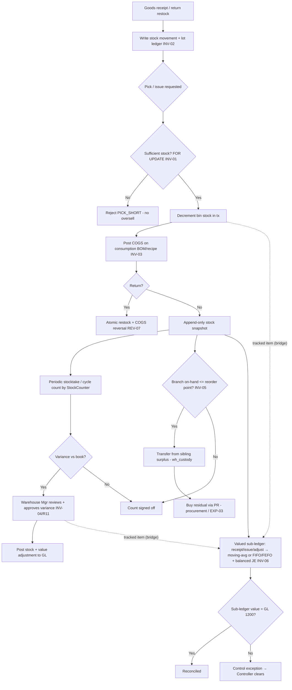

# Inventory & COGS — Process Narrative

## 1. Document control

| Field | Value |
|---|---|
| Process ID | PN-03-INV |
| Process owner | `<<Warehouse Manager / Controller>>` |
| Approver | `<<CFO>>` |
| Version | **0.1 DRAFT** |
| Effective date | `<<effective-date>>` |
| Review cadence | Annual + on significant change |
| Related RCM controls | INV-01, INV-02, INV-03, INV-04, INV-05, INV-06, INV-07, INV-08, REV-07; SoD R11, EXP-03 |
| Related policy | `compliance/policies/11-financial-close-policy.md`, `compliance/policies/13-segregation-of-duties-policy.md` |

## 2. Purpose

To control inventory movements and cost of goods sold so that the perpetual inventory is **complete and accurate**, stock cannot be **oversold**, COGS is **costed and posted accurately on consumption**, and physical-to-book differences are **counted, reviewed, and approved**.

## 3. Scope

**In scope:** stock snapshots (append-only, partitioned), stock movements, lot/expiry ledger, WMS pick under lock, **storage layout (bin position/size + capacity) with a 2D/3D warehouse view, item-locate, and bin-capacity integrity on putaway (INV-08)**, stocktake / cycle count with variance approval, COGS posting on consumption (including recipe/BOM deduction and reversal on return), and branch-aware replenishment (transfer-before-buy routing over per-branch `branch_stock`).

**Out of scope:** goods-receipt approval flow (see `02-procure-to-pay.md`), sales/refund cash flow (see `01-order-to-cash.md`), GL period close (see `04-general-ledger-close.md`).

## 4. References

- ISO 9001:2015 cl. 4.4, cl. 8.5.1 (control of production/service provision), cl. 8.5.4 (preservation).
- `compliance/Oshinei_ERP_SOX_RCM_v1.xlsx` — INV-01..05, REV-07.
- `compliance/policies/13-segregation-of-duties-policy.md` (R11 adjust vs count; INV-05 transfer-custody vs buy-approval).
- Code: `apps/api/src/modules/wms/` (incl. `replenishment.service.ts`), `apps/api/src/modules/stock-ops/`, `apps/api/src/modules/lots/`, `apps/api/src/modules/costing/`, `apps/api/src/modules/menu/` (recipe), `apps/api/src/modules/returns/returns.service.ts`, `apps/api/src/modules/inventory/inventory-ledger.service.ts` (perpetual valued sub-ledger, **INV-06**). Schema: `branch_stock`, `item_supplier` (migration `0130`); `inv_moves`/`inv_balances`/`inv_cost_layers` (migrations `0131`/`0132`).

## 5. Definitions & abbreviations

| Term | Meaning |
|---|---|
| Perpetual inventory | Continuously updated stock ledger |
| Bin / lot | Storage location / batch with expiry |
| FOR UPDATE | Row lock serializing concurrent stock picks |
| Cycle count | Periodic partial physical count |
| COGS | Cost of Goods Sold |
| BOM / recipe | Bill of materials / menu recipe driving consumption |
| Valued sub-ledger | Perpetual ledger holding qty **and value** per item/location (moving-average, or FIFO/FEFO cost layers) |
| Moving-average cost | Running weighted-average unit cost recomputed on each valued receipt (default method) |
| Cost layer | A FIFO/FEFO receipt lot carrying remaining qty + unit cost (+ lot/expiry) consumed on issue |
| FIFO / FEFO | First-In-First-Out / First-Expiry-First-Out — the order cost layers are consumed |
| Inventory control account | GL account 1200; its balance must equal the inventory sub-ledger value |

## 6. Roles & responsibilities (RACI)

SoD rule **R11**: the role that **adjusts** inventory (InventoryController) is never the role that has **stock custody and counts** it (StockCounter / WarehouseOperator); variance approval is independent.

| Activity | WarehouseOperator | InventoryController | StockCounter | Warehouse Mgr | FinancialController |
|---|---|---|---|---|---|
| Receive / pick / move stock | **A/R** | C | I | A | I |
| Record stock movement / lot ledger | **A/R** | C | I | A | I |
| Adjust inventory (`wh_adjust`) | I | **A/R** | I | A | C |
| Physical count / cycle count (`wh_count`) | C | I | **A/R** | A | I |
| Approve count variance | I | I | I | **A/R** | C |
| Review COGS posting | I | C | I | I | **A/R** |

## 7. Process narrative

1. **Receipt into stock.** On goods receipt (from P2P) and returns (restock), the perpetual stock-movement ledger and lot/expiry ledger are written for every issue/receipt/return — completeness of the perpetual record (**INV-02**).
2. **Pick / issue under lock (decision point).** WMS pick decrements bin stock inside a transaction holding `FOR UPDATE`; a sufficiency check serializes concurrent picks so two terminals selling the last unit cannot oversell → one succeeds, the other gets `PICK_SHORT` (**INV-01**).
3. **COGS on consumption.** Inventory costing posts COGS on consumption; recipe/BOM deduction drives ingredient consumption, with reversal on return — COGS accurately reflects what was consumed (**INV-03**). The COGS journal posts to the GL (GL-01).
4. **Return reversal.** A return reverses the stock and the COGS atomically as part of the single return transaction (**REV-07**, see `01-order-to-cash.md`).
5. **Stock snapshots.** Append-only, partitioned snapshots provide a tamper-resistant point-in-time stock position used for valuation and reconciliation.
6. **Stocktake / cycle count (decision point).** StockCounter performs a periodic count (segregated from adjustment, **R11**). Counted vs book quantity yields a variance.
7. **Variance review & approval.** Warehouse Mgr reviews and approves the variance; an approved adjustment posts the stock and value correction. Adjustment authority (InventoryController) is separated from counting (**INV-04**, **R11**). FinancialController reviews the resulting GL impact.
8. **Branch-aware replenishment — transfer-before-buy (decision point).** Sales (POS direct + recipe/BOM consumption) deplete the selling branch's `branch_stock` alongside the tenant rollup, so each outlet's on-hand is real. When a branch's on-hand for an item falls to/below its reorder point, the Planner recomputes replenishment, which proposes fulfilment in priority order: first an **inter-branch transfer** drawn from a sibling branch that holds surplus (largest-surplus-first, capped at the shortfall), then a **buy** (purchase requisition) for only the residual the transfers cannot cover. Transfer execution is a **warehouse-custody** duty (`POST /api/replenishment/auto-transfer`, `wh_custody`) that moves `branch_stock` source→destination and writes a branch-attributed `cust_stock_log` entry for both legs (`Transfer-Out`/`Transfer-In`); the buy leg raises a PR through the **maker-checker** procurement flow (`POST /api/replenishment/auto-pr`, `procurement` → **EXP-03**). The two legs are segregated so the person moving stock is not the person authorising the spend (**INV-05**). The global `stock_movements` audit row is also written, but the authoritative tenant-scoped record is `branch_stock` + `cust_stock_log`.
9. **Perpetual valued sub-ledger + GL reconciliation (decision point).** For costed flows, the perpetual **valued** sub-ledger (`inv_moves` / `inv_balances`) records every receipt, issue, and adjustment with a **moving-average** unit cost and posts a **balanced journal entry** for each financial move — receipt `Dr 1200 Inventory / Cr 2000 AP`, issue `Dr 5000 COGS / Cr 1200`, shrinkage adjustment `Dr 5810 / Cr 1200`. Posting is **idempotent** on the source reference (a duplicate goods-receipt is a no-op — no double stock or GL), and an **issue beyond on-hand is rejected** (no negative/oversold stock, reinforcing **INV-01**). Periodically the sub-ledger value is **reconciled to the GL inventory control account (1200)**; any difference is a control exception for the Controller to clear (**INV-06**). This sub-ledger is self-contained and does **not** re-post COGS on the POS sale path (which already relieves recipe COGS via 5300), so consumption is never double-costed. **Write-off maker-checker (INV-07):** an ad-hoc **negative** adjustment (a write-off via `POST /api/inventory/adjustments`) is now a **request** that posts **nothing** — no variance JE, no FIFO/FEFO layer consumption, no balance change — until a **different** `wh_adjust` holder approves it (`POST /api/inventory/writeoffs/:id/approve`); a self-approve is rejected `SOD_VIOLATION` (binds **even Admin**), only one write-off may be pending per item/location, and a reject leaves stock untouched. On approval the real valued write-off runs atomically against current stock (`Dr 5810 / Cr 1200`). A **positive** adjustment (overage/found) and the **stocktake** count-variance posting (step 7 — the count is itself the authorizing document) post immediately and are out of scope. So one person can never write stock off the books to conceal a shortage they caused (**INV-07**, **R11**).
10. **Stock-ops bridge (tracked vs legacy items).** An item becomes **perpetual-tracked** once it has a valued balance (established by a valued goods-receipt). For a tracked item, the existing stock-ops operations — **goods issue** (step 2/3), **inter-location transfer**, and the **stocktake-variance posting** (step 7) — *also* drive the valued sub-ledger: an issue relieves stock at moving-average and books COGS, a transfer moves qty + value between locations (value-neutral), and posting a stocktake brings the valued on-hand to the counted quantity and books the value variance to the GL. **Legacy snapshot-only items** (no valued balance) are unaffected and keep the audit-only movement path, so the bridge is additive and backward-compatible. Costing basis is selectable per item (set on first receipt): **moving-average** (default) or **FIFO / FEFO cost layers**. For FIFO/FEFO items each valued receipt opens a **cost layer** (carrying its lot + expiry); an issue consumes layers in order — **FEFO = soonest-expiry-first** (waste control for perishables), **FIFO = oldest-receipt-first** — and books COGS at the **actual consumed layer cost**; a transfer moves the consumed layers to the destination; `inv_balances.total_value` always equals the remaining-layer value, so INV-06 reconciliation holds for either method. This is the inventory-costing engine feeding INV-03; standard-cost / PPV flows remain in the manufacturing-costing cycle (MFG-03). **Costing-engine boundary:** an item is valued by **exactly one** engine — this perpetual sub-ledger **or** the `costing` module (FIFO/AVG/STD, capitalized on procurement GR). They are **mutually exclusive per item** (a per-item `item_costing` row ⟂ an `inv_balances` row); a receipt or a `costing` method-assignment that would place an item under both is rejected with `CONFLICTING_COSTING`, so inventory is never double-capitalized to account 1200.

11. **Storage layout, item-locate & bin-capacity integrity (decision point — INV-08).** Every storage bin carries a physical **position** (`pos_x` aisle axis, `pos_y` depth, `pos_z` level/height) and **size** (`dim_w/d/h`) plus a **capacity** (max units), so the warehouse can be drawn as a 2D floor plan / 3D model (`GET /api/wms/layout` — bins + live **utilisation** = on-hand ÷ capacity, flagging over-capacity bins) and any item's exact bin(s) found spatially (`GET /api/wms/locate?item_id=`). Geometry is set on the bin (`POST /api/wms/bins`, `PATCH /api/wms/bins/:code/layout`, duty `locations`/`warehouse`). **Capacity is enforced on putaway:** a receipt that would fill a bin past its capacity is rejected `BIN_CAPACITY_EXCEEDED` (`422`) and **no** `bin_stock` moves, so stock is never silently over-stuffed into a bin or held in an unrecorded overflow location — the perpetual location records stay accurate (**INV-08**). Bins without a capacity are unconstrained (back-compat). This is a physical-location control; it posts **no GL** (WMS moves are value-neutral; COGS is booked at issue per step 3/9).

## 8. Process flow

**Swimlane description by role:** The **system** enforces the no-oversell pick lock, perpetual movement logging, and COGS posting. **WarehouseOperator** receives/picks/moves. **StockCounter** counts (custody/count duty). **InventoryController** raises adjustments — never counts the same stock (**R11**). **Warehouse Mgr** independently approves variances. **FinancialController** reviews COGS and adjustment postings.

## 9. Control matrix

| Step | Risk | Control | Type | RCM ID | Evidence / Record |
|---|---|---|---|---|---|
| 2 | Oversell / negative stock under concurrency | Bin decrement under `FOR UPDATE` + sufficiency check | Prev / Auto | INV-01 | Concurrency test; `PICK_SHORT` |
| 1 | Stock movements not recorded | Perpetual movement + lot ledger logging | Det / Auto | INV-02 | Stock ledger tie-out |
| 3 | COGS misstated / consumption uncosted | Costing → COGS posting; BOM deduction + reversal | Auto | INV-03 | COGS tie-out sample |
| 4 | Return leaves partial stock/GL state | Atomic return (restock + COGS reversal) | Prev / Auto | REV-07 | Atomicity test |
| 6,7 | Book vs physical diverges; concealed shrink | Cycle count + independent variance approval | Det / Hybrid | INV-04 | Count sheets, signed variance |
| 6,7 | Adjuster also counts (hide shrink) | SoD: `wh_adjust` vs `wh_count` segregated | Prev / Manual | R11 | SoD conflict report |
| 9 | Stock written off the books to conceal a shortage (theft) | **System-enforced maker-checker on ad-hoc write-offs**: a negative adjustment is a request that posts nothing until a *different* `wh_adjust` holder approves (self-approve → `SOD_VIOLATION`, binds even Admin); one pending per item/location; positive + stocktake adjustments post immediately | **Prev / Auto** | **INV-07**, R11 | Write-off request register + SoD test |
| 11 | Stock mis-located / stored beyond a bin's capacity (unrecorded overflow → loss/shrink, broken location records) | **Bin-capacity integrity**: putaway rejects a receipt that would exceed a bin's defined capacity (`BIN_CAPACITY_EXCEEDED`, no stock moves); layout reports utilisation + over-capacity bins; locate gives the exact bin(s) holding an item | **Prev / Auto** | **INV-08** | Capacity test + layout/locate read |
| 8 | Over-buy while a sibling branch holds idle surplus; stock moved between branches without attribution / segregation | Transfer-before-buy routing; branch-attributed transfer log; transfer custody (`wh_custody`) segregated from PR approval (`procurement`/EXP-03) | Prev/Det / Hybrid | INV-05 | Replenishment run log; inter-branch transfer log; residual PR |
| 9 | Perpetual stock value drifts from GL; uncosted/unposted moves | Valued sub-ledger posts a balanced JE per move (moving-avg or FIFO/FEFO); periodic reconcile to GL 1200 | Prev / Det / Auto | INV-06 | Reconciliation report (`GET /api/inventory/reconciliation`) |
| 9 | Duplicate goods-receipt double-counts stock/GL | Idempotent posting on source ref (+ GL `ux_je_idem`) | Prev / Auto | INV-06 (INV-02) | `deduped:true`; single JE |
| 10 | Stock-ops issue/transfer/count not costed for tracked items | Bridge posts valued moves (COGS / variance / value-move) for tracked items; legacy items audit-only | Prev / Auto | INV-06 | `valued_lines` in response; reconcile ties |

## 10. Inputs & outputs

**Inputs:** goods receipts, sales/issue requests, returns, BOM/recipes, count sheets, lot/expiry data.
**Outputs:** stock movements, lot ledger entries, stock snapshots, COGS journal entries, count variances + adjustments.

## 11. Records & retention

| Record | Store | Retention |
|---|---|---|
| Stock movements / lot ledger | Application DB (RLS-scoped) | `<<7 years>>` |
| Stock snapshots (partitioned, append-only) | Application DB | `<<7 years>>` |
| Cycle-count sheets + variance approvals | Application DB | `<<7 years>>` |
| COGS / adjustment journal entries | Ledger | `<<7 years>>` |
| Mutation audit trail | `audit_log` | `<<7 years>>` |

## 12. KPIs / metrics

- Oversell attempts blocked (`PICK_SHORT` count; target: no negative stock).
- Cycle-count variance rate and value; approved vs unapproved adjustments.
- COGS posting exceptions (uncosted consumption; target: 0).
- Expired-lot write-offs.
- **Food-cost variance (actual vs theoretical).** `GET /api/menu/food-cost/variance?from=&to=` values the EOD-count quantity variances (`cust_variance`: actual − theoretical use) at each ingredient's cost over a date window and rolls them up — theoretical vs actual cost, net variance (฿ and % of theoretical), unfavourable (over-portioning/waste/shrinkage) vs favourable split, and per-ingredient anomalies (|variance| ≥ 5% Medium / ≥ 10% High). Detective analytics over the INV-04 count data — surfaces shrinkage that recipe-theoretical costing alone can't.

## 13. Exception & error handling

| Error code | Trigger | Handling |
|---|---|---|
| `PICK_SHORT` | Insufficient stock for pick | Re-source / backorder; investigate book vs physical |
| (variance) | Count ≠ book | Warehouse Mgr review + approval before adjustment |
| `SOD_VIOLATION` / SoD conflict | `wh_adjust`+`wh_count` on one user | AccessAdmin remediates (R11) |
| `NEG_STOCK` | Sub-ledger issue/adjustment beyond on-hand | Rejected; recount / receive before issuing (INV-01/INV-06) |
| `REASON_REQUIRED` | Stock adjustment posted with no reason | Rejected; re-submit with justification (INV-04/INV-06) |

## 14. Revision history

| Version | Date | Author | Summary |
|---|---|---|---|
| 0.1 DRAFT | 2026-06-22 | `<<author>>` | Initial draft. |
| 0.2 | 2026-06-23 | Platform | **Food-cost variance (actual vs theoretical):** §12 — costed roll-up of EOD-count quantity variances (`GET /api/menu/food-cost/variance`), valuing `cust_variance` at ingredient cost with unfavourable/favourable split + anomaly flags. Reporting layer over INV-04; no new control. |
| 0.3 | 2026-06-26 | Platform | **INV-07 — inventory write-off maker-checker (SoD), system-enforced.** Step 9: an ad-hoc **negative** stock adjustment (a write-off) on `POST /api/inventory/adjustments` is now a **request** that posts nothing — no variance JE / no FIFO/FEFO layer consumption / no balance change — until a **different** `wh_adjust` holder approves (`POST /api/inventory/writeoffs/:id/approve`); self-approve → `SOD_VIOLATION` (binds even Admin); one pending per item/location; reject leaves stock untouched. Positive adjustments + stocktake count-variances (the count is the authorizing document) post immediately. New table `inv_writeoff_requests` (migration `0136`, RLS-scoped). New RCM control **INV-07** (RCM now 83); control matrix gains a step-9 authorization row. New `/inventory-ledger` "อนุมัติตัดสต๊อก" tab. ToE: `basics` + `compliance` (request→nothing-posted→self-approve 403→approve→applied); `stock-ops` confirms the stocktake bridge still posts immediately. Manual `04-warehouse-inventory.md` + UAT `04-inventory-uat.md` updated. |
| 0.3 | 2026-06-25 | Platform | **Branch-aware replenishment (transfer-before-buy):** new control **INV-05**. §3/§4 scope+refs, §7 step 8, §8 flow nodes N/O/P, §9 control-matrix row. Per-branch `branch_stock` ledger (alongside the tenant `customer_inventory` rollup) depleted by POS direct + recipe/BOM consumption; low (branch,item) routes a sibling-branch transfer first (`auto-transfer`, `wh_custody`), then a residual PR (`auto-pr`, `procurement`/EXP-03). Schema `branch_stock` + `item_supplier`, migration `0130`. ToE in `cutover/wms.ts`. |
| 0.4 | 2026-06-25 | Platform | **Perpetual valued inventory sub-ledger (new control INV-06):** §5 definitions, §7 step 9, §8 workflow, §9 control matrix, §13 error codes. `inv_moves`/`inv_balances` (migration 0131) record moving-average cost + post a balanced JE per receipt/issue/adjustment (`inventory-ledger.service.ts`), with idempotent posting, negative-stock prevention, and sub-ledger↔GL 1200 reconciliation (`GET /api/inventory/reconciliation`). Strengthens INV-01/INV-02/INV-04. ToE in `basics.ts` + `compliance.ts`. |
| 0.5 | 2026-06-25 | Platform | **Stock-ops → perpetual sub-ledger bridge (Tier 1):** §7 step 10 + §8/§9. For perpetual-tracked items, `stock-ops.service.ts` goods-issue / transfer / stocktake-variance now also post valued moves through the sub-ledger (COGS / value-move / count variance to GL); legacy snapshot-only items stay audit-only (additive, backward-compatible). ToE extended in `tools/cutover/src/stock-ops.ts` (tracked item B end-to-end → reconciled). No new control ID (extends INV-06). |
| 0.6 | 2026-06-25 | Platform | **FIFO/FEFO cost-layer costing (Tier 1 lots/costing):** §5 definitions + §7 step 10. Migration 0132 adds `inv_cost_layers` + `inv_balances.costing_method` (moving_avg default \| fifo \| fefo). Receipts open layers (lot/expiry); issues/shrinkage consume FEFO/FIFO at actual layer cost; transfers move layer slices; `GET /api/inventory/layers` exposes open layers. Valuation + INV-06 reconciliation unchanged. ToE in `basics.ts` (FEFO: COGS 174 ≠ 162 moving-avg, reconciled). No new control ID (extends INV-06). |
| 0.7 | 2026-06-25 | Platform | **Costing-engine boundary (INV-06 ↔ `costing` module reconciliation):** §7 step 10. The perpetual sub-ledger and the pre-existing `costing` module (FIFO/AVG/STD, capitalized on procurement GR) are now **mutually exclusive per item** — `InventoryLedgerService.receive` rejects an item with a per-item `item_costing` row, and `CostingService.setMethod` rejects an item with an `inv_balances` row, both with `CONFLICTING_COSTING`. Closes the double-capitalization-to-1200 risk from the two parallel valuation engines. No new control / no migration. ToE: `basics.ts` (INV-06 side) + `costing.ts` (reverse). |
| 0.8 | 2026-06-26 | Platform | **WMS storage layout + 3D view + bin-capacity integrity (new control INV-08).** §3 scope, §7 step 11, §9 control matrix. Bins gain physical geometry — `pos_x/pos_y/pos_z` + `dim_w/dim_d/dim_h` (migration `0138`) — alongside the existing `capacity`. New endpoints: `GET /api/wms/layout` (bins + live utilisation, over-capacity flag), `GET /api/wms/locate?item_id=` (spatial item-find), `PATCH /api/wms/bins/:code/layout`; `POST /api/wms/bins` extended. **Putaway now enforces capacity** — a receipt past a bin's capacity → `422 BIN_CAPACITY_EXCEEDED`, no `bin_stock` move (bins without a capacity stay unconstrained). New `/wms` "ผังคลัง 3D" tab renders the warehouse with **react-three-fiber** (bins coloured by utilisation, click-to-inspect, item-search highlight). New RCM control **INV-08** (RCM now 93). ToE: `wms` harness (layout/locate/capacity) + `compliance` (INV-08). Manual `04-warehouse-inventory.md` + UAT `04-inventory-uat.md` + traceability matrix updated. |
