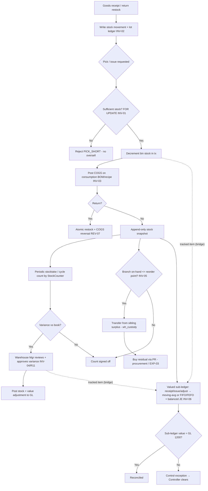
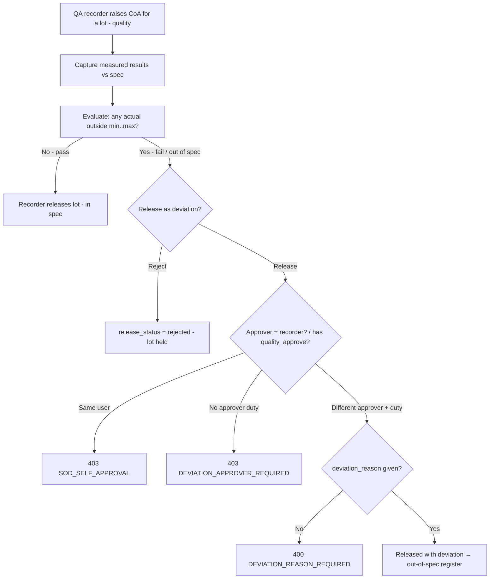
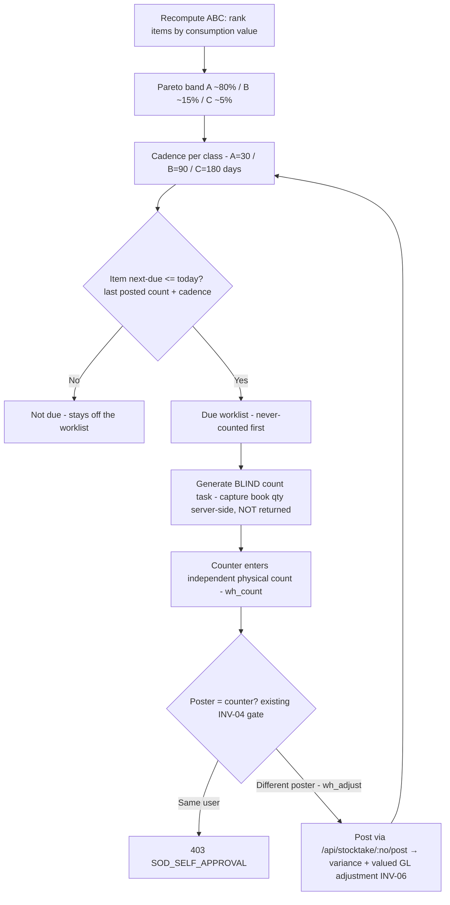

# Inventory & COGS — Process Narrative

## 1. Document control

| Field | Value |
|---|---|
| Process ID | PN-03-INV |
| Process owner | `<<Warehouse Manager / Controller>>` |
| Approver | `<<CFO>>` |
| Version | **0.1 DRAFT** |
| Effective date | `<<effective-date>>` |
| Review cadence | Annual + on significant change |
| Related RCM controls | INV-01, INV-02, INV-03, INV-04, INV-05, INV-06, INV-07, INV-08, INV-09, INV-10, INV-15, INV-17, QC-03, REV-07; SoD R11, R21, EXP-03 |
| Related RCM controls | INV-01, INV-02, INV-03, INV-04, INV-05, INV-06, INV-07, INV-08, INV-09, INV-10, INV-15, INV-16, QC-03, REV-07; SoD R11, R21, EXP-03 |
| Related RCM controls | INV-01, INV-02, INV-03, INV-04, INV-05, INV-06, INV-07, INV-08, INV-09, INV-10, INV-15, INV-18, QC-03, REV-07; SoD R11, R21, EXP-03 |
| Related policy | `compliance/policies/11-financial-close-policy.md`, `compliance/policies/13-segregation-of-duties-policy.md` |

## 2. Purpose

To control inventory movements and cost of goods sold so that the perpetual inventory is **complete and accurate**, stock cannot be **oversold**, COGS is **costed and posted accurately on consumption**, and physical-to-book differences are **counted, reviewed, and approved**.

## 3. Scope

**In scope:** stock snapshots (append-only, partitioned), stock movements, lot/expiry ledger, WMS pick under lock, **storage layout (bin position/size + capacity) with a 2D/3D warehouse view, item-locate, and bin-capacity integrity on putaway (INV-08)**, stocktake / cycle count with variance approval, COGS posting on consumption (including recipe/BOM deduction and reversal on return), and branch-aware replenishment (transfer-before-buy routing over per-branch `branch_stock`).

**Out of scope:** goods-receipt approval flow (see `02-procure-to-pay.md`), sales/refund cash flow (see `01-order-to-cash.md`), GL period close (see `04-general-ledger-close.md`).

## 4. References

- ISO 9001:2015 cl. 4.4, cl. 8.5.1 (control of production/service provision), cl. 8.5.4 (preservation).
- `compliance/Oshinei_ERP_SOX_RCM_v1.xlsx` — INV-01..05, REV-07.
- `compliance/policies/13-segregation-of-duties-policy.md` (R11 adjust vs count; INV-05 transfer-custody vs buy-approval).
- Code: `apps/api/src/modules/wms/` (incl. `replenishment.service.ts`), `apps/api/src/modules/stock-ops/`, `apps/api/src/modules/lots/`, `apps/api/src/modules/costing/`, `apps/api/src/modules/menu/` (recipe), `apps/api/src/modules/returns/returns.service.ts`, `apps/api/src/modules/inventory/inventory-ledger.service.ts` (perpetual valued sub-ledger, **INV-06**). Schema: `branch_stock`, `item_supplier` (migration `0130`); `inv_moves`/`inv_balances`/`inv_cost_layers` (migrations `0131`/`0132`).

## 5. Definitions & abbreviations

| Term | Meaning |
|---|---|
| Perpetual inventory | Continuously updated stock ledger |
| Bin / lot | Storage location / batch with expiry |
| FOR UPDATE | Row lock serializing concurrent stock picks |
| Cycle count | Periodic partial physical count |
| COGS | Cost of Goods Sold |
| BOM / recipe | Bill of materials / menu recipe driving consumption |
| Valued sub-ledger | Perpetual ledger holding qty **and value** per item/location (moving-average, or FIFO/FEFO cost layers) |
| Moving-average cost | Running weighted-average unit cost recomputed on each valued receipt (default method) |
| Cost layer | A FIFO/FEFO receipt lot carrying remaining qty + unit cost (+ lot/expiry) consumed on issue |
| FIFO / FEFO | First-In-First-Out / First-Expiry-First-Out — the order cost layers are consumed |
| Inventory control account | GL account 1200; its balance must equal the inventory sub-ledger value |

## 6. Roles & responsibilities (RACI)

SoD rule **R11**: the role that **adjusts** inventory (InventoryController) is never the role that has **stock custody and counts** it (StockCounter / WarehouseOperator); variance approval is independent.

| Activity | WarehouseOperator | InventoryController | StockCounter | Warehouse Mgr | FinancialController |
|---|---|---|---|---|---|
| Receive / pick / move stock | **A/R** | C | I | A | I |
| Record stock movement / lot ledger | **A/R** | C | I | A | I |
| Adjust inventory (`wh_adjust`) | I | **A/R** | I | A | C |
| Physical count / cycle count (`wh_count`) | C | I | **A/R** | A | I |
| Approve count variance | I | I | I | **A/R** | C |
| Review COGS posting | I | C | I | I | **A/R** |

## 7. Process narrative

1. **Receipt into stock.** On goods receipt (from P2P) and returns (restock), the perpetual stock-movement ledger and lot/expiry ledger are written for every issue/receipt/return — completeness of the perpetual record (**INV-02**).
2. **Pick / issue under lock (decision point).** WMS pick decrements bin stock inside a transaction holding `FOR UPDATE`; a sufficiency check serializes concurrent picks so two terminals selling the last unit cannot oversell → one succeeds, the other gets `PICK_SHORT` (**INV-01**).
3. **COGS on consumption.** Inventory costing posts COGS on consumption; recipe/BOM deduction drives ingredient consumption, with reversal on return — COGS accurately reflects what was consumed (**INV-03**). The COGS journal posts to the GL (GL-01). **Modifier COGS (Step 1):** a chosen POS modifier option (e.g. "extra patty") now carries a standard `cogs_delta`; at checkout the sold line's COGS includes `Σ(cogs_delta × qty)` (`Dr 5300 / Cr 1200`, folded into the same `POS-COGS` entry), so menu add-ons no longer move price (`price_delta`) without moving cost of goods — closing a menu-variance leak (**INV-03**). `recipe_ref_id` on the option is a reserved hook for future ingredient-level deduction. **Yield/waste factors (Step 3):** each BoM line carries a `yield_factor` (usable portion after trim, ≤1) and `waste_factor` (expected extra shrink); the edible `qty_per` is inflated to the **gross** raw consumption `qty_per / (yield_factor − waste_factor)` for both stock deduction and recipe COGS — so margins reflect what the kitchen actually issues, not a 100%-yield fiction. Defaults (1.0 / 0.0) leave existing recipes unchanged; a non-positive divisor safely falls back to 100% yield (no divide-by-zero).
4. **Return reversal.** A return reverses the stock and the COGS atomically as part of the single return transaction (**REV-07**, see `01-order-to-cash.md`).
5. **Stock snapshots.** Append-only, partitioned snapshots provide a tamper-resistant point-in-time stock position used for valuation and reconciliation.
6. **Stocktake / cycle count (decision point).** StockCounter performs a periodic count (segregated from adjustment, **R11**). Counted vs book quantity yields a variance. **Item capture:** items carry printable universal QR labels (`POST /api/inventory/qr/labels`, payload `ITEM_ID:<id>|DESC:..|UOM:..`); on `/stocktake`, `/goods-issue` and the `/mobile-scan` session flow a line can be captured three ways off the same tag — a **camera scanner** (native `BarcodeDetector` where present, else a lazy-loaded JS decoder so it works on **any browser with a camera**; reads QR **and** 1D barcodes, with beep/haptic feedback, a torch toggle, and continuous multi-scan in a scan session), a **hardware wedge scanner**, or manual entry. Scanned text is parsed by the shared `parseQrPayload` (which also unwraps a `/q?d=` deep-link URL and falls back to `ASSET_ID`/bare codes via `scanCodeId`, so an asset or bare tag is no longer silently dropped). A phone’s native camera scanning a deep-link tag opens the public resolver `/q` (`GET /api/scan/sessions/resolve`). This is capture only — the variance/GL controls (steps 7, 9) are unchanged.
7. **Variance review & approval.** Warehouse Mgr reviews and approves the variance; an approved adjustment posts the stock and value correction. Adjustment authority (InventoryController) is separated from counting (**INV-04**, **R11**). FinancialController reviews the resulting GL impact.
8. **Branch-aware replenishment — transfer-before-buy (decision point).** Sales (POS direct + recipe/BOM consumption) deplete the selling branch's `branch_stock` alongside the tenant rollup, so each outlet's on-hand is real. When a branch's on-hand for an item falls to/below its reorder point, the Planner recomputes replenishment, which proposes fulfilment in priority order: first an **inter-branch transfer** drawn from a sibling branch that holds surplus (largest-surplus-first, capped at the shortfall), then a **buy** (purchase requisition) for only the residual the transfers cannot cover. Transfer execution is a **warehouse-custody** duty (`POST /api/replenishment/auto-transfer`, `wh_custody`) that moves `branch_stock` source→destination and writes a branch-attributed `cust_stock_log` entry for both legs (`Transfer-Out`/`Transfer-In`); the buy leg raises a PR through the **maker-checker** procurement flow (`POST /api/replenishment/auto-pr`, `procurement` → **EXP-03**). The two legs are segregated so the person moving stock is not the person authorising the spend (**INV-05**). The global `stock_movements` audit row is also written, but the authoritative tenant-scoped record is `branch_stock` + `cust_stock_log`.
9. **Perpetual valued sub-ledger + GL reconciliation (decision point).** For costed flows, the perpetual **valued** sub-ledger (`inv_moves` / `inv_balances`) records every receipt, issue, and adjustment with a **moving-average** unit cost and posts a **balanced journal entry** for each financial move — receipt `Dr 1200 Inventory / Cr 2000 AP`, issue `Dr 5000 COGS / Cr 1200`, shrinkage adjustment `Dr 5810 / Cr 1200`. Posting is **idempotent** on the source reference (a duplicate goods-receipt is a no-op — no double stock or GL), and an **issue beyond on-hand is rejected** (no negative/oversold stock, reinforcing **INV-01**). Periodically the sub-ledger value is **reconciled to the GL inventory control account (1200)**; any difference is a control exception for the Controller to clear (**INV-06**). This sub-ledger is self-contained and does **not** re-post COGS on the POS sale path (which already relieves recipe COGS via 5300), so consumption is never double-costed. **Write-off maker-checker (INV-07):** an ad-hoc **negative** adjustment (a write-off via `POST /api/inventory/adjustments`) is now a **request** that posts **nothing** — no variance JE, no FIFO/FEFO layer consumption, no balance change — until a **different** `wh_adjust` holder approves it (`POST /api/inventory/writeoffs/:id/approve`); a self-approve is rejected `SOD_VIOLATION` (binds **even Admin**), only one write-off may be pending per item/location, and a reject leaves stock untouched. On approval the real valued write-off runs atomically against current stock (`Dr 5810 / Cr 1200`). A **positive** adjustment (overage/found) and the **stocktake** count-variance posting (step 7 — the count is itself the authorizing document) post immediately and are out of scope. So one person can never write stock off the books to conceal a shortage they caused (**INV-07**, **R11**).
10. **Stock-ops bridge (tracked vs legacy items).** An item becomes **perpetual-tracked** once it has a valued balance (established by a valued goods-receipt). For a tracked item, the existing stock-ops operations — **goods issue** (step 2/3), **inter-location transfer**, and the **stocktake-variance posting** (step 7) — *also* drive the valued sub-ledger: an issue relieves stock at moving-average and books COGS, a transfer moves qty + value between locations (value-neutral), and posting a stocktake brings the valued on-hand to the counted quantity and books the value variance to the GL. **Legacy snapshot-only items** (no valued balance) are unaffected and keep the audit-only movement path, so the bridge is additive and backward-compatible. Costing basis is selectable per item (set on first receipt): **moving-average** (default) or **FIFO / FEFO cost layers**. For FIFO/FEFO items each valued receipt opens a **cost layer** (carrying its lot + expiry); an issue consumes layers in order — **FEFO = soonest-expiry-first** (waste control for perishables), **FIFO = oldest-receipt-first** — and books COGS at the **actual consumed layer cost**; a transfer moves the consumed layers to the destination; `inv_balances.total_value` always equals the remaining-layer value, so INV-06 reconciliation holds for either method. This is the inventory-costing engine feeding INV-03; standard-cost / PPV flows remain in the manufacturing-costing cycle (MFG-03). **Costing-engine boundary:** an item is valued by **exactly one** engine — this perpetual sub-ledger **or** the `costing` module (FIFO/AVG/STD, capitalized on procurement GR). They are **mutually exclusive per item** (a per-item `item_costing` row ⟂ an `inv_balances` row); a receipt or a `costing` method-assignment that would place an item under both is rejected with `CONFLICTING_COSTING`, so inventory is never double-capitalized to account 1200.

11. **Storage layout, item-locate & bin-capacity integrity (decision point — INV-08).** Every storage bin carries a physical **position** (`pos_x` aisle axis, `pos_y` depth, `pos_z` level/height) and **size** (`dim_w/d/h`) plus a **capacity** (max units), so the warehouse can be drawn as a 2D floor plan / 3D model (`GET /api/wms/layout` — bins + live **utilisation** = on-hand ÷ capacity, flagging over-capacity bins) and any item's exact bin(s) found spatially (`GET /api/wms/locate?item_id=`). Geometry is set on the bin (`POST /api/wms/bins`, `PATCH /api/wms/bins/:code/layout`, duty `locations`/`warehouse`). **Capacity is enforced on putaway:** a receipt that would fill a bin past its capacity is rejected `BIN_CAPACITY_EXCEEDED` (`422`) and **no** `bin_stock` moves, so stock is never silently over-stuffed into a bin or held in an unrecorded overflow location — the perpetual location records stay accurate (**INV-08**). Bins without a capacity are unconstrained (back-compat). This is a physical-location control; it posts **no GL** (WMS moves are value-neutral; COGS is booked at issue per step 3/9).

12. **Available-to-promise & reservation integrity (decision point — INV-09).** Available-to-promise is `ATP = on_hand − open_reservations − safety + scheduled_receipts` (open POs within the promise horizon) via `GET /api/costing/atp` / `POST /api/costing/atp/check`. A reservation (`POST /api/costing/allocate`) carries a **lifecycle**: **Open → Fulfilled** (the goods shipped/issued) or **Cancelled** (the order was released). **ATP nets only OPEN reservations.** Two guards keep ATP honest: `allocate` is **idempotent per (tenant, ref_doc, item)** — re-reserving the same document adjusts the one open row instead of stacking duplicates, so a retried order can't inflate reservations — and the additional reservation **may not exceed current ATP** (`INSUFFICIENT_ATP`), so a reservation can never oversell. On cancellation `POST /api/costing/allocations/:refDoc/release` frees the qty back to ATP; on shipment `…/fulfill` retires the reservation from the open pool — because the on-hand reduction is posted by the issue path, the swap is **ATP-neutral and never double-counted**. The reservation register (`GET /api/costing/allocations`) exposes every reservation for review. So available-to-promise reflects only live demand and can't drift low from leaked allocations or oversell stock (**INV-09**).

13. **Waste / spoilage logging (decision point — INV-10).** The kitchen/warehouse logs reason-coded ingredient waste (`POST /api/inventory/waste`; reasons damage / expiry / spoilage / overproduction / prep_error / other). Logging **decrements the ingredient stock** (`customer_inventory` + a `cust_stock_log` Waste row) and, when a **unit cost** is supplied, posts **Dr 5810 Scrap/Waste Loss / Cr 1200 Inventory** (idempotent per `WASTE-` doc — this mirrors recipe COGS, which credits 1200 on consumption); uncosted waste is an operational record with no GL. A **by-reason analytics** view (`GET /api/inventory/waste` → total cost + cost per reason) is the **food-cost lever** — what is wasted, why, and what it costs. **Boundary control:** a **perpetual-tracked** item (one with an `inv_balances` row) is **rejected** here (`USE_WRITEOFF`) and must go through the **INV-07 maker-checker write-off** — so no one can dodge the independent write-off approval by mislabelling shrinkage as "waste", and inventory value is never decremented twice (**INV-10**).

13a. **Waste-ledger closing-the-loop — reason × disposition, void-fired-item capture, usage variance (INV-15).** The single waste ledger of step 13 is extended (POS-5a, migration `0305`) so food-cost loss is fully captured and actionable:
   - **Reason × disposition taxonomy.** Each waste row now carries a **`disposition`** (WHAT happened to the wasted stock — `discard` / `compost` / `donate` / `staff_meal` / `rework` / `return_supplier`, enum-validated → `BAD_DISPOSITION`) alongside the `reason_code` (WHY), and a **`void_fire`** reason is added. The list surfaces a **`by_disposition`** roll-up and a `?disposition=` filter (the by-reason roll-up is unchanged).
   - **Void-fired-item capture.** A **cancelled/voided FIRED ticket line** (the dish was already prepped/cooked before the void) is written off through `POST /api/inventory/waste/void-fire` (`{ sku, qty, disposition?, ref_doc? }`): the dish's recipe (`menu_recipes` / `menu_recipe_lines`) is **exploded** to its gross ingredient quantities (`qty_per ÷ (yield_factor − waste_factor) ÷ batch yield × dishes` — the same food-cost formula as recipe COGS), each ingredient posts a waste row (`source=void_fire`, `ref_doc`=the voided ticket) and decrements stock, and the batch books **one aggregated `Dr 5810 / Cr 1200`** (idempotent per `WASTE-` doc). Guards: `NO_RECIPE` / `NO_RECIPE_LINES`. The INV-07 perpetual boundary still holds — kitchen ingredients (`customer_inventory`) only.
   - **Theoretical-vs-actual usage variance.** `GET /api/inventory/waste/variance` nets the **recipe-COGS theoretical** depletion (the `cust_stock_log` `Consume` rows the recipe deduction writes on every sale) against the **actual** depletion (theoretical + logged `Waste`), per ingredient, valued at cost, with the waste-explained gap and its % of theoretical flagged High (≥10%) / Medium (≥5%). This closes the loop between what the recipe *said* should have been used and what actually left stock (**INV-15**).

13b. **Governed cycle-count program — ABC classification + blind counts (decision point — INV-17).** The ad-hoc stocktake of steps 6–7 is turned into a **risk-based, scheduled program** (INV-3, migration `0341`) so inventory **existence** is assured continuously rather than only at a wall-to-wall count:
   - **ABC classification.** `POST /api/stock-ops/abc/recompute` ranks the tenant's items by **annual consumption value** (Σ goods-issue qty × moving-average unit cost) and **Pareto-bands** them **A** (top ~80% of cumulative value) / **B** (next ~15%) / **C** (last ~5%), persisted per `(tenant,item)` in `item_abc_class` (rank + `cum_pct` + `computed_at/by`); `GET /api/stock-ops/abc` returns the classification. Existence/shrink risk concentrates in the A items, so they are counted most often.
   - **Cadence.** `cycle_count_plans` holds the **days-between-counts per class** (seeded **A=30 / B=90 / C=180** on first recompute; tunable), so class drives frequency.
   - **Due worklist.** `GET /api/stock-ops/cycle-counts/due` lists items whose **next count** (last **POSTED** count date + class cadence) is due or overdue — never-counted items first.
   - **Blind count.** `POST /api/stock-ops/cycle-counts` generates a count **task** and captures the system/book qty **server-side** into a **Draft stocktake** but **never returns it to the counter** (the response carries only the item list). The counter submits an **independent** physical count via `POST /api/stock-ops/cycle-counts/:taskNo/count`. Blind counting stops a counter from copying the book number down to conceal a shortage.
   - **Posting reuses the existing path unchanged.** The variance is posted through the **same** stocktake path — `POST /api/stocktake/:stNo/post` — which enforces the **INV-04 counter≠poster** maker-checker (**SoD R11**: `SOD_SELF_APPROVAL`) and books the **valued GL adjustment** (`inventory-ledger.postCountVariance`, `Dr/Cr 5810↔1200`, **INV-06**). No posting logic is duplicated — the program only **schedules** and **blinds**, then feeds the INV-04/INV-06 post path. All three tables are tenant-scoped (canonical 0232 RLS, tenant-leading indexes) (**INV-17**).

14. **Certificate of Analysis + out-of-spec release maker-checker (decision point — QC-03).** Lots exist in the lot/expiry ledger (step 1) but their quality is separately evidenced. A per-item **quality spec** (`quality_specs`) defines an acceptable `[min_value, max_value]` range per measured characteristic (e.g. Moisture %, pH, Purity %). A **Certificate of Analysis** (`coa_certificates`) is raised against a lot (`lot_no`, source `incoming`/`production`) by the QA recorder (`quality` duty), and its measured results (`coa_results`) are captured; on **evaluate** the CoA's `overall_result` is computed = **fail if ANY characteristic's actual falls outside its `[min,max]` window**, else **pass**. A **PASS** (in-spec) CoA is released by its recorder (routine, `POST /api/quality/coa/:id/release`). A **FAIL** (out-of-spec) lot may be released **only as a documented deviation**: the releaser must (a) hold the **quality-approver** duty `quality_approve`/`exec` (`DEVIATION_APPROVER_REQUIRED` otherwise), (b) be a **different user** than the CoA recorder (`released_by ≠ created_by` → `403 SOD_SELF_APPROVAL`, binds even Admin — the SoD **R21** maker-checker), and (c) supply a **mandatory `deviation_reason`** (`DEVIATION_REASON_REQUIRED`). Release before evaluation is blocked (`COA_NOT_EVALUATED`); a decided CoA cannot be re-actioned (`COA_NOT_HELD`); **reject** holds the lot (`release_status='rejected'`, never released). **Detective:** `GET /api/quality/coa/out-of-spec` is the **deviation register** — CoAs that failed spec yet were released — exactly the audit sample. This control posts **no GL** (it gates the physical release of a lot; costing is booked on issue/consumption per steps 3/9) and never rewrites the read-only lot ledger — the CoA references `lot_no` as text (**QC-03**).

15. **Inter-warehouse/branch transfer order — two-step ship→receive with in-transit ownership + GL (decision point — INV-16).** The instant stock-ops transfer of step 10 records a location-to-location move in one action (value-neutral, no GL) — fine for a same-site move, but when stock physically travels between warehouses or branches it is in transit for a period and belongs at neither end. A **transfer order** (`transfer_orders` / `transfer_order_lines`, migration `0341`) handles this as **two steps**: it is **created** `Draft` (document only — source/destination + item lines, no stock/GL move); on **ship** (`POST /api/stock-ops/transfer-orders/:no/ship`, `wh_custody`) the source location's valued stock is relieved at **current cost** (moving-average, or consumed FIFO/FEFO layers carried forward on the line) and the value is moved into a **Goods-in-Transit** control account — **`Dr 1255 Goods-in-Transit / Cr 1200 Inventory`** — with each line's cost pinned as a snapshot; on **receive** (`…/:no/receive`) the stock lands at the destination and the in-transit value is relieved back to inventory — **`Dr 1200 Inventory / Cr 1255`**. Between ship and receive the value is isolated in **1255** (seeded in the COA + the SCF `CF_CLASSIFY` operating bucket; **distinct from 1250 Work-in-Process**), so in-transit inventory is neither double-counted at both ends nor lost. **Custody segregation (SoD):** the person who **shipped** may not **receive** the same transfer — an independent custodian confirms arrival (`shipped_by == received_by` → `403 SOD_SELF_APPROVAL`, binds even Admin). A **period-end in-transit aging / cutoff report** (`GET /api/stock-ops/transfer-orders/in-transit/aging`) lists every still-`Shipped` order with its **days-in-transit** and value, bucketed (0-7 / 8-30 / 31+) — the population an auditor tests for **inventory existence/cutoff** at the balance-sheet date; a long-outstanding in-transit line is a cutoff exception. The perpetual sub-ledger stays **tied to GL 1200** across the round-trip (the `INV-GIT` source is in the reconcile set, so ship and receive each move sub-ledger and GL 1200 in lock-step). Status guards: only a `Draft` may ship (`NOT_DRAFT`), only a `Shipped` may receive (`NOT_SHIPPED`); a ship beyond source on-hand is rejected (`NEG_STOCK`); `from == to` is rejected at create (`SAME_LOCATION`). The legacy instant value-neutral transfer (step 10) is unchanged (**INV-16**).
15. **Lot recall / genealogy traceability + lot hold (decision point — INV-18).** Lots exist in the read-only lot/expiry ledger (step 1) but until now could not be **traced** for a recall nor **contained**. Two capabilities close this: (a) **two-way genealogy** — `GET /api/lots/:lotNo/trace` resolves **backward** (lot → `lot_ledger.gr_no` → `goods_receipts` → `purchase_orders` → **supplier/vendor**) and **forward** (lot → issue rows `qty_out>0` → `ref_doc` pick → `pick_lists` → `cust_pos_sales` → **customer/sale/branch**), so a recall investigation scopes both the source supplier and every downstream sale from one call; (b) a one-click **quarantine hold** — `POST /api/lots/:lotNo/hold` (reason-coded, `HOLD-` doc, table `lot_holds`) places the lot on hold, and a held lot is **excluded from BOTH** the FEFO pick-suggestion (`GET /api/lots/fefo/:itemId`, which returns an `excluded_held` count) **and** the WMS wave bin-allocation (`wms.service.suggestPickBin` skips any bin whose lot has an active `Held` row), so a recalled/suspect lot **physically cannot be picked, shipped or sold** while the investigation runs. `POST /api/lots/:lotNo/release` lifts the hold (audit trail retained — `released_by`/`released_at`/`release_reason`) and re-enables picking; releasing a lot that is not held → `LOT_NOT_HELD`, and a trace of an unknown lot → `404 LOT_NOT_FOUND`. Hold/release are gated to the inventory-control duties (`lots`/`warehouse`/`wh_adjust`); the trace read to `lots`/`warehouse`. This control posts **no GL** (it flags/blocks a physical lot; expiry write-off value is still booked via INV-07/INV-10) and never rewrites the read-only lot ledger — `lot_holds` (no `tenant_id` on `lot_ledger`) is a genuinely tenant-scoped table (canonical 0232 RLS, migration `0342`) (**INV-18**).

## 8. Process flow

**Swimlane description by role:** The **system** enforces the no-oversell pick lock, perpetual movement logging, and COGS posting. **WarehouseOperator** receives/picks/moves. **StockCounter** counts (custody/count duty). **InventoryController** raises adjustments — never counts the same stock (**R11**). **Warehouse Mgr** independently approves variances. **FinancialController** reviews COGS and adjustment postings.

**QC-03 — Certificate of Analysis + out-of-spec release maker-checker (quality gate on a lot):**

**Swimlane (QC-03):** the **QA recorder** (`quality`) captures the CoA and evaluates it; the **QA manager / approver** (`quality_approve`/`exec`) — a different person — is the only one who can authorise the release of an out-of-spec lot, with a documented deviation reason. The **out-of-spec register** is the auditor's deviation sample.

**INV-17 — Governed cycle-count program (ABC classification + blind counts):**

**Swimlane (INV-17):** the **Warehouse Mgr / Inventory Controller** (`wh_adjust`) recomputes ABC + tunes cadence and posts variances; the **StockCounter** (`wh_count`) generates and enters the **blind** count but can never see the book qty nor post their own count (**INV-04 / R11**). The program only **schedules** and **blinds** — the variance post + valued GL adjustment is the **unchanged** INV-04/INV-06 path.

## 9. Control matrix

| Step | Risk | Control | Type | RCM ID | Evidence / Record |
|---|---|---|---|---|---|
| 2 | Oversell / negative stock under concurrency | Bin decrement under `FOR UPDATE` + sufficiency check | Prev / Auto | INV-01 | Concurrency test; `PICK_SHORT` |
| 1 | Stock movements not recorded | Perpetual movement + lot ledger logging | Det / Auto | INV-02 | Stock ledger tie-out |
| 3 | COGS misstated / consumption uncosted | Costing → COGS posting; BOM deduction + reversal | Auto | INV-03 | COGS tie-out sample |
| 4 | Return leaves partial stock/GL state | Atomic return (restock + COGS reversal) | Prev / Auto | REV-07 | Atomicity test |
| 6,7 | Book vs physical diverges; concealed shrink | Cycle count + independent variance approval | Det / Hybrid | INV-04 | Count sheets, signed variance |
| 6,7 | Adjuster also counts (hide shrink) | SoD: `wh_adjust` vs `wh_count` segregated | Prev / Manual | R11 | SoD conflict report |
| 9 | Stock written off the books to conceal a shortage (theft) | **System-enforced maker-checker on ad-hoc write-offs**: a negative adjustment is a request that posts nothing until a *different* `wh_adjust` holder approves (self-approve → `SOD_VIOLATION`, binds even Admin); one pending per item/location; positive + stocktake adjustments post immediately | **Prev / Auto** | **INV-07**, R11 | Write-off request register + SoD test |
| 11 | Stock mis-located / stored beyond a bin's capacity (unrecorded overflow → loss/shrink, broken location records) | **Bin-capacity integrity**: putaway rejects a receipt that would exceed a bin's defined capacity (`BIN_CAPACITY_EXCEEDED`, no stock moves); layout reports utilisation + over-capacity bins; locate gives the exact bin(s) holding an item | **Prev / Auto** | **INV-08** | Capacity test + layout/locate read |
| 12 | ATP mis-stated by leaked reservations (false stock-outs) or a reservation overselling stock | **Reservation lifecycle**: ATP nets only OPEN reservations; `allocate` idempotent per ref + refuses to reserve beyond ATP (`INSUFFICIENT_ATP`); `release` frees cancelled, `fulfill` retires shipped (ATP-neutral vs on-hand drop) | **Prev / Auto** | **INV-09** | Reservation register + ATP drift test |
| 13 | Food-cost waste invisible; OR shrinkage mislabelled "waste" to dodge the write-off approval | **Reason-coded waste log**: decrements stock + posts Dr 5810 / Cr 1200 when costed; by-reason analytics; **perpetual-tracked items rejected (`USE_WRITEOFF`)** → must use the INV-07 maker-checker | **Det / Prev / Auto** | **INV-10** | Waste log + by-reason food-cost analytics |
| 13a | Voided fired dish loses its ingredient cost; waste undifferentiated by disposition; recipe-theoretical vs actual depletion never quantified | **Waste-ledger closing-the-loop**: reason × **disposition** taxonomy (+ `by_disposition`); **void-fire** recipe explosion → per-ingredient waste + one aggregated Dr 5810 / Cr 1200; **theoretical-vs-actual usage variance** (`Consume` vs `Waste` depletion, valued, anomaly-banded) | **Det / Auto** | **INV-15** | Waste ledger + by_disposition + void-fire audit + usage-variance report |
| 13b | Existence not assured between counts (no risk-based cadence); a counter copies the book qty down to conceal a shortage | **Governed cycle-count program**: ABC classification by consumption value (A/B/C) drives per-class count **cadence** (A=30/B=90/C=180 days); a cadence-driven **due worklist**; **blind** count (system/book qty never returned to the counter); posting **reuses** the INV-04 counter≠poster maker-checker + the valued GL adjustment | **Prev / Det / Hybrid** | **INV-17**, R11 | ABC snapshot; due worklist; blind count task; INV-04 self-approval block + valued adjustment |
| 8 | Over-buy while a sibling branch holds idle surplus; stock moved between branches without attribution / segregation | Transfer-before-buy routing; branch-attributed transfer log; transfer custody (`wh_custody`) segregated from PR approval (`procurement`/EXP-03) | Prev/Det / Hybrid | INV-05 | Replenishment run log; inter-branch transfer log; residual PR |
| 9 | Perpetual stock value drifts from GL; uncosted/unposted moves | Valued sub-ledger posts a balanced JE per move (moving-avg or FIFO/FEFO); periodic reconcile to GL 1200 | Prev / Det / Auto | INV-06 | Reconciliation report (`GET /api/inventory/reconciliation`) |
| 9 | Duplicate goods-receipt double-counts stock/GL | Idempotent posting on source ref (+ GL `ux_je_idem`) | Prev / Auto | INV-06 (INV-02) | `deduped:true`; single JE |
| 10 | Stock-ops issue/transfer/count not costed for tracked items | Bridge posts valued moves (COGS / variance / value-move) for tracked items; legacy items audit-only | Prev / Auto | INV-06 | `valued_lines` in response; reconcile ties |
| 14 | Out-of-spec lot released into stock/production with no independent sign-off; failing result recorded and released by one person | **CoA capture + out-of-spec release maker-checker**: `evaluate` fails the CoA if any characteristic's actual is outside `[min,max]`; a fail lot is released only by a **different** user holding `quality_approve`/`exec` (`SOD_SELF_APPROVAL` / `DEVIATION_APPROVER_REQUIRED`) **with** a mandatory `deviation_reason` (`DEVIATION_REASON_REQUIRED`); out-of-spec deviation register for audit | **Prev / Det / Auto** | **QC-03**, R21 | CoA + measured-result register; out-of-spec deviation register; SoD self-approval test |
| 15 | Inter-warehouse/branch stock in transit is double-counted at both ends or lost (existence/cutoff); its value sits in no identifiable account; ship and receive done by one hand | **Two-step transfer order**: ship relieves source + `Dr 1255 Goods-in-Transit / Cr 1200`; receive lands destination + `Dr 1200 / Cr 1255`; value isolated in 1255 while in transit; **shipper ≠ receiver** (`SOD_SELF_APPROVAL`); **in-transit aging / cutoff report**; sub-ledger reconciles to GL 1200 across the round-trip | **Prev / Det / Auto** | **INV-16** | In-transit aging / cutoff report; ship/receive JE pair (1255); SoD self-approval test; `transfer-orders` harness (21 checks) |
| 15 | A defective/recalled lot can't be traced (source supplier or downstream customers) or contained — suspect stock keeps shipping | **Lot recall / genealogy trace + hold**: `GET /api/lots/:lotNo/trace` resolves backward (GR → supplier) + forward (pick/sale → customer); `POST /api/lots/:lotNo/hold` quarantines a lot so it is **excluded from BOTH FEFO suggestion and the WMS wave allocation** (recalled stock cannot be picked/shipped/sold); `release` re-enables it; `LOT_NOT_HELD` / `LOT_NOT_FOUND` guards | **Det / Prev / Auto** | **INV-18** | Two-way lot genealogy trace; hold excluded from FEFO + WMS pick (`lot-trace` harness) |

## 10. Inputs & outputs

**Inputs:** goods receipts, sales/issue requests, returns, BOM/recipes, count sheets, lot/expiry data.
**Outputs:** stock movements, lot ledger entries, stock snapshots, COGS journal entries, count variances + adjustments.

## 11. Records & retention

| Record | Store | Retention |
|---|---|---|
| Stock movements / lot ledger | Application DB (RLS-scoped) | `<<7 years>>` |
| Stock snapshots (partitioned, append-only) | Application DB | `<<7 years>>` |
| Cycle-count sheets + variance approvals | Application DB | `<<7 years>>` |
| COGS / adjustment journal entries | Ledger | `<<7 years>>` |
| Mutation audit trail | `audit_log` | `<<7 years>>` |

## 12. KPIs / metrics

- Oversell attempts blocked (`PICK_SHORT` count; target: no negative stock).
- Cycle-count variance rate and value; approved vs unapproved adjustments.
- COGS posting exceptions (uncosted consumption; target: 0).
- Expired-lot write-offs.
- **Food-cost variance (actual vs theoretical).** `GET /api/menu/food-cost/variance?from=&to=` values the EOD-count quantity variances (`cust_variance`: actual − theoretical use) at each ingredient's cost over a date window and rolls them up — theoretical vs actual cost, net variance (฿ and % of theoretical), unfavourable (over-portioning/waste/shrinkage) vs favourable split, and per-ingredient anomalies (|variance| ≥ 5% Medium / ≥ 10% High). Detective analytics over the INV-04 count data — surfaces shrinkage that recipe-theoretical costing alone can't.

## 13. Exception & error handling

| Error code | Trigger | Handling |
|---|---|---|
| `PICK_SHORT` | Insufficient stock for pick | Re-source / backorder; investigate book vs physical |
| (variance) | Count ≠ book | Warehouse Mgr review + approval before adjustment |
| `SOD_VIOLATION` / SoD conflict | `wh_adjust`+`wh_count` on one user | AccessAdmin remediates (R11) |
| `NEG_STOCK` | Sub-ledger issue/adjustment beyond on-hand | Rejected; recount / receive before issuing (INV-01/INV-06) |
| `REASON_REQUIRED` | Stock adjustment posted with no reason | Rejected; re-submit with justification (INV-04/INV-06) |
| `COA_NOT_EVALUATED` | Release attempted before the CoA is evaluated | Evaluate the measured results first, then release (QC-03) |
| `SOD_SELF_APPROVAL` | Recorder tries to release their own out-of-spec CoA | A different `quality_approve`/`exec` user must release the deviation (QC-03/R21) |
| `DEVIATION_APPROVER_REQUIRED` | A non-approver (`quality`-only) tries to release a fail lot | Route to a `quality_approve`/`exec` holder (QC-03) |
| `DEVIATION_REASON_REQUIRED` | Out-of-spec release with no `deviation_reason` | Re-submit with a documented deviation reason (QC-03) |
| `COA_NOT_HELD` | Results/evaluate/release on an already-decided CoA | The CoA is released/rejected; raise a new CoA if needed (QC-03) |
| `NO_ITEMS_DUE` | Generate a cycle count with no explicit items when nothing is due | Recompute ABC / wait for the cadence, or pass explicit `item_ids` (INV-17) |
| `TASK_CANCELLED` | Submit a count against a cancelled cycle-count task | Generate a new task (INV-17) |
| `SAME_LOCATION` | Transfer order created with `from == to` | Choose a different destination location (INV-16) |
| `NOT_DRAFT` | Ship attempted on a non-`Draft` transfer order | Only a `Draft` order can be shipped; check the status (INV-16) |
| `NOT_SHIPPED` | Receive attempted on a non-`Shipped` transfer order | Ship the order first (or it is already received) (INV-16) |
| `SOD_SELF_APPROVAL` | Shipper tries to receive their own transfer order | An independent custodian (≠ shipper) must receive it (INV-16) |
| `NEG_STOCK` | Ship a transfer order beyond the source location's on-hand | Rejected; recount / receive at source before shipping (INV-16) |

## 14. Revision history

| Version | Date | Author | Summary |
|---|---|---|---|
| 1.5 | 2026-07-11 | Platform | **docs/43 PR-5 — inventory posting-override wiring (GL-24 consumers; no control change, no migration).** The inventory sub-ledger's account funnel (`inventory-ledger.service.invAccounts`) gains the tenant posting-rule LAYER between GL-21 item/warehouse determination and the control literal — precedence per leg: item → category → warehouse → posting-rule (`COSTING.ISSUE.cogs` 5000 / `INV.ADJUST.adjustment` 5810) → registry default; the 1200 inventory leg stays the pinned control (item-grain routing lives in determination only). The waste write-off loss leg (`WASTE.WRITEOFF.waste_loss` 5810) resolves the same way; 1200 credit pinned. ToE: `waste` 15 / `wms` / `stock-ops` / `costing` regression green; golden unchanged. See PN-15 rev 0.9 for the manufacturing/costing legs; docs/43 rev 0.7. |
| 1.4 | 2026-07-11 | Platform | **Governed cycle-count program — ABC classification + blind counts (INV-3, new control INV-17, migration `0341`).** §1 RCM list (+ INV-17), §7 step 13b, §9 control matrix row 13b, §13 error codes. Turns the ad-hoc stocktake (INV-04) into a risk-based scheduled program: `item_abc_class` ranks items by **annual consumption value** (Σ goods-issue qty × moving-avg cost) and Pareto-bands **A/B/C**; `cycle_count_plans` sets the count **cadence per class** (A=30/B=90/C=180 days); `GET /api/stock-ops/cycle-counts/due` is the cadence-driven **worklist**; `POST /api/stock-ops/cycle-counts` generates a **BLIND** count task (system/book qty captured server-side, **never** returned to the counter) + a linked Draft stocktake; the counter enters a physical count via `.../:taskNo/count`; **posting reuses the existing** `POST /api/stocktake/:stNo/post` path unchanged — the **INV-04 counter≠poster** maker-checker (`SOD_SELF_APPROVAL`, SoD **R11**) + the **valued GL adjustment** (INV-06). New tables `item_abc_class`/`cycle_count_plans`/`cycle_count_tasks` (migration `0341`, canonical 0232 RLS, tenant-leading indexes, `task_no` unique). New `CycleCountService`/`CycleCountController` in the existing `stock-ops` module (no posting logic duplicated). New RCM control **INV-17** (RCM → 246). Web `/stock-ops/cycle-counts` (server-shell + `cycle-counts-client.tsx` island). ToE: `cycle-counts` harness (15 checks). Manual `04-warehouse-inventory.md` + FAQ; UAT `04-inventory-uat.md` UAT-INV-121..110 + traceability. |
| 1.4 | 2026-07-11 | Platform | **Inter-warehouse/branch transfer orders with in-transit ownership + GL (INV-2, new control INV-16, migration `0341`).** §1 RCM list (+ INV-16), §7 step 15, §9 control matrix, §13 error codes. Added a **two-step ship→receive transfer order** (`transfer_orders` / `transfer_order_lines`) alongside the unchanged instant stock-ops transfer. **Ship** relieves the source location's valued stock at current cost (moving-average / carried FIFO/FEFO layer slices) and books **Dr 1255 Goods-in-Transit / Cr 1200 Inventory**, pinning each line's cost snapshot; **receive** — by a **different custodian** (`shipped_by == received_by` → `403 SOD_SELF_APPROVAL`) — lands the stock at the destination and books **Dr 1200 / Cr 1255**. New GL account **1255 Goods-in-Transit** added to the seeded COA + the SCF `CF_CLASSIFY` operating bucket (`ledger-constants.ts`; distinct from 1250 WIP). A **period-end in-transit aging / cutoff report** (`GET …/in-transit/aging`) lists every still-`Shipped` order with days-in-transit + value bucketed (0-7/8-30/31+). The perpetual sub-ledger stays tied to GL 1200 across the round-trip (`INV-GIT` added to the reconcile source set). Endpoints `POST /api/stock-ops/transfer-orders` + `GET …[/:no]` + `…/:no/ship` + `…/:no/receive` + `…/in-transit/aging` (`wh_custody`; aging also `dashboard`/`exec`). New tables (migration `0341`, canonical 0232 RLS, tenant-leading indexes, `to_no` unique per tenant); `InventoryLedgerService.shipToInTransit`/`receiveFromInTransit`. New RCM control **INV-16** (RCM → 246). Web `/stock-ops/transfer-orders` (server-shell + `transfer-orders-client.tsx` island; nav + TH/EN i18n; use-client baseline 272→273). ToE: `transfer-orders` harness (21 checks); `stock-ops` (27) + `basics` (400) + golden (no drift) regressions green. Manual `04-warehouse-inventory.md` §transfer-orders + FAQ; UAT `04-inventory-uat.md` UAT-INV-105..109 + traceability. |
| 1.4 | 2026-07-11 | Platform | **Lot recall / genealogy traceability + lot hold (INV-5, new control INV-18, migration `0342`).** §1 RCM list (+ INV-18), §7 step 15, §9 control matrix row 15. The `lots` module was read-only (ledger/expiry/FEFO). Added a real F&B/pharma detective+preventive traceability control: `GET /api/lots/:lotNo/trace` resolves **two-way genealogy** — backward (lot → `lot_ledger.gr_no` → `goods_receipts` → `purchase_orders` → **supplier**) and forward (lot → issue rows `qty_out>0` → pick `ref_doc` → `pick_lists` → `cust_pos_sales` → **customer**); `POST /api/lots/:lotNo/hold` (`lot_holds`, `HOLD-` doc) **quarantines** a lot so it is **excluded from BOTH the FEFO pick-suggestion** (`fefo` now aggregates per lot + returns `excluded_held`) **and the WMS wave bin-allocation** (`wms.service.suggestPickBin` skips any bin whose lot has an active `Held` row); `POST /api/lots/:lotNo/release` re-enables it (audit trail retained); `LOT_NOT_HELD` / `LOT_NOT_FOUND` guards. Hold/release gated `lots`/`warehouse`/`wh_adjust`; trace read `lots`/`warehouse`. New table `lot_holds` (migration `0342`, canonical 0232 RLS, tenant-leading index; `lot_ledger` has no `tenant_id` and is never rewritten). **No GL.** New RCM control **INV-18** (RCM → 247). Shared-file touch-point: `wms.service.ts` `suggestPickBin` (pick-allocation Held-lot exclusion). ToE: new `lot-trace` harness (15 checks — backward supplier/GR, forward customer/sale, hold excludes from FEFO + WMS wave, release re-includes, `LOT_NOT_HELD`, `LOT_NOT_FOUND`). Web `/lots` Trace tab (genealogy tree + hold/release). Manual `04-warehouse-inventory.md` + FAQ; UAT `04-inventory-uat.md` UAT-INV-111..115 + traceability. |
| 1.3 | 2026-07-11 | Platform | **Certificate of Analysis capture + out-of-spec release maker-checker (QMS-3, new control QC-03, migration `0334`).** §1 RCM list (+ QC-03, SoD R21), §7 step 14, §8 QC-03 sub-flow + swimlane, §9 control matrix, §13 error codes. Lots existed (`lot_ledger`, read-only) but there was no CoA / quality spec / measured characteristic and no gate on releasing an out-of-spec lot. New `modules/quality` (`coa.service.ts`/`coa.controller.ts`): a per-item `quality_specs` range catalogue; `coa_certificates` raised against a lot with `coa_results` measured values; **evaluate** computes `overall_result` = fail if any actual is outside `[min,max]`; a **pass** CoA is released by its recorder, a **fail** (out-of-spec) lot only by a **different** `quality_approve`/`exec` user (`SOD_SELF_APPROVAL`/`DEVIATION_APPROVER_REQUIRED`) with a mandatory `deviation_reason` (`DEVIATION_REASON_REQUIRED`); reject holds the lot; `GET /api/quality/coa/out-of-spec` is the deviation register. New tables `quality_specs`/`coa_certificates`/`coa_results` (migration `0334`, canonical 0232 RLS, tenant-leading indexes, `coa_no`/`spec_no` unique per tenant); `permissions.ts` `quality`/`quality_approve` + SoD **R21**. No GL (gates physical release; references `lot_no` as text — the lot ledger is never rewritten). New RCM control **QC-03** (RCM → 239). Web `/quality/coa` (server-shell + `coa-client.tsx` island). ToE: `quality-coa` harness (16 checks). Manual `04-warehouse-inventory.md` + FAQ; UAT `04-inventory-uat.md` UAT-INV-097..104 + traceability. |
| 1.2 | 2026-07-11 | Platform | **ATP / order-promising surfaced on the `/costing` screen (UI-only; INV-09 unchanged).** The available-to-promise + reservation-lifecycle engine (§7 step 12, §9 row 12) was reachable only via API — added a **พร้อมส่งมอบ & จองสินค้า (ATP)** tab to `/costing`: check ATP (item/qty/need-by → can-promise + on-hand/allocated/safety/scheduled-receipts + shortfall/first-available), reserve against a reference doc, and a reservation register with per-row **release/fulfil**. No control/GL/schema change — endpoints (`api/costing/atp`, `…/atp/check`, `…/allocate`, `…/allocations/:ref/release|fulfill`, `…/allocations`) and the `INSUFFICIENT_ATP` guard are unchanged. ToE unchanged (`costing` harness, 19 checks); UAT-INV-096 added; manual `04-warehouse-inventory.md` §11. |
| 1.1 | 2026-07-10 | Platform | **Waste-ledger closing-the-loop — reason × disposition, void-fired-item capture, theoretical-vs-actual usage variance (POS-5a, new control INV-15, migration `0305`).** §1 RCM list, §7 step 13a, §9 control matrix. Extends the ONE waste ledger (`waste_log`, INV-10) — not a parallel ledger. (1) `waste_log` gains `disposition` (discard/compost/donate/staff_meal/rework/return_supplier, enum → `BAD_DISPOSITION`) + `source` + `ref_doc`; `reason_code` gains `void_fire`; the list surfaces `by_disposition` + a `?disposition=` filter. (2) **`POST /api/inventory/waste/void-fire`** explodes a voided fired dish's recipe (`menu_recipes`/`menu_recipe_lines`, gross qty = `qty_per ÷ (yield−waste) ÷ yield × dishes`) into per-ingredient waste rows (`source=void_fire`), decrements stock and posts ONE aggregated **Dr 5810 / Cr 1200** (idempotent per `WASTE-`; `NO_RECIPE`/`NO_RECIPE_LINES` guards). (3) **`GET /api/inventory/waste/variance`** nets recipe-COGS theoretical (`cust_stock_log` `Consume`) vs actual depletion (theoretical + `Waste`), valued at cost with High/Medium anomaly bands. INV-07 perpetual boundary (`USE_WRITEOFF`) unchanged. New RCM control **INV-15** (RCM now 212). ToE: `waste` harness (19 checks — disposition echo/roll-up/filter, `BAD_DISPOSITION`, void-fire 2-line explosion + aggregated JE + stock decrement, `NO_RECIPE`, usage-variance theoretical/actual/variance_cost, TB balanced). Manual `04-warehouse-inventory.md` §waste + FAQ; UAT `04-inventory-uat.md` UAT-INV-090..093 + traceability. |
| 0.8 | 2026-07-09 | Platform | **/goods-issue optional ref-doc offers the open-WO pending list (UI-only, no control change).** The free-text WO/SO ref on issue/transfer now offers `GET /api/manufacturing/work-orders` (existing read) via the shared doc-select island; SO/other refs stay manual-entry. Posting logic unchanged. |
| 0.7 | 2026-07-09 | Platform | **WMS pending-list reads + doc-reference dropdowns (read-only additions, no control change).** New tenant-scoped read-only endpoints `GET /api/wms/wave-candidates` (POS/SO sales + open dine-in orders not yet waved — the pick_lists (source_type, source_ref) unique key defines "pending"), `GET /api/wms/picks?status=` and `GET /api/wms/shipments?status=` (perm `wh_custody`, + `mobile`/`delivery` respectively). The `/wms` Wave/Pack/Ship tabs now pick documents from these dropdowns instead of typing numbers (Pack lists only `Picked`, Ship only `Packed` — matching the service guards). No GL, no new control. ToE: `wms` harness (30 checks — candidates appear/disappear around a wave; status-filtered lists). Manual `04-warehouse-inventory.md`; UAT `04-inventory-uat.md` UAT-INV-071..072. |
| 0.6 | 2026-07-05 | Platform | **QR scanner — cross-browser + 1D barcodes + ergonomics (no control change).** Camera scanning now decodes via `lib/qr-decode` (native `BarcodeDetector`, else a lazy `@zxing/browser` fallback) → works on **any browser with a camera** (iPhone/Safari, Firefox, Android) and reads **1D barcodes** (EAN/UPC/Code-128/Code-39/ITF) as well as QR. `/mobile-scan` gains **continuous multi-scan** (each read auto-adds a line, qty 1, dup-debounced) with beep/haptic + a torch toggle; `/stocktake` & `/goods-issue` stay single-fill. Capture-only — **no GL/control change** (RCM 169). ToE: `module-qr` + web e2e `qr-resolver.spec.ts`. |
| 0.5 | 2026-07-05 | Platform | **QR item capture — camera scanning + phone deep-link (no control change).** Step 6: the universal item QR tags (`/api/inventory/qr/labels`) are now scannable in the real world. `/stocktake`, `/goods-issue` and `/mobile-scan` gain a **browser-native camera scanner** (`BarcodeDetector`) alongside the existing hardware-wedge / manual paths; the shared `parseQrPayload` now **unwraps a `/q?d=` deep-link URL** and `scanCodeId` falls back to `ASSET_ID`/bare codes (fixes the earlier silent drop of `ASSET_ID:`-prefixed tags in scan-to-fill). When `WEB_BASE_URL` is set the printed QR encodes `<base>/q?d=<payload>` so a phone’s native camera opens the public resolver page **`/q`** (`GET /api/scan/sessions/resolve` → item/asset). Capture only — **no GL, no new/changed control**; RCM unchanged (169). ToE: `module-qr` harness. Also updated: `09-fixed-assets-depreciation.md`, manual `04-warehouse-inventory.md`, UAT `04-inventory-uat.md` + traceability matrix. |
| 0.4 | 2026-07-03 | Platform | **Stock reservation → issue-to-project cross-reference (docs/32 M3, INV-13).** On-hand stock can be **reserved** to a project (soft allocation; available-to-issue = `on_hand − Σ held`, atomic under a `FOR UPDATE` lock → `INSUFFICIENT_STOCK`, no double-allocation) and **issued to the project** — `InventoryLedgerService.issueToProject` relieves inventory at moving-average/consumed-layer cost and posts **Dr 1260 project WIP (`project_id`) / Cr 1200 Inventory** (capitalised into project WIP, not COGS; 1200 stays tied to the sub-ledger). New table `stock_reservations` (migration 0240). Full control **INV-13** + flow owned by `16-project-accounting.md` §7 step 27. No new inventory control statement here. ToE: `projects` harness (reserve/available/INSUFFICIENT_STOCK/issue→WIP/release). |
| 0.1 DRAFT | 2026-06-22 | `<<author>>` | Initial draft. |
| 0.2 | 2026-06-23 | Platform | **Food-cost variance (actual vs theoretical):** §12 — costed roll-up of EOD-count quantity variances (`GET /api/menu/food-cost/variance`), valuing `cust_variance` at ingredient cost with unfavourable/favourable split + anomaly flags. Reporting layer over INV-04; no new control. |
| 0.3 | 2026-06-26 | Platform | **INV-07 — inventory write-off maker-checker (SoD), system-enforced.** Step 9: an ad-hoc **negative** stock adjustment (a write-off) on `POST /api/inventory/adjustments` is now a **request** that posts nothing — no variance JE / no FIFO/FEFO layer consumption / no balance change — until a **different** `wh_adjust` holder approves (`POST /api/inventory/writeoffs/:id/approve`); self-approve → `SOD_VIOLATION` (binds even Admin); one pending per item/location; reject leaves stock untouched. Positive adjustments + stocktake count-variances (the count is the authorizing document) post immediately. New table `inv_writeoff_requests` (migration `0136`, RLS-scoped). New RCM control **INV-07** (RCM now 83); control matrix gains a step-9 authorization row. New `/inventory-ledger` "อนุมัติตัดสต๊อก" tab. ToE: `basics` + `compliance` (request→nothing-posted→self-approve 403→approve→applied); `stock-ops` confirms the stocktake bridge still posts immediately. Manual `04-warehouse-inventory.md` + UAT `04-inventory-uat.md` updated. |
| 0.3 | 2026-06-25 | Platform | **Branch-aware replenishment (transfer-before-buy):** new control **INV-05**. §3/§4 scope+refs, §7 step 8, §8 flow nodes N/O/P, §9 control-matrix row. Per-branch `branch_stock` ledger (alongside the tenant `customer_inventory` rollup) depleted by POS direct + recipe/BOM consumption; low (branch,item) routes a sibling-branch transfer first (`auto-transfer`, `wh_custody`), then a residual PR (`auto-pr`, `procurement`/EXP-03). Schema `branch_stock` + `item_supplier`, migration `0130`. ToE in `cutover/wms.ts`. |
| 0.4 | 2026-06-25 | Platform | **Perpetual valued inventory sub-ledger (new control INV-06):** §5 definitions, §7 step 9, §8 workflow, §9 control matrix, §13 error codes. `inv_moves`/`inv_balances` (migration 0131) record moving-average cost + post a balanced JE per receipt/issue/adjustment (`inventory-ledger.service.ts`), with idempotent posting, negative-stock prevention, and sub-ledger↔GL 1200 reconciliation (`GET /api/inventory/reconciliation`). Strengthens INV-01/INV-02/INV-04. ToE in `basics.ts` + `compliance.ts`. |
| 0.5 | 2026-06-25 | Platform | **Stock-ops → perpetual sub-ledger bridge (Tier 1):** §7 step 10 + §8/§9. For perpetual-tracked items, `stock-ops.service.ts` goods-issue / transfer / stocktake-variance now also post valued moves through the sub-ledger (COGS / value-move / count variance to GL); legacy snapshot-only items stay audit-only (additive, backward-compatible). ToE extended in `tools/cutover/src/stock-ops.ts` (tracked item B end-to-end → reconciled). No new control ID (extends INV-06). |
| 0.6 | 2026-06-27 | Platform | **SoD screen split for R11 (counting vs adjustment authority).** `/stocktake` page now serves `wh_count` / `StockCounter` only — the "ลงบัญชีผลต่าง (Post)" button is removed; after saving a count the page directs the counter to notify an Inventory Controller. New `/stock-adjustment` page (`wh_adjust` / InventoryController only) shows all stocktakes with status "Counted" for posting, a pending write-off approval queue, and a direct-adjustment dialog. Nav updated: `/stocktake` perm `wh_count, warehouse, mobile`; `/stock-adjustment` perm `wh_adjust, warehouse`. INV-04/R11 screen-level enforcement now matches the API-level permission gate that already existed. |
| 0.6 | 2026-06-25 | Platform | **FIFO/FEFO cost-layer costing (Tier 1 lots/costing):** §5 definitions + §7 step 10. Migration 0132 adds `inv_cost_layers` + `inv_balances.costing_method` (moving_avg default \| fifo \| fefo). Receipts open layers (lot/expiry); issues/shrinkage consume FEFO/FIFO at actual layer cost; transfers move layer slices; `GET /api/inventory/layers` exposes open layers. Valuation + INV-06 reconciliation unchanged. ToE in `basics.ts` (FEFO: COGS 174 ≠ 162 moving-avg, reconciled). No new control ID (extends INV-06). |
| 0.7 | 2026-06-25 | Platform | **Costing-engine boundary (INV-06 ↔ `costing` module reconciliation):** §7 step 10. The perpetual sub-ledger and the pre-existing `costing` module (FIFO/AVG/STD, capitalized on procurement GR) are now **mutually exclusive per item** — `InventoryLedgerService.receive` rejects an item with a per-item `item_costing` row, and `CostingService.setMethod` rejects an item with an `inv_balances` row, both with `CONFLICTING_COSTING`. Closes the double-capitalization-to-1200 risk from the two parallel valuation engines. No new control / no migration. ToE: `basics.ts` (INV-06 side) + `costing.ts` (reverse). |
| 1.0 | 2026-06-26 | Platform | **Waste / spoilage logging (new control INV-10).** §3 RCM list, §7 step 13, §9 control matrix. New `POST/GET /api/inventory/waste` (`WasteService` in the inventory module): reason-coded ingredient waste (damage/expiry/spoilage/overproduction/prep_error/other) decrements `customer_inventory` (+ `cust_stock_log` Waste row) and posts **Dr 5810 / Cr 1200** when a unit cost is given (idempotent per `WASTE-`; mirrors recipe COGS crediting 1200); by-reason analytics is the food-cost lever. **Boundary control:** a perpetual-tracked item (`inv_balances` row) is rejected (`USE_WRITEOFF`) → must use the INV-07 maker-checker, so shrinkage can't be mislabelled "waste" to dodge approval and value isn't decremented twice. New table `waste_log` (migration `0149`, RLS), web `/waste`. New RCM control **INV-10** (RCM → 109). ToE: `waste` harness (9 — 5810/1200 GL, stock decrement, uncosted path, USE_WRITEOFF guard, by-reason analytics, RLS, TB balanced). Manual `04-warehouse-inventory.md` + UAT `04-inventory-uat.md`. |
| 0.9 | 2026-06-26 | Platform | **ATP reservation integrity (new control INV-09).** §3 RCM list, §7 step 12, §9 control matrix. Stock reservations (`stock_allocations`) gain a real lifecycle Open → Fulfilled/Cancelled and ATP now nets **only Open** reservations. `costing/atp.service.ts` `allocate` made **idempotent per (tenant, ref_doc, item)** + refuses to reserve beyond ATP (`INSUFFICIENT_ATP`); new `releaseAllocation` (cancel → frees ATP), `fulfillAllocation` (ship → retires from open pool, ATP-neutral vs the issue-path on-hand drop), `listAllocations` register. New endpoints `POST /api/costing/allocations/:refDoc/release|fulfill`, `GET /api/costing/allocations`. Logic-only (no migration; uses the existing `status` column). Fixes the allocation leak where ATP drifted permanently low. ToE: `costing` harness (+6: allocate→reserve, idempotent re-allocate, over-reserve 422, release, fulfill ATP-neutral, register). No UI change. |
| 0.8 | 2026-06-26 | Platform | **WMS storage layout + 3D view + bin-capacity integrity (new control INV-08).** §3 scope, §7 step 11, §9 control matrix. Bins gain physical geometry — `pos_x/pos_y/pos_z` + `dim_w/dim_d/dim_h` (migration `0138`) — alongside the existing `capacity`. New endpoints: `GET /api/wms/layout` (bins + live utilisation, over-capacity flag), `GET /api/wms/locate?item_id=` (spatial item-find), `PATCH /api/wms/bins/:code/layout`; `POST /api/wms/bins` extended. **Putaway now enforces capacity** — a receipt past a bin's capacity → `422 BIN_CAPACITY_EXCEEDED`, no `bin_stock` move (bins without a capacity stay unconstrained). New `/wms` "ผังคลัง 3D" tab renders the warehouse with **react-three-fiber** (bins coloured by utilisation, click-to-inspect, item-search highlight). New RCM control **INV-08** (RCM now 93). ToE: `wms` harness (layout/locate/capacity) + `compliance` (INV-08). Manual `04-warehouse-inventory.md` + UAT `04-inventory-uat.md` + traceability matrix updated. |
| 1.5 | 2026-06-26 | Platform | **Demand-ML → order-quantity advisor (T2-B, new advisory control INV-13).** `GET /api/replenishment/demand-forecast?horizon=7|14|28` (perm `planner`/`procurement`): for every item currently at or below its reorder point, the replenishment service calls `DemandForecastService.planForecast(itemId, horizon)` — the same multi-model ML engine (SMA/SES/Holt/seasonal-naive/Croston, auto-selected by lowest WAPE on a walk-forward backtest) already used by `/api/demand` — and returns `ml_qty = Σ forecast[0..horizon−1]` alongside `static_qty` (master-data `reorder_qty`), `ml_algo`, `ml_wape`, and `ml_source` ('ml' / 'static_fallback' / 'service_unavailable'). Falls back to `static_qty` when the item has < 14 days of POS history. Advisory read-only (does not write `replenishment_suggestions`); the planner uses the ML qty alongside the existing `POST /api/replenishment/suggest` → `auto-pr` flow. `DemandMlModule` imported into `WmsModule` via `@Optional()` injection so the harnesses that partially wire the service are unaffected. No migration; no GL impact. New advisory control **INV-13** (IPE completeness — ML forecast scoped to caller's tenant by RLS + `tenantId` filter on `custPosSales`/`custPosItems`). |
| 1.4 | 2026-06-26 | Platform | **Yield-factor accounting extended to food-cost analytics.** `FoodCostService.menuMargins()` and `ingredientCost()` now apply the per-line `yield_factor` / `waste_factor` when deriving cost-per-serving (`gross_qty = qty_per / (yield_factor − waste_factor)`), matching the calculation in `recipe.service.ts`. Previously these analytics divided by `yield_qty` only — menus with BoM trim/cook loss showed understated food-cost % and overstated margin in the `/food-cost` margin and ingredient-cost tabs. No migration / no new control (extends INV-03 / INV-11). |
| 1.3 | 2026-06-26 | Platform | **Demand-driven par levels (Step 5 — operating-spine PR5, new control INV-12).** The branch min-max replenishment (INV-05) routed transfer-before-buy off a **static** per-branch reorder point. Now each `(branch,item)` carries a `lead_time_days` (migration `0163`) and `GET /api/replenishment/par-recommendations` derives **average daily usage** from the trailing window of branch-tagged consumption (`cust_stock_log` Sale/Consume) and recommends `reorder_point = ceil(avg_daily × lead_time_days × 1.25)`, flagging branches whose static buffer is **under-buffered** for their run-rate; a planner applies a recommendation per row (`POST .../apply` → `branch_stock.reorder_point`). The `/replenishment` screen gains a par-recommendations section. ToE: `wms` harness (+2: 10/day × lead 3 → recommend ROP 38 under-buffered vs static 10; apply writes 38). New RCM control **INV-12**. UAT `04-inventory-uat.md` updated. |
| 1.2 | 2026-06-26 | Platform | **Reason-coded food-cost variance (Step 4 — operating-spine PR4, new control INV-11).** The existing theoretical-vs-actual variance (`GET /api/menu/food-cost/variance`, valued at ingredient cost with anomaly bands) now attributes each EOD-count variance to a normalized **`reason_code`** (WASTE/OVERSTOCK/SPOILAGE/PORTIONING/THEFT/OTHER, enum-validated at `POST /api/portal/variance`) + an optional **station** (migration `0161` adds both to `cust_variance`), and the report gains **`by_reason`** and **`by_station`** roll-ups — so "Sauce station 8% over theoretical (portioning) → retrain" is actionable, not a single undifferentiated number. The `/food-cost` variance tab renders the by-reason/by-station tables. ToE: `restaurant` harness (+2: by_reason PORTIONING +฿30 / WASTE −฿50, by_station Sauce +฿30 @20%). New RCM control **INV-11**. UAT `04-inventory-uat.md` updated. |
| 1.1 | 2026-06-26 | Platform | **BoM yield/waste factors (Step 3 — operating-spine PR3).** §7 step 3. `menu_recipe_lines` gains `yield_factor` + `waste_factor` (migration `0158`). The edible `qty_per` is inflated to **gross** raw consumption `qty_per / (yield_factor − waste_factor)` for ingredient deduction, recipe COGS, and the availability forecast — so 1kg-onion→0.85kg-trimmed loss is costed, not ignored. Defaults (1.0 / 0.0) keep existing recipes unchanged; a non-positive divisor falls back to 100% yield (E1, no divide-by-zero). Wired through `recipe.service` (`upsertRecipe` persists factors, `getRecipe` returns `gross_qty` + factors, `explode`/`availabilityForecast` use gross). No new control (extends INV-03); recipes configured via the menu API. ToE: `recipe` harness (+3: gross recipe cost 10.00 not 5.00 at 50% yield, gross stock deduction 0.20 not 0.10, COGS on gross). Manual `04-warehouse-inventory.md` + UAT `04-inventory-uat.md` updated. |
| 1.0 | 2026-06-26 | Platform | **Modifier COGS deltas (Step 1 — operating-spine PR1).** §7 step 3. `modifier_options` gains `cogs_delta` + `recipe_ref_id` (migration `0155`). A chosen POS modifier ("extra patty") now adds its standard `cogs_delta × qty` to the sold line's COGS at checkout (`Dr 5300 / Cr 1200`, folded into the `POS-COGS` entry), closing the leak where modifiers moved `price_delta` but never COGS. Wired through `menu.service` (group/option create + `resolveLine` now returns per-option `cogs_delta` + line `modifier_cogs`), `recipe.service.modifierCogs`, and `portal.pos.createSale` (sale line accepts `modifier_option_ids`). No new control (extends INV-03); modifiers configured via the menu API (parity with `price_delta`, no admin-UI change). ToE: `recipe` harness (+4: group w/ cogs, resolve modifier_cogs, folded GL Dr5300/Cr1200=41.90, non-recipe modifier-only COGS). Manual `01-sales-and-pos.md` + UAT `04-inventory-uat.md` updated. |
| 9.99 | 2026-07-10 | Platform | **Tenant isolation for stocktakes + stock movements (migration 0316; ITGC-AC-18 / R11 evidence).** Neither `stocktakes` nor `stock_movements` carried a `tenant_id`, so the generic RLS loop skipped them and every read/write was **global**: `GET /api/stocktake` listed **every tenant’s** count sheets (items, system vs physical qty, variances), `GET /api/stocktake/:stNo` read one by document number alone, and **`POST /api/stocktake/:stNo/post` let one tenant post another tenant’s variance movements**. 0316 adds the column, a tenant-leading index (the `tenant-idx` gate) and the canonical org-scoped RLS policy; the services now thread an explicit tenant on read, write and post. Legacy rows keep `tenant_id` NULL — visible only to a bypass session, never attributed by guesswork. ToE: `stock-ops` harness → 27 checks (T2 sees no T1 sheet, cannot read it by number, cannot post it; T1 unaffected; movement history scoped). UAT-INV-074. |
| 9.100 | 2026-07-10 | Platform | **Hotfix: thread `tenant_id` through every `stock_movements` write (completes 0316 / R11).** 0316 enabled the fail-closed RLS `WITH CHECK` on `stock_movements`, but only `stock-ops.service` was updated to set `tenant_id`; the **other six posting sites still inserted with `tenant_id` NULL**, so under the new policy a normal (non-bypass) tenant user hit a `WITH CHECK` violation → **500** on: WMS **putaway** + **pick-issue** (`wms.service`), goods **receipt** (`procurement-grn.service` GR movement), **barcode-scan** stock in/out/issue (`scan.service`), inter-branch **replenishment transfer** (`replenishment.service`), and manufacturing WO **issue** + **finished-goods receipt** (`manufacturing.service`). All six now thread the caller's tenant (god/HQ bypass sessions still post `NULL` under `bypass_rls`, unchanged). ToE: `wms` harness restored to green (30 checks: putaway→wave→pick→pack→ship end-to-end — it was crashing at pack); `stock-ops` (27) / `manufacturing` (11) / `compliance` (163) unaffected. No schema/control change — a correctness fix to 0316's write path. UAT-INV-094. |
| 0.8 | 2026-07-10 | Platform | **WMS confirm-pick screen (read-only additions, no control change).** The `/wms` outbound flow was **wave → pack → ship** with no UI for the intermediate **pick** step, so a freshly-waved list sat at `Open` forever and could never be packed. New **หยิบ (Pick)** tab: lists open/partially-picked lists (`GET /api/wms/picks?status=Open,Picking`), loads a list's lines via the new `GET /api/wms/picks/:pickNo` (item, requested vs picked, suggested bin), and submits counted qty per line to the existing `POST /api/wms/picks/:pickNo/pick`. `listPicks` now accepts a comma list of statuses. No GL, no new control. ToE: `wms` harness (+4: multi-status list, `getPick` returns lines/bin, unknown → 404, screen-read id == pick() id; 30→34). Manual `04-warehouse-inventory.md`; UAT `04-inventory-uat.md` UAT-INV-095. |
