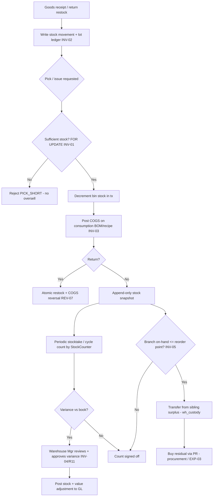

# Inventory & COGS — Process Narrative

## 1. Document control

| Field | Value |
|---|---|
| Process ID | PN-03-INV |
| Process owner | `<<Warehouse Manager / Controller>>` |
| Approver | `<<CFO>>` |
| Version | **0.1 DRAFT** |
| Effective date | `<<effective-date>>` |
| Review cadence | Annual + on significant change |
| Related RCM controls | INV-01, INV-02, INV-03, INV-04, INV-05, REV-07; SoD R11, EXP-03 |
| Related policy | `compliance/policies/11-financial-close-policy.md`, `compliance/policies/13-segregation-of-duties-policy.md` |

## 2. Purpose

To control inventory movements and cost of goods sold so that the perpetual inventory is **complete and accurate**, stock cannot be **oversold**, COGS is **costed and posted accurately on consumption**, and physical-to-book differences are **counted, reviewed, and approved**.

## 3. Scope

**In scope:** stock snapshots (append-only, partitioned), stock movements, lot/expiry ledger, WMS pick under lock, stocktake / cycle count with variance approval, COGS posting on consumption (including recipe/BOM deduction and reversal on return), and branch-aware replenishment (transfer-before-buy routing over per-branch `branch_stock`).

**Out of scope:** goods-receipt approval flow (see `02-procure-to-pay.md`), sales/refund cash flow (see `01-order-to-cash.md`), GL period close (see `04-general-ledger-close.md`).

## 4. References

- ISO 9001:2015 cl. 4.4, cl. 8.5.1 (control of production/service provision), cl. 8.5.4 (preservation).
- `compliance/Oshinei_ERP_SOX_RCM_v1.xlsx` — INV-01..05, REV-07.
- `compliance/policies/13-segregation-of-duties-policy.md` (R11 adjust vs count; INV-05 transfer-custody vs buy-approval).
- Code: `apps/api/src/modules/wms/` (incl. `replenishment.service.ts`), `apps/api/src/modules/stock-ops/`, `apps/api/src/modules/lots/`, `apps/api/src/modules/costing/`, `apps/api/src/modules/menu/` (recipe), `apps/api/src/modules/returns/returns.service.ts`. Schema: `branch_stock`, `item_supplier` (migration `0130`).

## 5. Definitions & abbreviations

| Term | Meaning |
|---|---|
| Perpetual inventory | Continuously updated stock ledger |
| Bin / lot | Storage location / batch with expiry |
| FOR UPDATE | Row lock serializing concurrent stock picks |
| Cycle count | Periodic partial physical count |
| COGS | Cost of Goods Sold |
| BOM / recipe | Bill of materials / menu recipe driving consumption |

## 6. Roles & responsibilities (RACI)

SoD rule **R11**: the role that **adjusts** inventory (InventoryController) is never the role that has **stock custody and counts** it (StockCounter / WarehouseOperator); variance approval is independent.

| Activity | WarehouseOperator | InventoryController | StockCounter | Warehouse Mgr | FinancialController |
|---|---|---|---|---|---|
| Receive / pick / move stock | **A/R** | C | I | A | I |
| Record stock movement / lot ledger | **A/R** | C | I | A | I |
| Adjust inventory (`wh_adjust`) | I | **A/R** | I | A | C |
| Physical count / cycle count (`wh_count`) | C | I | **A/R** | A | I |
| Approve count variance | I | I | I | **A/R** | C |
| Review COGS posting | I | C | I | I | **A/R** |

## 7. Process narrative

1. **Receipt into stock.** On goods receipt (from P2P) and returns (restock), the perpetual stock-movement ledger and lot/expiry ledger are written for every issue/receipt/return — completeness of the perpetual record (**INV-02**).
2. **Pick / issue under lock (decision point).** WMS pick decrements bin stock inside a transaction holding `FOR UPDATE`; a sufficiency check serializes concurrent picks so two terminals selling the last unit cannot oversell → one succeeds, the other gets `PICK_SHORT` (**INV-01**).
3. **COGS on consumption.** Inventory costing posts COGS on consumption; recipe/BOM deduction drives ingredient consumption, with reversal on return — COGS accurately reflects what was consumed (**INV-03**). The COGS journal posts to the GL (GL-01).
4. **Return reversal.** A return reverses the stock and the COGS atomically as part of the single return transaction (**REV-07**, see `01-order-to-cash.md`).
5. **Stock snapshots.** Append-only, partitioned snapshots provide a tamper-resistant point-in-time stock position used for valuation and reconciliation.
6. **Stocktake / cycle count (decision point).** StockCounter performs a periodic count (segregated from adjustment, **R11**). Counted vs book quantity yields a variance.
7. **Variance review & approval.** Warehouse Mgr reviews and approves the variance; an approved adjustment posts the stock and value correction. Adjustment authority (InventoryController) is separated from counting (**INV-04**, **R11**). FinancialController reviews the resulting GL impact.
8. **Branch-aware replenishment — transfer-before-buy (decision point).** Sales (POS direct + recipe/BOM consumption) deplete the selling branch's `branch_stock` alongside the tenant rollup, so each outlet's on-hand is real. When a branch's on-hand for an item falls to/below its reorder point, the Planner recomputes replenishment, which proposes fulfilment in priority order: first an **inter-branch transfer** drawn from a sibling branch that holds surplus (largest-surplus-first, capped at the shortfall), then a **buy** (purchase requisition) for only the residual the transfers cannot cover. Transfer execution is a **warehouse-custody** duty (`POST /api/replenishment/auto-transfer`, `wh_custody`) that moves `branch_stock` source→destination and writes a branch-attributed `cust_stock_log` entry for both legs (`Transfer-Out`/`Transfer-In`); the buy leg raises a PR through the **maker-checker** procurement flow (`POST /api/replenishment/auto-pr`, `procurement` → **EXP-03**). The two legs are segregated so the person moving stock is not the person authorising the spend (**INV-05**). The global `stock_movements` audit row is also written, but the authoritative tenant-scoped record is `branch_stock` + `cust_stock_log`.

## 8. Process flow

**Swimlane description by role:** The **system** enforces the no-oversell pick lock, perpetual movement logging, and COGS posting. **WarehouseOperator** receives/picks/moves. **StockCounter** counts (custody/count duty). **InventoryController** raises adjustments — never counts the same stock (**R11**). **Warehouse Mgr** independently approves variances. **FinancialController** reviews COGS and adjustment postings.

## 9. Control matrix

| Step | Risk | Control | Type | RCM ID | Evidence / Record |
|---|---|---|---|---|---|
| 2 | Oversell / negative stock under concurrency | Bin decrement under `FOR UPDATE` + sufficiency check | Prev / Auto | INV-01 | Concurrency test; `PICK_SHORT` |
| 1 | Stock movements not recorded | Perpetual movement + lot ledger logging | Det / Auto | INV-02 | Stock ledger tie-out |
| 3 | COGS misstated / consumption uncosted | Costing → COGS posting; BOM deduction + reversal | Auto | INV-03 | COGS tie-out sample |
| 4 | Return leaves partial stock/GL state | Atomic return (restock + COGS reversal) | Prev / Auto | REV-07 | Atomicity test |
| 6,7 | Book vs physical diverges; concealed shrink | Cycle count + independent variance approval | Det / Hybrid | INV-04 | Count sheets, signed variance |
| 6,7 | Adjuster also counts (hide shrink) | SoD: `wh_adjust` vs `wh_count` segregated | Prev / Manual | R11 | SoD conflict report |
| 8 | Over-buy while a sibling branch holds idle surplus; stock moved between branches without attribution / segregation | Transfer-before-buy routing; branch-attributed transfer log; transfer custody (`wh_custody`) segregated from PR approval (`procurement`/EXP-03) | Prev/Det / Hybrid | INV-05 | Replenishment run log; inter-branch transfer log; residual PR |

## 10. Inputs & outputs

**Inputs:** goods receipts, sales/issue requests, returns, BOM/recipes, count sheets, lot/expiry data.
**Outputs:** stock movements, lot ledger entries, stock snapshots, COGS journal entries, count variances + adjustments.

## 11. Records & retention

| Record | Store | Retention |
|---|---|---|
| Stock movements / lot ledger | Application DB (RLS-scoped) | `<<7 years>>` |
| Stock snapshots (partitioned, append-only) | Application DB | `<<7 years>>` |
| Cycle-count sheets + variance approvals | Application DB | `<<7 years>>` |
| COGS / adjustment journal entries | Ledger | `<<7 years>>` |
| Mutation audit trail | `audit_log` | `<<7 years>>` |

## 12. KPIs / metrics

- Oversell attempts blocked (`PICK_SHORT` count; target: no negative stock).
- Cycle-count variance rate and value; approved vs unapproved adjustments.
- COGS posting exceptions (uncosted consumption; target: 0).
- Expired-lot write-offs.
- **Food-cost variance (actual vs theoretical).** `GET /api/menu/food-cost/variance?from=&to=` values the EOD-count quantity variances (`cust_variance`: actual − theoretical use) at each ingredient's cost over a date window and rolls them up — theoretical vs actual cost, net variance (฿ and % of theoretical), unfavourable (over-portioning/waste/shrinkage) vs favourable split, and per-ingredient anomalies (|variance| ≥ 5% Medium / ≥ 10% High). Detective analytics over the INV-04 count data — surfaces shrinkage that recipe-theoretical costing alone can't.

## 13. Exception & error handling

| Error code | Trigger | Handling |
|---|---|---|
| `PICK_SHORT` | Insufficient stock for pick | Re-source / backorder; investigate book vs physical |
| (variance) | Count ≠ book | Warehouse Mgr review + approval before adjustment |
| `SOD_VIOLATION` / SoD conflict | `wh_adjust`+`wh_count` on one user | AccessAdmin remediates (R11) |

## 14. Revision history

| Version | Date | Author | Summary |
|---|---|---|---|
| 0.1 DRAFT | 2026-06-22 | `<<author>>` | Initial draft. |
| 0.2 | 2026-06-23 | Platform | **Food-cost variance (actual vs theoretical):** §12 — costed roll-up of EOD-count quantity variances (`GET /api/menu/food-cost/variance`), valuing `cust_variance` at ingredient cost with unfavourable/favourable split + anomaly flags. Reporting layer over INV-04; no new control. |
| 0.3 | 2026-06-25 | Platform | **Branch-aware replenishment (transfer-before-buy):** new control **INV-05**. §3/§4 scope+refs, §7 step 8, §8 flow nodes N/O/P, §9 control-matrix row. Per-branch `branch_stock` ledger (alongside the tenant `customer_inventory` rollup) depleted by POS direct + recipe/BOM consumption; low (branch,item) routes a sibling-branch transfer first (`auto-transfer`, `wh_custody`), then a residual PR (`auto-pr`, `procurement`/EXP-03). Schema `branch_stock` + `item_supplier`, migration `0130`. ToE in `cutover/wms.ts`. |
