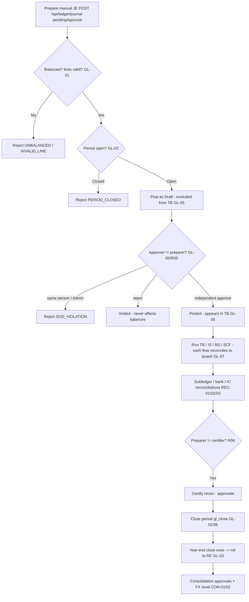

# General Ledger & Financial Close — Process Narrative

## 1. Document control

| Field | Value |
|---|---|
| Process ID | PN-04-GL |
| Process owner | `<<Controller>>` |
| Approver | `<<CFO>>` |
| Version | **0.1 DRAFT** |
| Effective date | `<<effective-date>>` |
| Review cadence | Each period close + annual |
| Related RCM controls | GL-01, GL-02, GL-03, GL-04, GL-05, GL-06, GL-07, GL-08, GL-09, GL-10, GL-11, GL-15, GL-16, GL-18, GL-19, GL-21, GL-22, GL-23, GL-24, GL-25, GL-26, GL-27, GL-28, TAX-06, TAX-12, LSE-01, LSE-02, REC-01, REC-02, REC-03, REC-04, GOV-01, CON-01, CON-02; SoD R05, R06 |
| Related policy | `compliance/policies/11-financial-close-policy.md`, `compliance/policies/13-segregation-of-duties-policy.md` |

## 2. Purpose

To control journal entry, the trial balance / financial statements, period and year-end close, and reconciliations so that the general ledger is **balanced, complete, accurate, properly cut off, and authorized**, and so that manual journals receive **independent review** (maker-checker) before they affect reported results.

## 3. Scope

**In scope:** manual journal entry (`/api/ledger/journal`) posting as Draft → GL-05 maker-checker approve/reject; trial balance, income statement, balance sheet, **statement of cash flows (indirect)**; period open/close (`gl_close`); year-end close; subledger-to-GL, bank, and intercompany reconciliations; consolidation and FX revaluation.

**Out of scope:** source-cycle postings (revenue, AP, inventory, payroll, tax) which are documented in their own narratives but flow into the GL here.

## 4. References

- ISO 9001:2015 cl. 4.4, cl. 7.5 (documented information), cl. 9.1 (monitoring/measurement).
- `compliance/Oshinei_ERP_SOX_RCM_v1.xlsx` — GL-01..06, REC-01..03, CON-01/02.
- `compliance/policies/11-financial-close-policy.md` (close calendar), `13-segregation-of-duties-policy.md` (R05, R06).
- Code: `apps/api/src/modules/ledger/ledger.service.ts` + `ledger.controller.ts`, `apps/api/src/modules/reconciliation/reconciliation.service.ts`, `apps/api/src/modules/consolidation/`, `apps/api/src/modules/fx/fx.service.ts`.

## 5. Definitions & abbreviations

| Term | Meaning |
|---|---|
| JE | Journal Entry (JE- prefix) |
| Maker-checker | Preparer of a JE may never approve it (GL-05) |
| Draft / Posted / Voided | JE lifecycle states; only Posted affects balances |
| Period close | Locking a fiscal period against further posting |
| TB / IS / BS | Trial Balance / Income Statement / Balance Sheet |
| SCF | Statement of Cash Flows (indirect method; the third primary statement) |
| RE | Retained Earnings |
| Recon prepare → certify | Two-person reconciliation sign-off |

## 6. Roles & responsibilities (RACI)

SoD: the **preparer** of a manual JE (GlAccountant) is never its **approver** (FinancialController) — enforced even for Admin (**GL-05**, **R05**); the **preparer** of a reconciliation (`recon_prep`) is never its **certifier** (`approvals`) (**R06**); the role posting JEs (`gl_post`) is separated from the role that **closes the period** (`gl_close`) (**R05**).

| Activity | GlAccountant | FinancialController | Controller | ExecutiveViewer / CFO |
|---|---|---|---|---|
| Prepare manual JE (`gl_post`) | **A/R** | I | A | I |
| Approve / reject manual JE (`gl_close`/checker, ≠ preparer) | I | **A/R** | A | C |
| Run TB / IS / BS / SCF | R | R | **A/R** | I |
| Close / open fiscal period (`gl_close`) | I | **A/R** | A | I |
| Year-end close (`exec`) | I | C | **A/R** | A |
| Prepare reconciliation (`recon_prep`) | **A/R** | C | A | I |
| Certify reconciliation (`approvals`) | I | **A/R** | A | C |

## 7. Process narrative

1. **JE invariants (decision point).** Every JE must be balanced by construction: Σdebit = Σcredit, each line single-sided and non-negative; an unbalanced entry → `UNBALANCED`, a malformed line → `INVALID_LINE` (**GL-01**).
2. **Period-close lockout (decision point).** Posting into a **Closed** fiscal period is rejected `PERIOD_CLOSED`, and into a hard-**Locked** period `PERIOD_LOCKED`, on **both** the initial post **and at approval time** (`approveEntry`) — so a Draft prepared while the period was open cannot be approved into a since-closed/locked period (per-tenant fiscal calendar) (**GL-02**, **GL-15**).
3. **Idempotent posting.** A unique key `(tenant, source, source_ref, ledger)` with `ON CONFLICT DO NOTHING` prevents concurrent double-booking of the same source document (**GL-04**).
4. **Manual JE maker-checker (the key control).** A manual JE submitted via `POST /api/ledger/journal` with `pendingApproval` posts as **Draft** and is **excluded from the trial balance** until approved. `approveEntry` (permission `gl_close`) sets it **Posted** only if the approver is **not** the preparer (`createdBy`); a self-approval → `SOD_VIOLATION` — enforced **even for Admin**. `rejectEntry` sets it **Voided** with the reason appended to the memo; Voided/Draft never affect balances (**GL-05**, **R05**). Posting (`gl_post`) and approval (`gl_close`) are different permissions. **Cutover opening balances** (`POST /api/ledger/opening-balances`) post through the *same* GL-05 maker-checker: `postOpeningBalances` calls `postEntry` with `pendingApproval: true`, so the opening batch lands as a **Draft** (`status: 'Draft'`, `pending: true`) **excluded from the trial balance** until a **different** user approves it via `POST /api/ledger/journal/:entryNo/approve`; a preparer self-approving the opening batch → `SOD_VIOLATION`. Opening balances — among the most material, least-scrutinised go-live postings — therefore no longer seed the ledger single-user (closes audit gap G4; ToE `tools/cutover/src/opening-balances.ts`).
5. **Cross-tenant posting gate.** HQ cross-tenant posting (`hqTenant`) is gated to Admin (explicit tenant override, also audited); a non-Admin override is ignored and RLS pins the context (**GL-06**).
6. **Financial statements.** Controller runs the trial balance, income statement, balance sheet, and **statement of cash flows** — built only from Posted entries in open/closed periods. The **statement of cash flows** (`GET /api/ledger/cash-flow?from&to`, indirect method) is reconstructed from the same GL data: operating cash = net income + non-cash add-backs (depreciation, acct 1590) + working-capital movements (AR/inventory/AP/accruals), then investing (fixed assets, acct 1500) and financing (equity/dividends, accts 3000/3100). **Year-end CLOSE journals are excluded** (they reclassify P&L to retained earnings and carry no cash). The statement **reconciles by construction** to the movement in the cash accounts (1000/1010/1020) — the response carries a `reconciled` flag and lists any `unclassified_accounts` for transparency (**GL-07**). A **direct-method** presentation (`GET /api/ledger/cash-flow-direct`) classifies actual cash movements by the nature of their contra account (receipts from customers, payments to suppliers/employees, tax & payroll remittances, investing, financing) and reconciles to the same Δcash. A forward **cash-flow forecast** (`GET /api/ledger/cash-flow-forecast?weeks=`) projects the cash balance from today using open AR (expected inflows by due date) and open AP (expected outflows), so Treasury sees the projected closing position and any week that runs short (**GL-07**).
7. **Reconciliations (decision point, two-person).** Subledger-to-GL reconciliation imports GL items, auto-matches, clears unmatched, and is **certified** by a different person — preparer (`recon_prep`) ≠ certifier (`approvals`) (**REC-01**, **R06**). Bank reconciliation against statements (**REC-02**, see `07-cash-treasury.md`); intercompany reconciliation/elimination on consolidation (**REC-03**). A **period-end control-account reconciliation PACK** (`GET /api/finance/reconciliation/controls`) gives the Controller a single 'are the books reconciled?' view: it ties every major sub-ledger to its GL control account in one read — **AR↔1100**, **AP↔2000**, **Inventory↔1200**, **Gift cards / customer deposits↔2200**, **Deferred revenue↔2400** — reporting per line `{sub_ledger, gl_control, variance, reconciled}` plus an overall `all_reconciled` flag and an `exceptions` count (liability controls are sign-flipped before comparison). Any non-reconciled line is a **control finding** to investigate before sign-off; this is the detective backstop that catches a sub-ledger silently drifting from the GL before the financial statements are issued (**REC-04**). A **pending-approvals monitor** (`GET /api/finance/approvals/pending`) is the companion governance view: a single worklist of **every** item still awaiting independent (maker-checker) approval across the system — manual JEs (**GL-05**), bank adjustments (**BANK-02**), AP disbursements (**EXP-06**), payroll runs (**PAY-03**), asset revaluations (**FA-08**), asset disposals (**FA-09**), inventory write-offs (**INV-07**), manual FX rates (**FX-04**) and budgets (**BUD-01**) — each with its **age in days** and an **overdue** roll-up. The controller reviews it before close so nothing sits un-actioned: a stale item is either a transaction stuck before it can take effect, or a control silently bypassed because no one chased the second sign-off (**GOV-01**, COSO *Monitoring*).
8. **Period close.** FinancialController closes the period via `gl_close` after reconciliations are certified, per the close calendar; the period then rejects further posting (**GL-02**, **GL-06**). Closing a period also **auto-accrues the loyalty points liability** to the period *before* locking it (best-effort; see `19-marketing-pricing-loyalty.md` §7 step 13).
9. **Year-end close.** Year-end close is restricted to `exec`; an attempt without it → `403`. Closing entries roll to retained earnings (**GL-03**). The year-end close first accrues the loyalty liability so its `5700` points-expense is swept to retained earnings (the `2250` liability stays on the balance sheet; cross-ref `19` §7 step 13).
10. **Consolidation & FX.** Consolidation run (ownership %, entity currency) is gated by `approvals` (**CON-01**); period-end FX revaluation posts unrealized FX (acct 5400) (**CON-02**). **Period-end STAGING is schedulable (B3, docs/50 Wave 2):** the action jobs **`gl_fx_reval_run`** (stages/refreshes the period's Open GL-18 reval run — `FxRevalService.runReval`, idempotent per period; an already-posted period is a graceful no-op) and **`consolidation_run`** (stages each group's Draft run via `runConsolidation`, fault-isolated per group — a group whose IC-recon sign-off isn't approved, has no entities, or is already posted records its outcome without failing the sweep) ride the report scheduler with filters `{ period? }` (default = the just-ended business month; consolidation also `{ group_id? }`). Both jobs **auto-DRAFT only** — posting stays the maker-checker human act (GL-18 `SELF_POST` / CON-03 unchanged), so the close team arrives to staged runs, never to auto-posted ones.
11. **Recurring / template journals.** A standing entry (monthly rent/insurance accrual, prepaid amortization, etc.) is defined once via `POST /api/ledger/recurring` — a **balanced template** (its lines are validated `Σdebit = Σcredit` at save time, so a broken template can never be persisted → `UNBALANCED`) plus a cadence (`daily`/`weekly`/`monthly`) and a first-run date. The scheduled job **`gl_recurring_journals`** (cron-callable via `POST /api/ledger/recurring/run`, and runnable daily through the report scheduler) posts every **due** template as a **Draft** JE through the **normal maker-checker flow** (GL-05) — so a recurring accrual still requires a second person to approve before it affects balances — and rolls `next_run_date` forward. The run is **idempotent**: `next_run_date` is advanced on posting and the `(tenant, source, source_ref, ledger)` key dedupes, so a same-day re-run posts nothing. Templates can be paused/resumed (`POST /api/ledger/recurring/:id/active`) without losing history (**GL-08**, **GL-05**, **R05**). **Auto-reversing accruals (docs/50 Wave 1 B2, migration 0419).** A **monthly** template flagged `auto_reverse` carries accrual semantics: the sweep's **first run in the next business month** posts a **reversal** of the prior month's entry — lines flipped, dated the 1st of the current month, again a **Draft** through GL-05 (so the reversal, like GL-17's manual reverse, needs a second person) — and the run response reports it under `reversals`. Idempotent two ways: the stable `REC-<id>-<lastRunDate>-REV` source_ref dedupes at the DB key, and once the current month's occurrence posts, the template's `last_run_date` leaves the reversible window. `auto_reverse` on a `daily`/`weekly` cadence is rejected at save (`AUTO_REVERSE_MONTHLY_ONLY`) — sub-monthly cadences overwrite `last_entry_no` within the month, so only the last occurrence would ever reverse. This closes the classic month-end trap where an accrual lingers unreversed into the new period until someone remembers GL-17.
12. **Prepaid amortization.** A prepaid asset (annual insurance, rent paid up front) is registered once via `POST /api/ledger/prepaid` with a **total + term in months** (optionally capitalizing the up-front payment **Dr 1280 / Cr 1000**). The scheduled job **`gl_prepaid_amortize`** (`POST /api/ledger/prepaid/run`, daily-schedulable) amortizes a **straight-line slice each period** (**Dr expense / Cr 1280**), the **last period taking the remainder** so the prepaid asset fully clears. Posting is **direct** (systematic, like depreciation) and **idempotent per `(schedule, period)`** via the JE idempotency key + `next_run_date` advance (**GL-09**).
13. **Lease accounting (IFRS 16 / TFRS 16).** A lease is capitalized via `POST /api/leases`: at commencement a **right-of-use asset** and a **lease liability** are recognised at the **present value of the lease payments** (**Dr 1600 / Cr 2600**, non-cash). The scheduled job **`lease_periodic_run`** (`POST /api/leases/run`) posts each period — **interest unwinding** on the liability (**Dr 5900**), the **cash payment** reducing the liability (**Dr 2600 / Cr 1000**), and **straight-line ROU depreciation** (**Dr 5210 / Cr 1690**) — with the **last period clearing the liability + ROU exactly**. Idempotent per `(lease, period)`. A **lease modification / remeasurement** (`POST /api/leases/:leaseNo/modify` — revised payment, remaining term, or rate) **remeasures the liability** at the PV of the revised payments and **adjusts the ROU asset by the same delta** (Dr/Cr **1600 ↔ 2600**); a downward remeasurement larger than the ROU floors it at zero and books the excess as a P&L gain (**Cr 1510**). Depreciation then runs straight-line over the **revised remaining term** (**LSE-01**, see also `09-fixed-assets-depreciation.md`). At close the **lease-liability reconciliation** (`GET /api/leases/liability-reconciliation`) ties the **GL lease-liability control account (2600)** to the **sum of the remaining liability balances on the lease schedule** — `gl_liability` vs `schedule_liability` with a `difference` and a `reconciled` flag (a divergence means a manual JE hit 2600 outside the lease engine, or a periodic run / remeasurement didn't post). The `/leases` screen surfaces this as a tie-out banner (**LSE-01**).

13a. **Lessor-side lease accounting (IFRS 16 / TFRS 16 lessor).** The company-as-**lessor** side (**FIN-10**, control **LSE-02**) is a separate register (`POST /api/lessor-leases`) that first **classifies** each lease as a **finance lease** or an **operating lease** per the IFRS 16 lessor criteria — **transfer of ownership**, a **bargain purchase option**, the lease term being a **major part of the asset's economic life** (≥ 75%), or the **PV of the payments ≈ the asset's fair value** (≥ 90%); ANY one ⇒ finance, else operating (`POST /api/lessor-leases/classify` previews the result without persisting). **Classification + commencement is maker-checker (SoD):** the lease is created `pending` with **no GL**, and a **different** user approves it (`POST /api/lessor-leases/:leaseNo/approve`; the classifier's own approval is rejected `403 SOD_SELF_APPROVAL`) before any posting. For a **finance lease**, approval **derecognises the underlying asset** (**Cr 1500**) and books a **net investment in lease / lease receivable** at the PV (**Dr 1610**), any selling profit/loss to **1510**; the scheduled run (`POST /api/lessor-leases/run`) then recognises **interest income** on the running receivable (**Cr 4620**) and collects the cash (**Dr 1000**), the principal portion reducing the receivable — the **last period clearing it exactly**. For an **operating lease**, the asset **stays on the lessor's books**; the run recognises **straight-line rental income** (**Dr 1000 / Cr 4610**) and **continues depreciating** the asset (**Dr 5200 / Cr 1590**) over its economic life. A detective **net-investment reconciliation** (`GET /api/lessor-leases/receivable-reconciliation`) ties the **GL 1610** control account to the **sum of the finance-lease receivable balances** on the schedule (`gl_receivable` vs `schedule_receivable`, `difference`, `reconciled`). New COA accounts **1610** (net investment in lease), **4620** (finance-lease interest income), **4610** (operating-lease rental income); the net investment 1610 buckets to **investing** in the SCF (**LSE-02**, migration 0309).

13a. **GL allocation cycles (cost allocation).** Shared / overhead cost is distributed to the consuming cost-centers or departments by a repeatable, auditable, maker-checker cycle instead of an ad-hoc spreadsheet. An **allocation cycle** is defined once via `POST /api/ledger/allocation` — a **source pool** (a fixed `pool_amount` relieved from a `source_account`, optionally with a `source_cost_center`), an allocation **method** (`ratio` = explicit proportions · `driver` = a measured driver such as machine hours · `statistical` = a statistical key such as headcount / sqm — the three share **one proportional-split engine**), a cadence (`daily`/`weekly`/`monthly`), and a set of **targets** (each with a `basis` weight, an optional `target_account` defaulting to the source account for a pure cost-center reallocation, and an optional `cost_center`). The template is validated **up front at save**: bad method/frequency → `BAD_METHOD`/`BAD_FREQUENCY`; non-positive pool → `BAD_AMOUNT`; no targets → `NO_TARGETS`; **zero total basis** (nothing to divide by) → `NO_BASIS` — so a broken cycle can never be persisted and then post an unbalanced/zero JE. The scheduled job **`gl_allocation_run`** (cron-callable via `POST /api/ledger/allocation/run`, daily-schedulable through the report scheduler) posts every **due** cycle as **ONE balanced Draft JE** — **Cr the source pool** and **Dr each target its share** (share = `pool × basis / Σbasis`; the **last positive-weight target absorbs the rounding remainder** in exact minor-4 units so `Σdebits = pool` **exactly**) — through the **normal maker-checker flow** (GL-05), riding the same recurring rail as GL-08, and rolls `next_run_date` forward. The run is **idempotent per period**: `next_run_date` is advanced on posting and the `(tenant, source='Allocation', source_ref=ALC-<id>-<date>, ledger)` key dedupes, so a same-day re-run posts nothing. Cycles can be paused/resumed (`POST /api/ledger/allocation/:id/active`) without losing history (**GL-23**, **GL-05**, **R05**).

14. **Chart of Accounts management (WS1.1 — GL-11).** The Chart of Accounts is **master data** with **two distinct write surfaces**, matching two distinct duties. Both resolve under `/api/ledger/accounts`; the CoA-write controller (`coa.controller.ts`) carries **no colliding read** — the tenant-curated account list is served by `GET /api/ledger/accounts` in `LedgerController` (perm `exec`/`creditors`/`ar`/`gl_coa`). The account hierarchy is: **account_groups** (tenant-scoped groups, `NULL tenant_id` = global template visible to all tenants) → **accounts** (the canonical posting universe, extended with Thai name, group link, control flags, normal balance, postability, dimension requirements, and effective dates). Key controls:

    - **Canonical universe (`accounts`) — platform/HQ duty.** The `accounts` table is the **global, immutable posting universe SHARED by every tenant** (no `tenant_id`; the engine hard-references its codes). Creating, editing, or retiring a canonical account changes the chart **all tenants post against**, so it is restricted to the **platform Admin/HQ operator** (role `Admin`) **in addition to** the `gl_coa` permission. A tenant's own `gl_coa` holder (e.g. FinancialController) is intentionally refused (`COA_ADMIN_ONLY`) so it can never silently mutate the shared universe.
        - **Account creation** (`POST /api/ledger/accounts`, Admin/HQ): auto-defaults `normal_balance` (`C` for Liability/Equity/Revenue, `D` for Asset/Expense). Duplicate code → `DUPLICATE_ACCOUNT`.
        - **Account update** (`PATCH /api/ledger/accounts/:code`, Admin/HQ): name, Thai name, group, postability, dimension requirements, effective dates. Disabling postability when the account already has posted entries → `CODE_HAS_POSTINGS`.
        - **Account deactivation** (`POST /api/ledger/accounts/:code/deactivate`, Admin/HQ): sets `active=false` and `is_postable=false`. Blocked if the account carries a **non-zero net balance** → `ACCOUNT_HAS_BALANCE` (prevents orphaning a balance in a "closed" account).
    - **Per-tenant chart curation (`tenant_accounts` overlay) — tenant `gl_coa` duty.** A tenant shapes **its own chart** — which canonical accounts are **active** on it and **how they are named / grouped / ordered** — via `PATCH /api/ledger/accounts/:code/overlay` (perm `gl_coa`), which upserts the caller tenant's `tenant_accounts` row (`active`, `display_name`, `display_name_th`, `group_label`, `sort_order`). The `tenant_id` is taken from the **request context (never the caller-supplied)** and the table is **RLS-scoped**, so a tenant can only ever curate its **own** chart — it can neither read nor mutate another tenant's overlay. The overlay may only reference an **existing canonical code** (it does not mint new accounts — that is the Admin/HQ duty above → `ACCOUNT_NOT_FOUND`) and **never gates postings** (see step 15). Curating with no tenant context → `TENANT_REQUIRED`. This curation is **surfaced in the web app** on the **ผังบัญชี** tab (`/accounting`) for `gl_coa` users — a rename dialog (EN/TH + group label), an active on/off toggle, and ↑/↓ re-ordering — with a **read-only** chart for everyone else; `GET /api/ledger/accounts?include_inactive=true` lets the curator see and re-activate a curated-off row (the default read hides `active=false` rows).
    - **Control-account guard**: four accounts are flagged `is_control = true` at setup — **1100 (AR)**, **2000 (AP)**, **1200 (INV)**, **1500 (FA)**. Direct manual JE postings to a control account are **rejected** (`CONTROL_ACCOUNT`) unless the caller sets `viaSubledger: true`. Only the AR, AP, Inventory, and Fixed-Assets service methods set this flag, ensuring those balances are exclusively maintained by their respective sub-ledgers (defeats a common audit bypass where a direct JE hides a sub-ledger discrepancy).
    - **Permissions / SoD**: `gl_coa` is a dedicated sub-permission for CoA maintenance — separated from `gl_post` so the accountant who posts JEs cannot also reclassify accounts (COSO control-environment integrity). FinancialController holds `gl_coa` (+ `gl_close`); GlAccountant does not. `gl_coa` authorises **tenant chart curation** (the overlay) and read of the CoA list; **canonical** universe changes additionally require the **Admin/HQ** role.
    - **Residual risk (shared canonical universe).** Because `accounts` is deliberately global, an account's *definition* (code / type / normal balance) is common across tenants — correct for the branch-model deployment (one company, many shops sharing a chart) and acceptable for the separate-companies SaaS deployment, where per-tenant *presentation* is fully isolated by the RLS-scoped overlay and canonical *definition* changes are centralised to the Admin/HQ operator. Minting genuinely tenant-specific **new** codes remains a centralised (Admin/HQ) act by design.

    (**GL-11**, see also the industry-CoA template layer at step 15 below.)

15. **Industry Chart-of-Accounts at company creation.** The GL engine binds to a **fixed, global account universe** (canonical codes are immutable — every posting hard-references its code). On top of that, each tenant gets a **per-tenant overlay** (`tenant_accounts`) that curates *which* canonical accounts are active and *how* they are named/grouped for its industry. At **company creation** the customer picks a business type from the full `INDUSTRY_KEYS` list (`restaurant` / `retail` / `distribution` / `services` / `manufacturing` / `construction` / `ecommerce` / `hospitality` / `healthcare` / `professional` / `agriculture` / `automotive` / `logistics` / `education` / `nonprofit` / `realestate` / `general`); `signup` materialises the chosen template into the overlay (`provisionTenantCoA`) **inside the signup transaction**, right after fiscal-year provisioning. Adopting an industry pack later (`POST /api/onboarding/apply-pack`) does the same. Every template account code is **asserted to exist in the canonical chart at boot** (`assertTemplatesSubsetOf` in `seedChartOfAccounts`) so a drifted template **fails fast** and can never reach a tenant; provisioning is **idempotent + additive** (never deletes), so re-running only adds missing accounts. The overlay is **presentation-only — it never gates postings**: `GET /api/ledger/accounts` returns the tenant's curated chart by default but `?all=true` exposes the full canonical universe, and reports surface any account that is **active OR carries activity** (so a curated-out account that receives a posting still appears) (**GL-10**).

15bis. **JE anomaly & control-exception analytics — the detective layer over the posting gates (B5, docs/50
   Wave 5, migration `0424`, control GL-28).** The preventive gates (GL-05 maker-checker, GL-17 immutability,
   GL-11/GL-27 CoA governance) stop unauthorised single-person postings, but a pattern that *passes* the gates
   — a duplicate posting, a suspiciously round manual amount, a heavily backdated accounting date, activity
   at 3 a.m., or a manual entry pairing cash directly with revenue — was never systematically looked for.
   `LedgerJeAnomalyService.scan` (`POST /api/ledger/je-exceptions/scan`, `gl_close`/`approvals`/`exec`; also
   the schedulable **`je_exceptions`** BI sweep) applies **five deterministic rules** over Posted
   `journal_entries`/`journal_lines`/`gl_audit_log` in a rolling window (default 90 days): **duplicate_je**
   (same entry_date + total debit + account set posted more than once — each peer flagged HIGH, naming the
   others), **round_amount** (Manual, ≥ ฿10,000 and a whole multiple of ฿1,000), **backdated** (accounting
   date > 7 days before the real capture time), **after_hours** (a POST/APPROVE audit event outside
   06:00–22:00 **Asia/Bangkok**), and **unusual_pair** (a Manual JE pairing cash `10xx` with revenue `4xxx`
   directly, bypassing AR — HIGH). Findings land in the **idempotent register** `je_exceptions` (one row per
   tenant × rule × entry — a re-scan re-raises nothing, and a dismissed exception stays dismissed). The
   **periodic review is the control**: each exception is dismissed only with a **mandatory reason**
   (`DISMISS_REASON_REQUIRED`), who/when stamped, and every dismissal appends a `gl_audit_log`
   **`EXCEPTION_DISMISSED`** row — the GL-28 evidence (`ALREADY_DISMISSED` on a re-dismiss). The **Close
   Cockpit** gains a `je_exceptions` pillar (RAG: red = any HIGH open, amber = any open) with inline scan +
   dismiss-with-reason. "Near-threshold approvals" is consciously **N/A**: GL-05 maker-checker applies to
   every manual JE with **no amount threshold to skirt** (**GL-28**).

## 8. Process flow



**Swimlane description by role:** **GlAccountant** prepares manual JEs (Draft) and reconciliations. The **system** enforces balance/line invariants, period locks, idempotency, the maker-checker rule (even for Admin), and the cross-tenant gate. **FinancialController** independently approves JEs, certifies reconciliations, and closes periods. **Controller/CFO** owns year-end close and consolidation, gated by `exec`/`approvals`.

## 9. Control matrix

> **SME edition exception (docs/49, control SME-01).** Under `tenants.control_profile='sme'` (single-operator companies, provisioned god-only) the maker-checker self-approval blocks in this narrative are relaxed through the central `common/control-profile.ts` seam: the operator may self-approve **with a mandatory logged justification** (`400 SELF_APPROVAL_REASON_REQUIRED` without one); every allowance writes a `self_approvals` evidence row + an audit `self_approved` marker and is independently reviewed via the auto-scheduled monthly **SME-01** report (external accountant + platform-owner inbox). Enterprise tenants are byte-identical. See `23-customer-onboarding-provisioning.md` §9 row 0b and `docs/49-sme-single-user-edition-plan.md`.

| Step | Risk | Control | Type | RCM ID | Evidence / Record |
|---|---|---|---|---|---|
| 1 | Unbalanced / one-sided JE | Double-entry balanced-by-construction | Prev / Auto | GL-01 | Invariant tests; `UNBALANCED` |
| 2 | Posting to a closed period (cutoff) | Period-close lockout `PERIOD_CLOSED` | Prev / Auto | GL-02 | Close-lock test |
| 3 | Concurrent double-booking | Ledger idempotency unique key + ON CONFLICT | Prev / Auto | GL-04 | Dedup test |
| 4 | Manual JE (or cutover opening-balance batch) without independent review | Maker-checker; Draft excluded from TB; preparer ≠ approver (even Admin). **Opening balances** (`POST /api/ledger/opening-balances`) now post as Draft (`pendingApproval`) requiring a distinct approver (closes G4) | Prev / Hybrid | GL-05, R05 | JE approvals; harness ToE (`opening-balances.ts`, `compliance.ts`); `SOD_VIOLATION` |
| §2.2 | A preparer unilaterally **reverses their own** independently-approved entry, silently undoing GL-05 | Manual reversal requires a **distinct reverser** (`requireDistinctApprover` — reverser ≠ `orig.createdBy`, else `SOD_VIOLATION`); system/internal reversals exempt (closes G2) | Prev / Auto | GL-17, GL-05, R05 | Reversal SoD ToE (`basics.ts`); `gl_audit_log` REVERSE row |
| 5 | Mis-post to another tenant's books | HQ cross-tenant posting gated to Admin (+ RLS) | Prev / Auto | GL-06 | Override test |
| 7 | Subledgers diverge from GL undetected | Subledger-to-GL recon + independent certify | Det / Hybrid | REC-01, R06 | Certified recon |
| 7 | A sub-ledger silently drifts from its GL control account before the FS are issued | **Period-end control-account reconciliation pack** — one read ties AR/AP/Inventory/Gift-cards/Deferred-revenue to GL 1100/2000/1200/2200/2400 and flags any out-of-balance (`exceptions`, `all_reconciled`) | **Det / Auto** | **REC-04** | Reconciliation pack (`GET /api/finance/reconciliation/controls`); `giftcards` + `compliance` harness |
| 7 | A maker-checker approval sits un-actioned (transaction stalls, or a control is quietly bypassed) | **Pending-approvals monitor** — one worklist of every item awaiting approval across GL-05/BANK-02/EXP-06/PAY-03/FA-08/FA-09/INV-07/FX-04/BUD-01, with age + overdue roll-up; reviewed before close | **Det / Auto** | **GOV-01** | Pending-approvals worklist (`GET /api/finance/approvals/pending`); `compliance` harness |
| 7–9 | Period locked (or FS relied on) without a single view of close-readiness — an out-of-balance control account, an unposted draft, or a stale approval is missed across separate screens | **Controller Close Cockpit** — one read-only RAG board composing the tie-out (REC-04), pre-lock readiness (GL-19 + snapshot recon GL-20), the pending maker-checker queue (GOV-01) and the close checklist (GL-15/16) + a days-to-close metric; overall RED on any tie-out break or hard blocker; reviewed before the lock | **Det / Hybrid** | **GL-22** | Close cockpit (`GET /api/finance/metrics/close/status`; `/finance/close-cockpit`); `finance-kpi` harness (tie-out break→RED→reconcile→GREEN) |
| 7–9 | A material period-over-period movement in the FS is relied upon without a documented management analysis — a large/anomalous swing is neither explained nor independently reviewed, so an error or manipulation surfacing as an unexpected fluctuation goes undetected | **CLS-01 — flux / variance analysis with FORCED explanation + independent sign-off**: a preparer generates a period movement analysis from `gl_period_balances` (basis P&L / BS; comparative prior_period / prior_year / vs approved-budget); each line's Δ$ / Δ% is tested against configurable abs+pct thresholds. A threshold-breaching line **requires a written explanation** before sign-off (`UNEXPLAINED_LINES`); the reviewer must differ from the preparer (`SOD_SELF_APPROVAL`) and certification locks it. Read-only — posts nothing. Advisory `flux_review` close-checklist step + schedulable `flux_analysis` BI report | **Det / Auto** | **GL-25** | Flux analysis (`POST /api/close/flux/generate`, `PUT …/lines/:lineId/explain`, `POST …/review`; `/close/flux`); `flux-analysis` harness (18 checks) |
| 9a | FS / the reporting package issued without a governed disclosure checklist — required TFRS/SEC notes (related parties, revenue disaggregation, leases, income tax, commitments & contingencies, segments, subsequent events, disclosure-controls sign-off) omitted/incomplete, evidence not pinned, and one person compiles AND releases the package | **CLS-02 — governed disclosure / close-package checklist (close binder):** `POST /api/close/disclosure` opens a per-period checklist auto-seeded with the standard TFRS/IFRS + SEC disclosure items (each with a standard ref, owner, Open/Complete/NA status + support-doc evidence pinned to `doc_attachments` docType `DISC`). Review is a **maker-checker** gate — blocked while any item is Open (`ITEMS_INCOMPLETE`) and reviewer ≠ preparer (`SOD_SELF_APPROVAL`) → Draft→Reviewed; only a Reviewed binder is Issued. An advisory `disclosure_review` step cross-links it into the close run (GL-15/16). Posts nothing to the GL | **Det / Auto** | **GL-26** | Disclosure checklist (`/close/disclosure`); `disclosure-checklist` harness (13 checks) |
| 7 | Bank balance not reconciled | Bank reconciliation vs statements | Det / Hybrid | REC-02 | Bank rec |
| 7 | Intercompany not eliminated/agreed | IC reconciliation + elimination | Det / Hybrid | REC-03 | IC recon |
| 6 | Cash flow statement mis-stated / doesn't tie to cash | SCF (indirect) reconstructed from GL; `reconciled` tie-out to Δcash; CLOSE entries excluded | Det / Auto | GL-07 | `basics` harness reconciliation check |
| 9 | Unauthorized year-end close / RE roll | Year-end close restricted to `exec` | Prev / Hybrid | GL-03 | Close package; 403 test |
| 10 | Consolidation / FX mis-stated | Consolidation gated by `approvals`; FX reval | Hybrid | CON-01, CON-02 | Consol TB; FX reval JE |
| 11 | Standing accrual missed / posts unbalanced or unapproved | Recurring-journal template validated balanced at save; scheduled run posts a **Draft** JE through maker-checker (GL-05); idempotent per due date | Prev / Auto | GL-08 | `basics` recurring-JE checks |
| 11 | Month-end accrual never reversed — expense double-counted next period | `auto_reverse` monthly templates: the sweep's first run in the next business month posts the flipped reversal as a **Draft** (GL-05 second-person approve, GL-17 semantics); idempotent per `REC-<id>-<lastRun>-REV`; non-monthly cadence rejected (`AUTO_REVERSE_MONTHLY_ONLY`) | Prev / Auto | GL-08, GL-17 | `basics` AutoRev checks; run response `reversals` |
| 12 | Prepaid not amortized over its term | Prepaid schedule amortizes a straight-line slice each period (Dr expense / Cr 1280); last period clears the asset; idempotent | Det / Auto | GL-09 | `basics` prepaid checks |
| 13a | Shared/overhead cost not allocated to consuming cost-centers, or allocated by an unbalanced / non-repeatable / unreviewed spreadsheet | Allocation cycle validated at save (`NO_BASIS`/`BAD_AMOUNT`/`NO_TARGETS`); scheduled run posts ONE balanced **Draft** JE (Cr pool / Dr targets by ratio·driver·statistical key, remainder to last target) through maker-checker (GL-05); idempotent per period | Prev / Auto | GL-23 | `basics` allocation checks (ratio + driver split, maker-checker, idempotent) |
| 13 | Lease not capitalised (ROU + liability omitted) | Commencement recognises ROU=liability=PV; periodic run posts interest + payment + ROU depreciation; idempotent | Det / Auto | LSE-01 | `basics` lease checks |
| 13 | Lease liability (2600) diverges from the schedule (manual JE / missed run) | Lease-liability reconciliation: GL 2600 vs Σ remaining schedule liability, with a `reconciled` flag + tie-out banner reviewed at close | **Det / Auto** | **LSE-01** | Lease-liability reconciliation; `basics` lease checks |
| 13a | Lessor lease mis-classified (finance vs operating) or classification set without independent review | IFRS 16 lessor criteria auto-classify finance/operating; classification + commencement is maker-checker (creator ≠ approver → SOD_SELF_APPROVAL) | Prev / Auto | **LSE-02** | `basics` lessor-lease checks |
| 13a | Lessor income mis-recognised (asset not derecognised / no interest income / no rental income) | Finance: derecognise asset + net investment at PV, interest income on the receivable; operating: straight-line rental income + continued depreciation; GL 1610 tie-out to the finance-lease receivable schedule | Prev / Det / Auto | **LSE-02** | Net-investment reconciliation; `basics` lessor-lease checks |
| 14 | CoA changed without authorisation; **a tenant mutates the SHARED canonical chart**; code changed after postings; account deactivated with live balance; direct JE bypasses sub-ledger on a control account | CoA Change Control — **two surfaces**: canonical universe writes (`accounts`, shared) require **Admin/HQ + `gl_coa`** (a tenant `gl_coa` holder is refused, `COA_ADMIN_ONLY`); per-tenant curation (`tenant_accounts` overlay) is **`gl_coa`, RLS-scoped** to the caller's own tenant. Code-change blocked if postings exist (`CODE_HAS_POSTINGS`); deactivation blocked if non-zero balance (`ACCOUNT_HAS_BALANCE`); control accounts (1100/2000/1200/1500) reject direct postings unless `viaSubledger:true` (`CONTROL_ACCOUNT`). Managed from the `/chart-of-accounts` screen (docs/42 step 2): canonical create/edit/deactivate dialogs (Admin; Zod-validated 4-digit code + typed type) and the per-tenant overlay show/hide toggle (`gl_coa`, overlay tenants only) | Prev / Auto | GL-11 | `compliance` GL-11 ToE (canonical Admin-only + `COA_ADMIN_ONLY`; overlay RLS-scoping; DUPLICATE_ACCOUNT / ACCOUNT_HAS_BALANCE); control-account guard test |
| 15 | New company starts on an unguided chart, or an industry template drifts from the engine's fixed codes | Industry CoA templates: per-tenant overlay over an **immutable** canonical universe; chosen at signup (`provisionTenantCoA`, in-txn); every template code **asserted ⊆ canonical at boot**; idempotent + additive; overlay is presentation-only (never gates postings — `?all=true` exposes the full universe) | Prev / Auto | GL-10 | `basics` + `compliance` industry-CoA checks |
| 16 | Item / COGS posting accounts are hard-coded, or a per-item override points at a bad account | Item-posting account determination (extends GL-12 to the item grain): opt-in `posting_determination` flag (default OFF ⇒ literal parity); `AccountDeterminationService` resolves item → item_category → **warehouse** → hard-coded literal; the inventory sub-ledger routes its inventory/COGS/adjustment legs through it and `reconcile()` sums the whole inventory-account set so the GL-14 tie-out holds; a resolved override that isn't a real, **postable** CoA account is rejected `INVALID_POSTING_ACCOUNT` (fail-closed). Maintained on the `/setup/{item-categories,tax-codes,items,warehouses,posting-rules}` screens (`/api/item-setup/*`, gated `md_item`/`md_config`). Item defaults also drive VAT (item `vat_code` → AR output-VAT account, PR6), the stock **location** (`default_location_id`) and the AR **revenue** account (PR7) — all flag-gated with literal parity. docs/42: the SAME fail-closed guard now runs inside `postEntry` for EVERY line (exists + postable → `INVALID_POSTING_ACCOUNT`; `viaSubledger` never bypasses it), the `posting_determination` switch is toggleable on `/setup/item-categories`, and tenant `posting_rules` overrides (role→account) re-map the payroll / FA-depreciation / lease-run posters as `override ?? literal` | Prev / Auto | GL-21 | `basics` GL-21 ToE (parity off; routed COGS on; warehouse-routed inventory; default location; reconcile ties; invalid-account reject) |
| 16a | A posting-rule override re-routes financial statements but rule changes are ungoverned (typo'd account, sub-ledger control targeted, single-person change, no trail) | **GL-24 — posting-rule change governance** (docs/43 PR-1): every write validated FAIL-CLOSED against the in-code registry (`posting-events.ts`, 74 events / 125 roles with side + real default + tier) — `UNKNOWN_POSTING_EVENT`/`UNKNOWN_POSTING_ROLE`/`POSTING_SIDE_MISMATCH`/`OVERRIDE_ROLE_PINNED` (pinned = sub-ledger controls incl. the five permanently-pinned REC-04 accounts, equity plugs, the cash set)/`INVALID_POSTING_ACCOUNT`; a valid write lands **PendingApproval** and only a **different** user activates it (`SOD_VIOLATION` binds even Admin); re-edit demotes back to pending; resolver + per-tenant bust-on-approve cache consume **Approved** rules only; append-only `posting_rule_audit`; registry defaults boot-asserted ⊆ canonical CoA; catalogue seeded FROM the registry (migration 0331) | Prev / Auto | GL-24 | `compliance` GL-24 ToE (9 checks) + `payroll` end-to-end (pending ignored → approve → re-mapped run) + `basics` PR-2 re-route (override applied at a wired finance site; register keys on the debit leg) |
| 16b | The canonical Chart of Accounts is SHARED by every tenant, but canonical account changes (create / rename / postability flip / cf_bucket reroute / deactivate) were single-person with NO record — GL-11 restricts WHO, nothing recorded WHAT/WHEN/BY WHOM | **GL-27 — canonical CoA maker-checker** (COA follow-up C, migration `0362`): every write on `/api/ledger/accounts` (still Admin/HQ per GL-11) is validated FAIL-CLOSED at request time (`DUPLICATE_ACCOUNT`/`ACCOUNT_NOT_FOUND`/`ACCOUNT_HAS_BALANCE`/`CODE_HAS_POSTINGS`; one pending request per code — `CHANGE_ALREADY_PENDING`) and staged in `coa_change_requests` (payload + before snapshot); a DIFFERENT Admin approves (`SOD_VIOLATION` on self, binds even Admin; re-validated at approve) or rejects with reason. **Single-Admin exception** (owner decision 2026-07-12): exactly one active Admin ⇒ applied immediately, recorded `AutoApplied` — the trail survives where a second pair of eyes cannot. Pending queue on `/chart-of-accounts`. Bulk imports keep the standing masterdata maker-checker | Prev / Auto | GL-27 | `compliance` GL-27 ToE (5 checks: stage, CHANGE_ALREADY_PENDING, self-approve SoD, distinct approve, reject) + `basics` staged 2650 create→approve + unit `coa-change.test.ts` (single-Admin exception — only reachable with a pinned Admin count) |
| 15bis | An error/override pattern that PASSES the preventive gates (duplicate posting, round manual amounts, backdated dates, 3 a.m. activity, manual cash↔revenue) accumulates unreviewed in the journal | **GL-28 — JE anomaly & control-exception analytics** (docs/50 Wave 5 B5, migration `0424`): five deterministic rules over Posted `journal_entries`/`journal_lines`/`gl_audit_log` (rolling 90-day window) write an IDEMPOTENT `je_exceptions` register (one row per tenant × rule × entry — re-scan re-raises nothing); dismissal requires a mandatory reason (`DISMISS_REASON_REQUIRED`), stamps who/when, and appends a `gl_audit_log` `EXCEPTION_DISMISSED` row; Close-Cockpit pillar (red = HIGH open) + schedulable `je_exceptions` BI sweep | Det / Auto | GL-28 | `je_exceptions` register (open/dismissed + reasons); `EXCEPTION_DISMISSED` audit rows; cockpit pillar; `basics` ToE (15 checks) |

## 10. Inputs & outputs

**Inputs:** source-cycle postings, manual JE requests, subledger balances, bank statements, FX rates, ownership %, close calendar.
**Outputs:** Posted JEs (JE-), trial balance, income statement, balance sheet, **statement of cash flows (indirect)**, certified reconciliations, closed periods, year-end close package, consolidated TB.

## 11. Records & retention

| Record | Store | Retention |
|---|---|---|
| Journal entries (Draft/Posted/Voided) | Ledger (RLS-scoped) | `<<7 years>>` |
| JE approval / rejection trail | `audit_log`, memo annotations | `<<7 years>>` |
| Reconciliations + certifications | `reconciliation` tables | `<<7 years>>` |
| Period/year close records | `fiscal_periods` | `<<7 years>>` |
| Financial statements | Reports / exports | `<<7 years>>` |

## 12. KPIs / metrics

- Manual JEs posted: % with distinct approver (target 100%); count of `SOD_VIOLATION`.
- Postings rejected for `PERIOD_CLOSED`.
- Reconciliation completeness and on-time certification per close.
- Days to close; number of post-close adjustments.

## 13. Exception & error handling

| Error code | Trigger | Handling |
|---|---|---|
| `UNBALANCED` / `INVALID_LINE` | Bad JE structure | Correct and resubmit |
| `PERIOD_CLOSED` | Post/approve into closed period | Re-open per close policy (authorized) or post to open period |
| `SOD_VIOLATION` | Preparer approves own JE **or own opening-balance batch**, **or a preparer reverses their own entry** | Route to an independent approver/reverser (always, incl. Admin) |
| `NOT_PENDING` | Approve/reject a non-Draft JE | Verify JE state |
| `403` on year-end close | Lacks `exec` permission | CFO/Controller performs close |
| `DUPLICATE_ACCOUNT` | Account code already exists in CoA | Use a new code or update the existing account |
| `CODE_HAS_POSTINGS` | Attempt to disable postability on an account with posted entries | Retain postability; use `effective_to` date-fence instead |
| `ACCOUNT_HAS_BALANCE` | Attempt to deactivate an account with non-zero balance | Clear the balance via a correcting JE first |
| `COA_ADMIN_ONLY` | A tenant `gl_coa` holder attempts a **canonical** CoA change (create/update/deactivate) | Curate your own chart via the overlay (`PATCH …/:code/overlay`); canonical changes are made by the Admin/HQ operator |
| `TENANT_REQUIRED` | Overlay curation attempted with no tenant context (e.g. a global/HQ token) | Perform curation from a tenant-scoped session |
| `ACCOUNT_NOT_FOUND` | Overlay curation (or update) references a code not in the canonical chart | Use an existing canonical code (a new code is an Admin/HQ canonical add) |
| `CONTROL_ACCOUNT` | Direct JE to a control account (1100/2000/1200/1500) without `viaSubledger:true` | Post via the relevant sub-ledger (AR/AP/Inventory/Fixed Assets) |

## 14. Revision history

| Version | Date | Author | Summary |
|---|---|---|---|
| 2.48 | 2026-07-19 | Platform | **Industry sub-account definitions unified into a single-source registry (internal refactor — byte-identical, no behaviour/control/migration change).** The 66 industry sub-accounts (P3+P5) were each declared TWICE — a canonical seed row in `ledger-constants.ts` (code/name/type/parentCode + `isGroup`) and a per-industry naming row in `coa-templates.ts` (Thai name + which vertical surfaces it) — kept in sync by hand (the `assertTemplatesSubsetOf` boot guard only caught drift after the fact). New `coa-industry-subaccounts.ts` holds ONE entry per sub-account (`INDUSTRY_SUBACCOUNTS`); `ledger-constants.ts` now DERIVES its canonical rows (`toCanonicalSubAccountRows`) and each `coa-templates.ts` industry block DERIVES its rows (`industrySubAccountRows`) from it, so adding a vertical's sub-account is a single data edit. Order preserved → the seeded chart (208 accounts) and every per-industry overlay come out identical. The `SUBACCOUNT_TOO_DEEP`/`SUBACCOUNT_ON_DIMENSION_ACCOUNT` (P4) + `assertTemplatesSubsetOf` guards are unchanged. Proven byte-identical: a direct diff of the old vs derived rows (0 canonical + 0 template diffs across 15 industries), plus `golden` 588 · `statement-sections.test`/`coa-change.test` 19 · `basics`/`onboarding`/`ext` unchanged. Classification resolvers (`ledger-statement-sections.ts`) intentionally left as-is. |
| 2.47 | 2026-07-19 | Platform | **Per-industry default statutory P&L layouts (FIN-4, no control change, no migration).** Beyond the generic Thai DBD/TFRS `DBD-PL`, four industries whose statement SHAPE genuinely differs now get a bespoke default P&L, resolved automatically from `tenants.industry` at render time (`getDefinition('DBD-PL')` → `INDUSTRY_FS_DEFS[industry] ?? generic`; a tenant-authored `DBD-PL` still overrides). **nonprofit** → a **Statement of Activities** (revenue & support − functional expenses program/management-&-admin/fundraising, with a residual = **change in net assets**); **manufacturing** → cost of goods sold broken into direct materials / direct labour / manufacturing overhead + residual; **construction** → contract P&L with cost of work by resource (labour/materials/subcontractor/equipment); **hospitality** → an operating statement surfacing revenue by department (rooms / F&B) + direct F&B cost. Every layout reuses the shared multi-step tail so the bottom line **ties to the canonical `incomeStatement.net_income`** (proven per-tenant). The other verticals keep the generic multi-step `DBD-PL` (which already lists their sub-accounts as line items). `industry-fs.ts` holds the configs; the BS default stays generic (sections + per-account detail already fit every industry). ToE `basics` 474→477 (construction cost-of-work + nonprofit statement-of-activities render, industry resolution, tie-out; generic tenant unchanged). golden 588 unchanged. Manual 06 v0.33; UAT-GL-227 + traceability. |
| 2.46 | 2026-07-19 | Platform | **Per-industry CoA structure — remaining verticals + a sub-account-vs-dimension chooser UI (GL-10, no control change, no migration).** Extends the P3 per-industry sub-accounts to the remaining verticals, adding **42** genuine canonical sub-accounts (chart 166→**208**), curated per industry: **ecommerce** (payment-gateway fees / marketplace commission / fulfilment cost + marketplace payout receivable), **logistics** (cost of service by fuel/driver/subcontract/R&M/warehousing), **automotive** (vehicle-sales line, COGS by stream, warranty provision), **healthcare** (OPD/IPD/lab revenue + drug vs supplies inventory), **agriculture** (biological assets TAS 41 + COGS by farm input), **education** (tuition/fees/activity revenue), **real estate** (property inventory stages + rental by class), **nonprofit** (grant vs donation income, the program/admin/fundraising functional-expense split, restricted vs unrestricted net assets), **retail/distribution** (shrinkage, inbound-freight — the genuine lines only), **services** (cost of services by kind). Discipline held from P4: only accounts with their own statement line/nature become sub-accounts; purely ANALYTICAL breakdowns (sales by category/channel) stay on the posting **dimensions** (cost_center/branch/project). Each sub-account classifies via parent-inheritance (COGS subs → cost of sales, revenue subs → revenue, equity subs → equity) and nests under its parent. **Web:** the `/chart-of-accounts` "add sub-account" dialog now shows a first-class **sub-account vs dimension** guidance callout (when to use each, the one-level rule, a link to Cost centres) — surfacing the P4 guardrails at the point of choice. ToE `basics` 471→474 (nonprofit + logistics curation, per-industry isolation) + `statement-sections.test.ts` audit (all 208 classify). golden 588 unchanged. Manual 06 v0.32; UAT-GL-225..226 + traceability. |
| 2.45 | 2026-07-19 | Platform | **Sub-account vs dimension guardrails (extends GL-27/GL-21, no new control, no migration).** The chart deliberately keeps **one level of sub-accounts** — a genuine sub-ledger account that needs its own statement line/balance. Deeper analytical detail (by department, project, branch, cost centre) belongs to the accounting **dimensions** already carried on every posting line (`cost_center` / `branch_id` / `project_id`; `GET /api/ledger/dimensions`), not to an ever-deeper code tree. Two fail-closed guardrails added to the canonical create validation (`coa.service.ts` `validateChange`, so they bind at both the GL-27 request and the approve re-check): **(1) `SUBACCOUNT_TOO_DEEP`** — a create whose parent is itself a sub-account is refused (no grandchildren); **(2) `SUBACCOUNT_ON_DIMENSION_ACCOUNT`** — a create under an account that is already analysed by a required dimension is refused (record the detail on that dimension instead). Both messages point the user to the dimension as the right tool. Presentation/guidance + fail-closed validation only — no posting, balance or control-count change. ToE `coa-change.test.ts` 7→9 (both guardrails) + `compliance` 179→180 (real-path depth cap). Manual 06 v0.31; UAT-GL-223..224 + traceability. |
| 2.44 | 2026-07-19 | Platform | **Real per-industry CoA structure — canonical sub-accounts curated per industry (GL-10, no control change, no migration).** Industry CoA templates previously only RENAMED canonical accounts; they now also surface genuinely industry-shaped **sub-accounts** (6-digit, under a canonical parent). 24 canonical sub-accounts added to the boot-seeded chart (141→**166**): **construction** WIP by trade phase (126001..04 earthwork/structure/finishing/MEP) + cost of work by resource (580001..04 labor/materials/subcontractor/equipment); **manufacturing** WIP + COGS by cost element (125001..03 / 500001..03 DM/DL/MOH); **hospitality** revenue by department (430001/02 room/other, 400001/02 food/beverage) + F&B cost (500011/12); **professional services** unbilled WIP + cost of services by kind (126010/11, 580010/11). Sub-accounts are **canonical** (postable — pass the GL-21 account-universe guard — and reported), curated per industry by the template so a restaurant chart never shows them. A sub-account declares its statement-section binding via `parentCode` inheritance (a COGS sub rolls into cost of sales, a WIP sub into current assets) — `resolveBsGroup`/`resolveIsGroup` fall back to the parent's section, `coaSortOrder` nests it directly under the parent, and the DBD statutory statements consult each account's own binding so the industry structure rolls up correctly. `provisionTenantCoA` seeds each tenant's initial display order from the canonical key (industry chart also lists in accountant order; a tenant can re-order via GL-11). ToE `basics` 465→471 (6 P3 checks: curation, per-industry isolation, nesting, postability, DBD tie-out) + `statement-sections.test.ts` 9→10 (sub-account classification + nesting). golden 588 unchanged (new accounts don't alter existing postings). Manual 06 v0.30; UAT-GL-220..222 + traceability. |
| 2.43 | 2026-07-19 | Platform | **CoA presentation: metadata-driven chart ordering + default Thai DBD/TFRS statutory layouts (no control change, no migration).** The natural account codes grew feature-by-feature (next-free-number), so a raw-code sort interleaves classes (a P&L account like `1510` sits in the 1xxx range, banks after fixed assets). Rather than renumber the natural keys — 1,000+ hard-coded posting sites depend on them — the Chart-of-Accounts listing now orders by a **computed key (class → statement section → code)** via `coaSortOrder` (reusing `resolveBsGroup`/`resolveIsGroup`), so every account lists in proper accountant order and nests under its correct งบดุล / งบกำไรขาดทุน heading regardless of the literal code. Purely presentational — postings, balances and the codes themselves are untouched. A whole-chart audit test locks that **every** canonical account resolves to exactly one statement section (balance sheet XOR income statement, by type). Separately, the FIN-4 statutory-FS builder now ships **built-in default layouts** `DBD-BS` (งบแสดงฐานะการเงิน) and `DBD-PL` (multi-step งบกำไรขาดทุน) mapped to the Thai DBD/TFRS captions off the same section metadata (new `bsGroups`/`isGroups` group selectors) — so the standard statements render out of the box and tie to the canonical balanceSheet/incomeStatement (total assets = total liabilities + equity, incl. the unclosed period result folded into equity); a tenant can still author its own definition of the same code to override. ToE `basics` 460→465 (5 P2/DBD checks) + `statement-sections.test.ts` 5→9. Manual 06 v0.29; UAT-GL-217..219 + traceability. |
| 2.42 | 2026-07-19 | Platform | **CoA integrity fix — duplicate account code `4600` split (no control change, no migration).** The canonical chart carried `4600` **twice** — *Early-Payment Discount Income* (EXP-14) and *Finance Lease Interest Income* (LSE-02). Because the COA boot-seed inserts with `onConflictDoNothing({ target: accounts.code })` and the discount entry is listed first, the lessor account was **silently skipped in every DB** — lessor finance-lease interest income (step 13a) had been posting into the discount-income account. Renumbered **Finance Lease Interest Income `4600` → `4620`** (the discount account keeps `4600`, matching its persisted `ap_discount_terms.discount_account` default and stored policy rows, so no data migration); `posting-events.leases.ts` interest-income leg, the `is_group` `other_income` map, and the `basics` lessor ToE now reference `4620`; the RCM LSE-02 entry (`build_rcm.py`) + xlsx/catalog regenerated. Effective unique accounts 141→**142** (the count previously double-counted the collided code). Manual 06 v0.28; UAT-GL-145 + traceability. |
| 2.41 | 2026-07-17 | Platform | **Close Manager v2b — bank_rec / subledger_tieout tick from CERTIFIED REC-01 recons (G3; extends GL-15/GL-19/REC-01 — no new control, no migration).** Rev 2.40 kept `bank_rec`/`subledger_tieout` in the never-auto set because no system evidence existed; the B4 recon register IS that evidence. `close/auto-complete` now ticks them when **every recon workspace the tenant OPENED for the period on the step's account set** — bank_rec: the canonical `CASH_ACCOUNTS` (1000/1010/1015/1020); tie-out: the 1100/2000/1200/1500 control accounts — is **Certified** in the REC-01 register. The human act is the certification itself (preparer ≠ certifier, or B4's provably-safe auto-certify); the tick only REFLECTS that recorded sign-off, pinning the per-account certifiers in `detail.evidence.certifications`. Fail-closed both ways: zero workspaces on the set = no evidence (absence never ticks), and a single un-certified workspace blocks. Judgments with no register (trial_balance_review, flux_review, disclosure_review) and custom tasks still never auto-complete. ToE `basics` 454→458 (4 G3 checks). Manual 06 v0.25; UAT-GL-209..211 + traceability. |
| 2.40 | 2026-07-16 | Platform | **Close Manager v2 — evidence-driven auto-complete + overdue tasks in GOV-01 (docs/50 follow-up; closes the two deferrals recorded in rev 2.37; extends GL-15/GL-19/GOV-01 — no new control, no migration).** (1) `POST /api/ledger/close/auto-complete` (`gl_close`) marks a checklist step Done ONLY when the system can VERIFY completion from its own records: `recurring` ← zero active recurring templates AND zero active prepaid schedules still due on/before period end; `fx_reval` ← a POSTED GL-18 run for the period; `deferred_tax` ← a POSTED deferred-tax run; `depreciation` ← ≥1 POSTED `DEP`-source JE dated in the period. Human judgments (trial_balance_review, flux_review, disclosure_review, bank_rec, subledger_tieout) and custom tenant tasks NEVER auto-complete; attribution mirrors B4 auto-certify — `completed_by "<user> (auto)"` + `detail {auto, evidence}` — so the GL-15 trail shows human-asserted vs system-proven; dependencies still gate; idempotent (`already_done`). (2) `close_task_overdue` joins the GOV-01 pending-approvals center via the ledger `ApprovalQueueSource`: a step in an ACTIVE run past its B1 `due_date` and not Done ages there (control GL-15, age = days overdue, owner role carried), clearing on sign-off. Web: **ติ๊กอัตโนมัติจากหลักฐานระบบ** button on the period-close run card. ToE `basics` 446→454 (8 F1 checks). Manual 06 v0.24; UAT-GL-206..208 + traceability. |
| 2.39 | 2026-07-16 | Platform | **JE anomaly & control-exception analytics (docs/50 Wave 5 B5; NEW control GL-28, migration `0424`, RCM 296→297).** New step **15bis** / control-matrix row **15bis**: `LedgerJeAnomalyService` (`/api/ledger/je-exceptions` — scan `gl_close`/`approvals`/`exec`, dismiss `gl_close`/`exec`) applies five deterministic rules over Posted `journal_entries`/`journal_lines`/`gl_audit_log` (rolling 90 days): duplicate_je (HIGH, peers named), round_amount (Manual ≥ ฿10,000 whole-฿1,000), backdated (> 7 days), after_hours (POST/APPROVE outside 06:00–22:00 Asia/Bangkok), unusual_pair (Manual cash 10xx ↔ revenue 4xxx, HIGH). Idempotent register `je_exceptions` (unique per tenant × rule × entry, canonical RLS); dismissal = mandatory reason + `EXCEPTION_DISMISSED` gl_audit_log evidence (`ALREADY_DISMISSED` re-guard). Close Cockpit gains the `je_exceptions` pillar (red = HIGH open; inline scan/dismiss) and the sweep is schedulable (BI type `je_exceptions`). Near-threshold detection consciously N/A (GL-05 has no amount threshold). ToE `basics` 431→446 (15 checks); `finance-kpi` 55 regression green. Manual 06 v0.23; UAT-GL-202..204 + traceability; census 297 (294/3/0), xlsx regenerated. |
| 2.38 | 2026-07-16 | Platform | **Reconciliation workspace depth (docs/50 Wave 4 B4; extends REC-01/GL-19, migration `0422`, no new control).** `recon_periods` gains a **roll-forward** computed from the posted GL at open (opening = Σ prior periods, activity = the period net, closing = opening + activity — ties to the TB by construction), a **risk rating** (`low/medium/high`, re-ratable via `PUT /api/recon/periods/:id/risk`), and **aging** of unmatched reconciling items on the summary. **Auto-certification** (`POST /api/recon/periods/auto-certify`, `approvals`/`exec`) fires ONLY on the provably-safe class — LOW risk AND zero opening/activity/closing — flagged `auto_certified` and attributed "(auto)"; every other account keeps the manual REC-01 preparer ≠ certifier path byte-identical. GL-19 `close/validate` gains the advisory **`recon_completeness`** check (every recon opened for the period certified — warns, never hard-blocks), which the Close Cockpit consumes through its existing validate leg. ToE `recon-profitability` 13→24 (11 B4 checks). Manual 06 v0.22; UAT-GL-199..200 + traceability. |
| 2.37 | 2026-07-16 | Platform | **Close Manager — per-tenant configurable close tasks (docs/50 Wave 3 B1; extends GL-15/GL-16, migration `0421`, no control-semantics change).** New `close_task_templates` (0232 RLS): a tenant adds its own close tasks — or overrides a standard step's title/required by reusing its `step_key` — with an **owner role**, a **due-day offset** from period end (stamped as `due_date` on the seeded step) and a **predecessor dependency** that gates sign-off order (`DEPENDENCY_NOT_DONE`). `startClose` composes standard + active templates (no templates ⇒ byte-identical); a custom REQUIRED task gates the lock exactly like a standard step (`STEPS_INCOMPLETE`); GL-16 maker-checker lock unchanged. `GET/PUT /api/ledger/close/task-templates` (change `gl_close`/`exec`; `SELF_DEPENDENCY`/`UNKNOWN_DEPENDENCY` fail-closed); the period-close screen shows owner/due/dependency per step. Follow-ups deferred: auto-completion from GL-19 signals; overdue-task GOV-01 provider. ToE `basics` 422→431 (9 B1 checks). Manual 06 v0.21; UAT-GL-196..197 + traceability. |
| 2.40 | 2026-07-18 | Platform | **Comprehensive chart expansion + statement-section binding (GL-11, migration 0442 — no control change).** (1) **~34 more canonical accounts** join the chart (`ledger-constants.ts` + CF_CLASSIFY for the balance-sheet ones; boot-seeded, no migration for the accounts) so a professional Thai SME chart is complete: other receivables/payables, accrued income/expense/salaries, deposits, advances to suppliers, WHT receivable (ภาษีถูกหัก ณ ที่จ่าย) + undue input/output VAT (ภาษีซื้อ/ขายยังไม่ถึงกำหนด), PP&E broken out (land/buildings/machinery/vehicles/furniture) + intangibles & accum. amortization, current portion of LTD, dividends payable, share premium, legal reserve (สำรองตามกฎหมาย), other income + interest income, and opex detail (insurance/communication/freight-out/staff-welfare/training/bank-charges/commission/entertainment/donation/other). COA now 142. (2) **Statement-section binding (migration 0442):** `accounts` gains `bs_group` + `is_group` — each account BINDS to a line of the งบดุล (current/non-current asset·liability·equity) and งบกำไรขาดทุน (revenue·cogs·selling_admin·other_income·other_expense·finance_cost·tax), mirroring how `cf_bucket` already binds the งบกระแสเงินสด. Resolution: account's own column → canonical default (`ledger-statement-sections.ts`) → type fallback. `balanceSheet` now returns grouped `sections` and `incomeStatement` a structured `groups` + `summary` (gross profit / operating profit / profit before tax / net income) — **additive**, existing totals unchanged (golden re-pinned for the new keys, no value drift). The `/chart-of-accounts` create/edit dialog captures both; the `/accounting` BS & P&L tabs render the section breakdown. ToE: `statement-sections.test.ts` (5), `basics` +2 (section reconciliation) → 460, golden re-pinned (534→588); UAT-GL-212..216 + traceability. |
| 2.39 | 2026-07-18 | Platform | **Everyday operating-expense accounts added to the canonical chart (GL-11 — no control/schema change).** Six named P&L expense accounts join the canonical `COA` (`ledger-constants.ts`) and the shared `CORE` template block (so every curated industry surfaces them): **5110 Travel & Transport / ค่าเดินทางและขนส่ง**, 5120 Utilities / ค่าสาธารณูปโภค, 5130 Rent (short-term/low-value leases) / ค่าเช่า, 5140 Marketing & Advertising / ค่าการตลาดและโฆษณา, 5150 Professional & Legal Fees / ค่าธรรมเนียมวิชาชีพและกฎหมาย, 5160 Office Supplies & Admin / ค่าวัสดุสำนักงานและค่าใช้จ่ายบริหาร. They are ordinary P&L expenses (no `CF_CLASSIFY` — captured in net income) so the indirect SCF is unaffected; boot-seeded via `seedChartOfAccounts` (idempotent, no migration). They pair with the 2.38 sub-account feature (e.g. 5110 ค่าเดินทาง → 511001 ค่าเครื่องบิน). Golden master unaffected (snapshots only touched accounts) — no re-pin. |
| 2.38 | 2026-07-18 | Platform | **Sub-accounts + 4–6-digit codes on the canonical chart (GL-11/GL-27 — no control/schema change).** The `/chart-of-accounts` create surface accepts a **4–6-digit** code (was exactly 4): a control/summary account stays 4 digits and a **SUB-ACCOUNT** extends its parent by one or two digits (e.g. `5110 ค่าเดินทาง → 511001 ค่าเครื่องบิน / 511002 เบิกค่ารถ / 511003 ค่าตรวจสาขา`; `1100` AR control → `11001…` debtor sub-types). Both `CreateAccountBody` code regexes relax to `^\d{4,6}$`. `CoaService.validateChange` gains two fail-closed sub-account guards on create: **`PARENT_SELF`** (an account can't name itself as parent) and **`PARENT_TYPE_MISMATCH`** (a sub-account must share its parent's account type — the existing `PARENT_NOT_FOUND` still requires the parent to exist). All writes still route through the GL-27 maker-checker (platform Admin/HQ, distinct approver) — sub-accounts are governed canonical accounts, surfaced per-tenant through the existing overlay; no posting-engine change (leaf sub-accounts post, the header parent is set non-postable). Web: a row **เพิ่มบัญชีย่อย** action pre-fills the parent + type-locks + suggests the next child code. ToE: `coa-change.test.ts` +3 (type-match/self-parent/stage). |
| 2.37 | 2026-07-18 | Platform | **Industry CoA templates expanded (GL-10 — no control/schema change).** Step 15's `INDUSTRY_KEYS` list grows from 5 to **17** business types: the four original curated packs (restaurant/retail/distribution/services) plus **manufacturing, construction, ecommerce, hospitality, healthcare, professional, agriculture, automotive, logistics, education, nonprofit, realestate**, and `general` (full canonical chart). Each new pack is a `COA_TEMPLATES` entry that only renames/curates **existing canonical codes** (the boot `assertTemplatesSubsetOf` invariant is unchanged — no new posting codes), and carries a matching SME nav-folding profile (`SME_NAV_PROFILES`, docs/51 B1; each within the 8–25 first-load item budget). Signup dropdown + platform provision dialog list all 17; the zod `industry` enum and `isIndustryKey` fallback updated in lockstep. ToE: `nav-profiles.test.ts` (list + per-industry budget) green; boot subset assertion green. |
| 2.36 | 2026-07-16 | Platform | **Schedulable period-end staging — FX reval + consolidation (docs/50 Wave 2 B3; no new control/migration).** New action jobs `gl_fx_reval_run` (ledger-bi-reports.ts → `FxRevalService.runReval`, idempotent per period, ALREADY_POSTED → graceful no-op) and `consolidation_run` (NEW consolidation/consolidation-bi-reports.ts → `runConsolidation` per group, fault-isolated outcomes incl. IC_RECON_NOT_APPROVED), filters `{period?}` default just-ended month. **Auto-Draft only** — GL-18 SELF_POST / CON-03 maker-checker posting unchanged. §7(10) updated. ToE `fxreval` 15→22 + `consolidation` 42→47. UAT-GL-194..194. |
| 2.35 | 2026-07-16 | Platform | **Auto-reversing accruals (docs/50 Wave 1 B2; extends GL-08/GL-17, migration `0419`, no new control).** `recurring_journals.auto_reverse` (monthly-only, `AUTO_REVERSE_MONTHLY_ONLY` at save): the `gl_recurring_journals` sweep's first run in the next business month posts the prior month's accrual back out — lines flipped, dated the 1st, **Draft** through GL-05 — idempotent per `REC-<id>-<lastRun>-REV`; run response gains `reversals`. `/gl-schedules` create form gains the checkbox + list badge. ToE `basics` 414→422; UAT-GL-190..192; manual 06 §recurring. |
| 2.34 | 2026-07-16 | Security | **Pentest P4 — the hard-close (`PERIOD_LOCKED`) gate closed on the JE approval path (GL-05/GL-15/GL-19; no new control, no migration).** `approveEntry` effects the Draft→Posted transition **bypassing** `postEntry`, and re-checked only `PERIOD_CLOSED` — so a Draft prepared while a period was open could be approved **into** a since-hard-**Locked** period and silently rewrite its balances after an irreversible close. It now rejects a `Locked` period with `PERIOD_LOCKED` (mirroring the existing `Closed` check) **before** any write; no `CLOSE` carve-out (the year-end closing entry posts directly via `postEntry`, never Draft+approve). §7 step 2 + the hard-lock section updated. ToE: unit `ledger-posting-write.test.ts` (+1: approve-into-Locked → `PERIOD_LOCKED`, no tx/update/audit) — mirrors the existing `PERIOD_CLOSED` unit case; `worldclass` 59 / `golden` 531 / `basics` regression green. UAT-GL-189; manual 06; traceability. Report `docs/security/2026-07-16-penetration-test-report.md`. |
| 2.33 | 2026-07-15 | Platform / Compliance | SME edition exception note added to the control matrix (docs/49 v1.2, control SME-01) — maker-checker self-approval blocks are conditionally relaxed for `control_profile='sme'` tenants via the central seam; no control logic changed in this cycle. |
| 2.32 | 2026-07-12 | Platform | **COA-D2 — effective dating + required dimensions ENFORCED in the posting guard (GL-21 extension; no new control, no migration).** `accounts.effective_from/effective_to` and `require_dimension` existed but were decorative — the API accepted them, manual 06 even ADVISED "use an effective-to date instead" when postability can't flip, yet nothing enforced either. `postEntry`'s account guard now rejects, ONLY when the attribute is declared (fail-closed; the unset universe posts byte-identically): a line dated outside the window → `ACCOUNT_NOT_EFFECTIVE`, and a line missing a flagged dimension (branch/project/department/cost_center → the journal-line stamps) → `REQUIRED_DIMENSION_MISSING`. A canonical create naming a non-existent parent is refused at request time (`PARENT_NOT_FOUND`). Both attributes are maintainable on the `/chart-of-accounts` create/edit dialogs (GL-27-staged like every canonical change). GL-21 activity extended in `build_rcm.py` (census unchanged 268, xlsx regenerated). ToE `basics` 414 (+3: window reject, dimension reject + pass, parent reject) + unit `ledger-posting.test.ts` 18 (+2 guard cases). UAT-GL-188; manual 06 v0.18; traceability v6.94. |
| 2.31 | 2026-07-12 | Platform | **COA-D1 — governance queues join the GOV-01 pending-approvals center (no new control, no migration).** The GL-24 posting-rule overrides and GL-27 canonical CoA change requests used to wait invisibly on their own screens; `finance.pendingApprovals` now aggregates them (types `posting_rule` / `coa_change`) alongside the staged sensitive bulk-import batches (`masterdata_import`, MDM-03) and staged sensitive master-field changes (`masterdata_change`, MDM-01) — each with age + overdue roll-up, and `/approvals` routes per-item + batch approve/reject through each item's OWN maker-checker endpoint (GL-24/GL-27 SoD + the GL-27 platform-Admin gate enforced server-side per item, unchanged). `/chart-of-accounts` also gains the GL-27 request-HISTORY register (Approved / Rejected / AutoApplied incl. the single-Admin exception rows — previously API-only). GOV-01 evidence text updated in `build_rcm.py` (census unchanged, xlsx regenerated). ToE `compliance` 179 (+2: the pending GL-24 override and the staged GL-27 request each surface in the center). UAT-GL-187; manual 06 v0.17; traceability v6.91. |
| 2.30 | 2026-07-12 | Platform | **GL-27 — canonical Chart-of-Accounts maker-checker (COA follow-up C; new control, migration `0362`, RCM 266).** Canonical account writes were the last ungoverned statement-routing config: GL-11 said WHO, nothing said WHAT/WHEN/BY WHOM, and one Admin could silently re-route every tenant's statements. Now §9 row 16b: request-time fail-closed validation → `coa_change_requests` staging → distinct-Admin approve (`SOD_VIOLATION`) / reject-with-reason, with the **single-Admin exception** (exactly one active Admin ⇒ `AutoApplied` immediately, trail kept — owner decision). `/chart-of-accounts` gains the pending queue + staged toasts; create/edit/deactivate dialogs stage through the same flow. ToE `compliance` 177 (5 GL-27 checks; the GL-11 block now exercises stage→distinct-approve) + `basics` 411 (2650 staged→approved) + unit `coa-change.test.ts` 4 (single-Admin exception, no-write staging, CHANGE_ALREADY_PENDING, self-approve SoD). UAT-GL-186; manual 06 v0.16; traceability v6.90; RCM census 266 (263/3/0), xlsx regenerated. |
| 2.29 | 2026-07-12 | Platform | **COA follow-up B — account where-used report (read-only aid; no control change, no migration).** `GET /api/ledger/accounts/:code/where-used` (gl_coa; not Admin-gated — read-only) counts every CONFIG master still referencing the code: active posting_rules, item_categories, active tax_codes, item posting profiles, warehouse/location accounts, asset_categories, bank_accounts, active recurring_journals (jsonb lines), unfinished prepaid_schedules, rev_rec_schedules. The `/chart-of-accounts` deactivate dialog fetches it and shows the reference list BEFORE the retire (warn-only — deactivation stays balance-gated `ACCOUNT_HAS_BALANCE`; a lingering reference would otherwise surface only as a fail-closed `INVALID_POSTING_ACCOUNT` at posting time). ToE `basics` 410 (probe category → reference reported; 404 on an unknown code). UAT-GL-185; manual 06 v0.15; traceability v6.87. |
| 2.28 | 2026-07-12 | Platform | **COA follow-up A — backfill CF classification + unclassified surfacing (web-only; no control/API/schema change).** The `/chart-of-accounts` **edit** dialog now carries the PR-8 `cf_bucket` + `is_current` fields for balance-sheet accounts (create-only before), so an EXISTING account can be backfilled; sending อัตโนมัติ clears the declaration (null) back to the fallback chain (column → CF_CLASSIFY → type). The indirect cash-flow screen (GL-07 surface) renders the `unclassified_accounts` list the API already returned as a warning banner linking to the chart — a type-fallback bucket is now visible instead of silent. Also repaired this narrative's merge damage from the 2026-07-12 concurrent wave: the document-control "Related RCM controls" row was stacked in triplicate (unioned to one row incl. GL-25/GL-26/TAX-06/TAX-12/GL-18) and the rev rows 2.24 (CLS-01/CLS-02) + 2.17 (TAX-12) collided with existing numbers (renumbered 2.27/2.26/2.27b). UAT-GL-184; manual 06 v0.14; traceability v6.85. |
| 2.27b | 2026-07-11 | Platform | **TAX-12 — DTA valuation allowance + Uncertain Tax Positions (FIN 48) register (new control, migration 0351).** §3.2 gains a "DTA valuation allowance + Uncertain Tax Positions (ASC 740, TAX-12)" section; §3.2 control matrix gains a TAX-12 column; the Related-RCM list adds **TAX-06/GL-18/TAX-12**. Two mandatory ASC 740 disclosures on top of the deferred-tax engine (TAX-06): (1) a *more-likely-than-not* **valuation allowance** on the gross DTA — `POST /api/tax/valuation-allowance/run` resolves gross DTA (explicit or the latest `deferred_tax_runs.dta`) → **allowance = max(0, gross − MLTN)** + delta vs the prior posted allowance (staged Open, `ALREADY_POSTED`); `…/:id/post` is maker-checker (`SELF_POST`) and posts the delta **Dr 5950 / Cr 1700** (charge) / reversed on release, reusing the TAX-06 accounts (no new COA); (2) a FIN 48 **Uncertain Tax Positions** memo register — `POST /api/tax/utp` (reserve = gross − recognized, `BENEFIT_EXCEEDS_EXPOSURE`), `…/:id/settle` maker-checker (`SELF_SETTLE`/`NOT_OPEN`), no GL leg. Two new tenant tables `dta_valuation_allowances` + `uncertain_tax_positions` (migration **0351**, journaled idx 346; leading `(tenant_id,…)` indexes + canonical 0232 RLS loop). Web `/tax/utp` (Tax nav, `gl_close`/`gl_post`/`exec`; two tabs). New control **TAX-12** in `build_rcm.py` → RCM **251** (248 Implemented / 3 Partial; census markers + xlsx regenerated). ToE: new `tax-utp` harness **17** (VA allowance=max(0,gross−MLTN); self-post → `SELF_POST`; distinct approver posts Dr 5950/Cr 1700 balanced; re-post → `ALREADY_POSTED`; gross sourced from `deferred_tax_runs`; UTP reserve = gross − recognized + `BENEFIT_EXCEEDS_EXPOSURE`; self-settle → `SELF_SETTLE`; distinct settle → Settled; re-settle → `NOT_OPEN`; tenant RLS) added to the `finance` CI shard; `basics` **405** + `golden` (518 paths, no re-pin) + `pnpm -r typecheck` + both ratchets (as-any 51/51, use-client 277) clean. User manual `07 §` (valuation allowance & UTP); UAT `06-tax-uat.md` UAT-TAX-051..056 + traceability matrix. |
| 2.27 | 2026-07-11 | Platform | **CLS-01 / GL-25 — flux / variance analysis with forced explanation + independent sign-off (new control, migration `0348`).** §9 control matrix gains a GL-25 row; Related-RCM list adds GL-25. A classic SOX **management-review** control over the close: a preparer **generates** a period movement analysis from the `gl_period_balances` snapshot (`POST /api/close/flux/generate` — basis **P&L** period-activity or **BS** cumulative-through-period; comparative **prior_period / prior_year / vs approved-budget**), each account line carrying current amount, comparative amount, Δ$ and Δ% and flagged **breached** when `|Δ$| ≥ threshold_abs` **AND** `|Δ%| ≥ threshold_pct` (both must trip). A threshold-breaching line **requires a written explanation** (`PUT …/lines/:lineId/explain`) before the analysis advances Draft→Explained; review/sign-off (`POST …/review`) is refused while any breached line is unexplained (`UNEXPLAINED_LINES`), the reviewer must differ from the preparer (`SOD_SELF_APPROVAL`), and certification locks it (`ALREADY_CERTIFIED`). **Read-only aggregator — posts NOTHING to the GL**, no new posting authority (no SoD change). Surfaced as the advisory **`flux_review`** close-checklist step (GL-15) and the schedulable **`flux_analysis`** BI report. Two tenant tables **`flux_analyses`** + **`flux_lines`** (migration **0348**, journaled; leading `(tenant_id,…)` indexes + canonical 0232 RLS loop). New **detective** control **GL-25** in `build_rcm.py` → RCM **251** (248 Implemented / 3 Partial; census markers + xlsx regenerated). ToE: `flux-analysis` **18** (breach flags; forced-explanation gate; self-review → `SOD_SELF_APPROVAL`; distinct reviewer certifies; prior_year/budget comparatives; RLS); `basics` **405** regression green (advisory step doesn't gate the lock). User manual `06`; UAT `05` UAT-GL-168..172 + traceability. |
| 2.26 | 2026-07-11 | Platform | **CLS-02 / GL-26 — disclosure / close-package checklist (governed close binder; new control, migration `0347`, RCM 251).** §9 control matrix gains step **9a** (GL-26); the Related-RCM list adds **GL-26**. A per-period **disclosure binder** governs the reporting package (SEC disclosure-controls expectation — a statutory-FS *report* existed but no governed checklist produced the package): `POST /api/close/disclosure` opens a checklist auto-seeded with the standard TFRS/IFRS + SEC disclosure items (`DisclosureService.STANDARD_ITEMS` — TAS 1/7/12/24, TFRS 8/15/16, TAS 10/37, SEC disclosure controls), each with a standard ref, owner and an **Open/Complete/NA** status + optional support-doc evidence pinned to `doc_attachments` docType **DISC** (`assertDocExists` extended). `PUT …/items/:itemId` completes/NAs an item (records `completed_by`/`at`); `POST …/review` is the **maker-checker sign-off gate** — blocked while any item is Open (`ITEMS_INCOMPLETE`) and rejects reviewer = preparer (`SOD_SELF_APPROVAL`), moving Draft→Reviewed; `POST …/issue` releases the financials (Reviewed→Issued; `NOT_REVIEWED` otherwise). An advisory **`disclosure_review`** step in `CloseService.CHECKLIST` cross-links the binder into the GL-15/16 close run. Two new tenant tables **`disclosure_checklists`** + **`disclosure_items`** (migration **0347**, journaled idx 346; leading `(tenant_id,…)` indexes + canonical 0232-form RLS loop + `app_user` grants). Endpoints gate `gl_close` (mutate) / `gl_close`,`gl_post`,`fin_report`,`exec` (read). New **detective** control **GL-26** in `build_rcm.py` → RCM **251** (248 Implemented / 3 Partial; census markers + xlsx regenerated). Web `/close/disclosure` (RSC server-shell + `disclosure-client.tsx` island; nav + TH/EN i18n; use-client 277). Posts NOTHING to the GL (`golden` unaffected). ToE: `disclosure-checklist` harness **13** (open seeds items; review blocked while an item Open → `ITEMS_INCOMPLETE`; self-review → `SOD_SELF_APPROVAL`; distinct reviewer reviews→issues; DISC attach + RLS) added to the `finance` CI shard; `basics` **405** regression green; `pnpm -r typecheck` + both ratchets clean. User manual `06`; UAT `05` UAT-GL-168..173 + traceability. |
| 2.25 | 2026-07-11 | Platform | **docs/43 PR-9 (FINAL) — `/setup/posting-rules` registry workspace (web-only; no control/API/schema change — SERIES COMPLETE).** The PR-1 minimal editor becomes a four-tab workspace over the existing endpoints: **ทะเบียนเหตุการณ์** renders `GET …/posting-rules/registry` as per-event cards — every role with side, REAL default account, tier badge (`free`/`widen`/`pinned`) and the tenant's current override + GL-24 status, searchable and tier-filterable, with summary stats (events / wired / approved overrides / pending) and a ตั้งค่า shortcut that pre-fills the editor for `free` roles; **ตั้งค่า & ทดลอง** keeps the PR-1 per-event editor + preview and adds **ปิดใช้** on approved tenant rules (existing `/:id/deactivate`); **คิวรออนุมัติ** lists every PendingApproval override across ALL events with approve/reject (same distinct-approver enforcement server-side); **ประวัติการแก้ไข** renders `GET …/posting-rules/audit` newest-first (action/actor/rule/detail). GL-24 activity/assertions unchanged (RCM untouched); API behaviour unchanged (`compliance` 173 / `basics` 407 re-run green; golden N/A). Manual 06 v0.13; UAT-GL-174; traceability v6.75; docs/43 rev 0.11 marks the 9-PR series DELIVERED. |
| 2.24 | 2026-07-11 | Platform | **docs/43 PR-8 — SCF/metrics self-classification + CoA & posting-rule bulk IO (migration `0346`; no new control).** (1) `accounts` gains `cf_bucket`/`cf_label`/`is_current` (0346): the indirect SCF (GL-07) buckets a balance-sheet account by its OWN column first, the hardcoded `CF_CLASSIFY` map second, the type fallback last — a NEW account self-classifies instead of landing `unclassified`; the finance-metrics BS aggregation honours `is_current` the same way (column → list → CoA-numbering). The `/chart-of-accounts` create dialog (GL-11) captures both. (2) Bulk IO (owner decision Q4): masterdata registry gains **`accounts`** (canonical chart — platform-Admin only, `COA_ADMIN_ONLY`; Type/postability/CF bucket are `sensitive` → any import is STAGED for a distinct approver under the standing masterdata maker-checker; Type normalized to the pgEnum casing) and **`posting_rules`** (rows NEVER hit the table — each routes through `PostingService.upsertRule`, so every row is registry-validated FAIL-CLOSED and lands as its own **GL-24 PendingApproval** rule; a DIFFERENT user approves; per-row errors, `skip_errors` honoured; refused fail-closed without the posting service). ToE `basics` 407 (a 2650 loan with `cf_bucket=financing` classifies under FINANCING, not unclassified) + `ext` 299 (posting_rules import → PendingApproval + per-row `UNKNOWN_POSTING_ROLE`; accounts import staged; non-Admin → 403 `COA_ADMIN_ONLY`). UAT-GL-173; manual 06 + 99; traceability; docs/43 rev 0.10. |
| 2.23 | 2026-07-11 | Platform | **docs/43 PR-3 — leases & prepaid posting-override wiring (GL-24 consumers; no control/migration).** The lease-remeasurement P&L gain (`LEASE.MODIFY.remeasure_gain`), the lessor legs (`LEASE.LESSOR_COMMENCE.selling_pl`, `LEASE.LESSOR_FINANCE.interest_income` 4600, `LEASE.LESSOR_OPERATING.rental_income` 4610 + `dep_expense`) and the prepaid schedule accounts (`PREPAID.CAPITALIZE.prepaid`, `PREPAID.AMORTIZE.expense` — resolved at CREATE and stamped on the schedule so a later rule change never re-routes a live schedule; the dto's per-schedule account still wins) now resolve the tenant posting-rule ?? registry default. ROU/lease-liability/net-investment controls (1600/2600/1610 — LSE-01/LSE-02 ties), cash and accum-dep stay pinned. `PAYROLL.REMIT`'s liability leg stays literal until the PR-7 PAY-02 set widening (widen tier — no rule can be approved for it yet). Asset-side changes (Q2 category grain, dispose/revalue overrides) are in PN-09 rev 1.7. ToE `basics` 405. |
| 2.22 | 2026-07-11 | Platform | **docs/43 PR-2 — finance/treasury posting-override wiring (GL-24 consumers; no new control/migration).** 23 registry events now resolve `tenant posting-rule (Approved-only) ?? registry default` at their REAL posting sites: finance (`ADVANCE.SETTLE`, `BADDEBT.WRITEOFF`, `RCVAT.SELF`, `APPAY.WHT`), AP payment-run (`APPAY.DISCOUNT` — line-level account still wins), bank rec (`BANK.INTEREST`/`BANK.FEE`), petty cash (`PETTY.EXPENSE` — request-level account wins), FX (`FX.UNREALIZED`/`FX.REALIZED`), returns (`RETURN.AR` revenue/VAT reversal, `RETURN.STOCK` COGS reversal), tax-invoice CN/DN (`SALE.FOOD`/`SALE.VAT`), membership (`MEMBERSHIP.DEFER`/`MEMBERSHIP.RECOGNIZE`), loyalty (`LOYALTY.ACCRUE`), till close over/short (`TILL.VARIANCE` — the hub replay shares the SAME key so an override re-routes both paths identically), drawer paid-in/out (`TILL.CASHMOV`), customer deposits (`DEPOSIT.TAKE/APPLY/REFUND`), card surcharge (`SURCHARGE.INCOME`). Pinned legs (cash set, AR/AP/inventory/gift-card controls, REC-04 five) stay literal; `widen`-tier VAT/WHT legs stay literal until the PR-7 tie-out widening. The write-off register now keys on the DEBIT leg (not a hard-coded 5720) so overridden write-offs stay visible (REV-14); giftcards/revrec have no free-tier roles — nothing to wire (GIFTCARD.* liability + REVENUE.DEFER 2400 are pinned; revrec revenue is already per-schedule). Registry `wired` flags flipped for the 23 events. ToE: `basics.ts` 400 (8 PR-2 checks — default path, pending inert, distinct approve, re-route, register) + default-path regression across `taxdocs`/`loyalty`/`returns`/`fxreval`/`bankrec`/`cashreport`/`pos-p1/p2`/`hub-snapshot`/`giftcards`/`worldclass`. UAT 05 v0.37 (UAT-GL-167; ids 159..164 repaired after the PR #676 merge race); traceability v6.60; docs/43 rev 0.4 (PR-2 DELIVERED). |
| 2.21 | 2026-07-11 | Platform | **Period-end FX revaluation (GL-18, §3.2) surfaced on the `/fx` screen (UI-only, no control/GL/schema change).** The `/fx` page had **Rates** + **Revalue** tabs; the Revalue tab drives the *immediate* `api/fx/revalue`, but the governed **maker-checker** run→post workflow (`api/ledger/fx-reval`, GL-18) had no UI. A new **ปรับปรุงสิ้นงวด (Period-end, GL-18)** tab drives it: a **คำนวณ (run)** form (`POST /api/ledger/fx-reval/run` — period + optional as-of; stages an **Open** run computing the unrealized FX on open foreign AR/AP at the closing rate), a **runs list** (`GET /api/ledger/fx-reval`) with a **โพสต์เข้า GL (Post)** button on `Open` runs (`POST /api/ledger/fx-reval/:id/post` — a self-post still returns `SELF_POST`, a re-post `ALREADY_POSTED`; posts the AR/AP control restatement + net to 5400), and a per-run **detail** drill-down (`GET /api/ledger/fx-reval/:id` — per-doc scope/booked→closing→delta + gain/loss/net totals). Surfaces existing endpoints; no backend/schema/control change (RCM unchanged). Web `fx/page.tsx` (3rd tab — no new `'use client'` file). UAT-GL-165; ToE `basics.ts` (unchanged, TC-GL-18-01/02). |
| 2.20 | 2026-07-11 | Platform | **GL-24 — posting-rule change governance (docs/43 PR-1; new control, migration `0331`, RCM 233).** The dormant posting-rules engine becomes governed, cached rails for the docs/43 override rollout: an in-code **posting-event registry** (`ledger/posting-events.ts` — 74 events / 121 roles, each with side, REAL default literal and override tier `free|widen|pinned`; boot-asserted ⊆ canonical CoA from `seedChartOfAccounts`) is the single source of truth; the `posting_event_types` catalogue is seeded FROM it (0331: 28 → 74). Rule writes (`POST /api/ledger/posting-rules`, Zod body) validate fail-closed (§9 row 16a error codes) and land **PendingApproval** with `created_by`; only a **different** user's `/:id/approve` activates (SoD binds even Admin), `/:id/reject` + `/:id/deactivate` complete the lifecycle, and every action writes an append-only `posting_rule_audit` row (tenant-scoped, canonical RLS, tenant-leading index). `LedgerService.postingOverrides` consumes ONLY active+Approved rows through a per-tenant 5s `TtlCache` with bust-on-approve (`posting-overrides-cache.ts`) + a batch `postingOverridesMany`; re-editing an approved rule demotes it to pending. `/setup/posting-rules` gains status badges + approve/reject actions (full grid UX = PR-9). ToE: `compliance` **173** (9 GL-24 checks: pinned/unknown-role/side/account fail-closed; pending; self-approve SoD; distinct approve; audit; deactivate) + `payroll` **42** (pending rule ignored end-to-end → approval re-maps the next run → re-edit demotes). Manual `06` + `99`; UAT `05` UAT-GL-158..163 (incl. the docs/42 cases deferred from PR #665) + `07` UAT-PAY-047 re-pointed; traceability v6.47; docs/43 rev 0.3 (PR-1 DELIVERED). |
| 2.19 | 2026-07-11 | Platform | **Statutory FS pack (FIN-4, §4bis) surfaced on the `/financial-statements` screen (UI-only, no control/GL/schema change).** The page rendered only the three primary statements (BS/PL/cash-flow); the FIN-4 audit-pack outputs were API-only. A new **งบตามกฎหมาย & DBD (Statutory & DBD)** tab drives them: the **statement of changes in equity** (`GET /api/reports/fs/changes-in-equity?from=&to=&ledger=` — opening/movements/profit/closing per equity component + totals + the `ties_to_balance_sheet` badge, CSV export), the **DBD e-Filing export** (`GET /api/reports/fs/dbd-export?fiscal_year=&taxpayer_name=&taxpayer_id=&ledger=` — the six S-form facts current/prior + the `balanced` badge + a **download-XBRL** button emitting the returned `xml`), and a **definition-driven statement/notes viewer** (`GET /api/reports/fs/definitions`, `…/render/:code`, `…/notes/:code`) that renders any `pl`/`bs` layout (grouped rows + comparative) or `notes` layout (per-note lines + total + policy text) the close approver has defined. The layout **editor** (definition CRUD) stays API-managed (out of scope for a surfacing PR). Surfaces existing endpoints; no backend/schema/control change (RCM unchanged). Web `financial-statements-client.tsx` (4th tab — no new `'use client'` file). UAT-FIN4-08; ToE `basics.ts` (unchanged, FIN-4 checks). |
| 2.18 | 2026-07-11 | Platform | **Lessor-side lease accounting (LSE-02, step 13a) surfaced on the `/leases` screen (UI-only, no control/GL/schema change).** The `/leases` page was **lessee-only** (`api/leases/*`); the whole IFRS-16 lessor register (`api/lessor-leases/*`) had no UI. The page is now **tabbed** — **ผู้เช่า (Lessee)** keeps the existing content, and a new **ผู้ให้เช่า (Lessor)** tab drives the harness-tested lessor flow: a create form with a **ดูการจัดประเภท (preview classification)** button (`POST /api/lessor-leases/classify` → finance/operating + reasons, PV/fair-value & term/life ratios, no persist), **create as pending** (`POST /api/lessor-leases`), a maker-checker **อนุมัติ (Approve)** action on `pending` rows (`POST /api/lessor-leases/:leaseNo/approve`; the classifier's own approval still returns `SOD_SELF_APPROVAL`), a **เดินงวด (run)** button (`POST /api/lessor-leases/run`), and the detective **net-investment reconciliation** banner (`GET /api/lessor-leases/receivable-reconciliation` — GL 1610 vs the finance-lease receivable schedule). Surfaces existing endpoints; no backend/schema/control change (RCM unchanged). Web `leases/page.tsx` (refactored into Lessee/Lessor tabs — no new `'use client'` file). UAT-GL-158; ToE `basics.ts` (unchanged, lessor checks). |
| 2.17 | 2026-07-11 | Platform | **CoA adjustment & mapping usability (docs/42 steps 1–4 — GL-21 extended, GL-11 UI surface; no new control, no migration).** (1) **Account-universe guard in `postEntry`** (GL-21 extension): every journal line — any source, subledger or manual — must reference a REAL, POSTABLE canonical account or the posting is rejected `INVALID_POSTING_ACCOUNT`; previously an unknown/retired code posted silently and **vanished from every typed report** (they INNER JOIN `accounts`). `viaSubledger` only relaxes the control-account rule, never existence/postability; `LedgerService.onModuleInit` seeds the canonical chart (best-effort, idempotent) so every embedding carries the universe the guard reads. (2) **`/chart-of-accounts` manage surface** (GL-11 — control unchanged): canonical create/edit/deactivate dialogs (platform Admin; `COA_ADMIN_ONLY` re-asserted server-side; bodies now Zod-validated — 4-digit code, typed account type) + a per-tenant overlay show/hide toggle (`gl_coa`, shown only when the tenant already runs a curated overlay — a FIRST overlay row would flip `listAccounts` into overlay mode and collapse the chart). (3) **`posting_determination` master switch** surfaced on `/setup/item-categories` (status card + md_config/exec toggle over `PUT /api/feature-flags/:key`). (4) **Tenant posting-rule account overrides go live** (docs/42 step 4): `LedgerService.postingOverrides(event)` maps a tenant's ACTIVE `posting_rules` rows (role→account, maintained on `/setup/posting-rules`) and the recurring system posters consume `override ?? literal` — payroll (`PAYROLL.*`), FA depreciation (`DEPRECIATION.FA`), lease periodic run (`LEASE.INTEREST`/`LEASE.PRINCIPAL`/`DEPRECIATION.ROU`); NULL-tenant demo rows never shadow the code, an un-configured tenant posts byte-identically (golden master unchanged, no re-pin). GL-21 activity refreshed in `build_rcm.py` (RCM total 223 unchanged; xlsx regenerated, census green). ToE: `compliance` +1 (ghost-account JE → `INVALID_POSTING_ACCOUNT`), `payroll` +1 (tenant `PAYROLL.GROSS`→5601 re-map lands end-to-end), unit `ledger-posting.test.ts` +2 guard cases; `basics` 394 / `worldclass` 59 / `taxdocs` 131 / `restaurant` 182 / `e2e` 23 / `ext` 295 / parity `writeflow` 36 · `analytics` 17 · `golden` 518 all green. Manual `06 §1` + `99` FAQ; UAT `05` + traceability updated; plan doc `docs/42-coa-adjustment-usability-plan.md`. |
| 2.16 | 2026-07-10 | Platform | **FIN-7b — GL allocation engine (docs/41 module-depth uplift Wave 4; new control GL-23, migration 0307).** §7 gains step **13a** (GL allocation cycles); §9 control matrix gains the GL-23 row; the Related-RCM list adds **GL-23**. A periodic **allocation cycle** distributes a source **pool** (a fixed `pool_amount` relieved from a `source_account`/`source_cost_center`) to a set of **targets** by fixed **ratio** / measured **driver** / **statistical key** (headcount·sqm) — one proportional-split engine (`share = pool × basis / Σbasis`, the last positive-weight target absorbing the rounding remainder in exact minor-4 units so `Σdebits = pool` exactly). Built on the recurring rail (GL-08): `LedgerAllocationService` (`createCycle` balanced-at-save validation → `NO_BASIS`/`BAD_AMOUNT`/`NO_TARGETS`/`BAD_METHOD`/`BAD_FREQUENCY`; `runDueAllocations` posts ONE balanced **Draft** JE — Cr pool / Dr targets — through GL-05 maker-checker; `setCycleActive` pause/resume). Endpoints `POST/GET /api/ledger/allocation`, `POST /api/ledger/allocation/:id/active`, `POST /api/ledger/allocation/run` (`gl_post`/`exec`; HQ `tenant_id` gated to Admin); scheduled job **`gl_allocation_run`** on the report scheduler. Two new tenant tables **`allocation_cycles`** + **`allocation_targets`** (migration **0301**, journaled idx 301; leading `(tenant_id,…)` indexes + canonical 0232 RLS loop). Idempotent per period via `next_run_date` advance + the `(tenant, source='Allocation', source_ref=ALC-<id>-<date>, ledger)` JE key. New control **GL-23** in `build_rcm.py` → RCM **212** (209 Implemented / 3 Partial; census markers + xlsx regenerated). ToE: `basics` **350** — 9 allocation checks (zero-basis → `NO_BASIS`; ratio cycle posts a Draft JE excluded from the TB into the pending queue; same-day re-run posts 0; second user approves → 5710 +7,500 / 5720 +2,500 / 5000 −10,000 balanced; driver cycle splits by headcount 2:1 → 600/300); `golden` unchanged (no re-pin); `pnpm -r typecheck` + both ratchets (as-any 97/97, use-client 254) + `tenant-idx` (383 tables, 0 uncovered) clean. User manual `06 §2` (GL allocation cycles) + `99` FAQ (`NO_BASIS`/`NO_TARGETS`/`BAD_METHOD`); UAT `05` UAT-GL-137..140 + traceability matrix v6.17. |
| 2.15 | 2026-07-10 | Platform | **Batch approve / reject on the Pending-approvals monitor (GOV-01 UI convenience — no control change, no endpoint, no migration).** The `/approvals` screen (the GOV-01 supervisory worklist, step 7) gains multi-select: an approver ticks several queued items (checkbox per row on the desktop table and per card on mobile, plus *Select all*) and clears them in one **Approve selected** / **Reject selected** action (reject prompts once for a reason applied to all). Each ticked item still fires its **own** existing maker-checker endpoint via `Promise.allSettled`, so every item's control and SoD (approver ≠ requester → `SOD_VIOLATION`) is enforced **per item** server-side, identical to a one-by-one approval; a summary reports N succeeded / M failed with the first error. The composite-body approvals (manual **FX rate** FX-04, **budget** BUD-01) are **not** batch-selectable — they carry a `—` and are cleared on their own module screens. Purely front-end (`apps/web/src/app/(internal)/approvals/page.tsx` + i18n); no change to `pendingApprovals` or any approve route, **no new RCM control**, no migration. Doc-sync: user manual `10 §4e`; UAT `05` UAT-GL-046b + traceability matrix v6.16. |
| 2.14 | 2026-07-10 | Platform | **FIN-7a — multi-dimensional trial balance / GL detail / income statement (docs/41 module-depth uplift; no control change, no migration, no RCM change).** The TB (`GET /api/ledger/trial-balance`), account-ledger drill-down (`GET /api/ledger/account-ledger`) and income statement (`GET /api/ledger/income-statement`) accept **additive** `?project_id=&dept_id=&branch_id=` filters alongside the existing `?cost_center=`, surfacing the `journal_lines` dimensions GL-13 already stamps. A dimension-filtered TB aggregates from the journal **lines** (the cost-center-keyed `gl_period_balances` snapshot cannot answer those slices); with no dimension param every report keeps its original path and byte-identical response (golden master re-verified, no re-pin). New read helper `GET /api/ledger/dimensions` lists distinct in-use dimension values (with branch/project/department master labels) for the filter dropdowns. Typed drizzle builders bind the ids (non-integer → `400 BAD_QUERY`). Web: dimension dropdowns on `/accounting` (งบทดลอง / แยกประเภทรายบัญชี / งบกำไรขาดทุน tabs) + the `/financial-statements` P&L tab (shared island `components/gl-dimension-filter.tsx`, no new `'use client'` file). §1.3 gains "Dimension-filtered financial reports (FIN-7a)". ToE: `basics.ts` FIN-7a block **7** checks (project/dept/branch TB slices incl. empty-slice + unfiltered-unchanged, account-ledger + P&L slices tie, dimensions helper labels, `BAD_QUERY` fail-closed). User manual `06 §3`; UAT `05` UAT-GL-132..133 + traceability matrix. |
| 2.13 | 2026-07-07 | Platform | **Item-master + warehouse-master fields exposed on `/setup/items` and `/setup/warehouses` (master-data audit Phase 2 — no control change, no migration).** These screens previously exposed only the GL-21 posting profile (item) / two GL accounts (warehouse), leaving real schema columns unreachable from any web screen. `ItemProfileDto`/`shapeItem()` (`item-setup.service.ts`) gain `barcode`, `uom`/`base_uom`/`conversion_factor`, `unit_price`, `temperature_type`, `bu_id`, the reorder set (`min_stock`/`max_stock`/`avg_daily_usage`/`lead_time_days`), the MRP lot-sizing set (`min_order_qty`/`order_multiple`/`order_cost`/`holding_cost`), and the FA-10 capital-routing flags (`is_fixed_asset`/`default_asset_category_id`) — a new "ข้อมูลหลักสินค้า (Item master)" card on `/setup/items`. `WarehouseAccountsDto`/`shapeWarehouse()` gain `location_name`/`zone`/`type`/`capacity`/`temperature`/`active`/`notes` (previously `location_name`/`zone`/`active` were returned but **read-only**, and `type`/`capacity`/`temperature`/`notes` weren't returned at all) — `/setup/warehouses`' inline row-edit became an edit dialog covering the full set. Both are still gated to the setup duties (`md_item`/`md_config`/`masterdata`/`exec`, SoD R13 unchanged) and still fail-closed on a non-postable GL account (GL-21 unchanged). **No new control, no migration** — purely wiring existing columns to the screens that already own them. ToE: `basics` **267** (item-master fields round-trip on PATCH/GET; warehouse master fields editable + projected in the list). Manual `06 §1` + UAT `05` updated. |
| 2.12 | 2026-07-05 | Platform | **GL dual-control gap closures (maker-checker audit `docs/audit/maker-checker-gap-audit.md` G4 + G2 — strengthens GL-05, no new control).** (**G4**) `postOpeningBalances` now calls `postEntry` with `pendingApproval: true`, so a cutover opening-balance batch (`POST /api/ledger/opening-balances`) posts as a **Draft** (`status:'Draft'`, `pending:true`) **excluded from the trial balance** until a **different** user approves it via `POST /api/ledger/journal/:entryNo/approve` (self-approval → `403 SOD_VIOLATION`) — the same GL-05 maker-checker as manual JEs; opening balances no longer seed the ledger single-user. (**G2**) `reverseEntry` gained a `requireDistinctApprover` flag the manual controller (`POST /api/ledger/journal/:id/reverse`) sets: the reverser must differ from the original preparer (`orig.createdBy`) or `403 SOD_VIOLATION` ("Maker-checker: you cannot reverse a journal entry you prepared"), so a preparer can no longer unilaterally reverse their own approved entry and silently undo the GL-05 second-person check; system/internal callers (FX reval) do **not** set the flag, so automated reversals are unchanged and the contra still posts immediately (Posted) with the original flagged `is_reversed`. §7 step 4 + §2.2 reversal flow / GL-17 control + §9 matrix (GL-05 row extended, reversal row added) + §13 error table updated. **No new control, no migration, no RCM change** (both strengthen existing GL-05/GL-17). ToE (already in code): `opening-balances.ts` **8** (batch Draft/pending; excluded from TB until approved; preparer self-approve → 403 `SOD_VIOLATION`; distinct approver posts; TB then balances) + `basics.ts` **257** (preparer cannot reverse own entry → 403 `SOD_VIOLATION`; distinct user reverses; contra swaps Dr/Cr, original `is_reversed`, nets to zero). User manual `06 §2`; UAT `05` UAT-GL-060..064 + traceability matrix. |
| 2.11 | 2026-07-05 | Platform | **GL-22 — Controller Close Cockpit (docs/35 Phase 3, no migration).** §9 control matrix gains a GL-22 row; Related-RCM list adds GL-22. A single read-only period-close readiness board `GET /api/finance/metrics/close/status` (`finance-metrics.service.ts closeStatus`, perm `exec`/`fin_report`/`gl_close`) **composes** the existing detective controls into one RAG view — sub-ledger↔GL tie-out (REC-04), pre-lock readiness (GL-19 + snapshot recon GL-20), the pending maker-checker queue with ageing (GOV-01), and the close checklist/state (GL-15/16) — plus a days-to-close metric; overall RED on any tie-out break or hard readiness blocker. Surfaced on the `/finance/close-cockpit` web screen (server-prefetch + client island; RAG icon+label, drill to the underlying screens). Read-only aggregation — posts nothing, no new posting authority (no SoD change). New **detective** control **GL-22** in `build_rcm.py` → RCM **185** (xlsx regenerated). ToE: `finance-kpi` harness **41** (a seeded AP/inventory tie-out break → cockpit tie-out RED + overall RED while readiness GREEN; posting the matching sub-ledgers → tie-out + overall GREEN, 0 exceptions; non-finance role denied 403); web build + `pnpm -r typecheck` clean. User manual `09 §1c`; UAT `05` TC-GL-121 / `09` UAT-UI-CC-01. |
| 2.8 | 2026-07-04 | Platform | **GL-21 setup screens (docs/33 PR3, UI + master-data CRUD).** New `ItemSetupModule` exposes `/api/item-setup/*` — **item categories** (`categories` GET/POST/PATCH) and **tax codes** (`tax-codes` GET/POST/PATCH) maintenance, plus the **per-item posting profile** (`items/:itemId` GET/PATCH). Every write validates any GL account against the canonical CoA up front (postable) so misconfiguration is caught at setup, not month-end — the same fail-closed `INVALID_POSTING_ACCOUNT` guard GL-21 enforces at posting. Gated to master-data setup duties (`md_item`/`md_config`/`masterdata`/`exec`) — **clear of transactional perms (SoD R13)**. Web screens `/setup/item-categories`, `/setup/tax-codes`, `/setup/items`, `/setup/posting-rules` (the last a read + tenant-override editor over the existing engine with a preview) added under *Settings → Master data* and *Finance → Ledger*. **No control change** (GL-21 unchanged), **no migration**, no RCM change (CRUD over PR1's tables). ToE: `basics` **230** (category with a non-postable account → `INVALID_POSTING_ACCOUNT`; create category/tax-code; link item→category; a **category-level** COGS default then drives posting `item→category→account`; out-of-range rate rejected); web build clean. User manual `06 §1` "Item posting accounts" points at the screens; UAT `05` TC-GL-118. Warehouse account defaults deferred (needs `locations` account columns). |
| 2.10 | 2026-07-04 | Platform | **GL-21 remaining item-default linkages (docs/33 PR7).** Two more stored-but-unconsumed item defaults are now live, both flag-gated with literal parity: (1) **default stock location** — a valued receipt/issue/adjust with no explicit `location_id` defaults to the item's `default_location_id` (item → category) via `AccountDeterminationService.resolveDefaultLocation`, else `WH-MAIN`; (2) **AR revenue account** — `syncArInvoices` posts revenue to the order's **uniform item `revenue_account`** (item → category) instead of the flat `4000` when all the order's items agree (mixed/un-opted ⇒ `4000`). No control change (GL-21 unchanged), no migration; RCM activity refreshed (181). ToE: `basics` **235** (a no-location receipt lands at the item's `WH-COLD` default); `taxdocs` **69** (AR revenue → item `4001`); `worldclass` 59 / `compliance` 134 / parity `writeflow` 36 green. UAT `05` TC-GL-120. |
| 2.9 | 2026-07-04 | Platform | **GL-21 warehouse tier + setup screens (docs/33 PR3+PR5).** PR3: `ItemSetupModule` (`/api/item-setup/*` — item categories, tax codes, per-item posting profile CRUD, save-time postable-account validation, gated `md_item`/`md_config`, SoD-clear R13) + web screens `/setup/{item-categories,tax-codes,items,posting-rules}`. PR5: adds the **lowest determination tier — a per-warehouse default inventory/adjustment account** (`locations.inventory_account`/`adjustment_account`, migration `0244`); the resolver precedence becomes **item → item_category → warehouse → control literal**, `invAccounts` now also resolves the adjustment (5810) leg, and `reconcile()`'s inventory-account set includes warehouse overrides so the tie-out still holds; `/setup/warehouses` screen + `/api/item-setup/warehouses` GET/PATCH (postable-account validated). No control change (GL-21 unchanged), RCM activity refreshed (181). ToE: `basics` **234** (warehouse-routed inventory 1201 = 70; non-postable warehouse account → `INVALID_POSTING_ACCOUNT`; reconcile ties); `worldclass` 59 / `restaurant` 162 / `compliance` 134 green. User manual `06 §1`; UAT `05` TC-GL-119. |
| 2.7 | 2026-07-04 | Platform | **GL-21 — item-posting account determination (docs/33 PR2).** New per-tenant, opt-in feature flag `posting_determination` (default **OFF** ⇒ literal parity) lets an item's GL profile drive posting instead of hard-coded control literals. `AccountDeterminationService.resolveItemAccounts` resolves each account by precedence **item column → its `item_categories` row → hard-coded literal** (a null falls through), so an un-opted-in or unconfigured tenant is byte-for-byte unchanged. The inventory sub-ledger (`inventory-ledger.service.ts` receive/issue/adjust/issue-to-project) routes its **inventory & COGS** legs through the resolver, and `reconcile()` now sums the **whole inventory-account set** (control 1200 + any item/category overrides) so the GL-14 sub-ledger↔GL tie-out holds under routing. **Fail-closed (GL-21):** a resolved override that is not a real, **postable** account in the canonical CoA is rejected `INVALID_POSTING_ACCOUNT` before any posting. Also fixed a latent gap: `PostingService.resolveRules` now **evaluates the `posting_rules.condition` jsonb** (unconditional rules still always match — no seeded-rule behavior change). Schema (PR1): `item_categories` + `tax_codes` + item account columns, migration `0243` (journaled). New **preventive** control **GL-21** in `build_rcm.py` → RCM **181** (xlsx regenerated). §9 control matrix gains row 16; Related-RCM list adds GL-21. No behavior change to any existing path (flag off). ToE: `basics` **223** (parity off; routed COGS on → override account debited; sub-ledger still reconciles; invalid override → `INVALID_POSTING_ACCOUNT`); `worldclass` 59 / `restaurant` 162 / `compliance` 134 green; `pnpm -r typecheck` clean. |
| 2.6 | 2026-07-03 | Platform | **Recurring & prepaid GL-automation screens (UI only).** New web page `/gl-schedules` (nav *Ledger & GL* → รายการบัญชีตั้งเวลา, perm `gl_post`/`gl_close`/`exec`) gives the previously headless **GL-08 recurring journals** and **GL-09 prepaid amortization** engines a UI: create / list / activate-pause + "post due" for recurring (each due template posts a **Draft** JE through GL-05 maker-checker), and create / list + "amortize due" with a progress bar for prepaid. No code change beyond UI — existing endpoints (`/api/ledger/recurring{,/:id/active,/run}`, `/api/ledger/prepaid{,/run}`); **no control change** (GL-08/GL-09 unchanged), no migration, no RCM change. Deferred-tax (TAX-06) and cost-centre dimensional reporting remain API-only (tracked follow-up). ToE: web typecheck; the engines are already covered by `basics` (UAT-GL-027..029). UAT `05-general-ledger-close-uat.md` TC-GL-055. |
| 2.5 | 2026-07-03 | Platform | **GL account-ledger (GL detail) endpoint + ledger drill-down & tie-out UI.** New read endpoint `GET /api/ledger/account-ledger?account=&from=&to=&ledger=` (`LedgerService.accountLedger`, perm `exec`/`creditors`/`ar`/`gl_post`/`gl_close`/`fin_report`) returns every POSTED line for one account over a range with a running balance struck from the opening balance (opening = Σ debit−credit strictly before `from`; closing ties to the account's trial-balance balance) — the drill-down behind the trial balance; unknown account → `ACCOUNT_NOT_FOUND` (404). The `/accounting` workbench gains two tabs: **แยกประเภทรายบัญชี** (account ledger — account + date-range picker) and **กระทบยอดบัญชีย่อย** (the existing **GL-14** sub-ledger tie-out — run AR/AP/INV/FA, certify maker-checker; first UI for it). Additive read only — **no control change** (GL-14 unchanged), no migration, no RCM change. ToE: `basics` **217** (account-ledger reconstructs 1280's movements + running balance = trial-balance balance; unknown → 404). UAT `05-general-ledger-close-uat.md` TC-GL-054. |
| 2.4 | 2026-07-03 | Platform | **Dedicated Financial Statements screen + BS line detail.** New web page `/financial-statements` (nav *Financial Reports* → งบการเงิน, perm `fin_report`/`exec`/`creditors`/`ar`) renders the three primary statements in full, statement-formatted detail (account-level lines + section subtotals) from the existing endpoints — **งบดุล** `GET /api/ledger/balance-sheet`, **งบกำไรขาดทุน** `GET /api/ledger/income-statement` (+`/by-branch`), **งบกระแสเงินสด** `GET /api/ledger/cash-flow{,-direct,-forecast}` — with a multi-GAAP ledger selector and CSV export. The **only** code change beyond UI is **additive**: `LedgerService.balanceSheet` now also returns a `lines[]` array (Asset/Liability/Equity accounts with a normal-balance-signed `balance`), mirroring the P&L's existing `lines`; every existing caller reads only the totals, so no behavior change. **No control change** (GL-07 statements unchanged), no new endpoint, no migration, no RCM change. ToE: `basics` 215 green; `worldclass` gains a BS-lines assertion (3100 RE present in equity after close). UAT `05-general-ledger-close-uat.md` TC-GL-053. |
| 2.3 | 2026-07-03 | Platform | **Dedicated Chart-of-Accounts reference screen (UI only).** New read-only web page `/chart-of-accounts` (nav *Ledger & GL* → ผังบัญชี, perm `gl_coa`/`gl_post`/`gl_close`/`approvals`/`creditors`/`ar`/`exec`) surfaces the existing chart (`GET /api/ledger/accounts` curated / `?all=true` canonical) grouped by account type and **enriched** with the canonical attributes (normal balance, control-account flag + subledger, postability, required dimensions) already stored on `accounts`. Search / type-filter / industry↔full toggle / CSV export; posts nothing and edits nothing. **No control change**, no new endpoint, no migration, no RCM change. (CoA *management* — GL-11 — was made reachable + tenant-scoped separately, see 1.9.) ToE: web typecheck; UAT `05-general-ledger-close-uat.md` TC-GL-052. |
| 2.0 | 2026-07-03 | Platform | **GL-11 chart curation — web UI (builds on the two-surface backend).** The **ผังบัญชี** tab (`/accounting`) gains `gl_coa`-gated affordances over the existing overlay write-path (`PATCH /api/ledger/accounts/:code/overlay`): an edit dialog (rename EN/TH + group label), an active on/off toggle, and ↑/↓ re-ordering — each refetches the chart; a non-`gl_coa` user sees the tab read-only, with a hint that master-code changes are HQ-only. Added `GET /api/ledger/accounts?include_inactive=true` (+ `LedgerService.listAccounts` returns each overlay row's real `active` boolean) so a curator can see and re-activate a curated-off account; the web `api()` client now surfaces the error `code` so `COA_ADMIN_ONLY` maps to a friendly toast. No schema/RCM/control change (a `gl_coa` affordance under GL-11). ToE: `compliance` gains 2 include_inactive checks (curated-off hidden by default, listed under `include_inactive`, re-activatable — **134** green); `basics` 215 green. Step 14 + error table note the UI; user manual `06 §1` "Managing the chart" + UAT `05` **UAT-UI-COA-03** + traceability matrix updated. |
| 1.9 | 2026-07-03 | Platform | **GL-11 reachability + two-surface write semantics.** The CoA-write controller was unreachable (`@Controller('ledger/accounts')` — the app has no global prefix, so it resolved outside `/api`) and carried a `@Get()` that would collide with `LedgerController`'s `GET /api/ledger/accounts`. Fixed the base to `@Controller('api/ledger/accounts')` and removed the colliding read. **Write semantics split into two surfaces** (step 14 rewritten): **canonical** `accounts` writes (the global SHARED universe) now require the **platform Admin/HQ role + `gl_coa`** — a tenant `gl_coa` holder is refused (`COA_ADMIN_ONLY`) so it can never mutate the chart other tenants post against; **per-tenant chart curation** lands on the **RLS-scoped `tenant_accounts` overlay** via the new `PATCH /api/ledger/accounts/:code/overlay` (`gl_coa`, `active`/`display_name`/`display_name_th`/`group_label`/`sort_order`; `TENANT_REQUIRED`/`ACCOUNT_NOT_FOUND`). `gl_coa` added to the CoA-list read perms. Control matrix + error table updated; RCM GL-11 activity regenerated. ToE: `compliance` gains 9 GL-11 checks (Admin creates → 201; tenant `gl_coa` → `COA_ADMIN_ONLY`; non-`gl_coa` → 403; `DUPLICATE_ACCOUNT`; `ACCOUNT_HAS_BALANCE`; overlay curate reflected + RLS-scoped + `gl_coa`-gated — 132 checks) with `basics` 215 green. UAT `05-general-ledger-close-uat.md` TC-GL-11-01 updated + TC-GL-11-04/05 added. |
| 1.7 | 2026-07-02 | Platform | **GL-01 precision hardening (docs/27 R1-4 / AUD-ARC-04).** The balanced-by-construction checks (`postEntry`, recurring-template validation) and the trial-balance / balance-sheet `balanced` flags now compare **exact bigint minor units** (`common/money.ts` `toMinor4`, scale 4 — pg numeric strings parsed with no float hop; JS inputs clamped once) instead of independently-rounded float sums. Same error codes (`UNBALANCED`), same response shapes/4-dp values — a correctness-of-invariant hardening, no control-statement change, no migration. ToE: `basics` 212 / `compliance` 114 / `worldclass` 58 green; new unit suite `apps/api/test/money.test.ts` (7) incl. beyond-2^53 exactness + order-independence; vitest coverage scope ratcheted to include `common/money.ts`. |
| 1.8 | 2026-07-02 | Platform | **GL-20 + R1-2 — GL period-balance snapshots (docs/27 / AUD-ARC-02).** The trial balance now reads a maintained `gl_period_balances` snapshot (Σdebit/Σcredit per tenant/ledger/period/cost-center/account, POSTED only) instead of aggregating the full `journal_lines` table per request. The snapshot is written **in the same transaction** as the two balance-affecting transitions (`postEntry`→Posted, `approveEntry` Draft→Posted; Posted entries stay DB-immutable per GL-17/0165, corrections are contra reversals that post normally). Migration `0218` creates the table (RLS loop re-run, unique key, tenant index) and backfills from the existing Posted ledger. New **detective control GL-20**: the GL-19 pre-lock validator re-aggregates the period's raw lines per account and any snapshot mismatch is a HARD blocker `gl_snapshot_drift` (out-of-band writers are exactly what it catches; resync = re-run the 0212 backfill recompute). P&L/BS/cash-flow statements still read the raw ledger (date-ranged; a later optimization). RCM **170** (xlsx regenerated; census tags updated + CI-guarded). ToE: `basics` TC-GL-20 (clean ok → induced drift blocks & names the account → rebuild clears; 215 checks) + every existing TB assertion now exercises the snapshot path (worldclass 58, compliance 114, multiledger 17, costcenter 10, fxreval 15, giftcards 27, payroll 22, opening-balances 5, financial-health 4, parity writeflow 36 all green). UAT `05-general-ledger-close-uat.md` gains TC-GL-20. |
| 1.9 | 2026-07-03 | Platform | **Web UI for deferred tax (TAX-06, §3.2) + cost-centre master & dimensional P&L (§1.3).** No backend/control change — operator-facing screens over existing read/compute endpoints. New route **`/deferred-tax`** (Ledger nav): a run→review→post workspace mirroring `/fx` — a "คำนวณงวดใหม่" tab calls `POST /api/ledger/deferred-tax/run` (period/as-of/tax-rate/dep-factor → staged **Open** run with a temporary-difference breakdown) and a "รายการที่คำนวณ / โพสต์" tab lists runs (`GET /api/ledger/deferred-tax`) with a **โพสต์เข้า GL** button gated to a different user (server enforces `SELF_POST`). New route **`/cost-centers`** (Ledger nav): a master tab (create/list via `POST`/`GET /api/ledger/cost-centers`) + a "กำไร-ขาดทุนตามมิติ" tab (pick a cost centre + date range → `GET /api/ledger/cost-centers/:code/pl`, revenue/expense/net + per-account lines). Nav entries under the Ledger subgroup + i18n keys added. No migration, no RCM change (read/compute only). UAT `05-general-ledger-close-uat.md` + `06-tax-uat.md` gain UI walkthroughs; user manual `06-general-ledger.md` documents both screens. |
| 1.6 | 2026-06-30 | Platform | **GL-19 — programmatic pre-lock validation (Track-D RG-4, `docs/21`).** Read-only `GET /api/ledger/close/validate?period=YYYY-MM` (`close.service.ts validate`, perm `gl_close`/`gl_post`/`exec`) asserts the books-are-clean conditions the checklist sign-off can't: no unposted Draft JEs in the period, Posted entries balance in aggregate, every posted entry is individually balanced, and suspense/clearing (2380/2390/1999/9999) net ~zero (advisory) → `ready` + `blockers`/`warnings` + a per-check breakdown, surfaced before the GL-16 lock. Posts nothing; the hard lock still runs GL-15 + GL-16. New **detective** control **GL-19** in `build_rcm.py` → RCM **143**. No migration (read-only; reuses `journal_entries`/`journal_lines`). §2.1 control matrix gains a GL-19 block; Related-RCM list updated. ToE: `basics` harness (TC-GL-19-01 clean period ready; TC-GL-19-02 a Draft JE → `ready=false` + `unposted_drafts` blocker). UAT `05-general-ledger-close-uat.md` (TC-GL-19-01/02). |
| 0.1 DRAFT | 2026-06-22 | `<<author>>` | Initial draft. |
| 2.0 | 2026-07-10 | Platform (FIN-4) | **Statutory FS pack** (§4bis) — the audit pack that rides the existing primary statements: a **configurable financial-report builder** (`fs_report_definitions`, migration 0302) that lets a buyer define their own subtotals / row groups with a **comparative (YoY / budget) column**, plus the three outputs it drives — a **statement of changes in equity** (roll-forward per equity component, ties to the balance sheet), a **note-schedule builder** (per-note account mapping + comparative + policy-note text), and a **DBD e-Filing export** (Thai งบการเงิน — XBRL / S-form). Read-only presentation over the audited GL via `LedgerService.perAccountNet` (reuses the canonical `aggregateByType` engine — the statement engine is NOT rebuilt), gated `fin_report`/`exec` (definitions maintained by `gl_close`/`exec`). New endpoints under `GET/POST/DELETE /api/reports/fs/*`. **No new RCM control** (pure reporting layer over the already-controlled GL — GL-05/GL-15/GL-16/GL-20 govern the underlying numbers). Verified by the `basics` harness (19 FIN-4 checks: custom row-grouping totals tie to the primary statements, SOCE roll-forward ties to the balance sheet, DBD balances). Migration 0299. |
| 0.2 | 2026-06-24 | Platform | Steps 8–9: period close and year-end close now auto-accrue the loyalty points liability before locking (year-end `5700` swept to RE). Cross-ref `19-marketing-pricing-loyalty.md` §7 (CRM Phase 1.5). |
| 0.3 | 2026-06-26 | Platform | WS1.1: Added step 14 — CoA as master data (account_groups table, accounts extended, GL-11 control). Control-account guard for 1100/2000/1200/1500. `gl_coa` permission. Updated control matrix (step 14 GL-11, renumbered former 14→15), error-handling table, and RCM control list. |
| 0.4 | 2026-06-26 | Platform | **GOV-01 — pending-approvals monitor (COSO Monitoring).** Step 7: `FinanceService.pendingApprovals` on `GET /api/finance/approvals/pending` — one worklist of every item awaiting independent (maker-checker) approval across the system (manual JE GL-05, AP disbursement EXP-06, payroll PAY-03, asset revaluation FA-08, asset disposal FA-09, inventory write-off INV-07), each with its age in days + an overdue roll-up + total amount. The controller's pre-close 'what is stuck?' view; a stale item is a control finding. Read-only; no migration. New RCM control **GOV-01** (RCM now 85); control matrix gains a step-7 monitoring row. New `/approvals` screen. ToE: `compliance` (a Draft JE surfaces in the worklist with its control ID, amount + age). |
| 0.3 | 2026-06-26 | Platform | **REC-04 — period-end control-account reconciliation PACK.** Step 7: `FinanceService.reconcileControls` on `GET /api/finance/reconciliation/controls` ties every major sub-ledger to its GL control account in one read — AR↔1100, AP↔2000, Inventory↔1200, Gift cards↔2200, Deferred revenue↔2400 — with per-line `{sub_ledger, gl_control, variance, reconciled}` + `all_reconciled`/`exceptions` (liabilities sign-flipped). New RCM control **REC-04** (RCM now 84); control matrix gains a step-7 detective row. New control-account overview on `/reconciliation`. Read-only detective; no migration. ToE: `giftcards` (2200 ties, 5 lines, all reconciled) + `compliance` (inventory 1200 ties, exceptions surfaced). |
| 0.4 | 2026-06-26 | Platform | **Pending-approvals monitor extended (GOV-01).** The unified pending-approvals monitor (`FinanceService.pendingApprovals` on `GET /api/finance/approvals/pending`, control **GOV-01**) now also covers the **bank-adjustment (BANK-02)**, **FX-rate (FX-04)** and **budget (BUD-01)** maker-checkers added in this series — a Draft BANKADJ journal entry is control-tagged BANK-02, and the pending FX-rate and budget queues are aggregated alongside the existing GL-05/EXP-06/PAY-03/FA-08/FA-09/INV-07 sources. (An earlier branch-local "aging monitor" was consolidated into GOV-01 rather than shipped as a second endpoint.) No new control / no migration. ToE: `compliance` (GOV-01 surfaces a Draft JE with control + amount + age + overdue roll-up). |
| 0.6 | 2026-06-26 | Platform | **GL-17 — controlled emergency reopen of a locked period (operating-spine PR6 complement to GL-15/16).** `POST /api/ledger/close/reopen` unlocks a `Locked` period ONLY with a mandatory `reason` (`REASON_REQUIRED`) and only by a user ≠ the locker (`SELF_REOPEN`); it flips the close run to `ReadyToLock` and `fiscal_periods.status` back to `Open` so corrective postings are allowed, after which a *different* `gl_close` user must re-lock (GL-16 still binds). The reason is stamped on `close_runs.note` and the reopen is captured by the append-only hash-chained `audit_log` (ITGC-AC-16). No migration (reuses the GL-15/16 schema). New RCM control **GL-17**. ToE: `basics` harness (TC-GL-16b: no-reason→REASON_REQUIRED, locker→SELF_REOPEN, different-user→ReadyToLock + period Open + JE posts, re-lock→Locked). UAT `05-general-ledger-close-uat.md` updated. |
| 0.5 | 2026-06-26 | Platform | **GL-10 — industry Chart-of-Accounts at company creation.** New step 14: the customer picks a business type at signup (`restaurant`/`retail`/`distribution`/`services`/`general`) and `BillingService.signup` materialises the matching template into a per-tenant overlay (`tenant_accounts`) via `LedgerService.provisionTenantCoA`, in-transaction after fiscal-year provisioning; `applyPack` does the same when an industry pack is adopted later. The canonical chart stays the **immutable** posting universe; every template code is **asserted ⊆ canonical at boot** (`assertTemplatesSubsetOf`); provisioning is idempotent + additive; the overlay is **presentation-only** (`GET /api/ledger/accounts` curated by default, `?all=true` = full universe — never gates postings). Migration **0139** (`tenant_accounts` + `tenants.industry`). New RCM control **GL-10** (RCM now 98); control matrix gains a step-14 preventive row. ToE: `basics` + `compliance` industry-CoA checks. |
| 0.3 DRAFT | 2026-06-24 | `<<author>>` | Added **Statement of Cash Flows (indirect)** (`GET /api/ledger/cash-flow`) as the third primary statement, control **GL-07** (reconciles to Δcash; CLOSE excluded), and the `basics` reconciliation harness. |
| 0.4 DRAFT | 2026-06-25 | `<<author>>` | §7.6 — added the **direct-method** statement of cash flows (`/api/ledger/cash-flow-direct`, receipts/payments by nature, reconciles to Δcash) and a forward **cash-flow forecast** (`/api/ledger/cash-flow-forecast`, AR/AP due-date projection). Verified by the `basics` harness. |
| 0.5 DRAFT | 2026-06-25 | `<<author>>` | §7 step 11 — added **recurring / template journal entries** (`/api/ledger/recurring`, scheduled job `gl_recurring_journals`): balanced-at-save template + cadence; the run posts each due template as a **Draft** JE through maker-checker (GL-05) and is idempotent. New control **GL-08**. Verified by the `basics` harness. |
| 0.6 DRAFT | 2026-06-25 | `<<author>>` | §7 steps 12–13 — added **prepaid amortization** (`/api/ledger/prepaid`, job `gl_prepaid_amortize`, straight-line Dr expense / Cr 1280; **GL-09**) and **lease accounting (IFRS 16)** (`/api/leases`, job `lease_periodic_run`, ROU+liability at PV then interest/payment/depreciation; **LSE-01**). Verified by the `basics` harness. |
| 0.7 DRAFT | 2026-06-25 | `<<author>>` | §7 step 13 — added **lease modification / remeasurement** (`/api/leases/:leaseNo/modify`): remeasures the liability at the revised PV and adjusts the ROU by the same delta (Dr/Cr 1600↔2600), then depreciates over the remaining term (**LSE-01**). Verified by the `basics` harness. |
| 0.8 DRAFT | 2026-06-25 | `<<author>>` | **Lease management UI surfaced** — new screen `/leases` (ERP nav → การเงิน ▸ สมุดบัญชี & แยกประเภท) drives the already-documented IFRS 16 endpoints: create lease (ROU+liability at PV), "run-due" periodic posting, and modification/remeasurement. UI-only addition; no process/GL/control change (**LSE-01**). See user manual `06-general-ledger.md` §Leases and UAT `05-general-ledger-close-uat.md`. |
| 0.9 DRAFT | 2026-06-26 | Platform | §7 step 13 — added the **lease-liability reconciliation** (`GET /api/leases/liability-reconciliation`): ties GL **2600** to the sum of the remaining liability balances on the lease schedule (`gl_liability` vs `schedule_liability`, `difference`, `reconciled`), surfaced as a tie-out banner on `/leases`. Detective tie-out over the existing **LSE-01**; no new control, no migration. Verified by the `basics` harness (after run + remeasurement, GL 2600 = schedule, reconciled, difference 0). |
| 1.0 DRAFT | 2026-06-26 | WS1.3 | WS1.3 — added **multi-dimensional GL postings**: `branch_id`, `project_id`, `department_id` columns on `journal_lines`; `PostingService` context stamping; `GET /api/ledger/income-statement/by-branch` per-branch P&L endpoint; `departments` master table with RLS. New control **GL-13**. Verified by the `basics` harness (TC-GL-13-01/02/03). Migration 0157. |
| 1.1 DRAFT | 2026-06-26 | WS1.4 | WS1.4 — added **sub-ledger tie-out / reconciliation**: `POST /api/ledger/tie-out/run` reconciles each GL control account (1100 AR / 2000 AP / 1200 INV / 1500 FA) to the sum of its sub-ledger detail, recording the variance + a Matched/Variance status; `POST /api/ledger/tie-out/:id/certify` is **maker-checker** (certifier ≠ runner → `SELF_CERTIFY`). New `subledger_tieout_runs` table (RLS), new control **GL-14**. Verified by the `basics` harness (TC-GL-14-01/02/03). Migration 0160. |
| 1.5 | 2026-06-26 | Platform | **Period-close UI surfaced.** New screen `/finance/period-close` (ERP nav → การเงิน ▸ สมุดบัญชี & แยกประเภท, perm `gl_close`/`exec`) drives the already-documented GL-15/GL-16/GL-17 workflow: start a close run → sign-off checklist steps → lock (maker-checker; locker ≠ starter) → emergency reopen with mandatory reason (SoD: reopener ≠ locker). Run list sidebar + live checklist status from `GET /api/ledger/close` + `/status`. UI-only addition; no process/GL/control change. |
| 1.6 | 2026-06-28 | Platform | **SoD screen split for R05 (GL posting vs JE approval) and R05 nav fix.** `/accounting` nav: added `gl_post`, `gl_close`, `approvals` to perm list so GlAccountant (gl_post) and FinancialController (gl_close) can reach the page (previously only `exec/creditors/ar`, which excluded single-duty GL staff). In-page: "รออนุมัติ (JE)" tab is now conditionally rendered only for users who hold `approvals`, `gl_close`, or `exec` (`canApproveJE` via `hasPerm`); GlAccountant sees journal/posting tabs only. This enforces the GL-05 maker-checker at the UI layer to match the API gate already in place. |
| 1.7 | 2026-06-28 | Platform | **SoD screen split for R06 (recon preparer ≠ certifier) and nav fix.** `/reconciliation` nav: added `recon_prep`, `approvals`, `gl_close` so GlAccountant (`recon_prep`) can reach the page. In-page: the "รับรองงวด" certify button is now hidden from `recon_prep`-only users (`canCertify = hasPerm(me, 'approvals', 'gl_close', 'exec')`); preparer can still open/import/auto-match. API already gates `POST /api/recon/periods/:id/certify` on `approvals`; this adds the matching UI enforcement (control REC-03 / R06). |
| 1.4 DRAFT | 2026-06-26 | WS3.2 | WS3.2 — **FX revaluation + deferred tax** (§3.2): two period-scoped, maker-checker, idempotent-per-(tenant, period) close runs. **FX revaluation (GL-18)** — `POST /api/ledger/fx-reval/run` restates open foreign-currency AR/AP to the closing rate (from the request `rates` map or the latest **approved** `fx_rates`; else `MISSING_RATE`) → unrealized FX to **5400**; `/:id/post` (poster ≠ runner → `SELF_POST`) posts net gain (Cr 5400) / loss (Dr 5400) with the 1100/2000 control restatements through the `PERIOD_LOCKED` gate; `ALREADY_POSTED` on re-post/re-run. **Deferred tax (TAX-06)** — `POST /api/ledger/deferred-tax/run` computes DTA from the posted AR allowance (× CIT 20%) + DTL from accelerated depreciation (book NBV vs an assumed tax NBV — documented 1.5× simplification, no tax-dep ledger yet), nets to `net_deferred` and the **delta vs the prior posted run**; `/:id/post` (poster ≠ runner → `SELF_POST`) posts the delta to **1700/5950** (benefit Dr 1700 / Cr 5950). New COA **1700/2700/5950**; new `fx_reval_runs` + `deferred_tax_runs` tables (RLS); close checklist gains `fx_reval`(advisory) + `deferred_tax`(advisory) steps. New controls **GL-18** + **TAX-06**. Verified by the `basics` harness (TC-GL-18-01/02, TC-TAX-06-01/02). Migration 0168. |
| 1.3 DRAFT | 2026-06-26 | WS2.2 | WS2.2 — **GL immutability + audit log + reversal** (§2.2): a **Posted** journal entry is immutable — a production DB trigger (`gl_block_posted_mutation`, migration 0164) blocks UPDATE/DELETE of posted `journal_entries` (permitting only the `is_reversed` flag flip), and an app guard (`attemptVoidPosted`) returns `GL_IMMUTABLE` + logs `MUTATE_BLOCKED`. Corrections happen ONLY via **reversal** (`POST /api/ledger/journal/:id/reverse`): a new immediately-posted contra entry (swapped Dr/Cr, `reversal_of`, original flagged `is_reversed`) that respects the period gates; errors `ENTRY_NOT_FOUND`/`NOT_POSTED`/`ALREADY_REVERSED`. New `gl_audit_log` table (RLS) recording POST/APPROVE/REVERSE/MUTATE_BLOCKED (`GET /api/ledger/audit?entryId=`). New control **GL-17**. Verified by the `basics` harness (TC-GL-17-01/02/03). Migration 0164. |
| 2.15 | 2026-07-10 | Platform | **FIN-10 — lessor-side lease accounting (IFRS 16 / TFRS 16 lessor), control LSE-02.** New step 13a + register (`/api/lessor-leases`): classifies each lease **finance vs operating** per the lessor criteria (transfer of ownership / bargain purchase / ≥75% of economic life / PV ≥90% of fair value; `…/classify` previews). **Maker-checker** — created `pending` (no GL), a **different** user approves (`…/:leaseNo/approve`; self → `SOD_SELF_APPROVAL`). **Finance:** derecognise the asset (**Cr 1500**) + net investment at PV (**Dr 1610**), selling profit/loss 1510; run recognises **interest income** (**Cr 4600**) + collects cash (**Dr 1000**). **Operating:** asset stays, run posts **straight-line rental income** (**Cr 4610**) + **continued depreciation** (**Dr 5200 / Cr 1590**). Detective **net-investment reconciliation** (`…/receivable-reconciliation`) ties GL **1610** to the finance-lease receivable schedule. New COA **1610/4600/4610** (1610 → investing in the SCF). New `lessor_leases` table (RLS), **migration 0309**. New control **LSE-02** (RCM 216→217). Verified by the `basics` harness (12 lessor checks: classification boundary at 75%, SoD self-approval, finance derecognition + interest income, operating rental income + depreciation, 1610 tie-out). See user manual `06-general-ledger.md` §Leases and UAT `05-general-ledger-close-uat.md`. |
| 1.2 DRAFT | 2026-06-26 | WS2.1 | WS2.1 — **hard period close + checklist**: `POST /api/ledger/close/start` opens a `close_runs` record (InProgress) per (tenant, period) and seeds a standard checklist (`close_run_steps`); `POST /api/ledger/close/step` marks steps Done → run advances to **ReadyToLock** when all required steps are done; `POST /api/ledger/close/lock` hard-locks the period (requires ReadyToLock else `STEPS_INCOMPLETE`; **maker-checker** locker ≠ starter → `SELF_LOCK`). New `'Locked'` period status; `postEntry` now rejects ALL postings into a Locked period with `PERIOD_LOCKED` regardless of the legacy `allowClosedPeriod` escape (only the system year-end closing entry, `source='CLOSE'`, is exempt). New `close_runs` / `close_run_steps` tables (RLS), new controls **GL-15** (checklist completeness) + **GL-16** (segregated lock). Verified by the `basics` harness (TC-GL-15-01/02/03, TC-GL-16-01/02). Migration 0162. |

## 1.3 Multi-dimensional GL Postings (WS1.3)

### Overview
`journal_lines` now carries three optional dimension columns: `branch_id`, `project_id`, and `department_id`.
These enable per-location and per-project P&L views without separate ledger books.

### How dimensions are stamped
- **Manual JEs** (`POST /api/ledger/journal`): pass `branch_id`, `project_id`, `dept_id` on each line object.
- **Automated postings via `PostingService.post()`**: `PostingContext` accepts `branchId?`, `projectId?`, `departmentId?`; the service stamps all lines in the generated entry with those values.

### Per-branch income statement
`GET /api/ledger/income-statement/by-branch?from=YYYY-MM-DD&to=YYYY-MM-DD`

Returns:
```json
{
  "period": { "from": "...", "to": "..." },
  "branches": {
    "1":           { "revenue": 500, "expense": 0, "net": 500, "lines": [...] },
    "2":           { "revenue": 300, "expense": 0, "net": 300, "lines": [...] },
    "unassigned":  { "revenue": 0,   "expense": 200, "net": -200, "lines": [...] }
  }
}
```
Lines without a `branch_id` are grouped under `"unassigned"`.

### Departments master table
The `departments` table holds a tenant-scoped department registry (code, name, active flag).
RLS policy `tenant_isolation_departments` restricts reads to the caller's tenant.

### Cost centres + dimensional P&L
`cost_centers` is a tenant-scoped master (code, name, `type` = department/branch/project, optional
`parent_code`). Endpoints (perm `exec`/`masterdata`): `POST /api/ledger/cost-centers` (create),
`GET /api/ledger/cost-centers` (list), `GET /api/ledger/cost-centers/:code/pl?from&to` (per-cost-centre
income statement — revenue/expense/net + per-account lines, filtered on `journal_lines.cost_center_code`).
The income-statement endpoint also accepts `?cost_center=` for the same dimensional filter. **Web UI:**
**`/cost-centers`** (Ledger nav) — a master tab (create/list) + a "กำไร-ขาดทุนตามมิติ" tab that renders the
per-cost-centre P&L for a chosen centre and date range. Read/compute only — no new control.

### Dimension-filtered financial reports (FIN-7a)
The trial balance, the account-ledger drill-down, and the income statement accept **additive** dimension
query params `?project_id=&dept_id=&branch_id=` alongside the existing `?cost_center=`, surfacing the
`journal_lines` dimensions (`project_id`, `department_id`, `branch_id`) that GL-13 already stamps:

- `GET /api/ledger/trial-balance?project_id=&dept_id=&branch_id=` — when ANY dimension filter is present
  the TB aggregates from the **journal lines** (Posted-only, same ledger/period/cost-center semantics; the
  `gl_period_balances` snapshot is keyed by cost centre only, so it cannot answer a project/dept/branch
  slice). With no dimension param the original R1-2 snapshot path runs unchanged.
- `GET /api/ledger/account-ledger?account=&project_id=&dept_id=&branch_id=` — the opening, lines and
  running/closing balance all narrow to the slice, so the drill-down ties to the dimension-filtered TB.
- `GET /api/ledger/income-statement?project_id=&dept_id=&branch_id=` — P&L over the same line dimensions.
- `GET /api/ledger/dimensions` — distinct **in-use** dimension values (cost centres; branches, projects,
  departments with master code/name labels; RLS-scoped) feeding the filter dropdowns.

Filters use typed query builders (parameterized; non-integer ids → `400 BAD_QUERY`); responses echo
`project_id`/`dept_id`/`branch_id` **only when a filter was given**, so unfiltered responses are unchanged
(golden-master pinned). **Web UI:** dimension dropdowns on `/accounting` (งบทดลอง, แยกประเภทรายบัญชี,
งบกำไรขาดทุน tabs) and on the `/financial-statements` P&L tab. Read-only reporting surface — **no new
control** (extends GL-13's review capability), no migration, no RCM change. ToE: `basics.ts` FIN-7a block
(filtered TB returns only the tagged JE; unfiltered TB unchanged; account-ledger/P&L slices tie; junk id
fails closed `BAD_QUERY`).

### Control GL-13 — Dimension Completeness
| Control ID | GL-13 |
|------------|-------|
| Name | Multi-dimensional GL posting dimension completeness |
| Type | Application — Automated |
| Risk | Revenue / expense mis-attributed to wrong branch / project, obscuring per-location P&L |
| Mitigation | `branch_id`, `project_id`, `department_id` columns on `journal_lines`; `PostingService` stamps from context; `income-statement/by-branch` provides per-location P&L review |
| Test | TC-GL-13-01/02/03 (basics.ts harness) |

## 1.4 Sub-ledger Tie-out / Reconciliation (WS1.4)

### Overview
At period-end the four GL **control accounts** must each equal the sum of their sub-ledger detail. A
tie-out run computes both sides as of a date, records the **variance**, and requires an independent
**certification** (maker-checker) so the reconciliation is reviewed by someone other than its preparer.

The control accounts (flagged `is_control=TRUE`, `control_subledger` set in WS1.1):
- **1100** — Accounts Receivable (`AR`)
- **2000** — Accounts Payable (`AP`)
- **1200** — Inventory (`INV`)
- **1500** — Fixed Assets (`FA`)

### Running a tie-out
`POST /api/ledger/tie-out/run` — body `{ "subledger": "AR" | "AP" | "INV" | "FA", "as_of_date"?: "YYYY-MM-DD" }`
(permission `gl_close` or `gl_post`). `runBy` is taken from the authenticated user. It computes:

- **GL balance** — Σ(`debit − credit`) of **posted** `journal_lines` on the control account up to the
  as-of date, scoped to the caller's tenant.
- **Sub-ledger balance** — summed from the originating detail tables (queried directly):
  - **AR** — Σ outstanding (`amount − paid_amount`) of `ar_invoices` issued up to the as-of date.
  - **AP** — Σ outstanding (`amount − paid_amount`) of `ap_transactions` dated up to the as-of date.
  - **INV** — Σ `inv_balances.total_value` (perpetual on-hand × cost). `inv_balances` is a current
    snapshot with no per-date history, so the as-of is **advisory** for INV.
  - **FA** — Σ (`acquire_cost − accumulated_depreciation`) of non-disposed `fixed_assets` (a current
    register snapshot — as-of **advisory**).
- **variance** = `gl_balance − subledger_balance`; **status** = `Matched` when `|variance| < 0.01`,
  else `Variance`.

Runs **upsert** on (`tenant_id`, `subledger`, `as_of_date`) — a same-day re-run refreshes the figures
and clears any prior certification. Results persist in `subledger_tieout_runs` (RLS-isolated by tenant).

`GET /api/ledger/tie-out` (optional `?subledger=`/`?as_of_date=`) lists runs newest-first;
`GET /api/ledger/tie-out/:id` fetches one.

### Certification (maker-checker)
`POST /api/ledger/tie-out/:id/certify` — body `{ "note"?: string }` (permission `gl_close`). Sets
`status = Certified` and records the certifier + timestamp. A `Variance` may be certified with an
explanatory `note` describing the reconciling items. **Segregation of duties:** the certifier must
**differ** from the runner — certifying your own run is rejected with **`SELF_CERTIFY`** (HTTP 400).

### Error codes
| Code | Meaning |
|------|---------|
| `SELF_CERTIFY` | The certifier equals the runner — maker-checker SoD violation (a different `gl_close` user must certify). |
| `BAD_SUBLEDGER` | `subledger` not one of AR/AP/INV/FA. |
| `NO_CONTROL_ACCOUNT` | No account is flagged `is_control` for the requested sub-ledger. |
| `NOT_FOUND` | Tie-out run id does not exist. |

### Control GL-14 — Sub-ledger Tie-out
| Control ID | GL-14 |
|------------|-------|
| Name | Sub-ledger tie-out / control-account reconciliation |
| Type | Application — Automated (Detective, Monthly) |
| Risk | GL control-account balances drift from sub-ledger detail without detection, masking posting errors or fraud |
| Mitigation | Tie-out run computes GL vs sub-ledger balance + variance per control account; maker-checker certification (certifier ≠ runner, `SELF_CERTIFY`) |
| Owner | Financial Controller |
| Test | TC-GL-14-01/02/03 (basics.ts harness) |

## 2.1 Hard Period Close + Checklist (WS2.1)

Period close is now a **controlled, checklist-driven, irreversible workflow** rather than a single soft
status flip. A `close_runs` record (one per tenant+period) drives a sequence of `close_run_steps`; the
period can only be **Locked** once every required step is complete, and the lock is **segregated** from the
preparer (maker-checker).

### Close-run lifecycle
`Open → InProgress → ReadyToLock → Locked`

1. **InProgress** — `POST /api/ledger/close/start { period }` (perm `gl_close`) creates the run as
   `InProgress` and seeds the standard checklist. Upsert-safe: a re-start of a non-locked period returns the
   existing run; a re-start of a Locked period is rejected (`PERIOD_ALREADY_LOCKED`).
2. **ReadyToLock** — `POST /api/ledger/close/step { close_run_id, step_key, detail? }` (perm `gl_close`)
   marks a step `Done` (records `completed_by` + timestamp). When **all required** steps are `Done`, the run
   automatically advances to `ReadyToLock`.
3. **Locked** — `POST /api/ledger/close/lock { close_run_id }` (perm `gl_close`) hard-locks the period.
   - Requires `ReadyToLock` — else `STEPS_INCOMPLETE` (the response lists the pending required `step_key`s).
   - **Maker-checker**: the locker (`locked_by`) MUST differ from the starter (`started_by`) — else
     `SELF_LOCK`. Both identities + `locked_at` are retained as the SoD evidence trail.
   - Locking writes `'Locked'` into `fiscal_periods.status`.

Read endpoints: `GET /api/ledger/close/status?period=YYYY-MM` (the run + its steps) and `GET /api/ledger/close`
(recent runs) — perms `gl_close`, `gl_post`, `exec`.

### Seeded checklist (`close_run_steps`)
| step_key | Title | Required |
|---|---|---|
| `subledger_tieout` | Sub-ledger tie-out (AR/AP/INV/FA) reconciled | Yes |
| `bank_rec` | Bank reconciliation complete | Yes |
| `depreciation` | Depreciation posted for the period | Yes |
| `recurring` | Recurring / prepaid journals run | Yes |
| `fx_reval` | FX revaluation posted | No (advisory) |
| `trial_balance_review` | Trial-balance review & sign-off | Yes |

### The new hard `PERIOD_LOCKED` gate (replaces the soft escape)
Previously a `Closed` period could be posted into by any caller passing `allowClosedPeriod: true`. WS2.1 adds
a strictly stronger gate: `LedgerService.postEntry` now rejects **every** entry dated into a **Locked** period
with **`PERIOD_LOCKED`**, *regardless* of `allowClosedPeriod`. The legacy soft `Closed` / `allowClosedPeriod`
behaviour is unchanged (backward compatible) — `Locked` is additive and irreversible. The **only** exemption
is the system year-end closing entry (`source = 'CLOSE'`), so `closeYear` can still post its P&L-sweep JE into
December. (Locked is not exposed as a normal re-open; reversing a hard close is an out-of-band/audited action.)
The **maker-checker approval path** enforces the same gate (pentest P4, 2026-07-16): a Draft prepared while the
period was open but not yet approved cannot be approved **into** a since-**Locked** period — `approveEntry`
(which effects the Draft→Posted transition, bypassing `postEntry`) re-checks the period status and rejects with
`PERIOD_LOCKED` (as it already did for `PERIOD_CLOSED`) **before** any write, so a stale Draft can never rewrite
a hard-closed period's balances. There is no `CLOSE` carve-out on the approval path — the year-end closing entry
posts directly via `postEntry`, never via Draft+approve.

### New error codes
`PERIOD_LOCKED` (post into a locked period), `PERIOD_ALREADY_LOCKED` (start/step on a locked run),
`STEPS_INCOMPLETE` (lock before required steps done), `SELF_LOCK` (locker = starter),
`CLOSE_RUN_NOT_FOUND`, `STEP_NOT_FOUND`.

### Control GL-15 — Close-checklist completeness
| Control ID | GL-15 |
|------------|-------|
| Name | Hard period close — checklist completeness |
| Type | Application — Automated (Preventive, Monthly) |
| Risk | A period is closed with key close procedures skipped, or a closed period is silently re-posted |
| Mitigation | Required checklist steps must all be `Done` before lock (`STEPS_INCOMPLETE`); a Locked period rejects all postings (`PERIOD_LOCKED`, except `source='CLOSE'`) |
| Owner | Financial Controller |
| Test | TC-GL-15-01/02/03 (basics.ts harness) |

### Control GL-16 — Segregated period lock (SoD)
| Control ID | GL-16 |
|------------|-------|
| Name | Segregated period lock (maker-checker) |
| Type | Application — Automated (Preventive, Monthly) |
| Risk | One person both performs and locks the close, concealing a misstatement over their own work |
| Mitigation | Locker (`locked_by`) must differ from starter (`started_by`) → `SELF_LOCK`; both identities + `locked_at` retained as evidence |
| Owner | Financial Controller |
| Test | TC-GL-16-01/02 (basics.ts harness) |

### Control GL-19 — Programmatic pre-lock validation (detective)
| Control ID | GL-19 |
|------------|-------|
| Name | Close pre-lock validation (books-are-clean) |
| Type | Application — Automated (Detective, Pre-lock / period-end) |
| Risk | A period is locked on a manual checklist sign-off while the books are not clean — an unposted draft JE sits in the period, or an entry/batch does not balance — so the statements are produced on an incomplete/inconsistent basis the checklist alone could not catch |
| Mitigation | Read-only `GET /api/ledger/close/validate?period=YYYY-MM` asserts (1) **no unposted Draft JEs** in the period, (2) Posted entries **balance in aggregate** (Σdebit = Σcredit), (3) **every posted entry is individually balanced**, (4) suspense/clearing (2380/2390/1999/9999) net ~zero (advisory). Returns `ready` + explicit `blockers`/`warnings` + a per-check breakdown, surfaced before the GL-16 lock. Posts nothing; the hard lock still runs GL-15 + GL-16 |
| Owner | Financial Controller |
| Test | TC-GL-19-01/02 (basics.ts harness) |

## 2.2 GL Immutability & Reversal (WS2.2)

### Overview
A **posted** journal entry is the ledger's record of record and is **immutable** — it can never be edited or
deleted. The only way to correct a posted entry is a transparent **reversal**: a new, immediately-posted
contra entry that swaps every line's debit/credit so the original and its reversal net to zero on every
affected account. Every important GL action and every blocked mutation attempt is written to a dedicated
**GL audit trail** (`gl_audit_log`).

### Two-layer immutability enforcement
1. **Production DB trigger** (`gl_block_posted_mutation`, migration 0164) — a `BEFORE UPDATE OR DELETE`
   trigger on `journal_entries` that `RAISE`s on any attempt to UPDATE or DELETE a `Posted` row. The single
   permitted change is the reversal bookkeeping flag `is_reversed` (the trigger blocks only changes to
   `status` or `entry_date`), so the reversal flow can flag the original without re-opening it.
2. **Application guard** (`attemptVoidPosted`) — refuses to mutate a posted entry, returns
   `GL_IMMUTABLE` (HTTP 400) and records a `MUTATE_BLOCKED` audit row. This is the deterministically-testable
   layer (the DB trigger is the prod backstop); there is no edit/delete endpoint for a posted JE.

### Reversal flow (`POST /api/ledger/journal/:id/reverse`)
- Loads the original posted entry + lines. Errors: `ENTRY_NOT_FOUND`, `NOT_POSTED` (only Posted entries are
  reversible), `ALREADY_REVERSED` (an entry may be reversed only once).
- **Distinct-reverser maker-checker (GL-05 preservation).** The manual controller path sets
  `requireDistinctApprover: true`, so the reverser MUST differ from the original entry's preparer
  (`orig.createdBy`) — a preparer reversing their **own** independently-approved (GL-05) entry is rejected
  `403 SOD_VIOLATION` ("Maker-checker: you cannot reverse a journal entry you prepared"). Without this a
  preparer could unilaterally reverse their own approved entry and **silently undo the second-person GL-05
  check** (post-then-reverse manipulation around period boundaries). **System/internal callers** (e.g. FX
  revaluation) do **not** set the flag, so automated reversals are unchanged (closes audit gap G2; ToE
  `tools/cutover/src/basics.ts`).
- Posts a NEW contra entry (`source = 'REVERSAL'`, `reversal_of = <original id>`, dated `date ?? today` on the
  Asia/Bangkok business day) with every line's Dr/Cr swapped and all dimensions (branch/project/dept/cost
  centre) carried over. The reversal goes through the **normal posting path**, so the WS2.1 `PERIOD_LOCKED`
  and the `PERIOD_CLOSED` gates still apply to the reversal date.
- Flags the original `is_reversed = true` (the only column the DB trigger permits changing) and logs a
  `REVERSE` audit row `{ originalId, reversalId, reason }`.

### GL audit trail (`gl_audit_log`, `GET /api/ledger/audit?entryId=`)
Tenant-scoped (RLS), append-only by intent. Actions: `POST` (an entry reached Posted), `APPROVE` (a Draft was
approved to Posted via GL-05 maker-checker), `REVERSE`, `MUTATE_BLOCKED`. Each row carries the actor, a
detail JSON, and a timestamp.

### Error codes
| Code | Meaning |
|------|---------|
| `ENTRY_NOT_FOUND` | No journal entry with that id |
| `NOT_POSTED` | The entry is not Posted (only posted entries can be reversed) |
| `ALREADY_REVERSED` | The entry has already been reversed |
| `GL_IMMUTABLE` | A posted entry cannot be edited/deleted — correct it via a reversal |
| `SOD_VIOLATION` | Maker-checker: the reverser is the original preparer (`orig.createdBy`) — a distinct user must reverse (manual path only; system/internal reversals are exempt) |

### Control GL-17 — Posted-entry immutability + reversal-only correction
| Control ID | GL-17 |
|------------|-------|
| Name | Posted GL immutable; corrections via reversal only; full audit trail |
| Type | Application — Automated (Preventive, Per entry / continuous) |
| Risk | A posted entry is silently edited/deleted (restating history with no trail) instead of being corrected by a transparent, auditable reversal; **or a preparer unilaterally reverses their own independently-approved (GL-05) entry, silently undoing the second-person check** |
| Mitigation | DB trigger (`gl_block_posted_mutation`) blocks UPDATE/DELETE of posted entries; app guard returns `GL_IMMUTABLE`; corrections only via `reverseEntry` (contra entry, `reversal_of`, original `is_reversed`); **the manual reversal path requires a distinct reverser (`requireDistinctApprover` — reverser ≠ `orig.createdBy`, else `SOD_VIOLATION`); system/internal reversals (e.g. FX reval) are exempt**; every POST/APPROVE/REVERSE/MUTATE_BLOCKED logged to `gl_audit_log` |
| Owner | Financial Controller |
| Test | TC-GL-17-01/02/03 (basics.ts harness); distinct-reverser SoD (basics.ts) |

## 3.2 FX Revaluation & Deferred Tax (WS3.2)

Two period-end close runs, each a governed wrapper (compute → maker-checker post) over a balance-sheet
valuation, one row per `(tenant, period)`, idempotent, posting through the normal `LedgerService.postEntry`
path so the WS2.1 `PERIOD_LOCKED` gate and the GL-17 audit trail apply.

### FX Revaluation (GL-18) — `fx_reval_runs`
Restates open foreign-currency monetary balances (AR/AP whose `currency <> 'THB'` and `status <> 'Paid'`,
dated on/before the as-of) to the period-end **closing rate**.

- **Run** — `POST /api/ledger/fx-reval/run` (`{ period: 'YYYY-MM', as_of_date?, rates?, tenant_id? }`).
  For each open document: `delta_thb = open_foreign × (closing_rate − booked_rate)`. The closing rate per
  currency comes from the request `rates` map first, else the latest **Approved** `fx_rates` row (FX-04 —
  an unapproved manual rate can never drive the reval); a currency with no rate from either → `MISSING_RATE`.
  Stages an **Open** run with per-document `detail` and the net. Re-running an Open period refreshes it;
  a Posted period → `ALREADY_POSTED`.
- **Post** — `POST /api/ledger/fx-reval/:id/post`. Maker-checker: the poster MUST differ from the runner
  (`SELF_POST`). Posts the GL entry (`source = 'FXREVAL-RUN'`, `viaSubledger: true` for the control legs):
  - **AR** (asset): `delta > 0` is a **gain** → **Dr 1100**; `delta < 0` → **Cr 1100**.
  - **AP** (liability): `delta > 0` is a **loss** → **Cr 2000**; `delta < 0` → **Dr 2000**.
  - **5400** takes the balancing P&L **net = Σ(AR delta) − Σ(AP delta)**: net **gain → Cr 5400** (income),
    net **loss → Dr 5400**.
  Marks the run Posted. (This is the governed, period-close counterpart of the ad-hoc `FxService.revalue`.)

### Deferred Tax (TAS 12 / TFRS, TAX-06) — `deferred_tax_runs`
Recognises deferred tax from book-vs-tax **temporary** differences at the CIT rate (default **0.20**).

- **Run** — `POST /api/ledger/deferred-tax/run` (`{ period, as_of_date?, tax_rate?, tax_dep_factor?, tenant_id? }`).
  Temporary differences gathered:
  1. **AR allowance** (deductible temp diff) — the latest **posted** `ar_allowance` (WS2.3/REV-18). Book
     recognises the allowance now; tax deducts the loss only on write-off ⇒ a deductible temp diff ⇒
     **DTA = allowance × CIT**.
  2. **Accelerated depreciation** (taxable temp diff) — book NBV (`fixed_assets.net_book_value`) vs an
     **assumed** tax NBV. *Simplifying assumption:* the model has no parallel tax-depreciation ledger, so
     tax depreciation is assumed **faster than book by a documented factor** (default **1.5×**, capped at
     the depreciable base cost − salvage), overridable per run via `tax_dep_factor`. `bookNBV − taxNBV > 0`
     ⇒ a taxable temp diff ⇒ **DTL = (bookNBV − taxNBV) × CIT**. A deliberate approximation until a tax-dep
     ledger is modelled.
  `net_deferred = DTA − DTL`; the run records the **delta vs the prior posted run**. Stages an **Open** run;
  a Posted period → `ALREADY_POSTED`.
- **Post** — `POST /api/ledger/deferred-tax/:id/post`. Maker-checker (`SELF_POST`). Posts the period
  **delta** (`source = 'DEFTAX'`): an **increase** in the net asset (`delta > 0`) is a deferred tax
  **benefit** → **Dr 1700 DTA / Cr 5950** (a credit to 5950 reduces tax expense); a **decrease**
  (`delta < 0`) → **Dr 5950 / Cr 1700**. The net is carried on **1700** for simplicity (account **2700**
  exists for split DTL presentation/disclosure; the P&L and net effect are identical). Marks the run Posted.
- **Web UI** — **`/deferred-tax`** (Ledger nav, perms `gl_close`/`gl_post`/`exec`). A "คำนวณงวดใหม่" tab
  runs the computation (showing the DTA/DTL split + temporary-difference breakdown) and a "รายการที่คำนวณ /
  โพสต์" tab lists staged/posted runs with a **โพสต์เข้า GL** button; the maker-checker rule is enforced
  server-side (`SELF_POST`), and the screen shows the runner/poster per row.

### DTA valuation allowance + Uncertain Tax Positions (ASC 740, TAX-12) — `dta_valuation_allowances`, `uncertain_tax_positions`
Two mandatory ASC 740 income-tax **disclosures** that ride ON TOP of the deferred-tax engine above. Both are
maker-checker; the valuation allowance posts a light GL leg, the UTP register is a memo (disclosure) register.

- **DTA valuation allowance** — a *more-likely-than-not* (MLTN) recoverability assessment on the **gross** DTA.
  - **Run** — `POST /api/tax/valuation-allowance/run` (`{ period, as_of_date?, dta_gross?, mltn_recoverable, basis?, tenant_id? }`).
    Resolves the gross DTA (explicit `dta_gross`, else the latest `deferred_tax_runs.dta` for the tenant — the
    TAX-06 spine) and computes **allowance = max(0, dta_gross − mltn_recoverable)** plus the **delta vs the
    prior posted allowance**. Stages an **Open** `dta_valuation_allowances` row (one per tenant/period; a Posted
    period → `ALREADY_POSTED`; a negative MLTN/gross → `INVALID_MLTN`/`INVALID_DTA`).
  - **Post** — `POST /api/tax/valuation-allowance/:id/post`. Maker-checker (`SELF_POST`). Posts the **delta**
    (`source = 'DTAVA'`): an **increase** in the allowance (`delta > 0`) is a deferred-tax **charge** reducing
    the net DTA → **Dr 5950 / Cr 1700**; a **release** (`delta < 0`) → **Dr 1700 / Cr 5950**. So the net DTA
    carried on the balance sheet is the recoverable portion. Marks the row Posted. (Reuses the TAX-06 accounts
    1700/5950 — no new COA account.)
- **Uncertain Tax Positions (FIN 48 / ASC 740-10)** — a **memo register** (no GL leg; the reserve is a
  disclosure) of positions whose tax treatment may not be sustained on examination.
  - **Create** — `POST /api/tax/utp` (`{ tax_year, description, gross_exposure, recognized_benefit?, interest_penalty? }`).
    Records the position with **reserve = gross_exposure − recognized_benefit** (the unrecognized tax benefit)
    and any interest/penalty accrual; a position number `UTP-YYYYMMDD-NNN` is allocated. A recognized benefit
    exceeding the gross exposure → `BENEFIT_EXCEEDS_EXPOSURE`.
  - **Settle** — `POST /api/tax/utp/:id/settle` (`{ status?: 'Settled'|'Lapsed', settlement_amount?, settlement_note? }`).
    Maker-checker (`SELF_SETTLE` — the settler cannot be the creator); only an Open position can be closed
    (`NOT_OPEN`).
  - **Register read** — `GET /api/tax/utp` returns the positions plus totals (gross exposure, recognized
    benefit, and the **open** reserve/interest-penalty — settled/lapsed positions drop out of the open reserve).
- **Web UI** — **`/tax/utp`** (Tax nav, perms `gl_close`/`gl_post`/`exec`). Two tabs: a *valuation allowance*
  run→post workspace (compute form + register with a per-row **Post** button, `SELF_POST` enforced server-side)
  and a *uncertain tax positions* register (create form + per-row **Settle**/**Lapse**, `SELF_SETTLE` enforced).
- Both tables are tenant-isolated (leading `(tenant_id, …)` index + the canonical 0232-form RLS). Migration **0351**.
> **Current side — income-tax provision + ETR (TAX-11).** The *current* income-tax provision that pairs with
> this deferred-tax run — pretax book income → permanent + temporary adjustments → taxable income → current
> CIT @ statutory rate, with the effective-tax-rate reconciliation and a maker-checker post **Dr 5960 Current
> CIT Expense / Cr 2110 CIT Payable** — is documented in `06-tax-compliance.md` §9b (control **TAX-11**,
> `/tax/provision`, migration `0349`). It **reuses this run's period delta** for the temporary adjustment, so
> the current and deferred sides never disagree.

### COA accounts (added WS3.2)
| Code | Name | Type | Normal balance |
|------|------|------|----------------|
| 1700 | Deferred Tax Asset | Asset | D |
| 2700 | Deferred Tax Liability | Liability | C |
| 5950 | Deferred Tax Expense | Expense | D |
| 5960 | Corporate Income Tax Expense (current) — *current provision, TAX-11* | Expense | D |
| 2110 | CIT Payable — *current income-tax payable, TAX-11* | Liability | C |
| 5400 | FX Gain/Loss (Unrealized) — *pre-existing* | Expense | D (loss) / C (gain) |

### Close-checklist integration
The WS2.1 close checklist gains two **advisory** steps — `fx_reval` (pre-existing) and `deferred_tax` (new)
— so the period close surfaces both as expected procedures. Both are advisory (do not gate the lock),
keeping existing close runs backward-compatible.

### Error codes
| Code | Meaning |
|------|---------|
| `FX_RUN_NOT_FOUND` | No FX revaluation run with that id |
| `DT_RUN_NOT_FOUND` | No deferred tax run with that id |
| `MISSING_RATE` | No closing rate for a currency (pass it in `rates` or set an approved `fx_rate`) |
| `ALREADY_POSTED` | The run (or its period) is already posted |
| `SELF_POST` | Maker-checker: the poster cannot be the runner |
| `VA_NOT_FOUND` | No valuation-allowance row with that id (TAX-12) |
| `INVALID_MLTN` / `INVALID_DTA` | Negative MLTN-recoverable / gross DTA (TAX-12) |
| `UTP_NOT_FOUND` | No uncertain-tax-position with that id (TAX-12) |
| `BENEFIT_EXCEEDS_EXPOSURE` | UTP recognized benefit exceeds the gross exposure (TAX-12) |
| `SELF_SETTLE` | Maker-checker: the settler cannot be the UTP creator (TAX-12) |
| `NOT_OPEN` | Only an Open uncertain-tax-position can be settled (TAX-12) |

### Controls
| Control ID | GL-18 | TAX-06 | TAX-12 |
|------------|-------|--------|--------|
| Name | Period-end FX revaluation (maker-checker) | Deferred tax recognition (maker-checker) | DTA valuation allowance + Uncertain Tax Positions (maker-checker) |
| Type | Application — Automated (Preventive, Monthly/period-end) | Application — Automated (Preventive, Quarterly/year-end) | Application — Automated (Preventive, Quarterly/year-end) |
| Risk | Open FX monetary balances not restated, or revalued/posted by one person | Temporary differences not recognised as deferred tax, or posted by one person | Gross DTA carried with no MLTN recoverability assessment (overstated), or uncertain positions not reserved (FIN 48); or booked/settled by one person |
| Mitigation | Run→post run table; rate from approved `fx_rates`/explicit; `SELF_POST`; 5400/1100/2000 via period-lock gate | Run→post run table; DTA(allowance)+DTL(accel-dep, documented simplification); delta posting; `SELF_POST`; 1700/5950 | VA run→post: allowance = max(0, gross − MLTN), delta posting `SELF_POST` → Dr 5950 / Cr 1700; UTP register create→settle `SELF_SETTLE`, reserve = gross − recognized; tenant RLS |
| Owner | Financial Controller | Tax / Financial Controller | Tax / Financial Controller |
| Test | TC-GL-18-01/02 (basics.ts) | TC-TAX-06-01/02 (basics.ts) | TC-TAX-12-01..06 (tax-utp.ts) |

## 4bis. Statutory Financial-Statement Pack (FIN-4)

### Overview

The primary statements (trial balance, income statement, balance sheet, statement of cash flows) already exist as read models over the posted GL. The **statutory FS pack** is the *audit-pack* layer on top of them: the notes, the statement of changes in equity, and the DBD e-Filing export that a Thai company files. It is **read-only presentation** — every number is pulled from the same canonical engine the primary statements use (`LedgerService.aggregateByType`, surfaced as `perAccountNet` — Posted-only, ledger NULL-or-code, RLS-scoped). Nothing here re-derives a balance, so the pack can never disagree with the audited GL.

All four capabilities are gated `fin_report`/`exec` for reads; the layout **definitions** are maintained by the close approver (`gl_close`/`exec`). Endpoints live under `@Controller('api/reports/fs')` in the reports module.

### The financial-report builder (row-grouping + comparative columns)

`fs_report_definitions` (migration 0302, tenant-scoped, RLS) stores a buyer-defined statement **layout** as JSON. A layout is an ordered list of **groups**; a group either *selects* accounts (`accounts` explicit codes, `prefixes` code-startsWith, `types` account-type list) or *computes* a subtotal from other groups (`sumOf: [{key, factor}]`, signed). `normalSide: 'debit'|'credit'` flips a credit-normal section to a positive display figure. This is the reusable layer the other three outputs ride on, and it makes **comparative columns** (prior-year / budget) available for the P&L and balance sheet "for free": pass `prior_as_of`(+`prior_from`) and each rendered row carries a `prior` figure beside `current`.

- `GET/POST/DELETE /api/reports/fs/definitions[/:code]` — CRUD (`statement_type` ∈ `bs|pl|soce|notes`; `code` unique per tenant).
- `GET /api/reports/fs/render/:code?as_of=&from=&prior_as_of=&prior_from=&ledger=` — render a `pl` (period, needs `from`) or `bs` (cumulative as-of) layout. Rendered group totals tie to the canonical income-statement / balance-sheet exactly (no source exclusion — same basis as the primary statement).

### Statement of changes in equity (SOCE)

`GET /api/reports/fs/changes-in-equity?from=&to=&ledger=` — a roll-forward per equity component: **opening** (equity balance at `from`−1) **+ movements** (direct equity postings over the window — share issues +, dividends −; year-end `CLOSE` sweeps excluded so a close inside the window does not distort the line) **+ profit for the period** (the current unclosed-year result, allocated to retained earnings **3100**) **= closing**. Because a `CLOSE` entry is balanced (its 3100 credit equals its net P&L impact), excluding it from *both* movements and profit nets out, and the pack asserts the tie-out: **Σ closing == balanceSheet(to).equity + balanceSheet(to).net_income** (`ties_to_balance_sheet`).

### Note schedules

`GET /api/reports/fs/notes/:code?as_of=&prior_as_of=&basis=bs|pl&ledger=` — for a `notes`-type definition, each note maps accounts (same membership grammar as a group) to a **breakdown of lines + a total**, carries a **comparative** (prior) total when `prior_as_of` is given, and renders its **accounting-policy text** blocks (`policyText`/`policyTextTh`).

### DBD e-Filing export (Thai งบการเงิน — XBRL / S-form)

`GET /api/reports/fs/dbd-export?fiscal_year=&taxpayer_name=&taxpayer_id=&ledger=` — packages the annual FS for the Department of Business Development e-Filing: current + prior year, the standard S-form concepts (TotalAssets / TotalLiabilities / TotalEquity / Revenue / Expenses / NetProfit) as structured **facts** plus a minimal **XBRL instance** (`xml`) with current/prior instant + duration contexts and a THB unit. `TotalEquity` is presented **incl. the year's net profit** (post-close retained-earnings equivalent), so the export self-checks `Assets == Liabilities + Equity` (`balanced`).

### Controls

**No new RCM control.** The statutory FS pack is a pure reporting/presentation layer over the already-controlled general ledger — the integrity of the underlying numbers is governed by the existing controls (GL-05 JE maker-checker, GL-15/GL-16 hard period close, GL-17 immutability/reversal, GL-20 snapshot↔raw reconciliation). The pack adds read-only self-checks (SOCE roll-forward ties to the balance sheet; DBD `balanced`) but no new preventive/detective control.

### Verification

`basics` harness — 19 FIN-4 checks: a custom P&L row-grouping whose Revenue/Expenses groups and computed Net-profit subtotal tie to the income statement; a comparative column; a custom BS layout tying to the balance sheet; a SOCE roll-forward across a seeded share-issue + dividend that ties to the balance sheet; a note schedule with policy text + comparative total; a balanced DBD export with an emitted XBRL instance; and the negative/validation cases (`FS_NOT_RENDERABLE`, `FS_ASOF_REQUIRED`, `FS_DEF_NOT_FOUND`, invalid `statement_type`).
