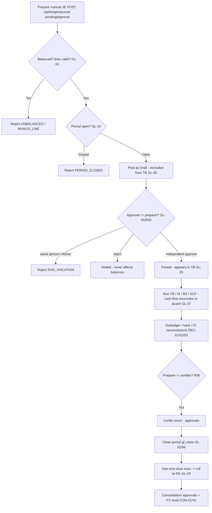

# General Ledger & Financial Close — Process Narrative

## 1. Document control

| Field | Value |
|---|---|
| Process ID | PN-04-GL |
| Process owner | `<<Controller>>` |
| Approver | `<<CFO>>` |
| Version | **0.1 DRAFT** |
| Effective date | `<<effective-date>>` |
| Review cadence | Each period close + annual |
| Related RCM controls | GL-01, GL-02, GL-03, GL-04, GL-05, GL-06, GL-07, GL-08, GL-09, GL-10, GL-11, LSE-01, REC-01, REC-02, REC-03, REC-04, GOV-01, CON-01, CON-02; SoD R05, R06 |
| Related policy | `compliance/policies/11-financial-close-policy.md`, `compliance/policies/13-segregation-of-duties-policy.md` |

## 2. Purpose

To control journal entry, the trial balance / financial statements, period and year-end close, and reconciliations so that the general ledger is **balanced, complete, accurate, properly cut off, and authorized**, and so that manual journals receive **independent review** (maker-checker) before they affect reported results.

## 3. Scope

**In scope:** manual journal entry (`/api/ledger/journal`) posting as Draft → GL-05 maker-checker approve/reject; trial balance, income statement, balance sheet, **statement of cash flows (indirect)**; period open/close (`gl_close`); year-end close; subledger-to-GL, bank, and intercompany reconciliations; consolidation and FX revaluation.

**Out of scope:** source-cycle postings (revenue, AP, inventory, payroll, tax) which are documented in their own narratives but flow into the GL here.

## 4. References

- ISO 9001:2015 cl. 4.4, cl. 7.5 (documented information), cl. 9.1 (monitoring/measurement).
- `compliance/Oshinei_ERP_SOX_RCM_v1.xlsx` — GL-01..06, REC-01..03, CON-01/02.
- `compliance/policies/11-financial-close-policy.md` (close calendar), `13-segregation-of-duties-policy.md` (R05, R06).
- Code: `apps/api/src/modules/ledger/ledger.service.ts` + `ledger.controller.ts`, `apps/api/src/modules/reconciliation/reconciliation.service.ts`, `apps/api/src/modules/consolidation/`, `apps/api/src/modules/fx/fx.service.ts`.

## 5. Definitions & abbreviations

| Term | Meaning |
|---|---|
| JE | Journal Entry (JE- prefix) |
| Maker-checker | Preparer of a JE may never approve it (GL-05) |
| Draft / Posted / Voided | JE lifecycle states; only Posted affects balances |
| Period close | Locking a fiscal period against further posting |
| TB / IS / BS | Trial Balance / Income Statement / Balance Sheet |
| SCF | Statement of Cash Flows (indirect method; the third primary statement) |
| RE | Retained Earnings |
| Recon prepare → certify | Two-person reconciliation sign-off |

## 6. Roles & responsibilities (RACI)

SoD: the **preparer** of a manual JE (GlAccountant) is never its **approver** (FinancialController) — enforced even for Admin (**GL-05**, **R05**); the **preparer** of a reconciliation (`recon_prep`) is never its **certifier** (`approvals`) (**R06**); the role posting JEs (`gl_post`) is separated from the role that **closes the period** (`gl_close`) (**R05**).

| Activity | GlAccountant | FinancialController | Controller | ExecutiveViewer / CFO |
|---|---|---|---|---|
| Prepare manual JE (`gl_post`) | **A/R** | I | A | I |
| Approve / reject manual JE (`gl_close`/checker, ≠ preparer) | I | **A/R** | A | C |
| Run TB / IS / BS / SCF | R | R | **A/R** | I |
| Close / open fiscal period (`gl_close`) | I | **A/R** | A | I |
| Year-end close (`exec`) | I | C | **A/R** | A |
| Prepare reconciliation (`recon_prep`) | **A/R** | C | A | I |
| Certify reconciliation (`approvals`) | I | **A/R** | A | C |

## 7. Process narrative

1. **JE invariants (decision point).** Every JE must be balanced by construction: Σdebit = Σcredit, each line single-sided and non-negative; an unbalanced entry → `UNBALANCED`, a malformed line → `INVALID_LINE` (**GL-01**).
2. **Period-close lockout (decision point).** Posting into a **Closed** fiscal period is rejected `PERIOD_CLOSED` on both the initial post and at approval time (per-tenant fiscal calendar) (**GL-02**).
3. **Idempotent posting.** A unique key `(tenant, source, source_ref, ledger)` with `ON CONFLICT DO NOTHING` prevents concurrent double-booking of the same source document (**GL-04**).
4. **Manual JE maker-checker (the key control).** A manual JE submitted via `POST /api/ledger/journal` with `pendingApproval` posts as **Draft** and is **excluded from the trial balance** until approved. `approveEntry` (permission `gl_close`) sets it **Posted** only if the approver is **not** the preparer (`createdBy`); a self-approval → `SOD_VIOLATION` — enforced **even for Admin**. `rejectEntry` sets it **Voided** with the reason appended to the memo; Voided/Draft never affect balances (**GL-05**, **R05**). Posting (`gl_post`) and approval (`gl_close`) are different permissions.
5. **Cross-tenant posting gate.** HQ cross-tenant posting (`hqTenant`) is gated to Admin (explicit tenant override, also audited); a non-Admin override is ignored and RLS pins the context (**GL-06**).
6. **Financial statements.** Controller runs the trial balance, income statement, balance sheet, and **statement of cash flows** — built only from Posted entries in open/closed periods. The **statement of cash flows** (`GET /api/ledger/cash-flow?from&to`, indirect method) is reconstructed from the same GL data: operating cash = net income + non-cash add-backs (depreciation, acct 1590) + working-capital movements (AR/inventory/AP/accruals), then investing (fixed assets, acct 1500) and financing (equity/dividends, accts 3000/3100). **Year-end CLOSE journals are excluded** (they reclassify P&L to retained earnings and carry no cash). The statement **reconciles by construction** to the movement in the cash accounts (1000/1010/1020) — the response carries a `reconciled` flag and lists any `unclassified_accounts` for transparency (**GL-07**). A **direct-method** presentation (`GET /api/ledger/cash-flow-direct`) classifies actual cash movements by the nature of their contra account (receipts from customers, payments to suppliers/employees, tax & payroll remittances, investing, financing) and reconciles to the same Δcash. A forward **cash-flow forecast** (`GET /api/ledger/cash-flow-forecast?weeks=`) projects the cash balance from today using open AR (expected inflows by due date) and open AP (expected outflows), so Treasury sees the projected closing position and any week that runs short (**GL-07**).
7. **Reconciliations (decision point, two-person).** Subledger-to-GL reconciliation imports GL items, auto-matches, clears unmatched, and is **certified** by a different person — preparer (`recon_prep`) ≠ certifier (`approvals`) (**REC-01**, **R06**). Bank reconciliation against statements (**REC-02**, see `07-cash-treasury.md`); intercompany reconciliation/elimination on consolidation (**REC-03**). A **period-end control-account reconciliation PACK** (`GET /api/finance/reconciliation/controls`) gives the Controller a single 'are the books reconciled?' view: it ties every major sub-ledger to its GL control account in one read — **AR↔1100**, **AP↔2000**, **Inventory↔1200**, **Gift cards / customer deposits↔2200**, **Deferred revenue↔2400** — reporting per line `{sub_ledger, gl_control, variance, reconciled}` plus an overall `all_reconciled` flag and an `exceptions` count (liability controls are sign-flipped before comparison). Any non-reconciled line is a **control finding** to investigate before sign-off; this is the detective backstop that catches a sub-ledger silently drifting from the GL before the financial statements are issued (**REC-04**). A **pending-approvals monitor** (`GET /api/finance/approvals/pending`) is the companion governance view: a single worklist of **every** item still awaiting independent (maker-checker) approval across the system — manual JEs (**GL-05**), bank adjustments (**BANK-02**), AP disbursements (**EXP-06**), payroll runs (**PAY-03**), asset revaluations (**FA-08**), asset disposals (**FA-09**), inventory write-offs (**INV-07**), manual FX rates (**FX-04**) and budgets (**BUD-01**) — each with its **age in days** and an **overdue** roll-up. The controller reviews it before close so nothing sits un-actioned: a stale item is either a transaction stuck before it can take effect, or a control silently bypassed because no one chased the second sign-off (**GOV-01**, COSO *Monitoring*).
8. **Period close.** FinancialController closes the period via `gl_close` after reconciliations are certified, per the close calendar; the period then rejects further posting (**GL-02**, **GL-06**). Closing a period also **auto-accrues the loyalty points liability** to the period *before* locking it (best-effort; see `19-marketing-pricing-loyalty.md` §7 step 13).
9. **Year-end close.** Year-end close is restricted to `exec`; an attempt without it → `403`. Closing entries roll to retained earnings (**GL-03**). The year-end close first accrues the loyalty liability so its `5700` points-expense is swept to retained earnings (the `2250` liability stays on the balance sheet; cross-ref `19` §7 step 13).
10. **Consolidation & FX.** Consolidation run (ownership %, entity currency) is gated by `approvals` (**CON-01**); period-end FX revaluation posts unrealized FX (acct 5400) (**CON-02**).
11. **Recurring / template journals.** A standing entry (monthly rent/insurance accrual, prepaid amortization, etc.) is defined once via `POST /api/ledger/recurring` — a **balanced template** (its lines are validated `Σdebit = Σcredit` at save time, so a broken template can never be persisted → `UNBALANCED`) plus a cadence (`daily`/`weekly`/`monthly`) and a first-run date. The scheduled job **`gl_recurring_journals`** (cron-callable via `POST /api/ledger/recurring/run`, and runnable daily through the report scheduler) posts every **due** template as a **Draft** JE through the **normal maker-checker flow** (GL-05) — so a recurring accrual still requires a second person to approve before it affects balances — and rolls `next_run_date` forward. The run is **idempotent**: `next_run_date` is advanced on posting and the `(tenant, source, source_ref, ledger)` key dedupes, so a same-day re-run posts nothing. Templates can be paused/resumed (`POST /api/ledger/recurring/:id/active`) without losing history (**GL-08**, **GL-05**, **R05**).
12. **Prepaid amortization.** A prepaid asset (annual insurance, rent paid up front) is registered once via `POST /api/ledger/prepaid` with a **total + term in months** (optionally capitalizing the up-front payment **Dr 1280 / Cr 1000**). The scheduled job **`gl_prepaid_amortize`** (`POST /api/ledger/prepaid/run`, daily-schedulable) amortizes a **straight-line slice each period** (**Dr expense / Cr 1280**), the **last period taking the remainder** so the prepaid asset fully clears. Posting is **direct** (systematic, like depreciation) and **idempotent per `(schedule, period)`** via the JE idempotency key + `next_run_date` advance (**GL-09**).
13. **Lease accounting (IFRS 16 / TFRS 16).** A lease is capitalized via `POST /api/leases`: at commencement a **right-of-use asset** and a **lease liability** are recognised at the **present value of the lease payments** (**Dr 1600 / Cr 2600**, non-cash). The scheduled job **`lease_periodic_run`** (`POST /api/leases/run`) posts each period — **interest unwinding** on the liability (**Dr 5900**), the **cash payment** reducing the liability (**Dr 2600 / Cr 1000**), and **straight-line ROU depreciation** (**Dr 5210 / Cr 1690**) — with the **last period clearing the liability + ROU exactly**. Idempotent per `(lease, period)`. A **lease modification / remeasurement** (`POST /api/leases/:leaseNo/modify` — revised payment, remaining term, or rate) **remeasures the liability** at the PV of the revised payments and **adjusts the ROU asset by the same delta** (Dr/Cr **1600 ↔ 2600**); a downward remeasurement larger than the ROU floors it at zero and books the excess as a P&L gain (**Cr 1510**). Depreciation then runs straight-line over the **revised remaining term** (**LSE-01**, see also `09-fixed-assets-depreciation.md`). At close the **lease-liability reconciliation** (`GET /api/leases/liability-reconciliation`) ties the **GL lease-liability control account (2600)** to the **sum of the remaining liability balances on the lease schedule** — `gl_liability` vs `schedule_liability` with a `difference` and a `reconciled` flag (a divergence means a manual JE hit 2600 outside the lease engine, or a periodic run / remeasurement didn't post). The `/leases` screen surfaces this as a tie-out banner (**LSE-01**).

14. **Chart of Accounts management (WS1.1 — GL-11).** The Chart of Accounts is now **master data** — editable via API by authorised users (`gl_coa` permission, held by FinancialController and Admin) rather than hardcoded. The account hierarchy is: **account_groups** (tenant-scoped groups, `NULL tenant_id` = global template visible to all tenants) → **accounts** (the canonical posting universe, extended with Thai name, group link, control flags, normal balance, postability, dimension requirements, and effective dates). Key controls:

    - **Account creation** (`POST /api/ledger/accounts`): creates a new account with an auto-defaulted `normal_balance` (`C` for Liability/Equity/Revenue, `D` for Asset/Expense). Duplicate code → `DUPLICATE_ACCOUNT`.
    - **Account update** (`PATCH /api/ledger/accounts/:code`): changes name, Thai name, group, postability, dimension requirements, and effective dates. Disabling postability when the account already has posted entries → `CODE_HAS_POSTINGS`.
    - **Account deactivation** (`POST /api/ledger/accounts/:code/deactivate`): sets `active=false` and `is_postable=false`. Blocked if the account carries a **non-zero net balance** → `ACCOUNT_HAS_BALANCE`. This prevents orphaning a balance in a "closed" account.
    - **Control-account guard**: four accounts are flagged `is_control = true` at setup — **1100 (AR)**, **2000 (AP)**, **1200 (INV)**, **1500 (FA)**. Direct manual JE postings to a control account are **rejected** (`CONTROL_ACCOUNT`) unless the caller sets `viaSubledger: true`. Only the AR, AP, Inventory, and Fixed-Assets service methods set this flag, ensuring those balances are exclusively maintained by their respective sub-ledgers (defeats a common audit bypass where a direct JE hides a sub-ledger discrepancy).
    - **Permissions / SoD**: `gl_coa` is a dedicated sub-permission for CoA maintenance — separated from `gl_post` so the accountant who posts JEs cannot also reclassify accounts (COSO control environment integrity). FinancialController is granted both `gl_coa` and `gl_close`; GlAccountant is not granted `gl_coa`.

    (**GL-11**, see also the industry-CoA template layer at step 15 below.)

15. **Industry Chart-of-Accounts at company creation.** The GL engine binds to a **fixed, global account universe** (canonical codes are immutable — every posting hard-references its code). On top of that, each tenant gets a **per-tenant overlay** (`tenant_accounts`) that curates *which* canonical accounts are active and *how* they are named/grouped for its industry. At **company creation** the customer picks a business type (`restaurant` / `retail` / `distribution` / `services` / `general`); `signup` materialises the chosen template into the overlay (`provisionTenantCoA`) **inside the signup transaction**, right after fiscal-year provisioning. Adopting an industry pack later (`POST /api/onboarding/apply-pack`) does the same. Every template account code is **asserted to exist in the canonical chart at boot** (`assertTemplatesSubsetOf` in `seedChartOfAccounts`) so a drifted template **fails fast** and can never reach a tenant; provisioning is **idempotent + additive** (never deletes), so re-running only adds missing accounts. The overlay is **presentation-only — it never gates postings**: `GET /api/ledger/accounts` returns the tenant's curated chart by default but `?all=true` exposes the full canonical universe, and reports surface any account that is **active OR carries activity** (so a curated-out account that receives a posting still appears) (**GL-10**).

## 8. Process flow



**Swimlane description by role:** **GlAccountant** prepares manual JEs (Draft) and reconciliations. The **system** enforces balance/line invariants, period locks, idempotency, the maker-checker rule (even for Admin), and the cross-tenant gate. **FinancialController** independently approves JEs, certifies reconciliations, and closes periods. **Controller/CFO** owns year-end close and consolidation, gated by `exec`/`approvals`.

## 9. Control matrix

| Step | Risk | Control | Type | RCM ID | Evidence / Record |
|---|---|---|---|---|---|
| 1 | Unbalanced / one-sided JE | Double-entry balanced-by-construction | Prev / Auto | GL-01 | Invariant tests; `UNBALANCED` |
| 2 | Posting to a closed period (cutoff) | Period-close lockout `PERIOD_CLOSED` | Prev / Auto | GL-02 | Close-lock test |
| 3 | Concurrent double-booking | Ledger idempotency unique key + ON CONFLICT | Prev / Auto | GL-04 | Dedup test |
| 4 | Manual JE without independent review | Maker-checker; Draft excluded from TB; preparer ≠ approver (even Admin) | Prev / Hybrid | GL-05, R05 | JE approvals; harness ToE; `SOD_VIOLATION` |
| 5 | Mis-post to another tenant's books | HQ cross-tenant posting gated to Admin (+ RLS) | Prev / Auto | GL-06 | Override test |
| 7 | Subledgers diverge from GL undetected | Subledger-to-GL recon + independent certify | Det / Hybrid | REC-01, R06 | Certified recon |
| 7 | A sub-ledger silently drifts from its GL control account before the FS are issued | **Period-end control-account reconciliation pack** — one read ties AR/AP/Inventory/Gift-cards/Deferred-revenue to GL 1100/2000/1200/2200/2400 and flags any out-of-balance (`exceptions`, `all_reconciled`) | **Det / Auto** | **REC-04** | Reconciliation pack (`GET /api/finance/reconciliation/controls`); `giftcards` + `compliance` harness |
| 7 | A maker-checker approval sits un-actioned (transaction stalls, or a control is quietly bypassed) | **Pending-approvals monitor** — one worklist of every item awaiting approval across GL-05/BANK-02/EXP-06/PAY-03/FA-08/FA-09/INV-07/FX-04/BUD-01, with age + overdue roll-up; reviewed before close | **Det / Auto** | **GOV-01** | Pending-approvals worklist (`GET /api/finance/approvals/pending`); `compliance` harness |
| 7 | Bank balance not reconciled | Bank reconciliation vs statements | Det / Hybrid | REC-02 | Bank rec |
| 7 | Intercompany not eliminated/agreed | IC reconciliation + elimination | Det / Hybrid | REC-03 | IC recon |
| 6 | Cash flow statement mis-stated / doesn't tie to cash | SCF (indirect) reconstructed from GL; `reconciled` tie-out to Δcash; CLOSE entries excluded | Det / Auto | GL-07 | `basics` harness reconciliation check |
| 9 | Unauthorized year-end close / RE roll | Year-end close restricted to `exec` | Prev / Hybrid | GL-03 | Close package; 403 test |
| 10 | Consolidation / FX mis-stated | Consolidation gated by `approvals`; FX reval | Hybrid | CON-01, CON-02 | Consol TB; FX reval JE |
| 11 | Standing accrual missed / posts unbalanced or unapproved | Recurring-journal template validated balanced at save; scheduled run posts a **Draft** JE through maker-checker (GL-05); idempotent per due date | Prev / Auto | GL-08 | `basics` recurring-JE checks |
| 12 | Prepaid not amortized over its term | Prepaid schedule amortizes a straight-line slice each period (Dr expense / Cr 1280); last period clears the asset; idempotent | Det / Auto | GL-09 | `basics` prepaid checks |
| 13 | Lease not capitalised (ROU + liability omitted) | Commencement recognises ROU=liability=PV; periodic run posts interest + payment + ROU depreciation; idempotent | Det / Auto | LSE-01 | `basics` lease checks |
| 13 | Lease liability (2600) diverges from the schedule (manual JE / missed run) | Lease-liability reconciliation: GL 2600 vs Σ remaining schedule liability, with a `reconciled` flag + tie-out banner reviewed at close | **Det / Auto** | **LSE-01** | Lease-liability reconciliation; `basics` lease checks |
| 14 | CoA changed without authorisation; code changed after postings; account deactivated with live balance; direct JE bypasses sub-ledger on a control account | CoA Change Control: `gl_coa` permission required; code-change blocked if postings exist (`CODE_HAS_POSTINGS`); deactivation blocked if non-zero balance (`ACCOUNT_HAS_BALANCE`); control accounts (1100/2000/1200/1500) reject direct postings unless `viaSubledger:true` (`CONTROL_ACCOUNT`) | Prev / Auto | GL-11 | `gl_coa` permission tests; control-account guard test |
| 15 | New company starts on an unguided chart, or an industry template drifts from the engine's fixed codes | Industry CoA templates: per-tenant overlay over an **immutable** canonical universe; chosen at signup (`provisionTenantCoA`, in-txn); every template code **asserted ⊆ canonical at boot**; idempotent + additive; overlay is presentation-only (never gates postings — `?all=true` exposes the full universe) | Prev / Auto | GL-10 | `basics` + `compliance` industry-CoA checks |

## 10. Inputs & outputs

**Inputs:** source-cycle postings, manual JE requests, subledger balances, bank statements, FX rates, ownership %, close calendar.
**Outputs:** Posted JEs (JE-), trial balance, income statement, balance sheet, **statement of cash flows (indirect)**, certified reconciliations, closed periods, year-end close package, consolidated TB.

## 11. Records & retention

| Record | Store | Retention |
|---|---|---|
| Journal entries (Draft/Posted/Voided) | Ledger (RLS-scoped) | `<<7 years>>` |
| JE approval / rejection trail | `audit_log`, memo annotations | `<<7 years>>` |
| Reconciliations + certifications | `reconciliation` tables | `<<7 years>>` |
| Period/year close records | `fiscal_periods` | `<<7 years>>` |
| Financial statements | Reports / exports | `<<7 years>>` |

## 12. KPIs / metrics

- Manual JEs posted: % with distinct approver (target 100%); count of `SOD_VIOLATION`.
- Postings rejected for `PERIOD_CLOSED`.
- Reconciliation completeness and on-time certification per close.
- Days to close; number of post-close adjustments.

## 13. Exception & error handling

| Error code | Trigger | Handling |
|---|---|---|
| `UNBALANCED` / `INVALID_LINE` | Bad JE structure | Correct and resubmit |
| `PERIOD_CLOSED` | Post/approve into closed period | Re-open per close policy (authorized) or post to open period |
| `SOD_VIOLATION` | Preparer approves own JE | Route to independent approver (always, incl. Admin) |
| `NOT_PENDING` | Approve/reject a non-Draft JE | Verify JE state |
| `403` on year-end close | Lacks `exec` permission | CFO/Controller performs close |
| `DUPLICATE_ACCOUNT` | Account code already exists in CoA | Use a new code or update the existing account |
| `CODE_HAS_POSTINGS` | Attempt to disable postability on an account with posted entries | Retain postability; use `effective_to` date-fence instead |
| `ACCOUNT_HAS_BALANCE` | Attempt to deactivate an account with non-zero balance | Clear the balance via a correcting JE first |
| `CONTROL_ACCOUNT` | Direct JE to a control account (1100/2000/1200/1500) without `viaSubledger:true` | Post via the relevant sub-ledger (AR/AP/Inventory/Fixed Assets) |

## 14. Revision history

| Version | Date | Author | Summary |
|---|---|---|---|
| 0.1 DRAFT | 2026-06-22 | `<<author>>` | Initial draft. |
| 0.2 | 2026-06-24 | Platform | Steps 8–9: period close and year-end close now auto-accrue the loyalty points liability before locking (year-end `5700` swept to RE). Cross-ref `19-marketing-pricing-loyalty.md` §7 (CRM Phase 1.5). |
| 0.3 | 2026-06-26 | Platform | WS1.1: Added step 14 — CoA as master data (account_groups table, accounts extended, GL-11 control). Control-account guard for 1100/2000/1200/1500. `gl_coa` permission. Updated control matrix (step 14 GL-11, renumbered former 14→15), error-handling table, and RCM control list. |
| 0.4 | 2026-06-26 | Platform | **GOV-01 — pending-approvals monitor (COSO Monitoring).** Step 7: `FinanceService.pendingApprovals` on `GET /api/finance/approvals/pending` — one worklist of every item awaiting independent (maker-checker) approval across the system (manual JE GL-05, AP disbursement EXP-06, payroll PAY-03, asset revaluation FA-08, asset disposal FA-09, inventory write-off INV-07), each with its age in days + an overdue roll-up + total amount. The controller's pre-close 'what is stuck?' view; a stale item is a control finding. Read-only; no migration. New RCM control **GOV-01** (RCM now 85); control matrix gains a step-7 monitoring row. New `/approvals` screen. ToE: `compliance` (a Draft JE surfaces in the worklist with its control ID, amount + age). |
| 0.3 | 2026-06-26 | Platform | **REC-04 — period-end control-account reconciliation PACK.** Step 7: `FinanceService.reconcileControls` on `GET /api/finance/reconciliation/controls` ties every major sub-ledger to its GL control account in one read — AR↔1100, AP↔2000, Inventory↔1200, Gift cards↔2200, Deferred revenue↔2400 — with per-line `{sub_ledger, gl_control, variance, reconciled}` + `all_reconciled`/`exceptions` (liabilities sign-flipped). New RCM control **REC-04** (RCM now 84); control matrix gains a step-7 detective row. New control-account overview on `/reconciliation`. Read-only detective; no migration. ToE: `giftcards` (2200 ties, 5 lines, all reconciled) + `compliance` (inventory 1200 ties, exceptions surfaced). |
| 0.4 | 2026-06-26 | Platform | **Pending-approvals monitor extended (GOV-01).** The unified pending-approvals monitor (`FinanceService.pendingApprovals` on `GET /api/finance/approvals/pending`, control **GOV-01**) now also covers the **bank-adjustment (BANK-02)**, **FX-rate (FX-04)** and **budget (BUD-01)** maker-checkers added in this series — a Draft BANKADJ journal entry is control-tagged BANK-02, and the pending FX-rate and budget queues are aggregated alongside the existing GL-05/EXP-06/PAY-03/FA-08/FA-09/INV-07 sources. (An earlier branch-local "aging monitor" was consolidated into GOV-01 rather than shipped as a second endpoint.) No new control / no migration. ToE: `compliance` (GOV-01 surfaces a Draft JE with control + amount + age + overdue roll-up). |
| 0.5 | 2026-06-26 | Platform | **GL-10 — industry Chart-of-Accounts at company creation.** New step 14: the customer picks a business type at signup (`restaurant`/`retail`/`distribution`/`services`/`general`) and `BillingService.signup` materialises the matching template into a per-tenant overlay (`tenant_accounts`) via `LedgerService.provisionTenantCoA`, in-transaction after fiscal-year provisioning; `applyPack` does the same when an industry pack is adopted later. The canonical chart stays the **immutable** posting universe; every template code is **asserted ⊆ canonical at boot** (`assertTemplatesSubsetOf`); provisioning is idempotent + additive; the overlay is **presentation-only** (`GET /api/ledger/accounts` curated by default, `?all=true` = full universe — never gates postings). Migration **0139** (`tenant_accounts` + `tenants.industry`). New RCM control **GL-10** (RCM now 98); control matrix gains a step-14 preventive row. ToE: `basics` + `compliance` industry-CoA checks. |
| 0.3 DRAFT | 2026-06-24 | `<<author>>` | Added **Statement of Cash Flows (indirect)** (`GET /api/ledger/cash-flow`) as the third primary statement, control **GL-07** (reconciles to Δcash; CLOSE excluded), and the `basics` reconciliation harness. |
| 0.4 DRAFT | 2026-06-25 | `<<author>>` | §7.6 — added the **direct-method** statement of cash flows (`/api/ledger/cash-flow-direct`, receipts/payments by nature, reconciles to Δcash) and a forward **cash-flow forecast** (`/api/ledger/cash-flow-forecast`, AR/AP due-date projection). Verified by the `basics` harness. |
| 0.5 DRAFT | 2026-06-25 | `<<author>>` | §7 step 11 — added **recurring / template journal entries** (`/api/ledger/recurring`, scheduled job `gl_recurring_journals`): balanced-at-save template + cadence; the run posts each due template as a **Draft** JE through maker-checker (GL-05) and is idempotent. New control **GL-08**. Verified by the `basics` harness. |
| 0.6 DRAFT | 2026-06-25 | `<<author>>` | §7 steps 12–13 — added **prepaid amortization** (`/api/ledger/prepaid`, job `gl_prepaid_amortize`, straight-line Dr expense / Cr 1280; **GL-09**) and **lease accounting (IFRS 16)** (`/api/leases`, job `lease_periodic_run`, ROU+liability at PV then interest/payment/depreciation; **LSE-01**). Verified by the `basics` harness. |
| 0.7 DRAFT | 2026-06-25 | `<<author>>` | §7 step 13 — added **lease modification / remeasurement** (`/api/leases/:leaseNo/modify`): remeasures the liability at the revised PV and adjusts the ROU by the same delta (Dr/Cr 1600↔2600), then depreciates over the remaining term (**LSE-01**). Verified by the `basics` harness. |
| 0.8 DRAFT | 2026-06-25 | `<<author>>` | **Lease management UI surfaced** — new screen `/leases` (ERP nav → การเงิน ▸ สมุดบัญชี & แยกประเภท) drives the already-documented IFRS 16 endpoints: create lease (ROU+liability at PV), "run-due" periodic posting, and modification/remeasurement. UI-only addition; no process/GL/control change (**LSE-01**). See user manual `06-general-ledger.md` §Leases and UAT `05-general-ledger-close-uat.md`. |
| 0.9 DRAFT | 2026-06-26 | Platform | §7 step 13 — added the **lease-liability reconciliation** (`GET /api/leases/liability-reconciliation`): ties GL **2600** to the sum of the remaining liability balances on the lease schedule (`gl_liability` vs `schedule_liability`, `difference`, `reconciled`), surfaced as a tie-out banner on `/leases`. Detective tie-out over the existing **LSE-01**; no new control, no migration. Verified by the `basics` harness (after run + remeasurement, GL 2600 = schedule, reconciled, difference 0). |
| 1.0 DRAFT | 2026-06-26 | WS1.3 | WS1.3 — added **multi-dimensional GL postings**: `branch_id`, `project_id`, `department_id` columns on `journal_lines`; `PostingService` context stamping; `GET /api/ledger/income-statement/by-branch` per-branch P&L endpoint; `departments` master table with RLS. New control **GL-13**. Verified by the `basics` harness (TC-GL-13-01/02/03). Migration 0157. |
| 1.1 DRAFT | 2026-06-26 | WS1.4 | WS1.4 — added **sub-ledger tie-out / reconciliation**: `POST /api/ledger/tie-out/run` reconciles each GL control account (1100 AR / 2000 AP / 1200 INV / 1500 FA) to the sum of its sub-ledger detail, recording the variance + a Matched/Variance status; `POST /api/ledger/tie-out/:id/certify` is **maker-checker** (certifier ≠ runner → `SELF_CERTIFY`). New `subledger_tieout_runs` table (RLS), new control **GL-14**. Verified by the `basics` harness (TC-GL-14-01/02/03). Migration 0160. |
| 1.2 DRAFT | 2026-06-26 | WS2.1 | WS2.1 — **hard period close + checklist**: `POST /api/ledger/close/start` opens a `close_runs` record (InProgress) per (tenant, period) and seeds a standard checklist (`close_run_steps`); `POST /api/ledger/close/step` marks steps Done → run advances to **ReadyToLock** when all required steps are done; `POST /api/ledger/close/lock` hard-locks the period (requires ReadyToLock else `STEPS_INCOMPLETE`; **maker-checker** locker ≠ starter → `SELF_LOCK`). New `'Locked'` period status; `postEntry` now rejects ALL postings into a Locked period with `PERIOD_LOCKED` regardless of the legacy `allowClosedPeriod` escape (only the system year-end closing entry, `source='CLOSE'`, is exempt). New `close_runs` / `close_run_steps` tables (RLS), new controls **GL-15** (checklist completeness) + **GL-16** (segregated lock). Verified by the `basics` harness (TC-GL-15-01/02/03, TC-GL-16-01/02). Migration 0162. |

## 1.3 Multi-dimensional GL Postings (WS1.3)

### Overview
`journal_lines` now carries three optional dimension columns: `branch_id`, `project_id`, and `department_id`.
These enable per-location and per-project P&L views without separate ledger books.

### How dimensions are stamped
- **Manual JEs** (`POST /api/ledger/journal`): pass `branch_id`, `project_id`, `dept_id` on each line object.
- **Automated postings via `PostingService.post()`**: `PostingContext` accepts `branchId?`, `projectId?`, `departmentId?`; the service stamps all lines in the generated entry with those values.

### Per-branch income statement
`GET /api/ledger/income-statement/by-branch?from=YYYY-MM-DD&to=YYYY-MM-DD`

Returns:
```json
{
  "period": { "from": "...", "to": "..." },
  "branches": {
    "1":           { "revenue": 500, "expense": 0, "net": 500, "lines": [...] },
    "2":           { "revenue": 300, "expense": 0, "net": 300, "lines": [...] },
    "unassigned":  { "revenue": 0,   "expense": 200, "net": -200, "lines": [...] }
  }
}
```
Lines without a `branch_id` are grouped under `"unassigned"`.

### Departments master table
The `departments` table holds a tenant-scoped department registry (code, name, active flag).
RLS policy `tenant_isolation_departments` restricts reads to the caller's tenant.

### Control GL-13 — Dimension Completeness
| Control ID | GL-13 |
|------------|-------|
| Name | Multi-dimensional GL posting dimension completeness |
| Type | Application — Automated |
| Risk | Revenue / expense mis-attributed to wrong branch / project, obscuring per-location P&L |
| Mitigation | `branch_id`, `project_id`, `department_id` columns on `journal_lines`; `PostingService` stamps from context; `income-statement/by-branch` provides per-location P&L review |
| Test | TC-GL-13-01/02/03 (basics.ts harness) |

## 1.4 Sub-ledger Tie-out / Reconciliation (WS1.4)

### Overview
At period-end the four GL **control accounts** must each equal the sum of their sub-ledger detail. A
tie-out run computes both sides as of a date, records the **variance**, and requires an independent
**certification** (maker-checker) so the reconciliation is reviewed by someone other than its preparer.

The control accounts (flagged `is_control=TRUE`, `control_subledger` set in WS1.1):
- **1100** — Accounts Receivable (`AR`)
- **2000** — Accounts Payable (`AP`)
- **1200** — Inventory (`INV`)
- **1500** — Fixed Assets (`FA`)

### Running a tie-out
`POST /api/ledger/tie-out/run` — body `{ "subledger": "AR" | "AP" | "INV" | "FA", "as_of_date"?: "YYYY-MM-DD" }`
(permission `gl_close` or `gl_post`). `runBy` is taken from the authenticated user. It computes:

- **GL balance** — Σ(`debit − credit`) of **posted** `journal_lines` on the control account up to the
  as-of date, scoped to the caller's tenant.
- **Sub-ledger balance** — summed from the originating detail tables (queried directly):
  - **AR** — Σ outstanding (`amount − paid_amount`) of `ar_invoices` issued up to the as-of date.
  - **AP** — Σ outstanding (`amount − paid_amount`) of `ap_transactions` dated up to the as-of date.
  - **INV** — Σ `inv_balances.total_value` (perpetual on-hand × cost). `inv_balances` is a current
    snapshot with no per-date history, so the as-of is **advisory** for INV.
  - **FA** — Σ (`acquire_cost − accumulated_depreciation`) of non-disposed `fixed_assets` (a current
    register snapshot — as-of **advisory**).
- **variance** = `gl_balance − subledger_balance`; **status** = `Matched` when `|variance| < 0.01`,
  else `Variance`.

Runs **upsert** on (`tenant_id`, `subledger`, `as_of_date`) — a same-day re-run refreshes the figures
and clears any prior certification. Results persist in `subledger_tieout_runs` (RLS-isolated by tenant).

`GET /api/ledger/tie-out` (optional `?subledger=`/`?as_of_date=`) lists runs newest-first;
`GET /api/ledger/tie-out/:id` fetches one.

### Certification (maker-checker)
`POST /api/ledger/tie-out/:id/certify` — body `{ "note"?: string }` (permission `gl_close`). Sets
`status = Certified` and records the certifier + timestamp. A `Variance` may be certified with an
explanatory `note` describing the reconciling items. **Segregation of duties:** the certifier must
**differ** from the runner — certifying your own run is rejected with **`SELF_CERTIFY`** (HTTP 400).

### Error codes
| Code | Meaning |
|------|---------|
| `SELF_CERTIFY` | The certifier equals the runner — maker-checker SoD violation (a different `gl_close` user must certify). |
| `BAD_SUBLEDGER` | `subledger` not one of AR/AP/INV/FA. |
| `NO_CONTROL_ACCOUNT` | No account is flagged `is_control` for the requested sub-ledger. |
| `NOT_FOUND` | Tie-out run id does not exist. |

### Control GL-14 — Sub-ledger Tie-out
| Control ID | GL-14 |
|------------|-------|
| Name | Sub-ledger tie-out / control-account reconciliation |
| Type | Application — Automated (Detective, Monthly) |
| Risk | GL control-account balances drift from sub-ledger detail without detection, masking posting errors or fraud |
| Mitigation | Tie-out run computes GL vs sub-ledger balance + variance per control account; maker-checker certification (certifier ≠ runner, `SELF_CERTIFY`) |
| Owner | Financial Controller |
| Test | TC-GL-14-01/02/03 (basics.ts harness) |

## 2.1 Hard Period Close + Checklist (WS2.1)

Period close is now a **controlled, checklist-driven, irreversible workflow** rather than a single soft
status flip. A `close_runs` record (one per tenant+period) drives a sequence of `close_run_steps`; the
period can only be **Locked** once every required step is complete, and the lock is **segregated** from the
preparer (maker-checker).

### Close-run lifecycle
`Open → InProgress → ReadyToLock → Locked`

1. **InProgress** — `POST /api/ledger/close/start { period }` (perm `gl_close`) creates the run as
   `InProgress` and seeds the standard checklist. Upsert-safe: a re-start of a non-locked period returns the
   existing run; a re-start of a Locked period is rejected (`PERIOD_ALREADY_LOCKED`).
2. **ReadyToLock** — `POST /api/ledger/close/step { close_run_id, step_key, detail? }` (perm `gl_close`)
   marks a step `Done` (records `completed_by` + timestamp). When **all required** steps are `Done`, the run
   automatically advances to `ReadyToLock`.
3. **Locked** — `POST /api/ledger/close/lock { close_run_id }` (perm `gl_close`) hard-locks the period.
   - Requires `ReadyToLock` — else `STEPS_INCOMPLETE` (the response lists the pending required `step_key`s).
   - **Maker-checker**: the locker (`locked_by`) MUST differ from the starter (`started_by`) — else
     `SELF_LOCK`. Both identities + `locked_at` are retained as the SoD evidence trail.
   - Locking writes `'Locked'` into `fiscal_periods.status`.

Read endpoints: `GET /api/ledger/close/status?period=YYYY-MM` (the run + its steps) and `GET /api/ledger/close`
(recent runs) — perms `gl_close`, `gl_post`, `exec`.

### Seeded checklist (`close_run_steps`)
| step_key | Title | Required |
|---|---|---|
| `subledger_tieout` | Sub-ledger tie-out (AR/AP/INV/FA) reconciled | Yes |
| `bank_rec` | Bank reconciliation complete | Yes |
| `depreciation` | Depreciation posted for the period | Yes |
| `recurring` | Recurring / prepaid journals run | Yes |
| `fx_reval` | FX revaluation posted | No (advisory) |
| `trial_balance_review` | Trial-balance review & sign-off | Yes |

### The new hard `PERIOD_LOCKED` gate (replaces the soft escape)
Previously a `Closed` period could be posted into by any caller passing `allowClosedPeriod: true`. WS2.1 adds
a strictly stronger gate: `LedgerService.postEntry` now rejects **every** entry dated into a **Locked** period
with **`PERIOD_LOCKED`**, *regardless* of `allowClosedPeriod`. The legacy soft `Closed` / `allowClosedPeriod`
behaviour is unchanged (backward compatible) — `Locked` is additive and irreversible. The **only** exemption
is the system year-end closing entry (`source = 'CLOSE'`), so `closeYear` can still post its P&L-sweep JE into
December. (Locked is not exposed as a normal re-open; reversing a hard close is an out-of-band/audited action.)

### New error codes
`PERIOD_LOCKED` (post into a locked period), `PERIOD_ALREADY_LOCKED` (start/step on a locked run),
`STEPS_INCOMPLETE` (lock before required steps done), `SELF_LOCK` (locker = starter),
`CLOSE_RUN_NOT_FOUND`, `STEP_NOT_FOUND`.

### Control GL-15 — Close-checklist completeness
| Control ID | GL-15 |
|------------|-------|
| Name | Hard period close — checklist completeness |
| Type | Application — Automated (Preventive, Monthly) |
| Risk | A period is closed with key close procedures skipped, or a closed period is silently re-posted |
| Mitigation | Required checklist steps must all be `Done` before lock (`STEPS_INCOMPLETE`); a Locked period rejects all postings (`PERIOD_LOCKED`, except `source='CLOSE'`) |
| Owner | Financial Controller |
| Test | TC-GL-15-01/02/03 (basics.ts harness) |

### Control GL-16 — Segregated period lock (SoD)
| Control ID | GL-16 |
|------------|-------|
| Name | Segregated period lock (maker-checker) |
| Type | Application — Automated (Preventive, Monthly) |
| Risk | One person both performs and locks the close, concealing a misstatement over their own work |
| Mitigation | Locker (`locked_by`) must differ from starter (`started_by`) → `SELF_LOCK`; both identities + `locked_at` retained as evidence |
| Owner | Financial Controller |
| Test | TC-GL-16-01/02 (basics.ts harness) |
