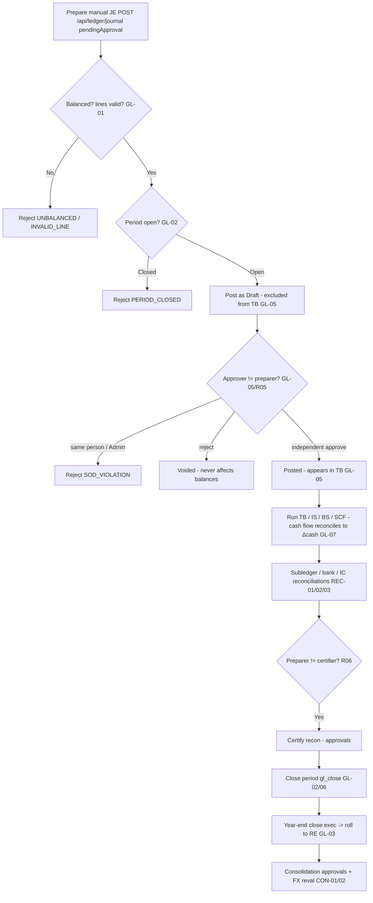

# General Ledger & Financial Close — Process Narrative

## 1. Document control

| Field | Value |
|---|---|
| Process ID | PN-04-GL |
| Process owner | `<<Controller>>` |
| Approver | `<<CFO>>` |
| Version | **0.1 DRAFT** |
| Effective date | `<<effective-date>>` |
| Review cadence | Each period close + annual |
| Related RCM controls | GL-01, GL-02, GL-03, GL-04, GL-05, GL-06, GL-07, GL-08, GL-09, LSE-01, REC-01, REC-02, REC-03, CON-01, CON-02; SoD R05, R06 |
| Related policy | `compliance/policies/11-financial-close-policy.md`, `compliance/policies/13-segregation-of-duties-policy.md` |

## 2. Purpose

To control journal entry, the trial balance / financial statements, period and year-end close, and reconciliations so that the general ledger is **balanced, complete, accurate, properly cut off, and authorized**, and so that manual journals receive **independent review** (maker-checker) before they affect reported results.

## 3. Scope

**In scope:** manual journal entry (`/api/ledger/journal`) posting as Draft → GL-05 maker-checker approve/reject; trial balance, income statement, balance sheet, **statement of cash flows (indirect)**; period open/close (`gl_close`); year-end close; subledger-to-GL, bank, and intercompany reconciliations; consolidation and FX revaluation.

**Out of scope:** source-cycle postings (revenue, AP, inventory, payroll, tax) which are documented in their own narratives but flow into the GL here.

## 4. References

- ISO 9001:2015 cl. 4.4, cl. 7.5 (documented information), cl. 9.1 (monitoring/measurement).
- `compliance/Oshinei_ERP_SOX_RCM_v1.xlsx` — GL-01..06, REC-01..03, CON-01/02.
- `compliance/policies/11-financial-close-policy.md` (close calendar), `13-segregation-of-duties-policy.md` (R05, R06).
- Code: `apps/api/src/modules/ledger/ledger.service.ts` + `ledger.controller.ts`, `apps/api/src/modules/reconciliation/reconciliation.service.ts`, `apps/api/src/modules/consolidation/`, `apps/api/src/modules/fx/fx.service.ts`.

## 5. Definitions & abbreviations

| Term | Meaning |
|---|---|
| JE | Journal Entry (JE- prefix) |
| Maker-checker | Preparer of a JE may never approve it (GL-05) |
| Draft / Posted / Voided | JE lifecycle states; only Posted affects balances |
| Period close | Locking a fiscal period against further posting |
| TB / IS / BS | Trial Balance / Income Statement / Balance Sheet |
| SCF | Statement of Cash Flows (indirect method; the third primary statement) |
| RE | Retained Earnings |
| Recon prepare → certify | Two-person reconciliation sign-off |

## 6. Roles & responsibilities (RACI)

SoD: the **preparer** of a manual JE (GlAccountant) is never its **approver** (FinancialController) — enforced even for Admin (**GL-05**, **R05**); the **preparer** of a reconciliation (`recon_prep`) is never its **certifier** (`approvals`) (**R06**); the role posting JEs (`gl_post`) is separated from the role that **closes the period** (`gl_close`) (**R05**).

| Activity | GlAccountant | FinancialController | Controller | ExecutiveViewer / CFO |
|---|---|---|---|---|
| Prepare manual JE (`gl_post`) | **A/R** | I | A | I |
| Approve / reject manual JE (`gl_close`/checker, ≠ preparer) | I | **A/R** | A | C |
| Run TB / IS / BS / SCF | R | R | **A/R** | I |
| Close / open fiscal period (`gl_close`) | I | **A/R** | A | I |
| Year-end close (`exec`) | I | C | **A/R** | A |
| Prepare reconciliation (`recon_prep`) | **A/R** | C | A | I |
| Certify reconciliation (`approvals`) | I | **A/R** | A | C |

## 7. Process narrative

1. **JE invariants (decision point).** Every JE must be balanced by construction: Σdebit = Σcredit, each line single-sided and non-negative; an unbalanced entry → `UNBALANCED`, a malformed line → `INVALID_LINE` (**GL-01**).
2. **Period-close lockout (decision point).** Posting into a **Closed** fiscal period is rejected `PERIOD_CLOSED` on both the initial post and at approval time (per-tenant fiscal calendar) (**GL-02**).
3. **Idempotent posting.** A unique key `(tenant, source, source_ref, ledger)` with `ON CONFLICT DO NOTHING` prevents concurrent double-booking of the same source document (**GL-04**).
4. **Manual JE maker-checker (the key control).** A manual JE submitted via `POST /api/ledger/journal` with `pendingApproval` posts as **Draft** and is **excluded from the trial balance** until approved. `approveEntry` (permission `gl_close`) sets it **Posted** only if the approver is **not** the preparer (`createdBy`); a self-approval → `SOD_VIOLATION` — enforced **even for Admin**. `rejectEntry` sets it **Voided** with the reason appended to the memo; Voided/Draft never affect balances (**GL-05**, **R05**). Posting (`gl_post`) and approval (`gl_close`) are different permissions.
5. **Cross-tenant posting gate.** HQ cross-tenant posting (`hqTenant`) is gated to Admin (explicit tenant override, also audited); a non-Admin override is ignored and RLS pins the context (**GL-06**).
6. **Financial statements.** Controller runs the trial balance, income statement, balance sheet, and **statement of cash flows** — built only from Posted entries in open/closed periods. The **statement of cash flows** (`GET /api/ledger/cash-flow?from&to`, indirect method) is reconstructed from the same GL data: operating cash = net income + non-cash add-backs (depreciation, acct 1590) + working-capital movements (AR/inventory/AP/accruals), then investing (fixed assets, acct 1500) and financing (equity/dividends, accts 3000/3100). **Year-end CLOSE journals are excluded** (they reclassify P&L to retained earnings and carry no cash). The statement **reconciles by construction** to the movement in the cash accounts (1000/1010/1020) — the response carries a `reconciled` flag and lists any `unclassified_accounts` for transparency (**GL-07**). A **direct-method** presentation (`GET /api/ledger/cash-flow-direct`) classifies actual cash movements by the nature of their contra account (receipts from customers, payments to suppliers/employees, tax & payroll remittances, investing, financing) and reconciles to the same Δcash. A forward **cash-flow forecast** (`GET /api/ledger/cash-flow-forecast?weeks=`) projects the cash balance from today using open AR (expected inflows by due date) and open AP (expected outflows), so Treasury sees the projected closing position and any week that runs short (**GL-07**).
7. **Reconciliations (decision point, two-person).** Subledger-to-GL reconciliation imports GL items, auto-matches, clears unmatched, and is **certified** by a different person — preparer (`recon_prep`) ≠ certifier (`approvals`) (**REC-01**, **R06**). Bank reconciliation against statements (**REC-02**, see `07-cash-treasury.md`); intercompany reconciliation/elimination on consolidation (**REC-03**).
8. **Period close.** FinancialController closes the period via `gl_close` after reconciliations are certified, per the close calendar; the period then rejects further posting (**GL-02**, **GL-06**). Closing a period also **auto-accrues the loyalty points liability** to the period *before* locking it (best-effort; see `19-marketing-pricing-loyalty.md` §7 step 13).
9. **Year-end close.** Year-end close is restricted to `exec`; an attempt without it → `403`. Closing entries roll to retained earnings (**GL-03**). The year-end close first accrues the loyalty liability so its `5700` points-expense is swept to retained earnings (the `2250` liability stays on the balance sheet; cross-ref `19` §7 step 13).
10. **Consolidation & FX.** Consolidation run (ownership %, entity currency) is gated by `approvals` (**CON-01**); period-end FX revaluation posts unrealized FX (acct 5400) (**CON-02**).
11. **Recurring / template journals.** A standing entry (monthly rent/insurance accrual, prepaid amortization, etc.) is defined once via `POST /api/ledger/recurring` — a **balanced template** (its lines are validated `Σdebit = Σcredit` at save time, so a broken template can never be persisted → `UNBALANCED`) plus a cadence (`daily`/`weekly`/`monthly`) and a first-run date. The scheduled job **`gl_recurring_journals`** (cron-callable via `POST /api/ledger/recurring/run`, and runnable daily through the report scheduler) posts every **due** template as a **Draft** JE through the **normal maker-checker flow** (GL-05) — so a recurring accrual still requires a second person to approve before it affects balances — and rolls `next_run_date` forward. The run is **idempotent**: `next_run_date` is advanced on posting and the `(tenant, source, source_ref, ledger)` key dedupes, so a same-day re-run posts nothing. Templates can be paused/resumed (`POST /api/ledger/recurring/:id/active`) without losing history (**GL-08**, **GL-05**, **R05**).
12. **Prepaid amortization.** A prepaid asset (annual insurance, rent paid up front) is registered once via `POST /api/ledger/prepaid` with a **total + term in months** (optionally capitalizing the up-front payment **Dr 1280 / Cr 1000**). The scheduled job **`gl_prepaid_amortize`** (`POST /api/ledger/prepaid/run`, daily-schedulable) amortizes a **straight-line slice each period** (**Dr expense / Cr 1280**), the **last period taking the remainder** so the prepaid asset fully clears. Posting is **direct** (systematic, like depreciation) and **idempotent per `(schedule, period)`** via the JE idempotency key + `next_run_date` advance (**GL-09**).
13. **Lease accounting (IFRS 16 / TFRS 16).** A lease is capitalized via `POST /api/leases`: at commencement a **right-of-use asset** and a **lease liability** are recognised at the **present value of the lease payments** (**Dr 1600 / Cr 2600**, non-cash). The scheduled job **`lease_periodic_run`** (`POST /api/leases/run`) posts each period — **interest unwinding** on the liability (**Dr 5900**), the **cash payment** reducing the liability (**Dr 2600 / Cr 1000**), and **straight-line ROU depreciation** (**Dr 5210 / Cr 1690**) — with the **last period clearing the liability + ROU exactly**. Idempotent per `(lease, period)` (**LSE-01**, see also `09-fixed-assets-depreciation.md`).

## 8. Process flow

**Swimlane description by role:** **GlAccountant** prepares manual JEs (Draft) and reconciliations. The **system** enforces balance/line invariants, period locks, idempotency, the maker-checker rule (even for Admin), and the cross-tenant gate. **FinancialController** independently approves JEs, certifies reconciliations, and closes periods. **Controller/CFO** owns year-end close and consolidation, gated by `exec`/`approvals`.

## 9. Control matrix

| Step | Risk | Control | Type | RCM ID | Evidence / Record |
|---|---|---|---|---|---|
| 1 | Unbalanced / one-sided JE | Double-entry balanced-by-construction | Prev / Auto | GL-01 | Invariant tests; `UNBALANCED` |
| 2 | Posting to a closed period (cutoff) | Period-close lockout `PERIOD_CLOSED` | Prev / Auto | GL-02 | Close-lock test |
| 3 | Concurrent double-booking | Ledger idempotency unique key + ON CONFLICT | Prev / Auto | GL-04 | Dedup test |
| 4 | Manual JE without independent review | Maker-checker; Draft excluded from TB; preparer ≠ approver (even Admin) | Prev / Hybrid | GL-05, R05 | JE approvals; harness ToE; `SOD_VIOLATION` |
| 5 | Mis-post to another tenant's books | HQ cross-tenant posting gated to Admin (+ RLS) | Prev / Auto | GL-06 | Override test |
| 7 | Subledgers diverge from GL undetected | Subledger-to-GL recon + independent certify | Det / Hybrid | REC-01, R06 | Certified recon |
| 7 | Bank balance not reconciled | Bank reconciliation vs statements | Det / Hybrid | REC-02 | Bank rec |
| 7 | Intercompany not eliminated/agreed | IC reconciliation + elimination | Det / Hybrid | REC-03 | IC recon |
| 6 | Cash flow statement mis-stated / doesn't tie to cash | SCF (indirect) reconstructed from GL; `reconciled` tie-out to Δcash; CLOSE entries excluded | Det / Auto | GL-07 | `basics` harness reconciliation check |
| 9 | Unauthorized year-end close / RE roll | Year-end close restricted to `exec` | Prev / Hybrid | GL-03 | Close package; 403 test |
| 10 | Consolidation / FX mis-stated | Consolidation gated by `approvals`; FX reval | Hybrid | CON-01, CON-02 | Consol TB; FX reval JE |
| 11 | Standing accrual missed / posts unbalanced or unapproved | Recurring-journal template validated balanced at save; scheduled run posts a **Draft** JE through maker-checker (GL-05); idempotent per due date | Prev / Auto | GL-08 | `basics` recurring-JE checks |
| 12 | Prepaid not amortized over its term | Prepaid schedule amortizes a straight-line slice each period (Dr expense / Cr 1280); last period clears the asset; idempotent | Det / Auto | GL-09 | `basics` prepaid checks |
| 13 | Lease not capitalised (ROU + liability omitted) | Commencement recognises ROU=liability=PV; periodic run posts interest + payment + ROU depreciation; idempotent | Det / Auto | LSE-01 | `basics` lease checks |

## 10. Inputs & outputs

**Inputs:** source-cycle postings, manual JE requests, subledger balances, bank statements, FX rates, ownership %, close calendar.
**Outputs:** Posted JEs (JE-), trial balance, income statement, balance sheet, **statement of cash flows (indirect)**, certified reconciliations, closed periods, year-end close package, consolidated TB.

## 11. Records & retention

| Record | Store | Retention |
|---|---|---|
| Journal entries (Draft/Posted/Voided) | Ledger (RLS-scoped) | `<<7 years>>` |
| JE approval / rejection trail | `audit_log`, memo annotations | `<<7 years>>` |
| Reconciliations + certifications | `reconciliation` tables | `<<7 years>>` |
| Period/year close records | `fiscal_periods` | `<<7 years>>` |
| Financial statements | Reports / exports | `<<7 years>>` |

## 12. KPIs / metrics

- Manual JEs posted: % with distinct approver (target 100%); count of `SOD_VIOLATION`.
- Postings rejected for `PERIOD_CLOSED`.
- Reconciliation completeness and on-time certification per close.
- Days to close; number of post-close adjustments.

## 13. Exception & error handling

| Error code | Trigger | Handling |
|---|---|---|
| `UNBALANCED` / `INVALID_LINE` | Bad JE structure | Correct and resubmit |
| `PERIOD_CLOSED` | Post/approve into closed period | Re-open per close policy (authorized) or post to open period |
| `SOD_VIOLATION` | Preparer approves own JE | Route to independent approver (always, incl. Admin) |
| `NOT_PENDING` | Approve/reject a non-Draft JE | Verify JE state |
| `403` on year-end close | Lacks `exec` permission | CFO/Controller performs close |

## 14. Revision history

| Version | Date | Author | Summary |
|---|---|---|---|
| 0.1 DRAFT | 2026-06-22 | `<<author>>` | Initial draft. |
| 0.2 | 2026-06-24 | Platform | Steps 8–9: period close and year-end close now auto-accrue the loyalty points liability before locking (year-end `5700` swept to RE). Cross-ref `19-marketing-pricing-loyalty.md` §7 (CRM Phase 1.5). |
| 0.3 DRAFT | 2026-06-24 | `<<author>>` | Added **Statement of Cash Flows (indirect)** (`GET /api/ledger/cash-flow`) as the third primary statement, control **GL-07** (reconciles to Δcash; CLOSE excluded), and the `basics` reconciliation harness. |
| 0.4 DRAFT | 2026-06-25 | `<<author>>` | §7.6 — added the **direct-method** statement of cash flows (`/api/ledger/cash-flow-direct`, receipts/payments by nature, reconciles to Δcash) and a forward **cash-flow forecast** (`/api/ledger/cash-flow-forecast`, AR/AP due-date projection). Verified by the `basics` harness. |
| 0.5 DRAFT | 2026-06-25 | `<<author>>` | §7 step 11 — added **recurring / template journal entries** (`/api/ledger/recurring`, scheduled job `gl_recurring_journals`): balanced-at-save template + cadence; the run posts each due template as a **Draft** JE through maker-checker (GL-05) and is idempotent. New control **GL-08**. Verified by the `basics` harness. |
| 0.6 DRAFT | 2026-06-25 | `<<author>>` | §7 steps 12–13 — added **prepaid amortization** (`/api/ledger/prepaid`, job `gl_prepaid_amortize`, straight-line Dr expense / Cr 1280; **GL-09**) and **lease accounting (IFRS 16)** (`/api/leases`, job `lease_periodic_run`, ROU+liability at PV then interest/payment/depreciation; **LSE-01**). Verified by the `basics` harness. |
