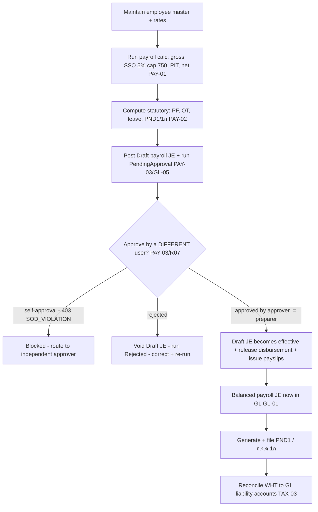

# Payroll — Process Narrative

## 1. Document control

| Field | Value |
|---|---|
| Process ID | PN-05-PAY |
| Process owner | `<
>` |
| Approver | `<<CFO>>` |
| Version | **0.1 DRAFT** |
| Effective date | `<<effective-date>>` |
| Review cadence | Each payroll run + annual |
| Related RCM controls | PAY-01, PAY-02, PAY-03, GL-01; SoD R07 |
| Related policy | `compliance/policies/03-delegation-of-authority.md`, `compliance/policies/11-financial-close-policy.md` |

## 2. Purpose

To control the payroll cycle so that gross-to-net pay, statutory social security, withholding/personal income tax (PIT), and the resulting payroll liabilities are **computed accurately, independently reviewed before disbursement, and posted completely to the general ledger**, in compliance with Thai labour and tax law.

## 3. Scope

**In scope:** gross/net calculation, social security (5%, capped at THB 750), PIT/withholding, payslip generation, ภ.ง.ด.1 (PND1) reporting, and the payroll-to-GL posting. Provident fund / overtime / leave accrual and ภ.ง.ด.1ก are in scope as the maturing statutory set (PAY-02).

**Out of scope:** the GL period close itself (see `04-general-ledger-close.md`), supplier WHT and VAT (see `06-tax-compliance.md`), bank disbursement mechanics (see `07-cash-treasury.md`).

## 4. References

- ISO 9001:2015 cl. 4.4, cl. 7.1.2 (people), cl. 9.1.
- `compliance/Oshinei_ERP_SOX_RCM_v1.xlsx` — PAY-01, PAY-02, PAY-03.
- Thai statutory: Social Security Act (5%, cap THB 750), Revenue Code PIT/WHT, ภ.ง.ด.1 / 1ก.
- Code: `apps/api/src/modules/payroll/payroll-calc.ts`, `apps/api/src/modules/hcm/`, `apps/api/src/modules/tax-reports/`.

## 5. Definitions & abbreviations

| Term | Meaning |
|---|---|
| SSO | Social Security (employee/employer 5%, capped at THB 750) |
| PIT | Personal Income Tax (progressive) |
| WHT | Withholding Tax |
| PND1 / ภ.ง.ด.1 | Monthly withholding return for employment income |
| ภ.ง.ด.1ก | Annual withholding summary |
| Gross / Net | Pre- / post-deduction pay |
| PF | Provident Fund |

## 6. Roles & responsibilities (RACI)

SoD: the person who **prepares** the payroll run is never the sole person who **approves and disburses** it (independent review, **system-enforced** by **PAY-03**, consistent with **R07** initiate ≠ approve).

| Activity | HR / Payroll Clerk | Payroll Manager (reviewer) | FinancialController | Controller / CFO |
|---|---|---|---|---|
| Maintain employee master / rates | **A/R** | C | I | I |
| Run payroll calc (gross/net, SSO, PIT) | **A/R** | C | I | I |
| Independent review of payroll run | I | **A/R** | C | A |
| Approve run for disbursement | I | C | **A/R** | A |
| Generate payslips | **A/R** | C | I | I |
| Post payroll to GL | I | I | **A/R** | A |
| File PND1 / ภ.ง.ด.1ก | R | C | **A/R** | A |

## 7. Process narrative

1. **Employee master.** HR maintains employee records, salary, allowances, and statutory parameters. Changes are captured in `audit_log` (**ITGC-AC-10**).
2. **Payroll calculation.** The payroll engine computes gross, SSO at 5% capped at THB 750, progressive PIT, and net per payslip; the calculation is unit-tested (no hard-coded ad-hoc rates) (**PAY-01**).
3. **Statutory items.** Provident fund, overtime, leave accrual, and ภ.ง.ด.1ก figures are computed for statutory reporting (**PAY-02**).
4. **Independent review (decision point — system-enforced maker-checker).** Running payroll posts the GL entry as a **Draft** (excluded from balances) and marks the run **PendingApproval**; a **different** user must approve it via `POST /api/payroll/runs/:period/approve` before it becomes effective. The approver can **never** be the preparer — a self-approve is rejected `SOD_VIOLATION` (403) **regardless of permissions held, even for an Admin** — so the person who runs payroll can never post their own pay (ghost employees, inflated rate/hours). This reuses the GL-05 ledger maker-checker and re-checks the period is still open at approval time. A run may instead be **rejected** (`/reject`, voids the Draft JE → status Rejected), after which a corrected run can be made. Material variances vs the prior period are investigated before approval (**PAY-03**, **R07**).
5. **Approval & disbursement.** On approval the Draft JE becomes **Posted** (now in balances) and the run records the approver/timestamp; the run is released for disbursement (bank file / payment) and the payslips are issued to employees.
6. **GL posting (tenant-scoped).** Payroll expense, SSO/PIT liabilities, and net-pay payable post as a **balanced** journal entry to the GL — as a **Draft at run time, effective only on approval** (**PAY-03**, **GL-01**; period controls per `04-general-ledger-close.md`). The run is **idempotent per (tenant, period)**: a PendingApproval or Posted run blocks a re-run (a Rejected one may be re-run). It is **scoped to a single tenant**: a tenant-bound user runs for their own tenant, while an HQ/Admin caller (whose request bypasses RLS) **must** name the tenant via `tenant_id` on `POST /api/payroll/runs` — otherwise the run is rejected `TENANT_REQUIRED`. The employee selection and the JE are filtered to that tenant so payroll can never consolidate employees of multiple tenants into one entry (**ITGC-AC-03**). A large run may be taken **off the request thread**: `POST /api/payroll/runs?async=1` enqueues the run as a background job (`background_jobs`, migration 0179) and returns `202 {job_id}` immediately; an in-process worker claims it (`FOR UPDATE SKIP LOCKED`) and executes the **same** `runPayroll` inside the job's own tenant transaction, so RLS scoping, the maker-checker Draft posting (PAY-03), and `TENANT_REQUIRED` are identical to the synchronous path. The progress is polled at `GET /api/jobs/:id` (RLS-scoped — a tenant sees only its own jobs). Because the run is idempotent per (tenant, period), the queue's at-least-once retry can never double-post. The synchronous call (no `?async`) is unchanged.
7. **Statutory filing & liability reconciliation/remittance.** PND1 / ภ.ง.ด.1ก are generated and filed; withholding is reconciled to the GL liability accounts (links to **TAX-03**). The **payroll-liability schedule** (`GET /api/payroll/liabilities`) ties each statutory account — **SSO 2350**, **WHT/PND1 2360**, **PF 2370** — back to the payrun accrual: it shows **accrued** (GL credits) − **remitted** (GL debits) = **outstanding**, with a `reconciled` flag that compares the GL accrual to the **independent** payrun aggregate (a divergence flags a manual JE that touched a payroll-liability account outside the payroll process). Treasury **remits** the cash owed (`POST /api/payroll/liabilities/remit` → **Dr liability / Cr 1000**), which clears the outstanding and keeps the books reconciled to the filings; a remittance beyond the outstanding is rejected `REMIT_EXCEEDS_OUTSTANDING`, and a non-payroll-liability account `NOT_LIABILITY_ACCOUNT` (**PAY-02**).

## 8. Process flow

**Swimlane description by role:** **HR/Payroll Clerk** maintains the master and runs the calculation — which posts a **Draft** JE the clerk cannot make effective. The **system** computes statutory amounts deterministically, holds the JE out of balances until approval, and blocks any self-approval. **Payroll Manager / FinancialController** independently reviews and approves (or rejects) before disbursement — a different user than the preparer (segregation enforced by the system). **Controller/CFO** owns GL posting and statutory filing.

## 9. Control matrix

| Step | Risk | Control | Type | RCM ID | Evidence / Record |
|---|---|---|---|---|---|
| 2 | Payroll / SSO / PIT mis-computed | Tested payroll engine (SSO 5% cap 750, progressive PIT) | Auto | PAY-01 | Payslip calc tests |
| 3 | Statutory items (PF/OT/leave/1ก) wrong | Statutory computation + reporting | Auto | PAY-02 | Sample run vs filing |
| 7 | Statutory liability (SSO/WHT/PF) un-remitted or diverges from the books | Payroll-liability schedule: accrued − remitted = outstanding per account, tied to the independent payrun accrual (`reconciled` flag); cash remittance clears it (Dr liability/Cr 1000); over-remit blocked | **Det / Auto** | **PAY-02**, GL-01 | Liability schedule + remittance JEs tied to filings |
| 4 | Run posted to GL without independent review (preparer self-posts payroll — ghost employees, inflated rate/hours) | **System-enforced maker-checker**: run posts a Draft JE (excluded from balances); a different user must approve before it is effective; self-approve → `SOD_VIOLATION` (binds even Admin) | **Prev / Auto** | **PAY-03**, R07 | Approval record + SoD test |
| 6 | Payroll unposted / unbalanced to GL | Balanced payroll JE (Draft → effective on approval) | Prev / Auto | GL-01, PAY-03 | Payroll→GL tie-out |
| 7 | WHT not reported / not reconciled | PND1 filing + WHT-to-GL reconciliation | Det / Hybrid | TAX-03 | Filed returns; recon |
| 1 | Employee PII (citizen ID, SSO no, bank account) leaks via a DB snapshot / RLS bypass | **Field-level encryption at rest** (AES-256-GCM `encryptedText`) on `employees.national_id/sso_no/bank_account` + the per-slip `payslips.national_id` snapshot; PND1A aggregates decrypted values in app code (ciphertext is not groupable); legacy rows re-encrypted by `db:backfill:pii` | Prev / Auto | **ITGC-AC-19** | `hcm` harness at-rest ToE; `pii-encrypt` unit test |

## 10. Inputs & outputs

**Inputs:** employee master, salary/allowance data, attendance/overtime, statutory rates.
**Outputs:** payroll run, payslips, payroll JE, PND1 / ภ.ง.ด.1ก returns, disbursement file.

## 11. Records & retention

| Record | Store | Retention |
|---|---|---|
| Payroll runs / payslips | Application DB (RLS-scoped; citizen ID / SSO no / bank account **encrypted at rest**, ITGC-AC-19) | `<<per Thai labour law>>` |
| Payroll review / approval | `audit_log` / approval record | `<<7 years>>` |
| Payroll journal entries | Ledger | `<<7 years>>` |
| Statutory returns (PND1/1ก) | Tax-reports / filings | `<<per Revenue Code>>` |

## 12. KPIs / metrics

- Payroll runs with documented independent review (target 100%).
- Net-pay variance vs prior period (investigated > `<<threshold>>`).
- On-time PND1 / ภ.ง.ด.1ก filing rate.
- WHT-to-GL reconciliation differences (target: 0).

## 13. Exception & error handling

| Exception | Trigger | Handling |
|---|---|---|
| Calculation variance | Run differs materially from prior | Reviewer investigates before approval |
| Missing review | Run not independently approved | Disbursement held |
| Filing discrepancy | PND1 ≠ GL liability | Reconcile and adjust before filing |
| `TENANT_REQUIRED` (400) | HQ/Admin runs payroll without a `tenant_id` | Specify the tenant; the run is scoped to one tenant (ITGC-AC-03) |
| `BAD_PERIOD` (400) | `period` not `YYYY-MM` | Supply a valid period |

## 14. Revision history

| Version | Date | Author | Summary |
|---|---|---|---|
| 0.1 DRAFT | 2026-06-22 | `<<author>>` | Initial draft. |
| 0.2 | 2026-06-23 | Platform | Security review W1: payroll run is now tenant-scoped — HQ/Admin must pass `tenant_id` (`TENANT_REQUIRED`), employee selection + JE filtered to that tenant (ITGC-AC-03). Verified by the `payroll` harness cross-tenant case. |
| 0.3 | 2026-06-26 | Platform | **PAY-03 — payroll run maker-checker (SoD), system-enforced.** A run now posts its GL entry as a **Draft** (excluded from balances) with status `PendingApproval`; a **different** user must approve (`POST /api/payroll/runs/:period/approve`) before it is effective — self-approve → `SOD_VIOLATION` (binds even Admin), reusing the GL-05 ledger approval; `/reject` voids the Draft. Idempotency moved to the run record (PendingApproval/Posted block a re-run; Rejected may re-run). Migration `0133` adds `approved_by`/`approved_at`. New RCM control **PAY-03** (RCM now 80); step 4 upgraded from manual/detective to preventive/automated. ToE: `payroll` (PendingApproval → Draft-excluded → self-approve 403 → approve → Posted → reject/re-run), `hcm`, and `compliance` (PAY-03) harnesses. Manual `08-payroll.md` + UAT `07-payroll-uat.md` updated. |
| 0.4 | 2026-06-26 | Platform | **PAY-02 — payroll-liability reconciliation & remittance (Partial → Implemented).** Step 7: a new **liability schedule** (`GET /api/payroll/liabilities`) ties each statutory account (SSO 2350, WHT/PND1 2360, PF 2370) back to the payrun accrual — accrued (GL credits) − remitted (GL debits) = outstanding, with a `reconciled` flag vs the independent payrun aggregate — and a **remittance** action (`POST .../remit` → Dr liability / Cr 1000) clears the cash owed (over-remit → `REMIT_EXCEEDS_OUTSTANDING`; non-liability account → `NOT_LIABILITY_ACCOUNT`). The `/payroll` screen gains a **หนี้สินค้างนำส่ง** tab (schedule + reconciled badge + นำส่ง). PAY-02 moves from *Partial* to *Implemented* in the RCM; no migration. ToE: `payroll` harness (2350 outstanding 2700 reconciled to the accrual; remit 1000 → outstanding 1700, TB balanced; over-remit + non-liability guards). |
| 0.5 | 2026-06-29 | Platform | **Async payroll run (availability/performance).** Step 6: `POST /api/payroll/runs?async=1` enqueues the run on the new async job queue (`background_jobs`, migration 0179) and returns `202 {job_id}`; an in-process worker runs the **same** idempotent `runPayroll` in the job's own tenant transaction, polled at `GET /api/jobs/:id` (RLS-scoped). Keeps a large run off the request thread. **No control change** — RLS, PAY-03 maker-checker (still posts a Draft for independent approval), `TENANT_REQUIRED`, and per-(tenant,period) idempotency are identical to the synchronous path, which is unchanged. ToE: `async-jobs` harness (enqueue→queued→worker drain→done; off-thread; idempotent re-run; tenant RLS isolation). |
| 0.6 | 2026-07-02 | Platform | **ITGC-AC-19 — employee PII encrypted at rest (docs/27 R0-1).** `employees.national_id`/`sso_no`/`bank_account` and the per-slip `payslips.national_id` snapshot switch to the AES-256-GCM `encryptedText` column type (legacy-plaintext passthrough; idempotent `db:backfill:pii` re-encrypts existing rows). ภ.ง.ด.1ก aggregation rewritten to group **decrypted** values in app code keyed on `employee_id` (random-IV ciphertext is not groupable in SQL) — same output shape/totals. No API or GL change; step 1 gains a preventive PII control row. ToE: `hcm` harness (ciphertext at rest for employees + payslips; PND1A line still carries the decrypted citizen ID; totals unchanged). Manual `08-payroll.md` + UAT `07-payroll-uat.md` updated. |
