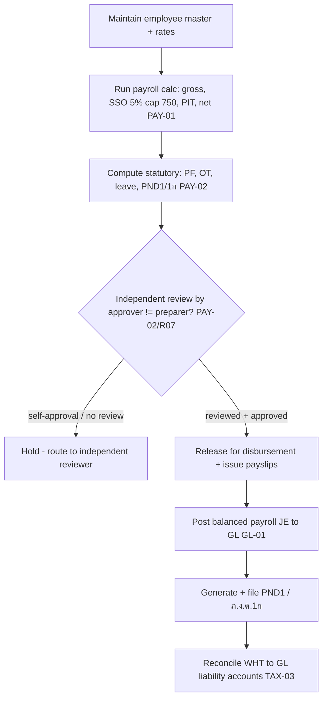

# Payroll — Process Narrative

## 1. Document control

| Field | Value |
|---|---|
| Process ID | PN-05-PAY |
| Process owner | `<
>` |
| Approver | `<<CFO>>` |
| Version | **0.1 DRAFT** |
| Effective date | `<<effective-date>>` |
| Review cadence | Each payroll run + annual |
| Related RCM controls | PAY-01, PAY-02, GL-01; SoD R07 |
| Related policy | `compliance/policies/03-delegation-of-authority.md`, `compliance/policies/11-financial-close-policy.md` |

## 2. Purpose

To control the payroll cycle so that gross-to-net pay, statutory social security, withholding/personal income tax (PIT), and the resulting payroll liabilities are **computed accurately, independently reviewed before disbursement, and posted completely to the general ledger**, in compliance with Thai labour and tax law.

## 3. Scope

**In scope:** gross/net calculation, social security (5%, capped at THB 750), PIT/withholding, payslip generation, ภ.ง.ด.1 (PND1) reporting, and the payroll-to-GL posting. Provident fund / overtime / leave accrual and ภ.ง.ด.1ก are in scope as the maturing statutory set (PAY-02).

**Out of scope:** the GL period close itself (see `04-general-ledger-close.md`), supplier WHT and VAT (see `06-tax-compliance.md`), bank disbursement mechanics (see `07-cash-treasury.md`).

## 4. References

- ISO 9001:2015 cl. 4.4, cl. 7.1.2 (people), cl. 9.1.
- `compliance/Oshinei_ERP_SOX_RCM_v1.xlsx` — PAY-01, PAY-02.
- Thai statutory: Social Security Act (5%, cap THB 750), Revenue Code PIT/WHT, ภ.ง.ด.1 / 1ก.
- Code: `apps/api/src/modules/payroll/payroll-calc.ts`, `apps/api/src/modules/hcm/`, `apps/api/src/modules/tax-reports/`.

## 5. Definitions & abbreviations

| Term | Meaning |
|---|---|
| SSO | Social Security (employee/employer 5%, capped at THB 750) |
| PIT | Personal Income Tax (progressive) |
| WHT | Withholding Tax |
| PND1 / ภ.ง.ด.1 | Monthly withholding return for employment income |
| ภ.ง.ด.1ก | Annual withholding summary |
| Gross / Net | Pre- / post-deduction pay |
| PF | Provident Fund |

## 6. Roles & responsibilities (RACI)

SoD: the person who **prepares** the payroll run is never the sole person who **approves and disburses** it (independent review, **PAY-02**, consistent with **R07** initiate ≠ approve).

| Activity | HR / Payroll Clerk | Payroll Manager (reviewer) | FinancialController | Controller / CFO |
|---|---|---|---|---|
| Maintain employee master / rates | **A/R** | C | I | I |
| Run payroll calc (gross/net, SSO, PIT) | **A/R** | C | I | I |
| Independent review of payroll run | I | **A/R** | C | A |
| Approve run for disbursement | I | C | **A/R** | A |
| Generate payslips | **A/R** | C | I | I |
| Post payroll to GL | I | I | **A/R** | A |
| File PND1 / ภ.ง.ด.1ก | R | C | **A/R** | A |

## 7. Process narrative

1. **Employee master.** HR maintains employee records, salary, allowances, and statutory parameters. Changes are captured in `audit_log` (**ITGC-AC-10**).
2. **Payroll calculation.** The payroll engine computes gross, SSO at 5% capped at THB 750, progressive PIT, and net per payslip; the calculation is unit-tested (no hard-coded ad-hoc rates) (**PAY-01**).
3. **Statutory items.** Provident fund, overtime, leave accrual, and ภ.ง.ด.1ก figures are computed for statutory reporting (**PAY-02**).
4. **Independent review (decision point).** Payroll Manager / FinancialController performs an independent review of the run before disbursement — the preparer does not self-approve (**PAY-02**, **R07**). Material variances vs the prior period are investigated.
5. **Approval & disbursement.** On approval the run is released for disbursement (bank file / payment); the payslips are issued to employees.
6. **GL posting (tenant-scoped).** Payroll expense, SSO/PIT liabilities, and net-pay payable post as a **balanced** journal entry to the GL (**GL-01**; period controls per `04-general-ledger-close.md`). The run is **scoped to a single tenant**: a tenant-bound user runs for their own tenant, while an HQ/Admin caller (whose request bypasses RLS) **must** name the tenant via `tenant_id` on `POST /api/payroll/runs` — otherwise the run is rejected `TENANT_REQUIRED`. The employee selection and the JE are filtered to that tenant so payroll can never consolidate employees of multiple tenants into one entry (**ITGC-AC-03**).
7. **Statutory filing & reconciliation.** PND1 / ภ.ง.ด.1ก are generated and filed; withholding is reconciled to the GL liability accounts (links to **TAX-03**).

## 8. Process flow

**Swimlane description by role:** **HR/Payroll Clerk** maintains the master and runs the calculation. The **system** computes statutory amounts deterministically and posts a balanced JE. **Payroll Manager / FinancialController** independently reviews and approves before disbursement (segregation from preparation). **Controller/CFO** owns GL posting and statutory filing.

## 9. Control matrix

| Step | Risk | Control | Type | RCM ID | Evidence / Record |
|---|---|---|---|---|---|
| 2 | Payroll / SSO / PIT mis-computed | Tested payroll engine (SSO 5% cap 750, progressive PIT) | Auto | PAY-01 | Payslip calc tests |
| 3 | Statutory items (PF/OT/leave/1ก) wrong | Statutory computation + reporting | Auto | PAY-02 | Sample run vs filing |
| 4 | Run disbursed without review (fraud/error) | Independent review before disbursement | Det / Manual | PAY-02, R07 | Sign-off record |
| 6 | Payroll unposted / unbalanced to GL | Balanced payroll JE | Prev / Auto | GL-01 | Payroll→GL tie-out |
| 7 | WHT not reported / not reconciled | PND1 filing + WHT-to-GL reconciliation | Det / Hybrid | TAX-03 | Filed returns; recon |

## 10. Inputs & outputs

**Inputs:** employee master, salary/allowance data, attendance/overtime, statutory rates.
**Outputs:** payroll run, payslips, payroll JE, PND1 / ภ.ง.ด.1ก returns, disbursement file.

## 11. Records & retention

| Record | Store | Retention |
|---|---|---|
| Payroll runs / payslips | Application DB (RLS-scoped) | `<<per Thai labour law>>` |
| Payroll review / approval | `audit_log` / approval record | `<<7 years>>` |
| Payroll journal entries | Ledger | `<<7 years>>` |
| Statutory returns (PND1/1ก) | Tax-reports / filings | `<<per Revenue Code>>` |

## 12. KPIs / metrics

- Payroll runs with documented independent review (target 100%).
- Net-pay variance vs prior period (investigated > `<<threshold>>`).
- On-time PND1 / ภ.ง.ด.1ก filing rate.
- WHT-to-GL reconciliation differences (target: 0).

## 13. Exception & error handling

| Exception | Trigger | Handling |
|---|---|---|
| Calculation variance | Run differs materially from prior | Reviewer investigates before approval |
| Missing review | Run not independently approved | Disbursement held |
| Filing discrepancy | PND1 ≠ GL liability | Reconcile and adjust before filing |
| `TENANT_REQUIRED` (400) | HQ/Admin runs payroll without a `tenant_id` | Specify the tenant; the run is scoped to one tenant (ITGC-AC-03) |
| `BAD_PERIOD` (400) | `period` not `YYYY-MM` | Supply a valid period |

## 14. Revision history

| Version | Date | Author | Summary |
|---|---|---|---|
| 0.1 DRAFT | 2026-06-22 | `<<author>>` | Initial draft. |
| 0.2 | 2026-06-23 | Platform | Security review W1: payroll run is now tenant-scoped — HQ/Admin must pass `tenant_id` (`TENANT_REQUIRED`), employee selection + JE filtered to that tenant (ITGC-AC-03). Verified by the `payroll` harness cross-tenant case. |
