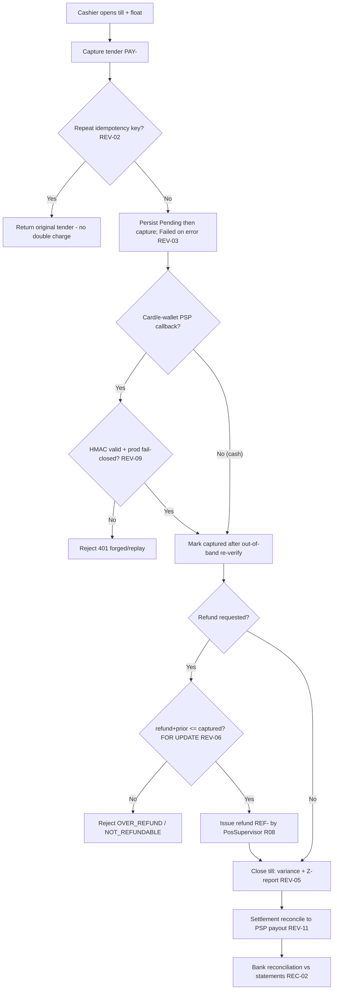

# Cash & Treasury (POS Till · Payments · Bank Reconciliation) — Process Narrative

## 1. Document control

| Field | Value |
|---|---|
| Process ID | PN-07-CASH |
| Process owner | `<<Controller / Store Operations>>` |
| Approver | `<<CFO>>` |
| Version | **0.1 DRAFT** |
| Effective date | `<<effective-date>>` |
| Review cadence | Per shift (till) + monthly (bank rec) + annual |
| Version note | Rev **2.3** (2026-07-18) — **Unconfirmed-tender worklist (#3, operational — no new control).** §7(12): `GET /api/payments/pending-settlement` lists every tender still **Pending/Authorized** (PromptPay/QR, card auth, transfer) oldest-first with `age_minutes` + a running `total_unconfirmed` (optional `older_than_min`) — the live chase-list so an unconfirmed taking never sits in limbo (settle or void to clear it). Complements the POS-08 day-end auto-reconciliation; the inbound PromptPay webhook already settles a counter (table-less) tender. Read-only, tenant-scoped. ToE: `promptpay` harness (worklist lists the Pending tender; stale filter; settle clears it). Prior: Rev **2.2** (2026-07-18) — **Cash tendering / change-due (#1, POS universal-cashier need; migration `0438`, no new control).** §7(2): a cash tender may carry `cash_tendered` (the cash handed over) → the register computes + records `change_due` and rejects a short tender (`INSUFFICIENT_TENDER`); `payments.cash_tendered`/`change_given` persist the count for the drawer reconciliation + change disputes. No GL effect (net drawer cash = amount). Threaded through `POST /api/payments` and the dine-in `checkout`. ToE: `payments-gateway` harness (change computed, short → 400, exact → 0). Prior: Rev **2.1** (2026-07-16) — **PSP terminal depth** (docs/50 Wave 5 C5 re-scoped, migration 0425; extends REV-09/REV-11): webhook **event-id idempotency** (`psp_webhook_events` — a redelivered event acks `duplicate_event`, never flaps the intent), **acquirer-report per-intent settlement matching** (`settlements/:batchNo/import` → matched / amount_mismatch / missing_intent / unreported_intent in `settlement_lines`; auto-`Reconciled` only at zero discrepancies), **tip-on-terminal** (charge-time tip + bar-tab capture-above-auth by the gratuity, `payment_intents.tip_amount`), and the signed-webhook path harness-exercised end-to-end. Prior: rev **2.0** (2026-07-16) — **Blind drawer close** (POS roadmap P1c, docs/50 Wave 1, migration 0426): per-tenant policy `till_settings.blind_close` (`GET/PUT /api/payments/till/settings`; changing it is gated to manager duties `ar`/`exec`) makes the cashier count the drawer **without seeing the system-expected cash** — on an OPEN session the X/Z reports redact `expected_cash` and every figure it can be derived from (cash sales/refunds, paid-in/out/drops, the Cash tender amount) for till-duty callers, while a manager (`ar`/`exec`) still sees the full picture; expected + variance are revealed only **after** the count is submitted at close, and the session is stamped `blind_close` as audit evidence (strengthens REV-13/REV-05). New `/pos/till` close dialog + policy toggle. Prior: rev **1.9** (2026-07-10) — Dynamic / early-payment discounting reduces the disbursed cash on an AP payment run (FIN-9, EXP-14; PN-02 §7(8c)): a bill paid early under an approved `ap_discount_terms` policy leaves the treasury only the **discounted net** (`amount − WHT − discount`), with the discount booked as income (Cr **4600 Early-Payment Discount Income**) via a balanced idempotent Dr 1000 / Cr 4600 adjustment; the bank file / statement clearing tie out to that reduced net. Prior: rev **1.8** (2026-07-10) — PromptPay store-level auto-reconciliation (POS-08): the store's PromptPay QR tenders are tied out to the settlement account's bank-statement inflows per day via the **shared** bank auto-match engine, unmatched tenders surface as a till/cash exception a manager clears (migration 0301). Prior: rev **1.7** (2026-07-10) — bank auto-match clears AP payment-run lines (EXP-13 hook; PN-02 §7(8b)). Prior: rev **1.6** (2026-07-09) — bank-statement FILE import (CSV/XLSX, Thai/English headers, BE→CE dates, fail-closed parsing) feeding the same import/match/certify spine; `/bank` upload button. Prior: rev 1.5 (2026-07-06) — detective exception report for POS voids/refunds (G14) + bank-statement-import documentation (G10). |
| Related RCM controls | REV-02, REV-03, REV-05, REV-06, REV-09, REV-11, REV-13, REV-16, REC-02, REC-05, BANK-02, POS-08, TR-01, EXP-07, EXP-08; SoD R08, R07 |
| Related policy | `compliance/policies/11-financial-close-policy.md`, `compliance/policies/03-delegation-of-authority.md` |

## 2. Purpose

To control cash and electronic settlement — POS till open/close, payment capture and refunds, PSP webhooks/settlement, and bank reconciliation — so that **all cash collected is recorded, drawer variances are detected, refunds cannot exceed captures, electronic callbacks are authentic, and bank balances are reconciled to the GL**.

## 3. Scope

**In scope:** till open / close with Z-report variance, payment tender capture (PAY-), refunds (REF-) with over-refund guard, payment idempotency, PSP webhook verification (HMAC), settlement batching/reconciliation, and bank reconciliation against statements.

**Out of scope:** revenue recognition and AR (see `01-order-to-cash.md`), supplier disbursement approval (see `02-procure-to-pay.md`), GL period close (see `04-general-ledger-close.md`).

## 4. References

- ISO 9001:2015 cl. 4.4, cl. 8.5.1, cl. 9.1.
- `compliance/Oshinei_ERP_SOX_RCM_v1.xlsx` — REV-02/03/05/06/09/11, REC-02.
- `compliance/policies/03-delegation-of-authority.md` (refund/void authority).
- Code: `apps/api/src/modules/payments/payments.service.ts`, `apps/api/src/modules/pos/terminal/`, `apps/api/src/modules/bank/`, `apps/api/src/common/crypto.ts`.

## 5. Definitions & abbreviations

| Term | Meaning |
|---|---|
| Till / drawer | Cash session with opening float |
| X-report / Z-report | Mid-shift / end-of-shift till summary |
| Variance | Counted cash − expected cash at close |
| Idempotency key | De-duplication token for tender |
| PSP webhook | Gateway callback (HMAC-SHA256 signed) |
| Settlement | Batch of payment intents reconciled to PSP payout |
| RCP- / PAY- / REF- | Receipt / payment / refund document prefixes |

## 6. Roles & responsibilities (RACI)

SoD rule **R08**: the **Cashier** who records sales/tender is never the role that **issues refunds or reconciles the till** (PosSupervisor) — `pos_sell`, `pos_refund`, and `pos_till` are split single-duty permissions.

| Activity | Cashier | PosSupervisor | ArClerk | FinancialController | Controller |
|---|---|---|---|---|---|
| Open till (opening float) | **A/R** | C | I | I | I |
| Capture payment / tender (`pos_sell`) | **A/R** | I | I | I | I |
| Issue refund (`pos_refund`) | I | **A/R** | I | I | C |
| Close till + Z-report (`pos_till`) | I | **A/R** | I | C | A |
| Review till variance | I | C | I | **A/R** | A |
| PSP settlement reconciliation | I | I | C | **A/R** | A |
| Bank reconciliation | I | I | C | **A/R** | A |

## 7. Process narrative

1. **Till open.** Cashier opens a till session recording the opening float (`POST /api/payments/till/open`).
2. **Payment capture.** Tender is recorded (PAY-). The payment row is persisted **Pending before** the gateway capture and flipped **Failed** on error — captured funds are never unrecorded (**REV-03**). For card/e-wallet tenders the gateway performs a **real PSP charge** (Opn/Omise, Stripe) using the terminal-supplied token (satang minor-units, secret-key auth); a tender with **no token or a declined charge is never reported Captured**, so funds that did not move are never booked. A **decline is recorded as a durable `Failed` tender** (committed with the decline reason, returned to the caller — not a rolled-back error), so every card attempt leaves an audit trail. A repeated `idempotency_key` returns the original tender (unique-index backstop), so exactly one PSP charge occurs on retry (**REV-02**). **Cash tendering / change-due (#1).** For a **cash** tender the cashier may pass the cash the customer physically handed over (`cash_tendered`); the register then computes and records the **change to give back** (`change_due = cash_tendered − amount_due`) and rejects a short tender (`400 INSUFFICIENT_TENDER`). The tendered amount and change are persisted on the tender row (`payments.cash_tendered`/`change_given`) — an **audit trail** for the drawer count and change disputes. Net drawer cash is unchanged (cash in − change out = the tender amount), so this is **not a GL event** (strengthens the till reconciliation, REV-05). The dine-in `checkout` threads the same field so a table cash checkout also returns the change.
3. **PSP webhook (decision point).** For card/e-wallet, the gateway callback is verified by HMAC-SHA256 over the raw body, **fail-closed in production**; a forged/replayed signature → `401`; status is re-verified out-of-band before a payment is treated as captured (**REV-09**). **PSP event-id idempotency (C5, docs/50 Wave 5, migration `0425`):** the terminal webhook (`POST /api/payments/psp/webhook`) additionally dedupes on the acquirer's **`event_id`** — the `(provider, event_id)` unique key in `psp_webhook_events` admits an event exactly once, so a **redelivered** event (same id, possibly carrying a stale/older status) acks as `duplicate_event` and can never re-process or flap the intent (an event without an id keeps the legacy status-diff path). The signed-webhook path (valid / tampered / stale-replay) and the dedup are exercised end-to-end by the `pos-p0` harness against a configured per-provider secret — no longer only via the dev/test bypass.
4. **Refund (decision point).** PosSupervisor issues a refund (REF-) only when refund + all prior refunds ≤ captured, evaluated under a payment-row lock (`FOR UPDATE`); an over-refund → `OVER_REFUND`; a refund of a non-captured payment → `NOT_REFUNDABLE` (**REV-06**). Refund authority is separated from selling (**R08**). **Large-refund maker-checker (REV-16):** a **standalone** refund (`POST /api/payments/refunds`) at/above the materiality threshold (THB 1,000) is parked as a **request** (`refund_requests`) and **moves no money** — no `payment_refunds` row, the payment isn't flipped — until a **different** user approves it (`POST /api/payments/refund-requests/:id/approve`); self-approval → `SOD_VIOLATION`, reject voids it. Sub-threshold refunds run immediately, and a refund that is part of a **goods-return** is never gated (the return is the authorizing document, **REV-07**). The pending request auto-surfaces in the **GOV-01** pending-approvals monitor with an inline approve/reject on `/approvals`. This stops one person issuing a large refund to themselves/an accomplice (refund fraud). **Void / sub-threshold-refund detective review (G14).** A payment **void** and a **sub-threshold** refund remain **single-user by design** to keep the till fast — mitigated by the `pos_sell` / `pos_refund` / `pos_till` permission split (**R08**), the independent till-variance approval (step 5), and the REV-16 gate on *large* refunds. As the recommended **detective** control for periodic independent review, `GET /api/payments/exceptions/voids-refunds` (`exec`/`ar`/`fin_report`; optional `from`/`to` on `YYYY-MM-DD`) lists **every voided payment and every refund** in the window (payment/refund number, amount, by whom, when) with per-type counts and totals, tenant-scoped — so a reviewer independent of the till can inspect void/refund activity after the fact. It is read-only and posts nothing (no preventive gate is added; voids/small refunds keep their by-design single-user path).
5. **Till close (decision point).** At shift end PosSupervisor closes the till (`POST /api/payments/till/close`): expected cash = opening float + Σ cash captured; variance = counted − expected; the Z-report records the variance and denominations (**REV-05**). The over/short is now **posted to GL** so book-cash tracks the physical count — short → **Dr 5830 Cash Over/Short (default — a GL-24-approved `TILL.VARIANCE` override re-routes this leg on BOTH the native close and the hub replay; the cash leg is pinned) / Cr 1000 Cash**, over → **Dr 1000 / Cr 5830** (idempotent per till, `source=TILL_CLOSE`). A variance **at/above the materiality threshold (THB 100)** posts the over/short as a **Draft** JE and parks the session **PendingApproval**: a **different** user (manager) must approve it (`POST /api/payments/till/variance/:sessionNo/approve`) before it is effective — self-approval → `SOD_VIOLATION` (binds even Admin); reject voids the draft. Sub-threshold variances post immediately. The till still **closes** either way (the cash has physically left the drawer); only the GL clearing of a **material** discrepancy is gated (**REV-13**). FinancialController reviews and the supervisor signs the Z-report. **Blind drawer close (P1c, docs/50 Wave 1).** A cashier who can see the expected figure can count "to the number" and mask a short drawer. With the per-tenant policy `till_settings.blind_close` ON (`PUT /api/payments/till/settings`, manager-only `ar`/`exec` — a till-duty caller gets 403), the X/Z reports on an **OPEN** session redact `expected_cash` and every figure it derives from (cash sales/refunds, paid-in/out/drops, the Cash tender amount — counts stay visible so the tape remains useful) for till-duty callers; the `/pos/till` close dialog therefore shows no expected figure and the cashier submits the physical count first. `POST /api/payments/till/close` then reveals expected/variance (the count is already on record) and stamps `blind_close = true` on the session as evidence the close was performed blind. Manager-duty callers are never redacted (they supervise the count), and a closed session's Z always shows the full reconciliation. Enforcement is server-side (the client never receives the redacted figures), so a modified client cannot peek.
6. **Settlement reconciliation.** Card/e-wallet payment intents are batched into a settlement and reconciled to the PSP payout statement (**REV-11**). **Acquirer-report per-intent matching (C5, docs/50 Wave 5, migration `0425` — REV-11 deepened from a status flip to a real match):** `POST /api/payments/terminal/settlements/:batchNo/import` (`creditors`/`exec`) takes the acquirer's settlement report (rows keyed on the PSP charge ref) and matches every row against the batch's intents — `matched` (amount agrees within 1 satang), `amount_mismatch`, `missing_intent` (the acquirer settled money we hold no intent for), and `unreported_intent` (a batched intent the report omits) — persisting the line-level result (`settlement_lines`, re-import replaces) and stamping the batch with `reconciled_amount` + `discrepancy_count`. **Zero discrepancies ⇒ the batch flips `Reconciled`**; any discrepancy leaves it `Settled` with the exceptions worklist (`GET …/settlements/:batchNo/lines`) for investigation — so a short-settled or ghost payout is detected, not assumed away. The manual `…/reconcile` flip remains as the explicit override. **Tip-on-terminal** rides the same intents: a charge may carry a `tip` (total = amount + tip) and a bar-tab **pre-auth may capture above the auth by the gratuity** (the `OVER_CAPTURE` guard applies to the base; `payment_intents.tip_amount` keeps the split for settlement/reporting).
7. **Bank reconciliation.** Bank balances are reconciled against statements monthly and reviewed; differences are cleared (**REC-02**; feeds the GL close, `04-general-ledger-close.md`). Auto-match and the reconciliation report scope the GL cash movements to **the bank account's own tenant** — the cash GL (e.g. 1010) is shared across tenants, so without this an HQ/Admin caller (whose request bypasses RLS) would pull another tenant's movements into the balance/match set (**REC-02**, **ITGC-AC-03**). A fee/interest **adjustment** found on a statement line is **maker-checked**: it is a REQUEST that posts a **Draft** JE with no GL/balance effect (the line stays unreconciled) until a **different** user with approval authority approves it (`POST /api/bank/lines/:id/adjustment/approve`); self-approval is rejected `403 SOD_VIOLATION` (binds even Admin), and the reconciliation difference only closes once approved — so a single person can no longer post a bank fee straight to the cash account (a cash outflow mis-booked as interest income, or a fictitious fee). The Draft adjustment is also surfaced, aged, by the pending-approvals monitor (**BANK-02**, **GOV-01**). **Statement import is single-user by design (G10).** Loading a bank statement (`importStatement`) is a single-user act, and no new preventive gate is added: the imported lines only become consequential **through matching**, and the downstream **reconciliation is separately certified** (a distinct certifier signs off, **REC-02/03**, see step 8 below) with bank **adjustments** dual-controlled (**BANK-02**). The imported-statement lines are therefore folded into the **reconciliation certifier's evidence review** — the certifier reviews the matched and unmatched statement lines before signing off, so an erroneous or unauthorised import is **caught at certification**. This makes the compensating detective control explicit rather than adding a second person to the import step. **File-based
import (2026-07-09):** treasury can also upload the bank's own **CSV/XLSX export** — `POST
/api/bank/accounts/:id/statements/import-file` (`bank/statement-file.ts`) locates the columns by fuzzy
Thai/English header match (วันที่/Date, รายการ/Description, ถอน/Withdrawal, ฝาก/Deposit, จำนวนเงิน/Amount,
คงเหลือ/Balance — covers the KBank/SCB/BBL internet-banking exports without hardcoding any bank), converts
**Buddhist-Era dates** (พ.ศ. and 2-digit BE short years) to CE, reads parentheses as negatives, derives
opening/closing from the running-balance column, **skips-and-counts** non-transaction summary rows (never a
silent partial import — a file with no recognizable date/amount column fails closed `400 NO_DATE_COLUMN` /
`NO_AMOUNT_COLUMN`), and feeds the **same** `importStatement` pipeline (same single-user-import + certification
compensating control as above; an optional `auto_match: true` runs the matcher immediately). The `/bank`
reconciliation screen gains the upload button. No new numbered control (same REC-02/BANK-02 spine).

8. **Cash banking — safe-drop → bank deposit → reconciliation (decision point — REC-05).** Through the shift a cashier moves cash out of the drawer to the safe with a **drop** (`cash-movement` type `drop` — drawer-only, no GL). Treasury later **banks** the safe cash: `GET /api/bank/deposits/undeposited-drops` shows the **cash still in the safe** (drops with `deposit_id` NULL — the unbanked exposure to chase), and `POST /api/bank/deposits` **batches** those drops into a deposit, posting **Dr <bank account GL, e.g. 1010> / Cr 1000 Cash** and stamping each banked drop with the deposit id (so it leaves the exposure list). The deposit is then **reconciled** to the bank statement (`POST /api/bank/deposits/:id/reconcile`, status Deposited→Reconciled). **SoD:** banking is a **treasury** duty (`exec`/`ar`) — **segregated from the cashier** (`pos_till`) who drops the cash; a cashier cannot create a deposit (403). So cash physically removed from the drawer is tracked all the way to the bank, the on-hand→bank move hits the GL, and undeposited cash in the safe is a visible control exposure (**REC-05**). **Bank-account creation maker-checker (G9).** Creating a **new bank account** (which defines the account number + GL mapping + opening balance) is now a two-person control: the account is created `status='PendingApproval'` and **inactive**, and it **cannot bank cash** — `createDeposit` rejects a deposit into a non-approved account with `400 BANK_NOT_APPROVED` — until a **different** approver activates it via `POST /api/bank/accounts/:id/approve` (`@Permissions('approvals','exec')`); self-approval → `403 SOD_VIOLATION`. `POST /api/bank/accounts/:id/reject` discards a pending account, and the pending queue is `GET /api/bank/accounts/pending`. Migration **0264** adds `status`/`requested_by`/`approved_by`/`approved_at` to `bank_accounts` (existing rows backfill to `Approved`). This closes the single-user bank-account-creation gap — a rogue account number, GL mapping or opening balance can no longer be stood up and used to bank cash without an independent approval (strengthens **REC-05** / the cash-&-banking controls; no new numbered control).

9. **Petty cash / employee cash advances (decision point).** A cash float is issued to an employee via `POST /api/finance/advances` (doc prefix **ADV-**): cash out **Dr 1180 Employee Advances / Cr 1000**. The **1180 balance is the outstanding float** (`GET /api/finance/advances` reports it). On return the advance is **settled** (`POST /api/finance/advances/:advanceNo/settle`) against actual spend + returned cash — **Dr expense + Dr 1000 (returned) / Cr 1180** — which **must reconcile** to the advance (`settled_expense + returned_cash` = advance, else `SETTLE_MISMATCH`); a re-settle → `ALREADY_SETTLED`. So every advance is either outstanding on 1180 or fully accounted for (**EXP-07**, **GL-01**).
11. **Petty-cash imprest fund + direct-expense / advance maker-checker (decision point — EXP-08).** A **petty-cash fund** holds cash capped at a **credit limit (วงเงิน)** in the **1015 Petty Cash** account (a cash account, so it flows through the SCF + bank/cash reconciliation). The fund is **established** (`POST /api/finance/petty-cash/funds`) with a **zero balance** (status active): if an initial amount is requested it posts **no** cash but raises a maker-checker **funding request** (returns `balance:0`, `funding_req_no`, `pending:true`); it is topped back up by **replenishment** (`…/funds/:fundCode/replenish`), which likewise raises a funding request rather than posting immediately. **Both fund establishment (initial cash) and every replenishment now route through the same EXP-08 maker-checker** — a **different** user must approve via the shared `…/requests/:reqNo/approve` endpoint (requester ≠ approver, else `403 SOD_VIOLATION`), which posts **Dr 1015 Petty Cash / Cr 1000 Cash**, re-checks the float ceiling (`OVER_FLOAT`) and lifts the fund balance; the fund holds **no cash until that independent approval**. Establishing or replenishing above the float is still rejected up-front (`OVER_FLOAT`). This reuses the existing `expense_requests` table with a new `kind='funding'` (plain-text `kind`/`status` columns — **no migration**), closing the gap where a single custodian could establish a fund and repeatedly "replenish" it up to the float, extracting cash from 1000 with no approver. A **direct expense** or an **advance** is drawn against the fund as a maker-checker **request** (`POST /api/finance/petty-cash/requests`, doc prefix **PEX-**, capturing a document reference + receipt key for tracking) that posts **nothing** and a draw beyond the fund's available balance is rejected `INSUFFICIENT_FLOAT`. A **different** user must approve (`…/requests/:reqNo/approve`) before the GL posts — **expense: Dr <expense acct> / Cr 1015; advance: Dr 1180 / Cr 1015** — and the fund balance is decremented; a self-approve is rejected `SOD_VIOLATION` (binds **even Admin**). An **advance** later settles (`…/requests/:reqNo/settle`, **Dr expense + Dr 1015 returned / Cr 1180**, reconcile-or-`SETTLE_MISMATCH`), returning unused cash to the fund. Every request flows PendingApproval → Approved/Rejected → Settled with a StatusLog trail and surfaces in the **GOV-01** pending-approvals monitor — so one person can never both disburse petty cash and authorise it, and the float can never be over-drawn or over-extended (**EXP-08**, **R07**, **GL-01**). **LINE chat channel (LC-2, docs/30 — raise + notify only):** a linked staff member holding `creditors`/`exec` may RAISE a request from the shop's LINE OA chat (`expense <fund> <amount> [เหตุผล]` / `advance …`) — the command re-resolves effective permissions and calls the same `createRequest` path (PEX-, PendingApproval, no GL; `FUND_CLOSED`/`INSUFFICIENT_FLOAT` bind unchanged). Linked `creditors`/`exec` holders (maker excluded) get a LINE push when a request lands, and the requester gets the ✅/❌ decision push — but the **decision itself stays on `/petty-cash`**: chat approval of money requests is deliberately deferred pending a controls review (the maker-checker approval surface is unchanged).
8. **Reconciliation periods & certification (decision point).** The structured reconciliation workflow lives under `/api/recon` (`apps/api/src/modules/reconciliation/`): `GET /api/recon/periods` and `POST /api/recon/periods` list/create reconciliation periods; `GET /api/recon/periods/:id/summary` returns the period state; `POST /api/recon/periods/:id/import-gl` pulls the GL movements to be reconciled; `POST /api/recon/periods/:id/items` adds statement/manual items; `POST /api/recon/periods/:id/auto-match` clears matched pairs; and `POST /api/recon/periods/:id/certify` signs off the period. Certification enforces **maker-checker** — the certifier must differ from the preparer, else the call is rejected `403 SOD_VIOLATION` ("Certifier must be different from preparer (SoD)") — so the person who prepares a reconciliation cannot also certify it (**REC-02/03**; feeds the GL close, `04-general-ledger-close.md`).

10. **Working-capital health score (advisory; reporting only — no GL).** `GET /api/finance/health` returns a single, explainable **financial-health score** (0–100, grade A–E) of how comfortable the merchant's liquidity is, from real sub-ledgers: **cash on hand** (posted balance of the cash/bank GL accounts 1000/1010/1020), **AR vs AP** outstanding, **overdue receivables**, and the **POS sales run-rate** (28-day average). It exposes every driver — **days-cash-on-hand**, **current ratio**, **overdue-AR %** — and weights liquidity 0.6 / receivables 0.4. This is the position **score** a financing partner would underwrite against; the week-by-week cash **projection** lives in the GL module (`GET /api/ledger/cash-flow-forecast`, GL-07) — the two are complementary, not duplicative. Also exposed to the **AI assistant** (`get_financial_health`) so staff can ask "สุขภาพการเงินเป็นยังไง?". Read-only; no postings. Harness `financial-health.ts`; UAT-GL-030.

11. **Treasury / Cash Command (advisory monitoring; TR-01 — no GL).** `GET /api/finance/metrics/cash/position?weeks=13` (perm `exec`/`fin_report`/`ar`) is a single read-only liquidity board that **composes** the forward cash view: the **GL cash/bank position** per account (which ties to the trial balance) plus the **house-bank accounts**; the **13-week direct cash forecast** (open AR inflows − AP outflows by due date, reusing the GL-07 `cash-flow-forecast`) with the projected closing balance and the **liquidity trough** (lowest projected balance + the week it hits); the **liquidity KPI subset** (current/quick/cash ratio, working capital, days-cash — the same canonical definitions as ELC-07); and **FX exposure** by non-THB currency (open AR/AP face amounts + net position). It complements the position **score** (`/api/finance/health`, step 10) and the raw **projection** (`/api/ledger/cash-flow-forecast`, GL-07) by bringing them — plus the bank position and FX — into one treasury review surface (`/finance/treasury`). Read-only; no postings. Harness `finance-kpi.ts`; UAT-UI-TR-01.

12. **PromptPay store-level auto-reconciliation (decision point — POS-08).** A **PromptPay QR** tender is captured at the till as **Pending** (the payer settles out-of-band, see step 3); the funds later land on the store's house-bank statement as an **inflow**. This step confirms that settlement **automatically, per store per day**. The store's **settlement account** is mapped once (`PUT /api/pos/promptpay-recon/settlement-account`, `recon_prep`/`exec`) to the house-bank account its PromptPay collections land in (table `pos_settlement_accounts`). Running the reconciliation (`POST /api/pos/promptpay-recon/run` with `{recon_date}`, `recon_prep`/`pos_close`/`exec`) takes the day's PromptPay tenders (method `PromptPay`/`QR` or gateway `promptpay`) and the imported bank-statement **inflow** lines on that account and matches them through the **SAME bank reconciliation auto-match engine** the GL bank rec uses (`modules/bank/match-engine.ts` — amount within a cent, date within the ±5-day window, payer-ref containment) — **one matcher scoped to the settlement account, not a second one**. A matched inflow line is recorded exactly as the GL auto-match does (`reconciled` + `matched_payment_no`). A tender left **unmatched** is surfaced as a **till/cash exception** (`promptpay_till_exceptions`, status `Open`) — mirroring the **till-variance exception surface (REV-13)** — and stays on the open worklist (`GET /api/pos/promptpay-recon/exceptions?status=Open`) until a **manager** (`pos_close`/`exec`/`approvals`) **clears** it (`.../exceptions/:id/clear` → `Resolved`); a **re-run** that finds a late inflow **auto-resolves** the exception. So a skimmed / failed / short-settled QR taking is detected because the till's PromptPay sales are tied out to the bank statement, not assumed settled. Read-model over the tenders + statement lines — **posts no GL, adds no posting authority** (a `pos_sell`-only cashier is denied). Migration **0301** (`pos_settlement_accounts`, `promptpay_till_exceptions`; RLS 0232). New control **POS-08**; a sell-only cashier is denied. Harness `cash-banking.ts`. **Unconfirmed-tender worklist (#3, operational — no new control).** The day-end auto-reconciliation above ties settled QR takings to the bank statement; the **live chase-list** for tenders not yet confirmed is `GET /api/payments/pending-settlement` — a tenant-scoped read of every tender still **Pending/Authorized** (PromptPay/QR, a card **authorization**, a transfer), oldest-first with its `age_minutes` and a running `total_unconfirmed`, optionally narrowed to the stale ones (`older_than_min`). It is the operational counterpart to the exception surface: a QR sale that **looks** collected but whose settlement webhook never fired stays visible until confirmed (`PATCH /api/payments/:no/settle`) or voided, so takings never sit in limbo. NB the inbound PromptPay **settlement webhook** already settles a **counter** tender (one with no live table session) exactly as it finalises a table one — the worklist covers the case where **no** PSP callback arrives at all (a merchant-PromptPay shop that eyeballs the transfer). Read-only, tenant-scoped, any POS/finance duty may view.

## 8. Process flow

**Swimlane description by role:** **Cashier** opens the till and captures tender (sell only). The **system** enforces idempotency, pre-persist capture, HMAC webhook verification, and the over-refund lock. **PosSupervisor** issues refunds and closes the till (segregated from selling, **R08**). **FinancialController** reviews till variances, settlement reconciliation, and the monthly bank reconciliation.

## 9. Control matrix

| Step | Risk | Control | Type | RCM ID | Evidence / Record |
|---|---|---|---|---|---|
| 2 | Double charge on retry | Payment idempotency key + unique index | Prev / Auto | REV-02 | Idempotency test |
| 2 | Captured funds unrecorded (orphan), or funds booked that did not move | Persist Pending before capture; **real PSP charge** for card/e-wallet — no Captured without an actual charge; a decline lands a **durable Failed tender** (audit trail) | Prev / Auto | REV-03 | Negative-path + `payments-gateway` harness (decline → durable Failed, never Captured) |
| 3 | Forged/replayed PSP callback | HMAC-SHA256 verify, fail-closed in prod | Prev / Auto | REV-09 | Webhook signature tests; 401s |
| 4 | Refund exceeds capture (leakage/fraud) | Over-refund guard under payment-row lock | Prev / Auto | REV-06 | `OVER_REFUND` test |
| 4 | Large refund issued with no independent review (refund fraud) | Maker-checker: a standalone refund ≥ THB 1,000 is a request that **moves no money** until a **different** user approves (self-approve → `SOD_VIOLATION`); goods-return refunds + sub-threshold run immediately; surfaces in GOV-01 | Prev / Auto | REV-16 | `refund_requests` worklist + SoD test |
| 4 | Cashier refunds own sale | SoD: `pos_sell` vs `pos_refund`/`pos_till` | Prev / Manual | R08 | SoD conflict report |
| 4 | Void / sub-threshold refund abused (single-user by design) | **Void/refund exception report (G14)** — `GET /api/payments/exceptions/voids-refunds` lists every void + refund in a window (no./amount/by-whom/when + counts & totals) for independent periodic review; compensating: `pos_sell`/`pos_refund`/`pos_till` split (R08), till-variance approval, REV-16 large-refund gate | Det / Manual | R08, R12 | Void/refund exception report; `refund-approval` harness |
| 5 | Drawer shortage / skimming undetected | Till reconciliation; Z-report variance review | Det / Hybrid | REV-05 | Signed Z-reports |
| 5 | Cash over/short never booked, or cashier clears own material variance | On close the over/short posts to GL (5830↔1000); a material variance posts a **Draft** JE + **PendingApproval** — a **different** user approves (SoD, binds Admin) | Prev+Det / Auto | REV-13 | Cash over/short JEs; till variance approval trail |
| 5 | Cashier counts "to the expected number", masking a short drawer | **Blind drawer close** — per-tenant `till_settings.blind_close` policy (manager-only change) redacts expected cash + its derivable figures from till-duty callers on an OPEN session, server-side; the count is submitted before expected/variance are revealed, and the session is stamped `blind_close` | Prev / Auto | REV-13, REV-05 | `till_settings` policy row; `blind_close` stamp on `till_sessions`; `cashreport` harness |
| 6 | Card settlements not reconciled to payouts — a short-settled, mis-amounted or ghost payout passes unnoticed behind a manual status flip | Settlement batching + **acquirer-report per-intent matching** (C5): every report row matched by PSP ref — matched / amount_mismatch / missing_intent / unreported_intent — with the line-level result persisted (`settlement_lines`) and the batch auto-`Reconciled` ONLY at zero discrepancies; webhook redelivery deduped on the PSP event id | Det / Hybrid | REV-11 | Settlement recon; `settlement_lines` match register + `reconciled_amount`/`discrepancy_count`; `psp_webhook_events` dedup rows; `pos-p0` signed-webhook + import ToE |
| 8 | Till cash dropped to the safe never banked / not matched to statement | Safe-drop → bank deposit (Dr bank / Cr 1000) + reconcile; undeposited-drop "cash-in-safe" exposure; banking (treasury) segregated from the cashier (`pos_till`) | Det / Prev | REC-05 | Bank-deposit register; cash-in-safe exposure |
| 12 | A PromptPay QR taking is captured at the till but never lands in the bank (or lands short/late) and no one notices | **PromptPay store-level auto-reconciliation** — the day's PromptPay tenders are matched to the settlement account's bank-statement inflows via the **shared bank auto-match engine** (amount/date/payer-ref); an unmatched tender opens a **till/cash exception** (mirrors the till-variance surface) a manager must clear; a late inflow re-run auto-resolves it | Det / Auto | POS-08 | PromptPay recon match log; open till-exception worklist |
| 8 | A single user stands up a rogue bank account (bad account no / GL mapping / opening balance) and banks cash through it | **Bank-account creation maker-checker (G9)** — a new account is created `PendingApproval` + inactive and **cannot receive a deposit** (`BANK_NOT_APPROVED`) until a **different** approver activates it via `POST /api/bank/accounts/:id/approve` (`approvals`/`exec`); self-approval → `SOD_VIOLATION`; `.../reject` discards; queue `GET /api/bank/accounts/pending`; migration 0264 (existing rows backfill to Approved) | Preventive | REC-05 | Bank-account approval trail; `BANK_NOT_APPROVED`/`SOD_VIOLATION` |
| 7 | Bank balance not reconciled to GL | Bank reconciliation vs statements | Det / Hybrid | REC-02 | Bank rec |
| 7 | Erroneous / unauthorised bank-statement import (single-user by design) | **Statement import folded into the reconciliation certifier's evidence (G10)** — imported lines only matter through matching; the certifier reviews matched/unmatched statement lines before sign-off (REC-02/03) and adjustments are dual-controlled (BANK-02), so a bad import is caught at certification (no new preventive gate) | Det / Manual | REC-02, BANK-02 | Certification evidence pack (statement lines reviewed) |
| 10–11 | A liquidity squeeze (or an unhedged FX position) is noticed only when it bites — no forward view of cash | **Treasury / Cash Command** — one read-only board composing the GL cash/bank position (ties to the trial balance), a 13-week direct cash forecast (open AR − AP by due date, GL-07) with the projected trough, the liquidity KPI subset, and FX exposure by currency; reviewed on a treasury cadence | **Det / Hybrid** | **TR-01** | Cash-position board (`GET /api/finance/metrics/cash/position`; `/finance/treasury`); `finance-kpi` harness |
| 7 | A bank fee/interest adjustment posted straight to the cash GL by one person (outflow mis-booked as income / fictitious fee) | **Bank adjustment maker-checker** — adjustment is a Draft JE (no balance effect) until a different user approves; self-approve → `SOD_VIOLATION` (binds Admin) | **Prev / Auto** | **BANK-02** | `bankrec` harness; `SOD_VIOLATION` |
| 9 | Advance issued but never accounted for | Issue Dr 1180 / settle reconciled (`SETTLE_MISMATCH`); 1180 is the outstanding float | Det / Auto | EXP-07 | Advance register; outstanding float |
| 11 | Petty cash disbursed — **or a fund funded / replenished** — without independent review, or beyond the fund limit (leakage, unauthorised/over-drawn float, **single-user cash-in**) | **Imprest float + maker-checker**: fund capped at a credit limit (1015); **fund establishment (initial cash) and every replenishment** now raise a **funding request** (PendingApproval, `expense_requests` `kind='funding'`, no GL) and **each expense/advance** is a request — a *different* user must approve before any GL posts (funding → **Dr 1015 / Cr 1000** + balance lifted; expense/advance → fund decremented); self-approve → `SOD_VIOLATION`; over-balance draw → `INSUFFICIENT_FLOAT`; over-limit fund/replenish → `OVER_FLOAT`; document ref + receipt tracked; surfaces in GOV-01 | **Prev / Auto** | **EXP-08**, R07 | Fund register + funding/disbursement approval log + SoD test |

## 10. Inputs & outputs

**Inputs:** opening float, tender requests, PSP callbacks, refund requests, PSP payout statements, bank statements.
**Outputs:** till sessions, payments (PAY-), refunds (REF-), X/Z-reports, settlement batches, bank reconciliations.

## 11. Records & retention

| Record | Store | Retention |
|---|---|---|
| Till sessions + Z-reports | Application DB (RLS-scoped) | `<<7 years>>` |
| Payments / refunds | Application DB | `<<7 years>>` |
| PSP webhook + settlement records | Application DB | `<<7 years>>` |
| Bank reconciliations | `bank` module | `<<7 years>>` |
| Mutation audit trail | `audit_log` | `<<7 years>>` |

## 12. KPIs / metrics

- Till variance per shift (count and value of variances > `<<threshold>>`).
- Over-refund attempts blocked (`OVER_REFUND`).
- Forged/invalid webhook rejections.
- Settlement / bank reconciliation differences cleared on time (target: 0 open).

## 13. Exception & error handling

| Error code | Trigger | Handling |
|---|---|---|
| `OVER_REFUND` | Refund + priors > captured | Refund denied; PosSupervisor review |
| `NOT_REFUNDABLE` | Refund vs non-captured payment | Verify payment status |
| `401` webhook | Forged/replayed PSP signature | Reject; alert; re-verify out of band |
| Till variance | Counted ≠ expected | Over/short posts to GL (5830↔1000); FinancialController reviews; investigate per DoA |
| `SOD_VIOLATION` | Cashier approves own material cash variance; **or the requester of a new bank account approves it themselves (G9)** | Approve/reject must be a different user (manager / `approvals`/`exec`) |
| `BANK_NOT_APPROVED (400)` | A deposit into a newly created bank account that is still `PendingApproval` (not yet activated) | A different approver must activate the account (`POST /api/bank/accounts/:id/approve`) before it can bank cash |
| `NOT_PENDING` | Variance approve/reject when none pending (or already settled) | No action; confirm the variance state |
| `NO_SETTLEMENT_ACCOUNT (400)` | PromptPay recon run with no settlement account mapped for the store (POS-08) | Map the store's settlement account first (`PUT /api/pos/promptpay-recon/settlement-account`) |
| `BANK_ACCOUNT_OTHER_TENANT (400)` | Mapping a settlement account that belongs to another store (POS-08) | Use one of this store's own bank accounts |
| `NOT_OPEN (400)` | Clearing a PromptPay till exception that is not `Open` (already resolved) (POS-08) | No action; the exception is already cleared |
| Unreconciled item | Bank/settlement difference | Investigate and clear before close |

## 14. Revision history

| Version | Date | Author | Summary |
|---|---|---|---|
| 2.3 | 2026-07-18 | Platform | **Unconfirmed-tender / pending-settlement worklist (#3 — operational, no new control).** §7 step 12. `GET /api/payments/pending-settlement` (`pos_sell`/`pos_till`/`ar`/`exec`/`fin_report`) is a tenant-scoped read of every tender still **Pending/Authorized** (PromptPay/QR, a card **authorization**, a transfer) — oldest-first with each tender's `age_minutes` and a running `total_unconfirmed`, optionally narrowed to the stale ones (`older_than_min`). It is the live **chase-list** complementing the POS-08 day-end auto-reconciliation: an async taking that **looks** collected but whose settlement was never confirmed stays visible until `PATCH /api/payments/:no/settle` confirms it or it is voided — so takings never sit in limbo (detective, strengthens POS-08 / REV-03). Also documents that the inbound PromptPay **webhook already settles a counter (table-less) tender** exactly as it finalises a table one; the worklist covers the no-callback case (merchant-PromptPay shops). Read-only — posts no GL, adds no authority; a query-only surface (no migration). RCM census unaffected. ToE: `promptpay` harness (worklist lists the unconfirmed tender with age + total; `older_than_min` excludes fresh tenders; settling clears it). Manual `01-sales-and-pos.md` + UAT `02-order-to-cash-uat.md` (UAT-O2C-560) + traceability matrix updated. |
| 2.2 | 2026-07-18 | Platform | **Cash tendering / change-due (#1 — POS universal-cashier need; migration `0438`, no new control).** §7 step 2. A **cash** tender may carry `cash_tendered` (the cash the customer physically handed over); the register computes and records **`change_due = cash_tendered − amount_due`**, rejecting a short tender with `400 INSUFFICIENT_TENDER`. The tendered amount + change are persisted on the tender row (`payments.cash_tendered`/`change_given`, migration `0438` — two nullable columns, no RLS/index change) as an **audit trail** for the drawer count and change disputes. **No GL effect** — net drawer cash = the tender amount (cash in − change out), so it strengthens the till reconciliation (REV-05) without a new posting or control. Threaded through `POST /api/payments` (`recordTender`) and the dine-in `checkout` response. RCM census unaffected. ToE: `payments-gateway` harness (change_due = tendered − due; short cash → `INSUFFICIENT_TENDER`; exact cash → 0). Manual `01-sales-and-pos.md` + UAT `02-order-to-cash-uat.md` (UAT-O2C-562) + traceability matrix updated. |
| 2.1 | 2026-07-16 | Platform | **PSP terminal depth — event-id idempotency, real settlement reconciliation, tip-on-terminal (docs/50 Wave 5 C5 re-scoped; extends REV-09/REV-11, migration `0425`, no new control).** The audited gap: the provider framework + Omise acquirer + HMAC webhook + settlement batching pre-existed (POS P0b) — the genuine residual shipped here. §7(3): the terminal webhook dedupes on the acquirer `event_id` (`psp_webhook_events`, unique per provider × event) so a redelivered event acks `duplicate_event` and can never flap an intent; the signed-webhook path (valid/tampered/stale) is now harness-exercised against a configured secret. §7(6): `settlements/:batchNo/import` matches the acquirer report per intent (matched / amount_mismatch / missing_intent / unreported_intent → `settlement_lines`; batch auto-`Reconciled` only at zero discrepancies, else `discrepancy_count` worklist). Tip-on-terminal: charge-time `tip` + bar-tab capture-above-auth by the gratuity (`payment_intents.tip_amount`; OVER_CAPTURE still guards the base). `OMISE_SECRET_KEY` documented in `.env.example`. A second Thai acquirer (2C2P/GB Prime) stays externally gated on merchant credentials. ToE `pos-p0` 23→39; `pos-wiring` 20 regression green. UAT-O2C-522..525 + traceability; roadmap P0b updated. |
| 1.9 | 2026-07-10 | Platform | **Dynamic / early-payment discounting reduces disbursed cash on an AP payment run (FIN-9, control EXP-14 — owned by PN-02 §7(8c); this note records the treasury/cash effect).** When an AP payment run pays a bill early under an approved maker-checked `ap_discount_terms` policy, the cash leaving the house-bank is the **discounted net** (`amount − WHT − discount`) rather than the gross payable: the run books an idempotent **Dr 1000 / Cr 4600 (Early-Payment Discount Income)** adjustment (keyed `AP-DISC:<txn>:<payment>`) on top of the unchanged Dr 2000 / Cr 2361 / Cr 1000 disbursement, so the payable is fully cleared while the vendor is paid less. The bank bulk-transfer file's beneficiary amount and the bank-statement auto-match (rev 1.7) tie out to that reduced net. New GL account **4600** (Revenue). No change to the bank rec / match-certify spine, REC-02/BANK-02 or SoD. Migration `0309`. Full control + ToE in PN-02 §7(8c) / EXP-14. |
| 1.8 | 2026-07-10 | Platform | **PromptPay store-level auto-reconciliation (new control POS-08).** §7 step 12 + §8-adjacent (read-model, no flow-node change) + §9 control matrix (new detective row) + §13 error table. New service `modules/bank/promptpay-recon.service.ts` (`setSettlementAccount`/`reconcile`/`listExceptions`/`clearException`) + controller `/api/pos/promptpay-recon` (`settlement-account` PUT/GET `recon_prep`/`exec`; `run` POST + `exceptions[/:id/clear]` `recon_prep`/`pos_close`/`exec`; a `pos_sell`-only cashier is denied). The reconciliation **reuses the single bank auto-match engine** — the amount/date/payer-ref scoring was extracted to `modules/bank/match-engine.ts` (`amountDateMatch`/`greedyMatch`) and `bank.service.ts autoMatch` now calls it, so the GL bank rec and the PromptPay store rec score identically (no second matcher). It matches the day's PromptPay tenders (method `PromptPay`/`QR` or gateway `promptpay`) to the settlement account's unreconciled statement **inflows**, records matched lines (`reconciled`+`matched_payment_no`), and opens a **till/cash exception** (`promptpay_till_exceptions`) for every unmatched tender — mirroring the till-variance exception surface (REV-13); a manager clears it, and a late-inflow re-run auto-resolves it. Read-model — posts no GL, no SoD change. Migration **0301** (`pos_settlement_accounts`, `promptpay_till_exceptions`; RLS 0232 canonical clause). RCM → **212** (POS-08 Implemented). ToE: `cash-banking.ts` (map settlement account; 500-with-inflow matches → line reconciled; 300-without → Open exception; late inflow re-run auto-resolves; manager clears a fresh exception → Resolved; `pos_sell` cashier denied). Manual `01-sales-and-pos.md` + UAT `02-order-to-cash-uat.md` (UAT-O2C-260/261) + traceability matrix updated. `bankrec`/`compliance` unchanged-green (engine refactor is behaviour-preserving). |
| 1.7 | 2026-07-10 | Platform | **Bank auto-match clears AP payment-run lines (EXP-13 clearing hook; see PN-02 §7(8b) for the full run lifecycle).** `bank.service.ts autoMatch` gains two additive passes after the ordinary statement↔journal matching: (1) a statement line matched to a **`PAY-AP`** journal flips the corresponding `ap_payment_run_lines.cleared` (matched by the payment's `gl_ref`); (2) a **still-unmatched** statement line whose |amount| equals an **Executed** run's net total on the same bank account (bulk debit for the whole transfer file) clears every Paid line of that run and reconciles the statement line against the run number (`matched_payment_no = run_no`). Response adds `run_lines_cleared`. Detective completeness over the batch disbursement: the approved outflow is confirmed to have left the bank. No change to the existing match/certify spine or REC-02/BANK-02. ToE: `compliance` harness (single-payment line clearing + bulk-total clearing); `bankrec`/`cash-banking` unchanged-green. |
| 1.5 | 2026-07-06 | Platform | **G14 + G10 — detective-first controls (maker-checker gap remediation, Phase P3; strengthens R08/R12 and REC-02 — no new RCM control).** §7 step 4 + §7 step 7 + §9 control matrix (two detective rows). **G14 (POS void / sub-threshold refund):** new **detective** exception report `GET /api/payments/exceptions/voids-refunds` (`exec`/`ar`/`fin_report`; optional `from`/`to` on `YYYY-MM-DD`) lists **every voided payment and every refund** in a window (payment/refund no., amount, by whom, when) with per-type counts + totals, tenant-scoped, for independent periodic review. Voids and sub-threshold refunds stay **single-user by design** (till speed) — compensated by the `pos_sell`/`pos_refund`/`pos_till` split (R08), the till-variance approval, and the **REV-16** gate on large refunds; the report is the recommended detective control, not a new preventive gate. **G10 (bank statement import):** documentation only — no code, no new endpoint. Statement import (`importStatement`) stays single-user by design: imported lines only matter through matching, the downstream reconciliation is separately **certified** (REC-02/03) and adjustments dual-controlled (BANK-02), so the imported lines are folded into the **reconciliation certifier's evidence review** — an erroneous/unauthorised import is caught at certification. The **§8 process-flow Mermaid is unchanged** (both items are read-only/documentation, not a gate on the till→bank-rec path). No new numbered control (RCM census unaffected). ToE: `refund-approval.ts` (the report surfaces executed refunds for review). Manual `01-sales-and-pos.md` (void/refund review callout) + UAT `02-order-to-cash-uat.md` (UAT-O2C-258) + traceability matrix updated. |
| 1.4 | 2026-07-06 | Platform | **G9 — Bank-account creation maker-checker (maker-checker gap remediation, Phase P2; strengthens REC-05 / the cash-&-banking controls — no new RCM control).** §7 step 8 + §8 note + §9 control matrix (new bank-account row) + §13 error table (`BANK_NOT_APPROVED`, `SOD_VIOLATION` extended). `bank.service.ts`: a **new bank account** (account no + GL mapping + opening balance) is now created `status='PendingApproval'` + **inactive**, and **cannot bank cash** — `createDeposit` rejects a deposit into a non-approved account with `400 BANK_NOT_APPROVED` — until a **different** approver activates it via `POST /api/bank/accounts/:id/approve` (`@Permissions('approvals','exec')`; self-approval → `403 SOD_VIOLATION`). Also `POST /api/bank/accounts/:id/reject` (discards a pending account) and the pending queue `GET /api/bank/accounts/pending`. Migration **0264** adds `status`/`requested_by`/`approved_by`/`approved_at` to `bank_accounts` (existing rows backfill to `Approved`). Closes the single-user bank-account-creation gap (rogue account no / GL mapping / opening balance). The **§8 process-flow Mermaid is unchanged** — it models the till → tender → refund → close → settlement → bank-rec path and does not represent bank-account creation or the deposit path, so no gate node was added there. No new numbered control (RCM census unaffected). ToE: `cash-banking.ts` (new account Pending; deposit to a pending account → `BANK_NOT_APPROVED`; requester self-approve → 403 `SOD_VIOLATION`; distinct approver activates → banking proceeds) + `bankrec.ts` (create → distinct approve before use). Manual `05-finance-ar-ap.md` (bank-account callout) + UAT `02-order-to-cash-uat.md` (UAT-O2C-255/256/257) updated. |
| 0.8 | 2026-07-05 | Platform | **EXP-08 hardening — petty-cash fund establishment & replenishment now maker-checked (audit gap G3, no migration).** §7 step 11 + §9 EXP-08 control row. Previously establishing a fund with an initial amount, or replenishing it, posted **Dr 1015 / Cr 1000** and lifted the balance immediately, single-user — bypassing the EXP-08 maker-checker that only covered expense/advance draws. Now `establishFund` (`POST /api/finance/petty-cash/funds`) creates the fund with **balance 0** and, if `initial_amount > 0`, raises a **PendingApproval funding request** (`funding_req_no`, `pending:true`, no GL/cash); `replenishFund` (`…/funds/:fundCode/replenish`) likewise raises a funding request. Both reuse the existing `expense_requests` table with a new `kind='funding'` (plain-text `kind`/`status` columns — **no migration**). Approval uses the SAME endpoint as expenses (`…/requests/:reqNo/approve`): a **different** user (requester ≠ approver, else `403 SOD_VIOLATION`) posts **Dr 1015 / Cr 1000**, re-checks the float (`OVER_FLOAT`) and lifts the balance — the fund holds no cash until then. The over-float pre-check (`OVER_FLOAT` — 400 on establish, 422 on replenish) still runs at request time. Closes the gap where one custodian could establish + repeatedly "replenish" a fund up to the float, drawing cash from 1000 with no approver. The expense/advance draw maker-checker was already in place and is unchanged; no new control / no RCM change (strengthens EXP-08). ToE: `basics` **260** ✓ (establish → funding PendingApproval, balance 0, 1015 unchanged; self-approve → 403 SOD_VIOLATION; distinct user funds → Dr 1015/Cr 1000, balance 5000; replenish → funding request → distinct approve tops up), `compliance` **136** ✓ (establish → funding PendingApproval; self-approve → 403; independent approver funds the imprest, balance 3000), `line-crm` **137** ✓ (fund funded only on an independent approval). Manual `05-finance-ar-ap.md` §B3 + `99-troubleshooting-faq.md` + UAT `03-procure-to-pay-uat.md` (UAT-P2P-050/056 updated, 058/059 added) + traceability matrix updated. |
| 0.7 | 2026-07-05 | Platform | **TR-01 — Treasury / Cash Command (docs/35 Phase 4, no migration).** New §7 step 11 + §9 control-matrix row + Related-RCM adds TR-01. A single read-only liquidity board `GET /api/finance/metrics/cash/position?weeks=13` (`finance-metrics.service.ts cashPosition`, perm `exec`/`fin_report`/`ar`) **composes** the GL cash/bank position (ties to the trial balance) + house banks, the 13-week direct cash forecast (reuses GL-07) with the projected closing + liquidity trough, the liquidity KPI subset (same canonical defs as ELC-07), and FX exposure by non-THB currency. Surfaced on `/finance/treasury` (server-prefetch + client island; a single-series cash-forecast area chart with the trough marked). Read-only aggregation — posts nothing, no SoD change. New **detective** control **TR-01** in `build_rcm.py` → RCM **186** (xlsx regenerated). ToE: `finance-kpi` harness **48** (total_cash ties to the GL cash account; forecast opens 100k, +50k AR inflow, closes 150k over 14 buckets; cash_ratio 2.5; a USD payable → FX exposure payable 1000 / net −1000; non-finance role denied 403); web build + `pnpm -r typecheck` clean. User manual `09 §1d`; UAT `09` UAT-UI-TR-01. |
| 0.2 | 2026-07-03 | Platform | **Project-linked site cash cross-reference (docs/32 M4, PROJ-14).** Employee advances (and petty-cash) can carry an optional `project_code` → `project_id` (migration 0241 adds the column; `PROJECT_NOT_FOUND` on a bad code); the advance/expense GL lines are tagged with `project_id` so the spend is traceable to the project and rolled up on `GET /api/projects/:code/site-cash`. Additive/nullable — no change to the advance issue/settle flow or its maker-checker. Full control **PROJ-14** owned by `16-project-accounting.md` §7 step 28. |
| 0.1 DRAFT | 2026-06-22 | `<<author>>` | Initial draft. |
| 0.2 | 2026-06-23 | Platform | Security review W2 (REC-02 / ITGC-AC-03): bank auto-match + reconciliation now scope GL cash movements to the bank account's tenant (shared 1010 GL no longer leaks across tenants under an Admin/bypass caller). Verified by the `bankrec` harness cross-tenant case. |
| 0.3 | 2026-06-23 | Platform | Documented the `/api/recon` reconciliation-period API (7 endpoints) and the period-certify maker-checker control (certifier ≠ preparer, `SOD_VIOLATION`) in §7. |
| 0.4 | 2026-06-24 | Platform | Card/e-wallet tenders now make a **real PSP charge** (Opn/Omise, Stripe) on the tender path — the prior stub gateways that returned a synthetic `Captured` are replaced; a no-token or declined charge is never reported Captured. A decline now records a **durable `Failed` tender** (committed with the reason + returned, instead of a rolled-back error). Threaded the terminal `token` through `recordTender`. New `payments-gateway` harness (fetch-stubbed PSP). Updated step 2 + REV-03 control. |
| 0.5 DRAFT | 2026-06-25 | `<<author>>` | Added step 9 — **petty cash / employee cash advances** (`/api/finance/advances`): issue Dr 1180 / Cr 1000, settle reconciled against spend + returned cash (`SETTLE_MISMATCH` guard); 1180 is the outstanding float. New control **EXP-07**. Verified by the `basics` harness. |
| 0.6 | 2026-06-26 | Platform | **BANK-02 — bank adjustment maker-checker.** Step 7: a statement-line fee/interest adjustment is now a REQUEST that posts a **Draft** JE (no balance effect; line stays unreconciled) until a **different** user approves (`POST /api/bank/lines/:id/adjustment/approve`, gated `approvals`/`gl_close`); self-approval → `403 SOD_VIOLATION` (binds Admin); reject voids the Draft. `bank.service.ts` `requestAdjustment`/`approveAdjustment`/`rejectAdjustment`/`listPendingAdjustments` (reuses `ledger.approveEntry`). New RCM control **BANK-02** (RCM now 86); control matrix gains a step-7 preventive row; also surfaced by the pending-approvals monitor (GOV-01). No migration (reuses the line's `adjustment_journal_no` as the pending link). ToE: `bankrec` (request → Draft excluded from GL, self-approve blocked, independent approve closes the difference). |
| 0.6 | 2026-06-25 | Platform | **Working-capital health score (advisory; reporting only — no GL):** new §7 step 10 — `GET /api/finance/health` scores liquidity (0–100, A–E) from cash on hand (GL 1000/1010/1020) + AR/AP outstanding + overdue-AR % + the POS run-rate, exposing days-cash-on-hand / current ratio / driver breakdown. Complements (does not duplicate) the GL module's week-by-week `cash-flow-forecast` (GL-07). Web page `/financial-health`; AI tool `get_financial_health`. Harness `financial-health.ts` (4); UAT-GL-030. No postings, no control change. |
| 0.7 | 2026-06-25 | Platform | **Petty-cash register UI surfaced (EXP-07)** — new screen `/advances` (ERP nav → การเงิน, perm `creditors`/`exec`) lists every advance with status + the **outstanding-float** KPI (over the already-documented `GET /api/finance/advances`, whose response carries the `outstanding` total), plus inline **settle** (with the reconcile guard) and an **issue** form. Detective/control surface over the §7 step 9 float — finance sees uncleared cash at a glance. UI-only; no migration / no control change. ToE: `basics` harness (register list + `?status=open` filter). |
| 0.8 | 2026-06-26 | Platform | **Till-close cash over/short → GL + material-variance maker-checker (REV-13).** §7 step 5: the close variance now POSTS to GL (short → Dr 5830 Cash Over/Short / Cr 1000; over → Dr 1000 / Cr 5830; idempotent `source=TILL_CLOSE`) so book-cash tracks the count. A variance ≥ THB 100 posts a **Draft** JE + parks the session **PendingApproval** — a **different** user approves via `POST /api/payments/till/variance/:sessionNo/approve` (self-approval → `SOD_VIOLATION`, binds Admin); reject voids the draft. New COA account **5830 Cash Over/Short**; migration **0140**; new control **REV-13** (RCM → 89); strengthens REV-05. ToE: `cashreport` harness (immaterial short books 5830; material short → Draft/PendingApproval → SoD-blocked self-approve → manager approves → Posted; TB balanced). |
| 1.1 | 2026-06-26 | Platform | **Cash banking — safe-drop → bank deposit → reconciliation (new control REC-05).** §7 step 8 + §9 control matrix. Till `drop`s into the safe (drawer-only, no GL) are now BATCHED into a bank deposit and posted (Dr <bank account, e.g. 1010> / Cr 1000 Cash), each banked drop stamped with `deposit_id`; the deposit reconciles to the statement (Deposited→Reconciled). `GET /api/bank/deposits/undeposited-drops` surfaces the **cash still in the safe** (the unbanked exposure). `bank.service` `undepositedDrops`/`createDeposit`/`reconcileDeposit`/`listDeposits`. **SoD:** banking (`exec`/`ar`, treasury) is segregated from the cashier (`pos_till`) — a cashier can't create a deposit (403). New `bank_deposits` table + `cash_movements.deposit_id` (migration **0152**, RLS); web `/cash-banking`. New control **REC-05** (RCM → 112). ToE: `cash-banking` harness (drops → cash-in-safe; cashier 403; treasury banks → Dr bank / Cr 1000; reconcile; TB balanced). |
| 1.0 | 2026-06-26 | Platform | **Large-refund maker-checker (new control REV-16).** §7 step 4 + §9 control matrix. A **standalone** refund (`POST /api/payments/refunds`) ≥ the materiality threshold (THB 1,000) is parked as a request (`refund_requests`, migration **0151**) that **moves no money** — no `payment_refunds` row, the payment isn't flipped — until a **different** user approves (`POST /api/payments/refund-requests/:id/approve`); self-approval → `SOD_VIOLATION`; reject voids it. Sub-threshold refunds + **goods-return** refunds (the return is the authorizing document) are never gated. `payments.service` `requestRefund`/`approveRefund`/`rejectRefund`/`listRefundRequests`; wired into the **GOV-01** monitor (9th source) with an inline approve/reject on `/approvals`. New control **REV-16** (RCM → 111). ToE: `refund-approval` harness (small runs immediately; large parks PendingApproval + GOV-01 surfacing; self-approve 403; different user approves → executed; reject moves no money). |
| 1.0 | 2026-07-03 | Platform | **LC-2 — petty-cash chat self-service (docs/30, no migration).** §7 step 11: `expense`/`advance` may be RAISED from the LINE OA chat by a linked `creditors`/`exec` holder — same `createRequest` path (PEX-, PendingApproval, no GL; service guards unchanged); linked approvers (creditors/exec, maker excluded — `LineNotifyService.notifyPermissionHolders`) pushed on request, requester pushed the ✅/❌ decision. Chat money-DECISIONS deliberately deferred (approval stays `/petty-cash`) — EXP-08 approval surface unchanged, no new control. ToE: `line-crm` 69 ✓ (chat raise happy + permission/over-float negatives, approver push excludes maker, decision pushes). Manual `05-finance-ar-ap.md` + UAT (UAT-P2P-084) updated; docs/30 LC-2 marked delivered. |
| 0.9 | 2026-06-26 | Platform | **Petty-cash imprest fund + direct-expense / advance maker-checker (new control EXP-08).** §3 RCM list, §7 step 11, §9 control matrix. A `petty_cash_funds` fund holds cash capped at a **credit limit (วงเงิน)** in new account **1015 Petty Cash** (added to the COA + `CASH_ACCOUNTS`); an `expense_requests` row draws against it as a direct **expense** or **advance** — a maker-checker request (PEX-, document ref + receipt key) that posts nothing until a **different** user approves (expense Dr 5100/Cr 1015; advance Dr 1180/Cr 1015), decrementing the fund; self-approve → `SOD_VIOLATION`; over-balance draw → `INSUFFICIENT_FLOAT`; over-limit establish/replenish → `OVER_FLOAT`; advances settle back to the fund. Migration `0141` (`petty_cash_funds`, `expense_requests`). New module `apps/api/src/modules/petty-cash/`; wired into the **GOV-01** monitor (source 7). New `/petty-cash` screen (funds + requests + approvals). New RCM control **EXP-08**. ToE: `basics` (+11) + `compliance` (+5). Manual `05-finance-ar-ap.md` + UAT `03-procure-to-pay-uat.md` + traceability matrix updated. |
| 1.4 | 2026-07-11 | Platform | **docs/43 PR-2 (GL-24 consumers — no control/flow change):** the §7 step-5 till over/short leg (`TILL.VARIANCE` — shared by the store-hub replay), drawer paid-in/out (`TILL.CASHMOV`), bank-rec interest/fee adjustments (`BANK.INTEREST`/`BANK.FEE`), petty-cash expense legs (`PETTY.EXPENSE` — request-level account still wins), FX revaluation + realized FX (`FX.UNREALIZED`/`FX.REALIZED`), customer deposits (`DEPOSIT.*`) and card surcharge (`SURCHARGE.INCOME`) now resolve a GL-24-approved tenant posting-rule before the standard account; the cash set stays pinned. POS-01 materiality/maker-checker unchanged. ToE `basics` 400 + default-path regression (`bankrec`/`cashreport`/`cash-banking`/`pos-p1/p2`/`hub-snapshot`/`fxreval`). See PN-04 rev 2.22. |
| 1.3 | 2026-07-03 | Platform | **LP-2 note (docs/31, no migration):** the LINE copilot (`บอท` + free Thai) can now DRAFT a petty-cash expense/advance — the confirmed draft replays the SAME chat `expense`/`advance` command (LC-2), so the EXP-07/08 raise path, `creditors`/`exec` permission re-check, maker-checker and float guards are unchanged; AI never posts. LLM output schema-validated; per-tenant daily LLM cap (PN-26 rev 1.8). ToE `line-crm` (expense draft → confirm → PEX PendingApproval). |
| 1.2 | 2026-07-02 | Platform | **Module consolidation (docs/28 PR #5) — code pointers only.** POS satellite modules moved under `modules/pos/` (`audit`, `control`, `fiscal`, `labor`, `scale`, `terminal`) beneath the `PosModule` umbrella; routes, permissions, controls and tables unchanged. |
