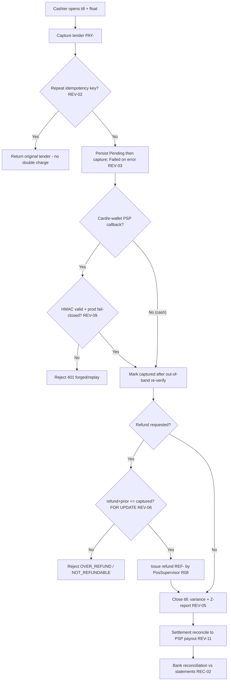

# Cash & Treasury (POS Till · Payments · Bank Reconciliation) — Process Narrative

## 1. Document control

| Field | Value |
|---|---|
| Process ID | PN-07-CASH |
| Process owner | `<<Controller / Store Operations>>` |
| Approver | `<<CFO>>` |
| Version | **0.1 DRAFT** |
| Effective date | `<<effective-date>>` |
| Review cadence | Per shift (till) + monthly (bank rec) + annual |
| Related RCM controls | REV-02, REV-03, REV-05, REV-06, REV-09, REV-11, REC-02; SoD R08 |
| Related policy | `compliance/policies/11-financial-close-policy.md`, `compliance/policies/03-delegation-of-authority.md` |

## 2. Purpose

To control cash and electronic settlement — POS till open/close, payment capture and refunds, PSP webhooks/settlement, and bank reconciliation — so that **all cash collected is recorded, drawer variances are detected, refunds cannot exceed captures, electronic callbacks are authentic, and bank balances are reconciled to the GL**.

## 3. Scope

**In scope:** till open / close with Z-report variance, payment tender capture (PAY-), refunds (REF-) with over-refund guard, payment idempotency, PSP webhook verification (HMAC), settlement batching/reconciliation, and bank reconciliation against statements.

**Out of scope:** revenue recognition and AR (see `01-order-to-cash.md`), supplier disbursement approval (see `02-procure-to-pay.md`), GL period close (see `04-general-ledger-close.md`).

## 4. References

- ISO 9001:2015 cl. 4.4, cl. 8.5.1, cl. 9.1.
- `compliance/Oshinei_ERP_SOX_RCM_v1.xlsx` — REV-02/03/05/06/09/11, REC-02.
- `compliance/policies/03-delegation-of-authority.md` (refund/void authority).
- Code: `apps/api/src/modules/payments/payments.service.ts`, `apps/api/src/modules/pos-terminal/`, `apps/api/src/modules/bank/`, `apps/api/src/common/crypto.ts`.

## 5. Definitions & abbreviations

| Term | Meaning |
|---|---|
| Till / drawer | Cash session with opening float |
| X-report / Z-report | Mid-shift / end-of-shift till summary |
| Variance | Counted cash − expected cash at close |
| Idempotency key | De-duplication token for tender |
| PSP webhook | Gateway callback (HMAC-SHA256 signed) |
| Settlement | Batch of payment intents reconciled to PSP payout |
| RCP- / PAY- / REF- | Receipt / payment / refund document prefixes |

## 6. Roles & responsibilities (RACI)

SoD rule **R08**: the **Cashier** who records sales/tender is never the role that **issues refunds or reconciles the till** (PosSupervisor) — `pos_sell`, `pos_refund`, and `pos_till` are split single-duty permissions.

| Activity | Cashier | PosSupervisor | ArClerk | FinancialController | Controller |
|---|---|---|---|---|---|
| Open till (opening float) | **A/R** | C | I | I | I |
| Capture payment / tender (`pos_sell`) | **A/R** | I | I | I | I |
| Issue refund (`pos_refund`) | I | **A/R** | I | I | C |
| Close till + Z-report (`pos_till`) | I | **A/R** | I | C | A |
| Review till variance | I | C | I | **A/R** | A |
| PSP settlement reconciliation | I | I | C | **A/R** | A |
| Bank reconciliation | I | I | C | **A/R** | A |

## 7. Process narrative

1. **Till open.** Cashier opens a till session recording the opening float (`POST /api/payments/till/open`).
2. **Payment capture.** Tender is recorded (PAY-). The payment row is persisted **Pending before** the gateway capture and flipped **Failed** on error — captured funds are never unrecorded (**REV-03**). For card/e-wallet tenders the gateway performs a **real PSP charge** (Opn/Omise, Stripe) using the terminal-supplied token (satang minor-units, secret-key auth); a tender with **no token or a declined charge is never reported Captured**, so funds that did not move are never booked. A **decline is recorded as a durable `Failed` tender** (committed with the decline reason, returned to the caller — not a rolled-back error), so every card attempt leaves an audit trail. A repeated `idempotency_key` returns the original tender (unique-index backstop), so exactly one PSP charge occurs on retry (**REV-02**).
3. **PSP webhook (decision point).** For card/e-wallet, the gateway callback is verified by HMAC-SHA256 over the raw body, **fail-closed in production**; a forged/replayed signature → `401`; status is re-verified out-of-band before a payment is treated as captured (**REV-09**).
4. **Refund (decision point).** PosSupervisor issues a refund (REF-) only when refund + all prior refunds ≤ captured, evaluated under a payment-row lock (`FOR UPDATE`); an over-refund → `OVER_REFUND`; a refund of a non-captured payment → `NOT_REFUNDABLE` (**REV-06**). Refund authority is separated from selling (**R08**).
5. **Till close (decision point).** At shift end PosSupervisor closes the till (`POST /api/payments/till/close`): expected cash = opening float + Σ cash captured; variance = counted − expected; the Z-report records the variance and denominations (**REV-05**). FinancialController reviews and the supervisor signs the Z-report.
6. **Settlement reconciliation.** Card/e-wallet payment intents are batched into a settlement and reconciled to the PSP payout statement (**REV-11**).
7. **Bank reconciliation.** Bank balances are reconciled against statements monthly and reviewed; differences are cleared (**REC-02**; feeds the GL close, `04-general-ledger-close.md`). Auto-match and the reconciliation report scope the GL cash movements to **the bank account's own tenant** — the cash GL (e.g. 1010) is shared across tenants, so without this an HQ/Admin caller (whose request bypasses RLS) would pull another tenant's movements into the balance/match set (**REC-02**, **ITGC-AC-03**).

8. **Reconciliation periods & certification (decision point).** The structured reconciliation workflow lives under `/api/recon` (`apps/api/src/modules/reconciliation/`): `GET /api/recon/periods` and `POST /api/recon/periods` list/create reconciliation periods; `GET /api/recon/periods/:id/summary` returns the period state; `POST /api/recon/periods/:id/import-gl` pulls the GL movements to be reconciled; `POST /api/recon/periods/:id/items` adds statement/manual items; `POST /api/recon/periods/:id/auto-match` clears matched pairs; and `POST /api/recon/periods/:id/certify` signs off the period. Certification enforces **maker-checker** — the certifier must differ from the preparer, else the call is rejected `403 SOD_VIOLATION` ("Certifier must be different from preparer (SoD)") — so the person who prepares a reconciliation cannot also certify it (**REC-02/03**; feeds the GL close, `04-general-ledger-close.md`).

9. **Cash-flow forecast + working-capital health (advisory; reporting only — no GL).** `GET /api/finance/cashflow?weeks=` projects the cash position **week-by-week** from real sub-ledgers: **opening cash** (posted balance of the cash/bank GL accounts 1000/1010/1020), expected **AR collections** and scheduled **AP payments** bucketed by due date (overdue → week 1), and the **POS sales run-rate** (28-day average, immediate cash). It surfaces the **minimum projected balance** and the **first shortfall week** so a cash crunch is visible *before* it bites, and computes a transparent **working-capital health score** (0–100, A–E) from days-cash-on-hand, the current ratio, and overdue-AR % — the financial-health read a financing partner would underwrite against. Read-only; no postings. Also exposed to the **AI assistant** (`get_cashflow_forecast`) so staff can ask "จะมีเงินสดพอไหมเดือนนี้?". Harness `cashflow.ts`; UAT-GL-021.

## 8. Process flow

**Swimlane description by role:** **Cashier** opens the till and captures tender (sell only). The **system** enforces idempotency, pre-persist capture, HMAC webhook verification, and the over-refund lock. **PosSupervisor** issues refunds and closes the till (segregated from selling, **R08**). **FinancialController** reviews till variances, settlement reconciliation, and the monthly bank reconciliation.

## 9. Control matrix

| Step | Risk | Control | Type | RCM ID | Evidence / Record |
|---|---|---|---|---|---|
| 2 | Double charge on retry | Payment idempotency key + unique index | Prev / Auto | REV-02 | Idempotency test |
| 2 | Captured funds unrecorded (orphan), or funds booked that did not move | Persist Pending before capture; **real PSP charge** for card/e-wallet — no Captured without an actual charge; a decline lands a **durable Failed tender** (audit trail) | Prev / Auto | REV-03 | Negative-path + `payments-gateway` harness (decline → durable Failed, never Captured) |
| 3 | Forged/replayed PSP callback | HMAC-SHA256 verify, fail-closed in prod | Prev / Auto | REV-09 | Webhook signature tests; 401s |
| 4 | Refund exceeds capture (leakage/fraud) | Over-refund guard under payment-row lock | Prev / Auto | REV-06 | `OVER_REFUND` test |
| 4 | Cashier refunds own sale | SoD: `pos_sell` vs `pos_refund`/`pos_till` | Prev / Manual | R08 | SoD conflict report |
| 5 | Drawer shortage / skimming undetected | Till reconciliation; Z-report variance review | Det / Hybrid | REV-05 | Signed Z-reports |
| 6 | Card settlements not reconciled to payouts | Settlement batching + reconcile | Det / Hybrid | REV-11 | Settlement recon |
| 7 | Bank balance not reconciled to GL | Bank reconciliation vs statements | Det / Hybrid | REC-02 | Bank rec |

## 10. Inputs & outputs

**Inputs:** opening float, tender requests, PSP callbacks, refund requests, PSP payout statements, bank statements.
**Outputs:** till sessions, payments (PAY-), refunds (REF-), X/Z-reports, settlement batches, bank reconciliations.

## 11. Records & retention

| Record | Store | Retention |
|---|---|---|
| Till sessions + Z-reports | Application DB (RLS-scoped) | `<<7 years>>` |
| Payments / refunds | Application DB | `<<7 years>>` |
| PSP webhook + settlement records | Application DB | `<<7 years>>` |
| Bank reconciliations | `bank` module | `<<7 years>>` |
| Mutation audit trail | `audit_log` | `<<7 years>>` |

## 12. KPIs / metrics

- Till variance per shift (count and value of variances > `<<threshold>>`).
- Over-refund attempts blocked (`OVER_REFUND`).
- Forged/invalid webhook rejections.
- Settlement / bank reconciliation differences cleared on time (target: 0 open).

## 13. Exception & error handling

| Error code | Trigger | Handling |
|---|---|---|
| `OVER_REFUND` | Refund + priors > captured | Refund denied; PosSupervisor review |
| `NOT_REFUNDABLE` | Refund vs non-captured payment | Verify payment status |
| `401` webhook | Forged/replayed PSP signature | Reject; alert; re-verify out of band |
| Till variance | Counted ≠ expected | FinancialController reviews; investigate per DoA |
| Unreconciled item | Bank/settlement difference | Investigate and clear before close |

## 14. Revision history

| Version | Date | Author | Summary |
|---|---|---|---|
| 0.1 DRAFT | 2026-06-22 | `<<author>>` | Initial draft. |
| 0.2 | 2026-06-23 | Platform | Security review W2 (REC-02 / ITGC-AC-03): bank auto-match + reconciliation now scope GL cash movements to the bank account's tenant (shared 1010 GL no longer leaks across tenants under an Admin/bypass caller). Verified by the `bankrec` harness cross-tenant case. |
| 0.3 | 2026-06-23 | Platform | Documented the `/api/recon` reconciliation-period API (7 endpoints) and the period-certify maker-checker control (certifier ≠ preparer, `SOD_VIOLATION`) in §7. |
| 0.4 | 2026-06-24 | Platform | Card/e-wallet tenders now make a **real PSP charge** (Opn/Omise, Stripe) on the tender path — the prior stub gateways that returned a synthetic `Captured` are replaced; a no-token or declined charge is never reported Captured. A decline now records a **durable `Failed` tender** (committed with the reason + returned, instead of a rolled-back error). Threaded the terminal `token` through `recordTender`. New `payments-gateway` harness (fetch-stubbed PSP). Updated step 2 + REV-03 control. |
| 0.5 | 2026-06-24 | Platform | **Cash-flow forecast + working-capital health score (advisory; reporting only — no GL):** new §7 step 9 — `GET /api/finance/cashflow?weeks=` projects the cash position week-by-week from opening cash (GL 1000/1010/1020) + AR collections + AP payments (by due date) + the POS run-rate, flags the **first shortfall week** and minimum balance, and scores financial health (0–100, A–E) from days-cash-on-hand / current ratio / overdue-AR %. Web page `/cashflow`; AI tool `get_cashflow_forecast`. Harness `cashflow.ts` (4); UAT-GL-021. No postings, no control change. |
