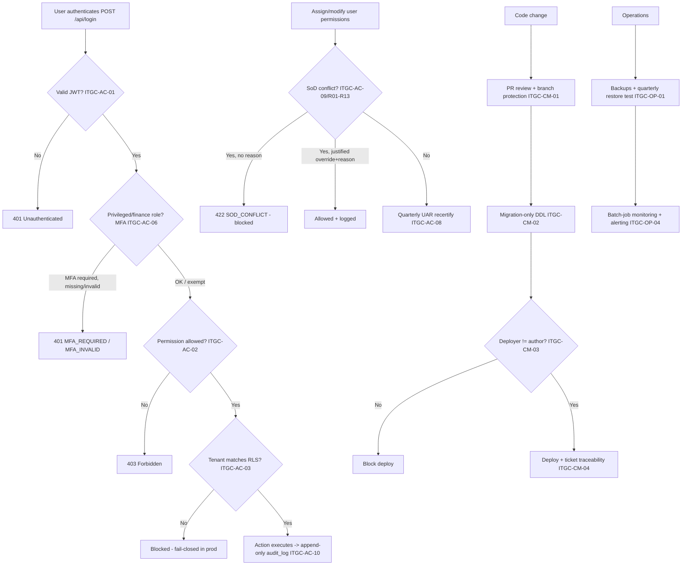

# IT General Controls (Access · Change Management · Operations) — Process Narrative

## 1. Document control

| Field | Value |
|---|---|
| Process ID | PN-08-ITGC |
| Process owner | `<<Head of Engineering / IT Security>>` |
| Approver | `<<CTO / CFO>>` |
| Version | **0.1 DRAFT** |
| Effective date | `<<effective-date>>` |
| Review cadence | Continuous (automated) + quarterly (UAR) + annual (policies/DR) |
| Related RCM controls | ITGC-AC-01..13, ITGC-CM-01..05, ITGC-SD-01..03, ITGC-OP-01..04; SoD R01–R13 |
| Related policy | `06-information-security-policy.md`, `07-access-control-policy.md`, `08-change-management-sdlc-policy.md`, `09-backup-dr-bcp-policy.md`, `10-incident-response-policy.md`, `13-segregation-of-duties-policy.md` |

## 2. Purpose

To control the IT general controls on which all application controls depend: **Access** to programs and data (authentication, RBAC, tenant isolation, MFA, SoD, audit trail, secrets), **Change Management / SDLC** (review, migration-only DDL, deploy segregation, traceability), and **Operations** (backup/restore, DR/BCP, batch-job monitoring). Effective ITGC is the foundation for reliance on automated application controls (REV/EXP/INV/GL/TAX/PAY).

## 3. Scope

**In scope:** all financially-relevant systems — NestJS API, Next.js web, PostgreSQL 16 (RLS), CI/CD pipeline, secrets, backups, and scheduled (`pg-boss`) jobs.

**Out of scope:** application/process controls themselves (documented in `01`–`07`); purely operational AI/analytics features that do not flow to the financial statements.

## 4. References

- ISO 9001:2015 cl. 4.4, cl. 7.1.3 (infrastructure), cl. 7.5 (documented information); aligned to COBIT / PCAOB AS 2201 ITGC.
- `compliance/Oshinei_ERP_SOX_RCM_v1.xlsx` — ITGC-AC/CM/SD/OP; `COSO_ICFR_Audit_Readiness_Plan.md` §3.
- Policies 06–10, 13 in `compliance/policies/`.
- Code: `apps/api/src/common/guards.ts`, `tenant-tx.interceptor.ts`, `audit.interceptor.ts`, `crypto.ts`; `apps/api/src/modules/auth/`, `admin-users/`, `workflow/sod.service.ts`; `packages/shared/src/permissions.ts`; `apps/api/drizzle/*` + `.github/workflows/ci.yml`.

## 5. Definitions & abbreviations

| Term | Meaning |
|---|---|
| RBAC | Role-Based Access Control |
| RLS | Row-Level Security (PostgreSQL tenant isolation) |
| MFA / TOTP | Multi-Factor Authentication / time-based one-time password |
| UAR | User Access Review (quarterly recertification) |
| SoD | Segregation of Duties (rules R01–R13) |
| DDL | Data Definition Language (schema change) |
| DR/BCP | Disaster Recovery / Business Continuity Plan |
| RTO / RPO | Recovery Time / Point Objective |

## 6. Roles & responsibilities (RACI)

SoD rule **R01**: access administration (AccessAdmin / `users`) is isolated from any transactional duty. Change management requires **deployer ≠ author** (ITGC-CM-03).

| Activity | AccessAdmin | IT Security | Head of Eng | DevOps | DBA | Controller |
|---|---|---|---|---|---|---|
| Provision / modify user access (`users`) | **A/R** | C | I | I | I | C |
| Enforce MFA enrolment (privileged/finance) | C | **A/R** | I | I | I | I |
| Quarterly User Access Review (UAR) | R | C | I | I | I | **A/R** |
| Maintain SoD ruleset + review conflicts | C | C | C | I | I | **A/R** |
| Code review / branch protection | I | I | **A/R** | C | I | I |
| Migration-only DDL | I | I | A | C | **R** | I |
| Production deploy approval (≠ author) | I | I | **A/R** | R | I | I |
| Backup + quarterly restore test | I | C | C | **A/R** | C | I |
| DR/BCP plan + test | I | C | A | **A/R** | C | I |
| Batch-job monitoring | I | I | C | **A/R** | I | C |

## 7. Process narrative

### 7.A Access to programs and data

1. **Authentication.** A global JWT auth guard requires a valid token on every endpoint unless explicitly `@Public`; an unauthenticated call → `401` (**ITGC-AC-01**). *Username identity is canonicalized* — usernames are normalized to trimmed-lowercase on every write (admin create, portal sub-user, self-serve signup) and every read (login + admin/portal lookups) via `normalizeUsername`, so an account is matched deterministically regardless of casing or stray whitespace (closes a footgun where an account created as `JohnD ` could not be reached by typing `johnd`); passwords are never trimmed. Existing rows are back-filled collision-safely by migration `0085_username_normalize.sql` (**ITGC-AC-01**).
2. **MFA (decision point).** `POST /api/login` enforces TOTP for privileged/finance roles: any user whose effective permissions intersect `MFA_REQUIRED_PERMISSIONS` (`users`, `gl_post`, `gl_close`, `creditors`, `ar`, `approvals`, `md_vendor`, `md_config`) or who is Admin must enrol — login on password alone → `401 MFA_REQUIRED`, wrong code → `401 MFA_INVALID`; un-enrolled privileged users are flagged `must_setup_mfa`; Cashiers/read-only roles are exempt (**ITGC-AC-06**).
3. **RBAC.** A `PermissionsGuard` enforces `@Permissions`; an over-privileged call → `403`. 37 coarse + 13 single-duty permissions with per-user overrides (**ITGC-AC-02**).
4. **Tenant isolation.** A per-request transaction sets `app.tenant_id`; PostgreSQL RLS (FORCE, `tenant_isolation` USING+WITH CHECK) blocks cross-tenant read/insert, **fail-closed in production** (**ITGC-AC-03**). API keys are downscoped and RLS-bound (**ITGC-AC-05**).

   *Public webhooks (no JWT) are authenticated and tenant-scoped:* inbound aggregator order webhooks (`/api/channels/:platform/webhook`, `/api/channel/webhook/:source`) verify a per-platform **shared secret** (`x-webhook-secret`) and PSP payment webhooks (`/api/payments/psp/webhook`) verify an **HMAC-SHA256 signature** over the raw body — both **fail-closed in production** (a missing secret/invalid signature → `401`), lenient only in dev/test. Each handler is `@NoTx`: rather than running under the anonymous-request RLS bypass, it resolves the owning tenant from the resource (adapter `store_ref` / payment-intent `provider_ref`) via a controlled bypass read and then re-enters an **RLS-scoped** transaction (`RealtimeScope.run(tenantId)`) so the writes are confined to that tenant even if the secret were compromised (**ITGC-AC-03**, defense-in-depth).
5. **Secrets at rest.** TOTP seeds, webhook secrets, and **OIDC client secrets** are AES-256-GCM encrypted (SCIM bearer tokens are stored only as a `sha256` hash); `APP_ENC_KEY` is required in prod (boot fails without it) (**ITGC-AC-04**). Centralized **fail-closed** boot validation (`env.validation.ts`) now refuses to start in production without all required secrets, and `docs/ops/secrets.md` defines the store/matrix/rotation (**ITGC-AC-12**, implemented; vault placement + KMS-envelope for `APP_ENC_KEY` are the remaining [setup]/follow-up).
6. **SoD enforcement (decision point).** Assigning a conflicting permission set (e.g. `procurement`+`creditors`, rule **R03**) is **blocked preventively** (`422 SOD_CONFLICT`) on permission assignment and update, naming the offending rule; a justified override (`allow_sod_override` + `sod_reason`) is honoured and logged, but an override without a reason is still rejected. The detective conflict report (`GET /api/sod/user-conflicts`) resolves effective per-user permissions against the 13 rules R01–R13 (**ITGC-AC-09**).

   *AI write-ops are SoD-gated (Phase D1):* the AI assistant cannot mutate financial data directly — its write-tools file a **PENDING** proposal (`ai_action_requests`), and execution requires a human approval (`POST /api/ai/actions/:id/approve`) that enforces **approver ≠ proposer** (`SOD_SELF_APPROVAL`) and that the approver holds the action's permission (`gl_post` for a JE, `procurement` for a PO) before posting through the normal service + GL — tenant-scoped (RLS) and audited. An autonomous agent therefore cannot self-authorize a posting (**ITGC-AC-09**; evidence `ai-actions.ts`).
7. **User Access Review (decision point).** The quarterly UAR report exposes effective permissions + SoD conflicts per user; CSV export carries reviewer-decision columns; a period sign-off is recorded and retrievable — terminated/changed users are remediated (**ITGC-AC-08**).
8. **Audit trail.** Every mutating request is captured in append-only `audit_log` (actor, tenant, action, IP, requestId, status, meta); `UPDATE`/`DELETE` on `audit_log` are rejected by a DB trigger — tamper-evident (**ITGC-AC-10**). A **read-only viewer** (`GET /api/admin/audit` — paginated + filterable by actor/action/status/date — and `GET /api/admin/audit/export` CSV) lets an administrator review and extract the trail for an auditor; it is gated by `users` (as the access-review) and **tenant-scoped by RLS** (a tenant admin sees only their tenant's events; HQ/Admin sees all). The viewer only ever `SELECT`s — it neither relaxes nor duplicates the immutability control, so **ITGC-AC-10 is unchanged** (no RCM impact); it operationalises the detective review of the evidence. The POS fiscal journal is hash-chained (**ITGC-AC-11**). Named/least-privilege DB users are provisioned via `tools/ops/sql/prod-db-roles.sql` (dedicated non-owner `ierp_app` login in the `app_user` group; FORCE-RLS re-asserted) (**ITGC-AC-13**, implemented — [setup] run at provisioning). Web token/session hardening (localStorage → httpOnly cookie + CSRF) remains a deferred workstream (**ITGC-AC-07**, open).

9. **Outbound integration webhooks (egress).** An admin (`users`) registers tenant-scoped subscriber endpoints (`/api/platform/webhooks`) for business events (`po.approved`, `po.rejected`, `alert.fired`); the per-endpoint signing secret is generated server-side and **AES-256-GCM encrypted at rest** (returned in plaintext only once at registration) (**ITGC-AC-04**). Each delivery POSTs a payload **signed `HMAC-SHA256(secret, `${timestamp}.${body}`)`** in `X-IERP-Signature` with `X-IERP-Timestamp`/`X-IERP-Delivery` so a receiver can verify authenticity, reject stale calls (>300s) and dedupe — the same signing scheme as the inbound PSP/aggregator webhooks (step 4). Delivery is **bounded by a 10s timeout** (a hung subscriber can't block the request), every attempt is recorded in `webhook_deliveries` (status / status_code / attempts / error — an egress audit log) with a capped retry (`dispatch` re-runs failed deliveries; `redeliver` re-sends one), and endpoint visibility + the delivery log are **tenant-scoped** (an endpoint by RLS, its deliveries via the FK join). Best-effort and read-only with respect to the ledger — emitting an event **posts no GL** and a failed delivery never fails the business transaction. *Operational integration egress — no new RCM control.*

10. **Federated identity — SSO (OIDC) + SCIM provisioning (Platform #4).** A tenant admin (`users`) connects its IdP via `GET/PUT /api/platform/identity`; the OIDC **client secret is AES-256-GCM encrypted** and the SCIM bearer token stored only as a `sha256` hash (**ITGC-AC-04**). **SSO** (`/api/auth/sso/authorize|callback`, `@Public`) verifies the IdP `id_token` (signature/issuer/audience/expiry) and **JIT-provisions** the user by `sso_subject`, minting the standard session JWT — an additional **authentication** path that still flows through the global guard and RLS (**ITGC-AC-01**). **SCIM 2.0** (`/scim/v2/Users`, per-tenant `scim_…` bearer via a guard mirroring the api-key path) lets the IdP **automate the joiner/mover/leaver lifecycle**: create and role-change run through the same `AdminUsersService` so the **SoD block (R01–R13) applies to federated provisioning too** (**ITGC-AC-09**), and **deprovisioning deactivates** (`users.is_active=false`) rather than deleting — a deactivated account cannot authenticate by password or SSO (`401 USER_DEACTIVATED`), and the row (and its audit history) is retained (**ITGC-AC-02**, joiner/mover/**leaver**). Config + provisioning are **tenant-scoped by RLS** (new `tenant_identity` table; migration `0088`). *Reinforces existing access controls — no new RCM control.*

### 7.B Change management & SDLC

9. **Peer review + branch protection.** All code changes go via peer-reviewed PR; an importable ruleset (`.github/rulesets/main-branch-protection.json`) + `.github/CODEOWNERS` enforce required reviews, code-owner review, required CI checks, and no force-push/deletion on `main` (**ITGC-CM-01**, implemented — [setup] import the ruleset).
10. **Migration-only DDL (decision point).** Schema changes only via reviewed Drizzle migrations (`apps/api/drizzle/*`, journal maintained); no ad-hoc prod DDL (**ITGC-CM-02**).
11. **Deploy segregation (decision point).** Production deploy runs via `.github/workflows/deploy.yml`, pinned to the GitHub `production` Environment whose **required reviewers** enforce **deployer ≠ author** (**ITGC-CM-03**, implemented — [setup] set Environment reviewers + `RAILWAY_TOKEN`).
12. **Traceability & emergency change.** The PR template (`.github/pull_request_template.md`) makes every change traceable ticket → PR → review → gated deploy (**ITGC-CM-04**, implemented); the emergency-change procedure (expedited second review + retroactive retro within 1 business day) is documented in `docs/ops/change-management.md` (**ITGC-CM-05**).
13. **SDLC sign-off / automated tests.** Requirements/design/test/UAT/go-live sign-off (**ITGC-SD-01**); cutover balance reconciliation (**ITGC-SD-02**); automated test suite as control evidence, CI archives dated results — failures block merge, plus `security`/`codeql` SAST and a hard `pnpm audit` gate (**ITGC-SD-03**).

### 7.C Operations

14. **Backup + restore (decision point).** Automated DB backups (`tools/ops/pg-backup.sh`) plus a **scripted, repeatable restore drill** (`tools/ops/restore.sh` + `tools/ops/verify-restore.sh`: restore into a scratch DB → sanity-check core tables → evidence) — recovery is proven, not just scheduled. RTO/RPO + evidence table in `tools/ops/BACKUP-RUNBOOK.md` (**ITGC-OP-01**, implemented — [setup] run the first drill + enable provider PITR).
15. **DR/BCP.** DR/BCP plan with defined RTO/RPO and periodic test (**ITGC-OP-02**, partial — RTO/RPO defined in the backup runbook; full BCP plan open).
16. **Monitoring & incident.** Monitoring/alerting (APM/errors) with on-call and an incident log — process, severity matrix, and alert rules in `docs/ops/observability-incident.md`; prod boot warns when OTel/Sentry are unset; `/healthz`+`/readyz` probes added (**ITGC-OP-03**, implemented — [setup] wire dashboards + on-call rotation).
17. **Batch-job monitoring.** Scheduled financial jobs (`pg-boss`: recurring billing, FX revaluation, subscriptions) are monitored with failure alerting + review so postings/billing are not silently missed; alert spec in `docs/ops/observability-incident.md` (**ITGC-OP-04**, partial — alert wiring is [setup]).

## 8. Process flow

**Swimlane description by role:** The **system** enforces authentication, MFA, RBAC, RLS, the preventive SoD block, and the immutable audit trail at runtime. **AccessAdmin** provisions access (isolated from transacting, R01); **Controller** owns the quarterly UAR and SoD review. **Head of Eng** owns code review, deploy segregation (deployer ≠ author), and SDLC sign-off. **DevOps/DBA** own migration-only DDL, backups/restore tests, DR/BCP, and batch-job monitoring.

## 9. Control matrix

| Step | Risk | Control | Type | RCM ID | Evidence / Record |
|---|---|---|---|---|---|
| 1 | Unauthenticated access to financial data | Global JWT auth guard | Prev / Auto | ITGC-AC-01 | Config + 401 test |
| 2 | Stolen password yields finance access | TOTP MFA enforced for privileged/finance roles | Prev / Auto | ITGC-AC-06 | MFA config; harness ToE |
| 3 | Action beyond role | RBAC `@Permissions` (37 + 13) | Prev / Auto | ITGC-AC-02 | Perm map; 403 tests |
| 4 | Cross-tenant leakage | PostgreSQL RLS, fail-closed in prod | Prev / Auto | ITGC-AC-03 | RLS policy + test |
| 5 | Secrets/PII exposed at rest | AES-256-GCM; `APP_ENC_KEY` boot gate | Prev / Auto | ITGC-AC-04 | Boot test |
| 5 | Secrets hardcoded/un-rotated | Fail-closed boot validation + secrets policy/rotation (`env.validation.ts`, `docs/ops/secrets.md`); vault placement [setup] | Prev / Hybrid | ITGC-AC-12 | env.validation; secrets.md |
| 5b | Over-privileged DB connection | Dedicated non-owner `ierp_app` login + FORCE RLS (`tools/ops/sql/prod-db-roles.sql`) | Prev / Manual | ITGC-AC-13 | prod-db-roles.sql |
| 6 | Conflicting duties in one user | Preventive SoD block (`SOD_CONFLICT`) + detective report (R01–R13) | Prev+Det / Hybrid | ITGC-AC-09 | SoD report; harness ToE |
| 7 | Access creep / terminated users retain access | Quarterly UAR recertify + remove | Det / Manual | ITGC-AC-08 | UAR sign-off; CSV |
| 8 | No record / tampered record of changes | Append-only immutable audit_log | Det / Auto | ITGC-AC-10 | Audit log; immutability trigger |
| 9 | Unauthorized/untested code to prod | PR review + branch-protection ruleset + CODEOWNERS + required CI | Prev / Hybrid | ITGC-CM-01 | ruleset JSON; CODEOWNERS; CI logs |
| 10 | Ad-hoc prod schema change | Migration-only DDL (Drizzle journal) | Prev / Hybrid | ITGC-CM-02 | Migration log |
| 11 | Developer self-deploys to prod | Approval-gated `deploy.yml` via GitHub `production` env (deployer ≠ author) | Prev / Hybrid | ITGC-CM-03 | deploy.yml; env reviewers |
| 12 | Change not traceable | PR template: ticket → PR → review → gated deploy | Det / Manual | ITGC-CM-04 | pull_request_template.md |
| 13 | Control logic regresses unnoticed | Automated tests as control evidence; CI archive | Det / Auto | ITGC-SD-03 | CI reports |
| 14 | Data loss, no recovery | Backups + scripted, repeatable restore drill (`pg-backup.sh`/`restore.sh`/`verify-restore.sh`) | Prev / Hybrid | ITGC-OP-01 | BACKUP-RUNBOOK.md; drill output |
| 15 | Prolonged outage | DR/BCP with RTO/RPO + test (RTO/RPO defined; full BCP open) | Prev / Manual | ITGC-OP-02 (partial) | DR test |
| 16 | Incidents undetected/unmanaged | Alert rules + severity matrix + incident process; `/healthz`+`/readyz` | Det / Hybrid | ITGC-OP-03 | observability-incident.md |
| 17 | Financial batch jobs fail silently | Batch-job monitoring + alerting (spec'd; wiring [setup]) | Det / Auto | ITGC-OP-04 (partial) | Job logs |

## 10. Inputs & outputs

**Inputs:** access requests (joiner/mover/leaver), permission changes, code PRs, migrations, deploy requests, backup schedules, job runs.
**Outputs:** authenticated sessions, enforced permissions, RLS-scoped queries, SoD conflict blocks/reports, UAR sign-offs, audit-log entries, reviewed deploys, restore-test records, job-monitoring evidence.

## 11. Records & retention

| Record | Store | Retention |
|---|---|---|
| Audit trail (mutations) | `audit_log` (append-only, immutable trigger) | `<<7 years>>` |
| User-access listing + UAR sign-offs | `admin-users` exports | `<<7 years>>` |
| SoD conflict reports / override logs | `audit_log`, `sod` report output | `<<7 years>>` |
| PR / CI / deploy-approval evidence | GitHub / CI artefacts | `<<per change-mgmt policy>>` |
| Backup + restore-test records | DevOps / infra | `<<per backup policy>>` |
| Incident log | Incident tracker | `<<per IR policy>>` |

## 12. KPIs / metrics

- % privileged/finance users with MFA enrolled (target 100%).
- SoD conflicts open vs remediated; preventive `SOD_CONFLICT` blocks per period.
- UAR completion on time; access removed on termination within SLA.
- % PRs with independent review + green CI + ticket; deploys with deployer ≠ author.
- Quarterly restore tests passed; batch-job failure rate / mean time to detect.

## 13. Exception & error handling

| Error code | Trigger | Handling |
|---|---|---|
| `401 MFA_REQUIRED` / `MFA_INVALID` | Privileged login without/with wrong TOTP | User enrols/retries; IT Security assists |
| `403` (RBAC) | Action beyond permission | Request access via UAR/joiner process |
| `422 SOD_CONFLICT` | Conflicting permissions assigned | Re-design role, or documented justified override + reason |
| RLS block | Cross-tenant access attempt | Investigated as a security event (fail-closed in prod) |
| Deploy blocked | Deployer = author | Route to independent approver |
| Restore-test failure | Backup not recoverable | Incident; remediate per backup/DR policy |

## 14. Revision history

| Version | Date | Author | Summary |
|---|---|---|---|
| 0.1 DRAFT | 2026-06-22 | `<<author>>` | Initial draft. |
| 0.2 | 2026-06-23 | Platform | Phase A hardening: ITGC-OP-01 (scripted restore + drill), AC-12 (fail-closed secret validation + secrets policy), AC-13 (prod least-privilege DB role), CM-01/03/04 (ruleset, CODEOWNERS, approval-gated deploy, PR template), OP-03 (incident runbook + health probes) moved from gap/partial → implemented; AC-07 token hardening + OP-02 BCP remain open. Updated narrative steps + control matrix; references `docs/ops/*` and `tools/ops/*`. |
| 0.3 | 2026-06-23 | Platform | Security review W1 (ITGC-AC-03): public aggregator + PSP webhooks now authenticate (shared-secret / HMAC, fail-closed in prod) and run RLS-scoped via `RealtimeScope.run(tenant)` instead of the anonymous bypass; closes unauthenticated cross-tenant order injection on `/api/channels/:platform/webhook`. Verified by `pos-p2` (secret enforcement) + `pos-p0` (PSP). |
| 0.4 | 2026-06-23 | Platform | Security review W5 (input-validation hardening, ITGC-AC-02): numeric query params coerce via `qint`/`qintOpt` (malformed → `400 BAD_QUERY` instead of `NaN` reaching LIMIT/OFFSET); `/api/branches` POST/PATCH bodies are Zod-validated; ESS expense self-approval is blocked even when the employee is linked only by `emp_code`; pipeline/menu add not-found guards; outbound webhook delivery is bounded by a 10s timeout. Verified by `ess` (emp_code SoD) + `branch` (body validation). |
| 0.5 | 2026-06-23 | Platform | Doc-drift fix (ITGC-AC-09): corrected the detective SoD-conflict report endpoint in §7 step 6 from `GET /api/admin/sod/conflicts` to the real route `GET /api/sod/user-conflicts`. |
| 0.6 | 2026-06-24 | Platform | Platform Phase 6 (ITGC-AC-10): §7.A step 8 — added a read-only audit-trail viewer (`GET /api/admin/audit` paginated/filterable + `/export` CSV), gated by `users`, RLS-scoped. SELECT-only; the append-only immutability control is unchanged (no RCM impact) — it operationalises the detective review of the trail. Migration 0083 adds composite query indexes; verified by the `ext` harness. |
| 0.7 | 2026-06-24 | Platform | Platform Phase 8: §7.A step 9 — outbound integration webhooks (`/api/platform/webhooks` register/list/delete + `/events`, `/deliveries`, `/deliveries/:id/redeliver`, `/dispatch`). HMAC-SHA256-signed payloads, AES-256-GCM-encrypted signing secret (AC-04), 10s-bounded delivery, capped retry, tenant-scoped endpoints + `webhook_deliveries` egress log; emitted from PO approve + the alert sweep (best-effort, no GL). Migration 0084 (additive columns + indexes). No new RCM control; verified by the `ext` harness. |
| 0.8 | 2026-06-24 | Platform | Login hardening (ITGC-AC-01): usernames canonicalized to trimmed-lowercase on all create/lookup paths (`normalizeUsername`) and login matches case-insensitively (`lower(username)`), so legacy/mixed-case accounts authenticate too; fixes newly-created accounts that could not sign in. Existing rows back-filled collision-safely by migration `0085_username_normalize.sql`. Updated §7.A step 1. |
| 0.9 | 2026-06-24 | Platform | Platform Phase #4 — federated identity: §7.A step 10 — per-tenant OIDC **SSO** (`/api/auth/sso/*`, id_token verify + JIT provisioning, AC-01) and **SCIM 2.0** provisioning (`/scim/v2/Users`, per-tenant bearer) with the joiner/mover/leaver lifecycle; SCIM create/role-change reuse the SoD-checked admin path (AC-09) and deprovisioning **deactivates** (`users.is_active=false`, login blocked, AC-02) preserving the audit trail. OIDC client secret AES-256-GCM at rest, SCIM token hashed (AC-04). New `tenant_identity` table (RLS), migration `0088`. Reinforces existing AC controls — no new RCM control; verified by the `ext` harness. |
