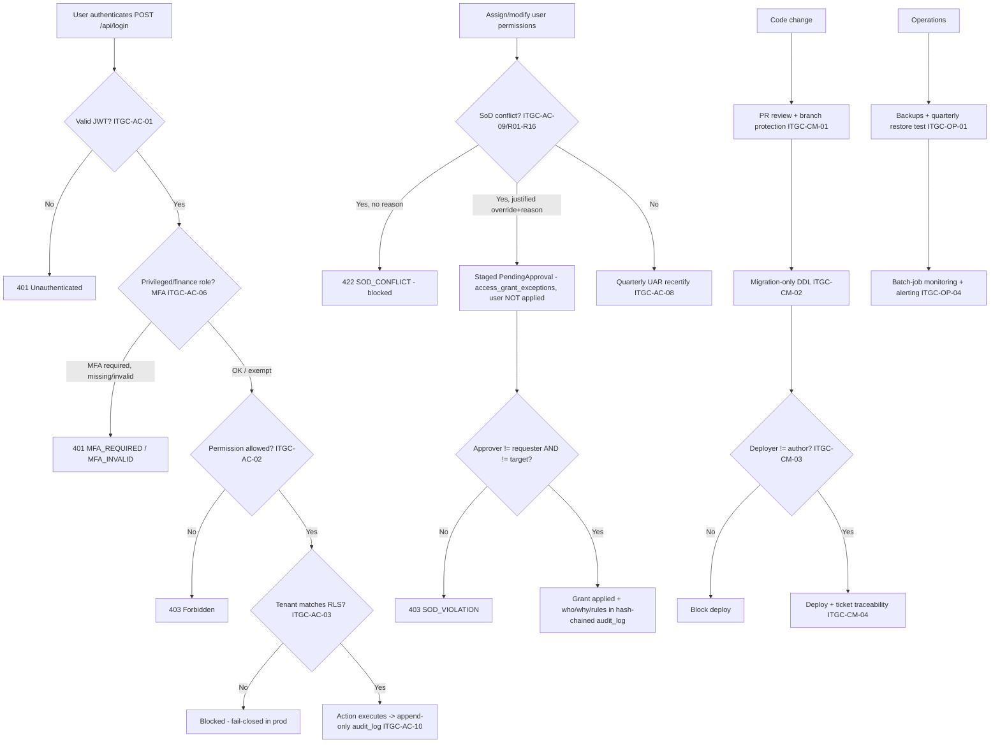

# IT General Controls (Access · Change Management · Operations) — Process Narrative

## 1. Document control

| Field | Value |
|---|---|
| Process ID | PN-08-ITGC |
| Process owner | `<<Head of Engineering / IT Security>>` |
| Approver | `<<CTO / CFO>>` |
| Version | **0.1 DRAFT** |
| Effective date | `<<effective-date>>` |
| Review cadence | Continuous (automated) + quarterly (UAR) + annual (policies/DR) |
| Related RCM controls | ITGC-AC-01..20, ITGC-CM-01..05, ITGC-SD-01..03, ITGC-OP-01..04; SoD R01–R16 |
| Related policy | `06-information-security-policy.md`, `07-access-control-policy.md`, `08-change-management-sdlc-policy.md`, `09-backup-dr-bcp-policy.md`, `10-incident-response-policy.md`, `13-segregation-of-duties-policy.md` |

## 2. Purpose

To control the IT general controls on which all application controls depend: **Access** to programs and data (authentication, RBAC, tenant isolation, MFA, SoD, audit trail, secrets), **Change Management / SDLC** (review, migration-only DDL, deploy segregation, traceability), and **Operations** (backup/restore, DR/BCP, batch-job monitoring). Effective ITGC is the foundation for reliance on automated application controls (REV/EXP/INV/GL/TAX/PAY).

## 3. Scope

**In scope:** all financially-relevant systems — NestJS API, Next.js web, PostgreSQL 16 (RLS), CI/CD pipeline, secrets, backups, and scheduled (`pg-boss`) jobs.

**Out of scope:** application/process controls themselves (documented in `01`–`07`); purely operational AI/analytics features that do not flow to the financial statements.

## 4. References

- ISO 9001:2015 cl. 4.4, cl. 7.1.3 (infrastructure), cl. 7.5 (documented information); aligned to COBIT / PCAOB AS 2201 ITGC.
- `compliance/Oshinei_ERP_SOX_RCM_v1.xlsx` — ITGC-AC/CM/SD/OP; `COSO_ICFR_Audit_Readiness_Plan.md` §3.
- Policies 06–10, 13 in `compliance/policies/`.
- Code: `apps/api/src/common/guards.ts`, `tenant-tx.interceptor.ts`, `audit.interceptor.ts`, `crypto.ts`; `apps/api/src/modules/auth/`, `admin-users/`, `workflow/sod.service.ts`; `packages/shared/src/permissions.ts`; `apps/api/drizzle/*` + `.github/workflows/ci.yml`.

## 5. Definitions & abbreviations

| Term | Meaning |
|---|---|
| RBAC | Role-Based Access Control |
| RLS | Row-Level Security (PostgreSQL tenant isolation) |
| MFA / TOTP | Multi-Factor Authentication / time-based one-time password |
| UAR | User Access Review (quarterly recertification) |
| SoD | Segregation of Duties (rules R01–R16) |
| DDL | Data Definition Language (schema change) |
| DR/BCP | Disaster Recovery / Business Continuity Plan |
| RTO / RPO | Recovery Time / Point Objective |

## 6. Roles & responsibilities (RACI)

SoD rule **R01**: access administration (AccessAdmin / `users`) is isolated from any transactional duty. Change management requires **deployer ≠ author** (ITGC-CM-03).

| Activity | AccessAdmin | IT Security | Head of Eng | DevOps | DBA | Controller |
|---|---|---|---|---|---|---|
| Provision / modify user access (`users`) | **A/R** | C | I | I | I | C |
| Enforce MFA enrolment (privileged/finance) | C | **A/R** | I | I | I | I |
| Quarterly User Access Review (UAR) | R | C | I | I | I | **A/R** |
| Maintain SoD ruleset + review conflicts | C | C | C | I | I | **A/R** |
| Code review / branch protection | I | I | **A/R** | C | I | I |
| Migration-only DDL | I | I | A | C | **R** | I |
| Production deploy approval (≠ author) | I | I | **A/R** | R | I | I |
| Backup + quarterly restore test | I | C | C | **A/R** | C | I |
| DR/BCP plan + test | I | C | A | **A/R** | C | I |
| Batch-job monitoring | I | I | C | **A/R** | I | C |

## 7. Process narrative

### 7.A Access to programs and data

1. **Authentication.** A global JWT auth guard requires a valid token on every endpoint unless explicitly `@Public`; an unauthenticated call → `401` (**ITGC-AC-01**). *Username identity is canonicalized* — usernames are normalized to trimmed-lowercase on every write (admin create, portal sub-user, self-serve signup) and every read (login + admin/portal lookups) via `normalizeUsername`, so an account is matched deterministically regardless of casing or stray whitespace (closes a footgun where an account created as `JohnD ` could not be reached by typing `johnd`); passwords are never trimmed. Existing rows are back-filled collision-safely by migration `0085_username_normalize.sql` (**ITGC-AC-01**).
2. **MFA (decision point).** `POST /api/login` enforces TOTP for privileged/finance roles: any user whose effective permissions intersect `MFA_REQUIRED_PERMISSIONS` (`users`, `gl_post`, `gl_close`, `creditors`, `ar`, `approvals`, `md_vendor`, `md_config`) or who is Admin must enrol — login on password alone → `401 MFA_REQUIRED`, wrong code → `401 MFA_INVALID`; un-enrolled privileged users are flagged `must_setup_mfa`; Cashiers/read-only roles are exempt (**ITGC-AC-06**).

2a. **POS-PIN quick-login restriction (decision point).** Front-of-house staff may sign in at the till with a short **PIN quick-login** (`POST /api/login/pin`, `@Public`, body `{ username, pin }`, pin = 4–6 digits) instead of typing a full password on a shared terminal — it returns the same session as `/api/login` (plus a `permissions` array) and sets the same `httpOnly` `ierp_token` + readable `ierp_csrf` cookies (AC-07). The PIN is **scrypt-hashed** with the same KDF as the password (never stored in clear; `users.pin_hash` / `users.pin_set_at`, migration `0181`). The PIN is a **low-assurance** factor, so it is **restricted to non-privileged roles**: any user whose effective permissions would require MFA (Admin + finance/access-admin roles, via the same `requiresMfa()` predicate as AC-06) is **hard-blocked from both setting and using a PIN** → `PIN_NOT_ALLOWED` — a privileged/finance account therefore can only sign in with password + MFA. A staff member sets/rotates their **own** PIN with a step-up (`POST /api/auth/me/pin`, body `{ current_password, pin }`; a wrong current password → `400 BAD_CURRENT_PASSWORD`); an access administrator (`@Permissions('users')`) may set (`POST /api/auth/users/:username/pin`, body `{ pin }`) or clear (`DELETE /api/auth/users/:username/pin`) a staff PIN. PIN authentication shares the existing **per-account brute-force lockout** (AC-07): a wrong PIN → `401 UNAUTHORIZED` (generic, anti-enumeration), repeated failures trip the same throttle → `429 LOGIN_LOCKED`, and a malformed PIN is rejected by the DTO (`400`). A combined **"login + open shift"** action lets a supervisor sign in and open a cash drawer in one step; opening the till still requires the `pos_till` permission (**SoD R08**) — a plain cashier (`pos_sell`) just signs in, a *PosSupervisor* opens the shift — and `GET /api/payments/till/current` (returns the tenant's current open till) is checked first so the combined action never opens a duplicate shift (**ITGC-AC-17**; ToE `cutover/pos-pin.ts`).
3. **RBAC.** A `PermissionsGuard` enforces `@Permissions`; an over-privileged call → `403`. 37 coarse + 13 single-duty permissions with per-user overrides (**ITGC-AC-02**). *Every role now carries a bilingual (Thai/English) human-readable label + description (`ROLE_META` in `packages/shared/src/permissions.ts`, grouped Administration / single-duty SoD-clean / broad transition / customer portal), surfaced in the `/admin/users` screen (a collapsible "Role guide", the selected-role description, and role labels in the dropdowns) so an administrator understands what access each role grants before assigning it — a usability aid with no permission/behaviour change.*

3a. **Granting the `Admin` role is a platform-level privileged-access grant (decision point).** The `Admin` role carries the RLS bypass / cross-tenant visibility (§2bis, `docs/ops/tenancy-model.md`), so **minting an Admin is not an ordinary company-Admin action.** `assertCanGrantRole` (`modules/admin-users/admin-users.service.ts`) now permits the `Admin` role to be granted **only by the platform owner** (`isPlatformAdmin(actor.username)`, the `PLATFORM_ADMIN_USERNAMES`/"god" account): a non-god actor who tries to **create** a user as `Admin` **or** **PATCH** an existing user *to* `Admin` gets **`403 ADMIN_GRANT_DENIED`** ("Only the platform owner may grant the Admin role" / "เฉพาะเจ้าของแพลตฟอร์ม (godmimi) เท่านั้นที่สามารถให้สิทธิ์ Admin ได้"). A company Admin can still fully manage every **non-Admin** (single-duty / broad) role. The web role dropdowns hide the **Admin** option for non-god users (an existing Admin's current role still displays, but no one can be switched *to* Admin). This restricts the joiner/mover path that concentrates privileged access to the ops-controlled god account, complementing the god-only *company* provisioning below (**ITGC-AC-02**, privileged-access restriction; ToE `cutover/onboarding.ts` — non-god create-Admin/promote-to-Admin → 403, non-Admin create OK, god grant-Admin → 201).
3b. **Company creation is god-only in production (decision point, ITGC-AC-18).** Public self-service company signup is now **disabled unconditionally in production** — `isSignupAllowed()` (`modules/billing/billing.service.ts`) returns true only outside production, and the legacy **`PUBLIC_SIGNUP_ENABLED`** env flag is a **no-op** for provisioning (`env.validation.ts` warns it has no effect). The public web signup page is now a **request-access** form (`POST /api/auth/signup-requests`) that parks a *pending* request and provisions **nothing** — an anonymous signup no longer mints a tenant + Admin. Only the platform owner ("god", `PLATFORM_ADMIN_USERNAMES`) can open a company: direct provision (`POST /api/admin/tenants`), a single-use signup **invite**, or **approving** a request in the queue (`…/signup-requests/:id/approve`). Because a fresh tenant necessarily comes with its first `Admin`, keeping tenant creation god-only also keeps the *first* Admin grant on the god path — consistent with step 3a. Full model + rollout: `docs/ops/tenancy-model.md` §2; onboarding narrative `23-customer-onboarding-provisioning.md`. ToE: `apps/api/test/signup-gate.test.ts` (prod self-serve always disabled) + `cutover/onboarding.ts`.

4. **Tenant isolation.** A per-request transaction sets `app.tenant_id`; PostgreSQL RLS (FORCE, `tenant_isolation` USING+WITH CHECK) blocks cross-tenant read/insert, **fail-closed in production** (**ITGC-AC-03**). API keys are downscoped and RLS-bound (**ITGC-AC-05**).

   *Public webhooks (no JWT) are authenticated and tenant-scoped:* inbound aggregator order webhooks (`/api/channels/:platform/webhook`, `/api/channel/webhook/:source`) verify a per-platform **shared secret** (`x-webhook-secret`) and PSP payment webhooks (`/api/payments/psp/webhook`) verify an **HMAC-SHA256 signature** over the raw body — both **fail-closed in production** (a missing secret/invalid signature → `401`), lenient only in dev/test. Each handler is `@NoTx`: rather than running under the anonymous-request RLS bypass, it resolves the owning tenant from the resource (adapter `store_ref` / payment-intent `provider_ref`) via a controlled bypass read and then re-enters an **RLS-scoped** transaction (`RealtimeScope.run(tenantId)`) so the writes are confined to that tenant even if the secret were compromised (**ITGC-AC-03**, defense-in-depth).
5. **Secrets at rest.** TOTP seeds, webhook secrets, and **OIDC client secrets** are AES-256-GCM encrypted (SCIM bearer tokens are stored only as a `sha256` hash); `APP_ENC_KEY` is required in prod (boot fails without it) (**ITGC-AC-04**). Centralized **fail-closed** boot validation (`env.validation.ts`) now refuses to start in production without all required secrets, and `docs/ops/secrets.md` defines the store/matrix/rotation (**ITGC-AC-12**, implemented; vault placement + KMS-envelope for `APP_ENC_KEY` are the remaining [setup]/follow-up).
6. **SoD enforcement (decision point).** Assigning a conflicting permission set (e.g. `procurement`+`creditors`, rule **R03**) is **blocked preventively** (`422 SOD_CONFLICT`) on permission assignment and update, naming the offending rule; an override without a reason is still rejected (`422 SOD_CONFLICT`, as before). A **justified** override (`allow_sod_override` + `sod_reason`) is **no longer self-authorized by the grantor** — a single admin can no longer both write the exception and apply it. Instead the conflicting grant is **staged as a two-person maker-checker**: `create()`/`update()` **do not apply** the grant (the user is **not** created / not modified) but park a `PendingApproval` row in `access_grant_exceptions` (tenant-scoped + RLS, migration `0260`), returning `{ status:'PendingApproval', pending:true, access_exception_req_no, sod_rules:[…] }`. A **different** admin then approves via `POST /api/admin/users/access-exceptions/:reqNo/approve`; the approver must differ from **both** the requester **and** the affected user (target), else **`403 SOD_VIOLATION`**. Only on approval is the grant applied (the user is created, or the permission override set), and the **who-requested / who-approved / justification / violated rule ids are persisted in the hash-chained `audit_log` meta** (`sod_override` object — tamper-evident evidence, not just an app-log line; ToE asserts the row). The queue is `GET /api/admin/users/access-exceptions?status=PendingApproval`, and a request can also be turned away with `POST …/access-exceptions/:reqNo/reject`. This closes the self-service override footgun where one admin could self-authorize an SoD exception; the layered controls remain — Admin-role grants are god-only (step 3a), the preventive block above, and the quarterly UAR (AC-08). *(Scope: this two-person control covers the SoD-**override** path; a distinct approver on **every** ordinary role/permission grant was intentionally deferred as a larger workflow change.)* The detective conflict report (`GET /api/sod/user-conflicts`) resolves effective per-user permissions against the 16 rules R01–R16 (**ITGC-AC-09**).

   *AI write-ops are SoD-gated (Phase D1):* the AI assistant cannot mutate financial data directly — its write-tools file a **PENDING** proposal (`ai_action_requests`), and execution requires a human approval (`POST /api/ai/actions/:id/approve`) that enforces **approver ≠ proposer** (`SOD_SELF_APPROVAL`) and that the approver holds the action's permission (`gl_post` for a JE, `procurement` for a PO) before posting through the normal service + GL — tenant-scoped (RLS) and audited. An autonomous agent therefore cannot self-authorize a posting (**ITGC-AC-09**; evidence `ai-actions.ts`).
7. **User Access Review (decision point).** The quarterly UAR report exposes effective permissions + SoD conflicts per user; CSV export carries reviewer-decision columns; a period sign-off is recorded and retrievable — terminated/changed users are remediated (**ITGC-AC-08**).
8. **Audit trail.** Every mutating request is captured in append-only `audit_log` (actor, tenant, action, IP, requestId, status, meta); `UPDATE`/`DELETE` on `audit_log` are rejected by a DB trigger — tamper-evident (**ITGC-AC-10**). A **read-only viewer** (`GET /api/admin/audit` — paginated + filterable by actor/action/status/date — and `GET /api/admin/audit/export` CSV) lets an administrator review and extract the trail for an auditor; it is gated by `users` (as the access-review) and **tenant-scoped by RLS** (a tenant admin sees only their tenant's events; HQ/Admin sees all). The viewer only ever `SELECT`s — it neither relaxes nor duplicates the immutability control, so **ITGC-AC-10 is unchanged** (no RCM impact); it operationalises the detective review of the evidence. Beyond the request-level trail, a **field-level change log** captures the actual `OLD→NEW` row images: DB triggers (`log_data_change`, migration 0116) write `data_change_log` (old_value/new_value jsonb + changed_columns + actor, the actor coming from the per-request `app.actor` GUC set by `TenantTxInterceptor`) on every INSERT/UPDATE/DELETE of the core financial tables (`journal_entries`, `ap_transactions`, `ap_payments`, `ar_invoices`, `ar_receipts`, `payments`, `payment_refunds`); it is captured **at the database layer** (cannot be bypassed by app code) and is **append-only** (UPDATE/DELETE rejected by trigger). Surfaced read-only at `GET /api/admin/audit/changes` (gated by `users`, tenant-scoped in the service) (**ITGC-AC-14**). The POS fiscal journal is hash-chained (**ITGC-AC-11**). **The `audit_log` itself is now hash-chained for tamper-evidence (ITGC-AC-16):** every row carries a per-tenant `seq` + `prev_hash` + `hash` (each hash binding the previous hash + the row's content, appended under a `FOR UPDATE` lock so concurrent writes can't fork the chain). Immutability (AC-10) stops tampering *through the app*; the chain makes tampering that *bypasses* the trigger (a superuser / out-of-band DB edit) **detectable** — `GET /api/admin/audit/verify` (gated by `users`, RLS-scoped) re-walks the chain and reports the first row where the sequence gaps or a hash mismatches. Named/least-privilege DB users are provisioned via `tools/ops/sql/prod-db-roles.sql` (dedicated non-owner `ierp_app` login in the `app_user` group; FORCE-RLS re-asserted) (**ITGC-AC-13**, implemented — [setup] run at provisioning). Web session tokens are no longer exposed to JavaScript: on login the API sets the JWT as an **`httpOnly` cookie** (`ierp_token`, `SameSite=Lax`, `Secure` in prod) so XSS cannot exfiltrate it, paired with a readable **CSRF** token cookie (`ierp_csrf`) the web echoes in `X-CSRF-Token` on mutations (**double-submit**; when web & API are deployed on separate origins the cookies are scoped to a shared parent via `AUTH_COOKIE_DOMAIN`, and `AUTH_COOKIE_SAMESITE=None` — which forces `Secure` — for truly cross-site origins; the double-submit CSRF check is enforced unchanged in every mode, see `docs/ops/railway-setup.md` §4; the `JwtAuthGuard` enforces it for cookie-authenticated POST/PUT/PATCH/DELETE only — Bearer/API-key clients are exempt, carrying no ambient cookie). The guard accepts the cookie OR the existing `Authorization: Bearer` header (machine clients unchanged); `POST /api/auth/logout` **revokes the presented token** (jti denylist) and clears the cookies. The same protection now extends to the **consumer loyalty member app** (`/m`): `POST /api/member/auth/verify-otp` and `POST /api/member/auth/line` set the member JWT as the `httpOnly` `ierp_token` cookie (+ readable `ierp_csrf`) rather than returning it for `localStorage`, so the member token is likewise unreachable from JS; member mutations carry the `X-CSRF-Token` double-submit (enforced by the same `JwtAuthGuard`), and `POST /api/member/auth/logout` denylists the member jti and clears the cookies (the token is still returned in the response body for non-browser clients such as LINE LIFF native — backward compatible). The web app also ships a **Content-Security-Policy** (`apps/web/next.config.mjs`: `default-src 'self'`, `frame-ancestors 'none'`, constrained `connect-src`) + `X-Frame-Options`/`X-Content-Type-Options`/`Referrer-Policy`/HSTS — the layer that contains XSS/clickjacking (**ITGC-AC-07**, implemented; ToE `cutover/cookie-auth.ts`). **Session revocation (ITGC-AC-15):** issued JWTs now carry a `jti`; `POST /api/auth/logout` denylists it (`revoked_tokens`), an admin can force-logout a user everywhere (`POST /api/auth/users/:username/revoke-sessions` → `users.tokens_valid_from` watermark), and account **deactivation is enforced live** — the `JwtAuthGuard` re-checks `is_active` + the jti-denylist + the watermark on every request, so a stolen token, a disabled account, or "log everyone out" takes effect immediately instead of lasting the 8h token life (migration 0144). Remaining AC-07 follow-up: per-account brute-force login lockout/throttle (a tracked workstream — needs a throttle write that survives the per-request-tx rollback on a 401).

8a. **PDPA data-subject rights (Thailand Personal Data Protection Act).** A DPO/AccessAdmin (`users`) manages
data-subject requests through `/api/pdpa/dsar*`: `POST /api/pdpa/dsar` files a request (subject_type
member/customer/employee/user × request_type access/rectification/erasure/portability/objection), stamped
with the **statutory 30-day `due_date`** and a status lifecycle (received→in_progress→completed/rejected).
**Access/portability** is fulfilled by `POST /api/pdpa/dsar/:id/export`, which assembles the subject's data
bundle (profile + per-purpose `member_consents` + points ledger) and closes the request (**PDPA-01**).
**Erasure (right to be forgotten)** — `POST /api/pdpa/dsar/:id/erase` — resolves the tension with the
immutable, hash-chained `audit_log` (AC-10/AC-16): rather than deleting/editing audit rows (which would break
tamper-evidence), it **redacts the PII in the operational store** (`pos_members` name/phone/email/card/LINE
nulled, consents withdrawn, account deactivated; `id`+`member_code` kept for referential integrity) and
records an append-only **`pdpa_erasures` ledger** (subject + erased values + a stable pseudonym). The audit
trail is then **pseudonymised at READ time** — the audit viewer/exports replace any erased PII with the
pseudonym while the **stored bytes (and the hash chain) stay intact** (**PDPA-02**). Both surfaces are
`users`-gated and **tenant-scoped by RLS** (migration `0180`: `dsar_requests` + `pdpa_erasures`). ToE:
`cutover/pdpa.ts`.

9. **Outbound integration webhooks (egress).** An admin (`users`) registers tenant-scoped subscriber endpoints (`/api/platform/webhooks`) for business events (`po.approved`, `po.rejected`, `alert.fired`); the per-endpoint signing secret is generated server-side and **AES-256-GCM encrypted at rest** (returned in plaintext only once at registration) (**ITGC-AC-04**). Each delivery POSTs a payload **signed `HMAC-SHA256(secret, `${timestamp}.${body}`)`** in `X-IERP-Signature` with `X-IERP-Timestamp`/`X-IERP-Delivery` so a receiver can verify authenticity, reject stale calls (>300s) and dedupe — the same signing scheme as the inbound PSP/aggregator webhooks (step 4). Delivery is **bounded by a 10s timeout** (a hung subscriber can't block the request), every attempt is recorded in `webhook_deliveries` (status / status_code / attempts / error — an egress audit log) with a capped retry (`dispatch` re-runs failed deliveries; `redeliver` re-sends one), and endpoint visibility + the delivery log are **tenant-scoped** (an endpoint by RLS, its deliveries via the FK join). Best-effort and read-only with respect to the ledger — emitting an event **posts no GL** and a failed delivery never fails the business transaction. *Operational integration egress — no new RCM control.*

10. **Federated identity — SSO (OIDC) + SCIM provisioning (Platform #4).** A tenant admin (`users`) connects its IdP via `GET/PUT /api/platform/identity`; the OIDC **client secret is AES-256-GCM encrypted** and the SCIM bearer token stored only as a `sha256` hash (**ITGC-AC-04**). **SSO** (`/api/auth/sso/authorize|callback`, `@Public`) verifies the IdP `id_token` (signature/issuer/audience/expiry) and **JIT-provisions** the user by `sso_subject`, minting the standard session JWT — an additional **authentication** path that still flows through the global guard and RLS (**ITGC-AC-01**). **SCIM 2.0** (`/scim/v2/Users`, per-tenant `scim_…` bearer via a guard mirroring the api-key path) lets the IdP **automate the joiner/mover/leaver lifecycle**: create and role-change run through the same `AdminUsersService` so the **SoD block (R01–R16) applies to federated provisioning too** (**ITGC-AC-09**), and **deprovisioning deactivates** (`users.is_active=false`) rather than deleting — a deactivated account cannot authenticate by password or SSO (`401 USER_DEACTIVATED`), and the row (and its audit history) is retained (**ITGC-AC-02**, joiner/mover/**leaver**). Config + provisioning are **tenant-scoped by RLS** (new `tenant_identity` table; migration `0088`). *Reinforces existing access controls — no new RCM control.*

### 7.B Change management & SDLC

9. **Peer review + branch protection.** All code changes go via peer-reviewed PR; an importable ruleset (`.github/rulesets/main-branch-protection.json`) + `.github/CODEOWNERS` enforce required reviews, code-owner review, required CI checks, and no force-push/deletion on `main` (**ITGC-CM-01**, implemented — [setup] import the ruleset).
10. **Migration-only DDL (decision point).** Schema changes only via reviewed Drizzle migrations (`apps/api/drizzle/*`, journal maintained); no ad-hoc prod DDL (**ITGC-CM-02**).
11. **Deploy segregation (decision point).** Production deploy runs via `.github/workflows/deploy.yml`, pinned to the GitHub `production` Environment whose **required reviewers** enforce **deployer ≠ author** (**ITGC-CM-03**, implemented — [setup] set Environment reviewers + `RAILWAY_TOKEN`).
12. **Traceability & emergency change.** The PR template (`.github/pull_request_template.md`) makes every change traceable ticket → PR → review → gated deploy (**ITGC-CM-04**, implemented); the emergency-change procedure (expedited second review + retroactive retro within 1 business day) is documented in `docs/ops/change-management.md` (**ITGC-CM-05**).
13. **SDLC sign-off / automated tests.** A formal SDLC policy (`compliance/policies/08-change-management-sdlc-policy.md`) gates each stage: ticketed request, design + reviewer sign-off, branch-only build, independent review (author ≠ merger), CI test gates, **UAT sign-off** (`docs/uat/` positive+negative cases + traceability) and a **go-live sign-off** via the deploy-approval gate (deployer ≠ author) (**ITGC-SD-01**, implemented). Cutover source→target balance tie-out (GL trial balance + AR/AP/INV/FA sub-ledgers to control accounts) with an independent Controller sign-off over the idempotent opening-balance load (`docs/ops/cutover-reconciliation.md`) (**ITGC-SD-02**, implemented). Automated test suite as control evidence, CI archives dated results — failures block merge, plus `security`/`codeql` SAST and a hard `pnpm audit` gate, AND a **ratchet coverage gate** (vitest v8 thresholds on a curated pure/critical set — coverage can't regress below the locked floor) (**ITGC-SD-03**, implemented).

### 7.C Operations

14. **Backup + restore (decision point).** Automated DB backups (`tools/ops/pg-backup.sh`) plus a **scripted, repeatable restore drill** (`tools/ops/restore.sh` + `tools/ops/verify-restore.sh`: restore into a scratch DB → sanity-check core tables → evidence) — recovery is proven, not just scheduled. RTO/RPO + evidence table in `tools/ops/BACKUP-RUNBOOK.md` (**ITGC-OP-01**, implemented — [setup] run the first drill + enable provider PITR).
15. **DR/BCP.** Full DR/BCP plan in `docs/ops/dr-bcp-plan.md`: RTO/RPO tiers (data <30min RTO / 1h RPO, service <15min, region <4h), scenario playbooks (DB loss/corruption, accidental destructive change, region/provider outage, security/ransomware, dependency outage), business-continuity degraded-mode (POS sells offline + syncs; AI/payments fail-safe), roles/comms, and a DR test schedule — monthly restore drill + annual tabletop & live failover game-day with a measured-RTO checklist (builds on OP-01 backups) (**ITGC-OP-02**, implemented — [setup] run the first annual game-day + record measured RTO).
16. **Monitoring & incident.** Monitoring/alerting (APM/errors) with on-call and an incident log — process, severity matrix, and alert rules in `docs/ops/observability-incident.md`. The API is **never silently blind**: built-in signals are always on — structured pino logs (requestId+tenant), append-only `audit_log`, per-request slow-transaction logging (`SLOW_TX_MS`), an admin `GET /api/jobs/ops-metrics` (pool saturation / slow-request / job backlog), a reusable ops-alert sink (`captureOpsAlert`), and `/healthz`+`/readyz` probes. **External** error-aggregation (Sentry) + tracing (OTel) are **recommended, not boot-required** (a lean deployment runs on the built-in signals); an operator can **mandate** them as a fail-closed boot gate via `REQUIRE_OBSERVABILITY_BACKENDS=1` (still overridable with `ALLOW_NO_OBSERVABILITY=1`) (**ITGC-OP-03**, implemented — [setup] wire dashboards + on-call rotation; set `REQUIRE_OBSERVABILITY_BACKENDS=1` in audited environments).
17. **Batch-job monitoring.** The in-process `background_jobs` worker raises an operational alert when a job exhausts its retries (dead-letter) instead of failing silently, and a **reaper** (on the poll loop) recovers jobs stuck in `running` from a crashed worker — requeue if retries remain, else dead-letter + alert. Backlog (`queued/running/failed/stuck`) is exposed on `ops-metrics` as the page-on-backlog input; ToE `cutover/async-jobs.ts` (**ITGC-OP-04**, implemented — [setup] wire the external page rule).

## 8. Process flow

**Swimlane description by role:** The **system** enforces authentication, MFA, RBAC, RLS, the preventive SoD block, and the immutable audit trail at runtime. **AccessAdmin** provisions access (isolated from transacting, R01); **Controller** owns the quarterly UAR and SoD review. **Head of Eng** owns code review, deploy segregation (deployer ≠ author), and SDLC sign-off. **DevOps/DBA** own migration-only DDL, backups/restore tests, DR/BCP, and batch-job monitoring.

## 9. Control matrix

| Step | Risk | Control | Type | RCM ID | Evidence / Record |
|---|---|---|---|---|---|
| 1 | Unauthenticated access to financial data | Global JWT auth guard | Prev / Auto | ITGC-AC-01 | Config + 401 test |
| 2 | Stolen password yields finance access | TOTP MFA enforced for privileged/finance roles | Prev / Auto | ITGC-AC-06 | MFA config; harness ToE |
| 2a | A low-assurance POS PIN used to reach privileged/finance functions | POS-PIN quick-login (scrypt-hashed) restricted to non-privileged roles — privileged/finance accounts hard-blocked from set/use (`PIN_NOT_ALLOWED`); shares AC-07 per-account lockout; combined login+open-shift still requires `pos_till` (R08) | Prev / Auto | ITGC-AC-17 | users.pin_hash; pos-pin harness ToE |
| 3 | Action beyond role | RBAC `@Permissions` (37 + 13); bilingual role labels/descriptions (`ROLE_META`) aid correct assignment | Prev / Auto | ITGC-AC-02 | Perm map; 403 tests; `ROLE_META` |
| 3a | A company Admin self-elevates privileged access by minting another Admin (RLS-bypass grant) | Granting the `Admin` role restricted to the platform owner (`assertCanGrantRole` → `isPlatformAdmin`); non-god create/PATCH to Admin → `403 ADMIN_GRANT_DENIED`; UI hides the Admin option for non-god | Prev / Auto | ITGC-AC-02 | admin-users.service.ts; onboarding ToE (non-god denied; god 201) |
| 3b | Outsider self-provisions a company (new tenant + Admin with RLS bypass) via public signup | Public self-serve signup disabled in prod (`PUBLIC_SIGNUP_ENABLED` no-op); web signup → request-access queue (no tenant created); only god provisions (direct / invite / approve-queue) | Prev / Auto | ITGC-AC-18 | billing.service.ts `isSignupAllowed`; signup-gate.test.ts; onboarding ToE |
| 4 | Cross-tenant leakage | PostgreSQL RLS, fail-closed in prod | Prev / Auto | ITGC-AC-03 | RLS policy + test |
| 5 | Secrets/PII exposed at rest | AES-256-GCM; `APP_ENC_KEY` boot gate | Prev / Auto | ITGC-AC-04 | Boot test |
| 5 | Secrets hardcoded/un-rotated | Fail-closed boot validation + secrets policy/rotation (`env.validation.ts`, `docs/ops/secrets.md`); vault placement [setup] | Prev / Hybrid | ITGC-AC-12 | env.validation; secrets.md |
| 5b | Over-privileged DB connection | Dedicated non-owner `ierp_app` login + FORCE RLS (`tools/ops/sql/prod-db-roles.sql`) | Prev / Manual | ITGC-AC-13 | prod-db-roles.sql |
| 6 | Conflicting duties in one user | Preventive SoD block (`SOD_CONFLICT`) + detective report (R01–R16); a **justified override is a two-person maker-checker** — staged `PendingApproval` (`access_grant_exceptions`), applied only by a **distinct** admin (≠ requester, ≠ target, else `SOD_VIOLATION`), evidence in hash-chained `audit_log` | Prev+Det / Hybrid | ITGC-AC-09 | SoD report; access_grant_exceptions; harness ToE (`compliance.ts`) |
| 7 | Access creep / terminated users retain access | Quarterly UAR recertify + remove | Det / Manual | ITGC-AC-08 | UAR sign-off; CSV |
| 8 | No record / tampered record of changes | Append-only immutable audit_log | Det / Auto | ITGC-AC-10 | Audit log; immutability trigger |
| 8 | No field-level record of WHAT changed (old→new) on financial data | DB-trigger field-level change log (old/new + changed cols + actor), append-only | Det / Auto | ITGC-AC-14 | data_change_log; trigger; harness ToE |
| 8 | A compromised/shared session or deactivated account cannot be terminated before token expiry | Session revocation: jti denylist on logout + `tokens_valid_from` revoke-all + live `is_active` re-check in the guard each request | Prev / Auto | ITGC-AC-15 | revoked_tokens; revoke-sessions; harness ToE |
| 8 | Audit history altered/deleted behind the append-only trigger (superuser / out-of-band) undetectably | `audit_log` hash-chained (per-tenant seq + prev_hash + content hash, FOR UPDATE serialised); `GET /api/admin/audit/verify` re-walks and flags the first break | Det / Auto | ITGC-AC-16 | audit_log.hash; verify endpoint; harness ToE (intact + tamper-detected) |
| 9 | Unauthorized/untested code to prod | PR review + branch-protection ruleset + CODEOWNERS + required CI | Prev / Hybrid | ITGC-CM-01 | ruleset JSON; CODEOWNERS; CI logs |
| 10 | Ad-hoc prod schema change | Migration-only DDL (Drizzle journal) | Prev / Hybrid | ITGC-CM-02 | Migration log |
| 11 | Developer self-deploys to prod | Approval-gated `deploy.yml` via GitHub `production` env (deployer ≠ author) | Prev / Hybrid | ITGC-CM-03 | deploy.yml; env reviewers |
| 12 | Change not traceable | PR template: ticket → PR → review → gated deploy | Det / Manual | ITGC-CM-04 | pull_request_template.md |
| 13 | Control logic regresses unnoticed / coverage erodes | Automated tests as control evidence + ratchet coverage gate (locked floor) | Det / Auto | ITGC-SD-03 | CI reports; vitest.config.ts |
| 14 | Data loss, no recovery | Backups + scripted, repeatable restore drill (`pg-backup.sh`/`restore.sh`/`verify-restore.sh`) | Prev / Hybrid | ITGC-OP-01 | BACKUP-RUNBOOK.md; drill output |
| 15 | Prolonged outage | DR/BCP plan: RTO/RPO tiers, scenario playbooks, degraded-mode, DR test schedule | Prev / Det | ITGC-OP-02 | dr-bcp-plan.md; DR test record |
| 16 | Incidents undetected / runs blind in prod | Always-on built-in signals (structured logs + audit_log + slow-request log + ops-metrics + ops-alert sink + `/healthz`/`/readyz`); external Sentry/OTel recommended, mandatable via `REQUIRE_OBSERVABILITY_BACKENDS`; severity matrix + incident process | Det / Hybrid | ITGC-OP-03 | observability-incident.md; ops-observability.test.ts |
| 17 | Financial batch jobs fail silently / zombie jobs | Dead-letter alert on retry-exhaustion + stuck-job reaper + backlog metrics | Det / Auto | ITGC-OP-04 | async-jobs.ts (ToE) |
| 18 | Data-subject rights request untracked / past the 30-day PDPA deadline | DSAR register + workflow (`/api/pdpa/dsar*`) with statutory 30-day due date + status lifecycle; access/portability export; RLS-scoped, `users`-gated | Det / Auto | PDPA-01 | dsar_requests; pdpa harness ToE |
| 19 | Erasure (right to be forgotten) vs immutable audit trail | Erasure redacts operational PII + records a pseudonym ledger; audit_log unmutated, masked at READ time (AC-10/AC-16 intact) | Prev+Det / Auto | PDPA-02 | pdpa_erasures; pdpa harness ToE |

## 10. Inputs & outputs

**Inputs:** access requests (joiner/mover/leaver), permission changes, code PRs, migrations, deploy requests, backup schedules, job runs.
**Outputs:** authenticated sessions, enforced permissions, RLS-scoped queries, SoD conflict blocks/reports, UAR sign-offs, audit-log entries, reviewed deploys, restore-test records, job-monitoring evidence.

## 11. Records & retention

| Record | Store | Retention |
|---|---|---|
| Audit trail (mutations) | `audit_log` (append-only, immutable trigger) | `<<7 years>>` |
| User-access listing + UAR sign-offs | `admin-users` exports | `<<7 years>>` |
| SoD conflict reports / override logs | `audit_log`, `sod` report output | `<<7 years>>` |
| PR / CI / deploy-approval evidence | GitHub / CI artefacts | `<<per change-mgmt policy>>` |
| Backup + restore-test records | DevOps / infra | `<<per backup policy>>` |
| Incident log | Incident tracker | `<<per IR policy>>` |

## 12. KPIs / metrics

- % privileged/finance users with MFA enrolled (target 100%).
- SoD conflicts open vs remediated; preventive `SOD_CONFLICT` blocks per period.
- UAR completion on time; access removed on termination within SLA.
- % PRs with independent review + green CI + ticket; deploys with deployer ≠ author.
- Quarterly restore tests passed; batch-job failure rate / mean time to detect.

## 13. Exception & error handling

| Error code | Trigger | Handling |
|---|---|---|
| `401 MFA_REQUIRED` / `MFA_INVALID` | Privileged login without/with wrong TOTP | User enrols/retries; IT Security assists |
| `403` (RBAC) | Action beyond permission | Request access via UAR/joiner process |
| `403 ADMIN_GRANT_DENIED` | Non-god actor creates/promotes a user to the `Admin` role | Grant only via the platform owner; a company Admin manages non-Admin roles only |
| `422 SOD_CONFLICT` | Conflicting permissions assigned with no justification | Re-design role, or supply a justified override (`allow_sod_override` + `sod_reason`) — which now stages a `PendingApproval` for a second admin |
| `PendingApproval` (grant staged, user NOT created/modified) | Conflicting permissions with a justified override | A **different** admin approves at `POST /api/admin/users/access-exceptions/:reqNo/approve` (or rejects); only then is the grant applied |
| `403 SOD_VIOLATION` | Approver of a staged SoD exception is the requester or the affected user (target) | A distinct admin (≠ requester, ≠ target) must approve — maker/approver separation |
| RLS block | Cross-tenant access attempt | Investigated as a security event (fail-closed in prod) |
| Deploy blocked | Deployer = author | Route to independent approver |
| Restore-test failure | Backup not recoverable | Incident; remediate per backup/DR policy |

## 14. Revision history

| Version | Date | Author | Summary |
|---|---|---|---|
| 0.1 DRAFT | 2026-06-22 | `<<author>>` | Initial draft. |
| 0.2 | 2026-06-23 | Platform | Phase A hardening: ITGC-OP-01 (scripted restore + drill), AC-12 (fail-closed secret validation + secrets policy), AC-13 (prod least-privilege DB role), CM-01/03/04 (ruleset, CODEOWNERS, approval-gated deploy, PR template), OP-03 (incident runbook + health probes) moved from gap/partial → implemented; AC-07 token hardening + OP-02 BCP remain open. Updated narrative steps + control matrix; references `docs/ops/*` and `tools/ops/*`. |
| 0.3 | 2026-06-23 | Platform | Security review W1 (ITGC-AC-03): public aggregator + PSP webhooks now authenticate (shared-secret / HMAC, fail-closed in prod) and run RLS-scoped via `RealtimeScope.run(tenant)` instead of the anonymous bypass; closes unauthenticated cross-tenant order injection on `/api/channels/:platform/webhook`. Verified by `pos-p2` (secret enforcement) + `pos-p0` (PSP). |
| 0.4 | 2026-06-30 | Platform / SRE | Operational-maturity Tier 1: **ITGC-OP-04** (batch-job dead-letter alert + stuck-job reaper + backlog metrics) moved partial → implemented; **ITGC-OP-03** strengthened — observability now fail-closed in prod (`ALLOW_NO_OBSERVABILITY` opt-out), ops-alert sink, slow-request logging, `GET /api/jobs/ops-metrics`. Added the real-Postgres `pg-core` CI gate (boots the app over postgres:16 — FORCE-RLS / postgres-js / triggers). ToE `cutover/async-jobs.ts`, `cutover/pg-core.ts`, `apps/api/test/ops-observability.test.ts`. Fixed stale `pg-boss` references (the queue is the in-process `background_jobs` worker). |
| 0.4 | 2026-06-23 | Platform | Security review W5 (input-validation hardening, ITGC-AC-02): numeric query params coerce via `qint`/`qintOpt` (malformed → `400 BAD_QUERY` instead of `NaN` reaching LIMIT/OFFSET); `/api/branches` POST/PATCH bodies are Zod-validated; ESS expense self-approval is blocked even when the employee is linked only by `emp_code`; pipeline/menu add not-found guards; outbound webhook delivery is bounded by a 10s timeout. Verified by `ess` (emp_code SoD) + `branch` (body validation). |
| 0.5 | 2026-06-23 | Platform | Doc-drift fix (ITGC-AC-09): corrected the detective SoD-conflict report endpoint in §7 step 6 from `GET /api/admin/sod/conflicts` to the real route `GET /api/sod/user-conflicts`. |
| 0.6 | 2026-06-24 | Platform | Platform Phase 6 (ITGC-AC-10): §7.A step 8 — added a read-only audit-trail viewer (`GET /api/admin/audit` paginated/filterable + `/export` CSV), gated by `users`, RLS-scoped. SELECT-only; the append-only immutability control is unchanged (no RCM impact) — it operationalises the detective review of the trail. Migration 0083 adds composite query indexes; verified by the `ext` harness. |
| 0.7 | 2026-06-24 | Platform | Platform Phase 8: §7.A step 9 — outbound integration webhooks (`/api/platform/webhooks` register/list/delete + `/events`, `/deliveries`, `/deliveries/:id/redeliver`, `/dispatch`). HMAC-SHA256-signed payloads, AES-256-GCM-encrypted signing secret (AC-04), 10s-bounded delivery, capped retry, tenant-scoped endpoints + `webhook_deliveries` egress log; emitted from PO approve + the alert sweep (best-effort, no GL). Migration 0084 (additive columns + indexes). No new RCM control; verified by the `ext` harness. |
| 0.8 | 2026-06-24 | Platform | Login hardening (ITGC-AC-01): usernames canonicalized to trimmed-lowercase on all create/lookup paths (`normalizeUsername`) and login matches case-insensitively (`lower(username)`), so legacy/mixed-case accounts authenticate too; fixes newly-created accounts that could not sign in. Existing rows back-filled collision-safely by migration `0085_username_normalize.sql`. Updated §7.A step 1. |
| 0.9 | 2026-06-24 | Platform | Platform Phase #4 — federated identity: §7.A step 10 — per-tenant OIDC **SSO** (`/api/auth/sso/*`, id_token verify + JIT provisioning, AC-01) and **SCIM 2.0** provisioning (`/scim/v2/Users`, per-tenant bearer) with the joiner/mover/leaver lifecycle; SCIM create/role-change reuse the SoD-checked admin path (AC-09) and deprovisioning **deactivates** (`users.is_active=false`, login blocked, AC-02) preserving the audit trail. OIDC client secret AES-256-GCM at rest, SCIM token hashed (AC-04). New `tenant_identity` table (RLS), migration `0088`. Reinforces existing AC controls — no new RCM control; verified by the `ext` harness. |
| 1.0 | 2026-06-30 | Platform / SRE | Operational-maturity Tier 2: **ITGC-OP-02** (DR/BCP plan — RTO/RPO tiers, scenario playbooks, degraded-mode BCP, DR test schedule, `docs/ops/dr-bcp-plan.md`) and **ITGC-SD-03** (ratchet coverage gate — vitest v8 thresholds in CI) moved partial/gap → implemented; both cleared from the readiness gap tracker. Added capacity baseline — PgBouncer config (`tools/ops/pgbouncer/`, transaction mode + `DB_SIMPLE`), in-app `pool_saturation` alert + `ops-metrics` `saturation_events`, and a runnable load test (`cutover/loadtest`); `docs/ops/capacity-and-pooling.md`. Updated steps 13/15 + control-matrix rows 13/15. |
| 0.10 | 2026-06-24 | Platform | SoD ruleset extended (ITGC-AC-09): added CRM/loyalty rules **R14–R16** (reward-config ✗ POS redemption; points adjustment ✗ member master; campaign issuance ✗ points adjustment) — the engine now evaluates **16 rules R01–R16**. Updated the rule-range references in §1, §5, §7.A step 6, §7.A step 10 (SCIM), the Mermaid flow, and §9 control matrix. |
| 0.11 | 2026-06-24 | Pre-production audit | **ITGC-AC-14 — field-level change log.** DB triggers (`log_data_change`, migration 0116) capture old/new row images + changed columns + actor (`app.actor` GUC) on the core financial tables (`journal_entries`, `ap_transactions`, `ap_payments`, `ar_invoices`, `ar_receipts`, `payments`, `payment_refunds`); append-only `data_change_log`; surfaced at `GET /api/admin/audit/changes`. AC-10's description corrected (request-level who/when/action/status; field-level before/after is now AC-14). Updated §7.A step 8 + §9 control matrix. ToE in `cutover/compliance.ts`. |
| 0.12 | 2026-06-25 | Security hardening | **ITGC-AC-07 — cookie-based web session + CSRF + CSP.** Web JWT moved from `localStorage` to an httpOnly cookie (`ierp_token`) so XSS can't read it; CSRF double-submit (`ierp_csrf` + `X-CSRF-Token`) enforced on cookie-authenticated mutations (Bearer/API-key exempt — harnesses unaffected); `POST /api/auth/logout` clears cookies; web Content-Security-Policy + security headers added (`next.config.mjs`); API CSP locked to `default-src 'none'`. Dual-mode guard keeps Bearer working. Updated §7.A step 8 + AC-07 control row; ToE `cutover/cookie-auth.ts`. |
| 0.13 | 2026-06-25 | Deploy fix | **AC-07 cross-origin session-cookie scoping.** Fixes login on separate web/api origins (cookie was set host-only on the api origin ⇒ web couldn't read `ierp_csrf` ⇒ bounce to `/login`). Session cookies are now scoped via `AUTH_COOKIE_DOMAIN` (+ `AUTH_COOKIE_SAMESITE=None`, auto-`Secure`, for cross-registrable-domain). **No control change** — httpOnly + double-submit CSRF enforced in every mode. Added regression checks to ToE `cutover/cookie-auth.ts` (default = `SameSite=Lax`/no Domain; cross-origin = `Domain` + `SameSite=None; Secure`). Deploy steps in `docs/ops/railway-setup.md` §4. |
| 0.14 | 2026-06-26 | Platform | **ITGC-AC-15 — session revocation.** Issued JWTs now carry a `jti`; `POST /api/auth/logout` denylists it (`revoked_tokens`), `POST /api/auth/users/:username/revoke-sessions` (perm `users`) force-logs-out a user everywhere via the `users.tokens_valid_from` watermark, and account **deactivation is enforced live** — the `JwtAuthGuard` re-checks the jti-denylist + `is_active` + the watermark on every request, so a stolen token / disabled account / log
everyone
out takes effect immediately instead of lasting the 8h token life. Migration `0144` (`revoked_tokens`, `users.tokens_valid_from`). New RCM control **ITGC-AC-15**; §7.A step 8 + §9 control matrix updated. ToE `cutover/compliance.ts` (logout→revoked; deactivate→rejected; revoke-all→rejected). Brute-force login lockout remains a tracked follow-on (needs a throttle write that survives the per-request-tx rollback on a 401). Manual `11-administration.md` + UAT `01-security-access-uat.md` + traceability updated. |
| 0.15 | 2026-06-26 | Platform | **ITGC-AC-16 — audit-trail tamper-evidence (hash chain).** §7.A step 8 + §9 control matrix. `audit_log` rows now carry a per-tenant `seq` + `prev_hash` + `hash` (each hash binds the previous hash + the row's content — actor/tenant/action/ip/request_id/status/meta — appended under a `FOR UPDATE` lock so concurrent writes can't fork the chain), mirroring the pos_journal construction (AC-11). New `GET /api/admin/audit/verify` (perm `users`, RLS-scoped) re-walks the chain and reports the first sequence-gap / hash-mismatch. This complements AC-10 (immutability stops app-layer tampering) by making a trigger-bypassing edit/delete **detectable**. Migration `0148` adds the three columns. New RCM control **ITGC-AC-16**. ToE `cutover/compliance.ts` (verify intact over the accumulated chain; then alter a past row behind a DISABLEd append-only trigger → verify ok=false, hash mismatch). Pre-existing rows are legacy-unchained; the chain covers everything from this migration forward. data_change_log hash-chaining (DB-trigger, needs pgcrypto) is a tracked follow-on. UAT `01-security-access-uat.md` + traceability updated. |
| 0.16 | 2026-06-29 | Platform | **PDPA (Thailand) — DSAR workflow + erasure with audit pseudonymisation.** New §7.A step 8a + §9 control rows 18–19. DSAR register (`/api/pdpa/dsar*`, perm `users`, RLS) with the statutory **30-day** due date + status lifecycle; access/portability **export** bundles profile + consents + points ledger (**PDPA-01**). **Erasure** redacts operational PII (`pos_members`) + withdraws consents + records an append-only `pdpa_erasures` pseudonym ledger; the immutable, hash-chained `audit_log` is **never mutated** — erased PII is masked at **read time** in the audit viewer/exports, so PDPA erasure and AC-10/AC-16 tamper-evidence both hold (**PDPA-02**). Migration `0180` (`dsar_requests`, `pdpa_erasures`). Two new RCM controls (`build_rcm.py` regenerated). ToE `cutover/pdpa.ts` (8 checks: 30-day DSAR, export bundle, erasure redaction, read-time pseudonymisation, stored-row immutability, RLS isolation, reject). UAT `01-security-access-uat.md` + traceability + manual `11-administration.md` updated. |
| 0.17 | 2026-06-29 | Platform | **ITGC-AC-17 — POS-PIN quick-login restriction.** New §7.A step 2a + §9 control matrix row 2a. Front-of-house staff can sign in at the till with a 4–6-digit **PIN quick-login** (`POST /api/login/pin`, `@Public`) returning the standard session (+ `permissions`) and the same `httpOnly`/CSRF cookies (AC-07); the PIN is **scrypt-hashed** (`users.pin_hash`/`pin_set_at`, migration `0181`). PIN is **restricted to non-privileged roles** — any account that would require MFA (`requiresMfa()`, AC-06) is hard-blocked from **setting and using** a PIN (`PIN_NOT_ALLOWED`). Self set/rotate with current-password step-up (`POST /api/auth/me/pin`; wrong pw → `BAD_CURRENT_PASSWORD`); access-admin set/clear (`POST`/`DELETE /api/auth/users/:username/pin`, perm `users`). PIN shares the AC-07 per-account lockout (wrong PIN → `401 UNAUTHORIZED`; locked → `429 LOGIN_LOCKED`; malformed → `400`). Combined **"login + open shift"** still requires `pos_till` (R08); `GET /api/payments/till/current` prevents a duplicate shift. New RCM control **ITGC-AC-17** (`build_rcm.py` regenerated). ToE `cutover/pos-pin.ts`. Manual `01-sales-and-pos.md` + UAT `01-security-access-uat.md` + traceability updated. |
| 0.22 | 2026-06-29 | Platform | **Data-retention policy + automated purge of dead ephemeral rows.** New `docs/ops/data-retention-policy.md` (retention schedule per data class; **statutory legal hold** on financial + audit data — never auto-purged, reconciled with PDPA erasure via read-time masking; backups 90d; ephemeral tokens purged on expiry). New scheduled `data_retention_purge` BI report type that deletes ONLY dead ephemeral security rows — `revoked_tokens`/`refresh_tokens`/`sso_login_state` past `expires_at`, consumed/expired `member_otps` — and **never** touches financial/audit/transactional/PII tables. `refresh_tokens` are kept until *expired* (not merely rotated) so reuse-detection still works. Idempotent. ToE: `bi` harness (an expired revoked-token is purged, a live one is retained). |
| 0.21 | 2026-06-29 | Platform | **PDPA — member self-service consent management.** The consent store (`member_consents`), grant/withdraw logic (`MemberService.getConsents`/`setConsent`, marketing-flag sync), and staff CRM endpoints already existed; added the **data-subject's own** controls on the member app: `GET /api/member/consents` and `PUT /api/member/consents` (MemberGuard, self-scoped to the token's `memberId` — a member can never read/alter another's), recorded with `source='self'` to distinguish self-managed changes from staff/admin in the audit trail. Reinforces PDPA consent (a data subject can withdraw e.g. marketing consent without staff help; the existing messaging blast honours the synced opt-out). No schema change. ToE: `compliance` LYL-10c (member withdraws marketing consent → `granted=false, source=self`, self-scoped). |
| 0.20 | 2026-06-29 | Security hardening | **ITGC-AC-07 — short-lived access token + refresh-token rotation.** Access JWT lifetime cut **8h → 1h** (`JWT_EXPIRES_IN` default, `auth.module.ts`). Added a long-lived (default 7d) opaque **refresh token** set as an httpOnly cookie scoped to `/api/auth` (only its sha256 hash is stored — `refresh_tokens`, migration `0182`): `POST /api/auth/refresh` (`@Public`) consumes it one-time, **rotates** it, and mints a fresh access token; replaying a consumed/revoked token is treated as theft and **revokes all** of that user's refresh tokens; re-issue re-resolves the live `users` row (a deactivated user cannot refresh); `POST /api/auth/logout` now also revokes the presented refresh token. The web client (`apps/web/src/lib/api.ts`) transparently calls `/api/auth/refresh` on a 401 and replays the request once (single shared in-flight refresh), so the shorter token is invisible to users. A stolen access token is now useful for ~1h (was 8h); the refresh token is httpOnly + rotated + theft-detecting, complementing AC-15 revocation. **No new RCM control** (reinforces AC-07). ToE `cutover/cookie-auth.ts` (login sets httpOnly `/api/auth`-scoped refresh cookie; `/refresh` mints+rotates; replaying a consumed token → `401 REFRESH_INVALID`). |
| 0.19 | 2026-06-29 | Security hardening | **ITGC-AC-02/03 — RLS bypass + permissions follow the live DB role, not the token claim.** `common/guards.ts`. The `JwtAuthGuard` already re-reads the `users` row per request for the AC-15 checks; it now also selects `users.role` and sets `req.user.role` from that **live DB value** (falling back to the token's role only if no row). Because the `TenantTxInterceptor` HQ-bypass decision (`user.role === 'Admin'`) and the `PermissionsGuard` both read `req.user.role`, a role **downgraded after the token was issued** (e.g. Admin→Sales) immediately loses HQ cross-tenant visibility, and a forged role claim for a non-privileged username can't grant bypass — without any extra DB round-trip (rides the existing AC-15 read). Member/API-key principals unchanged. **No new RCM control** (reinforces AC-02 mover/leaver + AC-03 tenant isolation). ToE `cutover/compliance.ts` (a downgraded Admin's still-valid token loses cross-tenant journal visibility: `beforeSeesT1=true → afterSeesT1=false`). |
| 0.18 | 2026-06-29 | Security hardening | **ITGC-AC-07 — stricter per-IP edge rate limit on sensitive-auth endpoints.** `common/edge.ts`. The `@fastify/rate-limit` global bucket (300/min/IP) now segments by path-class: `/api/login`, `/api/login/pin`, `/api/member/auth/verify-otp` get a dedicated **auth** bucket (`RATE_LIMIT_AUTH_MAX`, default 30/min/IP) and `/api/member/auth/request-otp` (outbound SMS) a stricter **otp** bucket (`RATE_LIMIT_OTP_MAX`, default 10/min/IP); the key is `${ip}:${bucket}` so auth floods can't drain the global budget and vice-versa. Per-IP **defence-in-depth on top of** the existing per-account lockout (LoginAttemptStore, `429 LOGIN_LOCKED`) + OTP attempt-binding — not a replacement. Also fixes a latent bug: the limiter's `errorResponseBuilder` returned a plain object, which the global `AllExceptionsFilter` mapped to **500** on exceed; it now returns a Nest `HttpException(429)` so exceeding yields a proper `429 RATE_LIMITED`. **No new RCM control** (reinforces AC-07). ToE `cutover/worldclass.ts` (distinct-username burst → `429 RATE_LIMITED`, isolating the edge limit from the per-account lock). |
| 0.16 | 2026-06-29 | Security hardening | **ITGC-AC-07 — extend httpOnly-cookie session to the consumer member app.** §7.A step 8. The loyalty member self-service surface (`/m`) no longer keeps its JWT in `localStorage`: `POST /api/member/auth/verify-otp` and `/auth/line` now set the `httpOnly` `ierp_token` cookie (+ readable `ierp_csrf`), member mutations carry the `X-CSRF-Token` double-submit (enforced by the same `JwtAuthGuard`), and new `POST /api/member/auth/logout` denylists the member jti (`revoked_tokens`, AC-15) and clears the cookies. The token is still returned in the body for non-browser clients (LINE LIFF native) — backward compatible (the loyalty harness's Bearer path is unchanged). **No new control** — closes the last JS-reachable-token gap under the existing AC-07. ToE: `cutover/cookie-auth.ts` (4 new member checks: verify-otp sets httpOnly cookie; cookie-only `/api/member/me` 200; member mutation without CSRF → 403; logout clears). UAT `01-security-access-uat.md` + traceability updated. |
| 1.1 | 2026-06-30 | Platform / Eng | **ITGC-SD-01 + SD-02 closed; AC-07 confirmed complete.** SD-01: finalized the SDLC policy (`compliance/policies/08-change-management-sdlc-policy.md` v1.0) with explicit **UAT sign-off** (`docs/uat/`) + **go-live sign-off** (deploy-approval gate, deployer ≠ author). SD-02: documented the cutover **source→target balance tie-out** + independent Controller sign-off over the idempotent opening-balance load (`docs/ops/cutover-reconciliation.md`). Both moved Gap/Partial → Implemented and cleared from the gap tracker (RCM regenerated; 11 readiness gaps). AC-07 (web localStorage → httpOnly cookie) re-verified **already complete** end-to-end (staff client, SSE, member app — no auth token in JS; `cookie-auth` ToE); fixed a stale "Bearer token" comment in `use-realtime.ts` (SSE rides the cookie). Updated step 13 + control-matrix rows. |
| 1.2 | 2026-06-30 | Platform / Eng | **Remaining-gap close-out (11 → 5 readiness gaps).** App controls: **EXP-03** → Implemented (GR hard-gated on PO approval, `PO_NOT_APPROVED`, on top of the workflow maker-checker); **INV-04** → Implemented (stocktake variance review maker-checker — counter ≠ poster, `SOD_SELF_APPROVAL`, SoD R11); **PAY-02** PF (2370) liability now reconciles from the payslip detail (was unreconciled). **ITGC-AC-07** lockout alerting wired — `LoginAttemptStore.recordFailure` raises `captureOpsAlert('login_lockout')` on the lock transition. Entity-level: **ELC-03** (DoA approval matrix) + **ELC-05** (fraud risk register) re-verified **already authored** in the adopted policies → Implemented; **ELC-01/02/04** policies adopted v1.0, reclassified Partial with the remaining **organizational operating evidence** (signed acknowledgements / committee minutes / external hotline) flagged `[setup]`. Remaining 5: TAX-03 (AP-WHT→GL integration), REC-03 (per-period IC sign-off gate), ELC-01/02/04 (operating evidence). ToE `cutover/compliance.ts` (EXP-03) + `cutover/stock-ops.ts` (INV-04). |
| 1.3 | 2026-06-30 | Platform / Compliance | **ELC-01/02/04 operating layer — runbooks + readiness monitor + first cycle.** Closes the *operating* gap on the three entity-level controls (the evidence-capture systems already existed). (A) **Operating manual** `docs/governance/elc-operating-manual.md` — runbooks + cadence + owners + templates for the annual code-of-conduct campaign (ELC-01), the quarterly audit-committee ICFR review + agenda/minutes (ELC-02), and the whistleblower intake/triage SOP (ELC-04), plus the operating calendar. (B) **Readiness monitor** `GET /api/governance/readiness` (gated `users`) computes acknowledgement **coverage %** of active staff, oversight **cadence** (last meeting / next-due ≤92d / overdue), and hotline **ageing** (open cases / oldest age vs a 30-day SLA) with a `ready` flag + `alerts[]`; also a schedulable **`governance_readiness`** BI report type so the existing scheduler + notifications drive the cadence reminders (and log each run as evidence). (C) **First cycle** `seed-demo-governance.ts` (`db:seed:demo:governance`) seeds a live cycle on the OSHINEI demo — acknowledgements, a recent ICFR meeting, the DoA matrix, the F1–F8 fraud register, a sample resolved case. ELC-01/02/04 stay **Partial** (design + procedure now complete; operating effectiveness accrues as real signatures/minutes/cases land). ToE `cutover/governance.ts` (+5 readiness checks, 17 → 22). RCM evidence/tests strengthened (still 154 controls / 3 gaps). |
| 1.4 | 2026-07-02 | Platform | **ITGC-AC-07 hardening (docs/27 R0-3 / AUD-SEC-03).** `must_change_password` upgraded from a login-response hint to a **hard API gate**: the global guard answers `403 PASSWORD_CHANGE_REQUIRED` on every endpoint except change-password/logout/me/refresh (rides the existing per-request user read — no extra round-trip). `db:seed` no longer creates a well-known credential: the initial admin password MUST come from `SEED_ADMIN_PASSWORD` (≥8 chars; the seed never generates or logs a credential — CodeQL clear-text-logging remediated in-PR); seeding refuses `NODE_ENV=production` without `ALLOW_PROD_SEED=1`. RCM AC-07 text + xlsx regenerated (169 unchanged). ToE: `onboarding` harness (gated business API 403; `/auth/me` reachable; change → cleared). UAT-SEC-004 updated. |
| 1.5 | 2026-07-02 | Platform | **ITGC-AC-15/AC-02 — authorization changes revoke sessions immediately (docs/27 R2-2 / AUD-SEC-02).** Fine-grained permissions ride the JWT claim (only the role is re-derived live), so a narrowed per-user override used to persist until token expiry (≤1h). `PATCH /api/admin/users/:username` with a role or permission change now bumps `tokens_valid_from` (the revokeAllSessions watermark) — every outstanding token dies at the next request (`TOKEN_REVOKED`) and re-login carries the fresh set; response reports `sessions_revoked`. Zero per-request cost. ToE: `onboarding` (pre-change token 200 → post-change 401 TOKEN_REVOKED → fresh login OK). UAT-SEC case added. |
| 1.8 | 2026-07-03 | Platform | **LP-1 — LINE OA production go-live pack (docs/31, no migration).** Webhook-authentication evidence hardened: saving tenant LINE creds now **requires the Channel Secret** with the token (`MISSING_FIELD` — token-only creds previously saved fine and silently broke the fail-closed webhook in prod). New **webhook receipt health**: every delivery's verify outcome (`verified`/`bad_signature`/`unverified_dev` + timestamp) is recorded on a synthetic `line_webhook` config row (one row per tenant, updated in place) and surfaced in the providers readiness view (`webhook_secret_set`, `webhook_path`, `last_webhook_at`, `last_webhook_status`) — the console answers "has LINE ever actually reached this webhook, and did the signature verify?". Settings page gains the LINE OA go-live panel (webhook URL to paste into the LINE console + copy, receipt badges, **[ส่งข้อความทดสอบถึง LINE ของฉัน]** — `POST /api/messaging/providers/line/test-self`, perm `users`/`exec`, errors `NOT_LINKED` when the admin has no linked LINE, audit campaign `line_test`). Operator runbook `docs/ops/line-oa-golive.md`. ToE: `line-crm` 91 ✓ (secret-required negative, tampered-signature 401 + `bad_signature` health, verified receipt round-trip, test-self both ways; every harness webhook delivery now HMAC-signed). Manual `11-administration.md` + UAT `01-security-access-uat.md` updated. |
| 1.7 | 2026-07-03 | Platform | **LC-3 — LINE staff-chat channel governance (docs/30, no migration).** The staff chat channel (0227/0228) gains its ITGC layer: **admin link registry** `GET /api/line/links` (perm `users` — who is linked, role/tenant, LINE id masked) and **force-unlink** `DELETE /api/line/links/:username` for offboarding — the binding + any pending chat state are cleared immediately and the action is audit-logged (`[chat:admin-unlink]` in `message_log`), closing the gap where a departed employee's LINE stayed bound. **Per-LINE-user rate limit** (default 30 commands/5 min, env-tunable): first excess gets one throttle reply, further excess drops silently, breach audit-logged (`[chat:throttled]`). ToE: `line-crm` 75 ✓ (registry masked + perm-gated, force-unlink kills the channel + audit, 3-answered/1-throttle/1-drop pattern). Manual `11-administration.md` + UAT `01-security-access-uat.md` (UAT-SEC-048) updated. |
| 1.6 | 2026-07-02 | Platform | **PDPA-02 — DSAR extended to EMPLOYEE data subjects (docs/27 AUD-LGL-03).** `collectEmployee` (access/portability: decrypted ITGC-AC-19 identifiers + payslip history + retention note) and `eraseEmployee` (redact master identifiers + deactivate + pseudonym ledger; **payslips/payruns retained** under the Revenue Code / Accounting Act statutory carve-out, recorded in the DSAR result). The worst-protected data category found by the investment audit now has the same subject-rights machinery as loyalty members. ToE: `pdpa` harness 13 (employee access carries the decrypted citizen ID; erasure redacts master + keeps the statutory payslip). UAT-SEC case added. |
| +0.1 | 2026-07-02 | Platform | **SoD-override evidence hardened (round-2 AUD-SEC-04):** the override reason + violated rule ids are written into the hash-chained `audit_log` `meta` for the provisioning mutation (`appendAuditMeta` seam); staff tokens whose `users` row was hard-deleted are now rejected immediately (`401 USER_NOT_FOUND`) instead of riding stale claims to expiry. ToE: `compliance` +1 durable-evidence check (121). |
| 1.9 | 2026-07-03 | Platform | **Release pipeline vs R0-3 seed guard reconciled (ITGC-CM / prod-deploy outage remediation).** The Railway `preDeployCommand` still invoked the full `db:seed` per deploy, which the rev-1.4 guard correctly refuses under `NODE_ENV=production` — every prod deploy failed at pre-deploy once R0-3 shipped. Split: new guardless **`db:sync-catalog`** (permission keys + default role grants only — idempotent, nothing credential/tenant-creating) runs per release in `preDeployCommand`; the full `db:seed` (admin credential, HQ tenant) is a **first-boot-only manual step** behind the unchanged `ALLOW_PROD_SEED=1` + `SEED_ADMIN_PASSWORD` gate. Guard, ToE (`onboarding`), and UAT-SEC-004 unchanged. `docs/ops/deployment.md` v1.4 + `railway-setup.md` updated. |
| 2.1 | 2026-07-05 | Platform / Security | **ITGC-AC-02 (Admin-grant restricted to god) + ITGC-AC-18 (company creation god-only).** §7.A new steps 3/3a/3b + control-matrix rows 3/3a/3b + error-handling row. (AC-02) Granting the `Admin` role — which carries the RLS bypass / cross-tenant visibility — is now reserved to the platform owner: `assertCanGrantRole` checks `isPlatformAdmin(actor.username)`, so a non-god who creates OR PATCHes a user to `Admin` gets **`403 ADMIN_GRANT_DENIED`**; a company Admin still manages all non-Admin roles; the web role dropdowns hide the Admin option for non-god. (AC-18) Public self-serve company signup is **disabled unconditionally in production** (`isSignupAllowed()` prod-false; `PUBLIC_SIGNUP_ENABLED` is a **no-op**); the public web signup page became a **request-access** form (`POST /api/auth/signup-requests`, no tenant created) and only god provisions (direct `POST /api/admin/tenants` / invite / approve-queue). Also: every role gained a bilingual `ROLE_META` label+description surfaced in `/admin/users` (usability, no permission change). No new RCM control (implementation strengthenings of AC-02/AC-18). ToE: `apps/api/test/signup-gate.test.ts` (prod signup always off) + `cutover/onboarding.ts` (non-god denied ADMIN_GRANT_DENIED / promote 403 / non-Admin OK; god grant 201 — 75 checks). Manual `11-administration.md` + UAT `08-admin-sod-uat.md`/`01-security-access-uat.md` + traceability + `docs/ops/tenancy-model.md` + `23-customer-onboarding-provisioning.md` updated. |
| 2.2 | 2026-07-05 | Platform / Security | **ITGC-AC-09 — SoD self-service override → two-person maker-checker (audit gap G11, part b).** §7.A step 6 + §9 control-matrix row 6 + §13 error-handling + the Mermaid flow. A conflicting grant with `allow_sod_override` + `sod_reason` is **no longer applied by the grantor**: it is **staged** as a `PendingApproval` row in the new `access_grant_exceptions` table (tenant-scoped + RLS, migration `0260`) — `create()`/`update()` return `{ status:'PendingApproval', pending:true, access_exception_req_no, sod_rules:[…] }` and the user is **not** created / not modified. A **different** admin approves via `POST /api/admin/users/access-exceptions/:reqNo/approve` (also `…/reject`, and the queue `GET …/access-exceptions?status=PendingApproval`); the approver must differ from **both** the requester **and** the affected user, else **`403 SOD_VIOLATION`**. On approval the grant is applied and the who-requested / who-approved / justification / violated-rule-ids are persisted in the hash-chained `audit_log` `meta` (`sod_override` object). An override with **no** reason is still `422 SOD_CONFLICT`. Web `/admin/users` gains a "Pending SoD-exception approvals" queue (Approve/Reject). **No new RCM control** — an implementation strengthening of ITGC-AC-09 (consistent with G1–G4). Scope: covers the SoD-**override** path only (part b); a distinct approver on every ordinary grant (part a) was intentionally deferred (large workflow change — the layered controls remain: god-only Admin grants, the preventive SoD block, quarterly UAR AC-08). Earlier in this audit: granting the `Admin` role is god-only (`403 ADMIN_GRANT_DENIED`, step 3a). ToE: `cutover/compliance.ts` (138 checks — conflicting set no-override → 422 SOD_CONFLICT; justified override staged PendingApproval, user NOT created; requester self-approve → 403 SOD_VIOLATION; distinct admin approves → user created with the conflicting set; reason + rule ids + requested_by/approved_by persisted in the hash-chained audit meta; block also enforced on UPDATE). Manual `11-administration.md` + UAT `08-admin-sod-uat.md` + traceability updated. |
| 2.0 | 2026-07-03 | Platform / SRE | **ITGC-OP-03 observability posture refined — external backends recommended, not boot-required.** The rev-0.4 (v1.1) default made prod boot **fail-closed** on unset `SENTRY_DSN`/`OTEL_EXPORTER_OTLP_ENDPOINT`, so a lean deployment with no external APM emitted an alarming boot WARN (needing `ALLOW_NO_OBSERVABILITY=1`). Because the API's **built-in** signals (structured logs / `audit_log` / `/healthz`+`/readyz` / slow-tx / `ops-metrics`) are always on — prod is never "silently blind" without an external SaaS — the external backends are now **recommended, not required**: their absence is a **silent, documented default**. The fail-closed gate is preserved as an **opt-in** via **`REQUIRE_OBSERVABILITY_BACKENDS=1`** (still overridable with `ALLOW_NO_OBSERVABILITY=1`) for audited environments. Control stays **Implemented** (no count change — 169). Code `common/env.validation.ts`; ToE `apps/api/test/ops-observability.test.ts` (boots unset; throws when mandated-but-unset; opt-out honoured). Updated step 16 + control-matrix row 16; `docs/ops/observability-incident.md` v1.4, `railway-setup.md`, `secrets.md`. No user-manual/UAT impact (ops/env control, no screen). |
