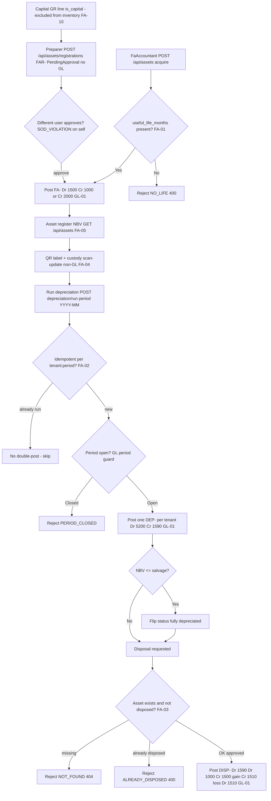

# Fixed Assets & Depreciation — Process Narrative

## 1. Document control

| Field | Value |
|---|---|
| Process ID | PN-09-FA |
| Process owner | `<<Controller / Fixed-Asset Accountant>>` |
| Approver | `<<CFO>>` |
| Version | **0.1 DRAFT** |
| Effective date | `<<effective-date>>` |
| Review cadence | Annual + on significant change |
| Related RCM controls | FA-01, FA-02, FA-03, FA-04, FA-05, FA-06, FA-07, FA-08, FA-09, FA-10, EXP-05, GL-01, REC-01; SoD R07, R05, R01 |
| Related policy | `compliance/policies/03-delegation-of-authority.md`, `compliance/policies/11-financial-close-policy.md` |

## 2. Purpose

To define and control the fixed-asset lifecycle — acquisition/capitalization, the asset register, periodic depreciation, custody/location tracking, and disposal — so that property, plant and equipment and accumulated depreciation are **valid, complete, accurate, properly cut off, and authorized**, that net book value (NBV) is fairly stated, and that every depreciation and disposal posting reaches the GL as a balanced journal entry.

## 3. Scope

**In scope:** asset categories and capitalization defaults (`/api/assets/categories`), asset acquisition (`POST /api/assets`, FA-), **capitalization of capital purchases from a goods receipt** (`GET /api/assets/registrations/eligible`, `POST /api/assets/registrations` FAR-, `…/approve|reject`, FA-10), the asset/NBV register (`GET /api/assets`), QR labelling and custody scan-update (`/api/assets/scan-update`, non-GL), the per-asset depreciation schedule (`GET /api/assets/:assetNo/schedule`), the monthly straight-line depreciation run (`POST /api/assets/depreciation/run`, DEP-), and disposal (`PATCH /api/assets/:assetNo/dispose`, DISP-).

**Also in scope — Enterprise Asset Management (EAM):** maintenance **work orders** (`/api/eam/work-orders`, corrective/preventive/inspection), **preventive-maintenance (PM) schedules** (`/api/eam/pm-schedules`, time- or meter-based) with an idempotent **due-generation sweep** (`/api/eam/pm/run`, also a daily scheduled job `eam_pm_generate`), and **meter readings** (`/api/eam/assets/:assetNo/meter`). Completing a work order with a vendor cost raises an **AP payable** for the maintenance spend.

**Out of scope:** the manual journal lifecycle and period close that the FA postings flow through (see `04-general-ledger-close.md`), procurement and AP settlement of the asset purchase / maintenance (see `02-procure-to-pay.md`), and VAT on acquisition/disposal (see `06-tax-compliance.md`).

## 4. References

- ISO 9001:2015 cl. 4.4 (process approach), cl. 7.1.3 (infrastructure), cl. 7.5 (documented information), cl. 9.1 (monitoring/measurement).
- `compliance/Oshinei_ERP_SOX_RCM_v1.xlsx` — FA-01..05, GL-01, REC-01.
- `compliance/policies/03-delegation-of-authority.md` (capital expenditure and disposal authority), `11-financial-close-policy.md` (depreciation cutoff).
- Code: `apps/api/src/modules/assets/assets.service.ts` + `assets.controller.ts`, `apps/api/src/modules/eam/eam.service.ts` + `eam.controller.ts` (EAM), `apps/api/src/modules/ledger/ledger.service.ts`, `apps/api/src/common/doc-number.service.ts`.

## 5. Definitions & abbreviations

| Term | Meaning |
|---|---|
| NBV | Net Book Value = cost − accumulated depreciation |
| Salvage | Estimated residual value; depreciation floors NBV at salvage |
| Useful life | `useful_life_months` over which cost less salvage is depreciated |
| FA- / DEP- / DISP- / MWO- | Document-number prefixes (acquisition / depreciation / disposal / maintenance work order) |
| Work order (WO) | A maintenance job against an asset: corrective, preventive or inspection; lifecycle open → in_progress → completed/cancelled |
| PM schedule | Preventive-maintenance plan per asset, time-based (`interval_days`) and/or meter-based (`meter_interval`) |
| Meter reading | A usage reading (`asset_meters`) that can trigger meter-based PM |
| Asset register | `GET /api/assets` — cost, accumulated depreciation, NBV totals |
| Scan-update | Location/holder change logged to `assetMovements` (custody audit, non-GL) |
| Idempotency key | `${tenant}:${period}` for a depreciation run |

GL accounts used: **1500** asset cost, **1590** accumulated depreciation (contra), **5200** depreciation expense, **1000** cash, **2000** AP, **1510** gain/loss on disposal, **5710** repairs & maintenance (EAM work-order cost), **2100** input VAT.

## 6. Roles & responsibilities (RACI)

Single-duty roles enforce SoD: the role that **initiates** an asset acquisition or disposal is never the role that **approves** it (rule **R07**); the role that **posts** the depreciation JE (`gl_post`) is separated from the role that **closes the period** (`gl_close`) (**R05**); and asset-master/category configuration access is administered separately (**R01**).

| Activity | FaAccountant | CustodianStaff | FinancialController | Controller | ExecutiveViewer / CFO |
|---|---|---|---|---|---|
| Maintain asset categories / capitalization defaults | **A/R** | I | C | A | I |
| Initiate asset acquisition (FA-) | **A/R** | I | I | C | I |
| Approve capitalization / capex | I | I | **A/R** | A | C |
| Custody scan-update (location/holder) | C | **A/R** | I | I | I |
| Run monthly depreciation (DEP-, `gl_post`) | **A/R** | I | I | A | I |
| Review depreciation run (idempotency + balanced JE) | R | I | **A/R** | A | I |
| Approve disposal (DISP-) | I | I | **A/R** | A | C |
| Review NBV register completeness | R | I | **A/R** | A | I |

## 7. Process narrative

1. **Category & capitalization defaults.** FaAccountant maintains asset categories via `POST /api/assets/categories` / `GET /api/assets/categories`; each category carries capitalization defaults (`useful_life_years = 5`, asset acct **1500**, accumulated acct **1590**, depreciation-expense acct **5200**). Category/master access is segregated from posting (**R01**, **FA-04**).
2. **Asset acquisition / capitalization (decision point).** FaAccountant initiates `POST /api/assets`. Useful life is mandatory — a request missing `useful_life_months` is rejected `NO_LIFE` (`400`). On capitalization a balanced acquisition JE (doc prefix **FA-**) posts **Dr 1500 Cr 1000** for a cash purchase or **Dr 1500 Cr 2000** for an on-account (AP) purchase; Σdebit = Σcredit by construction (**FA-01**, **GL-01**). Capex authorization is segregated from initiation (**R07**).
3. **Asset register / NBV.** `GET /api/assets` returns the register with cost, accumulated depreciation, and NBV totals. The register is the system of record for NBV completeness, reviewed by FinancialController against the GL 1500/1590 balances (**FA-05**, **REC-01**).
4. **QR labelling & custody (non-GL).** `GET /api/assets/:assetNo/qr` and `GET /api/assets/qr/labels` produce asset tags. Each tag encodes the universal payload `ASSET_ID:<no>|DESC:..|LOC:..`; when `WEB_BASE_URL` is configured the printed QR *image* instead encodes a deep link `<base>/q?d=<payload>` so a technician’s **phone camera opens the resolver page** (`/q`) that identifies the asset and links into the register. Custody capture works three ways off the same tag: the **in-app camera scanner** (browser-native `BarcodeDetector`), a **hardware wedge scanner**, or manual entry — all feed `POST /api/assets/scan-update`, which records a location/holder change to `assetMovements` as a custody audit trail. `scan-update` tolerates either carrier (raw payload or the `/q?d=` URL). This is **non-GL** (no posting) but supports existence/custody verification (**FA-04**).
5. **Depreciation schedule.** `GET /api/assets/:assetNo/schedule` exposes the per-asset straight-line schedule: monthly charge = (cost − salvage) / `useful_life_months`, with each period’s charge **capped at NBV − salvage** so NBV never falls below salvage.
6. **Monthly depreciation run (decision point).** FaAccountant runs `POST /api/assets/depreciation/run` for a period (`YYYY-MM`). The run is **idempotent per `${tenant}:${period}`** — a re-run for the same tenant/period does not double-post. Per-tenant it produces **ONE balanced entry per tenant per period** (doc prefix **DEP-**) so each shop trial balance ties: **Dr 5200 Cr 1590**. Fully-depreciated assets flip status when NBV ≤ salvage and stop accruing (**FA-02**, **GL-01**). The DEP- entry flows through the normal ledger period guard, so a **closed period is rejected** (`PERIOD_CLOSED`) — see `04-general-ledger-close.md`.
7. **Depreciation run review.** `GET /api/assets/depreciation/runs` lists prior runs. FinancialController reviews each run for idempotency (no duplicate period) and balanced posting before close (**FA-02**, **R05**).
8. **Disposal (decision point — system-enforced maker-checker).** A disposal is **requested** via `PATCH /api/assets/:assetNo/dispose`. A disposal of an already-disposed asset → `ALREADY_DISPOSED` (`400`); one already pending → `DISPOSAL_PENDING`; an unknown asset → `NOT_FOUND` (`404`). The balanced disposal JE (doc prefix **DISP-**) clears the asset: **Dr 1590** (remove accumulated) + **Dr 1000** (cash proceeds) + **Cr 1500** (remove cost). Gain/loss = proceeds − NBV: a **gain** posts **Cr 1510**, a **loss** posts **Dr 1510** (**FA-03**, **GL-01**). **Maker-checker (FA-09):** the request posts that JE as a **Draft** (excluded from balances) and flags the asset **`disposal_pending`** — the asset is **not** yet disposed and the register does **not** move; a disposal-pending asset is also **frozen from depreciation**. A **different** user must approve via `POST /api/assets/:assetNo/dispose/approve` before it is effective — only then does the JE post, the status become **disposed**, and any **revaluation surplus** recycle to retained earnings (**Dr 3200 / Cr 3100**, posted fresh on approval). A self-approve is rejected `SOD_VIOLATION` (binds **even Admin**, reusing the GL-05 ledger approval); `POST …/dispose/reject` voids the Draft and the asset stays in service. So one person can never write an asset off the books and pocket the proceeds — disposal authorization is segregated from custody and from the FA register owner (**FA-09**, **R07**).
9. **Maintenance (EAM).** A maintenance **work order** is raised against a registered asset (`POST /api/eam/work-orders`, **MWO-**; an unknown asset → `ASSET_NOT_FOUND`) and progresses through a guarded lifecycle **open → in_progress → completed/cancelled** (an out-of-order move → `BAD_TRANSITION`). On **completion with a vendor and an actual cost**, the maintenance spend is routed through **AP** (`createApTxn`, expense account **5710**): **Dr 5710** net **+ Dr 2100** input VAT **/ Cr 2000** gross — so the cost is a payable that settles through the normal AP flow and reconciles (in-house work with no vendor records the cost only). **PM schedules** (`POST /api/eam/pm-schedules`) define a preventive cadence (time `interval_days` and/or `meter_interval`, against `asset_meters` readings); the **due-generation sweep** (`POST /api/eam/pm/run`, cron-callable, and the daily scheduled job **`eam_pm_generate`** via the report scheduler) raises a preventive WO for every due schedule and rolls it forward. The sweep is **idempotent** — a schedule with an outstanding generated WO is skipped and its due date is advanced on generation (**FA-06**). A work order captures **labor and parts cost lines** (`POST /api/eam/work-orders/:woNo/lines`, `GET .../lines`): a labor line costs **hours × unit_cost**, a part line **quantity × unit_cost**, and the WO's **actual cost rolls up** from the sum of its lines (used in place of the estimate when the WO completes, so the AP posting reflects the real spend). Per-asset **reliability & cost KPIs** (`GET /api/eam/assets/:assetNo/reliability`) report corrective failures, preventive count, open WOs, total downtime hours, **MTBF** (mean time between corrective failures), and total maintenance spend — the inputs to maintenance budgeting and asset-replacement decisions (**FA-06**).
10. **Revaluation / impairment (decision point).** An asset's carrying amount is adjusted to a new value via `POST /api/assets/:assetNo/revalue` (doc prefix **REVAL-**). An **upward revaluation** (delta > 0) credits the **revaluation surplus in equity**: **Dr 1500 / Cr 3200**. A **downward revaluation (impairment)** (delta < 0) debits **impairment loss**: **Dr 5820 / Cr 1500**. The **gross 1500 moves by the delta** so the register stays tied to the GL (accumulated depreciation unchanged); the asset's `net_book_value` is set to the new value. A no-op revaluation (new value = current NBV) → `NO_CHANGE`; a disposed asset → `ALREADY_DISPOSED`. Every event is written to the `asset_revaluations` audit trail (`GET /api/assets/:assetNo/revaluations`). On **disposal** of a previously-revalued asset, any **revaluation surplus** held for it in equity is **recycled directly to retained earnings** (**Dr 3200 / Cr 3100**) — it does **not** pass through P&L — and the recycled amount is reported on the disposal response (**FA-07**, **GL-01**). **Maker-checker (FA-08, system-enforced):** because a fair-value adjustment moves equity/P&L on a subjective input, a revalue/impairment request posts its GL entry as a **Draft** (excluded from balances), sets the `asset_revaluations` record to **`PendingApproval`**, and **does not move the carrying value**. A **different** user must approve via `POST /api/assets/:assetNo/revalue/approve` before it becomes effective and the register is re-valued — a self-approve is rejected `SOD_VIOLATION` (binds **even Admin**), reusing the GL-05 ledger approval and re-checking the period is open. `POST …/revalue/reject` voids the Draft (status `Rejected`). **Only one** revaluation may be pending per asset, and the disposal surplus recycle counts only **approved** revaluations (**FA-08**, **R07**).

11. **Capitalization from a goods receipt (decision point — system-enforced maker-checker, FA-10).** Capital purchases enter the register via the procurement chain rather than a manual `POST /api/assets`. An item flagged `is_fixed_asset` on the item master — or a PO line flagged `is_capital` for a one-off — is, when received, **excluded from inventory capitalization (Dr 1200)** at goods receipt and instead recorded on the GR line as `is_capital` (**eligible**). A preparer lists the eligible lines (`GET /api/assets/registrations/eligible?gr_no=`) and **requests** capitalization (`POST /api/assets/registrations`, doc prefix **FAR-**), supplying the depreciation life (or a category that carries one); the cost defaults to the GR line value. The request posts **nothing** to the GL (`status='PendingApproval'`). A **different** user must approve via `POST /api/assets/registrations/:regNo/approve` before the **fixed_assets** row is created and the acquisition JE posts **effective**: **Dr 1500 / Cr 2000** (received on account). A self-approve is rejected `SOD_VIOLATION` (binds **even Admin**); `…/reject` records the rejection and the line becomes eligible to re-raise. The created asset carries **`source_gr_no` / `source_po_no`** for end-to-end **PR → PO → GR → FA** traceability, and a GR line cannot be capitalized twice (`ALREADY_REGISTERED`). So receiving goods and deciding what enters the asset register (and at what cost/life) are segregated duties (**FA-10**, **R07**, **R04**).

## 8. Process flow

**Swimlane description by role:** **FaAccountant** maintains categories, initiates acquisition, and runs monthly depreciation. **CustodianStaff** performs the QR scan-update for location/holder custody (non-GL). The **system** enforces the `NO_LIFE` guard, the per-tenant balanced posting, idempotency per tenant/period, the salvage cap, the fully-depreciated status flip, and routes every FA-/DEP-/DISP- entry through the ledger period guard. **FinancialController** approves capex and disposals, reviews each depreciation run and the NBV register tie-out. **Controller/CFO** owns capitalization defaults and final disposal authority.

## 9. Control matrix

| Step | Risk | Control | Type | RCM ID | Evidence / Record |
|---|---|---|---|---|---|
| 2 | Asset capitalized without depreciable life | `NO_LIFE` guard requires `useful_life_months` | Prev / Auto | FA-01 | `NO_LIFE` rejections; acquisition JE FA- |
| 11 | Capital purchase mis-capitalised or capitalised without independent review (fictitious/over-valued assets; capex/opex mis-classification) | **System-enforced maker-checker**: capital GR lines excluded from inventory (1200) and routed to the register; capitalization is a request (FAR-, no GL) a **different** user must approve before the asset + Dr 1500/Cr 2000 post (self-approve → `SOD_VIOLATION`, binds even Admin); source GR/PO stamped for traceability; a line cannot be capitalised twice (`ALREADY_REGISTERED`) | **Prev / Auto** | **FA-10**, R07, R04 | Capitalization approval log + SoD test |
| 2 | Acquisition unposted / unbalanced | Balanced FA- JE Dr 1500 Cr 1000/2000 | Prev / Auto | FA-01, GL-01 | Acquisition JE tie-out |
| 6 | Depreciation double-posted on re-run | Idempotency per `${tenant}:${period}` | Prev / Auto | FA-02 | Re-run test; `depreciation/runs` |
| 6 | Per-tenant TB does not tie | One balanced DEP- entry per tenant per period | Prev / Auto | FA-02, GL-01 | Per-tenant TB tie-out |
| 6 | Asset depreciated below salvage | Monthly charge capped at NBV − salvage; status flip | Prev / Auto | FA-02 | Schedule export; status log |
| 6 | Depreciation posted to closed period | Ledger period guard rejects `PERIOD_CLOSED` | Prev / Auto | FA-02, GL-01 | Close-lock test |
| 8 | Disposal mis-stated / double disposal | `ALREADY_DISPOSED`/`DISPOSAL_PENDING`/`NOT_FOUND` guard; balanced DISP- with gain/loss | Prev / Auto | FA-03, GL-01 | Disposal JE; rejection tests |
| 8 | Asset written off the books without independent review (asset-stripping / theft of proceeds) | **System-enforced maker-checker**: request posts a Draft JE + flags `disposal_pending` (not disposed, frozen from depreciation); a different user must approve before it is effective (self-approve → `SOD_VIOLATION`, binds even Admin); one pending per asset; surplus recycle posted only on approval | **Prev / Auto** | **FA-09**, R07 | Disposal approval log + SoD test |
| 4 | Asset existence/custody unverified | QR + scan-update to `assetMovements` custody audit | Det / Hybrid | FA-04 | `assetMovements` log; physical count |
| 3 | NBV register incomplete vs GL | NBV register completeness review vs 1500/1590 | Det / Hybrid | FA-05, REC-01 | Register-to-GL reconciliation |
| 2,8 | Self-initiated capex / disposal | SoD: initiate vs approve segregated | Prev / Manual | R07 | SoD conflict report |
| 6 | Poster also closes period | SoD: `gl_post` vs `gl_close` segregated | Prev / Manual | R05 | SoD conflict report |
| 1 | Unauthorized category/master change | Asset-master access administered separately | Prev / Manual | R01, FA-04 | Access review |
| 9 | Maintenance spend not captured / not payable / not reconciled | WO completion routes cost to AP (Dr 5710 / Cr 2000); guarded WO lifecycle | Prev / Auto | EXP-05, GL-01 | WO→AP tie-out; `BAD_TRANSITION` test; basics harness |
| 9 | Preventive maintenance missed | PM schedule + idempotent due-generation sweep (cron / daily `eam_pm_generate`) | Det / Auto | FA-06 | Generated WO log; sweep run log |
| 10 | Carrying amount not adjusted for revaluation/impairment | Revalue up→3200 surplus / down→5820 impairment; gross 1500 moves by delta; `NO_CHANGE` guard; audit trail; disposal recycles surplus 3200→3100 | Det / Auto | FA-07, GL-01 | Revaluation log; disposal recycle JE |
| 10 | Fair-value revaluation/impairment posted without independent review (earnings / equity management) | **System-enforced maker-checker**: request posts a Draft JE + `PendingApproval`, carrying value deferred; a different user must approve (self-approve → `SOD_VIOLATION`, binds even Admin); one pending per asset; disposal recycle counts only approved | **Prev / Auto** | **FA-08**, R07 | Revaluation approval log + SoD test |

## 10. Inputs & outputs

**Inputs:** asset categories + capitalization defaults, acquisition request (cost, salvage, useful life, cash/AP), custody scan events, depreciation period (`YYYY-MM`), disposal request (proceeds).
**Outputs:** capitalized asset + acquisition JE (FA-), asset/NBV register, QR labels, `assetMovements` custody trail, per-tenant monthly depreciation JE (DEP-), disposal JE with gain/loss (DISP-).

## 11. Records & retention

| Record | Store | Retention |
|---|---|---|
| Asset register (cost, accum dep, NBV) | Application DB (RLS-scoped) | `<<7 years / per Thai law>>` |
| Acquisition / depreciation / disposal JEs | Ledger | `<<7 years>>` |
| Depreciation run log | `depreciation_runs` | `<<7 years>>` |
| Custody movements | `assetMovements` (append-only) | `<<7 years>>` |
| Asset-master / category changes | `audit_log` (immutable) | `<<7 years>>` |

## 12. KPIs / metrics

- Acquisitions rejected for `NO_LIFE` (data-quality signal).
- Depreciation re-run double-posts detected (target: 0; idempotency holds).
- Per-tenant TB tie-out exceptions after each DEP- run (target: 0).
- NBV register-to-GL (1500/1590) reconciliation differences (target: 0).
- Disposals processed with correctly computed gain/loss; `ALREADY_DISPOSED` attempts.

## 13. Exception & error handling

| Error code | Trigger | Handling |
|---|---|---|
| `NO_LIFE` (400) | Acquisition without `useful_life_months` | Originator supplies life; resubmit |
| `ALREADY_DISPOSED` (400) | Dispose an asset already disposed | Verify asset status; no action |
| `NOT_FOUND` (404) | Dispose unknown `assetNo` | Verify asset number |
| `PERIOD_CLOSED` | DEP-/disposal JE into a closed period | Re-open per close policy (authorized) or post to open period |
| `SOD_VIOLATION` / SoD conflict | Conflicting initiate/approve or post/close duties | AccessAdmin remediates (see `08-itgc.md`) |

## 14. Revision history

| Version | Date | Author | Summary |
|---|---|---|---|
| 0.1 DRAFT | 2026-06-22 | `<<author>>` | Initial draft. |
| 0.2 DRAFT | 2026-06-24 | `<<author>>` | Added **Enterprise Asset Management (EAM)** §7.9: maintenance work orders (cost → AP, acct 5710), preventive-maintenance schedules + idempotent due-generation sweep (cron / daily `eam_pm_generate`), meter readings; control **FA-06**. Verified by the `basics` harness. |
| 0.3 DRAFT | 2026-06-25 | `<<author>>` | EAM depth in step 9: work-order **labor/parts cost lines** (`/work-orders/:woNo/lines`) with actual-cost roll-up driving the AP posting, and per-asset **reliability & cost KPIs** (`/assets/:assetNo/reliability` — corrective failures, MTBF, downtime, maintenance spend); control **FA-06**. Verified by the `basics` harness. |
| 0.4 DRAFT | 2026-06-25 | `<<author>>` | Added step 10 — **revaluation / impairment** (`POST /api/assets/:assetNo/revalue`): upward → revaluation surplus (Cr 3200), downward → impairment loss (Dr 5820); gross 1500 moves by the delta; `NO_CHANGE` guard; `asset_revaluations` audit trail. New control **FA-07**. Verified by the `basics` harness. |
| 0.5 DRAFT | 2026-06-25 | `<<author>>` | Step 10 — on **disposal** of a revalued asset the **revaluation surplus is recycled to retained earnings** (Dr 3200 / Cr 3100), reported on the disposal response (**FA-07**). Verified by the `basics` harness. |
| 0.6 DRAFT | 2026-06-25 | `<<author>>` | **EAM management UI surfaced** — new screen `/eam` (ERP nav → การผลิต) drives the already-documented EAM endpoints: work orders + status lifecycle, labor/parts cost lines, PM schedules + "run-due" sweep, per-asset reliability KPIs and meter readings. UI-only addition (no process/GL/control change); the control remains **FA-06**. See user manual `06-general-ledger.md` §7 Asset maintenance (EAM) and UAT `05-general-ledger-close-uat.md` (§EAM screen). |
| 0.8 | 2026-06-26 | Platform | **FA-09 — asset disposal maker-checker (SoD), system-enforced.** Step 8: a disposal is now **requested** (`PATCH …/dispose`) — posts the DISP- JE as a **Draft** (excluded from balances) + flags the asset **`disposal_pending`** (not disposed; frozen from depreciation); a **different** user must approve (`POST …/dispose/approve`) before it is effective (status → disposed, revaluation surplus recycled fresh on approval) — self-approve → `SOD_VIOLATION` (binds even Admin), reusing the GL-05 approval; `…/dispose/reject` voids the Draft and the asset stays in service. One disposal pending per asset (`DISPOSAL_PENDING`). Migration `0135` adds `fixed_assets.disposal_pending/disposal_requested_by/disposal_approved_by`. New RCM control **FA-09** (RCM now 82); control matrix gains a step-8 authorization row. New `/assets` disposal panel (request + approve/reject + disposed state). ToE: `basics` + `worldclass` (request→Draft→self-approve 403→approve→disposed) + `compliance` (FA-09). Manual `06-general-ledger.md` + UAT `05-general-ledger-close-uat.md` updated. |
| 0.7 | 2026-06-26 | Platform | **FA-08 — asset revaluation/impairment maker-checker (SoD), system-enforced.** Step 10: a revalue/impairment request now posts its GL entry as a **Draft** (excluded from balances) + `asset_revaluations.status='PendingApproval'` and **defers the carrying-value change**; a **different** user must approve (`POST /api/assets/:assetNo/revalue/approve`) before it is effective — self-approve → `SOD_VIOLATION` (binds even Admin), reusing the GL-05 approval; `/reject` voids the Draft. One revaluation pending per asset; the disposal surplus recycle counts only **approved** revaluations. Migration `0134` adds `asset_revaluations.status/approved_by/approved_at`. New RCM control **FA-08** (RCM now 81); control matrix gains step-10 rows (FA-07 valuation + FA-08 authorization). New `/assets` revaluation panel (request + approve/reject + history). ToE: `basics` (request→Draft-excluded→self-approve 403→approve→3200; impairment; disposal recycle) + `compliance` (FA-08). Manual `06-general-ledger.md` + UAT `05-general-ledger-close-uat.md` updated. |
| 0.9 | 2026-06-26 | Platform | **FA-10 — Procure-to-Capitalize: register a fixed asset from a goods receipt (SoD maker-checker).** New step 11: an item flagged `is_fixed_asset` (or a PO line flagged `is_capital`) is **excluded from inventory capitalization (Dr 1200)** at goods receipt and marked `is_capital` on the GR line (eligible). A preparer lists eligible lines (`GET /api/assets/registrations/eligible`) and **requests** capitalization (`POST /api/assets/registrations`, **FAR-**, no GL); a **different** user must approve (`…/approve`) before the asset + acquisition JE (**Dr 1500 / Cr 2000**) post effective — self-approve → `SOD_VIOLATION` (binds even Admin); `…/reject` re-opens the line; a line cannot be capitalised twice (`ALREADY_REGISTERED`). The asset carries `source_gr_no/source_po_no` for **PR→PO→GR→FA** traceability. Migration `0137` adds `asset_registration_requests`, `items.is_fixed_asset/default_asset_category_id`, `po_items.is_capital`, `gr_items.is_capital`, `fixed_assets.source_gr_no/source_po_no`. New RCM control **FA-10** (RCM now 86); control matrix gains a step-11 row; flowchart gains the capital-GR→register branch. New `/assets` tab "ตั้งทรัพย์สินจาก GR" (eligible lines + request + approve/reject queue); PO form gains a capital flag. ToE: `basics` (PR→PO→GR→register→self-approve 403→approve→Dr 1500/Cr 2000→traceability→ALREADY_REGISTERED) + `compliance` (FA-10). Also updated: `02-procure-to-pay.md`, manual `03-procurement.md` + `06-general-ledger.md`, UAT `03-procure-to-pay-uat.md` + traceability matrix. |
| 1.0 | 2026-07-05 | Platform | **QR custody capture — camera scanning + phone deep-link (no control change).** Step 4: asset tags now support real-world scanning. A **browser-native camera scanner** (`BarcodeDetector`, in `/assets` → QR tab) decodes a tag and pre-fills the scan-update code; a **hardware wedge scanner** and manual entry remain fallbacks. When `WEB_BASE_URL` is set, the printed QR image encodes a deep link `<base>/q?d=<payload>` so a phone’s native camera opens the new public resolver page **`/q`**, which identifies the asset via `GET /api/scan/sessions/resolve` and links into the register. `scan-update` and `resolve` accept **either carrier** (raw `ASSET_ID:…` payload or the `/q?d=` URL) via the shared `parseQrPayload` unwrapper. Capture mechanism only — **no GL, no new/changed control** (custody verification remains **FA-04**); the RCM is unchanged (still 169). ToE: `module-qr` harness (URL-unwrap, `scanCodeId` fallback, url-wrapped `scan-update`, `resolve` asset/item/unknown). Also updated: `03-inventory-cogs.md`, manual `04-warehouse-inventory.md` + `06-general-ledger.md`, UAT `04-inventory-uat.md` + traceability matrix. |
