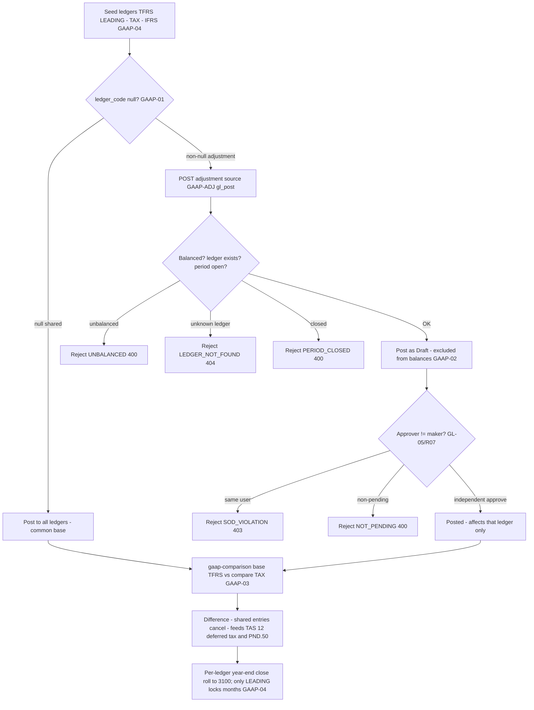

# Multi-Ledger & GAAP (TFRS / TAX / IFRS) — Process Narrative

## 1. Document control

| Field | Value |
|---|---|
| Process ID | PN-10-GAAP |
| Process owner | `<<Controller>>` |
| Approver | `<<CFO>>` |
| Version | **0.1 DRAFT** |
| Effective date | `<<effective-date>>` |
| Review cadence | Annual + on significant change |
| Related RCM controls | GAAP-01, GAAP-02, GAAP-03, GAAP-04, GL-01, GL-02, GL-05; SoD R05, R07 |
| Related policy | `compliance/policies/11-financial-close-policy.md`, `compliance/policies/13-segregation-of-duties-policy.md` |

## 2. Purpose

To control the parallel-ledger architecture (TFRS, TAX, IFRS) so that GAAP-divergent adjustments are **valid, balanced, independently approved, and properly cut off**, that shared transactions post once to all ledgers while ledger-specific adjustments are isolated, and that the book-tax difference is reliably measured to feed deferred tax (TAS 12) and the ภ.ง.ด.50 / PND.50 reconciliation.

## 3. Scope

**In scope:** the seeded parallel ledgers — **TFRS** (LEADING, statutory, default for reports), **TAX** (Revenue Department basis), **IFRS** (group consolidation); shared vs ledger-specific journals; GAAP adjustment posting with maker-checker (`POST /api/ledger/ledgers/:code/adjustment` → approve via `POST /api/ledger/journal/:entryNo/approve`); the book-tax difference report (`GET /api/ledger/gaap-comparison`); and per-ledger year-end close.

**Out of scope:** the general manual-JE lifecycle and period mechanics shared with all cycles (see `04-general-ledger-close.md`), the PND.50 filing workflow itself (see `06-tax-compliance.md`), and group consolidation/elimination across entities (see `11-intercompany-consolidation.md`).

## 4. References

- ISO 9001:2015 cl. 4.4 (process approach), cl. 7.5 (documented information), cl. 8.5.1 (controlled provision), cl. 9.1 (monitoring/measurement).
- `compliance/Oshinei_ERP_SOX_RCM_v1.xlsx` — GAAP-01..04, GL-01, GL-02, GL-05.
- `compliance/policies/11-financial-close-policy.md` (close calendar), `13-segregation-of-duties-policy.md` (R05, R07).
- Code: `apps/api/src/modules/ledger/ledger.service.ts` + `ledger.controller.ts` (parallel-ledger seed, adjustment, approve, `gaap-comparison`), `apps/api/src/common/doc-number.service.ts`.

## 5. Definitions & abbreviations

| Term | Meaning |
|---|---|
| TFRS | Thai Financial Reporting Standards — LEADING/statutory ledger; default for reports |
| TAX | Revenue Department (tax) basis ledger |
| IFRS | International standards ledger for group consolidation |
| LEADING | The single ledger whose close locks the fiscal months |
| Shared journal | `ledger_code = NULL` — posts to **all** ledgers |
| Adjustment | Non-null `ledger_code` — affects **that ledger only** (`source` defaults `GAAP-ADJ`) |
| Maker-checker | Preparer of an adjustment may never approve it (GL-05) |
| Book-tax difference | TFRS vs TAX P&L divergence driving deferred tax (TAS 12) |

GL accounts referenced: **3100** Retained Earnings (per-ledger year-end result). Deferred tax arises from the account interplay between the TFRS and TAX ledgers.

## 6. Roles & responsibilities (RACI)

SoD: the **preparer** of a GAAP adjustment (`gl_post`) is never its **approver** — a self-approval is rejected `SOD_VIOLATION` (**GL-05**, **R07**); the role that **posts** is separated from the role that **closes** the period (`gl_close`) (**R05**); the book-tax reconciliation is **prepared** and **reviewed** by different people.

| Activity | GlAccountant | TaxAccountant | FinancialController | Controller | ExecutiveViewer / CFO |
|---|---|---|---|---|---|
| Post GAAP adjustment to one ledger (`gl_post`) | **A/R** | R | I | A | I |
| Approve / reject adjustment (≠ preparer, `gl_close`) | I | I | **A/R** | A | C |
| Run book-tax comparison (`gaap-comparison`) | R | **A/R** | C | A | I |
| Review book-tax difference → deferred tax (TAS 12) | C | R | **A/R** | A | C |
| Per-ledger year-end close (`exec`) | I | I | C | **A/R** | A |
| Maintain ledger configuration | I | I | C | **A/R** | I |

## 7. Process narrative

1. **Parallel-ledger seed.** At startup three ledgers are seeded: **TFRS** (LEADING/statutory, the default basis for reports), **TAX** (Revenue Department basis), and **IFRS** (group consolidation). The LEADING ledger is the one whose close locks the fiscal months (**GAAP-04**).
2. **Shared vs ledger-specific posting (decision point).** A journal with `ledger_code = NULL` is **SHARED** and applies to all ledgers; a non-null `ledger_code` is an **adjustment** affecting that ledger only. Source-cycle postings are shared so the three ledgers agree on the common base, and only deliberate GAAP differences are booked as adjustments (**GAAP-01**).
3. **GAAP adjustment posting.** A GAAP-divergent entry is posted via `POST /api/ledger/ledgers/:code/adjustment` (permission `gl_post`); `source` defaults to **GAAP-ADJ**. The entry must be balanced — an unbalanced payload → `UNBALANCED` (`400`); an unknown ledger → `LEDGER_NOT_FOUND` (`404`); a closed period → `PERIOD_CLOSED` (`400`) (**GL-01**, **GL-02**).
4. **Maker-checker on adjustments (the key control).** An adjustment posted with `pendingApproval = true` lands as **Draft** and is **excluded from balances** until a **different** user approves it via `POST /api/ledger/journal/:entryNo/approve`. A self-approval (maker = checker) → `SOD_VIOLATION` (`403`); approving a non-Draft entry → `NOT_PENDING` (`400`). Only after independent approval does the adjustment affect the ledger’s balances (**GAAP-02**, **GL-05**, **R07**).
5. **Book-tax comparison (decision point).** `GET /api/ledger/gaap-comparison` compares two ledgers’ P&L over a window — base defaults to **TFRS**, compare to **TAX**. Output: `base_net_income`, `compare_net_income`, `difference`, and per-account lines with a non-zero difference. Because **shared entries cancel out**, only ledger-specific adjustments drive the reported difference, so the report is a clean measure of book-tax divergence (**GAAP-03**).
6. **Deferred tax / PND.50 feed.** The book-tax difference feeds deferred-tax measurement under **TAS 12** (the account interplay between the TFRS and TAX ledgers) and the **ภ.ง.ด.50 / PND.50** reconciliation; TaxAccountant prepares and FinancialController reviews this (**GAAP-03**, see `06-tax-compliance.md`).
7. **Per-ledger year-end close.** Year-end close runs **per ledger** — each GAAP ledger rolls its own result into account **3100** Retained Earnings. Only the **LEADING** (TFRS) close **locks the months**; the other ledgers close independently without re-locking the fiscal calendar (**GAAP-04**, **R05**).

## 8. Process flow

**Swimlane description by role:** **GlAccountant** posts GAAP adjustments to a single ledger (Draft). The **system** routes shared (`ledger_code = NULL`) entries to all ledgers, isolates adjustments to one ledger, enforces balance/ledger/period guards, holds adjustments out of balances until independently approved, blocks self-approval (`SOD_VIOLATION`), cancels shared entries in the comparison, and runs per-ledger close rolling to 3100. **FinancialController** independently approves adjustments and reviews the book-tax difference. **TaxAccountant** runs `gaap-comparison` and prepares the deferred-tax/PND.50 feed. **Controller/CFO** owns per-ledger year-end close and ledger configuration.

## 9. Control matrix

| Step | Risk | Control | Type | RCM ID | Evidence / Record |
|---|---|---|---|---|---|
| 2 | Adjustment leaks across all ledgers | Shared (`NULL`) vs ledger-specific routing | Prev / Auto | GAAP-01 | Ledger-scope test; posting trace |
| 3 | Unbalanced / wrong-ledger / late adjustment | Balanced JE + `LEDGER_NOT_FOUND`/`PERIOD_CLOSED` guards | Prev / Auto | GL-01, GL-02 | Rejection tests |
| 4 | Adjustment without independent review | Maker-checker; Draft excluded from balances; maker ≠ checker | Prev / Hybrid | GAAP-02, GL-05 | Approval trail; `SOD_VIOLATION` test |
| 5 | Book-tax difference mis-measured | Comparison cancels shared entries; only adjustments drive difference | Det / Auto | GAAP-03 | `gaap-comparison` output; reconciliation |
| 6 | Deferred tax / PND.50 not reconciled | Book-tax review feeding TAS 12 + PND.50 | Det / Hybrid | GAAP-03 | Deferred-tax workpaper; PND.50 rec |
| 7 | Wrong-ledger close / improper RE roll / month re-lock | Per-ledger close to 3100; only LEADING locks months | Prev / Hybrid | GAAP-04 | Close package; lock log |
| 4 | Preparer approves own adjustment | SoD: initiate vs approve segregated | Prev / Manual | R07, GL-05 | SoD conflict report |
| 7 | Poster also closes period | SoD: `gl_post` vs `gl_close` segregated | Prev / Manual | R05 | SoD conflict report |

## 10. Inputs & outputs

**Inputs:** seeded ledger definitions (TFRS/TAX/IFRS), source-cycle shared postings, GAAP adjustment requests, comparison window, ownership of deferred-tax assumptions.
**Outputs:** shared journals across all ledgers, approved ledger-specific adjustments (GAAP-ADJ), book-tax comparison report (per-account differences), deferred-tax / PND.50 reconciliation input, per-ledger year-end close to 3100.

## 11. Records & retention

| Record | Store | Retention |
|---|---|---|
| Ledger definitions (TFRS/TAX/IFRS) | Application DB (RLS-scoped) | `<<7 years / per Thai law>>` |
| Shared journals + ledger-specific adjustments | Ledger | `<<7 years>>` |
| Adjustment approval / rejection trail | `audit_log`, memo annotations | `<<7 years>>` |
| Book-tax comparison runs | Reports / exports | `<<7 years>>` |
| Per-ledger close records | `fiscal_periods` | `<<7 years>>` |

## 12. KPIs / metrics

- Adjustments posted: % approved by a distinct checker (target 100%); count of `SOD_VIOLATION`.
- Adjustments rejected for `UNBALANCED` / `LEDGER_NOT_FOUND` / `PERIOD_CLOSED`.
- Book-tax difference per period vs deferred-tax expectation (variance investigated).
- PND.50 reconciliation completeness and on-time sign-off.
- Per-ledger closes completed and reconciled before LEADING lock.

## 13. Exception & error handling

| Error code | Trigger | Handling |
|---|---|---|
| `UNBALANCED` (400) | Adjustment Σdebit ≠ Σcredit | Correct and resubmit |
| `LEDGER_NOT_FOUND` (404) | Adjustment to an unknown ledger code | Verify ledger code (TFRS/TAX/IFRS) |
| `PERIOD_CLOSED` (400) | Post/approve into a closed period | Re-open per close policy (authorized) or post to open period |
| `SOD_VIOLATION` (403) | Maker approves own adjustment | Route to independent approver (always, incl. Admin) |
| `NOT_PENDING` (400) | Approve/reject a non-Draft entry | Verify entry state |

## 14. Revision history

| Version | Date | Author | Summary |
|---|---|---|---|
| 0.1 DRAFT | 2026-06-22 | `<<author>>` | Initial draft. |
