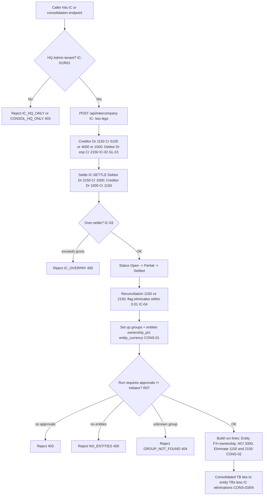

# Intercompany & Consolidation — Process Narrative

## 1. Document control

| Field | Value |
|---|---|
| Process ID | PN-11-IC |
| Process owner | `<<Group Controller>>` |
| Approver | `<<CFO>>` |
| Version | **0.1 DRAFT** |
| Effective date | `<<effective-date>>` |
| Review cadence | Each period close + annual |
| Related RCM controls | IC-01, IC-02, IC-03, IC-04, CONS-01, CONS-02, CONS-03, CONS-04, CON-03 (elimination integrity / run→post maker-checker), CON-04 (segment reporting), CON-05 (dual-rate translation / CTA-OCI / consolidated SCF), FX-04, GL-01, REC-03; SoD R01, R07, R05 |
| Related policy | `compliance/policies/03-delegation-of-authority.md`, `compliance/policies/07-access-control-policy.md`, `compliance/policies/11-financial-close-policy.md` |

## 2. Purpose

To control intercompany (IC) transactions and group consolidation so that IC balances are **valid, complete, accurate, and reciprocally agreed**, that subsidiaries cannot self-post IC, that IC due-from / due-to balances eliminate on consolidation, and that the consolidated trial balance ties to the underlying entity trial balances less eliminations — with non-controlling interest (NCI) and FX translation correctly applied.

## 3. Scope

**In scope:** HQ-only IC posting (`POST /api/intercompany`, IC-), IC settlement (`/api/intercompany/:icNo/settle`, IC-SETTLE), IC reconciliation/elimination (`GET /api/intercompany/reconciliation`), consolidation group and entity setup (`/api/consolidation/groups`, `.../entities`), and the consolidation run (`POST /api/consolidation/groups/:groupId/run`) that builds entity, NCI, and elimination lines.

**Out of scope:** the per-ledger GAAP basis and book-tax differences feeding consolidation (see `10-multi-ledger-gaap.md`), the underlying source-cycle and manual JE postings (see `04-general-ledger-close.md`), and tenant access provisioning mechanics (see `08-itgc.md`).

## 4. References

- ISO 9001:2015 cl. 4.4 (process approach), cl. 5.3 (roles/authorities), cl. 7.5 (documented information), cl. 9.1 (monitoring/measurement).
- `compliance/Oshinei_ERP_SOX_RCM_v1.xlsx` — IC-01..04, CONS-01..04, GL-01, REC-03.
- `compliance/policies/03-delegation-of-authority.md`, `07-access-control-policy.md` (HQ-only authority), `11-financial-close-policy.md` (consolidation cutoff).
- Code: `apps/api/src/modules/intercompany/intercompany.service.ts` + `intercompany.controller.ts`, `apps/api/src/modules/consolidation/consolidation.service.ts` + `consolidation.controller.ts`, `apps/api/src/modules/ledger/ledger.service.ts`.

## 5. Definitions & abbreviations

| Term | Meaning |
|---|---|
| IC | Intercompany transaction (creditor/debtor legs across tenants) |
| HQ-only | Restricted to the HQ Admin tenant; subsidiaries cannot self-post |
| Due-From / Due-To | Intercompany receivable (1150) / payable (2150) |
| NCI | Non-Controlling Interest (account 3300), for entities < 100% owned |
| CTA / OCI | Cumulative Translation Adjustment — the average-rate-P&L vs closing-rate-BS difference, parked in the OCI translation reserve (account 3400) |
| Average / Closing rate | Period-average FX rate (translates the P&L) / period-end closing rate (translates the balance sheet) |
| Elimination | Removal of reciprocal IC balances on consolidation |
| IC- / IC-SETTLE | Document-number prefixes (IC creation / settlement) |
| Consolidation run line | Row in `consolidation_run_lines` (entity / NCI / elimination) |

GL accounts referenced: **1150** Due-From (IC receivable), **2150** Due-To (IC payable), **1000** cash, **3300** NCI, recovery accounts **5100** (shared-cost), **4000** (transfer), **1000** (loan).

## 6. Roles & responsibilities (RACI)

SoD: IC posting and consolidation runs are **HQ-only (Admin)** — subsidiaries cannot self-post IC, enforced by `IC_HQ_ONLY` / `CONSOL_HQ_ONLY` (access control, **R01**); the role that **initiates** a consolidation run is separated from the role that **approves** it — the run requires the `approvals` permission (maker-checker, **R07**); period-affecting postings keep `gl_post` separated from `gl_close` (**R05**).

| Activity | HqIcAccountant | GroupController | FinancialController | ExecutiveViewer / CFO |
|---|---|---|---|---|
| Post IC transaction (HQ-only, IC-) | **A/R** | A | C | I |
| Settle IC (IC-SETTLE) | **A/R** | A | C | I |
| Run IC reconciliation / elimination report | R | **A/R** | C | I |
| Set up consolidation groups / entities (`exec`) | I | **A/R** | C | A |
| Initiate consolidation run (`exec`) | R | **A/R** | C | I |
| Approve consolidation run (`approvals`, ≠ initiator) | I | C | **A/R** | A |
| Review consolidated-TB tie-out | I | R | **A/R** | A |

## 7. Process narrative

1. **HQ-only access gate (access control / SoD).** All IC and consolidation endpoints are restricted to the HQ Admin tenant: a non-HQ caller is rejected with `ForbiddenException` `IC_HQ_ONLY` (intercompany) or `CONSOL_HQ_ONLY` (consolidation). This prevents subsidiaries from self-posting IC and is the primary segregation/access control (**IC-01**, **R01**).
2. **IC transaction posting (decision point).** HqIcAccountant creates an IC txn via `POST /api/intercompany` (`from_tenant` → `to_tenant`; doc prefix **IC-**). Two legs post: the **creditor** books **Dr 1150** Due-From / **Cr** recovery account — **Cr 5100** for a shared-cost recharge, **Cr 4000** for a transfer, **Cr 1000** for a loan; the **debtor** books **Dr** expense account / **Cr 2150** Due-To. Posting is **idempotent per `(tenant, IC, sourceRef)`** including the `:TO` suffix, so neither leg double-books (**IC-02**, **GL-01**).
3. **IC settlement (decision point).** `POST /api/intercompany/:icNo/settle` (doc prefix **IC-SETTLE**) settles the balance: the **debtor** books **Dr 2150 Cr 1000**, the **creditor** books **Dr 1000 Cr 1150**. An over-settlement is blocked by the over-settle guard → `IC_OVERPAY` (`400`); an unknown IC → `NOT_FOUND` (`404`). Status transitions **Open → Partial → Settled** as cumulative settlement reaches the gross (**IC-03**).
4. **IC reconciliation / elimination report.** `GET /api/intercompany/reconciliation` reports GL **1150** / **2150** balances by tenant plus pair-wise gross / settled / outstanding, and flags `eliminates: true` when Due-From ≈ Due-To within **0.01**. This is the reciprocal-agreement and elimination-readiness control before consolidation (**IC-04**, **REC-03**).
5. **Consolidation group & entity setup.** GroupController creates a group via `POST /api/consolidation/groups` and adds entities via `POST /api/consolidation/groups/:groupId/entities` with `ownership_pct` and `entity_currency` (also `GET` / `DELETE`). Group/entity master setup is HQ-only and gated by `exec` (**CONS-01**).
6. **Consolidation run (decision point, maker-checker).** `POST /api/consolidation/groups/:groupId/run` (period `YYYY-MM`) requires the **`approvals`** permission, enforcing initiate-vs-approve separation (**R07**); an unknown group → `GROUP_NOT_FOUND` (`404`); a group with no entities → `NO_ENTITIES` (`400`). The run builds `consolidation_run_lines` (**CONS-02**):
   - **Entity lines** — each entity’s net GL by account, FX-translated to base currency at the latest rate ≤ period end, ownership-weighted.
   - **NCI lines** — account **3300**, NCI% × net income for entities owned < 100%.
   - **Elimination lines** — for IC where both tenants are in the group, eliminate **1150** / **2150**.
7. **Consolidated-TB tie-out.** GroupController/FinancialController reviews the run via `GET /api/consolidation/groups/:groupId/runs` and `GET /api/consolidation/runs/:runId/lines`: the consolidated TB must tie to the sum of entity TBs **less** IC eliminations. Any residual unmatched IC (not flagged `eliminates`) is investigated before sign-off (**CONS-03**, **CONS-04**, **REC-03**).
8. **Elimination integrity (WS3.3, RCM `CON-03`).** The run now **asserts the consolidated TB still balances**: every line is a signed net (debit − credit), so each entity's lines and each reciprocal elimination pair (**−amt on 1150**, **+amt on 2150**) must net to **~0** (the NCI presentation reclass on 3300 is excluded from the check). If the residual TB net or the elimination net is not ~0 the run throws **`CONSOL_UNBALANCED`** and is **rolled back** (no half-finished Draft) — eliminations cannot silently leave the group books unbalanced. Eliminations live at the **group layer** (`consolidation_run_lines`), and are **not** pushed into any operating entity's GL. Configurable elimination rules are held in `consol_elimination_rules` (`POST /api/consolidation/rules`, `GET /api/consolidation/rules?group_id=`).
9. **Consolidation run → post maker-checker (WS3.3, RCM `CON-03`).** A balanced run is finalised (`status='Final'`, `balanced=true`). A **different** user then freezes it as the official group result via `POST /api/consolidation/runs/:runId/post` (`approvals`): the consolidated TB becomes the period's group result. Self-post (poster = runner) → **`SELF_POST`** (403); a re-run of a **Posted** period → **`ALREADY_POSTED`** (400); posting an unknown run → **`CONSOL_RUN_NOT_FOUND`** (404). One run per `(group, period)` — a fresh recompute supersedes a prior Draft/Final but never a Posted run.
10. **Segment reporting (WS3.3, RCM `CON-04`, IFRS 8).** `GET /api/consolidation/segment-report?period=&dimension=` produces P&L (revenue / expense / net) grouped by reportable segment, sourced from the WS1.3 dimension columns on `journal_lines` (`branch_id` / `project_id` / `department_id`) and mapped through configurable `segment_definitions` (`POST /api/consolidation/segments`, `GET /api/consolidation/segments`); `member_keys` map dimension values into a segment, and unmapped values surface as their own/`Unassigned` bucket. HQ/Admin-only, gated `exec`.
11. **Dual-rate FX translation + CTA/OCI reserve (FIN-5, RCM `CON-05`, IAS 21 / TAS 21).** When a member entity's `entity_currency` is not the group base (THB), `runConsolidation` translates that entity's books at **two** rates: the **P&L** (revenue **4xxx** / expense **5xxx**) at the **period AVERAGE** rate (mean of the period-month's Approved rates) and the **balance sheet** at the **CLOSING** rate (latest Approved rate ≤ period end). Because the two rates differ, the entity's translated trial balance no longer nets to zero; the residual is the **cumulative translation adjustment (CTA)**, parked in a **CTA / OCI translation-reserve** equity line — account **3400**, `line_type='FX_CTA'` — which restores balance per entity (a base-currency THB entity produces **no** CTA). Each run line records the `fx_rate` and `rate_type` (`average` / `closing` / `cta`) used, so the translation is fully auditable; CON-03's balanced-TB assertion now covers **Entity + FX_CTA** (only the single-sided NCI reclass is excluded), and the run response carries `cta_total`. Reads the same **Approved-only** rates as FX-04.
12. **Consolidated statement of cash flows (FIN-5, RCM `CON-05`, IAS 7).** `GET /api/consolidation/runs/:runId/cash-flow` derives a **group-level, post-elimination** indirect SCF from the consolidated run lines (the period's translated + eliminated movement per account): net income (P&L at average rate) + non-cash add-backs + working-capital movements → operating; PP&E/ROU → investing; equity/lease → financing; and the **CTA** as a dedicated *effect of exchange-rate changes on cash* section. NCI lines are excluded (single-sided reclass); the remaining lines net to zero by double-entry, so the statement **reconciles** to the movement in the consolidated cash accounts (`reconciled: true`). HQ/Admin-only, gated `exec`.

## 8. Process flow

**Swimlane description by role:** the **system** enforces the HQ-only gate (`IC_HQ_ONLY`/`CONSOL_HQ_ONLY`), the idempotent two-leg IC posting, the over-settle guard, the within-0.01 elimination flag, the `approvals` requirement on a run, and FX/ownership/NCI/elimination line construction. **HqIcAccountant** posts and settles IC at HQ. **GroupController** maintains groups/entities and initiates the consolidation run. **FinancialController** approves the run (distinct from the initiator) and reviews the consolidated-TB tie-out. **CFO** owns group structure and final sign-off.

## 9. Control matrix

| Step | Risk | Control | Type | RCM ID | Evidence / Record |
|---|---|---|---|---|---|
| 1 | Subsidiary self-posts IC / unauthorized consolidation | HQ-only Admin gate `IC_HQ_ONLY`/`CONSOL_HQ_ONLY` | Prev / Auto | IC-01, R01 | Forbidden tests; access review |
| 2 | IC leg double-booked / unbalanced | Idempotent per `(tenant, IC, sourceRef)` incl `:TO`; balanced two-leg JE | Prev / Auto | IC-02, GL-01 | Dedup test; IC- JE tie-out |
| 3 | Settlement exceeds outstanding | Over-settle guard `IC_OVERPAY` | Prev / Auto | IC-03 | `IC_OVERPAY` test; status log |
| 4 | IC balances not reciprocally agreed | Reconciliation 1150/2150 + `eliminates` flag within 0.01 | Det / Auto | IC-04, REC-03 | Reconciliation report |
| 6 | Consolidation run without independent approval | Run requires `approvals` (initiate ≠ approve) | Prev / Hybrid | CONS-02, R07 | Run approval trail; 403 test |
| 6 | Run on empty/unknown group | `NO_ENTITIES`/`GROUP_NOT_FOUND` guards | Prev / Auto | CONS-01, CONS-02 | Rejection tests |
| 6 | FX / NCI / ownership mis-stated | Entity FX-translation, ownership weighting, NCI 3300 lines | Auto | CONS-02 | Run lines export |
| 7 | IC not eliminated on consolidation | Elimination lines remove 1150/2150 for in-group pairs | Auto / Det | CONS-03 | Elimination lines |
| 7 | Consolidated TB does not tie | Consolidated-TB tie-out to entity TBs less eliminations | Det / Hybrid | CONS-04, REC-03 | Tie-out workpaper |
| 8 | Eliminations mis-stated → group TB out of balance | Balanced-TB assertion; `CONSOL_UNBALANCED` rolls back the run | Prev / Auto | **CON-03** | Consolidated TB net + elimination net (~0) |
| 9 | Run posted/frozen without independent review | Run → post maker-checker (`SELF_POST`); idempotent per (group, period) (`ALREADY_POSTED`) | Prev / Auto | **CON-03** | Post log (`posted_by` ≠ `run_by`) |
| 10 | Segment (IFRS 8) results not reported | Segment P&L grouped by dimension via `segment_definitions` | Det / Auto | **CON-04** | Segment P&L report |
| 11 | Foreign entity single-rate-translated → no CTA; group equity/OCI mis-stated | Dual-rate translation (average P&L / closing BS); CTA parked in OCI reserve (3400); per-line `fx_rate`/`rate_type`; balanced-TB incl. FX_CTA | Prev / Auto | **CON-05** | Consolidated TB with CTA/OCI line; `cta_total` |
| 12 | Group cash flows not reviewable post-elimination | Consolidated indirect SCF (`runs/:id/cash-flow`) reconciles to Δ consolidated cash; CTA shown as FX-on-cash effect | Det / Auto | **CON-05** | Consolidated statement of cash flows |

## 10. Inputs & outputs

**Inputs:** HQ Admin authorization, IC transaction request (`from_tenant`/`to_tenant`, type, amount, `sourceRef`), settlement request, consolidation group + entity master (`ownership_pct`, `entity_currency`), FX rates, period (`YYYY-MM`).
**Outputs:** IC transactions (IC-) with two balanced legs, IC settlements (IC-SETTLE), IC reconciliation/elimination report, consolidation groups/entities, consolidation run with entity/NCI/elimination lines, consolidated trial balance.

## 11. Records & retention

| Record | Store | Retention |
|---|---|---|
| IC transactions + settlements | Application DB (RLS-scoped) | `<<7 years / per Thai law>>` |
| IC two-leg journal entries (1150/2150) | Ledger | `<<7 years>>` |
| IC reconciliation reports | Reports / exports | `<<7 years>>` |
| Consolidation groups / entities | Application DB | `<<7 years>>` |
| Consolidation runs + `consolidation_run_lines` | Application DB | `<<7 years>>` |
| HQ-only access / approval trail | `audit_log` (immutable) | `<<7 years>>` |

## 12. KPIs / metrics

- Non-HQ IC/consolidation attempts blocked (`IC_HQ_ONLY`/`CONSOL_HQ_ONLY`).
- IC over-settlement attempts blocked (`IC_OVERPAY`).
- IC pairs flagged `eliminates: true` vs total outstanding (reciprocal-match rate; target 100% pre-close).
- Consolidation runs approved by a distinct approver (target 100%); `NO_ENTITIES`/`GROUP_NOT_FOUND` rejections.
- Consolidated-TB tie-out exceptions after eliminations (target: 0).

## 13. Exception & error handling

| Error code | Trigger | Handling |
|---|---|---|
| `IC_HQ_ONLY` / `CONSOL_HQ_ONLY` (403) | Non-HQ tenant calls IC/consolidation | Route via HQ Admin; subsidiaries cannot self-post |
| `IC_OVERPAY` (400) | Settlement exceeds outstanding | Reduce settlement to outstanding; investigate |
| `NOT_FOUND` (404) | Settle unknown `icNo` | Verify IC number |
| `GROUP_NOT_FOUND` (404) | Run on unknown group | Verify group ID |
| `NO_ENTITIES` (400) | Run on group with no entities | Add entities before running |
| `403` on run | Lacks `approvals` permission | Independent approver runs/approves (≠ initiator) |
| `CONSOL_UNBALANCED` (400) | Consolidated TB / eliminations do not net to ~0 | Run is rolled back; investigate IC pairs / elimination rules before re-running |
| `SELF_POST` (403) | Poster = runner of the consolidation run | A different user posts (maker-checker) |
| `ALREADY_POSTED` (400) | Re-run/post of a Posted (group, period) | The run is frozen; period result is final |
| `CONSOL_RUN_NOT_FOUND` (404) | Post an unknown run id | Verify run id |
| `SOD_VIOLATION` / SoD conflict | Conflicting initiate/approve or HQ-access duties | AccessAdmin remediates (see `08-itgc.md`) |

## 14. Revision history

| Version | Date | Author | Summary |
|---|---|---|---|
| 0.1 DRAFT | 2026-06-22 | `<<author>>` | Initial draft. |
| 0.7 | 2026-07-11 | Platform | **Per-period intercompany reconciliation sign-off (REC-03) wired into the `/consolidation` screen (UI-only, no control change).** The IC-reconciliation maker-checker that GATES consolidation (`api/ic-reconciliation`, REC-03) was API-only. A new **กระทบยอดระหว่างกัน (IC reconciliation)** tab drives it: a group picker + period → **จัดทำ & ลงนาม (prepare)** (`POST /api/ic-reconciliation/groups/:id/prepare` — snapshots Due-From 1150 vs Due-To 2150, the `eliminates` flag and unmatched count, status **Prepared**), a per-group **period list** (`GET /api/ic-reconciliation/groups/:id`) with **อนุมัติ (Approve)** and **ปฏิเสธ (Reject, with reason)** actions on `Prepared` rows (`POST …/approve` — SoD: approver ≠ preparer → `SOD_VIOLATION`; must eliminate → `IC_NOT_ELIMINATED`; `POST …/reject`). Once a period is **Approved**, `runConsolidation` proceeds (else `IC_RECON_NOT_APPROVED`, unchanged). Surfaces existing endpoints; no backend/schema/control change (RCM unchanged). Web `consolidation/page.tsx` (4th tab — no new `'use client'` file). UAT-GL-166; ToE `consolidation.ts` (unchanged, REC-03 checks). |
| 0.6 | 2026-07-11 | Platform | **Eliminations, IFRS-8 segments & the consolidated statement of cash flows wired into the `/consolidation` screen (UI-only, no control change).** Three harness-tested surfaces were API-only: the configurable **elimination rules** (§7.8), **segment reporting** (CON-04, §7.10) and the post-elimination **consolidated SCF** (CON-05, §7.12). A new **ตัดรายการ & ส่วนงาน** tab now (a) defines/lists group elimination rules (`POST`/`GET /api/consolidation/rules`), (b) defines/lists reportable **segments** and runs the **segment report** (`POST`/`GET /api/consolidation/segments`, `GET /api/consolidation/segment-report?period=&dimension=`) — revenue/expense/net per segment, unmapped values in their own/`Unassigned` bucket; and the **การรวมงบ** tab renders a **งบกระแสเงินสดรวม** card per run (`GET /api/consolidation/runs/:runId/cash-flow`) with operating/investing/financing/FX-effect sections and the `reconciled` tie-out badge. Surfaces existing endpoints; no backend/schema/control change (RCM unchanged). Web `consolidation/page.tsx`. UAT-GL-150; ToE `consolidation.ts` (unchanged, 42). |
| 0.5 | 2026-07-11 | Platform | **Consolidation setup + post-to-GL wired into the `/consolidation` screen (UI-only, no control change).** The web page was run+list only; the group/entity **setup** and the CON-03 **post** were API-only. The Groups tab now has a **create-group** form (`POST /api/consolidation/groups`) and, per group, an **add-entity** form + **remove** action (`POST`/`DELETE .../groups/:id/entities`); the Runs tab shows a **โพสต์เข้า GL (Post to GL)** button on a **Final** run (`POST /api/consolidation/runs/:id/post`) behind a maker-checker confirmation — a self-post still returns **`SELF_POST`** (CON-03 unchanged), an already-posted run **`ALREADY_POSTED`**. Surfaces existing, harness-tested endpoints; no backend/schema/control change (RCM unchanged). Web `consolidation/page.tsx`. UAT-GL-148; ToE `consolidation.ts` (unchanged, 42). |
| 0.2 DRAFT | 2026-06-26 | WS3.3 | Added elimination-integrity balanced-TB assertion (`CONSOL_UNBALANCED`) + consolidation run→post maker-checker (`SELF_POST`/`ALREADY_POSTED`/`CONSOL_RUN_NOT_FOUND`) mapping to RCM **CON-03**, and IFRS-8 segment reporting (`segment_definitions` + `/segment-report`) mapping to RCM **CON-04**. Migration 0170; tables `consol_elimination_rules`, `segment_definitions`, `consolidation_runs.balanced/posted_by`. |
| 0.4 | 2026-07-10 | FIN-5 / Group Finance | **Dual-rate FX translation + CTA/OCI reserve + consolidated statement of cash flows (new RCM `CON-05`, IAS 21/7).** `runConsolidation` now translates a foreign member entity's P&L at the **period average** rate and its balance sheet at the **closing** rate, parking the translation difference in a **CTA / OCI translation-reserve** equity line (account **3400**, `line_type='FX_CTA'`); each run line records `fx_rate`/`rate_type`, the balanced-TB assertion (CON-03) now covers Entity+FX_CTA, and the run response carries `cta_total`. New endpoint `GET /api/consolidation/runs/:runId/cash-flow` produces a post-elimination indirect **consolidated SCF** that reconciles to Δ consolidated cash (CTA shown as an effect-of-exchange-rate section). Migration **0301** (columns `consolidation_run_lines.fx_rate`/`rate_type`; seeds account 3400). ToE: `consolidation` harness (+11 FIN-5 checks; 31 → 42). RCM total 211 → **212** (implemented 208 → 209). §7.11–7.12 added. |
| 0.3 | 2026-06-30 | Platform / Group Finance | **Per-period intercompany reconciliation sign-off now GATES consolidation (REC-03 Partial → Implemented).** A new IC-reconciliation maker-checker sits in front of elimination: a preparer reconciles the group's IC balances for the period (Due-From **1150** vs Due-To **2150**) and signs (`POST /api/ic-reconciliation/groups/:id/prepare` → Prepared); an independent approver (SoD, approver ≠ preparer) approves **only when the balances eliminate** (`/approve` → Approved; `IC_NOT_ELIMINATED` / `SOD_VIOLATION` otherwise). `consolidation.runConsolidation()` is hard-gated — it refuses to eliminate until the period's reconciliation is Approved (**`IC_RECON_NOT_APPROVED`**). New module `modules/ic-reconciliation`, table `ic_recon_periods` (migration **0205**, RLS), endpoints prepare/approve/reject/status/list. ToE: `consolidation` harness (+4: gate-blocks, prepare-eliminates, self-approve SoD, independent approve → run proceeds; 26 → 30). RCM REC-03 → Implemented (gaps 5 → 3). UAT/manual updated. |
