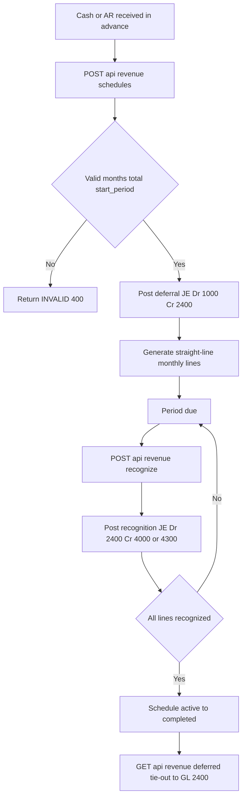

# Revenue Recognition & Billing — Process Narrative

> **DRAFT v0.1** — contains `<<placeholders>>` pending owner confirmation.

## 1. Document control

| Field | Value |
| --- | --- |
| Process ID | PN-12-REVREC |
| Process owner | `<<Revenue / Controller>>` |
| Approver | `<<approver>>` |
| Version | **0.1 DRAFT** |
| Effective date | `<<effective-date>>` |
| Review cadence | Annual + on significant change |
| Related RCM controls | REVREC-01, REVREC-02, REVREC-03, REVREC-04, GL-01, REC-01 |
| Related policy | `compliance/policies/revenue-recognition-policy.md` |

## 2. Purpose

To define the controlled process by which the organization records deferred revenue, recognizes earned revenue over the service period in accordance with the matching principle, and bills recurring and subscription streams. The process ensures that revenue is recognized completely, accurately, in the correct period, and only once, and that the unearned-revenue liability reconciles to the general ledger.

## 3. Scope

**In scope:** Creation of deferred-revenue schedules and the initial deferral journal entry; periodic recognition of earned revenue; subscription and recurring service billing; the deferred-revenue completeness and tie-out reporting.

**Out of scope:** One-shot point-of-sale and order-driven sales (see `01-order-to-cash.md`); project percentage-of-completion revenue (see `16-project-accounting.md`); cash collection and settlement (see `07-cash-treasury.md`); period close mechanics (see `04-general-ledger-close.md`).

## 4. References

- ISO 9001:2015 clause 4.4 (Quality management system and its processes); clause 8.1 (Operational planning and control); clause 8.2.3 (Review of requirements for products and services).
- `compliance/Oshinei_ERP_SOX_RCM_v1.xlsx` — Revenue (REV-*, REVREC-*), GL-01, REC-01 control families.
- `compliance/policies/revenue-recognition-policy.md`; `compliance/policies/journal-entry-policy.md`.
- Code: `apps/api/src/modules/revenue/revenue.controller.ts`, `apps/api/src/modules/revenue/revenue.service.ts`, `apps/api/src/modules/billing/billing.service.ts`, `apps/api/src/modules/ledger/ledger.service.ts`.

## 5. Definitions & abbreviations

| Term | Definition |
| --- | --- |
| Deferral / DEFREV | Document source prefix for the initial deferred-revenue journal entry. |
| REVREC | Document source for a recognition journal entry. |
| Unearned Revenue | Liability account 2400; cash received in advance not yet earned. |
| Schedule | A deferred-revenue plan splitting a total across monthly recognition lines. |
| Straight-line | Recognition method: total / months, with the rounding remainder applied to the final month. |
| Idempotent | A posting that, if re-invoked with the same reference, does not post twice (`alreadyPosted`). |
| RLS | Row-Level Security; tenant isolation enforced at the Postgres row level. |
| SoD | Segregation of Duties. |
| RCM | Risk & Control Matrix. |

## 6. Roles & responsibilities (RACI)

Segregation of duties is enforced per **R07** (the user who initiates a schedule must not approve/post recognition) and the relevant permissions (`ar` for billing/recognition operations, `exec` for oversight). The application enforces tenant isolation via multi-tenant RLS and identity via JWT.

| Activity | AR Clerk (`ar`) | Revenue Accountant | Controller / Approver (`exec`) | System |
| --- | --- | --- | --- | --- |
| Create deferral schedule + initial JE | R | C | A | I |
| Recognize period revenue | R | C | A | I |
| Review deferred-revenue tie-out | I | R | A | I |
| Subscription / recurring billing run | R | C | A | I |
| Post balanced JE to GL | I | I | I | R |

## 7. Process narrative

1. **Create deferred-revenue schedule.** AR clerk calls `POST /api/revenue/schedules`. The service validates `months >= 1`, `total_amount > 0`, and `start_period` matching `YYYY-MM`; failure raises **INVALID (400)**. A schedule number is allocated with prefix `DEFREV-`. The initial deferral JE is posted: **Dr 1000 Cash/AR, Cr 2400 Unearned Revenue** for the full total. Posting is idempotent via `alreadyPosted('DEFREV', scheduleNo)`. Control: **REVREC-01**, **GL-01**.
2. **Generate recognition lines.** The schedule splits the total straight-line across `months`: each line = total / months, with the rounding remainder allocated to the final month so the sum ties exactly to the total. Lines carry `period` (`YYYY-MM`) and `recognized = false`. Control: **REVREC-02**.
3. **List / query schedules.** Users call `GET /api/revenue/schedules` filtering by `status` or `source_ref` to review outstanding obligations. Control: Operational.
4. **Recognize period revenue (tenant-scoped).** For a given period, the Revenue Accountant calls `POST /api/revenue/recognize`. The run is **scoped to a single tenant**: a tenant-bound user recognizes their own due lines, while an HQ/Admin caller (whose request bypasses RLS) **must** pass `tenant_id` — otherwise the call is rejected `TENANT_REQUIRED` (it would otherwise recognize every tenant's due lines at once). The service posts all due lines where `recognized = false` for that period **and that tenant**: **Dr 2400 Unearned Revenue, Cr 4000 Revenue** (or 4300 Subscription & Service Revenue for recurring/service streams). Source `REVREC`, reference `scheduleNo:period`. Posting is idempotent via `alreadyPosted('REVREC', ref)`; on a crash-recovery re-run the existing `entry_no` is recovered onto the line so the audit link is preserved. Control: **REVREC-03**, **GL-01**, **ITGC-AC-03**.
5. **Complete schedule.** When all lines are recognized, the schedule transitions `active -> completed`. Control: Operational.
6. **Subscription & recurring billing.** Recurring and membership streams use account **4300 Subscription & Service Revenue**. The recurring billing cadence creates periodic invoices recognized over the service period — deferred via **2400** then recognized to **4300** as service is delivered. Milestone / percentage-of-completion arrangements are supported by recognizing the relevant scheduled lines as each milestone completes. Control: **REVREC-04**.
7. **Deferred-revenue completeness check.** The Controller calls `GET /api/revenue/deferred` to compare remaining unrecognized line value against the GL **2400** balance, evidencing completeness and the subledger-to-GL tie-out. Control: **REC-01**.

## 8. Process flow

The AR clerk lane initiates the schedule and triggers billing; the system lane validates input, allocates the document number, and posts balanced journal entries to the ledger; the Revenue Accountant lane invokes recognition for each due period; and the Controller lane performs the deferred-revenue tie-out, providing detective oversight independent of the initiator per R07.

## 9. Control matrix

| Step | Risk | Control | Type | RCM ID | Evidence / Record |
| --- | --- | --- | --- | --- | --- |
| 1 | Revenue recorded as earned before delivery | Cash-in-advance deferred to 2400 via validated schedule | Preventive | REVREC-01 | DEFREV JE; schedule record |
| 1 | Unbalanced or invalid JE | Balanced double-entry enforced by ledger; INVALID 400 on bad input | Preventive | GL-01 | Posted JE; rejected request log |
| 2 | Recognition pattern incorrect / total mis-stated | Straight-line split with remainder to final month ties to total | Preventive | REVREC-02 | Schedule lines; reconciliation to total |
| 4 | Revenue recognized in wrong period or twice | Period-scoped recognition of `recognized=false` lines; idempotent `alreadyPosted` | Preventive | REVREC-03 | REVREC JE; recognition log |
| 6 | Recurring/subscription revenue mis-classified | Service streams recognized to 4300 over service period | Preventive | REVREC-04 | Invoice; recognition JE |
| 7 | Unearned-revenue liability misstated vs GL | Deferred-revenue report tie-out to GL 2400 | Detective | REC-01 | `GET /api/revenue/deferred` output |

## 10. Inputs & outputs

**Inputs:** Customer contract / advance receipt; total contract amount; recognition term (months); start period; revenue stream classification (one-shot vs subscription/service).

**Outputs:** Deferred-revenue schedule with monthly lines; DEFREV deferral JE; REVREC recognition JEs; recurring invoices; deferred-revenue tie-out report; updated GL balances on 1000/1100, 2400, 4000, 4300.

## 11. Records & retention

| Record | System of record | Retention |
| --- | --- | --- |
| Deferred-revenue schedules & lines | `revRecSchedules` (Postgres) | `<<7 years / per Thai law>>` |
| DEFREV / REVREC journal entries | General ledger | `<<7 years / per Thai law>>` |
| Recurring invoices | Billing module | `<<7 years / per Thai law>>` |
| Deferred-revenue tie-out reports | Reporting / evidence store | `<<7 years / per Thai law>>` |

## 12. KPIs / metrics

- Unearned-revenue tie-out variance (report vs GL 2400) — target THB 0.
- Percentage of due recognition lines posted within close window.
- Count of INVALID (400) rejections on schedule creation.
- Count of idempotency hits (re-submitted DEFREV/REVREC) — trend toward zero.
- Aged deferred-revenue balance by schedule.

## 13. Exception & error handling

| Error code | Trigger | Handling |
| --- | --- | --- |
| INVALID (400) | `months < 1`, `total_amount <= 0`, or `start_period` not `YYYY-MM` | Reject creation; correct inputs and resubmit. |
| (idempotent skip) | Re-submit of DEFREV/REVREC with existing reference | `alreadyPosted` returns without re-posting; no duplicate JE. |
| `TENANT_REQUIRED` (400) | HQ/Admin runs recognition without a `tenant_id` | Specify the tenant; recognition is scoped to one tenant (ITGC-AC-03). |
| Tie-out variance | Deferred report ≠ GL 2400 | Controller investigates unrecognized/mis-posted lines before close sign-off. |

## 14. Revision history

| Version | Date | Author | Notes |
| --- | --- | --- | --- |
| 0.1 DRAFT | 2026-06-22 | `<<author>>` | Initial draft. |
| 0.2 | 2026-06-23 | Platform | Security review W2 (ITGC-AC-03): revenue recognition is tenant-scoped — HQ/Admin must pass `tenant_id` (`TENANT_REQUIRED`); crash-recovery re-run recovers the existing `entry_no`. Verified by the `revrec` harness cross-tenant case. |
