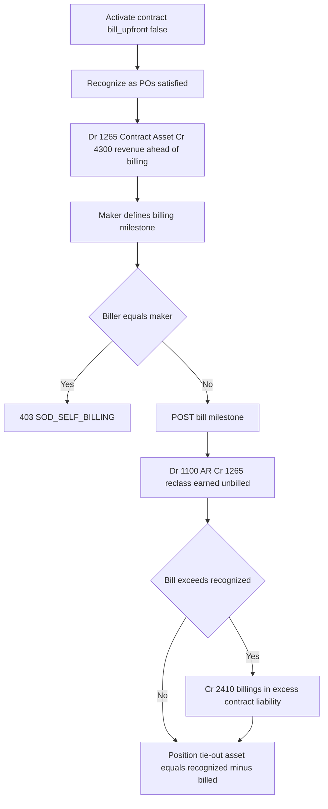
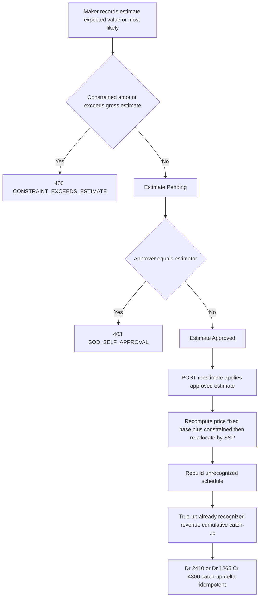
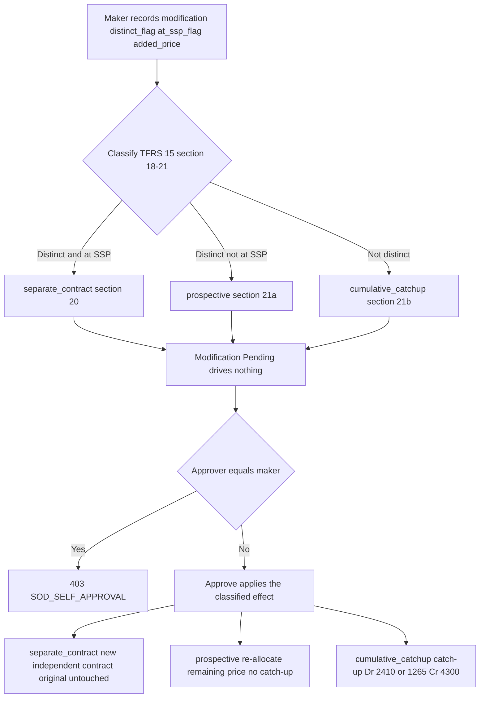
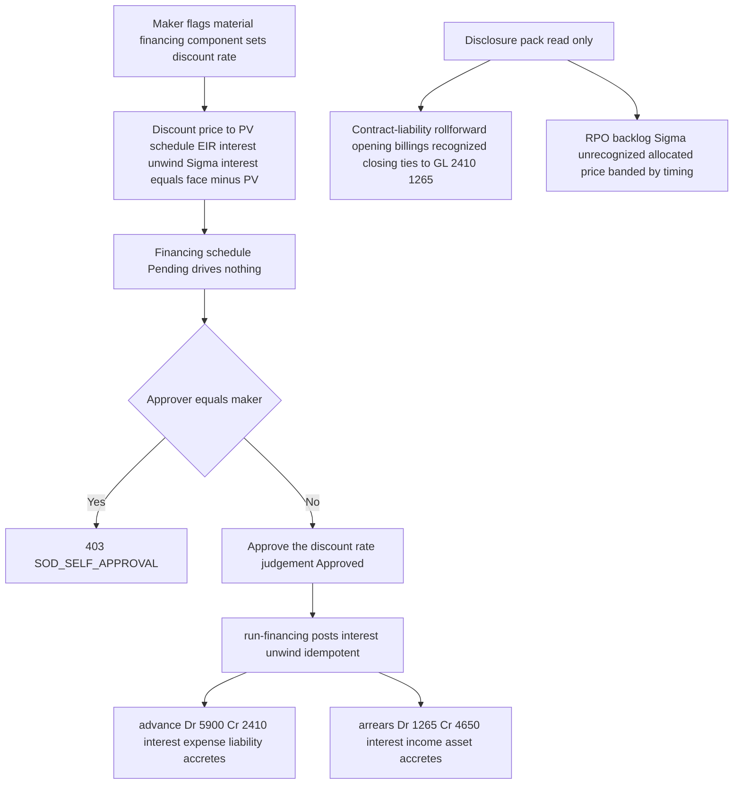
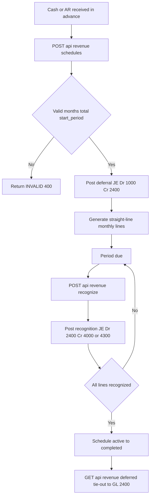

# Revenue Recognition & Billing — Process Narrative

> **DRAFT v0.1** — contains `<<placeholders>>` pending owner confirmation.

## 1. Document control

| Field | Value |
| --- | --- |
| Process ID | PN-12-REVREC |
| Process owner | `<<Revenue / Controller>>` |
| Approver | `<<approver>>` |
| Version | **0.14 DRAFT** |
| Effective date | `<<effective-date>>` |
| Review cadence | Annual + on significant change |
| Related RCM controls | REVREC-01, REVREC-02, REVREC-03, REVREC-04, **REV-19 (TFRS 15)**, **REV-24 (TFRS 15 §105-107 contract asset/liability)**, **REV-25 (TFRS 15 §50-59 variable consideration)**, **REV-26 (TFRS 15 §18-21 contract modifications)**, **REV-27 (TFRS 15 §60-65 financing component + §120 disclosure)**, GL-01, REC-01 |
| Related policy | `compliance/policies/revenue-recognition-policy.md` |

## 2. Purpose

To define the controlled process by which the organization records deferred revenue, recognizes earned revenue over the service period in accordance with the matching principle, and bills recurring and subscription streams. The process ensures that revenue is recognized completely, accurately, in the correct period, and only once, and that the unearned-revenue liability reconciles to the general ledger.

## 3. Scope

**In scope:** Creation of deferred-revenue schedules and the initial deferral journal entry; periodic recognition of earned revenue; subscription and recurring service billing; the deferred-revenue completeness and tie-out reporting.

**Out of scope:** One-shot point-of-sale and order-driven sales (see `01-order-to-cash.md`); project percentage-of-completion revenue (see `16-project-accounting.md`); cash collection and settlement (see `07-cash-treasury.md`); period close mechanics (see `04-general-ledger-close.md`).

## 4. References

- ISO 9001:2015 clause 4.4 (Quality management system and its processes); clause 8.1 (Operational planning and control); clause 8.2.3 (Review of requirements for products and services).
- `compliance/Oshinei_ERP_SOX_RCM_v1.xlsx` — Revenue (REV-*, REVREC-*), GL-01, REC-01 control families.
- `compliance/policies/revenue-recognition-policy.md`; `compliance/policies/journal-entry-policy.md`.
- Code: `apps/api/src/modules/revenue/revenue.controller.ts`, `apps/api/src/modules/revenue/revenue.service.ts`, `apps/api/src/modules/billing/billing.service.ts`, `apps/api/src/modules/ledger/ledger.service.ts`.

## 5. Definitions & abbreviations

| Term | Definition |
| --- | --- |
| Deferral / DEFREV | Document source prefix for the initial deferred-revenue journal entry. |
| REVREC | Document source for a recognition journal entry. |
| Unearned Revenue | Liability account 2400; cash received in advance not yet earned. |
| Schedule | A deferred-revenue plan splitting a total across monthly recognition lines. |
| Straight-line | Recognition method: total / months, with the rounding remainder applied to the final month. |
| Idempotent | A posting that, if re-invoked with the same reference, does not post twice (`alreadyPosted`). |
| RLS | Row-Level Security; tenant isolation enforced at the Postgres row level. |
| SoD | Segregation of Duties. |
| RCM | Risk & Control Matrix. |
| TFRS 15 / IFRS 15 | The five-step revenue-recognition standard (identify contract → identify performance obligations → determine transaction price → allocate by SSP → recognize as satisfied). |
| Performance obligation (PO) | A distinct promise in a contract (e.g. implementation, licence, support) recognized independently. |
| SSP | Standalone selling price — the price a PO would sell for on its own; the basis for allocating the transaction price. |
| Contract Liability / Deferred Revenue | Account **2410**; the obligation to transfer goods/services for which the customer has been invoiced (TFRS 15). |
| Refund Liability | Account **2420**; the provision for expected returns/refunds (TFRS 15 variable consideration). |

## 5b. TFRS 15 / IFRS 15 revenue recognition (REV-19)

In addition to the legacy straight-line DEFREV schedule (cash-in-advance deferred to 2400 and recognized to 4000), the system implements the full **TFRS 15 / IFRS 15 five-step** model for service / subscription / project-style contracts (the restaurant POS retains immediate recognition). The five steps map to the engine as follows:

1. **Identify the contract** — `rev_contracts` (contract no, date, total transaction price, currency, status Draft→Active→Completed).
2. **Identify the performance obligations** — `performance_obligations` (each PO has a name, an SSP, a recognition `method` of `point_in_time` or `over_time`, and over-time date range).
3. **Determine the transaction price** — `rev_contracts.total_price`.
4. **Allocate by SSP** — `POST /api/revenue/contracts/:id/allocate`: `allocated_price[i] = total_price × ssp[i] / Σssp`. The rounding residual is placed on the largest-SSP PO so **Σ allocated == total_price exactly**. `Σssp ≤ 0` → `INVALID_ALLOCATION`.
5. **Recognize as satisfied** — `POST /api/revenue/contracts/recognize` releases deferred revenue for each due schedule row.

**GL postings** (all via `LedgerService.postEntry`, so the period lock and GL-17 audit bind):

| Step | Source | Debit | Credit |
| --- | --- | --- | --- |
| Activation / invoice (`/:id/activate`) | `REVREC-INV` | 1100 Accounts Receivable | 2410 Deferred Revenue |
| Recognition (`/recognize`) | `REVREC` | 2410 Deferred Revenue | 4300 Recognized Revenue |
| Refund-liability accrual (`/:id/refund-liability`) | `REVREC-REF` | 4300 Revenue (contra) | 2420 Refund Liability |

`buildSchedule` (`/:id/schedule`) is idempotent — it rebuilds only **unrecognized** rows; recognized rows are never touched. `over_time` POs straight-line the allocated price across the months `start..end`; `point_in_time` POs get one row at the satisfaction date. Recognition is idempotent per row (an already-recognized row is skipped — no double post) and tenant-scoped (an HQ/Admin caller must name a `tenant_id` → `TENANT_REQUIRED`). The refund-liability accrual posts only the **delta** vs the prior posted provision.

## 5c. Contract asset vs contract liability — independent billing schedule (REV-24, TFRS 15 §105-107)

The REV-19 engine bills the **whole** contract price up front on activation (Dr 1100 AR / Cr 2410), so it can only ever hold a contract *liability* (deferred revenue). **TFRS 15 / IFRS 15 / ASC 606 §105-107** requires distinguishing, at each reporting date, a **contract asset** (an *unbilled receivable* — revenue recognized **ahead of** billing) from a **contract liability** (deferred revenue — billed **ahead of** revenue), and **reclassifying** the contract asset to a trade receivable when the customer is invoiced. Track D — Wave 1 adds an **independent billing schedule decoupled from recognition** and the contract-asset (**1265**) / contract-liability (**2410**) split. It is additive: an untouched contract behaves exactly as REV-19.

**Decoupling.** Activation gains an optional `bill_upfront` flag (default **TRUE** = today's behaviour). Set `bill_upfront: false` on `POST /api/revenue/contracts/:id/activate` to activate **without** billing anything, so recognition then runs ahead of billing. The contract carries a cumulative `billed_amount` (0 when not billed up front; `total_price` when billed up front) that drives the split.

**Asset-aware recognition.** `recognize()` now first **releases** any contract liability already billed in advance (Dr 2410), and books the surplus recognized **ahead of** billing as a **contract asset** (Dr 1265). For an up-front-billed contract the liability always covers the amount, so it reduces to the legacy Dr 2410 / Cr 4300 — **REV-19 back-compat preserved**.

**Independent billing schedule (maker-checker).** `RevBillingService` (`modules/revrec-billing`) exposes three endpoints on the existing contract, gated `exec`/`ar`/`fin_report`:

- `POST /api/revenue/contracts/:id/billing-schedule` — a **maker** defines invoice milestones (`{ period, amount }[]`); planned Σ may not exceed the contract price (`SCHEDULE_EXCEEDS_CONTRACT`). Rows land `Planned`, tagged with the maker (`created_by`).
- `POST /api/revenue/contracts/:id/bill` — a **checker** (≠ the milestone's maker, else **403 `SOD_SELF_BILLING`**) raises the invoice for a scheduled milestone. It **reclasses** the earned contract asset **1265 → 1100 AR** and parks any billing-in-excess as a contract liability **2410**. Cumulative billing may never exceed the contract price (`BILL_EXCEEDS_CONTRACT`).
- `GET /api/revenue/contracts/:id/position` — the detective **tie-out**: cumulative recognized vs billed with the derived `contract_asset = max(0, Σrecognized − Σbilled)` and `contract_liability = max(0, Σbilled − Σrecognized)`.

**GL postings** (all via `LedgerService.postEntry`; no new COA — 1100/1265/2410/4300 already exist and 1265 is CF-classified operating):

| Event | Source | Debit | Credit |
| --- | --- | --- | --- |
| Recognition, recognized > billed (`/recognize`) | `REVREC` | 2410 (release billed-in-advance), then **1265 Contract Asset** for the surplus | 4300 Recognized Revenue |
| Billing a milestone (`/:id/bill`) | `REVBILL` | 1100 Accounts Receivable | **1265 Contract Asset** (reclass earned unbilled), then 2410 for any billing-in-excess |

The reclass **ties**: Σ contract-asset (1265) balance = Σ recognized − Σ billed (bounded at 0). This mirrors the projects percentage-of-completion pattern (`projects.service.ts` `recognizePoc`/`bill`, PROJ-09). Control: **REV-24**.

## 5d. Variable consideration & the constraint (REV-25, TFRS 15 §50-59)

The REV-19 engine holds a **fixed** transaction price (`rev_contracts.total_price`). A contract with **variable consideration** — rebates, refunds, performance bonuses/penalties, price concessions, usage/volume tiers — must, under **TFRS 15 / IFRS 15 / ASC 606 §50-59**: (1) **estimate** the variable amount using either the **expected value** (Σ probability × amount) or the **most-likely amount** method (§53); (2) **constrain** the estimate to the portion that is **highly probable not to reverse** (§56-58); (3) **re-estimate** each reporting period as facts change (§59); and (4) **true-up** revenue already recognized on satisfied obligations via a **cumulative catch-up** in the period the estimate changes (§88). Track D — Wave 2 adds this as an **additive** module (`modules/revrec-variable`) that **extends** the REV-19 engine (it reuses `allocateBySSP` / `buildSchedule` / `sumRecognized`; it does not rebuild it). The estimate is a **management judgement**, so it is a **maker-checker** artifact and only the **constrained** amount ever drives the recognizable transaction price.

`RevVariableService` exposes four endpoints on the existing contract, gated `exec`/`ar`/`fin_report` (no new duty):

- `POST /api/revenue/contracts/:id/variable-consideration` — a **maker** records an estimate. `method: 'expected_value'` computes the gross from `scenarios: [{ amount, probability }]` (probabilities must sum to 1, else `INVALID_PROBABILITIES`); `method: 'most_likely'` takes `most_likely_amount` (or the max-probability scenario). **The constraint** is the reviewed control: `constrained_amount` may **not exceed** the gross estimate (`CONSTRAINT_EXCEEDS_ESTIMATE`) — the constraint may only *reduce* the recognizable amount. Rows land `Pending`, tagged with the estimator (`created_by`). No GL, no price change yet.
- `POST /api/revenue/contracts/:id/variable-consideration/:vcId/approve` — a **checker** (≠ the estimator, else **403 `SOD_SELF_APPROVAL`**) approves the estimate (`Pending → Approved`). **Approval is mandatory** before an estimate can drive revenue.
- `POST /api/revenue/contracts/:id/reestimate` — a **maker** applies the latest **Approved**, not-yet-applied estimate for the period: recompute the transaction price (**fixed base + constrained variable**), re-allocate by SSP, rebuild only the **unrecognized** schedule, and **true-up** already-recognized revenue with a cumulative catch-up. It is **idempotent** — with no unapplied approved estimate it is a no-op (a Pending estimate does **not** drive revenue), and the GL post is also guarded by `alreadyPosted`.
- `GET /api/revenue/contracts/:id/variable-consideration` — lists the contract's estimates (method, gross, constrained, status, posted catch-up) — the period re-estimate history.

**GL postings** (all via `LedgerService.postEntry`; no new COA — 2410/1265/4300 already exist, 1265 CF-classified operating). The catch-up uses the **same asset-aware split** as recognition:

| Event | Source | Debit | Credit |
| --- | --- | --- | --- |
| Upward true-up, recognized > billed (`/reestimate`) | `REVREC-VC` | 2410 (release billed-in-advance), then **1265 Contract Asset** for the surplus | 4300 Recognized Revenue (catch-up Δ) |
| Downward true-up (constraint reduced) | `REVREC-VC` | 4300 Recognized Revenue | 2410 (restore liability), then 1265 (reduce contract asset) |

The catch-up **ties**: after a re-estimate, Σ recognized revenue tracks the new (constrained) allocation for the satisfied portion. Control: **REV-25**.

## 5e. Contract modifications (REV-26, TFRS 15 §18-21)

When a contract changes — added or changed goods/services, or a price change — the change must be **classified** and accounted for as exactly one of **three** outcomes under **TFRS 15 / IFRS 15 / ASC 606 §18-21**, and the **classification IS the control** (a wrong "separate contract" call hides a required catch-up):

- **`separate_contract` (§20)** — the added goods are **distinct** (§27) **AND** priced at their **standalone selling price (SSP)** ⇒ account for them as a **NEW independent contract**; the original contract is **untouched** (no re-allocation, no catch-up).
- **`prospective` (§21a)** — the added goods are distinct but **NOT at SSP** ⇒ treat as a **termination of the old contract and creation of a new one**: the **remaining (unrecognized) transaction price + the added price** is **re-allocated** over the **remaining** performance obligations by relative SSP. Already-recognized revenue is **frozen** — **no catch-up**.
- **`cumulative_catchup` (§21b)** — the added/changed goods are **NOT distinct** (part of a single performance obligation) ⇒ adjust revenue at the modification date via a **cumulative catch-up** on the already-satisfied portion.

Track D — Wave 3 adds this as an **additive** module (`modules/revrec-modifications`) that **extends** the REV-19 engine (it reuses `createContract` / `allocateBySSP` / `buildSchedule` / `sumRecognized`; it does not rebuild it). The classification is a **management judgement**, so a modification is a **maker-checker** artifact — it drives **nothing** until a **different** user approves it.

`RevModificationService` exposes three endpoints on the existing contract, gated `exec`/`ar`/`fin_report` (no new duty):

- `POST /api/revenue/contracts/:id/modify` — a **maker** records a modification with the added/changed `obligations`, the `added_price`, and the management judgements `distinct_flag` + `at_ssp_flag`. The service **classifies** it (§18-21) into `separate_contract` | `prospective` | `cumulative_catchup`, records it **Pending** with a **preview** of the effect, and changes **nothing** (no contract/schedule/GL change). A distinct-goods modification needs `obligations` (`NO_OBLIGATIONS`) and `added_price > 0` (`INVALID_ADDED_PRICE`).
- `POST /api/revenue/contracts/:id/modifications/:modId/approve` — a **checker** (≠ the maker, else **403 `SOD_SELF_APPROVAL`**) approves the modification, which **applies** the classified effect. **Approval is mandatory** before the modification drives revenue; re-approving an applied modification → `MODIFICATION_NOT_PENDING`.
- `GET /api/revenue/contracts/:id/modifications` — lists the contract's modifications (type, added price, flags, effect, linked new-contract id, status) — the modification history.

**GL postings** (all via `LedgerService.postEntry`; no new COA — 2410/1265/4300 already exist). Only the **cumulative catch-up** posts an entry on apply; `separate_contract` and `prospective` post nothing (recognition then runs on the ordinary `/recognize` path):

| Event | Source | Debit | Credit |
| --- | --- | --- | --- |
| `cumulative_catchup` upward, recognized > billed | `REVREC-MOD` | 2410 (release billed-in-advance), then **1265 Contract Asset** for the surplus | 4300 Recognized Revenue (catch-up Δ) |
| `cumulative_catchup` downward (partial termination) | `REVREC-MOD` | 4300 Recognized Revenue | 2410 (restore liability), then 1265 (reduce contract asset) |

The catch-up uses the **same asset-aware split** as recognition and is idempotent (`alreadyPosted`-guarded). Control: **REV-26**.

## 5f. Significant financing component + revenue disclosure pack (REV-27, TFRS 15 §60-65 / §120)

Track D — **Wave 4 (FINAL)** adds, as an **additive** module (`modules/revrec-disclosure`, own dir) that **extends** the REV-19 engine + Wave 1 billing (it reuses the contract-asset **1265** / contract-liability **2410** balances; it does not rebuild them), two deliverables.

### (A) Significant financing component (§60-65)

When the **timing** of payment gives the customer or the entity a **material financing benefit**, **TFRS 15 / IFRS 15 / ASC 606 §60-65** requires the promised consideration to be adjusted to its **cash-selling-price present value (PV)** and the difference (**face − PV**) recognized as **interest**, **unwound** over the contract by the **effective-interest method** (the same EIR primitive the lease engine uses, LSE-01). Two directions:

- **`advance` (customer prepays)** — the entity has effectively **borrowed** from the customer, so it recognizes **interest expense (5900)** and the **contract liability accretes** from PV toward face: **Dr 5900 / Cr 2410** (IFRS 15 Example 29).
- **`arrears` (deferred payment)** — the entity is effectively **lending** to the customer, so it recognizes **financing interest income (4650)** and the **contract asset / receivable accretes** from PV toward face: **Dr 1265 / Cr 4650** (IFRS 15 Example 26).

The **discount rate is a management judgement** and **IS the control** (an aggressive/omitted rate mis-states the revenue↔interest split), so the component is a **maker-checker** artifact.

`RevFinancingService` exposes, gated `exec`/`ar`/`fin_report` (no new duty):

- `POST /api/revenue/contracts/:id/financing-component` — a **maker** flags a material financing component (`material`, `direction`) and sets the **discount rate** (`discount_rate_pct`, `periods`, optional `nominal`/`start_period`). The service discounts the face to **PV** and schedules the EIR **interest unwind** so **Σ interest == face − PV** exactly; the rows land **Pending** and **drive nothing**. `INVALID_DISCOUNT_RATE` / `INVALID_PERIODS` / `FINANCING_NOT_MATERIAL` / `FINANCING_ALREADY_SET` guard it.
- `POST /api/revenue/contracts/:id/financing-component/approve` — a **checker** (≠ the maker, else **403 `SOD_SELF_APPROVAL`**) approves the **discount-rate judgement**, flipping the schedule **Approved**.
- `POST /api/revenue/contracts/:id/run-financing` — posts the periodic interest unwind for the **Approved** schedule due through the period (**idempotent**, `alreadyPosted`-guarded). Running an un-approved component → **`FINANCING_NOT_APPROVED`**.
- `GET /api/revenue/contracts/:id/financing-component` — the schedule + the PV / face / interest summary (detective read).

| Event | Source | Debit | Credit |
| --- | --- | --- | --- |
| `advance` interest unwind (customer prepays → entity borrows) | `REVFIN` | 5900 Interest Expense (financing charge) | **2410 Contract Liability (accretes toward face)** |
| `arrears` interest unwind (deferred payment → entity lends) | `REVFIN` | 1265 Contract Asset (accretes toward face) | **4650 Significant Financing Component Interest Income** |

**New COA 4650** (Significant Financing Component Interest Income) is added to the canonical COA + `CF_CLASSIFY` (operating); the advance case reuses **5900**.

### (B) Revenue disclosure pack (§120)

Two **read-only** detective aggregators (no new table, no GL), also registered as schedulable BI report types (`contract_liability_rollforward`, `rpo_backlog`):

- `GET /api/revenue/disclosure/contract-liability-rollforward?period=YYYY-MM` — the **contract-liability rollforward** (§120(b)): **opening → additions (billings) → recognized → closing** over the contract-liability (**2410**) and contract-asset (**1265**) control accounts, reconstructed **directly from the GL journal lines** so it **reconciles to GL by construction** (`opening + additions − reductions = closing = GL`).
- `GET /api/revenue/disclosure/rpo?as_of=YYYY-MM` — the **remaining performance obligation** / backlog (§120(a)): **Σ unrecognized allocated price**, banded by expected timing (**≤12 months / >12 months**).

Both are tenant-scoped (RLS). Control: **REV-27**.

## 6. Roles & responsibilities (RACI)

Segregation of duties is enforced per **R07** (the user who initiates a schedule must not approve/post recognition) and the relevant permissions (`ar` for billing/recognition operations, `exec` for oversight). The application enforces tenant isolation via multi-tenant RLS and identity via JWT.

| Activity | AR Clerk (`ar`) | Revenue Accountant | Controller / Approver (`exec`) | System |
| --- | --- | --- | --- | --- |
| Create deferral schedule + initial JE | R | C | A | I |
| Recognize period revenue | R | C | A | I |
| Review deferred-revenue tie-out | I | R | A | I |
| Subscription / recurring billing run | R | C | A | I |
| Post balanced JE to GL | I | I | I | R |

## 7. Process narrative

1. **Create deferred-revenue schedule.** AR clerk calls `POST /api/revenue/schedules`. The service validates `months >= 1`, `total_amount > 0`, and `start_period` matching `YYYY-MM`; failure raises **INVALID (400)**. A schedule number is allocated with prefix `DEFREV-`. The initial deferral JE is posted: **Dr 1000 Cash/AR, Cr 2400 Unearned Revenue** for the full total. Posting is idempotent via `alreadyPosted('DEFREV', scheduleNo)`. Control: **REVREC-01**, **GL-01**.
2. **Generate recognition lines.** The schedule splits the total straight-line across `months`: each line = total / months, with the rounding remainder allocated to the final month so the sum ties exactly to the total. Lines carry `period` (`YYYY-MM`) and `recognized = false`. Control: **REVREC-02**.
3. **List / query schedules.** Users call `GET /api/revenue/schedules` filtering by `status` or `source_ref` to review outstanding obligations. Control: Operational.
4. **Recognize period revenue (tenant-scoped).** For a given period, the Revenue Accountant calls `POST /api/revenue/recognize`. The run is **scoped to a single tenant**: a tenant-bound user recognizes their own due lines, while an HQ/Admin caller (whose request bypasses RLS) **must** pass `tenant_id` — otherwise the call is rejected `TENANT_REQUIRED` (it would otherwise recognize every tenant's due lines at once). The service posts all due lines where `recognized = false` for that period **and that tenant**: **Dr 2400 Unearned Revenue, Cr 4000 Revenue** (or 4300 Subscription & Service Revenue for recurring/service streams). Source `REVREC`, reference `scheduleNo:period`. Posting is idempotent via `alreadyPosted('REVREC', ref)`; on a crash-recovery re-run the existing `entry_no` is recovered onto the line so the audit link is preserved. Control: **REVREC-03**, **GL-01**, **ITGC-AC-03**.
5. **Complete schedule.** When all lines are recognized, the schedule transitions `active -> completed`. Control: Operational.
6. **Subscription & recurring billing.** Recurring and membership streams use account **4300 Subscription & Service Revenue**. The recurring billing cadence creates periodic invoices recognized over the service period — deferred via **2400** then recognized to **4300** as service is delivered. Milestone / percentage-of-completion arrangements are supported by recognizing the relevant scheduled lines as each milestone completes. Control: **REVREC-04**.
7. **Deferred-revenue completeness check.** The Controller calls `GET /api/revenue/deferred` to compare remaining unrecognized line value against the GL **2400** balance, evidencing completeness and the subledger-to-GL tie-out. Control: **REC-01**.
8. **Service-contract renewal & expiry (SVC-3, SVC-02).** A service contract (`modules/service`, `service_contracts`) has an `end_date` — without a renewal workflow it silently lapses (recurring revenue lost) or is renewed at an arbitrarily inflated price by one hand. The renewal control adds, alongside the SLA/subscription surfaces (which it never touches): a **proposal** `POST /api/service/contracts/:id/renew` (service/masterdata duty) computes the successor value = `base × (1 + uplift_pct/100)`. A **within-ceiling** proposal — `uplift_pct ≤` the per-tenant threshold `contract_renewal_settings.max_auto_uplift_pct` (default **5%**), and not an auto-renew that raises price — auto-approves and creates the successor `service_contracts` row immediately (linked via `renewed_to_contract_id`; the old contract's `renewal_status='renewed'`). A proposal **over the ceiling**, or any **auto-renew with a price rise**, is parked `pending` and the successor is created **only when a DIFFERENT user approves** (`POST /api/service/renewals/:id/approve`, approver duty) — `approved_by ≠ requested_by`, else **403 SOD_SELF_APPROVAL** (SVC-02 maker-checker). **Reject** leaves the old contract untouched (`renewal_status='declined'`). Detective side: `GET /api/service/contracts/expiring?days=N` lists Active contracts nearing `end_date` with **no renewal in flight** so they are actioned before they lapse. The uplift ceiling is change-gated to `exec` (`PUT /api/service/renewal-settings`). Control: **SVC-02**.

## 8. Process flow

The AR clerk lane initiates the schedule and triggers billing; the system lane validates input, allocates the document number, and posts balanced journal entries to the ledger; the Revenue Accountant lane invokes recognition for each due period; and the Controller lane performs the deferred-revenue tie-out, providing detective oversight independent of the initiator per R07.

## 9. Control matrix

| Step | Risk | Control | Type | RCM ID | Evidence / Record |
| --- | --- | --- | --- | --- | --- |
| 1 | Revenue recorded as earned before delivery | Cash-in-advance deferred to 2400 via validated schedule | Preventive | REVREC-01 | DEFREV JE; schedule record |
| 1 | Unbalanced or invalid JE | Balanced double-entry enforced by ledger; INVALID 400 on bad input | Preventive | GL-01 | Posted JE; rejected request log |
| 2 | Recognition pattern incorrect / total mis-stated | Straight-line split with remainder to final month ties to total | Preventive | REVREC-02 | Schedule lines; reconciliation to total |
| 4 | Revenue recognized in wrong period or twice | Period-scoped recognition of `recognized=false` lines; idempotent `alreadyPosted` | Preventive | REVREC-03 | REVREC JE; recognition log |
| 6 | Recurring/subscription revenue mis-classified | Service streams recognized to 4300 over service period | Preventive | REVREC-04 | Invoice; recognition JE |
| 7 | Unearned-revenue liability misstated vs GL | Deferred-revenue report tie-out to GL 2400 | Detective | REC-01 | `GET /api/revenue/deferred` output |
| 8 | Contract lapses unrenewed, or renewed at an unauthorised price uplift / self-approved | Renewal-uplift maker-checker: over-ceiling uplift or an auto-renew price rise parks `pending`; approver ≠ proposer (SOD_SELF_APPROVAL) creates the successor; within-ceiling auto-approves | Preventive | SVC-02 | Renewal register (pending/approved/rejected) + successor-contract link |
| 8 | Expiring contract missed (recurring revenue lost) | Expiry worklist lists Active contracts near `end_date` with no renewal in flight | Detective | SVC-02 | `GET /api/service/contracts/expiring?days=N` output |
| 5c | Revenue earned ahead of billing not carried as a contract asset; unbilled receivable not reclassed to AR when billed (TFRS 15 §105-107) | Asset-aware recognition (Dr 1265 for surplus over billed); billing reclasses 1265 → 1100 and parks over-billing in 2410; `/position` tie-out (Σ contract-asset = Σ recognized − Σ billed) | Preventive / Detective | REV-24 | `REVBILL` JE; billing-schedule register; `GET /api/revenue/contracts/:id/position` output |
| 5c | Billing milestone self-billed / customer over-billed | Maker-checker: milestone maker ≠ biller (`SOD_SELF_BILLING`); Σ planned + cumulative billing capped at contract price (`SCHEDULE_EXCEEDS_CONTRACT` / `BILL_EXCEEDS_CONTRACT`) | Preventive | REV-24 | Billing-schedule register (created_by/billed_by); rejected-request log |
| 5d | Variable consideration over-recognized (booked beyond the amount highly probable not to reverse) (TFRS 15 §50-59) | The constraint caps the recognizable price: only the `constrained_amount` (≤ gross estimate, else `CONSTRAINT_EXCEEDS_ESTIMATE`) drives the transaction price; estimated by expected value or most-likely amount | Preventive | REV-25 | Variable-consideration estimate register (method, gross, constrained); rejected-request log |
| 5d | Estimate is an unreviewed management judgement / self-approved | Maker-checker: estimator ≠ approver (`SOD_SELF_APPROVAL`); approval is mandatory before an estimate can drive revenue (reestimate applies only Approved estimates) | Preventive | REV-25 | Estimate maker-checker approval log (created_by/approved_by) |
| 5d | Prior-period revenue not trued-up when the estimate changes | Re-estimate recomputes price, re-allocates by SSP, rebuilds the unrecognized schedule, and posts a cumulative catch-up (Dr 2410/1265 ↔ Cr 4300) for already-recognized revenue; idempotent | Detective | REV-25 | `REVREC-VC` JE; re-estimate history (`GET …/variable-consideration`) |
| 5e | A contract modification is mis-classified — the three TFRS 15 §18-21 outcomes conflated (a distinct-at-SSP change folded in instead of a new contract; a distinct-not-at-SSP change wrongly caught-up; a not-distinct change treated prospectively so a required catch-up is never booked) | The service **classifies** from `distinct_flag`×`at_ssp_flag`: `separate_contract` (§20 → new contract, original untouched), `prospective` (§21a → re-allocate remaining price, no catch-up), `cumulative_catchup` (§21b → catch-up on the satisfied portion, Dr 2410/1265 ↔ Cr 4300) | Preventive / Detective | REV-26 | `REVREC-MOD` JE; contract-modification register (type/added_price/flags/effect); re-allocated schedule |
| 5e | The modification classification is an unreviewed management judgement / self-approved | Maker-checker: the recorder ≠ approver (`SOD_SELF_APPROVAL`); a Pending modification drives nothing and approval is mandatory before it drives revenue (`MODIFICATION_NOT_PENDING` on re-approval) | Preventive | REV-26 | Modification maker-checker log (created_by/approved_by); Pending→Applied audit |
| 5f | A material significant financing component is ignored — revenue recognized at the undiscounted (face) price, interest never separated from revenue (TFRS 15 §60-65) | The price is discounted to its cash-selling-price PV and the interest is unwound by the effective-interest method so Σ interest = face − PV; advance (customer prepays → entity borrows) posts Dr 5900 / Cr 2410 interest expense (liability accretes), arrears (deferred → entity lends) Dr 1265 / Cr 4650 interest income (asset accretes) (idempotent) | Preventive / Detective | REV-27 | `REVFIN` JE; financing-component schedule (PV/face/interest EIR unwind) |
| 5f | The financing-component discount rate is an unreviewed management judgement / self-approved | Maker-checker: the rate-setter ≠ approver (`SOD_SELF_APPROVAL`); a Pending component drives nothing and an un-approved component cannot post (`FINANCING_NOT_APPROVED`); one component per contract (`FINANCING_ALREADY_SET`) | Preventive | REV-27 | Discount-rate maker-checker approval log (created_by/approved_by) |
| 5f | The §120 disclosures are incomplete / do not tie to the ledger — contract-liability movement and remaining backlog not disclosed | Detective read-only pack: the contract-liability rollforward (opening → billings → recognized → closing) reconstructed from the GL journal lines and reconciled to the 2410/1265 control accounts; the RPO / backlog = Σ unrecognized allocated price banded by timing | Detective | REV-27 | Contract-liability rollforward (reconciled to GL); RPO / backlog by contract; BI report types `contract_liability_rollforward` / `rpo_backlog` |

**Exception codes (REV-25):** `CONSTRAINT_EXCEEDS_ESTIMATE` (400 — constrained amount above the gross estimate; the constraint may only reduce the recognizable amount), `INVALID_PROBABILITIES` (400 — expected-value scenario probabilities do not sum to 1), `INVALID_PROBABILITY` (400 — a probability outside [0,1]), `NO_SCENARIOS` (400 — an estimate method needs scenarios / a most-likely amount), `INVALID_CONSTRAINT` / `INVALID_METHOD` (400), `SOD_SELF_APPROVAL` (403 — the estimator may not approve their own estimate), `ESTIMATE_NOT_PENDING` (400 — approve on an already-decided estimate), `ESTIMATE_NOT_FOUND` (404), `CONTRACT_NOT_FOUND` (404), `PERIOD_LOCKED` (inherited from the ledger on the catch-up posting).

**Exception codes (REV-26):** `SOD_SELF_APPROVAL` (403 — the maker may not approve their own modification), `MODIFICATION_NOT_PENDING` (400 — approve on an already-applied/decided modification), `MODIFICATION_NOT_FOUND` (404), `NO_OBLIGATIONS` (400 — a distinct-goods modification needs at least one obligation), `INVALID_ADDED_PRICE` (400 — `added_price` must be > 0 for a distinct-goods modification), `INVALID_OBLIGATION` (400 — a bad added-obligation shape / an `over_time` obligation missing start/end), `NO_REMAINING_OBLIGATIONS` (400 — nothing unsatisfied to re-allocate a prospective modification over), `CONTRACT_NOT_FOUND` (404), `PERIOD_LOCKED` (inherited from the ledger on the catch-up posting).

**Exception codes (REV-27):** `SOD_SELF_APPROVAL` (403 — the discount-rate setter may not approve their own financing component), `FINANCING_NOT_APPROVED` (400 — run-financing on a component whose discount rate is not yet approved), `FINANCING_NOT_MATERIAL` (400 — the maker flagged the financing component as not material), `FINANCING_ALREADY_SET` (400 — one financing component per contract while a live component exists), `FINANCING_NOT_PENDING` (404 — approve with no pending component), `NO_FINANCING_COMPONENT` (404 — run-financing with no component), `INVALID_DISCOUNT_RATE` / `INVALID_PERIODS` / `INVALID_NOMINAL` (400 — financing validation), `INVALID_PERIOD` (400 — disclosure `period` not YYYY-MM), `CONTRACT_NOT_FOUND` (404), `PERIOD_LOCKED` (inherited from the ledger on the interest posting).

**Exception codes (REV-24):** `SOD_SELF_BILLING` (403 — milestone maker may not bill it), `SCHEDULE_EXCEEDS_CONTRACT` (400 — planned billing exceeds contract price), `BILL_EXCEEDS_CONTRACT` (400 — cumulative billing exceeds contract price), `ALREADY_BILLED` (400 — milestone already invoiced), `MILESTONE_NOT_FOUND` (404), `CONTRACT_NOT_FOUND` (404), `NO_MILESTONES` / `INVALID_PERIOD` / `INVALID_AMOUNT` (400 — schedule validation), `PERIOD_LOCKED` (inherited from the ledger).

## 10. Inputs & outputs

**Inputs:** Customer contract / advance receipt; total contract amount; recognition term (months); start period; revenue stream classification (one-shot vs subscription/service).

**Outputs:** Deferred-revenue schedule with monthly lines; DEFREV deferral JE; REVREC recognition JEs; recurring invoices; deferred-revenue tie-out report; updated GL balances on 1000/1100, 2400, 4000, 4300.

## 11. Records & retention

| Record | System of record | Retention |
| --- | --- | --- |
| Deferred-revenue schedules & lines | `revRecSchedules` (Postgres) | `<<7 years / per Thai law>>` |
| DEFREV / REVREC journal entries | General ledger | `<<7 years / per Thai law>>` |
| Recurring invoices | Billing module | `<<7 years / per Thai law>>` |
| Deferred-revenue tie-out reports | Reporting / evidence store | `<<7 years / per Thai law>>` |

## 12. KPIs / metrics

- Unearned-revenue tie-out variance (report vs GL 2400) — target THB 0.
- Percentage of due recognition lines posted within close window.
- Count of INVALID (400) rejections on schedule creation.
- Count of idempotency hits (re-submitted DEFREV/REVREC) — trend toward zero.
- Aged deferred-revenue balance by schedule.

## 13. Exception & error handling

| Error code | Trigger | Handling |
| --- | --- | --- |
| INVALID (400) | `months < 1`, `total_amount <= 0`, or `start_period` not `YYYY-MM` | Reject creation; correct inputs and resubmit. |
| (idempotent skip) | Re-submit of DEFREV/REVREC with existing reference | `alreadyPosted` returns without re-posting; no duplicate JE. |
| `TENANT_REQUIRED` (400) | HQ/Admin runs recognition without a `tenant_id` | Specify the tenant; recognition is scoped to one tenant (ITGC-AC-03). |
| Tie-out variance | Deferred report ≠ GL 2400 | Controller investigates unrecognized/mis-posted lines before close sign-off. |
| `CONTRACT_NOT_FOUND` (404) | TFRS 15 contract id does not exist (this tenant) | Verify the contract id / tenant. |
| `INVALID_ALLOCATION` (400) | `total_price ≤ 0`, no obligations, an over_time PO missing dates, or `Σssp ≤ 0` | Correct the contract / POs and resubmit. |
| `ALREADY_ACTIVE` (400) | `activate` called on an already-active/completed contract | The contract liability is already raised; no action. |
| (idempotent skip) | Re-run `recognize` for a period whose rows are already recognized | `recognized_count = 0`; no duplicate JE (TFRS 15 idempotency). |
| `PERIOD_LOCKED` (400) | Recognition/refund posting into a hard-closed period | Post into an open period (GL-15/16). |
| `SOD_SELF_APPROVAL` (403) | The proposer of a service-contract renewal tries to approve it (SVC-02) | A different service/exec user must approve; the successor contract is created only on independent approval. |
| `CONTRACT_ALREADY_RENEWED` (400) | Proposing/approving a renewal on a contract already renewed | The contract already has a successor (`renewed_to_contract_id`); no action. |
| `RENEWAL_IN_FLIGHT` (400) | Proposing a second renewal while one is `pending` | Approve or reject the in-flight renewal first. |
| `RENEWAL_NOT_PENDING` (400) | Approve/reject on an already-decided renewal | Only a `pending` renewal can be approved/rejected. |
| `UPLIFT_INVALID` (400) | `uplift_pct` is negative | Provide a non-negative uplift; the successor value = base × (1 + uplift/100). |
| `CONSTRAINT_EXCEEDS_ESTIMATE` (400) | A variable-consideration `constrained_amount` above the gross estimate (REV-25) | The constraint may only *reduce* the recognizable amount; lower the constrained amount to ≤ the estimate. |
| `INVALID_PROBABILITIES` (400) | Expected-value scenario probabilities do not sum to 1 (REV-25) | Correct the scenario probabilities to sum to 1. |
| `SOD_SELF_APPROVAL` (403) | The estimator tries to approve their own variable-consideration estimate (REV-25) | A different `exec`/`ar`/`fin_report` user must approve; only an Approved estimate can drive revenue. |
| (no-op, `applied:false`) | `reestimate` with no Approved, unapplied estimate, or a re-run after apply (REV-25) | Idempotent — nothing is posted; approve an estimate first, and a second run posts no duplicate catch-up. |
| `SOD_SELF_APPROVAL` (403) | The recorder of a contract modification tries to approve their own classification (REV-26) | A different `exec`/`ar`/`fin_report` user must approve; only an approved modification drives revenue. |
| `MODIFICATION_NOT_PENDING` (400) | Approve on an already-applied contract modification (REV-26) | The modification is already Applied; its effect has driven revenue — no re-approval. |
| `INVALID_ADDED_PRICE` / `NO_OBLIGATIONS` (400) | A distinct-goods modification (separate_contract / prospective) with no obligations or a non-positive `added_price` (REV-26) | Provide the added obligations and an `added_price` > 0; a pure price change with no distinct goods is a cumulative catch-up. |
| `NO_REMAINING_OBLIGATIONS` (400) | A prospective modification when every obligation is already fully satisfied (REV-26) | There is no remaining transaction price to re-allocate; a change here is a cumulative catch-up, not prospective. |
| `SOD_SELF_APPROVAL` (403) | The setter of a financing-component discount rate tries to approve their own judgement (REV-27) | A different `exec`/`ar`/`fin_report` user must approve the discount rate; only an approved component can post its interest unwind. |
| `FINANCING_NOT_APPROVED` (400) | `run-financing` on a financing component whose discount rate is not yet approved (REV-27) | Have a different user approve the component first; a Pending component drives no interest. |
| `FINANCING_ALREADY_SET` (400) | A second financing component on a contract that already has a live one (REV-27) | One significant financing component per contract; a Pending/Approved component already exists. |

## 14. Revision history

| Version | Date | Author | Notes |
| --- | --- | --- | --- |
| 0.14 | 2026-07-12 | Platform | **Track D Wave 4 (FINAL) — Significant financing component + revenue disclosure pack (new control REV-27, migration 0367; TFRS 15 / IFRS 15 / ASC 606 §60-65 + §120).** The REV-19 engine recognized revenue at the undiscounted price and had no §120 disclosure surface. Added, as an additive module (`modules/revrec-disclosure`, own dir) that **extends** the REV-19 engine + Wave 1 billing (reuses the 1265/2410 balances): **(A) financing component (§60-65)** — a maker flags a material financing component and sets the discount rate (`POST …/financing-component`); the service discounts the price to its cash-selling-price **PV** and unwinds the interest by the **effective-interest method** so **Σ interest = face − PV**; the rows land Pending and drive nothing until a **different** user approves the rate (`…/financing-component/approve`; setter self-approval → `SOD_SELF_APPROVAL`; un-approved run → `FINANCING_NOT_APPROVED`); `run-financing` posts the unwind idempotently — **advance** (prepay → entity borrows) **Dr 5900 / Cr 2410** interest expense (contract liability accretes), **arrears** (deferred → entity lends) **Dr 1265 / Cr 4650** interest income (contract asset accretes). **(B) disclosure pack (§120)** — read-only aggregators: the **contract-liability rollforward** (opening → billings → recognized → closing) reconstructed from the GL journal lines and **reconciled to GL 2410/1265**, and the **RPO / backlog** = Σ unrecognized allocated price banded by timing; both also schedulable BI report types (`contract_liability_rollforward` / `rpo_backlog`). Table `rev_financing_schedules` (migration 0367, canonical 0232-form RLS, leading `(tenant_id, contract_id)` index). **New COA 4650** (added to the canonical COA + `CF_CLASSIFY` operating) + posting events `REVFIN.INCOME`/`REVFIN.EXPENSE`; the advance case reuses 5900. §5f added (workflow + Mermaid), §9 control matrix +3 rows + REV-27 exception codes, §13 +3 error rows, §1 related-controls updated. New RCM control **REV-27** (RCM now <!-- rcm-total -->290<!-- /rcm-total -->). ToE: `cutover/revrec-disclosure.ts` (23 checks); `revrec` (34) + `revrec-billing` (24) + `revrec-variable` (25) + `revrec-modifications` (28) + `basics` (410) + `golden` (518, no drift) stay green. UAT TC-REV-27-01..06 + traceability. |
| 0.13 | 2026-07-12 | Platform | **Track D Wave 3 — Contract modifications (new control REV-26, migration 0360; TFRS 15 / IFRS 15 / ASC 606 §18-21).** The REV-19 engine had no way to account for a change to a contract. Added, as an additive module (`modules/revrec-modifications`, own dir) that **extends** the REV-19 engine (reuses `createContract`/`allocateBySSP`/`buildSchedule`/`sumRecognized`): a maker records a modification (`POST …/modify`) with the added obligations, the added price, and the `distinct_flag`/`at_ssp_flag` judgements; the service **classifies** it §18-21 into (1) **`separate_contract`** (§20 distinct & at SSP → a NEW independent contract, original untouched), (2) **`prospective`** (§21a distinct not at SSP → re-allocate the remaining transaction price over the remaining POs, NO catch-up), or (3) **`cumulative_catchup`** (§21b not distinct → catch-up on the satisfied portion, Dr 2410/1265 ↔ Cr 4300). The classification is the control and is maker-checker: a Pending modification drives nothing, a **different** user must approve it (`…/modifications/:modId/approve`; recorder self-approval → `SOD_SELF_APPROVAL`; re-approval → `MODIFICATION_NOT_PENDING`), and approval **applies** the classified effect. Table `rev_contract_modifications` (migration 0360, canonical 0232-form RLS, leading `(tenant_id, contract_id)` index). No new COA (2410/1265/4300 already exist). §5e added (workflow + Mermaid), §9 control matrix +2 rows + REV-26 exception codes, §13 +4 error rows, §1 related-controls updated. New RCM control **REV-26** (RCM now <!-- rcm-total -->290<!-- /rcm-total -->). ToE: `cutover/revrec-modifications.ts` (28 checks); `revrec` (34) + `revrec-billing` (24) + `revrec-variable` (25) + `basics` (410) + `golden` (518) stay green. UAT TC-REV-26-01..06 + traceability. |
| 0.12 | 2026-07-12 | Platform | **Track D Wave 2 — Variable consideration + the constraint (new control REV-25, migration 0359; TFRS 15 / IFRS 15 / ASC 606 §50-59).** The REV-19 engine held a fixed transaction price only. Added, as an additive module (`modules/revrec-variable`, own dir) that **extends** the REV-19 engine (reuses `allocateBySSP`/`buildSchedule`/`sumRecognized`): (1) a maker records an estimate (`POST …/variable-consideration`) by **expected value** (Σ prob×amount; `INVALID_PROBABILITIES`) or **most-likely amount**; (2) **the constraint** — only the `constrained_amount` (≤ gross, else `CONSTRAINT_EXCEEDS_ESTIMATE`) drives the recognizable price; (3) a different user approves it (`…/variable-consideration/:vcId/approve`; estimator self-approval → `SOD_SELF_APPROVAL`) — approval mandatory before it drives revenue; (4) `POST …/reestimate` recomputes price (fixed base + constrained), re-allocates by SSP, rebuilds the unrecognized schedule, and **trues-up** already-recognized revenue via a cumulative catch-up (Dr 2410/1265 ↔ Cr 4300) — idempotent. Table `rev_variable_estimates` (migration 0359, canonical 0232-form RLS, leading `(tenant_id, contract_id)` index). No new COA (2410/1265/4300 already exist). §5d added (workflow + Mermaid), §9 control matrix +3 rows + REV-25 exception codes, §13 +4 error rows. New RCM control **REV-25** (RCM now <!-- rcm-total -->290<!-- /rcm-total -->). ToE: `cutover/revrec-variable.ts` (25 checks); `revrec` (34) + `revrec-billing` (24) + `basics` (410) + `golden` (518) stay green. UAT TC-REV-25-01..06 + traceability. |
| 0.11 | 2026-07-12 | Platform | **Track D Wave 1 — Contract-asset / contract-liability split + independent billing schedule (new control REV-24, migration 0358; TFRS 15 / IFRS 15 / ASC 606 §105-107).** The REV-19 engine billed the whole contract price up front on activation, so it could only hold a contract *liability*. Added, as an additive module (`modules/revrec-billing`, own dir): (1) `activate` gains an optional `bill_upfront` flag (default TRUE = REV-19 back-compat) — set FALSE to decouple billing from recognition; (2) `recognize` is now asset-aware — release billed-in-advance 2410 first, then book the surplus recognized ahead of billing as a **contract asset (Dr 1265)** / Cr 4300; (3) a maker defines invoice milestones (`POST …/billing-schedule`, `SCHEDULE_EXCEEDS_CONTRACT`); (4) a different user bills them (`POST …/bill`) — reclass **1265 → 1100 AR** + park over-billing in **2410**; maker ≠ biller (`SOD_SELF_BILLING`), cumulative billing capped at the contract price (`BILL_EXCEEDS_CONTRACT`); (5) `GET …/position` detective tie-out (Σ contract-asset = Σ recognized − Σ billed). `rev_contracts.billed_amount` + table `rev_billing_schedules` (migration 0358, canonical 0232-form RLS, leading `(tenant_id, contract_id)` index). No new COA (1100/1265/2410/4300 already exist; 1265 CF-classified operating). §5c added (workflow + Mermaid), §9 control matrix +2 rows + REV-24 exception codes. New RCM control **REV-24** (RCM now <!-- rcm-total -->290<!-- /rcm-total -->). ToE: `cutover/revrec-billing.ts` (24 checks); `revrec` (34) + `basics` (407) + `golden` (518) stay green. UAT-GL-157..159 + traceability. |
| 0.10 | 2026-07-11 | Platform | **SVC-3 — Service Contract Renewal & Expiry management (Track-2 audit; new control SVC-02, migration 0330).** `service_contracts` had `end_date`/`status` but no renewal workflow, expiry alerting or renewal-price uplift control. Added, ALONGSIDE the SLA-event/subscription paths (untouched): renewal columns on `service_contracts` (`renewal_status`, `auto_renew`, `renewal_uplift_pct`, `renewed_to_contract_id` self-FK) + tables `contract_renewals` + `contract_renewal_settings` (canonical 0232 RLS, tenant-leading indexes). `POST /api/service/contracts/:id/renew` computes new_value = base × (1 + uplift/100): within the per-tenant ceiling (`max_auto_uplift_pct`, default 5%) it auto-approves + creates the successor contract; over-ceiling, or an auto-renew that raises price, parks `pending` for maker-checker approval (`/api/service/renewals/:id/approve|reject`, approver ≠ proposer → `SOD_SELF_APPROVAL`). Detective `GET /api/service/contracts/expiring?days=N`. Reads gate exec/marketing; propose masterdata/exec; approve approvals/exec; the ceiling change-gates to exec. §7 step 8, §9 control matrix +2 rows (SVC-02), §13 +5 error rows. New RCM control **SVC-02** (RCM now <!-- rcm-total -->290<!-- /rcm-total -->). ToE: `cutover/contract-renewal.ts` (19 checks). Web `/service/renewals` (renewal queue + expiry worklist) kept separate from the existing `/service` page. UAT-GL-150..156 + traceability; user manual 16 §16.8 (contract renewals). |
| 0.10 | 2026-07-11 | Platform | **SVC-3 — Service Contract Renewal & Expiry management (Track-2 audit; new control SVC-02, migration 0330).** `service_contracts` had `end_date`/`status` but no renewal workflow, expiry alerting or renewal-price uplift control. Added, ALONGSIDE the SLA-event/subscription paths (untouched): renewal columns on `service_contracts` (`renewal_status`, `auto_renew`, `renewal_uplift_pct`, `renewed_to_contract_id` self-FK) + tables `contract_renewals` + `contract_renewal_settings` (canonical 0232 RLS, tenant-leading indexes). `POST /api/service/contracts/:id/renew` computes new_value = base × (1 + uplift/100): within the per-tenant ceiling (`max_auto_uplift_pct`, default 5%) it auto-approves + creates the successor contract; over-ceiling, or an auto-renew that raises price, parks `pending` for maker-checker approval (`/api/service/renewals/:id/approve|reject`, approver ≠ proposer → `SOD_SELF_APPROVAL`). Detective `GET /api/service/contracts/expiring?days=N`. Reads gate exec/marketing; propose masterdata/exec; approve approvals/exec; the ceiling change-gates to exec. §7 step 8, §9 control matrix +2 rows (SVC-02), §13 +5 error rows. New RCM control **SVC-02** (RCM now <!-- rcm-total -->290<!-- /rcm-total -->). ToE: `cutover/contract-renewal.ts` (19 checks). Web `/service/renewals` (renewal queue + expiry worklist) kept separate from the existing `/service` page. UAT-GL-150..156 + traceability; user manual 16 §16.8 (contract renewals). |
| 0.10 | 2026-07-11 | Platform | **SVC-3 — Service Contract Renewal & Expiry management (Track-2 audit; new control SVC-02, migration 0330).** `service_contracts` had `end_date`/`status` but no renewal workflow, expiry alerting or renewal-price uplift control. Added, ALONGSIDE the SLA-event/subscription paths (untouched): renewal columns on `service_contracts` (`renewal_status`, `auto_renew`, `renewal_uplift_pct`, `renewed_to_contract_id` self-FK) + tables `contract_renewals` + `contract_renewal_settings` (canonical 0232 RLS, tenant-leading indexes). `POST /api/service/contracts/:id/renew` computes new_value = base × (1 + uplift/100): within the per-tenant ceiling (`max_auto_uplift_pct`, default 5%) it auto-approves + creates the successor contract; over-ceiling, or an auto-renew that raises price, parks `pending` for maker-checker approval (`/api/service/renewals/:id/approve|reject`, approver ≠ proposer → `SOD_SELF_APPROVAL`). Detective `GET /api/service/contracts/expiring?days=N`. Reads gate exec/marketing; propose masterdata/exec; approve approvals/exec; the ceiling change-gates to exec. §7 step 8, §9 control matrix +2 rows (SVC-02), §13 +5 error rows. New RCM control **SVC-02** (RCM now <!-- rcm-total -->290<!-- /rcm-total -->). ToE: `cutover/contract-renewal.ts` (19 checks). Web `/service/renewals` (renewal queue + expiry worklist) kept separate from the existing `/service` page. UAT-GL-150..156 + traceability; user manual 16 §16.8 (contract renewals). |
| 0.10 | 2026-07-11 | Platform | **SVC-3 — Service Contract Renewal & Expiry management (Track-2 audit; new control SVC-02, migration 0330).** `service_contracts` had `end_date`/`status` but no renewal workflow, expiry alerting or renewal-price uplift control. Added, ALONGSIDE the SLA-event/subscription paths (untouched): renewal columns on `service_contracts` (`renewal_status`, `auto_renew`, `renewal_uplift_pct`, `renewed_to_contract_id` self-FK) + tables `contract_renewals` + `contract_renewal_settings` (canonical 0232 RLS, tenant-leading indexes). `POST /api/service/contracts/:id/renew` computes new_value = base × (1 + uplift/100): within the per-tenant ceiling (`max_auto_uplift_pct`, default 5%) it auto-approves + creates the successor contract; over-ceiling, or an auto-renew that raises price, parks `pending` for maker-checker approval (`/api/service/renewals/:id/approve|reject`, approver ≠ proposer → `SOD_SELF_APPROVAL`). Detective `GET /api/service/contracts/expiring?days=N`. Reads gate exec/marketing; propose masterdata/exec; approve approvals/exec; the ceiling change-gates to exec. §7 step 8, §9 control matrix +2 rows (SVC-02), §13 +5 error rows. New RCM control **SVC-02** (RCM now <!-- rcm-total -->290<!-- /rcm-total -->). ToE: `cutover/contract-renewal.ts` (19 checks). Web `/service/renewals` (renewal queue + expiry worklist) kept separate from the existing `/service` page. UAT-GL-150..156 + traceability; user manual 16 §16.8 (contract renewals). |
| 0.9 | 2026-07-11 | Platform | **TFRS-15 five-step contract engine surfaced on `/revenue` (UI-only; REV-19 unchanged).** The contract → PO → SSP-allocation → schedule → activate → recognize engine (§5b, added 0.3) had **no UI** — it was reachable only via API/scheduler. Added a **สัญญา TFRS 15** tab to the Revenue Recognition screen: create a contract with its performance obligations (per-PO SSP + point-in-time/over-time method), then per-contract **จัดสรรตาม SSP / สร้างตารางรับรู้ / เปิดใช้** actions and an obligation + schedule drill-down; recognition stays on the deferred tab's period run. No control/GL/schema/RCM change — the endpoints (`POST /api/revenue/contracts`, `…/{id}/allocate|schedule|activate`) and their postings are unchanged. ToE unchanged (`revrec` harness, 34 checks); UAT-GL-149 added to exercise the UI flow; user manual 06 gains a Revenue-recognition section. |
| 0.1 DRAFT | 2026-06-22 | `<<author>>` | Initial draft. |
| 0.2 | 2026-06-23 | Platform | Security review W2 (ITGC-AC-03): revenue recognition is tenant-scoped — HQ/Admin must pass `tenant_id` (`TENANT_REQUIRED`); crash-recovery re-run recovers the existing `entry_no`. Verified by the `revrec` harness cross-tenant case. |
| 0.3 | 2026-06-26 | Platform | **WS3.4 — TFRS 15 / IFRS 15 revenue recognition (REV-19).** Added the contract / performance-obligation / SSP-allocation / schedule / recognition engine: §5b, definitions (PO, SSP, 2410/2420), the activation/recognition/refund GL postings (Dr 1100/Cr 2410 → Dr 2410/Cr 4300 → Dr 4300/Cr 2420), and error codes (`CONTRACT_NOT_FOUND`, `INVALID_ALLOCATION`, `ALREADY_ACTIVE`, `PERIOD_LOCKED`). Tables `rev_contracts`/`performance_obligations`/`revrec_schedules`/`refund_liability` (migration 0172); accounts 2410/2420. Verified by the `revrec` harness (32 checks). |
| 0.8 | 2026-06-29 | Platform | **AI token cost visibility — `GET /api/billing/ai-usage`.** The per-tenant daily AI token **budget is already enforced** in `AgentService` (`checkBudget` → `AI_BUDGET_EXCEEDED`, `recordUsage` accumulating to `ai_token_usage` via the autocommit client; plan feature `ai_tokens_daily`, default 50 000, Enterprise −1 = unlimited). This adds the **read view** (perm `users`/`exec`, tenant-scoped): today's input/output/total tokens vs the plan limit (+ remaining / over-budget flag) and a 30-day total — the COGS-attribution surface the dashboards need. No enforcement change. **PDF render metering** (the other half of the cost-metering ask) is deferred to the PDF render-path consolidation (PR "Move PDF generation off request path"), where a single choke point makes a per-tenant render counter clean. ToE: `saas-metrics` harness (seed `ai_token_usage` → endpoint returns 15 000 used / 35 000 remaining of the 50 000 default). |
| 0.7 | 2026-06-29 | Platform | **Scheduled TFRS-15 recognition job (`rev_rec_recognize`).** The TFRS-15 recognition engine (REV-19) was reachable only by a manual `POST /api/revenue/contracts/recognize` call. Added a `rev_rec_recognize` report type to the BI scheduler (`REPORT_TYPES` + `generateReport`, alongside `gl_recurring_journals`/`gl_prepaid_amortize`/`lease_periodic_run`) that runs `RevRecService.recognize` for the current period — so due schedules recognize automatically (e.g. a monthly subscription). Idempotent (the `REVREC` JE is `alreadyPosted`-guarded; an already-recognized schedule is skipped) and tenant-scoped (recognizes the caller's tenant). `RevRecService` injected `@Optional()` into `BiService` (RevenueModule added to BiModule). **Note:** this recognizes the *tenants'* own service/subscription contracts; the *platform's* SaaS subscription revenue (Stripe) is the vendor's revenue and is intentionally **not** posted into a customer tenant's GL. No schema/RCM change. ToE: `revrec` harness (scheduled run recognizes all 12 due monthly schedules of a past-dated over-time contract). |
| 0.6 | 2026-06-29 | Platform | **PlanGuard subscription gating — test coverage.** Added explicit ToE for the (already-wired) `PlanGuard` APP_GUARD that gates `@RequiresPlanFeature` routes on subscription status: a non-Admin tenant user (Admin bypasses the guard) hitting the `ai_chat`-gated `GET /api/ai/kb/search` is blocked when the subscription is **Canceled** (`SUBSCRIPTION_INACTIVE`) or the **trial has expired** (`TRIAL_EXPIRED`), and allowed on an **Active** plan whose features include `ai_chat`. No code change — the guard, the `TRIAL_EXPIRED`/`SUBSCRIPTION_INACTIVE`/`PLAN_FEATURE_REQUIRED` codes, and its APP_GUARD registration already existed; this closes the verification gap. ToE: `onboarding` harness. |
| 0.5 | 2026-06-29 | Platform | **SaaS billing — Stripe webhook + subscription state machine.** New `POST /api/billing/stripe/webhook` (`@Public`, `@NoTx`) authenticated by the Stripe signature over the raw body (`stripe.webhooks.constructEvent` with `STRIPE_WEBHOOK_SECRET`; fail-closed in prod, parsed-body accepted in dev/test for local/mock flows — mirrors the PSP-callback gate). `BillingService.applyStripeEvent` maps events to the subscription lifecycle (idempotent, scoped per tenant by `tenant_id` / `stripe_customer_id`): `checkout.session.completed` → **Active** (+ persist `stripe_subscription_id`/`stripe_customer_id`, set plan), `customer.subscription.updated` → mapped status + `current_period_end`, `customer.subscription.deleted` → **Canceled**, `invoice.payment_failed` → **PastDue**. This is the source of truth that activates the checkout intent (1.1) and drives renewals; it pairs with `PlanGuard` (TRIAL_EXPIRED / SUBSCRIPTION_INACTIVE) which already gates access on these statuses. New env: `STRIPE_WEBHOOK_SECRET`. ToE: `onboarding` harness (completed→Active, payment_failed→PastDue, deleted→Canceled). |
| 0.4 | 2026-06-29 | Platform | **SaaS billing — real Stripe Checkout.** `POST /api/billing/checkout` (`@Permissions('users')`) now creates a real Stripe subscription Checkout session when `STRIPE_SECRET_KEY` is set: it reuses/creates the tenant's Stripe customer (persisting `subscriptions.stripe_customer_id`) and a monthly `price_data` line for the chosen plan, returning the hosted checkout `url`. Without a key it returns a mock URL so the flow stays testable offline (CI/dev). A free / zero-price plan is rejected (`PLAN_NOT_PURCHASABLE`). New env: `STRIPE_SECRET_KEY`, `APP_BASE_URL`, optional `STRIPE_SUCCESS_URL`/`STRIPE_CANCEL_URL`. No schema change (the `stripe_customer_id`/`stripe_subscription_id`/`current_period_end` columns already existed). Subscription activation is driven by the Stripe webhook (separate change). ToE: `onboarding` harness (pro → checkout URL+mock; free → `PLAN_NOT_PURCHASABLE`). |
