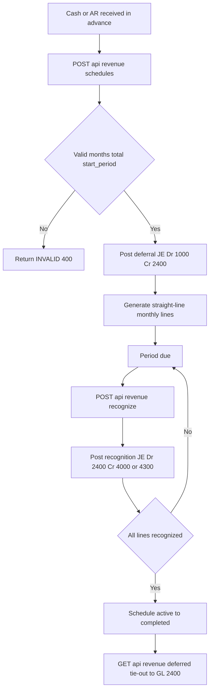

# Revenue Recognition & Billing — Process Narrative

> **DRAFT v0.1** — contains `<<placeholders>>` pending owner confirmation.

## 1. Document control

| Field | Value |
| --- | --- |
| Process ID | PN-12-REVREC |
| Process owner | `<<Revenue / Controller>>` |
| Approver | `<<approver>>` |
| Version | **0.1 DRAFT** |
| Effective date | `<<effective-date>>` |
| Review cadence | Annual + on significant change |
| Related RCM controls | REVREC-01, REVREC-02, REVREC-03, REVREC-04, **REV-19 (TFRS 15)**, GL-01, REC-01 |
| Related policy | `compliance/policies/revenue-recognition-policy.md` |

## 2. Purpose

To define the controlled process by which the organization records deferred revenue, recognizes earned revenue over the service period in accordance with the matching principle, and bills recurring and subscription streams. The process ensures that revenue is recognized completely, accurately, in the correct period, and only once, and that the unearned-revenue liability reconciles to the general ledger.

## 3. Scope

**In scope:** Creation of deferred-revenue schedules and the initial deferral journal entry; periodic recognition of earned revenue; subscription and recurring service billing; the deferred-revenue completeness and tie-out reporting.

**Out of scope:** One-shot point-of-sale and order-driven sales (see `01-order-to-cash.md`); project percentage-of-completion revenue (see `16-project-accounting.md`); cash collection and settlement (see `07-cash-treasury.md`); period close mechanics (see `04-general-ledger-close.md`).

## 4. References

- ISO 9001:2015 clause 4.4 (Quality management system and its processes); clause 8.1 (Operational planning and control); clause 8.2.3 (Review of requirements for products and services).
- `compliance/Oshinei_ERP_SOX_RCM_v1.xlsx` — Revenue (REV-*, REVREC-*), GL-01, REC-01 control families.
- `compliance/policies/revenue-recognition-policy.md`; `compliance/policies/journal-entry-policy.md`.
- Code: `apps/api/src/modules/revenue/revenue.controller.ts`, `apps/api/src/modules/revenue/revenue.service.ts`, `apps/api/src/modules/billing/billing.service.ts`, `apps/api/src/modules/ledger/ledger.service.ts`.

## 5. Definitions & abbreviations

| Term | Definition |
| --- | --- |
| Deferral / DEFREV | Document source prefix for the initial deferred-revenue journal entry. |
| REVREC | Document source for a recognition journal entry. |
| Unearned Revenue | Liability account 2400; cash received in advance not yet earned. |
| Schedule | A deferred-revenue plan splitting a total across monthly recognition lines. |
| Straight-line | Recognition method: total / months, with the rounding remainder applied to the final month. |
| Idempotent | A posting that, if re-invoked with the same reference, does not post twice (`alreadyPosted`). |
| RLS | Row-Level Security; tenant isolation enforced at the Postgres row level. |
| SoD | Segregation of Duties. |
| RCM | Risk & Control Matrix. |
| TFRS 15 / IFRS 15 | The five-step revenue-recognition standard (identify contract → identify performance obligations → determine transaction price → allocate by SSP → recognize as satisfied). |
| Performance obligation (PO) | A distinct promise in a contract (e.g. implementation, licence, support) recognized independently. |
| SSP | Standalone selling price — the price a PO would sell for on its own; the basis for allocating the transaction price. |
| Contract Liability / Deferred Revenue | Account **2410**; the obligation to transfer goods/services for which the customer has been invoiced (TFRS 15). |
| Refund Liability | Account **2420**; the provision for expected returns/refunds (TFRS 15 variable consideration). |

## 5b. TFRS 15 / IFRS 15 revenue recognition (REV-19)

In addition to the legacy straight-line DEFREV schedule (cash-in-advance deferred to 2400 and recognized to 4000), the system implements the full **TFRS 15 / IFRS 15 five-step** model for service / subscription / project-style contracts (the restaurant POS retains immediate recognition). The five steps map to the engine as follows:

1. **Identify the contract** — `rev_contracts` (contract no, date, total transaction price, currency, status Draft→Active→Completed).
2. **Identify the performance obligations** — `performance_obligations` (each PO has a name, an SSP, a recognition `method` of `point_in_time` or `over_time`, and over-time date range).
3. **Determine the transaction price** — `rev_contracts.total_price`.
4. **Allocate by SSP** — `POST /api/revenue/contracts/:id/allocate`: `allocated_price[i] = total_price × ssp[i] / Σssp`. The rounding residual is placed on the largest-SSP PO so **Σ allocated == total_price exactly**. `Σssp ≤ 0` → `INVALID_ALLOCATION`.
5. **Recognize as satisfied** — `POST /api/revenue/contracts/recognize` releases deferred revenue for each due schedule row.

**GL postings** (all via `LedgerService.postEntry`, so the period lock and GL-17 audit bind):

| Step | Source | Debit | Credit |
| --- | --- | --- | --- |
| Activation / invoice (`/:id/activate`) | `REVREC-INV` | 1100 Accounts Receivable | 2410 Deferred Revenue |
| Recognition (`/recognize`) | `REVREC` | 2410 Deferred Revenue | 4300 Recognized Revenue |
| Refund-liability accrual (`/:id/refund-liability`) | `REVREC-REF` | 4300 Revenue (contra) | 2420 Refund Liability |

`buildSchedule` (`/:id/schedule`) is idempotent — it rebuilds only **unrecognized** rows; recognized rows are never touched. `over_time` POs straight-line the allocated price across the months `start..end`; `point_in_time` POs get one row at the satisfaction date. Recognition is idempotent per row (an already-recognized row is skipped — no double post) and tenant-scoped (an HQ/Admin caller must name a `tenant_id` → `TENANT_REQUIRED`). The refund-liability accrual posts only the **delta** vs the prior posted provision.

## 6. Roles & responsibilities (RACI)

Segregation of duties is enforced per **R07** (the user who initiates a schedule must not approve/post recognition) and the relevant permissions (`ar` for billing/recognition operations, `exec` for oversight). The application enforces tenant isolation via multi-tenant RLS and identity via JWT.

| Activity | AR Clerk (`ar`) | Revenue Accountant | Controller / Approver (`exec`) | System |
| --- | --- | --- | --- | --- |
| Create deferral schedule + initial JE | R | C | A | I |
| Recognize period revenue | R | C | A | I |
| Review deferred-revenue tie-out | I | R | A | I |
| Subscription / recurring billing run | R | C | A | I |
| Post balanced JE to GL | I | I | I | R |

## 7. Process narrative

1. **Create deferred-revenue schedule.** AR clerk calls `POST /api/revenue/schedules`. The service validates `months >= 1`, `total_amount > 0`, and `start_period` matching `YYYY-MM`; failure raises **INVALID (400)**. A schedule number is allocated with prefix `DEFREV-`. The initial deferral JE is posted: **Dr 1000 Cash/AR, Cr 2400 Unearned Revenue** for the full total. Posting is idempotent via `alreadyPosted('DEFREV', scheduleNo)`. Control: **REVREC-01**, **GL-01**.
2. **Generate recognition lines.** The schedule splits the total straight-line across `months`: each line = total / months, with the rounding remainder allocated to the final month so the sum ties exactly to the total. Lines carry `period` (`YYYY-MM`) and `recognized = false`. Control: **REVREC-02**.
3. **List / query schedules.** Users call `GET /api/revenue/schedules` filtering by `status` or `source_ref` to review outstanding obligations. Control: Operational.
4. **Recognize period revenue (tenant-scoped).** For a given period, the Revenue Accountant calls `POST /api/revenue/recognize`. The run is **scoped to a single tenant**: a tenant-bound user recognizes their own due lines, while an HQ/Admin caller (whose request bypasses RLS) **must** pass `tenant_id` — otherwise the call is rejected `TENANT_REQUIRED` (it would otherwise recognize every tenant's due lines at once). The service posts all due lines where `recognized = false` for that period **and that tenant**: **Dr 2400 Unearned Revenue, Cr 4000 Revenue** (or 4300 Subscription & Service Revenue for recurring/service streams). Source `REVREC`, reference `scheduleNo:period`. Posting is idempotent via `alreadyPosted('REVREC', ref)`; on a crash-recovery re-run the existing `entry_no` is recovered onto the line so the audit link is preserved. Control: **REVREC-03**, **GL-01**, **ITGC-AC-03**.
5. **Complete schedule.** When all lines are recognized, the schedule transitions `active -> completed`. Control: Operational.
6. **Subscription & recurring billing.** Recurring and membership streams use account **4300 Subscription & Service Revenue**. The recurring billing cadence creates periodic invoices recognized over the service period — deferred via **2400** then recognized to **4300** as service is delivered. Milestone / percentage-of-completion arrangements are supported by recognizing the relevant scheduled lines as each milestone completes. Control: **REVREC-04**.
7. **Deferred-revenue completeness check.** The Controller calls `GET /api/revenue/deferred` to compare remaining unrecognized line value against the GL **2400** balance, evidencing completeness and the subledger-to-GL tie-out. Control: **REC-01**.
8. **Service-contract renewal & expiry (SVC-3, SVC-02).** A service contract (`modules/service`, `service_contracts`) has an `end_date` — without a renewal workflow it silently lapses (recurring revenue lost) or is renewed at an arbitrarily inflated price by one hand. The renewal control adds, alongside the SLA/subscription surfaces (which it never touches): a **proposal** `POST /api/service/contracts/:id/renew` (service/masterdata duty) computes the successor value = `base × (1 + uplift_pct/100)`. A **within-ceiling** proposal — `uplift_pct ≤` the per-tenant threshold `contract_renewal_settings.max_auto_uplift_pct` (default **5%**), and not an auto-renew that raises price — auto-approves and creates the successor `service_contracts` row immediately (linked via `renewed_to_contract_id`; the old contract's `renewal_status='renewed'`). A proposal **over the ceiling**, or any **auto-renew with a price rise**, is parked `pending` and the successor is created **only when a DIFFERENT user approves** (`POST /api/service/renewals/:id/approve`, approver duty) — `approved_by ≠ requested_by`, else **403 SOD_SELF_APPROVAL** (SVC-02 maker-checker). **Reject** leaves the old contract untouched (`renewal_status='declined'`). Detective side: `GET /api/service/contracts/expiring?days=N` lists Active contracts nearing `end_date` with **no renewal in flight** so they are actioned before they lapse. The uplift ceiling is change-gated to `exec` (`PUT /api/service/renewal-settings`). Control: **SVC-02**.

## 8. Process flow

The AR clerk lane initiates the schedule and triggers billing; the system lane validates input, allocates the document number, and posts balanced journal entries to the ledger; the Revenue Accountant lane invokes recognition for each due period; and the Controller lane performs the deferred-revenue tie-out, providing detective oversight independent of the initiator per R07.

## 9. Control matrix

| Step | Risk | Control | Type | RCM ID | Evidence / Record |
| --- | --- | --- | --- | --- | --- |
| 1 | Revenue recorded as earned before delivery | Cash-in-advance deferred to 2400 via validated schedule | Preventive | REVREC-01 | DEFREV JE; schedule record |
| 1 | Unbalanced or invalid JE | Balanced double-entry enforced by ledger; INVALID 400 on bad input | Preventive | GL-01 | Posted JE; rejected request log |
| 2 | Recognition pattern incorrect / total mis-stated | Straight-line split with remainder to final month ties to total | Preventive | REVREC-02 | Schedule lines; reconciliation to total |
| 4 | Revenue recognized in wrong period or twice | Period-scoped recognition of `recognized=false` lines; idempotent `alreadyPosted` | Preventive | REVREC-03 | REVREC JE; recognition log |
| 6 | Recurring/subscription revenue mis-classified | Service streams recognized to 4300 over service period | Preventive | REVREC-04 | Invoice; recognition JE |
| 7 | Unearned-revenue liability misstated vs GL | Deferred-revenue report tie-out to GL 2400 | Detective | REC-01 | `GET /api/revenue/deferred` output |
| 8 | Contract lapses unrenewed, or renewed at an unauthorised price uplift / self-approved | Renewal-uplift maker-checker: over-ceiling uplift or an auto-renew price rise parks `pending`; approver ≠ proposer (SOD_SELF_APPROVAL) creates the successor; within-ceiling auto-approves | Preventive | SVC-02 | Renewal register (pending/approved/rejected) + successor-contract link |
| 8 | Expiring contract missed (recurring revenue lost) | Expiry worklist lists Active contracts near `end_date` with no renewal in flight | Detective | SVC-02 | `GET /api/service/contracts/expiring?days=N` output |

## 10. Inputs & outputs

**Inputs:** Customer contract / advance receipt; total contract amount; recognition term (months); start period; revenue stream classification (one-shot vs subscription/service).

**Outputs:** Deferred-revenue schedule with monthly lines; DEFREV deferral JE; REVREC recognition JEs; recurring invoices; deferred-revenue tie-out report; updated GL balances on 1000/1100, 2400, 4000, 4300.

## 11. Records & retention

| Record | System of record | Retention |
| --- | --- | --- |
| Deferred-revenue schedules & lines | `revRecSchedules` (Postgres) | `<<7 years / per Thai law>>` |
| DEFREV / REVREC journal entries | General ledger | `<<7 years / per Thai law>>` |
| Recurring invoices | Billing module | `<<7 years / per Thai law>>` |
| Deferred-revenue tie-out reports | Reporting / evidence store | `<<7 years / per Thai law>>` |

## 12. KPIs / metrics

- Unearned-revenue tie-out variance (report vs GL 2400) — target THB 0.
- Percentage of due recognition lines posted within close window.
- Count of INVALID (400) rejections on schedule creation.
- Count of idempotency hits (re-submitted DEFREV/REVREC) — trend toward zero.
- Aged deferred-revenue balance by schedule.

## 13. Exception & error handling

| Error code | Trigger | Handling |
| --- | --- | --- |
| INVALID (400) | `months < 1`, `total_amount <= 0`, or `start_period` not `YYYY-MM` | Reject creation; correct inputs and resubmit. |
| (idempotent skip) | Re-submit of DEFREV/REVREC with existing reference | `alreadyPosted` returns without re-posting; no duplicate JE. |
| `TENANT_REQUIRED` (400) | HQ/Admin runs recognition without a `tenant_id` | Specify the tenant; recognition is scoped to one tenant (ITGC-AC-03). |
| Tie-out variance | Deferred report ≠ GL 2400 | Controller investigates unrecognized/mis-posted lines before close sign-off. |
| `CONTRACT_NOT_FOUND` (404) | TFRS 15 contract id does not exist (this tenant) | Verify the contract id / tenant. |
| `INVALID_ALLOCATION` (400) | `total_price ≤ 0`, no obligations, an over_time PO missing dates, or `Σssp ≤ 0` | Correct the contract / POs and resubmit. |
| `ALREADY_ACTIVE` (400) | `activate` called on an already-active/completed contract | The contract liability is already raised; no action. |
| (idempotent skip) | Re-run `recognize` for a period whose rows are already recognized | `recognized_count = 0`; no duplicate JE (TFRS 15 idempotency). |
| `PERIOD_LOCKED` (400) | Recognition/refund posting into a hard-closed period | Post into an open period (GL-15/16). |
| `SOD_SELF_APPROVAL` (403) | The proposer of a service-contract renewal tries to approve it (SVC-02) | A different service/exec user must approve; the successor contract is created only on independent approval. |
| `CONTRACT_ALREADY_RENEWED` (400) | Proposing/approving a renewal on a contract already renewed | The contract already has a successor (`renewed_to_contract_id`); no action. |
| `RENEWAL_IN_FLIGHT` (400) | Proposing a second renewal while one is `pending` | Approve or reject the in-flight renewal first. |
| `RENEWAL_NOT_PENDING` (400) | Approve/reject on an already-decided renewal | Only a `pending` renewal can be approved/rejected. |
| `UPLIFT_INVALID` (400) | `uplift_pct` is negative | Provide a non-negative uplift; the successor value = base × (1 + uplift/100). |

## 14. Revision history

| Version | Date | Author | Notes |
| --- | --- | --- | --- |
| 0.10 | 2026-07-11 | Platform | **SVC-3 — Service Contract Renewal & Expiry management (Track-2 audit; new control SVC-02, migration 0330).** `service_contracts` had `end_date`/`status` but no renewal workflow, expiry alerting or renewal-price uplift control. Added, ALONGSIDE the SLA-event/subscription paths (untouched): renewal columns on `service_contracts` (`renewal_status`, `auto_renew`, `renewal_uplift_pct`, `renewed_to_contract_id` self-FK) + tables `contract_renewals` + `contract_renewal_settings` (canonical 0232 RLS, tenant-leading indexes). `POST /api/service/contracts/:id/renew` computes new_value = base × (1 + uplift/100): within the per-tenant ceiling (`max_auto_uplift_pct`, default 5%) it auto-approves + creates the successor contract; over-ceiling, or an auto-renew that raises price, parks `pending` for maker-checker approval (`/api/service/renewals/:id/approve|reject`, approver ≠ proposer → `SOD_SELF_APPROVAL`). Detective `GET /api/service/contracts/expiring?days=N`. Reads gate exec/marketing; propose masterdata/exec; approve approvals/exec; the ceiling change-gates to exec. §7 step 8, §9 control matrix +2 rows (SVC-02), §13 +5 error rows. New RCM control **SVC-02** (RCM now <!-- rcm-total -->240<!-- /rcm-total -->). ToE: `cutover/contract-renewal.ts` (19 checks). Web `/service/renewals` (renewal queue + expiry worklist) kept separate from the existing `/service` page. UAT-GL-150..156 + traceability; user manual 16 §16.8 (contract renewals). |
| 0.9 | 2026-07-11 | Platform | **TFRS-15 five-step contract engine surfaced on `/revenue` (UI-only; REV-19 unchanged).** The contract → PO → SSP-allocation → schedule → activate → recognize engine (§5b, added 0.3) had **no UI** — it was reachable only via API/scheduler. Added a **สัญญา TFRS 15** tab to the Revenue Recognition screen: create a contract with its performance obligations (per-PO SSP + point-in-time/over-time method), then per-contract **จัดสรรตาม SSP / สร้างตารางรับรู้ / เปิดใช้** actions and an obligation + schedule drill-down; recognition stays on the deferred tab's period run. No control/GL/schema/RCM change — the endpoints (`POST /api/revenue/contracts`, `…/{id}/allocate|schedule|activate`) and their postings are unchanged. ToE unchanged (`revrec` harness, 34 checks); UAT-GL-149 added to exercise the UI flow; user manual 06 gains a Revenue-recognition section. |
| 0.1 DRAFT | 2026-06-22 | `<<author>>` | Initial draft. |
| 0.2 | 2026-06-23 | Platform | Security review W2 (ITGC-AC-03): revenue recognition is tenant-scoped — HQ/Admin must pass `tenant_id` (`TENANT_REQUIRED`); crash-recovery re-run recovers the existing `entry_no`. Verified by the `revrec` harness cross-tenant case. |
| 0.3 | 2026-06-26 | Platform | **WS3.4 — TFRS 15 / IFRS 15 revenue recognition (REV-19).** Added the contract / performance-obligation / SSP-allocation / schedule / recognition engine: §5b, definitions (PO, SSP, 2410/2420), the activation/recognition/refund GL postings (Dr 1100/Cr 2410 → Dr 2410/Cr 4300 → Dr 4300/Cr 2420), and error codes (`CONTRACT_NOT_FOUND`, `INVALID_ALLOCATION`, `ALREADY_ACTIVE`, `PERIOD_LOCKED`). Tables `rev_contracts`/`performance_obligations`/`revrec_schedules`/`refund_liability` (migration 0172); accounts 2410/2420. Verified by the `revrec` harness (32 checks). |
| 0.8 | 2026-06-29 | Platform | **AI token cost visibility — `GET /api/billing/ai-usage`.** The per-tenant daily AI token **budget is already enforced** in `AgentService` (`checkBudget` → `AI_BUDGET_EXCEEDED`, `recordUsage` accumulating to `ai_token_usage` via the autocommit client; plan feature `ai_tokens_daily`, default 50 000, Enterprise −1 = unlimited). This adds the **read view** (perm `users`/`exec`, tenant-scoped): today's input/output/total tokens vs the plan limit (+ remaining / over-budget flag) and a 30-day total — the COGS-attribution surface the dashboards need. No enforcement change. **PDF render metering** (the other half of the cost-metering ask) is deferred to the PDF render-path consolidation (PR "Move PDF generation off request path"), where a single choke point makes a per-tenant render counter clean. ToE: `saas-metrics` harness (seed `ai_token_usage` → endpoint returns 15 000 used / 35 000 remaining of the 50 000 default). |
| 0.7 | 2026-06-29 | Platform | **Scheduled TFRS-15 recognition job (`rev_rec_recognize`).** The TFRS-15 recognition engine (REV-19) was reachable only by a manual `POST /api/revenue/contracts/recognize` call. Added a `rev_rec_recognize` report type to the BI scheduler (`REPORT_TYPES` + `generateReport`, alongside `gl_recurring_journals`/`gl_prepaid_amortize`/`lease_periodic_run`) that runs `RevRecService.recognize` for the current period — so due schedules recognize automatically (e.g. a monthly subscription). Idempotent (the `REVREC` JE is `alreadyPosted`-guarded; an already-recognized schedule is skipped) and tenant-scoped (recognizes the caller's tenant). `RevRecService` injected `@Optional()` into `BiService` (RevenueModule added to BiModule). **Note:** this recognizes the *tenants'* own service/subscription contracts; the *platform's* SaaS subscription revenue (Stripe) is the vendor's revenue and is intentionally **not** posted into a customer tenant's GL. No schema/RCM change. ToE: `revrec` harness (scheduled run recognizes all 12 due monthly schedules of a past-dated over-time contract). |
| 0.6 | 2026-06-29 | Platform | **PlanGuard subscription gating — test coverage.** Added explicit ToE for the (already-wired) `PlanGuard` APP_GUARD that gates `@RequiresPlanFeature` routes on subscription status: a non-Admin tenant user (Admin bypasses the guard) hitting the `ai_chat`-gated `GET /api/ai/kb/search` is blocked when the subscription is **Canceled** (`SUBSCRIPTION_INACTIVE`) or the **trial has expired** (`TRIAL_EXPIRED`), and allowed on an **Active** plan whose features include `ai_chat`. No code change — the guard, the `TRIAL_EXPIRED`/`SUBSCRIPTION_INACTIVE`/`PLAN_FEATURE_REQUIRED` codes, and its APP_GUARD registration already existed; this closes the verification gap. ToE: `onboarding` harness. |
| 0.5 | 2026-06-29 | Platform | **SaaS billing — Stripe webhook + subscription state machine.** New `POST /api/billing/stripe/webhook` (`@Public`, `@NoTx`) authenticated by the Stripe signature over the raw body (`stripe.webhooks.constructEvent` with `STRIPE_WEBHOOK_SECRET`; fail-closed in prod, parsed-body accepted in dev/test for local/mock flows — mirrors the PSP-callback gate). `BillingService.applyStripeEvent` maps events to the subscription lifecycle (idempotent, scoped per tenant by `tenant_id` / `stripe_customer_id`): `checkout.session.completed` → **Active** (+ persist `stripe_subscription_id`/`stripe_customer_id`, set plan), `customer.subscription.updated` → mapped status + `current_period_end`, `customer.subscription.deleted` → **Canceled**, `invoice.payment_failed` → **PastDue**. This is the source of truth that activates the checkout intent (1.1) and drives renewals; it pairs with `PlanGuard` (TRIAL_EXPIRED / SUBSCRIPTION_INACTIVE) which already gates access on these statuses. New env: `STRIPE_WEBHOOK_SECRET`. ToE: `onboarding` harness (completed→Active, payment_failed→PastDue, deleted→Canceled). |
| 0.4 | 2026-06-29 | Platform | **SaaS billing — real Stripe Checkout.** `POST /api/billing/checkout` (`@Permissions('users')`) now creates a real Stripe subscription Checkout session when `STRIPE_SECRET_KEY` is set: it reuses/creates the tenant's Stripe customer (persisting `subscriptions.stripe_customer_id`) and a monthly `price_data` line for the chosen plan, returning the hosted checkout `url`. Without a key it returns a mock URL so the flow stays testable offline (CI/dev). A free / zero-price plan is rejected (`PLAN_NOT_PURCHASABLE`). New env: `STRIPE_SECRET_KEY`, `APP_BASE_URL`, optional `STRIPE_SUCCESS_URL`/`STRIPE_CANCEL_URL`. No schema change (the `stripe_customer_id`/`stripe_subscription_id`/`current_period_end` columns already existed). Subscription activation is driven by the Stripe webhook (separate change). ToE: `onboarding` harness (pro → checkout URL+mock; free → `PLAN_NOT_PURCHASABLE`). |
