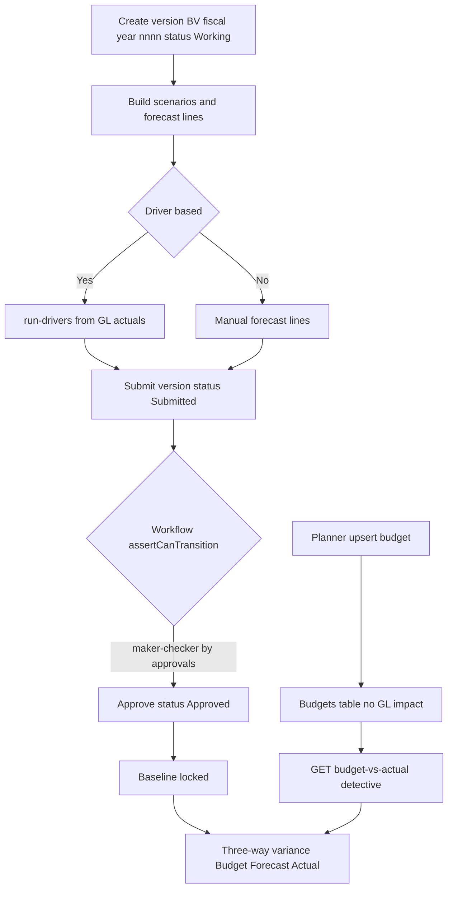

# Budgeting, Planning & Forecasting — Process Narrative

> **DRAFT v0.1** — contains `<<placeholders>>` pending owner confirmation.

## 1. Document control

| Field | Value |
| --- | --- |
| Process ID | PN-13-EPM |
| Process owner | `<<FP&A / Controller>>` |
| Approver | `<<approver>>` |
| Version | **0.5 DRAFT** |
| Effective date | `<<effective-date>>` |
| Review cadence | Annual + on significant change |
| Related RCM controls | EPM-01, EPM-02, EPM-03, EPM-04, BUD-01, BUD-02, ELC-06, GL-05, GOV-01 |
| Related policy | `compliance/policies/budgeting-and-planning-policy.md` |

## 2. Purpose

To define the controlled process for preparing, approving, and baselining budgets and forecasts, and for monitoring actual performance against plan. The process produces no general-ledger postings — budget and plan data are reference data only — but the budget-vs-actual variance reporting is a key detective monitoring control over the posted ledger, and the maker-checker approval of budget versions enforces governance over financial targets.

## 3. Scope

**In scope:** Budget upsert and budget-vs-actual reporting; enterprise performance management (EPM) plan versions, scenarios, manual forecast lines, driver-based forecasting, and three-way (Budget / Forecast / Actual) variance analysis; the version-status finite-state-machine approval workflow.

**Out of scope:** Actual journal postings and period close (see `04-general-ledger-close.md`); revenue recognition schedules (see `12-revenue-recognition-billing.md`); project budgets (see `16-project-accounting.md`).

## 4. References

- ISO 9001:2015 clause 4.4 (QMS and its processes); clause 8.1 (Operational planning and control); clause 9.1 (Monitoring, measurement, analysis and evaluation).
- `compliance/Oshinei_ERP_SOX_RCM_v1.xlsx` — EPM-*, GL-05 (maker-checker) families.
- `compliance/policies/budgeting-and-planning-policy.md`; `compliance/policies/delegation-of-authority-policy.md`.
- Code: `apps/api/src/modules/ledger/ledger.controller.ts` (budgets), `apps/api/src/modules/planning/planning.controller.ts`, `apps/api/src/modules/planning/planning.service.ts`, `apps/api/src/modules/workflow/` (WorkflowService).

## 5. Definitions & abbreviations

| Term | Definition |
| --- | --- |
| EPM | Enterprise Performance Management — versioned plans, scenarios, drivers. |
| Budget version | Plan container, document prefix `BV-{fiscal_year}-{nnnn}`. |
| Scenario | A set of forecast lines under a version (manual or driver-derived). |
| Driver | A rule (percent / rate / absolute) that computes forecast values from GL actuals. |
| Actual | Net signed GL movement from posted journal entries. |
| Variance | actual − budget; variance% = variance / \|budget\| × 100. |
| IPE | Information Produced by the Entity — here, actuals derived from the posted ledger. |
| Maker-checker | The preparer of a version may not approve it (R07 / GL-05). |
| FSM | Finite-state machine governing version status transitions. |

## 6. Roles & responsibilities (RACI)

Segregation of duties is enforced per **R07** — the user who creates/submits a budget version (permission `exec`/`planner`) must not approve it; approval requires the `approvals` permission (maker-checker, **GL-05**), gated by the workflow `assertCanTransition`.

| Activity | Planner (`exec`/`planner`) | Approver (`approvals`) | Controller / FP&A | System |
| --- | --- | --- | --- | --- |
| Create / upsert budget | R | I | A | I |
| Create plan version & scenarios | R | I | C | I |
| Submit version for approval | R | I | I | R |
| Approve version | I | R | A | I |
| Baseline approved version | I | R | A | I |
| Monitor budget-vs-actual variance | C | I | R | R |

## 7. Process narrative

1. **Upsert budget (maker-checker).** Planner calls `POST /api/ledger/budgets`. Records are upserted by `fiscal_year + account_code + period + cost_center`. In `annual` mode the amount is split into 12 monthly lines with the rounding remainder applied to December; in `monthly` mode a single line is written. Cost center is optional (`null` = corporate). No GL impact. An upserted budget lands as **PendingApproval** and is **EXCLUDED from budget-vs-actual** until a **different** user with approval authority approves it (`POST /api/ledger/budgets/approve` for the `fiscal_year`/`account_code`/`cost_center`[/`period`]); self-approval is rejected **`403 SOD_VIOLATION`** (binds even Admin), `reject` marks it Rejected (excluded). An external/direct planning seed (DEFAULT `Approved`) stays usable. This stops one person from entering a self-serving budget that makes overspending look 'on budget'. Pending budgets are also surfaced, aged, by the pending-approvals monitor (**GOV-01**). Control: **EPM-01**, **BUD-01**.
2. **Query / maintain budget.** `GET /api/ledger/budgets` filters by `fiscal_year`, `account_code`, `cost_center`; `DELETE /api/ledger/budgets` removes lines. Control: Operational.
2bis. **Budgetary control / encumbrance on procurement (FIN-3).** The approved budget can be made **enforced**, not just reported: a per-tenant policy (`budget_control_settings.policy`, changed via `PUT /api/budget/control-settings` — restricted to `exec`/`gl_close`, mirrors EXP-04 change control; default **`off`** = report-only, exactly the pre-FIN-3 behaviour) gates **PR and PO approval** (never the request — asking is free). At approval the gate computes **availability = approved budget (fiscal-YTD through the approval month, Asia/Bangkok) − GL actuals (YTD, Posted) − OPEN commitments** per resolved budget account (`item.cogs_account` → `item_categories.cogs_account` → `budget_control_settings.default_expense_account`; project/BoQ-tagged lines are excluded — **PROJ-12/13** already encumber them — as are `is_capital` lines). Policy outcomes when the document would exceed availability: **advise** = approve + annotate the response (`budget.exceeded`); **warn** = `422 BUDGET_CONFIRM_REQUIRED` until the approver resubmits with `confirm_over_budget:true`; **block** = `422 BUDGET_EXCEEDED` unless an **exec override** (`override_budget:true` + mandatory `override_reason`; a non-exec approver gets `403 BUDGET_OVERRIDE_DENIED`, a missing reason `400 BUDGET_OVERRIDE_REASON_REQUIRED`) — the override is **audited** on the commitment row (`over_budget`, `override_by`, `override_reason`) and the doc status log. The final approval **records the commitment** in `budget_commitments` (one encumbrance engine shared with the project BoQ ledger — `CommitmentsService`): a PR reserves its item-master **estimate** (released when it converts to POs), a PO reserves the **ordered amount** (consumed on full receipt, released on cancel / close-short). Scope: only accounts **with an approved budget** for the fiscal year are enforced — unbudgeted spend stays visible to **ELC-06**. Reads: `GET /api/budget/availability` (by key or by `doc_type`+`doc_no` — the approval-screen chip), `GET /api/budget/commitments` (audit list). Control: **BUD-02**. Migration **0296**.
3. **Budget-vs-actual reporting.** `GET /api/ledger/budget-vs-actual` reads budget from the budgets table and actual as the net signed GL movement from posted JEs. Variance = actual − budget; variance% = variance / \|budget\| × 100. Favorability: revenue/liability/equity favorable if actual ≥ budget; expense/asset favorable if actual ≤ budget. Status is `On Budget` / `Favorable` / `Unfavorable`. Actuals are IPE derived from the posted ledger. Each line is also flagged **`material`** when the variance is at least **THB 1,000 AND ≥ 10% of budget** (or unbudgeted actual spend ≥ THB 1,000), and **`requires_review`** when a material variance is unfavourable; the report carries a **review summary** (`material_count`, `requires_review_count`, `unfavorable_total`, the materiality thresholds, and the `last_signoff`). This operationalizes the entity-level **management review** that errors in results are not undetected: management records a **review sign-off** with a required follow-up note (`POST /api/ledger/budget-review/sign-off`, gated `exec`/`approvals`/`gl_close`) — captured with the material-variance count + unfavourable total **at review time** and retained as append-only evidence; the report then shows `last_signoff`, and the **review history** (`GET /api/ledger/budget-reviews`) is the sample-able audit trail of monthly variance review + follow-up (**ELC-06**). Control: **EPM-03** (detective), **EPM-04** (IPE accuracy), **ELC-06** (management variance review).
4. **Create plan version.** Planner calls `POST /api/planning/versions` (prefix `BV-{fiscal_year}-{nnnn}`, status `Working`). `GET /api/planning/versions` and `GET /api/planning/versions/:id` list/read versions; missing id raises **VERSION_NOT_FOUND (404)**. Control: **EPM-02**.
5. **Build scenarios & forecast lines.** `POST /api/planning/versions/:id/scenarios` creates scenarios; `POST /api/planning/scenarios/:id/clone` copies one; `GET /api/planning/scenarios/:id/lines` reads lines. `PUT /api/planning/scenarios/:id/lines` upserts manual forecast lines (unique `scenario_id + account_code + period`, source `Manual`). Missing scenario raises **SCENARIO_NOT_FOUND (404)**. Control: Operational.
6. **Driver-based forecasting.** `POST /api/planning/scenarios/:id/drivers` defines drivers of type `percent`/`rate`/`absolute`; an unknown type raises **INVALID_DRIVER_TYPE (400)**. `POST /api/planning/scenarios/:id/run-drivers` computes forecast from GL actuals: `percent` = actual × (1 + rate/100); `rate` = fixed; `absolute` = value; source `Driver`. No periods raises **NO_PERIODS (400)**. Control: Operational.
7. **Submit for approval.** `POST /api/planning/versions/:id/submit` sets status `Submitted` and triggers `WorkflowService.start` (auto-approved if no workflow definition exists). Control: **EPM-02**, **GL-05**.
8. **Approve (maker-checker).** `POST /api/planning/versions/:id/approve` requires the `approvals` permission and is gated by the workflow `assertCanTransition`; an invalid transition raises **INVALID_STATUS (400)**. The approver must differ from the submitter (R07). Control: **GL-05**, **EPM-02**.
9. **Baseline.** `POST /api/planning/versions/:id/baseline` locks the version; the version must be `Approved` first, else **INVALID_STATUS (400)**. Control: **EPM-02**.
10. **Three-way variance.** `GET /api/planning/versions/:id/variance?scenario_id=&period=` reports Budget vs Forecast vs Actual, where actual is the net GL movement. Control: **EPM-03** (detective).

## 8. Process flow

The Planner lane creates budgets, versions, scenarios, and forecast lines and submits for approval; the system/workflow lane enforces the status FSM and derives actuals from the posted ledger; the Approver lane (segregated from the preparer per R07) approves and baselines; and the Controller/FP&A lane runs budget-vs-actual and three-way variance as detective monitoring over the GL.

## 9. Control matrix

| Step | Risk | Control | Type | RCM ID | Evidence / Record |
| --- | --- | --- | --- | --- | --- |
| 1 | Budget data inconsistent / duplicated | Upsert keyed on fiscal_year+account+period+cost_center; deterministic 12-way split | Preventive | EPM-01 | Budget table rows |
| 1 | Budget entered/changed by one person drives variance reporting with no review | **Budget maker-checker** — upsert is PendingApproval & excluded from budget-vs-actual until a different user approves; self-approve → `SOD_VIOLATION` (binds Admin) | **Preventive** | **BUD-01** | `SOD_VIOLATION`; `budget` harness |
| 2bis | Budget is report-only — over-budget PRs/POs are approved with commitments invisible to authorization | **Budgetary control / encumbrance gate** — at PR/PO approval, availability = approved budget − GL actuals − open commitments; policy off/advise/warn/block; block needs an **exec** override with a mandatory reason, audited on the `budget_commitments` row; approval reserves, receipt consumes, cancel/convert releases | **Preventive** | **BUD-02** | `BUDGET_EXCEEDED`/`BUDGET_CONFIRM_REQUIRED`; `budget_commitments` audit rows; `budget` harness |
| 4,7 | Unauthorized or out-of-sequence version change | Version status FSM gate (`assertCanTransition`) | Preventive | EPM-02 | Version status history |
| 8 | Preparer self-approves budget | Maker-checker; `approvals` permission distinct from submitter (R07) | Preventive | GL-05 | Approval record; workflow log |
| 3,10 | Performance against plan not monitored | Budget-vs-actual and three-way variance reporting | Detective | EPM-03 | Variance report output |
| 3 | Material errors in results undetected by management | Budget-vs-actual flags **material** variances (≥10% & ≥THB 1,000); management records a **review sign-off** with a follow-up note, retained as append-only evidence + shown as `last_signoff` + a review history | **Detective / Hybrid** | **ELC-06** | Material-variance report + budget-review sign-off log; `budget` harness |
| 3 | Actuals (IPE) inaccurate / not from ledger | Actuals computed as net signed movement from posted JEs only | Detective | EPM-04 | Report-to-GL reconciliation |

## 10. Inputs & outputs

**Inputs:** Fiscal year and periods; account codes and cost centers; budget amounts; driver definitions and rates; posted GL actuals.

**Outputs:** Budget table rows (no GL impact); plan versions/scenarios/forecast lines; baselined version; budget-vs-actual and three-way variance reports. No journal entries are produced by this process.

## 11. Records & retention

| Record | System of record | Retention |
| --- | --- | --- |
| Budget rows | `budgets` table (Postgres) | `<<7 years / per Thai law>>` |
| Plan versions / scenarios / lines | Planning module | `<<7 years / per Thai law>>` |
| Approval & workflow transitions | Workflow / audit log | `<<7 years / per Thai law>>` |
| Variance reports | Reporting / evidence store | `<<7 years / per Thai law>>` |

## 12. KPIs / metrics

- Budget approval cycle time (submit → approve).
- Percentage of cost centers / accounts with an approved baselined budget.
- Forecast accuracy: forecast vs actual variance%.
- Count of INVALID_STATUS rejections (out-of-sequence transitions).
- Number of unfavorable variances exceeding threshold per period.

## 13. Exception & error handling

| Error code | Trigger | Handling |
| --- | --- | --- |
| VERSION_NOT_FOUND (404) | Reference to a non-existent version id | Verify version id; re-query. |
| SCENARIO_NOT_FOUND (404) | Reference to a non-existent scenario id | Verify scenario id; re-query. |
| INVALID_STATUS (400) | Approve/baseline attempted out of FSM sequence | Resolve prior state (submit/approve) before retrying. |
| INVALID_DRIVER_TYPE (400) | Driver type not percent/rate/absolute | Correct driver type and re-create. |
| NO_PERIODS (400) | `run-drivers` invoked with no periods | Define forecast periods before running drivers. |

## 14. Revision history

| Version | Date | Author | Notes |
| --- | --- | --- | --- |
| 0.1 DRAFT | 2026-06-22 | `<<author>>` | Initial draft. |
| 0.2 DRAFT | 2026-06-25 | `<<author>>` | **Budget-vs-actual and Demand-ML UIs surfaced** — new screens `/budget` (account/cost-centre budgets + budget-vs-actual variance, `/api/ledger/budgets` & `/budget-vs-actual`) and `/demand` (multi-algorithm demand forecast/backtest + accuracy history, `/api/demand/*`), both ERP nav → วางแผน & BI. UI-only addition over already-documented endpoints; no process/control change (budgets remain reference data, no GL). See user manual `09-reports-and-analytics.md` and UAT `09-reports-analytics-uat.md`. |
| 0.3 | 2026-06-26 | Platform | **BUD-01 — budget maker-checker.** Step 1: an upserted budget is now PendingApproval and EXCLUDED from budget-vs-actual until a different user approves it (`POST /api/ledger/budgets/approve`, gated `approvals`/`gl_close`); self-approval → `403 SOD_VIOLATION` (binds Admin); reject excludes it. `budget.service.ts` upsertBudget(→PendingApproval)/approveBudget/rejectBudget/budgetVsActual(Approved-only). New RCM control **BUD-01**; migration **0141** (`budgets.status`/`requested_by`/`approved_by`/`approved_at`, DEFAULT 'Approved' for backward compat — direct planning seeds stay usable); control matrix gains a step-1 preventive row; also surfaced by the pending-approvals monitor (GOV-01). Web `/budget`: status badges + approve/reject on pending budgets. ToE: `budget` harness (upsert PendingApproval → excluded from B/A; self-approve SOD_VIOLATION; independent approve → counts). |
| 0.4 | 2026-06-26 | Platform | **ELC-06 — management budget-variance review (Partial → Implemented).** Step 3: budget-vs-actual now flags **material** variances per line (≥ THB 1,000 AND ≥ 10% of budget, or unbudgeted spend) with `material`/`requires_review` + a review summary (`material_count`, `requires_review_count`, `unfavorable_total`, `last_signoff`). Management records a **review sign-off** (`POST /api/ledger/budget-review/sign-off`, required follow-up note; captures the material count + unfavourable total at review time) retained as append-only evidence (`budget_reviews`, migration **0144**) and surfaced as `last_signoff`; the **review history** (`GET /api/ledger/budget-reviews`) is the audit trail. Web `/budget`: a variance-review banner (material count + ⚠ flags + บันทึกการสอบทาน) + last sign-off. ELC-06 moves Partial → Implemented. ToE: `budget` harness (material flag + summary; sign-off requires a note; records reviewer + material count; report then shows last_signoff; history lists it). |
| 0.5 | 2026-07-10 | Platform | **BUD-02 — budgetary control / encumbrance gate on procurement (FIN-3).** New step 2bis: a per-tenant policy (`budget_control_settings`, default **off** = report-only; `GET/PUT /api/budget/control-settings`, change restricted `exec`/`gl_close`) gates **PR/PO approval** on availability = approved budget (fiscal-YTD) − GL actuals − open commitments per resolved budget account (item → category → default account; project/BoQ + capital lines excluded). advise annotates; warn requires `confirm_over_budget`; block rejects `422 BUDGET_EXCEEDED` unless an **exec** override with a mandatory reason (`403 BUDGET_OVERRIDE_DENIED` / `400 BUDGET_OVERRIDE_REASON_REQUIRED`), audited on the commitment row + status log. Approval records the encumbrance in **`budget_commitments`** (PR = item-master estimate, released at PR→PO conversion; PO = ordered amount, consumed on full receipt, released on cancel/close-short) via the shared `CommitmentsService` engine (PROJ-12 twin). Reads `GET /api/budget/availability` (key or doc) + `GET /api/budget/commitments`. Web: `/budget` ควบคุมงบ tab (policy + availability + commitment audit); availability chip + confirm/override interaction on `/requisitions` and `/procurement` (PO approve/reject now inline). New RCM control **BUD-02**; migration **0296**; ToE: `budget` harness (18 BUD-02 checks: default-off byte-identical, advise/warn/block, non-exec override 403, reason required, audit row, receipt consumes, conversion releases). |
