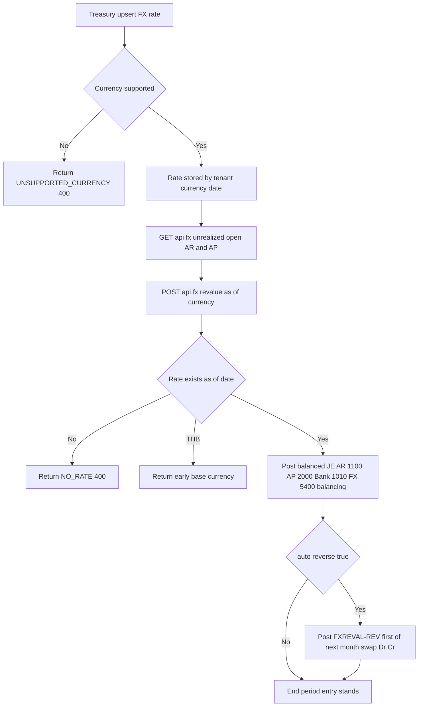

# Foreign-Currency Revaluation — Process Narrative

> **DRAFT v0.1** — contains `<<placeholders>>` pending owner confirmation.

## 1. Document control

| Field | Value |
| --- | --- |
| Process ID | PN-14-FX |
| Process owner | `<<Treasury / Controller>>` |
| Approver | `<<approver>>` |
| Version | **0.1 DRAFT** |
| Effective date | `<<effective-date>>` |
| Review cadence | Annual + on significant change |
| Related RCM controls | FX-01, FX-02, FX-03, FX-04, GL-01, GOV-01 |
| Related policy | `compliance/policies/foreign-currency-policy.md` |

## 2. Purpose

To define the controlled process for maintaining authorized foreign-exchange rates and for performing period-end revaluation of open non-base-currency receivable and payable balances, so that unrealized FX gains and losses are recognized completely and accurately in the correct period, and reversed in the following period to avoid double-counting realized FX at settlement.

## 3. Scope

**In scope:** FX rate maintenance (upsert and lookup); the unrealized FX gain/loss report on open foreign-currency AR and AP balances; the period-end revaluation journal entry and its automatic next-period reversal.

**Out of scope:** Base-currency (THB, rate 1.0) balances; realized FX at cash settlement and bank reconciliation (see `07-cash-treasury.md`); period close orchestration (see `04-general-ledger-close.md`).

## 4. References

- ISO 9001:2015 clause 4.4 (QMS and its processes); clause 8.1 (Operational planning and control); clause 8.5.1 (Control of provision of services).
- `compliance/Oshinei_ERP_SOX_RCM_v1.xlsx` — FX-*, GL-01 families.
- `compliance/policies/foreign-currency-policy.md`; `compliance/policies/journal-entry-policy.md`.
- Code: `apps/api/src/modules/fx/fx.controller.ts`, `apps/api/src/modules/fx/fx.service.ts`, `apps/api/src/modules/ledger/ledger.service.ts`.

## 5. Definitions & abbreviations

| Term | Definition |
| --- | --- |
| Base currency | THB, fixed rate 1.0; revaluation returns early for THB. |
| Booked rate | The FX rate at the invoice/transaction date. |
| Current rate | The latest authorized rate ≤ the as-of date. |
| open_foreign | Open foreign-currency amount = invoice − paid. |
| Delta | current_thb − booked_thb (unrealized movement). |
| FXREVAL | Document source for the period-end revaluation JE. |
| FXREVAL-REV | Document source for the auto-generated reversing JE. |
| Idempotent | Re-posting with the same reference is suppressed (`alreadyPosted`). |
| RLS | Row-Level Security; tenant isolation in Postgres. |

## 6. Roles & responsibilities (RACI)

Segregation of duties is enforced per **R07** — the user who authorizes/maintains FX rates must not be the sole party initiating the revaluation posting. Rate and revaluation operations require `exec`, `ar`, or `creditors` permissions per the affected ledger; tenant isolation is enforced by multi-tenant RLS and identity by JWT.

| Activity | Treasury (`exec`) | AR/AP (`ar`/`creditors`) | Controller / Approver | System |
| --- | --- | --- | --- | --- |
| Maintain / authorize FX rate | R | C | A | I |
| Review unrealized FX report | C | R | A | I |
| Initiate period-end revaluation | R | C | A | I |
| Post balanced revaluation JE | I | I | I | R |
| Confirm auto-reversal next period | I | I | A | R |

## 7. Process narrative

1. **Maintain FX rate (maker-checker).** Treasury calls `POST /api/fx/rates`, upserting a rate by `tenant + currency + rate_date` (delete-then-insert). An unsupported currency raises **UNSUPPORTED_CURRENCY (400)**. A **manually-entered** rate is recorded as **PendingApproval** and is **NOT usable** — rate resolution for revaluation, the unrealized-FX report, and consolidation translation all use **Approved** rates only — until a **different** user with approval authority approves it (`POST /api/fx/rates/approve`); self-approval is rejected **`403 SOD_VIOLATION`** (binds even Admin), `reject` marks it Rejected (never usable), and re-entering a rate returns it to PendingApproval. An **externally-sourced** rate (a feed carrying an explicit non-manual `source`) is **auto-approved**. This stops a fat-fingered rate (e.g. USD 36 keyed as 63) from flowing straight into a revaluation JE that mis-states earnings/equity. Pending rates are also surfaced, aged, by the pending-approvals monitor (**GOV-01**). Control: **FX-01**, **FX-04**.
2. **Look up rate.** `GET /api/fx/rates` filters by `currency` and `as_of`, returning the latest rate with `rate_date <= as_of`. Control: Operational.
3. **Report unrealized FX.** `GET /api/fx/unrealized` computes, as of a date, the unrealized gain/loss on OPEN non-THB AR invoices and AP transactions: `open_foreign = invoice − paid`; `booked_thb = open_foreign × booked_rate` (at invoice date); `current_thb = open_foreign × current_rate`; `delta = current_thb − booked_thb`. The summary reports AR total, AP total, and net. Control: **FX-02** (completeness over open foreign balances).
4. **Post period-end revaluation.** Treasury calls `POST /api/fx/revalue` for a currency as-of a date. Source `FXREVAL`, reference `FXREVAL|as_of:currency`. The JE is balanced as follows: AR **1100** is Dr if delta > 0 else Cr; AP **2000** is Cr if delta > 0 else Dr; Bank **1010** follows its delta; and **5400 FX Gain/Loss (Unrealized)** is the balancing line — Cr when net gain, Dr when net loss. Posting is idempotent via `alreadyPosted('FXREVAL', ref)`. If no rate exists for the currency as-of the date, **NO_RATE (400)** is raised. THB returns early with a "base currency" note. Control: **GL-01**, **FX-02**.
5. **Auto-reverse next period.** When `auto_reverse = true`, the service posts a reversing **FXREVAL-REV** JE dated the 1st of the next month, swapping Dr/Cr on every line. The reversal is idempotent on its own `revRef`. This prevents double-counting of realized FX when the balance settles in the following period. Control: **FX-03**.

## 8. Process flow

The Treasury lane authorizes rates and initiates the revaluation; the AR/AP lane reviews the unrealized exposure on open foreign balances; the system lane validates the rate, posts the single balanced FXREVAL entry with 5400 as the balancing gain/loss line, and (when requested) posts the idempotent reversing entry on the 1st of the next month; and the Controller lane confirms completeness and the reversal at close, segregated from rate authorization per R07.

## 9. Control matrix

| Step | Risk | Control | Type | RCM ID | Evidence / Record |
| --- | --- | --- | --- | --- | --- |
| 1 | Unauthorized or erroneous FX rate used | Rate upsert by tenant+currency+date; UNSUPPORTED_CURRENCY 400 | Preventive | FX-01 | Rate table; source documentation |
| 1 | A wrong manual rate drives revaluation/reporting with no review | **FX rate maker-checker** — manual rate is PendingApproval (unusable); revaluation/report/consolidation resolve Approved rates only; approver ≠ requester (binds Admin) | **Preventive** | **FX-04** | `SOD_VIOLATION`; `NO_RATE` while pending; `fxreval` harness |
| 3,4 | Open foreign balances not fully revalued | Reval iterates all open non-THB AR/AP; unrealized report tie | Detective | FX-02 | Unrealized report; FXREVAL JE |
| 4 | Unbalanced revaluation JE | 5400 booked as balancing line; balanced double-entry enforced | Preventive | GL-01 | Posted FXREVAL JE |
| 4 | Revaluation posted twice | Idempotent `alreadyPosted('FXREVAL', ref)` | Preventive | FX-02 | Idempotency log |
| 5 | Unrealized FX double-counted at settlement | Auto-reversing FXREVAL-REV on 1st of next month, idempotent | Preventive | FX-03 | Reversal JE; revRef |

## 10. Inputs & outputs

**Inputs:** Authorized FX rates by currency and date; open non-THB AR invoices and AP transactions; revaluation as-of date; auto-reverse flag.

**Outputs:** Stored FX rates; unrealized FX gain/loss report (AR/AP/net); FXREVAL revaluation JE (1100 / 2000 / 1010 / 5400); FXREVAL-REV reversing JE; updated GL balances.

## 11. Records & retention

| Record | System of record | Retention |
| --- | --- | --- |
| FX rate table | `fx` rates (Postgres) | `<<7 years / per Thai law>>` |
| FXREVAL journal entries | General ledger | `<<7 years / per Thai law>>` |
| FXREVAL-REV reversing entries | General ledger | `<<7 years / per Thai law>>` |
| Unrealized FX reports | Reporting / evidence store | `<<7 years / per Thai law>>` |

## 12. KPIs / metrics

- Number of open foreign-currency balances revalued at period end vs total open.
- Net unrealized FX gain/loss by currency per period.
- Count of NO_RATE (400) failures (missing rate coverage) — target zero.
- Reversal completeness: FXREVAL entries with matching FXREVAL-REV — target 100%.
- Days between rate authorization and revaluation run.

## 13. Exception & error handling

| Error code | Trigger | Handling |
| --- | --- | --- |
| UNSUPPORTED_CURRENCY (400) | Rate upsert for a currency not supported | Reject; confirm currency setup before retry. |
| NO_RATE (400) | `revalue` with no rate for currency as-of date | Authorize/load the rate, then re-run revaluation. |
| (base currency early return) | `revalue` invoked for THB | Service returns "base currency" note; no JE posted. |
| (idempotent skip) | Re-submit of FXREVAL/FXREVAL-REV with existing ref | `alreadyPosted` suppresses duplicate posting. |

## 14. Revision history

| Version | Date | Author | Notes |
| --- | --- | --- | --- |
| 0.1 DRAFT | 2026-06-22 | `<<author>>` | Initial draft. |
| 0.2 | 2026-06-26 | Platform | **FX-04 — FX rate maker-checker.** Step 1: a manually-entered rate is now PendingApproval and excluded from rate resolution (revaluation, unrealized-FX report, consolidation translation use Approved rates only) until a different user approves it (`POST /api/fx/rates/approve`, gated `approvals`/`gl_close`); self-approval → `403 SOD_VIOLATION` (binds Admin); external-feed rates auto-approve. `fx.service.ts` setRate/approveRate/rejectRate/rateAsOf(Approved-only); `consolidation.service.ts` translation filtered to Approved. New RCM control **FX-04**; migration **0140** (`fx_rates.status`/`requested_by`/`approved_by`/`approved_at`, DEFAULT 'Approved' for backward compat); also surfaced by the pending-approvals monitor (GOV-01). ToE: `fxreval` (manual rate PendingApproval → revalue blocked NO_RATE; self-approve SOD_VIOLATION; independent approve → revalue succeeds). |
