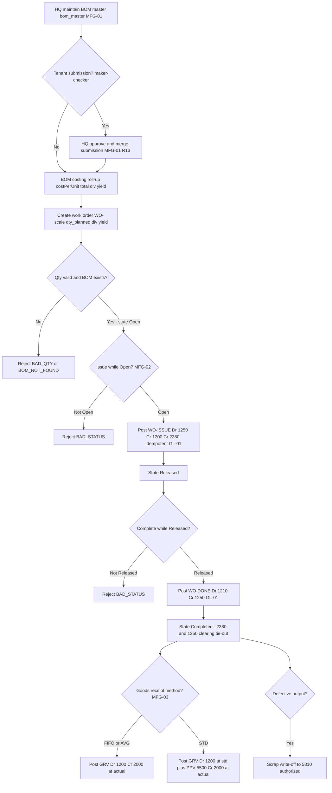

# Manufacturing & Costing — Process Narrative

## 1. Document control

| Field | Value |
|---|---|
| Process ID | PN-15-MFG |
| Process owner | `<<Production / Cost Accountant>>` |
| Approver | `<<CFO>>` |
| Version | **0.1 DRAFT** |
| Effective date | `<<effective-date>>` |
| Review cadence | Annual + on significant change |
| Related RCM controls | MFG-01, MFG-02, MFG-03, GL-01, INV-01; SoD R04, R13 |
| Related policy | `compliance/policies/03-delegation-of-authority.md`, `compliance/policies/11-financial-close-policy.md` |

## 2. Purpose

To define and control the bill-of-materials (BOM) lifecycle, the work-order conversion of raw materials into finished goods, and inventory costing (FIFO / AVG / STD), so that work-in-process (WIP), finished-goods inventory, manufacturing cost absorption, and cost of goods sold are **valid, complete, accurate, properly cut off, and authorized**, and that every manufacturing and costing posting reaches the general ledger as a balanced journal entry.

## 3. Scope

**In scope:** BOM master maintenance and HQ-to-tenant distribution (`/api/bom/master`, `/api/bom/master/push`), tenant BOM submission and HQ maker-checker approval (`/api/bom/submissions`), portal BOM and production runs (`/api/portal/bom`), BOM costing roll-up, the work-order lifecycle Open → Released → Completed (`/api/manufacturing/work-orders`), material issue into WIP and finished-goods receipt, the costing configuration and valuation (`/api/costing/config`, `/api/costing/valuation`), available-to-promise / allocation (`/api/costing/atp`, `/api/costing/allocate`), goods-receipt capitalization with purchase-price variance, and scrap / rework write-off.

**Out of scope:** inventory perpetual movement and standard COGS recognition mechanics (see `03-inventory-cogs.md`), restaurant recipe consumption (see `20-restaurant-operations.md`), procurement and AP settlement of the purchase that triggers goods receipt (see `02-procure-to-pay.md`), and the period-close that manufacturing postings flow through (see `04-general-ledger-close.md`). Master-data change control for `bom_master` is governed by `17-master-data-management.md`.

## 4. References

- ISO 9001:2015 cl. 4.4 (process approach), cl. 8.1 (operational planning & control), cl. 8.5 (production & service provision), cl. 8.7 (control of nonconforming outputs).
- `compliance/Oshinei_ERP_SOX_RCM_v1.xlsx` — MFG-01..03, GL-01, INV-01.
- `compliance/policies/03-delegation-of-authority.md` (BOM and work-order authority), `11-financial-close-policy.md` (manufacturing cutoff).
- Code: `apps/api/src/modules/bom/bom.service.ts` + `bom.controller.ts`, `apps/api/src/modules/manufacturing/manufacturing.service.ts` + `manufacturing.controller.ts`, `apps/api/src/modules/costing/costing.service.ts` + `costing.controller.ts` + `atp.service.ts`, `apps/api/src/modules/ledger/ledger.service.ts`, `apps/api/src/common/doc-number.service.ts`.

## 5. Definitions & abbreviations

| Term | Meaning |
|---|---|
| BOM | Bill of materials — recipe of component lines, labor, overhead per yield |
| WIP | Work-in-process; materials and applied conversion costs released to production |
| Yield | Output quantity a BOM produces; basis for `costPerUnit` |
| Scale factor | `qty_planned / yield` — multiplier applied to BOM standard cost on a work order |
| PPV | Purchase Price Variance — difference between actual and standard cost (STD method) |
| FIFO / AVG / STD | Costing methods configured per tenant + item |
| ATP | Available-to-Promise — uncommitted on-hand less allocations |
| Maker-checker | Tenant submits a BOM; HQ approves/merges it (`/api/bom/submissions/:id/approve`) |
| WO- / PRD- | Document-number prefixes (work order / production run) |

GL accounts used: **1200** Raw Materials / Inventory, **1210** Finished Goods, **1250** WIP, **2000** AP, **2380** Manufacturing Costs Applied (clearing), **5000** COGS, **5300** Recipe COGS, **5500** Purchase Price Variance, **5810** Scrap / Rework Loss.

## 6. Roles & responsibilities (RACI)

Single-duty roles enforce SoD: the role that **records a goods receipt / work-order receipt** is never the role that **raised the underlying purchase/production order** (rule **R04**); and **BOM / item master / costing-config maintenance** is segregated from the staff who **transact** against them (rule **R13**). HQ approval of a tenant-submitted BOM is a maker-checker control on master data.

| Activity | ProductionPlanner | WarehouseStaff | CostAccountant | HqMasterSteward | FinancialController / CFO |
|---|---|---|---|---|---|
| Maintain BOM master (`bom_master`) | C | I | C | **A/R** | A |
| Submit tenant BOM (maker) | **A/R** | I | C | I | I |
| Approve / merge BOM submission (checker) | I | I | C | **A/R** | A |
| Push master BOMs to tenants | I | I | I | **A/R** | A |
| Create work order (WO-) | **A/R** | C | C | I | I |
| Issue materials into WIP | C | **A/R** | I | I | I |
| Complete WO / receive finished goods | C | **A/R** | C | I | I |
| Maintain costing config (FIFO/AVG/STD) | I | I | **A/R** | C | A |
| Review PPV / clearing tie-out | I | I | **A/R** | C | A |
| Approve scrap / rework write-off | I | C | **A/R** | I | A |

## 7. Process narrative

1. **BOM master maintenance & distribution.** HqMasterSteward maintains the master BOM library via `GET/POST/PATCH/DELETE /api/bom/master` (permission `bom_master`) and distributes it with `POST /api/bom/master/push`, which pushes master BOMs down to tenants. Master access is segregated from transacting (**R13**, **MFG-01**). An unknown BOM returns `NOT_FOUND`; a missing `bom_code` returns `BAD_REQUEST`.
2. **Tenant BOM submission & HQ approval (maker-checker, decision point).** A tenant submits a BOM (`POST /api/portal/bom`, permission `cust_bom`); HQ reviews the queue (`GET /api/bom/submissions`) and merges it on approval (`PATCH /api/bom/submissions/:id/approve`). Submission/approval is a maker-checker control over master data (**MFG-01**, **R13**). Tenant resolution failure returns `NO_TENANT`.
3. **BOM costing roll-up.** Each line cost = `(qty / conv) * unit_cost`; the BOM total = Σ lines + labor + overhead; `costPerUnit = total / yield`. The roll-up is the standard-cost basis for work-order scaling and STD valuation.
4. **Production run (portal, non-WO path).** `POST /api/portal/bom/:code/production-runs` records a tenant production document (doc prefix **PRD-**); it decrements raw-material inventory (floored at 0) and increments finished goods. This supports lightweight portal production where a full work order is not used.
5. **Work-order creation (decision point).** ProductionPlanner creates a work order from a BOM via `POST /api/manufacturing/work-orders` (permissions `bom_master` / `warehouse` / `exec`; doc prefix **WO-** via `nextDaily`). The scale factor = `qty_planned / yield` scales the BOM standard cost. A non-positive quantity is rejected `BAD_QTY`; an unknown BOM is rejected `BOM_NOT_FOUND`. The WO opens in state **Open**. WO creation is segregated from receipt (**R04**).
6. **Material issue into WIP (decision point).** WarehouseStaff releases the WO with `POST /api/manufacturing/work-orders/:woNo/issue` (source **WO-ISSUE**). A balanced JE posts **Dr 1250 WIP**, **Cr 1200 Raw Materials**, and **Cr 2380 Manufacturing Costs Applied** for the labor + overhead absorbed; Σdebit = Σcredit by construction (**MFG-02**, **GL-01**). The posting is **idempotent** (re-issue is `alreadyPosted`, no double-post). Issuing a WO not in **Open** is rejected `BAD_STATUS`. The WO moves Open → **Released**.
7. **Finished-goods receipt / completion (decision point).** WarehouseStaff completes the WO with `POST /api/manufacturing/work-orders/:woNo/complete` (source **WO-DONE**). A balanced JE posts **Dr 1210 Finished Goods**, **Cr 1250 WIP** (**MFG-02**, **GL-01**); `qty_produced` defaults to `qty_planned`. Completing a WO not in **Released** is rejected `BAD_STATUS`. The WO moves Released → **Completed**. The 2380 absorption and the 1250 WIP balance are clearing accounts reviewed for tie-out at close.
8. **Costing configuration & valuation.** CostAccountant sets the method per tenant + item via `PUT /api/costing/config` (FIFO / AVG / STD; permission `masterdata`) and reads it via `GET /api/costing/config`. `GET /api/costing/valuation` returns inventory valuation that ties to GL 1200/1210/1250.
9. **Goods-receipt capitalization (source GRV, decision point).** On receipt, inventory is capitalized: under **FIFO / AVG**, **Dr 1200 Cr 2000** at actual cost. Under **STD**, **Dr 1200** at standard cost, a **PPV** booked to **5500** (unfavorable, actual > standard → Dr 5500; favorable, actual < standard → Cr 5500), and **Cr 2000** at actual cost (**MFG-03**, **INV-01**, **GL-01**).
10. **COGS on issue & recipe consumption.** Issuing inventory for sale posts **Dr 5000 COGS Cr 1200** (source **POS-COGS-V**). Recipe-driven consumption uses **5300 Recipe COGS** (see `03-inventory-cogs.md` and `20-restaurant-operations.md`).
11. **ATP / allocation.** `GET /api/costing/atp`, `POST /api/costing/atp/check`, and `POST /api/costing/allocate` reserve and confirm uncommitted inventory against demand; these are operational planning controls (no GL impact).
12. **Scrap / rework write-off.** QA write-off of defective WIP or output posts a loss to **5810 Scrap / Rework Loss**; the write-off requires CostAccountant authorization (**MFG-02**).

## 8. Process flow

**Swimlane description by role:** **HqMasterSteward** owns the master BOM library, distributes it to tenants, and acts as checker on tenant BOM submissions. **ProductionPlanner** raises work orders from BOMs and runs ATP/allocation. **WarehouseStaff** issues materials into WIP and completes work orders to receive finished goods. The **system** enforces the `BAD_QTY` / `BOM_NOT_FOUND` guards, the Open → Released → Completed lifecycle with `BAD_STATUS` gating, idempotent balanced WO-ISSUE and WO-DONE postings, and STD purchase-price-variance computation on goods receipt. **CostAccountant** owns costing configuration, reviews PPV (5500) and the 2380 / 1250 clearing tie-outs, and authorizes scrap (5810). **FinancialController / CFO** approves master changes and reviews close-period tie-outs.

## 9. Control matrix

| Step | Risk | Control | Type | RCM ID | Evidence / Record |
|---|---|---|---|---|---|
| 1,2 | Unauthorized or unreviewed BOM change | HQ master governance + maker-checker submission approval | Prev / Manual | MFG-01, R13 | Submission queue; approval log; `audit_log` |
| 6 | Material issue unposted / unbalanced | Balanced WO-ISSUE Dr 1250 Cr 1200 Cr 2380 | Prev / Auto | MFG-02, GL-01 | Issue JE tie-out |
| 6 | Issue double-posted on re-release | Idempotent posting (`alreadyPosted`) | Prev / Auto | MFG-02 | Re-issue test |
| 6,7 | WO advanced out of sequence | Lifecycle `BAD_STATUS` guard (Open→Released→Completed) | Prev / Auto | MFG-02 | Status-transition rejections |
| 7 | Finished goods unposted / WIP not relieved | Balanced WO-DONE Dr 1210 Cr 1250 | Prev / Auto | MFG-02, GL-01 | Completion JE tie-out |
| 7 | WIP / absorption clearing not cleared | 2380 and 1250 clearing-account review | Det / Hybrid | MFG-02, GL-01 | Clearing tie-out at close |
| 9 | Inventory mis-capitalized vs standard | STD PPV to 5500; FIFO/AVG at actual | Prev / Auto | MFG-03, INV-01 | GRV JE; PPV report |
| 9 | Receipt by the requisitioner | SoD: PO/production-order vs receipt segregated | Prev / Manual | R04 | SoD conflict report |
| 12 | Unauthorized scrap / rework loss | Scrap write-off to 5810 requires authorization | Prev / Manual | MFG-02 | Scrap JE; approval record |
| 8 | Unauthorized costing-method change | Costing config segregated from transacting | Prev / Manual | R13 | Config change log; access review |

## 10. Inputs & outputs

**Inputs:** master and tenant BOMs (components, labor, overhead, yield), BOM submissions, work-order requests (`qty_planned`), goods-receipt events (actual cost), costing configuration (FIFO/AVG/STD, standard cost), demand for ATP/allocation, scrap notifications.
**Outputs:** approved/merged BOMs, production-run documents (PRD-), work orders (WO-) with WO-ISSUE and WO-DONE JEs, capitalized inventory (GRV) with PPV, inventory valuation report, COGS postings, scrap write-offs (5810).

## 11. Records & retention

| Record | Store | Retention |
|---|---|---|
| BOM master & versions | Application DB (RLS-scoped) | `<<7 years / per Thai law>>` |
| BOM submissions & approvals | `bom_submissions` | `<<7 years>>` |
| Work orders & WO-ISSUE / WO-DONE JEs | Ledger | `<<7 years>>` |
| Goods-receipt (GRV) & PPV JEs | Ledger | `<<7 years>>` |
| Costing configuration changes | `audit_log` (immutable) | `<<7 years>>` |
| Scrap / rework write-offs | Ledger | `<<7 years>>` |

## 12. KPIs / metrics

- BOM submissions awaiting HQ approval (aging) and approval turnaround.
- WO-ISSUE / WO-DONE re-post double-posts detected (target: 0; idempotency holds).
- WIP (1250) and Manufacturing-Costs-Applied (2380) clearing balances at close (target: cleared).
- PPV (5500) magnitude and trend vs standard (cost-estimate accuracy).
- Scrap / rework loss (5810) as % of production output.
- WO status-sequence (`BAD_STATUS`) rejections (data-quality / training signal).

## 13. Exception & error handling

| Error code | Trigger | Handling |
|---|---|---|
| `BAD_REQUEST` | Missing `bom_code` / malformed BOM request | Originator corrects and resubmits |
| `NOT_FOUND` | Unknown BOM (master/portal) | Verify BOM code |
| `NO_TENANT` | Tenant resolution failed (portal) | Re-authenticate; verify tenant context |
| `BAD_QTY` | Work order with non-positive `qty_planned` | Supply positive quantity; resubmit |
| `BOM_NOT_FOUND` | Work order references unknown BOM | Verify / create BOM first |
| `BAD_STATUS` | Issue while not Open, or complete while not Released | Advance WO through correct lifecycle state |
| `SOD_VIOLATION` / SoD conflict | Same user creates order and receives, or maintains master and transacts | AccessAdmin remediates (see `08-itgc.md`) |

## 14. Revision history

| Version | Date | Author | Summary |
|---|---|---|---|
| 0.1 DRAFT | 2026-06-22 | `<<author>>` | Initial draft. |
