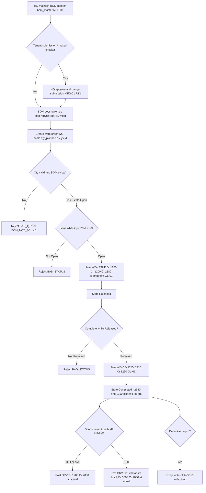
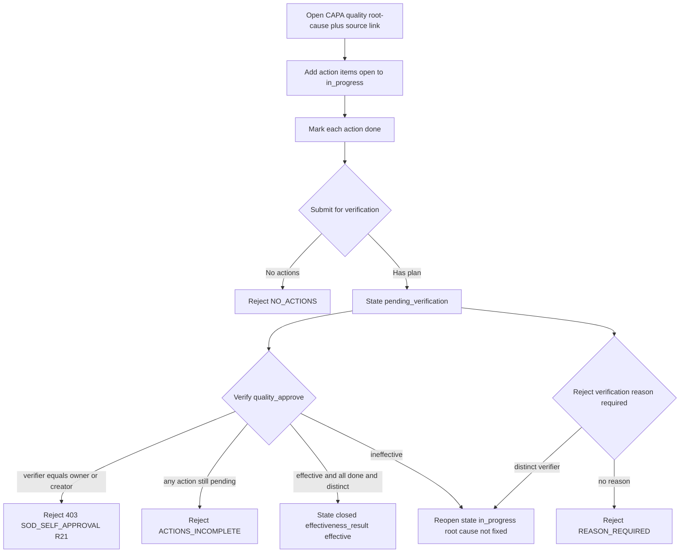

# Manufacturing & Costing — Process Narrative

## 1. Document control

| Field | Value |
|---|---|
| Process ID | PN-15-MFG |
| Process owner | `<<Production / Cost Accountant>>` |
| Approver | `<<CFO>>` |
| Version | **0.1 DRAFT** |
| Effective date | `<<effective-date>>` |
| Review cadence | Annual + on significant change |
| Related RCM controls | MFG-01, MFG-02, MFG-03, GL-01, INV-01, **QC-02**; SoD R04, R13, **R21** |
| Related policy | `compliance/policies/03-delegation-of-authority.md`, `compliance/policies/11-financial-close-policy.md` |

## 2. Purpose

To define and control the bill-of-materials (BOM) lifecycle, the work-order conversion of raw materials into finished goods, and inventory costing (FIFO / AVG / STD), so that work-in-process (WIP), finished-goods inventory, manufacturing cost absorption, and cost of goods sold are **valid, complete, accurate, properly cut off, and authorized**, and that every manufacturing and costing posting reaches the general ledger as a balanced journal entry.

## 3. Scope

**In scope:** BOM master maintenance and HQ-to-tenant distribution (`/api/bom/master`, `/api/bom/master/push`), tenant BOM submission and HQ maker-checker approval (`/api/bom/submissions`), portal BOM and production runs (`/api/portal/bom`), BOM costing roll-up, the work-order lifecycle Open → Released → Completed (`/api/manufacturing/work-orders`), material issue into WIP and finished-goods receipt, the costing configuration and valuation (`/api/costing/config`, `/api/costing/valuation`), available-to-promise / allocation (`/api/costing/atp`, `/api/costing/allocate`), goods-receipt capitalization with purchase-price variance, and scrap / rework write-off.

**Out of scope:** inventory perpetual movement and standard COGS recognition mechanics (see `03-inventory-cogs.md`), restaurant recipe consumption (see `20-restaurant-operations.md`), procurement and AP settlement of the purchase that triggers goods receipt (see `02-procure-to-pay.md`), and the period-close that manufacturing postings flow through (see `04-general-ledger-close.md`). Master-data change control for `bom_master` is governed by `17-master-data-management.md`.

## 4. References

- ISO 9001:2015 cl. 4.4 (process approach), cl. 8.1 (operational planning & control), cl. 8.5 (production & service provision), cl. 8.7 (control of nonconforming outputs).
- `compliance/Oshinei_ERP_SOX_RCM_v1.xlsx` — MFG-01..03, GL-01, INV-01.
- `compliance/policies/03-delegation-of-authority.md` (BOM and work-order authority), `11-financial-close-policy.md` (manufacturing cutoff).
- Code: `apps/api/src/modules/bom/bom.service.ts` + `bom.controller.ts`, `apps/api/src/modules/manufacturing/manufacturing.service.ts` + `manufacturing.controller.ts`, `apps/api/src/modules/costing/costing.service.ts` + `costing.controller.ts` + `atp.service.ts`, `apps/api/src/modules/ledger/ledger.service.ts`, `apps/api/src/common/doc-number.service.ts`.

## 5. Definitions & abbreviations

| Term | Meaning |
|---|---|
| BOM | Bill of materials — recipe of component lines, labor, overhead per yield |
| WIP | Work-in-process; materials and applied conversion costs released to production |
| Yield | Output quantity a BOM produces; basis for `costPerUnit` |
| Scale factor | `qty_planned / yield` — multiplier applied to BOM standard cost on a work order |
| PPV | Purchase Price Variance — difference between actual and standard cost (STD method) |
| FIFO / AVG / STD | Costing methods configured per tenant + item |
| ATP | Available-to-Promise — uncommitted on-hand less allocations |
| Maker-checker | Tenant submits a BOM; HQ approves/merges it (`/api/bom/submissions/:id/approve`) |
| WO- / PRD- | Document-number prefixes (work order / production run) |

GL accounts used: **1200** Raw Materials / Inventory, **1210** Finished Goods, **1250** WIP, **2000** AP, **2380** Manufacturing Costs Applied (clearing), **5000** COGS, **5300** Recipe COGS, **5500** Purchase Price Variance, **5810** Scrap / Rework Loss.

## 6. Roles & responsibilities (RACI)

Single-duty roles enforce SoD: the role that **records a goods receipt / work-order receipt** is never the role that **raised the underlying purchase/production order** (rule **R04**); and **BOM / item master / costing-config maintenance** is segregated from the staff who **transact** against them (rule **R13**). HQ approval of a tenant-submitted BOM is a maker-checker control on master data.

| Activity | ProductionPlanner | WarehouseStaff | CostAccountant | HqMasterSteward | FinancialController / CFO |
|---|---|---|---|---|---|
| Maintain BOM master (`bom_master`) | C | I | C | **A/R** | A |
| Submit tenant BOM (maker) | **A/R** | I | C | I | I |
| Approve / merge BOM submission (checker) | I | I | C | **A/R** | A |
| Push master BOMs to tenants | I | I | I | **A/R** | A |
| Create work order (WO-) | **A/R** | C | C | I | I |
| Issue materials into WIP | C | **A/R** | I | I | I |
| Complete WO / receive finished goods | C | **A/R** | C | I | I |
| Maintain costing config (FIFO/AVG/STD) | I | I | **A/R** | C | A |
| Review PPV / clearing tie-out | I | I | **A/R** | C | A |
| Approve scrap / rework write-off | I | C | **A/R** | I | A |

## 7. Process narrative

1. **BOM master maintenance & distribution.** HqMasterSteward maintains the master BOM library via `GET/POST /api/bom/master` and `PATCH/DELETE /api/bom/master/:bomCode` (permission `bom_master`) and distributes it with `POST /api/bom/master/push`, which pushes master BOMs down to tenants. Master access is segregated from transacting (**R13**, **MFG-01**). An unknown BOM returns `NOT_FOUND`; a missing `bom_code` returns `BAD_REQUEST`.
2. **Tenant BOM submission & HQ approval (maker-checker, decision point).** A tenant submits a BOM (`POST /api/portal/bom`, permission `cust_bom`); HQ reviews the queue (`GET /api/bom/submissions`) and merges it on approval (`PATCH /api/bom/submissions/:id/approve`). Submission/approval is a maker-checker control over master data (**MFG-01**, **R13**). Tenant resolution failure returns `NO_TENANT`.
3. **BOM costing roll-up.** Each line cost = `(qty / conv) * unit_cost`; the BOM total = Σ lines + labor + overhead; `costPerUnit = total / yield`. The roll-up is the standard-cost basis for work-order scaling and STD valuation.
4. **Production run (portal, non-WO path).** `POST /api/portal/bom/:code/production-runs` records a tenant production document (doc prefix **PRD-**); it decrements raw-material inventory (floored at 0) and increments finished goods. This supports lightweight portal production where a full work order is not used.
5. **Work-order creation (decision point).** ProductionPlanner creates a work order from a BOM via `POST /api/manufacturing/work-orders` (permissions `bom_master` / `warehouse` / `exec`; doc prefix **WO-** via `nextDaily`). The scale factor = `qty_planned / yield` scales the BOM standard cost. A non-positive quantity is rejected `BAD_QTY`; an unknown BOM is rejected `BOM_NOT_FOUND`. The WO opens in state **Open**. WO creation is segregated from receipt (**R04**).
5a. **Material Requirements Planning (MRP, multi-level).** ProductionPlanner runs `POST /api/mrp/run` (perms `warehouse`/`planner`/`exec`) with a demand list. MRP explodes each demand **recursively through multi-level BOMs**, netting every item once against the latest on-hand snapshot (shared pool), and returns planned **Make** orders (items that have a BOM, at any level, with `level`) + planned **Buy** orders (leaf/raw components, net + gross + on_hand). A circular/over-deep BOM is rejected `CIRCULAR_BOM`. `POST /api/mrp/plan-to-pr` (perms `procurement`/`planner`) turns the planned Buy into one consolidated **PR** (prefix **PR-**) that feeds the normal PR→approval→PO→GR workflow — so planning is segregated from purchasing approval (**R03/R04**). With `lot_sizing` on, each planned Buy is raised to the item master's **min-order-qty / order-multiple / EOQ** (`√(2DS/H)`; item fields added in migration 0066). `POST /api/mrp/capacity` performs **rough-cut capacity planning** — it loads each work-centre from the product routing (setup + run·qty minutes) against supplied available minutes and flags overloaded centres for re-timing. MRP is planning only — no GL impact until issue/receipt.

5b. **Advanced production scheduling (APS, finite-capacity).** Where RCCP (5a) is a *bucket* load check, APS produces an actual **finite-capacity schedule**. A **work-centre master** (`work_centers`: code, `minutes_per_day` one-shift capacity; `POST/GET /api/work-centers`, perms `bom_master`/`warehouse`/`planner`/`exec`) governs capacity. `POST /api/aps/schedule` (same perms) sequences each work order's **routing operations** onto their work centres: an operation can't start before its **predecessor** (same WO, lower op_no) finishes **or** before its **work centre is free**, and a centre runs **one operation at a time up to `minutes_per_day` per day** (an op that won't fit the rest of a day rolls to the next morning). Work orders are dispatched **earliest-due-date first** (EDD; `due_by` optional per WO). The response gives per-operation **start/finish** (minutes off the horizon + a mapped date), a per-centre **dispatch queue + load + utilisation** (overloaded flag), the **makespan**, and **late** flags (finish past `due_by`); a WO whose product has no routing is reported in `no_routing` (not scheduled). Web `/production/schedule`. **Operational — no GL impact and no new control** (scheduling posts nothing; the produced WOs still ride MFG-01/02/03 on issue/complete).
6. **Material issue into WIP (decision point).** WarehouseStaff releases the WO with `POST /api/manufacturing/work-orders/:woNo/issue` (source **WO-ISSUE**). A balanced JE posts **Dr 1250 WIP**, **Cr 1200 Raw Materials**, and **Cr 2380 Manufacturing Costs Applied** for the labor + overhead absorbed; Σdebit = Σcredit by construction (**MFG-02**, **GL-01**). The posting is **idempotent** (re-issue is `alreadyPosted`, no double-post). Issuing a WO not in **Open** is rejected `BAD_STATUS`. The WO moves Open → **Released**.
7. **Finished-goods receipt / completion (decision point, with yield variance).** WarehouseStaff completes the WO with `POST /api/manufacturing/work-orders/:woNo/complete` (source **WO-DONE**), reporting the actual `qty_produced` (defaults to `qty_planned`). Finished goods are valued at the **standard unit cost × the actual quantity produced** — **Dr 1210 Finished Goods** at that value — and the **yield variance** (the difference between the full WIP charge and the value of what was actually produced) is booked to **5810 Scrap / Rework Loss**: a **yield loss** (produced < planned: spoilage/waste) **debits 5810**, an **over-yield credits** it; **Cr 1250 WIP** for the full amount, so **WIP is always fully relieved** and finished goods are **never over-valued on a short yield**. At full yield the variance is **0** and FG = full cost (unchanged behaviour). The balanced JE is **Dr 1210 + Dr/Cr 5810 / Cr 1250** (**MFG-02**, **GL-01**). Completing a WO not in **Released** is rejected `BAD_STATUS`. The WO moves Released → **Completed**; the per-WO `yield_variance` is exposed on the work-order register. **Material usage variance (optional):** completion may also report the **actual material consumed**; the difference from the standard BOM material is booked as a balanced pair — **over-usage** (actual > standard) **Dr 5810 / Cr 1200** (extra inventory drawn), **under-usage Dr 1200 / Cr 5810** (material returned) — so material inefficiency is surfaced, not buried in finished-goods cost (`material_variance` on the response). The 2380 absorption and the 1250 WIP balance are clearing accounts reviewed for tie-out at close.
8. **Costing configuration & valuation.** CostAccountant sets the method per tenant + item via `PUT /api/costing/config` (FIFO / AVG / STD; permission `masterdata`) and reads it via `GET /api/costing/config`. `GET /api/costing/valuation` returns inventory valuation that ties to GL 1200/1210/1250.
9. **Goods-receipt capitalization (source GRV, decision point).** On receipt, inventory is capitalized: under **FIFO / AVG**, **Dr 1200 Cr 2000** at actual cost. Under **STD**, **Dr 1200** at standard cost, a **PPV** booked to **5500** (unfavorable, actual > standard → Dr 5500; favorable, actual < standard → Cr 5500), and **Cr 2000** at actual cost (**MFG-03**, **INV-01**, **GL-01**). The inventory (1200) and AP (2000) legs are each rounded to 2dp and the **PPV (5500) leg is the single balancing plug** (= actual − standard, rounded once), so Σdebit = Σcredit by construction — independent per-leg rounding can no longer leave a 0.01 imbalance that would reject the JE `UNBALANCED`.
10. **COGS on issue & recipe consumption.** Issuing inventory for sale posts **Dr 5000 COGS Cr 1200** (source **POS-COGS-V**). Recipe-driven consumption uses **5300 Recipe COGS** (see `03-inventory-cogs.md` and `20-restaurant-operations.md`).
11. **ATP / allocation.** `GET /api/costing/atp`, `POST /api/costing/atp/check`, and `POST /api/costing/allocate` reserve and confirm uncommitted inventory against demand; these are operational planning controls (no GL impact).
12. **Scrap / rework write-off.** QA write-off of defective WIP or output posts a loss to **5810 Scrap / Rework Loss**; the write-off requires CostAccountant authorization (**MFG-02**).
13. **CAPA — corrective & preventive action lifecycle with effectiveness sign-off (QMS-2, decision point, QC-02).** Where step 12 dispositions a *single* defect, the managed **corrective-action loop** ensures a recurring problem's root cause is actually fixed and *independently verified* before the case is closed. The QualityOwner (permission `quality`) opens a CAPA with `POST /api/quality/capa` (title, problem statement, root cause, `action_type` corrective/preventive/both, target date, and an optional generic `source_type`/`source_ref` link to an **NCR**, a supplier **gr_claim**, a customer **complaint**, an **audit** finding or **manual** — a free-text reference, deliberately not a hard FK, so the register stands alone; doc prefix **CAPA-**). The owner adds child **action items** (`POST …/:id/actions`; the first action moves the CAPA **open → in_progress**) and marks each **done** (`…/:actionId/complete`). When the plan is complete the owner submits it (`…/:id/submit` → **pending_verification**; a CAPA with *no* action plan is rejected `NO_ACTIONS`). **The QC-02 control is the effectiveness verification** (`…/:id/verify`, permission `quality_approve`/`exec`): a CAPA reaches **closed** *only* when the verifier is **neither the owner nor the creator** (`verified_by ≠ owner/created_by` → **403 `SOD_SELF_APPROVAL`**, binds even Admin, **R21**) **and** every child action is `done` (else **`ACTIONS_INCOMPLETE`**), recording `effectiveness_result`. An **`ineffective`** verification **reopens** the CAPA (→ in_progress) rather than closing it — the root cause was not resolved. A distinct verifier may instead **reject** the verification (`…/:id/reject`, reason required → `REASON_REQUIRED`) or the owner may **cancel** a superseded case. Re-deciding a non-pending CAPA returns `NOT_PENDING_VERIFICATION`. **Detective:** `GET /api/quality/capa/overdue?days=N` lists open (not closed/cancelled) CAPAs whose target date has passed — the corrective-action loop is slipping. Tenant-scoped (RLS, canonical 0232 policy; migration 0332); no GL impact in v1. All transitions are captured in `audit_log` by the global audit interceptor.

## 8. Process flow

**CAPA effectiveness sign-off (QC-02, step 13):**

**Swimlane description by role:** **HqMasterSteward** owns the master BOM library, distributes it to tenants, and acts as checker on tenant BOM submissions. **ProductionPlanner** raises work orders from BOMs and runs ATP/allocation. **WarehouseStaff** issues materials into WIP and completes work orders to receive finished goods. The **system** enforces the `BAD_QTY` / `BOM_NOT_FOUND` guards, the Open → Released → Completed lifecycle with `BAD_STATUS` gating, idempotent balanced WO-ISSUE and WO-DONE postings, and STD purchase-price-variance computation on goods receipt. **CostAccountant** owns costing configuration, reviews PPV (5500) and the 2380 / 1250 clearing tie-outs, and authorizes scrap (5810). **FinancialController / CFO** approves master changes and reviews close-period tie-outs.

## 9. Control matrix

| Step | Risk | Control | Type | RCM ID | Evidence / Record |
|---|---|---|---|---|---|
| 1,2 | Unauthorized or unreviewed BOM change | HQ master governance + maker-checker submission approval | Prev / Manual | MFG-01, R13 | Submission queue; approval log; `audit_log` |
| 6 | Material issue unposted / unbalanced | Balanced WO-ISSUE Dr 1250 Cr 1200 Cr 2380 | Prev / Auto | MFG-02, GL-01 | Issue JE tie-out |
| 6 | Issue double-posted on re-release | Idempotent posting (`alreadyPosted`) | Prev / Auto | MFG-02 | Re-issue test |
| 6,7 | WO advanced out of sequence | Lifecycle `BAD_STATUS` guard (Open→Released→Completed) | Prev / Auto | MFG-02 | Status-transition rejections |
| 7 | Finished goods unposted / WIP not relieved | Balanced WO-DONE Dr 1210 Cr 1250 | Prev / Auto | MFG-02, GL-01 | Completion JE tie-out |
| 7 | Yield loss capitalised into FG (inventory over-valued; spoilage hidden) | FG valued at std × actual produced; the yield variance booked to 5810 (loss → Dr, over-yield → Cr); WIP fully relieved; per-WO `yield_variance` on the register | **Prev / Auto** | **MFG-02**, GL-01 | Yield-variance JE; WO costing register |
| 7 | Material over-/under-usage buried in finished-goods cost | Optional actual-material at completion books the usage variance vs standard BOM (over → Dr 5810 / Cr 1200; under → Dr 1200 / Cr 5810); `material_variance` on the response | **Det / Auto** | **MFG-02**, GL-01 | Material-variance JE; WO costing register |
| 7 | WIP / absorption clearing not cleared | 2380 and 1250 clearing-account review | Det / Hybrid | MFG-02, GL-01 | Clearing tie-out at close |
| 9 | Inventory mis-capitalized vs standard | STD PPV to 5500; FIFO/AVG at actual | Prev / Auto | MFG-03, INV-01 | GRV JE; PPV report |
| 9 | Receipt by the requisitioner | SoD: PO/production-order vs receipt segregated | Prev / Manual | R04 | SoD conflict report |
| 12 | Unauthorized scrap / rework loss | Scrap write-off to 5810 requires authorization | Prev / Manual | MFG-02 | Scrap JE; approval record |
| 8 | Unauthorized costing-method change | Costing config segregated from transacting | Prev / Manual | R13 | Config change log; access review |
| 13 | CAPA closed with the root cause unresolved / signed off by its own owner | Effectiveness verification maker-checker: close requires a verifier ≠ owner/creator (`SOD_SELF_APPROVAL`, R21) **and** all action items done (`ACTIONS_INCOMPLETE`); an `ineffective` result reopens the case | **Prev / Auto** | **QC-02**, R21 | CAPA register (effectiveness_result + verified_by); action-completion log; `audit_log` |
| 13 | Corrective-action loop silently slips | Detective overdue read (`GET /api/quality/capa/overdue`) — open CAPAs past target date | **Det / Auto** | **QC-02** | Overdue-CAPA worklist |

## 10. Inputs & outputs

**Inputs:** master and tenant BOMs (components, labor, overhead, yield), BOM submissions, work-order requests (`qty_planned`), goods-receipt events (actual cost), costing configuration (FIFO/AVG/STD, standard cost), demand for ATP/allocation, scrap notifications.
**Outputs:** approved/merged BOMs, production-run documents (PRD-), work orders (WO-) with WO-ISSUE and WO-DONE JEs, capitalized inventory (GRV) with PPV, inventory valuation report, COGS postings, scrap write-offs (5810).

## 11. Records & retention

| Record | Store | Retention |
|---|---|---|
| BOM master & versions | Application DB (RLS-scoped) | `<<7 years / per Thai law>>` |
| BOM submissions & approvals | `bom_submissions` | `<<7 years>>` |
| Work orders & WO-ISSUE / WO-DONE JEs | Ledger | `<<7 years>>` |
| Goods-receipt (GRV) & PPV JEs | Ledger | `<<7 years>>` |
| Costing configuration changes | `audit_log` (immutable) | `<<7 years>>` |
| Scrap / rework write-offs | Ledger | `<<7 years>>` |

## 12. KPIs / metrics

- BOM submissions awaiting HQ approval (aging) and approval turnaround.
- WO-ISSUE / WO-DONE re-post double-posts detected (target: 0; idempotency holds).
- WIP (1250) and Manufacturing-Costs-Applied (2380) clearing balances at close (target: cleared).
- PPV (5500) magnitude and trend vs standard (cost-estimate accuracy).
- Scrap / rework loss (5810) as % of production output.
- WO status-sequence (`BAD_STATUS`) rejections (data-quality / training signal).

## 13. Exception & error handling

| Error code | Trigger | Handling |
|---|---|---|
| `BAD_REQUEST` | Missing `bom_code` / malformed BOM request | Originator corrects and resubmits |
| `NOT_FOUND` | Unknown BOM (master/portal) | Verify BOM code |
| `NO_TENANT` | Tenant resolution failed (portal) | Re-authenticate; verify tenant context |
| `BAD_QTY` | Work order with non-positive `qty_planned` | Supply positive quantity; resubmit |
| `BOM_NOT_FOUND` | Work order references unknown BOM | Verify / create BOM first |
| `BAD_STATUS` | Issue while not Open, or complete while not Released | Advance WO through correct lifecycle state |
| `SOD_VIOLATION` / SoD conflict | Same user creates order and receives, or maintains master and transacts | AccessAdmin remediates (see `08-itgc.md`) |
| `SOD_SELF_APPROVAL` | CAPA effectiveness verify/reject by the owner or creator (**QC-02**, R21) | Route the verification to an independent `quality_approve`/`exec` reviewer |
| `ACTIONS_INCOMPLETE` | CAPA verified while a child action is still `pending` | Complete every action item, then verify |
| `NO_ACTIONS` | CAPA submitted for verification with no action plan | Add at least one action item before submitting |
| `NOT_PENDING_VERIFICATION` | Verify/reject a CAPA not in `pending_verification` | Submit the CAPA first; a closed/cancelled CAPA is terminal |
| `REASON_REQUIRED` | CAPA verification rejected with no reason | Provide a reject reason |
| `CAPA_NOT_FOUND` | CAPA id not in the caller's tenant (RLS) | Verify the CAPA number / tenant context |

## 14. Revision history

| Version | Date | Author | Summary |
|---|---|---|---|
| 0.6 | 2026-07-11 | Platform | **QMS-2 — CAPA (Corrective & Preventive Action) lifecycle with effectiveness sign-off (new control QC-02, migration 0332).** New **step 13** + CAPA flow + control-matrix rows: a first-class CAPA register (`capas`/`capa_actions`) on `/api/quality/capa[/:id[/actions[/:actionId/complete]|submit|verify|reject|cancel]]|overdue` and web `/quality/capa`. Closure requires an **independent effectiveness verification** (`verified_by ≠ owner/created_by` → `SOD_SELF_APPROVAL`, new SoD **R21** `quality` vs `quality_approve`) **and** all actions done (`ACTIONS_INCOMPLETE`); an `ineffective` result reopens the case; detective overdue read. A CAPA links generically to an NCR/gr_claim/complaint/audit (nullable `source_type`/`source_ref`, no FK) so it builds standalone. No GL impact. ToE: `quality-capa` harness (20 checks); UAT-QMS-CAPA-001..008 (`08-admin-sod-uat.md`). |
| 0.5 | 2026-07-11 | Platform | **MRP plan-to-PR + lot-sizing + rough-cut capacity surfaced on the `/production → MRP` tab (UI-only; §5a engine unchanged).** The MRP **run** was already on screen (make/buy lists), but `POST /api/mrp/plan-to-pr`, the `lot_sizing` option, and `POST /api/mrp/capacity` (RCCP) had **no UI**. Added: a **ใช้ขนาดล็อต (lot-sizing)** checkbox (buy grid then shows the `lot_policy` column + `ordered_qty`), a **สร้างใบขอซื้อจากแผน (Plan → PR)** button (surfaces the consolidated PR number; empty-buy → no PR), and a **กำลังการผลิตคร่าว (RCCP)** panel — enter available minutes per work centre, run, and see each centre's load / utilisation / overloaded flag. No control/GL/schema change — the endpoints, `CIRCULAR_BOM` guard, and the planning-vs-purchasing segregation (R03/R04) are unchanged. ToE unchanged (`mrp` harness, 16 checks); UAT `04-inventory-uat.md` UAT-INV-097. |
| 0.2 | 2026-07-09 | Platform | **Doc-reference dropdowns on the manufacturing screens (UI-only, no control change).** `/production` shop-floor picks the WO from `GET /api/manufacturing/work-orders` and the routing from `GET /api/routings`; the quality-inspection ref-doc dropdown switches source with the WO/GR toggle (WO list vs `GET /api/procurement/grs`); `/manufacturing` create-WO picks the BOM from `GET /api/bom/master`; `/goods-issue`'s optional ref offers the open-WO list. All existing reads via the shared `doc-select.tsx` island with a manual-entry escape; MFG-01/02 and posting logic unchanged. UAT `04-inventory-uat.md` UAT-INV-073. |
| 0.1 DRAFT | 2026-06-22 | `<<author>>` | Initial draft. |
| 0.2 | 2026-06-23 | Platform | D3: added step 5a — multi-level MRP (`/api/mrp/run`) + planned-buy → PR (`/api/mrp/plan-to-pr`), circular-BOM guard; verified by the `mrp` harness. |
| 0.3 | 2026-06-23 | Platform | D3 (cont.): extended step 5a — opt-in lot-sizing (min-order-qty / order-multiple / EOQ; item fields in migration 0066) and rough-cut capacity planning (`/api/mrp/capacity`); verified by the `mrp` harness. |
| 0.4 | 2026-06-30 | Platform | **APS — finite-capacity scheduling (`docs/22` Phase A).** New step **5b**: a `work_centers` master (migration 0193) + `POST /api/aps/schedule` — a single-shift finite-capacity list scheduler that sequences routing operations onto work centres (predecessor + per-centre daily-capacity gating, EDD dispatch) → per-operation start/finish, per-centre dispatch queue + utilisation, makespan, and late flags. `POST/GET /api/work-centers` maintain the master; web `/production/schedule`. **Operational — no new control** (posts no GL; produced WOs ride MFG-01/02/03). Tenant-scoped (RLS loop in 0193). ToE: `mfg-depth` harness (two WOs over a shared centre → sequenced dispatch [0,50], makespan 210, late flag). |
| 0.4 | 2026-06-23 | Platform | Security/correctness review W4 (MFG-03 / GL-01): step 9 — STD GRV now makes the PPV (5500) leg the single balancing plug so independent leg-rounding cannot reject the JE `UNBALANCED`. Verified by the `costing` harness rounding case. |
| 0.5 | 2026-06-23 | Platform | Doc-drift fix: step 1 BOM master endpoints corrected to `GET/POST /api/bom/master` and `PATCH/DELETE /api/bom/master/:bomCode` (the mutating routes are keyed by `bomCode`). |
| 0.6 | 2026-06-26 | Platform | **MFG-02 — yield variance on work-order completion.** Step 7: completing a WO now values finished goods at **standard unit cost × actual `qty_produced`** and books the **yield variance** (full WIP charge − produced value) to **5810** — a short yield (spoilage/waste) debits 5810, an over-yield credits it; WIP is always fully relieved so FG is never over-valued. Full yield → variance 0 (unchanged). Per-WO `yield_variance` exposed on the work-order register + the `/manufacturing` screen (new column). Also **back-filled the missing MFG-01/MFG-02/MFG-03 controls into the RCM** (the narrative referenced them but `build_rcm.py` lacked them) → RCM now 88. No migration; the variance is derivable from cost + qty. ToE: `manufacturing` harness (full yield = no variance; 15/20 yield → FG 315 + 5810 105, WIP nets 0, TB balanced; register exposes it). Manual `15`-cycle UAT updated. |
| 0.7 | 2026-06-26 | Platform | **MFG-02 — material usage variance on completion.** Step 7: completing a WO may report the **actual material consumed**; the variance vs the standard BOM material is booked as a balanced pair (over-usage Dr 5810 / Cr 1200; under-usage Dr 1200 / Cr 5810), so material inefficiency is surfaced rather than absorbed into finished-goods cost (`material_variance` on the response; `/manufacturing` prompts for actual material on completion). Reporting/control over the existing MFG-02; no new control, no migration. ToE: `manufacturing` harness (actual 300 vs std 260 → material_variance 40, 5810 +40, TB balanced). |
