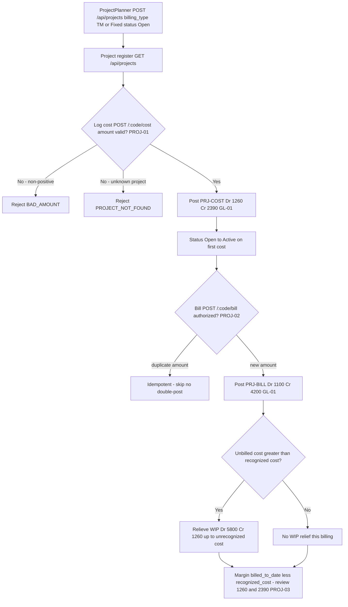

# Project Accounting — Process Narrative

## 1. Document control

| Field | Value |
|---|---|
| Process ID | PN-16-PROJ |
| Process owner | `<<Project Controller>>` |
| Approver | `<<CFO>>` |
| Version | **0.1 DRAFT** |
| Effective date | `<<effective-date>>` |
| Review cadence | Annual + on significant change |
| Related RCM controls | PROJ-01, PROJ-02, PROJ-03, CRM-WL, GL-01; SoD R07 |
| Related policy | `compliance/policies/03-delegation-of-authority.md`, `compliance/policies/11-financial-close-policy.md` |

## 2. Purpose

To define and control the project / job-costing lifecycle — project setup, accumulation of time and expense cost into unbilled WIP, customer billing, and project revenue recognition with WIP relief — so that project WIP, project revenue, and project cost of services are **valid, complete, accurate, properly cut off, and authorized**, that project margin is fairly stated, and that every project posting reaches the general ledger as a balanced journal entry.

## 3. Scope

**In scope:** origination of a project from a **won** CRM opportunity (`POST /api/projects/from-opportunity/:oppNo` — CRM-WL), project creation and configuration (`POST /api/projects`; billing type TM or Fixed), the project register and detail with entries (`GET /api/projects`, `GET /api/projects/:code`), cost capture of time / expense into unbilled WIP (`POST /api/projects/:code/cost`), customer billing with revenue recognition and WIP relief (`POST /api/projects/:code/bill`), the work-breakdown structure of tasks with planned-hours-weighted **% complete** roll-up (`POST/GET /api/projects/:code/tasks`, `PATCH /api/projects/tasks/:taskId`) and project **milestones** whose completion can raise a Fixed-price progress bill (`POST/GET /api/projects/:code/milestones`, `POST /api/projects/milestones/:id/reach`), and the unbilled-WIP (1260) and project-costs-applied (2390) clearing tie-outs.

**Out of scope:** general revenue-recognition policy and contract-based deferral mechanics (see `12-revenue-recognition-billing.md`), inventory cost flowing into a project (see `03-inventory-cogs.md`), AR collection and cash application (see `01-order-to-cash.md` / `07-cash-treasury.md`), and the period-close that project postings flow through (see `04-general-ledger-close.md`).

## 4. References

- ISO 9001:2015 cl. 4.4 (process approach), cl. 8.1 (operational planning & control), cl. 8.2 (requirements for products & services), cl. 8.5 (production & service provision).
- `compliance/Oshinei_ERP_SOX_RCM_v1.xlsx` — PROJ-01..03, GL-01.
- `compliance/policies/03-delegation-of-authority.md` (billing authority), `11-financial-close-policy.md` (revenue cutoff / WIP relief).
- Code: `apps/api/src/modules/projects/projects.service.ts` + `projects.controller.ts`, `apps/api/src/database/schema/projects.ts`, `apps/api/src/modules/ledger/ledger.service.ts`, `apps/api/src/common/doc-number.service.ts`.

## 5. Definitions & abbreviations

| Term | Meaning |
|---|---|
| Project | A costed job; `project_code`, `name`, `billing_type`, `status` |
| TM / Fixed | Billing types — Time-and-Materials / Fixed-price |
| Cost entry | A logged time / expense line accumulating to project cost-to-date |
| Unbilled WIP | `cost_to_date − recognized_cost`, carried in account 1260 |
| Recognized cost | Project cost relieved from WIP into cost of services on billing |
| Margin | `billed_to_date − recognized_cost` |
| Idempotency (bill) | Amount-based: re-billing the same cumulative amount does not double-post |
| PRJ-COST / PRJ-BILL | GL source tags (cost capture / billing) |

GL accounts used: **1100** AR, **1260** Project WIP / Unbilled Cost, **2390** Project Costs Applied (clearing), **4200** Project Revenue, **5800** Project Cost of Services.

## 6. Roles & responsibilities (RACI)

Single-duty roles enforce SoD: the role that **initiates / logs** project cost is never the sole role that **approves the billing** that recognizes revenue against it (rule **R07** — initiate vs approve).

| Activity | ProjectPlanner | ProjectAccountant | ProjectController | ArSpecialist | FinancialController / CFO |
|---|---|---|---|---|---|
| Convert won opportunity → project (CRM-WL) | R | C | **A/R** | I | I |
| Create / configure project (TM / Fixed) | **A/R** | C | A | I | C |
| Log time / expense cost (PRJ-COST) | **A/R** | C | I | I | I |
| Review cost-capture postings | I | **A/R** | A | I | I |
| Authorize billing (PRJ-BILL) | C | I | **A/R** | C | A |
| Raise customer invoice / AR | I | C | C | **A/R** | I |
| Review unbilled-WIP (1260) aging | I | **A/R** | A | I | C |
| Review 2390 clearing tie-out | I | **A/R** | A | I | C |

## 7. Process narrative

1. **Project setup (decision point).** ProjectPlanner creates a project via `POST /api/projects` (permissions `exec` / `planner` / `ar`), specifying `billing_type` **TM** or **Fixed**. The project opens in status **Open**. Billing authority is segregated from cost initiation (**R07**).
   - **1a. Origination from a won opportunity (CRM-WL).** A project may instead be originated from a **won** CRM opportunity via `POST /api/projects/from-opportunity/:oppNo`. The system converts **only** a **won** `crm_opportunity` (an open or lost deal → `OPP_NOT_WON`; an unknown deal → `OPP_NOT_FOUND`), seeds the project **contract amount from the deal value**, and stamps **`customer_no`** (→ `customer_master`) and **`crm_opp_no`** (→ `crm_opportunities.opp_no`) so project revenue / WIP trace back to the approved deal. Conversion is **idempotent on `crm_opp_no`** — a given opportunity converts to **at most one** project, so a re-submit returns the existing project rather than duplicating it. Win/loss integrity of the opportunity itself (controlled stage machine, mandatory lost reason, terminal won/lost) is enforced upstream by the CRM pipeline (**REV-17**).
2. **Project register & detail.** `GET /api/projects` lists projects; `GET /api/projects/:code` returns the detail with its cost / billing entries. This is the system of record for cost-to-date, recognized cost, and billed-to-date.
3. **Cost capture (decision point, billable vs non-billable).** ProjectPlanner logs a time or expense cost entry via `POST /api/projects/:code/cost` (source **PRJ-COST**, `sourceRef = code:entryId`), flagging it **billable** (default) or **non-billable**. A **billable** cost is a *recoverable* asset → **Dr 1260 Project WIP-Unbilled Cost / Cr 2390 Project Costs Applied**, and it accumulates in **cost-to-date** (relieved to COGS at billing). A **non-billable** cost is *unrecoverable* (you can't bill the customer for it) → it is **expensed immediately**: **Dr 5800 Project Cost of Services / Cr 2390**, and it does **not** enter the billable WIP or cost-to-date — conservative accounting must not carry an unrecoverable cost as an asset. Σdebit = Σcredit by construction either way (**PROJ-01**, **GL-01**). The project register exposes `non_billable_cost`, `total_cost` (= recoverable WIP + non-billable), and the **true margin** (`billed − recognised − non-billable`). On the first cost the project status moves **Open → Active**. A non-positive amount is rejected `BAD_AMOUNT`; an unknown project is rejected `PROJECT_NOT_FOUND`.
4. **Billing & revenue recognition (decision point, with milestone billing).** ProjectController authorizes billing via `POST /api/projects/:code/bill` (source **PRJ-BILL**, `sourceRef = code:billedAmount`). Billing is by a raw **`amount`** (T&M) or, for a **Fixed-price** contract, by **`percent` of the contract value** — milestone/progressive billing (e.g. 30% at a phase), `bill = contract × percent/100` (percent with no contract → `NO_CONTRACT`). A **Fixed-price contract is capped**: cumulative billing may **never exceed the contract amount** (`BILL_EXCEEDS_CONTRACT`), so the customer is never over-billed. The posting is **idempotent on the cumulative billed amount** — re-billing the same amount does not double-post. A balanced JE posts **Dr 1100 AR Cr 4200 Project Revenue** (**PROJ-02**, **GL-01**). The register exposes `billed_pct` and `remaining_to_bill` for Fixed contracts. Billing is authorized separately from cost initiation (**R07**).
5. **WIP relief on billing.** When unbilled cost exceeds recognized cost, the same billing event relieves WIP up to the unrecognized cost: **Dr 5800 Project Cost of Services Cr 1260** (relieving Project WIP). This matches cost of services to recognized revenue and reduces the 1260 balance (**PROJ-02**, **GL-01**).
6. **Margin, WIP & budget measurement.** Project **margin = billed_to_date − recognized_cost − non-billable**; project **WIP = cost_to_date − recognized_cost**, carried in account **1260**. The register also reports **budget control**: `budget_variance` (= `budget_amount − total_cost`), `budget_used_pct`, and an **`over_budget`** flag (total cost incurred has exceeded the budget) so the ProjectAccountant can catch a **cost overrun** before it eats the margin. ProjectAccountant reviews 1260 aging, the 2390 clearing tie-out, and over-budget projects at close (**PROJ-03**).

7. **Work breakdown & schedule progress (P1).** The ProjectPlanner decomposes the project into a **WBS** of tasks (`POST /api/projects/:code/tasks`; each task carries an optional `parent_id` for hierarchy, planned hours/cost, an assignee, and a `pct_complete`), updates progress (`PATCH /api/projects/tasks/:taskId`; marking a task `done` implies 100%), and reads the register (`GET /api/projects/:code/tasks`). The project's overall **% complete rolls up from its tasks, weighted by planned hours** (simple mean if no planned hours; cancelled tasks excluded), and is surfaced on the project detail (`pct_complete`, `task_count`). This is **operational / non-financial** — task changes post nothing to the GL. An unknown task is rejected `TASK_NOT_FOUND`.
8. **Milestones & milestone-driven billing (P1).** The ProjectPlanner records **milestones** (`POST /api/projects/:code/milestones`; due date, owner, optional `billing_percent`). Reaching a milestone (`POST /api/projects/milestones/:id/reach`) marks it `reached`; **if it carries a `billing_percent`, the same act raises a Fixed-price progress bill through the existing authorized `bill` path** (`bill = contract × percent/100` → Dr 1100 AR / Cr 4200 Revenue + WIP relief, **capped at the contract** and idempotent) — i.e. milestone billing is the **PROJ-02** control, not a new posting path. A milestone reached twice is rejected `MILESTONE_REACHED` (no double bill); an unknown milestone is rejected `MILESTONE_NOT_FOUND`; an out-of-range `billing_percent` is rejected `BAD_PERCENT`. Billing authority remains segregated from cost initiation (**R07**).

## 8. Process flow

**Swimlane description by role:** **ProjectPlanner** creates projects and logs time / expense cost into unbilled WIP. The **system** enforces the `BAD_AMOUNT` and `PROJECT_NOT_FOUND` guards, the Open → Active status flip on first cost, the balanced PRJ-COST and PRJ-BILL postings, amount-based billing idempotency, and the WIP relief that matches cost of services to recognized revenue. **ProjectController** authorizes billing (segregated from cost initiation under R07). **ArSpecialist** owns the resulting customer invoice / AR. **ProjectAccountant** reviews cost-capture postings, unbilled-WIP (1260) aging, and the project-costs-applied (2390) clearing tie-out, with **FinancialController / CFO** approving setup and reviewing margin at close.

## 9. Control matrix

| Step | Risk | Control | Type | RCM ID | Evidence / Record |
|---|---|---|---|---|---|
| 1a | Project delivered from a deal that was never won, or a won deal spawns duplicate projects → revenue/WIP not traceable to an approved opportunity | Convert **won-only** (`OPP_NOT_WON` / `OPP_NOT_FOUND`); seed contract from deal value; stamp `customer_no` + `crm_opp_no`; **idempotent on `crm_opp_no`** (one project per deal) | Prev / Auto | CRM-WL, REV-17 | Conversion audit (`project.crm_opp_no` → opportunity); won-only / idempotency rejections |
| 3 | Cost captured unbalanced / invalid amount | Balanced PRJ-COST Dr 1260 Cr 2390; `BAD_AMOUNT` guard | Prev / Auto | PROJ-01, GL-01 | Cost JE tie-out; `BAD_AMOUNT` rejections |
| 3 | Unrecoverable (non-billable) cost capitalised into WIP → unbilled balance + margin overstated | Billable cost → 1260 WIP (recoverable); non-billable cost expensed immediately → 5800 (never enters WIP); `total_cost` + true margin (billed − recognised − non-billable) on the register | **Prev / Auto** | **PROJ-01**, GL-01 | Non-billable cost JE (5800); cost register |
| 3 | Cost logged to non-existent project | `PROJECT_NOT_FOUND` guard | Prev / Auto | PROJ-01 | Rejection log |
| 4 | Revenue not recognized / unbalanced | Balanced PRJ-BILL Dr 1100 Cr 4200 | Prev / Auto | PROJ-02, GL-01 | Billing JE tie-out |
| 4 | Same billing double-posted | Amount-based idempotency on cumulative billed amount | Prev / Auto | PROJ-02 | Re-bill test |
| 8 | Milestone billing posts an unauthorized / duplicated / over-contract bill | Milestone billing reuses the authorized `bill` path (Fixed cap + amount idempotency); a milestone reached twice → `MILESTONE_REACHED` (no double bill) | Prev / Auto | PROJ-02, R07 | Milestone `reached_at`; billing JE; `MILESTONE_REACHED` rejection |
| 4 | Fixed-price contract over-billed (customer charged beyond the contract) | Cumulative billing capped at the contract amount (`BILL_EXCEEDS_CONTRACT`); milestone billing by % of contract; `billed_pct`/`remaining_to_bill` on the register | **Prev / Auto** | **PROJ-02** | Over-bill rejection; billing progress |
| 5 | Cost not matched to revenue / WIP overstated | WIP relief Dr 5800 Cr 1260 up to unrecognized cost | Prev / Auto | PROJ-02, GL-01 | WIP relief entry; cutoff review |
| 6 | Unbilled WIP (1260) stale / misstated | 1260 aging & tie-out review | Det / Hybrid | PROJ-03 | 1260 aging report |
| 6 | Project cost overruns the budget undetected (margin erodes) | `budget_variance` / `budget_used_pct` / `over_budget` flag on the register; over-budget projects reviewed at close | **Det / Auto** | **PROJ-03** | Budget-variance report; over-budget flag |
| 6 | Project-costs-applied (2390) not cleared | 2390 clearing-account review | Det / Hybrid | PROJ-02, GL-01 | 2390 clearing tie-out |
| 1,4 | Self-authorized billing | SoD: initiate cost vs approve billing segregated | Prev / Manual | R07 | SoD conflict report |

## 10. Inputs & outputs

**Inputs:** project setup (name, billing type TM/Fixed), time / expense cost entries (qty × rate or amount), billing authorization (cumulative billed amount).
**Outputs:** project register & detail, cost-capture JEs (PRJ-COST), billing JEs with revenue recognition (PRJ-BILL), WIP relief postings, project margin and unbilled-WIP (1260) reporting.

## 11. Records & retention

| Record | Store | Retention |
|---|---|---|
| Projects & status | `projects` (RLS-scoped) | `<<7 years / per Thai law>>` |
| Project cost / billing entries | `project_entries` | `<<7 years>>` |
| PRJ-COST / PRJ-BILL JEs | Ledger | `<<7 years>>` |
| Project setup / config changes | `audit_log` (immutable) | `<<7 years>>` |

## 12. KPIs / metrics

- PRJ-BILL re-bill double-posts detected (target: 0; idempotency holds).
- Unbilled-WIP (1260) aging — value and days outstanding by project.
- Project-costs-applied (2390) clearing balance at close (target: cleared).
- Project margin (`billed_to_date − recognized_cost`) vs budget by project.
- Cost entries rejected for `BAD_AMOUNT` (data-quality signal).

## 13. Exception & error handling

| Error code | Trigger | Handling |
|---|---|---|
| `BAD_AMOUNT` | Cost or bill amount ≤ 0 | Originator supplies positive amount; resubmit |
| `PROJECT_NOT_FOUND` | Cost / bill against unknown `code` | Verify / create project first |
| `OPP_NOT_WON` | Convert an open / lost opportunity to a project | Win the opportunity first (CRM stage → `won`), then convert |
| `OPP_NOT_FOUND` | Convert an unknown opportunity `oppNo` | Verify the opportunity number; create it in the CRM pipeline first |
| (idempotent skip) | Re-convert the same won opportunity | No duplicate project; returns the existing project (`already: true`) |
| `TASK_NOT_FOUND` | Patch a non-existent WBS task | Verify the `taskId`; create the task first |
| `MILESTONE_NOT_FOUND` | Reach a non-existent milestone | Verify the milestone id; create the milestone first |
| `MILESTONE_REACHED` | Reach a milestone already reached | No action — already reached (re-reach would double-bill; blocked) |
| `BAD_PERCENT` | Milestone `billing_percent` outside (0,100] | Supply a percent within (0,100] |
| (idempotent skip) | Re-bill the same cumulative amount | No double-post; verify intended amount |
| `PERIOD_CLOSED` | PRJ-COST / PRJ-BILL into a closed period | Re-open per close policy (authorized) or post to open period (see `04-general-ledger-close.md`) |
| `SOD_VIOLATION` / SoD conflict | Same user logs cost and authorizes billing | AccessAdmin remediates (see `08-itgc.md`) |

## 14. Revision history

| Version | Date | Author | Summary |
|---|---|---|---|
| 0.1 DRAFT | 2026-06-22 | `<<author>>` | Initial draft. |
| 0.2 | 2026-06-26 | Platform | **PROJ-01 — billable vs non-billable cost capture.** Step 3: `logCost` now honours the `billable` flag — a billable cost capitalises to **1260** (recoverable WIP, relieved at billing); a **non-billable** cost is **expensed immediately to 5800** and never enters the billable WIP, so the register's `total_cost` and **true margin** (billed − recognised − non-billable) absorb it. The `/projects` screen gains a **billable toggle** on the cost dialog + a **เบิกลูกค้าไม่ได้ (non-billable)** column. Also **back-filled the missing PROJ-01/PROJ-02/PROJ-03 controls into the RCM** (this narrative referenced them but `build_rcm.py` lacked them) → RCM now 91. No migration (non_billable derived from the cost entries). ToE: `projects` harness (billable default unchanged: WIP 7000/margin 3000; a non-billable 800 → 5800 immediately, cost_to_date 7000, total_cost 7800, margin 2200). |
| 0.3 | 2026-06-26 | Platform | **PROJ-02 — milestone / % billing + Fixed-price over-bill cap.** Step 4: `bill` now accepts `percent` (of the contract) for **Fixed-price** milestone billing (`bill = contract × percent/100`; no contract → `NO_CONTRACT`) as well as a raw `amount`; cumulative billing on a Fixed contract is **capped at the contract value** (`BILL_EXCEEDS_CONTRACT`) so the customer is never over-billed. The register exposes `billed_pct` + `remaining_to_bill`; the `/projects` bill dialog gains a **"วางบิลตาม % ของสัญญา"** toggle. No migration. ToE: `projects` harness (30% of a 100000 contract → revenue 30000, billed_pct 30, remaining 70000; a further 80% → `BILL_EXCEEDS_CONTRACT`). |
| 0.4 | 2026-06-26 | Platform | **PROJ-03 — project budget-overrun variance.** Step 6: the register now reports `budget_variance` (= `budget_amount − total_cost`), `budget_used_pct`, and an **`over_budget`** flag so a cost overrun is caught before it erodes margin. The `/projects` screen gains a **ใช้งบ (budget-used %)** column that turns amber ≥ 85% and red ⚠ when over budget. Reporting-only over the existing PROJ-03 cost-review control; no new control, no migration. ToE: `projects` harness (a 6000 cost on a 5000 budget → `over_budget`, `budget_variance` −1000, `budget_used_pct` 120). |
| 0.6 | 2026-06-29 | Platform | **WBS tasks & milestones (PPM roadmap P1, `docs/19-project-management-ppm-plan.md`).** New steps **7–8**: a project WBS (`project_tasks`, migration 0184) with planned-hours-weighted **% complete** roll-up (surfaced as `pct_complete`/`task_count` on the project detail), and **milestones** (`project_milestones`) whose completion can raise a Fixed-price progress bill **through the existing authorized `bill` path** — milestone billing is the **PROJ-02** control, no new posting path and **no new RCM control**. New errors `TASK_NOT_FOUND` / `MILESTONE_NOT_FOUND` / `MILESTONE_REACHED` / `BAD_PERCENT`. Tasks/milestones are tenant-scoped (RLS loop re-run in 0184). ToE: `projects` harness (10h@50% + 30h@0% → 12.5%; task done → 87.5%; reach a 40% milestone → Fixed bill 40000; re-reach → `MILESTONE_REACHED`). |
| 0.5 | 2026-06-29 | Platform | **CRM-WL — opportunity → project conversion (PPM roadmap P0, `docs/19-project-management-ppm-plan.md`).** New step **1a**: `POST /api/projects/from-opportunity/:oppNo` converts a **won** CRM opportunity into a project — **won-only** (`OPP_NOT_WON` / `OPP_NOT_FOUND`), seeds the contract from the deal value, stamps `customer_no` + `crm_opp_no`, and is **idempotent on `crm_opp_no`** (one project per deal). Migration **0183** adds nullable `projects.customer_no` / `crm_opp_no` (+ `idx_project_crm_opp`); `customer_name` untouched. **New control CRM-WL** added to `build_rcm.py` → RCM now **137**. ToE: `projects` harness (won deal 250000 → project contract 250000 + `crm_opp_no` linked; re-convert → `already`; open deal → `OPP_NOT_WON`; unknown → `OPP_NOT_FOUND`). |
