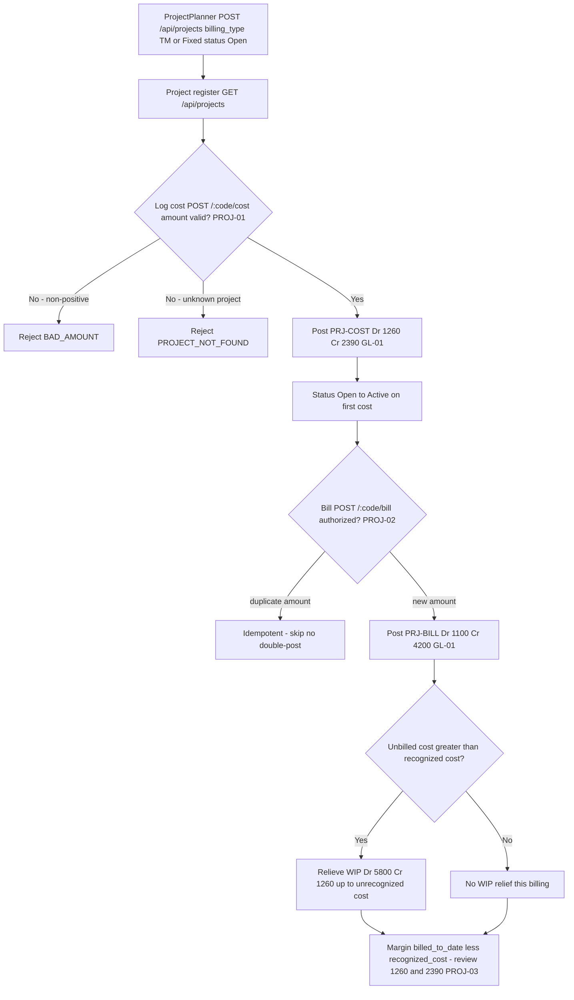

# Project Accounting — Process Narrative

## 1. Document control

| Field | Value |
|---|---|
| Process ID | PN-16-PROJ |
| Process owner | `<<Project Controller>>` |
| Approver | `<<CFO>>` |
| Version | **0.1 DRAFT** |
| Effective date | `<<effective-date>>` |
| Review cadence | Annual + on significant change |
| Related RCM controls | PROJ-01, PROJ-02, PROJ-03, PROJ-04, PROJ-05, PROJ-06, PROJ-07, PROJ-08, CRM-WL, GL-01; SoD R07 |
| Related policy | `compliance/policies/03-delegation-of-authority.md`, `compliance/policies/11-financial-close-policy.md` |

## 2. Purpose

To define and control the project / job-costing lifecycle — project setup, accumulation of time and expense cost into unbilled WIP, customer billing, and project revenue recognition with WIP relief — so that project WIP, project revenue, and project cost of services are **valid, complete, accurate, properly cut off, and authorized**, that project margin is fairly stated, and that every project posting reaches the general ledger as a balanced journal entry.

## 3. Scope

**In scope:** origination of a project from a **won** CRM opportunity (`POST /api/projects/from-opportunity/:oppNo` — CRM-WL), project creation and configuration (`POST /api/projects`; billing type TM or Fixed), the project register and detail with entries (`GET /api/projects`, `GET /api/projects/:code`), cost capture of time / expense into unbilled WIP (`POST /api/projects/:code/cost`), customer billing with revenue recognition and WIP relief (`POST /api/projects/:code/bill`), the work-breakdown structure of tasks with planned-hours-weighted **% complete** roll-up (`POST/GET /api/projects/:code/tasks`, `PATCH /api/projects/tasks/:taskId`) and project **milestones** whose completion can raise a Fixed-price progress bill (`POST/GET /api/projects/:code/milestones`, `POST /api/projects/milestones/:id/reach`), the **resource rate card** and project **resource assignments** with capacity/utilization (`POST/GET /api/projects/rate-cards`, `POST/GET /api/projects/:code/resources`, `GET /api/projects/resources/utilization`), **timesheet → project labor** via a maker-checker approval that posts labor cost to WIP (`POST /api/hcm/timesheets` with a `project_code`, `POST /api/hcm/timesheets/:id/approve`), task **dependencies** and **earned-value management** (`GET /api/projects/:code/evm` — BAC/PV/EV/AC → CPI/SPI/EAC), the **critical-path schedule** (`GET /api/projects/:code/schedule` — CPM ES/EF/LS/LF + slack) and **EVM S-curve series** (`GET /api/projects/:code/evm/series`) that drive the Gantt/analytics screens, the **win/loss analytics** that drive the pipeline dashboard (`GET /api/crm/pipeline/win-loss`), and the unbilled-WIP (1260) and project-costs-applied (2390) clearing tie-outs.

**Out of scope:** general revenue-recognition policy and contract-based deferral mechanics (see `12-revenue-recognition-billing.md`), inventory cost flowing into a project (see `03-inventory-cogs.md`), AR collection and cash application (see `01-order-to-cash.md` / `07-cash-treasury.md`), and the period-close that project postings flow through (see `04-general-ledger-close.md`).

## 4. References

- ISO 9001:2015 cl. 4.4 (process approach), cl. 8.1 (operational planning & control), cl. 8.2 (requirements for products & services), cl. 8.5 (production & service provision).
- `compliance/Oshinei_ERP_SOX_RCM_v1.xlsx` — PROJ-01..03, GL-01.
- `compliance/policies/03-delegation-of-authority.md` (billing authority), `11-financial-close-policy.md` (revenue cutoff / WIP relief).
- Code: `apps/api/src/modules/projects/projects.service.ts` + `projects.controller.ts`, `apps/api/src/database/schema/projects.ts`, `apps/api/src/modules/ledger/ledger.service.ts`, `apps/api/src/common/doc-number.service.ts`.

## 5. Definitions & abbreviations

| Term | Meaning |
|---|---|
| Project | A costed job; `project_code`, `name`, `billing_type`, `status` |
| TM / Fixed | Billing types — Time-and-Materials / Fixed-price |
| Cost entry | A logged time / expense line accumulating to project cost-to-date |
| Unbilled WIP | `cost_to_date − recognized_cost`, carried in account 1260 |
| Recognized cost | Project cost relieved from WIP into cost of services on billing |
| Margin | `billed_to_date − recognized_cost` |
| Idempotency (bill) | Amount-based: re-billing the same cumulative amount does not double-post |
| PRJ-COST / PRJ-BILL | GL source tags (cost capture / billing) |

GL accounts used: **1100** AR, **1260** Project WIP / Unbilled Cost, **2390** Project Costs Applied (clearing), **4200** Project Revenue, **5800** Project Cost of Services.

## 6. Roles & responsibilities (RACI)

Single-duty roles enforce SoD: the role that **initiates / logs** project cost is never the sole role that **approves the billing** that recognizes revenue against it (rule **R07** — initiate vs approve).

| Activity | ProjectPlanner | ProjectAccountant | ProjectController | ArSpecialist | FinancialController / CFO |
|---|---|---|---|---|---|
| Convert won opportunity → project (CRM-WL) | R | C | **A/R** | I | I |
| Create / configure project (TM / Fixed) | **A/R** | C | A | I | C |
| Log time / expense cost (PRJ-COST) | **A/R** | C | I | I | I |
| Review cost-capture postings | I | **A/R** | A | I | I |
| Authorize billing (PRJ-BILL) | C | I | **A/R** | C | A |
| Raise customer invoice / AR | I | C | C | **A/R** | I |
| Review unbilled-WIP (1260) aging | I | **A/R** | A | I | C |
| Review 2390 clearing tie-out | I | **A/R** | A | I | C |

## 7. Process narrative

1. **Project setup (decision point).** ProjectPlanner creates a project via `POST /api/projects` (permissions `exec` / `planner` / `ar`), specifying `billing_type` **TM** or **Fixed**. The project opens in status **Open**. Billing authority is segregated from cost initiation (**R07**).
   - **1a. Origination from a won opportunity (CRM-WL).** A project may instead be originated from a **won** CRM opportunity via `POST /api/projects/from-opportunity/:oppNo`. The system converts **only** a **won** `crm_opportunity` (an open or lost deal → `OPP_NOT_WON`; an unknown deal → `OPP_NOT_FOUND`), seeds the project **contract amount from the deal value**, and stamps **`customer_no`** (→ `customer_master`) and **`crm_opp_no`** (→ `crm_opportunities.opp_no`) so project revenue / WIP trace back to the approved deal. Conversion is **idempotent on `crm_opp_no`** — a given opportunity converts to **at most one** project, so a re-submit returns the existing project rather than duplicating it. Win/loss integrity of the opportunity itself (controlled stage machine, mandatory lost reason, terminal won/lost) is enforced upstream by the CRM pipeline (**REV-17**).
2. **Project register & detail.** `GET /api/projects` lists projects; `GET /api/projects/:code` returns the detail with its cost / billing entries. This is the system of record for cost-to-date, recognized cost, and billed-to-date.
3. **Cost capture (decision point, billable vs non-billable).** ProjectPlanner logs a time or expense cost entry via `POST /api/projects/:code/cost` (source **PRJ-COST**, `sourceRef = code:entryId`), flagging it **billable** (default) or **non-billable**. A **billable** cost is a *recoverable* asset → **Dr 1260 Project WIP-Unbilled Cost / Cr 2390 Project Costs Applied**, and it accumulates in **cost-to-date** (relieved to COGS at billing). A **non-billable** cost is *unrecoverable* (you can't bill the customer for it) → it is **expensed immediately**: **Dr 5800 Project Cost of Services / Cr 2390**, and it does **not** enter the billable WIP or cost-to-date — conservative accounting must not carry an unrecoverable cost as an asset. Σdebit = Σcredit by construction either way (**PROJ-01**, **GL-01**). The project register exposes `non_billable_cost`, `total_cost` (= recoverable WIP + non-billable), and the **true margin** (`billed − recognised − non-billable`). On the first cost the project status moves **Open → Active**. A non-positive amount is rejected `BAD_AMOUNT`; an unknown project is rejected `PROJECT_NOT_FOUND`.
4. **Billing & revenue recognition (decision point, with milestone billing).** ProjectController authorizes billing via `POST /api/projects/:code/bill` (source **PRJ-BILL**, `sourceRef = code:billedAmount`). Billing is by a raw **`amount`** (T&M) or, for a **Fixed-price** contract, by **`percent` of the contract value** — milestone/progressive billing (e.g. 30% at a phase), `bill = contract × percent/100` (percent with no contract → `NO_CONTRACT`). A **Fixed-price contract is capped**: cumulative billing may **never exceed the contract amount** (`BILL_EXCEEDS_CONTRACT`), so the customer is never over-billed. The posting is **idempotent on the cumulative billed amount** — re-billing the same amount does not double-post. A balanced JE posts **Dr 1100 AR Cr 4200 Project Revenue** (**PROJ-02**, **GL-01**). The register exposes `billed_pct` and `remaining_to_bill` for Fixed contracts. Billing is authorized separately from cost initiation (**R07**).
5. **WIP relief on billing.** When unbilled cost exceeds recognized cost, the same billing event relieves WIP up to the unrecognized cost: **Dr 5800 Project Cost of Services Cr 1260** (relieving Project WIP). This matches cost of services to recognized revenue and reduces the 1260 balance (**PROJ-02**, **GL-01**).
6. **Margin, WIP & budget measurement.** Project **margin = billed_to_date − recognized_cost − non-billable**; project **WIP = cost_to_date − recognized_cost**, carried in account **1260**. The register also reports **budget control**: `budget_variance` (= `budget_amount − total_cost`), `budget_used_pct`, and an **`over_budget`** flag (total cost incurred has exceeded the budget) so the ProjectAccountant can catch a **cost overrun** before it eats the margin. ProjectAccountant reviews 1260 aging, the 2390 clearing tie-out, and over-budget projects at close (**PROJ-03**).

7. **Work breakdown & schedule progress (P1).** The ProjectPlanner decomposes the project into a **WBS** of tasks (`POST /api/projects/:code/tasks`; each task carries an optional `parent_id` for hierarchy, planned hours/cost, an assignee, and a `pct_complete`), updates progress (`PATCH /api/projects/tasks/:taskId`; marking a task `done` implies 100%), and reads the register (`GET /api/projects/:code/tasks`). The project's overall **% complete rolls up from its tasks, weighted by planned hours** (simple mean if no planned hours; cancelled tasks excluded), and is surfaced on the project detail (`pct_complete`, `task_count`). This is **operational / non-financial** — task changes post nothing to the GL. An unknown task is rejected `TASK_NOT_FOUND`.
8. **Milestones & milestone-driven billing (P1).** The ProjectPlanner records **milestones** (`POST /api/projects/:code/milestones`; due date, owner, optional `billing_percent`). Reaching a milestone (`POST /api/projects/milestones/:id/reach`) marks it `reached`; **if it carries a `billing_percent`, the same act raises a Fixed-price progress bill through the existing authorized `bill` path** (`bill = contract × percent/100` → Dr 1100 AR / Cr 4200 Revenue + WIP relief, **capped at the contract** and idempotent) — i.e. milestone billing is the **PROJ-02** control, not a new posting path. A milestone reached twice is rejected `MILESTONE_REACHED` (no double bill); an unknown milestone is rejected `MILESTONE_NOT_FOUND`; an out-of-range `billing_percent` is rejected `BAD_PERCENT`. Billing authority remains segregated from cost initiation (**R07**).

9. **Resource rate card & assignments (P2).** A **rate card** (`POST /api/projects/rate-cards`; `resource_rates`) holds effective-dated cost/bill rates per role. When the ProjectManager **assigns a resource** to a project (`POST /api/projects/:code/resources`; optionally to a WBS task, for a period, at an allocation %), the system **resolves and snapshots** the applicable rate (latest `effective_from` on/before the assignment date, `effective_to` open or on/after) so labor cost/bill estimates trace to an **authorized rate** (a role with no rate card snapshots **zero** — never a guessed rate). Allocation % is validated to (0,100] (`BAD_ALLOC`). The **capacity/utilization** roll-up (`GET /api/projects/resources/utilization`) sums allocation per resource **across projects** and flags **>100% over-allocation** for review (**PROJ-05**). This is operational — assignments post nothing to the GL on their own.

10. **Timesheet → project labor (maker-checker, P3).** Time is captured on an HCM timesheet (`POST /api/hcm/timesheets`) that may target a project (`project_code`, optional `task_id`, `billable`); it is recorded **Pending** with the **submitter** stamped. A **different** user must approve it (`POST /api/hcm/timesheets/:id/approve`) — the submitter approving their own is blocked `SOD_SELF_APPROVAL` (**binds even Admin**). On approval, if the timesheet targets a project, its **labor cost = total hours × the employee's hourly rate** posts **once** into project WIP through the existing authorized **`PRJ-COST`** path (billable → Dr 1260 / Cr 2390; non-billable → Dr 5800 / Cr 2390); **re-approving does not double-post** (idempotent). An unknown timesheet → `TIMESHEET_NOT_FOUND`. This is the **PROJ-04** control; the underlying cost capture remains **PROJ-01**. (HCM timesheet/attendance mechanics otherwise live in the HCM cycle.)

11. **Schedule dependencies & earned-value management (P4).** WBS tasks may declare predecessor **dependencies** (`depends_on`, the Gantt/critical-path input; a task cannot depend on itself → `BAD_DEPENDENCY`). **Earned-value management** (`GET /api/projects/:code/evm`, optional `as_of`) derives **BAC** (Σ task planned cost; falls back to the project budget), **PV** (budgeted cost of work scheduled by `as_of` — tasks whose `planned_end` is on/before it), **EV** (Σ planned cost × % complete), and **AC** (the project's actual cost incurred = `cost_to_date` + non-billable, i.e. the **1260 WIP + 5800** actuals), then **CPI = EV/AC**, **SPI = EV/PV**, cost & schedule variance, and **EAC/ETC** forecasts. EVM **reconciles earned value to the project's actual cost** — a detective signal of cost overrun / schedule slip (**PROJ-06**). Computed on read; non-posting. The **critical-path schedule** (`GET /api/projects/:code/schedule`) runs a CPM forward/backward pass over `depends_on` (duration = `planned_start→planned_end` span, else `planned_hours/8`) to surface each task's ES/EF/LS/LF, slack, and `on_critical_path` (the Gantt highlight), and the **EVM S-curve series** (`GET /api/projects/:code/evm/series`) accumulates the planned-cost baseline by month with the current EV/AC overlay. Win/loss analytics for the pipeline dashboard (loss reasons, by-owner win rate, monthly trend) come from `GET /api/crm/pipeline/win-loss` (**REV-17**). All are read-only/non-posting. The portfolio EVM and win/loss views are also **schedulable BI report types** — `project_evm` (every project's CPI/SPI + totals + at-risk list) and `crm_win_loss` — so finance can subscribe to them as periodic emailed reports via `modules/bi` (`REPORT_TYPES`); the subscriptions are read-only and inherently idempotent. The **portfolio command center** (`GET /api/projects/portfolio`) rolls these up to an executive cross-project view — EVM totals, project-health buckets (on-track / at-risk by CPI·SPI < 0.9), status + financial totals, the at-risk list, resource capacity (over-allocation), and the pipeline→delivery funnel (open → won → converted). Read-only.

12. **Baselines & variance (change-controlled, P-next B1).** A project **baseline** (`POST /api/projects/:code/baseline`) snapshots the approved **BAC** (Σ task planned cost, or the project budget) + **critical-path duration** at a point in time. The **first** baseline is free; **re-baselining requires a `reason`** (`BASELINE_REASON_REQUIRED`) and **supersedes** the prior active baseline (history preserved — `active`→`superseded`, with who/when), so a project can't silently move its goalposts. `GET /api/projects/:code/baseline` returns the active baseline, the current plan, and the **variance** (`bac_delta` / `bac_pct` / `duration_delta`) — the scope/cost-creep signal (**PROJ-07**). Read-only against the GL (operational governance).

13. **Project templates (reusable WBS/milestone scaffolds, P-next B2).** A **template** (`project_templates` + `project_template_items`) captures a standard set of task + milestone items with **relative date offsets** (days from project start), planned effort/cost, WBS nesting (`parent_seq`) and dependencies (`depends_on_seq`) keyed by an in-template `seq`. `POST /api/projects/templates` authors one (a duplicate `code` is rejected — `TEMPLATE_EXISTS`); `GET /api/projects/templates[/:tpl]` lists/reads them. **Applying** a template — `POST /api/projects/:code/apply-template/:tpl` — scaffolds the whole WBS + milestone set in one step: tasks are created first (mapping `seq`→id), then `parent_id`/`depends_on` are wired by that map, and each item is dated off the project start (or an explicit `start_date`). To prevent a duplicated WBS, apply is refused once a project already has tasks (`PROJECT_HAS_TASKS`). Operational (non-financial) — no GL impact and no new control; the scaffolded tasks/milestones then ride the existing PROJ-01..07 controls.

14. **RACI accountability on tasks (P-next B3).** Each WBS task carries the four **RACI** roles — `accountable` (the single answerable owner), `responsible` (CSV of doers), `consulted`, `informed` (set on `addTask`/`patchTask`, lists deduped/trimmed). `GET /api/projects/:code/raci` returns the accountability matrix: per-task A/R/C/I, a per-person role rollup, and the **accountability gaps** (`missing_accountable` — tasks with no single owner, `complete` flag). `GET /api/projects/my-tasks` is each user's personal queue — their still-open tasks across every project where they are accountable or responsible (with `my_role`). **SoD note:** the *accountable* owner of a task should not be the person who later **approves** that task's cost/timesheet — surfaced by the matrix and enforced by the existing labor maker-checker (**PROJ-04**, `SOD_SELF_APPROVAL`). Operational — no GL impact and no new control.

15. **Risk & issue register (governance, P-next B4, PROJ-08).** A `project_risks` row is either a **risk** (a future threat, scored `probability × impact`) or an **issue** (a materialised problem, scored `5 × impact`) on a 1–25 scale, with a derived **RAG** (red ≥ 12 / amber ≥ 6 / green), an owner, a mitigation plan and a due date. `POST/GET /api/projects/:code/risks` log + list (the list summary exposes `open`, `high_open`, and the key **`unmitigated_high`** count); `PATCH /api/projects/risks/:id` re-scores or closes (closing stamps `closed_at`); `GET /api/projects/risks/top` is the portfolio roll-up ranking every open item by score. **Control PROJ-08 (detective):** an **open HIGH risk with no mitigation** is surfaced (register summary + portfolio top-risks) for review at close — a foreseeable overrun is escalated, never buried. Operational — no GL impact.

## 8. Process flow

**Swimlane description by role:** **ProjectPlanner** creates projects and logs time / expense cost into unbilled WIP. The **system** enforces the `BAD_AMOUNT` and `PROJECT_NOT_FOUND` guards, the Open → Active status flip on first cost, the balanced PRJ-COST and PRJ-BILL postings, amount-based billing idempotency, and the WIP relief that matches cost of services to recognized revenue. **ProjectController** authorizes billing (segregated from cost initiation under R07). **ArSpecialist** owns the resulting customer invoice / AR. **ProjectAccountant** reviews cost-capture postings, unbilled-WIP (1260) aging, and the project-costs-applied (2390) clearing tie-out, with **FinancialController / CFO** approving setup and reviewing margin at close.

## 9. Control matrix

| Step | Risk | Control | Type | RCM ID | Evidence / Record |
|---|---|---|---|---|---|
| 1a | Project delivered from a deal that was never won, or a won deal spawns duplicate projects → revenue/WIP not traceable to an approved opportunity | Convert **won-only** (`OPP_NOT_WON` / `OPP_NOT_FOUND`); seed contract from deal value; stamp `customer_no` + `crm_opp_no`; **idempotent on `crm_opp_no`** (one project per deal) | Prev / Auto | CRM-WL, REV-17 | Conversion audit (`project.crm_opp_no` → opportunity); won-only / idempotency rejections |
| 3 | Cost captured unbalanced / invalid amount | Balanced PRJ-COST Dr 1260 Cr 2390; `BAD_AMOUNT` guard | Prev / Auto | PROJ-01, GL-01 | Cost JE tie-out; `BAD_AMOUNT` rejections |
| 3 | Unrecoverable (non-billable) cost capitalised into WIP → unbilled balance + margin overstated | Billable cost → 1260 WIP (recoverable); non-billable cost expensed immediately → 5800 (never enters WIP); `total_cost` + true margin (billed − recognised − non-billable) on the register | **Prev / Auto** | **PROJ-01**, GL-01 | Non-billable cost JE (5800); cost register |
| 3 | Cost logged to non-existent project | `PROJECT_NOT_FOUND` guard | Prev / Auto | PROJ-01 | Rejection log |
| 4 | Revenue not recognized / unbalanced | Balanced PRJ-BILL Dr 1100 Cr 4200 | Prev / Auto | PROJ-02, GL-01 | Billing JE tie-out |
| 4 | Same billing double-posted | Amount-based idempotency on cumulative billed amount | Prev / Auto | PROJ-02 | Re-bill test |
| 8 | Milestone billing posts an unauthorized / duplicated / over-contract bill | Milestone billing reuses the authorized `bill` path (Fixed cap + amount idempotency); a milestone reached twice → `MILESTONE_REACHED` (no double bill) | Prev / Auto | PROJ-02, R07 | Milestone `reached_at`; billing JE; `MILESTONE_REACHED` rejection |
| 9 | Project labor charged at an ungoverned rate / a resource over-committed | Effective-dated rate card resolves + snapshots the authorized rate at assignment (zero if none); allocation validated to (0,100] (`BAD_ALLOC`); utilization roll-up flags >100% over-allocation | Prev / Det / Auto | PROJ-05 | Rate card; assignment snapshot rate; utilization report |
| 10 | Project labor self-authorized / double-posted to WIP | Timesheet→labor maker-checker: submitter ≠ approver (`SOD_SELF_APPROVAL`, binds Admin); approval posts hours×rate to WIP once via `PRJ-COST`; re-approve does not double-post | Prev / Auto | PROJ-04, PROJ-01 | Timesheet `submitted_by`/`approved_by`; PRJ-COST JE; `SOD_SELF_APPROVAL` rejection |
| 11 | Cost overrun / schedule slip detected late; WIP not reconciled to work earned | EVM derives CPI=EV/AC & SPI=EV/PV + variances + EAC from tasks vs actual cost; AC reconciles to the 1260/5800 actuals | Det / Auto | PROJ-06 | EVM report (CPI/SPI/variances/EAC); 1260 WIP reconciliation |
| 12 | Plan re-baselined silently → variance masks scope/cost creep | Change-controlled baselines: re-baseline requires a reason (`BASELINE_REASON_REQUIRED`), supersedes + preserves history; current-vs-baseline variance surfaced | Prev / Auto | PROJ-07 | Baseline history (active/superseded, reason, captured_by); variance report |
| 13 | Open HIGH risk / unresolved issue buried → foreseeable overrun not escalated | Risk & issue register scores each item (prob×impact / 5×impact) with RAG; summary + portfolio top-risks surface open-high and the **unmitigated-high** subset for review at close | Det / Auto | PROJ-08 | Risk register (RAG, owner, mitigation, due); portfolio top-risks roll-up |
| 4 | Fixed-price contract over-billed (customer charged beyond the contract) | Cumulative billing capped at the contract amount (`BILL_EXCEEDS_CONTRACT`); milestone billing by % of contract; `billed_pct`/`remaining_to_bill` on the register | **Prev / Auto** | **PROJ-02** | Over-bill rejection; billing progress |
| 5 | Cost not matched to revenue / WIP overstated | WIP relief Dr 5800 Cr 1260 up to unrecognized cost | Prev / Auto | PROJ-02, GL-01 | WIP relief entry; cutoff review |
| 6 | Unbilled WIP (1260) stale / misstated | 1260 aging & tie-out review | Det / Hybrid | PROJ-03 | 1260 aging report |
| 6 | Project cost overruns the budget undetected (margin erodes) | `budget_variance` / `budget_used_pct` / `over_budget` flag on the register; over-budget projects reviewed at close | **Det / Auto** | **PROJ-03** | Budget-variance report; over-budget flag |
| 6 | Project-costs-applied (2390) not cleared | 2390 clearing-account review | Det / Hybrid | PROJ-02, GL-01 | 2390 clearing tie-out |
| 1,4 | Self-authorized billing | SoD: initiate cost vs approve billing segregated | Prev / Manual | R07 | SoD conflict report |

## 10. Inputs & outputs

**Inputs:** project setup (name, billing type TM/Fixed), time / expense cost entries (qty × rate or amount), billing authorization (cumulative billed amount).
**Outputs:** project register & detail, cost-capture JEs (PRJ-COST), billing JEs with revenue recognition (PRJ-BILL), WIP relief postings, project margin and unbilled-WIP (1260) reporting.

## 11. Records & retention

| Record | Store | Retention |
|---|---|---|
| Projects & status | `projects` (RLS-scoped) | `<<7 years / per Thai law>>` |
| Project cost / billing entries | `project_entries` | `<<7 years>>` |
| PRJ-COST / PRJ-BILL JEs | Ledger | `<<7 years>>` |
| Project setup / config changes | `audit_log` (immutable) | `<<7 years>>` |

## 12. KPIs / metrics

- PRJ-BILL re-bill double-posts detected (target: 0; idempotency holds).
- Unbilled-WIP (1260) aging — value and days outstanding by project.
- Project-costs-applied (2390) clearing balance at close (target: cleared).
- Project margin (`billed_to_date − recognized_cost`) vs budget by project.
- Cost entries rejected for `BAD_AMOUNT` (data-quality signal).

## 13. Exception & error handling

| Error code | Trigger | Handling |
|---|---|---|
| `BAD_AMOUNT` | Cost or bill amount ≤ 0 | Originator supplies positive amount; resubmit |
| `PROJECT_NOT_FOUND` | Cost / bill against unknown `code` | Verify / create project first |
| `OPP_NOT_WON` | Convert an open / lost opportunity to a project | Win the opportunity first (CRM stage → `won`), then convert |
| `OPP_NOT_FOUND` | Convert an unknown opportunity `oppNo` | Verify the opportunity number; create it in the CRM pipeline first |
| (idempotent skip) | Re-convert the same won opportunity | No duplicate project; returns the existing project (`already: true`) |
| `TASK_NOT_FOUND` | Patch a non-existent WBS task | Verify the `taskId`; create the task first |
| `MILESTONE_NOT_FOUND` | Reach a non-existent milestone | Verify the milestone id; create the milestone first |
| `MILESTONE_REACHED` | Reach a milestone already reached | No action — already reached (re-reach would double-bill; blocked) |
| `BAD_PERCENT` | Milestone `billing_percent` outside (0,100] | Supply a percent within (0,100] |
| `BAD_ALLOC` | Resource assignment `alloc_pct` outside (0,100] | Supply an allocation within (0,100] |
| `SOD_SELF_APPROVAL` | The submitter tries to approve their own timesheet | A different user (independent of the submitter) approves — maker-checker, binds even Admin |
| `TIMESHEET_NOT_FOUND` | Approve a non-existent timesheet | Verify the timesheet id |
| `BAD_DEPENDENCY` | A task is set to depend on itself | Remove the self-reference; a task's `depends_on` must list other tasks |
| `BASELINE_REASON_REQUIRED` | Re-baselining a project that already has a baseline, with no reason | Supply a reason for the re-baseline (change governance); the prior baseline is kept as history |
| (idempotent skip) | Re-bill the same cumulative amount | No double-post; verify intended amount |
| `PERIOD_CLOSED` | PRJ-COST / PRJ-BILL into a closed period | Re-open per close policy (authorized) or post to open period (see `04-general-ledger-close.md`) |
| `SOD_VIOLATION` / SoD conflict | Same user logs cost and authorizes billing | AccessAdmin remediates (see `08-itgc.md`) |

## 14. Revision history

| Version | Date | Author | Summary |
|---|---|---|---|
| 0.1 DRAFT | 2026-06-22 | `<<author>>` | Initial draft. |
| 0.2 | 2026-06-26 | Platform | **PROJ-01 — billable vs non-billable cost capture.** Step 3: `logCost` now honours the `billable` flag — a billable cost capitalises to **1260** (recoverable WIP, relieved at billing); a **non-billable** cost is **expensed immediately to 5800** and never enters the billable WIP, so the register's `total_cost` and **true margin** (billed − recognised − non-billable) absorb it. The `/projects` screen gains a **billable toggle** on the cost dialog + a **เบิกลูกค้าไม่ได้ (non-billable)** column. Also **back-filled the missing PROJ-01/PROJ-02/PROJ-03 controls into the RCM** (this narrative referenced them but `build_rcm.py` lacked them) → RCM now 91. No migration (non_billable derived from the cost entries). ToE: `projects` harness (billable default unchanged: WIP 7000/margin 3000; a non-billable 800 → 5800 immediately, cost_to_date 7000, total_cost 7800, margin 2200). |
| 0.3 | 2026-06-26 | Platform | **PROJ-02 — milestone / % billing + Fixed-price over-bill cap.** Step 4: `bill` now accepts `percent` (of the contract) for **Fixed-price** milestone billing (`bill = contract × percent/100`; no contract → `NO_CONTRACT`) as well as a raw `amount`; cumulative billing on a Fixed contract is **capped at the contract value** (`BILL_EXCEEDS_CONTRACT`) so the customer is never over-billed. The register exposes `billed_pct` + `remaining_to_bill`; the `/projects` bill dialog gains a **"วางบิลตาม % ของสัญญา"** toggle. No migration. ToE: `projects` harness (30% of a 100000 contract → revenue 30000, billed_pct 30, remaining 70000; a further 80% → `BILL_EXCEEDS_CONTRACT`). |
| 0.4 | 2026-06-26 | Platform | **PROJ-03 — project budget-overrun variance.** Step 6: the register now reports `budget_variance` (= `budget_amount − total_cost`), `budget_used_pct`, and an **`over_budget`** flag so a cost overrun is caught before it erodes margin. The `/projects` screen gains a **ใช้งบ (budget-used %)** column that turns amber ≥ 85% and red ⚠ when over budget. Reporting-only over the existing PROJ-03 cost-review control; no new control, no migration. ToE: `projects` harness (a 6000 cost on a 5000 budget → `over_budget`, `budget_variance` −1000, `budget_used_pct` 120). |
| 0.13 | 2026-06-30 | Platform | **Baselines & variance (`docs/20` Track B1).** Step **12**: change-controlled project baselines (`project_baselines`, migration 0188) snapshot the approved BAC + critical-path duration; **re-baselining requires a reason** (`BASELINE_REASON_REQUIRED`) and supersedes/preserves history; `GET/POST /api/projects/:code/baseline` expose the active baseline + current-vs-baseline variance (scope/cost creep). **New control PROJ-07** in `build_rcm.py` → RCM now **141**. Tenant-scoped (RLS loop re-run in 0188). ToE: `projects` harness (baseline BAC 2000; +500 scope → +25%; reason-gated re-baseline → 2500/history 2). |
| 0.16 | 2026-06-30 | Platform | **Risk & issue register (`docs/20` Track B4).** Step **15**, control-matrix row **13**: `project_risks` (migration 0192) logs a risk (prob×impact) or issue (5×impact) scored 1–25 with a derived RAG, owner, mitigation, due date. `POST/GET /api/projects/:code/risks` (+ summary `high_open`/`unmitigated_high`), `PATCH /api/projects/risks/:id` (re-score/close), `GET /api/projects/risks/top` (portfolio roll-up). **New control PROJ-08** (detective — open HIGH unmitigated risk surfaced, not buried) in `build_rcm.py` → RCM now **142**. Web: a *ความเสี่ยง & ปัญหา* workspace tab. Tenant-scoped (RLS loop re-run in 0192). ToE: `projects` harness (high risk 25/red/unmitigated; issue 5×4=20; mitigate → unmitigated_high 0; top-risks ranks red first; close stamps closed_at; RISK_NOT_FOUND). |
| 0.15 | 2026-06-30 | Platform | **RACI accountability (`docs/20` Track B3).** Step **14**: WBS tasks gain the four RACI roles (`accountable` single owner; `responsible`/`consulted`/`informed` CSV lists) — migration 0190 (ALTER `project_tasks`, no new table). `GET /api/projects/:code/raci` returns the accountability matrix (per-task A/R/C/I, per-person rollup, `missing_accountable` gaps); `GET /api/projects/my-tasks` is each user's open A/R queue across projects. **SoD note**: accountable ≠ the task's cost/timesheet approver (rides PROJ-04 `SOD_SELF_APPROVAL`). Operational — **no new control**. Web: RACI column + Accountable/Responsible inputs on the task form, and a *งานของฉัน* panel on `/projects`. ToE: `projects` harness (RACI store/patch dedup; matrix 3 tasks/1 gap; my-tasks for admin & mgr by role). |
| 0.14 | 2026-06-30 | Platform | **Project templates (`docs/20` Track B2).** Step **13**: reusable WBS/milestone scaffolds (`project_templates` + `project_template_items`, migration 0189) — items carry relative date offsets, planned effort/cost, WBS nesting (`parent_seq`) and dependencies (`depends_on_seq`) by in-template `seq`. `POST/GET /api/projects/templates[/:tpl]` author/read templates (duplicate code → `TEMPLATE_EXISTS`); `POST /api/projects/:code/apply-template/:tpl` scaffolds the WBS + milestones in one step (dates off the project start; `parent_id`/`depends_on` wired by seq; refused once a project has tasks → `PROJECT_HAS_TASKS`). `/projects` create form gains a **"เริ่มจากแม่แบบ"** picker. Operational — **no new control**, no GL impact (scaffolded items ride PROJ-01..07). Tenant-scoped (RLS loop re-run in 0189). ToE: `projects` harness (template IMPL-STD 4 items; apply → 3 tasks/1 milestone, dates off 2026-03-01, deps+parent wired, milestone due 2026-03-13/50%; re-apply → `PROJECT_HAS_TASKS`). |
| 0.12 | 2026-06-30 | Platform | **Portfolio command center (`docs/20` Track A1).** `GET /api/projects/portfolio` (`ProjectsService.portfolioEvm`, enriched) — an executive cross-project rollup: EVM totals, health buckets, status + financial totals, at-risk list, resource capacity, and pipeline→delivery funnel. Read-only, no migration, no new control (rides PROJ-06 / REV-17). ToE: `projects` harness (count, totals, health, financials, capacity, funnel). BI `project_evm` back-compat preserved. |
| 0.11 | 2026-06-30 | Platform | **Schedulable BI report types (`docs/19` follow-up).** `project_evm` (portfolio earned value — every project's CPI/SPI + totals + at-risk list, via `ProjectsService.portfolioEvm`) and `crm_win_loss` (via `CrmPipelineService.winLoss`) added to `modules/bi` `REPORT_TYPES`, so finance can schedule them as periodic emailed reports. Wired `@Optional()` into `BiService` (BiModule imports ProjectsModule + CrmPipelineModule). Read-only, idempotent; no migration, no new control. ToE: `projects` harness (both report types run a subscription to `status:success`); `bi`/`crm`/`compliance` harnesses regression-clean. |
| 0.10 | 2026-06-29 | Platform | **PPM analytics backend for the web UI (`docs/19` follow-up).** Read-only endpoints powering the sleek PM screens: `GET /api/projects/:code/schedule` (CPM critical path — ES/EF/LS/LF, slack, `on_critical_path`), `GET /api/projects/:code/evm/series` (planned-cost S-curve + current EV/AC overlay), and `GET /api/crm/pipeline/win-loss` (loss reasons, by-owner win rate, monthly trend). No migration, no new control (schedule/EVM ride **PROJ-06**; win/loss rides **REV-17**). ToE: `projects` harness (critical path A→B→D, duration 7; S-curve 1000→2000; win/loss reason 50000). |
| 0.9 | 2026-06-29 | Platform | **Schedule dependencies & EVM (PPM roadmap P4, `docs/19-project-management-ppm-plan.md`).** New step **11**: WBS task **dependencies** (`project_tasks.depends_on`, migration 0187; self-dependency → `BAD_DEPENDENCY`) and **earned-value management** (`GET /api/projects/:code/evm`) deriving BAC/PV/EV/AC → CPI/SPI + cost/schedule variance + EAC/ETC, with **AC reconciled to the 1260/5800 actuals** (detective signal of overrun/slip). **New control PROJ-06** in `build_rcm.py` → RCM now **140**. Computed on read; non-posting. ToE: `projects` harness (tasks 1000@100% past + 1000@0% future, AC 900 → BAC 2000, EV 1000, PV 1000, CPI 1.1111, SPI 1.0, EAC ~1800; self-dependency → `BAD_DEPENDENCY`). *Completes the P0→P4 PPM roadmap.* |
| 0.8 | 2026-06-29 | Platform | **Timesheet → project labor (PPM roadmap P3, `docs/19-project-management-ppm-plan.md`).** New step **10**: HCM `timesheets` gain `project_id`/`task_id`/`billable`/`status`/`submitted_by`/`approved_by` (migration 0186); a **maker-checker** approval (`POST /api/hcm/timesheets/:id/approve`, submitter ≠ approver → `SOD_SELF_APPROVAL`, binds Admin) posts labor (hours × hourly rate) **once** into project WIP via the authorized `PRJ-COST` path (idempotent — no double-post on re-approval). `HcmModule` now imports `ProjectsModule`. **New control PROJ-04** in `build_rcm.py` → RCM now **139**. ToE: `projects` harness (8h × ฿200 → WIP 1600; self-approve → `SOD_SELF_APPROVAL`; independent approve posts once; re-approve no double-post). No regression in `hcm`/`ess`/`payroll` harnesses. |
| 0.7 | 2026-06-29 | Platform | **Resource rate card & assignments (PPM roadmap P2, `docs/19-project-management-ppm-plan.md`).** New step **9**: an effective-dated **rate card** (`resource_rates`) and project **resource assignments** (`project_resources`, migration 0185) that resolve + **snapshot** the authorized rate at assignment (zero when none on file), validate allocation to (0,100] (`BAD_ALLOC`), and roll up a **capacity/utilization** view that flags >100% over-allocation. **New control PROJ-05** added to `build_rcm.py` → RCM now **138**. Tenant-scoped (RLS loop re-run in 0185). ToE: `projects` harness (rate card 1000/2000 snapshotted on assign; no-rate role → 0; 60%+60% → utilization 120% over-allocated; alloc 0 → `BAD_ALLOC`). |
| 0.6 | 2026-06-29 | Platform | **WBS tasks & milestones (PPM roadmap P1, `docs/19-project-management-ppm-plan.md`).** New steps **7–8**: a project WBS (`project_tasks`, migration 0184) with planned-hours-weighted **% complete** roll-up (surfaced as `pct_complete`/`task_count` on the project detail), and **milestones** (`project_milestones`) whose completion can raise a Fixed-price progress bill **through the existing authorized `bill` path** — milestone billing is the **PROJ-02** control, no new posting path and **no new RCM control**. New errors `TASK_NOT_FOUND` / `MILESTONE_NOT_FOUND` / `MILESTONE_REACHED` / `BAD_PERCENT`. Tasks/milestones are tenant-scoped (RLS loop re-run in 0184). ToE: `projects` harness (10h@50% + 30h@0% → 12.5%; task done → 87.5%; reach a 40% milestone → Fixed bill 40000; re-reach → `MILESTONE_REACHED`). |
| 0.5 | 2026-06-29 | Platform | **CRM-WL — opportunity → project conversion (PPM roadmap P0, `docs/19-project-management-ppm-plan.md`).** New step **1a**: `POST /api/projects/from-opportunity/:oppNo` converts a **won** CRM opportunity into a project — **won-only** (`OPP_NOT_WON` / `OPP_NOT_FOUND`), seeds the contract from the deal value, stamps `customer_no` + `crm_opp_no`, and is **idempotent on `crm_opp_no`** (one project per deal). Migration **0183** adds nullable `projects.customer_no` / `crm_opp_no` (+ `idx_project_crm_opp`); `customer_name` untouched. **New control CRM-WL** added to `build_rcm.py` → RCM now **137**. ToE: `projects` harness (won deal 250000 → project contract 250000 + `crm_opp_no` linked; re-convert → `already`; open deal → `OPP_NOT_WON`; unknown → `OPP_NOT_FOUND`). |
