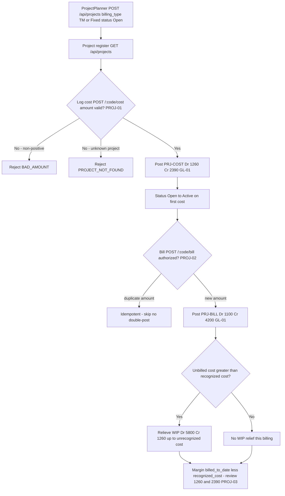

# Project Accounting — Process Narrative

## 1. Document control

| Field | Value |
|---|---|
| Process ID | PN-16-PROJ |
| Process owner | `<<Project Controller>>` |
| Approver | `<<CFO>>` |
| Version | **0.1 DRAFT** |
| Effective date | `<<effective-date>>` |
| Review cadence | Annual + on significant change |
| Related RCM controls | PROJ-01, PROJ-02, PROJ-03, PROJ-04, PROJ-05, PROJ-06, PROJ-07, PROJ-08, PROJ-09, PROJ-10, PROJ-11, PROJ-12, PROJ-13, PROJ-14, PROJ-15, PROJ-16, PROJ-17, PROJ-18, INV-13, CRM-WL, GL-01; SoD R07 |
| Related policy | `compliance/policies/03-delegation-of-authority.md`, `compliance/policies/11-financial-close-policy.md` |

## 2. Purpose

To define and control the project / job-costing lifecycle — project setup, accumulation of time and expense cost into unbilled WIP, customer billing, and project revenue recognition with WIP relief — so that project WIP, project revenue, and project cost of services are **valid, complete, accurate, properly cut off, and authorized**, that project margin is fairly stated, and that every project posting reaches the general ledger as a balanced journal entry.

## 3. Scope

**In scope:** origination of a project from a **won** CRM opportunity (`POST /api/projects/from-opportunity/:oppNo` — CRM-WL), project creation and configuration (`POST /api/projects`; billing type TM or Fixed), the project register and detail with entries (`GET /api/projects`, `GET /api/projects/:code`), cost capture of time / expense into unbilled WIP (`POST /api/projects/:code/cost`), customer billing with revenue recognition and WIP relief (`POST /api/projects/:code/bill`), the work-breakdown structure of tasks with planned-hours-weighted **% complete** roll-up (`POST/GET /api/projects/:code/tasks`, `PATCH /api/projects/tasks/:taskId`) and project **milestones** whose completion can raise a Fixed-price progress bill (`POST/GET /api/projects/:code/milestones`, `POST /api/projects/milestones/:id/reach`), the **resource rate card** and project **resource assignments** with capacity/utilization (`POST/GET /api/projects/rate-cards`, `POST/GET /api/projects/:code/resources`, `GET /api/projects/resources/utilization`), **timesheet → project labor** via a maker-checker approval that posts labor cost to WIP (`POST /api/hcm/timesheets` with a `project_code`, `POST /api/hcm/timesheets/:id/approve`), task **dependencies** and **earned-value management** (`GET /api/projects/:code/evm` — BAC/PV/EV/AC → CPI/SPI/EAC), the **critical-path schedule** (`GET /api/projects/:code/schedule` — CPM ES/EF/LS/LF + slack) and **EVM S-curve series** (`GET /api/projects/:code/evm/series`) that drive the Gantt/analytics screens, the **win/loss analytics** that drive the pipeline dashboard (`GET /api/crm/pipeline/win-loss`), and the unbilled-WIP (1260) and project-costs-applied (2390) clearing tie-outs.

**Out of scope:** general revenue-recognition policy and contract-based deferral mechanics (see `12-revenue-recognition-billing.md`), inventory cost flowing into a project (see `03-inventory-cogs.md`), AR collection and cash application (see `01-order-to-cash.md` / `07-cash-treasury.md`), and the period-close that project postings flow through (see `04-general-ledger-close.md`).

## 4. References

- ISO 9001:2015 cl. 4.4 (process approach), cl. 8.1 (operational planning & control), cl. 8.2 (requirements for products & services), cl. 8.5 (production & service provision).
- `compliance/Oshinei_ERP_SOX_RCM_v1.xlsx` — PROJ-01..03, GL-01.
- `compliance/policies/03-delegation-of-authority.md` (billing authority), `11-financial-close-policy.md` (revenue cutoff / WIP relief).
- Code: `apps/api/src/modules/projects/projects.service.ts` + `projects.controller.ts`, `apps/api/src/database/schema/projects.ts`, `apps/api/src/modules/ledger/ledger.service.ts`, `apps/api/src/common/doc-number.service.ts`.

## 5. Definitions & abbreviations

| Term | Meaning |
|---|---|
| Project | A costed job; `project_code`, `name`, `billing_type`, `status` |
| TM / Fixed | Billing types — Time-and-Materials / Fixed-price |
| Cost entry | A logged time / expense line accumulating to project cost-to-date |
| Unbilled WIP | `cost_to_date − recognized_cost`, carried in account 1260 |
| Recognized cost | Project cost relieved from WIP into cost of services on billing |
| Margin | `billed_to_date − recognized_cost` |
| Idempotency (bill) | Amount-based: re-billing the same cumulative amount does not double-post |
| PRJ-COST / PRJ-BILL | GL source tags (cost capture / billing) |

GL accounts used: **1100** AR, **1260** Project WIP / Unbilled Cost, **2390** Project Costs Applied (clearing), **4200** Project Revenue, **5800** Project Cost of Services.

## 6. Roles & responsibilities (RACI)

Single-duty roles enforce SoD: the role that **initiates / logs** project cost is never the sole role that **approves the billing** that recognizes revenue against it (rule **R07** — initiate vs approve).

| Activity | ProjectPlanner | ProjectAccountant | ProjectController | ArSpecialist | FinancialController / CFO |
|---|---|---|---|---|---|
| Convert won opportunity → project (CRM-WL) | R | C | **A/R** | I | I |
| Create / configure project (TM / Fixed) | **A/R** | C | A | I | C |
| Log time / expense cost (PRJ-COST) | **A/R** | C | I | I | I |
| Review cost-capture postings | I | **A/R** | A | I | I |
| Authorize billing (PRJ-BILL) | C | I | **A/R** | C | A |
| Raise customer invoice / AR | I | C | C | **A/R** | I |
| Review unbilled-WIP (1260) aging | I | **A/R** | A | I | C |
| Review 2390 clearing tie-out | I | **A/R** | A | I | C |

## 7. Process narrative

1. **Project setup (decision point).** ProjectPlanner creates a project via `POST /api/projects` (permissions `exec` / `planner` / `ar`), specifying `billing_type` **TM** or **Fixed**. The project opens in status **Open**. Billing authority is segregated from cost initiation (**R07**).
   - **1a. Origination from a won opportunity (CRM-WL).** A project may instead be originated from a **won** CRM opportunity via `POST /api/projects/from-opportunity/:oppNo`. The system converts **only** a **won** `crm_opportunity` (an open or lost deal → `OPP_NOT_WON`; an unknown deal → `OPP_NOT_FOUND`), seeds the project **contract amount from the deal value**, and stamps **`customer_no`** (→ `customer_master`) and **`crm_opp_no`** (→ `crm_opportunities.opp_no`) so project revenue / WIP trace back to the approved deal. Conversion is **idempotent on `crm_opp_no`** — a given opportunity converts to **at most one** project, so a re-submit returns the existing project rather than duplicating it. Win/loss integrity of the opportunity itself (controlled stage machine, mandatory lost reason, terminal won/lost) is enforced upstream by the CRM pipeline (**REV-17**).
2. **Project register & detail.** `GET /api/projects` lists projects; `GET /api/projects/:code` returns the detail with its cost / billing entries. This is the system of record for cost-to-date, recognized cost, and billed-to-date.
3. **Cost capture (decision point, billable vs non-billable).** ProjectPlanner logs a time or expense cost entry via `POST /api/projects/:code/cost` (source **PRJ-COST**, `sourceRef = code:entryId`), flagging it **billable** (default) or **non-billable**. A **billable** cost is a *recoverable* asset → **Dr 1260 Project WIP-Unbilled Cost / Cr 2390 Project Costs Applied**, and it accumulates in **cost-to-date** (relieved to COGS at billing). A **non-billable** cost is *unrecoverable* (you can't bill the customer for it) → it is **expensed immediately**: **Dr 5800 Project Cost of Services / Cr 2390**, and it does **not** enter the billable WIP or cost-to-date — conservative accounting must not carry an unrecoverable cost as an asset. Σdebit = Σcredit by construction either way (**PROJ-01**, **GL-01**). The project register exposes `non_billable_cost`, `total_cost` (= recoverable WIP + non-billable), and the **true margin** (`billed − recognised − non-billable`). On the first cost the project status moves **Open → Active**. A non-positive amount is rejected `BAD_AMOUNT`; an unknown project is rejected `PROJECT_NOT_FOUND`.
4. **Billing & revenue recognition (decision point, with milestone billing).** ProjectController authorizes billing via `POST /api/projects/:code/bill` (source **PRJ-BILL**, `sourceRef = code:billedAmount`). Billing is by a raw **`amount`** (T&M) or, for a **Fixed-price** contract, by **`percent` of the contract value** — milestone/progressive billing (e.g. 30% at a phase), `bill = contract × percent/100` (percent with no contract → `NO_CONTRACT`). A **Fixed-price contract is capped**: cumulative billing may **never exceed the contract amount** (`BILL_EXCEEDS_CONTRACT`), so the customer is never over-billed. The posting is **idempotent on the cumulative billed amount** — re-billing the same amount does not double-post. A balanced JE posts **Dr 1100 AR Cr 4200 Project Revenue** (**PROJ-02**, **GL-01**). The register exposes `billed_pct` and `remaining_to_bill` for Fixed contracts. Billing is authorized separately from cost initiation (**R07**).
5. **WIP relief on billing.** When unbilled cost exceeds recognized cost, the same billing event relieves WIP up to the unrecognized cost: **Dr 5800 Project Cost of Services Cr 1260** (relieving Project WIP). This matches cost of services to recognized revenue and reduces the 1260 balance (**PROJ-02**, **GL-01**).
6. **Margin, WIP & budget measurement.** Project **margin = billed_to_date − recognized_cost − non-billable**; project **WIP = cost_to_date − recognized_cost**, carried in account **1260**. The register also reports **budget control**: `budget_variance` (= `budget_amount − total_cost`), `budget_used_pct`, and an **`over_budget`** flag (total cost incurred has exceeded the budget) so the ProjectAccountant can catch a **cost overrun** before it eats the margin. ProjectAccountant reviews 1260 aging, the 2390 clearing tie-out, and over-budget projects at close (**PROJ-03**).

7. **Work breakdown & schedule progress (P1).** The ProjectPlanner decomposes the project into a **WBS** of tasks (`POST /api/projects/:code/tasks`; each task carries an optional `parent_id` for hierarchy, planned hours/cost, an assignee, and a `pct_complete`), updates progress (`PATCH /api/projects/tasks/:taskId`; marking a task `done` implies 100%), and reads the register (`GET /api/projects/:code/tasks`). The project's overall **% complete rolls up from its tasks, weighted by planned hours** (simple mean if no planned hours; cancelled tasks excluded), and is surfaced on the project detail (`pct_complete`, `task_count`). This is **operational / non-financial** — task changes post nothing to the GL. An unknown task is rejected `TASK_NOT_FOUND`.
8. **Milestones & milestone-driven billing (P1).** The ProjectPlanner records **milestones** (`POST /api/projects/:code/milestones`; due date, owner, optional `billing_percent`). Reaching a milestone (`POST /api/projects/milestones/:id/reach`) marks it `reached`; **if it carries a `billing_percent`, the same act raises a Fixed-price progress bill through the existing authorized `bill` path** (`bill = contract × percent/100` → Dr 1100 AR / Cr 4200 Revenue + WIP relief, **capped at the contract** and idempotent) — i.e. milestone billing is the **PROJ-02** control, not a new posting path. A milestone reached twice is rejected `MILESTONE_REACHED` (no double bill); an unknown milestone is rejected `MILESTONE_NOT_FOUND`; an out-of-range `billing_percent` is rejected `BAD_PERCENT`. Billing authority remains segregated from cost initiation (**R07**).

9. **Resource rate card & assignments (P2).** A **rate card** (`POST /api/projects/rate-cards`; `resource_rates`) holds effective-dated cost/bill rates per role. When the ProjectManager **assigns a resource** to a project (`POST /api/projects/:code/resources`; optionally to a WBS task, for a period, at an allocation %), the system **resolves and snapshots** the applicable rate (latest `effective_from` on/before the assignment date, `effective_to` open or on/after) so labor cost/bill estimates trace to an **authorized rate** (a role with no rate card snapshots **zero** — never a guessed rate). Allocation % is validated to (0,100] (`BAD_ALLOC`). The **capacity/utilization** roll-up (`GET /api/projects/resources/utilization`) sums allocation per resource **across projects** and flags **>100% over-allocation** for review (**PROJ-05**). The **time-phased capacity calendar** (`GET /api/projects/resources/capacity?months=&from=`) goes further: it buckets each assignment's allocation into the **months** its `[period_start, period_end]` spans and compares per-month demand to capacity (100%/resource/month), so a resource over-booked in a *specific window* is visible even when the lifetime average looks fine — per-resource `months[]` (peak %, over-months) + a per-month rollup (total demand, resources over). This is operational — assignments post nothing to the GL on their own.

10. **Timesheet → project labor (maker-checker, P3).** Time is captured on an HCM timesheet (`POST /api/hcm/timesheets`) that may target a project (`project_code`, optional `task_id`, `billable`); it is recorded **Pending** with the **submitter** stamped. A **different** user must approve it (`POST /api/hcm/timesheets/:id/approve`) — the submitter approving their own is blocked `SOD_SELF_APPROVAL` (**binds even Admin**). On approval, if the timesheet targets a project, its **labor cost = total hours × the employee's hourly rate** posts **once** into project WIP through the existing authorized **`PRJ-COST`** path (billable → Dr 1260 / Cr 2390; non-billable → Dr 5800 / Cr 2390); **re-approving does not double-post** (idempotent). An unknown timesheet → `TIMESHEET_NOT_FOUND`. This is the **PROJ-04** control; the underlying cost capture remains **PROJ-01**. (HCM timesheet/attendance mechanics otherwise live in the HCM cycle.)

11. **Schedule dependencies & earned-value management (P4).** WBS tasks may declare predecessor **dependencies** (`depends_on`, the Gantt/critical-path input; a task cannot depend on itself → `BAD_DEPENDENCY`). **Earned-value management** (`GET /api/projects/:code/evm`, optional `as_of`) derives **BAC** (Σ task planned cost; falls back to the project budget), **PV** (budgeted cost of work scheduled by `as_of` — tasks whose `planned_end` is on/before it), **EV** (Σ planned cost × % complete), and **AC** (the project's actual cost incurred = `cost_to_date` + non-billable, i.e. the **1260 WIP + 5800** actuals), then **CPI = EV/AC**, **SPI = EV/PV**, cost & schedule variance, and **EAC/ETC** forecasts. EVM **reconciles earned value to the project's actual cost** — a detective signal of cost overrun / schedule slip (**PROJ-06**). Computed on read; non-posting. The **critical-path schedule** (`GET /api/projects/:code/schedule`) runs a CPM forward/backward pass over `depends_on` (duration = `planned_start→planned_end` span, else `planned_hours/8`) to surface each task's ES/EF/LS/LF, slack, and `on_critical_path` (the Gantt highlight), and the **EVM S-curve series** (`GET /api/projects/:code/evm/series`) accumulates the planned-cost baseline by month with the current EV/AC overlay. Win/loss analytics for the pipeline dashboard (loss reasons, by-owner win rate, monthly trend) come from `GET /api/crm/pipeline/win-loss` (**REV-17**). All are read-only/non-posting. The portfolio EVM and win/loss views are also **schedulable BI report types** — `project_evm` (every project's CPI/SPI + totals + at-risk list) and `crm_win_loss` — so finance can subscribe to them as periodic emailed reports via `modules/bi` (`REPORT_TYPES`); the subscriptions are read-only and inherently idempotent. The **portfolio command center** (`GET /api/projects/portfolio`) rolls these up to an executive cross-project view — EVM totals, project-health buckets (on-track / at-risk by CPI·SPI < 0.9), status + financial totals, the at-risk list, resource capacity (over-allocation), and the pipeline→delivery funnel (open → won → converted). Read-only.

12. **Baselines & variance (change-controlled, P-next B1).** A project **baseline** (`POST /api/projects/:code/baseline`) snapshots the approved **BAC** (Σ task planned cost, or the project budget) + **critical-path duration** at a point in time. The **first** baseline is free; **re-baselining requires a `reason`** (`BASELINE_REASON_REQUIRED`) and **supersedes** the prior active baseline (history preserved — `active`→`superseded`, with who/when), so a project can't silently move its goalposts. `GET /api/projects/:code/baseline` returns the active baseline, the current plan, and the **variance** (`bac_delta` / `bac_pct` / `duration_delta`) — the scope/cost-creep signal (**PROJ-07**). Read-only against the GL (operational governance).

13. **Project templates (reusable WBS/milestone scaffolds, P-next B2).** A **template** (`project_templates` + `project_template_items`) captures a standard set of task + milestone items with **relative date offsets** (days from project start), planned effort/cost, WBS nesting (`parent_seq`) and dependencies (`depends_on_seq`) keyed by an in-template `seq`. `POST /api/projects/templates` authors one (a duplicate `code` is rejected — `TEMPLATE_EXISTS`); `GET /api/projects/templates[/:tpl]` lists/reads them. **Applying** a template — `POST /api/projects/:code/apply-template/:tpl` — scaffolds the whole WBS + milestone set in one step: tasks are created first (mapping `seq`→id), then `parent_id`/`depends_on` are wired by that map, and each item is dated off the project start (or an explicit `start_date`). To prevent a duplicated WBS, apply is refused once a project already has tasks (`PROJECT_HAS_TASKS`). Operational (non-financial) — no GL impact and no new control; the scaffolded tasks/milestones then ride the existing PROJ-01..07 controls.

14. **RACI accountability on tasks (P-next B3).** Each WBS task carries the four **RACI** roles — `accountable` (the single answerable owner), `responsible` (CSV of doers), `consulted`, `informed` (set on `addTask`/`patchTask`, lists deduped/trimmed). `GET /api/projects/:code/raci` returns the accountability matrix: per-task A/R/C/I, a per-person role rollup, and the **accountability gaps** (`missing_accountable` — tasks with no single owner, `complete` flag). `GET /api/projects/my-tasks` is each user's personal queue — their still-open tasks across every project where they are accountable or responsible (with `my_role`). **SoD note:** the *accountable* owner of a task should not be the person who later **approves** that task's cost/timesheet — surfaced by the matrix and enforced by the existing labor maker-checker (**PROJ-04**, `SOD_SELF_APPROVAL`). Operational — no GL impact and no new control.

15. **Risk & issue register (governance, P-next B4, PROJ-08).** A `project_risks` row is either a **risk** (a future threat, scored `probability × impact`) or an **issue** (a materialised problem, scored `5 × impact`) on a 1–25 scale, with a derived **RAG** (red ≥ 12 / amber ≥ 6 / green), an owner, a mitigation plan and a due date. `POST/GET /api/projects/:code/risks` log + list (the list summary exposes `open`, `high_open`, and the key **`unmitigated_high`** count); `PATCH /api/projects/risks/:id` re-scores or closes (closing stamps `closed_at`); `GET /api/projects/risks/top` is the portfolio roll-up ranking every open item by score. **Control PROJ-08 (detective):** an **open HIGH risk with no mitigation** is surfaced (register summary + portfolio top-risks) for review at close — a foreseeable overrun is escalated, never buried. Operational — no GL impact.

16. **Over-time (percentage-of-completion) revenue recognition (PROJ-09).** A fixed-price project can recognise revenue **over time** on a **cost-to-cost** basis instead of only at billing: set `rev_method='poc'` + an `estimated_cost` (the total estimated cost / EAC). `POST /api/projects/:code/recognize` (authorised `gl_post`/`exec`) computes **POC% = cost_to_date / EAC** (capped 100%); **recognised revenue to date = contract × POC%**, and the **period revenue** (that minus revenue already recognised) is booked **Dr 2410** (releasing any billings-in-excess first) then **Dr 1265 Contract Asset / Cr 4200**, with the period cost relieved **Dr 5800 / Cr 1260**; idempotent per (project, recognised total). Billing is **decoupled** from recognition — for a POC project a **bill is an invoice**: **Dr 1100 AR / Cr 1265** (clearing earned-but-unbilled), any excess over recognised revenue parked as a **contract liability (2410, billings in excess)**. So `contract_asset` (= recognised − billed) / `billings_in_excess` (= billed − recognised) is always the true balance-sheet position, revenue is earned as work progresses (TFRS 15 / IFRS 15 over-time), and the `billing` method keeps its point-in-time behaviour unchanged. Posts through the **PERIOD_LOCKED** + **GL-audit** gates.

17. **Change orders / contract variations (maker-checker, PROJ-10).** A change to the **contract value / budget / EAC** is governed: `POST /api/projects/:code/change-orders` raises a **`pending`** change order that applies **nothing**; `POST /api/projects/change-orders/:id/approve` requires a **different** user (approver ≠ requester → `SOD_SELF_APPROVAL`), at which point the contract/budget/EAC **deltas are applied** to the project AND a **new baseline is auto-captured** (reason = the change order — ties to **PROJ-07**), so the goalposts move only with authorization, segregation, and a preserved variance trail. An empty change order (no deltas) is rejected (`EMPTY_CHANGE_ORDER`); a decided one can't be re-decided (`CHANGE_ORDER_DECIDED`); `POST …/:id/reject` declines it. `GET /api/projects/:code/change-orders` lists the register with the approved net contract delta. Operational (no GL impact — the contract is a billing/recognition ceiling, not a posting).

18. **Project health history (PPM upgrade).** The portfolio/EVM views are computed live (point-in-time), so they carry no **trajectory**. `POST /api/projects/:code/health` captures a **dated EVM/RAG snapshot** (`project_health_snapshots`) — CPI/SPI, % complete, a derived **RAG** (red if CPI or SPI < 0.9, amber if either < 1, green if both ≥ 1, no_data otherwise), plus BAC/EV/AC/EAC/margin/WIP — idempotent per (project, date). `GET /api/projects/:code/health` returns the ascending series for a **status-report trend** (the workspace plots the CPI/SPI trend). The scheduled BI action job **`project_health_capture`** (rides the `modules/bi` `REPORT_TYPES` scheduler, like the other idempotent action jobs) snapshots **every** project each run, so the trend builds automatically. Read-only/detective — non-posting; rides the EVM control **PROJ-06**.

19. **PMO action center / exception inbox (PROJ-11).** The governance signals above are scattered one project at a time, so an exception waits until someone opens the right project. `GET /api/projects/action-center` aggregates them into a **single severity-ranked worklist** across all the caller's projects: **pending change orders** and **pending project timesheets** awaiting a *different* approver (maker-checker, PROJ-04/10), **open HIGH risks with no mitigation** (PROJ-08), **red** (CPI/SPI < 0.9) and **over-budget** projects, **overdue-and-unreached milestones**, and governance gaps (an in-flight project with **no baseline** (PROJ-07) or a **stale health snapshot** — none within `stale_days`, default 14). Each item carries a severity (`high`/`medium`/`low`) and deep-links to the offending project tab; the list is bounded to the caller's RLS-visible projects. It is **proactive**: a red health snapshot (`snapProject`) or a newly-logged unmitigated-HIGH risk (`addRisk`) publishes a `project_action` event to the shared live **SSE** bus (`BiLiveService`, served at `/api/bi/live/stream`), so the inbox wakes the instant a project drifts rather than at the next manual refresh. Read-only/detective — **posts nothing** (it surfaces existing controls); **new control PROJ-11**.

20. **Pipeline-weighted forward resource & cash forecast (PMO upgrade).** The capacity calendar (step 9) only knows *committed* work; `GET /api/projects/forecast?months=&from=` makes it forward-looking by overlaying the **probability-weighted pipeline** on the committed plan — answering "if we win the deals in the pipeline, when does the cash land (and where are we already over-allocated)?". It returns, per horizon month: a **billings/cash** line = **committed** contractual billing (Fixed-price pending **milestones** × contract by due month, plus each **POC** project's earned-but-unbilled **contract asset** expected to invoice in the first month) **+ weighted pipeline** (each OPEN opportunity's `amount × probability%` at its expected-close month); and a **committed capacity demand** line (the capacity calendar's per-month allocation roll-up + over-allocated count). It also projects **resourcing demand** (PMO upgrade): a **configurable value→FTE rate** (`rev_per_fte_month`, default ฿200,000/FTE-month) turns the weighted-pipeline VALUE that month into a projected **FTE draw** — so each month carries `committed_demand_fte` (today's allocation), `pipeline_demand_fte` (weighted pipeline ÷ rate) and `total_demand_fte`, with a portfolio `peak_total_demand_fte`. Answer: "if we win the pipeline, **how many people** would each month need?". Read-only/non-posting — rides **PROJ-05** (resource governance) / **PROJ-06** (EVM); no new control.

21. **Period governance / status pack (PMO upgrade).** The recurring PMO status report is assembled by the system instead of by hand. `GET /api/projects/:code/governance-pack` returns a **full per-project pack** for a period — header (status/contract/billed/WIP/margin/% complete) + a derived **RAG**, the current **EVM**, the **health-snapshot trend** (step 18), **baseline variance** (PROJ-07), the **open-HIGH risks** (PROJ-08), **milestone status** (reached / overdue / list), and the **change-order log** (PROJ-10). `GET /api/projects/governance-pack` returns a **RAG-ranked status row per project** + a portfolio roll-up (red/amber/green counts, unmitigated-high risks, overdue milestones, pending change orders). It is also a **schedulable BI report type** — `project_governance_pack` (rides the `modules/bi` `REPORT_TYPES` scheduler) — so the pack can be generated/emailed each period. Read-only/detective — non-posting; rides **PROJ-06**. Web: a print-friendly *รายงานสถานะ* status report on the project workspace.

22. **Program (cross-project) critical path (PMO upgrade).** The CPM schedule (step 11) is intra-project; a **program** spans several projects whose delivery is sequenced (e.g. a platform project must finish before the rollout projects start). `PATCH /api/projects/:code/program` groups a project into a **`program_code`** and declares the projects it must follow (**`depends_on_projects`** — finish-to-start; guarded by `BAD_DEPENDENCY` / `DEP_PROJECT_NOT_FOUND`). `GET /api/projects/program-critical-path?program=` then runs a CPM pass over the **program graph** whose nodes are whole projects (node duration = each project's **own** critical-path duration) → per-project ES/EF/LS/LF + **slack** + `on_critical_path`, the **program duration**, and the **program critical path** (the chain of projects where a slip moves the whole program's end date). `GET /api/projects/programs` lists the programs with their duration + critical chain. Read-only/detective — non-posting; rides **PROJ-06** (same family as the single-project schedule). New columns `program_code` / `depends_on_projects` on `projects` (migration 0200, ALTER only — RLS already on `projects`). Web: a program timeline/critical-path page (`/projects/program/:code`) + a Programs card on the portfolio command center.

23. **Bill of Quantities (BoQ) — the material/works budget baseline (M0, docs/32).** For construction/contractor projects the budget is not a single scalar but an itemised **measured-works** schedule. `POST /api/projects/:code/boq` creates a **draft** BoQ of rate-built lines (`budget_amount = budget_qty × rate`, category material/labor/subcon/other, optionally linked to an item-master `item_no` and a WBS `task_id`); `POST /api/projects/boq/:boqId/lines` appends lines while draft. `POST /api/projects/boq/:boqId/approve` is **maker-checker** — the approver must differ from the author (`SOD_SELF_APPROVAL`) — and on approval snapshots the sum of line budgets onto the BoQ **and syncs it to the project's `budget_amount`**, establishing the enforceable material budget baseline (which M1's commitment ledger draws `remaining = budget − actual − open commitments` against). `POST /api/projects/boq/:boqId/lock` freezes an approved BoQ; `POST /api/projects/boq/lines/:lineId/remeasure` records the actual measured qty vs budget (re-measurement variance) while approved-and-unlocked (`BOQ_LOCKED` once locked). Adding lines to a non-draft BoQ is refused (`BOQ_NOT_DRAFT`). New tables `project_boq` / `project_boq_lines` (migration 0236, tenant-scoped RLS via the canonical org-clause loop). **Structure only — no GL impact and no new control in M0** (M1 adds the commitment ledger + **PROJ-12** enforcement on this baseline). Web: a BoQ tab on the project workspace. ToE: `projects` harness (draft 2 lines budget 25000 → add line 30000; self-approve → `SOD_SELF_APPROVAL`; independent approve → project budget synced 30000; add-to-approved → `BOQ_NOT_DRAFT`; re-measure 100→110 variance +10; lock; re-measure-locked → `BOQ_LOCKED`).

24. **Project-dimensioned procurement (M0, docs/32).** A requisition or purchase order can be raised **against a project** so material spend is traceable to its BoQ: `POST /api/procurement/prs` and `POST /api/procurement/pos` accept an optional `project_code` (header) and per-line `boq_line_id`; the project is resolved to `purchase_requests.project_id` / `purchase_orders.project_id` (`PROJECT_NOT_FOUND` on a bad code, so a typo can't silently drop the dimension), the line's BoQ link to `pr_items.boq_line_id` / `po_items.boq_line_id`, and a goods receipt **inherits** the PO's `project_id`. Structure only in M0 — the dimension is recorded but not yet budget-enforced (M1) or costed to project WIP on issue (M3). No control change. ToE: `projects` harness (a PR against `PRJ-A` + BoQ line persists `project_id` + `boq_line_id`; unknown `project_code` → `PROJECT_NOT_FOUND`).

25. **Material-budget commitment control — enforcement (M1, docs/32, PROJ-12).** This is what turns the BoQ budget from *observed* into *enforced*. A `project_commitments` **encumbrance ledger** (migration 0237) reserves part of a BoQ line's budget for a source document. When a **project PO** line tagged to a BoQ line is created, `CommitmentsService.reserve` — inside the PO transaction — **locks the BoQ line (`FOR UPDATE`)**, computes `committed = Σ(open+consumed commitments)`, and admits the draw only if `line.budget_amount − committed ≥ amount`; otherwise it throws **`BUDGET_EXCEEDED`** (carrying the remaining) and the whole PO **rolls back** (nothing is created). The row-lock is the crux: two concurrent draws serialise, so they cannot each pass a stale check and *jointly* overrun. A **cancelled** PO **releases** its encumbrance (`release`, freeing the budget); a **fully-received** PO's commitments become **consumed** (`consume` — still counts against budget, now actual not just open). `GET /api/projects/:code/boq` shows per-line **budget / committed / remaining**; `GET /api/projects/:code/commitments` is the ledger (open/consumed/released + summary). **New control PROJ-12** (preventive) → RCM **177**. Web: a budget/commitments view on the BoQ tab. ToE: `projects` harness (PO 7500 of a 15000 line → remaining 7500; a 9000 PO → `BUDGET_EXCEEDED`, no PO row created; a 7500 PO → remaining 0; cancel the first PO → remaining restored to 7500; commitments summary open 7500 / released 7500 / committed 7500).

26. **Project Material Requisition — the over-budget LINE approval → PO (M2, docs/32, PROJ-13).** The requisition by which site staff draw material against the BoQ. `POST /api/pmr` takes a project + lines (BoQ line + qty + unit cost); the service evaluates each line against its BoQ-line **remaining budget** (M1). **Within budget** → the PMR is `routed` and a **project-tagged PR** is raised for procurement (`pr_lines.boq_line_id` links it back). **Over budget** (any line) → the PMR is parked **`pending`** and NOT fulfilled: a workflow instance opens (if a `PMR` definition is configured) AND a **one-tap LINE approval card** (`buildApproveCard`) is pushed to permission-holders (`procurement`/`exec`, the requester excluded). Approval is **maker-checker** — `POST /api/pmr/:pmrNo/approve` (or the LINE card's [อนุมัติ] button → the same replay-safe confirm flow via `chatDecidePmr`) requires the approver ≠ the requester (`SOD_SELF_APPROVAL`); on approval the overage is **authorised** and a **project-tagged Draft PO** is auto-drafted (`createPo` `draft:true` + `authorized_over_budget:true`, so the commitment is booked even though it exceeds the line — remaining goes negative, visibly over but authorised), for procurement to review and submit into the normal PO approval. `reject` draws nothing. The pending PMR surfaces on the **PMO action center** as `pmr_over_budget` (high). New tables `project_material_requisitions` + `pmr_lines` (migration 0239, tenant-scoped RLS). **New control PROJ-13**. A `pr_raise`-safe **shop** front-end sits on top of this: `GET /api/pmr/projects` (shoppable projects — those with an approved/locked BoQ) + `GET /api/pmr/project/:code/boq` (the approved BoQ's material lines with remaining budget) back the web `/shop/project/[code]` screen, where a requester browses **only** budgeted lines and checks out into this same `POST /api/pmr` (so the requester never touches the `exec`/`planner`/`ar` project endpoints, and cannot requisition an item that is not on the approved budget). ToE: `projects` harness (within-budget → routed + PR; over-budget → pending + `over_amount` + action-center `pmr_over_budget`; self-approve → `SOD_SELF_APPROVAL`; authoriser approve → Draft PO + BoQ line committed 17500/remaining −2500 + worklist clears; the two shop reads list the project + serve the material line's remaining budget).

27. **Stock reservation → issue-to-project (M3, docs/32, INV-13).** Where material is already on hand, staff reserve it for a project instead of buying. `POST /api/reservations` soft-allocates stock: **available-to-issue = on_hand (`inv_balances`) − Σ(held reservations)** for the item+location; the check is **atomic** (a `FOR UPDATE` lock on the held rows) so two concurrent reservations can't over-allocate the same stock (`INSUFFICIENT_STOCK` otherwise). `GET /api/reservations/available` shows on_hand/held/available. A held reservation is **released** (`POST …/:id/release`, frees the stock) or **issued to the project** (`POST …/:id/issue`) — issue-to-project (`InventoryLedgerService.issueToProject`) relieves inventory at moving-average / consumed-layer cost and posts **Dr 1260 project WIP (`project_id`) / Cr 1200 Inventory**, so the value is **capitalised into project WIP** (not expensed to COGS) and inventory 1200 stays tied to the sub-ledger; the issued value is booked as a **consumed** BoQ-line commitment (M1). New table `stock_reservations` (migration 0240, tenant-scoped RLS). **New control INV-13** (owned here; also cross-referenced from `03-inventory-cogs.md`). ToE: `projects` harness (receive stock; reserve 30 → available 70; reserve beyond available → `INSUFFICIENT_STOCK`; issue → 1260 WIP +1500 / 1200 −1500 balanced, on-hand 70; release restores availability).

28. **Project-linked advances & reimbursements — site cash on the project (M4, docs/32, PROJ-14).** Cash spent at site — **employee advances** (`finance.issueAdvance`/`settleAdvance`), **expense-reimbursement claims** (`ess.submitExpense`) and **petty-cash** (`petty-cash.createRequest`/`approveRequest`) — can be raised **against a project**. Each accepts an optional `project_code`, resolved to `project_id` (`PROJECT_NOT_FOUND` on a bad code) and stored on the entity; the GL **expense/advance lines are tagged with `project_id`** (`journal_lines.project_id`) so the spend is traceable to the project. An advance posts **Dr 1180 (project) / Cr 1000** on issue and clears **Dr expense (project) + Dr 1000 / Cr 1180** on settlement. `GET /api/projects/:code/site-cash` rolls up all advances + reimbursements + petty-cash raised against the project with per-category + grand totals, so site cash is **managed on the project** (alongside EVM). Maker-checker on the underlying flows is unchanged (petty-cash `SOD_VIOLATION`, ESS self-approval block). New columns `project_id` on `employee_advances` / `expense_claims` / `expense_requests` (migration 0241). **New control PROJ-14**. ToE: `projects` harness (project-tagged advance → Dr 1180 carries `project_id`; settle → Dr 5100 carries `project_id`; site-cash rollup lists it, total 2000; unknown code → `PROJECT_NOT_FOUND`).
29. **Material scope-change request — adding an item to the budget is authorised, never self-served (docs/32, PROJ-15).** The shop-for-a-project surface (step 26) lists **only** approved-BoQ items, so a requester cannot cart anything off-budget. When they genuinely need an item that is **not** on the approved BoQ, they **request** it: `POST /api/pmr/boq-request` (`pr_raise`) parks a **`pending`** request (`project_boq_change_requests`, migration 0249) and **posts nothing** — it never adds the line itself. Guards: an item already on the approved BoQ is refused (`ITEM_ALREADY_BUDGETED` — just shop it), and a project with no approved BoQ is refused (`NO_APPROVED_BOQ`). The request routes to the **budget owners** — a workflow instance opens (when configured) and `planner`/`exec` holders are notified. Approval is **maker-checker**: `POST /api/pmr/boq-request/:reqNo/approve` requires the approver ≠ the requester (`SOD_SELF_APPROVAL`); on approval a **new material line is appended to the approved BoQ**, the BoQ budget total is re-computed and the **project budget synced** (so the item becomes shoppable and is now commitment-enforced under PROJ-12), and the requester is notified. `reject` changes nothing. This closes the loop: a requester can **propose** budget but never **expand** it — only an authorised person can enlarge a project's material budget. Web: a *ขอเพิ่มวัสดุเข้างบ* form on `/shop/project/[code]` (requester) with in-place `planner`/`exec` **approve/reject**. **New control PROJ-15**. ToE: `projects` harness (already-budgeted → `ITEM_ALREADY_BUDGETED`; new item → pending, not shoppable; requester self-approve → `SOD_SELF_APPROVAL`; authoriser approve → new BoQ line, budget grows, item now shoppable with full remaining).

## 8. Process flow

**Swimlane description by role:** **ProjectPlanner** creates projects and logs time / expense cost into unbilled WIP. The **system** enforces the `BAD_AMOUNT` and `PROJECT_NOT_FOUND` guards, the Open → Active status flip on first cost, the balanced PRJ-COST and PRJ-BILL postings, amount-based billing idempotency, and the WIP relief that matches cost of services to recognized revenue. **ProjectController** authorizes billing (segregated from cost initiation under R07). **ArSpecialist** owns the resulting customer invoice / AR. **ProjectAccountant** reviews cost-capture postings, unbilled-WIP (1260) aging, and the project-costs-applied (2390) clearing tie-out, with **FinancialController / CFO** approving setup and reviewing margin at close.

## 9. Control matrix

| Step | Risk | Control | Type | RCM ID | Evidence / Record |
|---|---|---|---|---|---|
| 1a | Project delivered from a deal that was never won, or a won deal spawns duplicate projects → revenue/WIP not traceable to an approved opportunity | Convert **won-only** (`OPP_NOT_WON` / `OPP_NOT_FOUND`); seed contract from deal value; stamp `customer_no` + `crm_opp_no`; **idempotent on `crm_opp_no`** (one project per deal) | Prev / Auto | CRM-WL, REV-17 | Conversion audit (`project.crm_opp_no` → opportunity); won-only / idempotency rejections |
| 3 | Cost captured unbalanced / invalid amount | Balanced PRJ-COST Dr 1260 Cr 2390; `BAD_AMOUNT` guard | Prev / Auto | PROJ-01, GL-01 | Cost JE tie-out; `BAD_AMOUNT` rejections |
| 3 | Unrecoverable (non-billable) cost capitalised into WIP → unbilled balance + margin overstated | Billable cost → 1260 WIP (recoverable); non-billable cost expensed immediately → 5800 (never enters WIP); `total_cost` + true margin (billed − recognised − non-billable) on the register | **Prev / Auto** | **PROJ-01**, GL-01 | Non-billable cost JE (5800); cost register |
| 3 | Cost logged to non-existent project | `PROJECT_NOT_FOUND` guard | Prev / Auto | PROJ-01 | Rejection log |
| 4 | Revenue not recognized / unbalanced | Balanced PRJ-BILL Dr 1100 Cr 4200 | Prev / Auto | PROJ-02, GL-01 | Billing JE tie-out |
| 4 | Same billing double-posted | Amount-based idempotency on cumulative billed amount | Prev / Auto | PROJ-02 | Re-bill test |
| 8 | Milestone billing posts an unauthorized / duplicated / over-contract bill | Milestone billing reuses the authorized `bill` path (Fixed cap + amount idempotency); a milestone reached twice → `MILESTONE_REACHED` (no double bill) | Prev / Auto | PROJ-02, R07 | Milestone `reached_at`; billing JE; `MILESTONE_REACHED` rejection |
| 9 | Project labor charged at an ungoverned rate / a resource over-committed | Effective-dated rate card resolves + snapshots the authorized rate at assignment (zero if none); allocation validated to (0,100] (`BAD_ALLOC`); utilization roll-up flags >100% over-allocation | Prev / Det / Auto | PROJ-05 | Rate card; assignment snapshot rate; utilization report |
| 10 | Project labor self-authorized / double-posted to WIP | Timesheet→labor maker-checker: submitter ≠ approver (`SOD_SELF_APPROVAL`, binds Admin); approval posts hours×rate to WIP once via `PRJ-COST`; re-approve does not double-post | Prev / Auto | PROJ-04, PROJ-01 | Timesheet `submitted_by`/`approved_by`; PRJ-COST JE; `SOD_SELF_APPROVAL` rejection |
| 11 | Cost overrun / schedule slip detected late; WIP not reconciled to work earned | EVM derives CPI=EV/AC & SPI=EV/PV + variances + EAC from tasks vs actual cost; AC reconciles to the 1260/5800 actuals | Det / Auto | PROJ-06 | EVM report (CPI/SPI/variances/EAC); 1260 WIP reconciliation |
| 12 | Plan re-baselined silently → variance masks scope/cost creep | Change-controlled baselines: re-baseline requires a reason (`BASELINE_REASON_REQUIRED`), supersedes + preserves history; current-vs-baseline variance surfaced | Prev / Auto | PROJ-07 | Baseline history (active/superseded, reason, captured_by); variance report |
| 13 | Open HIGH risk / unresolved issue buried → foreseeable overrun not escalated | Risk & issue register scores each item (prob×impact / 5×impact) with RAG; summary + portfolio top-risks surface open-high and the **unmitigated-high** subset for review at close | Det / Auto | PROJ-08 | Risk register (RAG, owner, mitigation, due); portfolio top-risks roll-up |
| 14 | Fixed-price project revenue recognised only at billing (period mismatch) or pulled forward on an arbitrary basis | Over-time **cost-to-cost** recognition (POC% = cost/EAC): period revenue Dr 2410→1265 / Cr 4200, cost Dr 5800 / Cr 1260, idempotent; billing decoupled (invoice Dr 1100 / Cr 1265 / Cr 2410); contract asset/liability = recognised vs billed | Prev / Auto | PROJ-09 | POC% reconciliation; contract asset/liability; recognition JEs |
| 15 | Contract value / scope changed unilaterally or with no trail → scope/price creep invisible | Maker-checker change orders: a variation is a request that posts nothing; a **different** user approves (`SOD_SELF_APPROVAL`), applying the deltas + auto-capturing a new baseline (PROJ-07) | Prev / Auto | PROJ-10 | Change-order register (requester/approver); re-baseline on approval |
| 19 | Governance exceptions (pending approvals, red/over-budget projects, slipping milestones, unmitigated-high risks, no-baseline / stale-health) buried per-project → unactioned until a periodic review | PMO **action center**: one severity-ranked, deep-linked worklist (`GET /api/projects/action-center`) aggregates every exception across the portfolio; proactive `project_action` SSE push on red / unmitigated-high. Read-only — surfaces existing controls | Det / Auto | PROJ-11 | Action-center worklist (severity, kind, deep-link); `project_action` SSE feed |
| 4 | Fixed-price contract over-billed (customer charged beyond the contract) | Cumulative billing capped at the contract amount (`BILL_EXCEEDS_CONTRACT`); milestone billing by % of contract; `billed_pct`/`remaining_to_bill` on the register | **Prev / Auto** | **PROJ-02** | Over-bill rejection; billing progress |
| 5 | Cost not matched to revenue / WIP overstated | WIP relief Dr 5800 Cr 1260 up to unrecognized cost | Prev / Auto | PROJ-02, GL-01 | WIP relief entry; cutoff review |
| 6 | Unbilled WIP (1260) stale / misstated | 1260 aging & tie-out review | Det / Hybrid | PROJ-03 | 1260 aging report |
| 6 | Project cost overruns the budget undetected (margin erodes) | `budget_variance` / `budget_used_pct` / `over_budget` flag on the register; over-budget projects reviewed at close | **Det / Auto** | **PROJ-03** | Budget-variance report; over-budget flag |
| 6 | Project-costs-applied (2390) not cleared | 2390 clearing-account review | Det / Hybrid | PROJ-02, GL-01 | 2390 clearing tie-out |
| 1,4 | Self-authorized billing | SoD: initiate cost vs approve billing segregated | Prev / Manual | R07 | SoD conflict report |

## 10. Inputs & outputs

**Inputs:** project setup (name, billing type TM/Fixed), time / expense cost entries (qty × rate or amount), billing authorization (cumulative billed amount).
**Outputs:** project register & detail, cost-capture JEs (PRJ-COST), billing JEs with revenue recognition (PRJ-BILL), WIP relief postings, project margin and unbilled-WIP (1260) reporting. **Printable/emailable documents (docs/35 P1/P2, presentation layer):** the **ใบวางบิลงวดงาน / ใบกำกับภาษี** (progress-claim tax invoice — `GET /api/progress-billing/:claimNo/pdf`, `POST …/send-email`) and the **ใบรับรองผลงานผู้รับเหมาช่วง** (subcontract valuation certificate — `GET /api/subcontracts/valuations/:valNo/pdf`, `POST …/send-email`), rendered A4 HTML→PDF (HTML fallback when Chromium absent) on the shared `doc-html`/`PdfRenderer`/`DocEmailService` spine with baht-in-words; presentation-only (no GL / control impact).

## 11. Records & retention

| Record | Store | Retention |
|---|---|---|
| Projects & status | `projects` (RLS-scoped) | `<<7 years / per Thai law>>` |
| Project cost / billing entries | `project_entries` | `<<7 years>>` |
| PRJ-COST / PRJ-BILL JEs | Ledger | `<<7 years>>` |
| Project setup / config changes | `audit_log` (immutable) | `<<7 years>>` |

## 12. KPIs / metrics

- PRJ-BILL re-bill double-posts detected (target: 0; idempotency holds).
- Unbilled-WIP (1260) aging — value and days outstanding by project.
- Project-costs-applied (2390) clearing balance at close (target: cleared).
- Project margin (`billed_to_date − recognized_cost`) vs budget by project.
- Cost entries rejected for `BAD_AMOUNT` (data-quality signal).

## 13. Exception & error handling

| Error code | Trigger | Handling |
|---|---|---|
| `BAD_AMOUNT` | Cost or bill amount ≤ 0 | Originator supplies positive amount; resubmit |
| `PROJECT_NOT_FOUND` | Cost / bill against unknown `code` | Verify / create project first |
| `OPP_NOT_WON` | Convert an open / lost opportunity to a project | Win the opportunity first (CRM stage → `won`), then convert |
| `OPP_NOT_FOUND` | Convert an unknown opportunity `oppNo` | Verify the opportunity number; create it in the CRM pipeline first |
| (idempotent skip) | Re-convert the same won opportunity | No duplicate project; returns the existing project (`already: true`) |
| `TASK_NOT_FOUND` | Patch a non-existent WBS task | Verify the `taskId`; create the task first |
| `MILESTONE_NOT_FOUND` | Reach a non-existent milestone | Verify the milestone id; create the milestone first |
| `MILESTONE_REACHED` | Reach a milestone already reached | No action — already reached (re-reach would double-bill; blocked) |
| `BAD_PERCENT` | Milestone `billing_percent` outside (0,100] | Supply a percent within (0,100] |
| `BAD_ALLOC` | Resource assignment `alloc_pct` outside (0,100] | Supply an allocation within (0,100] |
| `SOD_SELF_APPROVAL` | The submitter tries to approve their own timesheet | A different user (independent of the submitter) approves — maker-checker, binds even Admin |
| `TIMESHEET_NOT_FOUND` | Approve a non-existent timesheet | Verify the timesheet id |
| `BAD_DEPENDENCY` | A task is set to depend on itself | Remove the self-reference; a task's `depends_on` must list other tasks |
| `BASELINE_REASON_REQUIRED` | Re-baselining a project that already has a baseline, with no reason | Supply a reason for the re-baseline (change governance); the prior baseline is kept as history |
| (idempotent skip) | Re-bill the same cumulative amount | No double-post; verify intended amount |
| `PERIOD_CLOSED` | PRJ-COST / PRJ-BILL into a closed period | Re-open per close policy (authorized) or post to open period (see `04-general-ledger-close.md`) |
| `SOD_VIOLATION` / SoD conflict | Same user logs cost and authorizes billing | AccessAdmin remediates (see `08-itgc.md`) |

## 14. Revision history

| Version | Date | Author | Summary |
|---|---|---|---|
| 0.45 | 2026-07-11 | Platform | **docs/43 PR-4 — project/RE/IC posting-override wiring (GL-24 consumers; no control/flow change, no migration).** The project P&L legs now resolve the tenant posting-rule ?? registry default: `PROJECT.COST.proj_applied` (2390 clearing) + `.project_cogs` (5800 non-billable) in `logCost`; `PROJECT.REVENUE.project_revenue` (4200) + `.project_cogs` (5800) in `bill`, `recognizePoc`, the progress-billing claim, and the real-estate ownership transfer; `REALESTATE.BOOK.deposit_liability` (2210 — the contract's deposit-reclass debit follows the SAME resolution so bookings always clear); intercompany `IC.TRANSACTION.recovery_/expense_shared_cost|transfer` per SIDE (creditor and debtor resolve their own tenant's rules; `loan` = cash pinned, `loyalty-clearing` keeps the LYL-03 5700 tie). Pinned/widen legs unchanged: 1260 project-WIP (cost_to_date tie), 1265/2410 progress ties, 1100 AR, 1150/2150 elimination pair, 1200/1300/2000/2440/2361 (subcontract valuations and issue-to-project have NO free legs — nothing to wire, documented not skipped). Registry +4 IC map roles (121→125), 4 wired flags flipped. ToE `projects` 259 (3 PR-4 checks: pending → distinct approve → the revenue leg of a new bill re-routes to 4210 with 1100 pinned) + regression coalition/compliance/intercompany/basics/worldclass + golden 518 unchanged. UAT-GL-169; PN-11 (IC) unchanged in substance; docs/43 rev 0.6. |
| 0.44 | 2026-07-05 | Platform | **Material scope-change request — the authorised path to add an off-budget item (docs/32, PROJ-15).** New step **29**: a requester (`pr_raise`) can now REQUEST that a material item not on the approved BoQ be added to the project budget — `POST /api/pmr/boq-request` parks a `pending` request (`project_boq_change_requests`, migration **0249**, tenant-scoped RLS) and posts nothing (`ITEM_ALREADY_BUDGETED` if it's already budgeted, `NO_APPROVED_BOQ` if the project has none). Only an independent authoriser (`planner`/`exec`, ≠ requester → `SOD_SELF_APPROVAL`) may approve (`…/boq-request/:reqNo/approve`, workflow-routed when configured); on approval a **new material line is appended to the approved BoQ**, the BoQ total is re-computed and the project budget synced, so the item becomes shoppable + commitment-enforced (PROJ-12). Closes the shop-for-a-project loop (rev 0.34): the shop lists only approved-budget items, and the only way to add one is this authorised request — a requester proposes budget, never expands it. Web: a *ขอเพิ่มวัสดุเข้างบ* form on `/shop/project/[code]` + in-place `planner`/`exec` approve/reject. **New control PROJ-15** in `build_rcm.py` → RCM **184**. `use-client` 244 unchanged. ToE: `projects` harness (already-budgeted → `ITEM_ALREADY_BUDGETED`; new item → pending + not shoppable; self-approve → `SOD_SELF_APPROVAL`; authoriser approve → new BoQ line + budget grows + now shoppable). |
| 0.43 | 2026-07-05 | Platform | **Certificate / tax-invoice documents (docs/35 P1/P2, presentation layer).** Printable, bilingual (Thai-primary) A4 documents added to the billing chain on the shared `doc-html`/`PdfRenderer`/`DocEmailService` spine (HTML→PDF, HTML fallback when Chromium absent — same pattern as the AR invoice). **(1) ใบวางบิลงวดงาน / ใบกำกับภาษี** (progress-claim tax invoice) — `GET /api/progress-billing/:claimNo/pdf` + `POST …/send-email`; renders the BoQ-line movement (% / cumulative / prev / this-claim), gross → retention → net → output VAT → AR total, and baht-in-words. **(2) ใบรับรองผลงานผู้รับเหมาช่วง** (subcontract valuation certificate) — `GET /api/subcontracts/valuations/:valNo/pdf` + `POST …/send-email`; renders the scope, gross → retention → back-charge → net → WHT (ภ.ง.ด.53) → input VAT → AP payable, and baht-in-words. Both renderers are `@Optional`-injected (hand-constructed harnesses still build); Print buttons added to `/projects/billing` + `/projects/subcontracts`. **Presentation-only — no new control / permission / GL, RCM stays 187.** ToE: `projects` harness 240→**242** (both documents render at 200 with the AR total / AP payable + baht-in-words). |
| 0.42 | 2026-07-05 | Platform | **Subcontractor input VAT (docs/35 Depth).** A subcontract now carries a `vat_pct` — the certified valuation books recoverable **input VAT** (ภาษีซื้อ, **Dr 1300** — a new COA asset account bucketed operating in the SCF), so what we pay the subcontractor becomes **AP = net − WHT + VAT** (`Dr 1260 gross−back / Dr 1300 VAT / Cr 2000 AP / Cr 2440 retention / Cr 2361 WHT`, balanced). Column-adds (migration 0255: `project_subcontracts.vat_pct`, `subcontract_valuations.vat_amount`). Amends **PROJ-17** — RCM **187** (with RE-04). ToE: `projects` harness (a valuation with 3% WHT + 7% input VAT → WHT 600, VAT 1400, AP 20800). |
| 0.41 | 2026-07-05 | Platform | **Scheduled sweeps (docs/35 Depth).** The retention-due / booking-expiry / installment-overdue signals now **fire on their own** — three idempotent action jobs on the existing BI report scheduler (`modules/bi` `REPORT_TYPES` + `generateReport`, `@Optional`-injected like the other action jobs): **`retention_release_due`** (`RetentionService.runDueReleases` — releases every past-due retention tranche, posting the release GL, idempotent per tranche), **`re_booking_expire`** (`RealEstateService.expireDueBookings` — cancels lapsed unit bookings and frees the unit back to *available*, RE-01 hygiene), and **`re_installment_overdue`** (`RealEstateService.overdueInstallments` — a detective worklist of pending installments past due). `BiModule` imports `RetentionModule` + `RealEstateModule` (one-way, no cycle). No schema, no new control (they automate PROJ-16/16 release + RE-01). ToE: `projects` harness 234→**238** (each job runs to `status:success`; the retention job releases due tranches; the booking job frees U-103). |
| 0.40 | 2026-07-05 | Platform | **Construction tax + revenue-recognition reconciliation (docs/35 Depth-2/3).** Makes the billing chain tax-correct and POC-safe. **Output VAT (Depth-2):** a progress claim carries a `vat_pct` → the certification posts **Cr 2100 output VAT** and AR = **net + VAT** (`Dr 1100 net+VAT / Dr 1170 retention / Cr 4200 gross / Cr 2100 VAT`, + WIP relief). **Rev-rec reconciliation (Depth-3):** the claim now **branches on the project's `rev_method`** — a **POC** project treats the claim as a **BILLING event only** (`Dr 1100/1170 · Cr 1265 contract-asset · Cr 2410 billings-in-excess · Cr 2100`) recognising **no revenue** (recognizePoc does that over time, so no double-count), while a **billing-method** project recognises revenue (Cr 4200) + relieves WIP as before. **Subcontractor WHT (Depth-2):** a subcontract carries a `wht_pct` → the certified valuation withholds Thai construction **WHT (ภ.ง.ด.53) Cr 2361** so **AP = net − WHT** (`Dr 1260 gross−back / Cr 2000 AP / Cr 2440 retention / Cr 2361 WHT`, balanced; `BAD_WHT` guard). New columns (migration **0254**, column-add): `project_progress_claims.vat_pct/vat_amount/rev_method`, `project_subcontracts.wht_pct`, `subcontract_valuations.wht_amount`. Amends **PROJ-16** (VAT + rev-rec) / **PROJ-17** (WHT) — RCM stays **186**. ToE: `projects` harness 231→**234** (7% VAT claim → AR 107000/revenue 100000; POC claim → rev_method poc/revenue 0/billings-in-excess 50000; 3% WHT valuation → WHT 600/AP 19400). |
| 0.39 | 2026-07-05 | Platform | **Retention release → GL + action center (docs/35 Depth-1).** Closes the retention lifecycle left half-built by P0–P2: `RetentionService.release` now **posts a balanced JE** that reclassifies the released amount out of the retention account into the ordinary control account — customer **Dr 1100 AR / Cr 1170** (retention receivable → billable AR), subcontractor **Dr 2440 / Cr 2000 AP** (retention payable → AP) — over-release-guarded (`RETENTION_OVER_RELEASE`) under a `FOR UPDATE` row-lock and **idempotent** on the cumulative released amount (`RETENTION-REL`), posted atomically inside the release tx. An overdue release tranche now surfaces on the **PMO action center** as a new `retention_due` exception (medium) deep-linked to the project's billing tab. `RetentionModule` imports `LedgerModule`; `ProjectsModule` imports `RetentionModule` (`@Optional` in `ProjectsService`) — one-way, no cycle. Amends controls **PROJ-16** (receivable release) and **PROJ-17** (payable release) — RCM stays **186** (xlsx regenerated). ToE: `projects` harness 230→**231** (release posts a JE for both sides; an overdue tranche appears on the action center as retention_due). |
| 0.38 | 2026-07-05 | Platform | **Tender / estimating → award (docs/35 P3, PROJ-18).** New step **32** — Track C, the pre-award bridge from the CRM pipeline to the BoQ. A **tender** is a priced ESTIMATE — a draft BoQ with a cost build-up (`bid_rate = unit_cost × (1 + markup%)`; `bid_price = Σ qty×bid_rate`; per-line markup overrides the tender default) — tracked through a controlled status machine **estimating → submitted → won/lost** (`POST /api/tenders` create + `:no/lines` add + `:no/submit` (`EMPTY_TENDER`) + `:no/outcome` won/lost, a lost tender requires a reason → `LOSS_REASON_REQUIRED`, a decided tender can't be re-decided → `TENDER_DECIDED`). **Award** (`POST /api/tenders/:no/award`) is an **authorised** act (`proj_tender`/`exec`) allowed **only on a WON tender** (`TENDER_NOT_WON`) and **idempotent** — one project per tender (a re-award returns the existing project, never a duplicate). On award the winning bid **seeds a project** (Fixed-price, contract = `bid_price`) and a **BoQ** from the tender lines (`bid_rate → BoQ rate`) — created as **DRAFT** so the existing BoQ maker-checker approve (PROJ-12: author ≠ approver, syncs the project budget) sets the controlled budget baseline. **Nothing hits GL** (estimating is a modelling surface); the seeded BoQ's approval is the segregation point. `GET /api/tenders[/:no]` is the register + win-rate. **New control PROJ-18** in `build_rcm.py` → RCM **183** (xlsx regenerated, census 186/183 reconciled). Tables `project_tenders` + `tender_boq_lines` (migration **0252**, tenant-scoped RLS via the canonical 0232 loop). New perm `proj_tender`. Standalone module (`modules/tenders`, imports ProjectsModule — no cycle; reuses `ProjectsService.create`/`createBoq`). ToE: `projects` harness 203→**214** (estimate cost build-up, add-line markup override, submit, award-before-won → TENDER_NOT_WON, award → Fixed project + draft BoQ (rate=bid_rate), independent approve → budget baseline, re-award → already, TENDER_DECIDED, LOSS_REASON_REQUIRED, win-rate). |
| 0.37 | 2026-07-05 | Platform | **Subcontractor management + retention payable (docs/35 P2, PROJ-17).** New step **31** — Track B (the AP-side mirror of P1), on the P0 retention sub-ledger + the docs/32 commitment ledger. `POST /api/subcontracts` issues a **subcontract** — a priced scope against BoQ lines that **registers a commitment** on each scoped BoQ line (`CommitmentsService.reserve`, source SUBCON) so it counts against the works budget like a PO (over budget → `BUDGET_EXCEEDED`, the whole subcontract rolls back, unless `allow_over`). `POST /api/subcontracts/:subNo/valuations` raises the subcontractor's periodic progress **valuation** on a **cumulative** basis (`value_to_date = contract_value × pct/100`, pct 0..100; `gross = value_to_date − previously certified`; `NOTHING_TO_CERTIFY`; back-charges deducted with `BAD_BACK_CHARGE` when they exceed the net). `POST /api/subcontracts/valuations/:valNo/certify` is **maker-checker** (certifier ≠ preparer → `SOD_SELF_APPROVAL`; new SoD rule **R18**, perms `proj_subcon` vs `proj_subcon_certify`; `VALUATION_NOT_DRAFT`; capped at the subcontract → `VAL_EXCEEDS_SUBCONTRACT`). On certify a single balanced JE posts (project-dimensioned): **Dr 1260 Project WIP (gross − back-charge) / Cr 2000 AP (net) / Cr 2440 Retention Payable (retention)**, the retention is **withheld into the shared retention sub-ledger** (`RetentionService.withhold`, party subcontractor) atomically, and the works cost is added to the project's `cost_to_date` so P1 billing relieves it. Idempotent (`PRJ-SUBVAL`). `GET /api/subcontracts/project/:code` is the register (subcontract value, certified-to-date, retention payable). **New control PROJ-17** in `build_rcm.py` → RCM **182** (xlsx regenerated, census 185/182 reconciled). Tables `project_subcontracts` + `subcontract_scope` + `subcontract_valuations` (migration **0251**, tenant-scoped RLS via the canonical 0232 loop). Standalone module (`modules/subcontracts`, imports Ledger + Retention + Commitments — no cycle). ToE: `projects` harness 190→**203** (subcontract + BoQ commitment, over-budget → BUDGET_EXCEEDED, valuation self-certify → SOD_SELF_APPROVAL, certify → AP/WIP/retention-payable JE + retention withheld to the sub-ledger, cumulative valuation-2 nets off prior + back-charge, BAD_BACK_CHARGE, NOTHING_TO_CERTIFY, register). |
| 0.36 | 2026-07-05 | Platform | **Progress billing / งวดงาน + retention receivable (docs/35 P1, PROJ-16).** New step **30** — Track A of the construction/real-estate vertical, on the P0 retention sub-ledger. A construction contract is billed in periodic **progress claims**: `POST /api/progress-billing` raises a draft claim that values work done to date **by BoQ line on a cumulative basis** (`value_to_date = boq_line.budget_amount × pct/100`, pct capped 0..100 so a line can't be over-certified; `value_this_claim = value_to_date − previously certified` on prior CERTIFIED claims → only the genuine movement is billed; `BAD_PERCENT`/`NOTHING_TO_BILL`). `POST /api/progress-billing/:claimNo/certify` is **maker-checker** — the certifier must differ from the preparer (`SOD_SELF_APPROVAL`; new SoD rule **R17**, perms `proj_billing` vs `proj_billing_certify`) and a draft-only guard (`CLAIM_NOT_DRAFT`) blocks re-certification. On certify a single balanced JE posts (project-dimensioned): **Dr 1100 AR (net) + Dr 1170 Retention Receivable (retention = gross × retention_pct) + Cr 4200 Revenue (gross)**, relieving unbilled WIP **Dr 5800 / Cr 1260**, and the retention is **withheld into the shared retention sub-ledger** (`RetentionService.withhold`, party customer) — atomically in one transaction. A Fixed-price contract can't be certified beyond its contract value (`BILL_EXCEEDS_CONTRACT`); certification is idempotent (`PRJ-PCLAIM`). `GET /api/progress-billing/project/:code` is the claim register (certified-to-date, retention withheld). **New control PROJ-16** in `build_rcm.py` → RCM **181** (xlsx regenerated, census 184/181 reconciled). Tables `project_progress_claims` + `progress_claim_lines` (migration **0250**, tenant-scoped RLS via the canonical 0232 loop). Tenant-scoped; standalone module (`modules/progress-billing`, imports Ledger + Retention — no cycle). ToE: `projects` harness 178→**190** (claim valuation, self-certify → SOD_SELF_APPROVAL, certify → net/retention/WIP-relief JE + retention withheld to the sub-ledger, cumulative claim-2 nets off prior, NOTHING_TO_BILL, over-contract → BILL_EXCEEDS_CONTRACT, register). |
| 0.35 | 2026-07-05 | Platform | **Shared retention sub-ledger — foundation (docs/35 Phase 0).** The construction/real-estate vertical's cross-cutting foundation, on which Track A (customer progress billing / งวดงาน — retention *receivable*) and Track B (subcontractor valuations — retention *payable*) will both build. Two new GL accounts anchor it: **1170 Retention Receivable** (Asset — retention a customer withholds on a progress claim, collectible on release) and **2440 Retention Payable** (Liability — retention we withhold from a subcontractor valuation), both added to the COA seed and bucketed **operating** in the indirect SCF (`CF_CLASSIFY`). New `retention_ledger` + `retention_release_schedule` tables (migration **0249**, tenant-scoped RLS via the canonical 0232 loop) and a standalone `RetentionService` (DRIZZLE-only, like `CommitmentsService`) that records **withheld − released = outstanding** per party/document with an optional release schedule (a date-based tranche past its due date becomes a *due* item — the seed of the future action-center `retention_due` exception). The ledger tracks **balances only**; the certifying service (A/B) posts the matching GL journal in the same transaction — so P0 adds **no GL posting and no new control** (RCM stays **180**). Controller surface `/api/retention` (`withhold` / `:id/release` / `due` / `project/:code`), gated `gl_close`/`exec`/`ar`/`creditors`; `RETENTION_OVER_RELEASE` guards over-release under a `FOR UPDATE` row-lock. ToE: `projects` harness 165→**178** (accounts seeded with the right type; withhold customer 500 → 1170 / subcontractor 1000 → 2440; balance receivable/payable; partial release → `partially_released`; over-release → `RETENTION_OVER_RELEASE`; scheduled-tranche release + due worklist; SCF classifies 1170/2440 as operating, not unclassified). |
| 0.34 | 2026-07-05 | Platform | **Shop-for-a-project — a friendly requester surface over the PMR budget control (no new control).** Step 26 gets a `pr_raise`-safe *shopping* front-end. Two thin reads expose ONLY the shoppable slice of a project (the projects/BoQ endpoints proper stay `exec`/`planner`/`ar`-gated): `GET /api/pmr/projects` lists the active projects a requester may shop into (those with an **approved/locked BoQ**), and `GET /api/pmr/project/:code/boq` serves that project's **approved BoQ material lines with remaining budget** (budget − open+consumed commitments, item master enriched for a Grab/Shopee-style card) — both `pr_raise`/`procurement`/`planner`/`exec`. The web `/shop/project/[code]` screen lets a requester browse **only** those budgeted lines, drop them in a basket, and check out — which raises a **PMR** (`POST /api/pmr`), so the *existing* PROJ-12/PROJ-13 gate does all the enforcement: within budget → routed (issue-from-stock or project-tagged PR), over budget → parked for a maker-checker authoriser. An item **not** on the approved BoQ **cannot be carted** (the shelf simply doesn't list it) — it must first be added to the project's budget by an authorised person. Entry points: a project picker on `/shop` + a *ซื้อเข้าโครงการ* button on the project workspace. Read-only surfacing of PROJ-12/13 — **no new control, no migration** (RCM stays **180**); `use-client` 243→**244** (the interactive project-shop island). ToE: `projects` harness (`GET /api/pmr/projects` lists a project with an approved/locked BoQ; `GET /api/pmr/project/:code/boq` serves the material line with its remaining budget). |
| 0.33 | 2026-07-03 | Platform | **PMR within-budget prefers on-hand stock (docs/32 FU2).** Step 26: a within-budget Project Material Requisition now tries to fulfil from **on-hand stock first** — if every line's item has enough available stock (`ReservationsService.available`) at the default location, it reserves and **issues the stock to the project** (route `issue` → project WIP, booking the value against the BoQ line via INV-13/M1) instead of raising a PR; only when the stock isn't there does it raise the project-tagged **PR** (route `pr`). All-or-nothing (any shortfall/failure releases holds and falls back to the PR path). Over-budget routing (PROJ-13) unchanged. No new control, no migration. ToE: `projects` harness (a within-budget PMR for an item with stock → route `issue`, 10 units consumed from on-hand, BoQ line committed +500; an item with no stock still → PR). |
| 0.32 | 2026-07-03 | Platform | **Budget policy — over-budget tolerance + site cash consumes budget (docs/32 FU1).** (a) Steps 25/26: a per-project **over-budget tolerance** (`projects.budget_tolerance_pct`, migration 0242; settable on create + shown on the project) lets a material draw exceed a BoQ line by up to that % of the line budget before it is blocked (`CommitmentsService.reserve`) or routed to approval (PMR) — ceiling = budget × (1 + tol%); 0 = strict. (b) Step 28: a project-tagged **advance / petty-cash** carrying a `boq_line_id` now **CONSUMES** that BoQ line's budget (a consumed commitment on advance settle / petty-cash approve, `allowOver`), so material + site cash sit under one budget ceiling. `boq_line_id` added to `employee_advances`/`expense_requests`/`expense_claims` (migration 0242). Amends **PROJ-12** (tolerance) + **PROJ-14** (consume) — no new control (RCM stays **180**). Resolves plan §10 open questions (a)=tolerance, (b)=consume, (c)=auto-draft. ToE: `projects` harness (PO 10500 within a 10% tolerance on a 10000 line → allowed; +1000 → `BUDGET_EXCEEDED`; PMR within tolerance → routed; settled advance 1000 on a BoQ line → committed 1000 / remaining 4000). |
| 0.31 | 2026-07-03 | Platform | **Project-linked advances & reimbursements (M4, docs/32, PROJ-14).** New step **28**: employee advances (`finance`), expense-reimbursement claims (`ess`) and petty-cash (`petty-cash`) accept an optional `project_code` → `project_id` (migration 0241 adds the column to `employee_advances`/`expense_claims`/`expense_requests`; `PROJECT_NOT_FOUND` on a bad code), stored on the entity and **tagged on the GL expense/advance lines** (`journal_lines.project_id`). `GET /api/projects/:code/site-cash` rolls up all site cash raised against the project (advances + reimbursements + petty-cash + totals). Maker-checker on the underlying flows unchanged. **New control PROJ-14** → RCM **180**. ToE: `projects` harness (project-tagged advance → Dr 1180 carries `project_id`; settle → Dr 5100 carries `project_id`; site-cash rollup total 2000; unknown code → `PROJECT_NOT_FOUND`). **Completes docs/32 (M0–M4).** |
| 0.30 | 2026-07-03 | Platform | **Stock reservation → issue-to-project (M3, docs/32, INV-13).** New step **27**: `stock_reservations` (migration 0240) soft-allocates on-hand stock to a project — available = `on_hand − Σ(held)`, checked atomically under a `FOR UPDATE` lock (`INSUFFICIENT_STOCK` on over-allocation). `POST /api/reservations` (reserve) / `:id/release` / `:id/issue` / `GET available`. Issue-to-project (`InventoryLedgerService.issueToProject`) relieves inventory into **project WIP** — Dr 1260 (`project_id`) / Cr 1200 — capitalising the value (not COGS) and booking a consumed BoQ-line commitment. **New control INV-13** → RCM **179**. Tenant-scoped (RLS + tenant-leading index). ToE: `projects` harness (reserve 30 → available 70; over → `INSUFFICIENT_STOCK`; issue → 1260 +1500 / 1200 −1500 balanced; release restores). |
| 0.29 | 2026-07-03 | Platform | **Project Material Requisition + over-budget LINE approval (M2, docs/32, PROJ-13).** New step **26**: `project_material_requisitions` + `pmr_lines` (migration 0239). `POST /api/pmr` evaluates each line vs its BoQ-line remaining budget — within budget → `routed` + a project-tagged PR; over budget → `pending` + a **one-tap LINE approval card** to procurement/exec. `POST /api/pmr/:pmrNo/approve` is **maker-checker** (approver ≠ requester → `SOD_SELF_APPROVAL`; also reachable via the LINE card's [อนุมัติ] postback → `chatDecidePmr`); on approval the overage is authorised and a **project-tagged Draft PO** is auto-drafted (`createPo` `draft`+`authorized_over_budget`, commitment booked with `allowOver`). Pending PMRs surface on the action center (`pmr_over_budget`, high). **New control PROJ-13** → RCM **178**. Tenant-scoped (RLS + tenant-leading indexes). ToE: `projects` harness (within→PR; over→pending+action-center; self-approve→`SOD_SELF_APPROVAL`; authorise→Draft PO + line remaining −2500; worklist clears). |
| 0.28 | 2026-07-03 | Platform | **Material-budget commitment control — enforcement (M1, docs/32, PROJ-12).** New step **25**: a `project_commitments` encumbrance ledger (migration 0237) makes the BoQ-line budget ENFORCED. A project PO tagged to a BoQ line reserves budget inside the PO tx under a `FOR UPDATE` lock on the line (`CommitmentsService.reserve`), admitting the draw only if `budget − Σ(open+consumed) ≥ amount` else **`BUDGET_EXCEEDED`** (PO rolls back) — the lock serialises concurrent draws so they can't jointly overrun. Cancel **releases**; full receipt **consumes**. `GET :code/boq` shows per-line budget/committed/remaining; `GET :code/commitments` is the ledger. **New control PROJ-12** → RCM **177**. Tenant-scoped (RLS via the canonical 0232 loop). ToE: `projects` harness (7500 of 15000 → remaining 7500; 9000 → `BUDGET_EXCEEDED`, no PO created; fill to 0; cancel → restored 7500; ledger open/released/committed 7500). |
| 0.27 | 2026-07-03 | Platform | **Bill of Quantities (BoQ) + project-dimensioned procurement (M0, docs/32).** New steps **23–24**: `project_boq` / `project_boq_lines` (migration 0236) hold a project's measured-works requirement & budget baseline (rate-built lines, `budget_amount = budget_qty × rate`); a **maker-checker** approval (`POST /api/projects/boq/:boqId/approve`, author ≠ approver → `SOD_SELF_APPROVAL`) snapshots the sum of line budgets and **syncs the project's `budget_amount`**; `lock`/`remeasure` (`BOQ_LOCKED`) and a draft-only line guard (`BOQ_NOT_DRAFT`). Procurement PR/PO/GR gain a nullable **project dimension** (`project_id` header + `boq_line_id` line; `PROJECT_NOT_FOUND` on a bad `project_code`; GR inherits the PO's project). **Structure only — no GL impact and no new control in M0** (M1 adds the commitment ledger + **PROJ-12** enforcement; RCM stays **155**). Web: a BoQ tab on the project workspace. ToE: `projects` harness (BoQ draft 25000 → 30000; self-approve → `SOD_SELF_APPROVAL`; independent approve syncs budget 30000; add-to-approved → `BOQ_NOT_DRAFT`; re-measure variance +10; lock → `BOQ_LOCKED`; PR carries `project_id`+`boq_line_id`; unknown code → `PROJECT_NOT_FOUND`). |
| 0.26 | 2026-07-01 | Platform | **Web UI coverage build — the headless PPM endpoints get screens (no backend/control change).** An audit found several shipped endpoints had no frontend; this closes the gap. New web pages: `/projects/close` (**PROJ-03** period-end WIP/clearing close review + maker-checker approve/reject, exec-only, with the **PMO-3** portfolio governance roll-up for the period), `/projects/crm` (**REV-17** CRM pipeline — leads create/qualify/convert/lose + opportunities create/stage-machine + a **CRM-WL** "convert won opportunity → project" action), `/projects/settings` (**PROJ-05** rate-card management, **B2** WBS-template builder via `POST /api/projects/templates`, and the cross-project **resource utilization** roll-up). Extended pages: the project workspace gains a **กำกับดูแล (Governance)** tab — **PROJ-07** baseline capture/re-baseline (reason-gated) + scope/cost-creep variance, the **B3** RACI accountability matrix (`GET /api/projects/:code/raci`), and **PMO-4** program membership + cross-project dependencies (`PATCH /api/projects/:code/program`); the portfolio command center gains a **PROJ-08** top-risks-across-portfolio card (`GET /api/projects/risks/top`); the HCM timesheet screen now allocates time to a project/task with a billable flag and a maker-checker **approve** action (**PROJ-04**). One small read-only backend enrichment: `GET /api/hcm/timesheets` now returns each row's `id`/`project_code`/`task_id`/`billable`/`status`/`entry_no` so the UI can show allocation + drive approval (non-posting; the approval path is unchanged). New nav entries under Project Management (`nav.pm_crm`/`nav.pm_close`/`nav.pm_settings`). No migration, **no new control** (RCM stays **155**). |
| 0.25 | 2026-06-30 | Platform | **Pipeline value→FTE forecast extension (PMO-5).** Step **20** extended: `GET /api/projects/forecast` now also projects **resourcing demand** — a configurable `rev_per_fte_month` (default ฿200,000/FTE-month, overridable per request) converts the weighted-pipeline VALUE into an FTE draw, so each month carries `committed_demand_fte` / `pipeline_demand_fte` / `total_demand_fte` + a portfolio `peak_total_demand_fte`. Operational — no migration, **no new control** (rides PROJ-05/PROJ-06; RCM stays **154**). Web: the portfolio forecast band shows per-month FTE demand + a peak-FTE badge. ToE: `projects` harness (default rate → Sep pipeline_demand_fte 0.5 from 100000 weighted; `?rev_per_fte_month=100000` doubles it to 1.0). |
| 0.24 | 2026-06-30 | Platform | **Program (cross-project) critical path (PMO-4).** New step **22**: `program_code` + `depends_on_projects` (CSV of project codes, finish-to-start) on `projects` (migration **0200**, ALTER only — RLS already on the table). `PATCH /api/projects/:code/program` sets the grouping/deps (`BAD_DEPENDENCY` / `DEP_PROJECT_NOT_FOUND` guards); `GET /api/projects/program-critical-path?program=` runs a CPM over the program graph (nodes = whole projects, node duration = each project's own critical-path duration) → per-project ES/EF/LS/LF/slack/on_critical_path + program duration + the program critical chain; `GET /api/projects/programs` lists them. Read-only/detective — non-posting; rides PROJ-06; **no new control** (RCM stays **154**). Web: a `/projects/program/:code` timeline/critical-path page + a Programs card on the portfolio. ToE: `projects` harness (program PG-1 of 4: A=10/B=5/C=3/D=2, A→B→C chain + A→D → program duration 18, critical path A→B→C, D slack 6; self-dep → BAD_DEPENDENCY; unknown → DEP_PROJECT_NOT_FOUND). |
| 0.23 | 2026-06-30 | Platform | **Period governance / status pack (PMO-3).** New step **21**: `GET /api/projects/:code/governance-pack` assembles the full per-project status report for a period — header + RAG + EVM + the health-snapshot trend (step 18) + baseline variance (PROJ-07) + open-HIGH risks (PROJ-08) + milestone status + change-order log (PROJ-10); `GET /api/projects/governance-pack` is the RAG-ranked portfolio roll-up. Also a schedulable BI report type **`project_governance_pack`**. Read-only/detective — non-posting; rides PROJ-06; **no new control** (RCM stays **154**), no migration. Web: a print-friendly *รายงานสถานะ* report page (`/projects/:code/status`) + a Status-report button on the workspace. ToE: `projects` harness (project pack assembles all sections, health-trend ≥2, green RAG; portfolio pack RAG-ranked, red-first, roll-up surfaces ≥1 red + unmitigated-high + overdue milestone; BI `project_governance_pack` run `status:success`). `bi` regression-clean. |
| 0.22 | 2026-06-30 | Platform | **Pipeline-weighted forward resource & cash forecast (PMO-2).** New step **20**: `GET /api/projects/forecast?months=&from=` overlays the probability-weighted pipeline on the committed plan — per horizon month a **billings/cash** line (committed = Fixed-price pending milestones × contract by due-month + POC earned-but-unbilled contract asset in month 0; weighted = each OPEN opportunity's amount × probability% at expected-close) **+** a committed **capacity-demand** line (the capacity-calendar roll-up + over-allocated count). Read-only/non-posting — rides PROJ-05/PROJ-06; **no new control**, no migration (RCM stays **154**). Web: a billings-forecast band (committed vs weighted-pipeline stacked bars + capacity %) on the portfolio command center. ToE: `projects` harness (Fixed milestone 25% of 100000 → 25000 committed Aug; open opp 200000 @ 50% close Sep → 100000 weighted Sep; totals reconcile to 125000; resourcing band present). |
| 0.21 | 2026-06-30 | Platform | **PMO action center / exception inbox (PMO-1, PROJ-11).** New step **19** / control-matrix row **16**: `GET /api/projects/action-center` aggregates governance exceptions across the portfolio into one severity-ranked, deep-linked worklist — pending change-orders + project timesheets awaiting a different approver, unmitigated-HIGH risks (PROJ-08), red (CPI/SPI<0.9) + over-budget projects, overdue-unreached milestones, and no-baseline / stale-health (default `stale_days` 14) in-flight projects. **Proactive**: `snapProject` (red) + `addRisk` (unmitigated-high) publish a `project_action` event to the shared **`BiLiveService`** SSE bus — extracted into `bi-live.module.ts` so Projects + BI share one instance (no Projects↔BI cycle). Read-only/detective — posts nothing. **New control PROJ-11** in `build_rcm.py` → RCM **154**. No migration. Web: a `/projects/action-center` inbox (live SSE badge, severity groups, deep-links) + an Action-Center link on the portfolio header. ToE: `projects` harness (PRJ-ACT seeded with one of every exception → all 7 kinds at the right severity, high first; the red snapshot + unmitigated-high risk push `project_action` SSE events; approving the change order clears change_order_pending + no_baseline; `?stale_days` override). `bi`/`compliance`/`basics` regression-clean. |
| 0.20 | 2026-06-30 | Platform | **Project health history (PPM upgrade).** New step **18**: `project_health_snapshots` (migration 0196) persists a dated EVM/RAG snapshot (CPI/SPI/% complete/RAG + BAC/EV/AC/EAC/margin/WIP), idempotent per (project, date). `POST/GET /api/projects/:code/health` capture/read the trajectory; the scheduled BI action job **`project_health_capture`** snapshots every project each run. Read-only/detective (rides PROJ-06) — no new control. Web: a CPI/SPI health-trend chart on the project Overview. Tenant-scoped (RLS in 0196). ToE: `projects` harness (snapshot green; 2 dated snapshots ascending, same-day re-capture idempotent; BI capture-all success). |
| 0.19 | 2026-06-30 | Platform | **Time-phased resource capacity calendar (PPM upgrade).** Step **9** extended: `GET /api/projects/resources/capacity?months=&from=` buckets each assignment's allocation into the months its `[period_start, period_end]` spans and compares per-month demand to 100%/resource/month — per-resource `months[]` (peak %, over-months) + a per-month rollup — so a resource over-booked in a specific window is visible even when the lifetime average isn't. Operational — no migration, no new control (rides PROJ-05). Web: a capacity heatmap on the portfolio command center. ToE: `projects` harness (a resource 60% Jul–Aug + 60% Aug–Sep → Aug 120% over, peak 120, 1 over-month). |
| 0.18 | 2026-06-30 | Platform | **Change orders / contract variations (PPM upgrade, PROJ-10).** Step **17** / control-matrix row 15: a maker-checker amendment to a project's contract value / budget / EAC — `POST /api/projects/:code/change-orders` raises a `pending` change order (posts nothing); `POST /api/projects/change-orders/:id/approve` requires a **different** user (`SOD_SELF_APPROVAL`), applies the deltas, and **auto-captures a new baseline** (ties to PROJ-07); `reject` / `EMPTY_CHANGE_ORDER` / `CHANGE_ORDER_DECIDED` guards; `GET …/change-orders` register. New table `project_change_orders` (migration 0195, RLS). **New control PROJ-10** → RCM **145**. Web: a change-orders panel on the project Overview. Operational (no GL impact). ToE: `projects` harness (request +20000 pending; self-approve → SOD; different-user approve → contract 120000 + baseline; empty → EMPTY_CHANGE_ORDER; re-approve → CHANGE_ORDER_DECIDED). |
| 0.17 | 2026-06-30 | Platform | **POC over-time revenue recognition (PPM upgrade, PROJ-09).** Step **16** / control-matrix row 14: a fixed-price project can set `rev_method='poc'` + `estimated_cost` and recognise revenue **over time** on a **cost-to-cost** basis — `POST /api/projects/:code/recognize` (gl_post/exec) books period revenue **Dr 2410→1265 / Cr 4200** + period cost **Dr 5800 / Cr 1260**, idempotent; billing is decoupled (a POC invoice posts **Dr 1100 / Cr 1265 / Cr 2410**), so `contract_asset`/`billings_in_excess` = recognised vs billed. New COA **1265** (Contract Asset) + project columns `rev_method`/`estimated_cost`/`recognized_revenue` (migration 0194). **New control PROJ-09** in `build_rcm.py` → RCM **144**. Web: `/projects` create gains a rev-method picker; workspace Costs tab shows POC % + contract asset/liability + a *รับรู้รายได้* action. `billing` method unchanged. ToE: `projects` harness (POC 50%→bill→100%, billings-in-excess release, GL balanced, NOT_POC guard). |
| 0.1 DRAFT | 2026-06-22 | `<<author>>` | Initial draft. |
| 0.2 | 2026-06-26 | Platform | **PROJ-01 — billable vs non-billable cost capture.** Step 3: `logCost` now honours the `billable` flag — a billable cost capitalises to **1260** (recoverable WIP, relieved at billing); a **non-billable** cost is **expensed immediately to 5800** and never enters the billable WIP, so the register's `total_cost` and **true margin** (billed − recognised − non-billable) absorb it. The `/projects` screen gains a **billable toggle** on the cost dialog + a **เบิกลูกค้าไม่ได้ (non-billable)** column. Also **back-filled the missing PROJ-01/PROJ-02/PROJ-03 controls into the RCM** (this narrative referenced them but `build_rcm.py` lacked them) → RCM now 91. No migration (non_billable derived from the cost entries). ToE: `projects` harness (billable default unchanged: WIP 7000/margin 3000; a non-billable 800 → 5800 immediately, cost_to_date 7000, total_cost 7800, margin 2200). |
| 0.3 | 2026-06-26 | Platform | **PROJ-02 — milestone / % billing + Fixed-price over-bill cap.** Step 4: `bill` now accepts `percent` (of the contract) for **Fixed-price** milestone billing (`bill = contract × percent/100`; no contract → `NO_CONTRACT`) as well as a raw `amount`; cumulative billing on a Fixed contract is **capped at the contract value** (`BILL_EXCEEDS_CONTRACT`) so the customer is never over-billed. The register exposes `billed_pct` + `remaining_to_bill`; the `/projects` bill dialog gains a **"วางบิลตาม % ของสัญญา"** toggle. No migration. ToE: `projects` harness (30% of a 100000 contract → revenue 30000, billed_pct 30, remaining 70000; a further 80% → `BILL_EXCEEDS_CONTRACT`). |
| 0.4 | 2026-06-26 | Platform | **PROJ-03 — project budget-overrun variance.** Step 6: the register now reports `budget_variance` (= `budget_amount − total_cost`), `budget_used_pct`, and an **`over_budget`** flag so a cost overrun is caught before it erodes margin. The `/projects` screen gains a **ใช้งบ (budget-used %)** column that turns amber ≥ 85% and red ⚠ when over budget. Reporting-only over the existing PROJ-03 cost-review control; no new control, no migration. ToE: `projects` harness (a 6000 cost on a 5000 budget → `over_budget`, `budget_variance` −1000, `budget_used_pct` 120). |
| 0.13 | 2026-06-30 | Platform | **Baselines & variance (`docs/20` Track B1).** Step **12**: change-controlled project baselines (`project_baselines`, migration 0188) snapshot the approved BAC + critical-path duration; **re-baselining requires a reason** (`BASELINE_REASON_REQUIRED`) and supersedes/preserves history; `GET/POST /api/projects/:code/baseline` expose the active baseline + current-vs-baseline variance (scope/cost creep). **New control PROJ-07** in `build_rcm.py` → RCM now **141**. Tenant-scoped (RLS loop re-run in 0188). ToE: `projects` harness (baseline BAC 2000; +500 scope → +25%; reason-gated re-baseline → 2500/history 2). |
| 0.16 | 2026-06-30 | Platform | **Risk & issue register (`docs/20` Track B4).** Step **15**, control-matrix row **13**: `project_risks` (migration 0192) logs a risk (prob×impact) or issue (5×impact) scored 1–25 with a derived RAG, owner, mitigation, due date. `POST/GET /api/projects/:code/risks` (+ summary `high_open`/`unmitigated_high`), `PATCH /api/projects/risks/:id` (re-score/close), `GET /api/projects/risks/top` (portfolio roll-up). **New control PROJ-08** (detective — open HIGH unmitigated risk surfaced, not buried) in `build_rcm.py` → RCM now **142**. Web: a *ความเสี่ยง & ปัญหา* workspace tab. Tenant-scoped (RLS loop re-run in 0192). ToE: `projects` harness (high risk 25/red/unmitigated; issue 5×4=20; mitigate → unmitigated_high 0; top-risks ranks red first; close stamps closed_at; RISK_NOT_FOUND). |
| 0.15 | 2026-06-30 | Platform | **RACI accountability (`docs/20` Track B3).** Step **14**: WBS tasks gain the four RACI roles (`accountable` single owner; `responsible`/`consulted`/`informed` CSV lists) — migration 0190 (ALTER `project_tasks`, no new table). `GET /api/projects/:code/raci` returns the accountability matrix (per-task A/R/C/I, per-person rollup, `missing_accountable` gaps); `GET /api/projects/my-tasks` is each user's open A/R queue across projects. **SoD note**: accountable ≠ the task's cost/timesheet approver (rides PROJ-04 `SOD_SELF_APPROVAL`). Operational — **no new control**. Web: RACI column + Accountable/Responsible inputs on the task form, and a *งานของฉัน* panel on `/projects`. ToE: `projects` harness (RACI store/patch dedup; matrix 3 tasks/1 gap; my-tasks for admin & mgr by role). |
| 0.14 | 2026-06-30 | Platform | **Project templates (`docs/20` Track B2).** Step **13**: reusable WBS/milestone scaffolds (`project_templates` + `project_template_items`, migration 0189) — items carry relative date offsets, planned effort/cost, WBS nesting (`parent_seq`) and dependencies (`depends_on_seq`) by in-template `seq`. `POST/GET /api/projects/templates[/:tpl]` author/read templates (duplicate code → `TEMPLATE_EXISTS`); `POST /api/projects/:code/apply-template/:tpl` scaffolds the WBS + milestones in one step (dates off the project start; `parent_id`/`depends_on` wired by seq; refused once a project has tasks → `PROJECT_HAS_TASKS`). `/projects` create form gains a **"เริ่มจากแม่แบบ"** picker. Operational — **no new control**, no GL impact (scaffolded items ride PROJ-01..07). Tenant-scoped (RLS loop re-run in 0189). ToE: `projects` harness (template IMPL-STD 4 items; apply → 3 tasks/1 milestone, dates off 2026-03-01, deps+parent wired, milestone due 2026-03-13/50%; re-apply → `PROJECT_HAS_TASKS`). |
| 0.12 | 2026-06-30 | Platform | **Portfolio command center (`docs/20` Track A1).** `GET /api/projects/portfolio` (`ProjectsService.portfolioEvm`, enriched) — an executive cross-project rollup: EVM totals, health buckets, status + financial totals, at-risk list, resource capacity, and pipeline→delivery funnel. Read-only, no migration, no new control (rides PROJ-06 / REV-17). ToE: `projects` harness (count, totals, health, financials, capacity, funnel). BI `project_evm` back-compat preserved. |
| 0.11 | 2026-06-30 | Platform | **Schedulable BI report types (`docs/19` follow-up).** `project_evm` (portfolio earned value — every project's CPI/SPI + totals + at-risk list, via `ProjectsService.portfolioEvm`) and `crm_win_loss` (via `CrmPipelineService.winLoss`) added to `modules/bi` `REPORT_TYPES`, so finance can schedule them as periodic emailed reports. Wired `@Optional()` into `BiService` (BiModule imports ProjectsModule + CrmPipelineModule). Read-only, idempotent; no migration, no new control. ToE: `projects` harness (both report types run a subscription to `status:success`); `bi`/`crm`/`compliance` harnesses regression-clean. |
| 0.10 | 2026-06-29 | Platform | **PPM analytics backend for the web UI (`docs/19` follow-up).** Read-only endpoints powering the sleek PM screens: `GET /api/projects/:code/schedule` (CPM critical path — ES/EF/LS/LF, slack, `on_critical_path`), `GET /api/projects/:code/evm/series` (planned-cost S-curve + current EV/AC overlay), and `GET /api/crm/pipeline/win-loss` (loss reasons, by-owner win rate, monthly trend). No migration, no new control (schedule/EVM ride **PROJ-06**; win/loss rides **REV-17**). ToE: `projects` harness (critical path A→B→D, duration 7; S-curve 1000→2000; win/loss reason 50000). |
| 0.9 | 2026-06-29 | Platform | **Schedule dependencies & EVM (PPM roadmap P4, `docs/19-project-management-ppm-plan.md`).** New step **11**: WBS task **dependencies** (`project_tasks.depends_on`, migration 0187; self-dependency → `BAD_DEPENDENCY`) and **earned-value management** (`GET /api/projects/:code/evm`) deriving BAC/PV/EV/AC → CPI/SPI + cost/schedule variance + EAC/ETC, with **AC reconciled to the 1260/5800 actuals** (detective signal of overrun/slip). **New control PROJ-06** in `build_rcm.py` → RCM now **140**. Computed on read; non-posting. ToE: `projects` harness (tasks 1000@100% past + 1000@0% future, AC 900 → BAC 2000, EV 1000, PV 1000, CPI 1.1111, SPI 1.0, EAC ~1800; self-dependency → `BAD_DEPENDENCY`). *Completes the P0→P4 PPM roadmap.* |
| 0.8 | 2026-06-29 | Platform | **Timesheet → project labor (PPM roadmap P3, `docs/19-project-management-ppm-plan.md`).** New step **10**: HCM `timesheets` gain `project_id`/`task_id`/`billable`/`status`/`submitted_by`/`approved_by` (migration 0186); a **maker-checker** approval (`POST /api/hcm/timesheets/:id/approve`, submitter ≠ approver → `SOD_SELF_APPROVAL`, binds Admin) posts labor (hours × hourly rate) **once** into project WIP via the authorized `PRJ-COST` path (idempotent — no double-post on re-approval). `HcmModule` now imports `ProjectsModule`. **New control PROJ-04** in `build_rcm.py` → RCM now **139**. ToE: `projects` harness (8h × ฿200 → WIP 1600; self-approve → `SOD_SELF_APPROVAL`; independent approve posts once; re-approve no double-post). No regression in `hcm`/`ess`/`payroll` harnesses. |
| 0.7 | 2026-06-29 | Platform | **Resource rate card & assignments (PPM roadmap P2, `docs/19-project-management-ppm-plan.md`).** New step **9**: an effective-dated **rate card** (`resource_rates`) and project **resource assignments** (`project_resources`, migration 0185) that resolve + **snapshot** the authorized rate at assignment (zero when none on file), validate allocation to (0,100] (`BAD_ALLOC`), and roll up a **capacity/utilization** view that flags >100% over-allocation. **New control PROJ-05** added to `build_rcm.py` → RCM now **138**. Tenant-scoped (RLS loop re-run in 0185). ToE: `projects` harness (rate card 1000/2000 snapshotted on assign; no-rate role → 0; 60%+60% → utilization 120% over-allocated; alloc 0 → `BAD_ALLOC`). |
| 0.6 | 2026-06-29 | Platform | **WBS tasks & milestones (PPM roadmap P1, `docs/19-project-management-ppm-plan.md`).** New steps **7–8**: a project WBS (`project_tasks`, migration 0184) with planned-hours-weighted **% complete** roll-up (surfaced as `pct_complete`/`task_count` on the project detail), and **milestones** (`project_milestones`) whose completion can raise a Fixed-price progress bill **through the existing authorized `bill` path** — milestone billing is the **PROJ-02** control, no new posting path and **no new RCM control**. New errors `TASK_NOT_FOUND` / `MILESTONE_NOT_FOUND` / `MILESTONE_REACHED` / `BAD_PERCENT`. Tasks/milestones are tenant-scoped (RLS loop re-run in 0184). ToE: `projects` harness (10h@50% + 30h@0% → 12.5%; task done → 87.5%; reach a 40% milestone → Fixed bill 40000; re-reach → `MILESTONE_REACHED`). |
| 0.5 | 2026-06-29 | Platform | **CRM-WL — opportunity → project conversion (PPM roadmap P0, `docs/19-project-management-ppm-plan.md`).** New step **1a**: `POST /api/projects/from-opportunity/:oppNo` converts a **won** CRM opportunity into a project — **won-only** (`OPP_NOT_WON` / `OPP_NOT_FOUND`), seeds the contract from the deal value, stamps `customer_no` + `crm_opp_no`, and is **idempotent on `crm_opp_no`** (one project per deal). Migration **0183** adds nullable `projects.customer_no` / `crm_opp_no` (+ `idx_project_crm_opp`); `customer_name` untouched. **New control CRM-WL** added to `build_rcm.py` → RCM now **137**. ToE: `projects` harness (won deal 250000 → project contract 250000 + `crm_opp_no` linked; re-convert → `already`; open deal → `OPP_NOT_WON`; unknown → `OPP_NOT_FOUND`). |
