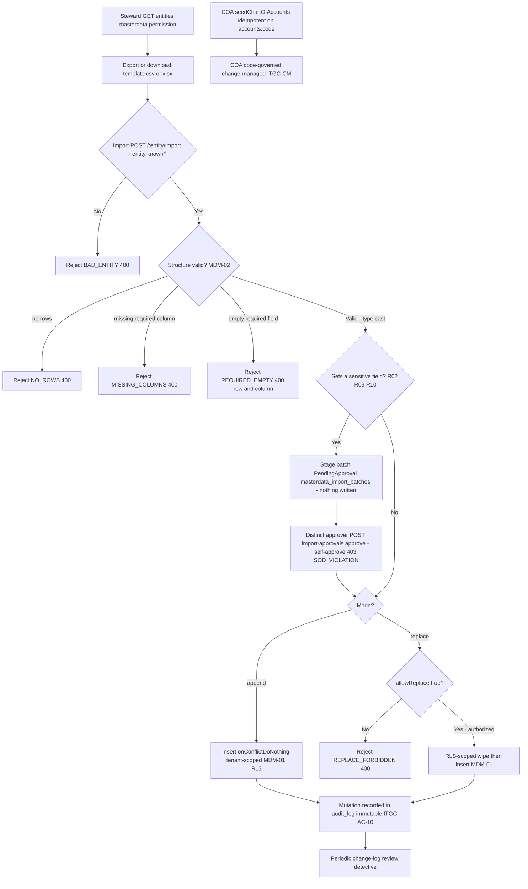

# Master-Data Management & Change Control — Process Narrative

## 1. Document control

| Field | Value |
|---|---|
| Process ID | PN-17-MDM |
| Process owner | `<<Master-Data Steward / Controller>>` |
| Approver | `<<CFO>>` |
| Version | **0.1 DRAFT** |
| Effective date | `<<effective-date>>` |
| Review cadence | Annual + on significant change |
| Related RCM controls | MDM-01, MDM-02, MDM-03, ITGC-AC-10, ITGC-CM; SoD R02, R09, R10, R13 |
| Related policy | `compliance/policies/03-delegation-of-authority.md`, `compliance/policies/07-change-management-policy.md` |

## 2. Purpose

To define and control the maintenance of master data — items, customers, vendors, locations, price lists, promotions, BOM masters, assets — and the code-governed chart of accounts, so that master data is **valid, complete, accurate, and authorized**, that its change is segregated from transacting, and that the integrity of the data on which every downstream financial process depends is preserved. Master-data change control is a foundational ITGC and an anti-fraud control (fictitious vendor / credit-limit abuse).

## 3. Scope

**In scope:** the master-data registry and entity catalogue (`GET /api/admin/master-data/entities`), export and template download (`GET /api/admin/master-data/:entity/export`, `/template`), bulk import in **append** and **replace** modes (`POST /api/admin/master-data/:entity/import`) accepting **csv / xlsx / rows** payloads, the setup-page IO surface for item categories + tax codes (`/api/item-setup/io/*`), required-column / required-field validation, type casting, replace-mode gating per entity, the **financially-sensitive-field import maker-checker** (staged `PendingApproval` batches + a distinct-approver gate: `POST /api/admin/master-data/import-approvals/:reqNo/approve|reject`, `GET …/import-approvals`), the append-only audit log of mutations, and chart-of-accounts (COA) governance via `seedChartOfAccounts`.

**Out of scope:** transacting against master data — vendor invoicing / AP (see `02-procure-to-pay.md`), customer order entry / credit (see `01-order-to-cash.md`), BOM transacting / work orders (see `15-manufacturing-costing.md`), asset depreciation (see `09-fixed-assets-depreciation.md`) — and the broader IT general controls framework (see `08-itgc.md`).

## 4. References

- ISO 9001:2015 cl. 4.4 (process approach), cl. 7.5 (control of documented information), cl. 8.5.1 (control of production data / configuration).
- `compliance/Oshinei_ERP_SOX_RCM_v1.xlsx` — MDM-01..03, ITGC-AC-10, ITGC-CM.
- `compliance/policies/03-delegation-of-authority.md` (master-data authorization), `07-change-management-policy.md` (COA change management).
- Code: `apps/api/src/modules/masterdata/masterdata.service.ts` + `masterdata.controller.ts` + `master-registry.ts`, `apps/api/src/modules/ledger/ledger.service.ts` (`seedChartOfAccounts`), `apps/api/src/database/schema/`.

## 5. Definitions & abbreviations

| Term | Meaning |
|---|---|
| Master-data entity | A registered table type: items, customers, vendors, locations, price_list, promotions, bom_master, menu_items, assets |
| Append mode | Import via `onConflictDoNothing` — inserts new, skips existing by natural key |
| Replace mode | Wipe (RLS-scoped delete) + insert — full table refresh, higher risk |
| `allowReplace` | Per-entity flag gating whether replace mode is permitted |
| Required column / field | Column that must be present (`MISSING_COLUMNS`) and non-empty per row (`REQUIRED_EMPTY`) |
| Type cast | str / num / int / bool / date coercion applied to each cell on import |
| RLS | Row-Level Security — tenant-scoped insert and delete |
| COA | Chart of accounts — code-governed, seeded idempotently on `accounts.code` |
| `audit_log` | Append-only, immutable change log of mutations (ITGC-AC-10) |

## 6. Roles & responsibilities (RACI)

Single-duty roles enforce SoD: **vendor master** maintenance is segregated from creditor / AP processing to mitigate fictitious-vendor fraud (rule **R02**); **customer / credit master** maintenance is segregated from order entry to mitigate credit-limit abuse (rule **R09**); pricing / promotion maintenance is segregated from selling (rule **R10**); and item / config / BOM master maintenance is segregated from transacting (rule **R13**). On top of that segregation, a **bulk import that sets a financially-sensitive field** (credit limits, vendor payment terms, price-list prices, promotion discounts) is now itself **maker-checker** — staged and applied only by a *second* authorized user (see §7 step 3d), so no single person can bulk-change those fraud-relevant fields.

| Activity | MasterDataSteward | EntityDataOwner | Controller | AccessAdmin | InternalAudit |
|---|---|---|---|---|---|
| Maintain registry / entity catalogue | **A/R** | C | A | I | I |
| Append-mode import | **A/R** | C | A | I | I |
| Replace-mode import (wipe + insert) | R | C | **A/R** | I | I |
| Authorize replace-mode change | I | C | **A/R** | I | C |
| Maintain vendor master (R02) | C | **A/R** | A | I | I |
| Maintain customer / credit master (R09) | C | **A/R** | A | I | I |
| Maintain item / config / bom_master (R13) | C | **A/R** | A | I | I |
| COA change (code-governed) | I | I | C | **A/R** (via change mgmt) | C |
| Review master-data change log | C | I | A | I | **A/R** |

## 7. Process narrative

1. **Entity catalogue.** MasterDataSteward reads the registry via `GET /api/admin/master-data/entities` (permission `masterdata`), which lists each registered entity, its required columns, and its `allowReplace` flag. Entities: **items** (`md_item`), **customers** (Code, Credit_Term, Credit_Limit), **vendors** (`md_vendor`; Is_Supplier / Is_Creditor / Payment_Terms; `allowReplace = true`), **locations**, **price_list**, **promotions**, **bom_master**, **menu_items** (POS catalog; SKU / Name / Price required, tenant-scoped, dedup on `(tenant_id, sku)`), **assets**.
2. **Export & template.** `GET /api/admin/master-data/:entity/export` returns the current data as **csv** or **xlsx**; `GET /api/admin/master-data/:entity/template` returns a blank, header-annotated template (required vs optional columns visually distinguished). An unknown entity is rejected `BAD_ENTITY` (`400`).
3. **Import — validation (decision point).** `POST /api/admin/master-data/:entity/import` first validates structure: a missing required column is rejected `MISSING_COLUMNS` (`400`); an empty file is rejected `NO_ROWS` (`400`); and any row with an empty required field is rejected `REQUIRED_EMPTY` (`400`) identifying the offending row and column. Each accepted cell is type-cast (str / num / int / bool / date) (**MDM-02**). *(This strict, fail-fast endpoint is retained for back-compatibility.)*

3a. **Import — validated dry-run + per-row reporting (Platform Phase 7).** Two endpoints let a steward preview before committing: `POST /api/admin/master-data/:entity/import/validate` is a **dry-run** — it validates **every** row and returns the full error set (`{ total, valid, invalid, errors[] }`) **without touching the DB**; `POST /api/admin/master-data/:entity/import/checked` commits. Both accumulate per-row errors instead of failing on the first: `REQUIRED_EMPTY`, `BAD_NUMBER` / `BAD_DATE` (type-cast failures), and `DUP_IN_FILE` (the natural key repeated within the file), each tagged with its row + column (TH/EN). `checked` **refuses to import anything if any row is invalid** unless `skip_errors` is set, in which case it imports the valid rows and reports the rest; in append mode it also reports rows it skipped because the key **already exists** (`EXISTS`). Same permission (`masterdata`), same tenant-scoping (insert stamped with the caller's tenant) and `allowReplace` gating as the strict path; **no GL, no new control** — a data-quality usability layer over the existing import (**MDM-02**).

3b. **Import — file formats (csv / xlsx / rows).** All three import endpoints accept the payload in any of three shapes via the `format` field: `csv` (raw text), `rows` (pre-parsed objects), or **`xlsx`** (a base64-encoded `.xlsx` workbook, first worksheet, row 1 = headers). The workbook is parsed **server-side** (ExcelJS) into the same header-keyed rows the csv path yields, so the **exact template / export file round-trips back in without a Save-As-CSV step**. Blank rows are dropped; empty middle cells keep column alignment; cell values are re-typed by the same coercer (str / num / int / bool / date, `def`, `enumVals`). No schema change, no GL, no new control — an input-format convenience over the existing validate/commit pipeline (**MDM-02**).

3c. **Setup-page import/export surface (item-setup IO).** The two item-posting master lists — **item_categories** and **tax_codes** — are also exposed for bulk Excel/CSV import-export directly on their own setup screens via `GET/POST /api/item-setup/io/entities | :entity/export | :entity/template | :entity/import/validate | :entity/import/checked`. These reuse the same registry-driven engine but are **gated to the setup duties** (`md_item` / `md_config` / `masterdata` / `exec`, matching the pages' one-by-one CRUD) rather than the coarse `masterdata` duty, and are **restricted by an allow-list to those two entities** — a narrow master-data role can bulk-load/download its own lists without gaining the global master-data-admin duty, and cannot reach sensitive entities (customers / vendors / assets) through this path (a disallowed entity is rejected `BAD_ENTITY`, `400`). Same tenant-scoping, validation and `allowReplace` gating as the admin path; **no new control** — SoD **R13** is preserved by keeping the narrower gate and the entity allow-list.
3d. **Import — financially-sensitive fields are maker-checker (staged approval).** Certain registry columns are flagged **`sensitive: true`** because a bulk change to them is fraud-relevant: customer **Credit_Limit** (**R09**), vendor **Payment_Terms** + **Credit_Limit** (**R02** / **R09**), price_list **Base_Price** / **Special_Price** / **Discount_Pct** and promotion **Discount_Pct** / **Discount_Amt** (**R10**). When an import **batch SETS any sensitive field** — a non-empty value in any row — on either `…/import` or `…/import/checked` (and equally on the item-setup IO surface, §3c), the **whole batch is STAGED** as a `PendingApproval` row in the new **`masterdata_import_batches`** table (raw rows held as JSON; migration **`0263`**) and **nothing is written to the entity table**. The endpoint returns `{ status: 'PendingApproval', pending: true, req_no, sensitive_fields: […], row_count }` rather than an `imported` count. A **different** user then approves via `POST /api/admin/master-data/import-approvals/:reqNo/approve` (permission `exec` / `approvals`): **self-approval** (approver === requester) is rejected **`403 SOD_VIOLATION`**, and **only on approval** are the rows committed — re-applied in the *requester's* tenant context so they land in the right tenant. `POST …/import-approvals/:reqNo/reject` discards the batch, and the queue `GET /api/admin/master-data/import-approvals?status=PendingApproval` lists what is awaiting a checker. **Non-sensitive imports (items, contacts, tax codes, menu base prices) still commit directly — no change.** This is the two-person ("maker-checker") rule applied to sensitive master-data loads; it **strengthens the existing SoD controls R02 / R09 / R10 / R13** (and MDM-01/MDM-03) and introduces **no new numbered control**. *Vendor-bank note (G8):* vendor **Payment_Terms** and **Credit_Limit** are covered by this gate; the vendor **bank account** (`vendors.bank_account`, encrypted) is **not** editable via the import or any other live endpoint, so there is no single-user path to gate today — a future bank-account editor must reuse this staging. Verified by the `ext` harness (a non-sensitive vendor import commits directly; an import that sets Credit_Limit / Payment_Terms is staged and not written; the requester self-approving → `SOD_VIOLATION`; a distinct approver applies it → the vendor + its credit limit `500000` and terms `NET90` are written; the approvals queue clears).

4. **Import — append mode.** With `mode = append`, rows are inserted with `onConflictDoNothing` (new rows added, existing natural keys skipped). Inserts are **tenant-scoped** (RLS): each row is stamped with the caller's tenant (**MDM-01**, **R13**). *(If the batch sets a sensitive field it is first staged for a second approver — §7 step 3d.)*
5. **Import — replace mode (higher-risk, decision point).** With `mode = replace`, the table is wiped and re-inserted. Replace is **gated by the per-entity `allowReplace` flag** — an attempt on a non-replaceable entity is rejected `REPLACE_FORBIDDEN` (`400`). The delete is **RLS-scoped** so a tenant can only wipe its own rows. Because a replace performs a full-table wipe, it requires explicit authorization (Controller) before execution (**MDM-01**).
6. **Segregation of master from transacting.** Vendor-master (`md_vendor`) maintenance is segregated from creditor / AP processing — mitigating fictitious-vendor fraud (**R02**). Customer / credit-master (Code, Credit_Term, Credit_Limit) maintenance is segregated from order entry — mitigating credit-limit abuse (**R09**). Item / config / `bom_master` maintenance is segregated from transacting (**R13**) (**MDM-03**).
7. **Chart-of-accounts governance (key control).** The COA is **code-governed**: `seedChartOfAccounts` inserts the defined accounts idempotently (`onConflictDoNothing` on `accounts.code`). New accounts are added **in code / seed only**, not user-editable at runtime; COA change therefore flows through change management (**ITGC-CM**), giving a controlled, reviewed, version-controlled account structure (cross-ref `08-itgc.md`).
8. **Change-log review (detective).** All master-data mutations are recorded to `audit_log`, which is **append-only and immutable** (enforced by a database trigger) per **ITGC-AC-10**. InternalAudit performs a periodic master-data change-log review — a detective control — with particular attention to replace-mode imports and vendor / credit-limit changes.
9. **Custom fields (UDFs).** A tenant can extend any entity (customer, item, sales_order, vendor, journal, …) with user-defined fields **without code** via `/api/custom-fields` (permission `masterdata`/`users`/`exec` to define; broader read/write for values). A definition carries a `data_type` (text / number / date / boolean / select) and optional `required` + select `options`. Values are **validated and type-cast server-side** against the active definition — an unknown key (`UNKNOWN_FIELD`), a missing required field (`REQUIRED_FIELD`), an out-of-list select (`BAD_OPTION`), or a bad number/date (`BAD_NUMBER`/`BAD_DATE`) are all rejected — and stored typed, keyed by `(entity, field_key, record_id)`. Definitions and values are **tenant-scoped** (RLS) and every change rides the immutable `audit_log` (**ITGC-AC-10**). Custom fields are descriptive metadata: they post **no GL** and never relax an existing validation/control.
10. **Alert/notification rules (Phase 3).** A tenant defines no-code **alert rules** over a catalog of built-in **metrics** (`low_stock_count`, `approvals_overdue`, `open_pr_count`, …) via `/api/alerts` (perm `masterdata`/`exec`/`users`/`dashboard`). A rule pairs a metric with an **operator + threshold**, a **channel** (in-app notification → `target_role`, or LINE/SMS/email → `target_to`), a **severity** and a **cooldown**. A cron-callable sweep (`POST /api/alerts/run`) evaluates each active rule against **live, RLS-scoped** tenant data; on breach (and once the cooldown has elapsed) it fires the notification/message and writes an `alert_events` row (audit + dashboard feed). Validation rejects an unknown metric (`BAD_METRIC`), operator (`BAD_OPERATOR`), channel (`BAD_CHANNEL`) or a missing recipient (`NO_TARGET`). Rules + events are **tenant-isolated** (RLS). Operational alerting only — **no GL, no control**.
11. **Item relationships + lifecycle status (master-data depth).** The item master gains two enterprise-grade dimensions, both maintained on the item-posting setup screen (`/setup/items`) under the same setup duties (`md_item` / `md_config` / `masterdata` / `exec`) that gate the posting-profile edit. **(a) Lifecycle status** — every item carries a `status` of **active / inactive / discontinued** (`PATCH /api/item-setup/items/:itemId/status`); a discontinued item may name a **successor** (`superseded_by`, resolved to the replacement item) so downstream screens can steer buyers to the current SKU. **(b) Typed relationships** — a shop links one item to another with a `rel_type` of **substitute / complement / supersedes / kit_component / accessory** (`POST/GET/DELETE /api/item-setup/items/:itemId/relationships`), stored in the new **`item_relationships`** table. Because `items` is a **shared** master (no `tenant_id`) but substitutes/cross-sell are a **per-shop merchandising choice**, the relationship rows are **tenant-scoped** (`item_relationships.tenant_id`, RLS org-clause per migration `0232`) and deleting either side removes the edge for that tenant only; a self-relation is rejected `SELF_RELATION` and a duplicate `(from, to, rel_type)` is rejected `RELATION_EXISTS`. Both status and relationship changes ride the field-level **`data_change_log`** trigger (ITGC-AC-14) and the immutable `audit_log`. Descriptive master-data depth — **no GL, no new control** (tenant-scoped, RLS + change-audited, mirroring the customer/vendor party-relationship model). Migration **`0276`**; verified by the `basics` harness.
12. **Item match-merge / DQM (duplicate resolution).** The item catalogue gains Oracle-grade duplicate
    detection and merge. A read-only **review queue** `GET /api/item-setup/items-duplicates` (setup duties)
    surfaces probable duplicate items grouped by **exact barcode** and **fuzzy description similarity**
    (app-side trigram — `pg_trgm` isn't enabled here). Merging `POST /api/item-setup/items-merge`
    `{survivor_item_id, duplicate_item_id}` repoints the duplicate's child rows onto the survivor **by the
    TEXT `item_id` natural key** (the new `md_merge_repoint_text` catalogue-driven function, migration
    **`0277`** — the text sibling of `0273`'s `md_merge_repoint`, covering the ~17 child tables that reference
    items by `item_id`), fills any blank survivor field from the duplicate (survivorship), drops the
    duplicate's advisory relationships, and **soft-retires** the duplicate (`status='merged'` +
    `merged_into`/`merged_by`/`merged_at` — the historical row is preserved, never destroyed). Because a merge
    rewrites transactions across **every tenant** (`items` is a shared master), it is **gated to the platform
    owner (god)** — a per-tenant Admin is rejected `403 ITEM_MERGE_HQ_ONLY`; self-merge → `SELF_MERGE`,
    re-merging an already-merged item → `ALREADY_MERGED`, and a natural-key collision rolls the whole merge
    back → `409 MERGE_CONFLICT` for manual resolution. On the web, `/setup/items` shows the review queue to
    setup users but renders the merge action **only for a god** (`is_platform_owner`). Descriptive data-quality
    tooling — **no GL, no new numbered control** (mirrors the Phase-5 customer/vendor match-merge). Verified by
    the `basics` harness.
13. **Date-effective (future-dated) master attributes.** A steward **schedules** a change to a supported master
    field to take effect on a future **business date** via `POST /api/scheduled-changes`
    `{entity, entity_key, field, new_value, effective_date}` (steward/exec duties). The change is parked in the
    new tenant-scoped **`scheduled_master_changes`** table (migration **`0278`**, RLS + change-audited) and
    applied **only when its effective date arrives** by the idempotent daily job
    **`apply_scheduled_master_changes`** (a BI-scheduler action, `POST /api/scheduled-changes/run-due` for a
    manual run) — re-running the same day applies nothing. Supported targets today: item `unit_price` / item
    `status` and customer `credit_limit` (`UNSUPPORTED_FIELD` otherwise; the registry is generic and
    extensible). A change to a **fraud-relevant** field — **customer `credit_limit`** — is `sensitive` and is
    **staged `pending_approval`**: it becomes eligible to apply only after a **distinct approver** releases it
    (`POST /api/scheduled-changes/:id/approve`; self-approval → `403 SOD_VIOLATION`), so a future-dated
    credit-limit bump **cannot bypass the maker-checker** (audit **G7** / SoD **R09**). Non-sensitive changes go
    straight to `scheduled`; either can be `…/cancel`led before it applies. On the web, `/setup/items` carries a
    per-item schedule/list/cancel section. Descriptive master-data depth — **no GL, no new numbered control**
    (the sensitive path **strengthens** the existing G7/R09 credit-limit maker-checker). Verified by the
    `basics` harness.
14. **Global item-master garbage collection (unused-item purge).** Because `items` is a **shared** master with
    **no `tenant_id`**, the tenant **factory-reset / purge** (which clear only `tenant_id`-scoped tables) never
    touch it — a wiped company's catalogue rows **survive** its reset and keep appearing in **every** tenant's
    `/shop` (the shop catalogue reads `items` unfiltered). Two **platform-owner-only** maintenance operations
    let the god garbage-collect exactly the items **no tenant references any more**: a read-only preview
    `GET /api/admin/item-maintenance/unused-items` (count + a bounded sample of item codes + the number of
    reference columns scanned) and the destructive `POST /api/admin/item-maintenance/purge-unused-items`
    (typed confirm `PURGE-UNUSED-ITEMS` → `CONFIRM_MISMATCH` otherwise). "Unreferenced" is computed **across
    every tenant** by discovering — catalogue-driven, the same convention as `md_merge_repoint_text` (§7 step
    12) so a new child table is covered automatically — every table column that points at the master (TEXT
    item-code columns `item_id`/`product_item_id`/`item_no`/`free_item_id`/`ingredient_item_id`/`item_code`,
    plus the `item_relationships` FKs and the `superseded_by`/`merged_into` successor pointers); an item with
    no surviving reference is deleted along with its `item_images` row. A **soft-retired (`status='merged'`)**
    row is preserved so the DQM merge trail (§7 step 12) is never destroyed. Both routes are `@PlatformAdmin`,
    which keeps the **full cross-tenant RLS bypass even when the god is act-as-scoped to one company** — so the
    scan can never mistake another company's in-use item for an orphan (a non-owner is rejected
    `403 ITEM_PURGE_HQ_ONLY` / `PLATFORM_ADMIN_REQUIRED`). Idempotent (a second run collects nothing) and
    audit-logged (`items_unused_purged`). Descriptive maintenance tooling on the shared master — **no GL, no
    new numbered control** (god-gated + typed-confirm + dry-run preview, mirroring the §7 step 12 merge and the
    tenant factory-reset/purge gates in PN-08 ITGC / `docs/ops/tenancy-model.md`). On the web the platform
    owner runs both from **`/platform` → ดูแลระบบ (Maintenance)** — a **ตรวจสอบ** (dry-run preview) button then
    a **ลบ** button behind a confirm dialog. The preview also returns a **`kept_by`** diagnostic — for the
    items that are KEPT (still referenced, so *not* collected), the company (tenant) whose data references them
    and how many items each keeps alive — so a god can tell a **reset-leftover** (the just-reset company still
    appears ⇒ its data wasn't fully wiped; factory-reset it completely, then purge again) from a product
    **genuinely in use by another company** (which the shared catalogue can't remove). Verified by the
    `onboarding` harness.

## 8. Process flow

**Swimlane description by role:** **MasterDataSteward** reads the registry, exports / templates, and runs append-mode imports. The **system** enforces the `BAD_ENTITY` guard, structural validation (`NO_ROWS`, `MISSING_COLUMNS`, `REQUIRED_EMPTY`), type casting, the `allowReplace` gate (`REPLACE_FORBIDDEN`), tenant-scoped insert and RLS-scoped delete, and the immutable `audit_log` trigger. **Controller** authorizes higher-risk replace-mode (full-wipe) imports. A **distinct approver** (Controller / EntityDataOwner ≠ the importer) releases any import that sets a financially-sensitive field from its staged `PendingApproval` state (self-approval → `SOD_VIOLATION`). **EntityDataOwner** maintains the vendor, customer/credit, pricing/promotion, and item/BOM masters under segregation (R02 / R09 / R10 / R13). **AccessAdmin** governs COA changes through change management (code-governed, not runtime-editable). **InternalAudit** performs the periodic master-data change-log review.

## 9. Control matrix

| Step | Risk | Control | Type | RCM ID | Evidence / Record |
|---|---|---|---|---|---|
| 5 | Unauthorized destructive (replace) import | Replace authorization + per-entity `allowReplace` gating (`REPLACE_FORBIDDEN`) | Prev / Manual + Auto | MDM-01 | Replace authorization; `REPLACE_FORBIDDEN` rejections |
| 4,5 | Cross-tenant data leakage / wipe | Tenant-scoped insert; RLS-scoped delete | Prev / Auto | MDM-01 | RLS policy; import logs |
| 3 | Incomplete / invalid master data loaded | Required-column & required-field validation (`MISSING_COLUMNS`, `REQUIRED_EMPTY`) + type casting | Prev / Auto | MDM-02 | Validation rejections (row + column) |
| 6 | Fictitious vendor created by AP processor | SoD: vendor master (`md_vendor`) vs creditor / AP | Prev / Manual | MDM-03, R02 | SoD conflict report |
| 6 | Credit-limit abuse by order taker | SoD: customer / credit master vs order entry | Prev / Manual | MDM-03, R09 | SoD conflict report |
| 6 | Self-serving item / BOM / config change | SoD: master / config vs transacting | Prev / Manual | MDM-03, R13 | SoD conflict report |
| 3d | One user bulk-changing a fraud-relevant field (customer/vendor credit limit, vendor payment terms, price-list price, promotion discount) | Sensitive-field import maker-checker: any batch that sets a `sensitive` field is staged `PendingApproval` (`masterdata_import_batches`, mig `0263`) and applied **only by a distinct approver** (`exec`/`approvals`); self-approval → `SOD_VIOLATION` | Prev / Manual + Auto | MDM-01, MDM-03; R02, R09, R10 | Staged batch (`req_no`, `sensitive_fields`) + approval/rejection record; `ext` harness |
| 8 | Unauthorized / undetected master change | Master-data change-log review (immutable `audit_log`) | Det / Manual | ITGC-AC-10 | Change-log review evidence |
| 7 | Uncontrolled account-structure change | COA code-governance; idempotent seed; change management | Prev / Auto + Manual | ITGC-CM | COA seed; change-management record |

## 10. Inputs & outputs

**Inputs:** entity registry definitions, import files (csv / xlsx rows), import parameters (entity, mode append/replace), replace authorization, COA seed definition (code).
**Outputs:** updated master-data tables (tenant-scoped), export files / templates, validation rejections, append-only `audit_log` entries, idempotently seeded chart of accounts.

## 11. Records & retention

| Record | Store | Retention |
|---|---|---|
| Master-data tables (items, customers, vendors, …) | Application DB (RLS-scoped) | `<<7 years / per Thai law>>` |
| Master-data mutation change log | `audit_log` (append-only, immutable) | `<<7 years>>` |
| Import files & validation results | Import job records | `<<7 years>>` |
| Replace-mode authorizations | Approval record / `audit_log` | `<<7 years>>` |
| COA definition & change-management records | Source control / change log | `<<7 years>>` |

## 12. KPIs / metrics

- Replace-mode imports executed and % with documented authorization (target: 100%).
- Imports rejected for validation (`MISSING_COLUMNS`, `REQUIRED_EMPTY`, `NO_ROWS`) — data-quality signal.
- `REPLACE_FORBIDDEN` attempts (unauthorized destructive-import signal).
- SoD conflicts open on R02 / R09 / R13 (target: 0).
- Master-data change-log reviews completed on schedule (coverage %).
- COA changes made outside change management (target: 0).

## 13. Exception & error handling

| Error code | Trigger | Handling |
|---|---|---|
| `BAD_ENTITY` (400) | Unknown entity key in path | Verify entity against `/entities` registry |
| `REPLACE_FORBIDDEN` (400) | Replace mode on a non-replaceable entity | Use append, or obtain authorization for an `allowReplace` entity |
| `NO_ROWS` (400) | Import file contains no data rows | Provide a populated file |
| `MISSING_COLUMNS` (400) | Required column absent from file | Use the template; add the column; resubmit |
| `REQUIRED_EMPTY` (400) | Required field empty in a row | Correct the identified row + column; resubmit |
| `BAD_NUMBER` / `BAD_DATE` (dry-run/checked) | A numeric/date cell can't be parsed | Fix the cell; re-validate (reported per row, not fatal) |
| `BAD_ENUM` (dry-run/checked) | An enum cell (e.g. menu_items `Type` / `Tax_Type`) is outside the allowed set | Use one of the listed values (case-insensitive); a blank cell falls back to the column default |
| `DUP_IN_FILE` (dry-run/checked) | Natural key repeated within the import file | Remove the duplicate row; re-validate |
| `EXISTS` (checked, append) | Row's natural key already in the table — skipped | Informational; use the existing record or replace mode |
| `SOD_VIOLATION` / SoD conflict | Master maintenance conflicts with transacting (R02 / R09 / R10 / R13) | AccessAdmin remediates (see `08-itgc.md`) |
| `SOD_VIOLATION` (403) | Requester approves their **own** staged sensitive-field import (approver === requester) | A **different** `exec`/`approvals` user must approve the batch (maker ≠ checker) |
| `PendingApproval` (not an error) | An import set a financially-sensitive field, so the batch is staged (`req_no`, `sensitive_fields`) and nothing is written | A distinct approver runs `POST …/import-approvals/:reqNo/approve` (or `…/reject`); see §7 step 3d |
| `SELF_RELATION` (400) | An item relationship targets the same item | Choose a different target item (§7 step 11) |
| `RELATION_EXISTS` (409) | A `(from, to, rel_type)` item relationship already exists for the tenant | Informational — the edge is already present |
| `RELATION_NOT_FOUND` (404) | Delete of an item relationship id not owned by the tenant | Refresh the relationship list; the edge was already removed |
| `ITEM_MERGE_HQ_ONLY` (403) | A non-platform-owner attempted an item merge | Items are a shared cross-tenant master — only the platform owner may merge them (§7 step 12) |
| `SELF_MERGE` (400) | Survivor and duplicate item are the same | Pick two distinct items |
| `ALREADY_MERGED` (400) | The duplicate item was already merged into a survivor | Refresh the review queue; the item is already retired |
| `MERGE_CONFLICT` (409) | Survivor and duplicate both own a child row with the same natural key | Resolve the conflicting child rows manually, then retry the merge |
| `ITEM_PURGE_HQ_ONLY` (403) | A non-platform-owner called the unused-item preview/purge | The shared item master is cross-tenant — only the platform owner may garbage-collect unused items (§7 step 14) |
| `CONFIRM_MISMATCH` (400) | The unused-item purge was called without the exact confirm phrase | Type `PURGE-UNUSED-ITEMS` to confirm the destructive purge (§7 step 14) |
| `UNSUPPORTED_FIELD` (400) | A scheduled change names an entity:field the registry doesn't support | Use a supported target (item `unit_price`/`status`, customer `credit_limit`) — §7 step 13 |
| `BAD_DATE` (400) | `effective_date` isn't `YYYY-MM-DD` | Supply a valid ISO date |
| `SOD_VIOLATION` (403) | The scheduler tried to self-approve a sensitive (credit-limit) scheduled change | A distinct `exec`/`approvals` user must release it (maker ≠ checker; §7 step 13) |
| `NOT_PENDING` (404) | Approve of a scheduled change not in `pending_approval` | Refresh the queue; it was already released, applied, or cancelled |

## 14. Revision history

| Version | Date | Author | Summary |
|---|---|---|---|
| 0.1 DRAFT | 2026-06-22 | `<<author>>` | Initial draft. |
| 0.2 | 2026-06-23 | Platform | **Custom fields (UDFs):** §7 step 9 — tenant-defined fields on any entity via `/api/custom-fields` (typed + server-validated values, tenant-scoped, audit-logged); migration `0078_custom_fields`. Descriptive metadata — no GL, no new control. |
| 0.3 | 2026-06-24 | Platform | **Alert/notification rules (Platform Phase 3):** §7 step 10 — no-code rules over a built-in metric catalog (`/api/alerts`); cron-callable sweep fires in-app/LINE/SMS/email notifications on threshold breach with cooldown + an `alert_events` log; tenant-isolated. Migration `0080_alert_rules`. Operational alerting — no GL, no control. |
| 0.4 | 2026-06-24 | Platform | **Validated bulk import (Platform Phase 7):** §7 step 3a — dry-run `…/import/validate` + `…/import/checked` accumulate per-row errors (`BAD_NUMBER`/`BAD_DATE`/`DUP_IN_FILE`) instead of failing fast, with a `skip_errors` partial-commit and `EXISTS` reporting; §13 error codes updated. Web master-data screen gains a validate→preview→commit flow. No schema change, no GL, no new control — a data-quality usability layer over the existing import; verified by the `ext` harness. |
| 0.5 | 2026-07-03 | Platform | **menu_items importable (new-company setup):** registered the POS catalog as a bulk-import entity (SKU / Name / Price required, tenant-scoped, dedup on `(tenant_id, sku)`), so a new company can load its whole menu from Excel/CSV via the existing importer rather than keying items one by one. Registry gains generic `def` (blank cell → column default, so a NOT-NULL column with a DB default isn't handed an explicit null) and `enumVals` (case-insensitive enum match → new `BAD_ENUM` per-row error) support; §7 catalogue, §3 glossary and §13 error codes updated. No schema change, no GL, no new control — a master-data usability extension; verified by the `ext` harness. |
| 0.7 | 2026-07-05 | Platform | **Sensitive-field bulk-import maker-checker (audit gaps G5 + G8):** §7 step 3d — registry columns for customer/vendor **credit limits**, vendor **payment terms**, price-list **prices** and promotion **discounts** are flagged `sensitive`; any import batch that SETS one is **staged** as a `PendingApproval` row in the new **`masterdata_import_batches`** table (migration `0263`, raw rows held as JSON) with **nothing written**, and is committed **only by a distinct approver** via `POST /api/admin/master-data/import-approvals/:reqNo/approve` (`exec`/`approvals`) — self-approval → `403 SOD_VIOLATION`; `…/reject` + the `…/import-approvals` queue round it out. Non-sensitive imports still commit directly. §1 related controls (+R10), §2 scope, §6 RACI intro, §8 flow, §9 control matrix and §13 error codes updated. **Strengthens existing SoD R02/R09/R10/R13 (+MDM-01/MDM-03) — no new numbered control.** Vendor bank account (`vendors.bank_account`, encrypted) has no live single-user edit path today (G8 note). Verified by the `ext` harness. |
| 0.8 | 2026-07-07 | Platform | **Item relationships + lifecycle status (master-data depth):** §7 step 11 — the item master gains a lifecycle `status` (active/inactive/discontinued with an optional `superseded_by` successor; `PATCH /api/item-setup/items/:itemId/status`) and typed **`item_relationships`** (substitute/complement/supersedes/kit_component/accessory; `POST/GET/DELETE …/items/:itemId/relationships`). Relationship rows are **tenant-scoped** (per-shop merchandising choice over the shared `items` master; RLS org-clause per `0232`) with `SELF_RELATION` / `RELATION_EXISTS` / `RELATION_NOT_FOUND` guards; both status and relationship edits ride the `data_change_log` trigger (ITGC-AC-14) + immutable `audit_log`. §13 error codes updated. Migration **`0276`**. Descriptive master-data depth — **no GL, no new control** (mirrors the customer/vendor party-relationship model); verified by the `basics` harness. |
| 0.9 | 2026-07-07 | Platform | **Item match-merge / DQM (duplicate resolution):** §7 step 12 — detection `GET /api/item-setup/items-duplicates` (barcode + fuzzy description) + merge `POST /api/item-setup/items-merge` repoints the duplicate's child rows by the TEXT `item_id` key (new `md_merge_repoint_text`, migration **`0277`**, covering ~17 item-child tables), survivorship-fills, and soft-retires the duplicate (`status='merged'` + `merged_into`/`merged_by`/`merged_at`). Merge is **god-only** (`ITEM_MERGE_HQ_ONLY`) because `items` is a shared cross-tenant master; `SELF_MERGE`/`ALREADY_MERGED`/`MERGE_CONFLICT` guards. Web `/setup/items` shows the review queue to setup users, merge action to a god only. §13 error codes updated. Descriptive data-quality tooling — **no GL, no new numbered control** (mirrors the Phase-5 customer/vendor match-merge); verified by the `basics` harness. |
| 0.10 | 2026-07-07 | Platform | **Date-effective (future-dated) master attributes:** §7 step 13 — `POST /api/scheduled-changes` parks a change (item `unit_price`/`status`, customer `credit_limit`) in the new tenant-scoped **`scheduled_master_changes`** table (migration **`0278`**, RLS + change-audited); the idempotent daily job **`apply_scheduled_master_changes`** (BI-scheduler action; `…/run-due` manual) applies it only once the effective business date arrives. A sensitive **customer credit-limit** change is staged `pending_approval` and released only by a **distinct approver** (`…/:id/approve`; self-approval → `SOD_VIOLATION`) — a future-dated bump can't bypass the maker-checker (**strengthens G7 / R09**). `UNSUPPORTED_FIELD`/`BAD_DATE`/`NOT_PENDING` guards; `…/:id/cancel` withdraws an open schedule. Web `/setup/items` per-item schedule/list/cancel section. §13 error codes updated. **No GL, no new numbered control.** This closes the date-effective attribute gap flagged in traceability v5.4. Verified by the `basics` harness. |
| 0.6 | 2026-07-04 | Platform | **Direct .xlsx import + setup-page IO surface:** §7 step 3b — all import endpoints now accept a base64-encoded **`.xlsx`** workbook (parsed server-side via ExcelJS into the same header-keyed rows as csv), so a downloaded template/export round-trips back in without a Save-As-CSV step. §7 step 3c — **item_categories** and **tax_codes** gain a bulk import/export surface on their own setup screens (`/api/item-setup/io/*`), gated to the setup duties (`md_item`/`md_config`/`masterdata`/`exec`) and restricted by an allow-list to those two entities, so a narrow master-data role gets the bulk surface without the coarse `masterdata` duty (SoD **R13** preserved). §2 in-scope updated. No schema change, no GL, no new control; verified by the `ext` harness (xlsx round-trip, setup IO, and the md_config-only SoD boundary). |
| 0.11 | 2026-07-14 | Platform | **Global item-master garbage collection (unused-item purge):** §7 step 14 — because `items` is a shared master with no `tenant_id`, the tenant factory-reset/purge never clears it, so a wiped company's catalogue rows survive and keep showing in every tenant's `/shop`. Two **platform-owner-only** ops garbage-collect the items no tenant references any more: preview `GET /api/admin/item-maintenance/unused-items` and destructive `POST /api/admin/item-maintenance/purge-unused-items` (typed confirm `PURGE-UNUSED-ITEMS`). "Unreferenced" is computed **across every tenant** via catalogue-driven discovery of all item-code / `item_relationships` / successor-pointer references (same convention as `md_merge_repoint_text`); an orphan is deleted with its `item_images` row, while a `status='merged'` row is preserved. Both routes are `@PlatformAdmin` (full cross-tenant RLS bypass even when act-as-scoped, so another company's in-use item is never mistaken for an orphan); non-owner → `ITEM_PURGE_HQ_ONLY`. Idempotent + audit-logged (`items_unused_purged`). §13 error codes updated (`ITEM_PURGE_HQ_ONLY`, `CONFIRM_MISMATCH`). **No GL, no new numbered control** (god-gated + typed-confirm + dry-run, mirroring §7 step 12 merge and the PN-08 tenant reset/purge gates). Verified by the `onboarding` harness. |
