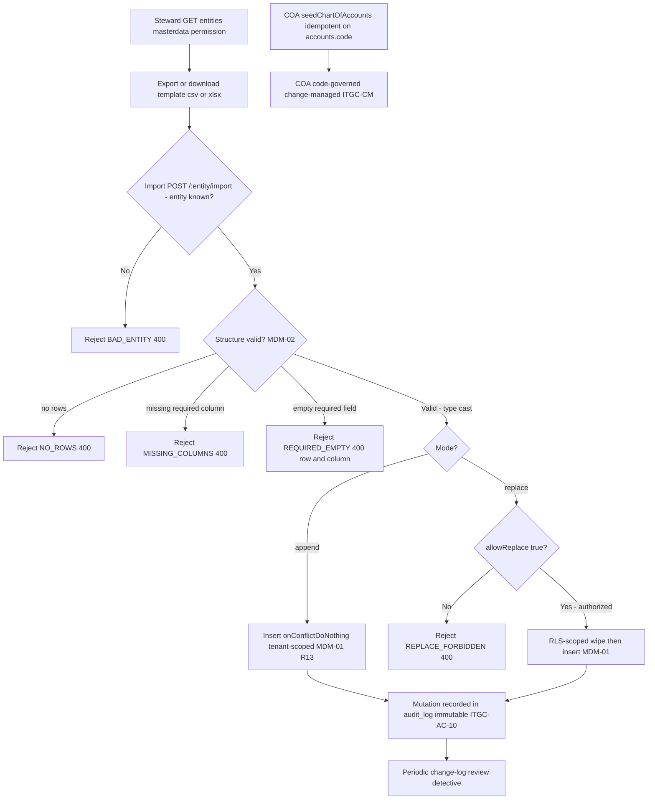

# Master-Data Management & Change Control — Process Narrative

## 1. Document control

| Field | Value |
|---|---|
| Process ID | PN-17-MDM |
| Process owner | `<<Master-Data Steward / Controller>>` |
| Approver | `<<CFO>>` |
| Version | **0.1 DRAFT** |
| Effective date | `<<effective-date>>` |
| Review cadence | Annual + on significant change |
| Related RCM controls | MDM-01, MDM-02, MDM-03, ITGC-AC-10, ITGC-CM; SoD R02, R09, R13 |
| Related policy | `compliance/policies/03-delegation-of-authority.md`, `compliance/policies/07-change-management-policy.md` |

## 2. Purpose

To define and control the maintenance of master data — items, customers, vendors, locations, price lists, promotions, BOM masters, assets — and the code-governed chart of accounts, so that master data is **valid, complete, accurate, and authorized**, that its change is segregated from transacting, and that the integrity of the data on which every downstream financial process depends is preserved. Master-data change control is a foundational ITGC and an anti-fraud control (fictitious vendor / credit-limit abuse).

## 3. Scope

**In scope:** the master-data registry and entity catalogue (`GET /api/admin/master-data/entities`), export and template download (`GET /api/admin/master-data/:entity/export`, `/template`), bulk import in **append** and **replace** modes (`POST /api/admin/master-data/:entity/import`), required-column / required-field validation, type casting, replace-mode gating per entity, the append-only audit log of mutations, and chart-of-accounts (COA) governance via `seedChartOfAccounts`.

**Out of scope:** transacting against master data — vendor invoicing / AP (see `02-procure-to-pay.md`), customer order entry / credit (see `01-order-to-cash.md`), BOM transacting / work orders (see `15-manufacturing-costing.md`), asset depreciation (see `09-fixed-assets-depreciation.md`) — and the broader IT general controls framework (see `08-itgc.md`).

## 4. References

- ISO 9001:2015 cl. 4.4 (process approach), cl. 7.5 (control of documented information), cl. 8.5.1 (control of production data / configuration).
- `compliance/Oshinei_ERP_SOX_RCM_v1.xlsx` — MDM-01..03, ITGC-AC-10, ITGC-CM.
- `compliance/policies/03-delegation-of-authority.md` (master-data authorization), `07-change-management-policy.md` (COA change management).
- Code: `apps/api/src/modules/masterdata/masterdata.service.ts` + `masterdata.controller.ts` + `master-registry.ts`, `apps/api/src/modules/ledger/ledger.service.ts` (`seedChartOfAccounts`), `apps/api/src/database/schema/`.

## 5. Definitions & abbreviations

| Term | Meaning |
|---|---|
| Master-data entity | A registered table type: items, customers, vendors, locations, price_list, promotions, bom_master, assets |
| Append mode | Import via `onConflictDoNothing` — inserts new, skips existing by natural key |
| Replace mode | Wipe (RLS-scoped delete) + insert — full table refresh, higher risk |
| `allowReplace` | Per-entity flag gating whether replace mode is permitted |
| Required column / field | Column that must be present (`MISSING_COLUMNS`) and non-empty per row (`REQUIRED_EMPTY`) |
| Type cast | str / num / int / bool / date coercion applied to each cell on import |
| RLS | Row-Level Security — tenant-scoped insert and delete |
| COA | Chart of accounts — code-governed, seeded idempotently on `accounts.code` |
| `audit_log` | Append-only, immutable change log of mutations (ITGC-AC-10) |

## 6. Roles & responsibilities (RACI)

Single-duty roles enforce SoD: **vendor master** maintenance is segregated from creditor / AP processing to mitigate fictitious-vendor fraud (rule **R02**); **customer / credit master** maintenance is segregated from order entry to mitigate credit-limit abuse (rule **R09**); and item / config / BOM master maintenance is segregated from transacting (rule **R13**).

| Activity | MasterDataSteward | EntityDataOwner | Controller | AccessAdmin | InternalAudit |
|---|---|---|---|---|---|
| Maintain registry / entity catalogue | **A/R** | C | A | I | I |
| Append-mode import | **A/R** | C | A | I | I |
| Replace-mode import (wipe + insert) | R | C | **A/R** | I | I |
| Authorize replace-mode change | I | C | **A/R** | I | C |
| Maintain vendor master (R02) | C | **A/R** | A | I | I |
| Maintain customer / credit master (R09) | C | **A/R** | A | I | I |
| Maintain item / config / bom_master (R13) | C | **A/R** | A | I | I |
| COA change (code-governed) | I | I | C | **A/R** (via change mgmt) | C |
| Review master-data change log | C | I | A | I | **A/R** |

## 7. Process narrative

1. **Entity catalogue.** MasterDataSteward reads the registry via `GET /api/admin/master-data/entities` (permission `masterdata`), which lists each registered entity, its required columns, and its `allowReplace` flag. Entities: **items** (`md_item`), **customers** (Code, Credit_Term, Credit_Limit), **vendors** (`md_vendor`; Is_Supplier / Is_Creditor / Payment_Terms; `allowReplace = true`), **locations**, **price_list**, **promotions**, **bom_master**, **assets**.
2. **Export & template.** `GET /api/admin/master-data/:entity/export` returns the current data as **csv** or **xlsx**; `GET /api/admin/master-data/:entity/template` returns a blank, header-annotated template (required vs optional columns visually distinguished). An unknown entity is rejected `BAD_ENTITY` (`400`).
3. **Import — validation (decision point).** `POST /api/admin/master-data/:entity/import` first validates structure: a missing required column is rejected `MISSING_COLUMNS` (`400`); an empty file is rejected `NO_ROWS` (`400`); and any row with an empty required field is rejected `REQUIRED_EMPTY` (`400`) identifying the offending row and column. Each accepted cell is type-cast (str / num / int / bool / date) (**MDM-02**).
4. **Import — append mode.** With `mode = append`, rows are inserted with `onConflictDoNothing` (new rows added, existing natural keys skipped). Inserts are **tenant-scoped** (RLS): each row is stamped with the caller's tenant (**MDM-01**, **R13**).
5. **Import — replace mode (higher-risk, decision point).** With `mode = replace`, the table is wiped and re-inserted. Replace is **gated by the per-entity `allowReplace` flag** — an attempt on a non-replaceable entity is rejected `REPLACE_FORBIDDEN` (`400`). The delete is **RLS-scoped** so a tenant can only wipe its own rows. Because a replace performs a full-table wipe, it requires explicit authorization (Controller) before execution (**MDM-01**).
6. **Segregation of master from transacting.** Vendor-master (`md_vendor`) maintenance is segregated from creditor / AP processing — mitigating fictitious-vendor fraud (**R02**). Customer / credit-master (Code, Credit_Term, Credit_Limit) maintenance is segregated from order entry — mitigating credit-limit abuse (**R09**). Item / config / `bom_master` maintenance is segregated from transacting (**R13**) (**MDM-03**).
7. **Chart-of-accounts governance (key control).** The COA is **code-governed**: `seedChartOfAccounts` inserts the defined accounts idempotently (`onConflictDoNothing` on `accounts.code`). New accounts are added **in code / seed only**, not user-editable at runtime; COA change therefore flows through change management (**ITGC-CM**), giving a controlled, reviewed, version-controlled account structure (cross-ref `08-itgc.md`).
8. **Change-log review (detective).** All master-data mutations are recorded to `audit_log`, which is **append-only and immutable** (enforced by a database trigger) per **ITGC-AC-10**. InternalAudit performs a periodic master-data change-log review — a detective control — with particular attention to replace-mode imports and vendor / credit-limit changes.
9. **Custom fields (UDFs).** A tenant can extend any entity (customer, item, sales_order, vendor, journal, …) with user-defined fields **without code** via `/api/custom-fields` (permission `masterdata`/`users`/`exec` to define; broader read/write for values). A definition carries a `data_type` (text / number / date / boolean / select) and optional `required` + select `options`. Values are **validated and type-cast server-side** against the active definition — an unknown key (`UNKNOWN_FIELD`), a missing required field (`REQUIRED_FIELD`), an out-of-list select (`BAD_OPTION`), or a bad number/date (`BAD_NUMBER`/`BAD_DATE`) are all rejected — and stored typed, keyed by `(entity, field_key, record_id)`. Definitions and values are **tenant-scoped** (RLS) and every change rides the immutable `audit_log` (**ITGC-AC-10**). Custom fields are descriptive metadata: they post **no GL** and never relax an existing validation/control.

## 8. Process flow

**Swimlane description by role:** **MasterDataSteward** reads the registry, exports / templates, and runs append-mode imports. The **system** enforces the `BAD_ENTITY` guard, structural validation (`NO_ROWS`, `MISSING_COLUMNS`, `REQUIRED_EMPTY`), type casting, the `allowReplace` gate (`REPLACE_FORBIDDEN`), tenant-scoped insert and RLS-scoped delete, and the immutable `audit_log` trigger. **Controller** authorizes higher-risk replace-mode (full-wipe) imports. **EntityDataOwner** maintains the vendor, customer/credit, and item/BOM masters under segregation (R02 / R09 / R13). **AccessAdmin** governs COA changes through change management (code-governed, not runtime-editable). **InternalAudit** performs the periodic master-data change-log review.

## 9. Control matrix

| Step | Risk | Control | Type | RCM ID | Evidence / Record |
|---|---|---|---|---|---|
| 5 | Unauthorized destructive (replace) import | Replace authorization + per-entity `allowReplace` gating (`REPLACE_FORBIDDEN`) | Prev / Manual + Auto | MDM-01 | Replace authorization; `REPLACE_FORBIDDEN` rejections |
| 4,5 | Cross-tenant data leakage / wipe | Tenant-scoped insert; RLS-scoped delete | Prev / Auto | MDM-01 | RLS policy; import logs |
| 3 | Incomplete / invalid master data loaded | Required-column & required-field validation (`MISSING_COLUMNS`, `REQUIRED_EMPTY`) + type casting | Prev / Auto | MDM-02 | Validation rejections (row + column) |
| 6 | Fictitious vendor created by AP processor | SoD: vendor master (`md_vendor`) vs creditor / AP | Prev / Manual | MDM-03, R02 | SoD conflict report |
| 6 | Credit-limit abuse by order taker | SoD: customer / credit master vs order entry | Prev / Manual | MDM-03, R09 | SoD conflict report |
| 6 | Self-serving item / BOM / config change | SoD: master / config vs transacting | Prev / Manual | MDM-03, R13 | SoD conflict report |
| 8 | Unauthorized / undetected master change | Master-data change-log review (immutable `audit_log`) | Det / Manual | ITGC-AC-10 | Change-log review evidence |
| 7 | Uncontrolled account-structure change | COA code-governance; idempotent seed; change management | Prev / Auto + Manual | ITGC-CM | COA seed; change-management record |

## 10. Inputs & outputs

**Inputs:** entity registry definitions, import files (csv / xlsx rows), import parameters (entity, mode append/replace), replace authorization, COA seed definition (code).
**Outputs:** updated master-data tables (tenant-scoped), export files / templates, validation rejections, append-only `audit_log` entries, idempotently seeded chart of accounts.

## 11. Records & retention

| Record | Store | Retention |
|---|---|---|
| Master-data tables (items, customers, vendors, …) | Application DB (RLS-scoped) | `<<7 years / per Thai law>>` |
| Master-data mutation change log | `audit_log` (append-only, immutable) | `<<7 years>>` |
| Import files & validation results | Import job records | `<<7 years>>` |
| Replace-mode authorizations | Approval record / `audit_log` | `<<7 years>>` |
| COA definition & change-management records | Source control / change log | `<<7 years>>` |

## 12. KPIs / metrics

- Replace-mode imports executed and % with documented authorization (target: 100%).
- Imports rejected for validation (`MISSING_COLUMNS`, `REQUIRED_EMPTY`, `NO_ROWS`) — data-quality signal.
- `REPLACE_FORBIDDEN` attempts (unauthorized destructive-import signal).
- SoD conflicts open on R02 / R09 / R13 (target: 0).
- Master-data change-log reviews completed on schedule (coverage %).
- COA changes made outside change management (target: 0).

## 13. Exception & error handling

| Error code | Trigger | Handling |
|---|---|---|
| `BAD_ENTITY` (400) | Unknown entity key in path | Verify entity against `/entities` registry |
| `REPLACE_FORBIDDEN` (400) | Replace mode on a non-replaceable entity | Use append, or obtain authorization for an `allowReplace` entity |
| `NO_ROWS` (400) | Import file contains no data rows | Provide a populated file |
| `MISSING_COLUMNS` (400) | Required column absent from file | Use the template; add the column; resubmit |
| `REQUIRED_EMPTY` (400) | Required field empty in a row | Correct the identified row + column; resubmit |
| `SOD_VIOLATION` / SoD conflict | Master maintenance conflicts with transacting (R02 / R09 / R13) | AccessAdmin remediates (see `08-itgc.md`) |

## 14. Revision history

| Version | Date | Author | Summary |
|---|---|---|---|
| 0.1 DRAFT | 2026-06-22 | `<<author>>` | Initial draft. |
| 0.2 | 2026-06-23 | Platform | **Custom fields (UDFs):** §7 step 9 — tenant-defined fields on any entity via `/api/custom-fields` (typed + server-validated values, tenant-scoped, audit-logged); migration `0078_custom_fields`. Descriptive metadata — no GL, no new control. |
