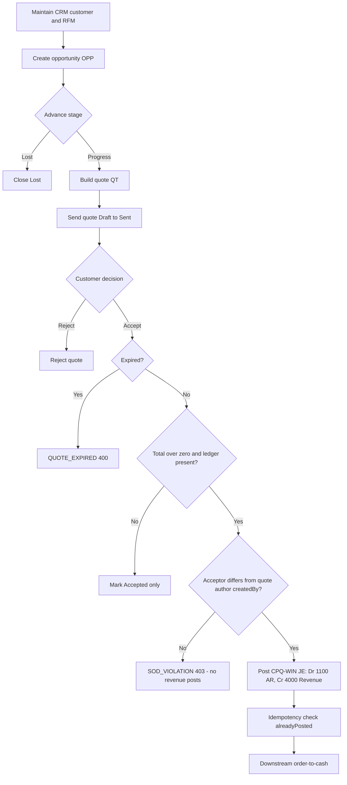

# Process Narrative — CRM, Sales Pipeline & CPQ (Quote-to-Win)

> **Status: DRAFT v0.1** — contains `<<placeholders>>` pending owner confirmation.

## 1. Document Control

| Field | Value |
|---|---|
| Process ID | PN-18-CPQ |
| Process owner | `<<Sales / Revenue Controller>>` |
| Approver | `<<approver-name / title>>` |
| Version | **0.6 DRAFT** |
| Revision date | 2026-07-10 |
| Effective date | `<<effective-date>>` |
| Review cadence | Annual + on significant change |
| Related RCM controls | CPQ-01, CPQ-02, CPQ-03; GL-01; REV-* (downstream); SoD rules R07, R09 |
| Related policy | `<<Revenue Recognition Policy>>`, `<<Pricing & Discount Authority Policy>>`, `<<Segregation-of-Duties Policy>>` |

## 2. Purpose

This narrative documents the front of the revenue cycle: the maintenance of customer master and credit data (CRM), the qualification of sales opportunities through a staged pipeline, and the configuration, pricing and acceptance of customer quotes (CPQ). It establishes how a quote is converted into a booked account-receivable entry, and the controls that ensure pricing integrity, discount governance, segregation of duties, and balanced general-ledger postings. It supports the organisation's quality-management commitment to defined, controlled processes (ISO 9001:2015 cl. 4.4) and its SOX internal-control objectives over revenue.

## 3. Scope

**In scope**
- Customer 360 / RFM segmentation and credit-relevant master data (CRM, `/api/crm`).
- CRM accounts & contacts (party model) with duplicate governance and audited merge (`/api/crm/accounts`, `/api/crm/contacts` — CRM-1 unification).
- Opportunity lifecycle and weighted forecast on the **unified opportunity spine** (`crm_opportunities`) — served by BOTH route families: `/api/crm/pipeline` (lead→convert, REV-17) and the legacy `/api/pipeline` adapters.
- Product configuration, discount rules, quote issuance and quote acceptance posting AR/revenue (CPQ, `/api/cpq`).

**Out of scope**
- Booking of the sales order, fulfilment, invoicing and cash application — see `01-order-to-cash.md`.
- Promotions, price-list maintenance, pricing-rule engine and loyalty — see `19-marketing-pricing-loyalty.md`.
- Revenue recognition timing and deferred-revenue treatment — see `12-revenue-recognition-billing.md`.

## 4. References

- ISO 9001:2015 cl. 4.4 (Quality management system and its processes); cl. 8.1 (Operational planning and control); cl. 8.2 (Requirements for products and services — quotations).
- Risk & Control Matrix: `compliance/Oshinei_ERP_SOX_RCM_v1.xlsx`.
- Segregation-of-Duties matrix: `compliance/Oshinei_ERP_SoD_Matrix_v1.xlsx`.
- Policies: `<<Revenue Recognition Policy>>`, `<<Pricing & Discount Authority Policy>>`.
- Code:
  - `apps/api/src/modules/crm/crm.controller.ts`, `apps/api/src/modules/crm/crm.service.ts`
  - `apps/api/src/modules/crm/pipeline/crm-pipeline.service.ts` — the UNIFIED opportunity spine (CRM-1, migration 0293) + the CRM-5 "why" analytics (`funnel`/`sourceRoi`/`forecast`, date-bounded); `pipeline.controller.ts`/`pipeline.service.ts` — the legacy `/api/pipeline` routes as thin adapters over it
  - `apps/api/src/modules/bi/report-registry.ts` + `bi-generate.service.ts` — the schedulable BI report types `crm_win_loss` / `crm_funnel` / `crm_source_roi` / `crm_forecast` (CRM-5)
  - `apps/api/src/modules/crm/accounts/crm-accounts.module.ts` — accounts/contacts CRUD, duplicate detection, audited merge
  - `apps/api/src/modules/cpq/cpq.controller.ts`, `apps/api/src/modules/cpq/cpq.service.ts`

## 5. Definitions & Abbreviations

| Term | Definition |
|---|---|
| CRM | Customer Relationship Management; the 360-degree customer view and segmentation module. |
| RFM | Recency / Frequency / Monetary scoring, each scored 1–5, driving segments (Champions, Loyal, At Risk, Lost, New). |
| Pipeline | Staged sales opportunity progression over the tenant-configurable `pipeline_stages` master (defaults: Prospect, Qualified, Proposal, Negotiation, Won, Lost — seeded per tenant on first use). One spine (`crm_opportunities`); the legacy lowercase stage strings (prospecting/qualification/…) stay in sync for back-compat. |
| Account / Contact | The CRM party model (CRM-1): `crm_accounts` (company; links to the customer-of-record via `customer_no` once transacting) and `crm_contacts` (person under an account, role-tagged decision_maker/billing/technical/other, optional loyalty join via `member_id`). |
| Stage history | Append-only stage-transition audit (`crm_stage_history`): who moved which opportunity from → to, when — written on creation and on every transition through either route. |
| CPQ | Configure–Price–Quote; product configuration, discount rules and customer quotations. |
| OPP- | Document prefix for an opportunity. |
| QT- | Document prefix for a quote. |
| Weighted value | `expectedValue × probability ÷ 100`, used in forecast. |
| Line total | `unitPrice × qty × (1 − discount ÷ 100)`. |
| AR | Accounts Receivable (GL account 1100). |
| JE | Journal Entry. |
| SoD | Segregation of Duties. |
| RCM | Risk & Control Matrix. |
| RLS | Row-Level Security (per-tenant isolation in Postgres). |

## 6. Roles & Responsibilities (RACI)

Segregation of duties is the design backbone of this process. Three independence rules apply: **R09** — the maintenance of customer credit master data must be segregated from sales order entry; **R10** — the maintenance of price-master and promotion rules must be segregated from selling; **R07** — the party initiating a quote must not be the party that approves/accepts it on a financially-significant value. Tenant isolation is enforced by Postgres RLS and JWT-scoped permissions (`crm`, `marketing`, `exec`, `masterdata`).

| Activity | Sales Rep | Revenue Controller | Sales Manager | Master Data Admin | Finance / GL |
|---|---|---|---|---|---|
| Maintain customer / credit master (CRM) | I | C | I | R | I |
| Refresh RFM segment | R | I | I | C | I |
| Create / move opportunity | R | I | C | I | I |
| Create product configuration & discount rules (CPQ) | I | C | I | R | I |
| Issue (send) quote | R | I | C | I | I |
| Accept quote (post AR/revenue JE) | I | A | R | I | C |
| Reject quote | R | I | A | I | I |
| Review weighted forecast | C | A | R | I | I |

A = Accountable, R = Responsible, C = Consulted, I = Informed.

## 7. Process Narrative

1. **Maintain customer 360 / RFM (CRM, perm `crm`).** A representative reviews the customer view via `GET /api/crm/profile/:memberId`, which returns the 360 profile and RFM scores (1–5 on recency, frequency, monetary). `POST /api/crm/profile/:memberId/refresh` recomputes the RFM segment (Champions / Loyal / At Risk / Lost / New). An unknown member returns `MEMBER_NOT_FOUND` (404). Eligible promotions are read via `GET /api/crm/promos/:memberId`; branch performance via `GET /api/crm/branch-kpi`. Audience rules are defined via `POST /api/crm/audience-rules` (perm `marketing`). *Control: CPQ-01 / R09 — credit-relevant master maintenance is segregated from order entry. Operational for pure-analytics reads.*

1b. **Maintain CRM accounts & contacts with duplicate governance (CRM-1; perms `crm`/`exec`/`ar`).** `POST /api/crm/accounts` (doc prefix `ACC-`) creates a company account (name, tax id, industry, size, a real `owner_user_id`, and a nullable `customer_no` link — an account becomes the customer-of-record once transacting); `POST /api/crm/contacts` creates a person under an account (role tag decision_maker/billing/technical/other; optional `member_id` loyalty join). **Duplicate detection on create:** the normalized tax-id/email/phone and normalized company name (legal suffixes stripped) are matched against existing records — a suspect is refused **409 `DUPLICATE_SUSPECT`** with the match list under `error.details.matches`; a steward who has reviewed resubmits with `force:true`. **Merge (survivor pattern, perms `crm`/`exec`/`masterdata`):** `POST /api/crm/accounts/:survivorNo/merge {duplicate_account_no}` repoints the duplicate's contacts + opportunities to the survivor, survivorship-fills blank survivor fields, and soft-retires the duplicate (`status='merged'` + merged_into/by/at — never deleted). **Maker-checker:** when the merge reassigns children, the caller must differ from the duplicate's creator, else **403 `SOD_VIOLATION`**. Mirrors the customer-master merge (PN-17 §Phase 5). *Control: REV-17 (extended — duplicate governance + audited merge); no new numbered control (rides the REV-15/REV-17 customer-of-record framework, same as the PN-17 customer merge).*

2. **Manage the opportunity (pipeline, perm `crm`).** A rep creates an opportunity with `POST /api/pipeline/opportunities` (doc prefix `OPP-`), lists via `GET /api/pipeline/opportunities`, advances stages with `POST /api/pipeline/opportunities/:id/move`, and logs touches via `POST` / `GET /api/pipeline/opportunities/:id/activities`. Stages come from the tenant-configurable `pipeline_stages` master (defaults Prospect, Qualified, Proposal, Negotiation, Won, Lost — seeded on first use), each carrying a win probability. Closing is via `POST /api/pipeline/opportunities/:id/close` (Won or Lost). **CRM-1 unification:** these routes are thin adapters over the ONE opportunity spine (`crm_opportunities`) also served by `/api/crm/pipeline` (REV-17 lead→convert machine) — a deal is visible and consistent through both. Every transition writes the `crm_stage_history` audit (`GET /api/crm/pipeline/opportunities/:oppNo/history`), and **won/lost are now terminal on this route too** (`OPP_CLOSED` on move/close of a closed deal — previously the legacy route allowed silent re-opening). Unknown ids return `OPP_NOT_FOUND` (404); an invalid stage returns `STAGE_NOT_FOUND` (400). Lead conversion (`POST /api/crm/pipeline/leads/:no/convert`) now also creates/links the CRM account + primary contact alongside the customer-of-record. Residual: a *move* to the Lost stage on the legacy route does not require a reason (legacy contract preserved); the governed `PATCH /api/crm/pipeline/opportunities/:oppNo/stage` route enforces `LOST_REASON_REQUIRED`. *Control: REV-17.*

2b. **Work the pipeline in the unified CRM workspace (`/crm`; CRM-2).** The web workspace is ONE surface over
   the unified spine: a **kanban board** (`pipeline_stages` as columns; cards show deal, account, amount,
   owner and age-in-stage) with drag-and-drop stage moves plus a list-view toggle, filters (owner / stage /
   amount range / free text; saved filter presets ride the shared `saved-views` module, key `crm-board`),
   tabs for **leads** (qualify / convert / lose + the bulk import wizard), **accounts** and **contacts**
   (duplicate-suspect 409s surface as a merge-suggestion dialog), a **deal page** `/crm/deals/{OPP-…}`
   (`GET /api/crm/pipeline/opportunities/:oppNo` composes the opportunity + account/primary contact + the
   stage-history trail + activities + linked CPQ quotes + the nearest undone task) with a unified activity
   timeline and quick-add activity (`PATCH …/activities/:id/done` completes a task), and an **account page**
   `/crm/accounts/{ACC-…}`. Every stage move — dragged or clicked — goes through the SAME governed
   `PATCH …/opportunities/:oppNo/stage` route, so `crm_stage_history` records it and the Lost drop demands a
   reason (`LOST_REASON_REQUIRED`); a Won close may record an optional `win_reason`. The old `/pipeline` and
   `/projects/crm` pages redirect here (deep links preserved); `/projects/pipeline` remains the win/loss
   analytics dashboard. *Control: REV-17 (UI surface over the same governed write paths — no new control).*

2c. **Capture leads at volume (CRM-2).** Two governed intakes feed `crm_leads`:
   - **Bulk import** — `POST /api/crm/pipeline/leads/import` (perms `crm`/`exec`/`ar`) accepts csv / base64
     xlsx / pre-parsed rows (the masterdata engine's parsers reused); header contract `Name` (required) +
     Company/Email/Phone/Source/Owner/Notes (`GET …/import/template`). `dry_run:true` returns the per-row
     validation report without writing; the commit skips invalid rows, numbers each lead through the normal
     `LEAD-` counter and reports imported/skipped/errors.
   - **Public web-to-lead** — `POST /api/crm/web-to-lead` (@Public, **no JWT**: the company website's
     embedded contact form) creates a `source='web'` lead. Abuse controls: (i) a **dedicated strict per-IP
     edge rate-limit bucket** (`RATE_LIMIT_WEB_LEAD_MAX`, default 20/min — segregated from the global and
     auth buckets in `common/edge.ts`), (ii) a **honeypot** field (`website`) that humans never see — a
     filled value is dropped silently with the identical `{ ok: true }` response so a bot cannot detect the
     rejection, (iii) body-size caps, and (iv) explicit tenant resolution (`tenant_code`, or the single
     tenant on a single-tenant install; a multi-tenant install without a code is refused
     `TENANT_REQUIRED` — never a cross-tenant guess). The response never leaks the lead number.
   *Operational — both intakes create `status='new'` leads only (no posting, no conversion); the qualify →
   convert controls of step 2 apply unchanged downstream.*

2d. **See the money before the call — Customer 360 (CRM-3; perms `crm`/`exec`/`ar`).** `GET
   /api/crm/customer-360/:accountNo` is a **read-only aggregator** keyed on the CRM-1 account that joins the
   rest of the business onto the account in ONE payload, so a salesperson has the full picture before every
   call ("CRM ไม่เห็นเงิน" — the CRM can now see the money). It **reuses** the existing services (it re-derives
   nothing): the CRM-2 account read (account + contacts + deals + recent activities), the member-360
   `profile()` (loyalty tier/points, RFM segment, churn risk, latest NPS + any open recovery case, recent
   orders — surfaced when a contact carries a `member_id`), the CPQ `quotes` tied to the account's
   opportunities (via `crm_opportunity_id`), and the finance position from `CollectionsService.creditStatus`
   (AR open balance = exposure, overdue, max-overdue-days, credit limit, available credit, on-hold +
   hold-reason) plus `FinanceService.customerStatement` (statement totals + the last receipts as
   *last_payments*). It also lists the recent company sales orders (fulfilment / estimated-delivery status).
   **Scope note:** AR / credit / sales-orders have **no per-customer sub-ledger** in this single-company
   model — they are the **company** position and are flagged `company_level:true` in the payload (and
   labelled as such on screen); the account-specific joins are the deals, quotes and the member loyalty. An
   unknown account returns `ACCOUNT_NOT_FOUND` (404). The web surface is the **Customer-360 panel** on the
   account page `/crm/accounts/[accountNo]`. *Control: no NEW numbered control — a pure read that surfaces
   data already governed by REV-08/REV-12 (credit/collections), REV-17 (pipeline) and CPQ-03; RCM census
   unchanged.*

3. **Review weighted forecast (perm `exec`).** `GET /api/pipeline/forecast` computes `weighted_value = expectedValue × probability ÷ 100` per stage. *Operational — management reporting; not a GL source.*

3b. **Answer "why" with CRM analytics (CRM-5; perms `crm`/`exec`/`ar`).** Read-only aggregators on the CRM
   spine surface the drivers behind the pipeline. Each is **date-bounded server-side** by a `months` window
   (default 6, clamped 1..24) so the query cost is O(window), and each is also schedulable as a BI report type
   (§4; the scheduler picker `GET /api/bi/report-types`).
   - **Funnel conversion + velocity** — `GET /api/crm/pipeline/analytics/funnel` (report type `crm_funnel`):
     the lead → qualified → opportunity → won funnel with stage-to-stage conversion %, the stage-to-stage
     **progression** (opportunities that reached each stage) and **time-in-stage velocity** (average days in
     each stage), plus the average end-to-end sales cycle — all derived from the append-only `crm_stage_history`
     audit (CRM-1).
   - **Source ROI** — `GET /api/crm/pipeline/analytics/source-roi` (report type `crm_source_roi`): lead
     **source → won revenue** (win rate, average deal size and lead→won rate per channel; opportunities with
     no originating lead bucket as `direct`), so marketing spend follows the channels that actually convert.
   - **Forecast categories + quota** — `GET /api/crm/pipeline/analytics/forecast` (report type `crm_forecast`):
     open pipeline split into **commit** (probability ≥ 70), **best-case** (40–69) and **pipeline** (< 40) with a
     risk-adjusted weighted forecast; **quota attainment per owner** (won-in-window vs an optional per-owner
     quota supplied in the report `filters.quotas` — no quota table, so an unset quota reports `attainment_pct:
     null`); and an **activity leaderboard** (logged/completed activities per owner). *Operational — management
     reporting only; not a GL source; **no new numbered control** (read-only aggregation over the REV-17 spine).*
   Also, the **win/loss** analytic (`crm_win_loss`) and its endpoint are now **bounded by the same server-side
   `months` window** (previously a full-history table scan) — the by-owner and loss-reason breakdowns reflect the
   same period as the monthly trend.

4. **Configure product & discount rules (CPQ).** Configurations are read/created via `GET` / `POST /api/cpq/configs` (create requires perm `masterdata`). Options carry a `price_delta` (`POST /api/cpq/configs/:id/options`); volume-discount rules carry `min_qty` and `discount_pct` (`POST /api/cpq/configs/:id/rules`). Unknown configs return `CONFIG_NOT_FOUND` (404). *Control: CPQ-02 / R10 — discount-rule maintenance is segregated from selling.*

5. **Build the quote (perm `exec`).** A quote is created via `GET` / `POST /api/cpq/quotes` (doc prefix `QT-`; default `validity_days` = 30). Each line computes `lineTotal = unitPrice × qty × (1 − discount ÷ 100)`; lines are read via `GET /api/cpq/quotes/:id/lines`. *Control: CPQ-01 — quote integrity (line maths, validity window).*

6. **Send the quote.** `POST /api/cpq/quotes/:id/send` transitions Draft → Sent. An illegal transition returns `INVALID_TRANSITION` (400). *Control: R07 — the initiating rep sends; acceptance is a separate authority.*

7. **Accept the quote — financially significant.** `POST /api/cpq/quotes/:id/accept` transitions Sent → Accepted. If the quote is past its `expiresDate`, it returns `QUOTE_EXPIRED` (400). When the quote total is greater than zero and a ledger is present, the system posts a balanced JE (GL source `CPQ-WIN`, ref = quote number):

   | Account | Dr | Cr |
   |---|---|---|
   | 1100 Accounts Receivable | quote total | |
   | 4000 Sales Revenue | | quote total |

   The posting is **idempotent**: a prior posting (`alreadyPosted('CPQ-WIN', quoteNo)`) is detected and not duplicated. **Distinct-actor guard (G12):** when a billable quote posts revenue (`total > 0` with a ledger wired — always in production), the acceptor must differ from the quote's `createdBy` — the quote author cannot accept their own quote, so revenue recognition needs a second person; a self-accept is rejected `403 SOD_VIOLATION` and no revenue posts. The ledger-less standalone quote pipeline is a pure status transition (Sent → Accepted) and is unaffected. No migration (uses the existing `quotes.createdBy`). *Controls: CPQ-03 (quote-accept GL posting), GL-01 (balanced JE), R07 (accept authority segregated from initiation), R10 (distinct-actor at revenue recognition).*

8. **Reject the quote.** `POST /api/cpq/quotes/:id/reject` records a declined outcome. Unknown quotes return `QUOTE_NOT_FOUND` (404). *Operational.*

The booked AR then flows downstream to order, invoicing and collection — see `01-order-to-cash.md`.

## 8. Process Flow

**Swimlane narrative.** The *Sales Rep* lane owns CRM review, opportunity progression and quote build/send. The *Master Data Admin* lane owns configuration and discount-rule maintenance (segregated under R10). The *Revenue Controller / Sales Manager* lane owns quote acceptance, which is the control gate where the AR/revenue JE is posted (R07, GL-01). The *Finance / GL* lane consumes the posted entry and reconciles it against downstream order-to-cash bookings.

## 9. Control Matrix

| Step | Risk | Control | Type | RCM ID | Evidence / Record |
|---|---|---|---|---|---|
| 1 | Credit master altered by order-entry staff (collusion / unauthorised limits) | Permission split (`crm` vs order entry); RLS tenant scope | Preventive | CPQ-01 / R09 | CRM audit log, permission grants |
| 1b | Duplicate accounts/contacts fragment the customer identity (revenue/AR mis-attributed); a merge silently rewrites ownership of pipeline | Create-time duplicate detection (normalized tax-id/email/phone/company-name → `DUPLICATE_SUSPECT` 409, steward `force` override); survivor-pattern merge is audited (merged_into/by/at, soft-retire) and maker-checked when children reassign (caller ≠ duplicate's creator → `SOD_VIOLATION`) | Preventive | REV-17 (ext.) / REV-15 | crm_accounts merge trail; DUPLICATE_SUSPECT/SOD_VIOLATION rejections (pipeline harness ToE) |
| 2d | Salesperson calls blind to the customer's money — overdue AR / a credit hold missed; a stale or fabricated 360 misinforms the call | Customer 360 is a **pure read-only aggregator** that reuses the governed source services (credit/collections REV-08/REV-12, pipeline REV-17, CPQ-03) — it posts nothing and cannot alter state; company-level AR/credit is flagged `company_level:true` so it is never mis-read as a per-customer sub-ledger | Detective / Operational | REV-08/REV-12 · REV-17 · CPQ-03 | 360 payload (AR/credit + deals + quotes + loyalty joined); pipeline harness ToE |
| 2–3 | Inflated pipeline / forecast misstatement; closed deals silently re-opened | Forecast is non-posting; weighted value formula fixed in code; ONE opportunity spine (both route families) with terminal won/lost and the append-only `crm_stage_history` transition audit | Operational / Detective | REV-17 | Pipeline export, forecast snapshot, stage-history trail |
| 4 | Unauthorised discount rule (margin erosion) | Config/rule create gated to `masterdata`, segregated from selling | Preventive | CPQ-02 / R10 | Config change log |
| 5 | Quote line miscalculation | Server-computed `lineTotal`; validity window enforced | Preventive | CPQ-01 | Quote record, line snapshot |
| 6 | Self-approval of own quote (author books own revenue) | Send (rep) separated from accept (controller); **at accept, the distinct-actor rule is now ENFORCED in code (G12)** — accepting a billable quote (`total > 0` with a ledger) is rejected `SOD_VIOLATION` when the acceptor equals the quote's `createdBy`, so revenue recognition needs a second person | Preventive | R07 / CPQ-03 | Status transition log; `SOD_VIOLATION` on self-accept |
| 7 | Unbalanced or duplicate revenue posting; expired quote booked | Balanced JE (Dr 1100 / Cr 4000); idempotency on `CPQ-WIN`+quoteNo; `QUOTE_EXPIRED` guard; distinct-actor guard on the revenue posting (G12, self-accept → `SOD_VIOLATION`) | Preventive / Detective | CPQ-03, GL-01 | GL entry `CPQ-WIN`, idempotency key |
| 8 | Stale quote acceptance | State machine rejects illegal transitions (`INVALID_TRANSITION`) | Preventive | CPQ-01 | Transition log |
| 2b | Leads / open deals not followed up on time (revenue lost to neglect; forecast unreliable; ad-hoc prioritisation) | CRM-4 sales-automation discipline: explainable versioned lead scoring (grade A–D, persisted breakdown); tenant follow-up policy (`sla_hours`/`rotting_days`/round-robin owners) driving a detective follow-up center — NEW leads untouched past SLA, overdue tasks, deals idle beyond `rotting_days` — a schedulable daily digest firing `lead.stagnant`; round-robin auto-assignment; pipeline events (`lead.created`/`opp.stage_changed`/`deal.won`/`deal.lost`) into the no-code rules engine | Detective | REV-22 | Lead-score register; follow-up worklist (`GET …/follow-up`); `crm_followup_digest` run summary + rail notification; automation-event executions |

## 10. Inputs & Outputs

**Inputs:** customer master & credit data; product/config catalogue; discount and volume-rule definitions; opportunity stage probabilities; user JWT (tenant + permission claims).

**Outputs:** RFM segments; opportunity records (`OPP-`); weighted forecast; quotes (`QT-`) and quote lines; balanced AR/revenue JE (`CPQ-WIN`); accepted/rejected quote status feeding `01-order-to-cash.md`.

## 11. Records & Retention

| Record | Retention |
|---|---|
| Quotes, quote lines, acceptance evidence | `<<7 years / per Thai law>>` |
| GL entries (`CPQ-WIN`) | `<<7 years / per Thai law>>` |
| CRM credit-master change log | `<<7 years / per Thai law>>` |
| Opportunity & forecast snapshots | `<<retention per policy>>` |

## 12. KPIs / Metrics

- Quote-to-win conversion rate (Accepted ÷ Sent).
- Average discount % vs approved discount-rule ceiling.
- Forecast accuracy: weighted forecast vs actual booked AR.
- Quote cycle time (Draft → Accepted).
- Count of `QUOTE_EXPIRED` and `INVALID_TRANSITION` events (control-health indicator).

## 13. Exception & Error Handling

| Error code | Trigger | Handling |
|---|---|---|
| MEMBER_NOT_FOUND (404) | CRM profile / promos for unknown member | Reject; verify member id; no posting. |
| OPP_NOT_FOUND (404) | Operation on unknown opportunity (incl. a CPQ quote referencing a dangling opportunity id) | Reject; refresh list. |
| STAGE_NOT_FOUND (400) | Move to undefined stage (legacy route) | Reject; use the tenant's configured stage set. |
| BAD_STAGE (400) | Unknown stage on `PATCH …/opportunities/:oppNo/stage` (crm route) | Reject; use a configured stage or its legacy alias. |
| OPP_CLOSED (400) | Any move/close of a won/lost opportunity (terminal on BOTH route families since CRM-1) | Reject; a closed deal stays closed. |
| LOST_REASON_REQUIRED (400) | Losing a deal without a reason on the governed crm route | Provide the loss reason. |
| DUPLICATE_SUSPECT (409) | Creating an account/contact that matches an existing record on normalized tax-id/email/phone/company-name (`error.details.matches` carries the candidates) | Steward reviews the matches; resubmit with `force:true` only for a confirmed non-duplicate. |
| SOD_VIOLATION (403) | The duplicate's creator attempts a merge that reassigns children (contacts/opportunities) | A DIFFERENT user performs the merge (maker-checker). Also fired by the CPQ self-accept guard (G12). |
| SELF_MERGE / ALREADY_MERGED (400) | Merging an account into itself / re-merging a retired duplicate | Reject; pick a live duplicate ≠ survivor. |
| MERGE_CONFLICT (409) | Survivor and duplicate both own a row with the same natural key | Steward resolves the collision manually, then re-merges. |
| ACCOUNT_NOT_FOUND / CONTACT_NOT_FOUND (404) | Operation on an unknown account/contact (in this tenant) | Verify the `ACC-…` number / contact id. |
| TENANT_REQUIRED (400) | Public web-to-lead without `tenant_code` on a multi-tenant install | Configure the website form to send the company's `tenant_code`. |
| TENANT_NOT_FOUND (400) | Public web-to-lead with an unknown `tenant_code` | Correct the code embedded in the website form. |
| NO_ROWS / MISSING_COLUMNS (400) | Lead import with an empty file / without the `Name` column | Use the template (`GET …/leads/import/template`); `Name` is the only required column. |
| REQUIRED_EMPTY (per-row) | Lead-import row with a blank `Name` | Reported per row in the validation report; the commit skips the row (others import). |
| RATE_LIMITED (429) | Web-to-lead flood from one IP (dedicated strict bucket, `RATE_LIMIT_WEB_LEAD_MAX`) | Back off and retry after the window; legitimate forms are far under the ceiling. |
| NO_ROUND_ROBIN (400) | `POST …/leads/:no/assign` with no explicit `owner` and no round-robin owners configured (CRM-4) | Configure `round_robin_owners` in follow-up settings, or pass an explicit `owner`. |
| NO_RECIPIENT (400) | `POST …/opportunities/:oppNo/comms` where the contact has no address for the chosen channel and no explicit `to` (CRM-4) | Provide `to`, or set the contact's email/LINE id/phone. |
| MESSAGING_UNAVAILABLE (400) | Deal comms attempted where the messaging graph isn't wired (partial harness) | Not reachable in production; the full app always provides `MessagingService`. |
| CONFIG_NOT_FOUND (404) | Option/rule on unknown config | Reject; create config first. |
| QUOTE_NOT_FOUND (404) | Action on unknown quote | Reject; verify quote number. |
| QUOTE_EXPIRED (400) | Accept past `expiresDate` | Block acceptance; re-issue quote. |
| SOD_VIOLATION (403) | Quote author accepts their own billable quote (revenue would post — `total > 0` with a ledger) | Block; a different user must accept (revenue recognition needs a second person). |
| INVALID_TRANSITION (400) | Illegal status change | Block; follow Draft→Sent→Accepted/Rejected. |

## 14. Revision History

| Version | Date | Author | Notes |
|---|---|---|---|
| 0.1 DRAFT | 2026-06-22 | `<<author>>` | Initial draft. |
| 0.9 | 2026-07-10 | Platform | **CRM-4 — sales automation: lead scoring, pipeline events, follow-up SLA discipline, deal comms (docs/41 module-depth uplift; migration 0308; new detective control REV-22).** Built on the CRM-1 spine + the existing automation/alerts rails — no new engine. **(1) Pipeline events → automation engine:** `crm-pipeline.service.ts` now emits `lead.created`, `lead.stagnant`, `opp.stage_changed`, `deal.won`, `deal.lost` into `AutomationService.runEvent` (the SAME no-code rules engine the loyalty/NPS events ride — `automation.service.ts` event catalog extended), best-effort so a rule failure never blocks the write. **(2) Lead scoring (v1, explainable + versioned):** `scoreLead`/`computeLeadScore` grade every lead A–D from source / size (company ⇒ B2B) / contactability (email+phone) / engagement recency; coefficients live in `LEAD_SCORE_COEFFS`, each score is stamped `LEAD_SCORE_VERSION` with a persisted per-factor `breakdown` (mirrors the `crm.service.ts` churn/LTV formula pattern). Read `GET /api/crm/pipeline/leads/:no/score`; re-score `POST …/score`. **(3) Follow-up discipline (detective control REV-22):** tenant policy `crm_followup_settings` (`sla_hours` default 24, `rotting_days` default 7, `round_robin_owners`; read `GET …/follow-up/settings`, change `PUT` gated `crm`/`exec`) drives a severity-ranked follow-up center `GET /api/crm/pipeline/follow-up` — NEW leads untouched (no activity logged) past the SLA, open follow-up tasks past due, OPEN deals idle beyond `rotting_days`. New leads auto-assign **round-robin** across the configured owners (`POST …/leads/:no/assign` to rotate/override). A schedulable **daily digest** (BI report type `crm_followup_digest`) re-runs the center via `runFollowUpSweep`, fires `lead.stagnant` into the automation engine and drops a notification on the alerts rail. **(4) Deal comms:** `POST …/opportunities/:oppNo/comms` sends email/LINE/SMS through the existing `MessagingService` with `{{merge-field}}` substitution (`GET …/comms/merge-fields` lists the catalog) and logs the send as a timeline activity. Two new tenant tables `crm_lead_scores`/`crm_followup_settings` (canonical 0232 RLS, tenant-leading indexes). New RCM control **REV-22** (RCM now <!-- rcm-total -->217<!-- /rcm-total -->); §9 control matrix +1 detective row; §13 +3 error rows. ToE: `cutover/pipeline.ts` 43→57 (A/D grading + versioned breakdown, deal.won reaches an automation rule, SLA-breach detect + clear-on-touch, round-robin, digest sweep fires lead.stagnant, comms merge-field render + activity log). Manual `16-crm-workspace.md` + UAT-O2C-328..332 + traceability updated. |
| 0.8 | 2026-07-10 | Platform | **CRM-5 — analytics that answer "why" (Module-Depth Uplift Wave 4; NO migration, NO new RCM control).** New §7 step 3b; §4 code refs. Three read-only aggregators on the CRM spine, each **date-bounded server-side** (`months` window, default 6, clamped 1..24) and each also a schedulable BI report type on the existing registry: **funnel conversion + velocity** (`GET /api/crm/pipeline/analytics/funnel`, report `crm_funnel`) — lead→qualified→opportunity→won funnel with stage-to-stage conversion, stage progression and time-in-stage velocity + average sales cycle, all from the `crm_stage_history` audit; **source ROI** (`…/analytics/source-roi`, report `crm_source_roi`) — lead source→won revenue (win rate / avg deal / lead→won per channel; no originating lead ⇒ `direct`); **forecast categories + quota** (`…/analytics/forecast`, report `crm_forecast`) — open pipeline split commit(≥70)/best-case(40–69)/pipeline(<40) with a weighted forecast, quota attainment per owner (won-in-window vs an optional `filters.quotas`; no quota table ⇒ `attainment_pct:null`), and an activity leaderboard. Also **bounded the existing `crm_win_loss` query + endpoint by the same server-side `months` window** (was a full-history scan) and echoes `window_months`. RCM: **no new numbered control** — read-only management reporting over the REV-17 spine (census counts unchanged). ToE: `cutover/pipeline.ts` 43→49 (funnel 4-stage + conversion, velocity/progression from stage-history, source ROI won-revenue-by-source, forecast buckets + quota + leaderboard, date-bounded win/loss, registry exposes the 3 report types). Manual `16-crm-workspace.md` §Analytics; UAT `02-order-to-cash-uat.md` UAT-O2C-317..320 + traceability matrix. |
| 0.7 | 2026-07-10 | Platform | **CRM-3 — Customer 360 that joins the business (docs/42 module-depth uplift Wave 4; NO migration, NO new RCM control).** New §7 step 2d; §9 control-matrix row 2d; `ACCOUNT_NOT_FOUND` already in §13. `GET /api/crm/customer-360/:accountNo` (perms `crm`/`exec`/`ar`) is a read-only aggregator keyed on the CRM-1 account that folds the money onto the account in ONE payload — reusing (not re-deriving) the CRM-2 account read, the member-360 `profile()` (loyalty/RFM/NPS/recovery/recent orders via a `member_id`-linked contact), the CPQ quotes tied to the account's opportunities, `CollectionsService.creditStatus` (AR open balance + aging + credit holds) and `FinanceService.customerStatement` (statement + last payments), plus recent company sales orders. **Scope:** AR/credit/sales-orders are company-level in the single-company model (no per-customer sub-ledger) and are flagged `company_level:true`; the account-specific joins are deals, quotes and member loyalty. Web: a **Customer-360 panel** on `/crm/accounts/[accountNo]` (added inside the existing client island — no new `'use client'` file). **No migration** (pure read over existing tables); **no new numbered control** — surfaces data already governed by REV-08/REV-12, REV-17, CPQ-03 (RCM census unchanged). ToE: `cutover/pipeline.ts` 43→49 (AR/overdue/credit-limit joined + `serious_overdue`/`company_level`, last payment from the statement, open-deal + weighted value, CPQ quote via `crm_opportunity_id`, loyalty via the member-linked contact, unknown account → 404). Manual `16-crm-workspace.md` §16.5 Customer 360; UAT `02-order-to-cash-uat.md` UAT-O2C-317..319 + traceability. |
| 0.6 | 2026-07-10 | Platform | **CRM-2 — the modern CRM workspace + lead capture (docs/41 module-depth uplift; UI phase over the CRM-1 spine; no migration, no new RCM control).** New §7 steps 2b/2c; §13 error rows. ONE web workspace at **`/crm`**: kanban board (drag-and-drop stage moves through the governed `PATCH …/stage` route → `crm_stage_history`; Won/Lost drop asks the reason — `LOST_REASON_REQUIRED` honoured, optional `win_reason` now stored) + list toggle, filters + saved views (`saved-views` module, key `crm-board`), leads / accounts / contacts tabs (DUPLICATE_SUSPECT 409 → merge-suggestion dialog), deal page `/crm/deals/[oppNo]` (new composed read `GET /api/crm/pipeline/opportunities/:oppNo` — account, primary contact, stage history, activities, linked CPQ quotes, next undone task; `PATCH …/activities/:id/done`), account page `/crm/accounts/[accountNo]` (accounts `GET` gains `opportunities` + `recent_activities`, additive). `/pipeline` + `/projects/crm` → server redirects to `/crm` (deep links preserved); nav regrouped (one CRM workspace entry; retail member CRM 360 → `/crm/members`); `/projects/pipeline` win/loss dashboard unchanged, linked from the workspace. **Lead capture:** bulk import `POST /api/crm/pipeline/leads/import` (csv/xlsx/rows, `dry_run` validation report, LEAD- numbering, invalid rows skipped) and PUBLIC `POST /api/crm/web-to-lead` (@Public — dedicated strict per-IP edge bucket `RATE_LIMIT_WEB_LEAD_MAX` default 20/min, silent honeypot drop with identical `{ ok:true }` shape, explicit tenant resolution → `TENANT_REQUIRED`, response never leaks the lead no.). List read enriched additively (`account_name`, `stage_entered_at` for age-in-stage). ToE: `cutover/pipeline.ts` 32→43 (deal-detail composition + next-task, board enrichment, win_reason, web-to-lead created/honeypot-dropped/TENANT_REQUIRED/rate-bucket, import dry-run + commit + template). Manual: new `16-crm-workspace.md` (+14/99 updated); UAT-O2C-308..299 + traceability. |
| 0.5 | 2026-07-10 | Platform | **CRM-1 — CRM data-model unification (docs/41 module-depth uplift; migration 0293).** The two disconnected opportunity models are merged: `crm_opportunities` is the ONE spine — it gains `stage_id` → the tenant-configurable `pipeline_stages` (legacy lowercase `stage` string kept in sync), a derived `status` (Open/Won/Lost), real `owner_user_id`/`account_id`/`primary_contact_id` references, and `win_reason`/`notes`; the Batch 2A `opportunities` rows were data-migrated in (`legacy_opportunity_id`) and `opportunity_activities` folded into `crm_activities` (`source='pipeline'`, `legacy_activity_id`); the old tables are READ-LEGACY (no write path). `/api/pipeline` routes stay contract-identical as thin adapters (`pipeline.service.ts` → `CrmPipelineService`); conscious tightening: won/lost are terminal on that route too (`OPP_CLOSED`). Every stage transition (both routes, incl. creation) writes the append-only **`crm_stage_history`** audit (`GET /api/crm/pipeline/opportunities/:oppNo/history`). NEW party model: **`crm_accounts`** (ACC-, tax id/industry/size/owner, nullable `customer_no` → customer_master) + **`crm_contacts`** (role-tagged, optional `member_id` loyalty join) at `/api/crm/accounts` + `/api/crm/contacts` — create-time duplicate detection (normalized tax-id/email/phone/company-name → 409 `DUPLICATE_SUSPECT` with `error.details.matches`; `force:true` steward override) and a survivor-pattern **merge** (`POST /api/crm/accounts/:survivorNo/merge`, perms crm/exec/masterdata) that repoints children, survivorship-fills, soft-retires (merged_into/by/at) and is maker-checked when children reassign (caller ≠ duplicate creator → 403 `SOD_VIOLATION`). Lead conversion now creates/links the account + primary contact alongside the customer-of-record. CPQ `quotes` gained `crm_opportunity_id` (backfilled through the legacy mapping; `opportunity_id` read-legacy) and `POST /api/cpq/quotes` validates the opportunity (`OPP_NOT_FOUND`). BI/dashboard/alerts pipeline KPIs read the unified spine. The `{ error: { … } }` envelope gains an optional endpoint-defined `details` payload (used by `DUPLICATE_SUSPECT`). **RCM decision: no NEW numbered control** — the merge + duplicate governance extend REV-17/REV-15 exactly as the customer-master merge extended REV-15 (PN-17 Phase 5, no new control); REV-17's RCM row is updated to the unified mechanics (census counts unchanged). ToE: `cutover/pipeline.ts` 32 checks (unified read, stage history, terminal guard on the legacy route, DUPLICATE_SUSPECT + force, merge maker-checker + repoint, CPQ link + dangling-id 404, and an idempotent 0293 data-migration replay). §3, §4, §5, §7 (1b, 2), §9 (1b, 2–3), §13 updated. Manual `14-project-management.md` + `99-troubleshooting-faq.md`; UAT `02-order-to-cash-uat.md` UAT-O2C-290..295 + traceability matrix. |
| 0.2 | 2026-07-02 | Platform | **Module consolidation (docs/28 PR #3) — code pointers only.** `modules/pipeline` + `modules/crm-pipeline` moved under `modules/crm/pipeline/` (umbrella `CrmModule`); services, routes (`/api/pipeline`, `/api/crm/pipeline`) and tables unchanged. |
| 0.4 | 2026-07-06 | Platform | **G12 — CPQ quote self-accept → distinct-actor revenue guard (maker-checker gap remediation, Phase P2; no new RCM control, no migration).** §7 item 7 + §8 flowchart + §9 control-matrix steps 6–7 + §13 error table. `cpq.service.ts acceptQuote` now enforces that the acceptor differs from the quote's `createdBy` whenever accepting a **billable** quote posts revenue (`total > 0` with a ledger wired — always in production; `Dr 1100 AR / Cr 4000`): the quote author cannot accept their own quote — revenue recognition needs a second person — else `403 SOD_VIOLATION` and **no revenue posts**. The ledger-less standalone quote pipeline stays a pure status transition (Sent → Accepted) and is unaffected. Route unchanged (`POST /api/cpq/quotes/:id/accept`, `@Permissions('exec')`). Uses the existing `quotes.createdBy` — **no migration**. Rides **R07/R10 / CPQ-03** — strengthens existing controls, no new numbered control (RCM census unaffected). ToE: `cpq-gl.ts` (author self-accept → 403 SOD_VIOLATION, no revenue; a distinct exec accepts → AR/revenue posts 50000, TB balanced). Manual `01-sales-and-pos.md` §quote-accept callout + UAT `02-order-to-cash-uat.md` (UAT-O2C-253/254) updated. |
| 0.3 | 2026-07-05 | Platform | **Printable + emailable ใบเสนอราคา (Quotation) — presentation only, no new control, no migration.** A quote can now be printed (`GET /api/cpq/quotes/:id/pdf`; `QuotePdfService` → shared `PdfRenderer`, HTML fallback when Chromium absent) and emailed to the customer as a PDF attachment (`POST /api/cpq/quotes/:id/send-email` via the shared `DocEmailService`/@Global `MailModule`, which also transitions Draft→Sent). The document carries the seller (our-tenant) block, the customer, the priced lines with per-line discount, the net offer and baht-text total, and a "ยืนราคาถึง" validity date. Read-only over `quotes`/`quote_lines`; endpoints keep the existing `exec` permission. Fills the gap where `POST /quotes/:id/send` only flipped status without producing a document. ToE: `cpq` harness 14 ✓ (quotation PDF + email path wired to `EMAIL_NOT_CONFIGURED` with no SMTP). Cross-cycle: the delivery note + AR invoice get the same treatment in `01-order-to-cash.md` §revision 0.18. UAT `02-order-to-cash-uat.md` (UAT-O2C-235) updated. |
