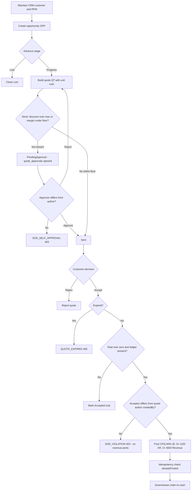

# Process Narrative — CRM, Sales Pipeline & CPQ (Quote-to-Win)

> **Status: DRAFT v0.1** — contains `<<placeholders>>` pending owner confirmation.

## 1. Document Control

| Field | Value |
|---|---|
| Process ID | PN-18-CPQ |
| Process owner | `<<Sales / Revenue Controller>>` |
| Approver | `<<approver-name / title>>` |
| Version | **0.21 DRAFT** |
| Revision date | 2026-07-14 |
| Effective date | `<<effective-date>>` |
| Review cadence | Annual + on significant change |
| Related RCM controls | CPQ-01 (margin-floor / discount-approval), CPQ-02, CPQ-03; REV-17 (pipeline spine), REV-22 (follow-up SLA), **CRM-07 (account 360 depth)**, **CRM-08 (account health/churn)**, **CRM-09 (sales forecasting depth)**, **CRM-10 (territory / quota)**, **CRM-11 (sequences / cadences)**, **CRM-12 (CPQ bundles / guided selling / tiered discount authority)**, **CRM-13 (pipeline stage playbooks)**, **CRM-14 (unified timeline / collaboration feed)**, **CRM-15 (CPQ pricebooks)**, **CRM-16 (CRM data quality)**, **CRM-17 (multi-touch campaign attribution)**, **CRM-18 (delivered-project renewal back-flow)**; GL-01; REV-* (downstream); SoD rules R07, R09, R20 |
| Related policy | `<<Revenue Recognition Policy>>`, `<<Pricing & Discount Authority Policy>>`, `<<Segregation-of-Duties Policy>>` |

## 2. Purpose

This narrative documents the front of the revenue cycle: the maintenance of customer master and credit data (CRM), the qualification of sales opportunities through a staged pipeline, and the configuration, pricing and acceptance of customer quotes (CPQ). It establishes how a quote is converted into a booked account-receivable entry, and the controls that ensure pricing integrity, discount governance, segregation of duties, and balanced general-ledger postings. It supports the organisation's quality-management commitment to defined, controlled processes (ISO 9001:2015 cl. 4.4) and its SOX internal-control objectives over revenue.

## 3. Scope

**In scope**
- Customer 360 / RFM segmentation and credit-relevant master data (CRM, `/api/crm`).
- CRM accounts & contacts (party model) with duplicate governance and audited merge (`/api/crm/accounts`, `/api/crm/contacts` — CRM-1 unification).
- Opportunity lifecycle and weighted forecast on the **unified opportunity spine** (`crm_opportunities`) — served by BOTH route families: `/api/crm/pipeline` (lead→convert, REV-17) and the legacy `/api/pipeline` adapters.
- Product configuration, discount rules, quote issuance and quote acceptance posting AR/revenue (CPQ, `/api/cpq`).

**Out of scope**
- Booking of the sales order, fulfilment, invoicing and cash application — see `01-order-to-cash.md`.
- Promotions, price-list maintenance, pricing-rule engine and loyalty — see `19-marketing-pricing-loyalty.md`.
- Revenue recognition timing and deferred-revenue treatment — see `12-revenue-recognition-billing.md`.

## 4. References

- ISO 9001:2015 cl. 4.4 (Quality management system and its processes); cl. 8.1 (Operational planning and control); cl. 8.2 (Requirements for products and services — quotations).
- Risk & Control Matrix: `compliance/Invisible_ERP_SOX_RCM_v1.xlsx`.
- Segregation-of-Duties matrix: `compliance/Invisible_ERP_SoD_Matrix_v1.xlsx`.
- Policies: `<<Revenue Recognition Policy>>`, `<<Pricing & Discount Authority Policy>>`.
- Code:
  - `apps/api/src/modules/crm/crm.controller.ts`, `apps/api/src/modules/crm/crm.service.ts`
  - `apps/api/src/modules/crm/pipeline/crm-pipeline.service.ts` — the UNIFIED opportunity spine (CRM-1, migration 0293) + the CRM-5 "why" analytics (`funnel`/`sourceRoi`/`forecast`, date-bounded); `pipeline.controller.ts`/`pipeline.service.ts` — the legacy `/api/pipeline` routes as thin adapters over it
  - `apps/api/src/modules/bi/report-registry.ts` + `bi-generate.service.ts` — the schedulable BI report types `crm_win_loss` / `crm_funnel` / `crm_source_roi` / `crm_forecast` (CRM-5)
  - `apps/api/src/modules/crm/accounts/crm-accounts.module.ts` — accounts/contacts CRUD, duplicate detection, audited merge
  - `apps/api/src/modules/crm/inbound/crm-inbound.service.ts` + `crm-inbound.controller.ts` — CRM-6 inbound email capture (webhook + review queue); `crm/crm-thread.ts` — the shared reply-threading token embedded by CRM-4 comms and parsed by CRM-6 capture (migration 0309)
  - `apps/api/src/modules/cpq/cpq.controller.ts`, `apps/api/src/modules/cpq/cpq.service.ts`

## 5. Definitions & Abbreviations

| Term | Definition |
|---|---|
| CRM | Customer Relationship Management; the 360-degree customer view and segmentation module. |
| RFM | Recency / Frequency / Monetary scoring, each scored 1–5, driving segments (Champions, Loyal, At Risk, Lost, New). |
| Pipeline | Staged sales opportunity progression over the tenant-configurable `pipeline_stages` master (defaults: Prospect, Qualified, Proposal, Negotiation, Won, Lost — seeded per tenant on first use). One spine (`crm_opportunities`); the legacy lowercase stage strings (prospecting/qualification/…) stay in sync for back-compat. |
| Account / Contact | The CRM party model (CRM-1): `crm_accounts` (company; links to the customer-of-record via `customer_no` once transacting) and `crm_contacts` (person under an account, role-tagged decision_maker/billing/technical/other, optional loyalty join via `member_id`). |
| Stage history | Append-only stage-transition audit (`crm_stage_history`): who moved which opportunity from → to, when — written on creation and on every transition through either route. |
| CPQ | Configure–Price–Quote; product configuration, discount rules and customer quotations. |
| OPP- | Document prefix for an opportunity. |
| QT- | Document prefix for a quote. |
| Weighted value | `expectedValue × probability ÷ 100`, used in forecast. |
| Line total | `unitPrice × qty × (1 − discount ÷ 100)`. |
| AR | Accounts Receivable (GL account 1100). |
| JE | Journal Entry. |
| SoD | Segregation of Duties. |
| RCM | Risk & Control Matrix. |
| RLS | Row-Level Security (per-tenant isolation in Postgres). |

## 6. Roles & Responsibilities (RACI)

Segregation of duties is the design backbone of this process. Three independence rules apply: **R09** — the maintenance of customer credit master data must be segregated from sales order entry; **R10** — the maintenance of price-master and promotion rules must be segregated from selling; **R07** — the party initiating a quote must not be the party that approves/accepts it on a financially-significant value. Tenant isolation is enforced by Postgres RLS and JWT-scoped permissions (`crm`, `marketing`, `exec`, `masterdata`).

| Activity | Sales Rep | Revenue Controller | Sales Manager | Master Data Admin | Finance / GL |
|---|---|---|---|---|---|
| Maintain customer / credit master (CRM) | I | C | I | R | I |
| Refresh RFM segment | R | I | I | C | I |
| Create / move opportunity | R | I | C | I | I |
| Create product configuration & discount rules (CPQ) | I | C | I | R | I |
| Issue (send) quote | R | I | C | I | I |
| Accept quote (post AR/revenue JE) | I | A | R | I | C |
| Reject quote | R | I | A | I | I |
| Review weighted forecast | C | A | R | I | I |

A = Accountable, R = Responsible, C = Consulted, I = Informed.

## 7. Process Narrative

1. **Maintain customer 360 / RFM (CRM, perm `crm`).** A representative reviews the customer view via `GET /api/crm/profile/:memberId`, which returns the 360 profile and RFM scores (1–5 on recency, frequency, monetary). `POST /api/crm/profile/:memberId/refresh` recomputes the RFM segment (Champions / Loyal / At Risk / Lost / New). An unknown member returns `MEMBER_NOT_FOUND` (404). Eligible promotions are read via `GET /api/crm/promos/:memberId`; branch performance via `GET /api/crm/branch-kpi`. Audience rules are defined via `POST /api/crm/audience-rules` (perm `marketing`). *Control: CPQ-01 / R09 — credit-relevant master maintenance is segregated from order entry. Operational for pure-analytics reads.*

1b. **Maintain CRM accounts & contacts with duplicate governance (CRM-1; perms `crm`/`exec`/`ar`).** `POST /api/crm/accounts` (doc prefix `ACC-`) creates a company account (name, tax id, industry, size, a real `owner_user_id`, and a nullable `customer_no` link — an account becomes the customer-of-record once transacting); `POST /api/crm/contacts` creates a person under an account (role tag decision_maker/billing/technical/other; optional `member_id` loyalty join). **Duplicate detection on create:** the normalized tax-id/email/phone and normalized company name (legal suffixes stripped) are matched against existing records — a suspect is refused **409 `DUPLICATE_SUSPECT`** with the match list under `error.details.matches`; a steward who has reviewed resubmits with `force:true`. **Merge (survivor pattern, perms `crm`/`exec`/`masterdata`):** `POST /api/crm/accounts/:survivorNo/merge {duplicate_account_no}` repoints the duplicate's contacts + opportunities to the survivor, survivorship-fills blank survivor fields, and soft-retires the duplicate (`status='merged'` + merged_into/by/at — never deleted). **Maker-checker:** when the merge reassigns children, the caller must differ from the duplicate's creator, else **403 `SOD_VIOLATION`**. Mirrors the customer-master merge (PN-17 §Phase 5). *Control: REV-17 (extended — duplicate governance + audited merge); no new numbered control (rides the REV-15/REV-17 customer-of-record framework, same as the PN-17 customer merge).*

2. **Manage the opportunity (pipeline, perm `crm`).** A rep creates an opportunity with `POST /api/pipeline/opportunities` (doc prefix `OPP-`), lists via `GET /api/pipeline/opportunities`, advances stages with `POST /api/pipeline/opportunities/:id/move`, and logs touches via `POST` / `GET /api/pipeline/opportunities/:id/activities`. Stages come from the tenant-configurable `pipeline_stages` master (defaults Prospect, Qualified, Proposal, Negotiation, Won, Lost — seeded on first use), each carrying a win probability. Closing is via `POST /api/pipeline/opportunities/:id/close` (Won or Lost). **CRM-1 unification:** these routes are thin adapters over the ONE opportunity spine (`crm_opportunities`) also served by `/api/crm/pipeline` (REV-17 lead→convert machine) — a deal is visible and consistent through both. Every transition writes the `crm_stage_history` audit (`GET /api/crm/pipeline/opportunities/:oppNo/history`), and **won/lost are now terminal on this route too** (`OPP_CLOSED` on move/close of a closed deal — previously the legacy route allowed silent re-opening). Unknown ids return `OPP_NOT_FOUND` (404); an invalid stage returns `STAGE_NOT_FOUND` (400). Lead conversion (`POST /api/crm/pipeline/leads/:no/convert`) now also creates/links the CRM account + primary contact alongside the customer-of-record. Residual: a *move* to the Lost stage on the legacy route does not require a reason (legacy contract preserved); the governed `PATCH /api/crm/pipeline/opportunities/:oppNo/stage` route enforces `LOST_REASON_REQUIRED`. *Control: REV-17.*

2b. **Work the pipeline in the unified CRM workspace (`/crm`; CRM-2).** The web workspace is ONE surface over
   the unified spine: a **kanban board** (`pipeline_stages` as columns; cards show deal, account, amount,
   owner and age-in-stage) with drag-and-drop stage moves plus a list-view toggle, filters (owner / stage /
   amount range / free text; saved filter presets ride the shared `saved-views` module, key `crm-board`),
   tabs for **leads** (qualify / convert / lose + the bulk import wizard), **accounts** and **contacts**
   (duplicate-suspect 409s surface as a merge-suggestion dialog), a **deal page** `/crm/deals/{OPP-…}`
   (`GET /api/crm/pipeline/opportunities/:oppNo` composes the opportunity + account/primary contact + the
   stage-history trail + activities + linked CPQ quotes + the nearest undone task) with a unified activity
   timeline and quick-add activity (`PATCH …/activities/:id/done` completes a task), and an **account page**
   `/crm/accounts/{ACC-…}`. Every stage move — dragged or clicked — goes through the SAME governed
   `PATCH …/opportunities/:oppNo/stage` route, so `crm_stage_history` records it and the Lost drop demands a
   reason (`LOST_REASON_REQUIRED`); a Won close may record an optional `win_reason`. The old `/pipeline` and
   `/projects/crm` pages redirect here (deep links preserved); `/projects/pipeline` remains the win/loss
   analytics dashboard. *Control: REV-17 (UI surface over the same governed write paths — no new control).*

2c. **Capture leads at volume (CRM-2).** Two governed intakes feed `crm_leads`:
   - **Bulk import** — `POST /api/crm/pipeline/leads/import` (perms `crm`/`exec`/`ar`) accepts csv / base64
     xlsx / pre-parsed rows (the masterdata engine's parsers reused); header contract `Name` (required) +
     Company/Email/Phone/Source/Owner/Notes (`GET …/import/template`). `dry_run:true` returns the per-row
     validation report without writing; the commit skips invalid rows, numbers each lead through the normal
     `LEAD-` counter and reports imported/skipped/errors.
   - **Public web-to-lead** — `POST /api/crm/web-to-lead` (@Public, **no JWT**: the company website's
     embedded contact form) creates a `source='web'` lead. Abuse controls: (i) a **dedicated strict per-IP
     edge rate-limit bucket** (`RATE_LIMIT_WEB_LEAD_MAX`, default 20/min — segregated from the global and
     auth buckets in `common/edge.ts`), (ii) a **honeypot** field (`website`) that humans never see — a
     filled value is dropped silently with the identical `{ ok: true }` response so a bot cannot detect the
     rejection, (iii) body-size caps, and (iv) explicit tenant resolution (`tenant_code`, or the single
     tenant on a single-tenant install; a multi-tenant install without a code is refused
     `TENANT_REQUIRED` — never a cross-tenant guess). The response never leaks the lead number.
   *Operational — both intakes create `status='new'` leads only (no posting, no conversion); the qualify →
   convert controls of step 2 apply unchanged downstream.*

2d. **See the money before the call — Customer 360 (CRM-3; perms `crm`/`exec`/`ar`).** `GET
   /api/crm/customer-360/:accountNo` is a **read-only aggregator** keyed on the CRM-1 account that joins the
   rest of the business onto the account in ONE payload, so a salesperson has the full picture before every
   call ("CRM ไม่เห็นเงิน" — the CRM can now see the money). It **reuses** the existing services (it re-derives
   nothing): the CRM-2 account read (account + contacts + deals + recent activities), the member-360
   `profile()` (loyalty tier/points, RFM segment, churn risk, latest NPS + any open recovery case, recent
   orders — surfaced when a contact carries a `member_id`), the CPQ `quotes` tied to the account's
   opportunities (via `crm_opportunity_id`), and the finance position from `CollectionsService.creditStatus`
   (AR open balance = exposure, overdue, max-overdue-days, credit limit, available credit, on-hold +
   hold-reason) plus `FinanceService.customerStatement` (statement totals + the last receipts as
   *last_payments*). It also lists the recent company sales orders (fulfilment / estimated-delivery status).
   **Scope note:** AR / credit / sales-orders have **no per-customer sub-ledger** in this single-company
   model — they are the **company** position and are flagged `company_level:true` in the payload (and
   labelled as such on screen); the account-specific joins are the deals, quotes and the member loyalty. An
   unknown account returns `ACCOUNT_NOT_FOUND` (404). The web surface is the **Customer-360 panel** on the
   account page `/crm/accounts/[accountNo]`. *Control: no NEW numbered control — a pure read that surfaces
   data already governed by REV-08/REV-12 (credit/collections), REV-17 (pipeline) and CPQ-03; RCM census
   unchanged.*

3. **Review weighted forecast (perm `exec`).** `GET /api/pipeline/forecast` computes `weighted_value = expectedValue × probability ÷ 100` per stage. *Operational — management reporting; not a GL source.*

3b. **Answer "why" with CRM analytics (CRM-5; perms `crm`/`exec`/`ar`).** Read-only aggregators on the CRM
   spine surface the drivers behind the pipeline. Each is **date-bounded server-side** by a `months` window
   (default 6, clamped 1..24) so the query cost is O(window), and each is also schedulable as a BI report type
   (§4; the scheduler picker `GET /api/bi/report-types`).
   - **Funnel conversion + velocity** — `GET /api/crm/pipeline/analytics/funnel` (report type `crm_funnel`):
     the lead → qualified → opportunity → won funnel with stage-to-stage conversion %, the stage-to-stage
     **progression** (opportunities that reached each stage) and **time-in-stage velocity** (average days in
     each stage), plus the average end-to-end sales cycle — all derived from the append-only `crm_stage_history`
     audit (CRM-1).
   - **Source ROI** — `GET /api/crm/pipeline/analytics/source-roi` (report type `crm_source_roi`): lead
     **source → won revenue** (win rate, average deal size and lead→won rate per channel; opportunities with
     no originating lead bucket as `direct`), so marketing spend follows the channels that actually convert.
   - **Forecast categories + quota** — `GET /api/crm/pipeline/analytics/forecast` (report type `crm_forecast`):
     open pipeline split into **commit** (probability ≥ 70), **best-case** (40–69) and **pipeline** (< 40) with a
     risk-adjusted weighted forecast; **quota attainment per owner** (won-in-window vs an optional per-owner
     quota supplied in the report `filters.quotas` — no quota table, so an unset quota reports `attainment_pct:
     null`); and an **activity leaderboard** (logged/completed activities per owner). *Operational — management
     reporting only; not a GL source; **no new numbered control** (read-only aggregation over the REV-17 spine).*
   Also, the **win/loss** analytic (`crm_win_loss`) and its endpoint are now **bounded by the same server-side
   `months` window** (previously a full-history table scan) — the by-owner and loss-reason breakdowns reflect the
   same period as the monthly trend.

3c. **Capture inbound customer replies onto the timeline (CRM-6; docs/41 CRM-4 note — the deferred 2-way side).**
   CRM-4 sends email/LINE/SMS *out* of a deal and logs each send as a timeline activity; CRM-6 closes the loop by
   capturing the customer's *reply* back onto the same deal, **mirroring the AP `email-capture` rail** — it does
   **not** run a mail server or IMAP-sync. Each tenant has one CRM inbound address; the mail provider (SendGrid
   Inbound Parse / Mailgun route / Postmark inbound) posts the parsed reply to the **public** webhook
   `POST /api/crm/email/inbound/:tenantCode` (`@Public`/`@NoTx`), authenticated by the tenant's **email shared
   secret / HMAC-over-raw-body** (`common/webhook-auth.ts`, security-review L-2; fail-closed in production — a
   missing/forged signature is rejected `401 BAD_INBOUND_SECRET`, an unknown tenant `401 UNKNOWN_TENANT`, a stale
   replay `401 WEBHOOK_STALE`). A verified inbound is matched to a deal/lead by precedence: **(1)** the
   deterministic **reply-threading token** CRM-4 now embeds in every outbound email (`[ref:crmt_…]` in the
   subject + body footer; `crm_activities.thread_token`) — so a reply threads back to the originating opportunity
   even from a different address; **(2)** the sender address → a `crm_contacts` email → their most-recent OPEN
   opportunity; **(3)** the sender address → an OPEN lead. A match is **logged as a timeline `email` activity**
   (`source='inbound'`, `done=true`) on the deal/lead — appearing in the deal page + Customer-360 alongside the
   outbound sends. **Provider redelivery is deduped** on the `Message-ID`. An **unmatched** inbound is **parked in
   a review queue** (`crm_inbound_messages`, `match_status='unmatched'`) rather than attached to a guessed deal;
   a rep works the queue at `GET /api/crm/inbound/review` and either **links** it to a chosen deal
   (`POST /api/crm/inbound/:id/link` — logs the activity + resolves) or **dismisses** it
   (`POST /api/crm/inbound/:id/dismiss`). Append-only by design: capture never posts to the GL and never changes a
   deal's stage. Table `crm_inbound_messages` + `crm_activities.thread_token` land in migration **0309** (canonical
   0232 RLS, tenant-leading indexes). *Operational — 2-way communications capture on the REV-17 spine; the inbound
   **authenticity gate reuses the existing webhook-auth HMAC posture** (security-review L-2) and the review queue
   is triage, not a segregated approval, so **no new numbered RCM control** (census unchanged).*

4. **Configure product & discount rules (CPQ).** Configurations are read/created via `GET` / `POST /api/cpq/configs` (create requires perm `masterdata`). Options carry a `price_delta` (`POST /api/cpq/configs/:id/options`); volume-discount rules carry `min_qty` and `discount_pct` (`POST /api/cpq/configs/:id/rules`). Unknown configs return `CONFIG_NOT_FOUND` (404). *Control: CPQ-02 / R10 — discount-rule maintenance is segregated from selling.*

5. **Build the quote (perm `exec`).** A quote is created via `GET` / `POST /api/cpq/quotes` (doc prefix `QT-`; default `validity_days` = 30). Each line computes `lineTotal = unitPrice × qty × (1 − discount ÷ 100)`; lines are read via `GET /api/cpq/quotes/:id/lines`. *Control: CPQ-01 — quote integrity (line maths, validity window).*

6. **Send the quote — margin-floor & discount-approval gate (CPQ-01, SVC-1).** `POST /api/cpq/quotes/:id/send` computes the quote's **effective discount %** (gross list → net after discounts) and **margin %** (net vs the per-line `unit_cost`) from its lines and checks them against the **per-tenant floor** in `cpq_settings` (`min_margin_pct` default 20 / `max_discount_pct` default 15; read `GET /api/cpq/settings`, changed via `PUT` gated `masterdata`/`exec`). A **within-floor** quote transitions Draft → Sent as before. A quote that **breaches the floor** (discount % > max OR margin % < min) is BLOCKED from send/accept: it moves to **`PendingApproval`** and opens a `quote_approvals` maker-checker row (floor snapshot + breaching actuals). It cannot reach Accepted (no revenue) until step 6b clears it. An illegal transition returns `INVALID_TRANSITION` (400). *Control: CPQ-01 (margin-floor / discount-approval maker-checker); R07/R20 — the initiating rep sends; discount approval is a separate authority.*

   6b. **Approve / reject the discount breach (CPQ-01, perm `cpq_approve`/`exec`).** `POST /api/cpq/quotes/:id/approve` returns a `PendingApproval` quote to **Sent** (acceptable), stamping `approved_by`/`approved_at` and closing the `quote_approvals` row `approved`. The approver **must differ from the quote's author** — a self-approval is rejected `403 SOD_SELF_APPROVAL` (enforced regardless of the permission held). `POST /api/cpq/quotes/:id/reject` on a `PendingApproval` quote is the checker **declining** the breach — it returns the quote to **Draft** for re-work (same `SOD_SELF_APPROVAL` author≠approver guard), whereas on a Sent/Draft quote it records the classic declined outcome (→ Rejected). *Control: CPQ-01 / R20 — quote author cannot self-approve a below-floor discount/margin.*

7. **Accept the quote — financially significant.** `POST /api/cpq/quotes/:id/accept` transitions Sent → Accepted. If the quote is past its `expiresDate`, it returns `QUOTE_EXPIRED` (400). When the quote total is greater than zero and a ledger is present, the system posts a balanced JE (GL source `CPQ-WIN`, ref = quote number):

   | Account | Dr | Cr |
   |---|---|---|
   | 1100 Accounts Receivable | quote total | |
   | 4000 Sales Revenue | | quote total |

   The posting is **idempotent**: a prior posting (`alreadyPosted('CPQ-WIN', quoteNo)`) is detected and not duplicated. **Distinct-actor guard (G12):** when a billable quote posts revenue (`total > 0` with a ledger wired — always in production), the acceptor must differ from the quote's `createdBy` — the quote author cannot accept their own quote, so revenue recognition needs a second person; a self-accept is rejected `403 SOD_VIOLATION` and no revenue posts. The ledger-less standalone quote pipeline is a pure status transition (Sent → Accepted) and is unaffected. No migration (uses the existing `quotes.createdBy`). *Controls: CPQ-03 (quote-accept GL posting), GL-01 (balanced JE), R07 (accept authority segregated from initiation), R10 (distinct-actor at revenue recognition).*

8. **Reject the quote.** `POST /api/cpq/quotes/:id/reject` records a declined outcome. Unknown quotes return `QUOTE_NOT_FOUND` (404). *Operational.*

### 7.9 B2B account/contact 360 depth (CRM-7, control CRM-07, migration 0365)

Three additions deepen the account/contact spine so strategic B2B accounts are governed rather than pursued ad-hoc. All read/write endpoints keep the CRM gate (`crm`/`exec`/`ar`); nothing posts to the GL.

- **Account hierarchy.** `crm_accounts` gains a self-referential `parent_account_id`. `PATCH /api/crm/accounts/:no/parent` sets or clears the parent, rejecting a self-parent (`SELF_PARENT`) and any link that would close a loop (`HIERARCHY_CYCLE`, detected by walking the proposed parent's ancestor chain). `GET /api/crm/accounts/:no/hierarchy` returns the ancestor chain, the direct children, and a **subtree pipeline roll-up** — the Σ open weighted amount (`amount × probability`) across the account and every descendant — so pipeline ties to the buying group, not just the leaf company. A survivor-pattern account merge re-parents the duplicate's child accounts onto the survivor so the hierarchy stays intact.
- **Buying committee.** `crm_opportunity_contacts` records which contacts sit on a deal, each with a role (`decision_maker`/`champion`/`influencer`/`evaluator`/`blocker`/`user`) and an influence weight (`high`/`medium`/`low`). A committee contact must belong to the deal's account (`CONTACT_ACCOUNT_MISMATCH`), appears at most once per deal (`COMMITTEE_DUP`), and at most one member is `is_primary` (adding a new primary demotes the prior one). `POST/GET/DELETE /api/crm/opportunities/:oppNo/committee[/:contactId]`. So a forecast rests on a documented decision unit rather than a single unverified contact.
- **Account plans + whitespace.** `crm_account_plans` is a governed **draft → active → closed** plan carrying an owner, objective, strategy, target revenue and target product categories (each validated against `item_categories` → `UNKNOWN_CATEGORY`). A plan activates only when it has an owner **and** an objective (`PLAN_INCOMPLETE`); the lifecycle is enforced (`PLAN_NOT_DRAFT`/`PLAN_NOT_ACTIVE`, a closed plan is immutable `PLAN_CLOSED`). `POST/GET/PATCH /api/crm/account-plans[/:planNo]` + `…/:planNo/activate|close`. `GET /api/crm/accounts/:no/whitespace` surfaces the product categories the account is **not** yet being pursued for — the tenant's active `item_categories` minus the union of the account's active-plan target categories — so coverage gaps are visible. *Control CRM-07 (Prev/Det): B2B relationships stay acyclic + auditable, each deal's buying committee is documented, and account plans carry an owner + target through a governed lifecycle.*

### 7.10 B2B account health / churn + renewal-expansion pipeline (CRM-15, control CRM-08, migration 0370)

A read-only **detective** layer that surfaces at-risk accounts before they lapse and tracks retention revenue. All reads keep the CRM gate (`crm`/`exec`/`ar`; the snapshot is `crm`/`exec`); nothing posts to the GL.

- **Per-account health score.** An **explainable, code-reviewed** weighted formula (base 60, clamped 0–100, with a persisted per-factor breakdown — the same posture as the CRM-4 lead score, not a trained model) scores each account from **account-specific** signals: engagement recency (days since the last activity logged across the account's deals), open pipeline (Σ open weighted), open / escalated (P1–P2) / SLA-breached support cases (`service_cases`, grouped by account), and win/loss balance. The score bands **healthy (≥70) / watch (40–69) / at_risk (<40)**. `GET /api/crm/account-health` is the **churn watchlist** — every account scored, ranked worst-first, with band counts and a `band` filter. `GET /api/crm/accounts/:no/health` returns one account's score + breakdown. The company AR/credit position (`creditStatus`) is surfaced as **context** (tenant-level, `company_level:true`) but is **not** folded into the per-account score (it is uniform across accounts in the single-company model).
- **Renewal / expansion pipeline.** `crm_opportunities.deal_type` tags a deal `new | renewal | expansion` (`PATCH /api/crm/opportunities/:oppNo/deal-type`). `GET /api/crm/account-health/renewals` is the forward renewal/expansion pipeline (Σ weighted) **plus** the renewal **GAP** queue — accounts with a won deal but **no** open renewal, the churn-risk population that would otherwise silently drop off.
- **Snapshot + trend.** `POST /api/crm/account-health/snapshot` (and the schedulable BI report **`crm_account_health`**) persists a dated score per account to `crm_account_health_snapshots` (idempotent upsert per account/day, mirroring `project_health_snapshots`); `GET /api/crm/accounts/:no/health/history` is the trend. *Control CRM-08 (Detective): a slipping strategic account (declining engagement, escalating cases, no pipeline) and a due-but-unworked renewal are systematically surfaced — none silently churns.*

### 7.11 Sales forecasting depth (CRM-12, control CRM-09, migration 0378)

A governance layer over the live pipeline forecast (§7 *Review weighted forecast*; `GET /api/crm/pipeline/analytics/forecast` stays the live commit/best-case/pipeline split). All reads keep the CRM gate (`crm`/`exec`/`ar`; submission + snapshot are `crm`/`exec`); nothing posts to the GL.

- **Rep→manager override roll-up.** `crm_forecast_submissions` records, per **(period, owner)**, a rep's own commit / best-case / pipeline number under a governed **draft → submitted** status (`POST /api/crm/forecast/submission`, upsert per period/owner; a rep governs their own row — `owner` defaults to the caller — while an exec/manager may submit on behalf of a named owner). `GET /api/crm/forecast/depth` is the **manager roll-up**: each rep's submitted forecast reconciled against the **system-weighted** forecast (commit booked at full value; best-case and pipeline enter risk-weighted) with the **variance** surfaced (submitted − system, so over-optimism or sandbagging is visible), plus totals and `GET /api/crm/forecast/submissions` for the raw submission list.
- **Coverage + waterfall.** The roll-up carries a **pipeline-coverage** ratio (total open pipeline ÷ the commit target — the Σ submitted rep commit if any, else the system commit; ≥3× is the healthy sales-ops rule of thumb) and a category **waterfall** (commit → best-case → pipeline build-up of the forecast), so a thin, unbacked forecast or a quota with too little pipeline behind it is visible before the period closes.
- **Snapshot + forecast-vs-actual.** `POST /api/crm/forecast/snapshot` (and the schedulable BI report **`crm_forecast_snapshot`**) persists a dated period snapshot — forecast, the weighted sum, open count, the period's **actual won**, and the submitted roll-up total — to `crm_forecast_snapshots` (idempotent upsert per period/day, mirroring `crm_account_health_snapshots`); `GET /api/crm/forecast/history` is the forecast-vs-actual **accuracy** trend (actual ÷ forecast per period). *Control CRM-09 (Detective): no forecast is asserted to management without an auditable submission + snapshot trail; an unbacked (low-coverage) or unsubmitted forecast, and forecast inaccuracy after the fact, are systematically surfaced.*

### 7.12 Persisted territory & quota management (CRM-11, control CRM-10, migration 0385)

A governance layer over the live pipeline: sales territories, rep assignments and per-period quotas become **persisted, auditable master data** (the live forecast's quota-attainment previously read an ad-hoc number). Reads keep the CRM gate (`crm`/`exec`/`ar`); mutations are `crm`/`exec`; nothing posts to the GL.

- **Territories + hierarchy + members.** `crm_territories` is named territory master data with match **criteria** (regions / segments / product categories, jsonb), a self-referential **parent** for a team roll-up hierarchy, and a manager (`POST/GET /api/crm/territory/territories[/:code]`). `crm_territory_members` assigns reps to a territory (role `rep | manager`; `POST/DELETE …/:code/members[/:owner]`).
- **Quotas.** `crm_quotas` holds a per-period **target** for an **owner** or a **territory** (`scope` + `subject`, upsert per period/scope/subject; `POST/GET /api/crm/territory/quotas`) — so attainment is measured against an approved quota rather than a number passed at request time.
- **Attainment roll-up.** `GET /api/crm/territory/attainment` reconciles won-in-period per owner against the owner quota, and per territory the **Σ of its members' won across the whole subtree** against the territory quota (a parent's attainment includes its descendants). *Control CRM-10 (Detective): sales attainment ties to an owned territory + an auditable quota, and a rep's or a region's shortfall to plan surfaces before the period closes.*

### 7.13 Sales sequences / cadences (CRM-8, control CRM-11, migration 0392)

Multi-step outreach playbooks on the CRM-6 comms rail, so a nurtured lead or deal is worked on a governed cadence and every touch is logged. Reads keep the CRM gate (`crm`/`exec`/`ar`); mutations are `crm`/`exec`; nothing posts to the GL.

- **Sequences + steps.** `crm_sequences` is a named playbook; `crm_sequence_steps` is its ordered steps — each a **channel** (`email`/`line`/`sms`/`task`), a **wait_days** delay, and a subject/body (`POST/GET /api/crm/sequences[/:code]`).
- **Enrol + advance.** `crm_sequence_enrollments` enrols a **lead** or **opportunity** (`POST …/:code/enroll`; unique per sequence/entity → `ALREADY_ENROLLED`; `SEQUENCE_INACTIVE`/`SEQUENCE_NO_STEPS`/`ENTITY_NOT_FOUND` guards). `POST …/enrollments/:id/advance` executes the next due step — it **sends** via `MessagingService` (best-effort; a `task` step is a reminder only), **logs** the touch as an auditable `crm_activities` entry (`source='sequence'`), and schedules the next step by its `wait_days` — until the last step (**status → completed**; advancing a non-active enrolment → `ENROLLMENT_NOT_ACTIVE`). A rep may **stop** an enrolment (`POST …/enrollments/:id/stop`).
- **Due-runner.** `POST /api/crm/sequences/run-due` (and the schedulable BI report **`crm_sequence_run`**, a module-owned `BiReportSource` provider per docs/46) advances every active enrolment whose next step is due — idempotent per due date. *Control CRM-11 (Detective): a nurtured lead/deal is worked on a governed cadence and every touch is logged — none silently drops out of follow-up.*

### 7.14 CPQ bundles, tiered discount authority & guided selling (CRM-14, control CRM-12, migration 0399)

Deepens `modules/cpq` (§7 steps 5–6b) with three additions, none of which duplicates the CPQ-01 margin-floor engine — a bundle is expanded into ordinary lines so the **existing, unmodified** `metricsFromLines()` check on send still governs it. Reads/writes keep the CPQ gate (`exec`/`cpq`; bundle master data is `masterdata`); nothing posts to the GL beyond the existing quote-accept JE (step 7).

- **Bundle master data.** `cpq_bundles` (+ `cpq_bundle_items`) defines a named bundle SKU as an ordered list of component product configs, each with a qty and a captured `unit_cost` (`POST /api/cpq/bundles`, upsert per tenant/code; `GET /api/cpq/bundles[/:code]`). Every component must resolve to a real `product_configs` row.
- **Expand a bundle into a quote.** `POST /api/cpq/quotes/:id/lines/bundle` (Draft quotes only, `INVALID_TRANSITION` otherwise) inserts one `quote_lines` row per component — priced `component base price × qty × bundle qty`, less an optional bundle-level `discount_pct` — tagged with a shared **instance tag** (`bundle_code`) so the lines are traceable to one bundle add. Because the expansion produces ordinary cost-bearing lines, the **same CPQ-01 floor check** (step 6) automatically evaluates the bundle's blended margin on send — no parallel pricing/margin logic.
- **Tiered discount-approval matrix.** `cpq_settings.exec_discount_pct` is an optional, higher second ceiling above `max_discount_pct` (`GET`/`PUT /api/cpq/settings`, tri-state: omit = unchanged, `null` = clear the tier, a number = set it). On send, a breach **above** the exec ceiling requires an approver holding the **`exec`** permission specifically (not just any `cpq_approve` holder); `quote_approvals.required_tier` (`manager` | `exec`) records which tier applied. An approval attempt by a `cpq_approve`-only user against an exec-tier row is rejected `403 TIER_APPROVAL_REQUIRED` (checked in addition to, not instead of, the existing `SOD_SELF_APPROVAL` author≠approver guard).
- **Guided-selling recommendations.** `GET /api/cpq/recommendations?config_code=` is an **explainable co-purchase read** (no trained model, same posture as the CRM-4 lead score and the G2 market-basket-affinity read): for a target product config, which *other* configs were bought by the same customer in a different Accepted quote — considering both a single-config quote (`quotes.config_id`) and a bundle-expanded quote (`quote_lines.item_code` resolved back to its component config) — ranked by cross-customer frequency. Read-only; a rep sees it before adding a line, nothing is auto-applied. *Control CRM-12 (Preventive/Detective): a bundle's blended margin is governed by the same floor as an ordinary quote (no bundling loophole), and a discount above the higher exec ceiling requires exec-level authority specifically, not just any approver — closing a tier-skipping gap the flat CPQ-01 floor left open.*

The booked AR then flows downstream to order, invoicing and collection — see `01-order-to-cash.md`.

### 7.15 Pipeline kanban depth — stage playbooks (docs/44 Wave C1 "CRM-7", control CRM-13, migration 0406)

A governance layer over the stage machine (§7.2–7.3) so the pipeline advances on **exit criteria**, not on drag alone. One tenant table (`crm_stage_playbooks`, one row per stage, RLS canonical 0232 policy) and enforcement in the **single governed `setStage` path** — so the two gates bind identically whether a deal moves by a board drag, the list "Move to…", or a bulk multi-select. Nothing posts to the GL; every resulting move stays audited in `crm_stage_history` (REV-17).

- **Required-field exit criteria.** A stage's playbook may list a whitelist-validated set of opportunity fields — `amount` (must be > 0, not merely present), `expected_close_date`, `primary_contact`, `account`, `customer`, `owner`, `notes` — that must be **populated before a deal can advance INTO the stage**. An unmet move is refused `STAGE_REQUIREMENTS_UNMET` with the list of missing fields (a rep fills them on the deal, then retries). The gate is **skipped for the Lost stage** — abandoning a deal is never blocked on data-completeness (the existing `LOST_REASON_REQUIRED` still applies). So the weighted forecast can no longer rest on empty, unqualified deals that jumped a stage.
- **WIP limit.** A stage may cap how many **OPEN** opportunities sit in it at once; a move that would exceed the cap is refused `WIP_LIMIT_EXCEEDED` (with the limit + current count echoed). The cap is ignored for the terminal Won/Lost stages (unbounded by nature) and excludes the moving deal itself (a within-stage no-op never trips). So a stage cannot silently overload and stall deals unworked.
- **Configuration (supervisor).** `GET /api/crm/pipeline/playbooks` returns every stage with its playbook config **and the live open-count** (feeding the board's WIP badge + required-field/guidance hints); `PUT /api/crm/pipeline/playbooks/:stageId` upserts one stage's playbook — gated `crm`/`exec` (mirrors the follow-up-settings supervisor duty, §7.8). An unknown required-field key is rejected `BAD_REQUIRED_FIELDS`, a negative cap `BAD_WIP_LIMIT`; the config is **tenant master data** (HQ with no tenant context cannot set a tenant playbook). A `null` WIP limit clears the cap; a `null`/omitted required-field list clears the criteria.
- **Bulk stage move.** `POST /api/crm/pipeline/opportunities/bulk-stage` advances a selected set (≤ 100) through the **same** `setStage` per deal — so every playbook gate, terminal guard, stage-history row and automation event fires per opportunity — and returns a **per-item** result (`moved`/`failed` + each deal's outcome). It is deliberately **not atomic** across unrelated deals: a board multi-select is expected to partially succeed (one deal blocked by its own missing field must not roll back the others). *Control CRM-13 (Preventive): a deal cannot skip a stage's exit criteria or overload a stage's WIP, on any move path; the required-field set + WIP cap are governed tenant config; every move remains audited.*

### 7.16 Unified activity timeline + collaboration feed (docs/44 Wave C1 "CRM-8", control CRM-14, migration 0407)

Makes the record of *what actually happened* on a customer relationship **complete, single-view and tamper-evident**. One tenant table (`crm_feed_posts`) + one backward-compatible column on the platform `notifications` table; all read/write endpoints keep the CRM gate (`crm`/`exec`/`ar`) and nothing posts to the GL.

- **Unified timeline.** `GET /api/crm/timeline?entity_type=<lead|opportunity|account>&entity_no=…` is the ONE canonical, newest-first read that merges every touch on the entity into a single chronological stream: **activities across all channels** (call/email/meeting/note/task — including the CRM-4 outbound `comms`, CRM-6 `inbound` replies, and CRM-8/sequences `sequence` cadence touches), **stage transitions** (`crm_stage_history`), **linked CPQ quotes**, and **feed posts**. An **account** rolls up the timelines of all its opportunities plus its account-level feed — so a rep taking over an account, or an auditor reviewing a disputed deal, reconstructs the full history in one place rather than stitching separate lists. The entity is existence-checked in the caller's tenant first (`NOT_FOUND` for an unknown ref, `BAD_ENTITY_TYPE` for a bad type) — BOLA-safe.
- **Append-only collaboration feed.** `crm_feed_posts` is an **immutable** internal note on a lead/opportunity/account: the table carries no `updated_at` and there is **no edit or delete endpoint**, so the collaboration/decision trail cannot be silently rewritten after the fact (an auditable record of who said what, when). `POST /api/crm/feed` appends a note; `GET /api/crm/feed` lists them; both existence-check the entity.
- **@mention accountability.** An `@handle` in a note is parsed and **validated against the tenant's ACTIVE users** (an unknown or other-tenant handle is dropped, never stored), and each valid mention is routed a **directed notification** via the new `notifications.target_username` — visible **only to that user** within the tenant (the inbox `visibleTo` was widened additively; every legacy producer leaves `target_username` NULL, so the role/broadcast rail is unchanged). The author is never self-notified. Notification routing is best-effort — a rail failure never blocks the post. *Control CRM-14 (Detective): every customer touch is captured in one complete, chronological, tenant-scoped record; the internal decision trail is append-only (tamper-evident); and a flagged colleague is reliably and privately notified.*

### 7.17 CPQ pricebooks (docs/44 Wave C3 "CRM-14", control CRM-15, migration 0408)

Gives a quote's line prices a **governed, auditable basis** instead of a freely-typed number. Two tenant tables (`cpq_pricebooks` + `cpq_pricebook_entries`) + `quotes.pricebook_id`; master-data endpoints gate `masterdata`, reads/quoting gate `exec`/`cpq`; nothing new posts to the GL.

- **Pricebook master data.** `cpq_pricebooks` is a named, currency-scoped price list with an inclusive **effective window** (`effective_from`/`effective_to`, either bound optional) and an `is_active` flag — created under the same `masterdata` duty as configs/rules/bundles (`POST /api/cpq/pricebooks`; a from>to window is rejected `BAD_EFFECTIVE_WINDOW`). `cpq_pricebook_entries` hold the per-item price (`item_code → unit_price`, upsert via `POST …/pricebooks/:code/entries`). `GET /api/cpq/pricebooks[/:code]` lists the books + entries.
- **Pricing a quote from a pricebook.** `POST /api/cpq/quotes` accepts an optional `pricebook_id`. When present the book is validated at quote time — it must belong to the caller's tenant (`PRICEBOOK_NOT_FOUND`), be **active** (`PRICEBOOK_INACTIVE`) and be **effective on the business day** (`PRICEBOOK_NOT_EFFECTIVE`) — so a superseded or not-yet-live list can never price a quote. Each line whose item/config code has an entry then takes the **pricebook price**, on both the **config path** (by `product_configs.code`) and the **free-line path** (by `item_code`); a line the book doesn't cover keeps its resolved price. `quotes.pricebook_id` records the pricing basis for audit.
- **Composition with the CPQ-01 floor.** The repriced lines flow through the **unchanged** CPQ-01 margin-floor gate (§7 step 6) — a below-cost pricebook price still parks the quote in `PendingApproval`. So the two controls compose cleanly: the **pricebook governs the price basis**, CPQ-01 **governs the margin outcome**. The pricing logic lives in a dedicated `CpqPricebookService` (the CPQ facade stays under the service-size ratchet). *Control CRM-15 (Preventive): a quote can be priced only from an approved, in-window pricebook, and the basis is recorded — revenue is quoted off a governed price list, not an ad-hoc number.*

### 7.18 CRM data-quality: scoring, duplicate surveillance & merge audit (docs/44 Wave C4 "CRM-17", control CRM-16, migration 0409)

Governs the integrity of the **customer master** that revenue rests on. Two tenant tables (`crm_dq_scores`, `crm_merge_log`); reads gate `crm`/`exec`/`ar`, the snapshot job `crm`/`exec`; nothing posts to the GL.

- **Data-quality scoring.** `CrmDqService` scores each non-merged account on the **completeness AND validity** of its master-data fields — `tax_id` (present + 13 digits), `email` (present + parseable), `phone` (present + ≥ 9 digits), `owner` (assigned), a **contact of record** (≥ 1 active contact), `industry`, `website`, `size` — as an explainable weighted score that sums to 100 (a *present-but-invalid* field earns nothing, so junk data is caught, not just blanks), banded **good ≥ 80 / fair ≥ 50 / poor**. `GET /api/crm/dq` is the **worst-first worklist** (+ band counts) so cleanup is targeted; `GET …/dq/account/:no` returns the per-field breakdown; a schedulable **idempotent daily snapshot** (`crm_dq_scores`, upsert per account/day) drives the trend (`…/dq/history/:no`) and the **`crm_dq_scan`** BI report (a module-owned `BiReportSource`).
- **Duplicate surveillance.** `GET /api/crm/dq/duplicates` proactively scans the tenant's accounts for likely-duplicate **pairs** — an exact normalized `tax_id`/`email`/`phone` match **or** a fuzzy name match (`nameSimilarity` Dice-trigram ≥ threshold, legal-suffix-stripped) — ranked strongest-first. This **extends** the create-time `DUPLICATE_SUSPECT` check (which only compares exact keys at insert) with proactive near-duplicate detection; a confirmed pair is resolved through the **existing maker-checked survivor merge** (§7.1b — caller ≠ the duplicate's creator when children reassign → `SOD_VIOLATION`).
- **Merge audit.** Every account merge now writes an **append-only `crm_merge_log`** row **inside the merge transaction** (survivor, retired duplicate, children reassigned, which survivor fields were survivorship-filled, who/when) — a `MERGE_CONFLICT` rollback discards it too. Read at `GET /api/crm/dq/merge-log`. *Control CRM-16 (Detective): the customer master's completeness/validity is scored and monitored (targeted cleanup worklist), likely duplicates are surfaced for governed merge, and every merge is audited.*

### 7.19 Multi-touch campaign attribution (docs/44 Wave C4 "CRM-15", control CRM-17, migration 0413)

Corrects how marketing gets **credit** for revenue. The pre-existing `crm_source_roi` read credits a won deal's *whole* revenue to a **single** touch — the lead source — so campaigns that influenced the deal later go uncredited and the source is over-credited, mis-stating campaign ROI. One tenant table (`crm_campaign_influence`); reads gate `crm`/`exec`/`ar`; nothing posts to the GL.

- **Touchpoints.** Each campaign that influenced an opportunity is recorded as a **touchpoint** — `POST /api/crm/attribution/opportunity/:oppNo/touch` (`campaign_name` is CRM-owned free text so there is **no cross-domain FK/join** into the marketing tables; `touch_type` ∈ lead_source/meeting/email/event/webinar/content/other; `touched_at` orders the journey; an unknown opportunity → `OPP_NOT_FOUND`).
- **Model-governed distribution.** When a deal is **Won**, its `amount` is distributed across its touchpoints under an explicit, selectable attribution **model** — **first_touch / last_touch / linear / u_shaped** (position-based 40 % first, 40 % last, 20 % across the middle; two touches → 50/50). `GET /api/crm/attribution?model=&months=` aggregates **attributed revenue per campaign** over a server-bounded window (default 6 months, clamped 1..24); `GET …/attribution/opportunity/:oppNo` is the per-deal breakdown under every model. An **open** deal attributes nothing.
- **Revenue conservation (the control invariant).** Every model's weights sum to 1 and the rounding residual is **absorbed by the last touch**, so **Σ attributed = the deal amount** exactly (e.g. linear over three touches → 33,333.33 + 33,333.33 + **33,333.34** = 100,000). The report exposes a **`reconciled`** flag asserting `total_attributed == won-with-touches revenue` — attribution can neither **double-count** nor **leak**. The attribution report is a schedulable **`crm_attribution`** BI report (a module-owned `BiReportSource`). *Control CRM-17 (Detective): campaign ROI is no longer mis-stated by single-touch crediting; attribution is explicit, model-governed and revenue-conserving.*

### 7.20 CRM↔PPM back-flow: renewal from delivered projects (docs/44 capstone "PROJ-30/CRM-18", control CRM-18, migration 0415)

Closes the loop between delivery and the sales pipeline. When a project is **delivered**, its customer represents a renewal / expansion opportunity — but nothing systematically ensures a renewal motion exists, so recurring revenue silently lapses. One tenant table (`project_renewals`); reads gate `crm`/`exec`/`ar`; nothing posts to the GL and **no project row is mutated**.

- **Delivered = the final phase gate.** A project counts as delivered when it has passed its final **phase gate** (PN-16 §7 step 37, **PROJ-26**) to the **`closed`** lifecycle phase — the current phase is the target of the latest GO gate. So "delivered" is the governed, auditable lifecycle signal, not an ad-hoc flag.
- **Detective gap worklist.** `GET /api/crm/project-renewals` lists every delivered project, correlated to its CRM account by `customer_no` (read separately, correlated in app code — no cross-domain JOIN), and flags a **gap** — a delivered project that has an account but **no renewal raised yet** — with delivered / raised / gap counts.
- **Governed, idempotent raise.** `POST /api/crm/project-renewals/:projectCode/raise` raises the renewal: the project must be delivered (`PROJECT_NOT_DELIVERED`), it must have a CRM account for its customer (`ACCOUNT_NOT_FOUND`), and a project may raise **only one** renewal (`RENEWAL_EXISTS` on a repeat). The opportunity is created **through the CRM pipeline service** (a CRM-domain write — the projects module is untouched, so the golden-master is unaffected) and tagged `deal_type='renewal'`, so it flows straight into the **CRM-08 renewal pipeline**; the project→opportunity link is recorded in `project_renewals` (the idempotency key). *Control CRM-18 (Detective): delivered-project business is systematically surfaced for renewal — none silently lapses; the renewal motion is a governed, non-duplicating action.*

## 8. Process Flow

**Swimlane narrative.** The *Sales Rep* lane owns CRM review, opportunity progression and quote build/send. The *Master Data Admin* lane owns configuration and discount-rule maintenance (segregated under R10). The *Revenue Controller / Sales Manager* lane owns quote acceptance, which is the control gate where the AR/revenue JE is posted (R07, GL-01). The *Finance / GL* lane consumes the posted entry and reconciles it against downstream order-to-cash bookings.

## 9. Control Matrix

| Step | Risk | Control | Type | RCM ID | Evidence / Record |
|---|---|---|---|---|---|
| 1 | Credit master altered by order-entry staff (collusion / unauthorised limits) | Permission split (`crm` vs order entry); RLS tenant scope | Preventive | CPQ-01 / R09 | CRM audit log, permission grants |
| 1b | Duplicate accounts/contacts fragment the customer identity (revenue/AR mis-attributed); a merge silently rewrites ownership of pipeline | Create-time duplicate detection (normalized tax-id/email/phone/company-name → `DUPLICATE_SUSPECT` 409, steward `force` override); survivor-pattern merge is audited (merged_into/by/at, soft-retire) and maker-checked when children reassign (caller ≠ duplicate's creator → `SOD_VIOLATION`) | Preventive | REV-17 (ext.) / REV-15 | crm_accounts merge trail; DUPLICATE_SUSPECT/SOD_VIOLATION rejections (pipeline harness ToE) |
| 2d | Salesperson calls blind to the customer's money — overdue AR / a credit hold missed; a stale or fabricated 360 misinforms the call | Customer 360 is a **pure read-only aggregator** that reuses the governed source services (credit/collections REV-08/REV-12, pipeline REV-17, CPQ-03) — it posts nothing and cannot alter state; company-level AR/credit is flagged `company_level:true` so it is never mis-read as a per-customer sub-ledger | Detective / Operational | REV-08/REV-12 · REV-17 · CPQ-03 | 360 payload (AR/credit + deals + quotes + loyalty joined); pipeline harness ToE |
| 2–3 | Inflated pipeline / forecast misstatement; closed deals silently re-opened | Forecast is non-posting; weighted value formula fixed in code; ONE opportunity spine (both route families) with terminal won/lost and the append-only `crm_stage_history` transition audit | Operational / Detective | REV-17 | Pipeline export, forecast snapshot, stage-history trail |
| 4 | Unauthorised discount rule (margin erosion) | Config/rule create gated to `masterdata`, segregated from selling | Preventive | CPQ-02 / R10 | Config change log |
| 5 | Quote line miscalculation | Server-computed `lineTotal`; validity window enforced | Preventive | CPQ-01 | Quote record, line snapshot |
| 6 (send) | Quote priced below cost / over the authorised discount then booked to revenue — no cost, no margin, no discount approval | **CPQ-01 margin-floor & discount-approval maker-checker (SVC-1):** each line carries `unit_cost`; on send the effective discount % + margin % are checked against the per-tenant floor (`cpq_settings`); a breach parks the quote in `PendingApproval` (opens a `quote_approvals` row) and BLOCKS accept until a DIFFERENT authorised user approves (`cpq_approve`, author self-approve → `SOD_SELF_APPROVAL`); reject returns it to Draft | Preventive | **CPQ-01** / R20 | `quote_approvals` maker-checker log; quote margin/discount register; `SOD_SELF_APPROVAL` on self-approve (cpq-approval harness ToE) |
| 6 (accept) | Self-approval of own quote (author books own revenue) | Send (rep) separated from accept (controller); **at accept, the distinct-actor rule is ENFORCED in code (G12)** — accepting a billable quote (`total > 0` with a ledger) is rejected `SOD_VIOLATION` when the acceptor equals the quote's `createdBy`, so revenue recognition needs a second person | Preventive | R07 / CPQ-03 | Status transition log; `SOD_VIOLATION` on self-accept |
| 7 | Unbalanced or duplicate revenue posting; expired quote booked | Balanced JE (Dr 1100 / Cr 4000); idempotency on `CPQ-WIN`+quoteNo; `QUOTE_EXPIRED` guard; distinct-actor guard on the revenue posting (G12, self-accept → `SOD_VIOLATION`) | Preventive / Detective | CPQ-03, GL-01 | GL entry `CPQ-WIN`, idempotency key |
| 8 | Stale quote acceptance | State machine rejects illegal transitions (`INVALID_TRANSITION`) | Preventive | CPQ-01 | Transition log |
| 1c | B2B accounts pursued ad-hoc — no parent/subsidiary structure (pipeline can't roll up to the buying group; re-parented accounts loop), the decision unit undocumented, no owned account plan; whitespace invisible | **CRM-7 account 360 depth:** self-referential account hierarchy with a cycle guard (`HIERARCHY_CYCLE`) + subtree pipeline roll-up; per-deal buying committee (`crm_opportunity_contacts`, role/influence, account-membership + uniqueness + single-primary rules); governed account plans (draft → active → closed, owner + objective required to activate, target categories validated against `item_categories`) + a product-whitespace read | Preventive / Detective | **CRM-07** | Account hierarchy + subtree roll-up; committee register; account-plan lifecycle + whitespace coverage (pipeline harness CRM-7 ToE) |
| 1d | A strategic B2B account slips toward churn with no early warning (engagement fades, support cases escalate, pipeline dries up); renewal/expansion revenue is untracked so a due renewal is silently missed | **CRM-15 account health / churn surveillance:** an explainable per-account health score (engagement / open-pipeline / support-case / win-loss signals) banded healthy/watch/at_risk drives a worst-first churn watchlist; `deal_type` renewal/expansion pipeline + a renewal-gap queue (won account, no open renewal); a schedulable daily health snapshot for trend | Detective | **CRM-08** | Per-account health score + band + breakdown; churn watchlist; renewal pipeline + gap queue; daily snapshot/trend (pipeline harness CRM-15 ToE) |
| 3 (forecast) | The sales forecast to management is ungoverned — no rep→manager accountability (over-optimism/sandbagging invisible), never snapshotted (no forecast-vs-actual accuracy), coverage untracked (a thin, unbacked forecast closes short) | **CRM-12 forecasting depth:** rep→manager override submissions (`crm_forecast_submissions`, governed draft → submitted) reconciled against the system-weighted forecast with variance; a pipeline-coverage ratio + a commit→best-case→pipeline waterfall; dated period snapshots (`crm_forecast_snapshots`, idempotent per period/day, BI `crm_forecast_snapshot`) capturing forecast + actual-won for the accuracy trend | Detective | **CRM-09** | Rep-override roll-up + system-vs-submitted variance; coverage + waterfall; forecast snapshot + forecast-vs-actual accuracy (pipeline harness CRM-12 ToE) |
| 3 (territory) | Territories + quotas aren't governed master data — boundaries/ownership live in spreadsheets, attainment is measured against an ad-hoc number, no team roll-up, a rep's/region's shortfall to plan is invisible until close | **CRM-11 territory & quota:** persisted territories (`crm_territories`, criteria + parent hierarchy + manager) with rep membership (`crm_territory_members`) and per-period owner/territory quotas (`crm_quotas`); `GET …/territory/attainment` reconciles won-in-period vs the owner quota and rolls a territory's whole subtree up vs the territory quota | Detective | **CRM-10** | Territory master + hierarchy + members; per-period quota register; attainment roll-up owner + territory subtree (pipeline harness CRM-11 ToE) |
| 2c (nurture) | Multi-step outreach on leads/deals is manual + ungoverned — a nurtured prospect silently drops out of follow-up (a step skipped/forgotten), touches aren't logged, no way to run due outreach systematically | **CRM-8 sequences/cadences:** governed playbooks (`crm_sequences`/`crm_sequence_steps`, channel + wait_days) with lead/deal enrolments (`crm_sequence_enrollments`); the due-runner advances each enrolment on cadence — sends via `MessagingService`, logs the touch as a `crm_activities` entry (`source='sequence'`), schedules the next step, completes on the last; schedulable as the `crm_sequence_run` BI report | Detective | **CRM-11** | Sequence + step playbook; enrolment register; cadence advance with logged touches; completion/stop lifecycle; schedulable due-runner (pipeline harness CRM-8 ToE) |
| 2b | Leads / open deals not followed up on time (revenue lost to neglect; forecast unreliable; ad-hoc prioritisation) | CRM-4 sales-automation discipline: explainable versioned lead scoring (grade A–D, persisted breakdown); tenant follow-up policy (`sla_hours`/`rotting_days`/round-robin owners) driving a detective follow-up center — NEW leads untouched past SLA, overdue tasks, deals idle beyond `rotting_days` — a schedulable daily digest firing `lead.stagnant`; round-robin auto-assignment; pipeline events (`lead.created`/`opp.stage_changed`/`deal.won`/`deal.lost`) into the no-code rules engine | Detective | REV-22 | Lead-score register; follow-up worklist (`GET …/follow-up`); `crm_followup_digest` run summary + rail notification; automation-event executions |
| 6 (bundle) | A bundle SKU is used to dodge the CPQ-01 margin floor (a blended discount hidden across component lines), or a large below-floor discount only needs a manager's sign-off when it should need exec authority | **CRM-14 CPQ bundle governance + tiered discount authority:** a bundle expands into ordinary cost-bearing `quote_lines` (shared instance tag) so the **unmodified** CPQ-01 floor check evaluates its blended margin on send — no bundle-specific pricing bypass; an optional second `exec_discount_pct` ceiling above `max_discount_pct` requires an approver holding `exec` specifically (`quote_approvals.required_tier`), a mismatched approval attempt rejected `403 TIER_APPROVAL_REQUIRED` | Preventive | **CRM-12** | Bundle master + instance-tagged lines; `quote_approvals.required_tier`; `TIER_APPROVAL_REQUIRED` rejection on a tier mismatch (cpq-approval harness ToE) |
| 2–3 (stage gate) | A deal is dragged into a later stage with no amount/close/contact (the weighted forecast rests on empty deals), or a stage silently overloads with no WIP cap (deals stall unworked) | **CRM-7 stage playbooks (kanban depth):** per-stage **required-field exit criteria** (whitelist-validated) refuse a move into the stage until the fields are populated (`STAGE_REQUIREMENTS_UNMET`; skipped for Lost), and a per-stage **WIP limit** refuses a move that would exceed the open-deal cap (`WIP_LIMIT_EXCEEDED`; ignored for Won/Lost) — both enforced in the single governed `setStage` path so board drag, list move and bulk multi-select bind identically; the config is supervisor-gated (`crm`/`exec`) tenant master data; every move stays in `crm_stage_history` | Preventive | **CRM-13** | Stage playbook config (WIP + required fields + guidance); `STAGE_REQUIREMENTS_UNMET` / `WIP_LIMIT_EXCEEDED` refusals; bulk-move per-item result; stage-history trail (pipeline harness CRM-7 ToE) |
| 2c (record) | The customer-interaction history is fragmented across separate lists (unreviewable end-to-end) and internal decision notes can be silently edited/deleted; a flagged colleague isn't reliably notified | **CRM-8 unified timeline + append-only feed:** `GET /api/crm/timeline` merges every touch (all-source activities + stage transitions + linked quotes + feed) into one chronological, tenant-scoped, BOLA-checked stream (an account rolls up its opportunities); `crm_feed_posts` is **append-only** (no update/delete path — tamper-evident decision trail); @mentions are validated against active tenant users and routed a **directed** notification (`notifications.target_username`, visible only to that user) | Detective | **CRM-14** | Unified interaction timeline (all sources); append-only feed; directed @mention notifications; BOLA existence checks (pipeline harness CRM-8 ToE) |
| 5 (price basis) | Quote unit prices are typed freely — no governed, effective-dated price list to draw from, so the quoted price has no auditable basis and a superseded price keeps being used | **CRM-14 CPQ pricebooks:** `cpq_pricebooks` (+entries) is a `masterdata`-gated, effective-dated price list; a quote created with `pricebook_id` prices each covered line from the book's entry (config + free-line paths), validated active + in-window at quote time (`PRICEBOOK_NOT_FOUND`/`_INACTIVE`/`_NOT_EFFECTIVE`); `quotes.pricebook_id` records the basis and the CPQ-01 margin floor still governs the result | Preventive | **CRM-15** | Pricebook master + effective window; per-item entries; recorded pricing basis; effective/active validation; CPQ-01 composition (cpq-approval harness CRM-15 ToE) |
| 1e (master quality) | The customer master degrades unmonitored (missing/invalid tax-id, email, owner, contact), duplicates accumulate silently (only checked exact-key at create), and merges leave no dedicated audit | **CRM-17 CRM data-quality:** each account scored on field completeness **+ validity** (present-but-invalid scored not-ok), banded, surfaced worst-first (`GET /api/crm/dq`) with an idempotent daily snapshot + `crm_dq_scan` report; proactive near-duplicate surveillance (`…/dq/duplicates`, fuzzy name + exact tax/email/phone) beyond the create-time check, resolved via the existing maker-checked merge; every merge writes an append-only `crm_merge_log` inside the transaction | Detective | **CRM-16** | DQ score + worklist + breakdown; idempotent snapshot + BI report; near-duplicate pairs; append-only merge audit log (pipeline harness CRM-17 ToE) |
| 1f (attribution accuracy) | A won deal's revenue is credited to a single marketing touch (its lead source), so campaign ROI is mis-stated and multi-touch spend decisions rest on inaccurate attribution — with no assurance attributed revenue even reconciles to won revenue | **CRM-15 multi-touch attribution:** each campaign touchpoint on an opportunity is recorded (`crm_campaign_influence`); a won deal's amount is distributed across its touchpoints under a selectable model (first/last/linear/u_shaped), aggregated per campaign (`GET /api/crm/attribution`); every model conserves the total (Σ attributed = deal amount, residual absorbed) and the report asserts a `reconciled` invariant (total_attributed == won-with-touches) so attribution can't double-count or leak | Detective | **CRM-17** | Per-campaign attributed-revenue report (per model) + reconciled invariant; per-opportunity breakdown; schedulable `crm_attribution` BI report (pipeline harness CRM-15 ToE) |
| 1g (renewal completeness) | A delivered project generates no renewal motion — its customer's recurring revenue silently lapses, with no worklist of delivered projects lacking a renewal | **CRM-18 CRM↔PPM back-flow:** delivered projects (final phase gate at `closed`, PROJ-26) are listed with their CRM account and a **gap** flag (`GET /api/crm/project-renewals`); the renewal is raised as a governed, idempotent action (`POST …/:projectCode/raise` — `PROJECT_NOT_DELIVERED`/`ACCOUNT_NOT_FOUND`/`RENEWAL_EXISTS`) that creates a `deal_type='renewal'` opportunity via the CRM pipeline service and records the project→opportunity link | Detective | **CRM-18** | Delivered-project renewal worklist (delivered/gap counts, per-project status); the raised renewal opportunity + the project→opportunity link (pipeline harness CRM-18 ToE) |

## 10. Inputs & Outputs

**Inputs:** customer master & credit data; product/config catalogue; discount and volume-rule definitions; opportunity stage probabilities; user JWT (tenant + permission claims).

**Outputs:** RFM segments; opportunity records (`OPP-`); weighted forecast; quotes (`QT-`) and quote lines; balanced AR/revenue JE (`CPQ-WIN`); accepted/rejected quote status feeding `01-order-to-cash.md`.

## 11. Records & Retention

| Record | Retention |
|---|---|
| Quotes, quote lines, acceptance evidence | `<<7 years / per Thai law>>` |
| GL entries (`CPQ-WIN`) | `<<7 years / per Thai law>>` |
| CRM credit-master change log | `<<7 years / per Thai law>>` |
| Opportunity & forecast snapshots | `<<retention per policy>>` |

## 12. KPIs / Metrics

- Quote-to-win conversion rate (Accepted ÷ Sent).
- Average discount % vs approved discount-rule ceiling.
- Forecast accuracy: weighted forecast vs actual booked AR.
- Quote cycle time (Draft → Accepted).
- Count of `QUOTE_EXPIRED` and `INVALID_TRANSITION` events (control-health indicator).

## 13. Exception & Error Handling

| Error code | Trigger | Handling |
|---|---|---|
| MEMBER_NOT_FOUND (404) | CRM profile / promos for unknown member | Reject; verify member id; no posting. |
| OPP_NOT_FOUND (404) | Operation on unknown opportunity (incl. a CPQ quote referencing a dangling opportunity id) | Reject; refresh list. |
| STAGE_NOT_FOUND (400) | Move to undefined stage (legacy route) | Reject; use the tenant's configured stage set. |
| BAD_STAGE (400) | Unknown stage on `PATCH …/opportunities/:oppNo/stage` (crm route) | Reject; use a configured stage or its legacy alias. |
| OPP_CLOSED (400) | Any move/close of a won/lost opportunity (terminal on BOTH route families since CRM-1) | Reject; a closed deal stays closed. |
| LOST_REASON_REQUIRED (400) | Losing a deal without a reason on the governed crm route | Provide the loss reason. |
| DUPLICATE_SUSPECT (409) | Creating an account/contact that matches an existing record on normalized tax-id/email/phone/company-name (`error.details.matches` carries the candidates) | Steward reviews the matches; resubmit with `force:true` only for a confirmed non-duplicate. |
| SOD_VIOLATION (403) | The duplicate's creator attempts a merge that reassigns children (contacts/opportunities) | A DIFFERENT user performs the merge (maker-checker). Also fired by the CPQ self-accept guard (G12). |
| SELF_MERGE / ALREADY_MERGED (400) | Merging an account into itself / re-merging a retired duplicate | Reject; pick a live duplicate ≠ survivor. |
| MERGE_CONFLICT (409) | Survivor and duplicate both own a row with the same natural key | Steward resolves the collision manually, then re-merges. |
| ACCOUNT_NOT_FOUND / CONTACT_NOT_FOUND (404) | Operation on an unknown account/contact (in this tenant) | Verify the `ACC-…` number / contact id. |
| TENANT_REQUIRED (400) | Public web-to-lead without `tenant_code` on a multi-tenant install | Configure the website form to send the company's `tenant_code`. |
| TENANT_NOT_FOUND (400) | Public web-to-lead with an unknown `tenant_code` | Correct the code embedded in the website form. |
| NO_ROWS / MISSING_COLUMNS (400) | Lead import with an empty file / without the `Name` column | Use the template (`GET …/leads/import/template`); `Name` is the only required column. |
| REQUIRED_EMPTY (per-row) | Lead-import row with a blank `Name` | Reported per row in the validation report; the commit skips the row (others import). |
| RATE_LIMITED (429) | Web-to-lead flood from one IP (dedicated strict bucket, `RATE_LIMIT_WEB_LEAD_MAX`) | Back off and retry after the window; legitimate forms are far under the ceiling. |
| NO_ROUND_ROBIN (400) | `POST …/leads/:no/assign` with no explicit `owner` and no round-robin owners configured (CRM-4) | Configure `round_robin_owners` in follow-up settings, or pass an explicit `owner`. |
| NO_RECIPIENT (400) | `POST …/opportunities/:oppNo/comms` where the contact has no address for the chosen channel and no explicit `to` (CRM-4) | Provide `to`, or set the contact's email/LINE id/phone. |
| MESSAGING_UNAVAILABLE (400) | Deal comms attempted where the messaging graph isn't wired (partial harness) | Not reachable in production; the full app always provides `MessagingService`. |
| BAD_INBOUND_SECRET (401) | CRM-6 inbound webhook with a missing/forged email HMAC signature (or wrong static secret) | Reject; the mail provider must sign with the tenant's configured email secret. Nothing is journaled. |
| WEBHOOK_STALE (401) | CRM-6 inbound with a signed timestamp outside the replay window | Reject; the provider's clock/delivery is too old — a possible replay. |
| UNKNOWN_TENANT (401) | CRM-6 inbound posted to an unknown `:tenantCode` | Reject; correct the CRM inbound address / route configured at the provider. |
| INBOUND_UNVERIFIED (401) | CRM-6 inbound in **production** with no email secret configured | Configure the tenant's email HMAC/secret; the webhook fail-closes without it. |
| ALREADY_RESOLVED (400) | Linking a review-queue inbound that is already matched/dismissed | Refresh the review queue; the item was already actioned. |
| HIERARCHY_CYCLE / SELF_PARENT (400) | CRM-7: setting an account's parent to itself or to a descendant (would loop) | Block; pick a parent outside the account's own subtree. |
| CONTACT_ACCOUNT_MISMATCH / COMMITTEE_DUP (400/409) | CRM-7: adding a buying-committee contact from another account, or twice to the same deal | Add only the deal account's contacts; each contact appears once per deal. |
| UNKNOWN_CATEGORY (400) | CRM-7: an account-plan target category not in `item_categories` | Reject; use an existing active item-category code. |
| PLAN_INCOMPLETE / PLAN_NOT_DRAFT / PLAN_NOT_ACTIVE / PLAN_CLOSED (400) | CRM-7: activating a plan with no owner/objective, or an out-of-lifecycle transition | Follow draft → active → closed; set owner + objective before activating; a closed plan is immutable. |
| CONFIG_NOT_FOUND (404) | Option/rule on unknown config | Reject; create config first. |
| QUOTE_NOT_FOUND (404) | Action on unknown quote | Reject; verify quote number. |
| QUOTE_EXPIRED (400) | Accept past `expiresDate` | Block acceptance; re-issue quote. |
| SOD_VIOLATION (403) | Quote author accepts their own billable quote (revenue would post — `total > 0` with a ledger) | Block; a different user must accept (revenue recognition needs a second person). |
| SOD_SELF_APPROVAL (403) | Quote author approves/rejects their own `PendingApproval` quote (below the margin floor / over the discount ceiling — CPQ-01) | Block; a DIFFERENT authorised user (`cpq_approve`/`exec`) must approve or reject the discount breach. |
| INVALID_TRANSITION (400) | Illegal status change — e.g. accepting a `PendingApproval` quote before it is approved, or sending a non-Draft quote | Block; a below-floor quote must be approved (Draft→Sent→Accepted) or, on breach, Draft→PendingApproval→(approve)Sent / (reject)Draft. |
| BUNDLE_NOT_FOUND (404) | CRM-14: `POST …/lines/bundle` or `GET …/bundles/:code` on an unknown bundle code | Reject; verify the bundle code (`GET /api/cpq/bundles`). |
| BUNDLE_EMPTY (400) | CRM-14: expanding a bundle with no component items | Reject; the bundle master data has no `cpq_bundle_items` rows — recreate it with `items`. |
| TIER_APPROVAL_REQUIRED (403) | CRM-14: a quote's discount breach is above the `exec_discount_pct` ceiling (`required_tier='exec'`) but the approver only holds `cpq_approve`, not `exec` | Block; an approver holding `exec` specifically must approve or reject this breach. |

## 14. Revision History

| Version | Date | Author | Notes |
|---|---|---|---|
| 0.23 | 2026-07-15 | Platform | **CRM-18 — CRM↔PPM back-flow: renewal from delivered projects (docs/44 capstone PROJ-30/CRM-18; new RCM control CRM-18; migration 0415).** Closes the delivery→pipeline loop (no GL post; no project row mutated). A project counts as **delivered** when it has passed its final **phase gate** (PROJ-26) to the `closed` lifecycle phase (current phase = the latest GO gate's target). `GET /api/crm/project-renewals` lists delivered projects, correlated to their CRM account by `customer_no`, and flags a **gap** (delivered + has an account + no renewal yet) with delivered/raised/gap counts. `POST /api/crm/project-renewals/:projectCode/raise` raises the renewal — **governed + idempotent**: `PROJECT_NOT_DELIVERED` (not past the final gate), `ACCOUNT_NOT_FOUND` (no CRM account for the customer), `RENEWAL_EXISTS` (one per project). The opportunity is created **through `CrmPipelineService`** (CRM-domain write — projects module untouched, golden-master unaffected) and tagged `deal_type='renewal'`, flowing into the CRM-08 renewal pipeline; the project→opportunity link is recorded in **`project_renewals`**. New sub-module `crm/project-renewals` (imports `CrmPipelineModule`; no cycle); one tenant table (0232 RLS, tenant-leading index), journaled 0415. New RCM control **CRM-18** (RCM now <!-- rcm-total -->305<!-- /rcm-total -->; implemented <!-- rcm-implemented -->302<!-- /rcm-implemented -->); §7.20 narrative; §9 control-matrix +1 detective row (1g); PN-16 §7 step 37 cross-reference. Web: a **renewal back-flow** panel on the portfolio page (`/projects/portfolio`) — delivered projects with a gap badge + raise-renewal button — folded into the existing `'use client'` page (use-client ratchet flat). ToE: `cutover/pipeline.ts` 170→177 (not-delivered→PROJECT_NOT_DELIVERED, deliver via a GO'd phase gate, gap surfaced, raise creates a renewal opp appearing in the renewal pipeline, RENEWAL_EXISTS on repeat, gap cleared, ACCOUNT_NOT_FOUND without an account). UAT `02-order-to-cash-uat.md` UAT-O2C-485..491 + traceability. |
| 0.22 | 2026-07-15 | Platform | **CRM-15 — multi-touch campaign attribution (docs/44 Wave C4; new RCM control CRM-17; migration 0413).** Corrects marketing revenue crediting (no GL post). Each campaign **touchpoint** on an opportunity is recorded in **`crm_campaign_influence`** (`campaign_name` CRM-owned free text — no cross-domain FK/join; `touch_type` + `touched_at`; `POST /api/crm/attribution/opportunity/:oppNo/touch`, `OPP_NOT_FOUND` guard). A **won** deal's amount is distributed across its touchpoints under a selectable **model** — first_touch / last_touch / linear / **u_shaped** (40/20/40) — and `GET /api/crm/attribution?model=&months=` aggregates attributed revenue per campaign over a server-bounded window (default 6mo, clamped 1..24); `…/attribution/opportunity/:oppNo` is the per-deal breakdown. **Revenue-conservation invariant:** each model's weights sum to 1 with the rounding residual absorbed by the last touch, so Σ attributed = the deal amount, and the report exposes a `reconciled` flag (`total_attributed == won-with-touches`) — no double-count, no leak. An open deal attributes nothing. Extends the single-touch `crm_source_roi` read; the report is a schedulable **`crm_attribution`** BI report (module-owned `BiReportSource`). New sub-module `crm/attribution`; one tenant table (0232 RLS, tenant-leading index), journaled 0413. New RCM control **CRM-17** (RCM now <!-- rcm-total -->305<!-- /rcm-total -->; implemented <!-- rcm-implemented -->302<!-- /rcm-implemented -->); §7.19 narrative; §9 control-matrix +1 detective row (1f). Web: a **Campaign attribution** card on the deal page (`/crm/deals/[oppNo]`) — record touchpoints + a per-model attributed-amount view — folded into the existing `'use client'` island (use-client ratchet flat). ToE: `cutover/pipeline.ts` 161→170 (record 3 touchpoints, OPP_NOT_FOUND, open-attributes-0, u_shaped 40/20/40, first/last 100k, linear conserves exactly, report reconciles under u_shaped + linear, BI registered). UAT `02-order-to-cash-uat.md` UAT-O2C-478..484 + traceability. |
| 0.21 | 2026-07-14 | Platform | **CRM-17 — CRM data-quality: scoring + duplicate surveillance + merge audit (docs/44 Wave C4; new RCM control CRM-16; migration 0409).** Governs customer-master integrity (no GL post). **(1) DQ scoring** — `CrmDqService` scores each non-merged account on completeness **+ validity** of tax_id/email/phone/owner/contact/industry/website/size (weighted, sums to 100; present-but-invalid earns nothing), banded good≥80/fair≥50/poor; `GET /api/crm/dq` worst-first worklist + band counts, `…/dq/account/:no` breakdown, idempotent daily snapshot (`crm_dq_scores`) + trend (`…/dq/history/:no`) + the **`crm_dq_scan`** BI report (module-owned `BiReportSource`). **(2) Duplicate surveillance** — `GET /api/crm/dq/duplicates` proactively finds likely-duplicate pairs (exact normalized tax_id/email/phone **or** fuzzy `nameSimilarity`), extending the create-time exact-key `DUPLICATE_SUSPECT`; resolved via the existing maker-checked merge. **(3) Merge audit** — every merge writes an append-only **`crm_merge_log`** row inside the merge transaction (survivor, retired dup, children reassigned, filled fields, who/when); `GET /api/crm/dq/merge-log`. New module `crm/dq`; two tenant tables (0232 RLS, tenant-leading indexes), journaled 0409. New RCM control **CRM-16** (RCM now <!-- rcm-total -->305<!-- /rcm-total -->; implemented <!-- rcm-implemented -->302<!-- /rcm-implemented -->); §7.18 narrative; §9 control matrix +1 detective row. Web: a **Data quality** tab on `/crm` (worklist + duplicate surveillance + merge log), folded into the existing `'use client'` island (use-client ratchet flat). ToE: `cutover/pipeline.ts` 152→161 (complete/sparse/invalid scoring, worklist ranking + band counts, idempotent snapshot + trend + BI registered, near-duplicate pair, merge log, RLS). UAT `02-order-to-cash-uat.md` UAT-O2C-445..451 + traceability. |
| 0.20 | 2026-07-14 | Platform | **CRM-14 — CPQ pricebooks (docs/44 Wave C3; new RCM control CRM-15; migration 0408).** Gives quote line prices a governed, auditable basis instead of a freely-typed number (no GL change). **(1) Pricebook master data** — `cpq_pricebooks` (named, currency-scoped, inclusive effective window `effective_from`/`effective_to`, `is_active`) + `cpq_pricebook_entries` (`item_code → unit_price`); created under the `masterdata` duty (`POST /api/cpq/pricebooks[/:code/entries]`; a from>to window → `BAD_EFFECTIVE_WINDOW`; a cpq-only author → 403). `GET /api/cpq/pricebooks[/:code]`. **(2) Pricing from a pricebook** — `POST /api/cpq/quotes` takes an optional `pricebook_id`; the book is validated at quote time (tenant → `PRICEBOOK_NOT_FOUND`, active → `PRICEBOOK_INACTIVE`, effective on the business day → `PRICEBOOK_NOT_EFFECTIVE`); each covered line takes the pricebook price on BOTH the config path (by `product_configs.code`) and the free-line path (by `item_code`), an uncovered line keeps its price; `quotes.pricebook_id` records the basis. **(3) Composition** — the repriced lines flow through the unchanged CPQ-01 margin floor (a below-cost pricebook price still → `PendingApproval`). New `CpqPricebookService` (CPQ facade stays under the service-size ratchet); two tenant tables (0232 RLS, tenant-leading indexes) + `quotes.pricebook_id`, journaled 0408. New RCM control **CRM-15** (RCM now <!-- rcm-total -->305<!-- /rcm-total -->; implemented <!-- rcm-implemented -->302<!-- /rcm-implemented -->); §7.17 narrative; §9 control matrix +1 preventive row. Web: a **Pricebooks** tab on `/cpq` (create book + effective window, maintain entries, list), folded into the existing `'use client'` island (use-client ratchet flat). ToE: `cutover/cpq-approval.ts` 22→31 (create + masterdata 403, entries, covered/uncovered line pricing + recorded basis, config-path pricing, CPQ-01 composition, expired/inactive/unknown/bad-window guards, RLS). Manual `01-sales-and-pos.md` CPQ callout + UAT `02-order-to-cash-uat.md` UAT-O2C-439..444 + traceability. |
| 0.19 | 2026-07-14 | Platform | **CRM-8 — unified activity timeline + collaboration feed (docs/44 Wave C1; new RCM control CRM-14; migration 0407).** Makes the customer-interaction record complete, single-view and tamper-evident (no lead→convert→opportunity change, no GL). **(1) Unified timeline** — `GET /api/crm/timeline?entity_type=<lead|opportunity|account>&entity_no=` merges every touch into one newest-first stream: all-source `crm_activities` (call/email/meeting/note/task incl. `comms`/`inbound`/`sequence`), `crm_stage_history` transitions, linked CPQ quotes, and feed posts; an **account** rolls up its opportunities' streams. BOLA-checked (unknown entity → 404 `NOT_FOUND`, bad type → 400 `BAD_ENTITY_TYPE`). **(2) Append-only feed** — `crm_feed_posts` (immutable — no `updated_at`, no edit/delete endpoint) with `POST`/`GET /api/crm/feed`; the decision/collaboration trail cannot be silently rewritten. **(3) @mention accountability** — handles validated against ACTIVE tenant users (unknown/other-tenant dropped) → a **directed** notification via new `notifications.target_username` (visible only to that user; `visibleTo` widened additively — legacy NULL rows unchanged). New DI service `crm-timeline.service.ts` + controller `crm-timeline.controller.ts` (routes under `/api/crm`, gate crm/exec/ar). One tenant table `crm_feed_posts` (0232 RLS, tenant-leading index) + one `notifications` column (journaled 0407). New RCM control **CRM-14** (RCM now <!-- rcm-total -->305<!-- /rcm-total -->; implemented <!-- rcm-implemented -->302<!-- /rcm-implemented -->); §7.16 narrative; §9 control matrix +1 detective row. Web: a **feed composer** (@mention-highlighted) folded into the deal-page timeline (`deals/[oppNo]/deal-client.tsx`; use-client ratchet flat). ToE: `cutover/pipeline.ts` 143→152 (feed post + mention resolution, unknown-handle drop, timeline merge newest-first, stage transitions captured, feed list, directed-notification to the mentioned user only, BOLA 404, account roll-up, bad entity_type). UAT `02-order-to-cash-uat.md` UAT-O2C-433..438 + traceability. |
| 0.18 | 2026-07-14 | Platform | **CRM-7 — pipeline kanban depth: stage playbooks (docs/44 Wave C1; new RCM control CRM-13; migration 0406).** A governance layer over the stage machine (no lead→convert→opportunity change, no GL). One tenant table `crm_stage_playbooks` (one row per stage, canonical 0232 RLS, tenant-leading index, journaled 0406) + enforcement in the single governed `setStage` path so board drag, list "Move to…" and bulk multi-select bind identically. **(1) Required-field exit criteria** — a whitelist-validated field set (`amount`>0 / `expected_close_date` / `primary_contact` / `account` / `customer` / `owner` / `notes`) must be populated before a deal advances INTO the stage, else `STAGE_REQUIREMENTS_UNMET` (listing the missing fields; skipped for Lost). **(2) WIP limit** — a cap on OPEN opps in a stage, else `WIP_LIMIT_EXCEEDED` (ignored for Won/Lost, excludes the moving deal). **(3) Config (supervisor)** — `GET /api/crm/pipeline/playbooks` (stages + config + live open counts, gate crm/exec/ar), `PUT …/playbooks/:stageId` (gate crm/exec; `BAD_REQUIRED_FIELDS`/`BAD_WIP_LIMIT`/`TENANT_REQUIRED`; tenant master data). **(4) Bulk move** — `POST …/opportunities/bulk-stage` (≤100) rides the same governed path with a per-item result (non-atomic). New sub-service `crm-stage-playbook.service.ts` (ctor-BODY constructed off `CrmPipelineService`, keeps the facade under the service-size ratchet). New RCM control **CRM-13** (RCM now <!-- rcm-total -->305<!-- /rcm-total -->; implemented <!-- rcm-implemented -->302<!-- /rcm-implemented -->); §7.15 narrative; §9 control matrix +1 preventive row. Web: WIP badges + required-field/guidance on the `/crm` kanban columns, a supervisor **Stage playbooks** editor, and list-view bulk stage move — folded into the existing `'use client'` island (use-client ratchet flat). ToE: `cutover/pipeline.ts` 132→143 (playbook view + field catalog, upsert, unknown-field reject, required-field gate, WIP gate + limit echo, at-wip view, WIP clear, bulk move, bulk partial NOT_FOUND, HQ tenant-scope reject). UAT `02-order-to-cash-uat.md` UAT-O2C-427..432 + traceability. |
| 0.17 | 2026-07-13 | Platform | **CRM-14 — CPQ bundles, tiered discount authority & guided selling (docs/44; new RCM control CRM-12; migration 0399).** Deepens `modules/cpq` without touching the CPQ-01 floor engine. **(1) Bundles** — `cpq_bundles` + `cpq_bundle_items` (named bundle SKU = ordered component configs + qty + captured unit_cost; `POST /api/cpq/bundles` upsert per tenant/code, `GET …/bundles[/:code]`); `POST /api/cpq/quotes/:id/lines/bundle` expands a bundle into ordinary instance-tagged `quote_lines` rows (Draft only) so the **unmodified** CPQ-01 `metricsFromLines()` floor check on send governs the bundle's blended margin — no parallel pricing/margin logic. **(2) Tiered discount authority** — `cpq_settings.exec_discount_pct` is an optional second ceiling above `max_discount_pct`; a breach above it stamps `quote_approvals.required_tier='exec'` and `approveDiscount()` rejects a `cpq_approve`-only (non-`exec`) approver with `403 TIER_APPROVAL_REQUIRED`, on top of the existing `SOD_SELF_APPROVAL` guard. **(3) Guided selling** — `GET /api/cpq/recommendations?config_code=` is an explainable co-purchase frequency read (no trained model) spanning both single-config and bundle-expanded Accepted quotes. Two new tenant tables + 3 new columns (`quote_lines.bundle_code`, `cpq_settings.exec_discount_pct`, `quote_approvals.required_tier`; 0232 RLS, tenant-leading indexes, journaled 0399). New RCM control **CRM-12** (RCM now <!-- rcm-total -->305<!-- /rcm-total -->; implemented <!-- rcm-implemented -->302<!-- /rcm-implemented -->); §7.14 narrative; §9 control matrix +1 preventive row; §13 +3 error rows. Web: a **Bundles** tab on `/cpq` (create bundle from existing configs + component list), folded into the existing `'use client'` island (use-client ratchet flat). ToE: `cutover/cpq-approval.ts` 17→30 (bundle create, bundle→quote expansion, blended-margin floor coverage, manager-tier approve, exec ceiling breach, manager-tier block `TIER_APPROVAL_REQUIRED`, exec-tier clear, recommendations, bundle RLS isolation). Manual `01-sales-and-pos.md` CPQ callout + UAT `02-order-to-cash-uat.md` UAT-O2C-391..397 + traceability. |
| 0.16 | 2026-07-13 | Platform | **CRM-8 — sales sequences / cadences (docs/44; new RCM control CRM-11; migration 0392).** Multi-step outreach playbooks on the REV-17 spine + the CRM-6 comms rail (no lead→convert→opportunity change, no GL). **(1) Sequences** — `crm_sequences` (named playbook) + `crm_sequence_steps` (ordered steps: channel email/line/sms/task + wait_days + subject/body; `POST/GET /api/crm/sequences[/:code]`). **(2) Enrol + advance** — `crm_sequence_enrollments` enrols a lead or opportunity (`POST …/:code/enroll`; `ALREADY_ENROLLED`/`SEQUENCE_INACTIVE`/`SEQUENCE_NO_STEPS`/`ENTITY_NOT_FOUND` guards); `POST …/enrollments/:id/advance` sends the due step via `MessagingService` (best-effort; `task` = reminder), logs it as a `crm_activities` entry (`source='sequence'`), schedules the next by `wait_days`, completes on the last (`ENROLLMENT_NOT_ACTIVE` on a non-active advance); `POST …/enrollments/:id/stop`. **(3) Due-runner** — `POST /api/crm/sequences/run-due` + the schedulable BI report **`crm_sequence_run`** (a module-owned `BiReportSource` provider per docs/46) advance all due enrolments (idempotent). Three new tenant tables (0232 RLS, tenant-leading indexes, journaled 0392); new module `crm/sequences`. New RCM control **CRM-11** (RCM now <!-- rcm-total -->305<!-- /rcm-total -->; implemented <!-- rcm-implemented -->302<!-- /rcm-implemented -->); §7.13 narrative; §9 control matrix +1 detective row. Web: a **Sequences** tab on `/crm` (create cadence, enrol, enrolment list with advance/stop + run-due), folded into the existing `'use client'` island (use-client ratchet flat). ToE: `cutover/pipeline.ts` 122→132 (create + 2 steps, enrol, advance step1/last-completes/not-active, due-runner, stop, BI registered, RLS). UAT `02-order-to-cash-uat.md` UAT-O2C-384..390 + traceability. |
| 0.15 | 2026-07-12 | Platform | **CRM-11 — persisted territory & quota management (docs/44; new RCM control CRM-10; migration 0385).** A governance layer over the live pipeline: sales territories, rep assignments and per-period quotas become persisted, auditable master data (no lead→convert→opportunity change, no GL). **(1) Territories** — `crm_territories` (match criteria regions/segments/categories jsonb + self-referential parent for a team roll-up hierarchy + manager; `POST/GET /api/crm/territory/territories[/:code]`) with rep membership `crm_territory_members` (role rep/manager; `POST/DELETE …/:code/members[/:owner]`). **(2) Quotas** — `crm_quotas` per-period target for an owner or a territory (scope+subject upsert; `POST/GET …/territory/quotas`). **(3) Attainment roll-up** — `GET …/territory/attainment` reconciles won-in-period per owner vs the owner quota and rolls a territory's whole subtree up vs the territory quota. Three new tenant tables (0232 RLS, tenant-leading indexes, journaled 0385); new module `crm/territory`. New RCM control **CRM-10** (RCM now <!-- rcm-total -->305<!-- /rcm-total -->; implemented <!-- rcm-implemented -->302<!-- /rcm-implemented -->); §7.12 narrative; §9 control matrix +1 detective row. Web: a **Territory / quota** tab on `/crm` (create territory, set quota, owner + territory-roll-up attainment tables), folded into the existing `'use client'` island (use-client ratchet flat). ToE: `cutover/pipeline.ts` 116→122 (territory hierarchy + member, owner attainment vs quota, subtree roll-up, territory read, RLS). UAT `02-order-to-cash-uat.md` UAT-O2C-378..383 + traceability. |
| 0.14 | 2026-07-12 | Platform | **CRM-12 — sales forecasting depth (docs/44; new RCM control CRM-09; migration 0378).** A governance layer over the live pipeline forecast (no change to the lead→convert→opportunity paths, no GL post). **(1) Rep→manager override roll-up** — `crm_forecast_submissions` records per (period, owner) a rep's own commit/best-case/pipeline number under a governed draft→submitted status (`POST /api/crm/forecast/submission`, upsert per period/owner); `GET /api/crm/forecast/depth` reconciles each rep's submitted forecast against the system-weighted forecast (commit at full value + best-case/pipeline risk-weighted) with the **variance** surfaced, plus `GET …/forecast/submissions`. **(2) Coverage + waterfall** — the roll-up carries a pipeline-coverage ratio (open pipeline ÷ commit target, ≥3× healthy) and a commit→best-case→pipeline category waterfall. **(3) Snapshot + forecast-vs-actual** — `POST /api/crm/forecast/snapshot` + BI report **`crm_forecast_snapshot`** persist a dated period snapshot (forecast + weighted + open count + the period's actual-won + submitted total) to `crm_forecast_snapshots` (idempotent per period/day, mirrors `crm_account_health_snapshots`); `GET …/forecast/history` is the accuracy trend (actual ÷ forecast). Schema: two new tenant tables (0232 RLS, tenant-leading indexes, journaled 0378); new module `crm/forecast` (exported from `CrmModule`, BI constructor param appended at END for the positional golden-master contract). New RCM control **CRM-09** (RCM now <!-- rcm-total -->305<!-- /rcm-total -->; implemented <!-- rcm-implemented -->302<!-- /rcm-implemented -->); §7.11 narrative; §9 control matrix +1 detective row. Web: a **Forecast** tab on `/crm` (KPI cards, coverage, waterfall, rep-override submit + snapshot, manager roll-up table with variance), folded into the existing `'use client'` island (use-client ratchet flat). ToE: `cutover/pipeline.ts` 108→116 (submission draft→submitted, roll-up system-vs-submitted variance, coverage ratio, waterfall build-up, snapshot + actual-won, forecast-vs-actual idempotent history, BI report registered, RLS). UAT `02-order-to-cash-uat.md` UAT-O2C-370..377 + traceability. |
| 0.13 | 2026-07-12 | Platform | **CRM-15 — B2B account health / churn + renewal-expansion pipeline (docs/44; new RCM control CRM-08; migration 0370).** A read-only DETECTIVE layer on the REV-17 spine (no lead→convert→opportunity change). **(1) Health score** — an explainable, code-reviewed weighted formula (base 60, clamped 0–100, persisted per-factor breakdown) scores each account from engagement recency (last activity across its deals), open pipeline, open/escalated(P1–P2)/SLA-breached `service_cases` grouped by account, and win/loss balance; banded healthy(≥70)/watch(40–69)/at_risk(<40). `GET /api/crm/account-health` = churn watchlist (worst-first + band filter + counts); `GET /api/crm/accounts/:no/health` = one account + breakdown. Company AR/credit surfaced as context (company_level, NOT in the score). **(2) Renewal/expansion** — `crm_opportunities.deal_type` (new/renewal/expansion, `PATCH …/opportunities/:no/deal-type`); `GET /api/crm/account-health/renewals` = forward pipeline (Σ weighted) + renewal-GAP queue (won account, no open renewal). **(3) Snapshot/trend** — `POST /api/crm/account-health/snapshot` + BI report **`crm_account_health`** persist a dated score per account to `crm_account_health_snapshots` (idempotent per account/day, mirrors `project_health_snapshots`); `GET …/health/history` trend. Schema: `crm_opportunities.deal_type` + `crm_account_health_snapshots` (0232 RLS, tenant-leading indexes, journaled 0370) + a `service_cases (tenant_id, account_id)` index; new module `crm/account-health`. New RCM control **CRM-08** (RCM now <!-- rcm-total -->305<!-- /rcm-total -->; implemented <!-- rcm-implemented -->302<!-- /rcm-implemented -->); §7.10 narrative; §9 control matrix +1 row. Web: an **Account health** tab on `/crm` (band watchlist + renewal pipeline + snapshot), folded into the existing `'use client'` island (use-client ratchet flat). ToE: `cutover/pipeline.ts` 96→108 (healthy/at_risk banding, deal-type, renewal pipeline + gap, watchlist ranking + filter, snapshot + idempotent history, BI report registered, RLS). UAT `02-order-to-cash-uat.md` UAT-O2C-362..369 + traceability. |
| 0.12 | 2026-07-12 | Platform | **CRM-7 — B2B account/contact 360 depth (docs/44; new RCM control CRM-07; migration 0365).** Three additions on the REV-17 CRM spine (no change to the lead→convert→opportunity paths): **(1) Account hierarchy** — `crm_accounts.parent_account_id` (self-FK); `PATCH /api/crm/accounts/:no/parent` rejects a self-parent (`SELF_PARENT`) and any cycle (`HIERARCHY_CYCLE`, ancestor-walk), `GET …/:no/hierarchy` returns ancestors + children + a **subtree pipeline roll-up** (Σ open weighted amount across the account + descendants); a survivor-merge re-parents the duplicate's child accounts. **(2) Buying committee** — `crm_opportunity_contacts` records each deal's decision unit (role decision_maker/champion/influencer/evaluator/blocker/user + influence weight), with account-membership (`CONTACT_ACCOUNT_MISMATCH`), per-deal uniqueness (`COMMITTEE_DUP`) and single-`is_primary` rules; `POST/GET/DELETE /api/crm/opportunities/:oppNo/committee[/:contactId]`. **(3) Account plans + whitespace** — `crm_account_plans` is a governed draft → active → closed plan (owner + objective + target revenue + target categories validated against `item_categories` → `UNKNOWN_CATEGORY`); activation requires owner AND objective (`PLAN_INCOMPLETE`), the lifecycle is enforced (`PLAN_NOT_DRAFT`/`PLAN_NOT_ACTIVE`/`PLAN_CLOSED`); `GET …/accounts/:no/whitespace` surfaces the product categories not yet targeted (active categories − active-plan targets). Three tables' worth of schema (2 new + 1 ALTER), all tenant-scoped (canonical 0232 RLS, tenant-leading indexes, journaled 0365). New RCM control **CRM-07** (RCM now <!-- rcm-total -->305<!-- /rcm-total -->; implemented <!-- rcm-implemented -->302<!-- /rcm-implemented -->); §7.9 narrative; §9 control matrix +1 row. Web: a **Account plans** tab on `/crm` (plan list + create + activate/close + a whitespace coverage panel), folded into the existing `'use client'` island (use-client ratchet flat). ToE: `cutover/pipeline.ts` 80→96 (hierarchy set/cycle/roll-up, committee add/dup/mismatch/list/remove, plan lifecycle + category validation, whitespace, RLS). UAT `02-order-to-cash-uat.md` UAT-O2C-354..361 + traceability. |
| 0.11 | 2026-07-11 | Platform | **SVC-1 — CPQ discount-approval & margin-floor control (new RCM control CPQ-01; migration 0328).** Closed the biggest quote-to-cash SOX gap: CPQ quotes previously had no cost, no margin and no discount-approval workflow (a rep could quote below cost / over-discount straight to GL revenue, guarded only by the weak same-person accept check). Now each `quote_lines` row carries `unit_cost`, so on **send** the quote's effective discount % (gross→net) and margin % (net vs cost) are computed and checked against a **per-tenant floor** (`cpq_settings`: `min_margin_pct` default 20 / `max_discount_pct` default 15; `GET`/`PUT /api/cpq/settings`). A breaching quote parks in **`PendingApproval`** and opens a `quote_approvals` maker-checker row — it CANNOT be accepted (no revenue) until a DIFFERENT authorised user approves it (`POST /api/cpq/quotes/:id/approve`, perm `cpq_approve`/`exec`; author self-approve → `403 SOD_SELF_APPROVAL`), and reject returns it to Draft (same author≠approver guard). New granular duties **`cpq`** (author) / **`cpq_approve`** (checker) + **SoD R20** (author ≠ discount approver); existing `exec` roles keep working (routes gate `exec OR cpq*`). New RCM control **CPQ-01** (RCM now <!-- rcm-total -->305<!-- /rcm-total -->; implemented <!-- rcm-implemented -->302<!-- /rcm-implemented -->); §7 step 6/6b, §8 flow, §9 control matrix +1 preventive row, §13 +2 error rows. Web `/cpq` shows discount %/margin %, a PendingApproval badge and Approve/Reject actions. ToE: new `cutover/cpq-approval.ts` (17 checks — floor read/set, within-floor send, margin & discount breach → PendingApproval, accept-blocked, self-approve/reject → SOD_SELF_APPROVAL, distinct approver → Sent→Accepted+AR, reject→Draft, RLS tenant isolation); existing `cpq`/`cpq-gl` harnesses unaffected. Manual `01-sales-and-pos.md` CPQ callout + UAT `02-order-to-cash-uat.md` UAT-O2C-349..353 + traceability. |
| 0.1 DRAFT | 2026-06-22 | `<<author>>` | Initial draft. |
| 0.10 | 2026-07-10 | Platform | **CRM-6 — inbound email capture → CRM (2-way comms) (docs/41 CRM-4 note — the deferred inbound reply-capture side; migration 0309; NO new RCM control).** New §7 step 3c; §4 code refs; §13 +5 error rows. Mirrors the AP `email-capture` rail (no mail server / IMAP-sync): a per-tenant CRM inbound address receives customer replies at the **public** webhook `POST /api/crm/email/inbound/:tenantCode` (`@Public`/`@NoTx`), authenticated by the tenant email **HMAC-over-raw-body / static secret** (`common/webhook-auth.ts`, L-2; fail-closed in prod — bad/forged → `401 BAD_INBOUND_SECRET`, unknown tenant → `401 UNKNOWN_TENANT`, stale replay → `401 WEBHOOK_STALE`). CRM-4's outbound comms now **embed a deterministic reply-threading token** (`[ref:crmt_…]` in the subject + body footer; new `crm_activities.thread_token`) so a reply threads back to its opportunity **address-independently**; matching precedence is thread-token → contact-email → open-lead-email, and a match is **logged as a timeline `email` activity** (`source='inbound'`) on the deal/lead (deal page + Customer-360). Provider redelivery is deduped on `Message-ID`. **Unmatched inbound → a review queue** (new tenant table `crm_inbound_messages`) worked at `GET /api/crm/inbound/review` with `POST …/:id/link` (log + resolve) / `POST …/:id/dismiss`. Append-only (no GL, no stage change). Migration **0309** adds `crm_inbound_messages` + `crm_activities.thread_token` (canonical 0232 RLS, tenant-leading indexes, journaled). **RCM: no new numbered control** — the inbound authenticity gate reuses the existing webhook-auth HMAC posture (security-review L-2) and the review queue is triage, not a segregated approval (census unchanged, still <!-- rcm-total -->305<!-- /rcm-total -->). ToE: `cutover/pipeline.ts` 69→80 (outbound stamps + embeds the thread token; signed inbound thread-token match → deal activity; contact-email match; `Message-ID` dedupe; unmatched → review queue + manual link resolves; bad HMAC → 401 rejected, nothing journaled). Manual `16-crm-workspace.md` §16.6 + error rows; UAT `02-order-to-cash-uat.md` UAT-O2C-333..337 + traceability. |
| 0.10 | 2026-07-10 | Platform | **CRM-4 — sales automation: lead scoring, pipeline events, follow-up SLA discipline, deal comms (docs/41 module-depth uplift; migration 0308; new detective control REV-22).** Built on the CRM-1 spine + the existing automation/alerts rails — no new engine. **(1) Pipeline events → automation engine:** `crm-pipeline.service.ts` now emits `lead.created`, `lead.stagnant`, `opp.stage_changed`, `deal.won`, `deal.lost` into `AutomationService.runEvent` (the SAME no-code rules engine the loyalty/NPS events ride — `automation.service.ts` event catalog extended), best-effort so a rule failure never blocks the write. **(2) Lead scoring (v1, explainable + versioned):** `scoreLead`/`computeLeadScore` grade every lead A–D from source / size (company ⇒ B2B) / contactability (email+phone) / engagement recency; coefficients live in `LEAD_SCORE_COEFFS`, each score is stamped `LEAD_SCORE_VERSION` with a persisted per-factor `breakdown` (mirrors the `crm.service.ts` churn/LTV formula pattern). Read `GET /api/crm/pipeline/leads/:no/score`; re-score `POST …/score`. **(3) Follow-up discipline (detective control REV-22):** tenant policy `crm_followup_settings` (`sla_hours` default 24, `rotting_days` default 7, `round_robin_owners`; read `GET …/follow-up/settings`, change `PUT` gated `crm`/`exec`) drives a severity-ranked follow-up center `GET /api/crm/pipeline/follow-up` — NEW leads untouched (no activity logged) past the SLA, open follow-up tasks past due, OPEN deals idle beyond `rotting_days`. New leads auto-assign **round-robin** across the configured owners (`POST …/leads/:no/assign` to rotate/override). A schedulable **daily digest** (BI report type `crm_followup_digest`) re-runs the center via `runFollowUpSweep`, fires `lead.stagnant` into the automation engine and drops a notification on the alerts rail. **(4) Deal comms:** `POST …/opportunities/:oppNo/comms` sends email/LINE/SMS through the existing `MessagingService` with `{{merge-field}}` substitution (`GET …/comms/merge-fields` lists the catalog) and logs the send as a timeline activity. Two new tenant tables `crm_lead_scores`/`crm_followup_settings` (canonical 0232 RLS, tenant-leading indexes). New RCM control **REV-22** (RCM now <!-- rcm-total -->305<!-- /rcm-total -->); §9 control matrix +1 detective row; §13 +3 error rows. ToE: `cutover/pipeline.ts` 43→57 (A/D grading + versioned breakdown, deal.won reaches an automation rule, SLA-breach detect + clear-on-touch, round-robin, digest sweep fires lead.stagnant, comms merge-field render + activity log). Manual `16-crm-workspace.md` + UAT-O2C-328..332 + traceability updated. |
| 0.9 | 2026-07-10 | Platform | **CRM-4 — sales automation: lead scoring, pipeline events, follow-up SLA discipline, deal comms (docs/41 module-depth uplift; migration 0308; new detective control REV-22).** Built on the CRM-1 spine + the existing automation/alerts rails — no new engine. **(1) Pipeline events → automation engine:** `crm-pipeline.service.ts` now emits `lead.created`, `lead.stagnant`, `opp.stage_changed`, `deal.won`, `deal.lost` into `AutomationService.runEvent` (the SAME no-code rules engine the loyalty/NPS events ride — `automation.service.ts` event catalog extended), best-effort so a rule failure never blocks the write. **(2) Lead scoring (v1, explainable + versioned):** `scoreLead`/`computeLeadScore` grade every lead A–D from source / size (company ⇒ B2B) / contactability (email+phone) / engagement recency; coefficients live in `LEAD_SCORE_COEFFS`, each score is stamped `LEAD_SCORE_VERSION` with a persisted per-factor `breakdown` (mirrors the `crm.service.ts` churn/LTV formula pattern). Read `GET /api/crm/pipeline/leads/:no/score`; re-score `POST …/score`. **(3) Follow-up discipline (detective control REV-22):** tenant policy `crm_followup_settings` (`sla_hours` default 24, `rotting_days` default 7, `round_robin_owners`; read `GET …/follow-up/settings`, change `PUT` gated `crm`/`exec`) drives a severity-ranked follow-up center `GET /api/crm/pipeline/follow-up` — NEW leads untouched (no activity logged) past the SLA, open follow-up tasks past due, OPEN deals idle beyond `rotting_days`. New leads auto-assign **round-robin** across the configured owners (`POST …/leads/:no/assign` to rotate/override). A schedulable **daily digest** (BI report type `crm_followup_digest`) re-runs the center via `runFollowUpSweep`, fires `lead.stagnant` into the automation engine and drops a notification on the alerts rail. **(4) Deal comms:** `POST …/opportunities/:oppNo/comms` sends email/LINE/SMS through the existing `MessagingService` with `{{merge-field}}` substitution (`GET …/comms/merge-fields` lists the catalog) and logs the send as a timeline activity. Two new tenant tables `crm_lead_scores`/`crm_followup_settings` (canonical 0232 RLS, tenant-leading indexes). New RCM control **REV-22** (RCM now <!-- rcm-total -->305<!-- /rcm-total -->); §9 control matrix +1 detective row; §13 +3 error rows. ToE: `cutover/pipeline.ts` 43→57 (A/D grading + versioned breakdown, deal.won reaches an automation rule, SLA-breach detect + clear-on-touch, round-robin, digest sweep fires lead.stagnant, comms merge-field render + activity log). Manual `16-crm-workspace.md` + UAT-O2C-328..332 + traceability updated. |
| 0.11 | 2026-07-11 | Platform | **SVC-1 — CPQ discount-approval & margin-floor control (new RCM control CPQ-01; migration 0328).** Closed the biggest quote-to-cash SOX gap: CPQ quotes previously had no cost, no margin and no discount-approval workflow (a rep could quote below cost / over-discount straight to GL revenue, guarded only by the weak same-person accept check). Now each `quote_lines` row carries `unit_cost`, so on **send** the quote's effective discount % (gross→net) and margin % (net vs cost) are computed and checked against a **per-tenant floor** (`cpq_settings`: `min_margin_pct` default 20 / `max_discount_pct` default 15; `GET`/`PUT /api/cpq/settings`). A breaching quote parks in **`PendingApproval`** and opens a `quote_approvals` maker-checker row — it CANNOT be accepted (no revenue) until a DIFFERENT authorised user approves it (`POST /api/cpq/quotes/:id/approve`, perm `cpq_approve`/`exec`; author self-approve → `403 SOD_SELF_APPROVAL`), and reject returns it to Draft (same author≠approver guard). New granular duties **`cpq`** (author) / **`cpq_approve`** (checker) + **SoD R20** (author ≠ discount approver); existing `exec` roles keep working (routes gate `exec OR cpq*`). New RCM control **CPQ-01** (RCM now <!-- rcm-total -->305<!-- /rcm-total -->; implemented <!-- rcm-implemented -->302<!-- /rcm-implemented -->); §7 step 6/6b, §8 flow, §9 control matrix +1 preventive row, §13 +2 error rows. Web `/cpq` shows discount %/margin %, a PendingApproval badge and Approve/Reject actions. ToE: new `cutover/cpq-approval.ts` (17 checks — floor read/set, within-floor send, margin & discount breach → PendingApproval, accept-blocked, self-approve/reject → SOD_SELF_APPROVAL, distinct approver → Sent→Accepted+AR, reject→Draft, RLS tenant isolation); existing `cpq`/`cpq-gl` harnesses unaffected. Manual `01-sales-and-pos.md` CPQ callout + UAT `02-order-to-cash-uat.md` UAT-O2C-349..353 + traceability. |
| 0.1 DRAFT | 2026-06-22 | `<<author>>` | Initial draft. |
| 0.10 | 2026-07-10 | Platform | **CRM-6 — inbound email capture → CRM (2-way comms) (docs/41 CRM-4 note — the deferred inbound reply-capture side; migration 0309; NO new RCM control).** New §7 step 3c; §4 code refs; §13 +5 error rows. Mirrors the AP `email-capture` rail (no mail server / IMAP-sync): a per-tenant CRM inbound address receives customer replies at the **public** webhook `POST /api/crm/email/inbound/:tenantCode` (`@Public`/`@NoTx`), authenticated by the tenant email **HMAC-over-raw-body / static secret** (`common/webhook-auth.ts`, L-2; fail-closed in prod — bad/forged → `401 BAD_INBOUND_SECRET`, unknown tenant → `401 UNKNOWN_TENANT`, stale replay → `401 WEBHOOK_STALE`). CRM-4's outbound comms now **embed a deterministic reply-threading token** (`[ref:crmt_…]` in the subject + body footer; new `crm_activities.thread_token`) so a reply threads back to its opportunity **address-independently**; matching precedence is thread-token → contact-email → open-lead-email, and a match is **logged as a timeline `email` activity** (`source='inbound'`) on the deal/lead (deal page + Customer-360). Provider redelivery is deduped on `Message-ID`. **Unmatched inbound → a review queue** (new tenant table `crm_inbound_messages`) worked at `GET /api/crm/inbound/review` with `POST …/:id/link` (log + resolve) / `POST …/:id/dismiss`. Append-only (no GL, no stage change). Migration **0309** adds `crm_inbound_messages` + `crm_activities.thread_token` (canonical 0232 RLS, tenant-leading indexes, journaled). **RCM: no new numbered control** — the inbound authenticity gate reuses the existing webhook-auth HMAC posture (security-review L-2) and the review queue is triage, not a segregated approval (census unchanged, still <!-- rcm-total -->305<!-- /rcm-total -->). ToE: `cutover/pipeline.ts` 69→80 (outbound stamps + embeds the thread token; signed inbound thread-token match → deal activity; contact-email match; `Message-ID` dedupe; unmatched → review queue + manual link resolves; bad HMAC → 401 rejected, nothing journaled). Manual `16-crm-workspace.md` §16.6 + error rows; UAT `02-order-to-cash-uat.md` UAT-O2C-333..337 + traceability. |
| 0.10 | 2026-07-10 | Platform | **CRM-4 — sales automation: lead scoring, pipeline events, follow-up SLA discipline, deal comms (docs/41 module-depth uplift; migration 0308; new detective control REV-22).** Built on the CRM-1 spine + the existing automation/alerts rails — no new engine. **(1) Pipeline events → automation engine:** `crm-pipeline.service.ts` now emits `lead.created`, `lead.stagnant`, `opp.stage_changed`, `deal.won`, `deal.lost` into `AutomationService.runEvent` (the SAME no-code rules engine the loyalty/NPS events ride — `automation.service.ts` event catalog extended), best-effort so a rule failure never blocks the write. **(2) Lead scoring (v1, explainable + versioned):** `scoreLead`/`computeLeadScore` grade every lead A–D from source / size (company ⇒ B2B) / contactability (email+phone) / engagement recency; coefficients live in `LEAD_SCORE_COEFFS`, each score is stamped `LEAD_SCORE_VERSION` with a persisted per-factor `breakdown` (mirrors the `crm.service.ts` churn/LTV formula pattern). Read `GET /api/crm/pipeline/leads/:no/score`; re-score `POST …/score`. **(3) Follow-up discipline (detective control REV-22):** tenant policy `crm_followup_settings` (`sla_hours` default 24, `rotting_days` default 7, `round_robin_owners`; read `GET …/follow-up/settings`, change `PUT` gated `crm`/`exec`) drives a severity-ranked follow-up center `GET /api/crm/pipeline/follow-up` — NEW leads untouched (no activity logged) past the SLA, open follow-up tasks past due, OPEN deals idle beyond `rotting_days`. New leads auto-assign **round-robin** across the configured owners (`POST …/leads/:no/assign` to rotate/override). A schedulable **daily digest** (BI report type `crm_followup_digest`) re-runs the center via `runFollowUpSweep`, fires `lead.stagnant` into the automation engine and drops a notification on the alerts rail. **(4) Deal comms:** `POST …/opportunities/:oppNo/comms` sends email/LINE/SMS through the existing `MessagingService` with `{{merge-field}}` substitution (`GET …/comms/merge-fields` lists the catalog) and logs the send as a timeline activity. Two new tenant tables `crm_lead_scores`/`crm_followup_settings` (canonical 0232 RLS, tenant-leading indexes). New RCM control **REV-22** (RCM now <!-- rcm-total -->305<!-- /rcm-total -->); §9 control matrix +1 detective row; §13 +3 error rows. ToE: `cutover/pipeline.ts` 43→57 (A/D grading + versioned breakdown, deal.won reaches an automation rule, SLA-breach detect + clear-on-touch, round-robin, digest sweep fires lead.stagnant, comms merge-field render + activity log). Manual `16-crm-workspace.md` + UAT-O2C-328..332 + traceability updated. |
| 0.9 | 2026-07-10 | Platform | **CRM-4 — sales automation: lead scoring, pipeline events, follow-up SLA discipline, deal comms (docs/41 module-depth uplift; migration 0308; new detective control REV-22).** Built on the CRM-1 spine + the existing automation/alerts rails — no new engine. **(1) Pipeline events → automation engine:** `crm-pipeline.service.ts` now emits `lead.created`, `lead.stagnant`, `opp.stage_changed`, `deal.won`, `deal.lost` into `AutomationService.runEvent` (the SAME no-code rules engine the loyalty/NPS events ride — `automation.service.ts` event catalog extended), best-effort so a rule failure never blocks the write. **(2) Lead scoring (v1, explainable + versioned):** `scoreLead`/`computeLeadScore` grade every lead A–D from source / size (company ⇒ B2B) / contactability (email+phone) / engagement recency; coefficients live in `LEAD_SCORE_COEFFS`, each score is stamped `LEAD_SCORE_VERSION` with a persisted per-factor `breakdown` (mirrors the `crm.service.ts` churn/LTV formula pattern). Read `GET /api/crm/pipeline/leads/:no/score`; re-score `POST …/score`. **(3) Follow-up discipline (detective control REV-22):** tenant policy `crm_followup_settings` (`sla_hours` default 24, `rotting_days` default 7, `round_robin_owners`; read `GET …/follow-up/settings`, change `PUT` gated `crm`/`exec`) drives a severity-ranked follow-up center `GET /api/crm/pipeline/follow-up` — NEW leads untouched (no activity logged) past the SLA, open follow-up tasks past due, OPEN deals idle beyond `rotting_days`. New leads auto-assign **round-robin** across the configured owners (`POST …/leads/:no/assign` to rotate/override). A schedulable **daily digest** (BI report type `crm_followup_digest`) re-runs the center via `runFollowUpSweep`, fires `lead.stagnant` into the automation engine and drops a notification on the alerts rail. **(4) Deal comms:** `POST …/opportunities/:oppNo/comms` sends email/LINE/SMS through the existing `MessagingService` with `{{merge-field}}` substitution (`GET …/comms/merge-fields` lists the catalog) and logs the send as a timeline activity. Two new tenant tables `crm_lead_scores`/`crm_followup_settings` (canonical 0232 RLS, tenant-leading indexes). New RCM control **REV-22** (RCM now <!-- rcm-total -->305<!-- /rcm-total -->); §9 control matrix +1 detective row; §13 +3 error rows. ToE: `cutover/pipeline.ts` 43→57 (A/D grading + versioned breakdown, deal.won reaches an automation rule, SLA-breach detect + clear-on-touch, round-robin, digest sweep fires lead.stagnant, comms merge-field render + activity log). Manual `16-crm-workspace.md` + UAT-O2C-328..332 + traceability updated. |
| 0.11 | 2026-07-11 | Platform | **SVC-1 — CPQ discount-approval & margin-floor control (new RCM control CPQ-01; migration 0328).** Closed the biggest quote-to-cash SOX gap: CPQ quotes previously had no cost, no margin and no discount-approval workflow (a rep could quote below cost / over-discount straight to GL revenue, guarded only by the weak same-person accept check). Now each `quote_lines` row carries `unit_cost`, so on **send** the quote's effective discount % (gross→net) and margin % (net vs cost) are computed and checked against a **per-tenant floor** (`cpq_settings`: `min_margin_pct` default 20 / `max_discount_pct` default 15; `GET`/`PUT /api/cpq/settings`). A breaching quote parks in **`PendingApproval`** and opens a `quote_approvals` maker-checker row — it CANNOT be accepted (no revenue) until a DIFFERENT authorised user approves it (`POST /api/cpq/quotes/:id/approve`, perm `cpq_approve`/`exec`; author self-approve → `403 SOD_SELF_APPROVAL`), and reject returns it to Draft (same author≠approver guard). New granular duties **`cpq`** (author) / **`cpq_approve`** (checker) + **SoD R20** (author ≠ discount approver); existing `exec` roles keep working (routes gate `exec OR cpq*`). New RCM control **CPQ-01** (RCM now <!-- rcm-total -->305<!-- /rcm-total -->; implemented <!-- rcm-implemented -->302<!-- /rcm-implemented -->); §7 step 6/6b, §8 flow, §9 control matrix +1 preventive row, §13 +2 error rows. Web `/cpq` shows discount %/margin %, a PendingApproval badge and Approve/Reject actions. ToE: new `cutover/cpq-approval.ts` (17 checks — floor read/set, within-floor send, margin & discount breach → PendingApproval, accept-blocked, self-approve/reject → SOD_SELF_APPROVAL, distinct approver → Sent→Accepted+AR, reject→Draft, RLS tenant isolation); existing `cpq`/`cpq-gl` harnesses unaffected. Manual `01-sales-and-pos.md` CPQ callout + UAT `02-order-to-cash-uat.md` UAT-O2C-349..353 + traceability. |
| 0.1 DRAFT | 2026-06-22 | `<<author>>` | Initial draft. |
| 0.10 | 2026-07-10 | Platform | **CRM-6 — inbound email capture → CRM (2-way comms) (docs/41 CRM-4 note — the deferred inbound reply-capture side; migration 0309; NO new RCM control).** New §7 step 3c; §4 code refs; §13 +5 error rows. Mirrors the AP `email-capture` rail (no mail server / IMAP-sync): a per-tenant CRM inbound address receives customer replies at the **public** webhook `POST /api/crm/email/inbound/:tenantCode` (`@Public`/`@NoTx`), authenticated by the tenant email **HMAC-over-raw-body / static secret** (`common/webhook-auth.ts`, L-2; fail-closed in prod — bad/forged → `401 BAD_INBOUND_SECRET`, unknown tenant → `401 UNKNOWN_TENANT`, stale replay → `401 WEBHOOK_STALE`). CRM-4's outbound comms now **embed a deterministic reply-threading token** (`[ref:crmt_…]` in the subject + body footer; new `crm_activities.thread_token`) so a reply threads back to its opportunity **address-independently**; matching precedence is thread-token → contact-email → open-lead-email, and a match is **logged as a timeline `email` activity** (`source='inbound'`) on the deal/lead (deal page + Customer-360). Provider redelivery is deduped on `Message-ID`. **Unmatched inbound → a review queue** (new tenant table `crm_inbound_messages`) worked at `GET /api/crm/inbound/review` with `POST …/:id/link` (log + resolve) / `POST …/:id/dismiss`. Append-only (no GL, no stage change). Migration **0309** adds `crm_inbound_messages` + `crm_activities.thread_token` (canonical 0232 RLS, tenant-leading indexes, journaled). **RCM: no new numbered control** — the inbound authenticity gate reuses the existing webhook-auth HMAC posture (security-review L-2) and the review queue is triage, not a segregated approval (census unchanged, still <!-- rcm-total -->305<!-- /rcm-total -->). ToE: `cutover/pipeline.ts` 69→80 (outbound stamps + embeds the thread token; signed inbound thread-token match → deal activity; contact-email match; `Message-ID` dedupe; unmatched → review queue + manual link resolves; bad HMAC → 401 rejected, nothing journaled). Manual `16-crm-workspace.md` §16.6 + error rows; UAT `02-order-to-cash-uat.md` UAT-O2C-333..337 + traceability. |
| 0.10 | 2026-07-10 | Platform | **CRM-4 — sales automation: lead scoring, pipeline events, follow-up SLA discipline, deal comms (docs/41 module-depth uplift; migration 0308; new detective control REV-22).** Built on the CRM-1 spine + the existing automation/alerts rails — no new engine. **(1) Pipeline events → automation engine:** `crm-pipeline.service.ts` now emits `lead.created`, `lead.stagnant`, `opp.stage_changed`, `deal.won`, `deal.lost` into `AutomationService.runEvent` (the SAME no-code rules engine the loyalty/NPS events ride — `automation.service.ts` event catalog extended), best-effort so a rule failure never blocks the write. **(2) Lead scoring (v1, explainable + versioned):** `scoreLead`/`computeLeadScore` grade every lead A–D from source / size (company ⇒ B2B) / contactability (email+phone) / engagement recency; coefficients live in `LEAD_SCORE_COEFFS`, each score is stamped `LEAD_SCORE_VERSION` with a persisted per-factor `breakdown` (mirrors the `crm.service.ts` churn/LTV formula pattern). Read `GET /api/crm/pipeline/leads/:no/score`; re-score `POST …/score`. **(3) Follow-up discipline (detective control REV-22):** tenant policy `crm_followup_settings` (`sla_hours` default 24, `rotting_days` default 7, `round_robin_owners`; read `GET …/follow-up/settings`, change `PUT` gated `crm`/`exec`) drives a severity-ranked follow-up center `GET /api/crm/pipeline/follow-up` — NEW leads untouched (no activity logged) past the SLA, open follow-up tasks past due, OPEN deals idle beyond `rotting_days`. New leads auto-assign **round-robin** across the configured owners (`POST …/leads/:no/assign` to rotate/override). A schedulable **daily digest** (BI report type `crm_followup_digest`) re-runs the center via `runFollowUpSweep`, fires `lead.stagnant` into the automation engine and drops a notification on the alerts rail. **(4) Deal comms:** `POST …/opportunities/:oppNo/comms` sends email/LINE/SMS through the existing `MessagingService` with `{{merge-field}}` substitution (`GET …/comms/merge-fields` lists the catalog) and logs the send as a timeline activity. Two new tenant tables `crm_lead_scores`/`crm_followup_settings` (canonical 0232 RLS, tenant-leading indexes). New RCM control **REV-22** (RCM now <!-- rcm-total -->305<!-- /rcm-total -->); §9 control matrix +1 detective row; §13 +3 error rows. ToE: `cutover/pipeline.ts` 43→57 (A/D grading + versioned breakdown, deal.won reaches an automation rule, SLA-breach detect + clear-on-touch, round-robin, digest sweep fires lead.stagnant, comms merge-field render + activity log). Manual `16-crm-workspace.md` + UAT-O2C-328..332 + traceability updated. |
| 0.9 | 2026-07-10 | Platform | **CRM-4 — sales automation: lead scoring, pipeline events, follow-up SLA discipline, deal comms (docs/41 module-depth uplift; migration 0308; new detective control REV-22).** Built on the CRM-1 spine + the existing automation/alerts rails — no new engine. **(1) Pipeline events → automation engine:** `crm-pipeline.service.ts` now emits `lead.created`, `lead.stagnant`, `opp.stage_changed`, `deal.won`, `deal.lost` into `AutomationService.runEvent` (the SAME no-code rules engine the loyalty/NPS events ride — `automation.service.ts` event catalog extended), best-effort so a rule failure never blocks the write. **(2) Lead scoring (v1, explainable + versioned):** `scoreLead`/`computeLeadScore` grade every lead A–D from source / size (company ⇒ B2B) / contactability (email+phone) / engagement recency; coefficients live in `LEAD_SCORE_COEFFS`, each score is stamped `LEAD_SCORE_VERSION` with a persisted per-factor `breakdown` (mirrors the `crm.service.ts` churn/LTV formula pattern). Read `GET /api/crm/pipeline/leads/:no/score`; re-score `POST …/score`. **(3) Follow-up discipline (detective control REV-22):** tenant policy `crm_followup_settings` (`sla_hours` default 24, `rotting_days` default 7, `round_robin_owners`; read `GET …/follow-up/settings`, change `PUT` gated `crm`/`exec`) drives a severity-ranked follow-up center `GET /api/crm/pipeline/follow-up` — NEW leads untouched (no activity logged) past the SLA, open follow-up tasks past due, OPEN deals idle beyond `rotting_days`. New leads auto-assign **round-robin** across the configured owners (`POST …/leads/:no/assign` to rotate/override). A schedulable **daily digest** (BI report type `crm_followup_digest`) re-runs the center via `runFollowUpSweep`, fires `lead.stagnant` into the automation engine and drops a notification on the alerts rail. **(4) Deal comms:** `POST …/opportunities/:oppNo/comms` sends email/LINE/SMS through the existing `MessagingService` with `{{merge-field}}` substitution (`GET …/comms/merge-fields` lists the catalog) and logs the send as a timeline activity. Two new tenant tables `crm_lead_scores`/`crm_followup_settings` (canonical 0232 RLS, tenant-leading indexes). New RCM control **REV-22** (RCM now <!-- rcm-total -->305<!-- /rcm-total -->); §9 control matrix +1 detective row; §13 +3 error rows. ToE: `cutover/pipeline.ts` 43→57 (A/D grading + versioned breakdown, deal.won reaches an automation rule, SLA-breach detect + clear-on-touch, round-robin, digest sweep fires lead.stagnant, comms merge-field render + activity log). Manual `16-crm-workspace.md` + UAT-O2C-328..332 + traceability updated. |
| 0.11 | 2026-07-11 | Platform | **SVC-1 — CPQ discount-approval & margin-floor control (new RCM control CPQ-01; migration 0328).** Closed the biggest quote-to-cash SOX gap: CPQ quotes previously had no cost, no margin and no discount-approval workflow (a rep could quote below cost / over-discount straight to GL revenue, guarded only by the weak same-person accept check). Now each `quote_lines` row carries `unit_cost`, so on **send** the quote's effective discount % (gross→net) and margin % (net vs cost) are computed and checked against a **per-tenant floor** (`cpq_settings`: `min_margin_pct` default 20 / `max_discount_pct` default 15; `GET`/`PUT /api/cpq/settings`). A breaching quote parks in **`PendingApproval`** and opens a `quote_approvals` maker-checker row — it CANNOT be accepted (no revenue) until a DIFFERENT authorised user approves it (`POST /api/cpq/quotes/:id/approve`, perm `cpq_approve`/`exec`; author self-approve → `403 SOD_SELF_APPROVAL`), and reject returns it to Draft (same author≠approver guard). New granular duties **`cpq`** (author) / **`cpq_approve`** (checker) + **SoD R20** (author ≠ discount approver); existing `exec` roles keep working (routes gate `exec OR cpq*`). New RCM control **CPQ-01** (RCM now <!-- rcm-total -->305<!-- /rcm-total -->; implemented <!-- rcm-implemented -->302<!-- /rcm-implemented -->); §7 step 6/6b, §8 flow, §9 control matrix +1 preventive row, §13 +2 error rows. Web `/cpq` shows discount %/margin %, a PendingApproval badge and Approve/Reject actions. ToE: new `cutover/cpq-approval.ts` (17 checks — floor read/set, within-floor send, margin & discount breach → PendingApproval, accept-blocked, self-approve/reject → SOD_SELF_APPROVAL, distinct approver → Sent→Accepted+AR, reject→Draft, RLS tenant isolation); existing `cpq`/`cpq-gl` harnesses unaffected. Manual `01-sales-and-pos.md` CPQ callout + UAT `02-order-to-cash-uat.md` UAT-O2C-349..353 + traceability. |
| 0.1 DRAFT | 2026-06-22 | `<<author>>` | Initial draft. |
| 0.10 | 2026-07-10 | Platform | **CRM-6 — inbound email capture → CRM (2-way comms) (docs/41 CRM-4 note — the deferred inbound reply-capture side; migration 0309; NO new RCM control).** New §7 step 3c; §4 code refs; §13 +5 error rows. Mirrors the AP `email-capture` rail (no mail server / IMAP-sync): a per-tenant CRM inbound address receives customer replies at the **public** webhook `POST /api/crm/email/inbound/:tenantCode` (`@Public`/`@NoTx`), authenticated by the tenant email **HMAC-over-raw-body / static secret** (`common/webhook-auth.ts`, L-2; fail-closed in prod — bad/forged → `401 BAD_INBOUND_SECRET`, unknown tenant → `401 UNKNOWN_TENANT`, stale replay → `401 WEBHOOK_STALE`). CRM-4's outbound comms now **embed a deterministic reply-threading token** (`[ref:crmt_…]` in the subject + body footer; new `crm_activities.thread_token`) so a reply threads back to its opportunity **address-independently**; matching precedence is thread-token → contact-email → open-lead-email, and a match is **logged as a timeline `email` activity** (`source='inbound'`) on the deal/lead (deal page + Customer-360). Provider redelivery is deduped on `Message-ID`. **Unmatched inbound → a review queue** (new tenant table `crm_inbound_messages`) worked at `GET /api/crm/inbound/review` with `POST …/:id/link` (log + resolve) / `POST …/:id/dismiss`. Append-only (no GL, no stage change). Migration **0309** adds `crm_inbound_messages` + `crm_activities.thread_token` (canonical 0232 RLS, tenant-leading indexes, journaled). **RCM: no new numbered control** — the inbound authenticity gate reuses the existing webhook-auth HMAC posture (security-review L-2) and the review queue is triage, not a segregated approval (census unchanged, still <!-- rcm-total -->305<!-- /rcm-total -->). ToE: `cutover/pipeline.ts` 69→80 (outbound stamps + embeds the thread token; signed inbound thread-token match → deal activity; contact-email match; `Message-ID` dedupe; unmatched → review queue + manual link resolves; bad HMAC → 401 rejected, nothing journaled). Manual `16-crm-workspace.md` §16.6 + error rows; UAT `02-order-to-cash-uat.md` UAT-O2C-333..337 + traceability. |
| 0.10 | 2026-07-10 | Platform | **CRM-4 — sales automation: lead scoring, pipeline events, follow-up SLA discipline, deal comms (docs/41 module-depth uplift; migration 0308; new detective control REV-22).** Built on the CRM-1 spine + the existing automation/alerts rails — no new engine. **(1) Pipeline events → automation engine:** `crm-pipeline.service.ts` now emits `lead.created`, `lead.stagnant`, `opp.stage_changed`, `deal.won`, `deal.lost` into `AutomationService.runEvent` (the SAME no-code rules engine the loyalty/NPS events ride — `automation.service.ts` event catalog extended), best-effort so a rule failure never blocks the write. **(2) Lead scoring (v1, explainable + versioned):** `scoreLead`/`computeLeadScore` grade every lead A–D from source / size (company ⇒ B2B) / contactability (email+phone) / engagement recency; coefficients live in `LEAD_SCORE_COEFFS`, each score is stamped `LEAD_SCORE_VERSION` with a persisted per-factor `breakdown` (mirrors the `crm.service.ts` churn/LTV formula pattern). Read `GET /api/crm/pipeline/leads/:no/score`; re-score `POST …/score`. **(3) Follow-up discipline (detective control REV-22):** tenant policy `crm_followup_settings` (`sla_hours` default 24, `rotting_days` default 7, `round_robin_owners`; read `GET …/follow-up/settings`, change `PUT` gated `crm`/`exec`) drives a severity-ranked follow-up center `GET /api/crm/pipeline/follow-up` — NEW leads untouched (no activity logged) past the SLA, open follow-up tasks past due, OPEN deals idle beyond `rotting_days`. New leads auto-assign **round-robin** across the configured owners (`POST …/leads/:no/assign` to rotate/override). A schedulable **daily digest** (BI report type `crm_followup_digest`) re-runs the center via `runFollowUpSweep`, fires `lead.stagnant` into the automation engine and drops a notification on the alerts rail. **(4) Deal comms:** `POST …/opportunities/:oppNo/comms` sends email/LINE/SMS through the existing `MessagingService` with `{{merge-field}}` substitution (`GET …/comms/merge-fields` lists the catalog) and logs the send as a timeline activity. Two new tenant tables `crm_lead_scores`/`crm_followup_settings` (canonical 0232 RLS, tenant-leading indexes). New RCM control **REV-22** (RCM now <!-- rcm-total -->305<!-- /rcm-total -->); §9 control matrix +1 detective row; §13 +3 error rows. ToE: `cutover/pipeline.ts` 43→57 (A/D grading + versioned breakdown, deal.won reaches an automation rule, SLA-breach detect + clear-on-touch, round-robin, digest sweep fires lead.stagnant, comms merge-field render + activity log). Manual `16-crm-workspace.md` + UAT-O2C-328..332 + traceability updated. |
| 0.9 | 2026-07-10 | Platform | **CRM-4 — sales automation: lead scoring, pipeline events, follow-up SLA discipline, deal comms (docs/41 module-depth uplift; migration 0308; new detective control REV-22).** Built on the CRM-1 spine + the existing automation/alerts rails — no new engine. **(1) Pipeline events → automation engine:** `crm-pipeline.service.ts` now emits `lead.created`, `lead.stagnant`, `opp.stage_changed`, `deal.won`, `deal.lost` into `AutomationService.runEvent` (the SAME no-code rules engine the loyalty/NPS events ride — `automation.service.ts` event catalog extended), best-effort so a rule failure never blocks the write. **(2) Lead scoring (v1, explainable + versioned):** `scoreLead`/`computeLeadScore` grade every lead A–D from source / size (company ⇒ B2B) / contactability (email+phone) / engagement recency; coefficients live in `LEAD_SCORE_COEFFS`, each score is stamped `LEAD_SCORE_VERSION` with a persisted per-factor `breakdown` (mirrors the `crm.service.ts` churn/LTV formula pattern). Read `GET /api/crm/pipeline/leads/:no/score`; re-score `POST …/score`. **(3) Follow-up discipline (detective control REV-22):** tenant policy `crm_followup_settings` (`sla_hours` default 24, `rotting_days` default 7, `round_robin_owners`; read `GET …/follow-up/settings`, change `PUT` gated `crm`/`exec`) drives a severity-ranked follow-up center `GET /api/crm/pipeline/follow-up` — NEW leads untouched (no activity logged) past the SLA, open follow-up tasks past due, OPEN deals idle beyond `rotting_days`. New leads auto-assign **round-robin** across the configured owners (`POST …/leads/:no/assign` to rotate/override). A schedulable **daily digest** (BI report type `crm_followup_digest`) re-runs the center via `runFollowUpSweep`, fires `lead.stagnant` into the automation engine and drops a notification on the alerts rail. **(4) Deal comms:** `POST …/opportunities/:oppNo/comms` sends email/LINE/SMS through the existing `MessagingService` with `{{merge-field}}` substitution (`GET …/comms/merge-fields` lists the catalog) and logs the send as a timeline activity. Two new tenant tables `crm_lead_scores`/`crm_followup_settings` (canonical 0232 RLS, tenant-leading indexes). New RCM control **REV-22** (RCM now <!-- rcm-total -->305<!-- /rcm-total -->); §9 control matrix +1 detective row; §13 +3 error rows. ToE: `cutover/pipeline.ts` 43→57 (A/D grading + versioned breakdown, deal.won reaches an automation rule, SLA-breach detect + clear-on-touch, round-robin, digest sweep fires lead.stagnant, comms merge-field render + activity log). Manual `16-crm-workspace.md` + UAT-O2C-328..332 + traceability updated. |
| 0.8 | 2026-07-10 | Platform | **CRM-5 — analytics that answer "why" (Module-Depth Uplift Wave 4; NO migration, NO new RCM control).** New §7 step 3b; §4 code refs. Three read-only aggregators on the CRM spine, each **date-bounded server-side** (`months` window, default 6, clamped 1..24) and each also a schedulable BI report type on the existing registry: **funnel conversion + velocity** (`GET /api/crm/pipeline/analytics/funnel`, report `crm_funnel`) — lead→qualified→opportunity→won funnel with stage-to-stage conversion, stage progression and time-in-stage velocity + average sales cycle, all from the `crm_stage_history` audit; **source ROI** (`…/analytics/source-roi`, report `crm_source_roi`) — lead source→won revenue (win rate / avg deal / lead→won per channel; no originating lead ⇒ `direct`); **forecast categories + quota** (`…/analytics/forecast`, report `crm_forecast`) — open pipeline split commit(≥70)/best-case(40–69)/pipeline(<40) with a weighted forecast, quota attainment per owner (won-in-window vs an optional `filters.quotas`; no quota table ⇒ `attainment_pct:null`), and an activity leaderboard. Also **bounded the existing `crm_win_loss` query + endpoint by the same server-side `months` window** (was a full-history scan) and echoes `window_months`. RCM: **no new numbered control** — read-only management reporting over the REV-17 spine (census counts unchanged). ToE: `cutover/pipeline.ts` 43→49 (funnel 4-stage + conversion, velocity/progression from stage-history, source ROI won-revenue-by-source, forecast buckets + quota + leaderboard, date-bounded win/loss, registry exposes the 3 report types). Manual `16-crm-workspace.md` §Analytics; UAT `02-order-to-cash-uat.md` UAT-O2C-317..320 + traceability matrix. |
| 0.7 | 2026-07-10 | Platform | **CRM-3 — Customer 360 that joins the business (docs/42 module-depth uplift Wave 4; NO migration, NO new RCM control).** New §7 step 2d; §9 control-matrix row 2d; `ACCOUNT_NOT_FOUND` already in §13. `GET /api/crm/customer-360/:accountNo` (perms `crm`/`exec`/`ar`) is a read-only aggregator keyed on the CRM-1 account that folds the money onto the account in ONE payload — reusing (not re-deriving) the CRM-2 account read, the member-360 `profile()` (loyalty/RFM/NPS/recovery/recent orders via a `member_id`-linked contact), the CPQ quotes tied to the account's opportunities, `CollectionsService.creditStatus` (AR open balance + aging + credit holds) and `FinanceService.customerStatement` (statement + last payments), plus recent company sales orders. **Scope:** AR/credit/sales-orders are company-level in the single-company model (no per-customer sub-ledger) and are flagged `company_level:true`; the account-specific joins are deals, quotes and member loyalty. Web: a **Customer-360 panel** on `/crm/accounts/[accountNo]` (added inside the existing client island — no new `'use client'` file). **No migration** (pure read over existing tables); **no new numbered control** — surfaces data already governed by REV-08/REV-12, REV-17, CPQ-03 (RCM census unchanged). ToE: `cutover/pipeline.ts` 43→49 (AR/overdue/credit-limit joined + `serious_overdue`/`company_level`, last payment from the statement, open-deal + weighted value, CPQ quote via `crm_opportunity_id`, loyalty via the member-linked contact, unknown account → 404). Manual `16-crm-workspace.md` §16.5 Customer 360; UAT `02-order-to-cash-uat.md` UAT-O2C-317..319 + traceability. |
| 0.6 | 2026-07-10 | Platform | **CRM-2 — the modern CRM workspace + lead capture (docs/41 module-depth uplift; UI phase over the CRM-1 spine; no migration, no new RCM control).** New §7 steps 2b/2c; §13 error rows. ONE web workspace at **`/crm`**: kanban board (drag-and-drop stage moves through the governed `PATCH …/stage` route → `crm_stage_history`; Won/Lost drop asks the reason — `LOST_REASON_REQUIRED` honoured, optional `win_reason` now stored) + list toggle, filters + saved views (`saved-views` module, key `crm-board`), leads / accounts / contacts tabs (DUPLICATE_SUSPECT 409 → merge-suggestion dialog), deal page `/crm/deals/[oppNo]` (new composed read `GET /api/crm/pipeline/opportunities/:oppNo` — account, primary contact, stage history, activities, linked CPQ quotes, next undone task; `PATCH …/activities/:id/done`), account page `/crm/accounts/[accountNo]` (accounts `GET` gains `opportunities` + `recent_activities`, additive). `/pipeline` + `/projects/crm` → server redirects to `/crm` (deep links preserved); nav regrouped (one CRM workspace entry; retail member CRM 360 → `/crm/members`); `/projects/pipeline` win/loss dashboard unchanged, linked from the workspace. **Lead capture:** bulk import `POST /api/crm/pipeline/leads/import` (csv/xlsx/rows, `dry_run` validation report, LEAD- numbering, invalid rows skipped) and PUBLIC `POST /api/crm/web-to-lead` (@Public — dedicated strict per-IP edge bucket `RATE_LIMIT_WEB_LEAD_MAX` default 20/min, silent honeypot drop with identical `{ ok:true }` shape, explicit tenant resolution → `TENANT_REQUIRED`, response never leaks the lead no.). List read enriched additively (`account_name`, `stage_entered_at` for age-in-stage). ToE: `cutover/pipeline.ts` 32→43 (deal-detail composition + next-task, board enrichment, win_reason, web-to-lead created/honeypot-dropped/TENANT_REQUIRED/rate-bucket, import dry-run + commit + template). Manual: new `16-crm-workspace.md` (+14/99 updated); UAT-O2C-308..299 + traceability. |
| 0.5 | 2026-07-10 | Platform | **CRM-1 — CRM data-model unification (docs/41 module-depth uplift; migration 0293).** The two disconnected opportunity models are merged: `crm_opportunities` is the ONE spine — it gains `stage_id` → the tenant-configurable `pipeline_stages` (legacy lowercase `stage` string kept in sync), a derived `status` (Open/Won/Lost), real `owner_user_id`/`account_id`/`primary_contact_id` references, and `win_reason`/`notes`; the Batch 2A `opportunities` rows were data-migrated in (`legacy_opportunity_id`) and `opportunity_activities` folded into `crm_activities` (`source='pipeline'`, `legacy_activity_id`); the old tables are READ-LEGACY (no write path). `/api/pipeline` routes stay contract-identical as thin adapters (`pipeline.service.ts` → `CrmPipelineService`); conscious tightening: won/lost are terminal on that route too (`OPP_CLOSED`). Every stage transition (both routes, incl. creation) writes the append-only **`crm_stage_history`** audit (`GET /api/crm/pipeline/opportunities/:oppNo/history`). NEW party model: **`crm_accounts`** (ACC-, tax id/industry/size/owner, nullable `customer_no` → customer_master) + **`crm_contacts`** (role-tagged, optional `member_id` loyalty join) at `/api/crm/accounts` + `/api/crm/contacts` — create-time duplicate detection (normalized tax-id/email/phone/company-name → 409 `DUPLICATE_SUSPECT` with `error.details.matches`; `force:true` steward override) and a survivor-pattern **merge** (`POST /api/crm/accounts/:survivorNo/merge`, perms crm/exec/masterdata) that repoints children, survivorship-fills, soft-retires (merged_into/by/at) and is maker-checked when children reassign (caller ≠ duplicate creator → 403 `SOD_VIOLATION`). Lead conversion now creates/links the account + primary contact alongside the customer-of-record. CPQ `quotes` gained `crm_opportunity_id` (backfilled through the legacy mapping; `opportunity_id` read-legacy) and `POST /api/cpq/quotes` validates the opportunity (`OPP_NOT_FOUND`). BI/dashboard/alerts pipeline KPIs read the unified spine. The `{ error: { … } }` envelope gains an optional endpoint-defined `details` payload (used by `DUPLICATE_SUSPECT`). **RCM decision: no NEW numbered control** — the merge + duplicate governance extend REV-17/REV-15 exactly as the customer-master merge extended REV-15 (PN-17 Phase 5, no new control); REV-17's RCM row is updated to the unified mechanics (census counts unchanged). ToE: `cutover/pipeline.ts` 32 checks (unified read, stage history, terminal guard on the legacy route, DUPLICATE_SUSPECT + force, merge maker-checker + repoint, CPQ link + dangling-id 404, and an idempotent 0293 data-migration replay). §3, §4, §5, §7 (1b, 2), §9 (1b, 2–3), §13 updated. Manual `14-project-management.md` + `99-troubleshooting-faq.md`; UAT `02-order-to-cash-uat.md` UAT-O2C-290..295 + traceability matrix. |
| 0.2 | 2026-07-02 | Platform | **Module consolidation (docs/28 PR #3) — code pointers only.** `modules/pipeline` + `modules/crm-pipeline` moved under `modules/crm/pipeline/` (umbrella `CrmModule`); services, routes (`/api/pipeline`, `/api/crm/pipeline`) and tables unchanged. |
| 0.4 | 2026-07-06 | Platform | **G12 — CPQ quote self-accept → distinct-actor revenue guard (maker-checker gap remediation, Phase P2; no new RCM control, no migration).** §7 item 7 + §8 flowchart + §9 control-matrix steps 6–7 + §13 error table. `cpq.service.ts acceptQuote` now enforces that the acceptor differs from the quote's `createdBy` whenever accepting a **billable** quote posts revenue (`total > 0` with a ledger wired — always in production; `Dr 1100 AR / Cr 4000`): the quote author cannot accept their own quote — revenue recognition needs a second person — else `403 SOD_VIOLATION` and **no revenue posts**. The ledger-less standalone quote pipeline stays a pure status transition (Sent → Accepted) and is unaffected. Route unchanged (`POST /api/cpq/quotes/:id/accept`, `@Permissions('exec')`). Uses the existing `quotes.createdBy` — **no migration**. Rides **R07/R10 / CPQ-03** — strengthens existing controls, no new numbered control (RCM census unaffected). ToE: `cpq-gl.ts` (author self-accept → 403 SOD_VIOLATION, no revenue; a distinct exec accepts → AR/revenue posts 50000, TB balanced). Manual `01-sales-and-pos.md` §quote-accept callout + UAT `02-order-to-cash-uat.md` (UAT-O2C-253/254) updated. |
| 0.3 | 2026-07-05 | Platform | **Printable + emailable ใบเสนอราคา (Quotation) — presentation only, no new control, no migration.** A quote can now be printed (`GET /api/cpq/quotes/:id/pdf`; `QuotePdfService` → shared `PdfRenderer`, HTML fallback when Chromium absent) and emailed to the customer as a PDF attachment (`POST /api/cpq/quotes/:id/send-email` via the shared `DocEmailService`/@Global `MailModule`, which also transitions Draft→Sent). The document carries the seller (our-tenant) block, the customer, the priced lines with per-line discount, the net offer and baht-text total, and a "ยืนราคาถึง" validity date. Read-only over `quotes`/`quote_lines`; endpoints keep the existing `exec` permission. Fills the gap where `POST /quotes/:id/send` only flipped status without producing a document. ToE: `cpq` harness 14 ✓ (quotation PDF + email path wired to `EMAIL_NOT_CONFIGURED` with no SMTP). Cross-cycle: the delivery note + AR invoice get the same treatment in `01-order-to-cash.md` §revision 0.18. UAT `02-order-to-cash-uat.md` (UAT-O2C-235) updated. |
