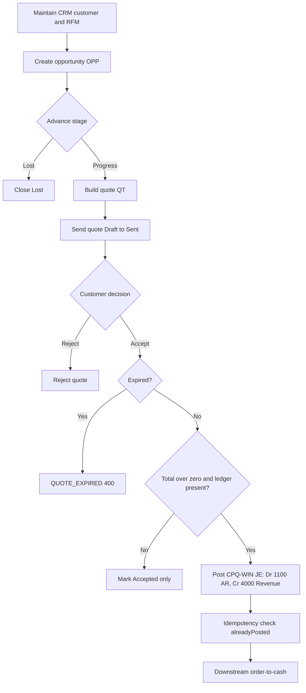

# Process Narrative — CRM, Sales Pipeline & CPQ (Quote-to-Win)

> **Status: DRAFT v0.1** — contains `<<placeholders>>` pending owner confirmation.

## 1. Document Control

| Field | Value |
|---|---|
| Process ID | PN-18-CPQ |
| Process owner | `<<Sales / Revenue Controller>>` |
| Approver | `<<approver-name / title>>` |
| Version | **0.1 DRAFT** |
| Revision date | 2026-06-22 |
| Effective date | `<<effective-date>>` |
| Review cadence | Annual + on significant change |
| Related RCM controls | CPQ-01, CPQ-02, CPQ-03; GL-01; REV-* (downstream); SoD rules R07, R09 |
| Related policy | `<<Revenue Recognition Policy>>`, `<<Pricing & Discount Authority Policy>>`, `<<Segregation-of-Duties Policy>>` |

## 2. Purpose

This narrative documents the front of the revenue cycle: the maintenance of customer master and credit data (CRM), the qualification of sales opportunities through a staged pipeline, and the configuration, pricing and acceptance of customer quotes (CPQ). It establishes how a quote is converted into a booked account-receivable entry, and the controls that ensure pricing integrity, discount governance, segregation of duties, and balanced general-ledger postings. It supports the organisation's quality-management commitment to defined, controlled processes (ISO 9001:2015 cl. 4.4) and its SOX internal-control objectives over revenue.

## 3. Scope

**In scope**
- Customer 360 / RFM segmentation and credit-relevant master data (CRM, `/api/crm`).
- Opportunity lifecycle and weighted forecast (pipeline, `/api/pipeline`).
- Product configuration, discount rules, quote issuance and quote acceptance posting AR/revenue (CPQ, `/api/cpq`).

**Out of scope**
- Booking of the sales order, fulfilment, invoicing and cash application — see `01-order-to-cash.md`.
- Promotions, price-list maintenance, pricing-rule engine and loyalty — see `19-marketing-pricing-loyalty.md`.
- Revenue recognition timing and deferred-revenue treatment — see `12-revenue-recognition-billing.md`.

## 4. References

- ISO 9001:2015 cl. 4.4 (Quality management system and its processes); cl. 8.1 (Operational planning and control); cl. 8.2 (Requirements for products and services — quotations).
- Risk & Control Matrix: `compliance/Oshinei_ERP_SOX_RCM_v1.xlsx`.
- Segregation-of-Duties matrix: `compliance/Oshinei_ERP_SoD_Matrix_v1.xlsx`.
- Policies: `<<Revenue Recognition Policy>>`, `<<Pricing & Discount Authority Policy>>`.
- Code:
  - `apps/api/src/modules/crm/crm.controller.ts`, `apps/api/src/modules/crm/crm.service.ts`
  - `apps/api/src/modules/pipeline/pipeline.controller.ts`, `apps/api/src/modules/pipeline/pipeline.service.ts`
  - `apps/api/src/modules/cpq/cpq.controller.ts`, `apps/api/src/modules/cpq/cpq.service.ts`

## 5. Definitions & Abbreviations

| Term | Definition |
|---|---|
| CRM | Customer Relationship Management; the 360-degree customer view and segmentation module. |
| RFM | Recency / Frequency / Monetary scoring, each scored 1–5, driving segments (Champions, Loyal, At Risk, Lost, New). |
| Pipeline | Staged sales opportunity progression: Prospect, Qualified, Proposal, Negotiation, Won, Lost. |
| CPQ | Configure–Price–Quote; product configuration, discount rules and customer quotations. |
| OPP- | Document prefix for an opportunity. |
| QT- | Document prefix for a quote. |
| Weighted value | `expectedValue × probability ÷ 100`, used in forecast. |
| Line total | `unitPrice × qty × (1 − discount ÷ 100)`. |
| AR | Accounts Receivable (GL account 1100). |
| JE | Journal Entry. |
| SoD | Segregation of Duties. |
| RCM | Risk & Control Matrix. |
| RLS | Row-Level Security (per-tenant isolation in Postgres). |

## 6. Roles & Responsibilities (RACI)

Segregation of duties is the design backbone of this process. Three independence rules apply: **R09** — the maintenance of customer credit master data must be segregated from sales order entry; **R10** — the maintenance of price-master and promotion rules must be segregated from selling; **R07** — the party initiating a quote must not be the party that approves/accepts it on a financially-significant value. Tenant isolation is enforced by Postgres RLS and JWT-scoped permissions (`crm`, `marketing`, `exec`, `masterdata`).

| Activity | Sales Rep | Revenue Controller | Sales Manager | Master Data Admin | Finance / GL |
|---|---|---|---|---|---|
| Maintain customer / credit master (CRM) | I | C | I | R | I |
| Refresh RFM segment | R | I | I | C | I |
| Create / move opportunity | R | I | C | I | I |
| Create product configuration & discount rules (CPQ) | I | C | I | R | I |
| Issue (send) quote | R | I | C | I | I |
| Accept quote (post AR/revenue JE) | I | A | R | I | C |
| Reject quote | R | I | A | I | I |
| Review weighted forecast | C | A | R | I | I |

A = Accountable, R = Responsible, C = Consulted, I = Informed.

## 7. Process Narrative

1. **Maintain customer 360 / RFM (CRM, perm `crm`).** A representative reviews the customer view via `GET /api/crm/profile/:memberId`, which returns the 360 profile and RFM scores (1–5 on recency, frequency, monetary). `POST /api/crm/profile/:memberId/refresh` recomputes the RFM segment (Champions / Loyal / At Risk / Lost / New). An unknown member returns `MEMBER_NOT_FOUND` (404). Eligible promotions are read via `GET /api/crm/promos/:memberId`; branch performance via `GET /api/crm/branch-kpi`. Audience rules are defined via `POST /api/crm/audience-rules` (perm `marketing`). *Control: CPQ-01 / R09 — credit-relevant master maintenance is segregated from order entry. Operational for pure-analytics reads.*

2. **Manage the opportunity (pipeline, perm `crm`).** A rep creates an opportunity with `POST /api/pipeline/opportunities` (doc prefix `OPP-`), lists via `GET /api/pipeline/opportunities`, advances stages with `POST /api/pipeline/opportunities/:id/move`, and logs touches via `POST` / `GET /api/pipeline/opportunities/:id/activities`. Each stage (Prospect, Qualified, Proposal, Negotiation, Won, Lost) carries a win probability. Closing is via `POST /api/pipeline/opportunities/:id/close` (Won or Lost). Unknown ids return `OPP_NOT_FOUND` (404); an invalid stage returns `STAGE_NOT_FOUND` (404). *Operational.*

3. **Review weighted forecast (perm `exec`).** `GET /api/pipeline/forecast` computes `weighted_value = expectedValue × probability ÷ 100` per stage. *Operational — management reporting; not a GL source.*

4. **Configure product & discount rules (CPQ).** Configurations are read/created via `GET` / `POST /api/cpq/configs` (create requires perm `masterdata`). Options carry a `price_delta` (`POST /api/cpq/configs/:id/options`); volume-discount rules carry `min_qty` and `discount_pct` (`POST /api/cpq/configs/:id/rules`). Unknown configs return `CONFIG_NOT_FOUND` (404). *Control: CPQ-02 / R10 — discount-rule maintenance is segregated from selling.*

5. **Build the quote (perm `exec`).** A quote is created via `GET` / `POST /api/cpq/quotes` (doc prefix `QT-`; default `validity_days` = 30). Each line computes `lineTotal = unitPrice × qty × (1 − discount ÷ 100)`; lines are read via `GET /api/cpq/quotes/:id/lines`. *Control: CPQ-01 — quote integrity (line maths, validity window).*

6. **Send the quote.** `POST /api/cpq/quotes/:id/send` transitions Draft → Sent. An illegal transition returns `INVALID_TRANSITION` (400). *Control: R07 — the initiating rep sends; acceptance is a separate authority.*

7. **Accept the quote — financially significant.** `POST /api/cpq/quotes/:id/accept` transitions Sent → Accepted. If the quote is past its `expiresDate`, it returns `QUOTE_EXPIRED` (400). When the quote total is greater than zero and a ledger is present, the system posts a balanced JE (GL source `CPQ-WIN`, ref = quote number):

   | Account | Dr | Cr |
   |---|---|---|
   | 1100 Accounts Receivable | quote total | |
   | 4000 Sales Revenue | | quote total |

   The posting is **idempotent**: a prior posting (`alreadyPosted('CPQ-WIN', quoteNo)`) is detected and not duplicated. *Controls: CPQ-03 (quote-accept GL posting), GL-01 (balanced JE), R07 (accept authority segregated from initiation).*

8. **Reject the quote.** `POST /api/cpq/quotes/:id/reject` records a declined outcome. Unknown quotes return `QUOTE_NOT_FOUND` (404). *Operational.*

The booked AR then flows downstream to order, invoicing and collection — see `01-order-to-cash.md`.

## 8. Process Flow

**Swimlane narrative.** The *Sales Rep* lane owns CRM review, opportunity progression and quote build/send. The *Master Data Admin* lane owns configuration and discount-rule maintenance (segregated under R10). The *Revenue Controller / Sales Manager* lane owns quote acceptance, which is the control gate where the AR/revenue JE is posted (R07, GL-01). The *Finance / GL* lane consumes the posted entry and reconciles it against downstream order-to-cash bookings.

## 9. Control Matrix

| Step | Risk | Control | Type | RCM ID | Evidence / Record |
|---|---|---|---|---|---|
| 1 | Credit master altered by order-entry staff (collusion / unauthorised limits) | Permission split (`crm` vs order entry); RLS tenant scope | Preventive | CPQ-01 / R09 | CRM audit log, permission grants |
| 2–3 | Inflated pipeline / forecast misstatement | Forecast is non-posting; weighted value formula fixed in code | Operational | — | Pipeline export, forecast snapshot |
| 4 | Unauthorised discount rule (margin erosion) | Config/rule create gated to `masterdata`, segregated from selling | Preventive | CPQ-02 / R10 | Config change log |
| 5 | Quote line miscalculation | Server-computed `lineTotal`; validity window enforced | Preventive | CPQ-01 | Quote record, line snapshot |
| 6 | Self-approval of own quote | Send (rep) separated from accept (controller) | Preventive | R07 | Status transition log |
| 7 | Unbalanced or duplicate revenue posting; expired quote booked | Balanced JE (Dr 1100 / Cr 4000); idempotency on `CPQ-WIN`+quoteNo; `QUOTE_EXPIRED` guard | Preventive / Detective | CPQ-03, GL-01 | GL entry `CPQ-WIN`, idempotency key |
| 8 | Stale quote acceptance | State machine rejects illegal transitions (`INVALID_TRANSITION`) | Preventive | CPQ-01 | Transition log |

## 10. Inputs & Outputs

**Inputs:** customer master & credit data; product/config catalogue; discount and volume-rule definitions; opportunity stage probabilities; user JWT (tenant + permission claims).

**Outputs:** RFM segments; opportunity records (`OPP-`); weighted forecast; quotes (`QT-`) and quote lines; balanced AR/revenue JE (`CPQ-WIN`); accepted/rejected quote status feeding `01-order-to-cash.md`.

## 11. Records & Retention

| Record | Retention |
|---|---|
| Quotes, quote lines, acceptance evidence | `<<7 years / per Thai law>>` |
| GL entries (`CPQ-WIN`) | `<<7 years / per Thai law>>` |
| CRM credit-master change log | `<<7 years / per Thai law>>` |
| Opportunity & forecast snapshots | `<<retention per policy>>` |

## 12. KPIs / Metrics

- Quote-to-win conversion rate (Accepted ÷ Sent).
- Average discount % vs approved discount-rule ceiling.
- Forecast accuracy: weighted forecast vs actual booked AR.
- Quote cycle time (Draft → Accepted).
- Count of `QUOTE_EXPIRED` and `INVALID_TRANSITION` events (control-health indicator).

## 13. Exception & Error Handling

| Error code | Trigger | Handling |
|---|---|---|
| MEMBER_NOT_FOUND (404) | CRM profile / promos for unknown member | Reject; verify member id; no posting. |
| OPP_NOT_FOUND (404) | Operation on unknown opportunity | Reject; refresh list. |
| STAGE_NOT_FOUND (404) | Move to undefined stage | Reject; use defined stage set. |
| CONFIG_NOT_FOUND (404) | Option/rule on unknown config | Reject; create config first. |
| QUOTE_NOT_FOUND (404) | Action on unknown quote | Reject; verify quote number. |
| QUOTE_EXPIRED (400) | Accept past `expiresDate` | Block acceptance; re-issue quote. |
| INVALID_TRANSITION (400) | Illegal status change | Block; follow Draft→Sent→Accepted/Rejected. |

## 14. Revision History

| Version | Date | Author | Notes |
|---|---|---|---|
| 0.1 DRAFT | 2026-06-22 | `<<author>>` | Initial draft. |
