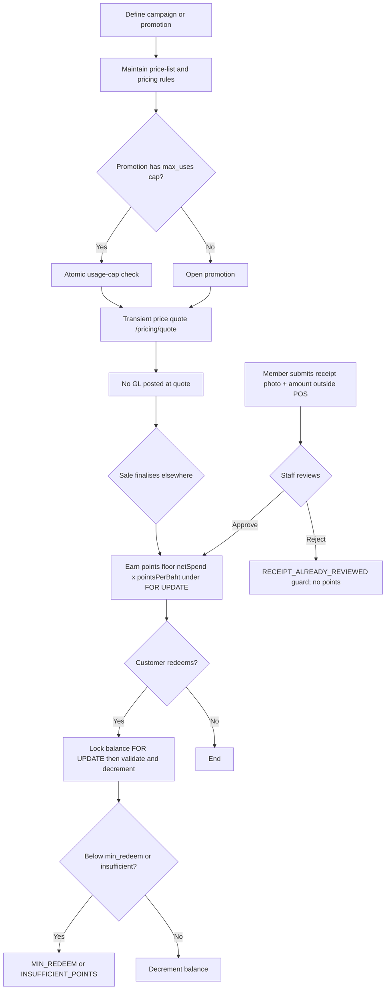

# Process Narrative — Marketing, Pricing & Loyalty

> **Status: DRAFT v0.1** — contains `<<placeholders>>` pending owner confirmation.

## 1. Document Control

| Field | Value |
|---|---|
| Process ID | PN-19-MKT |
| Process owner | `<<Marketing / Revenue Controller>>` |
| Approver | `<<approver-name / title>>` |
| Version | **0.1 DRAFT** |
| Revision date | 2026-07-13 (v1.48) |
| Effective date | `<<effective-date>>` |
| Review cadence | Annual + on significant change |
| Related RCM controls | MKT-01, MKT-02, MKT-03, MKT-04, MKT-13, PDPA-05, REV-20; SoD rule R10 |
| Related policy | `<<Pricing & Discount Authority Policy>>`, `<<Promotions Policy>>`, `<<Loyalty Programme Terms>>`, `<<Segregation-of-Duties Policy>>` |

## 2. Purpose

This narrative documents the marketing, pricing and loyalty processes: campaign and segment management, promotion definition, price-list and pricing-rule maintenance, transient price quotation, and loyalty points earn/redeem. Its primary control objective is **pricing-change integrity** — ensuring that price-master, promotion and pricing-rule changes are governed and segregated from selling — together with the protection of the loyalty points liability against concurrency loss and double-spend. These processes are upstream value drivers; they do not themselves post revenue, which is recognised when an order or sale finalises (see cross-references).

## 3. Scope

**In scope**
- Campaigns, segments, A/B tests, abandoned-cart reminders, surveys/NPS (marketing, `/api/marketing`, `/api/surveys`, `/api/portal/surveys`).
- Promotions and price-lists (`/api/promotions`, `/api/price-list`).
- Pricing rules, combos and transient price quotation (pricing, `/api/pricing`).
- Loyalty configuration, enrolment, earn and redeem (loyalty, `/api/loyalty`).
- **Member directory & 360, PDPA per-purpose consent, and points-liability tie-out** (loyalty, `/api/loyalty/members`, `/api/loyalty/members/:id/consents`, `/api/loyalty/liability`) — **CRM Phase 1**.

**Out of scope**
- Posting of revenue at order/sale finalisation — see `01-order-to-cash.md` and `20-restaurant-operations.md`.
- Gift cards and store-credit deposit liability (account 2200) — see `22-gift-cards-store-credit.md`.
- CRM 360/RFM credit master and CPQ quote acceptance — see `18-crm-pipeline-cpq.md`.

## 4. References

- ISO 9001:2015 cl. 4.4 (QMS and its processes); cl. 8.2 (Requirements for products and services); cl. 8.5.1 (Control of provision — pricing application).
- Risk & Control Matrix: `compliance/Oshinei_ERP_SOX_RCM_v1.xlsx`.
- Segregation-of-Duties matrix: `compliance/Oshinei_ERP_SoD_Matrix_v1.xlsx`.
- Policies: `<<Pricing & Discount Authority Policy>>`, `<<Promotions Policy>>`, `<<Loyalty Programme Terms>>`.
- Code:
  - `apps/api/src/modules/marketing/marketing.controller.ts`, `apps/api/src/modules/marketing/marketing.service.ts`, `apps/api/src/modules/marketing/promo-engine.service.ts`
  - `apps/api/src/modules/pricing/pricing.controller.ts`, `apps/api/src/modules/pricing/pricing.service.ts`
  - `apps/api/src/modules/loyalty/loyalty.controller.ts`, `apps/api/src/modules/loyalty/loyalty.service.ts`, `apps/api/src/modules/loyalty/member.service.ts`
  - Consolidated under `modules/loyalty/` (docs/28 PR #4): `loyalty/engagement/` (rewards, referrals, wheels, gamification), `loyalty/analytics/`, `loyalty/member/` (member self-service auth) — same modules/routes, folder move only

## 5. Definitions & Abbreviations

| Term | Definition |
|---|---|
| Campaign | A marketing initiative with active/inactive state. |
| Segment | RFM-lite grouping: VIP, Loyal, At Risk, New, Regular. |
| A/B test | Split test reporting CTR (click-through) and CVR (conversion). |
| Promotion | A discount mechanic: Percent, Amount, BuyXGetY, Bundle, MinSpend, FreeGift. |
| Price-list | Catalogue price; effective price = `special > 0 ? special : base × (1 − discount ÷ 100)`. |
| Pricing rule | Rule of type percent / amount / fixed / bogo / qty_break, scoped item / category / all, with stackable flag, priority and day-of-week/time/channel/date gates. |
| Combo | A SKU that explodes into component lines during quotation. |
| Satang | 1/100 of a Thai Baht; quotes are satang-rounded. |
| Loyalty points | A customer sub-ledger balance; earn = `floor(netSpend × pointsPerBaht)`. |
| FOR UPDATE | Postgres row lock serialising read-modify-write on the balance. |
| NPS | Net Promoter Score (survey metric). |
| SoD | Segregation of Duties. |

## 6. Roles & Responsibilities (RACI)

The defining SoD rule here is **R10**: the maintenance of price-master, promotions and pricing rules must be segregated from selling, because a single party able to both set price and sell creates a margin-theft / self-dealing risk. R10 is now enforced not only across the *maintain-vs-sell* boundary but **within pricing-rule maintenance itself as maker-checker**: a rule change is staged inactive and a **different** user must activate it (self-approval → `SOD_VIOLATION`), so no single party can put a discount live unreviewed (see §7 item 5). Loyalty configuration (which sets the monetary value of points) is likewise segregated from the point-of-sale operators who earn and redeem. Permissions (`marketing`, `loyalty`, `pos`, `order_mgt`, `pricelist`, `approvals`, `exec`, `cust_pos`) are JWT-scoped and tenant-isolated by RLS.

| Activity | Marketing | Revenue Controller | Pricing / Master Data | POS Operator | Loyalty Admin |
|---|---|---|---|---|---|
| Create / toggle campaign | R | I | I | I | I |
| Define / toggle promotion | R | A | C | I | I |
| Maintain price-list | C | A | R | I | I |
| Maintain (stage) pricing rules / combos | I | A | R | I | I |
| Approve / activate a staged pricing rule | I | A (R) | C | I | I |
| Apply price at quote (`/pricing/quote`) | I | I | C | R | I |
| Configure loyalty (`/loyalty/config`) | C | A | I | I | R |
| Enrol member | R | I | I | C | R |
| Earn / redeem points | I | I | I | R | C |

A = Accountable, R = Responsible, C = Consulted, I = Informed.

## 7. Process Narrative

1. **Campaigns & segments (perm `marketing`).** Campaigns are created/listed via `POST` / `GET /api/marketing/campaigns`, toggled via `PATCH /api/marketing/campaigns/:id/toggle`, and active ones read via `GET /api/marketing/campaigns/active`. Segments (VIP / Loyal / At Risk / New / Regular) are read via `GET /api/marketing/segments`. A/B tests (`POST` / `GET /api/marketing/ab-tests`) report CTR/CVR. Abandoned-cart nudges fire via `POST /api/marketing/abandoned-carts/remind`. *Operational.*

2. **Promotions (perm `marketing`).** Promotions are created/listed via `GET` / `POST /api/promotions` and toggled via `PATCH /api/promotions/:id/toggle`. Types: Percent, Amount, BuyXGetY, Bundle, MinSpend, FreeGift; doc id `PROMO-{timestamp}`. An unrecognised type returns `BAD_PROMO_TYPE` (400). Each promotion may carry a `max_uses` cap. *Controls: MKT-01 / R10 (promotion change governance), MKT-02 (usage cap).*

3. **Price-lists (perm `marketing`).** Price-lists are read/maintained via `GET` / `POST /api/price-list`. Effective price = `special > 0 ? special : base × (1 − discount ÷ 100)`. *Control: MKT-01 / R10 — price-master maintenance segregated from selling.*

4. **Surveys / NPS (perm `marketing`).** Surveys and responses are managed via `GET` / `POST /api/surveys` (and responses), with a public customer route at `/api/portal/surveys`, producing NPS. Unknown ids return `NOT_FOUND` (404). *Operational.*

5. **Pricing rules & combos (maintain perm `pricelist` / `exec`; approve `exec` / `approvals`; quote also `cust_pos`).** Rules are managed via `GET` / `POST /api/pricing/rules`, `GET /api/pricing/rules/:id`, `DELETE /api/pricing/rules/:id`. Rule types: percent, amount, fixed, bogo, qty_break; scope item / category / all; with `stackable` flag, `priority`, and day-of-week / time / channel / date gates. **A price/promo rule change is now maker-checker (R10; migration `0262` adds `status` / `approved_by` / `approved_at` to `price_rules`, legacy rows default `status='Active'`).** `POST /api/pricing/rules` (create OR edit) **stages** the rule `status='PendingApproval'`, `active=false` and returns `{ id, status:'PendingApproval', pending:true }` — the discount engine reads **only `active=true`** rules, so a staged rule affects **no** quote or sale; editing a live rule **re-stages** it (goes inactive) until re-approved. A **different** user activates it via `POST /api/pricing/rules/:id/approve` — only on approval does `active` become `true` and `status` `'Active'`; the author self-approving (`createdBy === approver`) is rejected `403 SOD_VIOLATION`. There is also `POST /api/pricing/rules/:id/reject` and the pending queue `GET /api/pricing/rules/pending`. Combos are maintained via `GET` / `PUT /api/pricing/combos/:sku`. Unknown ids return `NOT_FOUND` (404). *Control: MKT-01 / R10 — a price/promo rule affects no sale until independently approved. Residual: combo component prices (`PUT /api/pricing/combos/:sku`) are **not yet** staged — lower risk, flagged as a follow-up.*

6. **Transient price quote.** `POST /api/pricing/quote` explodes combos, applies eligible rules by priority/stackability, adds a service charge if party size ≥ configured minimum, applies surcharge, and satang-rounds. **No GL is posted** — pricing is transient; the GL is posted when the order/sale finalises elsewhere (`01-order-to-cash.md`, `20-restaurant-operations.md`). *Operational (non-financial at this step).*

6a. **Pricing rules applied at the till (B4).** Dine-in checkout (`POST /api/restaurant/orders/:orderNo/checkout`) can opt in with `apply_pricing_rules` so the same item/category/time-day/BOGO/qty-break + order-level rules **apply to the finalised sale** (not just the preview), flowing through the existing discount → VAT-on-discounted-base → markdown-cap path (explicit per-line/promo discounts take precedence). An **auto service charge** for large parties posts as VATable service income (GL **4400**), and **satang rounding** posts the rounding gain/loss (GL **4900**); the sale's GL stays balanced. Rule discounts are governed by the same R10 segregation (price/promo maintenance ≠ selling) — a cashier applies rules but cannot author them. *Control: MKT-01 / R10; GL posting per `20-restaurant-operations.md`.*

7. **Loyalty configuration (perm `loyalty` / `marketing`).** `GET` / `PUT /api/loyalty/config` sets `points_per_baht`, `baht_per_point`, `min_redeem`, `expiry_days`, and (W1, docs/27) `transfer_day_cap` — the per-member daily ceiling on outgoing P2P point transfers (`0` disables the transfer feature entirely). *Control: MKT-03 — config sets the monetary value of the points liability; segregated from POS operators.*

8. **Enrol & look up members.** `POST /api/loyalty/members` enrols a member (code `M-{id}`); `GET /api/loyalty/members/lookup`, `GET /api/loyalty/members/:id` and `/history` read membership. `GET /api/loyalty/me` returns the caller's balance. Duplicate enrolment returns `MEMBER_EXISTS`; unknown member returns `MEMBER_NOT_FOUND`. **LINE OA identity (the dominant Thai channel):** `POST /api/loyalty/members/enroll-line` enrols-or-returns a member from a **verified LINE id token** (LIFF / LINE Login — real verification when `LINE_LOGIN_CHANNEL_ID` is set, a `mock:<userId>` token in dev), idempotent on the LINE account; `POST /api/loyalty/members/:id/link-line` links a LINE identity to an existing member (`LINE_ALREADY_LINKED` if that account is already on another member — one LINE account = one member per tenant, unique-indexed); `GET …/lookup?line_user_id=` resolves by LINE id. The stored `line_user_id` is the push address used by CRM messaging. *Operational.*

8a. **Member directory & 360 (CRM Phase 1; perm `loyalty` / `marketing` / `crm`).** `GET /api/loyalty/members?q&segment&tier&active&limit&offset` lists members — searchable by name / phone / card / code and left-joined to the RFM segment from `customer_profiles`. The web **Member 360** (`/loyalty/members/:id`) composes the member's balance, lifetime, RFM profile, points history and consent in one view. Read-only and tenant-isolated by RLS; it supports detective review of the points sub-ledger and member master. *Operational / detective.*

9. **Earn points (at POS checkout).** Inside the checkout transaction, points = `floor(netSpend × pointsPerBaht × tier earn-multiplier)` are credited **under a `FOR UPDATE` lock** on the balance row, so two concurrent checkouts cannot lose an increment. **Tier economics (W1, docs/27):** the member's tier — the highest active `loyalty_tiers` rung whose `min_lifetime` the **locked** lifetime has reached (the same rule the tier auto-recompute uses, step 18) — supplies `earn_mult` (default ×1), so a Gold member configured at ×2 earns double on the *real* earn path, not just `quoteEarn`'s preview; a multiplied earn audits the tier + factor in the ledger row's `notes`. **The GL stays honest for free:** the TFRS-15 liability accrual (steps 13/15) derives from the points *ledger*, so a 2× earn simply accrues 2× liability — no accrual-logic change. *Control: MKT-03 — concurrency-safe earn; points are a sub-ledger balance, settled as a revenue reduction at the sale (no separate GL).*

10. **Redeem points.** `POST /api/loyalty/redeem` locks the balance row **`FOR UPDATE`**, then reads, validates and decrements under the lock to prevent double-spend. It enforces the minimum-redeem floor and sufficiency. Errors: `INSUFFICIENT_POINTS`, `MIN_REDEEM`, `BAD_POINTS`, `LOYALTY_DISABLED`. *Control: MKT-03 — points liability integrity.*

11. **CRM messaging (consented).** Members carry a `birthday` and a `marketing_opt_in` consent flag (`PATCH /api/loyalty/members/:id`); `GET /api/loyalty/members/birthdays?window=today|month` lists upcoming birthdays. `POST /api/messaging/send` (one member) and `POST /api/messaging/blast` (audience = all / `birthdays_today` / RFM `segment` / a `saved_segment` by id) send via a provider-agnostic gateway (LINE / SMS / email — real provider when its credentials are configured, otherwise a logged **mock**), and **every send respects consent** — an opted-out member is recorded as `skipped`, never contacted. A **LINE** message is pushed to the member's linked **`line_user_id`** (the LINE Messaging API push address; a member with no linked LINE account is recorded `failed`, never mis-sent to a phone number); email→email, otherwise the phone. All deliveries are written to an append-only `message_log` (`GET /api/messaging/log`) carrying the provider's message id (`provider_ref`); a provider that supports delivery receipts can then call back `POST /api/messaging/delivery-callback/:tenantCode` (token-guarded, tenant-scoped) to advance a row `sent → delivered`/`undelivered`. **PDPA per-purpose consent register (CRM Phase 1):** `GET` / `POST /api/loyalty/members/:id/consents` records consent per purpose (marketing / profiling / line / sms / email) in `member_consents` (one row per member×purpose; `granted_at` / `withdrawn_at` audit the change). Setting the `marketing` purpose **syncs** `pos_members.marketing_opt_in`, so the blast's existing opt-out enforcement is driven by the register — withdrawing consent stops marketing sends immediately. *Control: MKT-04, MKT-05 — granular consent governance + auditable delivery.*

12. **Points-liability tie-out (CRM Phase 1; perm `loyalty` / `marketing` / `exec` / `gl_post`).** `GET /api/loyalty/liability?tenant_id?` reports the outstanding points sub-ledger (`Σ pos_members.balance` over **all** members — the obligation stands regardless of an `active` flag; forfeiture must be an explicit ledger Adjust) valued at the configured fair value (`baht_per_point`) as the carrying amount of **GL control account 2250 — Loyalty Points Liability**, together with `posted_liability` (already accrued to 2250 via posting runs) and `unposted_value` (the book-to-sub-ledger gap), plus earn/redeem/adjust movements from `pos_member_ledger`. The endpoint is **explicitly tenant-scoped** — RLS is bypassed for Admin, so an HQ/Admin caller must pass `tenant_id` (else `TENANT_REQUIRED`). *Control: MKT-06 — points-liability sub-ledger tie-out.*

13. **Points-liability GL accrual (CRM Phase 1.5; perm `gl_post` / `exec`).** `POST /api/loyalty/liability/post` reconciles GL control account **2250** to outstanding points × fair value by posting the delta since the last run — a **provision** model: a net grant ⇒ `Dr 5700 Loyalty Points Expense / Cr 2250`; a net redemption/forfeiture ⇒ `Dr 2250 / Cr 5700`. (On a redemption the checkout already reduces revenue by the discount; the 5700 grant-expense and its release on redemption cancel, leaving that revenue reduction as the single net P&L charge — no double-count.) The run is **watermarked** on `pos_member_ledger.id` and **idempotent** (deterministic `sourceRef` + the GL `ux_je_idem` unique index + a unique `(tenant_id, watermark_id)` on `loyalty_posting_runs`); it posts via `LedgerService.postEntry` as a system entry (immediately **Posted**, dated to the open Asia/Bangkok business period — a closed period is rejected `PERIOD_CLOSED`), is **tenant-scoped** (`TENANT_REQUIRED` for an HQ/Admin caller with no tenant), and does **not** touch the parity-locked checkout earn/redeem path. The accrual also runs **automatically at period close**: `POST /api/ledger/periods/:period/close` and the year-end `closeYear` accrue the liability to the period *before* locking it (dated within the period; at year-end the resulting `5700` expense is closed to Retained Earnings, the `2250` liability stays on the balance sheet) — best-effort, so a loyalty hiccup never blocks the financial close. *Control: MKT-06 — automated, idempotent liability accrual; proven by the LYL-03/05 ICFR harness.*
   - *Known limitation (roadmap): a fair-value (`baht_per_point`) change with no subsequent points activity is re-measured only at the next activity (the watermark gates on ledger movements).*

14. **Points expiry / breakage (CRM Phase 1.5; perm `loyalty` / `exec`).** `POST /api/loyalty/expire` expires points per the configured `expiry_days` using the `redeemable()` model — points earned more than `expiry_days` ago, net of redemptions, are written off as an append-only `pos_member_ledger` row (`txn_type='Expire'`, negative points) that decrements the member balance under a `FOR UPDATE` lock. Idempotent (a second run finds the balance already at the redeemable floor and expires nothing more); tenant-scoped (`TENANT_REQUIRED`). The next liability accrual (or the period-close hook) then **releases** the corresponding liability — `Dr 2250 / Cr 5700` (breakage). Because the original sale recognised full revenue (no deferral), the grant-time `5700` provision and its expiry release net to zero P&L for never-redeemed points — internally consistent for this codebase. *Control: MKT-06 — breakage de-recognition; proven by the LYL-04 ICFR harness.*

15. **Scheduled maintenance sweep (CRM Phase 1.5; perm `exec` / `gl_post` / `masterdata`).** `POST /api/loyalty/maintenance/run` runs the whole maintenance cycle in one call — for each tenant: **expire** aged points, then **accrue/release** the liability — so the GL stays current with no manual steps. An Admin caller sweeps **all** tenants (RLS bypass); a tenant user sweeps only its own (RLS); `tenant_id` limits it to one. It is **best-effort per tenant** — one tenant's closed period or error is recorded in `results[]` and never aborts the others. The API has **no in-process scheduler** (multi-instance-safe), so the sweep is driven by an **external scheduler**: the repo ships a daily GitHub Actions workflow (`.github/workflows/loyalty-maintenance.yml`, opt-in via repo-level `PROD_API_URL` / `SWEEP_USER` / `SWEEP_PASS`); a cloud cron or `curl` works equally. **Expiry look-ahead (W1, docs/27):** after expiring and re-accruing, the sweep scans each tenant for members whose points will expire **within the next 30 days** (the `expireForTenant` math with the cutoff shifted forward) and fires **`loyalty.points_expiring`** (`{member_id, expiring_points, days_left, expire_by}`) into the webhook fan-out + the no-code automation catalog — a marketer wires it to a journey/message ("แต้ม 500 จะหมดอายุใน 30 วัน") through the usual consent-respecting path. **Idempotent per member × expire-by date** via the `loyalty_expiry_notices` unique register (migration `0221`) — a daily sweep re-fires only when a *new* batch approaches expiry, never re-nagging about the same one. *Control: MKT-06 — automated maintenance; proven by the LYL-06 ICFR harness (+ the W1 loyalty-harness expiring checks).*

16. **Rewards catalog & point-burn redemption (CRM Phase 2; config `marketing`/`exec`, redeem `loyalty`/`pos`).** A `loyalty_rewards` catalog (`GET` / `POST` / `PATCH /api/loyalty/rewards`) defines redeemable rewards (`evoucher` / `discount` / `product` / `privilege`) with `point_cost`, `cash_value`, optional `stock`, `per_member_limit`, `tier_min` and a validity window. `POST /api/loyalty/rewards/:id/redeem` **burns points**: under a `FOR UPDATE` lock on the member it validates eligibility (sufficient balance, `tier_min`, stock via an atomic `stock > 0` guard, per-member limit), decrements the balance, writes a `pos_member_ledger` **Redeem** row (so the liability accrual releases `Dr 2250 / Cr 5700` — no separate GL here), and issues a **single-use** `loyalty_redemptions` row with a scannable `RDM-YYYYMMDD-NNN` code. Errors: `INSUFFICIENT_POINTS`, `TIER_TOO_LOW`, `OUT_OF_STOCK`, `LIMIT_REACHED`, `REWARD_EXPIRED`. *Control: MKT-07 — point-burn integrity + single-use codes.*

17. **Use codes at POS & coupon wallet (CRM Phase 2; use `pos_sell`/`pos`/`order_mgt`).** `POST /api/loyalty/redemptions/:code/use` marks a redemption **used exactly once** — a one-way `issued → used` transition under a `FOR UPDATE` status check (a second use → `ALREADY_USED`; past expiry → `REDEMPTION_EXPIRED`), recording the `sale_no`. Free coupons (campaign / birthday / referral / manual) are issued via `POST /api/loyalty/coupons/issue` (`member_coupons`, `CPN-…`) and used once via `POST /api/loyalty/coupons/:code/redeem`; the member **wallet** is `GET /api/loyalty/members/:id/wallet`. Catalog/coupon **config** (`marketing`/`exec`) is segregated from **POS redemption** (`pos_sell`) — the **R14** intent enforced by endpoint gating (the formal `crm_reward` permission + R14 SoD rule remain staged). *Residual:* a coarse role holding both `marketing` and `pos_sell` (e.g. `Sales`) can perform both sides — a known coarse-role bundling the existing SoD analysis already flags, resolved when the granular `crm_reward` role ships. All reward/redemption/coupon reads & writes are **explicitly tenant-scoped** (RLS is bypassed for Admin — adversarial review). *Control: MKT-07 — single-use redemption; config ≠ till.*

18. **Tier ladder & auto-recompute (CRM Phase 3).** `loyalty_tiers` defines tiers by `min_lifetime` (with earn/redeem multipliers). `POST /api/loyalty/tiers/recompute` (and the daily maintenance sweep — step 15) recomputes each member's tier from their lifetime points; on a change it updates `pos_members.tier` and appends a `loyalty_tier_history` audit row under a `FOR UPDATE` member lock. `GET /api/loyalty/members/:id/tier` returns the **tier journey** (current tier, next tier, points to next, progress %). Explicitly tenant-scoped. *Control: MKT-08 — auditable tier changes.*

19. **Missions / stamp cards (CRM Phase 3; config `marketing`/`exec`, progress `pos_sell`, claim `loyalty`/`pos`).** `loyalty_missions` (`stamp` / `quest`, a `goal`, and a reward of bonus points or a coupon). `POST /api/loyalty/missions/:id/progress` records progress (e.g. a stamp at the till; serialized per member under a `FOR UPDATE` lock so the get-or-create is race-free). `POST /api/loyalty/missions/:id/claim` grants the reward **exactly once** — `claimedAt` is set under a `FOR UPDATE` lock on the member + progress row; a second claim → `ALREADY_CLAIMED`, an incomplete mission → `MISSION_INCOMPLETE`. A **points** reward writes a `pos_member_ledger` **Adjust** row (balance + lifetime increase → the liability accrues on the next run and the tier can promote at recompute; Adjust points are non-aging); a **coupon** reward issues a `member_coupons` row. `GET /api/loyalty/members/:id/missions` lists a member's missions + progress. *Control: MKT-08 — single-claim mission rewards.*

20. **Member-get-member referrals (CRM Phase 4; refer `loyalty`/`marketing`/`pos`, reward `loyalty`/`marketing`/`exec`).** `POST /api/loyalty/referrals` records a referral (a member refers another by member id or phone) — self-referral → `SELF_REFERRAL`; a member can be referred at most once → `ALREADY_REFERRED` (partial unique on `referred_member_id`). `POST /api/loyalty/referrals/:id/reward` grants both sides their bonus points **exactly once** — `status` flips to `rewarded` under a `FOR UPDATE` lock on the referral row (a second call → `ALREADY_REWARDED`; an un-enrolled referred member → `REFERRED_NOT_LINKED`); each grant is a `pos_member_ledger` **Adjust** row (so the liability accrues and tiers can promote at recompute). `GET /api/loyalty/members/:id/referrals` lists a member's referrals. Explicitly tenant-scoped. *Control: MKT-08 — single-reward referrals.*

21. **Member self-service app — phone-OTP login (CRM Phase 4; new MEMBER principal).** Members get a standalone consumer surface (web `/m`, mobile-first) — **not** the staff app. `POST /api/member/auth/request-otp` (`@Public`) resolves the member by **shop code + phone** (explicit tenant filter; RLS is bypassed on public routes), issues a **single-use, 5-minute, scrypt-hashed** 6-digit OTP (cryptographically random; rate-limited to one live code / 60 s; delivered by SMS as a **transactional** message, so not subject to marketing opt-out — sent through the tenant's **own** SMS provider when configured, else the platform env, else mock, per rev 1.11/1.22), and **always** returns `{sent:true}` so it never leaks whether a phone is enrolled. `POST /api/member/auth/verify-otp` checks the code under expiry + a ≥5-attempt bound, consumes it, and mints a **member JWT** `{ role:'Member', tenantId, memberId, permissions:[] }` (7-day, `jti`-bearing → revocable). **The token is delivered as an `httpOnly` cookie** (`ierp_token`) + a readable CSRF cookie (`ierp_csrf`), so the consumer `/m` app holds **no** token in `localStorage` (XSS can't exfiltrate it) — paired with the staff cookie/CSRF model under **ITGC-AC-07**; the token is still returned in the body for non-browser clients (LINE LIFF native). Member mutations send the `X-CSRF-Token` double-submit (enforced by the shared `JwtAuthGuard`), and `POST /api/member/auth/logout` (`@Public`) denylists the member jti (`revoked_tokens`) and clears the cookies. Every other route — `GET /api/member/me|tier|history|wallet|rewards|missions|referrals`, `POST /api/member/rewards/:id/redeem|missions/:id/claim|refer` — is gated by `MemberGuard` (rejects any non-member token) and is **self-scoped**: the member is taken from the token (`memberId`), so there is no member-id input and a member can only ever act on **themselves**. Because the token carries `permissions:[]`, it is rejected by **every** `@Permissions`-gated staff route; because `role` is not `Admin`, the per-request RLS tx scopes all reads to the member's own tenant. The app reuses the existing (reviewed) rewards/missions/referrals services unchanged; `createReferral` was hardened to resolve a `referred_phone` to an enrolled member (immediate link) and block self-referral by phone. **LINE LIFF wrapper (post-docs/29):** with `NEXT_PUBLIC_LIFF_ID` set, opening /m inside LINE performs a one-tap login — the LIFF SDK (loaded from LINE's CDN only in-client) provides a **verified id_token** exchanged at `POST /api/member/auth/line` (the existing verifier: prod → LINE token endpoint, dev → mock token); an unlinked LINE account falls back to the normal OTP login and then auto-links (`POST /api/member/link-line`, best-effort) so every later open is one-tap. The id_token always comes from the SDK, never from the URL (CWE-598); shop code rides the LIFF query (`?shop=`) or the device's last login. No backend change — the wrapper is presentation over LYL-10's principal. **Wallet passes (V5, docs/29):** `POST /api/member/wallet-pass` (MemberGuard, self-scoped; body `{platform:'apple'|'google'}`) puts the member card in the phone wallet. The provider seam mirrors messaging: per-tenant creds (`tenant_messaging_config` channels `wallet-apple`/`wallet-google`) → platform env (`WALLET_APPLE_*` signing cert / `WALLET_GOOGLE_*` service account) → a deterministic **mock** (payload + fake install link) — the feature ships mock-first and activates by ops setting the creds, exactly like SMS/LINE before their credentials existed. One registration per member×platform (`wallet_pass_registrations`, migration `0226`, unique index — a re-issue is idempotent), and the **pass payload is PDPA-minimal: shop, member_code, name, tier, points — nothing else** (the LYL-19 resolve-payload discipline). A BiLive loyalty tick (earn/redeem) bumps the registration's `updates_count`/`last_points` best-effort so the pass surface tracks the live balance; staff see registrations on `GET /api/loyalty/members/:id/wallet-pass`. **No new control** — presentation layer riding LYL-10's self-scoping (flagged for audit sign-off). *Control: LYL-10 / ITGC-AC — member token cannot reach staff functions; OTP single-use + tenant-scoped.*

22. **Spin-the-wheel / lucky draw (CRM Phase 4; config `marketing`/`exec`, spin `pos_sell`/`pos`/`loyalty`).** `loyalty_wheels` (a `cost_points` to spin and `daily_free_spins`) with weighted `loyalty_wheel_segments` (`points` / `coupon` / `none`, a `weight`, and optional `stock`). `POST /api/loyalty/wheels/:id/spin` (members self-spin via `POST /api/member/wheels/:id/spin`) draws **one** segment **server-side** with a cryptographic (`node:crypto`) weighted RNG over the in-stock, positive-weight segments — the member cannot influence the outcome (**provably fair**; every spin is recorded in `loyalty_spins`). Under a `FOR UPDATE` lock on the member: a daily free spin (the first `daily_free_spins` per member/wheel/day, Asia/Bangkok) costs nothing, otherwise the `cost_points` are **burned** (a `pos_member_ledger` **Redeem** row, releasing `Dr 2250`) after an insufficient-balance check; a **points** prize is granted (an **Adjust** row → accrues; tier can promote) and a **coupon** prize issues a `member_coupons` row. Limited stock is decremented under an **atomic guarded UPDATE** (`stock > 0`) so a prize cannot be oversold (a lost race → `PRIZE_OUT_OF_STOCK`, no charge). Explicitly tenant-scoped. *Control: MKT-09 — provably-fair, single-outcome draw; cost-burn integrity; per-prize stock cap.*

23. **Campaign orchestration (CRM Phase 4; config + send `marketing`/`exec`).** `loyalty_campaigns` defines a segmented broadcast — **audience** `all` / an **RFM segment** (`customer_profiles`) / a **tier** / **today's birthdays** (Asia/Bangkok) / a **saved custom segment** (`saved_segment_id` → the rev 1.21 whitelisted rule engine, membership resolved fresh at send time) — over the messaging gateways. `POST /api/loyalty/campaigns` creates a draft (or, with a `schedule_at`, a **scheduled** campaign); `POST /api/loyalty/campaigns/:id/send` sends now. Sending is **idempotent**: the campaign row is taken `FOR UPDATE` and its status flips `draft|scheduled → sent` (a second send → `ALREADY_SENT`), so a manual send racing the scheduler cannot double-deliver. Each targeted member is resolved **tenant-scoped**; a member who has **opted out of marketing** (`marketing_opt_in = false`) is **never delivered to** — logged `skipped` (PDPA) — and every recipient (sent / skipped / failed) is **audited** in `message_log` (`campaign = campaign_code`), with the campaign holding the `targeted/sent/skipped/failed` tallies. Scheduled campaigns whose time has come are fired by a dedicated daily cron route (`POST /api/loyalty/campaigns/run-due`, `runDue` per tenant). Because gateway delivery is **irreversible**, both the manual send and the cron run **`@NoTx`** and **claim-first**: the campaign is flipped to `sent` and **committed before** any message goes out (and each audit row auto-commits), so a crash or rollback can never re-open it for a duplicate blast — at-most-once is durable, not dependent on the transaction surviving (adversarial-review fix). Config/send (`marketing`/`exec`) is segregated from POS/finance. *Control: MKT-10 — consent-respecting, idempotent (claim-first), audited broadcast.*

24. **Partner privileges (CRM Phase 4; config `crm_reward`/`marketing`/`exec`, claim `loyalty`/`pos`, redeem `pos_sell`).** `loyalty_partners` + `loyalty_privileges` define member perks at partner merchants (discount / freebie / access), **tier-gated** by a minimum lifetime-points threshold (same gating as rewards), with optional stock and per-member limit. A member **claims** a privilege (`POST /api/loyalty/privileges/:id/claim`, or self-serve in the member app) → a **single-use** `PRV-…` code is issued under a `FOR UPDATE` lock on the privilege (eligibility re-checked; stock decremented by an atomic `stock > 0` guard; per-member limit counted over non-void claims). The partner **redeems** it (`POST /api/loyalty/privilege-claims/:code/use`) — a one-way `claimed → used` transition under `FOR UPDATE` (`ALREADY_USED` on reuse); the `PRV` code is globally unique and the redeem is tenant-scoped, so one tenant can't redeem another's code. Errors: `TIER_TOO_LOW`, `OUT_OF_STOCK`, `LIMIT_REACHED`, `PRIVILEGE_EXPIRED`. Explicitly tenant-scoped. *Control: MKT-11 — tier-gated, single-use partner privileges.*

25. **Loyalty analytics (CRM Phase 4; `marketing`/`exec`).** `GET /api/loyalty/analytics` returns, **for one tenant** (HQ/Admin must pass `?tenant_id`; no cross-tenant aggregate), the audit-grade loyalty picture: member counts + tier mix, points movements (earned/redeemed/expired/adjusted), the **redemption funnel** (rewards + coupons issued vs used → redemption rate), the **points-liability** fair value (open points × `baht_per_point`) vs the posted GL 2250, the **breakage rate** (expired ÷ earned), and **churn risk** (`/analytics/churn` — active members with a positive balance dormant ≥ 90 days, for win-back). Read-only; every aggregate is explicitly tenant-scoped. *Control: — (management-reporting view; supports MKT-05/06 monitoring).*

26. **LINE LIFF member login (CRM Phase 4).** Besides phone-OTP, a member can log in through **LINE**: `POST /api/member/auth/line` (`@Public`, `@NoTx`) verifies the LIFF **idToken** via the **shared `verifyLineIdToken`** (the same verifier as the staff enrol/link flow — production → LINE's `oauth2/v2.1/verify` with `LINE_LOGIN_CHANNEL_ID`; dev/test → a deterministic `mock:<userId>` token, never accepted once a channel id is configured) and mints the **same** member token for the member whose `pos_members.line_user_id` (shipped by the staff LINE feature, migration `0105_member_line`) matches **within the requested tenant** (`LINE_NOT_LINKED` otherwise). A logged-in member links their LINE account via `POST /api/member/link-line` (also idToken-verified), with a one-LINE-↔-one-member-per-tenant partial unique (`LINE_ALREADY_LINKED`). *Control: ITGC-AC — LINE login is signature-verified server-side; the mock path cannot run once `LINE_LOGIN_CHANNEL_ID` is set.*

27. **Receipt-upload-for-points (CRM Phase 4; submit `MemberGuard` self-service, review `crm_points_adjust`/`loyalty`/`exec`).** A member submits a photo of a receipt from a purchase made **outside our own POS** — `POST /api/member/receipts` (self-service `/m` app; data-URL image, ~2MB cap, mirrors `item-images.ts` — no object storage in this codebase) with the claimed amount, creating a `loyalty_receipt_submissions` row (`status='Pending'`; a `claimed_points_preview` is computed from the live config for display only). Staff review the queue (`GET /api/loyalty/receipts`, web `/loyalty/receipt-approvals`) and **approve** (`POST /api/loyalty/receipts/:id/approve`) or **reject** (`.../reject`) — a submission already reviewed → `RECEIPT_ALREADY_REVIEWED`. **Approval grants points through the same `earnInTx` path POS checkout uses** (step 9) inside one transaction with the submission row locked `FOR UPDATE` — no separate GL logic; the existing liability accrual sweep (steps 13/15) picks up the new `Earn` ledger row on its own schedule. A partial-unique index on `(tenant_id, member_id, purchase_date, purchase_amount)` (excluding rejected rows) blocks the same receipt from being claimed twice (`DUPLICATE_RECEIPT`) while still allowing a corrected resubmission after a rejection. **PDPA:** the receipt photo is personal data the member submits themselves as a necessary step to claim the loyalty benefit they enrolled for (lawful basis = contract performance, not a separate marketing-style consent — no new `member_consents` purpose); it is covered by the existing DSAR machinery — included in the access-export bundle (PDPA-01) and redacted (photo/store/note) on an erasure request (PDPA-02), same as the rest of the member's PII. *Control: LYL-17 — reviewed, single-grant, duplicate-blocked point issuance from an unverified external purchase.*

28. **Lifecycle journeys (Growth Engine G1, docs/25; config/run `marketing`/`exec`).** A journey is a **linear multi-step drip** — each step waits N days then sends (SMS/email/LINE) unless a whitelisted **skip-rule** (single field/op/value evaluated through the step-23a saved-segment rule engine) matches the member. `journeys`/`journey_steps`/`journey_enrollments` (migration `0212`, RLS). **Entry:** manual/API (`POST /api/loyalty/journeys/:id/enroll`), the automation engine's new **`enroll_journey`** action (e.g. *when `loyalty.enrolled` → enrol in the welcome series*), or a **saved-segment sweep** (`trigger='segment'` — the runner enrols newly-matching members). Enrolment is **once-per-member** (unique key — a repeat event is a no-op). The runner (`POST /api/loyalty/journeys/run-due` `@NoTx`, and the schedulable BI job **`journey_runner`**) **claims each due enrollment-step with an atomic guarded UPDATE** (`next_run_at` NULLed) **before** any delivery — a concurrent or repeated run claims 0 rows, so **each step fires at most once** (a crash mid-send strands the step rather than duplicating it; mirrors step 23's claim-first). Every send routes through the consent-respecting messaging path (opted-out ⇒ `skipped`) and a per-journey **frequency cap** (max N journey messages per member per window) skips-and-audits over-cap sends — every outcome lands in `message_log` (`campaign = journey:<code>:<step>`). Web `/loyalty/journeys` (step builder + funnel). Every query explicitly tenant-scoped (the cron/Admin path bypasses RLS). *Control: MKT-12 — consent-gated, frequency-capped, at-most-once-per-step journey delivery.*

29. **P2P point transfer (W1, docs/27; member self-service `MemberGuard`, staff `crm_points_adjust`/`loyalty`/`exec`).** A member sends their own points to a friend in the **same shop** — `POST /api/member/points/transfer` (the sender is ALWAYS the authenticated member; recipient by phone or id) — or staff assist via `POST /api/loyalty/members/:id/transfer`. The move is an **atomic two-row ledger transaction**: one `Transfer` row at −points on the sender and one at +points on the recipient, with both member rows locked `FOR UPDATE` in **ascending-id order** (two opposite-direction transfers can never deadlock). In-transaction guards: sender balance must cover the points (`INSUFFICIENT_POINTS`); the recipient must be an **active member of the same tenant** (`RECIPIENT_NOT_FOUND` — no cross-shop resolution); self-transfer rejected (`SELF_TRANSFER`); and the sender's outgoing total per **Bangkok day** is capped at `loyalty_config.transfer_day_cap` (`TRANSFER_CAP`; `0` ⇒ `TRANSFER_DISABLED`), re-checked under the lock so concurrent transfers cannot overshoot. **The 2250 liability is untouched by construction** — outstanding points net to zero, the obligation merely changes owner (the liability tie-out exposes `movements.transfer_net_points`, always 0, for the reviewer); **lifetime is untouched on both sides**, so tier standing cannot be gifted. In the expiry model an inbound transfer ages from its own date (like an earn); an outbound one consumes like a redemption.

   **Over-threshold staff transfer maker-checker (G13; SoD R15/R16).** A **staff-initiated** transfer of **more than 500 points** (`STAFF_TRANSFER_APPROVAL_THRESHOLD`) via `POST /api/loyalty/members/:id/transfer` no longer moves points at request time — it is **staged** as a `PendingApproval` `pending_point_transfers` row (migration `0266`, a new tenant-scoped table with RLS); **no points move**. A **distinct** approver releases it via `POST /api/loyalty/transfers/:reqNo/approve` (`@Permissions('approvals','exec')`) — only then does the real **locked** move run (the same atomic two-row `Transfer`, with the sender balance **and** the per-Bangkok-day `transfer_day_cap` **re-checked** at approval), and the ledger rows are attributed to the **maker** (the requesting staff member). The requester approving their own staged transfer is rejected `403 SOD_VIOLATION`. `POST /api/loyalty/transfers/:reqNo/reject` discards a staged transfer (no move); the pending queue is `GET /api/loyalty/transfers/pending`. **Sub-threshold staff transfers (≤ 500 points) AND member self-service transfers (`POST /api/member/points/transfer`) still move immediately** — a fast counter, mirroring the gift-card threshold gate.

   **Reconciliation note (R15/R16 — what this gate is and is not).** Before G13 the **only** distinct-actor control anywhere in loyalty was the member-submitted **receipt-approval queue** (step 27, LYL-17), a maker-checker over *receipt-based point grants* — it is **not** the same as an over-threshold points-movement control, and it is unchanged. Specifically: (a) manual point **grants** already flow through that already-dual-controlled receipt-approval path; (b) bulk **expiry/breakage** (steps 14–15) is a liability-**reducing** detective sweep gated to `crm_points_adjust`/`exec`, so it carries no self-enrichment vector; (c) the **new** preventive gate is applied precisely where point **value is moved** at staff discretion — an over-threshold staff transfer — so R15/R16's *preventive* over-threshold maker-checker now genuinely exists in code (this reconciles the earlier assumption that it existed when it did not). It **strengthens** the existing LYL-18 P2P-transfer control; it is **not** a new numbered RCM control. *Control: **LYL-18** — atomic, capped, net-zero P2P transfers (in the RCM); over-threshold staff transfers add the R15/R16 preventive maker-checker.*

30. **Coalition network — earn anywhere, burn anywhere, settle in the GL (W2, docs/27; config HQ-only `users`/`exec` + Admin role, till routes `loyalty`/`pos`).** A franchise/multi-brand operator runs ONE points economy across its shops. **Master data:** `coalitions` (HQ-owned) + `coalition_members` (shop ↔ network, migration `0222`); configuration is HQ-only (`COALITION_HQ_ONLY` — shop staff cannot re-wire the network). **Cross-shop identity:** at a partner till, `GET /api/coalition/resolve?phone=` finds the member **within the shared active coalition only** (outsiders → 404, existence never revealed) and returns a **PDPA-minimal** badge payload — code/name/tier/points/home-shop, never phone/email/birthday/consents. **Earn/burn anywhere:** `POST /api/coalition/earn|redeem` books the points on the member's **HOME ledger** through the same locked `earnInTx`/`redeemInTx` path (steps 9/10 — the ledger row's tenant is the home shop, so each shop's TFRS-15 accrual, steps 13/15, keeps deriving from *its own* roster **by construction**), and **atomically** posts a balanced **intercompany clearing entry** at fair value (category `loyalty-clearing`: earn ⇒ home Dr 1150 due-from / Cr 5700, partner Dr 5700 / Cr 2150 due-to; a burn reverses the direction at redeem value). A closed partner period rejects the WHOLE movement — no points ever move without the clearing entry. HQ settles periodically (`settleIc`) and the IC reconciliation proves group elimination (`11-intercompany-consolidation.md`). **RLS note:** the partner-shop caller cannot see the home shop's rows, so the service runs the cross-shop work in a **deliberate validated bypass context** (`runInTenantContext`, the background-worker primitive) entered only after the shared-active-coalition check; the till routes are `@NoTx` so the bypass GUC can never leak into a request transaction. The manual `/api/intercompany` endpoint cannot create `loyalty-clearing` entries. Web: coalition card on `/loyalty` (HQ config + partner-till resolve with the "เครือข่ายพันธมิตรแต้ม" badge). *Control: **LYL-19** — home-ledger routing + balanced atomic clearing + coalition-scoped PDPA-minimal resolution (in the RCM).*

31. **NPS closed loop (W3, docs/27; staff `marketing`/`loyalty`/`crm`, answer route `@Public` tokenized).** Every purchase can become a promoter. A **tokenized micro-survey** is created per member × sale (`nps_responses`, migration `0223`; unique `(member_id, sale_ref)` — the post-purchase trigger is idempotent) and the link is sent through the consent-respecting messaging path (`campaign='nps'` — a *service follow-up*, exempt from the marketing governance caps but never from consent). The member answers on `GET/POST /api/nps/:token` — the single-use random token is the ONLY key in the URL (**no PII, per the CWE-598 lesson**); the GET returns the 0–10 question and state only, the POST is guarded by an **atomic `responded_at IS NULL` UPDATE** (single-use; a repeat → `NPS_ALREADY_ANSWERED`) and an expiry (`NPS_EXPIRED`, 7 days). **A detractor (score ≤ 6) fires `loyalty.nps_detractor`** (`{member_id, score, comment, sale_ref}`) into the webhook fan-out + the no-code automation catalog — wire it to a service-recovery journey (step 28) or a staff notification. Surfaces: the **member 360** shows the latest answer with a detractor flag; `GET /api/nps/summary` reports **NPS = %promoters − %detractors** with a monthly trend. **Trigger options:** `POST /api/nps/send` (one member), `POST /api/nps/send-due` (recent paid orders), or the schedulable BI job **`nps_post_purchase`** (rides the report scheduler like `ar_collections_dunning`). **Service recovery (V2, docs/29):** the detractor branch ALSO auto-opens exactly one **recovery case** (`recovery_cases`, migration `0224`; idempotent unique source_ref, **not** best-effort — a write failure fails the submit) with a **24-hour response SLA**. The worklist (`GET /api/recovery/cases`, web `/loyalty/recovery`) drives actor-stamped transitions — `contact` (Open → Contacted) and `resolve` (note required) — and an Open case past its SLA reads **overdue** on the worklist, the NPS summary (`recovery.open/overdue`), and the member 360. *Controls: MKT-04 (consent) + **LYL-20** — every detractor becomes an owned, SLA-timed, never-silently-dropped case.*

32. **Messaging governance — quiet hours + a global marketing cap (W3, docs/27; config `marketing`/`users`/`exec`).** Tenant-wide guardrails for **marketing** sends, enforced INSIDE `MessagingService.send` so every engine that routes through it (journeys, blasts, automation actions, ad-hoc member sends) obeys them — **transactional messages are exempt** (OTP, receipts, reservation/delivery notices, dunning, reports, NPS follow-ups, PDPA consent requests `consent_request`; classified by the campaign's base name). **(a) Quiet hours** (`quiet_start`–`quiet_end`, Asia/Bangkok wall clock, wraps midnight): a marketing send inside the window is **not delivered** — audited `skipped: 'quiet hours'` with a `retry_at` hint; a **journey step re-arms itself to that time instead of advancing past an unsent message** (safe under MKT-12's claim-first — nothing was delivered, so the re-armed step cannot double-send), while an ad-hoc blast simply skips-and-audits. **(b) Global cross-channel frequency cap** (`weekly_cap` marketing messages / member / 7 days) counted over **all sent marketing rows in `message_log` whatever channel or engine produced them** — over-cap sends audit `skipped: 'global cap'`. **Opt-in:** a tenant with no governance row has no window and no cap (existing behaviour unchanged; deterministic CI); config on `/settings/messaging` (suggested values 21:00–09:00 / 4), stored as a synthetic `governance` row in `tenant_messaging_config` — no new table. *Rides MKT-04/MKT-12 — audited skips, no new control ID.*

33. **Paid VIP membership (V4, docs/29; plans `marketing`/`exec`, sale `pos`/`loyalty`, recognition `gl_post`/`exec`).** ร้านขาย "บัตรทอง" ได้จริงด้วยบัญชีที่ถูกต้องตั้งแต่วันแรก. **Master:** `membership_plans` (code/name/**tier granted**/price/period months) + `member_memberships` (migration `0225`; **one ACTIVE per member** — partial unique → `MEMBERSHIP_ACTIVE`). **Sale** (`POST /api/loyalty/memberships/sell`): the fee books **Dr 1000 cash / Cr 2410 Contract Liability** (TFRS 15 — the club service is delivered over the period; revenue is never taken up-front) and the plan's tier is granted with a `loyalty_tier_history` reason `'vip'` row. **Recognition** (`POST /api/loyalty/memberships/recognize` + the schedulable BI job **`membership_revenue_recognize`**): straight-line **Dr 2410 / Cr 4300** per 30-day month elapsed (final month takes the rounding remainder), **idempotent** per (membership, month) via the journal's source_ref dedup — a re-run posts nothing. **Lapse:** the nightly maintenance sweep (step 15) expires ended memberships (**before** the tier recompute, `'vip-expired'` audit row) so the tier falls back to the member's **earned** rung automatically — no perpetual free VIP. Web: plans + sell card on `/loyalty`; the `/m` card shows "👑 สมาชิก … ถึง {date}" (via `GET /api/member/tier`). *Control: **LYL-21** — deferred fee, idempotent monthly recognition, tier auto-revoke on lapse (RCM 175).*

34. **Voucher campaigns — standalone codes redeemable at checkout (POS-3, docs/41; maintain `promos`/`pricelist`/`marketing`/`exec`, redeem `pos`/`pos_sell`/`order_mgt`).** A marketing user creates a **voucher campaign** (`POST /api/vouchers/campaigns` — kind `percent`|`amount` mirroring the promo/pricing shapes, optional min-spend / channel gate / validity window, `per_code_max_uses` default 1 = single-use, optional campaign-wide `max_redemptions` cap; tables `voucher_campaigns`/`voucher_codes`, migration `0293`, RLS). **Activation is maker-checker (REV-20, mirrors the price-rule G6 gate):** the campaign stages `PendingApproval` and its codes answer `VOUCHER_NOT_ACTIVE` at the till until a **DIFFERENT** user activates it via `POST /api/vouchers/campaigns/:id/approve` (creator self-approval → `403 SOD_VIOLATION`; also `/reject`, `/end`). **Codes** are bulk-generated crypto-random (unguessable 32-alphabet, unique per tenant, ≤2,000/batch, `POST …/:id/codes`), exportable as CSV (`GET …/:id/codes.csv`), and voidable with audit stamps (`POST /api/vouchers/codes/:code/void` → `voided_by/at/reason`; a redeemed code → `409 CANNOT_VOID`). **Checkout redemption is one surface for two artifacts:** the register's voucher field (`POST /api/vouchers/validate` preview → `voucher_code` on `POST /api/restaurant/orders/:orderNo/checkout`) resolves a campaign voucher code **or** a loyalty **member-wallet coupon** (`CPN-…`, step 17) — closing the audit gap that the coupon wallet existed but checkout could not redeem it. Inside `buildSale` the voucher competes for the **order-discount slot** like a promo (best discount wins, no stacking — under the existing markdown cap) and the code is **consumed only when its discount actually applies**: an atomic guarded UPDATE (`WHERE state='issued' AND use_count < per_code_max_uses`) inside the sale transaction records `sale_ref`/`redeemed_by`/`redeemed_at` — a concurrent second redemption claims 0 rows → `409 VOUCHER_ALREADY_REDEEMED` and that sale rolls back; the campaign counter increments under its own cap guard (`VOUCHER_EXHAUSTED`). Server-side gates: `VOUCHER_EXPIRED`/`VOUCHER_NOT_STARTED` (Bangkok business day), `VOUCHER_MIN_SPEND`, `VOUCHER_CHANNEL_MISMATCH`; wallet coupons: `ALREADY_USED`/`COUPON_EXPIRED`/`COUPON_KIND_UNSUPPORTED` (free_item stays on the rewards-counter flow)/`COUPON_NOT_OWNER`. **Refund/return policy (decision):** consistent with promo usage (step 2 — returns do not decrement `used_count`), a returned/refunded sale does **NOT** auto-release the code; remediation is a fresh code via bulk generate (the redemption report ties every code to its sale). Redemption stats: `GET /api/vouchers/campaigns/:id/redemptions`. Web: คูปองส่วนลด card on `/loyalty/campaigns` (create/approve/generate/export/void) + the voucher field on `/pos/register` checkout (offline settle with a voucher is blocked — validation/burn is server-side). *Control: **REV-20** — maker-checker activation, atomic single redemption, audited void.*

12. **LINE marketing automation — closed loop (consented).** `POST /api/marketing/automation/campaigns` runs a behaviour-triggered campaign: the **trigger** picks the audience — `lapsed` (RFM recency ≥ N days), `birthday` (today, Asia/Bangkok), `winback` (RFM segment At-Risk/Lost), or `all` — and a **per-member coupon** (`{PREFIX}-{memberId}-{rand}`, unique per tenant) is pushed over the member's channel (LINE → `line_user_id`) via the same gateway, **respecting consent** (opted-out → `skipped`; no reachable address → `failed`; recorded in `campaign_sends`, migration `0106`). `POST /api/marketing/automation/redeem` closes the loop — a coupon presented at the till is marked redeemed (idempotent; a re-presented coupon never double-counts) and its value attributed to the sale. `GET /api/marketing/automation/campaigns/:id` reports **delivery, redemption rate, and attributed revenue** — and, when configured, **per-group A/B tallies + a holdout control** (Growth Engine G2, docs/25): a **deterministic** `(campaign_id, member_id)` FNV-1a hash buckets each member into holdout (no message, **no coupon** — the baseline; recorded `status='holdout'`), variant **B** (`variant_b_body`), or **A** — reproducible, no RNG, a retry can never flip groups; the report renders per-group sent/redeemed/attributed plus a lift figure with an **honest caveat** (holdout redemption is 0 by construction with coupons — v1 measures redemptions attributable to being messaged, organic baseline is a v2 refinement). **V3 (docs/29) — significance:** the A-vs-B redemption delta and the messaged-vs-holdout purchase delta each carry `delta_pp`, a Newcombe/Wilson **95% CI**, a pooled two-proportion **z-test p-value**, and an honest **verdict** (`real` / `underpowered — grow the groups` / `no detectable effect`); `significant` requires BOTH p < .05 AND both groups ≥ 30, so a tiny sample can never claim a winner (formula reference `docs/ops/ab-significance.md`, versioned `AB_STATS_VERSION`). `loyalty_campaigns` (step 23) gets the same **body-only A/B** (`variant_b_body`/`split_b_pct`). `…/preview` sizes an audience without sending. The AI assistant exposes the read-only `get_marketing_audience` ("ลูกค้าห่างหายมีกี่คน?"); the *sending* action is operator-driven (not AI-executed). *Control: MKT-04 — consent enforcement + auditable send/redeem log.*

35. **Marketplace-to-member identity capture (G1, docs/45; staff link `crm_member`/`loyalty`, QR mint `pos`/`order_mgt`/`exec`).** ลูกค้า Grab/LINE MAN ที่สั่งประจำกลายเป็นสมาชิกที่รู้จักได้ — **โดยได้รับความยินยอมเสมอ**. Both aggregator ingest paths (channel-adapter `ingestWebhook` + restaurant `ingestThirdParty`) persist **only a SHA-256 hash** of the platform's stable buyer identifier (customer/eater id, else normalized phone) into `channel_customer_refs` (migration `0366`, RLS, tenant-leading index) with repeat-buyer counters — the raw identifier is NEVER copied out of the audited webhook payload (PDPA data minimization). **Linking is consent-gated and identity-bound:** staff mint a package-insert **QR deep link** per aggregator order (`POST /api/channels/orders/:orderNo/link-qr` — an HMAC capability token naming the ref, pattern of the POS e-receipt token); the customer scans, logs in as a member (OTP/LINE), and `POST /api/member/channel-link` links the ref to **their own** member record with a **REQUIRED** explicit `marketing_opt_in` decision recorded to `member_consents` (`source='self'`, channel `channel:<platform>`) **in the same request tx** — a stolen QR alone links nothing (member token required; cross-tenant token → `403 TENANT_MISMATCH`). The staff path (`POST /api/loyalty/channel-refs/:id/link`) equally refuses to link without the attested consent boolean (`source='pos'`). **One ref = one member:** a second member claiming a linked ref → `409 REF_ALREADY_LINKED`. Once linked, every later ingest **auto-attaches `dine_in_orders.member_id`**, so guest-profile and loyalty attribution accrue only along the consented mapping. Back-office visibility: `GET /api/loyalty/channel-refs` (hashed refs + link state). *Control: **MKT-13** — hash-only capture, consent-in-same-tx linking, single-winner refs (RCM 268).*

36. **Marketing ROI report — schedulable, margin-honest (G4, docs/45; `exec`).** BI report type **`marketing_roi`** (`bi/report-registry.ts`; generator `bi-generate.service.ts` `marketingRoi`, composite in the `exec_scorecard` style — optional legs degrade to null). One exec board of **spend → lift → margin** with the honest framing: `campaign_sends.redeemedValue` is the **discount given (marketing cost)** — never presented as revenue; real revenue = the redeemed sales' own totals and margin = their line items joined to the recipe-based food-cost layer (`FoodCostService.menuMargins`, the same source menu engineering uses; costed-coverage % reported); **organic holdout lift** (step 12's `organic` baseline) is the incremental-revenue truth. Legs: campaign attribution roll-up (`MarketingAutomationService.roiAttribution`, windowed `days` ≤ 365), voucher-code redemptions (amount-kind discounts costed; percent-kind counted, not costed), B2B `crm_source_roi`, and budget-vs-actual when `fiscal_year` is passed. *No new control — a read-only aggregator over MKT-04/REV-20-evidenced data; rides the BI subscription engine (PN-26).* ToE: `cutover/bi.ts` (catalog + run + summary tokens). UAT-LOY-080.

37. **Consent-gated hashed audience export (G3, docs/45; preview/register `marketing`/`exec`, ROPA `users`/DPO).** ส่งกลุ่มเป้าหมายไปแพลตฟอร์มโฆษณาได้ — เฉพาะสมาชิกที่ยินยอม และไม่มี PII ดิบหลุดออกไป. BI job **`audience_export_sync`** is **fail-closed twice over** (PDPA-05): (1) it refuses to run without an **ACTIVE ROPA activity named `audience_export` with `legal_basis='consent'`** (`ROPA_MISSING`; the DPO records it via `POST /api/pdpa/ropa`) — every attempt, including blocked ones, lands in the append-only **`audience_exports` register** (migration `0379`, canonical RLS); (2) the payload (`CrmService.exportForCustomerMatch`) includes **only** members with a **live marketing consent row** in `member_consents` (granted, not withdrawn — **no fallback to the legacy `marketingOptIn` flag**; no row = excluded) and emits **only SHA-256 hashes** of the normalized email (trim/lowercase) + phone (E.164 digits, Thai 0x→66x) — the exact Meta Custom Audiences / Google Customer Match ingest format; names/codes/traits never leave. The push routes through `pushHashedAudience` with the **L-6 SSRF gate** (`assertPublicUrl`, public https only; the legacy `pushToCdp` gained the same gate); destination = `AUDIENCE_EXPORT_URL`/`CDP_WEBHOOK_URL`, unset ⇒ deterministic mock. Marketer surfaces: `GET /api/crm/audience-export/preview` (see the gate + hash-only rows before scheduling) and `.../register` (evidence). *Direct adapters (G3b): env-gated **Meta Custom Audiences** (session-batched `POST /{audience_id}/users`, pre-hashed `EMAIL_SHA256`/`PHONE_SHA256` schema, pinned audience id — a run can never mint a duplicate audience) and **Google Customer Match** (`OfflineUserDataJob` create → addOperations → run against a pinned user list; `hashedPhoneNumber` uses the `+`-prefixed variant per the Google normalization spec; partial-failure on) in `common/audience-providers.ts` — each configured recipient gets its OWN register row; nothing configured = mock as before. **Withdrawal removal sync (G3c, migration `0386`):** the export is no longer additive-only — each successful direct upload maintains the hash-only manifest **`audience_export_members`** (captured at upload time, so removal still works after a DSAR erasure nulls the raw identifiers), and every run then **prunes**: manifest members with no live marketing consent are pushed as REMOVE operations (Meta HTTP `DELETE /{audience_id}/users`; Google `OfflineUserDataJob` **remove** operations on its own job; webhook `action='remove'`), `removed_at` is stamped only when EVERY configured target accepted (a partial failure keeps the member a candidate and fails the run visibly — `AUDIENCE_REMOVE_FAILED`), and the per-run `rows_removed` count lands on each register row — ผู้ถอนความยินยอมถูกถอนออกจากกลุ่มเป้าหมายภายนอกจริง ไม่ใช่แค่ไม่ถูกส่งซ้ำ. Remaining residual: the weather overlay needs an external data-vendor decision — the Thai-holiday overlay already ships in demand-ml (`th_holiday`). Control: **PDPA-05** (RCM 272).*

## 8. Process Flow

**Swimlane narrative.** The *Marketing* lane owns campaigns, promotions, surveys and segments. The *Pricing / Master Data* lane owns price-lists, pricing rules and combos — segregated from selling under R10. The *POS Operator* lane consumes the transient price quote and triggers the earn/redeem of points at the point of sale. The *Loyalty Admin / Revenue Controller* lane owns loyalty configuration (the monetary value of points) and is accountable for the points-liability integrity that the POS lane operates against.

## 9. Control Matrix

| Step | Risk | Control | Type | RCM ID | Evidence / Record |
|---|---|---|---|---|---|
| 1, 4 | Wasted spend / poor targeting | Operational analytics; non-financial | Operational | — | Campaign & survey reports |
| 2 | Unauthorised promotion (margin theft) | Promotion maintenance gated `marketing`, segregated from selling | Preventive | MKT-01 / R10 | Promotion change log |
| 2 | Over-redemption beyond planned budget | `max_uses` cap enforced atomically | Preventive | MKT-02 | Promotion usage counter |
| 3, 5 | Unauthorised price/rule change goes live unreviewed | Price-list & rule maintenance segregated from selling (permission split); **pricing-rule change is maker-checker** — `upsertRule` stages `PendingApproval`/`active=false` (engine reads only `active=true`, so a staged rule affects no quote/sale), and a **different** user activates it via `.../rules/:id/approve` (self-approval → `SOD_VIOLATION`); migration `0262` | Preventive | MKT-01 / R10 | `price_rules.status`/`approved_by`/`approved_at`; pending queue; `pricing.ts` ToE (22) |
| 5 | Combo component prices changed unreviewed (residual) | `PUT /api/pricing/combos/:sku` gated to `pricelist`/`exec` (not yet staged — lower-risk follow-up) | Preventive | MKT-01 / R10 | Combo change log |
| 6 | Incorrect price applied | Server-side rule engine (priority, stackability, gates); satang rounding | Preventive | MKT-01 | Quote calculation trace |
| 7 | Mis-valued points liability | Config gated to loyalty/marketing; segregated from POS | Preventive | MKT-03 | `/loyalty/config` change log |
| 9 | Lost earn increment under concurrency | `FOR UPDATE` lock on balance during earn | Preventive | MKT-03 | DB transaction log |
| 10 | Double-spend / over-redemption of points | `FOR UPDATE` lock; validate+decrement under lock; min-redeem & sufficiency checks | Preventive | MKT-03 | Redemption ledger |
| 11 | Contacting customers without consent / no audit | `marketing_opt_in` enforced on every send (opted-out → `skipped`); append-only `message_log` | Preventive / Detective | MKT-04 | Message-delivery log |
| 8a, 11 | Marketing without granular (per-purpose) consent — PDPA | Per-purpose `member_consents` register; `marketing` purpose syncs `marketing_opt_in` enforced on every send | Preventive / Detective | MKT-05 | Consent register; `message_log` |
| 12 | Loyalty points liability mis-stated / not tied out | Points sub-ledger (`pos_member_ledger`) tied out to GL control account 2250 at fair value; `posted_liability` vs `unposted_value` exposes any book-to-sub-ledger gap; tenant-scoped read | Detective | MKT-06 | `/api/loyalty/liability` tie-out |
| 13 | Loyalty liability not recognised in the GL / double-posted | Watermarked, idempotent accrual posts the provision (Dr 5700 / Cr 2250) and reconciles 2250 to outstanding × fair value; balanced + period-locked + tenant-scoped; **auto-run at period close** before the books lock | Preventive / Detective | MKT-06 | `loyalty_posting_runs`; JE `source=LOYALTY`; LYL-03/05 harness |
| 14 | Expired points overstate the liability (no breakage release) | Expiry job writes append-only `Expire` ledger rows (per `expiry_days`); the accrual releases 2250 → 5700 (breakage); idempotent | Preventive / Detective | MKT-06 | `pos_member_ledger` Expire rows; LYL-04 harness |
| 15 | Liability/expiry not kept current (manual steps forgotten) | Scheduled maintenance sweep (`/api/loyalty/maintenance/run`) auto-expires + re-accrues per tenant; best-effort, idempotent; external cron trigger | Preventive / Detective | MKT-06 | GitHub Actions `loyalty-maintenance.yml`; LYL-06 harness |
| 16 | Point-burn over-spend / oversell of a reward | `FOR UPDATE` member lock + sufficiency check; atomic `stock > 0` guard; per-member-limit check; single-use code issued | Preventive | MKT-07 | `loyalty_redemptions`; LYL-07 harness |
| 17 | Redemption/coupon code reused (double-dip) | One-way status under `FOR UPDATE` (`issued → used`); second use → `ALREADY_USED`; config role (`marketing`) ≠ POS-use role (`pos_sell`) | Preventive | MKT-07 | `loyalty_redemptions` / `member_coupons`; LYL-07 harness |
| 18 | Tier mis-stated / change not audited | Auto-recompute from lifetime vs the `loyalty_tiers` ladder; `loyalty_tier_history` audit row under `FOR UPDATE`; run by sweep + endpoint | Detective | MKT-08 | `loyalty_tier_history`; LYL-08 harness |
| 19 | Mission reward double-claimed | Single-claim (`claimedAt` set under `FOR UPDATE`); `MISSION_INCOMPLETE` / `ALREADY_CLAIMED`; config (`marketing`) ≠ till (`pos_sell`) | Preventive | MKT-08 | `loyalty_mission_progress`; LYL-08 harness |
| 20 | Referral reward double-paid / self- or duplicate referral | Single-reward (`status` under `FOR UPDATE`); refer-once (partial unique on `referred_member_id`); self-referral blocked (by id and by phone) | Preventive | MKT-08 | `loyalty_referrals`; LYL-09 harness |
| 21 | Member app token escalates to staff data, or OTP brute-forced / cross-tenant login | Member JWT carries `permissions:[]` (rejected by every `@Permissions` route) + `MemberGuard`; endpoints self-scoped (member from token, no id input); OTP single-use, 5-min expiry, **≥5-attempt bound enforced by an auto-committing atomic increment** (`@NoTx`; survives the 401), scrypt-hashed, rate-limited; login resolves by explicit shop+phone (no existence leak; dummy-hash timing-equalized) | Preventive | LYL-10 / ITGC-AC | `member_otps`; LYL-10 + LYL-10b harness |
| 22 | Lucky-draw rigged / oversold / point-cost not charged | Server-side crypto weighted RNG over in-stock segments (member can't influence; one outcome/spin, all spins audited in `loyalty_spins`); cost burned + prize granted under one `FOR UPDATE` member lock with a sufficiency check; per-segment stock decremented by an atomic `stock > 0` guard | Preventive | MKT-09 | `loyalty_wheels` / `loyalty_spins`; LYL-11 harness |
| 23 | Campaign double-sent, sent to opted-out members, or unaudited | Idempotent send (status `draft\|scheduled→sent` under `FOR UPDATE`; re-send → `ALREADY_SENT`); PDPA opt-out members skipped (never delivered); every recipient audited in `message_log`; audience resolved tenant-scoped | Preventive | MKT-10 | `loyalty_campaigns` / `message_log`; LYL-12 harness |
| 24 | Partner privilege over-claimed / self-comped / cross-tenant redeemed | Tier-gate (min lifetime) + atomic `stock > 0` guard + per-member limit, all under `FOR UPDATE`; single-use `PRV` code (`claimed→used`); redeem tenant-scoped | Preventive | MKT-11 | `loyalty_privilege_claims`; LYL-14 harness |
| 25 | Loyalty analytics leaks across tenants / misstates liability | Every aggregate explicitly `tenant_id`-scoped; HQ/Admin forced to name a tenant (`TENANT_REQUIRED`); liability = open points × fair value, reconciled to posted 2250 | Detective | — (MKT-05/06 monitoring) | `loyalty-analytics`; LYL-15 harness |
| 26 | LINE login spoofed / cross-tenant / member hijack | idToken signature-verified against LINE (prod); dev bypass gated to non-prod; member resolved by tenant_code + `line_user_id`; one-LINE-↔-one-member partial unique | Preventive | ITGC-AC | `pos_members.line_user_id`; LYL-16 harness |
| 27 | Fraudulent/duplicate receipt claims grant unearned points | Staff review required before any grant (member token has no `crm_points_adjust`); points post through the reviewed `earnInTx` path only; partial-unique dup-guard blocks re-claiming the same member/date/amount | Preventive | LYL-17 | `loyalty_receipt_submissions`; LYL-17 harness |
| 28 | A journey drip spams a member, messages an opted-out member, or a re-run/crash double-sends a step | Claim-first guarded UPDATE per enrollment-step (at-most-once); consent-respecting send path (opted-out ⇒ skipped); per-journey frequency cap with audited skips; once-per-member enrolment | Preventive / Detective | MKT-12 | `message_log` `journey:*` rows; MKT-12 compliance check + crm-harness journey checks |
| 29 | A P2P transfer double-spends/loses points, drains past balance, launders bulk value, or distorts the 2250 liability | Atomic two-row `Transfer` move under ascending-id `FOR UPDATE` locks; balance + same-tenant + no-self guards; per-Bangkok-day `transfer_day_cap` re-checked in-tx; net-zero on outstanding points (liability constant); lifetime untouched (no gifted tiers). **Over-threshold staff transfers (> 500 pts, `STAFF_TRANSFER_APPROVAL_THRESHOLD`) are staged `PendingApproval` (`pending_point_transfers`, migration `0266`, RLS) with NO move, and executed only when a DISTINCT approver releases them via `POST .../transfers/:reqNo/approve` (`approvals`/`exec`; requester self-approval → `SOD_VIOLATION`) — the R15/R16 preventive over-threshold gate; sub-threshold staff and member self transfers move immediately.** | Preventive | LYL-18 (SoD R15/R16) | Paired `pos_member_ledger` Transfer rows; `transfer_net_points` on the liability tie-out; LYL-18 compliance ToE + loyalty-harness W1 checks; G13 staged-transfer / self-approve-403 / distinct-approver-release checks in `loyalty.ts` ToE |
| 30 | A coalition movement books points on the wrong shop's ledger, moves value with no offsetting entry, leaks member PII across shops, or shop staff re-wire the network | Home-ledger routing via the locked earn/redeem path (row tenant = member's home shop ⇒ per-shop 2250 truth by construction); atomic balanced `loyalty-clearing` IC entry (closed partner period rejects the whole movement); coalition-scoped resolution (outsiders 404) returning PDPA-minimal fields only; config HQ-only (`COALITION_HQ_ONLY`); bypass context entered only after the shared-active-coalition check | Preventive | LYL-19 | `ic_transactions` loyalty-clearing rows + IC reconciliation; home-tenant ledger rows; `coalition` harness (21 checks, CI gate) + LYL-19 compliance ToE |
| 31 | A survey link leaks member identity, is answered twice, or a bad score dies silently | Random single-use token is the only URL key (no PII); atomic `responded_at IS NULL` guard (repeat → 409); 7-day expiry; detractor ≤6 fires `loyalty.nps_detractor` for service recovery; sends respect consent | Preventive / Detective | — (rides MKT-04) | `nps_responses`; automation executions on `loyalty.nps_detractor`; crm-harness W3 checks |
| 32 | Marketing messages spam members at night or beyond a healthy frequency across channels | Quiet-hours + global weekly cap enforced inside `MessagingService.send` for marketing sends only (transactional exempt); every governance skip audited in `message_log` (`quiet hours` / `global cap`); journeys re-arm the same step instead of skipping past an unsent message | Preventive | — (rides MKT-04/12) | `message_log` governance skips; line-crm-harness W3 checks |
| 33 | A low NPS score is noticed but nobody owns the recovery — no deadline, no contact evidence | Auto-opened case per detractor (idempotent unique source_ref, non-best-effort); 24h response SLA; actor-stamped contact/resolve with a required resolution note; overdue surfaced on worklist + summary + 360 | Detective | LYL-20 | `recovery_cases` + actor stamps; LYL-20 ToE + crm-harness V2 checks |
| 34 | A VIP fee is recognized up-front, double-recognized, or a lapsed member keeps the paid tier | Full fee deferred to 2410 at sale; straight-line monthly release to 4300, idempotent per (membership, month); one-active partial unique; sweep expires lapsed BEFORE the recompute pulls the tier back to earned | Preventive | LYL-21 | VIP/VIP-REC journal entries; loyalty_tier_history vip/vip-expired; loyalty-harness V4 + LYL-21 ToE |
| 35 | A voucher campaign goes live unreviewed, a code is double-redeemed under concurrency, an under-minimum/expired sale takes the discount, or a void leaves no trail | Activation maker-checker (staged `PendingApproval`; a **different** user approves — self-approval → `SOD_VIOLATION`; checkout reads `Active` only); atomic guarded-UPDATE single redemption (`state='issued'` + `use_count` predicate, in-sale-tx, `sale_ref` recorded) + campaign-cap guard; server-side validity/min-spend/channel gates; void audited (`voided_by/at/reason`); wallet coupons redeem via the same guarded surface | Preventive | REV-20 | `voucher_campaigns` status/created_by/approved_by; `voucher_codes` state + sale_ref + void stamps; redemption report; `pricing.ts` ToE (V-checks) |

| 36 | A marketplace buyer is profiled/marketed without consent, raw platform PII accumulates unmanaged, or a stolen link QR binds someone else's platform account to an attacker's member | Hash-only ref capture at both ingest paths (raw id never persisted); link requires an authenticated member token + a REQUIRED explicit consent decision recorded in the same tx (self or staff-attested); HMAC capability token tenant-checked; one ref = one member (`REF_ALREADY_LINKED`) | Preventive | MKT-13 | `channel_customer_refs` (hashed refs + link audit); `member_consents` `channel:<platform>` rows; channel-harness MKT-13 ToE |

| 37 | Member PII shared with an ads platform without a legal basis, including non-consented members, as raw phone/email, or to an SSRF-able destination — or a member who WITHDREW consent stays in the audience already uploaded to Meta/Google | Fail-closed ROPA gate (`audience_export` activity, consent basis) + live-consent-row-only filter (no flag fallback) + SHA-256-only payload (normalized email/E.164 phone) + `assertPublicUrl` SSRF gate + append-only export register + audit_log egress rows; withdrawal removal sync: `audience_export_members` manifest → REMOVE ops to every configured target, stamped only on all-targets-accepted (`AUDIENCE_REMOVE_FAILED` otherwise), `rows_removed` on the register | Preventive | PDPA-05 | `audience_exports` rows (blocked + success, `rows_pushed`/`rows_removed`, ROPA-tied); `audience_export_members` manifest (`removed_at`); `member_consents`; pdpa-harness PDPA-05 + G3c ToE |

## 10. Inputs & Outputs

**Inputs:** campaign/segment definitions; promotion mechanics and caps; price-list base/special/discount; pricing-rule definitions; loyalty config; member enrolment data; user JWT (tenant + permissions).

**Outputs:** active campaigns; promotion records (`PROMO-`); effective price-lists; transient price quotes (no GL); loyalty member records (`M-`); points earn/redeem ledger entries (sub-ledger balance). Effective prices and applied promotions feed the selling processes that post revenue.

## 11. Records & Retention

| Record | Retention |
|---|---|
| Promotion definitions & usage counters | `<<7 years / per Thai law>>` |
| Price-list & pricing-rule change history | `<<7 years / per Thai law>>` |
| Loyalty earn / redeem ledger | `<<7 years / per Thai law>>` |
| Campaign, A/B test & survey data | `<<retention per policy>>` |

## 12. KPIs / Metrics

- Promotion redemption rate vs `max_uses` cap (and cap-breach attempts).
- Average effective discount % across price-lists/rules.
- Loyalty points liability outstanding and redemption ratio.
- Earn/redeem concurrency conflicts (lock contention events).
- Campaign CTR / CVR and survey NPS.

## 13. Exception & Error Handling

| Error code | Trigger | Handling |
|---|---|---|
| BAD_PROMO_TYPE (400) | Promotion type not in allowed set | Reject; use a defined type. |
| NOT_FOUND (404) | Unknown promotion / price-list / rule / survey | Reject; verify id. |
| LOYALTY_DISABLED | Redeem while programme disabled | Block redemption; enable per config. |
| MIN_REDEEM | Balance below minimum-redeem floor | Block; inform member of threshold. |
| INSUFFICIENT_POINTS | Redeem exceeds balance | Block under lock; no decrement. |
| BAD_POINTS | Invalid (non-positive) points value | Reject input. |
| MEMBER_NOT_FOUND | Lookup/redeem for unknown member | Reject; verify membership. |
| MEMBER_EXISTS | Enrol duplicate member | Reject; use existing member. |
| SOD_VIOLATION (403) | The staff member who staged an over-threshold point transfer (> 500 pts) tries to approve their **own** staged transfer (self-approval on the maker-checker gate) | Reject; a **different** authorised user (`approvals`/`exec`) must release it via `POST /api/loyalty/transfers/:reqNo/approve`. |
| (send → `skipped`) | Member opted out of marketing | Not contacted; logged as skipped. |
| VOUCHER_NOT_ACTIVE / VOUCHER_NOT_FOUND | Voucher code whose campaign is not yet approved (or unknown code) presented at checkout | Reject; a different user must approve the campaign first (REV-20). |
| VOUCHER_EXPIRED / VOUCHER_NOT_STARTED / VOUCHER_MIN_SPEND / VOUCHER_CHANNEL_MISMATCH (400) | Voucher outside its validity window / bill under minimum / wrong channel | Reject at checkout; no code consumed. |
| VOUCHER_ALREADY_REDEEMED / ALREADY_USED (409) | Second redemption of a voucher code / wallet coupon (incl. a concurrent race — guarded UPDATE claims 0 rows) | Reject; the racing sale rolls back; single-use holds. |
| VOUCHER_VOID / CANNOT_VOID (409) | Redeeming a voided code / voiding a redeemed code | Reject; void trail (`voided_by/at/reason`) is the audit. |
| VOUCHER_EXHAUSTED (409) | Campaign-wide redemption cap reached | Reject; raise capacity only via a new approved campaign. |
| COUPON_KIND_UNSUPPORTED / COUPON_NOT_OWNER | free_item coupon as a bill discount / coupon of another member | Redeem free-item via the rewards flow; match the coupon to its member. |

| BAD_LINK_TOKEN (404) / NO_CUSTOMER_REF (404) | Invalid/forged channel-link QR token; aggregator payload carried no stable buyer identifier | Reject; re-mint the QR from the channels screen (an order without a buyer ref cannot be linked). |
| TENANT_MISMATCH (403) | Channel-link token minted for another shop presented to this member session | Reject; the QR belongs to the shop that printed it. |
| REF_ALREADY_LINKED (409) | A second member tries to claim a marketplace ref already linked to someone else | Reject; staff can review the linkage on `/api/loyalty/channel-refs` (MKT-13 single-winner). |

| ROPA_MISSING (400) | `audience_export_sync` run without an ACTIVE `audience_export` ROPA activity (consent basis) | Blocked, fail-closed; the DPO records the processing activity via `POST /api/pdpa/ropa` first — the attempt is registered `blocked`. |
| AUDIENCE_PUSH_FAILED (400) | The hashed-audience destination rejected the batch (or failed the SSRF gate) | Run recorded `failed` in the register; fix the destination (`AUDIENCE_EXPORT_URL`, public https) and re-run. |
| AUDIENCE_REMOVE_FAILED (400) | A configured target rejected the withdrawal REMOVE batch — the withdrawn member is still in that external audience | The member stays a removal candidate (manifest not stamped) and register rows carry the error; fix the failing target and re-run — the next run retries the removal automatically. |

## 14. Revision History

| Version | Date | Author | Notes |
|---|---|---|---|
| 1.49 | 2026-07-13 | Platform | **G3c — consent-withdrawal removal sync (extends PDPA-05; migration `0386`).** New manifest table `audience_export_members` (hash-only, canonical RLS, tenant-leading index) + `audience_exports.rows_removed`; `audienceExportSync` upserts the manifest on real-target success and prunes no-longer-consented members via `provider.remove()` (Meta `DELETE /users`, Google remove-ops job, webhook `action='remove'`), stamping `removed_at` only when all targets accept (`AUDIENCE_REMOVE_FAILED` otherwise); register endpoint surfaces `rows_removed`. §7 item 37, §9 row 37, §13 error row updated. ToE `cutover/pdpa.ts` +5 → 40/40 (upload→withdraw→remove→idempotent re-run). UAT-LOY-084. |
| 1.48 | 2026-07-13 | Platform | **G3b — direct Meta/Google audience adapters (extends PDPA-05; no new control, no migration).** `common/audience-providers.ts`: env-gated Meta Custom Audiences (session-batched pre-hashed multi-key upload, pinned `META_AUDIENCE_ID`) + Google Customer Match (`OfflineUserDataJob` create→add→run, pinned `GOOGLE_ADS_USER_LIST_ID`, `+`-prefixed phone-hash variant `hashed_phone_plus` added to `exportForCustomerMatch`); `audience_export_sync` fans out to every configured recipient with a register row EACH; `.env.example` documents the creds. ToE `cutover/pdpa.ts` +3 → 35/35 (fetch-stubbed wire-shape assertions). UAT-LOY-083. |
| 1.47 | 2026-07-12 | Platform | **G3 (docs/45) — consent-gated hashed audience export (new control PDPA-05, migration `0379`, RCM 272).** New §7 item 37 + §9 row + §13 errors: `audience_export_sync` BI job fail-closed on the `audience_export` ROPA activity (`ROPA_MISSING`) with the append-only `audience_exports` register; `exportForCustomerMatch` filters to live `member_consents` marketing rows only (no flag fallback) and emits sha256-normalized email/phone only; `pushHashedAudience` + legacy `pushToCdp` gain the L-6 `assertPublicUrl` SSRF gate; preview/register endpoints on `/api/crm/audience-export/*`. ToE `cutover/pdpa.ts` +3 → 32/32. UAT-LOY-081..082. |
| 1.46 | 2026-07-12 | Platform | **G4 (docs/45) — `marketing_roi` schedulable BI report (no new control — read-only aggregator over MKT-04/REV-20 evidence).** New §7 item 36: registry entry + `BiGenerateService.marketingRoi` composite (spend = discount given, revenue/margin from the redeemed sales via `FoodCostService.menuMargins`, organic holdout lift, vouchers + `crm_source_roi` + optional budget legs; `MarketingAutomationService.roiAttribution`). ToE `cutover/bi.ts` 44/44; user-manual 09 §7; UAT-LOY-080, matrix v6.94. |
| 1.45 | 2026-07-12 | Platform | **G1 (docs/45) — marketplace-to-member identity capture (new control MKT-13, RCM 268).** New §7 item 35 + §9 control-matrix row + §13 error rows: `channel_customer_refs` (migration `0366`, RLS, tenant-leading index) stores a **SHA-256 hash** of the aggregator buyer id/phone (raw PII never persisted) captured on both ingest paths (`channel-adapter.ingestWebhook` + `restaurant.ingestThirdParty`, mappers gain `extCustomerRef`); already-linked refs auto-attach `dine_in_orders.member_id`. Linking: staff-minted HMAC QR capability (`POST /api/channels/orders/:orderNo/link-qr`) → member self-link `POST /api/member/channel-link` (member token + REQUIRED `marketing_opt_in` → `member_consents` source='self' in the same tx; cross-tenant → `403 TENANT_MISMATCH`); staff link `POST /api/loyalty/channel-refs/:id/link` (`crm_member`/`loyalty`, consent attested source='pos'); single-winner → `409 REF_ALREADY_LINKED`. ToE: `cutover/channel.ts` MKT-13 checks. UAT-LOY-076..079. |
| 1.44 | 2026-07-10 | Platform | **POS-3 voucher campaigns — standalone codes redeemable at checkout (docs/41; new control REV-20, RCM 203).** New §7 item 34 + §9 control-matrix row 35 + §13 error rows: `voucher_campaigns`/`voucher_codes` (migration `0293`, RLS, tenant-leading indexes), maker-checker activation (`PendingApproval` → a DIFFERENT user approves via `POST /api/vouchers/campaigns/:id/approve`; self-approval → `403 SOD_VIOLATION`; codes answer `VOUCHER_NOT_ACTIVE` until then), crypto-random bulk code generation + CSV export, audited void, redemption report. Checkout: one redemption surface (`POST /api/vouchers/validate` + `voucher_code` on dine-in checkout) resolves a campaign voucher **or** a loyalty member-wallet coupon (closing the "wallet exists but checkout can't redeem it" gap); the voucher competes for the order-discount slot (best wins), is consumed **only when applied**, and redemption is an atomic guarded UPDATE inside the sale tx (`409 VOUCHER_ALREADY_REDEEMED` on a race; campaign cap → `VOUCHER_EXHAUSTED`). **Decision:** a returned sale does NOT auto-release the code (consistent with promo used_count; re-issue instead). Web: คูปองส่วนลด card on `/loyalty/campaigns` + voucher field on the register checkout (offline blocked). ToE: `pricing.ts` +17 V-checks → 40/40; `restaurant` 162, `compliance` 146, `basics` 293, `golden` unchanged. UAT-LOY-069..072. |
| 1.43 | 2026-07-06 | Platform | **Over-threshold staff point-transfer maker-checker (audit gap G13; strengthens SoD R15/R16 — no new numbered control, rides LYL-18).** §7 item 29 + §9 control-matrix row 29 + §13 error table: a **staff-initiated** P2P transfer of **more than 500 points** (`STAFF_TRANSFER_APPROVAL_THRESHOLD`) via `POST /api/loyalty/members/:id/transfer` is now **staged** as a `PendingApproval` `pending_point_transfers` row (migration `0266`, a new tenant-scoped table with RLS) — **no points move** — and executed only when a **DISTINCT** approver releases it via `POST /api/loyalty/transfers/:reqNo/approve` (`approvals`/`exec`; requester self-approval → `403 SOD_VIOLATION`); the locked balance + daily-cap-re-checked move runs on approval with the ledger rows attributed to the maker. `POST /api/loyalty/transfers/:reqNo/reject` discards; queue `GET /api/loyalty/transfers/pending`. **Sub-threshold staff transfers AND member self-service transfers still move immediately** (fast counter, mirroring the gift-card threshold gate). **R15/R16 narrative reconciled to reality:** before G13 the ONLY distinct-actor loyalty control was the member-submitted receipt-approval queue (LYL-17, unchanged) — NOT an over-threshold points control; manual point grants ride that receipt queue; bulk expiry/breakage is a liability-reducing detective sweep (`crm_points_adjust`/`exec`, no self-enrichment vector); the new preventive gate lives where point value is moved. ToE: `tools/cutover/src/loyalty.ts` (over-threshold staged/no-move; requester self-approve → 403; distinct approver releases → 600 points move; queue clears). No new RCM control (rides LYL-18 / SoD R15/R16). |
| 1.42 | 2026-07-05 | Platform | **Maker-checker on price/promo rule activation (audit gap G6; strengthens SoD R10 — no new numbered control).** §7 item 5 + §9 control-matrix rows (step 5) + §6 RACI: `POST /api/pricing/rules` (create/edit) now **stages** the rule `status='PendingApproval'`, `active=false` (the discount engine reads only `active=true`, so a staged rule affects **no** quote or sale); a **different** user activates it via `POST /api/pricing/rules/:id/approve` (author self-approving → `403 SOD_VIOLATION`), with `.../rules/:id/reject` and the pending queue `GET .../rules/pending`. Editing a live rule re-stages it (goes inactive) until re-approved. Migration `0262` adds `status`/`approved_by`/`approved_at` to `price_rules` (legacy rows default `'Active'`). Web `/pricing` shows each rule's status + Approve/Reject for pending rules; the create toast now says "submitted for approval". **Residual:** combo component prices (`PUT /api/pricing/combos/:sku`) are not yet staged — lower-risk follow-up. ToE: `tools/cutover/src/pricing.ts` (22 checks — staged rule inactive, no discount in a quote until approved, self-approval → `SOD_VIOLATION`, distinct approver → discount applies); `pos-p1.ts` (19) + `pos-wiring.ts` (20) updated to activate rules via a distinct approver. No new RCM control (rides R10 / MKT-01). |
| 0.1 DRAFT | 2026-06-22 | `<<author>>` | Initial draft. |
| 0.2 | 2026-06-24 | Platform | **LINE OA member CRM:** §7 item 8 — members carry a verified **`line_user_id`** (LINE Login/LIFF; real verify when `LINE_LOGIN_CHANNEL_ID` set, mock token in dev). New `…/members/enroll-line` (idempotent enrol from a LINE id token), `…/members/:id/link-line` (`LINE_ALREADY_LINKED` — one LINE account = one member/tenant, unique-indexed, migration `0105`), and `…/lookup?line_user_id=`. §7 item 11 — LINE pushes now address the member's `line_user_id` (not their phone); the messaging gateway reads its credential at call time. Harness `line-crm.ts`; UAT-O2C-116…118. No GL, no new control. |
| 0.4 | 2026-06-24 | Platform | **LINE marketing automation — closed loop (MKT-04):** new §7 item 12 — `POST /api/marketing/automation/campaigns` runs behaviour-triggered campaigns (lapsed / birthday / winback / all) that push a **per-member coupon** over LINE (consent-respecting), `…/redeem` tracks the redemption back to the sale (idempotent) and attributes revenue, and `…/campaigns/:id` reports redemption rate + attributed revenue (`campaign_sends`/`automation_campaigns`, migration `0106`). AI read-only tool `get_marketing_audience` (sending stays operator-driven). Web `/campaigns`. Harness `line-automation.ts` (7); UAT-O2C-123. Consent-enforced, no GL. |
| 0.2 | 2026-06-23 | Platform | B4: pricing rules now apply at dine-in checkout (step 6a) — service charge → GL 4400, satang rounding → GL 4900; verified by the `pricing` cutover harness. |
| 0.3 | 2026-06-23 | Platform | **CRM messaging (POS customization Phase 6):** step 11 — member `birthday` + `marketing_opt_in`, birthdays endpoint, provider-agnostic `/api/messaging` send/blast (LINE/SMS/email, mock default) with consent enforcement + `message_log`; new control **MKT-04**. Config: `LINE_CHANNEL_TOKEN`, `SMS_API_KEY`, `SMTP_HOST`. |
| 0.4 | 2026-06-24 | Platform | **CRM Phase 1 (members & points):** step 8a member directory & 360 (`GET /api/loyalty/members`, web `/loyalty/members[/:id]`); step 11 PDPA per-purpose consent register (`member_consents`, `GET`/`POST /api/loyalty/members/:id/consents`, syncs `marketing_opt_in`); step 12 points-liability tie-out (`GET /api/loyalty/liability`, TFRS 15). New controls **MKT-05**, **MKT-06**. Verified: `@ierp/api` + `@ierp/web` build green, ICFR compliance harness 33/33. Design blueprint: `docs/14-crm-members-points-worldclass-design.md`. |
| 0.5 | 2026-06-24 | Platform | **CRM Phase 1.5 — loyalty points-liability GL posting:** step 13 `POST /api/loyalty/liability/post` — watermarked, idempotent provision accrual (`Dr 5700 Loyalty Points Expense / Cr 2250 Loyalty Points Liability`; new COA accounts **2250/5700**; `loyalty_posting_runs` table, migration `0102`). Step 12 corrected to control account **2250** (2350 is *Social Security Payable*), basis = **all** members, added `posted_liability`/`unposted_value` + explicit tenant scoping (Admin RLS-bypass cross-tenant leak fixed; adversarial review). Verified by the **LYL-03** ICFR harness (8 checks: balanced posting, ties out, idempotent, tenant-scoped, all-member basis) — full suite **41/41** green. |
| 0.6 | 2026-06-24 | Platform | **CRM Phase 1.5 cont. — period-close hook + breakage:** the accrual now runs **automatically at period close** (`closePeriod`/`closeYear`, dated within the period; year-end `5700` closed to Retained Earnings; best-effort) — step 13. New step 14 **points expiry/breakage** (`POST /api/loyalty/expire`, `txn_type='Expire'`) releasing `Dr 2250 / Cr 5700`. The accrual logic moved into `LedgerService.accrueLiability` (no module cycle; `MemberService.postLiability` delegates). New controls covered by **LYL-04** (expiry) and **LYL-05** (close auto-accrual) harness checks — full suite **43/43** green; worldclass/restaurant/e2e/ext/taxdocs/parity all green (no close/parity regression). |
| 0.7 | 2026-06-24 | Platform | **CRM Phase 1.5 cont. — scheduled maintenance:** new step 15 — `POST /api/loyalty/maintenance/run` cron sweep (per tenant: expire → accrue; Admin ⇒ all tenants, best-effort), driven by a daily GitHub Actions workflow (`.github/workflows/loyalty-maintenance.yml`, opt-in). Adversarial-review nits also closed: `Adjust` rows folded into the expiry/redeemable net (closes a future over-expiry landmine), `redeemable()` honours `expiry_days=0`, `Expire` added to the liability movements breakdown. New **LYL-06** harness check — full suite **44/44** green; worldclass/restaurant/e2e/ext/taxdocs/parity all green. |
| 0.8 | 2026-06-24 | Platform | **CRM Phase 2 — rewards & vouchers:** new steps 16–17. `loyalty_rewards` catalog + point-burn redemption (`POST /api/loyalty/rewards/:id/redeem` → `pos_member_ledger` Redeem → liability release) issuing **single-use** `loyalty_redemptions` codes (`RDM-…`); `POST /api/loyalty/redemptions/:code/use` (one-way `issued→used`); `member_coupons` wallet (`CPN-…`, issue/redeem); web `/loyalty/rewards` catalog + Member-360 wallet. New schema (`loyalty_rewards`, `loyalty_redemptions`, `member_coupons`; migration `0103`), new module `apps/api/src/modules/rewards`. New control **MKT-07** (point-burn integrity + single-use), R14 segregation by gating (formal `crm_reward`/R14 staged). **Adversarially reviewed** (concurrency HOLDS; fixed a major Admin RLS-bypass cross-tenant leak — every reward read/write now explicitly tenant-scoped — plus the `redeemValue` basis mix and a doc-counter contention nit). New **LYL-07** harness checks (burn/single-use + cross-tenant guard) — full suite **46/46** green; worldclass/restaurant/e2e/ext/taxdocs/pos-p2/parity all green. |
| 1.0 | 2026-06-24 | Platform | **CRM Phase 4 — referrals:** new step 20. Member-get-member referrals (`loyalty_referrals`, migration `0105`, new module `apps/api/src/modules/referrals`): refer a member (anti-gaming: refer-once partial unique, self-referral blocked) and reward both sides bonus points (`Adjust`) **once** (`status` under `FOR UPDATE`); web referrals panel on the Member 360. Control **MKT-08**; tenant-scoped from the start. New **LYL-09** harness check (reward-both/single-reward + cross-tenant guard) — full suite **48/48** green; worldclass/restaurant/e2e/ext/taxdocs/pos-p2/parity all green. **Adversarially reviewed:** fixed an ABBA deadlock (deterministic ascending-id member lock order in the reward path). |
| 1.1 | 2026-06-24 | Platform | **CRM Phase 4 — member self-service app:** new step 21 + control-matrix row 21. A new **MEMBER auth principal** (phone-OTP) backs a standalone consumer app (web `/m`): `POST /api/member/auth/request-otp`/`verify-otp` (@Public) mint a `role:'Member'`, `permissions:[]`, 30-day JWT; `/api/member/*` (card/tier/history/wallet/rewards+redeem/missions+claim/referrals+refer) is `MemberGuard`-gated and self-scoped. OTP is single-use, 5-min, ≥5-attempt-bounded, scrypt-hashed, rate-limited, no existence leak; `member_otps` table (migration `0106`), new module `apps/api/src/modules/member` reusing the reviewed services. Hardened `createReferral` to resolve `referred_phone`→member + block self-referral by phone. New control **LYL-10** harness check (member token blocked from staff routes; wrong code rejected; tenant-scoped). **Adversarially reviewed** (escalation / OTP / cross-tenant): escalation + cross-tenant HOLD; fixed an OTP **brute-force-cap blocker** — the wrong-code `throw` rolled back its attempt increment in the per-request tx, so the ≥5 cap never accumulated; `verify-otp` is now `@NoTx` with atomic guarded UPDATEs (persisting + concurrency-safe), plus a phone-enumeration timing-oracle fix. New **LYL-10b** check locks the cap — full suite **50/50** green; e2e/ext/worldclass/restaurant/taxdocs/pos-p2/writeflow/analytics + typecheck + builds all green. |
| 1.2 | 2026-06-24 | Platform | **CRM Phase 4 — spin-the-wheel:** new step 22 + control-matrix row 22 (**MKT-09**). Weighted prize wheels (`loyalty_wheels` / `loyalty_wheel_segments` / `loyalty_spins`, migration `0107`, new module `apps/api/src/modules/wheels`): server-side crypto weighted draw (provably fair, one audited outcome/spin), points-cost burn (`Redeem`) or daily free spin under a `FOR UPDATE` member lock, points/coupon prize, atomic per-segment stock cap; web `/loyalty/wheels` + `/m` member spin. Tenant-scoped from the start. New **LYL-11** harness check — full suite **51/51** green; e2e/ext/worldclass/restaurant/taxdocs/pos-p2/writeflow/analytics + typecheck + builds all green. |
| 1.3 | 2026-07-02 | Platform | **Module consolidation (docs/28 PR #4) — code pointers only.** `rewards`/`referrals`/`wheels`/`gamification` → `loyalty/engagement/`, `loyalty-analytics` → `loyalty/analytics/`, `member` → `loyalty/member/` under the `LoyaltyModule` umbrella (MemberModule stays app-registered — it consumes LoyaltyModule; giftcards stays separate per the finance boundary). Routes, permissions, controls, tables unchanged. |
| 1.3 | 2026-06-24 | Platform | **CRM Phase 4 — campaign orchestration:** new step 23 + control-matrix row 23 (**MKT-10**). Segmented + scheduled broadcasts (`loyalty_campaigns`, migration `0108`, new module `apps/api/src/modules/campaigns`): audience all/RFM-segment/tier/birthday, send now or at `schedule_at` (fired by the maintenance sweep `runDue`); **idempotent** (`FOR UPDATE` status flip), **PDPA-aware** (opt-out → skipped), **audited** (`message_log` per recipient). Explicitly tenant-scoped on every query (the ad-hoc `/api/messaging/blast` leans on RLS); web `/loyalty/campaigns`. New **LYL-12** harness check (segmented opt-out-respecting send + idempotent) — full suite **52/52** green; e2e/ext/worldclass/restaurant/taxdocs/pos-p2/writeflow/analytics + typecheck + builds all green. **Adversarially reviewed:** opt-out-audit + cross-tenant HOLD; fixed an at-most-once **durability** major — delivery sat inside the request tx before the status flip (a rollback, esp. the cron's whole-sweep tx, could re-fire); now **claim-first `@NoTx`** (status committed before delivery) with the cron decoupled to a dedicated `@NoTx` `run-due` route. New **LYL-12b** check (a scheduled campaign fires exactly once across re-runs) — harness **53/53** green. |
| 1.4 | 2026-06-24 | Platform | **CRM Phase 4 COMPLETE — partner privileges + analytics + LINE:** new steps 24–26 + control-matrix rows 24–26 (**MKT-11**, analytics monitoring, **ITGC-AC** LINE). Partner privileges (`loyalty_partners`/`loyalty_privileges`/`loyalty_privilege_claims`, migration `0109`, module `partners`): tier-gated single-use `PRV` claims (atomic stock + per-member limit under `FOR UPDATE`), partner redeem. Loyalty analytics (`loyalty-analytics`, no schema): tenant-scoped liability/funnel/breakage/tier-mix/churn. LINE login (`pos_members.line_user_id`, migration `0110`): server-verified LIFF idToken → member token; member link. New **LYL-14/15/16** harness checks — full suite **57/57** green. **Adversarially reviewed:** privileges + analytics + LINE all HOLD; the review caught a **prod-correctness blocker** — migrations `0101`–`0110` were missing from `drizzle/meta/_journal.json` (prod would skip the whole loyalty schema; CI passed because the harness globs the SQL). **Fixed** by journaling all 10 (CRLF preserved). e2e/ext/worldclass/restaurant/taxdocs/pos-p2/writeflow/analytics + 38 unit tests + typecheck + builds all green. |
| 0.9 | 2026-06-24 | Platform | **CRM Phase 3 — gamification & tiers:** new steps 18–19. **Tier ladder** auto-recompute (`POST /api/loyalty/tiers/recompute` + the maintenance sweep; `loyalty_tier_history` audit; `GET /api/loyalty/members/:id/tier` journey). **Missions / stamp cards** (`loyalty_missions` + `loyalty_mission_progress`; progress + single-claim reward of bonus points (`Adjust`) or a coupon). New schema (`loyalty_tier_history`, `loyalty_missions`, `loyalty_mission_progress`; migration `0104`), new module `apps/api/src/modules/gamification`; web `/loyalty/missions` + Member-360 tier & mission panels. New control **MKT-08**; tenant-scoped explicitly from the start. New **LYL-08** harness check — full suite **47/47** green; worldclass/restaurant/e2e/ext/taxdocs/pos-p2/parity all green. |
| 1.41 | 2026-07-02 | Platform | **LIFF wrapper + wallet-certs runbook (post-docs/29 follow-ups; no control/API change).** Step 21 extended: /m one-tap login inside LINE via `NEXT_PUBLIC_LIFF_ID` (SDK from LINE CDN in-client only; id_token → existing `auth/line` verifier; OTP fallback with best-effort auto-link). New ops runbook `docs/ops/wallet-pass-certs-runbook.md` (Apple .p12/WWDR + Google SA/issuer setup, tenant→env→mock resolution, rotation/incidents, troubleshooting; honest scope note that the Apple .pkpass delivery endpoint is a certs-gated follow-up). |
| 1.40 | 2026-07-02 | Platform | **V5 (docs/29) — wallet passes (step 21 extended; no new control — presentation layer).** `wallet_pass_registrations` (migration `0226`, unique member×platform). `modules/wallet-pass`: resolver tenant creds → env → mock; Apple PassKit pass.json (signing = ops cert at delivery), Google Wallet object + RS256 Save-link JWT via node:crypto; PDPA-minimal payload. `POST /api/member/wallet-pass` (self-scoped) + staff `GET /api/loyalty/members/:id/wallet-pass`; BiLive loyalty-tick subscriber bumps `updates_count`/`last_points` (best-effort, `runInTenantContext`). `.env.example` WALLET_* keys. Harness loyalty +3 → 37/37. |
| 1.39 | 2026-07-02 | Platform | **V4 (docs/29) — paid VIP membership (new step 33 + matrix row 34; control LYL-21 → RCM 175).** `membership_plans` + `member_memberships` (migration `0225`, one-active partial unique). Sell: Dr 1000 / Cr **2410 Contract Liability** (deviation from the plan's illustrative 2260 — 2410 is the existing TFRS-15 deferred-revenue account revrec uses; no new COA entry) + tier grant ('vip' history row). Recognition: straight-line 2410→4300 per 30-day month, idempotent per (membership, month), endpoint + BI job `membership_revenue_recognize`. Lapse: sweep expires BEFORE recompute ('vip-expired' row) → tier falls back to earned. Web /loyalty plans+sell card, /m 👑 line. Harness loyalty +4 → 34/34, compliance +1 (LYL-21 ToE) → 120/120; RCM regen → 175 (census tags bumped). |
| 1.38 | 2026-07-02 | Platform | **V3 (docs/29) — A/B + holdout significance (step 12 rev; closes the docs/26 §5 honesty debt; no new control — monitoring).** `compareProportions` in marketing-automation.service (pooled two-proportion z via the A&S erfc polynomial + Newcombe/Wilson 95% CI; constants in `AB_STATS`, payloads stamped `AB_STATS_VERSION v1`; new formula doc `docs/ops/ab-significance.md`). Report gains `ab.ab_significance` + `organic.organic_lift.significance` with the verdict trio real/underpowered/no-detectable-effect; `significant` gated on p<.05 AND both groups ≥30. Harness line-automation +2 (small groups → underpowered, never significant; a 40v40 75%-vs-12.5% effect → real with CI excluding 0) → 15/15. |
| 1.37 | 2026-07-02 | Platform | **V2 (docs/29) — NPS → service-recovery cases (step 31 extended + matrix row 33; new control LYL-20 → RCM 174).** `recovery_cases` (migration `0224`, unique (source, source_ref), RLS + tenant-leading index): the detractor branch of the NPS submit auto-opens exactly one 24h-SLA case (non-best-effort); `GET /api/recovery/cases` + actor-stamped `contact`/`resolve` (note required; repeats 409); overdue surfaced on the worklist, `GET /api/nps/summary` (`recovery` block), and the member 360 (`recovery_case` flag). Web `/loyalty/recovery` worklist. Harness: crm +3 → 56/56, compliance +1 (LYL-20 ToE) → 119/119; RCM regen → 174 controls (census tags bumped). |
| 1.36 | 2026-07-02 | Platform | **V1 (docs/29) — member-app completion (consumer surface only; no control/GL change).** The /m app ships the UI for the already-delivered member APIs: P2P transfer form (LYL-18 guards surfaced verbatim), tier-ladder strip (×earn + progress from `GET /api/member/tier`), full points history (incl. Transfer/Expire rows), and an expiring-points chip via the new **read-only self-scoped `GET /api/member/points/expiring`** (reads the W1 `loyalty_expiry_notices` register — soonest future batch; no new logic, MemberGuard-scoped to the caller). Harness: `compliance` +1 (self-scoped expiring read) → 118/118; loyalty 30/30, cookie-auth 16/16 green. |
| 1.35 | 2026-07-02 | Platform | **Loyalty world-class W3 (docs/27) — NPS closed loop + messaging governance (new steps 31–32 + matrix rows 31–32; plan COMPLETE, no new control — rides MKT-04/12).** `nps_responses` (migration `0223`, RLS + tenant-leading index): tokenized public `GET/POST /api/nps/:token` (single-use atomic guard, 7-day expiry, no PII in the URL), detractor ≤6 fires **`loyalty.nps_detractor`** into webhooks + automation; member-360 NPS flag, `GET /api/nps/summary` (%promoters − %detractors + monthly trend); triggers: `/api/nps/send`, `/send-due`, BI job **`nps_post_purchase`**; public answer page `/nps/[token]`. **Governance:** opt-in per-tenant quiet hours + global weekly marketing cap enforced inside `MessagingService.send` (marketing only — transactional exempt by campaign base name); quiet-hours sends audit `skipped:'quiet hours'` + `retry_at` and **journeys re-arm the same step** (claim-first-safe); over-cap audits `skipped:'global cap'` counted cross-channel; config `GET/PUT /api/messaging/governance` + `/settings/messaging` card (stored as a `governance` row in `tenant_messaging_config`). Harness `crm` +5 → 53/53, `line-crm` +3 → 29/29; regressions loyalty 30/30, compliance 117/117, coalition 21/21, line-automation 13/13, bi 32/32 green. |
| 1.36 | 2026-07-09 | Platform | **`consent_request` added to the §7.32 transactional exempt list** — the PN-20 §7.14b guest-profile consent ask (a PDPA service notice deep-linking to `/m` self-service) must deliver whenever staff request it; still consent-audited in `message_log`. The `/m` member app gains a **"ความยินยอม (PDPA)"** card (self-manage `marketing` + `dining_profile`, LYL-10c `source='self'`). No control change. |
| 1.34 | 2026-07-02 | Platform | **Loyalty world-class W2 (docs/27) — coalition network with GL settlement (new step 30 + control-matrix row 30, control LYL-19 added to the RCM).** `coalitions`/`coalition_members` (migration `0222`, + `ic_category` value `loyalty-clearing`); HQ-only config (`COALITION_HQ_ONLY`); PDPA-minimal coalition-scoped `GET /api/coalition/resolve?phone=`; `POST /api/coalition/earn|redeem` books on the member's **home ledger** via the locked earnInTx/redeemInTx and **atomically** posts a balanced intercompany clearing entry at fair value (home Dr 1150/Cr 5700 · partner Dr 5700/Cr 2150; burns reverse; closed partner period rejects the whole movement); `settleIc` nets, reconciliation eliminates. Cross-shop work runs in a validated `runInTenantContext` bypass (till routes `@NoTx` so the GUC can't leak). `IntercompanyService.createIcInternal` extracted (manual endpoint stays HQ-only and cannot create `loyalty-clearing`). Web `/loyalty` coalition card (HQ config + partner-till resolve badge). New CI-gated harness `coalition` (21 checks); `compliance` +1 (LYL-19 ToE) → 117/117; intercompany 16/16, loyalty 30/30 green. |
| 1.33 | 2026-07-02 | Platform | **Loyalty world-class W1 (docs/27) — tier economics + points liquidity.** (a) **Tier earn multiplier on the real earn path** (step 9): `earnInTx` now multiplies `netSpend × pointsPerBaht × loyalty_tiers.earn_mult` (tier from the LOCKED lifetime, same rule as recompute; ledger `notes` audits `tier Gold ×2`); the 2250 accrual is multiplier-correct by construction (derives from the ledger). No schema change — the column existed, only `quoteEarn` used it. (b) **P2P point transfer (new step 29 + control-matrix row 29, control LYL-18 added to the RCM):** `POST /api/member/points/transfer` (self-scoped) + staff `POST /api/loyalty/members/:id/transfer` — atomic two-row `Transfer` move under ascending-id `FOR UPDATE` locks, same-tenant/active/no-self guards, per-Bangkok-day `loyalty_config.transfer_day_cap` (migration `0221`; 0 = disabled) re-checked in-tx; net-zero liability, lifetime untouched; inbound transfers age from their own date in the expiry model (member.service + redeemable()). (c) **Expiry look-ahead** (step 15): the sweep fires `loyalty.points_expiring` `{member_id, expiring_points, days_left, expire_by}` into webhooks + the automation catalog, idempotent per member × expire-by via `loyalty_expiry_notices` (migration `0221`). Web `/loyalty` gains the transfer-cap field + tier-ladder card. Harness `loyalty` +14 → 30/30; `compliance` +1 (LYL-18 ToE) → 116/116; crm 48/48, restaurant 162/162, basics 212/212, pos-p2 33/33, line-crm 26/26, line-automation 13/13 green. |
| 1.32 | 2026-07-02 | Platform | **Send-time optimization (Growth Engine v2 H3, docs/26 — plan COMPLETE).** `customer_profiles.preferred_hour` (migration `0217`) = the **histogram mode** of the member's paid-order hours (Asia/Bangkok; ties → earliest; `null` under 3 orders), computed inside `refreshProfile` — **`SCORE_VERSION → v2`** (`docs/ops/predictive-scoring.md` rev 1.1; churn/LTV formulas unchanged). Journey **wait steps snap `next_run_at` FORWARD** to the member's hour (else the journey's new `default_send_hour`, default 10:00) — never backward, so a wait grows <24h and MKT-12's claim-first semantics are untouched; **wait-0 steps are not snapped** (send-now means now). Scheduled `loyalty_campaigns` stay single-fire (MKT-10 claim shape) — stated, not implied. No new control. Harness `crm` +3 (3 orders at 10:30 BKK → `preferred_hour` 10 with `v2` stamped; <3 orders → null; a wait-1d step lands ON the member's hour and ≥ the raw wait target) → 48/48; `compliance` 115/115, `line-automation` 13/13 green. |
| 1.31 | 2026-07-02 | Platform | **Organic-purchase holdout baseline (Growth Engine v2 H2, docs/26).** The G2 campaign report now answers *"vs doing nothing, how much MORE did messaged members actually buy?"*: `automation_campaigns.window_days` (migration `0216`, default 30) sets the attribution window, and `GET …/campaigns/:id` gains an **`organic`** block joining each A/B/holdout group's members to their **actual paid orders** (`sale_no` set) within the window after *their own* send — per group `members`/`purchasers`/`purchase_rate_pct`/`order_revenue`, with the **holdout's real purchases as the do-nothing baseline** and `organic_lift` = messaged − holdout purchase-rate (pp) + size-scaled incremental revenue. Honesty upgraded, not removed: group sizes render next to every rate (small holdout ⇒ noisy baseline; no p-value pretence — stated in the report note). Read-only monitoring; no new control. Harness `line-automation` +3 (holdout's real purchase counted as baseline; pre-send order excluded from the window; lift delta + scaled incremental revenue reported) → 13/13; `crm` 45/45, `compliance` 115/115 green. |
| 1.30 | 2026-07-02 | Platform | **Branching journeys (Growth Engine v2 H1, docs/26).** `journey_steps` gains `branch_rule` (same F1 whitelist as `skip_rule`, validated via `memberMatchesRule`) + `branch_to_step` (migration `0215`, additive). After a step executes, a matching rule advances the enrollment to the jump target instead of `step_no + 1` — *ส่งคูปอง → ถ้ากลับมาซื้อแล้ว ข้ามไปขั้นขอบคุณ; ถ้ายัง escalate*. **Termination is structural**: `branch_to_step > step_no` (and ≤ last step) is enforced at create/update (`BAD_BRANCH`) — forward-only jumps need no loop detection, and the **MKT-12 claim-first at-most-once runner is unchanged** (branching picks *which* step, never *whether once*; consent + frequency cap identical). Web `/loyalty/journeys` step rows gain a catalog-driven ทางแยก row (target = later steps only). Harness `crm` +3 (matching member jumps 1→3 and never receives step 2; non-matching walks 1→2; backward/self jump → 400 `BAD_BRANCH`) → 45/45; `compliance` 115/115 green. |
| 1.29 | 2026-07-02 | Platform | **Predictive scoring — churn risk + LTV (Growth Engine G3, docs/25 — plan COMPLETE).** `customer_profiles` gains `churn_risk` (0–100) / `predicted_ltv` (฿, 12-month) / `score_version` (migration `0214`, additive nullable). **Explainable versioned weighted formula, deliberately not a trained model** (SOX posture — `SCORE_VERSION`/`SCORE_COEFFS` in code + `docs/ops/predictive-scoring.md` as the audit reference): churn = cadence-relative recency (`100·r/(r+3)`, r = recency ÷ the member's own inter-purchase cadence) ± a 45-day frequency-trend nudge; LTV = `avg_order_value × (365/cadence) × (1 − churn)` — estimates only, never posted, null until ≥1 paid order. Computed **inside `refreshProfile`** (one reviewed path — the F2 sweep keeps scores fresh). Surfaces: segment-builder whitelist gains `churn_risk`/`predicted_ltv` (composable into G1 win-back journeys), analytics **value-at-churn-risk** aggregate (Σ LTV of churn ≥ 70), member-360 badge + estimate + version. No new control (monitoring; formula documented + versioned). Harness `crm` +3 (decaying-cadence member scores ≥60 vs a fresh ≤20 with `v1` stamped; `churn_risk ≥ 60` saved segment resolves to exactly that member; analytics at-risk value reported) → 42/42; `compliance` 115/115, `line-automation` 10/10, `bi` 32/32 green. |
| 1.28 | 2026-07-02 | Platform | **A/B variants + holdout control (Growth Engine G2, docs/25).** Step 12: `automation_campaigns` gains `variant_b_body`/`split_b_pct`/`holdout_pct` and `campaign_sends` a `variant` column (migration `0213`, additive); assignment is a **deterministic FNV-1a `(campaign_id, member_id)` hash** (holdout → no message/coupon, `status='holdout'`; B → variant body; else A), applied **before** consent so groups are comparable populations, consent/audit unchanged (MKT-04). Report gains per-group sent/redeemed/attributed + lift with the honest 0-baseline caveat. Step 23 `loyalty_campaigns` gets body-only A/B. Web: A/B + holdout fields on `/campaigns` and `/loyalty/campaigns`. No new control (deterministic + audited assignment; monitoring report). Harness `line-automation` +3 (holdout no-coupon/no-gateway-call; variant re-derives from `bucketPct` — 0 mismatches; per-group report + B-attributed redemption) → 10/10; `crm` 39/39, `compliance` 115/115 green. |
| 1.27 | 2026-07-02 | Platform | **Lifecycle journeys (Growth Engine G1, docs/25).** New step 28 + control-matrix row 28 (**MKT-12**, RCM regen → **170 controls**). Linear multi-step drips (`journeys`/`journey_steps`/`journey_enrollments`, migration `0212`, RLS; module `apps/api/src/modules/journeys`): wait → send (unless a whitelisted skip-rule matches), entry via manual/`enroll_journey` automation action/saved-segment sweep (once-per-member), runner claim-first **at-most-once per step** (`run-due` `@NoTx` + BI job `journey_runner`), consent-gated sends + audited **frequency cap**, web `/loyalty/journeys`. Harness `crm` +5 (send-once/re-run-zero, consent skip audited, cap skip audited, once-per-member, T2 isolation) → 39/39; `compliance` +1 (**MKT-12**) → 115/115. |
| 1.26 | 2026-07-02 | Platform | **Provider go-live readiness panel (Phase F3, docs/24 — plan COMPLETE).** `GET /api/messaging/providers` now reports per channel: **`resolved_provider`** (`tenant` / `env` / `mock` — mirrors the gateway's resolution order exactly), **`callback_token_set`** (boolean only), and the channel's **last delivery** (`last_send_at`/`last_status`/`last_provider` from `message_log`). Secrets are decrypted internally for the boolean checks and **never serialized** (write-only contract of rev 1.11 intact). `/settings/messaging` shows a readiness badge per channel (🟢 ผู้ให้บริการของร้าน / 🟡 ค่ากลางแพลตฟอร์ม / ⚪ โหมดเดโม), the last-delivery line, a *รับ delivery receipt* chip, and a **silent-no-op warning** when a channel in demo mode has been "sending" (logged `sent`, nothing left the building). Read-only observability — no schema, no GL, no new control (supports ITGC-AC provider-config hygiene). Harness `line-crm` +2 (line resolved `tenant` + callback flag + last send, sms `mock`, secrets never leak; connecting own SMS creds flips `mock → tenant`) → 26/26; `crm` 34/34, `compliance` 114/114 green. |
| 1.25 | 2026-07-02 | Platform | **Scheduled RFM re-profiling (Phase F2, docs/24).** RFM segments no longer drift stale between orders: new `CrmService.refreshAllProfiles` sweeps the tenant's **active** member base in id-keyed batches (500/batch, 200-batch safety cap) through the **single reviewed `refreshProfile` path** (no new scoring logic), reporting `{profiled, segment_changes}` — idempotent (a pure profile upsert; a repeat run with no new orders reports 0 changes) and explicitly tenant-scoped (HQ/Admin passes `tenant_id`). Two surfaces: the schedulable BI report type **`crm_profile_refresh`** (`REPORT_TYPES` + `generateReport`, same pattern as `cdp_export_sync`; create a `daily` subscription — failures surface via the standard scheduled-job alert, **ITGC-OP-04**) and an on-demand `POST /api/crm/profiles/refresh` (`marketing`/`exec`) to force-fresh before a big send. No schema, no GL, no new control (freshness monitoring under existing analytics rows). Harness `crm` +2 (a stale-ified profile is re-bucketed Lost → New with changes counted; the scheduled job's repeat run reports 0 changes) → 34/34; `bi` 32/32, `compliance` 114/114 green. |
| 1.24 | 2026-07-02 | Platform | **Segment-builder UI + saved segments as send audiences (Phase F1, docs/24).** New web screen **`/loyalty/segments`** (nav `nav.loyalty_segments`, `marketing`/`exec`): a visual rule-builder driven entirely by `GET /api/loyalty/saved-segments/catalog` (field → kind-appropriate operators → typed value; all/any), live member preview, edit/delete — closing rev 1.21's *follow-up*. Saved segments are now **first-class audiences**: `POST /api/messaging/blast` accepts `audience:'saved_segment'` + `segment_id`, and `loyalty_campaigns` gains `saved_segment_id` (migration `0211`, idx 211; audience `saved_segment`, validated at create — unknown/foreign segment → 404) resolved **at send time** through the same whitelisted/bound rule engine via the new tenant-scoped `SavedSegmentsService.membersForSend` (explicit tenant filter — campaign sends also run on the RLS-bypassing cron path). Consent, claim-first idempotency, and per-recipient `message_log` audit are untouched (**MKT-04/05/10 unchanged**; no new control). Harness `crm` +3 (blast targets only matching members + opt-out skipped; campaign resolves at send with PDPA skip; T2 cannot target a T1 segment) → 32/32; `line-crm` 24/24, `loyalty` 16/16, `compliance` 114/114 green. |
| 1.23 | 2026-07-02 | Platform | **Delivery-status callback (Phase E2).** New public `POST /api/messaging/delivery-callback/:tenantCode` (`DeliveryCallbackController`/`DeliveryCallbackService`, `@Public`+`@NoTx`) lets a messaging provider (SMS/LINE/email) report the **final** state of a message it previously accepted. Each outbound send now stores the provider's message id in a new `message_log.provider_ref` column (migration `0210`, idx 210; additive nullable + index, no RLS loop — tenant-scoped table). The callback correlates by `{tenant, channel, provider_ref}` and flips the row `sent → delivered`/`undelivered` (`MessagingService.applyDeliveryStatus`; an unrecognised provider status normalises to `undelivered`, its error captured). Authenticity = a per-channel **`callbackToken`** (stored in that channel's encrypted `tenant_messaging_config` creds; compared **constant-time** to the `X-Callback-Token` header) — **fail-closed in prod** when no token is set, dev/test accepts (mirrors the LINE-webhook / PSP gate, ITGC-AC). Unknown shop code → 401 `UNKNOWN_TENANT`; wrong token → 401 `BAD_CALLBACK_TOKEN` (row untouched). No new control (delivery observability under MKT-04). Harness `line-crm` +5 (send returns `provider_ref`; unknown tenant/wrong token rejected + row unchanged; valid token flips `sent → delivered`; unknown status → `undelivered`). |
| 1.22 | 2026-07-02 | Platform | **Per-tenant OTP SMS (Phase E1).** `MemberAuthService.requestOtp` now sends the member-login OTP through the tenant's **own** SMS provider when configured — it resolves `TenantMessagingService.resolveCreds(tenantId, 'sms')` and passes them to `resolveMessageGateway('sms', creds)` (per-tenant → platform env → mock), so a shop that connected its own SMS sender (rev 1.11) delivers the OTP from **its** sender id, not the shared platform account (`MemberModule` now imports `MessagingModule`). The OTP stays **transactional** (not marketing — never opt-out filtered) and single-use/rate-limited/no-existence-leak (LYL-10) unchanged. No schema, no GL, no control change. Verified by `compliance` LYL-10/10b (OTP login + brute-force cap green with the per-tenant resolve in place). |
| 1.21 | 2026-07-02 | Platform | **Saved custom segments (Phase D1).** New `saved_segments` table (migration `0209`, idx 209, RLS) + `SavedSegmentsService`/`SavedSegmentsController`: a reusable, tenant-defined audience = a named set of rules `{field, op, value}` over member + RFM-profile fields, combined **all/any**, beyond the fixed RFM buckets. `GET /api/loyalty/saved-segments[/catalog]`, `POST`/`PUT`/`DELETE` (create/edit `marketing`/`exec`), and `GET /api/loyalty/saved-segments/:id/members` resolves the segment to its matching active members (paginated + count). The rule→SQL translation is **safe by construction**: only **whitelisted** fields map to a column, only known operators are used, and every value is **bound** by drizzle (unknown field → `BAD_FIELD` 400; no SQLi). Tenant-scoped. *Follow-up: a visual rule-builder UI (the API is complete).* No GL. Harness `crm` +5 (catalog, create, resolve, whitelist rejection, T2 tenant-scope). |
| 1.20 | 2026-07-02 | Platform | **Loyalty automation triggers (Phase D2).** The loyalty point events (`loyalty.enrolled`/`earned`/`redeemed`) are now in the no-code **automation** engine's catalog (`automation.service.ts` EVENTS, with condition fields e.g. `points_earned`/`balance`), and the public loyalty API fires them through `AutomationService.runEvent` (alongside the webhook `deliver`) — so a tenant can build *"when `loyalty.earned` and `points_earned ≥ N` then notification/message/log"* rules (`/automation`). Tenant-scoped (per-request RLS); best-effort (never rolls back the points); `deliver` is used for webhooks — not `emit` — because an apikey principal has no users-table row for `emit`'s tenant lookup. No schema, no GL. Harness `ext` +2 (rule created; `loyalty.earned ≥100` executed). |
| 1.19 | 2026-07-01 | Platform | **Loyalty write API + point-event webhooks (Phase C2).** New machine-facing endpoints on the API-key surface (`api/v1`, scope-gated + rate-limited): `POST /loyalty/enroll` · `POST /loyalty/earn` · `POST /loyalty/redeem` (scope **`loyalty:write`**) and `GET /loyalty/member` (**`loyalty:read`**), backed by `PublicLoyaltyService` → `MemberService` own-tx wrappers `earn`/`redeem` (delegate to the locked, ledgered `earnInTx`/`redeemInTx` — same GL-safe path as POS; no new posting logic). Each movement fires a **webhook** (`loyalty.enrolled`/`loyalty.earned`/`loyalty.redeemed`, new `WEBHOOK_EVENTS`) via `WebhookService.deliver` (post-commit, best-effort; failed deliveries retry through the standard dispatcher). OpenAPI doc + discovery root updated. No schema. Harness `ext` +6 (enrol/earn/redeem/read, `loyalty:write` scope enforced → 403, `loyalty.earned` delivery recorded). |
| 1.18 | 2026-07-01 | Platform | **Scheduled CDP sync job (Phase C1).** New BI report type `cdp_export_sync` (`bi.service.ts` `generateReport`, rides the existing report scheduler): each run pushes the tenant's member snapshot (identity + RFM + **consent** flags, from `CrmService.exportForCdp`) to an external CDP webhook in batches of 500 (`common/cdp-sync.ts`, `CDP_WEBHOOK_URL`/`CDP_WEBHOOK_TOKEN`). **Idempotent** (a full snapshot keyed by `member_code`), **consent-aware** (flags ride each row), tenant-scoped; a batch failure stops the run and is surfaced in the summary + the standard scheduled-job failure alert (ITGC-OP-04). Unset ⇒ a `mock` no-op push. Schedule a `daily` subscription of this type. No schema. Harness `crm` +1 (run pushes 1/1 to mock). |
| 1.17 | 2026-07-01 | Platform | **LINE follow/unfollow webhook (Phase B2).** New public `POST /api/line/webhook/:tenantCode` (`LineWebhookController`/`LineWebhookService`, `@Public`+`@NoTx`) receives LINE OA events. Authenticity = the `X-Line-Signature` (base64 HMAC-SHA256 of the RAW body under the **tenant's Channel Secret**, now stored alongside the token in the encrypted `tenant_messaging_config` line creds); **fail-closed in prod** when no secret is set, dev/test accepts the parsed body (mirrors the Stripe/PSP webhook gate, ITGC-AC). On **follow** a member is auto-enrolled/re-activated keyed by LINE userId (idempotent, tenant-scoped, `marketing_opt_in=true`); **unfollow** is logged (member + points **kept**, not deactivated). Every event is recorded in `message_log` (`oa_follow`/`oa_unfollow`) for follower analytics. Admin sets the Channel Secret on the `/settings/messaging` screen. No schema change (secret rides the existing jsonb creds). Harness `line-crm` +3 (follow auto-enrol; unfollow logged, member kept; unknown shop code → 401). |
| 1.16 | 2026-07-01 | Platform | **LINE flex / rich messages (Phase B1).** `messaging/gateways.ts` gains `flexMessage`/`pushLineFlex`/`broadcastLineFlex` (shared `postLine` core). `POST /api/messaging/broadcast-oa` now accepts a `flex` container + `alt_text` (rich card/carousel to all OA followers) in addition to plain `body`; new `POST /api/messaging/line/flex` (`marketing`/`crm`) pushes a targeted flex message to a member (consent-respecting) or an explicit LINE userId. Falls back to mock when LINE unconfigured; audit-logged. Closes the "plain-text only" gap vs BuzzeBees. No schema. Harness `line-crm` +2 (flex broadcast + flex push carry `type:'flex'` + altText). |
| 1.15 | 2026-07-01 | Platform | **Loyalty live-feed tile (Phase A3).** New read-only `GET /api/loyalty/analytics/live` (`LoyaltyAnalyticsService.liveFeed`, perms `loyalty`/`marketing`/`exec`, tenant-filtered) reads the shared BiLive ring buffer for `loyalty_points` ticks; the `/loyalty/analytics` screen shows a **แต้มสด (Live)** card polling it every 5 s with a live/offline dot. Consumes the tick published in rev 1.8 (no new publish). `LoyaltyAnalyticsModule` imports `BiLiveModule`; `BiLiveService` injected `@Optional()`. No schema. Harness `crm` +2 (feed returns the earn tick; T2 tenant-isolated). |
| 1.14 | 2026-07-01 | Platform | **Messaging-providers admin screen + test-send (Phase A1).** New web screen `/settings/messaging` (Settings → Integrations, nav `nav.messaging_providers`, perms `users`/`exec`) to configure the tenant's own LINE OA / SMS / SMTP credentials (write-only) and a **ส่งทดสอบ** button backed by `POST /api/messaging/providers/:channel/test` (`MessagingService.sendTest` — sends a canned message via the resolved per-tenant→env→mock provider, audit-logged in `message_log`). No schema. Harness `line-crm` +1 (test-send delivers via the tenant provider). |
| 1.13 | 2026-07-01 | Platform | **CDP export — ICFR egress audit (Phase A2).** `GET /api/crm/export` now writes an append-only `auditLog` row `CRM.CDP_EXPORT` (actor, tenant, row count / limit / offset) on every bulk PII export — closing the audit follow-up flagged in rev 1.10. Best-effort (auditing never blocks the export). Harness `crm` +1 (audit row recorded with actor + count). |
| 1.12 | 2026-07-01 | Platform | **Receipt photos → object storage (scale hardening).** Receipt-upload submissions (LYL-17) now offload the image bytes to an S3-compatible object store when configured (`common/object-storage.ts`; `OBJECT_STORE_URL`/`_TOKEN`/`_PUBLIC_URL`) — `receipt-submissions.service.submit` stores a compact `objstore:<key>` reference instead of the ≤2 MB base64 blob, and `shape()` resolves it back to a retrievable URL for display. Unset ⇒ inline base64 (unchanged; no regression). **PDPA erasure** (`pdpa.service.eraseSubject`) now deletes the stored object too, and the DSAR export resolves the reference. No schema change (reuses `receipt_image`), no GL. Verified by `object-storage` vitest (7) + `compliance` (114, inline path) + `pdpa` (10). |
| 1.11 | 2026-07-01 | Platform | **Per-tenant messaging providers.** New `tenant_messaging_config` table (migration `0208`, idx 208, RLS) + `TenantMessagingService` let a tenant register its **own** LINE OA token / SMS key+url / SMTP mailbox: `GET /api/messaging/providers` (configured/enabled only) + `PUT /api/messaging/providers/:channel` (`{creds, enabled}`, perms `users`/`exec`). Secrets are **AES-256-GCM encrypted at rest** (`config_enc`, write-only via `common/crypto`) — never returned. The gateway resolver now merges **per-tenant creds → platform env → mock** (`gateways.ts` `resolveMessageGateway(channel, creds)`); `send`/`blast`/`broadcastOA` resolve the tenant's creds first (blast resolves once). No GL, no control change to consent/audit. Harness `line-crm` +3 (set provider; secret not leaked; tenant token overrides env on a real push). Also updates `docs/ops/multi-tenant-subdomain-runbook.md` §6, `secrets.md`, `integration-providers-status.md`. |
| 1.10 | 2026-07-01 | Platform | **CDP / data-integration export.** New read-only `GET /api/crm/export` (`CrmService.exportForCdp`, perms `marketing`/`exec`) — a paginated, **explicitly tenant-scoped** bulk snapshot of the active member base (identity + RFM traits + points + per-purpose **consent** flags) for loading into an external Customer Data Platform. Consent (marketing/line/sms/email/profiling, falling back to `marketing_opt_in`) ships **with** each row so the downstream CDP honours opt-outs; the export itself sends nothing. HQ/Admin must pass `tenant_id` (no cross-tenant export). Distinct from PDPA DSAR (single-subject) — see the PDPA narrative. No schema, no GL. *Follow-up: audit-log the export event for ICFR egress tracking.* Harness `crm` +2 (row has RFM+consent; T2 tenant-isolated). |
| 1.9 | 2026-07-01 | Platform | **LINE OA broadcast.** New `POST /api/messaging/broadcast-oa` (`MessagingService.broadcastOA`, `gateways.ts` `broadcastLine` → LINE `/message/broadcast`, perms `marketing`/`exec`) pushes one message to **every follower** of the shop's Official Account. Unlike per-member send/blast there is no recipient list and **no per-member `marketing_opt_in` filter** — the OA follow relationship is the consent basis (users opt out by unfollowing); it is an operator action and is **audit-logged** in `message_log` with recipient `oa:broadcast`. Falls back to the mock when `LINE_CHANNEL_TOKEN` is unset. No schema, no GL. Harness `line-crm` +2 (broadcast endpoint hit + audit-logged). |
| 1.8 | 2026-07-01 | Platform | **Loyalty real-time signal (BiLive hook).** `MemberService.earnInTx`/`redeemInTx` now publish a best-effort `loyalty_points` tick (`kind:'earn'|'redeem'`, `member_id`, `points`, `balance_after`, `ref_doc`) to the shared `BiLiveService` SSE bus (`LoyaltyModule` imports `BiLiveModule`; injected `@Optional()`), so an exec live dashboard sees points movement in real time via `@Sse api/bi/live/stream` / `GET api/bi/live/recent` (tenant-filtered). In-memory + advisory — **no schema, no GL, no control** (a post-publish rollback is tolerable). Harness `crm` +2 checks (earn → live tick; T2 tenant-isolated). See docs/22 Phase B. |
| 1.7 | 2026-07-01 | Platform | **Customer Segmentation / Insights view.** New read-only aggregate `GET /api/loyalty/analytics/segments` (`loyalty-analytics.service.ts` `segmentMix`, perms `loyalty`/`marketing`/`exec`, tenant-scoped) — RFM segment distribution over `customer_profiles`: member count, total + average spend per canonical segment (Champions/Loyal/At Risk/Lost/New; unprofiled → `Unsegmented`). Surfaced as the **กลุ่มลูกค้า RFM** panel on `/loyalty/analytics` with click-through to a segment-filtered CRM 360 campaign. No schema, no GL, no control change (monitoring only). Harness `crm` +2 checks (segment mix + T2 tenant-scope); UAT-LOY-028. |
| 1.6 | 2026-07-01 | Platform | **Messaging SMS/email gateways — real delivery (production hardening).** `messaging/gateways.ts` step 11/12 channels now ship real clients for **all three** channels: LINE push (existing), **SMS** via a provider-agnostic HTTP REST call (`SMS_API_KEY`+`SMS_API_URL`, optional `SMS_SENDER`) and **email** via SMTP/nodemailer (`SMTP_HOST`+`SMTP_PORT`/`USER`/`PASS`/`FROM`/`SECURE`/`SUBJECT`). Each activates when its env is set, else falls back to the logged dev-mock — no control-logic change (consent enforcement, `message_log`, MKT-04/05 unchanged). Secrets documented in `docs/ops/secrets.md`; readiness updated in `docs/ops/integration-providers-status.md`. Harnesses `line-crm` (8) + `line-automation` (7) green; api build green. |
| 1.5 | 2026-06-28 | Platform | **SoD R10 — pricing nav and API re-gate (seller ≠ price-setter).** `/pricing` nav perm changed from `['pos', 'order_mgt', 'exec']` → `['pricelist', 'promos', 'exec']`; only PricingManager (`pricelist`/`promos`) or Admin can reach the pricing maintenance screen (Cashier/Sales Clerk with `pos`/`order_mgt` only cannot access it). API controller `POST/DELETE /api/pricing/rules` and `PUT /api/pricing/combos/:sku` now require `pricelist` or `exec` (was `pos/order_mgt/exec`); the read-only quote endpoint (`POST /api/pricing/quote`) remains open to all sellers so checkout pricing is unaffected. This enforces R10 at both the UI navigation and API mutation layer. |
| 1.6 | 2026-06-29 | Security hardening | **ITGC-AC-07 — member app httpOnly-cookie session.** Step 21. The consumer `/m` loyalty app no longer keeps its member JWT in `localStorage`: `POST /api/member/auth/verify-otp` and `/auth/line` set the `httpOnly` `ierp_token` cookie (+ readable `ierp_csrf`); member mutations carry the `X-CSRF-Token` double-submit (shared `JwtAuthGuard`); new `POST /api/member/auth/logout` denylists the member `jti` and clears the cookies. Token still returned in the body for non-browser clients (LINE LIFF) — backward compatible (Bearer loyalty harness unchanged). No new control (under existing AC-07/LYL-10). ToE: 4 new member checks in `cutover/cookie-auth.ts`. |
| 1.7 | 2026-07-01 | Platform | **CRM Phase 4 — receipt-upload-for-points (closes the last real gap vs a Buzzebees/Hato feature-comparison audit).** New step 27 + control-matrix row 27 (**LYL-17**). A member submits a photo of a receipt from a purchase made **outside our own POS** (`POST /api/member/receipts`, self-service `/m` app) with the claimed amount; staff (`crm_points_adjust`) review a queue (`GET/POST /api/loyalty/receipts...`, web `/loyalty/receipt-approvals`) and approve/reject. Approval grants points through the **same `earnInTx` path POS checkout uses** (step 9) — no new GL logic, the existing accrual sweep picks up the new `Earn` row — and reuses the existing `crm_points_adjust` permission (no new SoD rule; same duty as R15). New table `loyalty_receipt_submissions` (migration `0207`) with a partial-unique duplicate-claim guard `(tenant_id, member_id, purchase_date, purchase_amount)` excluding rejected rows. New **LYL-17** harness check (submit→pending, approve grants points via the shared earn path, reject leaves the balance untouched, duplicate claim blocked). |
| 1.8 | 2026-07-01 | Platform | **PDPA gap closed for receipt-upload-for-points.** The new `loyalty_receipt_submissions` table (personal data: member-submitted photo + freeform store/note fields) was not wired into the existing DSAR machinery. `pdpa.service.ts` `collectMember()` now includes the member's receipt submissions in the access-export bundle (PDPA-01); `eraseSubject()` now redacts `receipt_image`/`store_name`/`note` in place on erasure (PDPA-02) — `purchase_amount`/`status`/`ref_doc` are kept as transactional facts already reflected in the points ledger, mirroring how `balance`/`tier` survive member erasure today. No schema change (existing text columns); `docs/ops/data-retention-policy.md` and the PDPA-01/02 RCM control descriptions updated; new `pdpa` harness checks (export includes the submission; erasure redacts image/store/note but keeps amount/status) — full `pdpa` harness 10/10 green. |
| 3.99 | 2026-07-10 | Platform | **Points-ledger replay guard (NEW control LYL-22, migration 0315, RCM 209→210).** `earnInTx`/`redeemInTx` now look for an existing `pos_member_ledger` row for `(tenant, member, ref_doc, txn_type)` under the member row lock they already hold; if one exists the call returns the points **already booked** and mutates nothing. A partial unique index `uq_member_ledger_doc` (Earn/Redeem with a `ref_doc`) is the database backstop; Adjust/Transfer/Expire stay repeatable by design. Before this, a retried checkout, a **store-hub replay** (BRANCH-04) or an integration retry would award/deduct the points a second time — the only guard was the sale-level `pos_offline_sync` dedup one layer up, which the loyalty code never saw and which no other caller has. ToE: `loyalty` harness → 45 checks (replayed earn/redeem are no-ops, a different document still books, a hand-written duplicate row is rejected). UAT-LOY-073. |
