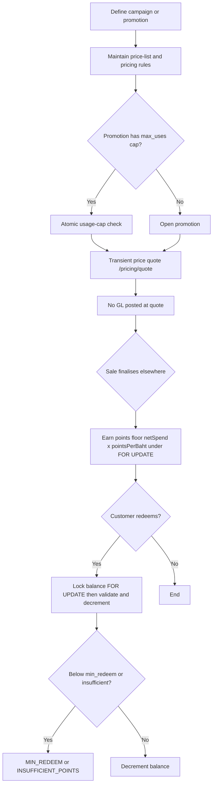

# Process Narrative — Marketing, Pricing & Loyalty

> **Status: DRAFT v0.1** — contains `<<placeholders>>` pending owner confirmation.

## 1. Document Control

| Field | Value |
|---|---|
| Process ID | PN-19-MKT |
| Process owner | `<<Marketing / Revenue Controller>>` |
| Approver | `<<approver-name / title>>` |
| Version | **0.1 DRAFT** |
| Revision date | 2026-06-23 (v0.3) |
| Effective date | `<<effective-date>>` |
| Review cadence | Annual + on significant change |
| Related RCM controls | MKT-01, MKT-02, MKT-03, MKT-04; SoD rule R10 |
| Related policy | `<<Pricing & Discount Authority Policy>>`, `<<Promotions Policy>>`, `<<Loyalty Programme Terms>>`, `<<Segregation-of-Duties Policy>>` |

## 2. Purpose

This narrative documents the marketing, pricing and loyalty processes: campaign and segment management, promotion definition, price-list and pricing-rule maintenance, transient price quotation, and loyalty points earn/redeem. Its primary control objective is **pricing-change integrity** — ensuring that price-master, promotion and pricing-rule changes are governed and segregated from selling — together with the protection of the loyalty points liability against concurrency loss and double-spend. These processes are upstream value drivers; they do not themselves post revenue, which is recognised when an order or sale finalises (see cross-references).

## 3. Scope

**In scope**
- Campaigns, segments, A/B tests, abandoned-cart reminders, surveys/NPS (marketing, `/api/marketing`, `/api/surveys`, `/api/portal/surveys`).
- Promotions and price-lists (`/api/promotions`, `/api/price-list`).
- Pricing rules, combos and transient price quotation (pricing, `/api/pricing`).
- Loyalty configuration, enrolment, earn and redeem (loyalty, `/api/loyalty`).

**Out of scope**
- Posting of revenue at order/sale finalisation — see `01-order-to-cash.md` and `20-restaurant-operations.md`.
- Gift cards and store-credit deposit liability (account 2200) — see `22-gift-cards-store-credit.md`.
- CRM 360/RFM credit master and CPQ quote acceptance — see `18-crm-pipeline-cpq.md`.

## 4. References

- ISO 9001:2015 cl. 4.4 (QMS and its processes); cl. 8.2 (Requirements for products and services); cl. 8.5.1 (Control of provision — pricing application).
- Risk & Control Matrix: `compliance/Oshinei_ERP_SOX_RCM_v1.xlsx`.
- Segregation-of-Duties matrix: `compliance/Oshinei_ERP_SoD_Matrix_v1.xlsx`.
- Policies: `<<Pricing & Discount Authority Policy>>`, `<<Promotions Policy>>`, `<<Loyalty Programme Terms>>`.
- Code:
  - `apps/api/src/modules/marketing/marketing.controller.ts`, `apps/api/src/modules/marketing/marketing.service.ts`, `apps/api/src/modules/marketing/promo-engine.service.ts`
  - `apps/api/src/modules/pricing/pricing.controller.ts`, `apps/api/src/modules/pricing/pricing.service.ts`
  - `apps/api/src/modules/loyalty/loyalty.controller.ts`, `apps/api/src/modules/loyalty/loyalty.service.ts`, `apps/api/src/modules/loyalty/member.service.ts`

## 5. Definitions & Abbreviations

| Term | Definition |
|---|---|
| Campaign | A marketing initiative with active/inactive state. |
| Segment | RFM-lite grouping: VIP, Loyal, At Risk, New, Regular. |
| A/B test | Split test reporting CTR (click-through) and CVR (conversion). |
| Promotion | A discount mechanic: Percent, Amount, BuyXGetY, Bundle, MinSpend, FreeGift. |
| Price-list | Catalogue price; effective price = `special > 0 ? special : base × (1 − discount ÷ 100)`. |
| Pricing rule | Rule of type percent / amount / fixed / bogo / qty_break, scoped item / category / all, with stackable flag, priority and day-of-week/time/channel/date gates. |
| Combo | A SKU that explodes into component lines during quotation. |
| Satang | 1/100 of a Thai Baht; quotes are satang-rounded. |
| Loyalty points | A customer sub-ledger balance; earn = `floor(netSpend × pointsPerBaht)`. |
| FOR UPDATE | Postgres row lock serialising read-modify-write on the balance. |
| NPS | Net Promoter Score (survey metric). |
| SoD | Segregation of Duties. |

## 6. Roles & Responsibilities (RACI)

The defining SoD rule here is **R10**: the maintenance of price-master, promotions and pricing rules must be segregated from selling, because a single party able to both set price and sell creates a margin-theft / self-dealing risk. Loyalty configuration (which sets the monetary value of points) is likewise segregated from the point-of-sale operators who earn and redeem. Permissions (`marketing`, `loyalty`, `pos`, `order_mgt`, `exec`, `cust_pos`) are JWT-scoped and tenant-isolated by RLS.

| Activity | Marketing | Revenue Controller | Pricing / Master Data | POS Operator | Loyalty Admin |
|---|---|---|---|---|---|
| Create / toggle campaign | R | I | I | I | I |
| Define / toggle promotion | R | A | C | I | I |
| Maintain price-list | C | A | R | I | I |
| Maintain pricing rules / combos | I | A | R | I | I |
| Apply price at quote (`/pricing/quote`) | I | I | C | R | I |
| Configure loyalty (`/loyalty/config`) | C | A | I | I | R |
| Enrol member | R | I | I | C | R |
| Earn / redeem points | I | I | I | R | C |

A = Accountable, R = Responsible, C = Consulted, I = Informed.

## 7. Process Narrative

1. **Campaigns & segments (perm `marketing`).** Campaigns are created/listed via `POST` / `GET /api/marketing/campaigns`, toggled via `PATCH /api/marketing/campaigns/:id/toggle`, and active ones read via `GET /api/marketing/campaigns/active`. Segments (VIP / Loyal / At Risk / New / Regular) are read via `GET /api/marketing/segments`. A/B tests (`POST` / `GET /api/marketing/ab-tests`) report CTR/CVR. Abandoned-cart nudges fire via `POST /api/marketing/abandoned-carts/remind`. *Operational.*

2. **Promotions (perm `marketing`).** Promotions are created/listed via `GET` / `POST /api/promotions` and toggled via `PATCH /api/promotions/:id/toggle`. Types: Percent, Amount, BuyXGetY, Bundle, MinSpend, FreeGift; doc id `PROMO-{timestamp}`. An unrecognised type returns `BAD_PROMO_TYPE` (400). Each promotion may carry a `max_uses` cap. *Controls: MKT-01 / R10 (promotion change governance), MKT-02 (usage cap).*

3. **Price-lists (perm `marketing`).** Price-lists are read/maintained via `GET` / `POST /api/price-list`. Effective price = `special > 0 ? special : base × (1 − discount ÷ 100)`. *Control: MKT-01 / R10 — price-master maintenance segregated from selling.*

4. **Surveys / NPS (perm `marketing`).** Surveys and responses are managed via `GET` / `POST /api/surveys` (and responses), with a public customer route at `/api/portal/surveys`, producing NPS. Unknown ids return `NOT_FOUND` (404). *Operational.*

5. **Pricing rules & combos (perm `pos` / `order_mgt` / `exec`; quote also `cust_pos`).** Rules are managed via `GET` / `POST /api/pricing/rules`, `GET /api/pricing/rules/:id`, `DELETE /api/pricing/rules/:id`. Rule types: percent, amount, fixed, bogo, qty_break; scope item / category / all; with `stackable` flag, `priority`, and day-of-week / time / channel / date gates. Combos are maintained via `GET` / `PUT /api/pricing/combos/:sku`. Unknown ids return `NOT_FOUND` (404). *Control: MKT-01 / R10.*

6. **Transient price quote.** `POST /api/pricing/quote` explodes combos, applies eligible rules by priority/stackability, adds a service charge if party size ≥ configured minimum, applies surcharge, and satang-rounds. **No GL is posted** — pricing is transient; the GL is posted when the order/sale finalises elsewhere (`01-order-to-cash.md`, `20-restaurant-operations.md`). *Operational (non-financial at this step).*

6a. **Pricing rules applied at the till (B4).** Dine-in checkout (`POST /api/restaurant/orders/:orderNo/checkout`) can opt in with `apply_pricing_rules` so the same item/category/time-day/BOGO/qty-break + order-level rules **apply to the finalised sale** (not just the preview), flowing through the existing discount → VAT-on-discounted-base → markdown-cap path (explicit per-line/promo discounts take precedence). An **auto service charge** for large parties posts as VATable service income (GL **4400**), and **satang rounding** posts the rounding gain/loss (GL **4900**); the sale's GL stays balanced. Rule discounts are governed by the same R10 segregation (price/promo maintenance ≠ selling) — a cashier applies rules but cannot author them. *Control: MKT-01 / R10; GL posting per `20-restaurant-operations.md`.*

7. **Loyalty configuration (perm `loyalty` / `marketing`).** `GET` / `PUT /api/loyalty/config` sets `points_per_baht`, `baht_per_point`, `min_redeem`, `expiry_days`. *Control: MKT-03 — config sets the monetary value of the points liability; segregated from POS operators.*

8. **Enrol & look up members.** `POST /api/loyalty/members` enrols a member (code `M-{id}`); `GET /api/loyalty/members/lookup`, `GET /api/loyalty/members/:id` and `/history` read membership. `GET /api/loyalty/me` returns the caller's balance. Duplicate enrolment returns `MEMBER_EXISTS`; unknown member returns `MEMBER_NOT_FOUND`. **LINE OA identity (the dominant Thai channel):** `POST /api/loyalty/members/enroll-line` enrols-or-returns a member from a **verified LINE id token** (LIFF / LINE Login — real verification when `LINE_LOGIN_CHANNEL_ID` is set, a `mock:<userId>` token in dev), idempotent on the LINE account; `POST /api/loyalty/members/:id/link-line` links a LINE identity to an existing member (`LINE_ALREADY_LINKED` if that account is already on another member — one LINE account = one member per tenant, unique-indexed); `GET …/lookup?line_user_id=` resolves by LINE id. The stored `line_user_id` is the push address used by CRM messaging. *Operational.*

9. **Earn points (at POS checkout).** Inside the checkout transaction, points = `floor(netSpend × pointsPerBaht)` are credited **under a `FOR UPDATE` lock** on the balance row, so two concurrent checkouts cannot lose an increment. *Control: MKT-03 — concurrency-safe earn; points are a sub-ledger balance, settled as a revenue reduction at the sale (no separate GL).*

10. **Redeem points.** `POST /api/loyalty/redeem` locks the balance row **`FOR UPDATE`**, then reads, validates and decrements under the lock to prevent double-spend. It enforces the minimum-redeem floor and sufficiency. Errors: `INSUFFICIENT_POINTS`, `MIN_REDEEM`, `BAD_POINTS`, `LOYALTY_DISABLED`. *Control: MKT-03 — points liability integrity.*

11. **CRM messaging (consented).** Members carry a `birthday` and a `marketing_opt_in` consent flag (`PATCH /api/loyalty/members/:id`); `GET /api/loyalty/members/birthdays?window=today|month` lists upcoming birthdays. `POST /api/messaging/send` (one member) and `POST /api/messaging/blast` (audience = all / `birthdays_today` / RFM `segment`) send via a provider-agnostic gateway (LINE / SMS / email — real provider when its credentials are configured, otherwise a logged **mock**), and **every send respects consent** — an opted-out member is recorded as `skipped`, never contacted. A **LINE** message is pushed to the member's linked **`line_user_id`** (the LINE Messaging API push address; a member with no linked LINE account is recorded `failed`, never mis-sent to a phone number); email→email, otherwise the phone. All deliveries are written to an append-only `message_log` (`GET /api/messaging/log`). *Control: MKT-04 — marketing-consent enforcement + auditable delivery log.*

12. **LINE marketing automation — closed loop (consented).** `POST /api/marketing/automation/campaigns` runs a behaviour-triggered campaign: the **trigger** picks the audience — `lapsed` (RFM recency ≥ N days), `birthday` (today, Asia/Bangkok), `winback` (RFM segment At-Risk/Lost), or `all` — and a **per-member coupon** (`{PREFIX}-{memberId}-{rand}`, unique per tenant) is pushed over the member's channel (LINE → `line_user_id`) via the same gateway, **respecting consent** (opted-out → `skipped`; no reachable address → `failed`; recorded in `campaign_sends`, migration `0106`). `POST /api/marketing/automation/redeem` closes the loop — a coupon presented at the till is marked redeemed (idempotent; a re-presented coupon never double-counts) and its value attributed to the sale. `GET /api/marketing/automation/campaigns/:id` reports **delivery, redemption rate, and attributed revenue**; `…/preview` sizes an audience without sending. The AI assistant exposes the read-only `get_marketing_audience` ("ลูกค้าห่างหายมีกี่คน?"); the *sending* action is operator-driven (not AI-executed). *Control: MKT-04 — consent enforcement + auditable send/redeem log.*

## 8. Process Flow

**Swimlane narrative.** The *Marketing* lane owns campaigns, promotions, surveys and segments. The *Pricing / Master Data* lane owns price-lists, pricing rules and combos — segregated from selling under R10. The *POS Operator* lane consumes the transient price quote and triggers the earn/redeem of points at the point of sale. The *Loyalty Admin / Revenue Controller* lane owns loyalty configuration (the monetary value of points) and is accountable for the points-liability integrity that the POS lane operates against.

## 9. Control Matrix

| Step | Risk | Control | Type | RCM ID | Evidence / Record |
|---|---|---|---|---|---|
| 1, 4 | Wasted spend / poor targeting | Operational analytics; non-financial | Operational | — | Campaign & survey reports |
| 2 | Unauthorised promotion (margin theft) | Promotion maintenance gated `marketing`, segregated from selling | Preventive | MKT-01 / R10 | Promotion change log |
| 2 | Over-redemption beyond planned budget | `max_uses` cap enforced atomically | Preventive | MKT-02 | Promotion usage counter |
| 3, 5 | Unauthorised price/rule change | Price-list & rule maintenance segregated from selling; permission split | Preventive | MKT-01 / R10 | Price-list & rule change log |
| 6 | Incorrect price applied | Server-side rule engine (priority, stackability, gates); satang rounding | Preventive | MKT-01 | Quote calculation trace |
| 7 | Mis-valued points liability | Config gated to loyalty/marketing; segregated from POS | Preventive | MKT-03 | `/loyalty/config` change log |
| 9 | Lost earn increment under concurrency | `FOR UPDATE` lock on balance during earn | Preventive | MKT-03 | DB transaction log |
| 10 | Double-spend / over-redemption of points | `FOR UPDATE` lock; validate+decrement under lock; min-redeem & sufficiency checks | Preventive | MKT-03 | Redemption ledger |
| 11 | Contacting customers without consent / no audit | `marketing_opt_in` enforced on every send (opted-out → `skipped`); append-only `message_log` | Preventive / Detective | MKT-04 | Message-delivery log |

## 10. Inputs & Outputs

**Inputs:** campaign/segment definitions; promotion mechanics and caps; price-list base/special/discount; pricing-rule definitions; loyalty config; member enrolment data; user JWT (tenant + permissions).

**Outputs:** active campaigns; promotion records (`PROMO-`); effective price-lists; transient price quotes (no GL); loyalty member records (`M-`); points earn/redeem ledger entries (sub-ledger balance). Effective prices and applied promotions feed the selling processes that post revenue.

## 11. Records & Retention

| Record | Retention |
|---|---|
| Promotion definitions & usage counters | `<<7 years / per Thai law>>` |
| Price-list & pricing-rule change history | `<<7 years / per Thai law>>` |
| Loyalty earn / redeem ledger | `<<7 years / per Thai law>>` |
| Campaign, A/B test & survey data | `<<retention per policy>>` |

## 12. KPIs / Metrics

- Promotion redemption rate vs `max_uses` cap (and cap-breach attempts).
- Average effective discount % across price-lists/rules.
- Loyalty points liability outstanding and redemption ratio.
- Earn/redeem concurrency conflicts (lock contention events).
- Campaign CTR / CVR and survey NPS.

## 13. Exception & Error Handling

| Error code | Trigger | Handling |
|---|---|---|
| BAD_PROMO_TYPE (400) | Promotion type not in allowed set | Reject; use a defined type. |
| NOT_FOUND (404) | Unknown promotion / price-list / rule / survey | Reject; verify id. |
| LOYALTY_DISABLED | Redeem while programme disabled | Block redemption; enable per config. |
| MIN_REDEEM | Balance below minimum-redeem floor | Block; inform member of threshold. |
| INSUFFICIENT_POINTS | Redeem exceeds balance | Block under lock; no decrement. |
| BAD_POINTS | Invalid (non-positive) points value | Reject input. |
| MEMBER_NOT_FOUND | Lookup/redeem for unknown member | Reject; verify membership. |
| MEMBER_EXISTS | Enrol duplicate member | Reject; use existing member. |
| (send → `skipped`) | Member opted out of marketing | Not contacted; logged as skipped. |

## 14. Revision History

| Version | Date | Author | Notes |
|---|---|---|---|
| 0.1 DRAFT | 2026-06-22 | `<<author>>` | Initial draft. |
| 0.2 | 2026-06-24 | Platform | **LINE OA member CRM:** §7 item 8 — members carry a verified **`line_user_id`** (LINE Login/LIFF; real verify when `LINE_LOGIN_CHANNEL_ID` set, mock token in dev). New `…/members/enroll-line` (idempotent enrol from a LINE id token), `…/members/:id/link-line` (`LINE_ALREADY_LINKED` — one LINE account = one member/tenant, unique-indexed, migration `0105`), and `…/lookup?line_user_id=`. §7 item 11 — LINE pushes now address the member's `line_user_id` (not their phone); the messaging gateway reads its credential at call time. Harness `line-crm.ts`; UAT-O2C-116…118. No GL, no new control. |
| 0.4 | 2026-06-24 | Platform | **LINE marketing automation — closed loop (MKT-04):** new §7 item 12 — `POST /api/marketing/automation/campaigns` runs behaviour-triggered campaigns (lapsed / birthday / winback / all) that push a **per-member coupon** over LINE (consent-respecting), `…/redeem` tracks the redemption back to the sale (idempotent) and attributes revenue, and `…/campaigns/:id` reports redemption rate + attributed revenue (`campaign_sends`/`automation_campaigns`, migration `0106`). AI read-only tool `get_marketing_audience` (sending stays operator-driven). Web `/campaigns`. Harness `line-automation.ts` (7); UAT-O2C-123. Consent-enforced, no GL. |
| 0.2 | 2026-06-23 | Platform | B4: pricing rules now apply at dine-in checkout (step 6a) — service charge → GL 4400, satang rounding → GL 4900; verified by the `pricing` cutover harness. |
| 0.3 | 2026-06-23 | Platform | **CRM messaging (POS customization Phase 6):** step 11 — member `birthday` + `marketing_opt_in`, birthdays endpoint, provider-agnostic `/api/messaging` send/blast (LINE/SMS/email, mock default) with consent enforcement + `message_log`; new control **MKT-04**. Config: `LINE_CHANNEL_TOKEN`, `SMS_API_KEY`, `SMTP_HOST`. |
