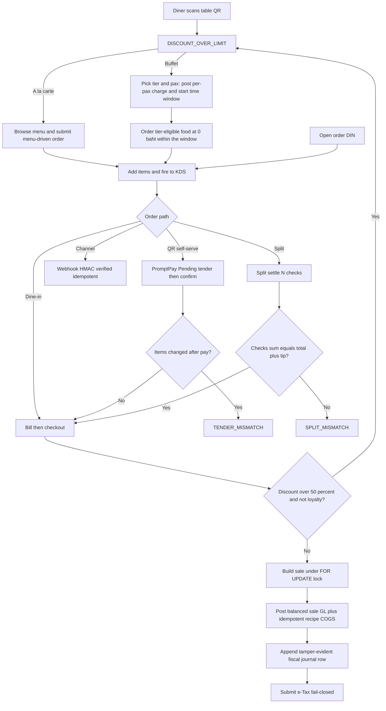

# Process Narrative — Restaurant Operations (Dine-in, QR, Channel, Split-bill & Fiscal POS)

> **Status: DRAFT v0.1** — contains `<<placeholders>>` pending owner confirmation.

## 1. Document Control

| Field | Value |
|---|---|
| Process ID | PN-20-REST |
| Process owner | `<<Operations / Revenue Controller>>` |
| Approver | `<<approver-name / title>>` |
| Version | **0.1 DRAFT** |
| Revision date | 2026-06-23 (v0.6) |
| Effective date | `<<effective-date>>` |
| Review cadence | Annual + on significant change |
| Related RCM controls | REST-01 … REST-09; GL-01 |
| Related policy | `<<POS & Cash Handling Policy>>`, `<<VAT / e-Tax Policy>>`, `<<Discount Authority Policy>>`, `<<Fiscal Audit-Trail Policy>>` |

## 2. Purpose

This narrative documents restaurant point-of-sale operations end to end: dine-in ordering and kitchen routing, self-service QR ordering and PromptPay payment, third-party channel orders, split-bill settlement, and the **tamper-evident fiscal POS journal** that satisfies the Thai Revenue Department (RD) requirement for an unalterable audit trail. The control objectives are: balanced and idempotent sale postings (revenue, VAT, tips, COGS); an append-only hash-chained journal; discount-cap enforcement; payment-tender reconciliation; secure channel webhooks; exact split-bill coverage; and complete e-Tax submission.

## 3. Scope

**In scope**
- Dine-in order → fire → bill → checkout → close (restaurant, `/api/restaurant`).
- Kitchen Display System (`/api/restaurant/kds`), tables/zones, public QR (`/api/qr`), channel orders (`/api/order`).
- Split-bill payment (pos, `/api/pos`).
- Fiscal POS journal and e-Tax (pos-fiscal, `/api/pos/journal`, `/api/tax/etax`).

**Out of scope**
- Order-to-cash for non-restaurant sales — see `01-order-to-cash.md`.
- VAT return preparation and e-Tax policy detail — see `06-tax-compliance.md`.
- Gift-card / store-credit deposit liability mechanics (account 2200) — see `22-gift-cards-store-credit.md`.

## 4. References

- ISO 9001:2015 cl. 4.4 (QMS and its processes); cl. 8.5.1 (Control of production and service provision); cl. 8.5.4 (Preservation — records); cl. 8.7 (Control of nonconforming outputs — voids/cancels).
- Risk & Control Matrix: `compliance/Oshinei_ERP_SOX_RCM_v1.xlsx`.
- Segregation-of-Duties matrix: `compliance/Oshinei_ERP_SoD_Matrix_v1.xlsx`.
- Policies: `<<POS & Cash Handling Policy>>`, `<<VAT / e-Tax Policy>>`, `<<Fiscal Audit-Trail Policy>>`.
- Code:
  - `apps/api/src/modules/restaurant/dine-in.service.ts`, `apps/api/src/modules/restaurant/kds.service.ts`, `apps/api/src/modules/restaurant/table.service.ts`, `apps/api/src/modules/restaurant/qr.service.ts`, `apps/api/src/modules/restaurant/channel-order.service.ts`
  - `apps/api/src/modules/pos/split.service.ts`, `apps/api/src/modules/pos/pos.service.ts`
  - `apps/api/src/modules/pos-fiscal/journal.service.ts`, `apps/api/src/modules/pos-fiscal/etax.service.ts`

## 5. Definitions & Abbreviations

| Term | Definition |
|---|---|
| KDS | Kitchen Display System; item-state board (new → queued → preparing → ready → served; void). |
| DIN- | Dine-in order document prefix. |
| SALE-{TENANT}- | Built sale document number (tenant-stamped). |
| SPLIT- | Split-bill sale document prefix. |
| TS- | Table session prefix (HMAC-tokened). |
| PromptPay | Thai QR real-time payment scheme. |
| Tender | A payment instrument applied to a bill. |
| Hash chain | Append-only journal where each row's hash binds the previous hash (tamper-evident). |
| stableStringify | Deterministic JSON serialisation used in the hash pre-image. |
| RD | Thai Revenue Department. |
| e-Tax | Electronic tax invoice submission (providers INET / Frank / Leceipt, or mock). |
| VAT | Value Added Tax (GL 2100); computed on the discounted subtotal (Thai rule). |
| FOR UPDATE | Postgres row lock serialising checkout to prevent double-submit. |

## 6. Roles & Responsibilities (RACI)

Cash and revenue handling at POS concentrate risk, so duties are split: the operator who takes orders and tenders payment is distinct from the manager who authorises voids, over-limit discounts and journal review. The fiscal journal is **append-only by design** — no role may edit or delete a past row — and verification is an independent control. Permissions (`pos`, `order_mgt`, `exec`) are JWT-scoped and RLS tenant-isolated.

| Activity | POS Operator | Shift Manager | Revenue Controller | Finance / GL | Tax / Compliance |
|---|---|---|---|---|---|
| Take order / fire to KDS | R | I | I | I | I |
| Apply discount within cap | R | C | I | I | I |
| Approve discount above cap | I | A | C | I | I |
| Checkout / settle (post sale + GL) | R | C | A | C | I |
| Void KDS item | R | A | I | I | I |
| Append fiscal journal row | R (system) | I | C | C | I |
| Verify fiscal journal chain | I | C | R | C | A |
| Submit e-Tax | I | C | C | I | R |

A = Accountable, R = Responsible, C = Consulted, I = Informed.

## 7. Process Narrative

1. **Open dine-in order (perm `pos` / `order_mgt`).** `POST /api/restaurant/orders` creates an order (prefix `DIN-`); lines are added via `/api/restaurant/orders/:orderNo/items`. *Operational.*

2. **Fire to kitchen.** `POST /api/restaurant/orders/:orderNo/fire` sends items to the KDS. *Operational.*

3. **Bill & checkout (financially significant).** `POST /api/restaurant/orders/:orderNo/bill` produces the bill; `POST .../checkout` builds the sale (`SALE-{TENANT}-`), posts the GL and issues the invoice. Checkout takes a `FOR UPDATE` lock on the order to serialise double-submit, and the status automaton never downgrades a terminal state. VAT is computed on the **discounted** subtotal (Thai rule). The discount cap is 50% (`DISCOUNT_OVER_LIMIT`; `DISCOUNT_EXCEEDS_SUBTOTAL`); loyalty redemption is exempt from the cap. Sale GL (balanced; zero legs auto-dropped):

   | Account | Dr | Cr |
   |---|---|---|
   | 1000 Cash | cash leg | |
   | 2200 Customer Deposits (gift redemption draw-down) | gift applied | |
   | 4000 Revenue (net / taxable) | | net |
   | 2100 VAT | | vat |
   | 2300 Tips Payable (tip — NOT VATable) | | tip |

   Plus recipe COGS (gated per recipe), **idempotent per `sale_no`**:

   | Account | Dr | Cr |
   |---|---|---|
   | 5300 Recipe COGS | recipe cogs | |
   | 1200 Inventory | | recipe cogs |

   *Controls: REST-01 (balanced sale JE + idempotent COGS, GL-01), REST-03 (discount cap). Errors: `ORDER_CLOSED`, `PROMO_EXHAUSTED`.*

4. **Close.** `POST /api/restaurant/orders/:orderNo/close` (and `/cancel`) terminate the order. *Operational, governed by the non-downgrading automaton.*

5. **KDS (`/api/restaurant/kds`).** `GET /kds/feed`; `PATCH /kds/items/:id` advances state (new → queued → preparing → ready → served) or **void**; stations are configurable. Voided items are excluded from the order total. The feed flags each line's origin (`from_diner` for QR self-orders) and `is_buffet`, so the kitchen sees at a glance which tickets came from a guest's phone and which are buffet refills (the per-pax buffet charge stays off the feed). *Operational, but the void-exclusion is an accuracy control.*

6. **Tables & QR.** Tables/zones are CRUD-managed; `/tables/:id/open` starts a session (`TS-`, HMAC token). Public QR flow: `POST /api/qr/start/:qrToken`, `/t/:token/bill`, `POST /t/:token/pay` (creates a **PromptPay Pending tender** with QR payload), `POST /t/:token/confirm` (settles → builds sale + GL + invoice + close). A **reconciliation guard** raises `TENDER_MISMATCH` if items changed after payment. Errors: `BAD_QR`, `SESSION_ENDED`, `NO_OPEN_ORDER`, `EMPTY_BILL`, `NO_SALE`. *Control: REST-04 (PromptPay tender reconciliation guard).*

   **QR self-ordering (diner-placed orders).** From the same session token the diner can order without staff: `GET /api/qr/t/:token/menu` renders the catalog (categories + items + modifier groups, with 86'd items flagged), and `POST /api/qr/t/:token/order` submits **menu-driven lines only** (`sku`/`menu_item_id` + `modifier_option_ids`). The server resolves name, **price**, station, prep-time and modifier rules from the catalog — a diner can never set or alter a price (freeform `name`/`unit_price` lines are rejected at validation). A submitted order is appended to the session's open order and **auto-fired to the KDS** so the kitchen sees it immediately; the diner then watches per-item status (รอคิว → กำลังปรุง → พร้อมเสิร์ฟ → เสิร์ฟแล้ว) and the estimated wait on the same page. 86'd items are blocked (`ITEM_UNAVAILABLE`) and menu/order calls on an ended session return `SESSION_ENDED` (401). *Control: REST-08 (diner self-order integrity — server-side menu-driven pricing, no price tampering).*

   **Buffet self-ordering (per-pax tiers + time window).** A session runs in **one mode** (`a_la_carte` | `buffet`). Master-data roles maintain tiers via `GET/POST/PATCH /api/restaurant/buffet/packages` (code, name, **price per pax**, **time-limit (min)**, optional **overtime fee per pax**, and the menu items the tier includes). A diner lists tiers with `GET /api/qr/t/:token/buffet/tiers` and starts one with `POST /api/qr/t/:token/buffet/start` (`package_id`, `pax`): the session is stamped `buffet` with a `buffet_expires_at` window, and a single per-pax **buffet charge line** (`price_per_pax × pax`, VATable) is posted. Subsequent `…/order` calls insert **buffet food at ฿0** (`is_buffet`) — they still route to the KDS, but every line must belong to the chosen tier (`NOT_IN_PACKAGE`) and the window must be open (`BUFFET_EXPIRED`); a session that already has an à la carte order cannot switch to buffet (`MODE_LOCKED`). The per-pax charge and the overtime surcharge are **non-kitchen lines** (`kds_status='served'`) so they bill but never appear on the kitchen feed. At bill time, if the window has elapsed and the tier carries an overtime fee, a one-off **overtime surcharge** (`overtime_fee_per_pax × pax`) is added idempotently. Every ordered line (food + charge/overtime) is stamped with its `buffet_package_id`, and `GET /api/restaurant/buffet/analytics` aggregates **behaviour per tier** — menu mix (top items by quantity), covers, items-per-head, revenue, average bill and overtime rate — surfaced on the back-office buffet report. *Control: REST-09 (buffet integrity — per-pax pricing, tier eligibility, single-mode lock, time-window + overtime). The analytics view is reporting only (no control).*

7. **Channel orders (`/api/order/:slug`).** Takeaway / delivery orders. Food GL: Dr 1000 Cash / Cr 4000 Revenue / Cr 2100 VAT. Delivery fee GL: Dr 1000 Cash / Cr 4100 Delivery Income / Cr 2100 VAT. Inbound `POST /api/channel/webhook/:source` is **HMAC-verified and idempotent**. Errors: `ALREADY_PAID`, `BAD_WEBHOOK_SIG`, and `WEBHOOK_NOT_CONFIGURED` (fail-closed). *Control: REST-05 (channel webhook HMAC, fail-closed).*

8. **Split-bill (`/api/pos`).** `POST /api/pos/orders/:orderNo/pay-multi` settles one GL across N tenders (tip applied to the first); `/finalize` closes. `POST .../split/preview` and `/split/settle` produce N checks → N sales + N GL + N invoices (doc `SPLIT-`); checks must sum to total + tip, else `SPLIT_MISMATCH`. Errors: `NOT_PARTIAL`, `STILL_UNPAID`. *Control: REST-06 (split-bill exact-coverage).*

9. **Fiscal POS journal (pos-fiscal, perm `pos` / `order_mgt` / `exec`) — the headline control.** `GET /api/pos/journal` lists; `POST /api/pos/journal/append` appends; `GET /api/pos/journal/verify` verifies. Each row hash = `SHA256(prevHash | seq | docType | docNo | stableStringify(payload))`, with `prevHash` stored. Append is serialised per tenant via a `FOR UPDATE` lock on the latest row (prevents chain forks). Verify recomputes all hashes ascending and detects sequence gaps, `prev_hash` mismatch and `hash` mismatch, reporting `broken_at` + reason. **Altering or deleting any past row breaks every later hash** — satisfying the RD requirement that the audit trail cannot be altered after the fact. *Control: REST-02 (tamper-evident hash-chained journal).*

10. **e-Tax submission.** `POST /api/tax/etax/submit/:docNo` submits to a provider (INET / Frank / Leceipt, or mock). It is **idempotent once Accepted**, and **fail-closed** in production (`WEBHOOK_NOT_CONFIGURED`; `ETAX_PROVIDER_NOT_CONFIGURED`). *Control: REST-07 (e-Tax submission completeness).*

## 8. Process Flow

**Swimlane narrative.** The *POS Operator* lane owns ordering, firing, bill, and tendering across dine-in, QR, channel and split paths. The *Shift Manager* lane authorises voids and over-cap discounts. The *Revenue Controller / Finance* lane is accountable for the checkout postings (balanced sale JE, idempotent COGS) and for periodic verification of the fiscal journal chain. The *Tax / Compliance* lane owns e-Tax submission and is accountable for the unalterable audit-trail evidence the journal produces. The hash-chained journal underpins every lane — each settlement appends a row that no party may later edit.

## 9. Control Matrix

| Step | Risk | Control | Type | RCM ID | Evidence / Record |
|---|---|---|---|---|---|
| 3 | Unbalanced / duplicated sale or COGS posting | Balanced sale JE (1000/2200 = 4000/2100/2300); recipe COGS idempotent per `sale_no` | Preventive | REST-01 / GL-01 | GL entries, `sale_no` idempotency key |
| 3 | Double-submit at checkout | `FOR UPDATE` order lock; non-downgrading status automaton | Preventive | REST-01 | DB transaction log |
| 3 | Excessive / unauthorised discount | 50% cap (`DISCOUNT_OVER_LIMIT`, `DISCOUNT_EXCEEDS_SUBTOTAL`); loyalty exempt | Preventive | REST-03 | Discount log, manager approval |
| 5 | Inflated total from voided items | Voided KDS items excluded from order total | Detective | REST-03 | KDS void log |
| 6 | Settlement against changed bill | PromptPay reconciliation guard (`TENDER_MISMATCH`) | Detective | REST-04 | QR tender + confirm record |
| 7 | Forged / replayed channel order | Webhook HMAC verification; idempotent; fail-closed | Preventive | REST-05 | Webhook signature log |
| 8 | Under/over-collection on split | Checks must sum to total + tip (`SPLIT_MISMATCH`) | Preventive | REST-06 | Split settle records (`SPLIT-`) |
| 9 | Post-hoc alteration of POS records | SHA256 hash chain; per-tenant `FOR UPDATE` append; verify detects gaps/mismatch | Preventive / Detective | REST-02 | Journal rows, verify report (`broken_at`) |
| 10 | Missing / duplicate tax invoice | e-Tax idempotent on Accepted; fail-closed in prod | Preventive | REST-07 | e-Tax submission status |
| 6 | Diner self-order with a tampered / arbitrary price | Public order accepts **menu-driven lines only**; price/station/86/modifier rules resolved server-side from the catalog; freeform `name`/`unit_price` rejected | Preventive | REST-08 | QR order request log, catalog price |
| 6 | Buffet abuse: off-tier items, ordering after time-up, mode mixing, mis-priced charge | Tier eligibility (`NOT_IN_PACKAGE`); time-window enforcement (`BUFFET_EXPIRED`); single-mode lock (`MODE_LOCKED`); per-pax charge + overtime computed server-side from the tier; food forced to ฿0 | Preventive | REST-09 | Buffet session (mode, pax, window), charge/overtime lines |

## 10. Inputs & Outputs

**Inputs:** menu items & recipes; table/zone config; pricing & promotions (from `19-marketing-pricing-loyalty.md`); loyalty redemption; gift-card balances (2200); channel webhook payloads; PromptPay tenders; user JWT (tenant + permissions).

**Outputs:** sales (`SALE-{TENANT}-`, `SPLIT-`); balanced GL entries (1000/2200/4000/2100/2300; 5300/1200; 4100); tax invoices; e-Tax submissions; append-only fiscal journal rows (hash-chained).

## 11. Records & Retention

| Record | Retention |
|---|---|
| Sales, invoices, GL entries | `<<7 years / per Thai law>>` |
| Tamper-evident fiscal POS journal | `<<7 years / per Thai law>>` |
| e-Tax submission evidence | `<<7 years / per Thai law>>` |
| KDS void / discount-approval logs | `<<7 years / per Thai law>>` |
| Channel webhook signature logs | `<<retention per policy>>` |

## 12. KPIs / Metrics

- Fiscal journal verify pass rate (target 100%; any `broken_at` is a critical incident).
- e-Tax acceptance rate and submission latency.
- Discount-cap breach attempts (`DISCOUNT_OVER_LIMIT`).
- `TENDER_MISMATCH` / `SPLIT_MISMATCH` occurrence rate.
- Rejected channel webhooks (`BAD_WEBHOOK_SIG`).
- Average checkout/settlement time per channel.
- **Buffet behaviour per tier** (`/buffet/analytics`): menu mix / top items, covers, items-per-head, average bill per session, overtime rate.

## 13. Exception & Error Handling

| Error code | Trigger | Handling |
|---|---|---|
| ORDER_CLOSED | Action on a closed order | Block; status automaton prevents downgrade. |
| PROMO_EXHAUSTED | Promotion `max_uses` reached | Block; remove/replace promotion. |
| DISCOUNT_OVER_LIMIT | Total discount > 50% (non-loyalty) | Block; require manager authority. |
| DISCOUNT_EXCEEDS_SUBTOTAL | Discount exceeds bill subtotal | Block; correct discount. |
| TENDER_MISMATCH | Items changed after PromptPay pay | Block confirm; re-bill and re-pay. |
| BAD_QR / SESSION_ENDED / NO_OPEN_ORDER / EMPTY_BILL / NO_SALE | Invalid QR session/bill state | Reject; restart session. |
| ALREADY_PAID | Duplicate channel settlement | Ignore (idempotent); no double posting. |
| BAD_WEBHOOK_SIG | HMAC verification fails | Reject webhook; log. |
| WEBHOOK_NOT_CONFIGURED | Webhook secret absent (prod) | Fail closed; do not process. |
| SPLIT_MISMATCH | Split checks ≠ total + tip | Block settle; rebalance checks. |
| NOT_PARTIAL / STILL_UNPAID | Invalid split/finalize state | Reject; resolve outstanding tenders. |
| ETAX_PROVIDER_NOT_CONFIGURED | No e-Tax provider configured (prod) | Fail closed; configure provider. |
| ITEM_UNAVAILABLE | Diner ordered an 86'd item | Block line; item is sold out / disabled. |
| (validation 400) | Diner submitted a freeform/priced line | Reject; only menu items (`sku`/`menu_item_id`) may be self-ordered. |
| NOT_IN_PACKAGE | Buffet order included an item outside the tier | Block line; offer only tier-eligible items. |
| BUFFET_EXPIRED | Buffet order placed after the time window | Block; window is up (overtime billed at checkout). |
| MODE_LOCKED | Tried to start buffet after à la carte ordering | Block; one mode per session — start a new session to switch. |
| PACKAGE_NOT_FOUND / PACKAGE_EXISTS | Invalid / duplicate buffet tier | Correct the tier reference / code. |

## 14. Revision History

| Version | Date | Author | Notes |
|---|---|---|---|
| 0.1 DRAFT | 2026-06-22 | `<<author>>` | Initial draft. |
| 0.2 | 2026-06-23 | Platform | Doc-drift fix: §6 (Tables & QR) — public QR session-start endpoint corrected from `GET` to `POST /api/qr/start/:qrToken`. |
| 0.3 | 2026-06-23 | Platform | **QR self-ordering (Phase 1):** §6 documents diner-placed orders (`GET /api/qr/t/:token/menu`, `POST /api/qr/t/:token/order`) — menu-driven only, auto-fired to KDS; added control **REST-08** (diner self-order integrity), process-flow self-order branch, and error rows (`ITEM_UNAVAILABLE`, freeform-line rejection). |
| 0.4 | 2026-06-23 | Platform | **Buffet self-ordering (Phase 2):** §6 documents per-pax buffet tiers with a dining time window (`/buffet/tiers`, `/buffet/start`, admin `/api/restaurant/buffet/packages`) — ฿0 tier-eligible food, single-mode lock, overtime surcharge; added control **REST-09**, the mode/buffet branch in §8, and error rows (`NOT_IN_PACKAGE`, `BUFFET_EXPIRED`, `MODE_LOCKED`, `PACKAGE_*`). |
| 0.5 | 2026-06-23 | Platform | **KDS polish (Phase 3):** §5 — KDS feed now flags `from_diner` (QR self-orders) and `is_buffet` so the kitchen can distinguish guest-placed and buffet tickets. |
| 0.6 | 2026-06-23 | Platform | **Buffet behaviour analytics:** ordered lines stamped with `buffet_package_id`; `GET /api/restaurant/buffet/analytics` aggregates per-tier menu mix / covers / items-per-head / revenue / overtime (§6, KPI §12). Reporting only — no new control. |
