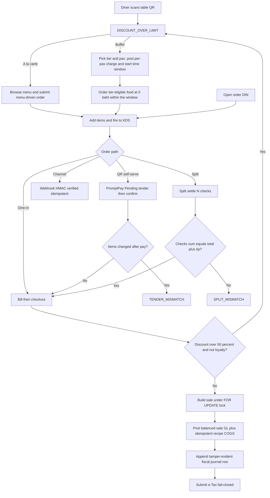

# Process Narrative — Restaurant Operations (Dine-in, QR, Channel, Split-bill & Fiscal POS)

> **Status: DRAFT v0.1** — contains `<<placeholders>>` pending owner confirmation.

## 1. Document Control

| Field | Value |
|---|---|
| Process ID | PN-20-REST |
| Process owner | `<<Operations / Revenue Controller>>` |
| Approver | `<<approver-name / title>>` |
| Version | **0.1 DRAFT** |
| Revision date | 2026-06-24 (v2.6) |
| Effective date | `<<effective-date>>` |
| Review cadence | Annual + on significant change |
| Related RCM controls | REST-01 … REST-12; TIP-01; GL-01 |
| Related policy | `<<POS & Cash Handling Policy>>`, `<<VAT / e-Tax Policy>>`, `<<Discount Authority Policy>>`, `<<Fiscal Audit-Trail Policy>>` |

## 2. Purpose

This narrative documents restaurant point-of-sale operations end to end: dine-in ordering and kitchen routing, self-service QR ordering and PromptPay payment, third-party channel orders, split-bill settlement, and the **tamper-evident fiscal POS journal** that satisfies the Thai Revenue Department (RD) requirement for an unalterable audit trail. The control objectives are: balanced and idempotent sale postings (revenue, VAT, tips, COGS); an append-only hash-chained journal; discount-cap enforcement; payment-tender reconciliation; secure channel webhooks; exact split-bill coverage; and complete e-Tax submission.

## 3. Scope

**In scope**
- Dine-in order → fire → bill → checkout → close (restaurant, `/api/restaurant`).
- Kitchen Display System (`/api/restaurant/kds`), tables/zones, public QR (`/api/qr`), channel orders (`/api/order`).
- Split-bill payment (pos, `/api/pos`).
- Fiscal POS journal and e-Tax (pos-fiscal, `/api/pos/journal`, `/api/tax/etax`).

**Out of scope**
- Order-to-cash for non-restaurant sales — see `01-order-to-cash.md`.
- VAT return preparation and e-Tax policy detail — see `06-tax-compliance.md`.
- Gift-card / store-credit deposit liability mechanics (account 2200) — see `22-gift-cards-store-credit.md`.

## 4. References

- ISO 9001:2015 cl. 4.4 (QMS and its processes); cl. 8.5.1 (Control of production and service provision); cl. 8.5.4 (Preservation — records); cl. 8.7 (Control of nonconforming outputs — voids/cancels).
- Risk & Control Matrix: `compliance/Oshinei_ERP_SOX_RCM_v1.xlsx`.
- Segregation-of-Duties matrix: `compliance/Oshinei_ERP_SoD_Matrix_v1.xlsx`.
- Policies: `<<POS & Cash Handling Policy>>`, `<<VAT / e-Tax Policy>>`, `<<Fiscal Audit-Trail Policy>>`.
- Code:
  - `apps/api/src/modules/restaurant/dine-in.service.ts`, `apps/api/src/modules/restaurant/kds.service.ts`, `apps/api/src/modules/restaurant/table.service.ts`, `apps/api/src/modules/restaurant/qr.service.ts`, `apps/api/src/modules/restaurant/channel-order.service.ts`
  - `apps/api/src/modules/pos/split.service.ts`, `apps/api/src/modules/pos/pos.service.ts`
  - `apps/api/src/modules/pos-fiscal/journal.service.ts`, `apps/api/src/modules/pos-fiscal/etax.service.ts`

## 5. Definitions & Abbreviations

| Term | Definition |
|---|---|
| KDS | Kitchen Display System; item-state board (new → queued → preparing → ready → served; void). |
| DIN- | Dine-in order document prefix. |
| SALE-{TENANT}- | Built sale document number (tenant-stamped). |
| SPLIT- | Split-bill sale document prefix. |
| TS- | Table session prefix (HMAC-tokened). |
| PromptPay | Thai QR real-time payment scheme. |
| Tender | A payment instrument applied to a bill. |
| Hash chain | Append-only journal where each row's hash binds the previous hash (tamper-evident). |
| stableStringify | Deterministic JSON serialisation used in the hash pre-image. |
| RD | Thai Revenue Department. |
| e-Tax | Electronic tax invoice submission (providers INET / Frank / Leceipt, or mock). |
| VAT | Value Added Tax (GL 2100); computed on the discounted subtotal (Thai rule). |
| FOR UPDATE | Postgres row lock serialising checkout to prevent double-submit. |

## 6. Roles & Responsibilities (RACI)

Cash and revenue handling at POS concentrate risk, so duties are split: the operator who takes orders and tenders payment is distinct from the manager who authorises voids, over-limit discounts and journal review. The fiscal journal is **append-only by design** — no role may edit or delete a past row — and verification is an independent control. Permissions (`pos`, `order_mgt`, `exec`) are JWT-scoped and RLS tenant-isolated.

| Activity | POS Operator | Shift Manager | Revenue Controller | Finance / GL | Tax / Compliance |
|---|---|---|---|---|---|
| Take order / fire to KDS | R | I | I | I | I |
| Apply discount within cap | R | C | I | I | I |
| Approve discount above cap | I | A | C | I | I |
| Checkout / settle (post sale + GL) | R | C | A | C | I |
| Void KDS item | R | A | I | I | I |
| Append fiscal journal row | R (system) | I | C | C | I |
| Verify fiscal journal chain | I | C | R | C | A |
| Submit e-Tax | I | C | C | I | R |

A = Accountable, R = Responsible, C = Consulted, I = Informed.

## 7. Process Narrative

1. **Open dine-in order (perm `pos` / `order_mgt`).** `POST /api/restaurant/orders` creates an order (prefix `DIN-`); lines are added via `/api/restaurant/orders/:orderNo/items`. *Operational.*

2. **Fire to kitchen.** `POST /api/restaurant/orders/:orderNo/fire` sends items to the KDS. *Operational.*

3. **Bill & checkout (financially significant).** `POST /api/restaurant/orders/:orderNo/bill` produces the bill; `POST .../checkout` builds the sale (`SALE-{TENANT}-`), posts the GL and issues the invoice. Checkout takes a `FOR UPDATE` lock on the order to serialise double-submit, and the status automaton never downgrades a terminal state. VAT is computed on the **discounted** subtotal (Thai rule). The discount cap is 50% (`DISCOUNT_OVER_LIMIT`; `DISCOUNT_EXCEEDS_SUBTOTAL`); loyalty redemption is exempt from the cap. An optional **service charge** (large-party rule: `service_charge_pct` applied when `party_size ≥ service_min_party`) is a **VATable** add-on credited to **4400 Service Charge Income** and included in the VAT base; it is **persisted on the sale header** (`cust_pos_sales.service_charge`, migration `0104`) so the receipt itemises it as a ค่าบริการ line (step 11). Sale GL (balanced; zero legs auto-dropped):

   | Account | Dr | Cr |
   |---|---|---|
   | 1000 Cash | cash leg | |
   | 2200 Customer Deposits (gift redemption draw-down) | gift applied | |
   | 4000 Revenue (net / taxable) | | net |
   | 4400 Service Charge Income (large-party, VATable) | | service charge |
   | 2100 VAT | | vat |
   | 2300 Tips Payable (tip — NOT VATable) | | tip |

   Plus recipe COGS (gated per recipe), **idempotent per `sale_no`**:

   | Account | Dr | Cr |
   |---|---|---|
   | 5300 Recipe COGS | recipe cogs | |
   | 1200 Inventory | | recipe cogs |

   *Controls: REST-01 (balanced sale JE + idempotent COGS, GL-01), REST-03 (discount cap). Errors: `ORDER_CLOSED`, `PROMO_EXHAUSTED`.*

4. **Close.** `POST /api/restaurant/orders/:orderNo/close` (and `/cancel`) terminate the order. *Operational, governed by the non-downgrading automaton.*

5. **KDS (`/api/restaurant/kds`).** `GET /kds/feed`; `PATCH /kds/items/:id` advances state (new → queued → preparing → ready → served) or **void**; stations are configurable. Voided items are excluded from the order total. The feed flags each line's origin (`from_diner` for QR self-orders), `is_buffet`, and its **course** number, and is ordered by course so the kitchen works apps → mains → dessert. **Course firing (hold-and-fire):** lines carry a `course` (default 1); `POST /api/restaurant/orders/:orderNo/fire` fires all pending lines, or only one course with `?course=N` (others stay `new`, held off the feed) — `NO_COURSE_ITEMS` if that course has nothing pending. *Operational, but the void-exclusion is an accuracy control.*

6. **Tables & QR.** Tables/zones are CRUD-managed from the **floor-plan editor**: staff add a table, **drag to reposition** it on the plan (persisted via `PATCH /api/restaurant/tables/:id` → `pos_x`/`pos_y`; the per-table inspector on the same endpoint also sets **shape** (round / rectangle / square — a validated enum), **rotation** (0–359°), **size** (corner-drag → `width`/`height`), **seats** and `zone_id`), and **remove a table** — `DELETE /api/restaurant/tables/:id` performs a **soft-delete** (`active=false`) so order/session history and the fiscal trail are preserved, and is **rejected `TABLE_BUSY`** while a live session is seated (clear/checkout first). **Zones (rooms)** are managed the same way — `GET/POST/PATCH/DELETE /api/restaurant/zones` create, rename, **recolour** (an accent; gold reads as a **VIP room**), drag/resize and remove a room (geometry `pos_x`/`pos_y`/`width`/`height`, migration `0085`); a room is **soft-deleted** (`active=false`) and its tables survive **un-grouped** (their `zone_id` is cleared). A table joins a room via `PATCH /api/restaurant/tables/:id` `{zone_id}` (or `null` to take it out). Errors: `NOT_FOUND` (ไม่พบโซน/โต๊ะ). The staff **status board** (สถานะโต๊ะ) then **groups live tables by room**, each section showing a per-room "occupied/total" count, with a room filter so a host can watch just the VIP room at a glance (presentation only — derived client-side from `zone_id` + status). Layout edits are **optimistically concurrency-controlled**: `PATCH /tables/:id` bumps a `rev`, and a write that carries a stale `rev` (another editor changed the table meanwhile) is rejected **`409 STALE_WRITE`** (omitting `rev` is an unconditional last-write-wins update, used by the editor's **undo**); dragging a table **auto-assigns** it to whichever room now contains its centre, keeping geometry ↔ `zone_id` in sync. The plan **grows and scrolls** to fit large venues, a table can be **duplicated** (same shape/size/seats/room — `POST /tables` accepts the full initial appearance) for fast setup, and the selected table is **keyboard-operable** (arrow keys nudge, Delete removes) for accessibility. **Revenue by room** is reported by `GET /api/restaurant/zones/revenue?from&to` (`pos`/`order_mgt`/`exec`) — it joins fiscal dine-in sales → order and groups by the order's **room snapshot** (`dine_in_orders.zone_id`, captured at checkout in `markPaidAndInvoice`, migration `0088`) over a **business-day range** (`cust_pos_sales.sale_date`, Asia/Bangkok; defaults to today), returning per-room revenue / bill count / average, an **unzoned** bucket and the grand total. The snapshot makes the report **historically accurate** — moving a table to another room later never re-buckets past takings, and a since-deleted room still shows its history (flagged inactive). Reporting only, RLS-scoped. Each table carries a **stable printed QR** encoding `…/qr/start/:qrToken`; scanning it opens (or idempotently re-joins) the table session and lands the diner on the order page — staff print it from `GET /api/restaurant/tables/:id/qr` (returns the landing URL + a rendered QR image; the web origin is supplied as `?base=`, else `WEB_PUBLIC_URL`). Staff can also open a table directly (`/tables/:id/open`) and reorganise tabs: **move a live tab** to another free table — `POST /api/restaurant/tables/:id/move` (reassigns the session + its open orders, frees the source, occupies the target); **transfer line items** between tables — `POST /api/restaurant/orders/:orderNo/transfer-items` `{item_ids, to_table_id}` (re-parents the chosen non-voided items to the target table's open order, creating one if needed; the bill follows the items); and **merge two tabs into one combined bill** — `POST /api/restaurant/tables/:id/merge` `{from_table_id}` (moves the source's items into this table's order, cancels the emptied source orders, closes the source session and frees its table). All `pos`/`order_mgt`; à la carte only (`BUFFET_MERGE` rejects buffet). Errors: `NO_SESSION`, `TABLE_BUSY` (move target occupied — use merge), `SAME_TABLE`, `NO_ITEMS`. Public QR flow: `POST /api/qr/start/:qrToken`, `/t/:token/bill`, `POST /t/:token/pay` (creates a **PromptPay Pending tender** and returns a **real scannable EMVCo QR image** when the tenant has a PromptPay id). Settlement is **out-of-band**: in production a PSP calls `POST /api/qr/webhook/promptpay` (shared-secret `x-webhook-secret`, **fail-closed** in prod, idempotent) which settles the tender → builds sale + GL + invoice + closes; the diner page polls `GET /t/:token/payment-status` (tolerates the just-closed session) and shows success. In dev (no webhook secret) the diner page offers a **simulate** button → `POST /t/:token/confirm` (same finalize path). A **reconciliation guard** raises `TENDER_MISMATCH` if items changed after payment. Errors: `BAD_QR`, `SESSION_ENDED`, `NO_OPEN_ORDER`, `EMPTY_BILL`, `NO_SALE`, `BAD_WEBHOOK_SIG`, `WEBHOOK_NOT_CONFIGURED`. *Control: REST-04 (PromptPay tender reconciliation guard + secret-gated, fail-closed settlement webhook).*

   **QR self-ordering (diner-placed orders).** From the same session token the diner can order without staff: `GET /api/qr/t/:token/menu` renders the catalog (categories + items + modifier groups, with 86'd items flagged), and `POST /api/qr/t/:token/order` submits **menu-driven lines only** (`sku`/`menu_item_id` + `modifier_option_ids`). The server resolves name, **price**, station, prep-time and modifier rules from the catalog — a diner can never set or alter a price (freeform `name`/`unit_price` lines are rejected at validation). A submitted order is appended to the session's open order and **auto-fired to the KDS** so the kitchen sees it immediately; the diner then watches per-item status (รอคิว → กำลังปรุง → พร้อมเสิร์ฟ → เสิร์ฟแล้ว) and the estimated wait on the same page. 86'd items are blocked (`ITEM_UNAVAILABLE`) and menu/order calls on an ended session return `SESSION_ENDED` (401). **Day-parting:** a menu item may carry an availability window — time-of-day (`avail_start_min`/`avail_end_min`) + day-of-week mask (`avail_days`), evaluated on **Asia/Bangkok** business time; the menu flags `available_now`, and `resolveLine` blocks ordering an item outside its window (`OUTSIDE_HOURS`) for staff and diners alike. *Control: REST-08 (diner self-order integrity — server-side menu-driven pricing, no price tampering).*

   **Buffet self-ordering (per-pax tiers + time window).** A session runs in **one mode** (`a_la_carte` | `buffet`). Master-data roles maintain tiers via `GET/POST/PATCH /api/restaurant/buffet/packages` (code, name, **price per pax**, **time-limit (min)**, optional **overtime fee per pax**, and the menu items the tier includes). A diner lists tiers with `GET /api/qr/t/:token/buffet/tiers` and starts one with `POST /api/qr/t/:token/buffet/start` (`package_id`, `pax`): the session is stamped `buffet` with a `buffet_expires_at` window, and a single per-pax **buffet charge line** (`price_per_pax × pax`, VATable) is posted. Subsequent `…/order` calls insert **buffet food at ฿0** (`is_buffet`) — they still route to the KDS, but every line must belong to the chosen tier (`NOT_IN_PACKAGE`) and the window must be open (`BUFFET_EXPIRED`); a session that already has an à la carte order cannot switch to buffet (`MODE_LOCKED`). The per-pax charge and the overtime surcharge are **non-kitchen lines** (`kds_status='served'`) so they bill but never appear on the kitchen feed. At bill time, if the window has elapsed and the tier carries an overtime fee, a one-off **overtime surcharge** (`overtime_fee_per_pax × pax`) is added idempotently. Every ordered line (food + charge/overtime) is stamped with its `buffet_package_id`, and `GET /api/restaurant/buffet/analytics` aggregates **behaviour per tier** — menu mix (top items by quantity), covers, items-per-head, revenue, average bill and overtime rate — surfaced on the back-office buffet report. *Control: REST-09 (buffet integrity — per-pax pricing, tier eligibility, single-mode lock, time-window + overtime). The analytics view is reporting only (no control).* Staff can also start a buffet from the POS/floor — `POST /api/restaurant/tables/:id/buffet` (`pos`/`order_mgt`) opens (or re-joins) the table session and starts the tier. The public diner endpoints (`/order`, `/pay`, `/buffet/start`) are **rate-limited per session** (`RATE_LIMITED`, 429) since the QR token is unauthenticated.

7. **Channel orders (`/api/order/:slug`).** Takeaway / delivery orders. Food GL: Dr 1000 Cash / Cr 4000 Revenue / Cr 2100 VAT. Delivery fee GL: Dr 1000 Cash / Cr 4100 Delivery Income / Cr 2100 VAT. Inbound `POST /api/channel/webhook/:source` is **HMAC-verified and idempotent**. Errors: `ALREADY_PAID`, `BAD_WEBHOOK_SIG`, and `WEBHOOK_NOT_CONFIGURED` (fail-closed). *Control: REST-05 (channel webhook HMAC, fail-closed).*

   **Delivery-aggregator adapters (`/api/channels`, Grab / LINE MAN / Foodpanda / Robinhood).** Inbound: `POST /api/channels/:platform/webhook` (public, per-platform shared-secret header, **fail-closed** in prod, idempotent on `ext_event_id` + partner order id) normalizes each platform's payload and creates a delivery `dine_in_order` routed to the KDS (auto-accepted when the adapter's `auto_accept` is on). **Outbound (real adapter framework):** each platform resolves to a **real HTTP partner client** when `CHANNEL_API_URL_<PLATFORM>` is configured, otherwise a deterministic **mock** — `POST /api/channels/:platform/menu-sync` pushes the available menu; `POST /api/channels/orders/:orderNo/accept` confirms a received order to the platform **and routes its lines to the KDS** (`queued`); `…/reject` (`{reason}`) cancels it and notifies the platform; `…/status` posts a fulfilment-status change (e.g. `out_for_delivery`) back to the partner. Each response reports `post_ok` (whether the platform callback succeeded), and a partner outage never crashes the POS (the local state is updated and the callback can be retried). *Control: REST-05 (channel webhook HMAC, fail-closed) — outbound callbacks are operational, no GL.*

8. **Split-bill (`/api/pos`).** `POST /api/pos/orders/:orderNo/pay-multi` settles one GL across N tenders (tip applied to the first); `/finalize` closes. `POST .../split/preview` and `/split/settle` produce N checks → N sales + N GL + N invoices (doc `SPLIT-`); checks must sum to total + tip, else `SPLIT_MISMATCH`. Errors: `NOT_PARTIAL`, `STILL_UNPAID`. *Control: REST-06 (split-bill exact-coverage).*

9. **Fiscal POS journal (pos-fiscal, perm `pos` / `order_mgt` / `exec`) — the headline control.** `GET /api/pos/journal` lists; `POST /api/pos/journal/append` appends; `GET /api/pos/journal/verify` verifies. Each row hash = `SHA256(prevHash | seq | docType | docNo | stableStringify(payload))`, with `prevHash` stored. Append is serialised per tenant via a `FOR UPDATE` lock on the latest row (prevents chain forks). Verify recomputes all hashes ascending and detects sequence gaps, `prev_hash` mismatch and `hash` mismatch, reporting `broken_at` + reason. **Altering or deleting any past row breaks every later hash** — satisfying the RD requirement that the audit trail cannot be altered after the fact. *Control: REST-02 (tamper-evident hash-chained journal).*

10. **e-Tax submission.** `POST /api/tax/etax/submit/:docNo` submits to a provider (INET / Frank / Leceipt, or mock). It is **idempotent once Accepted**, and **fail-closed** in production (`WEBHOOK_NOT_CONFIGURED`; `ETAX_PROVIDER_NOT_CONFIGURED`). *Control: REST-07 (e-Tax submission completeness).*

11. **Receipts & printing (`/api/print`, perm `pos` / `order_mgt`).** A **receipt** is a non-fiscal courtesy document over a settled sale — the abbreviated tax invoice (step 10) remains the fiscal record, so receipts post **no GL**. The server renders a receipt from `cust_pos_sales` + items + the seller's tenant identity into both an **HTML** document (`GET /api/print/receipt/:saleNo`, auto-prints with `?print`) and an **ESC/POS** byte stream for thermal printers. Printing is **pull-based**: each rendered ticket is queued in `print_jobs` and a CloudPRNT printer or a small in-store agent claims the next job for its tenant — `GET /api/print/jobs/next` (`queued`→`sent`, race-guarded), prints it, then acks `POST /api/print/jobs/:id/ack` (`{ok}` → `printed`; `{ok:false}` → re-queued, retried up to 5 attempts then `failed`). ESC/POS payloads carry NUL/control bytes a text column can't store, so they are **base64-encoded** in the queue and decoded by the agent. On checkout the customer receipt is **auto-enqueued** (best-effort — a print failure never blocks a settled sale). Staff can **reprint** (`POST /api/print/reprint/:saleNo`) — the first issuance is the original; every later render is flagged a **COPY (สำเนา)** — and **deliver out-of-band** via email / LINE / SMS (`POST /api/print/receipt/:saleNo/send`) through the messaging gateway — the back-office **Receipts** screen exposes a channel picker (LINE / SMS / อีเมล); **LINE** sends a real Messaging-API push when `LINE_CHANNEL_TOKEN` is configured (a dev mock otherwise), and every send is logged in `message_log`. The slip itemises a **service charge** line (ค่าบริการ) when the sale carries one (large-party dine-in; retail sales show none). A **tie-out** endpoint (`GET /api/print/tie-out/:saleNo`) reconciles the receipt to its fiscal sale (Σ line − discount + service charge + VAT + tip = total + tip). Print jobs are tenant-isolated (RLS). Errors: `SALE_NOT_FOUND`, `NO_SALE_NO`, `NO_PAYLOAD`, `JOB_NOT_FOUND`. *Control: REST-10 (receipt ↔ fiscal-sale tie-out + non-fiscal receipt segregation).*

12. **Hardware peripherals (`/api/peripherals`, perm `pos` / `order_mgt`).** A **device registry** (`POST/GET /devices`, `POST /devices/:code/heartbeat`) records each outlet's printers, cash drawers, customer displays and scales (per terminal). Three peripheral classes:
    - **Cash drawer.** The drawer is opened by the printer's ESC/POS kick pulse, so `POST /drawer/kick` enqueues a `drawer` job on the 0074 print queue **and** writes a `drawer_events` audit row (reason `sale|no_sale|refund|paid_in|paid_out|manual`, operator, terminal, **open till session**). A cash checkout **auto-pops** the drawer (reason `sale`); a **no-sale** open (cashier opening the drawer with no transaction) is the audited anomaly. `GET /drawer/events` lists opens and `GET /drawer/reconciliation` summarises them by reason — **no-sale opens are reconciled against the Z-report**. *Control: REST-11 (cash-drawer open accountability — every physical open is logged with reason + operator + till; no-sale opens are flagged).*
    - **Customer-facing display.** `POST /display/:terminal` sets the per-terminal display state (line items, subtotal, total, amount due, change, message); the pole/second screen polls `GET /display/:terminal`. No GL, no control — operator convenience.
    - **Weighing scale.** `POST /scale/read` (`{sku, gross_weight, tare_weight}`) computes **net × the catalog per-unit price** for a weighed item and logs a `scale_readings` row, returning a ready-to-add priced line. The per-unit price is resolved **server-side** from the catalog — staff can't tamper a weighed price (mirrors REST-08). An item is marked weighed via `PATCH /scale/items/:sku` (`menu_items.sold_by_weight`, `weight_unit`); reading a non-weighed item returns `NOT_WEIGHED`. Errors: `BAD_KIND`, `DEVICE_NOT_FOUND`, `ITEM_NOT_FOUND`, `NOT_WEIGHED`, `BAD_WEIGHT`.

13. **Payments depth (`/api/payments`, perm `pos` / `order_mgt`).** Each money movement posts its **own balanced JE** via the ledger — the sale builders (step 3) are untouched.
    - **Customer deposits (prepaid).** Cash in advance for a booking/tab. `POST /deposits` → Dr 1000 Cash / Cr **2210 Customer Deposits**. `POST /deposits/:no/apply` recognises the deposit as revenue (VAT-inclusive) → Dr 2210 / Cr 4000 net / Cr 2100 VAT; `POST /deposits/:no/refund` returns the unused balance → Dr 2210 / Cr 1000. A deposit can never be over-applied or over-refunded (`OVER_APPLY`, `OVER_REFUND`).
    - **House / charge accounts (credit).** A POS customer's running AR with a **credit limit**. `POST /house-accounts` opens one (manager: `pos`/`order_mgt`/`exec`). `POST /house-accounts/:no/charge` posts a credit sale → Dr **1100 AR** / Cr 4000 net / Cr 2100 VAT and is **rejected over the credit limit** (`CREDIT_LIMIT_EXCEEDED`). `POST /house-accounts/:no/settle` pays it down → Dr 1000 Cash / Cr 1100 AR; settlement may be **tendered in a foreign currency** (`currency`, `fx_rate`, `foreign_tendered`) — the THB received vs the THB cleared books a **realised FX gain/loss to 5410** (gain → credit, loss → debit). Over-settlement is rejected (`OVER_SETTLE`). `GET /house-accounts/:no/statement` reconciles entries to the running balance + available credit. *Control: REST-12 (POS credit & prepayment integrity — credit-limit cap, no over-apply/over-refund/over-settle, balanced GL, statement reconciliation).*
    - **Card surcharge.** A per-method percentage (`GET/POST /surcharges`, `GET /surcharges/quote`). `POST /surcharges/charge` records the surcharge as VATable income → Dr 1000 Cash / Cr **4500 Card Surcharge Income** / Cr 2100 VAT. Surcharge % is capped 0–20 (`BAD_PCT`); a method with no active surcharge returns `NO_SURCHARGE`.

14. **Reservations & walk-in waitlist (`/api/restaurant/reservations`, perm `pos` / `order_mgt`).** Front-of-house can **book a table for a future time** (`kind='reservation'`, `reserved_for` required, prefix-less id) or **queue a walk-in** (`kind='waitlist'`, with an optional `quoted_wait_min` estimate). Both share one lifecycle: a reservation starts `booked`, a waitlist entry starts `waiting`; `POST .../:id/notify` sends the guest a **"table ready"** message (LINE when the linked loyalty member has a LINE identity, else SMS to the phone — reusing the messaging gateway, logged to `message_log` with `campaign='reservation_ready'`) and moves it to `ready`; `POST .../:id/seat` marks it `seated` and the assigned table **occupied**; `POST .../:id/cancel` (or `/no-show`) closes it and **releases** a table it was holding (a pre-assigned table is held as `reserved` from `available` only, and freed back on cancel — never stealing or freeing an occupied table). `GET /reservations` lists them with a roll-up (`waiting`/`booked` counts + `covers_pending`). Operational scheduling — **no GL**; the bill is rung through the normal dine-in flow (step 3) once the party is seated. *Operational (no control).*

15. **Tip pooling & distribution (`/api/restaurant/tips`, distribute perm `order_mgt`/`exec`).** Tips taken at checkout ride into **2300 Tips Payable** (a staff pass-through liability — not revenue, not VATable; step 3). A manager later **pays the pool out to staff** for a period: `GET /tips/pool?from=&to=` shows tips **collected** vs already **distributed** and the **available** pool (hard-capped at the 2300 GL outstanding); `POST /tips/distribute` allocates the pool to a staff list by **equal / hours / weight**, posts **Dr 2300 / Cr 1000** (cash paid out, idempotent per `TIP-` doc) and records per-staff lines. The payout **can never exceed the available pool** (`TIP_OVER_DISTRIBUTE`), so tips are never over-paid and 2300 always reconciles to what is still owed. **SoD:** distributing is a manager/finance duty, **segregated from the cashier** who rings sales (`pos_sell`) — a cashier cannot pay tips to themselves (403). *Control: TIP-01 (tip-pool integrity + SoD + 2300 reconciliation).*

16. **Internationalisation (i18n).** Customer-facing output can render in Thai or English. Each tenant has a **default language** (`tenants.default_language` = `th`|`en`, set via `PATCH /api/tenant/profile`). **Receipts** (step 11) render in `th`, `en`, or **`both`** (bilingual "TH / EN" labels) — the language resolves explicit override (`?lang=`) → tenant default → `th`; this drives the HTML + ESC/POS receipt and out-of-band sends. The **diner QR** menu offers an EN/TH toggle (item names fall back to the Thai name when no English name is set). The web app carries a **language toggle** (persisted per device) over a lightweight i18n framework; per-screen string coverage is incremental. No GL, no control — presentation only.

## 8. Process Flow

**Swimlane narrative.** The *POS Operator* lane owns ordering, firing, bill, and tendering across dine-in, QR, channel and split paths. The *Shift Manager* lane authorises voids and over-cap discounts. The *Revenue Controller / Finance* lane is accountable for the checkout postings (balanced sale JE, idempotent COGS) and for periodic verification of the fiscal journal chain. The *Tax / Compliance* lane owns e-Tax submission and is accountable for the unalterable audit-trail evidence the journal produces. The hash-chained journal underpins every lane — each settlement appends a row that no party may later edit.

## 9. Control Matrix

| Step | Risk | Control | Type | RCM ID | Evidence / Record |
|---|---|---|---|---|---|
| 3 | Unbalanced / duplicated sale or COGS posting | Balanced sale JE (1000/2200 = 4000/2100/2300); recipe COGS idempotent per `sale_no` | Preventive | REST-01 / GL-01 | GL entries, `sale_no` idempotency key |
| 3 | Double-submit at checkout | `FOR UPDATE` order lock; non-downgrading status automaton | Preventive | REST-01 | DB transaction log |
| 3 | Excessive / unauthorised discount | 50% cap (`DISCOUNT_OVER_LIMIT`, `DISCOUNT_EXCEEDS_SUBTOTAL`); loyalty exempt | Preventive | REST-03 | Discount log, manager approval |
| 5 | Inflated total from voided items | Voided KDS items excluded from order total | Detective | REST-03 | KDS void log |
| 6 | Settlement against changed bill | PromptPay reconciliation guard (`TENDER_MISMATCH`) | Detective | REST-04 | QR tender + confirm record |
| 7 | Forged / replayed channel order | Webhook HMAC verification; idempotent; fail-closed | Preventive | REST-05 | Webhook signature log |
| 8 | Under/over-collection on split | Checks must sum to total + tip (`SPLIT_MISMATCH`) | Preventive | REST-06 | Split settle records (`SPLIT-`) |
| 9 | Post-hoc alteration of POS records | SHA256 hash chain; per-tenant `FOR UPDATE` append; verify detects gaps/mismatch | Preventive / Detective | REST-02 | Journal rows, verify report (`broken_at`) |
| 10 | Missing / duplicate tax invoice | e-Tax idempotent on Accepted; fail-closed in prod | Preventive | REST-07 | e-Tax submission status |
| 6 | Diner self-order with a tampered / arbitrary price | Public order accepts **menu-driven lines only**; price/station/86/modifier rules resolved server-side from the catalog; freeform `name`/`unit_price` rejected | Preventive | REST-08 | QR order request log, catalog price |
| 6 | Buffet abuse: off-tier items, ordering after time-up, mode mixing, mis-priced charge | Tier eligibility (`NOT_IN_PACKAGE`); time-window enforcement (`BUFFET_EXPIRED`); single-mode lock (`MODE_LOCKED`); per-pax charge + overtime computed server-side from the tier; food forced to ฿0 | Preventive | REST-09 | Buffet session (mode, pax, window), charge/overtime lines |
| 11 | Receipt total diverges from the fiscal sale; receipt mistaken for the fiscal record | Receipt rendered from `cust_pos_sales` only and posts no GL; tie-out reconciles Σ line − discount + service charge + VAT + tip = total; reprints flagged COPY (สำเนา) | Detective / Preventive | REST-10 | `print_jobs` queue, tie-out report, COPY flag |
| 12 | Cash drawer opened without a sale (theft / unaccounted access); weighed-item price tampering | Every drawer open writes a `drawer_events` row (reason + operator + till); no-sale opens flagged and reconciled vs Z-report; weighed price computed server-side from the catalog | Detective / Preventive | REST-11 | `drawer_events`, drawer reconciliation, `scale_readings` |
| 13 | Customer credit beyond limit; deposit over-applied/refunded; mis-stated FX on settlement | House-account credit-limit cap (`CREDIT_LIMIT_EXCEEDED`); deposit apply/refund clamped to remaining; FX gain/loss booked to 5410; balanced JE per movement; statement reconciliation | Preventive / Detective | REST-12 | `house_accounts`/`house_account_entries`, `customer_deposits`, GL entries |
| 15 | Tips skimmed / over-paid / paid by the cashier to self | Tip pool hard-capped at collected−distributed (`TIP_OVER_DISTRIBUTE`); payout posts Dr 2300 / Cr 1000 (idempotent); 2300 reconciles to outstanding; distribute is `order_mgt`/`exec`, segregated from `pos_sell` | Preventive / Detective | TIP-01 | `tip_distributions`/`tip_distribution_lines`, 2300 reconciliation |

## 10. Inputs & Outputs

**Inputs:** menu items & recipes; table/zone config; pricing & promotions (from `19-marketing-pricing-loyalty.md`); loyalty redemption; gift-card balances (2200); channel webhook payloads; PromptPay tenders; user JWT (tenant + permissions).

**Outputs:** sales (`SALE-{TENANT}-`, `SPLIT-`); balanced GL entries (1000/2200/4000/2100/2300; 5300/1200; 4100); tax invoices; e-Tax submissions; append-only fiscal journal rows (hash-chained).

## 11. Records & Retention

| Record | Retention |
|---|---|
| Sales, invoices, GL entries | `<<7 years / per Thai law>>` |
| Tamper-evident fiscal POS journal | `<<7 years / per Thai law>>` |
| e-Tax submission evidence | `<<7 years / per Thai law>>` |
| KDS void / discount-approval logs | `<<7 years / per Thai law>>` |
| Channel webhook signature logs | `<<retention per policy>>` |

## 12. KPIs / Metrics

- Fiscal journal verify pass rate (target 100%; any `broken_at` is a critical incident).
- e-Tax acceptance rate and submission latency.
- Discount-cap breach attempts (`DISCOUNT_OVER_LIMIT`).
- `TENDER_MISMATCH` / `SPLIT_MISMATCH` occurrence rate.
- Rejected channel webhooks (`BAD_WEBHOOK_SIG`).
- Average checkout/settlement time per channel.
- **Buffet behaviour per tier** (`/buffet/analytics`): menu mix / top items, covers, items-per-head, average bill per session, overtime rate.
- **Food cost & margin** (`GET /api/menu/food-cost`, `/api/menu/ingredient-cost`): per-menu theoretical cost (from recipe, else `menu_items.cost`), margin %, food-cost % vs target, and ingredient cost-contribution — the menu-engineering layer over recipe COGS (§7). Actual-vs-physical variance is a separate inventory feature.

## 13. Exception & Error Handling

| Error code | Trigger | Handling |
|---|---|---|
| ORDER_CLOSED | Action on a closed order | Block; status automaton prevents downgrade. |
| PROMO_EXHAUSTED | Promotion `max_uses` reached | Block; remove/replace promotion. |
| DISCOUNT_OVER_LIMIT | Total discount > 50% (non-loyalty) | Block; require manager authority. |
| DISCOUNT_EXCEEDS_SUBTOTAL | Discount exceeds bill subtotal | Block; correct discount. |
| TENDER_MISMATCH | Items changed after PromptPay pay | Block confirm; re-bill and re-pay. |
| BAD_QR / SESSION_ENDED / NO_OPEN_ORDER / EMPTY_BILL / NO_SALE | Invalid QR session/bill state | Reject; restart session. |
| ALREADY_PAID | Duplicate channel settlement | Ignore (idempotent); no double posting. |
| BAD_WEBHOOK_SIG | HMAC verification fails | Reject webhook; log. |
| WEBHOOK_NOT_CONFIGURED | Webhook secret absent (prod) | Fail closed; do not process. |
| SPLIT_MISMATCH | Split checks ≠ total + tip | Block settle; rebalance checks. |
| NOT_PARTIAL / STILL_UNPAID | Invalid split/finalize state | Reject; resolve outstanding tenders. |
| ETAX_PROVIDER_NOT_CONFIGURED | No e-Tax provider configured (prod) | Fail closed; configure provider. |
| ITEM_UNAVAILABLE | Diner ordered an 86'd item | Block line; item is sold out / disabled. |
| (validation 400) | Diner submitted a freeform/priced line | Reject; only menu items (`sku`/`menu_item_id`) may be self-ordered. |
| NOT_IN_PACKAGE | Buffet order included an item outside the tier | Block line; offer only tier-eligible items. |
| BUFFET_EXPIRED | Buffet order placed after the time window | Block; window is up (overtime billed at checkout). |
| MODE_LOCKED | Tried to start buffet after à la carte ordering | Block; one mode per session — start a new session to switch. |
| PACKAGE_NOT_FOUND / PACKAGE_EXISTS | Invalid / duplicate buffet tier | Correct the tier reference / code. |
| RATE_LIMITED (429) | Too many public diner requests on one session | Throttle; retry after a moment. |
| NO_SESSION / TABLE_BUSY / SAME_TABLE | Invalid table-move request | No live tab to move / target occupied (merge instead) / same table. |
| NO_ITEMS / BUFFET_MERGE | Invalid transfer/merge | No matching items to transfer / buffet tabs can't be merged. |
| NO_COURSE_ITEMS | Fired a course with nothing pending | Pick a course that still has unfired items. |
| OUTSIDE_HOURS | Ordered an item outside its day-parting window | Item not sold at this time/day; order it within its window. |

## 14. Revision History

| Version | Date | Author | Notes |
|---|---|---|---|
| 0.1 DRAFT | 2026-06-22 | `<<author>>` | Initial draft. |
| 0.2 | 2026-06-23 | Platform | Doc-drift fix: §6 (Tables & QR) — public QR session-start endpoint corrected from `GET` to `POST /api/qr/start/:qrToken`. |
| 0.3 | 2026-06-23 | Platform | **QR self-ordering (Phase 1):** §6 documents diner-placed orders (`GET /api/qr/t/:token/menu`, `POST /api/qr/t/:token/order`) — menu-driven only, auto-fired to KDS; added control **REST-08** (diner self-order integrity), process-flow self-order branch, and error rows (`ITEM_UNAVAILABLE`, freeform-line rejection). |
| 0.4 | 2026-06-23 | Platform | **Buffet self-ordering (Phase 2):** §6 documents per-pax buffet tiers with a dining time window (`/buffet/tiers`, `/buffet/start`, admin `/api/restaurant/buffet/packages`) — ฿0 tier-eligible food, single-mode lock, overtime surcharge; added control **REST-09**, the mode/buffet branch in §8, and error rows (`NOT_IN_PACKAGE`, `BUFFET_EXPIRED`, `MODE_LOCKED`, `PACKAGE_*`). |
| 0.5 | 2026-06-23 | Platform | **KDS polish (Phase 3):** §5 — KDS feed now flags `from_diner` (QR self-orders) and `is_buffet` so the kitchen can distinguish guest-placed and buffet tickets. |
| 0.6 | 2026-06-23 | Platform | **Buffet behaviour analytics:** ordered lines stamped with `buffet_package_id`; `GET /api/restaurant/buffet/analytics` aggregates per-tier menu mix / covers / items-per-head / revenue / overtime (§6, KPI §12). Reporting only — no new control. |
| 0.7 | 2026-06-23 | Platform | **Printed-QR entry + real PromptPay settlement:** §6 — stable table sticker (`/qr/start/:qrToken`) + `GET /api/restaurant/tables/:id/qr`; `/pay` returns a real EMVCo QR image; out-of-band settlement via `POST /api/qr/webhook/promptpay` (secret-gated, fail-closed, idempotent) + `GET /t/:token/payment-status` poll (REST-04). Config: `PROMPTPAY_WEBHOOK_SECRET`, `WEB_PUBLIC_URL`. |
| 0.8 | 2026-06-23 | Platform | **Hardening + staff buffet:** §6 — public diner endpoints rate-limited per session (`RATE_LIMITED`); staff can start a buffet from the POS (`POST /api/restaurant/tables/:id/buffet`). |
| 0.9 | 2026-06-23 | Platform | **Table operations (POS customization Phase 1):** §6 — move a live tab to a free table (`POST /api/restaurant/tables/:id/move`); errors `NO_SESSION`/`TABLE_BUSY`/`SAME_TABLE`. |
| 1.0 | 2026-06-23 | Platform | **Table operations complete (Phase 1):** §6 — transfer line items between tables (`POST /api/restaurant/orders/:orderNo/transfer-items`) and merge two tabs into a combined bill (`POST /api/restaurant/tables/:id/merge`); errors `NO_ITEMS`/`BUFFET_MERGE`. |
| 1.1 | 2026-06-23 | Platform | **Course firing (POS customization Phase 2):** §5 — order lines carry a `course`; KDS feed is course-ordered and course-tagged; fire all or one course via `POST …/fire?course=N` (`NO_COURSE_ITEMS`). |
| 1.2 | 2026-06-23 | Platform | **Day-parting / menu scheduling (POS customization Phase 3):** §6 — menu items carry a time-of-day + day-of-week availability window (Asia/Bangkok); menu flags `available_now`; ordering outside the window blocked (`OUTSIDE_HOURS`). |
| 1.3 | 2026-06-23 | Platform | **Food-cost / margin analytics (POS customization Phase 7):** §12 — `GET /api/menu/food-cost` (per-menu cost/margin %/food-cost % vs target) + `/api/menu/ingredient-cost` (ingredient cost-contribution), theoretical from recipes. Reporting only. |
| 1.4 | 2026-06-23 | Platform | **Receipts & printing (POS customization Phase 4):** §7 step 11 — server-rendered receipts (HTML + ESC/POS) + a pull-based `print_jobs` queue (`/api/print/*`), auto-enqueue on checkout, reprint-as-COPY, out-of-band email/LINE/SMS delivery, and receipt↔fiscal tie-out. Added control **REST-10** + control-matrix row; migration `0074_print_jobs`. |
| 1.5 | 2026-06-23 | Platform | **Hardware peripherals (POS customization Phase 5):** §7 step 12 — device registry + cash-drawer kick (via the print queue) with a `drawer_events` audit trail + auto-pop on cash checkout, customer-facing display state, and weighing-scale capture (server-side per-unit pricing) (`/api/peripherals/*`). Added control **REST-11** (cash-drawer open accountability) + control-matrix row; migration `0075_pos_peripherals`; `menu_items.sold_by_weight`/`weight_unit`. |
| 1.6 | 2026-06-23 | Platform | **Payments depth (POS customization Phase 8):** §7 step 13 — customer deposits (prepaid 2210, recognised on apply), house/charge accounts (AR 1100 with a credit limit + foreign-currency settlement → realised FX 5410), and card surcharge (4500), each posting its own balanced JE (`/api/payments/*`). Added control **REST-12** (POS credit & prepayment integrity) + control-matrix row; migration `0076_payments_depth`; new accounts 2210/4500/5410. |
| 1.7 | 2026-06-23 | Platform | **i18n (POS customization Phase 9):** §7 step 14 — per-tenant default language (`tenants.default_language`, migration `0077_tenant_locale`); bilingual receipts (`th`/`en`/`both`) via `?lang=` on the print/receipt endpoints; diner QR EN/TH menu toggle; web language toggle + lightweight i18n framework. Presentation only — no control. |
| 1.8 | 2026-06-24 | Platform | **Floor-plan editing (Layout Phase 1):** §6 — the floor-plan editor lets staff **drag-reposition** tables (`PATCH /api/restaurant/tables/:id` → `pos_x`/`pos_y`) and **delete** a table (`DELETE /api/restaurant/tables/:id` → soft-delete `active=false`, history/fiscal-trail preserved; `TABLE_BUSY` while a live session is seated). No GL, no new control (operational layout). UAT-O2C-095…097. |
| 1.9 | 2026-06-24 | Platform | **Floor-plan rooms / zones (Layout Phase 2):** §6 — zone geometry + accent colour (migration `0085_floor_zone_geometry`); rooms are draggable / resizable / renamable / recolourable and soft-deletable (`GET/POST/PATCH/DELETE /api/restaurant/zones`); a table joins a room via `PATCH /tables/:id {zone_id}` (`null` un-groups); deleting a room keeps its tables (un-grouped). A **VIP room** is a zone with a gold accent. No GL, no new control. UAT-O2C-098…102. |
| 2.0 | 2026-06-24 | Platform | **Floor-plan table shapes (Layout Phase 3):** §6 — the per-table inspector sets `shape` (round / rectangle / square — validated enum), `rotation` (0–359°), size (corner-drag → `width`/`height`) and `seats` via `PATCH /tables/:id`; the status board returns `shape`/`rotation`. No GL, no new control. UAT-O2C-103…104. |
| 2.1 | 2026-06-24 | Platform | **Floor-plan UX (Layout Phase 4):** §6 — the status board **groups tables by room** with a per-room occupancy count + room filter; floor-plan drops **snap to an 8px grid**; bigger touch targets; rotation control hidden for round tables; delete/rename use design-system dialogs (no native prompts); accented rooms carry a ★ marker (not colour-only). UI/presentation only — no API change, no control. |
| 2.2 | 2026-06-24 | Platform | **Floor-plan robustness (Layout Phase 5):** §6 — `PATCH /tables/:id` is **optimistic-concurrency-controlled** via a `rev` token (stale write → `409 STALE_WRITE`; omit `rev` for last-write-wins, used by **undo**); the editor records an **undo** stack of layout edits; dragging a table **auto-assigns** it to the room under its centre (geometry ↔ `zone_id`). `dining_tables.rev` now surfaced on the API. No GL, no control. UAT-O2C-105…106. |
| 2.3 | 2026-06-24 | Platform | **Floor-plan reach + coverage (Layout Phase 6):** §6 — the plan **grows/scrolls** for large venues; **duplicate table** (`POST /tables` now accepts initial `shape`/`rotation`/size/seats); **keyboard** a11y on the selected table (arrows nudge, Delete removes; tables expose an `aria-label`). Added a Playwright editor smoke test. No GL, no control. UAT-O2C-107…108. |
| 2.4 | 2026-06-24 | Platform | **Revenue by room (Layout Phase 4 follow-up):** §6 — `GET /api/restaurant/zones/revenue?from&to` (`pos`/`order_mgt`/`exec`) reports per-room revenue / bill count / average over a business-day range (joins `cust_pos_sales` → `dine_in_orders` → `dining_tables.zone_id`; defaults to today, RLS-scoped), surfaced as a **รายได้ต่อห้อง** tab. Reporting only — no GL, no control. UAT-O2C-109…110. |
| 2.5 | 2026-06-24 | Platform | **Room snapshot (historically-accurate revenue):** §6 — `dine_in_orders.zone_id` (migration `0088`, back-filled) snapshots the table's room at checkout (`markPaidAndInvoice`); `zones/revenue` now groups by that snapshot, so moving a table between rooms later never re-buckets past takings and a deleted room still shows its history (flagged inactive). Reporting only — no GL, no control. UAT-O2C-111…112. |
| 2.6 | 2026-06-24 | Platform | **Service charge on receipt + LINE/SMS e-receipt (Thai convenience):** §7 step 3 — the large-party service charge is now **persisted** on the sale header (`cust_pos_sales.service_charge`, migration `0104`) and credited to **4400** (added to the checkout GL table); step 11 — the receipt **itemises** it as a ค่าบริการ line and the **REST-10 tie-out** now includes it (Σ line − discount + service charge + VAT + tip). The back-office **Receipts** screen gains a **channel picker** (LINE / SMS / อีเมล) over the existing `…/send` endpoint; **LINE** uses a real Messaging-API push when `LINE_CHANNEL_TOKEN` is set (dev mock otherwise), logged in `message_log`. No new control. UAT-O2C-113…115. |
| 2.7 | 2026-06-24 | Platform | **Restaurant management analytics (reporting only — no GL, no control):** three back-office reports over existing sales — `GET /api/analytics/menu-engineering` (Kasavana–Smith **Star/Plowhorse/Puzzle/Dog** matrix via the 70% popularity rule × unit contribution margin, with per-quadrant actions), `GET /api/analytics/daypart` (hour-of-day + daypart revenue/peak on the **Asia/Bangkok** business clock, from captured tenders), and `GET /api/analytics/voids-discounts` (shrinkage view over the manager-override audit — void rate + breakdown by reason/action/actor). All `dashboard`/`exec`/`planner`, RLS-scoped, date-windowed. Benchmarked against Thai POS incumbents (FoodStory/Wongnai, StoreHub, Loyverse). Harness `menu-engineering.ts`; UAT-RPT-034…036. |
| 2.8 | 2026-06-24 | Platform | **Delivery-aggregator OUTBOUND adapter framework:** §7 step 7 — the previously-simulated menu push + status round-trip are now a real per-platform provider (`channel-adapter/providers.ts`): **real HTTP partner client when `CHANNEL_API_URL_<PLATFORM>` is set, mock otherwise.** `…/menu-sync` pushes the menu; new `…/orders/:orderNo/accept` (confirms to the platform **and routes lines to the KDS**), `…/reject`, and `…/status` post lifecycle callbacks; responses carry `post_ok`; a partner outage updates local state without crashing the POS. Inbound webhook (HMAC, idempotent, fail-closed) unchanged. Harness `channel-adapter.ts`; UAT-O2C-119…121. Operational — no GL, REST-05 unchanged. |
| 2.9 | 2026-06-24 | Platform | **BOM availability forecast + analytics depth (reporting only — no GL, no control):** `GET /api/menu/availability/forecast?low=` computes **servings-remaining per dish** from the limiting ingredient (BOM bottleneck = `floor(min(stock / qty-per-serving))`), classes out/low/ok, and lists low-stock ingredients (≤ reorder point) — the **proactive** layer over the existing reactive auto-86. Plus `GET /api/analytics/staff-performance` (sales / avg-ticket / void-discount activity per cashier) and `GET /api/analytics/sales-trend` (window vs prior equal window, ฿/% deltas). Harnesses `bom-availability.ts`, `analytics-staff.ts`; UAT-RPT-037…039. |
| 3.0 | 2026-06-24 | Platform | **Multi-terminal realtime (SSE) + analytics web UI (operational — no GL, no control):** §7 step 5 — a KDS item transition now **publishes a `kds_item` realtime event** on the shared bus (`pos-scale` `RealtimeService`, tenant-scoped) alongside the existing `table` events, so a second KDS/floor terminal reflects the change at once. The web **KDS** and **โต๊ะ (tables)** screens consume `GET /api/pos/scale/events/stream` (fetch+ReadableStream with the bearer token; auto-reconnect) and drop polling to a 15–20s fallback while connected, with a live/offline badge. A new **วิเคราะห์ร้านอาหาร** page (`/restaurant-analytics`) surfaces the menu-engineering / daypart / voids / staff / trend / availability reports (previously API-only). Harness `realtime-kds.ts` (incl. tenant isolation); UAT-O2C-122. |
| 3.1 | 2026-06-24 | Platform | **Predictive prep + auto-replenishment "production plan" (reporting/advisory — no GL, no control):** `GET /api/menu/production-plan?days=&lookback=` chains demand → BOM → stock: per-dish **sales velocity** (avg/day over a lookback) forecasts demand for the horizon, **explodes the recipe** to a combined ingredient requirement, and compares to `customer_inventory` + reorder point to produce a kitchen **prep list** (pre-make to meet forecast) and an ingredient **buy list** (suggested order qty, pack-rounded to `reorder_qty`). Read-only suggestions — turning a line into a real PO is a one-click handoff to procurement. The velocity model is a transparent drop-in point for `demand-ml`. New web page `/production-plan`. Harness `production-plan.ts`; UAT-RPT-040. |
| 3.2 | 2026-06-24 | Platform | **Production plan — day-of-week forecast + one-click PO + AI tools (advisory — no GL, no control):** the forecast is now **day-of-week-aware** — each target day is predicted from that *same weekday's* history (`?date=` anchors the plan; weekends ≠ weekdays), with `velocity_per_day` kept as the plain average. The buy list now carries `unit_price` (ingredient cost), and the web **สร้างใบสั่งซื้อ (ร่าง)** button creates a real draft PO via `POST /api/procurement/pos` (status Pending → procurement approval). The **AI assistant** gains restaurant tools (`get_production_plan`, `get_menu_engineering`, `get_daypart_sales`, `get_void_discount_report`, `get_staff_performance`, `get_sales_trend`, `get_menu_availability`) so staff can ask in plain Thai ("วันนี้ควรเตรียมอะไร?") and the agent answers from live data (`/api/chat`). Harness `production-plan.ts` (DOW + one-click PO; full-AppModule boot validates the AI tool DI); UAT-RPT-040/041. |
| 3.3 | 2026-06-24 | Platform | **Production plan — demand-ML forecast (advisory — no GL, no control):** the per-dish forecast is upgraded from a day-of-week average to the **demand-ML engine** (`demand-ml/DemandForecastService.planForecast`): for each dish it builds a dense daily demand series, **walk-forward backtests** the classic models (SMA / SES / Holt-trend / weekly seasonal-naive / Croston) and **auto-selects the lowest-WAPE** one — so trend and weekly seasonality are captured *and measured*. Each prep line now carries the chosen `model` + `forecast_wape` (surfaced as a model/accuracy badge on `/production-plan`); dishes with < 14 days of history fall back to the transparent day-of-week average. The parity-locked `ForecastingService` (reorder points) is untouched. Harness `production-plan.ts` (constant-series → forecast 10 via auto-selected model; thin-history → DOW fallback); UAT-RPT-040. |
| 3.5 | 2026-06-26 | Platform | **Tip pooling & distribution (TIP-01):** new §7 step 15 — tips accrue to **2300 Tips Payable** on checkout; `/api/restaurant/tips` pools them per period and pays them out to staff (Dr 2300 / Cr 1000) by equal/hours/weight. The payout is **hard-capped at the available pool** (`TIP_OVER_DISTRIBUTE`) so tips can't be over-paid, and 2300 reconciles to outstanding. **SoD:** distributing (`order_mgt`/`exec`) is segregated from the cashier (`pos_sell`). New tables `tip_distributions`/`tip_distribution_lines` (migration **0146**, RLS), `TipService`, web `/tips`. New control **TIP-01** + §9 row. Harness `tips.ts` (10 — accrual, pool, SoD-403, hours split, 2300→0, over-distribute, reconciliation); UAT-O2C-167..169. |
| 3.4 | 2026-06-26 | Platform | **Reservations & walk-in waitlist (operational — no GL, no control):** new §7 step 14 — `/api/restaurant/reservations` books a table for a future time (`kind='reservation'`) or queues a walk-in (`kind='waitlist'`); shared lifecycle `booked`/`waiting` → `ready` (guest notified via LINE/SMS, logged `campaign='reservation_ready'`) → `seated` (table → occupied), or `cancelled`/`no_show` (releases a held `reserved` table). Reuses `MessagingService` + the `reserved` table status (previously dead). New table `table_reservations` (migration **0144**, RLS), `ReservationService`, web page **`/reservations`** (POS nav, next to โต๊ะ). KPI §12 (no-show rate, covers-pending). Harness `reservations.ts` (10 — lifecycle, notify→message_log, seat→occupied, cancel→release, RLS); UAT-O2C-163..166. |
