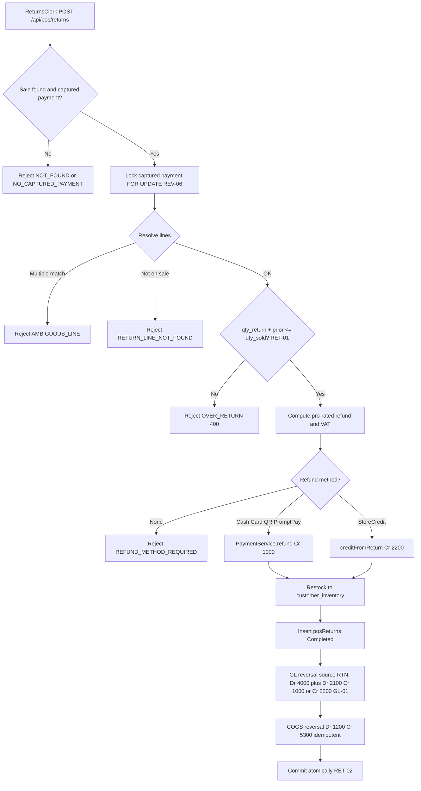

# Returns, Claims & Refunds — Process Narrative

## 1. Document control

| Field | Value |
|---|---|
| Process ID | PN-21-RET |
| Process owner | `<<Revenue Controller / Customer Service>>` |
| Approver | `<<CFO>>` |
| Version | **0.1 DRAFT** |
| Effective date | `<<effective-date>>` |
| Review cadence | Annual + on significant change |
| Related RCM controls | RET-01, RET-02, RET-03, REV-06, GL-01; SoD R08, R12 |
| Related policy | `compliance/policies/03-delegation-of-authority.md`, `compliance/policies/11-financial-close-policy.md` |

## 2. Purpose

To define and control the processing of merchandise returns, the issuance of refunds and store credit, and the management of customer (sales) and supplier (goods-received) claims — so that refunds are **valid, authorized, accurate, and never issued without a corresponding return record**, that revenue, VAT, inventory, and COGS are reversed completely and on a balanced basis, and that the customer-deposit liability for store credit is stated accurately.

## 3. Scope

**In scope:** POS returns (`POST /api/pos/returns`, prefix RTN-), pro-rated refund computation, refund tender (Cash / Card / QR / PromptPay / Store Credit), restock to customer inventory, automatic GL revenue/VAT reversal and COGS reversal, sales claims (`/api/claims/sales`), and supplier / goods-received claims (`/api/claims/gr`, prefix GRC-).

**Out of scope:** Original sale capture, payment capture, and the over-refund guard under payment lock (see `01-order-to-cash.md`, control REV-06); credit-note / e-Tax mechanics for CRN (see `06-tax-compliance.md`); gift-card / store-credit issuance and redemption accounting (see `22-gift-cards-store-credit.md`).

## 4. References

- ISO 9001:2015 cl. 4.4 (process approach), cl. 8.2 (customer communication / requirements), cl. 8.6 (release of products and services), cl. 8.7 (control of nonconforming outputs).
- `compliance/Oshinei_ERP_SOX_RCM_v1.xlsx` — RET-01, RET-02, RET-03, REV-06, GL-01.
- `compliance/policies/03-delegation-of-authority.md` (refund authority), `11-financial-close-policy.md` (cutoff of revenue reversals).
- Code: `apps/api/src/modules/returns/returns.service.ts`, `apps/api/src/modules/claims/claims.service.ts`, `apps/api/src/modules/payments/payments.service.ts`, `apps/api/src/modules/giftcards/giftcards.service.ts`, `apps/api/src/modules/ledger/ledger.service.ts`.

## 5. Definitions & abbreviations

| Term | Meaning |
|---|---|
| RTN- | Return document-number prefix (daily) |
| GRC- | Goods-received / supplier claim document-number prefix |
| Pro-rated refund | Refund apportioned by returned qty over sold qty (`lineNet = amount * returnQty / soldQty`) |
| Store credit | Refund issued as a gift-card balance, recognized as a 2200 Customer Deposits liability |
| Captured payment | The original tender row eligible for refund, locked `FOR UPDATE` during return |
| CRN | Credit note (e-Tax), see `06-tax-compliance.md` |
| Claim | A management ticket (sales or supplier) carrying no direct GL or inventory impact |

## 6. Roles & responsibilities (RACI)

Single-duty roles enforce SoD: the role that **records a sale** is never the role that **processes the refund or reconciles the till** (**R08**), and the role that **processes a return** is never the role that **authorizes / issues the refund** (**R12**). Sales claims require `claim_mgt`; supplier/GR claims require `procurement`; returns require `returns` / `pos`.

| Activity | Cashier / Sales | ReturnsClerk | PosSupervisor | ClaimsManager | ProcurementClerk | FinancialController |
|---|---|---|---|---|---|---|
| Capture original sale | **A/R** | I | C | I | I | I |
| Process return + restock (RTN-) | I | **A/R** | C | I | I | I |
| Authorize / issue refund tender | I | C | **A/R** | I | I | I |
| Issue store credit on return | I | R | **A/R** | I | I | I |
| Manage sales claim (approve/reject) | I | I | C | **A/R** | I | I |
| Raise / resolve supplier (GR) claim | I | I | I | C | **A/R** | I |
| Review GL reversal tie-out | I | I | I | I | I | **A/R** |

## 7. Process narrative

1. **Return request.** ReturnsClerk submits `POST /api/pos/returns` (`sale_no`, `items[]`, `reason`, `refund_method`, optional `gift_card_no`). The original sale must exist (`NOT_FOUND`) and carry a captured payment (`NO_CAPTURED_PAYMENT`). Lookups are RLS-scoped; cross-tenant requests resolve to not-found. Queries `GET /api/pos/returns/:return_no` and `GET /api/pos/returns?sale_no=` support enquiry. The entire return runs as **one atomic transaction** — it commits in full or rolls back; **no money is refunded without a return record** (**RET-02**).
2. **Serialize on payment lock.** The captured payment row is locked `SELECT ... FOR UPDATE`, serializing concurrent returns against the same sale and underpinning the over-refund interplay (**REV-06**, see `01-order-to-cash.md`).
3. **Resolve return lines.** Each requested line is resolved by `sale_item_id` or `item_id`; an `item_id` matching multiple sale lines → `AMBIGUOUS_LINE`; a line not present on the sale → `RETURN_LINE_NOT_FOUND`.
4. **Over-return guard.** When `qty_return + prior_returned > qty_sold` the request is rejected `OVER_RETURN` (400), preventing cumulative returns exceeding the quantity sold (**RET-01**).
5. **Compute pro-rated refund.** Line refund = `amount * returnQty / soldQty`; returned VAT = `sale.tax * subtotalReturned / sale.subtotal`, so refunded revenue and VAT track the original sale proportionally.
6. **Determine refund tender.** For Cash / Card / QR / PromptPay the refund is issued via `PaymentService.refund` (**Cr 1000 Cash**). For Store Credit, `GiftCardService.creditFromReturn` mints or tops up a gift card (**Cr 2200 Customer Deposits**). A missing method → `REFUND_METHOD_REQUIRED` (rejects `None`).
7. **Restock.** Returned units are restocked to `customer_inventory` where present.
8. **Persist return.** `posReturns` / `posReturnItems` are inserted with status **Completed**.
9. **GL reversal (idempotent, source RTN).** A balanced reversing journal posts **Dr 4000 Revenue + Dr 2100 VAT Output / Cr 1000 Cash** (or **Cr 2200 Customer Deposits** for store credit). Re-posting is idempotent on source RTN (**GL-01**, **RET-02**).
10. **COGS / inventory reversal (idempotent).** Recipe / COGS is reversed **Dr 1200 Inventory / Cr 5300 COGS**, idempotently (see `03-inventory-cogs.md`).
11. **Sales claims.** `GET /api/claims/sales?status=` lists tickets; `PATCH /api/claims/sales/:id` approves or rejects — **a rejection requires a reason**. Claims are management tickets with **no GL and no inventory impact** (Operational); they may feed downstream returns or credit notes (CRN, see `06-tax-compliance.md`).
12. **Supplier / GR claims.** `POST /api/claims/gr` raises a supplier claim (prefix GRC-); `GET /api/claims/gr` lists; `PATCH /api/claims/gr/:claimNo` transitions to Resolved / Rejected. Operational only — no direct GL or inventory posting.

## 8. Process flow

**Swimlane description by role:** **ReturnsClerk** initiates the return and triggers restock. The **system** locks the captured payment, resolves lines, enforces the over-return guard, computes the pro-rated refund and VAT, posts the balanced GL and COGS reversals, and commits the whole transaction atomically. **PosSupervisor** authorizes / issues the refund tender and store credit, segregated from return processing (**R12**). **ClaimsManager** dispositions sales claims (reject requires a reason); **ProcurementClerk** raises and resolves supplier (GR) claims. **FinancialController** reviews the reversal tie-out.

## 9. Control matrix

| Step | Risk | Control | Type | RCM ID | Evidence / Record |
|---|---|---|---|---|---|
| 4 | Returns exceed quantity originally sold | Over-return guard (`qty_return + prior > qty_sold` → `OVER_RETURN`) | Prev / Auto | RET-01 | `OVER_RETURN` test, return ledger |
| 1,8,9,10 | Refund issued without return record or partial state | Single atomic transaction (refund + restock + return + GL/COGS reversal) | Prev / Auto | RET-02 | Atomicity injection test |
| 6 | Return processor self-issues refund | SoD: refund authorization segregated from return processing | Prev / Manual | RET-03, R12 | SoD conflict report |
| 2 | Concurrent refunds exceed captured amount | Over-refund guard under payment-row lock `FOR UPDATE` | Prev / Auto | REV-06 | `OVER_REFUND` test (`01-order-to-cash.md`) |
| 9 | Revenue/VAT reversal unbalanced or duplicated | Balanced, idempotent reversing JE (source RTN) | Auto | GL-01 | Sale→reversal tie-out sample |
| 6 | Store-credit liability misstated | `creditFromReturn` posts Cr 2200; tie-out to GL 2200 | Prev / Auto | GL-01 | Gift-card sub-ledger (`22-gift-cards-store-credit.md`) |
| 11 | Unjustified claim rejection | Reject-reason required on `PATCH /api/claims/sales/:id` | Det / Auto | Operational | Claim audit trail |
| 1,11 | Record sale and self-process return/refund | SoD: sale recording vs refund/till | Prev / Manual | R08 | SoD conflict report |

## 10. Inputs & outputs

**Inputs:** original sale (`sale_no`) with captured payment, return request (`items[]`, `reason`, `refund_method`, optional `gift_card_no`), sales claim tickets, supplier / GR claim requests.
**Outputs:** return document (RTN-) and lines (Completed), refund tender (Cash/Card/QR/PromptPay or store credit on a gift card), balanced revenue+VAT reversal JE, COGS/inventory reversal JE, restocked `customer_inventory`, sales-claim dispositions, supplier-claim records (GRC-).

## 11. Records & retention

| Record | Store | Retention |
|---|---|---|
| Returns / return lines (RTN-) | Application DB (RLS-scoped) | `<<7 years / per Thai law>>` |
| Refund tenders | Application DB | `<<7 years>>` |
| GL revenue/VAT and COGS reversals | `journal_entries` (source RTN) | `<<7 years>>` |
| Sales claims & dispositions | Application DB | `<<7 years>>` |
| Supplier / GR claims (GRC-) | Application DB | `<<7 years>>` |
| Audit trail of mutations | `audit_log` (append-only) | `<<7 years>>` |

## 12. KPIs / metrics

- Over-return attempts blocked (count of `OVER_RETURN`).
- Return-to-GL reversal exceptions (target: 0 unbalanced/unposted).
- Refund issued without return record (target: 0).
- Store-credit liability (2200) created from returns vs GL tie-out variance (target: 0).
- Sales-claim cycle time and reject rate; supplier (GR) claim recovery rate.

## 13. Exception & error handling

| Error code | Trigger | Handling |
|---|---|---|
| `NOT_FOUND` | Sale / return not found (or cross-tenant) | Verify `sale_no` within tenant scope |
| `NO_CAPTURED_PAYMENT` | Sale has no captured payment to refund | Confirm original tender captured before return |
| `AMBIGUOUS_LINE` | `item_id` matches multiple sale lines | Resubmit using explicit `sale_item_id` |
| `RETURN_LINE_NOT_FOUND` | Requested line not on the sale | Correct the line reference |
| `OVER_RETURN` (400) | `qty_return + prior_returned > qty_sold` | Return denied; PosSupervisor reviews quantities |
| `REFUND_METHOD_REQUIRED` | `refund_method` is `None` / missing | Resubmit with a valid tender method |
| `OVER_REFUND` | Refund + priors > captured (under lock) | Refund denied (`01-order-to-cash.md`) |
| Claim reject without reason | `PATCH .../sales/:id` reject with no reason | Rejected; ClaimsManager must supply reason |

## 14. Revision history

| Version | Date | Author | Summary |
|---|---|---|---|
| 0.1 DRAFT | 2026-06-22 | `<<author>>` | Initial draft. |
