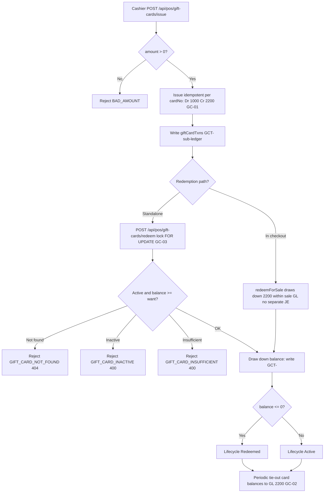

# Gift Cards & Store Credit — Process Narrative

## 1. Document control

| Field | Value |
|---|---|
| Process ID | PN-22-GC |
| Process owner | `<<Revenue Controller>>` |
| Approver | `<<CFO>>` |
| Version | **0.1 DRAFT** |
| Effective date | `<<effective-date>>` |
| Review cadence | Annual + on significant change |
| Related RCM controls | GC-01, GC-02, GC-03, GL-01; SoD R08 |
| Related policy | `compliance/policies/03-delegation-of-authority.md`, `compliance/policies/11-financial-close-policy.md` |

## 2. Purpose

To define and control the issuance, redemption, and reconciliation of gift cards and store credit — so that each card represents an accurately stated **2200 Customer Deposits liability**, issuance posts a **balanced and idempotent** journal entry, redemptions draw down the liability without double-spend, and unredeemed (outstanding) balances are completely tracked and periodically tied out to the general ledger.

## 3. Scope

**In scope:** Gift-card / store-credit sale (`POST /api/pos/gift-cards/issue`, prefix GC-), balance enquiry, standalone redemption (`POST /api/pos/gift-cards/redeem`), redemption within checkout (`redeemForSale`), store credit minted from returns (`creditFromReturn`), the gift-card sub-ledger (`giftCardTxns`, prefix GCT-), and card lifecycle states.

**Out of scope:** The original sale GL entry that absorbs an in-checkout redemption (see `01-order-to-cash.md` and `20-restaurant-operations.md`); the return transaction that mints store credit (see `21-returns-claims-refunds.md`); cash / till reconciliation of issuance proceeds (see `07-cash-treasury.md`).

## 4. References

- ISO 9001:2015 cl. 4.4 (process approach), cl. 8.2 (customer communication), cl. 8.5 (control of provision), cl. 8.6 (release).
- `compliance/Oshinei_ERP_SOX_RCM_v1.xlsx` — GC-01, GC-02, GC-03, GL-01.
- `compliance/policies/03-delegation-of-authority.md`, `11-financial-close-policy.md` (liability tie-out at close).
- Code: `apps/api/src/modules/giftcards/giftcards.service.ts`, `apps/api/src/modules/pos/pos.service.ts`, `apps/api/src/modules/returns/returns.service.ts`, `apps/api/src/modules/ledger/ledger.service.ts`.

## 5. Definitions & abbreviations

| Term | Meaning |
|---|---|
| GC- / GCT- | Card document-number prefix / card-transaction (sub-ledger) prefix |
| 2200 Customer Deposits | Liability account holding unredeemed gift-card / store-credit value |
| Outstanding liability | Sum of unredeemed card balances (open obligation) |
| Breakage | Aged / unredeemed balances unlikely to be redeemed |
| `giftCardTxns` | Sub-ledger / audit trail of all card movements |
| FOR UPDATE | Row lock taken on redeem to serialize draw-downs |
| Lifecycle | Active → Redeemed (balance ≤ 0) → Active (on top-up) |

## 6. Roles & responsibilities (RACI)

Single-duty roles enforce SoD: the role that **issues or redeems** cards is never the role that **reconciles card balances to the GL** (**R08**). All issuance / redemption endpoints require the `pos` permission; data is RLS-scoped so cross-tenant card lookups resolve to not-found.

| Activity | Cashier / POS | PosSupervisor | ReturnsClerk | FinancialController |
|---|---|---|---|---|
| Issue / sell gift card (GC-) | **A/R** | C | I | I |
| Redeem card (standalone / checkout) | **A/R** | C | I | I |
| Mint store credit from return | I | C | **A/R** | I |
| Enquire card balance | R | R | R | R |
| Reconcile card balances to GL 2200 | I | C | I | **A/R** |
| Review breakage / aged balances | I | C | I | **A/R** |

## 7. Process narrative

1. **Issuance.** Cashier sells a card via `POST /api/pos/gift-cards/issue` (prefix GC-). The sale posts a balanced journal **Dr 1000 Cash / Cr 2200 Customer Deposits**, recognizing the unredeemed value as a liability. Posting is **idempotent per `cardNo`**; an amount `<= 0` is rejected `BAD_AMOUNT` (**GC-01**, **GL-01**).
2. **Balance enquiry.** `GET /api/pos/gift-cards/:card_no/balance` returns the current balance. Lookups are RLS-scoped; a cross-tenant card resolves to `GIFT_CARD_NOT_FOUND` (404).
3. **Standalone redemption.** `POST /api/pos/gift-cards/redeem` applies card value against a sale. The card row is locked `SELECT ... FOR UPDATE` and validated **Active** with `balance >= want`, preventing concurrent double-spend (**GC-03**). Failures: `GIFT_CARD_NOT_FOUND` (404), `GIFT_CARD_INACTIVE` (400), `GIFT_CARD_INSUFFICIENT` (400).
4. **Checkout redemption.** Within a sale, `redeemForSale` draws down 2200 **inside the sale's GL entry** — there is **no separate journal entry** (see `01-order-to-cash.md`, `20-restaurant-operations.md`). The liability reduction is recognized as the sale is recorded.
5. **Store credit from returns.** During a return transaction, `creditFromReturn` mints a new card or tops up an existing one, posting **Cr 2200 Customer Deposits** within the return's atomic transaction (see `21-returns-claims-refunds.md`).
6. **Sub-ledger.** Every movement (issue, redeem, top-up) writes a `giftCardTxns` row (prefix GCT-), providing the audit trail and sub-ledger against which GL 2200 is reconciled.
7. **Lifecycle.** A card is **Active** while it carries value; it becomes **Redeemed** when `balance <= 0`, and returns to **Active** on a subsequent top-up (e.g., further store credit).
8. **Periodic tie-out.** FinancialController periodically reconciles the sum of unredeemed card balances (`giftCardTxns`) to GL **2200 Customer Deposits**, addressing completeness and identifying breakage / aged balances (**GC-02**). The **gift-card register** (`GET /api/pos/gift-cards`, screen `/giftcards`) is the supporting view: it lists every card for the tenant — filterable by status / card number — with the live **outstanding liability** (Σ Active balances) and a per-card transaction drill-down (`GET /api/pos/gift-cards/:card_no/txns`), giving the reconciler the 2200 obligation at a glance without a SQL query. Both reads are tenant-scoped (an HQ/Admin request bypasses RLS, so the service filters `tenant_id` explicitly) and visible to `pos` / `creditors` / `exec`; they are **read-only** and post nothing.

## 8. Process flow

**Swimlane description by role:** **Cashier / POS** issues cards and redeems them at point of sale; the **system** posts the balanced issuance JE, enforces idempotency per `cardNo`, takes the `FOR UPDATE` lock to serialize redemptions, validates Active / sufficient balance, and writes every movement to the `giftCardTxns` sub-ledger. **ReturnsClerk** mints store credit from returns (Cr 2200 within the return tx). **FinancialController** periodically reconciles unredeemed balances to GL 2200 and reviews breakage — duties segregated from issuance / redemption (**R08**).

## 9. Control matrix

| Step | Risk | Control | Type | RCM ID | Evidence / Record |
|---|---|---|---|---|---|
| 1 | Issuance unbalanced or double-posted | Balanced JE (Dr 1000 Cr 2200), idempotent per `cardNo` | Prev / Auto | GC-01, GL-01 | Issuance JE sample, idempotency test |
| 1 | Zero / negative card value issued | `BAD_AMOUNT` guard (`amount <= 0`) | Prev / Auto | GC-01 | `BAD_AMOUNT` test |
| 3 | Concurrent redemption double-spend | Card-row lock `FOR UPDATE` + Active / balance check | Prev / Auto | GC-03 | Concurrency test, `giftCardTxns` |
| 3 | Redemption against inactive / empty card | `GIFT_CARD_INACTIVE` / `GIFT_CARD_INSUFFICIENT` guards | Prev / Auto | GC-03 | Negative-path tests |
| 8 | Unredeemed liability (2200) incomplete / misstated | Periodic tie-out of card balances to GL 2200; breakage review | Det / Manual | GC-02 | Tie-out working paper, breakage report |
| 2 | Cross-tenant card disclosure | RLS-scoped lookup returns 404 | Prev / Auto | GC-02 | RLS test |
| 1,3 | Issue / redeem and self-reconcile | SoD: issuance / redemption vs reconciliation | Prev / Manual | R08 | SoD conflict report |

## 10. Inputs & outputs

**Inputs:** card sale request (amount, `cardNo`), redemption request (`card_no`, want), checkout redemption context, store-credit instruction from returns.
**Outputs:** issued gift card (GC-), balanced issuance JE (Dr 1000 / Cr 2200), `giftCardTxns` sub-ledger rows (GCT-), drawn-down balances, lifecycle state transitions, periodic 2200 tie-out working paper.

## 11. Records & retention

| Record | Store | Retention |
|---|---|---|
| Gift cards (GC-) | Application DB (RLS-scoped) | `<<7 years / per Thai law>>` |
| Card transactions (`giftCardTxns`, GCT-) | Application DB (sub-ledger) | `<<7 years>>` |
| Issuance / redemption GL entries | `journal_entries` | `<<7 years>>` |
| 2200 tie-out working papers | Close working papers | `<<7 years>>` |
| Audit trail of mutations | `audit_log` (append-only) | `<<7 years>>` |

## 12. KPIs / metrics

- Outstanding gift-card / store-credit liability (GL 2200 balance) and trend.
- Card-balance to GL 2200 tie-out variance (target: 0).
- Double-spend / concurrency rejections (count of `GIFT_CARD_INSUFFICIENT`).
- Breakage rate and aged unredeemed balances (> `<<n>>` days).
- Issuance JE exceptions (target: 0 unbalanced/unposted).

## 13. Exception & error handling

| Error code | Trigger | Handling |
|---|---|---|
| `BAD_AMOUNT` | Issuance `amount <= 0` | Reject; re-enter a positive amount |
| `GIFT_CARD_NOT_FOUND` (404) | Card absent or cross-tenant | Verify `card_no` within tenant scope |
| `GIFT_CARD_INACTIVE` (400) | Redeem against non-Active card | Confirm card status; reissue if appropriate |
| `GIFT_CARD_INSUFFICIENT` (400) | `balance < want` | Reduce redemption or split tender |
| 2200 tie-out variance | Card balances ≠ GL 2200 | FinancialController investigates `giftCardTxns` vs GL |
| Aged unredeemed balance | Card dormant beyond threshold | Breakage assessment per policy |

## 14. Revision history

| Version | Date | Author | Summary |
|---|---|---|---|
| 0.1 DRAFT | 2026-06-22 | `<<author>>` | Initial draft. |
| 0.2 | 2026-06-26 | Platform | **Gift-card register surfaced** — `GiftCardService.listCards` on `GET /api/pos/gift-cards` (every card for the tenant + `outstanding` = Σ Active balances + `active`/`total` counts; filter `status`/`search`) and `cardTxns` on `GET /api/pos/gift-cards/:card_no/txns` (per-card GCT- ledger). New screen `/giftcards` (POS nav, perms `pos`/`creditors`/`exec`). The list/audit view over the existing issue/redeem/balance backend — sizes the **2200** liability and supports the **GC-02** tie-out. Tenant-scoped (explicit `tenant_id` filter); typed builders / column refs only; read-only; no migration / no new control. ToE: `giftcards` harness (register lists T1 cards with outstanding 500 + excludes T2 by RLS; `?status=Redeemed` filter; Issue/Redeem drill-down with `balance_after`). |
