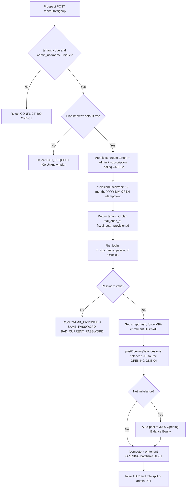

# Customer Onboarding & Provisioning — Process Narrative

## 1. Document control

| Field | Value |
|---|---|
| Process ID | PN-23-ONB |
| Process owner | `<<Controller / Platform Admin>>` |
| Approver | `<<CFO>>` |
| Version | **0.1 DRAFT** |
| Effective date | `<<effective-date>>` |
| Review cadence | Annual + on significant change |
| Related RCM controls | ONB-01, ONB-02, ONB-03, ONB-04, GL-01, ITGC-CM, ITGC-AC; SoD R01 |
| Related policy | `compliance/policies/03-delegation-of-authority.md`, `compliance/policies/11-financial-close-policy.md` |

## 2. Purpose

To define and control the onboarding of a new tenant and its ledger provisioning — so that tenant, admin user, and subscription are created **atomically and without identifier collision**, the new tenant can post immediately against a complete set of open fiscal periods, the chart of accounts and ledgers are code-governed and change-managed, the first administrator is forced through credential hardening and MFA, and opening balances are migrated on a **balanced, idempotent, and authorized** basis tying to the prior system.

## 3. Scope

**In scope:** Tenant self-service signup (`POST /api/auth/signup` via `BillingService.signup`), uniqueness checks, plan selection, atomic creation of tenant + admin user + subscription, fiscal-year provisioning, forced password change (`POST /api/auth/change-password`) and MFA enrolment, and the opening-balances cutover (`ledger.postOpeningBalances`).

**Out of scope:** Chart-of-accounts / ledger seeding internals and change management (see `17-master-data-management.md`, `08-itgc.md`, control ITGC-CM); ongoing access reviews and MFA administration (see `08-itgc.md`); period-end close and fiscal-period closing (see `04-general-ledger-close.md`).

## 4. References

- ISO 9001:2015 cl. 4.4 (process approach, including interactions), cl. 8.1 (operational planning and control), cl. 8.5 (control of provision), cl. 8.6 (release).
- `compliance/Oshinei_ERP_SOX_RCM_v1.xlsx` — ONB-01, ONB-02, ONB-03, ONB-04, GL-01, ITGC-CM, ITGC-AC.
- `compliance/policies/03-delegation-of-authority.md` (admin authorization), `11-financial-close-policy.md` (opening-balance cutover).
- Code: `apps/api/src/modules/billing/billing.service.ts`, `apps/api/src/modules/auth/auth.service.ts`, `apps/api/src/modules/ledger/ledger.service.ts`, `apps/api/src/main.ts` (`seedChartOfAccounts`, `seedLedgers`).

## 5. Definitions & abbreviations

| Term | Meaning |
|---|---|
| Tenant | An isolated customer organization (RLS boundary) keyed by `tenant_code` |
| COA | Chart of accounts (~30 accounts), seeded at app startup, code-governed |
| Ledger | TFRS / TAX / IFRS reporting ledger, seeded at startup |
| Fiscal period | A `YYYY-MM` row in `fiscal_periods` (OPEN / CLOSED) |
| Trialing | Subscription status with `trialEndsAt = now + 14d` |
| Opening balances | Migrated prior-system balances posted as one balanced JE (source OPENING) |
| 3000 Opening Balance Equity | Account absorbing any opening-balance net imbalance |
| `must_change_password` | Flag forcing first-login credential reset |
| MFA | Multi-factor authentication, forced for Admin / sensitive perms |

## 6. Roles & responsibilities (RACI)

Single-duty roles enforce SoD. The initial administrator necessarily holds broad rights at onboarding; this is a known risk requiring prompt user-access review (UAR) and role split (**R01**, see `08-itgc.md`). COA / ledger structures are code-governed, not runtime-editable, and change only through ITGC change management (**ITGC-CM**).

| Activity | Prospective Tenant | Platform Admin | New Tenant Admin | Controller | Access Admin |
|---|---|---|---|---|---|
| Submit signup (`/api/auth/signup`) | **A/R** | I | I | I | I |
| Atomic tenant + admin + subscription create | (system) | C | I | I | I |
| Fiscal-year provisioning | (system) | I | I | C | I |
| COA / ledger seeding & change | I | C | I | C | I |
| Forced password change (first admin) | I | I | **A/R** | I | C |
| MFA enrolment | I | I | **A/R** | I | C |
| Post opening balances (cutover) | I | I | C | **A/R** | I |
| Initial UAR / role split of admin | I | C | I | C | **A/R** |

## 7. Process narrative

1. **Uniqueness validation.** `POST /api/auth/signup` (Public, via `BillingService.signup`) validates that `tenant_code` and `admin_username` are **globally unique** → `CONFLICT` (409) "Tenant code already taken" / "Username already taken" (**ONB-01**).
2. **Plan selection.** A plan is selected, defaulting to `free`; an unrecognized plan → `BAD_REQUEST` (400) "Unknown plan".
3. **Atomic provisioning.** Within a single transaction the service creates the **tenant** (`code`, `name`, `legalName`, `taxId`, `vatRegistered`, `vatRate`), the **admin user** (role `Admin`, bound to `tenantId`), and the **subscription** (status `Trialing`, `trialEndsAt = now + 14d`). All-or-nothing — a failure rolls back tenant, admin, and subscription together (**ONB-02**).
4. **Fiscal-year provisioning.** `ledger.provisionFiscalYear(currentYear, tenantId)` idempotently ensures all twelve `YYYY-MM` rows exist in `fiscal_periods` as **OPEN**, so the new tenant can post immediately (completeness of posting periods).
5. **Response.** Signup returns `tenant_id`, `plan`, `trial_ends_at`, and `fiscal_year_provisioned`.
6. **Chart of accounts & ledgers (code-governed).** The ~30-account COA (`seedChartOfAccounts`, idempotent on `accounts.code`) and ledgers TFRS / TAX / IFRS (`seedLedgers`) are seeded at **app startup** via `main.ts`. They are **global and code-governed — not per-tenant runtime-editable** — and change only through ITGC change management (**ITGC-CM**, see `17-master-data-management.md`, `08-itgc.md`).
7. **Forced password change.** The new admin is flagged `must_change_password`. `POST /api/auth/change-password` enforces strength rules: `WEAK_PASSWORD` (< 8 chars), `SAME_PASSWORD`, `BAD_CURRENT_PASSWORD`. Hashes are stored as `scrypt$salt$hex`; legacy SHA-256 hashes are auto-rehashed on next login (**ONB-03**, **ITGC-AC**).
8. **MFA enrolment.** MFA is forced for Admin / sensitive-permission users at onboarding (see `08-itgc.md`).
6a. **Org profile & branding — self-service (perm `users`).** After signup a tenant admin completes/edits the org record via `GET`/`PATCH /api/tenant/profile` (legal name, tax id, branch, VAT registration/rate, address, PromptPay id, default language) — RLS scopes the admin to **their own** tenant row (`id == app.tenant_id`). **Branding (Platform Phase 9):** the same endpoint also accepts a **logo** (a pasted `https` URL or a small image data-URI; other schemes rejected `400`), a **tagline**, and a `branding_prefs` blob (e.g. `show_logo_on_receipt`). These are **genuinely consumed** — the receipt header renders the logo (when set and not suppressed by prefs) and the tagline beneath the company name; `default_language` already selects the receipt language. No GL, no new control — tenant-self-service identity/branding, isolated by RLS.

9. **Opening-balances cutover.** `ledger.postOpeningBalances(rows[{account_code, debit?, credit?}], batchRef, createdBy, tenantId)` posts **one balanced JE** (source OPENING, ref `batchRef`). Any net imbalance auto-posts to **3000 Opening Balance Equity**. The post is **idempotent on (tenant, OPENING, `batchRef`)** so re-runs never double-post. Rows are validated (`NO_VALID_ROWS`) and `row_errors` are reported. This is the cutover control: balanced, idempotent, authorized opening balances tying to the prior system (**ONB-04**, **GL-01**).
10. **Initial access risk.** The first admin holds broad rights; an early UAR and role split is required to relieve the inherent SoD concentration (**R01**, see `08-itgc.md`).

## 8. Process flow

**Swimlane description by role:** The **prospective tenant** submits signup. The **system** enforces global uniqueness, selects the plan, atomically creates tenant + admin + subscription, idempotently provisions twelve open fiscal periods, and (at startup) seeds the code-governed COA and ledgers. The **new tenant admin** completes the forced password change and MFA enrolment. The **Controller** posts the balanced, idempotent opening-balances cutover, with any imbalance routed to 3000 Opening Balance Equity. The **Access Admin** runs the initial UAR and splits the admin role to relieve the onboarding SoD concentration (**R01**).

## 9. Control matrix

| Step | Risk | Control | Type | RCM ID | Evidence / Record |
|---|---|---|---|---|---|
| 1 | Duplicate tenant code / username collision | Global uniqueness check → `CONFLICT` 409 | Prev / Auto | ONB-01 | `CONFLICT` test, unique index |
| 3 | Partial provisioning (orphan tenant/admin/sub) | Single atomic transaction (all-or-nothing) | Prev / Auto | ONB-02 | Atomicity injection test |
| 4 | Tenant cannot post / missing periods | Idempotent fiscal-year provisioning (12 OPEN months) | Prev / Auto | ONB-02 | `fiscal_periods` export |
| 6 | Unauthorized COA / ledger change | Code-governed seeding, idempotent, change-managed | Prev / Manual | ITGC-CM | Change ticket, code review |
| 7,8 | Weak / default first-admin credentials | Forced password change + strength rules + MFA | Prev / Auto | ONB-03, ITGC-AC | `change-password` tests, MFA logs |
| 9 | Opening balances unbalanced / double-posted | One balanced JE, imbalance to 3000, idempotent on batchRef | Prev / Auto | ONB-04, GL-01 | Cutover JE, prior-system tie-out |
| 9 | Invalid opening rows posted | Row validation (`NO_VALID_ROWS`, `row_errors`) | Prev / Auto | ONB-04 | Validation report |
| 10 | Initial admin over-privileged | Initial UAR + role split | Det / Manual | R01 | UAR record (`08-itgc.md`) |

## 10. Inputs & outputs

**Inputs:** signup payload (`tenant_code`, `admin_username`, `name`, `legalName`, `taxId`, `vatRegistered`, `vatRate`, plan), prior-system opening-balance rows (`account_code`, `debit`/`credit`, `batchRef`), new-admin credential and MFA enrolment.
**Outputs:** tenant, admin user (role Admin), subscription (Trialing, +14d), twelve OPEN `fiscal_periods`, signup response (`tenant_id`, `plan`, `trial_ends_at`, `fiscal_year_provisioned`), hardened admin credential, balanced opening-balances JE (source OPENING).

## 11. Records & retention

| Record | Store | Retention |
|---|---|---|
| Tenant / subscription records | Application DB (RLS-scoped) | `<<7 years / per Thai law>>` |
| Admin user & credential metadata | Application DB | `<<7 years>>` |
| Fiscal periods provisioned | `fiscal_periods` | `<<7 years>>` |
| Opening-balances JE (source OPENING) | `journal_entries` | `<<7 years>>` |
| COA / ledger seed + change tickets | Code repo / change records | `<<7 years>>` |
| Audit trail of mutations | `audit_log` (append-only) | `<<7 years>>` |

## 12. KPIs / metrics

- Tenant-code / username collisions blocked (count of `CONFLICT`).
- Failed / partial provisioning incidents (target: 0).
- Tenants posting before fiscal-year provisioned (target: 0).
- First-admin MFA enrolment completion rate (target: 100%).
- Opening-balance imbalance routed to 3000 (count and amount; reviewed).
- Days from onboarding to initial UAR / role split.

## 13. Exception & error handling

| Error code | Trigger | Handling |
|---|---|---|
| `CONFLICT` (409) | Tenant code / username already taken | Choose a unique identifier and resubmit |
| `BAD_REQUEST` (400) "Unknown plan" | Plan not recognized | Select a valid plan (default `free`) |
| `WEAK_PASSWORD` | New password < 8 chars | Re-enter meeting strength rules |
| `SAME_PASSWORD` | New password equals current | Choose a different password |
| `BAD_CURRENT_PASSWORD` | Current password incorrect | Re-authenticate with correct password |
| `NO_VALID_ROWS` | Opening-balance batch has no valid rows | Correct input; review `row_errors` |
| Opening-balance imbalance | Rows net non-zero | Auto-posted to 3000; Controller reviews and reconciles to prior system |

## 14. Revision history

| Version | Date | Author | Summary |
|---|---|---|---|
| 0.1 DRAFT | 2026-06-22 | `<<author>>` | Initial draft. |
| 0.2 | 2026-06-24 | Platform | Platform Phase 9: §7 step 6a — self-service org profile & **branding** (`PATCH /api/tenant/profile` adds `logo_url`/`tagline`/`branding_prefs`, validated; logo + tagline genuinely rendered on the receipt header, RLS-isolated). Migration 0086 (additive tenant columns). No GL, no new control; verified by the `ext` harness. |
