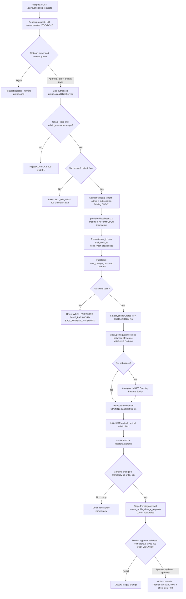

# Customer Onboarding & Provisioning — Process Narrative

## 1. Document control

| Field | Value |
|---|---|
| Process ID | PN-23-ONB |
| Process owner | `<<Controller / Platform Admin>>` |
| Approver | `<<CFO>>` |
| Version | **0.1 DRAFT** |
| Effective date | `<<effective-date>>` |
| Review cadence | Annual + on significant change |
| Related RCM controls | ONB-01, ONB-02, ONB-03, ONB-04, GL-01, ITGC-CM, ITGC-AC; SoD R01 |
| Related policy | `compliance/policies/03-delegation-of-authority.md`, `compliance/policies/11-financial-close-policy.md` |

## 2. Purpose

To define and control the onboarding of a new tenant and its ledger provisioning — so that tenant, admin user, and subscription are created **atomically and without identifier collision**, the new tenant can post immediately against a complete set of open fiscal periods, the chart of accounts and ledgers are code-governed and change-managed, the first administrator is forced through credential hardening and MFA, and opening balances are migrated on a **balanced, idempotent, and authorized** basis tying to the prior system.

## 3. Scope

**In scope:** New-company provisioning (the atomic creation of tenant + admin user + subscription via `BillingService`), the **god-only** provisioning paths in production (direct `POST /api/admin/tenants`, single-use signup invite, or approving a **request-access** queue entry), uniqueness checks, plan selection, fiscal-year provisioning, forced password change (`POST /api/auth/change-password`) and MFA enrolment, and the opening-balances cutover (`ledger.postOpeningBalances`).

> **⚠️ Provisioning is god-only in production (ITGC-AC-18).** Public self-service signup (`POST /api/auth/signup`) is **disabled unconditionally in production** — `BillingService.isSignupAllowed()` returns true only outside production, and the legacy **`PUBLIC_SIGNUP_ENABLED`** env flag is now a **no-op** for provisioning (it neither enables signup nor creates a tenant; `env.validation.ts` warns it has no effect). The public web signup page is now a **request-access form** (`POST /api/auth/signup-requests`) that files a *pending* request and creates **no** tenant. Only the platform owner ("god", `PLATFORM_ADMIN_USERNAMES`) provisions a company — by **direct** `POST /api/admin/tenants`, by issuing a **signup invite**, or by **approving** a queued request (`…/signup-requests/:id/approve`). The atomic-provisioning steps below describe what that god-authorised action performs. Because the first `Admin` is minted with the tenant, keeping provisioning god-only also keeps the *first* Admin grant on the god path (consistent with the AC-02 Admin-grant restriction, `08-itgc.md` §7.A step 3a). Full model + the three onboarding flows: `docs/ops/tenancy-model.md` §2/§2bis.

**Out of scope:** Chart-of-accounts / ledger seeding internals and change management (see `17-master-data-management.md`, `08-itgc.md`, control ITGC-CM); ongoing access reviews and MFA administration (see `08-itgc.md`); period-end close and fiscal-period closing (see `04-general-ledger-close.md`).

## 4. References

- ISO 9001:2015 cl. 4.4 (process approach, including interactions), cl. 8.1 (operational planning and control), cl. 8.5 (control of provision), cl. 8.6 (release).
- `compliance/Oshinei_ERP_SOX_RCM_v1.xlsx` — ONB-01, ONB-02, ONB-03, ONB-04, GL-01, ITGC-CM, ITGC-AC.
- `compliance/policies/03-delegation-of-authority.md` (admin authorization), `11-financial-close-policy.md` (opening-balance cutover).
- Code: `apps/api/src/modules/billing/billing.service.ts`, `apps/api/src/modules/auth/auth.service.ts`, `apps/api/src/modules/ledger/ledger.service.ts`, `apps/api/src/main.ts` (`seedChartOfAccounts`, `seedLedgers`).

## 5. Definitions & abbreviations

| Term | Meaning |
|---|---|
| Tenant | An isolated customer organization (RLS boundary) keyed by `tenant_code` |
| COA | Chart of accounts (~30 accounts), seeded at app startup, code-governed |
| Ledger | TFRS / TAX / IFRS reporting ledger, seeded at startup |
| Fiscal period | A `YYYY-MM` row in `fiscal_periods` (OPEN / CLOSED) |
| Trialing | Subscription status with `trialEndsAt = now + 14d` |
| Opening balances | Migrated prior-system balances posted as one balanced JE (source OPENING) |
| 3000 Opening Balance Equity | Account absorbing any opening-balance net imbalance |
| `must_change_password` | Flag forcing first-login credential reset |
| MFA | Multi-factor authentication, forced for Admin / sensitive perms |

## 6. Roles & responsibilities (RACI)

Single-duty roles enforce SoD. The initial administrator necessarily holds broad rights at onboarding; this is a known risk requiring prompt user-access review (UAR) and role split (**R01**, see `08-itgc.md`). COA / ledger structures are code-governed, not runtime-editable, and change only through ITGC change management (**ITGC-CM**).

| Activity | Prospective Tenant | Platform Admin (god) | New Tenant Admin | Controller | Access Admin |
|---|---|---|---|---|---|
| Submit **request-access** (`/api/auth/signup-requests`) | **A/R** | I | I | I | I |
| Authorise provisioning — direct create / issue invite / **approve** request (prod) | I | **A/R** | I | I | I |
| Atomic tenant + admin + subscription create | (system) | **A/R** | I | I | I |
| Fiscal-year provisioning | (system) | I | I | C | I |
| COA / ledger seeding & change | I | C | I | C | I |
| Forced password change (first admin) | I | I | **A/R** | I | C |
| MFA enrolment | I | I | **A/R** | I | C |
| Post opening balances (cutover) | I | I | C | **A/R** | I |
| Initial UAR / role split of admin | I | C | I | C | **A/R** |

## 7. Process narrative

0. **Onboarding trigger (production = god-only).** In production the request originates on the **god path**: a platform owner either provisions directly (`POST /api/admin/tenants`), issues a single-use **invite** the prospect redeems, or **approves** a public **request-access** entry (`POST /api/auth/signup-requests` files a pending request; `GET /api/admin/signup-requests` reviews it; `…/:id/approve` provisions with the requester's chosen — hashed — password). Public `POST /api/auth/signup` self-serve provisioning is **off in production** (`isSignupAllowed()` prod-false; `PUBLIC_SIGNUP_ENABLED` no-op) and runs only in dev/harness. Whichever god-authorised path fires, provisioning then proceeds atomically as below (**ITGC-AC-18**).
1. **Uniqueness validation.** Provisioning validates that `tenant_code` and `admin_username` are **globally unique** → `CONFLICT` (409) "Tenant code already taken" / "Username already taken" (**ONB-01**).
2. **Plan selection.** A plan is selected, defaulting to `free`; an unrecognized plan → `BAD_REQUEST` (400) "Unknown plan".
3. **Atomic provisioning.** Within a single transaction the service creates the **tenant** (`code`, `name`, `legalName`, `taxId`, `vatRegistered`, `vatRate`), the **admin user** (role `Admin`, bound to `tenantId`), and the **subscription** (status `Trialing`, `trialEndsAt = now + 14d`). All-or-nothing — a failure rolls back tenant, admin, and subscription together (**ONB-02**).
4. **Fiscal-year provisioning.** `ledger.provisionFiscalYear(currentYear, tenantId)` idempotently ensures all twelve `YYYY-MM` rows exist in `fiscal_periods` as **OPEN**, so the new tenant can post immediately (completeness of posting periods).
5. **Response.** Signup returns `tenant_id`, `plan`, `trial_ends_at`, and `fiscal_year_provisioned`.
6. **Chart of accounts & ledgers (code-governed).** The ~30-account COA (`seedChartOfAccounts`, idempotent on `accounts.code`) and ledgers TFRS / TAX / IFRS (`seedLedgers`) are seeded at **app startup** via `main.ts`. They are **global and code-governed — not per-tenant runtime-editable** — and change only through ITGC change management (**ITGC-CM**, see `17-master-data-management.md`, `08-itgc.md`).
7. **Forced password change.** The new admin is flagged `must_change_password`. `POST /api/auth/change-password` enforces strength rules: `WEAK_PASSWORD` (< 8 chars), `SAME_PASSWORD`, `BAD_CURRENT_PASSWORD`. Hashes are stored as `scrypt$salt$hex`; legacy SHA-256 hashes are auto-rehashed on next login (**ONB-03**, **ITGC-AC**).
8. **MFA enrolment.** MFA is forced for Admin / sensitive-permission users at onboarding (see `08-itgc.md`).
6a. **Org profile & branding — self-service (perm `users`).** After signup a tenant admin completes/edits the org record via `GET`/`PATCH /api/tenant/profile` (legal name, tax id, branch, VAT registration/rate, address, PromptPay id, default language) — RLS scopes the admin to **their own** tenant row (`id == app.tenant_id`). **Branding (Platform Phase 9):** the same endpoint also accepts a **logo** (a pasted `https` URL or a small image data-URI; other schemes rejected `400`), a **tagline**, and a `branding_prefs` blob (e.g. `show_logo_on_receipt`). These are **genuinely consumed** — the receipt header renders the logo (when set and not suppressed by prefs) and the tagline beneath the company name; `default_language` already selects the receipt language. No GL, no new control — tenant-self-service identity/branding, isolated by RLS.

6b. **Financial-profile fields are maker-checked (PromptPay / Tax-ID — SoD R02, G15).** Two of the profile fields carry **payment-target and legal-identity risk**, so a *genuine* change to them via `PATCH /api/tenant/profile` (perm `users`) is **no longer applied directly** — it is **STAGED** as a `PendingApproval` row in **`tenant_profile_change_requests`** (migration **0265**, a new tenant-scoped table with RLS) and written to `tenants` only when a **DISTINCT** approver releases it via **`POST /api/tenant/profile-approvals/:reqNo/approve`** (perm `exec` / `approvals`; a requester approving their own staged change → **`403 SOD_VIOLATION`**). The two staged fields are **`promptpay_id`** (the target that RECEIVES customer QR payments — changing it can **redirect incoming customer payments** to an attacker-controlled account, i.e. cash diversion) and **`tax_id`** (the legal identity printed on issued tax invoices). While a change is pending it is not yet in effect — e.g. PromptPay QR generation still uses the old id / is refused with the new id until the release. **All OTHER profile fields** (address, phone, branding, VAT flags, default language) still **apply immediately**, and a **no-op** (same value) **never stages**. The PATCH response carries **`pending_change: { req_no, fields }`**. The change can also be discarded via **`POST .../profile-approvals/:reqNo/reject`**, and the pending queue is read at **`GET /api/tenant/profile-approvals`**. This strengthens **SoD R02** (no new numbered RCM control). ToE: `tools/cutover/src/promptpay.ts`.

9. **Opening-balances cutover.** `ledger.postOpeningBalances(rows[{account_code, debit?, credit?}], batchRef, createdBy, tenantId)` posts **one balanced JE** (source OPENING, ref `batchRef`). Any net imbalance auto-posts to **3000 Opening Balance Equity**. The post is **idempotent on (tenant, OPENING, `batchRef`)** so re-runs never double-post. Rows are validated (`NO_VALID_ROWS`) and `row_errors` are reported. This is the cutover control: balanced, idempotent, authorized opening balances tying to the prior system (**ONB-04**, **GL-01**).
10. **Initial access risk.** The first admin holds broad rights; an early UAR and role split is required to relieve the inherent SoD concentration (**R01**, see `08-itgc.md`).

## 8. Process flow

**Swimlane description by role:** The **prospective tenant** submits a **request-access** form, which parks a pending request and creates no tenant. The **platform owner (god)** authorises provisioning — approving the request, provisioning directly, or issuing an invite (public self-serve signup is off in production). The **system** then enforces global uniqueness, selects the plan, atomically creates tenant + admin + subscription, idempotently provisions twelve open fiscal periods, and (at startup) seeds the code-governed COA and ledgers. The **new tenant admin** completes the forced password change and MFA enrolment. The **Controller** posts the balanced, idempotent opening-balances cutover, with any imbalance routed to 3000 Opening Balance Equity. The **Access Admin** runs the initial UAR and splits the admin role to relieve the onboarding SoD concentration (**R01**).

## 9. Control matrix

| Step | Risk | Control | Type | RCM ID | Evidence / Record |
|---|---|---|---|---|---|
| 0 | Outsider self-provisions a company (new tenant + Admin with RLS bypass) via public signup | Public self-serve signup disabled in prod (`isSignupAllowed()` prod-false; `PUBLIC_SIGNUP_ENABLED` no-op); public path → request-access queue (no tenant); only god provisions (direct / invite / approve) | Prev / Auto | ITGC-AC-18 | billing.service.ts; signup-gate.test.ts; onboarding ToE |
| 1 | Duplicate tenant code / username collision | Global uniqueness check → `CONFLICT` 409 | Prev / Auto | ONB-01 | `CONFLICT` test, unique index |
| 3 | Partial provisioning (orphan tenant/admin/sub) | Single atomic transaction (all-or-nothing) | Prev / Auto | ONB-02 | Atomicity injection test |
| 4 | Tenant cannot post / missing periods | Idempotent fiscal-year provisioning (12 OPEN months) | Prev / Auto | ONB-02 | `fiscal_periods` export |
| 6 | Unauthorized COA / ledger change | Code-governed seeding, idempotent, change-managed | Prev / Manual | ITGC-CM | Change ticket, code review |
| 7,8 | Weak / default first-admin credentials | Forced password change + strength rules + MFA | Prev / Auto | ONB-03, ITGC-AC | `change-password` tests, MFA logs |
| 9 | Opening balances unbalanced / double-posted | One balanced JE, imbalance to 3000, idempotent on batchRef | Prev / Auto | ONB-04, GL-01 | Cutover JE, prior-system tie-out |
| 9 | Invalid opening rows posted | Row validation (`NO_VALID_ROWS`, `row_errors`) | Prev / Auto | ONB-04 | Validation report |
| 10 | Initial admin over-privileged | Initial UAR + role split | Det / Manual | R01 | UAR record (`08-itgc.md`) |
| 6b | Tenant financial-profile change redirects customer payments / alters tax identity (one person changes `promptpay_id` or `tax_id` alone) | Genuine PromptPay/Tax-ID change **staged** PendingApproval (`tenant_profile_change_requests`, migration 0265, RLS); applied to `tenants` only by a **distinct** approver (`POST …/profile-approvals/:reqNo/approve`, `exec`/`approvals`); self-approval → `403 SOD_VIOLATION`; other profile fields apply immediately; no-op never stages | Preventive | SoD R02 (no new numbered control) | Staged request row, approval audit; ToE `promptpay.ts` |
| 0b | An SME company (one operator holds every duty) cannot operate preventive maker-checker — an unreviewed self-approval could conceal error or fraud | **SME single-user edition (docs/49)**: `control_profile` chosen at creation (god-only `POST /api/admin/tenants` may set `sme`; the public signup/request paths always provision `enterprise`); an `sme` tenant is stamped a copy of the platform SME defaults (`platform_sme_defaults` → `tenants.sme_prefs`); transition is **upgrade-only** (`POST /api/admin/tenants/:id/control-profile` sme→enterprise; downgrade → `403 PROFILE_DOWNGRADE_FORBIDDEN`); self-approval only via the single `assertMakerChecker` seam with a **mandatory logged reason** (else `400 SELF_APPROVAL_REASON_REQUIRED`), each writing a `self_approvals` evidence row + audit marker; scheduled `sme_self_approval_review` report to the external accountant + platform owner; persistent SME-mode banner for every user | Prev + Det / Auto | **SME-01** | `self_approvals` rows; audit `self_approved` markers; SME-01 report runs; ToE `sme` harness |
| 0c | The SME-01 review has no assurance value unless someone **operates** it — an unreviewed report is indistinguishable from no control | **SME-02 review attestation (docs/49, migration 0417)**: the two independent reviewers each **sign off** a period's self-approvals — the external accountant (a user with the dedicated `sme_review` duty, a separate limited login so review is independent of the operator) signs the `accountant` leg and the platform owner (god acting-as) signs the `platform` leg via `POST /api/sme-review/signoff`; each snapshots the reviewed count/amount + who/when (`sme_review_signoffs`, unique per tenant/period/kind; leg derived from the principal). A period with self-approvals is **complete only once BOTH legs sign**; the SME-01 report surfaces the attestation status + outstanding legs and nudges the god inbox while a leg is outstanding; the `/sme-review` screen shows the evidence before signing | Detective / Auto | **SME-02** | `sme_review_signoffs` rows (who/when/count per leg); audit `sme_review_signoff` markers; the SME-01 report's attestation block; ToE `sme` harness |

## 10. Inputs & outputs

**Inputs:** signup payload (`tenant_code`, `admin_username`, `name`, `legalName`, `taxId`, `vatRegistered`, `vatRate`, plan), prior-system opening-balance rows (`account_code`, `debit`/`credit`, `batchRef`), new-admin credential and MFA enrolment.
**Outputs:** tenant, admin user (role Admin), subscription (Trialing, +14d), twelve OPEN `fiscal_periods`, signup response (`tenant_id`, `plan`, `trial_ends_at`, `fiscal_year_provisioned`), hardened admin credential, balanced opening-balances JE (source OPENING).

## 11. Records & retention

| Record | Store | Retention |
|---|---|---|
| Tenant / subscription records | Application DB (RLS-scoped) | `<<7 years / per Thai law>>` |
| Admin user & credential metadata | Application DB | `<<7 years>>` |
| Fiscal periods provisioned | `fiscal_periods` | `<<7 years>>` |
| Opening-balances JE (source OPENING) | `journal_entries` | `<<7 years>>` |
| COA / ledger seed + change tickets | Code repo / change records | `<<7 years>>` |
| Audit trail of mutations | `audit_log` (append-only) | `<<7 years>>` |

## 12. KPIs / metrics

- Tenant-code / username collisions blocked (count of `CONFLICT`).
- Failed / partial provisioning incidents (target: 0).
- Tenants posting before fiscal-year provisioned (target: 0).
- First-admin MFA enrolment completion rate (target: 100%).
- Opening-balance imbalance routed to 3000 (count and amount; reviewed).
- Days from onboarding to initial UAR / role split.

## 13. Exception & error handling

| Error code | Trigger | Handling |
|---|---|---|
| Public `POST /api/auth/signup` in prod | Self-serve provisioning disabled (ITGC-AC-18) | Use the request-access form; a platform owner provisions/approves |
| `409 REQUEST_PENDING` / `409 REQUEST_NOT_PENDING` | Duplicate pending request / acting on an already-handled request | Wait for review; a resolved request cannot be re-approved |
| `403 PLATFORM_ADMIN_REQUIRED` | Non-platform-owner calls `POST /api/admin/tenants` | Only a `PLATFORM_ADMIN_USERNAMES` (god) account provisions companies |
| `CONFLICT` (409) | Tenant code / username already taken | Choose a unique identifier and resubmit |
| `BAD_REQUEST` (400) "Unknown plan" | Plan not recognized | Select a valid plan (default `free`) |
| `WEAK_PASSWORD` | New password < 8 chars | Re-enter meeting strength rules |
| `SAME_PASSWORD` | New password equals current | Choose a different password |
| `BAD_CURRENT_PASSWORD` | Current password incorrect | Re-authenticate with correct password |
| `NO_VALID_ROWS` | Opening-balance batch has no valid rows | Correct input; review `row_errors` |
| Opening-balance imbalance | Rows net non-zero | Auto-posted to 3000; Controller reviews and reconciles to prior system |
| `SOD_VIOLATION` (403) | The requester tries to approve their **own** staged PromptPay/Tax-ID change (`POST …/profile-approvals/:reqNo/approve`) | A **distinct** approver (`exec`/`approvals`) must release it; the staged change stays PendingApproval. The PATCH that staged it returned `pending_change: { req_no, fields }` — approve or `.../reject` it via that `req_no` |

## 14. Revision history

| Version | Date | Author | Summary |
|---|---|---|---|
| 0.7 | 2026-07-15 | Platform / Compliance | **SME-02 — review attestation (docs/49 item 1, migration 0417).** SME-01 produces the self-approval review; SME-02 EVIDENCES that it is operated: the external accountant (dedicated `sme_review` duty) and the platform owner (god act-as) each **sign off** a period via `POST /api/sme-review/signoff`, snapshotting the reviewed count/amount + who/when (`sme_review_signoffs`, unique per tenant/period/kind; leg derived from the principal). A period with self-approvals is complete only once both legs sign; the SME-01 report carries the current-period attestation status + outstanding-leg god-inbox nudge, and the `/sme-review` screen shows the evidence before signing. New control-matrix row 0c (**SME-02**, RCM total 294→295); UAT-ADM-164; ToE `sme` harness (+7). |
| 0.6 | 2026-07-15 | Platform / Compliance | **SME edition — FULL maker-checker coverage.** The seam now covers **every** maker-checker self-approval site in the system (**101 events** across GL/close/consolidation, AR/AP/treasury/payments, projects/PMR/progress-billing/subcontracts, HCM/quality, tax, master data, revenue recognition, service, assets/leases/loyalty/RE/AI, and the generic **workflow engine** — `workflow.act` adjudicates via the seam and passes `selfApprovalAllowed` to the SoD engine's MAKER_CHECKER rule; PERM_PAIR is never relaxed). Two deliberate hard blocks remain even in SME mode: approving an access exception that grants **yourself** (`admin-users`, self-benefit authorization) and configured PERM_PAIR conflicts. Sites whose historical block replied HTTP 400 (SELF_LOCK/SELF_REOPEN/SELF_CERTIFY, ESS expense, PMR, BoQ/CO, gates, RE, AI, collections release, …) keep 400 byte-identically (`httpStatus: 400` / 403→400 remap). |
| 0.5 | 2026-07-15 | Platform / Compliance | **SME single-user edition (docs/49, control SME-01, migration 0414).** A company may be provisioned `control_profile='sme'` (god-only, chosen at creation in the Platform Console; public signup always provisions `enterprise`): one operator may then self-approve maker-checker items **with a mandatory logged justification** through the single `common/control-profile.ts` seam (12 events wired v1: GL-05 JE approve, AP payment, petty cash, MDM change, CPQ×3, INV-04 stocktake, gift card, HCM timesheet/leave, price rule, recon certify; all other maker-checker sites keep the hard block). Every allowance writes a `self_approvals` evidence row + an audit `self_approved` marker; the scheduled `sme_self_approval_review` BI report (SME-01) routes them to the external accountant + platform owner. Upgrade-only transition (sme→enterprise; downgrade → `403 PROFILE_DOWNGRADE_FORBIDDEN`); platform-wide SME defaults config (`platform_sme_defaults`, stamped per-tenant at creation); persistent SME-mode banner. New control-matrix row 0b; UAT-ADM-157..160. |
| 0.1 DRAFT | 2026-06-22 | `<<author>>` | Initial draft. |
| 0.4 | 2026-07-06 | Platform | **G15 — Tenant PromptPay/Tax-ID change is now maker-checked (payment-target integrity, SoD R02).** A genuine change to `promptpay_id` (the target that RECEIVES customer QR payments — a change can redirect incoming customer payments, i.e. cash diversion) or `tax_id` (the legal identity on issued tax invoices) via `PATCH /api/tenant/profile` (`users`) is no longer applied directly: it is **STAGED** as a `PendingApproval` `tenant_profile_change_requests` row (**migration 0265**, new tenant-scoped table with RLS) and written to `tenants` only when a **DISTINCT** approver releases it via `POST /api/tenant/profile-approvals/:reqNo/approve` (`exec`/`approvals`; self-approval → `403 SOD_VIOLATION`); `.../reject` discards; queue `GET /api/tenant/profile-approvals`. All other profile fields (address/phone/branding/VAT/default language) still apply immediately; a no-op never stages; the PATCH response carries `pending_change: { req_no, fields }`. New §7 step 6b + §8 Mermaid staged-release gate + control-matrix row 6b (SoD R02) + §13 `SOD_VIOLATION` row. **No new numbered RCM control** (strengthens SoD R02 / the tenant-profile control). ToE: `tools/cutover/src/promptpay.ts`. |
| 0.3 | 2026-07-05 | Platform / Security | **Provisioning is god-only in production (ITGC-AC-18).** Public self-service signup (`POST /api/auth/signup`) is **disabled unconditionally in production** (`BillingService.isSignupAllowed()` prod-false; the legacy `PUBLIC_SIGNUP_ENABLED` flag is now a **no-op** for provisioning); the public web signup page became a **request-access form** (`POST /api/auth/signup-requests`) that files a pending request and creates no tenant. Only the platform owner ("god", `PLATFORM_ADMIN_USERNAMES`) provisions a company — direct `POST /api/admin/tenants`, a single-use invite, or **approving** a queued request. New §3 callout + §7 step 0 + RACI (request-access vs god-authorise) + Mermaid request-access→approval gate + control-matrix row 0 + error-handling rows. Because the first Admin is minted with the tenant, this keeps the first Admin grant on the god path (aligns with the AC-02 Admin-grant restriction, `08-itgc.md` §7.A step 3a). No new RCM control (strengthens ITGC-AC-18). ToE: `apps/api/test/signup-gate.test.ts` + `cutover/onboarding.ts`. |
| 0.2 | 2026-06-24 | Platform | Platform Phase 9: §7 step 6a — self-service org profile & **branding** (`PATCH /api/tenant/profile` adds `logo_url`/`tagline`/`branding_prefs`, validated; logo + tagline genuinely rendered on the receipt header, RLS-isolated). Migration 0086 (additive tenant columns). No GL, no new control; verified by the `ext` harness. |
