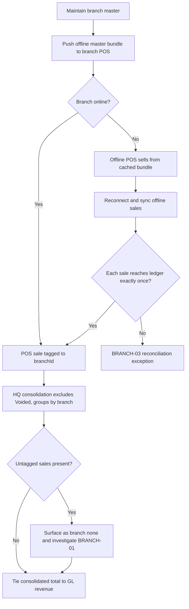

# Process Narrative — Multi-Branch & Offline POS

> **Status: DRAFT v0.1** — contains `<<placeholders>>` pending owner confirmation.

## 1. Document Control

| Field | Value |
|---|---|
| Process ID | PN-24-BRANCH |
| Process owner | `<<Operations / Controller>>` |
| Approver | `<<approver-name / title>>` |
| Version | **0.1 DRAFT** |
| Revision date | 2026-06-22 |
| Effective date | `<<effective-date>>` |
| Review cadence | Annual + on significant change |
| Related RCM controls | BRANCH-01, BRANCH-02, BRANCH-03, BRANCH-04, BRANCH-05; cross-ref REV-01, REV-13, GL-01, GL-05, REC-01; SoD rule R07 |
| Related policy | `<<Branch Operations Policy>>`, `<<Offline POS / Business Continuity Procedure>>`, `<<Segregation-of-Duties Policy>>` |

## 2. Purpose

This narrative documents the multi-branch operating model and the offline point-of-sale (POS) lifecycle within a single tenant: branch master maintenance, HQ consolidation of branch POS sales, the master-data bundle pushed to disconnected branch terminals, and the reconciliation of offline-captured sales back into the central ledger. The primary control objectives are **branch sales roll-up completeness** (every sale tagged and accounted), **offline master-bundle pricing integrity**, and **offline-to-online sync reconciliation** (no lost or duplicated transactions).

## 3. Scope

**In scope**
- Branch master maintenance — create, list, update (branch, `/api/branches`).
- HQ consolidated POS roll-up across branches of one tenant (`/api/branches/consolidated`).
- Offline master-data bundle export for branch POS caching (`/api/branches/master-bundle`).
- Branch tagging of POS sales (`custPosSales.branchId`) and untagged-sale surfacing.

**Out of scope**
- The fiscal hash-chained POS journal and sale finalisation — see `20-restaurant-operations.md`.
- Pricing rules, price-lists and promotions definition — see `19-marketing-pricing-loyalty.md`.
- Legal-entity (separate-tenant) consolidation — see `11-intercompany-consolidation.md`. Note: multi-branch consolidation here aggregates branches **within one tenant**; legal-entity consolidation combines **separate tenants**.

## 4. References

- ISO 9001:2015 cl. 4.4 (QMS and its processes); cl. 8.1 (Operational planning and control); cl. 8.5.1 (Control of provision).
- Risk & Control Matrix: `compliance/Oshinei_ERP_SOX_RCM_v1.xlsx`.
- Segregation-of-Duties matrix: `compliance/Oshinei_ERP_SoD_Matrix_v1.xlsx`.
- Policies: `<<Branch Operations Policy>>`, `<<Offline POS / Business Continuity Procedure>>`.
- Code:
  - `apps/api/src/modules/branch/branch.controller.ts`
  - `apps/api/src/modules/branch/branch.service.ts`
  - `apps/api/src/modules/branch/branch.module.ts`

## 5. Definitions & Abbreviations

| Term | Definition |
|---|---|
| Tenant | A single ERP customer; the "HQ" of all its branches. RLS isolates every row to its tenant. |
| Branch | An operating location under a tenant, with `code`, `name` and an `is_hq` flag; a tenant may have N branches, 1+ flagged HQ. |
| HQ | Head-quarter branch (`is_hq = true`); the consolidation point for branch totals. |
| `custPosSales.branchId` | The branch tag scoping each POS sale; null where a sale is untagged. |
| Consolidation | Per-branch aggregation of POS sales for the tenant (orders, subtotal, tax, total). |
| Master bundle | A JSON export (catalog, prices, active promotions, metadata) cached by an offline POS. |
| Offline POS | A branch terminal that sells from its cached bundle while disconnected, then syncs on reconnect. |
| "(none)" | The pseudo-branch under which untagged sales surface in consolidation — a completeness flag. |
| IPE | Information Produced by the Entity. |
| SoD | Segregation of Duties. |

## 6. Roles & Responsibilities (RACI)

The defining SoD rule here is **R07** (initiate vs approve): the operator who initiates a branch sale or captures an offline transaction must not be the party who authorises branch-master changes or approves the consolidated roll-up that ties to revenue. Branch and consolidation endpoints require the `branch`/`exec` permissions; master-bundle export is additionally available to `cust_pos`. All branch operations thread an explicit tenant id, and RLS isolates every branch row to its tenant.

| Activity | HQ Controller / Operations | Branch Manager | POS Operator | IT / Sync | Reviewer |
|---|---|---|---|---|---|
| Create / update branch master | A/R | C | I | I | I |
| Capture POS sale (branch-tagged) | I | C | R | I | I |
| Push offline master bundle | A | C | I | R | I |
| Offline-to-online sync of sales | I | C | C | R | C |
| Review consolidated roll-up & "(none)" | A/R | C | I | I | C |
| Tie roll-up to GL revenue | A | I | I | I | R |

A = Accountable, R = Responsible, C = Consulted, I = Informed.

## 7. Process Narrative

1. **Branch master — create (perm `branch`).** `POST /api/branches` creates a branch from `code`, `name` and optional `is_hq`/`address`/`phone`, scoped to the caller's tenant. A user not bound to a tenant returns `NO_TENANT`; a missing `code`/`name` returns `BAD_REQUEST` (400); a duplicate code returns `BRANCH_EXISTS` (409). *Control: REV-01 / R07 — branch-master maintenance segregated from selling.*

2. **Branch master — list & update (perm `branch`/`exec`).** `GET /api/branches` lists the tenant's branches (HQ first). `PATCH /api/branches/:id` updates `name`/`active`/`is_hq`/`address`/`phone` within the tenant; an unknown id returns `BRANCH_NOT_FOUND` (404). *Operational.*

3. **POS sale branch tagging.** Each POS sale carries `custPosSales.branchId`, scoping it to the originating branch. Sale finalisation and the fiscal journal are documented in `20-restaurant-operations.md`; this step asserts that the branch tag must be present. *Control: BRANCH-01 — completeness of branch tagging.*

4. **HQ consolidation (perm `branch`/`exec`).** `GET /api/branches/consolidated?from=&to=` aggregates `custPosSales` for the tenant, **excluding** status `Voided`, grouped by `branchId`, returning per-branch `orders`, `subtotal`, `tax` and `total_sales`, plus grand totals. Untagged sales (`branchId` null) surface as branch **"(none)"** (`Untagged / ไม่ระบุสาขา`) — a deliberate completeness flag for investigation. *Control: BRANCH-01 — detective tie-out; "(none)" rows must be cleared and the consolidated total cross-referenced to total GL revenue (cross-ref `01-order-to-cash.md`, `20-restaurant-operations.md`).*

5. **Offline master-bundle export (perm `branch`/`cust_pos`).** `GET /api/branches/master-bundle` returns the offline catalog: `customerItems` with unit prices, the **active** price-list, **active** promotions (each as JSON), plus metadata `generated_at` and `counts`. The branch POS caches this locally and sells from it while disconnected. *Control: BRANCH-02 — only correct, current prices/promotions are pushed so an offline terminal cannot sell at a stale or wrong price (cross-ref `19-marketing-pricing-loyalty.md`, rule R10).*

6. **Offline-to-online sync reconciliation.** On reconnect, offline-captured sales must reach the central ledger exactly once. Each synced sale is tagged to its branch and folded into the fiscal hash-chained journal of `20-restaurant-operations.md`. There are **two offline capture paths, both idempotent on `(tenant, client_uuid)`** via the `pos_offline_sync` dedup ledger: the **portal/inventory POS** replays to `POST /api/portal/pos/offline-sync` (`item_id` lines), and the **touch register** (`/pos/register`, menu `sku` lines) replays its quick cash sales to `POST /api/restaurant/offline-sync` — which re-runs the normal restaurant order→checkout (the server re-prices + 86-checks; a re-sent batch returns `duplicate` and never double-posts the sale or its GL). A failed op is a retryable tombstone (it never blocks a later replay), so a transient error is not a lost sale. Terminal-side capture is resilient to the two common real-world failure shapes: the register **snapshots the menu on-device** (localStorage) so a reload/reboot mid-outage still renders a sellable menu (the service worker deliberately never caches `/api/*`), and a quick sale whose order-creation call fails at the **network level while the browser still reports online** (router up, internet down — `navigator.onLine` cannot see it) falls back to the same offline queue automatically; HTTP-level rejections (validation, 86'd item, expired session) still surface to the cashier and are never queued. *Control: BRANCH-03 — no lost or duplicated offline transactions; synced count and value reconcile to terminal-side capture counts (cross-ref REC-01 tie-out).*

6b. **Store-hub snapshot export/import (perm `branch`/`exec`; docs/41 Phase 1).** For a LAN-first store
   hub (the same API+web on an in-store box), `GET /api/hub/snapshot` exports the tenant's full
   front-of-house state — tenant identity + tax config, menu catalog (categories/items/modifiers/buffet
   tiers), floor plan (stations/zones/tables incl. their stable `qr_token`), and **PIN-eligible
   front-of-house users only** (the `requiresMfa` line: privileged/finance accounts never leave the
   cloud; TOTP/SSO secrets are never exported). The feature is **fail-closed** behind `HUB_SYNC_SECRET`
   (unset ⇒ `403 HUB_SYNC_DISABLED`); the payload is **HMAC-SHA256-signed**; credentials (password/PIN
   hashes) additionally require proof of possession of the secret (`X-Hub-Sync-Key`, else
   `403 HUB_SYNC_KEY_REQUIRED`). The hub-side importer (`db:hub:import`, `hub/` compose service
   `hub-seed`) verifies the signature **before any write** (tamper ⇒ `BAD_SIGNATURE`), inserts every row
   with its **original id** (printed table QRs keep working; Phase-2 sync references the same rows),
   resets runtime table status, bumps serial sequences past the imported range, and is idempotent on
   re-import. Runbook: `docs/ops/store-hub-setup.md`. *Control: extends BRANCH-02 — only correct,
   current, integrity-protected master data reaches a disconnected terminal; sync-up reconciliation of
   hub-captured sales is the Phase-2 scope of BRANCH-03.*

6c. **Hub → cloud sales replay (machine-to-machine; docs/41 Phase 2a).** Sales rung ON a store hub post
   GL on the hub's own (operational) ledger; the CLOUD ledger stays the book of record, fed by an
   exactly-once replay. The hub pusher (`db:hub:push`, `database/hub-push.ts`; compose one-shot
   `hub-push`) reconstructs each hub sale from its originating order (lines + modifiers, discount/tip/
   service-charge from the sale header), signs the batch **HMAC-SHA256** with `HUB_SYNC_SECRET`, and
   POSTs to the cloud's public `POST /api/hub/ingest` — verified timing-safe (bad signature ⇒
   `403 HUB_SYNC_BAD_SIGNATURE`; secret unset ⇒ fail-closed) and replayed through the SAME idempotent
   register offline-sync path of step 6. The `client_uuid` is **deterministic**
   (`hub:{tenant}:{hub_sale_no}`), so any re-push — crash mid-run, double cron, replayed batch, even a
   lost hub push-log — lands as `duplicate`, never a second sale/GL. Every outcome is recorded in the
   hub-side `hub_push_log` (migration `0293`); a sale the pusher cannot faithfully replay (loyalty
   redemption, no order linkage) is logged **`skipped_unsupported` with its reason** — a visible
   exception queue for review, never a silent drop. **Buffet-tier sales replay natively** (Phase 2b):
   the op carries `buffet {package_code, pax, overtime_pax}` and the cloud re-creates the per-pax
   charge **priced from its own package master** (never the hub's number); ฿0 buffet food lines carry
   no revenue and are not replayed. The batch signature is computed over **canonical (key-sorted)
   JSON** on both sides, so validation-layer re-serialization can never break verification. `GET /api/hub/reconciliation` (perm `branch`/`exec`)
   ties hub-ingested ops and their cloud sale values back per device/period. *Control: **BRANCH-04** —
   hub-captured sales reach the central ledger exactly once, authentically, with unsupported shapes
   surfaced; value ties hub↔cloud (cross-ref BRANCH-03, REC-01).*

6d. **Hub cash session (till / Z-report) up-sync (docs/41 Phase 2c).** The hub pushes each **closed**
   till session — opening float, the **physical closing count**, cash movements, denominations — plus
   the **hub sale numbers rung during the session** (membership by settlement time, `paid_at`), signed
   with the same HMAC, to `POST /api/hub/ingest-till`. It deliberately does **not** send its own
   expected-cash figure. The cloud resolves every listed sale through the step-6c dedup ledger and
   **refuses the session** (`400 TILL_SALES_NOT_SYNCED`, listing the missing sales) unless all have
   replayed — a variance is never certified over an incomplete revenue population. It then computes
   `expected = opening_float + Σ(cash tender amount + tip) + paid_in − paid_out − drops − cash_refunds`
   from its **own** rows, derives `variance = counted − expected`, and posts the over/short to **5830**
   on the *same* materiality line as a native close (**REV-13**, `CASH_VARIANCE_THRESHOLD`): a material
   variance posts a **Draft** JE and parks the session `PendingApproval` for a different user (GL-05
   maker-checker); a sub-threshold variance posts immediately. Idempotent on `session_no` (a re-push
   returns `duplicate`; never a second JE). *Control: **BRANCH-05**.*

   *Where the cash figure comes from (verified, not assumed):* the **tender** — not the sale header —
   says whether cash entered the drawer. Replaying a sale re-runs the restaurant checkout, which records
   a `payments` row carrying the **real method** (`recordTender`, linked to the open till); the sale
   header's `cust_pos_sales.payment_method` is the literal `'Dine-in'` and must never be read as a
   tender type. So the ingest sums only `method='Cash'` tenders — a card/PromptPay sale in the session
   cannot inflate the drawer expectation. `payments.amount` **excludes** the tip (stored beside it) while
   the drawer physically receives both, so the expectation adds it back — matching the 1000 Cash debit
   (`cashDue = total + tip`). NB the **native** `aggregateTill` sums `amount` only, so a cash tip makes a
   native close read "over" by the tip; that pre-existing discrepancy is tracked in docs/41 Phase 2c-2.

6e. **Hub fleet heartbeat (docs/41 Phase 4a).** Each hub reports a signed heartbeat
   (`POST /api/hub/heartbeat`): `hub_id`, app version, the **un-replayed backlog** (pending sales /
   tills), `failed`/`skipped_unsupported` counts and its `last_push_at`; the cloud stamps `last_seen_at`
   and derives **clock skew** from the hub's `sent_at` (a drifting hub clock mis-buckets the business
   day, so it is measured, not assumed). `GET /api/hub/fleet` (perm `branch`/`exec`, RLS-scoped) lists
   the tenant's hubs with `stale` (no heartbeat in the window) and `needs_attention` (stale, or failed/
   skipped docs, or |skew| > 120s) — so a silent box quietly hoarding un-replayed cash is visible.
   Table `hub_heartbeats` (migration `0296`, canonical RLS). *Control: BRANCH-05 (detective layer).*

6g. **Hub stocktake replay (docs/41 Phase 2c-2).** Only **POSTED** count sheets are pushed — a Draft
   count is not yet evidence. Each carries **both humans**: `counted_by` and `posted_by` (persisted by
   migration `0300`; the native post previously stored only the counter). `POST /api/hub/ingest-stocktake`
   verifies the HMAC and **refuses the sheet when the two names are equal or missing**
   (`STOCKTAKE_NOT_SEGREGATED`): the machine principal `hub-sync` can never post a count it would have
   been forbidden to post as a human (**SoD R11 / INV-04**). Accepted sheets are recreated under the
   hub's `st_no` and produce the same Stock In/Out variance movements a native post produces; idempotent
   on `(tenant, st_no)`. Blocked sheets stay in `hub_push_log` for review — never silently dropped,
   never silently accepted. *Control: **BRANCH-07**.*

7. **GL boundary.** No GL is posted by the branch module itself; branch operations are organisational and reporting overlays. Revenue and tax are posted when the underlying sale finalises in the POS/order processes; the consolidated roll-up is an IPE that must tie to that posted revenue.

## 8. Process Flow

**Swimlane narrative.** The *HQ Controller / Operations* lane owns the branch master and is accountable for reviewing the consolidated roll-up and clearing any "(none)" rows. The *Branch Manager / POS Operator* lane captures branch-tagged sales and operates offline terminals from the cached bundle. The *IT / Sync* lane pushes the master bundle and reconciles offline-to-online sync so that every transaction reaches the central ledger exactly once. The *Reviewer* lane performs the detective tie-out of consolidated branch totals to posted GL revenue.

## 9. Control Matrix

| Step | Risk | Control | Type | RCM ID | Evidence / Record |
|---|---|---|---|---|---|
| 3, 4 | Sale not tagged to a branch (incomplete roll-up) | Untagged sales surface as "(none)"; investigated and cleared; total cross-referenced to GL revenue | Detective | BRANCH-01 | Consolidation report; "(none)" investigation log |
| 5 | Offline POS sells at stale or wrong price/promo | Master bundle exports only active price-list and active promotions, time-stamped | Preventive | BRANCH-02 | `generated_at` metadata; bundle vs price-master diff |
| 6 | Offline sale lost or duplicated on sync | Sync reconciliation — exactly-once into the hash-chained journal | Detective | BRANCH-03 | Sync recon report; terminal vs ledger counts |
| 1 | Unauthorised branch-master change | Branch maintenance gated to `branch`, segregated from selling | Preventive | REV-01 / R07 | Branch change log |
| 4, 7 | Consolidated total ≠ posted revenue | Tie-out of consolidated branch totals to total GL revenue | Detective | GL-01 / REC-01 | Tie-out working paper |

## 10. Inputs & Outputs

**Inputs:** branch master definitions (`code`, `name`, `is_hq`, address, phone); POS sales with `branchId`; active price-list and promotions; offline-captured transactions awaiting sync; user JWT (tenant + permissions).

**Outputs:** branch records; consolidated per-branch totals + grand totals (including "(none)"); offline master bundle (catalog + prices + promotions + metadata); reconciled central-ledger sales. The consolidated roll-up is an IPE feeding management reporting and the GL revenue tie-out.

## 11. Records & Retention

| Record | Retention |
|---|---|
| Branch master change history | `<<7 years / per Thai law>>` |
| Consolidated roll-up reports & "(none)" investigations | `<<7 years / per Thai law>>` |
| Offline master-bundle exports (metadata / `generated_at`) | `<<7 years / per Thai law>>` |
| Offline-to-online sync reconciliation logs | `<<7 years / per Thai law>>` |

## 12. KPIs / Metrics

- Untagged-sale value and count surfaced as "(none)" (target: 0).
- Consolidated roll-up vs GL revenue tie-out difference (target: 0).
- Offline sync exceptions — lost or duplicated transactions (target: 0).
- Master-bundle staleness: age of cached bundle vs latest price-master change.
- Sync latency from reconnect to ledger posting.

## 13. Exception & Error Handling

| Error code | Trigger | Handling |
|---|---|---|
| NO_TENANT | Acting user not bound to a tenant | Reject; bind user to a tenant before any branch op. |
| BAD_REQUEST (400) | Missing `code`/`name` on create, or no fields to update | Reject; supply required fields. |
| BRANCH_EXISTS (409) | Duplicate branch `code` within tenant | Reject; reuse existing branch. |
| BRANCH_NOT_FOUND (404) | Update of an unknown branch id | Reject; verify branch id and tenant. |
| "(none)" rows | Sale captured without a `branchId` | Investigate completeness; re-tag or document; clear before tie-out. |
| Sync mismatch | Offline-to-online counts/values disagree | Raise BRANCH-03 exception; reconcile before close. |

## 14. Revision History

| Version | Date | Author | Notes |
|---|---|---|---|
| 0.1 DRAFT | 2026-06-22 | `<<author>>` | Initial draft. |
| 0.2 | 2026-06-26 | Platform | **Touch-register offline selling (BRANCH-03).** The main register (`/pos/register`) now sells QUICK (no-table) cash sales while offline: the sale is queued in IndexedDB (`lib/register-offline.ts`) and replayed on reconnect to a new idempotent endpoint `POST /api/restaurant/offline-sync` (`RestaurantOfflineSyncService`) that re-runs the restaurant order→checkout path — dedup on `(tenant, client_uuid)` via the shared `pos_offline_sync` ledger, so a re-sent batch returns `duplicate` and never double-posts the sale/GL. Dine-in (table) sales stay online-only (kitchen/fire). Register shows an online/offline + pending-sync badge and auto-flushes on reconnect. No migration (reuses `pos_offline_sync`); no new control (extends BRANCH-03). ToE: `restaurant-offline` harness (8 — idempotent replay, partial-failure isolation, tenant-scoped dedup, GL VAT) + `register-offline` Playwright e2e (offline sale → queued → auto-sync). §7 step 6 updated. |
| 0.3 | 2026-07-10 | Platform | **Offline register hardening (LAN-first Phase 0, docs/41 — BRANCH-03 unchanged).** §7 step 6 — terminal-side capture now survives (a) a **reload/reboot mid-outage**: the menu is snapshotted to localStorage (`fetchMenuOfflineFirst`, `lib/register-offline.ts`) and served when `/api/menu` is unreachable (the SW never caches `/api/*`; the menu query runs under TanStack `networkMode:'always'` so it isn't paused while offline); and (b) the **"router up, internet down" false-online state**: a quick sale whose order-creation call fails at the network level (no HTTP status on the thrown error; `lib/api.ts` now stamps `status` on the session-expired error so a 401 is never mistaken for a dead link) falls back to the same IndexedDB queue automatically — HTTP rejections still surface and are never queued, and only the FIRST (pre-persistence) call falls back, so the worst case is an orphan open order, never a double-posted sale. The app-shell service worker no longer caches redirect-followed responses (an expired session bouncing to `/login` could poison the register's cached shell; cache bumped v3). e2e `register-offline.spec.ts` (3 scenarios); UAT-O2C-284..285; user manual 01 §offline. |
| 0.4 | 2026-07-10 | Platform | **Store-hub snapshot export/import (docs/41 Phase 1 — extends BRANCH-02, no new numbered control).** New §7 step 6b: signed hub-snapshot export `GET /api/hub/snapshot` (`modules/hub`, fail-closed on `HUB_SYNC_SECRET`, HMAC-SHA256, credential export additionally gated on `X-Hub-Sync-Key`; FoH-only users via the `requiresMfa` line, TOTP/SSO never exported) + hub-side importer `db:hub:import` (`database/hub-import.ts` — signature verify before any write, id-stable upsert, table-status reset, sequence bump, idempotent) + the `hub/` docker-compose appliance and runbook `docs/ops/store-hub-setup.md`. ToE: new CI harness `tools/cutover/src/hub-snapshot.ts` (20 checks — fail-closed/perm/tenant-isolation/credential gating/tamper-reject/round-trip: cashier password+PIN login, menu + floor plan served, local insert past imported ids, on a second freshly-migrated PGlite). UAT-O2C-288..289. Phase-2 (hub→cloud financial replay) tracked in docs/41. |
| 0.5 | 2026-07-10 | Platform | **Hub→cloud sales replay + reconciliation (docs/41 Phase 2a — NEW control BRANCH-04, RCM 204→205).** New §7 step 6c: hub pusher `db:hub:push` (`database/hub-push.ts`; deterministic `client_uuid` = `hub:{tenant}:{hub_sale_no}` ⇒ exactly-once even after a lost push-log; unsupported shapes logged `skipped_unsupported` WITH reason — visible, never silent) → cloud `POST /api/hub/ingest` (`@Public` + HMAC-SHA256 timing-safe over `{tenant_id,sent_at,sales}`, fail-closed on `HUB_SYNC_SECRET`) → replays via the step-6 register offline-sync path (server re-prices; GL posts on the CLOUD ledger — book of record; the hub's own ledger is operational only). `RegisterOfflineSaleOp` gains additive `discount`/`tip`/`service_charge_pct` pass-through for replay fidelity. New table `hub_push_log` (migration `0293`, canonical RLS); `GET /api/hub/reconciliation` (`branch`/`exec`) ties hub ops ↔ cloud sale values. ToE: `hub-snapshot` harness extended to 27 checks (ring-on-hub → push → cloud GL + TB balanced → log-loss re-push all-duplicate → tamper 403 → skip visibility). UAT-O2C-290..291. |
| 0.6 | 2026-07-10 | Platform | **Buffet replay + diner QR on the hub (docs/41 Phase 2b/3 — BRANCH-04 widened, no new control).** §7 step 6c: a buffet-tier hub sale now replays via `op.buffet {package_code, pax, overtime_pax}` — the cloud re-creates the per-pax charge via `BuffetService.applyReplayCharge`, **priced from the cloud package master**; ฿0 food lines not replayed; batch signature hardened to **canonical (key-sorted) JSON** (a Zod-reordered body previously broke verification — found by the harness). Diner QR self-order proven end-to-end ON the hub (imported `qr_token` → public session → menu/tiers → order → KDS → settle → replay); payments honesty documented (runbook §7). Loyalty-redeem sales + till/Z + fiscal chain remain the visible `skipped_unsupported` / Phase-2c scope. ToE: harness → **40 checks**; UAT-O2C-306..307. |
| 0.7 | 2026-07-10 | Platform | **Hub cash-session up-sync + fleet heartbeat (docs/41 Phases 2c/4a — NEW control BRANCH-05, RCM 206→207).** New §7 steps **6d** (till/Z ingest `POST /api/hub/ingest-till`: completeness gate `TILL_SALES_NOT_SYNCED`, cloud-side expected-cash re-computation, 5830 over/short on the shared REV-13 materiality line with GL-05 maker-checker parking, idempotent on `session_no`) and **6e** (`POST /api/hub/heartbeat` + `GET /api/hub/fleet`: liveness, un-replayed backlog, measured clock skew; table `hub_heartbeats`, migration `0296`, which also adds `hub_push_log.doc_type`). Documents two verified product facts the design rests on: restaurant checkout writes **no `payments` tender** (so the native `aggregateTill` misses restaurant cash) and stores `payment_method='Dine-in'` while debiting **1000** for the full settled amount **+ tip**. Fixed en route: `hub-push` read a non-existent `dine_in_orders.created_at`, silently stamping every replayed sale’s `captured_at` with the PUSH time (now `paid_at`/`opened_at`). ToE: harness → **53 checks**; UAT-O2C-308..310. |
| 0.8 | 2026-07-10 | Platform | **BRANCH-05 correction + hub-push tender fidelity (docs/41 Phase 2c-2).** A blast-radius review disproved rev 0.7’s premise: restaurant checkout **does** record a `payments` tender (`recordTender` — real method, linked to the open till), so the native `aggregateTill` already sees restaurant cash. §7 6d rewritten accordingly, and **two shipped defects fixed**: (1) `hub-push` sent `cust_pos_sales.payment_method` (the literal `Dine-in`) as the replay tender method, mis-typing every cloud tender — it now reads the hub’s tender row; (2) `ingestTill` valued the drawer from **all** sales, so a card/PromptPay sale inflated expected cash and the session read short by that amount — it now sums only `method=Cash` tenders (+ tip). Flagged (pre-existing, NOT introduced): the **native** `aggregateTill` excludes the tip from `expected_cash` although the drawer receives it, so a native close reads “over” by a cash tip — tracked in docs/41 Phase 2c-2. ToE: harness → **55 checks** (adds a card sale that must not inflate the drawer); UAT-O2C-309 updated. |
| 0.10 | 2026-07-10 | Platform | **Hub stocktake replay (docs/41 Phase 2c-2 — NEW control BRANCH-07; migration 0300).** New §7 step 6g: only POSTED sheets replay, each naming **both** humans; the cloud refuses a sheet whose counter is its poster (`STOCKTAKE_NOT_SEGREGATED`), so the machine principal cannot launder a self-approved count (SoD R11 / INV-04). `postStocktake` now persists `posted_by`/`posted_at` — the segregation is *evidenced* on the document, on either ledger, instead of only being enforced in the moment. Idempotent on `(tenant, st_no)`; blocked sheets stay visible in `hub_push_log`. Depends on the 0299 tenant-isolation fix. ToE: `hub-snapshot` harness → **61 checks**; regression `stock-ops` 27. UAT-O2C-320. |
