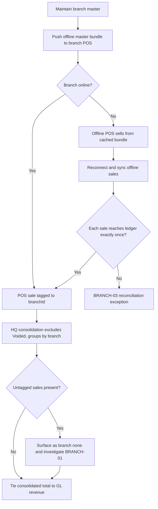

# Process Narrative — Multi-Branch & Offline POS

> **Status: DRAFT v0.1** — contains `<<placeholders>>` pending owner confirmation.

## 1. Document Control

| Field | Value |
|---|---|
| Process ID | PN-24-BRANCH |
| Process owner | `<<Operations / Controller>>` |
| Approver | `<<approver-name / title>>` |
| Version | **0.1 DRAFT** |
| Revision date | 2026-06-22 |
| Effective date | `<<effective-date>>` |
| Review cadence | Annual + on significant change |
| Related RCM controls | BRANCH-01, BRANCH-02, BRANCH-03; cross-ref REV-01, GL-01, REC-01; SoD rule R07 |
| Related policy | `<<Branch Operations Policy>>`, `<<Offline POS / Business Continuity Procedure>>`, `<<Segregation-of-Duties Policy>>` |

## 2. Purpose

This narrative documents the multi-branch operating model and the offline point-of-sale (POS) lifecycle within a single tenant: branch master maintenance, HQ consolidation of branch POS sales, the master-data bundle pushed to disconnected branch terminals, and the reconciliation of offline-captured sales back into the central ledger. The primary control objectives are **branch sales roll-up completeness** (every sale tagged and accounted), **offline master-bundle pricing integrity**, and **offline-to-online sync reconciliation** (no lost or duplicated transactions).

## 3. Scope

**In scope**
- Branch master maintenance — create, list, update (branch, `/api/branches`).
- HQ consolidated POS roll-up across branches of one tenant (`/api/branches/consolidated`).
- Offline master-data bundle export for branch POS caching (`/api/branches/master-bundle`).
- Branch tagging of POS sales (`custPosSales.branchId`) and untagged-sale surfacing.

**Out of scope**
- The fiscal hash-chained POS journal and sale finalisation — see `20-restaurant-operations.md`.
- Pricing rules, price-lists and promotions definition — see `19-marketing-pricing-loyalty.md`.
- Legal-entity (separate-tenant) consolidation — see `11-intercompany-consolidation.md`. Note: multi-branch consolidation here aggregates branches **within one tenant**; legal-entity consolidation combines **separate tenants**.

## 4. References

- ISO 9001:2015 cl. 4.4 (QMS and its processes); cl. 8.1 (Operational planning and control); cl. 8.5.1 (Control of provision).
- Risk & Control Matrix: `compliance/Oshinei_ERP_SOX_RCM_v1.xlsx`.
- Segregation-of-Duties matrix: `compliance/Oshinei_ERP_SoD_Matrix_v1.xlsx`.
- Policies: `<<Branch Operations Policy>>`, `<<Offline POS / Business Continuity Procedure>>`.
- Code:
  - `apps/api/src/modules/branch/branch.controller.ts`
  - `apps/api/src/modules/branch/branch.service.ts`
  - `apps/api/src/modules/branch/branch.module.ts`

## 5. Definitions & Abbreviations

| Term | Definition |
|---|---|
| Tenant | A single ERP customer; the "HQ" of all its branches. RLS isolates every row to its tenant. |
| Branch | An operating location under a tenant, with `code`, `name` and an `is_hq` flag; a tenant may have N branches, 1+ flagged HQ. |
| HQ | Head-quarter branch (`is_hq = true`); the consolidation point for branch totals. |
| `custPosSales.branchId` | The branch tag scoping each POS sale; null where a sale is untagged. |
| Consolidation | Per-branch aggregation of POS sales for the tenant (orders, subtotal, tax, total). |
| Master bundle | A JSON export (catalog, prices, active promotions, metadata) cached by an offline POS. |
| Offline POS | A branch terminal that sells from its cached bundle while disconnected, then syncs on reconnect. |
| "(none)" | The pseudo-branch under which untagged sales surface in consolidation — a completeness flag. |
| IPE | Information Produced by the Entity. |
| SoD | Segregation of Duties. |

## 6. Roles & Responsibilities (RACI)

The defining SoD rule here is **R07** (initiate vs approve): the operator who initiates a branch sale or captures an offline transaction must not be the party who authorises branch-master changes or approves the consolidated roll-up that ties to revenue. Branch and consolidation endpoints require the `branch`/`exec` permissions; master-bundle export is additionally available to `cust_pos`. All branch operations thread an explicit tenant id, and RLS isolates every branch row to its tenant.

| Activity | HQ Controller / Operations | Branch Manager | POS Operator | IT / Sync | Reviewer |
|---|---|---|---|---|---|
| Create / update branch master | A/R | C | I | I | I |
| Capture POS sale (branch-tagged) | I | C | R | I | I |
| Push offline master bundle | A | C | I | R | I |
| Offline-to-online sync of sales | I | C | C | R | C |
| Review consolidated roll-up & "(none)" | A/R | C | I | I | C |
| Tie roll-up to GL revenue | A | I | I | I | R |

A = Accountable, R = Responsible, C = Consulted, I = Informed.

## 7. Process Narrative

1. **Branch master — create (perm `branch`).** `POST /api/branches` creates a branch from `code`, `name` and optional `is_hq`/`address`/`phone`, scoped to the caller's tenant. A user not bound to a tenant returns `NO_TENANT`; a missing `code`/`name` returns `BAD_REQUEST` (400); a duplicate code returns `BRANCH_EXISTS` (409). *Control: REV-01 / R07 — branch-master maintenance segregated from selling.*

2. **Branch master — list & update (perm `branch`/`exec`).** `GET /api/branches` lists the tenant's branches (HQ first). `PATCH /api/branches/:id` updates `name`/`active`/`is_hq`/`address`/`phone` within the tenant; an unknown id returns `BRANCH_NOT_FOUND` (404). *Operational.*

3. **POS sale branch tagging.** Each POS sale carries `custPosSales.branchId`, scoping it to the originating branch. Sale finalisation and the fiscal journal are documented in `20-restaurant-operations.md`; this step asserts that the branch tag must be present. *Control: BRANCH-01 — completeness of branch tagging.*

4. **HQ consolidation (perm `branch`/`exec`).** `GET /api/branches/consolidated?from=&to=` aggregates `custPosSales` for the tenant, **excluding** status `Voided`, grouped by `branchId`, returning per-branch `orders`, `subtotal`, `tax` and `total_sales`, plus grand totals. Untagged sales (`branchId` null) surface as branch **"(none)"** (`Untagged / ไม่ระบุสาขา`) — a deliberate completeness flag for investigation. *Control: BRANCH-01 — detective tie-out; "(none)" rows must be cleared and the consolidated total cross-referenced to total GL revenue (cross-ref `01-order-to-cash.md`, `20-restaurant-operations.md`).*

5. **Offline master-bundle export (perm `branch`/`cust_pos`).** `GET /api/branches/master-bundle` returns the offline catalog: `customerItems` with unit prices, the **active** price-list, **active** promotions (each as JSON), plus metadata `generated_at` and `counts`. The branch POS caches this locally and sells from it while disconnected. *Control: BRANCH-02 — only correct, current prices/promotions are pushed so an offline terminal cannot sell at a stale or wrong price (cross-ref `19-marketing-pricing-loyalty.md`, rule R10).*

6. **Offline-to-online sync reconciliation.** On reconnect, offline-captured sales must reach the central ledger exactly once. Each synced sale is tagged to its branch and folded into the fiscal hash-chained journal of `20-restaurant-operations.md`. *Control: BRANCH-03 — no lost or duplicated offline transactions; synced count and value reconcile to terminal-side capture counts (cross-ref REC-01 tie-out).*

7. **GL boundary.** No GL is posted by the branch module itself; branch operations are organisational and reporting overlays. Revenue and tax are posted when the underlying sale finalises in the POS/order processes; the consolidated roll-up is an IPE that must tie to that posted revenue.

## 8. Process Flow

**Swimlane narrative.** The *HQ Controller / Operations* lane owns the branch master and is accountable for reviewing the consolidated roll-up and clearing any "(none)" rows. The *Branch Manager / POS Operator* lane captures branch-tagged sales and operates offline terminals from the cached bundle. The *IT / Sync* lane pushes the master bundle and reconciles offline-to-online sync so that every transaction reaches the central ledger exactly once. The *Reviewer* lane performs the detective tie-out of consolidated branch totals to posted GL revenue.

## 9. Control Matrix

| Step | Risk | Control | Type | RCM ID | Evidence / Record |
|---|---|---|---|---|---|
| 3, 4 | Sale not tagged to a branch (incomplete roll-up) | Untagged sales surface as "(none)"; investigated and cleared; total cross-referenced to GL revenue | Detective | BRANCH-01 | Consolidation report; "(none)" investigation log |
| 5 | Offline POS sells at stale or wrong price/promo | Master bundle exports only active price-list and active promotions, time-stamped | Preventive | BRANCH-02 | `generated_at` metadata; bundle vs price-master diff |
| 6 | Offline sale lost or duplicated on sync | Sync reconciliation — exactly-once into the hash-chained journal | Detective | BRANCH-03 | Sync recon report; terminal vs ledger counts |
| 1 | Unauthorised branch-master change | Branch maintenance gated to `branch`, segregated from selling | Preventive | REV-01 / R07 | Branch change log |
| 4, 7 | Consolidated total ≠ posted revenue | Tie-out of consolidated branch totals to total GL revenue | Detective | GL-01 / REC-01 | Tie-out working paper |

## 10. Inputs & Outputs

**Inputs:** branch master definitions (`code`, `name`, `is_hq`, address, phone); POS sales with `branchId`; active price-list and promotions; offline-captured transactions awaiting sync; user JWT (tenant + permissions).

**Outputs:** branch records; consolidated per-branch totals + grand totals (including "(none)"); offline master bundle (catalog + prices + promotions + metadata); reconciled central-ledger sales. The consolidated roll-up is an IPE feeding management reporting and the GL revenue tie-out.

## 11. Records & Retention

| Record | Retention |
|---|---|
| Branch master change history | `<<7 years / per Thai law>>` |
| Consolidated roll-up reports & "(none)" investigations | `<<7 years / per Thai law>>` |
| Offline master-bundle exports (metadata / `generated_at`) | `<<7 years / per Thai law>>` |
| Offline-to-online sync reconciliation logs | `<<7 years / per Thai law>>` |

## 12. KPIs / Metrics

- Untagged-sale value and count surfaced as "(none)" (target: 0).
- Consolidated roll-up vs GL revenue tie-out difference (target: 0).
- Offline sync exceptions — lost or duplicated transactions (target: 0).
- Master-bundle staleness: age of cached bundle vs latest price-master change.
- Sync latency from reconnect to ledger posting.

## 13. Exception & Error Handling

| Error code | Trigger | Handling |
|---|---|---|
| NO_TENANT | Acting user not bound to a tenant | Reject; bind user to a tenant before any branch op. |
| BAD_REQUEST (400) | Missing `code`/`name` on create, or no fields to update | Reject; supply required fields. |
| BRANCH_EXISTS (409) | Duplicate branch `code` within tenant | Reject; reuse existing branch. |
| BRANCH_NOT_FOUND (404) | Update of an unknown branch id | Reject; verify branch id and tenant. |
| "(none)" rows | Sale captured without a `branchId` | Investigate completeness; re-tag or document; clear before tie-out. |
| Sync mismatch | Offline-to-online counts/values disagree | Raise BRANCH-03 exception; reconcile before close. |

## 14. Revision History

| Version | Date | Author | Notes |
|---|---|---|---|
| 0.1 DRAFT | 2026-06-22 | `<<author>>` | Initial draft. |
