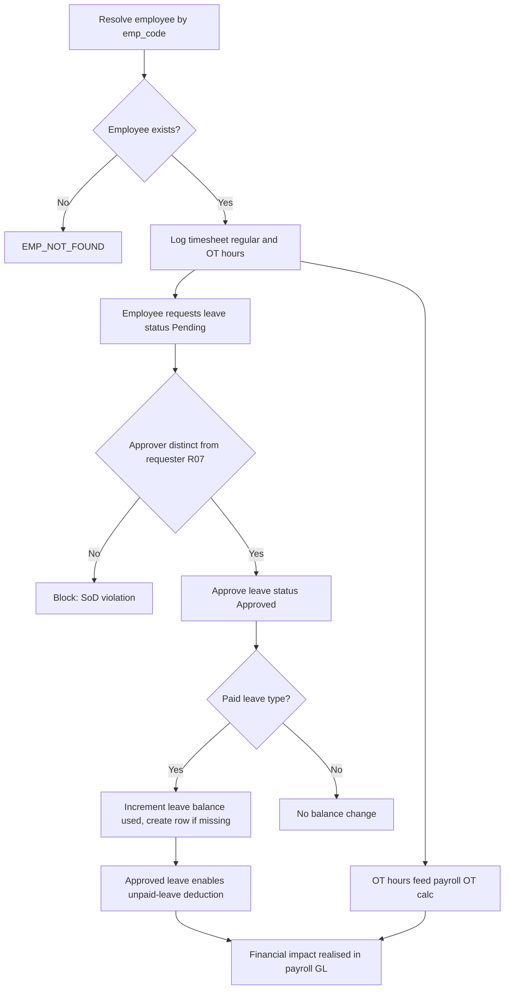

# Process Narrative — HCM: Time & Labor

> **Status: DRAFT v0.1** — contains `<<placeholders>>` pending owner confirmation.

## 1. Document Control

| Field | Value |
|---|---|
| Process ID | PN-25-HCM |
| Process owner | `<
>` |
| Approver | `<<approver-name / title>>` |
| Version | **1.1 DRAFT** |
| Revision date | 2026-07-11 |
| Effective date | `<<effective-date>>` |
| Review cadence | Annual + on significant change |
| Related RCM controls | HCM-01, HCM-02, **HR-01** (headcount governance); cross-ref PAY-01, PAY-02; SoD rule R07 |
| Related policy | `<
>`, `<<Leave Policy>>`, `<<Segregation-of-Duties Policy>>` |

## 2. Purpose

This narrative documents human-capital time and labor capture: employee timesheet logging (regular and overtime hours), leave requests and their approval, and leave-balance tracking. The control objectives are **time-capture accuracy and completeness** (hours are an IPE input to payroll gross/OT), **leave approval authorization and balance integrity**, and the **employee-master existence check** that prevents ghost-employee time. No GL is posted in HCM; the financial impact is realised downstream in payroll.

## 3. Scope

**In scope**
- Timesheet logging and listing — regular and OT hours per employee per day (hcm, `/api/hcm`).
- Leave requests, listing and approval (`/api/hcm/leave`).
- Paid-leave balance tracking (`leaveBalances`: entitled vs used, per employee/type/year).

**Out of scope**
- Payroll calculation, statutory deductions and the payroll-to-GL posting — see `05-payroll.md`.
- Employee master creation/maintenance and master-data governance — see `17-master-data-management.md`.

## 4. References

- ISO 9001:2015 cl. 4.4 (QMS and its processes); cl. 7.1.2 (People); cl. 8.5.1 (Control of provision).
- Risk & Control Matrix: `compliance/Oshinei_ERP_SOX_RCM_v1.xlsx`.
- Segregation-of-Duties matrix: `compliance/Oshinei_ERP_SoD_Matrix_v1.xlsx`.
- Policies: `<
>`, `<<Leave Policy>>`.
- Code:
  - `apps/api/src/modules/hcm/hcm.controller.ts`
  - `apps/api/src/modules/hcm/hcm.service.ts`
  - `apps/api/src/modules/hcm/hcm.module.ts`

## 5. Definitions & Abbreviations

| Term | Definition |
|---|---|
| Timesheet | A per-employee, per-day record of `regular_hours` and `ot_hours`. |
| Shift | A logged work period; opened, then closed with its hours captured on the timesheet. |
| OT | Overtime hours; flow to the payroll OT calculation. |
| Leave request | A request (`leave_type` default `annual`, from/to, `days`, `paid`) with status Pending then Approved. |
| Leave balance | Per employee, leave type and year: `entitled` vs `used`; the row is created on first paid-leave approval if absent. |
| Employee master | The `employees` record keyed by `emp_code`; its existence is checked before any time/leave entry. |
| Ghost employee | A fictitious employee used to divert pay; prevented by the master existence check. |
| IPE | Information Produced by the Entity. |
| SoD | Segregation of Duties. |

## 6. Roles & Responsibilities (RACI)

The defining SoD rule here is **R07** (initiate vs approve): the timekeeper who logs hours and the requester of leave must be distinct from the approver, and both must be distinct from the payroll processor who consumes these hours downstream. HCM endpoints are gated to the `exec`/`users`/`creditors` permission set; leave approval is the authorization control point. The employee-master existence check is enforced on every entry (`EMP_NOT_FOUND`).

| Activity | Employee | Timekeeper / Supervisor | Leave Approver | Payroll Processor | HR Controller |
|---|---|---|---|---|---|
| Log timesheet (regular/OT) | C | R | I | I | A |
| List timesheets | I | R | I | C | A |
| Request leave | R | C | I | I | I |
| Approve leave | I | I | A/R | I | C |
| Maintain leave balance | I | I | C | I | A/R |
| Consume hours into payroll | I | I | I | R | A |

A = Accountable, R = Responsible, C = Consulted, I = Informed.

## 7. Process Narrative

1. **Log timesheet (perm `exec`/`users`/`creditors`).** `POST /api/hcm/timesheets` records `regular_hours` and `ot_hours` for an employee on `work_date` (defaulting to today). The `emp_code` is resolved against the employee master; an unknown code returns `EMP_NOT_FOUND` (404). A shift is logged then closed with its hours captured. *Control: HCM-01 / R07 — time capture is an IPE input to payroll; timekeeper segregated from payroll processor.*

2. **List timesheets.** `GET /api/hcm/timesheets?emp_code=` returns recent timesheets for an employee (or the latest across employees when no code is supplied). *Operational.*

3. **Request leave (perm `exec`/`users`/`creditors`).** `POST /api/hcm/leave` records a request (`leave_type` default `annual`, `from_date`/`to_date`, `days`, `paid` default true) against a resolved employee. `days` must be positive or `BAD_DAYS` (400) is returned; an unknown `emp_code` returns `EMP_NOT_FOUND` (404). The request is created with status **Pending**. *Operational (initiation only — no approval here).*

4. **List leave.** `GET /api/hcm/leave` returns recent leave requests with status and paid flag. *Operational.*

5. **Approve leave.** `POST /api/hcm/leave/:id/approve` transitions a request from **Pending** to **Approved** (an already-decided request is returned idempotently). For a **paid** leave type it increments `leaveBalances.used` for (employee, leave type, year), creating the balance row if missing. An unknown id returns `LEAVE_NOT_FOUND` (404). *Control: HCM-02 / R07 — approver distinct from requester; paid-leave balance prevents over-consumption.*

6. **Labor feeds payroll (no GL in HCM).** Approved `ot_hours` flow to the payroll module's OT calculation, and approved leave with balance tracking enables unpaid-leave deduction. There is **no direct GL** in HCM. The financial impact is realised in `05-payroll.md`, where gross pay posts to **5600**, employer SSO to **5610 / 2350**, withholding tax to **2360**, and provident fund to **5620 / 2370**. *Control: HCM-01 — hours feed payroll gross/OT (cross-ref PAY-01, PAY-02).*

7. **Shift scheduling & labor % (`/api/pos/labor/shifts`, perm `pos`/`users`/`exec`).** Front-of-house plans **shifts** for staff — `POST .../shifts` (`emp_code`, `shift_date`, `start_time`/`end_time` as HH:MM, optional `hourly_rate` + `position`); the **hours** are computed from the times (an overnight shift that ends past midnight is handled), bad times → `BAD_TIME`. `GET .../shifts?from=&to=` is the weekly roster; `POST .../shifts/:id/cancel` cancels one. The **labor summary** (`GET .../labor-summary?from=&to=`) sums **scheduled hours × rate** (excluding cancelled shifts), compares it to **actual punched hours** (the `time_clock` punches) and to **sales** for the period (`cust_pos_sales.total`, business-day) → **labor % of sales** + a per-staff roll-up. Operational planning — **no GL** (the actual cost is realised in payroll). *Operational (no control).*

### 7bis. Organisation structure & positions (HR-1) — headcount governance HR-01

The HR org spine sits on the same employee identity (`payroll.employees.emp_code`; it is **not** forked). Three tenant-scoped tables (RLS + tenant-leading indexes, migration **0320**) model the establishment:

8. **Maintain departments (`GET/POST /api/hcm/org/departments`).** A per-tenant department hierarchy (`hr_departments`: `dept_code` unique per tenant, `parent_dept_id` self-reference, optional `cost_center` link to the GL cost centre, nominated `manager_emp_code`). Reads gate `hr`/`hr_admin`/`exec`; writes gate `hr_admin`/`exec`. A duplicate code returns `DEPT_EXISTS` (400). *Operational (master data).*

9. **Maintain positions (`GET/POST /api/hcm/org/positions`).** Budgeted seats within a department (`hr_positions`: `position_code` unique per tenant, `title`, `job_grade`, `dept_id`, `reports_to_position_id` self-reference, **`budgeted_headcount`**). The list surfaces `current_headcount` vs `budgeted_headcount` so vacancy/over-establishment is visible. *Operational (master data).*

10. **Assign an employee to a position — HR-01 headcount governance (`POST /api/hcm/org/assignments`).** An effective-dated `hr_assignments` row (`emp_code`, `position_id`, `effective_date`, nullable `end_date`, `is_primary`). Before insert, the service counts the position's **currently-active** assignments (`end_date IS NULL`); if that count has already reached `budgeted_headcount` the assignment is **BLOCKED** (`HEADCOUNT_EXCEEDED`, 403) for an ordinary HR maintainer (`hr_admin`). Only a caller holding **`exec`** may override and add the over-establishment seat, and the override is **audit-logged** — a `doc_status_log` `HRASSIGN` row carrying `HEADCOUNT_OVERRIDE` (position, count/budget, reason) in addition to the append-only `audit_log`. `budgeted_headcount = 0` means an unbudgeted seat (no cap). *Control: **HR-01** — the establishment cannot be exceeded from the inside; every over-establishment hire is an attributable exec decision.*

11. **Org chart (`GET /api/hcm/org/chart`).** Returns the department tree (nested `parent_dept_id`) with positions nested under each department, each position's current assignees + `vacancies`, and roll-up totals (departments, positions, budgeted vs filled headcount). Read-only aggregator. *Operational.*

## 8. Process Flow

**Swimlane narrative.** The *Employee* lane initiates leave requests. The *Timekeeper / Supervisor* lane logs shift hours (regular and OT). The *Leave Approver* lane authorises leave and is segregated from the requester under R07; paid approvals adjust the leave balance. The *Payroll Processor* lane consumes the captured hours and leave downstream in `05-payroll.md`, where the only GL postings occur. The *HR Controller* lane owns master integrity and the leave-balance ledger.

## 9. Control Matrix

| Step | Risk | Control | Type | RCM ID | Evidence / Record |
|---|---|---|---|---|---|
| 1 | Inaccurate / incomplete hours feed wrong payroll gross/OT | Time capture validated; IPE input to payroll; timekeeper segregated from processor | Preventive | HCM-01 / R07 | Timesheet records; payroll input reconciliation |
| 5 | Unauthorised / self-approved leave | Approval transition Pending → Approved by an approver distinct from requester | Preventive | HCM-02 / R07 | Leave approval log |
| 5 | Over-consumption of paid leave | `leaveBalances.used` incremented on paid approval; balance integrity | Detective | HCM-02 | Leave-balance ledger (entitled vs used) |
| 1, 3 | Ghost-employee time / leave | Employee-master existence check (`EMP_NOT_FOUND`) on every entry | Preventive | HCM-01 | Rejected-entry log; master cross-ref |
| 6 | Hours not flowed to payroll | OT/leave hand-off to payroll OT and unpaid-leave deduction | Detective | PAY-01 / PAY-02 | Payroll input vs timesheet reconciliation |
| 10 | Over-establishment hiring — an employee assigned beyond a position's budgeted headcount with no independent authorisation | Active-headcount count vs `budgeted_headcount`; `HEADCOUNT_EXCEEDED` block for a non-exec; exec-only override, audit-logged (`doc_status_log` `HRASSIGN` `HEADCOUNT_OVERRIDE`) | Preventive | **HR-01** | Position establishment register (budgeted vs current); override audit trail |

## 10. Inputs & Outputs

**Inputs:** `emp_code` (resolved against employee master); `work_date`, `regular_hours`, `ot_hours`; leave request fields (`leave_type`, from/to, `days`, `paid`); user JWT (tenant + permissions).

**Outputs:** timesheet records; leave requests (Pending/Approved); leave-balance rows (entitled vs used). OT hours and approved leave are IPE inputs to payroll gross/OT and unpaid-leave deduction in `05-payroll.md`.

## 11. Records & Retention

| Record | Retention |
|---|---|
| Timesheets (regular/OT hours) | `<<7 years / per Thai law>>` |
| Leave requests & approvals | `<<7 years / per Thai law>>` |
| Leave-balance ledger (entitled/used) | `<<7 years / per Thai law>>` |

## 12. KPIs / Metrics

- Timesheet completeness — days logged vs scheduled (target: 100%).
- OT hours captured vs OT paid in payroll (reconciliation difference target: 0).
- Leave requests approved by requester (SoD R07 exceptions; target: 0).
- Paid-leave balance over-consumption events (used > entitled; target: 0).
- `EMP_NOT_FOUND` rejection rate (potential ghost-employee attempts).

## 13. Exception & Error Handling

| Error code | Trigger | Handling |
|---|---|---|
| EMP_NOT_FOUND (404) | Timesheet/leave for an unknown `emp_code` | Reject; prevents ghost-employee time (cross-ref `17-master-data-management.md`). |
| BAD_DAYS (400) | Leave `days` not positive | Reject; supply a positive day count. |
| LEAVE_NOT_FOUND (404) | Approve an unknown leave id | Reject; verify the request id. |
| Already decided | Approve a non-Pending request | Idempotent — returns existing status, no double balance increment. |

## 14. Revision History

| Version | Date | Author | Notes |
|---|---|---|---|
| 0.1 DRAFT | 2026-06-22 | `<<author>>` | Initial draft. |
| 0.2 | 2026-06-23 | Platform | D3: Employee Self-Service (`/api/ess/*`, perm `ess`) — employees view/submit ONLY their own timesheets/leave/payslips/expenses (resolved from the JWT username via `employees.user_name`, never a body param). Expense claims (`expense_claims`, migration 0065) approve as a manager action (perm `approvals`) with SoD (approver ≠ claimant) and post the reimbursement to GL (Dr 5100 / Cr 2000). Verified by the `ess` harness. |
| 0.3 | 2026-06-24 | Platform | Expense approval now **raises an AP reimbursement payable** (vat-exempt, via `FinanceService.createApTxn`, acct 5100; `expense_claims.ap_txn_no`, migration 0111) instead of a bare GL post — so the reimbursement appears in **AP aging**, settles through the **AP pay flow**, and keeps the AP sub-ledger ↔ GL control account (2000) reconciled (REC-01). SoD self-approval guard unchanged. Verified by the `ess` + `basics` harnesses. |
| 0.4 | 2026-06-25 | Platform | **ESS self-service UI surfaced** — new screen `/ess` (cross-listed in ERP **and** POS nav → บุคลากร & เงินเดือน, perm `ess`) gives every employee their own profile, leave balances, payslips, leave requests and expense claims. Submit-only by design (manager approval stays a separate `approvals` action — SoD preserved). UI-only addition; no process/GL/control change. See user manual `08-payroll.md` §Employee self-service and UAT `07-payroll-uat.md`. |
| 0.6 | 2026-06-26 | Platform | **Shift scheduling & labor % (operational — no GL, no control).** New §7 step 7 — `/api/pos/labor/shifts` plans staff shifts (hours computed from HH:MM start/end, overnight-aware; `BAD_TIME` guard) with a weekly roster (`GET …/shifts?from=&to=`) and cancel; `GET …/labor-summary` sums scheduled hours × rate (excl. cancelled), compares to actual punched hours (`time_clock`) and to sales (`cust_pos_sales`) → **labor % of sales** + per-staff roll-up. New table `shift_schedules` (migration **0154**, RLS), `ScheduleService` in the pos-loyalty-labor module, web `/scheduling` (ERP nav → บุคลากร & เงินเดือน). Harness `scheduling.ts` (8 — hours incl. overnight, labor % 17.6%, by-staff, cancel-exclusion, RLS). No control (operational planning). |
| 0.7 | 2026-06-26 | Platform | **Tiered OT rules engine + labor-% alerting (operating-spine PR8, new control PAY-04).** §7 step 7. New tables `labor_ot_rules` + `labor_alerts` (migration `0167`). `GET/PUT /api/pos/labor/ot-rules` overlay the Thai LPA statutory defaults (REGULAR_OT 1.5×, HOLIDAY 2×, HOLIDAY_OT 3×, NIGHT 1.0×; 48h/week cap) with per-tenant overrides; `POST …/ot-pay` applies the tier multiplier and **caps paid hours at 48h/week** (flagging `over_cap`). `POST …/labor-alert/check` computes labor % of sales and raises a **`LABOR_PCT_EXCEEDED`** alert when over the target (default 35%, idempotent per period), surfaced on `GET …/alerts` with resolve. New `/scheduling` "ตรวจแรงงาน %" check + alerts banner. ToE: `scheduling` harness (+10: Thai defaults, override, HOLIDAY_OT 600, 48h-cap over_cap, alert raise/idempotent/none/list/resolve/RLS). New RCM control **PAY-04** (125 controls). UAT `07-payroll-uat.md` updated. |
| 0.9 | 2026-06-26 | Platform | **OT rules + alerts management screen.** New `/labor/ot-rules` page (ERP nav → บุคลากร & เงินเดือน, perm `pos`/`users`/`exec`) provides a dedicated view for the already-documented PAY-04 controls: Thai LPA statutory multipliers (REGULAR_OT 1.5×, HOLIDAY 2×, HOLIDAY_OT 3×, NIGHT 1.0×) with per-tenant override (`PUT /api/pos/labor/ot-rules`), 48h/week cap badge, statutory-law citations (พ.ร.บ. คุ้มครองแรงงาน ม.61/63/64/23), and an active `LABOR_PCT_EXCEEDED` alerts table with resolve. The `/scheduling` check button still fires alerts; this page is the dedicated management console. UI-only addition; no process/control change (extends PAY-04). |
| 1.0 | 2026-07-03 | Platform | **LP-2 note (docs/31, no migration):** the LINE copilot can now DRAFT a leave request from free Thai ("บอท ขอลา 2 วัน ตั้งแต่ 2026-08-03 …") — the confirmed draft replays the SAME chat `leave` command (LC-3): `ess` permission re-check, employee link, to_date derivation and web-only approval unchanged; AI never decides. ToE `line-crm` (leave draft → confirm → Pending via ESS path). UAT-PAY-039. |
| 0.9 | 2026-07-03 | Platform | **LC-3 — ESS leave raise via LINE chat (docs/30, no migration).** A linked staff member holding `ess` may raise a leave request from the shop's LINE OA chat (`leave <from YYYY-MM-DD> <days> [เหตุผล]`) — the command re-resolves effective permissions and calls the same `EssService.requestLeave` path (employee link required, `ESS_NO_EMPLOYEE` binds; to_date derived). Linked holders of the `/api/hcm` gate perms (`exec`/`users`/`creditors`, maker excluded) get a LINE push on request; the requester gets the ✅ push on approval (`HcmService.approveLeave` hook). Approval stays on `/hcm` — the chat can raise, never decide. ToE: `line-crm` 75 ✓. Manual + UAT `07-payroll-uat.md` (UAT-PAY-038) updated. |
| 0.8 | 2026-06-26 | Platform | **Anti-buddy-punch clock-in integrity (operating-spine PR9, new control PAY-05).** The time clock now records the capture **method** (PIN/QR/FACE_HASH/SUPERVISOR) + optional GPS on each punch (migration `0169`: `time_clock` columns + new `geofence_zones`). A re-punch within **15 min** of the same employee's last clock-out is rejected (`DUPLICATE_PUNCH`) unless a supervisor overrides; `POST /api/pos/labor/clock-in/override` requires a reason and stamps method SUPERVISOR + the reason on the note (audit-logged). A per-branch geofence (`PUT …/geofence-zones`) makes the clock-in compute `geofence_pass` from a haversine distance; an out-of-fence punch is **accepted but flagged** (`geofence_pass=false`), and no GPS / no zone → null (kiosks). The `pos-ops` labor report surfaces method + geofence flag. ToE: `pos-p2` harness (+5: duplicate-punch block, override bypass+reason, no-reason 400, in-fence true, out-of-fence flagged). New RCM control **PAY-05** (128 controls). UAT `07-payroll-uat.md` updated. |
| 1.1 | 2026-07-11 | Platform | **HR-1 — Organisation structure, positions & headcount governance (new control HR-01, migration `0320`).** New §7bis (steps 8–11) + control-matrix row. Three tenant-scoped tables on the shared employee identity: `hr_departments` (hierarchy + cost-centre + manager), `hr_positions` (`budgeted_headcount`, reporting line), `hr_assignments` (effective-dated employee→position). Endpoints `GET/POST /api/hcm/org/{departments,positions,assignments}` + `GET /api/hcm/org/chart`. **HR-01:** an assignment beyond a position's `budgeted_headcount` is blocked (`HEADCOUNT_EXCEEDED`, 403) unless the caller holds `exec` (override, audit-logged as a `doc_status_log` `HRASSIGN` `HEADCOUNT_OVERRIDE` row). New permissions `hr` (read) / `hr_admin` (maintain). Web `/hcm/org` (RSC shell + island). ToE: `hcm-org` harness (21 — dept hierarchy, positions, within-budget assign, HEADCOUNT_EXCEEDED block, exec override + audit, org chart, RLS isolation). New RCM control **HR-01** (224 controls). UAT `13-hr-org-uat.md`, manual `08-payroll.md`. |
| 0.5 | 2026-06-25 | Platform | **Closed the expense-claim approval loop.** Previously a manager could decide a known claim id but had **no way to discover pending claims** (`GET /api/ess/expenses` is self-scoped). Added an **approver inbox**: new `GET /api/ess/expenses/pending` (perm `approvals`, tenant-scoped, NOT self-scoped — lists every Pending claim + claimant) and a manager screen `/expense-approvals` (ERP+POS nav → บุคลากร & เงินเดือน, perm `approvals`, independent of `ess`) with approve/reject. The decide path, AP-reimbursement posting and **SoD self-approval block (`SOD_SELF_APPROVAL`)** are unchanged. Verified by the `ess` harness; typecheck + API/web build green. See user manual `08-payroll.md` §5.4 and UAT `07-payroll-uat.md`. |
