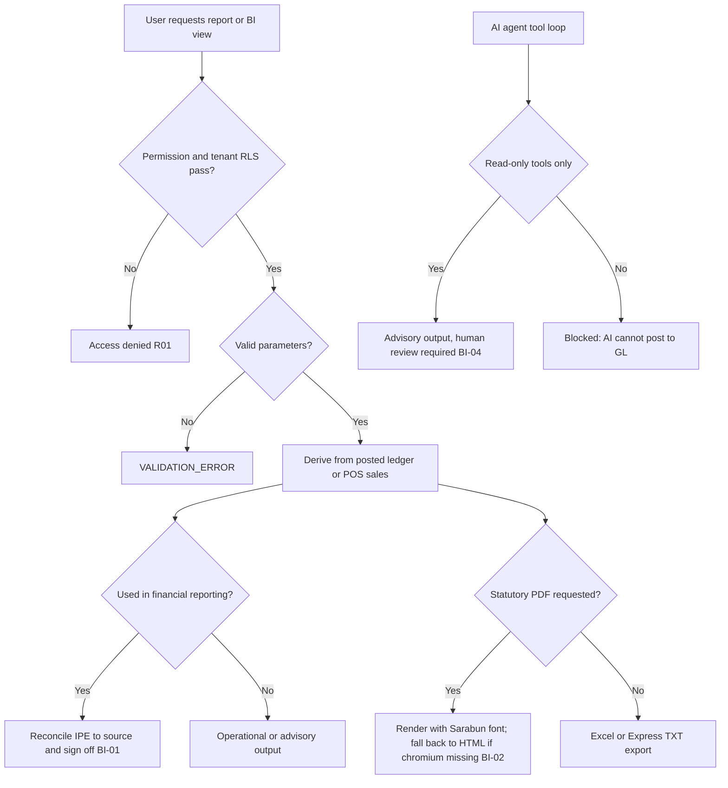

# Process Narrative — Reporting, BI & AI

> **Status: DRAFT v0.1** — contains `<<placeholders>>` pending owner confirmation.

## 1. Document Control

| Field | Value |
|---|---|
| Process ID | PN-26-BI |
| Process owner | `<<Controller / FP&A / IT>>` |
| Approver | `<<approver-name / title>>` |
| Version | **0.1 DRAFT** |
| Revision date | 2026-06-22 |
| Effective date | `<<effective-date>>` |
| Review cadence | Annual + on significant change |
| Related RCM controls | BI-01, BI-02, BI-03, BI-04; cross-ref ITGC-01; SoD rule R01 |
| Related policy | `<<Information Produced by the Entity (IPE) Policy>>`, `<<Reporting & Disclosure Procedure>>`, `<<AI / Analytics Use Policy>>`, `<<Access Control Policy>>` |

## 2. Purpose

This narrative documents the reporting, business-intelligence (BI) and AI/analytics layer. Its overriding theme is **IPE — Information Produced by the Entity: completeness and accuracy**. Reports relied upon for management decisions or financial statements must be complete and accurate, must reconcile to their source ledger, and must be access-controlled and tenant-scoped. Statutory PDF documents (tax invoices, receipts) carry an additional accuracy and numbering control, and AI/analytics outputs are constrained to a **read-only, advisory** boundary — they cannot post to the GL and are not authoritative for financial statements.

## 3. Scope

**In scope**
- Operational and financial reports + Excel/PDF/Express exports (reports, `/api/reports`, `/api/orders/:orderNo/export`).
- BI dashboards, sales cube, finance trend, pipeline trend, snapshots and report subscriptions (bi, `/api/bi`).
- Analytics — replenishment, anomaly detection, insights, dashboard summary (analytics, `/api/analytics`).
- The AI agent (ai, `agent.service`) — tool-based, read-only, advisory.

**Out of scope**
- The general-ledger close and trial-balance production that these reports reconcile to — see `04-general-ledger-close.md`.
- Statutory tax-document content and numbering authority — see `06-tax-compliance.md`.
- Access provisioning, RLS and IT general controls — see `08-itgc.md`.

## 4. References

- ISO 9001:2015 cl. 4.4 (QMS and its processes); cl. 8.5.1 (Control of provision); cl. 8.6 (Release of products and services — report sign-off).
- Risk & Control Matrix: `compliance/Oshinei_ERP_SOX_RCM_v1.xlsx`.
- Segregation-of-Duties matrix: `compliance/Oshinei_ERP_SoD_Matrix_v1.xlsx`.
- Policies: `<<IPE Policy>>`, `<<Reporting & Disclosure Procedure>>`, `<<AI / Analytics Use Policy>>`, `<<Access Control Policy>>`.
- Code:
  - `apps/api/src/modules/reports/reports.controller.ts`, `reports.service.ts`, `reports-excel.service.ts`, `reports-pdf.service.ts`, `reports-export.service.ts`
  - `apps/api/src/modules/bi/bi.controller.ts`, `bi.service.ts`
  - `apps/api/src/modules/analytics/analytics.controller.ts`, `analytics.service.ts`, `anomalies.service.ts`, `forecasting.service.ts`
  - `apps/api/src/modules/ai/agent.service.ts`

## 5. Definitions & Abbreviations

| Term | Definition |
|---|---|
| IPE | Information Produced by the Entity — a report/extract used in a control or decision, requiring evidenced completeness & accuracy. |
| Daily-sales report | POS sales for a date, as JSON or Excel (xlsx). |
| Monthly P&L | Profit-and-loss export by month/year (Excel). |
| AP aging | Open payables bucketed: Current / 1-30 / 31-60 / 61-90 / 90+. |
| Express export | Fixed-width TXT for Express accounting, with baht amount-in-words and CRLF line endings. |
| Sarabun | Thai font used in the PDF templates. |
| Sales cube | Aggregation of `custPosSales` by period (day/week/month). |
| Finance trend | `journal_lines` aggregated by period and account type (revenue/expense/gross profit), per ledger; default leading ledger (TFRS). |
| Snapshot | A refreshed BI point-in-time dataset. |
| Z-score | Standardised deviation used to flag stock-movement anomalies (threshold 2.5; critical 3.5). |
| Reorder point | `avg_daily_sales × lead_time_days + stdev_daily × 1.5` (safety stock). |
| Advisory | Decision-support output requiring human review; not authoritative for financial reporting. |
| RLS | Row-Level Security (tenant isolation). |
| SoD | Segregation of Duties. |

## 6. Roles & Responsibilities (RACI)

The defining SoD rule here is **R01** (access): report and BI access is JWT-scoped to permissions (`dashboard`, `pos`, `exec`, `warehouse`, `creditors`, `planner`, `order_mgt`) and tenant-isolated by RLS. The reviewer/owner who signs off an IPE used in financial reporting must validate its reconciliation to source. The AI agent operates only read-only tools and cannot post — a control boundary, not a duty performer.

| Activity | Report Consumer | Controller / FP&A | IT / Platform | Reviewer | AI Agent |
|---|---|---|---|---|---|
| Run report / export (gated) | R | A | C | I | I |
| Reconcile IPE to source ledger | I | A/R | I | C | I |
| Generate statutory PDF (invoice/receipt) | R | A | C | C | I |
| Validate report parameters | R | C | I | I | I |
| Operate analytics / anomaly review | R | A | I | C | I |
| Invoke AI tools (read-only, advisory) | R | C | A | C | R (read-only) |

A = Accountable, R = Responsible, C = Consulted, I = Informed.

## 7. Process Narrative

1. **Operational & financial reports (perm `dashboard`/`pos`/`exec`/`warehouse`/`creditors`).** `GET /api/reports/daily-sales?date=` returns POS sales (JSON); `GET /api/reports/daily-sales/export` produces Excel xlsx; `GET /api/reports/monthly-pl/export?month=&year=` produces the Excel P&L; `GET /api/reports/stock-summary/export` and `GET /api/reports/ap-aging/export` (buckets Current / 1-30 / 31-60 / 61-90 / 90+) produce their xlsx. A bad month/year on the P&L returns `VALIDATION_ERROR` (400). *Control: BI-01 — report completeness & accuracy (IPE); BI-03 — parameter validation.*

2. **Per-order export — PDF / Express (perm `order_mgt`/`pos`).** `POST /api/orders/:orderNo/export` with `{ format: 'pdf' | 'express_txt' }`. PDF renders HTML to PDF via Playwright/chromium using the Sarabun Thai font; templates include `taxInvoiceHtml` (ใบกำกับภาษี), `receiptHtml` (ใบเสร็จรับเงิน), `salesConfirmationHtml` and `statementHtml`. If chromium is unavailable the renderer returns null and the caller **falls back to HTML**. Express export is a fixed-width TXT for Express accounting, with baht amount-in-words (`bahttext`) and CRLF line endings. An unknown order returns `NOT_FOUND`; a bad format returns `VALIDATION_ERROR`. *Control: BI-02 — PDF tax invoices/receipts are statutory documents; their accuracy & numbering are governed (cross-ref `06-tax-compliance.md`).*

3. **BI dashboards & KPI (perm `exec`).** `GET /api/bi/kpi` returns MTD/YTD sales, open AR/AP and weighted pipeline. *Operational; values derive from posted ledger / POS sales.*

4. **Sales cube & finance trend (perm `exec`).** `GET /api/bi/sales-cube?period=day|week|month` aggregates `custPosSales`. `GET /api/bi/finance-trend?months=&ledger=` aggregates `journal_lines` by period and account type (revenue / expense / gross profit), multi-ledger with the default leading ledger (TFRS). Both are **derived from the posted ledger / POS sales**, so their accuracy depends on source completeness. *Control: BI-01 — finance-trend/P&L tie to trial balance; daily-sales/cube tie to the POS journal.*

5. **Pipeline trend, snapshots & subscriptions (perm `exec`).** `GET /api/bi/pipeline-trend`; `POST /api/bi/snapshots/refresh` and `GET /api/bi/snapshots`; report subscriptions CRUD (`GET`/`POST`/`DELETE /api/bi/subscriptions`). *Operational.*

6. **Analytics — replenishment (perm `planner`/`dashboard`/`warehouse`).** `GET /api/analytics/replenishment` returns items with urgency critical/warning; reorder point = `avg_daily_sales × lead_time_days + stdev_daily × 1.5`, with `days_of_stock` and predicted stockout. *Operational / advisory.*

7. **Analytics — anomalies (perm `planner`/`dashboard`/`exec`).** `GET /api/analytics/anomalies?days=` flags stock-movement anomalies by Z-score (threshold 2.5; critical 3.5) and stocktake variance. *Operational / advisory — investigation input, not an authoritative posting.*

8. **Analytics — insight & dashboard summary.** `POST /api/analytics/insight` and `GET /api/analytics/dashboard-summary` provide decision-support summaries. *Operational / advisory.*

9. **AI agent (read-only, advisory).** A tool-based loop (max 15 turns) exposes a fixed set of **read-only** tools (sales summary, recent orders, stock levels/item, P&L, KPI dashboard/board, accounts payable, replenishment, sales cube, finance trend, pipeline forecast, open opportunities, open quotes, SLA breaches, profitability). Responses can stream; LLM insights are produced via Claude with a **rule-based Thai fallback** when no API key is configured. The AI tools are **read-only — they cannot post to the GL**: this is the control boundary. Forecasts, anomalies and AI insights are advisory decision-support and require human review; they are not authoritative for financial statements. *Control: BI-04 — AI read-only & advisory boundary.*

10. **IPE & access boundary.** Every report and BI endpoint is permission-gated and tenant-scoped by RLS. Anything used in financial reporting must carry the IPE completeness-and-accuracy control: reconcile to source, evidence the parameters, and have a human owner sign off. *Control: BI-01 / R01; ITGC scoping per `08-itgc.md`.*

## 8. Process Flow

**Swimlane narrative.** The *Report Consumer* lane requests reports and exports, gated by permission and RLS under R01. The *Controller / FP&A* lane is accountable for reconciling any IPE used in financial reporting to its source ledger (finance-trend/P&L to trial balance; daily-sales/cube to the POS journal) and signing off. The *IT / Platform* lane operates the rendering and AI infrastructure and enforces the read-only AI boundary. The *Reviewer* lane validates anomaly/forecast outputs as advisory only. The *AI Agent* invokes read-only tools and can never post to the GL.

## 9. Control Matrix

| Step | Risk | Control | Type | RCM ID | Evidence / Record |
|---|---|---|---|---|---|
| 1, 4, 10 | Incomplete / inaccurate report relied upon (IPE) | Reports reconcile to source ledger — finance-trend/P&L to trial balance, daily-sales to POS journal; owner sign-off | Detective | BI-01 | Reconciliation working papers; sign-off |
| 2 | Statutory PDF (tax invoice/receipt) inaccurate or mis-numbered | Statutory templates governed; accuracy & numbering controlled (cross-ref `06-tax-compliance.md`) | Preventive | BI-02 | Issued documents; numbering register |
| 1, 2 | Invalid report parameters produce misleading output | Parameter validation (`VALIDATION_ERROR` on bad month/year/format) | Preventive | BI-03 | Validation rejection log |
| 9 | AI/analytics output treated as authoritative or able to post | AI tools read-only; advisory boundary; human review of forecasts/anomalies | Preventive | BI-04 | Tool-definition (read-only); review notes |
| 3-8, 10 | Cross-tenant or unauthorised report access | Permission gating + RLS tenant isolation on all endpoints | Preventive | ITGC-01 / R01 | Access logs; RLS policy (cross-ref `08-itgc.md`) |

## 10. Inputs & Outputs

**Inputs:** posted `journal_lines` and `custPosSales`; report parameters (date, month/year, period, ledger, days); order and tenant master for PDF/Express; user JWT (tenant + permissions); optional LLM API key.

**Outputs:** JSON/Excel reports (daily-sales, monthly P&L, stock summary, AP aging); statutory PDFs (tax invoice, receipt, sales confirmation, statement) or HTML fallback; Express fixed-width TXT; BI KPI/cube/finance-trend/pipeline datasets and snapshots; analytics replenishment/anomaly/insight outputs; AI advisory responses. Any output used in financial reporting is an IPE requiring the completeness-and-accuracy control.

## 11. Records & Retention

| Record | Retention |
|---|---|
| Financial reports & IPE reconciliations (P&L, AP aging, daily-sales) | `<<7 years / per Thai law>>` |
| Statutory PDF documents (tax invoice / receipt) | `<<7 years / per Thai law>>` |
| Express export files | `<<7 years / per Thai law>>` |
| BI snapshots, subscriptions & dashboards | `<<retention per policy>>` |
| Analytics / AI advisory outputs & review notes | `<<retention per policy>>` |

## 12. KPIs / Metrics

- IPE reconciliation differences — finance-trend/P&L to trial balance; daily-sales to POS journal (target: 0).
- Statutory PDF accuracy / numbering exceptions (target: 0).
- Report parameter validation rejection rate.
- PDF render fallback-to-HTML rate (chromium availability).
- AI tool-boundary violations — any attempt to post (target: 0); proportion of AI outputs human-reviewed before use.

## 13. Exception & Error Handling

| Error code | Trigger | Handling |
|---|---|---|
| VALIDATION_ERROR (400) | Bad month/year on P&L export, or unsupported export format | Reject; supply valid parameters (BI-03). |
| NOT_FOUND | Per-order export for an unknown order | Reject; verify order number. |
| Chromium unavailable | PDF renderer returns null | Caller falls back to HTML; statutory-PDF control still applies on re-issue (BI-02). |
| No API key | AI agent invoked without LLM credentials | Rule-based Thai fallback message returned; no failure of the stream. |
| Access denied | Permission/RLS check fails | Block; report access is gated and tenant-scoped (R01, cross-ref `08-itgc.md`). |

## 14. Revision History

| Version | Date | Author | Notes |
|---|---|---|---|
| 0.1 DRAFT | 2026-06-22 | `<<author>>` | Initial draft. |
